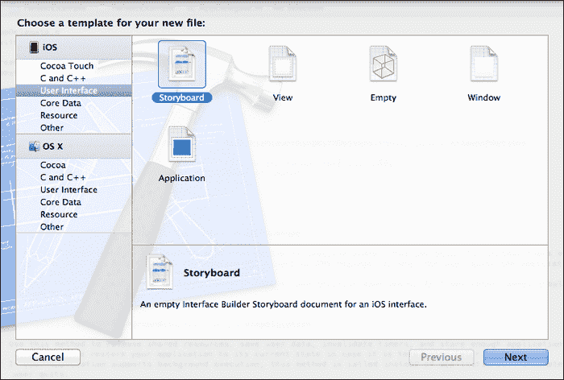

# 第三章。使用 Storyboards

在本章中，我们将介绍：

+   为项目配置故事板

+   创建 Twitter 应用程序

+   创建故事板场景

+   配置故事板场景

+   将转换应用到故事板

+   配置推文

+   向推文中添加照片

+   准备转换到另一个视图控制器

+   以编程方式呈现故事板视图控制器

# 简介

从 Xcode 4.2 和 iOS 5 的发布开始，开发者和设计师现在可以使用 Xcode 中作为 XIB 编辑器一部分的新故事板功能来布局他们应用程序的工作流程。

而不是创建大量的界面文件，你现在可以开始在一个地方拖动并编辑所有视图，同时可以指定屏幕之间的转换以及触发它们的关联动作。

在本章中，我们将了解故事板实际上是什么，以及它们为什么需要 iOS 5 或更高版本，并熟悉 Xcode 中 XIB 编辑器内实施的新工作流程。

# 为项目配置故事板

## 准备工作

在这个菜谱中，我们将学习如何使用 Xcode 配置应用程序的项目属性，以便正确设置以使用故事板文件。

## 如何操作...

要开始，请执行以下简单步骤：

1.  从项目导航器窗口中选择你的项目。

1.  然后，从 **TARGETS** 组下选择你的项目目标，并选择 **摘要** 选项卡。

1.  从 **主故事板** 下拉菜单中选择 **MainStoryboard**，如前图所示。

## 它是如何工作的...

在这个菜谱中，我们了解了什么是故事板，以及它们与过去创建的用户界面有何不同，即对于你的应用程序中的每个 XIB 文件，都需要创建一个新的视图。

不论你是为 iPad 还是 iPhone 创建应用程序，你的故事板中创建的每个视图控制器都代表单个屏幕的内容，由多个场景的内容组成。

视图控制器中包含的每个对象都可以链接到实现另一个场景的另一个视图控制器。

在我们的最后几步中，我们查看如何配置项目属性，以便应用程序设置以使用故事板用户界面文件。

## 还有更多…

你也可以选择手动将新的 **Storyboard** 模板添加到你的项目中。这可以通过执行以下简单步骤实现：

1.  从项目导航器窗口中选择你的项目。

1.  选择 **文件** | **新建** | **文件…** 或按 *command* + *N*。

1.  从 **iOS** 部分下的 **用户界面** 子部分中选择 **Storyboard** 模板，如前图所示。

1.  点击 **下一步** 按钮继续到向导的下一步。

1.  确保你已从 **设备家族** 下拉菜单中选择 **iPhone**。

1.  点击 **下一步** 按钮继续向导的下一步。

1.  在 **另存为** 字段中指定故事板文件的名称，即为要创建的文件命名。

1.  点击 **创建** 按钮将文件保存到指定的文件夹。

1.  最后，当我们使用故事板创建项目时，我们需要修改应用程序的代理文件 `AppDelegate.m`，如下代码片段所示：

    ```swift
    - (BOOL)application:(UIApplication *)application didFinishLaunchingWithOptions:(NSDictionary *)launchOptions
    {
    // Override point for customization after 
    // application launch.
    return YES;
    }
    ```

    ### 注意

    关于在应用程序中使用故事板的更多信息，你可以参考位于 [`developer.apple.com/library/ios/#documentation/ToolsLanguages/Conceptual/Xcode4UserGuide/InterfaceBuilder/InterfaceBuilder`](https://developer.apple.com/library/ios/#documentation/ToolsLanguages/Conceptual/Xcode4UserGuide/InterfaceBuilder/InterfaceBuilder) 的 Apple 开发者文档。

## 参见

+   *创建 Twitter 应用程序* 菜谱

+   *创建故事板场景* 菜谱

+   在第二章（用户界面 – 创建 UI

1.  接下来，将一个 **标签** 控件拖到视图中，并将标签的文本属性更改为 **关于 Twitter 应用**。

1.  接下来，将一个 **圆形矩形按钮** 控件拖到我们将在后续部分中用于调用调用视图的视图中。在按钮的属性中，将文本更改为 **返回**。

1.  接下来，在第一个视图控制器上，将一个 **圆形矩形按钮** 控件拖到视图中。在按钮的属性中，将文本更改为 **关于 Twitter 应用**。这将用于调用我们上一步添加的新视图。

1.  接下来，在第一个视图控制器上，将一个 **圆形矩形按钮** 控件拖到视图中，位于我们上一步创建的 **关于 Twitter 应用** 按钮下方。在按钮的属性中，将文本更改为 **撰写推文**。

1.  接下来，通过选择菜单栏中的 **文件** | **保存** 或按 *command* + *S* 保存你的项目。

一旦你将控件添加到每个视图，你的最终界面应该看起来像下面屏幕截图所示：


### 注意

如果你想要刷新如何创建动作的记忆，这些在 第一章 的 *创建响应用户动作的动作* 配方中进行了讨论，*获取和安装 iOS SDK 开发工具*。

下一步是为我们的 **撰写推文** 按钮创建 `Action` 事件，以便它能够发布推文。要创建一个动作，请执行以下步骤：

1.  通过选择 **导航** | **在辅助编辑器中打开** 或按 *option* + *command* + *,* 打开辅助编辑器。

1.  确保显示 `ViewController.h` 接口文件。

1.  选择**Compose Tweet**按钮；按住*控制*键，并将其从**Compose Tweet**按钮拖动到`ViewController.h`接口文件中的`@interface`和`@end`标签之间。

1.  从**连接**下拉菜单中选择要创建的连接**Action**。

1.  为要创建的函数命名`composeTweet`。

1.  从**类型**下拉菜单中选择要创建的函数类型**UIButton**。

在以下代码片段中高亮显示的行显示了完成的`ViewController.h`接口文件，其中包含我们将负责调用和显示我们的推文表的函数。

```swift
//  ViewController.h
//  TwitterExample
//
//  Created by Steven F Daniel on 21/09/12.
//  Copyright (c) 2012 GenieSoft Studios. All rights reserved.

#import <UIKit/UIKit.h>

@interface ViewController : UIViewController

// Create the action methods
- (IBAction)composeTweet:(UIButton *)sender;

@end
```

现在我们已经创建了场景、按钮和动作，我们的下一步是配置场景，这将在下一个配方中展示。

## 它是如何工作的...

在这个配方中，我们研究了如何向我们的故事板添加新的视图控制器，然后开始向每个视图控制器添加控件并自定义它们的属性。

接下来，我们研究了如何为我们的**Compose Tweet**按钮创建一个`Action`事件，该事件将负责响应并执行其背后的相关代码以显示我们的推文表。

我们没有将事件处理程序连接到按钮的`TouchUpInside`事件，而是决定简单地给它添加一个动作，并自行处理输出。这类动作被称为“实例方法”。在这里，我们基本上创建了一个`Action`方法，它将负责允许用户编写并发送 Twitter 消息。

## 参见

+   *配置故事板场景*配方

+   *将转场应用到故事板中*配方

+   *准备过渡到另一个视图控制器*配方

+   *以编程方式呈现故事板视图控制器*配方

+   创建与 Interface Builder 对象接口的出口中的*创建与 Interface Builder 对象接口的出口*配方，*获取和安装 iOS SDK 开发工具*

# 配置故事板场景

当你想从一个视图控制器过渡到另一个视图控制器时，你可以按住*控制*键并点击一个按钮、表格视图单元格或任何其他对象，然后将其拖动到新视图控制器以创建不同的场景。这种在视图控制器之间拖动的技术创建了一个所谓的转场。

**转场**是一个可配置的对象，它支持在`UIKit`类参考中提供的所有类型的转场，例如模态转场和导航转场。

## 准备工作

你还有能力定义自定义转场，用另一个视图控制器替换一个视图控制器。

## 如何操作…

为了了解如何实现这一点，我们需要修改我们在之前的配方中创建的**TwitterExample**应用程序。执行以下步骤：

1.  选择“关于 Twitter 应用”(`圆形矩形按钮`)控件，然后按住*控制*键，将其拖动到包含“返回”按钮的视图控制器。

1.  释放鼠标按钮，然后从“操作转场”弹出菜单中选择“模态”选项。

    你会注意到一个灰色箭头连接了你的两个视图控制器。当按下“关于 Twitter 应用”按钮时，它将显示包含“返回”按钮的页面。

1.  接下来，我们需要对我们第二个视图做同样的操作，以便当按下“返回”按钮时，它将返回到我们的第一个视图。

1.  重复步骤 1 到 2，但将“返回”按钮替换为“关于 Twitter 应用”按钮。

以下表格包含了 Xcode 4 中包含的故事板转场的解释：

| 转场名称 | 描述 |
| --- | --- |
| **模态** | 模态视图控制器不是`UIViewController`类的一个特定子类，因为任何类型的视图控制器都可以通过你的应用程序以模态方式呈现。然而，就像标签栏和导航视图控制器一样，当你想要传达前一个视图层次结构和新呈现的视图层次结构之间的特定含义时，你可以以模态方式呈现你的视图控制器。 |
| **推送** | **推送**转场允许你将一个新的视图控制器推送到导航堆栈中，就像你堆叠盘子一样。堆栈顶部的视图是渲染的视图。 |
| **自定义** | 这些允许你使用`prepareForSegue`方法自定义并从代码中调用视图控制器，是你用来呈现应用程序内容的方式。视图控制器的工作是管理某些内容的呈现，并协调该内容与应用程序底层数据对象的更新和同步。在**自定义**视图控制器的情况下，这涉及到创建一个视图来呈现内容，并实现将那个视图的内容与你的应用程序数据结构同步所需的基础设施。 |

完成这些操作后，你的视图控制器应该看起来像以下屏幕截图所示。你可以为每个视图控制器应用多种过渡，以便它们在显示到视图时执行动画。


要了解如何将过渡应用到你的视图控制器中，请参考本章中关于过渡的“将过渡应用到故事板”配方。

现在你已经将每个 segues 应用到两个视图控制器上，我们的最后一步是编译、构建和运行我们的应用程序。

从**产品**菜单中选择**运行**。或者，你可以按*command* + *R*键来编译、构建和运行应用程序。

以下屏幕截图显示了我们的应用程序在 iOS 模拟器中运行，以及它们各自关联的屏幕显示：


## 工作原理...

所以，这就是全部内容。在这个菜谱中，我们学习了如何创建并将新场景添加到我们的主故事板中，以及如何通过使用 segues 来链接这些场景并在按钮按下时配置每个场景的过程。

还有另一种方法，我们可以通过编程方法将场景过渡到我们的故事板中。当我们开始本章的 *以编程方式呈现故事板视图控制器* 菜谱时，我们将更深入地探讨这一点。

## 相关内容

+   *将过渡应用到故事板* 菜谱

+   *准备过渡到另一个视图控制器* 菜谱

+   *以编程方式呈现故事板视图控制器* 菜谱

# 将过渡应用到故事板

在这个菜谱中，我们将探讨如何将过渡动画应用到视图上，以及与故事板一起提供的所有可用过渡。

## 准备工作

您可能已经在应用程序中看到过这样的过渡，例如 iPhone 和 iPad 中包含的照片应用，您可以在其中应用过渡并开始幻灯片放映。

## 如何操作…

为了配置 segues 以指定在不同场景之间使用的一种过渡，请执行以下简单步骤：

1.  点击以下截图中的大圆圈所示的第一视图控制器的 segues 链接。

1.  点击 **属性检查器**，然后点击 **过渡** 下拉菜单。

您可以选择仅适用于 **Modal** 风格的各种过渡类型；这些类型在以下表格中解释：

| 过渡名称 | 描述 |
| --- | --- |
| **默认** | 当选择此过渡时，它使用 **垂直覆盖** 过渡样式。 |
| **垂直覆盖** | 当视图控制器呈现时，其视图从屏幕底部向上滑动。当视图消失时，它滑回底部。 |
| **水平翻转** | 当视图控制器呈现时，当前视图从右侧开始水平 3D 翻转至左侧，从而揭示新视图，仿佛它位于前一个视图的背面。当此视图消失时，翻转从左侧开始至右侧，返回到原始视图。 |
| **交叉溶解** | 当视图控制器呈现时，当前视图淡出，同时新视图同时淡入。当视图消失时，使用类似类型的交叉淡入淡出返回到原始视图。 |
| **部分卷曲** | 当视图控制器呈现时，当前视图的一个角落卷曲起来以显示下面的模态视图。当视图被取消时，卷曲的页面会自己展开回到模态视图的顶部。使用此过渡方式呈现的模态视图本身被阻止呈现任何额外的模态视图。此过渡样式仅在父视图控制器呈现全屏视图且您使用 `UIModalPresentationFullScreen` 模态呈现样式时才受支持。尝试使用不同的父视图形式因子或不同的呈现样式将触发异常。 |

这些过渡是作为从 `UIKit` 框架继承的 `UIViewController` 类的一部分提供的。`UIViewController` 类为您的所有 iOS 应用提供了基本的视图管理模型。

### 注意

更多关于前面提到的切换类型的信息，请参考 Apple 开发者文档中的 `UIViewController` 框架参考，位于 [`developer.apple.com/library/ios/#documentation/uikit/reference/UIViewController_Class/Reference/Reference.html`](https://developer.apple.com/library/ios/#documentation/uikit/reference/UIViewController_Class/Reference/Reference.html)。

## 它是如何工作的...

Xcode 提供了在故事板中从一个场景到另一个场景改变过渡视觉效果的选择。这些通常被称为切换。

使用切换可以使您为要渲染和显示到视图中的每个视图控制器应用不同的样式，并且由视图控制器之间的箭头表示。默认情况下，执行的是 **覆盖垂直** 切换，其中新场景从视图底部垂直滑动到顶部覆盖当前显示的场景。

您有权定义自定义切换，这使您能够提供一个自定义切换类方法来处理切换。这可以通过选择切换的 **自定义** 样式，并填写要使用的自定义切换类名称来实现。如果您想使用任何标准切换类，您可以在 `UIKit` 类中找到这些类。

### 注意

关于标准切换类的信息，您可以参考 Apple 开发者文档中的 `UIKitframework` 参考信息，位于 [`developer.apple.com/library/ios/#documentation/uikit/reference/UIKit_Framework/_index.html`](https://developer.apple.com/library/ios/#documentation/uikit/reference/UIKit_Framework/_index.html)。

## 参见

+   *准备过渡到另一个视图控制器* 的配方

+   *以编程方式呈现故事板视图控制器* 的配方

# 编写推文

在这个配方中，我们将探讨如何使用 iOS 5 的 Twitter API 并有效地与之交互。

## 准备工作

Twitter 为我们提供了一些非常简单的 API 来遵循，使其与它们交互变得非常简单。在本教程中，我们将探讨如何使用这些 API 通过 Twitter 组合表发布推文。

## 如何做到这一点...

为了在您的应用程序中使用 Twitter，我们需要将 Twitter 框架添加到您的项目中。这可以通过执行以下简单步骤实现：

1.  在项目导航器中选择您的项目。

1.  然后，从**目标**组下选择你的项目目标。

1.  选择**构建阶段**选项卡。

1.  展开**链接二进制库**展开箭头。点击**+**按钮，从列表中选择**Twitter.framework**。

1.  最后，点击**添加**按钮将框架添加到您的项目中。

我们下一步是创建负责将我们的推文发布到 Twitter 的代码功能：

1.  从项目导航器打开`ViewController.m`实现文件。

1.  输入以下`import`语句：

    ```swift
    #import <Twitter/Twitter.h>

    ```

1.  接下来，修改`composeTweet`方法，如下面的代码片段所示：

    ```swift
    - (IBAction)composeTweet:(id)sender {

      TWTweetComposeViewController *myTwitter = 
    [[TWTweetComposeViewController alloc] init];

    BOOL isSUCCESS = TWTweetComposeViewController.canSendTweet;
      if (isSUCCESS == YES)
      {
        [myTwitter setInitialText:@"Welcome to Twitter API."];
        [self presentModalViewController:myTwitter 
    animated:YES];

        // Retrieve the result of the Twitter handler to 
          // determine if the message was successfully sent.
        myTwitter.completionHandler = 
    ^(TWTweetComposeViewControllerResult res)
          {
        if (res == TWTweetComposeViewControllerResultDone) 
    {
          UIAlertView *alertView = [[UIAlertView alloc] 
    initWithTitle:@"Success" message:@"Your tweet was 
    posted successfully." delegate:self 
    cancelButtonTitle:@"OK" otherButtonTitles:nil];
          [alertView show];
          [self dismissModalViewControllerAnimated:YES];
        }
        else if (res == 
    TWTweetComposeViewControllerResultCancelled) {
            UIAlertView *alertView = [[UIAlertView alloc] 
    initWithTitle:@"Error" message:@"Tweet not 
    posted." delegate:self cancelButtonTitle:@"OK" 
    otherButtonTitles:nil];
            [alertView show];
          [self dismissModalViewControllerAnimated:YES];
          }
        };
      }
    }
    ```

## 工作原理...

从 iOS 5 开始，每次您想要提交 Twitter 消息时，都需要使用`TWTweetComposeViewController`类实例。`TWTweetComposeViewController`类处理所有事情，并显示推文组合表，以便我们可以开始输入我们的推文。

`TWTweetComposeViewController`类还允许您设置要使用的初始 Twitter 文本信息，包括如何添加图片和 URL。接下来，我们声明了一个`myTwitter`变量，指向我们的`TWTweetComposeViewController`类的一个实例。

然后，我们使用了`TWTweetComposeViewController`类的`canSendTweet`类方法来检查用户是否正确安装并设置了 Twitter。如果没有这样做，这个语句将失败，并将返回一个`NO`（或`FALSE`）值给`isSuccess`变量。

接下来，我们通过设置`setInitialText`方法将一些文本分配到我们的组合表格中，并将其显示到视图中。最后，我们设置了一个处理程序，使用`completionHandler`方法在用户完成撰写推文时通知我们，并根据方法返回的结果显示相关的警告信息。

### 注意

关于`TWTweetComposeViewController`类的更多信息，您可以参考位于[`developer.apple.com/library/ios/#documentation/Twitter/Reference/TWTweetSheetViewControllerClassRef/Reference/Reference.html`](https://developer.apple.com/library/ios/#documentation/Twitter/Reference/TWTweetSheetViewControllerClassRef/Reference/Reference.html)的 Twitter 框架参考文档。

## 更多内容...

随着 iOS 6 的发布，社交网络的集成是通过使用`UIActivityViewController`类，或者 iOS 6 SDK 中包含的新社交框架的类来实现的。对于通用社交网络集成，推荐使用`UIActivityViewController`类。

当使用此类时，用户将看到一个屏幕，提供社交网络服务的选择。一旦应用程序选择了目标服务，该类随后将向用户展示一个空白消息预览面板，用户可以在其中查看消息然后发布。

接下来，我们将探讨`UIActivityViewController`和`SLComposeViewController`这两个类，看看它们各自的不同之处。

### 使用 UIActivityViewController 类

`UIActivityViewController`类是在准备将帖子发布到社交网络时在应用程序中实例化的。以下代码片段展示了如何使用`UIActivityViewController`类来处理发布到 Twitter 的帖子：

```swift
NSString *postText = @"My first Twitter Post from iOS 6";
NSArray *activityItems = @[postText];

UIActivityViewController *activityController = [[UIActivityViewController alloc] initWithActivityItems:activityItems applicationActivities:nil];

[self presentViewController:activityController animated:YES completion:nil];
```

前面的代码片段实例化了一个新的`UIActivityViewController`实例，并将要包含在对话框中的文本传递给用户。有一个选项可以包含与帖子一起的图片，我们将在稍后探讨这一点。

当用户决定在应用程序内执行发布更新操作时，将显示以下屏幕：


一旦从选择列表中选择了一个目标社交网络，将显示一个预览表单。如果用户尚未在**设置**应用程序中为所选社交网络配置账户，将出现一个对话框，提示用户设置账户或简单地取消发布。

### 注意

关于`UIActivityViewController`类的更多信息，您可以参考位于[`developer.apple.com/library/ios/#documentation/UIKit/Reference/UIActivityViewController_Class/Reference/Reference.html`](https://developer.apple.com/library/ios/#documentation/UIKit/Reference/UIActivityViewController_Class/Reference/Reference.html)的 Apple 开发者参考文档。

### 使用 SLComposeViewController 类

为了使用`SLComposeViewController`类，需要执行一系列步骤。首先，我们需要验证消息是否可以发送到特定的社交网络服务，以确保设备已正确配置以使用该特定服务。

这是通过将服务类型作为参数传递给`isAvailableForserviceType`方法来实现的，如下面的代码片段所示：

```swift
if ([SLComposeViewController isAvailableForServiceType:SLServiceTypeTwitter]) {
      // Device has been set up to use Twitter
}
```

`isAvailableForServiceType`方法接受以下参数：

+   `SLServiceTypeFacebook`

+   `SLServiceTypeTwitter`

+   `SLServiceTypeSinaWeibo`

下一步是创建一个`SLComposeViewController`类的实例，并提供一个可选的完成处理程序，当用户取消编辑表单或使用它来发送消息时将被调用。最后，当消息准备好向用户展示时，通过调用父视图控制器的`presentViewController`方法，以模态方式展示`SLComposeViewController`对象。

以下代码片段展示了如何配置和展示用于发布到 Twitter 的`SLComposeViewController`类实例：

```swift
SLComposeViewController *composeController = [SLComposeViewController
composeViewControllerForServiceType:SLServiceTypeTwitter];

[composeController setInitialText:@"Posting using Twitter"];
[composeController addURL: [NSURL URLWithString:
@"http://www.packtpub.com/xcode-4-cookbook/book/"]];

[self presentViewController:composeController
               animated:YES completion:nil];
```

上述代码片段展示了如何使用方法调用预配置默认文本的 Twitter 编辑表单。完成处理程序可以设置以返回一个值，指示用户在编辑表单视图中采取的操作。这些值在以下表中解释：

| 编辑表单值 | 描述 |
| --- | --- |
| `SLComposeViewControllerResultCancelled` | 用户通过触摸**取消**按钮取消了编辑会话。 |
| `SLComposeViewControllerResultDone` | 用户通过触摸**发送**按钮发送了编辑好的消息。 |

iOS 6 附带的社会框架类包含两个类，这些类被设计用来提供更多关于社交网络集成的灵活性。

与`UIActivityViewController`类不同，`SLComposeViewController`类允许您在应用代码中向特定的社交网络服务发布消息，而无需用户从可用服务列表中进行选择。

用户随后会看到一个适合应用已设置的具体服务的预览表单。在您的应用中使用社交框架非常简单，可以通过执行以下简单步骤实现：

1.  将**Social.framework**添加到项目中，就像我们添加**Twitter.framework**一样。

1.  从项目导航器打开`ViewController.m`实现文件。

1.  输入以下导入语句：

    ```swift
    #import <Social/Social.h>

    ```

1.  接下来，修改`composeTweet`方法，如下面的代码片段所示：

    ```swift
    - (IBAction)composeTweet:(id)sender {

      if ([SLComposeViewController 
    isAvailableForServiceType:SLServiceTypeTwitter])
      {
      // Device is able to send a Twitter message
      SLComposeViewController *composeController = 
    [SLComposeViewController
    composeViewControllerForServiceType:SLServiceTypeTwitter];

      SLComposeViewControllerCompletionHandler 
        __block myHandler = 
    ^(SLComposeViewControllerResult result) {
          if (result == SLComposeViewControllerResultDone) {
            UIAlertView *alertView = [[UIAlertView alloc] 
    initWithTitle:@"Twitter"
      message:@"Yourtweet was posted successfully."
    delegate:self
    cancelButtonTitle:@"OK"
    otherButtonTitles:nil];
            [alertView show];
          }
          else if (result == 
    SLComposeViewControllerResultCancelled) {
            UIAlertView *alertView = [[UIAlertView 
    alloc] initWithTitle:@"Twitter"
      message:@"Your Tweet was not posted."
    delegate:self
    cancelButtonTitle:@"OK"
    otherButtonTitles:nil];
            [alertView show];
          }
          [composeController dismissViewControllerAnimated:YES 
    completion:nil];
        };

        [composeController setCompletionHandler:myHandler];
        [composeController setInitialText:@"Welcome to iOS 6"];
        [composeController addURL: [NSURL URLWithString:
      @"http://www.packtpub.com/xcode-4-cookbook/book/"]];

        [self presentViewController:composeController
                   animated:YES completion:nil];
      }
    }
    ```

    ### 注意

    关于`SLComposeViewController`类的更多信息，您可以参考位于[`developer.apple.com/library/ios/#documentation/NetworkingInternet/Reference/SLComposeViewController_Class/Reference/Reference.html`](https://developer.apple.com/library/ios/#documentation/NetworkingInternet/Reference/SLComposeViewController_Class/Reference/Reference.html)的 Apple 开发者参考文档。

## 参见

+   *添加照片到推文*配方

+   *程序化地展示故事板视图控制器*配方

+   在附录的*理解 Core Motion 框架*部分，*探索多点触控界面*

# 添加照片到推文

在本配方中，我们将学习如何将图像嵌入到 Twitter 消息中。

## 准备工作

在这个菜谱中，我们将探讨如何使用 Twitter 编辑表单将图片添加到推文中。

## 如何做到这一点…

向 Twitter 消息添加图片非常简单，可以通过在**TwitterExample**项目中执行以下简单步骤来实现：

1.  从项目导航器中打开`ViewController.m`实现文件。

1.  接下来，修改`composeTweet`方法，并在以下代码片段中添加高亮代码：

    ```swift
    - (IBAction) composeTweet: (UIButton *) sender {

    // Attach an image to our Tweet
    TWTweetComposeViewController *myTwitter =
       [[TWTweetComposeViewController alloc] init];

    [myTwitter addImage:[UIImage imageNamed:@"Blue-Aqua-
    Apple.png"]];
      [self presentModalViewController:myTwitteranimated:YES];
    }
    ```

在这个代码片段中，我们声明一个`myTwitter`变量为我们的`TWTweetComposeViewController`类的一个实例。然后我们使用`addImageinstance`方法，向推文添加图片，然后将带有图片的视图展示给用户。无论何时你想向 Twitter 消息添加图片以提交，你都需要使用`TWTweetComposeViewController`类实例。这个类处理所需的一切，并为我们提供一个推文编辑表单，以便我们可以添加图片和 URL。

现在我们已经将最终代码添加到**TwitterExample**应用程序中，首先我们需要在构建和运行应用程序之前配置我们的 Twitter 账户信息。执行以下步骤以设置和配置 Twitter：

1.  从 iOS 主屏幕打开**设置**应用程序。

1.  从**设置**菜单中选择**Twitter**选项。

1.  输入你的用户名和密码凭据，然后点击**登录**按钮。如果你没有 Twitter 账户，你可以通过选择**创建新账户**选项在此屏幕上创建一个。

1.  接下来，通过从**产品**菜单中选择**产品** | **运行**，或者通过按*command* + *R*来构建和运行应用程序。

当编译完成后，iOS 模拟器将出现，显示我们的 Twitter 应用程序。


当你开始撰写推文时，你可以选择将你的当前地理位置添加到你的消息中。这个功能基本上使用 Google Maps API 将你的位置与推文一起发送，然后允许其他人查看 Google Maps 上的精确位置。

也可以将附件添加到编辑的消息中，这可以是任何有效的图像（PNG、JPG 等）。

点击**发送**按钮将消息提交到你的 Twitter 账户，你将收到一条消息，表明推文已成功发布。

## 它是如何工作的…

在这个菜谱中，我们探讨了如何将类似 Twitter 的功能集成到我们的应用程序中。通过包含 Twitter，应用程序可以以多种方式变得更加社交。例如，你可以在解锁游戏中的特殊物品时自动推文，或者在完成游戏时，或者只是想上传你的高分成就。

这样可以让他们的所有朋友都知道他们正在玩你的游戏，这反过来又让你获得更多的曝光。另一个例子可能是一个商业应用程序，它可能允许用户推文他们已完成的成功项目数量。鉴于 Twitter 最近受到如此多的关注，不将某种 Twitter 集成到自己的 iOS 应用程序中简直是疯了。

## 还有更多...

使用`SLComposeViewController`类通过以下代码片段将图像添加到推文中：

```swift
// Device is able to send a Twitter message
SLComposeViewController *composeController = 
[SLComposeViewController
composeViewControllerForServiceType:SLServiceTypeTwitter];

[composeController setInitialText:@"
My first Twitter Post from iOS 6"];
[composeController addImage:
[UIImage imageNamed:@"Blue-Aqua-Apple.png"]];
[composeController addURL: [NSURL URLWithString:
  @"http://www.packtpub.com/xcode-4-cookbook/book/"]];

[self presentViewController:composeController
               animated:YES completion:nil];
```

在前面的代码片段中，我们使用了`SLComposeViewController`方法来配置和显示推文编辑表单。然后我们使用显示默认文本和设置默认图片的方法调用配置我们的编辑视图。

## 参见

+   *将视图控制器呈现给另一个视图控制器的配方*

+   *以编程方式呈现故事板视图控制器*的配方

# 准备转换到另一个视图控制器

在这个配方中，我们将学习如何使用故事板功能通过代码过渡到另一个视图控制器。

## 准备工作

在本节中，我们将探讨如何通过使用 segue 以编程方式过渡到另一个视图控制器。

## 如何做…

为了使用 segue 以编程方式执行到另一个视图控制器的转换，请执行以下简单步骤：

1.  从项目导航器中选择`MainStoryboard.storyboard`文件。

1.  选择**关于 Twitter 应用程序**按钮的 segue 关系。

1.  点击**属性检查器**按钮。

1.  将**标识符**属性更改为`secondViewController`。

1.  将**样式**属性更改为**模态**。

1.  将**过渡**属性更改为**垂直覆盖**。

接下来，我们需要修改我们的视图控制器以包含负责在故事板中处理视图控制器之间转换的`prepareForSegue:sender`方法：

1.  从项目导航器中打开`ViewController.m`实现文件。

1.  创建`prepareForSegue:sender`方法，如下面的代码片段所示：

    ```swift
    -(void)prepareForSegue:(UIStoryboardSegue *)segue sender:(id)sender
    {
      // Ensure we are processing the correct segue within the
       // Storyboard.
      if ([segue.identifier 
    isEqualToString:@"secondViewController"])
      {
        UIAlertView *alertView = [[UIAlertView alloc] 
    initWithTitle:@"Twitter Example"
      message:@"Currently displaying View #2"
          delegate:self
                cancelButtonTitle:@"OK"
                otherButtonTitles:nil];
        [alertView show];
      }
    }
    ```

1.  然后，通过从**产品**菜单中选择**产品** | **运行**，或者通过按*command* + *R*来构建和运行应用程序。

当编译完成后，iOS 模拟器将出现；点击**关于 Twitter 应用程序**按钮以查看转换到第二个视图控制器。


## 它是如何工作的...

当用户在当前场景中触发 segue 时，故事板运行时会调用当前视图控制器的`prepareForSegue:sender`方法。此方法给当前视图控制器一个机会，将任何所需的数据传递给即将显示的视图控制器。

然后，我们执行与使用其标识符的控制相关联的 segue 调用，并在显示视图之前检查我们是否正在处理正确的 segue，然后显示一个警报。

以这种方式处理允许我们自定义切换，并将任何过渡应用到位于您故事板中的场景，只要标识符是唯一的。

### 注意

关于如何实现`UIViewController`类的方法的信息，请参阅位于[`developer.apple.com/library/ios/#documentation/UIKit/Reference/UIViewController_Class/Reference/Reference.html`](https://developer.apple.com/library/ios/#documentation/UIKit/Reference/UIViewController_Class/Reference/Reference.html)`#//apple_ref/occ/cl/UIViewController`的 Apple 开发者文档。

## 参考以下内容

+   *以编程方式呈现故事板视图控制器*教程

# 以编程方式呈现故事板视图控制器

在本教程中，我们将学习如何使用故事板功能以编程方式在故事板中呈现视图控制器。

## 准备工作

在本教程中，我们将探讨如何通过使用其标识符以编程方式在故事板中调用另一个视图控制器。

## 如何操作…

为了以编程方式确定我们处于哪个视图，我们需要为我们的第二个视图控制器创建一个新的`UIViewController`子类。这可以通过执行以下简单步骤实现：

1.  从项目导航器中选择`TwitterExample`文件夹。

1.  选择**文件** | **新建** | **文件…**或按*command* + *N*。

1.  从模板列表中选择**Objective-C 类**模板。

1.  将创建的类名称输入为`SecondViewController`。

1.  确保您已从**子类**下拉列表中选择**UIViewController**作为要创建的子类的类型。

1.  确保未勾选**针对 iPad 优化**复选框。

1.  确保未勾选**使用 XIB 进行用户界面**复选框。

1.  点击**下一步**继续向导的下一步。

1.  指定保存类文件的位置，然后点击**创建**按钮。

完成此操作后，我们需要更新第二个视图控制器的类方法以使用我们的`SecondViewController`子类：

1.  在项目导航器中，从`TwitterExample`文件夹打开位于`SecondViewController.h`接口文件。

1.  通过添加以下代码片段中显示的高亮代码部分来修改接口文件：

    ```swift
    //  SecondViewController.h
    //  TwitterExample
    //
    //  Created by Steven F Daniel on 21/09/12.
    //  Copyright (c) 2012 GenieSoft Studios. All rights reserved.

    #import <UIKit/UIKit.h>

    @interface SecondViewController : UIViewController <UIAlertViewDelegate>

    @end
    ```

1.  在项目导航器中，从`TwitterExample`文件夹打开位于`SecondViewController.m`实现文件。

1.  创建`prepareForSegue:sender`方法，如下代码片段所示：

    ```swift
    -(void)prepareForSegue:(UIStoryboardSegue *)segue sender:(id)sender
    {
      // Ensure we are processing the correct segue 
       // within the Storyboard
      if ([segue.identifier 
    isEqualToString:@"firstViewController"])
      {
        UIAlertView *alertView = [[UIAlertView alloc] 
    initWithTitle:@"Twitter Example"
      message:@"Currently displaying View #1"
        delegate:self
        cancelButtonTitle:@"OK"
        otherButtonTitles:nil];

        [alertView show];
      }
    }
    ```

1.  选择第二个视图控制器，并点击**身份检查器**按钮。

1.  接下来，将**自定义类**属性更改为读取`SecondViewController`。

1.  接下来，我们需要为我们的第一个视图控制器应用相同的 storyboard 切换。

1.  选择**属性检查器**部分，然后在**StoryboardSegue**部分中输入`FirstViewController`作为要使用的唯一标识符。

1.  重复我们对`SecondViewController`所做的相同步骤。

1.  接下来，通过从 **产品** 菜单中选择 **产品** | **运行**，或者通过按 *command* + *R* 来构建和运行应用程序。

当编译完成后，iOS 模拟器将出现，显示我们故事板中定义的每个视图控制器之间的编程过渡。

## 它是如何工作的...

当你点击 **关于应用** 按钮时，它过渡到第二个视图控制器，然后根据 `prepareForSegue:(UIStoryboardSegue*)segue` 方法调用显示消息，确定正在显示的当前视图控制器的标识符。

点击 **返回** 按钮将控制权转交给第一个视图控制器；会调用 `prepareForSegue` 方法来确定当前视图的当前标识符。

## 更多信息...

虽然故事板运行时通常处理视图控制器之间的过渡，但你也可以直接在代码中编程触发转场。你可能选择在 Xcode 中的 XIB 编辑器内设置转场时这样做，或者你可能想使用加速度计事件来触发过渡并显示图形动画。

如果你查看以下代码片段，它展示了你如何通过使用 `UIStoryboard` 类的 `instantiateViewControllerWithIdentifier:` 方法在故事板中编程显示任何视图控制器。然后我们使用 `presentViewController:` 方法将视图控制器推入视图控制器导航堆栈。

```swift
SecondViewController *mvc = [self.storyboard
     instantiateViewControllerWithIdentifier:@"secondViewController"];
```

### 注意

关于如何实现 `UIStoryboard` 类的方法的信息，请参阅位于 [`developer.apple.com/library/ios/#documentation/UIKit/Reference/UIStoryboard_Class/Reference/Reference.html`](https://developer.apple.com/library/ios/#documentation/UIKit/Reference/UIStoryboard_Class/Reference/Reference.html) 的 Apple 开发者文档。

## 参见

+   *编写推文* 的食谱

+   *将照片添加到推文* 的食谱

+   *将过渡应用到故事板* 的食谱

+   *准备过渡到另一个视图控制器* 的食谱
