# 第六章：在云中存储文档

在本章中，我们将涵盖：

+   在 iCloud 中存储和使用文档

+   使用 iCloud 存储 API 进行操作

+   使用 iCloud 文档存储

+   在 iCloud 中存储键值数据

+   在 iCloud 中检测文件版本冲突

+   构建`iCloud`应用程序

+   请求 iCloud 存储权限

+   配置 iOS 设备以使用 iCloud

# 简介

iCloudExample 应用程序允许您为日常需求创建简单的提醒的视觉记录。该应用程序记录这些信息，然后使用**iCloud 存储 API**将这些信息添加到您的 iCloud 账户存储库中。

在本章中，我们将探讨 iCloud 的功能和存储 API，并了解如何将这些功能集成到我们的应用程序中，以便它可以与 iCloud 服务器交互，读取、写入和编辑文档，并为我们提供从所有 iOS 设备访问这些项的能力，无需同步或传输这些文件。

在用户的 iCloud 账户中存储文档为我们提供了额外的安全层，因此即使用户丢失了设备，这些文档也可以轻松检索，并提供了在设备之间同步数据的能力，前提是它们包含在 iCloud 存储中。

# 在 iCloud 中存储和使用文档

在本食谱中，我们将了解可以用于在 iCloud 中存储和使用文档的不同方法。

## 准备工作

在本节中，我们将了解文件协调器和文件展示类，以及如何将`UIDocument`类注册为在 iCloud 数据更新时接收更新。

## 如何操作...

以下示例展示了如何使用`NSFileCoordinator`类：

```swift
myDocument = [[myDocument alloc] initWithFileURL:ubiquityURL];
myDocument.delegate = self;
coordinator = [[NSFileCoordinator alloc]    
               initWithFilePresenter:myDocument];    
               [NSFileCoordinator addFilePresenter:myDocument];
```

文件协调器的任务是协调应用程序和同一文档上的**同步****守护进程**执行的读取和写入操作。例如，您的应用程序和守护进程可能同时读取文档，但任何时候只能有一个写入文件。

### 注意

关于`NSFileCoordinator`类的更多信息，您可以参考以下链接位置的 Apple 开发者文档：[`developer.apple.com/library/mac/#documentation/Foundation/Reference/NSFileCoordinator_class/Reference/Reference.html`](https://developer.apple.com/library/mac/#documentation/Foundation/Reference/NSFileCoordinator_class/Reference/Reference.html)

以下示例展示了如何将文档从本地存储移动到 iCloud：

```swift
if (![[NSFileManager defaultManager] setUbiquitous:YES
    itemAtURL:localURL destinationURL:ubiquityURL error:&error]){
    NSLog(@"Error making local file ubiquitous. %@",    
           [error localizedFailureReason]);    
    return;    
}
```

### 注意

关于`NSFilePresenter`协议参考的更多信息，您可以参考以下链接位置的 Apple 开发者文档：[`developer.apple.com/library/mac/#documentation/Foundation/Reference/NSFilePresenter_protocol/Reference/Reference.html`](https://developer.apple.com/library/mac/#documentation/Foundation/Reference/NSFilePresenter_protocol/Reference/Reference.html)

[`developer.apple.com/library/mac/#documentation/Foundation/Reference/NSFilePresenter_protocol/Reference/Reference.html`](https://developer.apple.com/library/mac/#documentation/Foundation/Reference/NSFilePresenter_protocol/Reference/Reference.html)

如以下截图所示，它显示了在一个设备上做出更改的过程，并在将更改推回到 iCloud 服务之前将其存储在本地，使用本地守护进程。当我们查看本章的示例应用程序时，我们将了解 `NSFileCoordinator` 类和云存储文档。

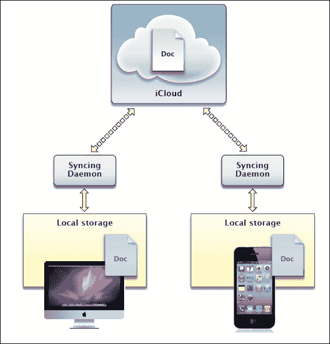

### 注意

当你的应用程序将文档存储到 iCloud 时，它必须指定一个或多个容器，这些容器将存储文档内容，通过在你的应用程序的 `entitlements` 文件中包含 `com.apple.developer.ubiquity-container-identifiers` 键值条目来实现。

## 它是如何工作的...

在这个菜谱中，我们学习了如何将 `UIDocument` 文档作为一个文件展示者来建立，这样你就可以通过告诉 `NSFileCoordinator` 将文档添加为 *展示者* 来注册这个类，以便在它的云数据更新时接收更新。这意味着展示者类是对知道给定文件外部变化发生有强烈兴趣的类。

每次你注册更改时，你首先创建一个文档和一个协调器，然后将文档作为其表演者初始化协调器，如第一个代码片段所示。以这种方式处理，意味着使用 `NSFileCoordinator` 类的新文档或展示者可以接收关于这些更改的警报，并允许你更新应用程序的 UI 以处理这些更改发生的情况。

接下来，我们使用 `NSFileManager` 类，该类允许你使用 `setUbiquitous:itemAtURL:destinationURL:error:` 方法在本地文件和云之间移动。此方法除了将文件安全地从你的沙盒移动到中央 iCloud 文件夹并返回外，不做任何其他操作。

该方法接受三个参数。第一个参数确定移动的方向。`YES` 将项目从沙盒移动到云。第二个参数必须是源 URL，第三个是目标。如果三个参数放置顺序错误，该方法将失败。本地沙盒 URL 的形式如下，如以下 URL 所示：

`file://localhost/private/var/mobile/Library/Mobile%20Documents/TEAMID~com~geniesoftstudios~iCloudExample/Document.doc;`

## 参见

+   *与 iCloud 存储 API 一起工作* 菜谱

+   *请求 iCloud 存储权限* 菜谱

# 与 iCloud 存储 API 一起工作

在这个菜谱中，我们将探讨在使用 iCloud 时我们可用的不同存储方法，以及这些方法如何被纳入你自己的应用程序中。

## 准备工作

在 iCloud 中存储文档允许你的应用程序将文档和数据写入一个共同的中央位置。这也提供了同步和访问项目以及从用户丢失的 iOS 设备上的所有其他 iOS 设备和 Mac OS X 计算机中恢复文档的能力。

## 如何做...

要充分利用 iCloud 存储，需要完全理解实现此功能两种方式之一以及如何访问信息。以下表格解释了各种存储类型及其描述：

| 存储类型 | 描述 |
| --- | --- |
| iCloud 文档存储 | 使用此功能在用户的 iCloud 账户中存储和共享用户文档和数据。 |
| iCloud 键值数据存储 | 使用此功能在您的应用程序实例之间存储和共享少量数据。 |

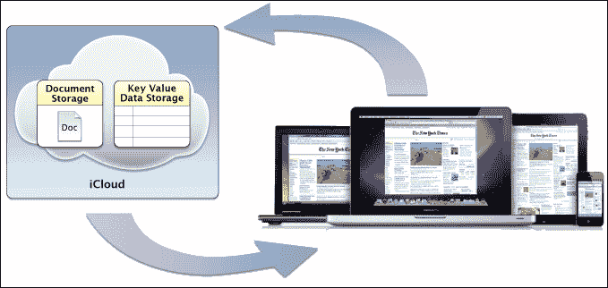

如前一个屏幕截图所示，这显示了在您的应用程序沙盒内的本地 iCloud 存储中创建信息时涉及的整个过程。

### 使用 iCloud 文档存储

在 iCloud 中存储文档是最容易实现的，可以通过对名为`UIDocument`的类进行子类化来实现。此类处理读取和写入文件所需的一切，包括与 iCloud 守护进程的协调等。

```swift
// Point to our iCloud Documents container.
  NSURL *ubiq = [[NSFileManager defaultManager] 
  URLForUbiquityContainerIdentifier:nil];
  NSURL *ubiquitousPackage = [[ubiq
  URLByAppendingPathComponent:@"Documents"]
  URLByAppendingPathComponent:@"/Document.doc"];
  Document *doc = [[Document alloc]    
  initWithFileURL:ubiquitousPackage];
  doc.docContent = @"Welcome to iCloud Programming.";
  // Check to see if we are editing a currently opened note
  [doc saveToURL[doc fileURL] forSaveOperation:UIDocumentSaveForCreatingcompletionHandler:^(BOOL success) {
    if (success) {
      NSLog(@"Saved Successfully.");
    }
  }];
```

当我们开始构建我们的 iCloud 应用程序以在云中存储和检索文档内容时，我们将更深入地探讨如何创建`UIDocument`类的子类。

### 在 iCloud 中存储键值数据

在 iCloud 中存储数据为您提供了使您的应用程序在运行在其他 Mac OS X 计算机和其他 iOS 设备上的其他应用程序副本之间共享数据的方法。

以下代码片段显示了如何设置云，以便您能够使用键值方法将数据写入用户的 iCloud：

```swift
  NSFileManager *fileManager = [NSFileManager defaultManager];
  NSURL *iCloudURL = [fileManager
  URLForUbiquityContainerIdentifier:
  @"TEAMID.com.yourcompany.applicationname"];
  // Log the iCloud URL to the console window
  NSLog(@"%@", [iCloudURL absoluteString]);
  // If iCloud is supported or enabled
  if(iCloudURL)
  {
    NSUbiquitousKeyValueStore *iCloudStore = 
    [NSUbiquitousKeyValueStore defaultStore];      
    [iCloudStore setString:@"Success" 
    forKey:@"iCloudStatus"];
    // For Synchronizing with iCloud Server
    [iCloudStore synchronize]; 
    // Retrieve our stored status from the iCloud Server
    NSLog(@"iCloud status : %@", [iCloudStore
    stringForKey:@"iCloudStatus"]);
}
```

当您的应用程序使用 iCloud `键值`数据存储方法时，用户将永远不会看到这一过程，因为您的应用程序将使用此方法来共享仅由您的应用程序使用的非常小的信息。

### 注意

当使用`NSUbiquitousKeyValueStore`类时，您必须确保在项目首选项中勾选了`键值存储`复选框。

单个`键值存储`可用的空间限制为 64 千字节，并且写入容器中单个键值的数据大小不得超过 4 千字节。这适用于存储有关您应用程序的少量数据，但不建议用它来存储文档或大量数据。

### 注意

有关 iCloud 的更多信息，请参阅 Apple 开发者文档[`developer.apple.com/library/ios/#documentation/iPhone/Conceptual/iPhoneOSProgrammingGuide/iCloud/iCloud.html`](https://developer.apple.com/library/ios/#documentation/iPhone/Conceptual/iPhoneOSProgrammingGuide/iCloud/iCloud.html)`#//apple_ref/doc/uid/TP40007072-CH5-SW1`。

## 它是如何工作的...

在这个菜谱中，我们了解了可以用于在 iCloud 中存储信息的不同方法。当处理文档存储时，我们需要设置一个“ubiq”（ubiquitous 的简称），变量来指向我们 iCloud 账户中的当前文档容器，然后使用`ubiquitousPackage`类，然后将我们的文件名附加到 iCloud 文档容器的位置。然后我们使用一些默认内容初始化我们的`UIDocument`类文档，然后使用`forSaveOperation`方法的`UIDocumentSaveForCreating`属性创建一个全新的文档。

或者，当与`key-value`数据一起工作时，您需要使用`NSUbiquitousKeyValueStore`类，它使您能够在您的每个设备之间共享少量数据。然后我们使用`NSUserDefaults`类以编程方式与系统默认值交互，这样我们就可以使用`setString:`方法将字符串`Success`存储为`iCloudStatus`键，该键由`forKey:`方法确定。最后，我们调用`synchronize`方法将我们指定的值存储回 iCloud 服务器，然后使用`stringForKey:`方法检索我们的键的值并将此值显示在控制台窗口中。

## 参见

+   *构建 iCloud 应用程序*菜谱

+   *在 iCloud 中存储和使用文档*菜谱

+   *请求 iCloud 存储权限*菜谱

# 在 iCloud 中检测文件版本冲突

在这个菜谱中，我们将看看如何在您的应用程序中实现和处理文件版本冲突是多么容易。

## 准备工作

处理文件版本冲突是软件开发中常见的问题。使用 iCloud 时，当多个实例在多个设备上运行并尝试修改同一文档时，需要有效地和高效地处理。当两个设备同时尝试上传对文档所做的更改时，这将导致冲突。在这种情况下，iCloud 将最终拥有同一文件的两个不同版本，并必须决定如何处理它们。

## 如何做到这一点...

1.  为了确定何时发生文档文件冲突，您需要注册一个观察者对象，在每次对文档进行更改时，定期检查`UIDocumentStateChangedNotification`通知对象的`documentState`属性，以检查冲突的存在并相应地采取行动：

    ```swift
    -(void)viewDidAppear:(BOOL)animated
    {
      [super viewDidAppear:animated];
      // Add observer calls to monitor document state changes
      [[NSNotificationCenter defaultCenter] 
       addObserver:self
       selector:@selector(documentChanged:)
       name:UIDocumentStateChangedNotification
       object:self.document];
    }
    ```

1.  接下来，我们需要创建`documentChanged:`方法。这个方法作为一个通知处理程序运行，等待`UIDocumentStateChangedNotification`通知发生，以便在处理完成后能够检查对象的`documentState`。

    ```swift
    #pragma mark routine is called whenever a change to the document is encountered
    - (void)documentChanged:(NSNotification *)notification {
       if ([notification.object documentState] &
           UIDocumentStateInConflict) {
           NSURL *ubiq = [[NSFileManager defaultManager] 
           URLForUbiquityContainerIdentifier:nil];
         NSURL *ubiquitousPackage = [[ubiq 
           URLByAppendingPathComponent:@"Documents"]
           URLByAppendingPathComponent:@"/Snippet.doc"];
           SnippetDocument *doc = [[SnippetDocument alloc] 
           initWithFileURL:ubiquitousPackage];
          NSURL *documentURL = [doc fileURL];
          NSArray *conflictVersions = [NSFileVersion
           unresolvedConflictVersionsOfItemAtURL:documentURL];
          for (NSFileVersion *fileVersion in conflictVersions) {
          [fileVersion setResolved:YES];
         }
         [NSFileVersionremoveOtherVersionsOfItemAtURL:documentURL error:nil];
       }
    }
    ```

## 它是如何工作的...

在这个菜谱中，我们学习了如何通过`UIDocumentStateChangedNotification`通知对象注册和使用通知处理程序，以便在文档状态发生变化时通知我们。

我们使用`NSFileManager`对象的`URLForUbiquityContainerIdentifier`方法，并通过将`nil`作为参数传递来默认选择权限文件中列出的第一个容器。建议的方法是所有文档都必须存储在`Documents`子目录中，并且需要附加到 URL 路径上。

最后，我们使用`NSFileVersion`对象将文档的所有未解决版本替换为当前文档。接下来，我们遍历包含表示文档冲突版本的`NSFileVersion`对象的数组，并将每个对象的`resolved`属性设置为`YES`，以删除与文档文件关联的所有冲突版本。

以下表格为您提供了不同文档状态的描述：

| 文档状态 | 描述 |
| --- | --- |
| `UIDocumentStateNormal` | 表示文档已打开并启用用户编辑。 |
| `UIDocumentStateClosed` | 表示文档当前已关闭，或读取文档时发生错误。 |
| `UIDocumentStateConflict` | 表示已检测到当前文档的冲突。 |
| `UIDocumentStateSavingError` | 表示在尝试保存文档时发生错误。 |
| `UIDocumentStateEditingDisabled` | 表示文档正忙，目前不适合编辑。 |

### 注意

有关`UIDocumentStateChangedNotification`框架的更多信息，请参阅位于以下 URL 的 Apple 开发者文档：

[`developer.apple.com/library/ios/#documentation/DataManagement/Conceptual/DocumentBasedAppPGiOS/Introduction/Introduction.html`](https://developer.apple.com/library/ios/#documentation/DataManagement/Conceptual/DocumentBasedAppPGiOS/Introduction/Introduction.html)

## 参见

+   *使用 iCloud 存储 API 进行工作*的配方

+   *在 iCloud 中检测文件版本冲突*的配方

# 构建 iCloud 应用程序

在本配方中，我们将学习如何使用 iCloud 存储 API 构建一个感知 iCloud 的应用程序。

## 准备工作

在本节中，我们将学习如何创建一个应用程序，使我们能够在我们的 iCloud 存储库中创建新的文档。首先，按照以下简单步骤进行操作：

## 如何操作...

首先，按照以下顺序执行以下简单步骤：

1.  从`/Xcode4/Applications`文件夹启动 Xcode。

1.  选择**创建一个新的 Xcode 项目**，或导航到**文件** | **新建项目**。

1.  从可用模板列表中选择**单视图应用程序**选项。

1.  点击**下一步**按钮，继续向导的下一步。

1.  接下来，将`iCloudExample`作为项目名称输入。

1.  从**设备**下拉列表中选择**iPhone**。

1.  确保未选中**使用故事板**复选框。

1.  确保已选中**使用自动引用计数**复选框。

1.  确保没有勾选**包含单元测试**复选框。

1.  点击**下一步**按钮继续到向导的下一个步骤。

1.  指定您希望保存项目的位置。

1.  然后，点击**创建**按钮继续并显示 Xcode 工作区。

    现在我们已经创建了`iCloudExample`项目，我们可以开始构建用户界面，这将允许我们创建和修改文档，并将这些文档保存回 iCloud。

1.  从**项目导航器**窗口中选择`ViewController.xib`文件。

1.  从**对象库**窗口中选择并拖动一个工具栏，将其添加到视图的顶部。

1.  选择我们之前添加到工具栏中的**项目**按钮。

1.  在**属性检查器**部分，将**标识符**属性的值更改为**保存**，并将**样式**属性的值更改为**带边框**。

1.  从**对象库**中选择并拖动一个`Bar Button Item`对象，并将其添加到我们之前添加的**保存**按钮旁边。

1.  在**属性检查器**部分，将**标识符**属性的值更改为**自定义**，并将**标题**属性的值更改为**加载**。

1.  最后，从**对象库**中选择并拖动一个`Text View`对象到视图控制器的中心，并调整大小以填充整个屏幕区域。

    以下截图显示了添加了工具栏、按钮和`Text View`控制器的完成用户界面。

    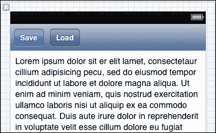

    我们下一步是创建每个按钮以及`Text View`控制器的出口和属性事件。创建这些事件将允许我们在代码中直接访问相关方法和控制属性。要创建出口，请按照以下简单步骤操作：

1.  通过导航到**导航** | **在辅助编辑器中打开**，或按住**选项** + **命令**键打开**辅助编辑器**页面。

1.  确保在**辅助编辑器**窗口中显示`ViewController.h`接口文件。

1.  选择**保存**（`Bar Button Item`）控件，然后按住**控制**键，将其拖入`ViewController.h`接口文件。

1.  在创建连接时，从**连接**下拉菜单中选择**出口**。

1.  输入`btnSave`作为要创建的**出口**属性的名称。

1.  从**存储**下拉菜单中选择**strong**。

1.  重复步骤 3 到 6 来创建**加载**按钮项和**Text View**控制器的出口属性，同时提供以下命名`btnLoad`和`docContents`。

    现在我们已经为我们的控件创建了实例变量出口，我们需要为**保存**按钮创建相关动作。创建这些动作允许在按钮按下时触发事件。要创建动作，请按照以下简单步骤操作：

1.  在 **Assistant Editor** 窗口中仍然显示 `ViewController.h` 接口文件时，选择 **Save** (`Bar Button Item`) 控件，并按住 *control* 键将其拖入 `ViewController.h` 接口文件。

1.  从 **Connection** 下拉列表中选择 **Action** 以创建连接。

1.  将方法的 **Name** 值输入为 `btnSave`。

1.  重复步骤 1 到 3 以创建 **Load** 和 **Text View** 控件的输出属性，同时提供以下命名 `btnLoad` 和 `docContents`。

    以下代码片段显示了完成的 `ViewController.h` 接口文件：

    ```swift
    //  ViewController.h
    //  iCloudExample
    //  Created by Steven F Daniel on 8/11/12.
    //  Copyright (c) 2012 GenieSoft Studios. All rights reserved.
    #import <UIKit/UIKit.h>
    @interface ViewController : UIViewController
    // Declare the properties for each of our objects.
    @property (strong,nonatomic) IBOutlet UIBarButtonItem *btnSave;
    @property (strong,nonatomic) IBOutlet UIBarButtonItem *btnLoad;
    @property (strong,nonatomic) IBOutlet UITextView      *docContents;
    @end
    ```

    我们下一步是使用 iOS 5 中包含的 `UIDocument` 类，使我们能够更容易地处理 iCloud 文档。这个类充当文件和它包含的实际数据之间的中间件，并实现了 `NSFilePresenter` 协议来处理整个文档处理的后台操作，这样在文件打开或保存时应用程序不会被阻塞。

1.  从 **Xcode** 菜单栏中，导航到 **File** | **New** | **File...** 或按 *Command* + *N*。

1.  从模板列表中选择 **Objective-C class** 模板。

1.  点击 **Next** 按钮继续向导中的下一步。

1.  输入 `Snippet` 作为要创建的文件名。

1.  确保您已从 **Subclass of** 下拉菜单中选择 `UIDocument` 作为创建的类型。

    ### 注意

    如果您在下拉列表中看不到 `UIDocument` 类，只需手动输入即可。

1.  点击 **Next** 按钮继续向导的下一步。

1.  点击 **Create** 按钮将文件保存到指定的文件夹位置。

1.  打开位于 `iCloudExample` 文件夹中的 `Snippet.h` 接口文件，并输入以下代码片段：

    ```swift
    //  Snippet.h
    //  iCloudExample
    //  Created by Steven Daniel on 08/11/12.
    //  Copyright (c) 2012 GenieSoft Studios. All rights reserved.
    #import <UIKit/UIKit.h>
    @interface Snippet : UIDocument
    @property (nonatomic, strong) NSString  *docContent;
    @end
    ```

1.  打开位于 `iCloudExample` 文件夹中的 `Snippet.m` 实现文件，并输入以下代码片段：

    ```swift
    //  Snippet.m
    //  iCloudExample
    //  Created by Steven Daniel on 08/11/12.
    //  Copyright (c) 2012 GenieSoft Studios. All rights reserved.
    #import "Snippet.h"

    @implementation Snippet

    @synthesize docContent;

    // Called whenever the application reads data from the file.

    - (BOOL)loadFromContents:(id)contents ofType:(NSString *)typeName error:(NSError **)outError{
      // Initialize our document content
      self.docContent = @"";
      // Check to see if any text associated for the document.
      if ([contents length] > 0) {
          self.docContent = [[NSString alloc] 
                            initWithBytes:[contents bytes] 
                            length:[contents length] 
                            encoding:NSUTF8StringEncoding];
      }
      return YES;    
    }
    // Called whenever the application saves the content.
    - (id)contentsForType:(NSString *)typeName error:(NSError **)outError {
        // Ensure we have content to save for our document.
        if ([self.docContent length] == 0) {
             self.docContent = @"";
        }
        // Save the document contents and return back the data.
        return [NSData dataWithBytes:[self.docContent UTF8String] 
               length:[self.docContent length]];    
    }
    @end
    ```

    现在我们已经完成了 `UIDocument` 子类的创建，我们可以开始实现负责将内容保存到云的方法。

1.  修改位于 `iCloudExample` 文件夹中的 `ViewController.h` 接口文件；输入以下高亮显示的代码片段，如图所示：

    ```swift
    //  ViewController.h
    //  iCloudExample
    //  Created by Steven F Daniel on 8/11/12.
    //  Copyright (c) 2012 GenieSoft Studios. All rights reserved.
    #import  <UIKit/UIKit.h>
    #import "Snippet.h"
    @interface ViewController : UIViewController
    // Declare the Getters and Setters for each of our objects.
    @property (strong,nonatomic) IBOutlet UIBarButtonItem *btnSave;
    @property (strong,nonatomic) IBOutlet UIBarButtonItem *btnLoad;
    @property (strong,nonatomic) IBOutlet UITextView      *docContents;
    @property (strong, nonatomic) Snippet         *document;
    @property (strong, nonatomic) NSMetadataQuery *docQuery;
    @end
    ```

1.  修改位于 `iCloudExample` 文件夹中的 `ViewController.m` 实现文件，并添加以下 `synthesize` 方法：

    ```swift
    //  ViewController.m
    //  iCloudExample
    //  Created by Steven F Daniel on 8/11/12.
    //  Copyright (c) 2012 GenieSoft Studios. All rights reserved.
    #import "ViewController.h"

    @interface ViewController()
    @end

    @implementation ViewController

    @synthesize document;
    @synthesize docQuery;
    @synthesize docContents = m_docContents;
    @synthesize btnSave = m_btnSave;
    @synthesize btnLoad = m_btnLoad;

    ```

1.  接下来，修改 `ViewDidLoad` 方法，如图所示的高亮代码片段：

    ```swift
    - (void)viewDidLoad
    {
        [super viewDidLoad];
      // Do any additional setup after loading the view.
      NSURL *ubiq = [[NSFileManager defaultManager] 
       URLForUbiquityContainerIdentifier:nil];
      if (!ubiq) {
        NSLog(@"iCloud not currently available");
        self.btnSave.enabled = NO;
        self.btnLoad.enabled = NO;
      }
      // Set the background color and font attributes for our note.
       UIFont * font = [UIFont fontWithName:@"Helvetica-Bold" 
                       size:[UIFont systemFontSize]];
       [self.docContents setFont:font];
       [self.docContents setBackgroundColor:[UIColor
                 colorWithRed:1.0f green:1.0f blue:0.6f alpha:1.0f]];
       // Initialize control and button attributes
      [self btnLoad:nil];
    }
    ```

1.  接下来，修改 `viewDidUnload` 方法，如图所示的高亮代码片段：

    ```swift
    - (void)viewDidUnload
    {
        [super viewDidUnload];

        // Release any retained subviews of the main view.
        self.btnSave = nil;
        self.btnLoad = nil;

      // Turn off our notifications
     [docQuery disableUpdates];
     [[NSNotificationCenter defaultCenter] 
     removeObserver:self];
    }
    ```

1.  接下来，修改 `viewDidAppear` 方法，如图所示的高亮代码片段：

    ```swift
    -(void)viewDidAppear:(BOOL)animated
    {
      [super viewDidAppear:animated];

      // Add observer calls to monitor document and 
       // document state changes
     [[NSNotificationCenter defaultCenter] addObserver:self
     selector:@selector(documentChanged:)
     name:UIDocumentStateChangedNotification
     object:self.document];
    }
    ```

    接下来，我们需要实现当用户点击 **Save** 按钮时将文档保存到 iCloud 的方法。

1.  打开 `viewController.m` 实现文件，定位 `btnSave` 方法，并输入以下代码片段：

    ```swift
    #pragma mark Saves the document to our iCloud repository
    - (IBAction)btnSave:(UIBarButtonItem *)sender {
      // Points to our iCloud Documents container.
      NSURL *ubiq = [[NSFileManager defaultManager] 
                       URLForUbiquityContainerIdentifier:nil];
      NSURL *ubiquitousPackage = [[ubiq
       URLByAppendingPathComponent:@"Documents"]
      URLByAppendingPathComponent:@"/Snippet.doc"];
       Snippet *doc = [[Snippet alloc] 
       initWithFileURL:ubiquitousPackage];
       doc.docContent = self.docContents.text;
       // Check to see if we are editing a currently opened note
      [doc saveToURL:[doc fileURL] 
             forSaveOperation:UIDocumentSaveForCreating
             completionHandler:^(BOOL success) {
                if (success) {
                   NSLog(@"Document saved successfully");
                }
      }];
    }
    ```

1.  接下来，定位 `btnLoad` 方法，并输入以下代码片段：

    ```swift
    #pragma mark Reloads our document from cloud Storage
    - (IBAction)btnLoad:(UIBarButtonItem *)sender {
      NSURL *ubiq = [[NSFileManager defaultManager] 
       URLForUbiquityContainerIdentifier:nil];
      if (ubiq) {
        docQuery = [[NSMetadataQuery alloc] init];
        [docQuerysetSearchScopes:[NSArray
          arrayWithObject:NSMetadataQueryUbiquitousDocumentsScope]];
        NSPredicate *pred = [NSPredicate
              predicateWithFormat: @"%K Like 'Snippet.doc'", 
                   NSMetadataItemFSNameKey];
        [docQuerysetPredicate:pred];
        NSNotificationCenter *center = [NSNotificationCenter
          defaultCenter];
          [center addObserver:self selector:@selector(processQuery:)
          name:NSMetadataQueryDidFinishGatheringNotification
        object:docQuery];
        [center addObserver:self selector:@selector(processQuery:)	
          name:NSMetadataQueryDidUpdateNotification
       object:docQuery];
        if (![self.docQuery isStarted]) [self.docQuery startQuery];
        [self.docQuery enableUpdates];
        }
      else {
        self.btnSave.enabled = NO;
        self.btnLoad.enabled = NO;
       }
    }
    ```

1.  接下来，创建一个名为 `processQuery:` 的方法，如下面的代码片段所示：

    ```swift
    #pragma mark Retrieve the contents of our document stored within iCloud and update our UITextView Control
    - (void)processQuery:(NSNotification *)notification {

      [docQuery disableUpdates];

       if ([[docQuery results] count] == 1) {
         NSURL *url = [[[docQuery results] objectAtIndex:0] 
           valueForAttribute:NSMetadataItemURLKey];
           Snippet *contents = [[Snippet alloc] initWithFileURL:url];
           [contentsopenWithCompletionHandler:^(BOOL success) {
                 if (success) {
                   [self.docContents setText:contents.docContent];
                 }
           }];
      }
      [docQuery enableUpdates];
    }
    ```

1.  接下来，最后，创建一个名为 `documentChanged:` 的方法，如下面的代码片段所示：

    ```swift
    #pragma mark routine is called whenever a change to the document is encountered
    - (void)documentChanged:(NSNotification *)notification {
      if ([notification.object documentState] &
            UIDocumentStateInConflict) {
        // Wait to find out what user wants first
        UIAlertView *alertView = [[UIAlertView alloc]
          initWithTitle:@"Conflict Detected"		
             message:@"Document modified on another iOS device."
          delegate:self
          cancelButtonTitle:nil
          otherButtonTitles:@"OK", nil];
          [alertView show];
        // Point to our iCloud Documents container.
        NSURL *documentURL = [notification.objectfileURL];
        NSArray *conflictVersions = [NSFileVersion
          unresolvedConflictVersionsOfItemAtURL:documentURL];
        for (NSFileVersion *fileVersion in conflictVersions) {
          [fileVersion setResolved:YES];
        }
        [NSFileVersion
          removeOtherVersionsOfItemAtURL:documentURL error:nil];
        // Trigger an Auto-Save and re-enable our Query Updates
        [document updateChangeCount:UIDocumentChangeDone];
      }
    }
    ```

1.  然后，通过从 **产品** 菜单中选择 **产品 | 运行** 或按 *Command + R* 键来构建和运行应用程序。

    ### 注意

    关于 `NSMetadataQuery` 对象的更多信息，请参阅以下链接：

    [`developer.apple.com/library/ios/#documentation/Cocoa/Reference/Foundation/Classes/NSMetadataQuery_Class/Reference/Reference.html`](http://developer.apple.com/library/ios/#documentation/Cocoa/Reference/Foundation/Classes/NSMetadataQuery_Class/Reference/Reference.html)

下面的截图显示了我们的 `iCloudExample` 应用程序在两个不同的 iOS 设备上运行。当在第二个设备上做出更改，然后按下 **保存** 按钮时，iCloud 守护进程服务检测到这一变化。第一个设备显示一个 `alertview` 对话框，通知文档在另一台设备上已被修改。

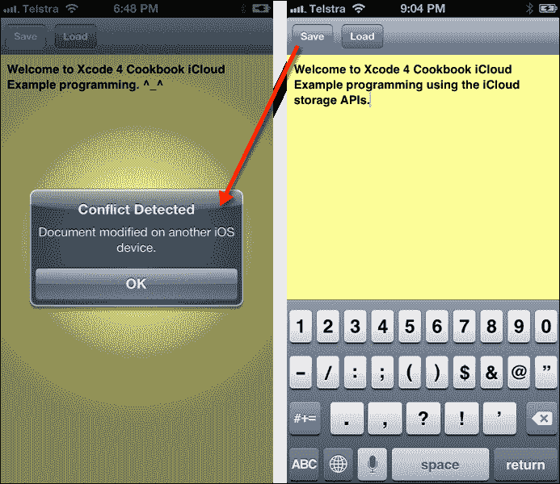

下面的截图显示了我们的片段文档存在于我们应用程序的容器中，在 iCloud 内：

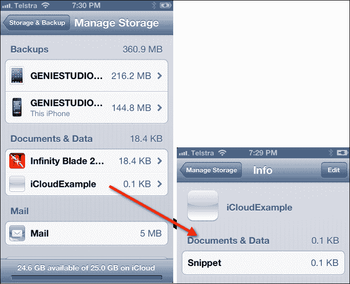

### 注意

可以通过 **设置** 应用程序访问上一个屏幕，然后导航到 **设置** | **iCloud** | **存储与备份** | **管理存储**。

## 它是如何工作的...

在这个菜谱中，我们学习了如何构建和创建 `iCloudExample` 应用程序的用户界面，以便在 iCloud 中存储和检索文档。然后，我们为每个按钮创建了出口属性，以便在按下时能够保存和加载文档。在下一步中，我们创建了一个 `UIDocument` 子类，并声明了一个 `NSString` 属性变量 `docContent`，该变量将用于存储在创建或修改文档时文档的内容。然后我们继续合成文档内容属性，以便我们的类可以访问与其相关的对象。然后我们继续重写 `loadFromContents:` 方法，从文件中读取数据到我们的 `UIDocument` 子类。这里要注意的最重要参数是 contents；这是一个 `NSData` 对象，包含你在创建或更新文档模型时输入的实际数据。

背景队列`NSFilePresenter`在读取操作完成时调用此方法。如果文档在没有输入任何数据的情况下保存，我们分配一个空字符串的默认值。然后，我们继续重写`contentsForType:`方法，该方法在`NSFilePresenter`的背景队列请求`UIDocument`子类的内容快照时使用。在这里，我们检查文档是否包含内容，如果是，我们将我们的文档数据转换为`NSData`对象，并将其作为`NSData`实例返回。接下来，我们声明我们的`Snippet`对象，该对象将用于保存创建的文档，以及我们的`NSMetadataQuery`对象，该对象将用于在我们的应用程序的 iCloud 存储库中查询和查找文档，并访问每个文件的相关对象属性。在我们的下一步操作中，我们首先检查我们是否可以访问我们的应用程序的 iCloud 存储库，然后继续设置`docContents`控件的后台颜色和字体名称和大小，最后调用`reload:`方法从我们的 iCloud 存储库中检索文档。

我们接下来注册一个观察者对象，以便我们能够使用`UIDocumentStateChangedNotification`通知对象定期检查文档状态的变化。然后，我们声明我们的`btnSave:`方法，并设置一个`ubiq`变量来指向我们 iCloud 账户中的文档容器。接着，我们使用`ubiquitousPackage`类，并将我们的文件名追加到 iCloud 文档容器的位置。然后，我们使用一些默认内容初始化我们的`UIDocument`类文档，并使用`forSaveOperation`方法的`UIDocumentSaveForCreating`属性来创建一个全新的文档。

对于 `btnLoad:` 方法，我们首先确保可以将其连接到 iCloud 数据存储，然后设置并初始化我们的 `docQuery` 查询谓词，使用谓词类方法 `NSMetadataQueryUbiquitousDocumentScope` 来查找我们的文档，然后设置一个观察者 `queryDidFinishGathering` 通知，当元数据搜索完成收集所有项目时会被调用。接下来，在我们的 `processQuery:` 方法中，我们从结果查询中获取文档项，并将提取的文档内容写入我们的 `docContent` 对象。最后，在我们的 `documentChanged:` 方法中，我们使用通知对象的 `documentState` 属性来确定是否检测到任何文件冲突，如果是，我们使用 `UIAlertView` 类显示一个警告消息；然后指向我们的 iCloud 文档容器以获取文件的 URL，并使用 `NSFileVersion` 对象将所有未解决的文档版本替换为当前文档，然后遍历包含表示文档所有冲突版本的 `NSFileVersion` 对象的数组，并将每个对象的 `resolved` 属性设置为 `YES`，并删除与文档文件 URL 相关的所有冲突版本。

## 参见

+   *请求 iCloud 存储权限* 菜单

+   *在 iCloud 中存储和使用文档* 菜单

+   *使用 iCloud 存储 API* 菜单

# 请求 iCloud 存储权限

在本菜谱中，我们将探讨如何使用 Xcode 添加和配置权限，以便使您的应用程序能够与 iCloud 服务通信。

## 准备工作

为了保护应用程序创建的数据，需要在构建时创建一些特定的权限，以便使用 iCloud 存储。您需要确保已选择为应用程序的 App ID 启用 iCloud 的选项。

## 如何操作...

在您的应用程序能够与 iCloud 服务通信之前，您需要从 iOS 配置文件门户中创建一个新的 App ID，该门户位于 [`developer.apple.com/ios/manage/bundles/index.action/`](https://developer.apple.com/ios/manage/bundles/index.action/)。

如果您正在使用现有的 App ID，则它不能包含通配符 ID，并且必须包含您将要创建的应用程序的完整名称，例如，`com.yourcompany.*`。为了使您的 App ID 能够与 iCloud 服务通信，请按照以下简单步骤操作：

1.  创建一个 `new App ID` 值或编辑您之前创建的一个。

1.  通过在“配置 App ID”屏幕中简单地勾选“**启用 iCloud**”复选框来设置您的配置文件以用于 iCloud：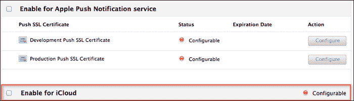

1.  接下来，您将看到一个弹出对话框，解释说明您使用所选 App ID 创建的任何新配置文件都将启用 iCloud 服务：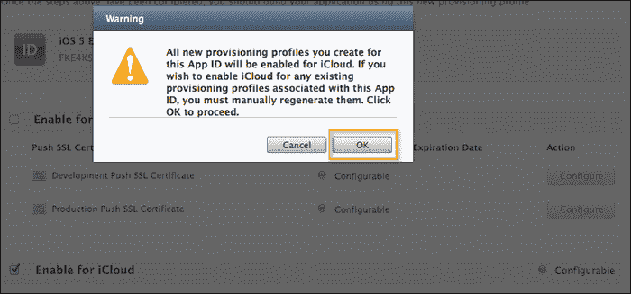

1.  一旦点击了**确定**按钮，您将返回到**配置 App ID**屏幕，并且**启用 iCloud**按钮将变为绿色，如以下截图所示：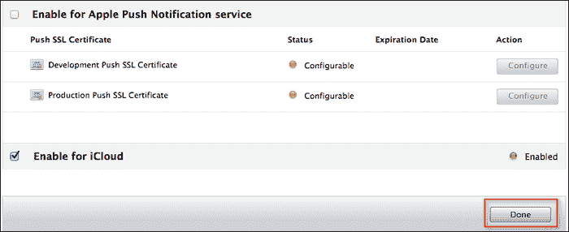

1.  点击**完成**按钮关闭此屏幕。

1.  接下来，点击**配置**选项卡，然后点击**开发**选项卡，下载如以下截图所示的**开发配置配置文件**：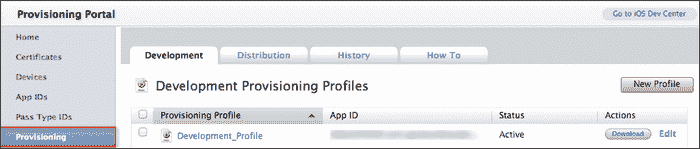

1.  接下来，从**配置**选项卡，点击**分发**选项卡，下载如以下截图所示的**分发配置配置文件**：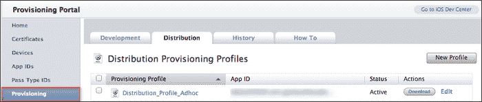

1.  接下来，从**项目导航器**窗口中，点击您的项目，在**目标**部分，然后点击**摘要**页面，并向下滚动到**权限**部分。

1.  勾选**启用权限**和**启用 iCloud**复选框。这将向您的项目添加一个名为`iCloudExample.entitlements`的文件。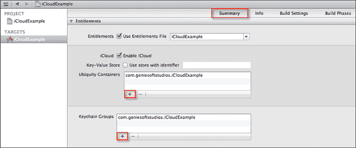

1.  接下来，点击**+**按钮来自动填充**通用容器**和**密钥链组**部分。

    ### 注意

    每次您向项目添加权限时，这些权限将直接绑定到用于将您的应用程序文档和数据存储库与其他应用程序分开的应用程序配置文件。

根据应用程序需要使用的 iCloud 功能，应用程序可以请求两种权限。以下表格中对此进行了说明：

| 权限 | 描述 |
| --- | --- |
| `com.apple.developer.ubiquity-container-identifiers` | 使用此选项请求 iCloud 文档存储权限。此键的值是一个容器标识符字符串数组。（数组中的第一个字符串不得包含任何通配符字符。） |
| `com.apple.developer.ubiquity-kvstore-identifier` | 使用此选项请求 iCloud 键值数据存储权限。此键的值是一个单独的容器标识符字符串。 |

当处理`Key-Value`存储数据时，您需要确保已勾选**使用具有标识符的存储**选项。这必须保持一致，并采用以下形式 `<TEAMID>.<CUSTOM_STRING>`，其中 `<TEAMID>` 是与您的开发团队关联的唯一 10 个字符标识符。`<CUSTOM_STRING>`标识符是反向 DNS 字符串，用于标识存储您的应用程序文档的容器。

### 注意

要定位与您的开发团队关联的唯一标识符，请登录到 Apple 开发者连接网站，然后转到位于[`developer.apple.com/membercenter`](http://developer.apple.com/membercenter)的**会员中心**页面。

选择**您的账户**标签，然后从标签左侧的列中选择**组织配置文件**（如果您已将您的配置文件设置为用作组织），您的团队标识符位于**公司/组织 ID**字段中。

使用 iCloud 文档存储的应用程序可以指定多个容器来存储文档和数据。`com.apple.developer.ubiquity-container-identifiers`键是一个字符串数组。

以下截图显示了`iCloudExample.Entitlements`权限文件在项目导航器中的属性列表视图：

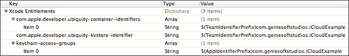

`TEAMID`值（如前一个截图所示），可以从您的开发者账户的**账户摘要**页面获取，并使用以下截图中的`Individual ID`值：

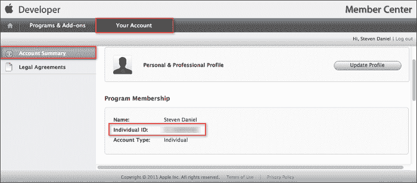

### 注意

在您的权限文件中指定的字符串也是您在请求用户 iCloud 存储中目录位置时传递给`URLForUbiquityContainerIdentifier:`方法的字符串。

## 工作原理...

在本食谱中，我们学习了如何设置和配置应用程序 ID，以便它具有与 iCloud 服务通信的能力。每当创建或修改新的或现有的应用程序 ID 时，它将直接绑定到您的开发和分发配置文件，并且需要在您的计算机上下载和重新安装以避免在 iOS 设备上部署时出现问题。

您也可以选择使用 Xcode 开发环境通过组织者界面来完成此操作。在接下来的步骤中，我们需要设置权限，这将通过启用**启用 iCloud**复选框并自动填写**通用容器**和**密钥链组**部分来使我们的应用程序能够访问 iCloud 目录。

当这些设置完成时，它将在设备上设置目录位置，您可以在其中找到和创建 iCloud 文件。然后，`iCloud 守护进程`服务将自动获取新文件到该目录，当它们可用时更新现有文件，并监视您放入该目录的文件状态的变化。

# 配置 iOS 设备以使用 iCloud

在本食谱中，我们将看看如何轻松地将您的 iOS 设备配置为使用 iCloud，以便它具有存储文档的能力。

## 准备工作

在任何应用程序开始将数据存储在 iCloud 之前，我们需要正确配置和设置我们的应用程序以使用 iCloud，并将文档存储到 iOS 设备上。为此，设备必须运行 iOS 5 或更高版本。iOS 模拟器中不会工作。

## 如何操作...

以下步骤显示了设置 iCloud 账户有多简单：

1.  从您的 iOS 设备中的**设置**面板选择**iCloud**。以下截图显示了这一操作：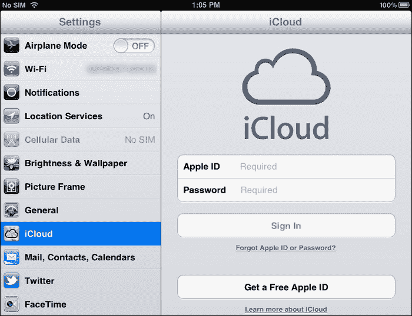

1.  接下来，使用您的 Apple ID 和密码登录，然后点击以下截图所示的**登录**按钮。

1.  您必须同意 iCloud 的条款和条件，然后点击**同意**按钮以关闭弹出对话框。

1.  接下来，点击**存储与备份**选项，进入下一屏幕。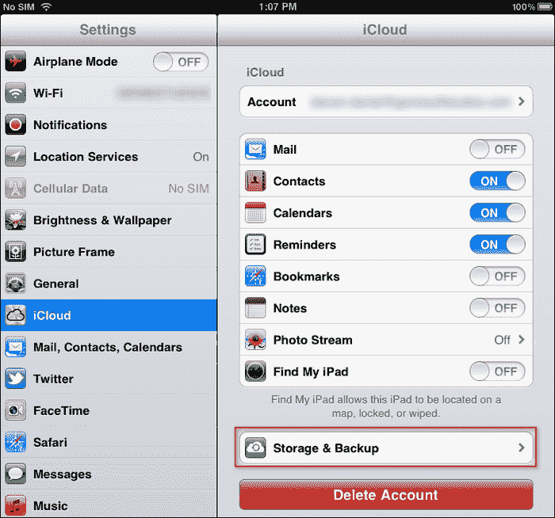

1.  接下来，从**备份部分**面板中将**备份到 iCloud**选项设置为**开启**。这将自动开始同步您的**邮件**、**联系人**、**日历**、**提醒**、**书签**或**笔记**，并将您的账户信息推送到或从 iCloud 中拉取。

    ### 注意

    如果您愿意，也可以通过任何网络浏览器登录到您的 iCloud 账户，网址为[`www.iCloud.com/`](http://www.iCloud.com/)，使用您在 iOS 设备上输入的相同信息。一旦成功登录，您可以选择**联系人**或**日历**来查看已同步到云中的数据。通过网页界面进行编辑将直接推送到您的 iOS 设备。

## 它是如何工作的...

在这个菜谱中，我们学习了如何在 iOS 设备上轻松设置和配置 iCloud。iCloud 是一项免费服务，在成功注册后提供初始 5GB 的免费存储空间。这允许您同步所有联系信息、电子邮件和文档。

如果您需要额外的存储空间，Apple 通过**存储与备份**菜单下的**iCloud 设置**为您提供。

当您在应用程序中使用 iCloud 存储 API 时，您应用程序明确存储在 iCloud 中的任何文档都不会与您的应用程序一起备份，因为这些文档已经存储在您的 iCloud 账户中，因此不需要单独备份。
