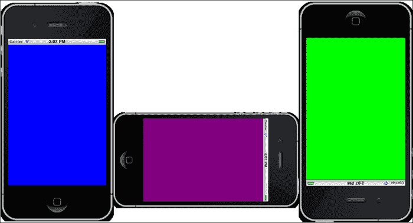
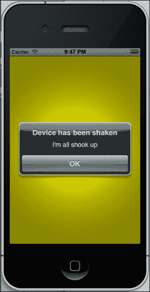
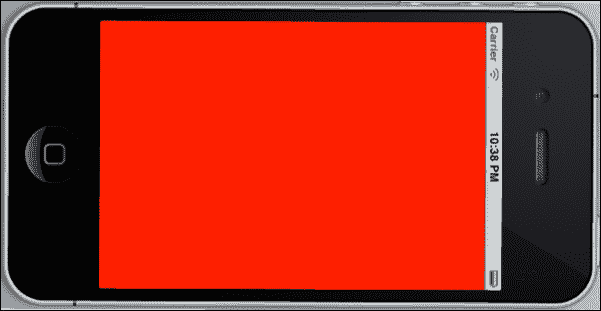
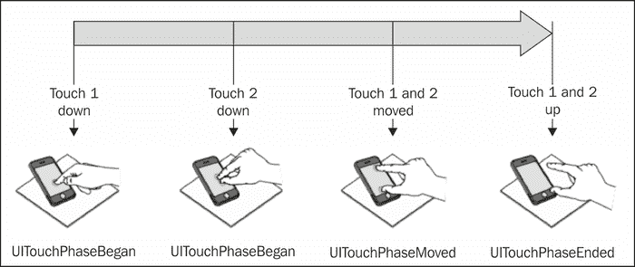
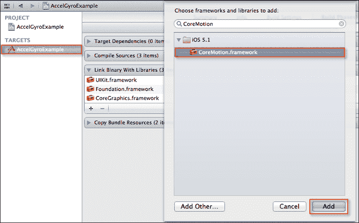
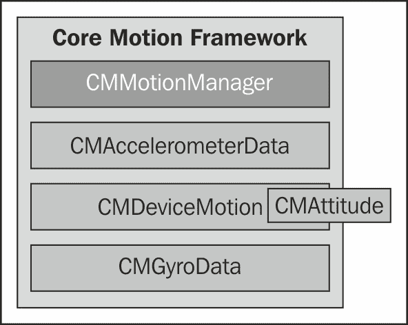
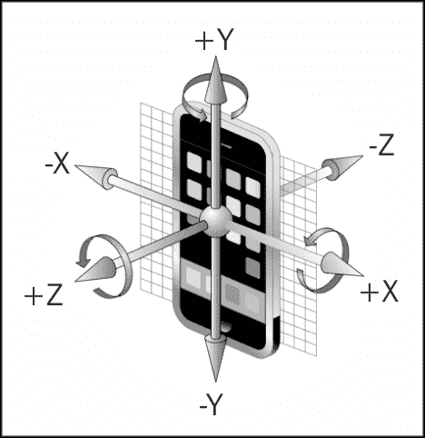

# 附录 A.探索多点触控界面

在本附录中，我们将涵盖：

+   感知运动和设备方向

+   使用触摸界面进行摇动手势

+   使用触摸界面检测设备触摸

+   使用加速度计输入感知运动

+   理解核心运动框架

+   与 iOS 设备陀螺仪协同工作

# 简介

与您通信的 Apple iOS 设备的主要界面是其大型的多点触控显示屏。由于没有物理键盘连接，所有操作都通过屏幕完成，以便您以更自然的方式与应用程序交互。任何对象都可以在屏幕上移动，放大和缩小，以及上下滚动，只需使用简单的手势即可。

在本附录中，我们将看到如何轻松地将单点触控和多点触控支持集成到我们的应用程序中，以检测 iOS 设备方向是否已更改，以及如何处理和响应摇动动作，最后我们将了解加速度计和陀螺仪。

# 感知运动和设备方向

在本食谱中，我们将学习如何检测 iOS 设备的当前方向。

## 准备工作

创建一个新的单视图应用程序项目，并将其命名为`OrientationExample`。

## 如何操作…

首先，按照以下简单步骤进行操作：

1.  从项目导航器打开`ViewController.m`实现文件。

1.  接下来，修改如以下代码片段所示的`viewDidLoad`方法：

    ```swift
    - (void)viewDidLoad{
      [super viewDidLoad];

      [[UIDevice
      currentDevice]
      beginGeneratingDeviceOrientationNotifications];

      [[NSNotificationCenter defaultCenter]addObserver:self
      selector:@selector(hasOrientationChanged:) 
      name:@"UIDeviceOrientationDidChangeNotification" 
      object:nil];
    }
    ```

1.  接下来，创建如以下代码片段所示的`hasOrientationChanged`方法：

    ```swift
    -(void)hasOrientationChanged:(NSNotification *)notification {
      UIDeviceOrientationcurrentOrientation;
      currentOrientation = [[UIDevice currentDevice]
      orientation];

      switch (currentOrientation) {
        case UIDeviceOrientationFaceUp:
          self.view.backgroundColor = [UIColor brownColor];
          break;
        case UIDeviceOrientationFaceDown:
          self.view.backgroundColor = [UIColor magentaColor];
          break;
        case UIDeviceOrientationPortrait:
          self.view.backgroundColor = [UIColor blueColor];
          break;
        case UIDeviceOrientationPortraitUpsideDown:
          self.view.backgroundColor = [UIColor blueColor];
          break;
        case UIDeviceOrientationLandscapeLeft:
          self.view.backgroundColor = [UIColor greenColor];
          break;
        case UIDeviceOrientationLandscapeRight:
          self.view.backgroundColor = [UIColor redColor];
          break;
        default:
          self.view.backgroundColor = [UIColor blackColor];
          break;
      }
    }
    ```

1.  通过从**产品**菜单选择**运行**或按*Command* + *R*键来构建和运行应用程序。

如果您在 iOS 模拟器中运行此程序，请尝试通过按*Command* + ;左箭头和*Command* + 右箭头来更改不同方向的视图，如截图所示：



## 它是如何工作的…

在本食谱中，我们涵盖了创建示例应用程序的步骤。我们首先告诉 iOS 设备开始为设备将采取的每个方向变化生成通知。然后，我们设置了一个观察者，用于`UIDeviceOrientationDidChangeNotification`类，每当设备改变方向时都会触发。接下来，我们通过`UIDeviceOrientation`类推导出我们的 iOS 设备当前的方向。最后，我们通过使用`switch…case`语句确定当前方向，然后更改视图的背景颜色。

如果你想确定 iOS 设备朝向哪个方向，你可以通过使用`UIDevice`类并使用其方向属性来获取这个信息。当注册`UIDeviceOrientationDidChangeNotification`通知方法时，你不仅会被告知 iOS 设备在纵向和横向视图之间是否已旋转，还会知道 iOS 设备是向上还是向下。

### 注意

如果你想要了解更多关于`UIDevice`类的信息，可以参考位于链接[`developer.apple.com/library/ios/#documentation/uikit/reference/UIDevice_Class/Reference/UIDevice.html`](http://developer.apple.com/library/ios/#documentation/uikit/reference/UIDevice_Class/Reference/UIDevice.html)的 Apple 开发者文档。

## 参见

+   *使用触摸界面的摇晃手势*食谱

+   在第一章的*使用 Xcode 创建 iOS 项目*食谱中，*获取和安装 iOS SDK 开发工具*

# 使用触摸界面的摇晃手势

在这个食谱中，我们将学习如何检测和处理 iOS 设备运动事件。

## 准备工作

创建一个新的单视图应用程序，并将其命名为`ShakeExample`。

## 如何做到这一点...

首先，按照以下简单步骤操作：

1.  从项目导航器打开`ViewController.m`实现文件。

1.  接下来，按照以下代码片段修改`viewDidLoad`方法：

    ```swift
    - (void)viewDidLoad{
      [super viewDidLoad];
      [self becomeFirstResponder];
      self.view.backgroundColor =[UIColor greenColor];
    }
    ```

1.  接下来，根据代码片段创建以下代码部分：

    ```swift
    - (void)motionBegan:(UIEventSubtype)motion
    withEvent:(UIEvent *)event {
      if (event.type == UIEventTypeMotion && event.subtype == UIEventSubtypeMotionShake) {
        self.view.backgroundColor =[UIColor yellowColor];
        NSLog(@"Device has been shaken");
      }
    }
    - (void)motionEnded:(UIEventSubtype)motion
    withEvent:(UIEvent *)event {
      if (event.type == UIEventTypeMotion && event.subtype == UIEventSubtypeMotionShake) {
        // Declare an instance of our Alert View dialog
        UIAlertView *dialog;

        // Initialize our Alert View Window with options
        dialog =[[UIAlertView alloc] 
        initWithTitle:@"Device has been shaken"
        message:@"I'm all shook up" delegate:self
        cancelButtonTitle:nil
        otherButtonTitles:@"OK",nil];
        // display our alert dialog
        [dialog show];
      }
    }
    - (void)motionCancelled:(UIEventSubtype)motion
      withEvent:(UIEvent *)event {
      self.view.backgroundColor = [UIColor blackColor];
      NSLog(@"Device shake has been cancelled");
    }
    - (BOOL)canBecomeFirstResponder {
      return YES;
    }

    // Responds to the options within our Alert View Dialog
    -(void)alertView:(UIAlertView *)alertView
    clickedButtonAtIndex:(NSInteger)buttonIndex {

      NSString *buttonTitle =[alertView
      buttonTitleAtIndex:buttonIndex];

      if ([buttonTitle isEqualToString:@"OK"]) {
        self.view.backgroundColor =[UIColor greenColor];
        NSLog(@"Device has stopped shaking");
        }
    }
    ```

1.  将部署目标更改为你的 iOS 设备。

1.  通过从**产品**菜单选择**运行**或按*Command* + *R*键来构建和运行应用程序。

当编译完成后，应用程序将显示在你的 iOS 设备上。尝试摇晃设备以查看以下截图所示的警告消息：



## 它是如何工作的…

在这个食谱中，我们涵盖了创建示例应用程序的步骤。我们在`viewDidLoad`方法中将视图背景色初始化为绿色，以表示没有发生摇晃，并通过设置`becomeFirstResponder`方法将视图设置为第一个响应者，以便支持运动事件。如果不包含此方法，则不会触发任何运动事件，应用程序将不会按预期运行。

接下来，我们需要通过重写`motionEnded:motion:withEvent`方法，使我们的视图控制器成为`UIResponder`响应链中的第一个响应者，当摇晃手势结束时将显示一个警告消息。最后，我们实现了`motionBegan`方法，它确定摇晃何时发生，然后将我们视图的背景色设置为黄色。当设备确定运动停止时，将调用`motionEnded`方法，在那里我们可以检测发生了什么类型的事件。在这种情况下，我们声明并实例化一个`UIAlertView`类的实例，并向用户显示一个消息，告知他们摇晃已结束。如果系统认为该运动不是摇晃，则调用`motionCancelled`方法。设备摇晃被确定为大约一秒钟或更长的长度，然后调用`motionEnded`方法将我们视图控制器的背景色设置为黑色。

### 注意

如果您想了解更多关于`UIResponder`类的信息，可以参考位于链接[`developer.apple.com/library/ios/#documentation/uikit/reference/UIResponder_Class/Reference/Reference.html`](http://developer.apple.com/library/ios/#documentation/uikit/reference/UIResponder_Class/Reference/Reference.html)的 Apple 开发者文档。

## 更多信息…

当 iOS 设备被摇晃时，系统会使用加速度计，然后解释加速度计数据以查看是否是摇晃指令。

如果确定这是一个摇晃手势，系统将创建一个`UIEvent`对象来表示这个手势，然后将对象发送到当前活动应用程序进行处理。在 iPhone 上使用摇晃手势比触摸事件简单得多。当动作开始或停止时，仍然会生成事件，您甚至可以跟踪单个动作，就像您处理触摸事件一样。

为了使您的应用程序能够集成和处理 iOS 的摇晃手势，可以通过实现以下三个方法轻松实现，如下表所示：

| 方法 | 描述 |
| --- | --- |
| `motionBegan:motion:withEvent:` | 当动作事件开始时调用此方法。 |
| `motionEnded:motion:withEvent:` | 当动作事件结束时调用此方法。 |
| `motionCancelled:motion:withEvent:` | 如果系统认为该运动不是摇晃，则调用此方法。摇晃被确定为大约一秒钟或更长的长度。 |

### 注意

动作事件首次在 iOS 3.0 SDK 中引入，摇晃动作目前被解释为手势，然后继续成为动作事件。

## 参见

+   *检测运动和设备方向*食谱

+   在第一章的*使用 Xcode 创建 iOS 项目*食谱中，*获取和安装 iOS SDK 开发工具*

# 使用触摸界面检测设备触摸

在本食谱中，我们将学习如何检测和处理 iOS 设备的各种触摸事件。

## 准备工作

创建一个新的单视图应用程序，并将其命名为 `TapExample`。

## 如何操作…

首先，按照以下简单步骤进行：

1.  从项目导航器打开 `ViewController.m` 实现文件。

1.  接下来，创建名为 `touchedBegan` 的方法，如下面的代码片段所示：

    ```swift
    - (void) touchesBegan:(NSSet *)touches withEvent:(UIEvent*)event {
      UITouch *touch = [[event allTouches] anyObject];
      switch ([touch tapCount]){
        case 1:
          self.view.backgroundColor =[UIColor redColor];break;
        case 2:
          self.view.backgroundColor =[UIColorgreenColor];break;
        case 3:
          self.view.backgroundColor =[UIColor blueColor];break;
        case 4:
          self.view.backgroundColor =[UIColoryellowColor];break;
        case 5:
          self.view.backgroundColor =[UIColororangeColor];break;
        default:
          self.view.backgroundColor =[UIColor redColor];break;
      }
    }
    ```

1.  确保您已将部署目标更改为您的 iOS 设备。

1.  通过从“产品”菜单中选择**产品** | **运行**，或通过按*Command* + *R*来构建并运行应用程序。

编译完成后，应用程序将显示在您的 iOS 设备上。尝试点击设备屏幕，以查看视图背景如以下截图所示改变：



## 它是如何工作的…

在本食谱中，我们涵盖了创建示例应用程序的步骤。然后我们实现了 `touchesBegan:touches` 方法，该方法确定在 iOS 设备上何时进行了手势，然后根据总点击次数更新我们的视图背景颜色。

## 还有更多…

`UIView` 和 `UIViewController` 类都是 `UIResponder` 类的一部分，因为它们可以响应和处理视图内部的事件。通过实现以下任何一种方法，您就可以覆盖您视图或视图控制器使用的方法：

+   `- (void)touchesBegan:(NSSet *)touches withEvent:(UIEvent *)event`

+   `- (void)touchesMoved:(NSSet *)touches withEvent:(UIEvent *)event`

+   `- (void)touchesEnded:(NSSet *)touches withEvent:(UIEvent *)event`

+   `- (void)touchesCancelled:(NSSet *)touches withEvent:(UIEvent *)event`

每个接收到的 *UITouch* 触摸都有一个阶段、位置、发生触摸的视图、时间戳和点击次数。在下表中，我们解释了在触发每个触摸阶段时会发生什么：

| 触摸事件 | 描述 |
| --- | --- |
| `UITouchPhaseBegan` | 当用户触摸 iPhone 屏幕上的某个区域时，在触摸生命周期开始时发生。 |
| `UITouchPhaseMoved` | 当用户在 iPhone 屏幕上移动手指或手指时发生。 |
| `UITouchPhaseStationary` | 当用户在屏幕上的某个区域暂停时发生。 |
| `UITouchPhaseEnd` | 当用户从 iPhone 屏幕上移除手指时发生。 |
| `UITouchPhaseCancelled` | 当 iOS 设备确定发生了某些事情并且需要中止手势时发生。这种情况的一个例子可能是由于您在接听来电时系统中断，或者当应用程序或窗口视图不再活动时。 |

### 注意

如果你想了解更多关于 `UIResponder` 类的信息，你可以参考位于链接 [`developer.apple.com/library/ios/#documentation/uikit/reference/UIResponder_Class/Reference/Reference.html`](http://developer.apple.com/library/ios/#documentation/uikit/reference/UIResponder_Class/Reference/Reference.html) 的 Apple 开发者文档。

## 相关内容

+   *使用触摸界面进行摇动手势* 菜单

+   *感应运动和设备方向* 菜单

+   在 第一章 的 *使用 Xcode 创建 iOS 项目* 菜单中，*获取和安装 iOS SDK 开发工具*

# 使用加速度计输入感应运动

在这个菜谱中，我们将学习如何使用 iOS 设备加速度计事件的功能。

## 准备工作

创建一个新的单视图应用程序，并将其命名为 `AccelGyroExample`。

## 如何操作…

要开始，请按照以下简单步骤进行：

1.  从项目导航器中选择 `AccelGyroExample` 项目。

1.  然后从 **TARGETS** 组下选择你的项目。

1.  选择 **Build Phases** 选项卡。

1.  展开链接二进制与库的展开三角形。

1.  点击 **+** 按钮，并从列表中选择 **CoreMotion.framework**。

1.  然后点击 **Add** 按钮将框架添加到你的项目中。

1.  我们接下来的步骤是创建负责访问加速度计设备功能的代码功能。

1.  打开 `ViewController.h` 接口文件，并创建以下突出显示的条目，如以下代码片段所示：

    ```swift
    //  ViewController.h
    //  AccelGyroExample
    //  Created by Steven F Daniel on 19/09/12.
    //  Copyright (c) 2012 GenieSoft Studios. All rights reserved.

    #import  <UIKit/UIKit.h>
    #import <CoreMotion/CoreMotion.h>

    @interface ViewController :  UIViewController  <UIAccelerometerDelegate> {
     CMMotionManager *motionManager;
    }

    @property (nonatomic, retain) CMMotionManager *motionManager;

    @end
    ```

1.  打开 `ViewController.m` 实现文件，并添加以下突出显示的代码片段：

    ```swift
    #import "ViewController.h"

    @interface ViewController ()
    @end

    @implementation ViewController

    @synthesize motionManager;

    ```

1.  然后，修改 `viewDidLoad` 方法，如以下突出显示的代码部分所示：

    ```swift
    - (void)viewDidLoad
    {
      [super viewDidLoad];

     // Set up the accelerometer
     UIAccelerometer *accelerometer = [UIAccelerometer
     sharedAccelerometer];
     accelerometer.updateInterval = 0.5;
     accelerometer.delegate = self;
    }
    ```

1.  接下来，创建如以下代码片段所示的 `handleAcceleration` 方法：

    ```swift
    // Handle processing of the Accelerometer
    -(void)accelerometer:(UIAccelerometer *)accelerometer didAccelerate:(UIAcceleration *)acceleration
    {
      UIAccelerationValue xAxes;
      UIAccelerationValue yAxes;
      UIAccelerationValue zAxes;

      xAxes = acceleration.x;
      yAxes = acceleration.y;
      zAxes = acceleration.z;

      if (xAxes > 0.5) {         // Moving Right
        self.view.backgroundColor = [UIColor purpleColor];
      } else if (xAxes < -0.5) { // Moving Left
        self.view.backgroundColor = [UIColor redColor];
      } else if (yAxes > 0.5) {  // Moving Upside Down
        self.view.backgroundColor = [UIColor yellowColor];
      } else if (yAxes < -0.5) { // Standing Up
        self.view.backgroundColor = [UIColor blueColor];
      } else if (zAxes > 0.5) {  // Facing Up
        self.view.backgroundColor = [UIColor magentaColor];
      } else if (zAxes < -0.5) { // Facing Down
        self.view.backgroundColor = [UIColor greenColor];
      }

      double value = fabs(xAxes);
      if (value > 1.0) { value = 1.0;}
      self.view.alpha = value;
    }
    ```

1.  将部署目标更改为你的 iOS 设备。

1.  通过选择 **Product | Run** 从 **Product** 菜单或按 *Command + R* 来构建和运行应用程序。

当编译完成后，应用程序将显示在你的 iOS 设备上。尝试将你的设备向所有方向移动，并观察背景颜色变化。

## 它是如何工作的…

在这个菜单中，我们所做的是实现了 `UIAccelerometerDelegate` 协议，这样我们就可以在我们的 `ViewController.m` 实现文件中使用它。

然后，我们声明了一个 `CMMotionManager` 实例 `motionManager`，这将使我们能够使用加速度计和陀螺仪功能。接下来，我们需要在我们的 `ViewController.h` 接口文件中合成我们声明的属性。如果我们不声明这个属性，我们将收到警告错误信息，这可能导致应用程序出现意外的错误。

接下来，我们声明将处理加速度计和陀螺仪功能的方法。在第一部分，我们声明了`UIAccelerometer`类的代理，然后推导出 x、y 和 z 的值，这些值将用于确定当前设备方向并相应地设置背景颜色。

作为最后一步，我们根据值是否在 0.0 到 1.0 的范围内，将背景 alpha 属性从透明设置为不透明，其中 0.0 表示完全透明，1.0 表示不透明。

### 注意

当你设置视图的 alpha 属性时，它只影响当前视图，不会影响其任何嵌套子视图。`fabs`函数是一个 C/C++库函数，它返回 X 的绝对值。

如果你想要了解更多关于`CoreMotion`类的信息，你可以参考以下链接提供的 Apple 开发者文档：[`developer.apple.com/library/ios/#documentation/CoreMotion/Reference/CoreMotion_Reference/_index.html`](http://developer.apple.com/library/ios/#documentation/CoreMotion/Reference/CoreMotion_Reference/_index.html)。

## 更多内容...

到目前为止，你一直专注于如何检测用户何时进行点击以及如何检测设备震动。我们现在转向真正令人兴奋的内容，并不是说你之前没有覆盖的内容不令人兴奋，而是 iPhone 的加速度计比你想象的要强大得多，并且当 iOS 设备倾斜时，它能够提供关于(x, y, 和 z)轴三个维度的实时数据。

iOS 设备的加速度计数据通过`UIAccelerometer`类和`accelerometer:didAccelerate`代理方法提供，这些方法为你提供每个轴的数据，每个轴都是`UIAcceleration`类。返回的每个值都有一个介于-1 和**+**1 之间的范围，其中 0 是中间中心点。当设备移动或倾斜时，这些值会增加或减少。

### 注意

iPhone 4 及以上版本增加了另一个传感器，即三轴陀螺仪。当将陀螺仪与加速度计结合使用时，这使 iPhone 4 具有六个操作轴，并旨在使 iPhone 4 在游戏方面更加敏感、响应和强大。

## 理解核心运动框架

Core Motion 框架是一个系统框架，它从 iOS 设备上的传感器获取运动数据。然后，应用程序可以使用这些值。传感器数据的处理在 Core Motion 自己的线程中进行，并且它检测加速度计和陀螺仪（目前仅在 iPhone 4 上可用）的运动事件。这可以在以下图中说明：



下表描述了构成 Core Motion 框架的各个组件：

| 核心运动类 | 描述 |
| --- | --- |
| `CMMotionManager` | 此类定义了一个封装运动数据测量的管理类。 |
| `CMAccelerometerData` | 此类记录设备加速度的测量，并为每个轴收集加速度计的数据。 |
| `CMDeviceMotion` | 这捕获来自加速度计和陀螺仪的设备运动数据。 |
| `CMAttitude` | 这包含在`CMDeviceMotion`类中，包含不同的姿态测量属性，包括以下内容：俯仰、偏航和横滚。 |
| `CMGyroData` | 此类记录设备沿其三个空间轴的旋转速率，来自陀螺仪。 |

### 注意

iOS 模拟器不支持加速度计和陀螺仪功能，因此如果您想运行本附录中显示的示例，您需要将它们部署到您的 iPhone 设备上。

## 参见

+   *使用触摸界面与摇动手势的技巧*

+   *使用 iOS 设备陀螺仪的技巧*

+   在第一章 *使用 Xcode 创建 iOS 项目*技巧中，*获取和安装 iOS SDK 开发工具*

# 使用 iOS 设备陀螺仪

在这个技巧中，我们将学习如何使用 iOS 设备陀螺仪事件的功能。

## 准备工作

我们已经了解了如何使用 iOS 设备的加速度计并根据轴的朝向修改视图的背景颜色。在这个技巧中，我们将探讨如何结合陀螺仪功能。

## 如何做...

首先，按照以下简单步骤操作：

1.  打开`AccelGyroExample.xcodeproj`项目文件。

1.  打开`ViewController.m`实现文件，并按以下突出显示的代码片段修改`viewDidLoad`方法：

    ```swift
    - (void)viewDidLoad
    {
      [super viewDidLoad];
      // Set up the accelerometer
      UIAccelerometer *accelerometer = [UIAccelerometer
      sharedAccelerometer];
      accelerometer.updateInterval = 0.5;
      accelerometer.delegate = self;
     // Perform a check to see if the device 
     // supports the Gyroscope feature
     if ([self isGyroscopeAvailable] == YES) {
     motionManager = [[CMMotionManager alloc] init];
     [motionManager
     startGyroUpdatesToQueue:[NSOperationQueue
     currentQueue]
     withHandler:^(CMGyroData *gyroData, NSError *error)
     {
     [self doGyroRotation:gyroData.rotationRate];
     }];
     }
     else {
     // Device does not support the gyroscope feature
     NSLog(@"No Gyroscope detected.");
     }
    }
    ```

    接下来，创建以下代码部分，如以下代码片段中指定的那样：

    ```swift
    // Handles rotation of the Gyroscope
    - (void)doGyroRotation:(CMRotationRate)rotation {
      double value = 
      (fabs(rotation.x)+fabs(rotation.y) + fabs(rotation.z)) / 8.0;
      if (value > 1.0) { value = 1.0;}
      self.view.alpha = value;
    }
    // Checks to see if Gyroscope is available on the device
    - (BOOL) isGyroscopeAvailable
    {
      #ifdef __IPHONE_4_0
      CMMotionManager *gyroManager = 
      [[CMMotionManager alloc] init];
      gyroManager.gyroUpdateInterval = 1.0 / 60.0;
      BOOL gyroAvailable = gyroManager.gyroAvailable;
      return gyroAvailable;
      #else
      return NO;
      #endif
    }
    ```

1.  将部署目标更改为您的 iOS 设备。

1.  通过选择**产品** | **运行**从**产品**菜单或通过按*Command* + *R*来构建和运行应用程序。

当编译完成后，应用程序将显示在您的 iOS 设备上。尝试将您的设备向所有方向移动，以查看背景颜色开始循环显示各种颜色。

## 它是如何工作的...

在这个技巧中，我们添加了代码，使用`#Ifdef __IPHONE_4_0`指令来确定当前使用的设备是否为 iPhone 4。如果是这种情况，它将检查设备是否支持陀螺仪功能，并返回布尔状态`YES`；否则返回`NO`。

接下来，我们设置我们的`UIAccelerometer`代理并更新间隔为每秒两次，以便请求更新。然后我们调用我们的`isGyroscopeAvailable`函数来检查陀螺仪功能是否受支持。

最后，我们调用`startGyroUpdatesToQueue`函数，并添加一个处理程序来调用我们的`doGryroRotation`函数，然后更新我们视图的 alpha 混合颜色。如果设备不支持陀螺仪功能，这将在调试窗口中记录下来。

### 注意

要开始接收和处理陀螺仪功能的旋转速率数据，您需要创建`CMMotionManager`类的一个实例，并调用以下方法之一。

以下图像显示了当 iPhone 倾斜时，iPhone 对其三个轴的变化响应。在正常重力下，这些值将在-1 和+1 之间，0 值是中间中心点。快速移动手机会增加这些值：



以下表格解释了与`CMMotionManager`类相关的每个方法调用：

| CMMotionManager 方法 | 描述 |
| --- | --- |
| `startGyroUpdates` | 当调用此方法时，Core Motion 开始工作，并持续更新`CMMotionManager`类的`gyroData`属性，以获取最新的活动测量值。 |
| `startGyroUpdatesToQueue:withHandler` | 在调用此方法之前，您需要确保已设置`gyroUpdateInterval`属性的更新间隔。当调用此方法时，它创建一个`NSOperationQueue`事件，将陀螺仪事件排队，然后在达到更新间隔时触发，然后调用函数并传递最新的陀螺仪数据。 |
| `stopGyroUpdates` | 此方法关闭 Core Motion 传感器并停止所有运动数据的更新。始终停止陀螺仪更新是一个好主意，因为这可以节省电池电量。 |

### 注意

如果您想了解更多关于`CoreMotion`类的信息，可以参考位于链接[`developer.apple.com/library/ios/#documentation/CoreMotion/Reference/CoreMotion_Reference/_index.html`](http://developer.apple.com/library/ios/#documentation/CoreMotion/Reference/CoreMotion_Reference/_index.html)的 Apple 开发者文档。

## 参见

+   *使用触摸界面进行摇动手势*配方

+   *使用加速度计输入检测运动*配方

+   使用 Xcode 创建 iOS 项目中的*使用 Xcode 创建 iOS 项目*配方，*获取和安装 iOS SDK 开发工具*
