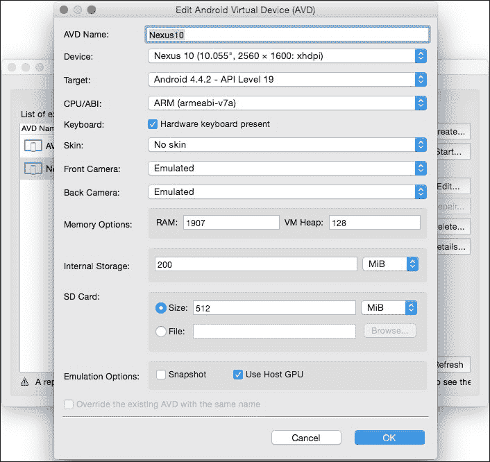
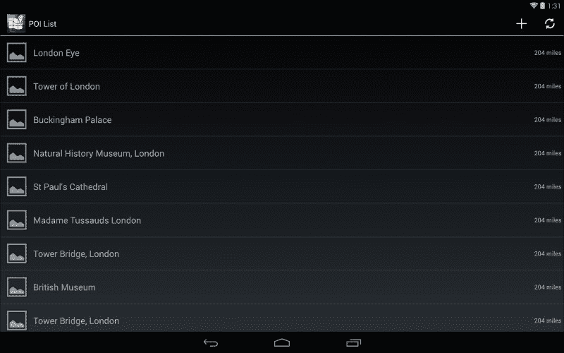
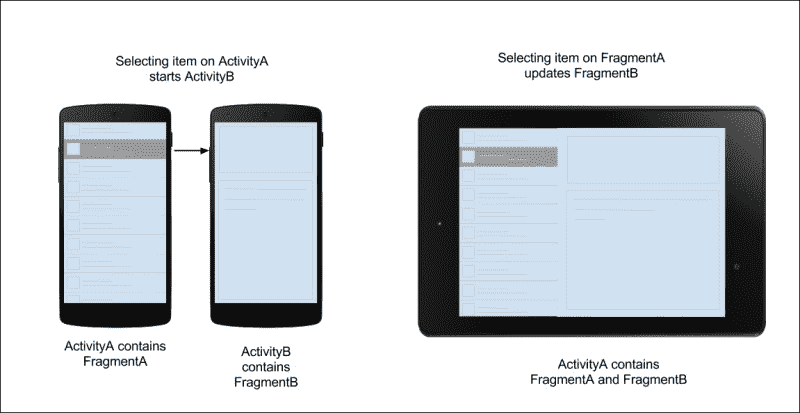
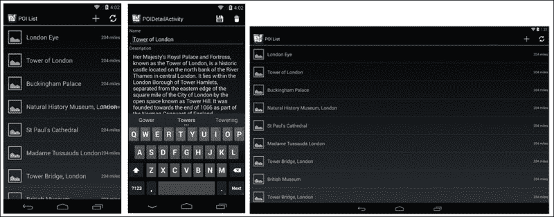
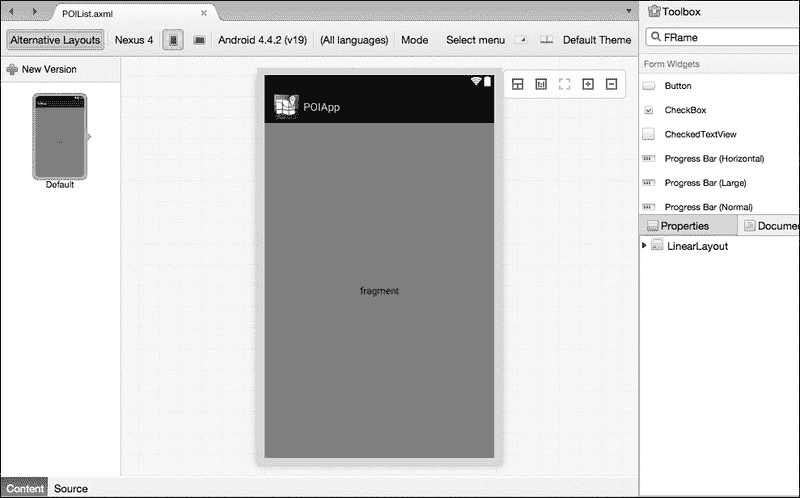
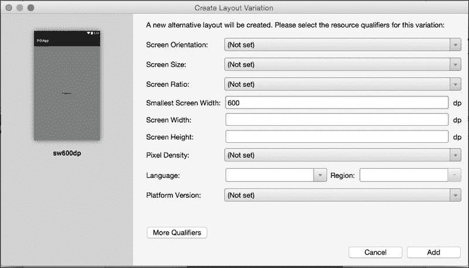
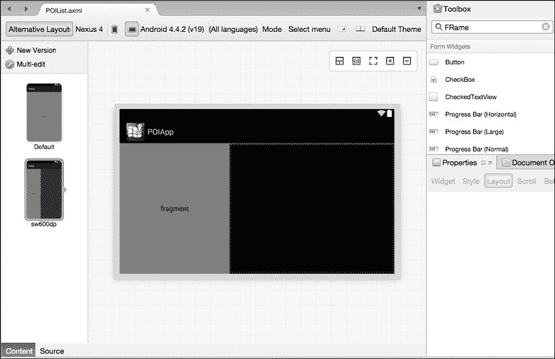
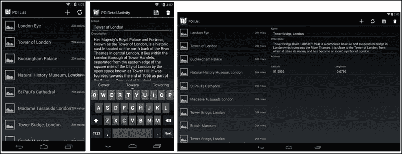
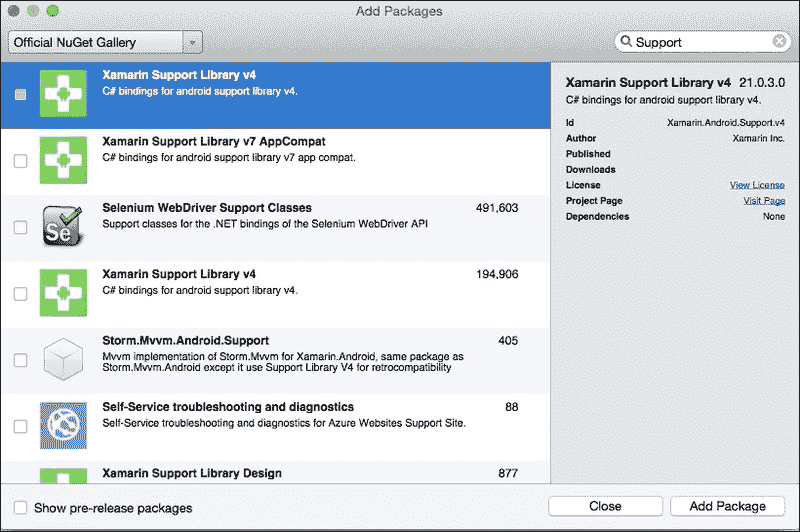

# 第七章：为多种屏幕尺寸设计

2011 年初，安卓蜂巢 3.0（API 级别 11）发布，专门用于支持更大屏幕尺寸的平板电脑。从那时起，安卓生态系统爆炸式增长，所有后续的安卓版本都旨在提供更多屏幕尺寸，包括智能手机、平板电脑和谷歌电视。

本章将指导您处理多种屏幕尺寸并使您的应用程序兼容智能手机和平板电脑。在本章的过程中，我们将扩展我们一直在开发的`POIApp`并为其优化以适应安卓平板电脑。本章将涵盖以下主题：

+   安卓平板电脑生态系统简介

+   创建和管理片段

+   使`POIApp`与安卓平板电脑兼容

+   处理`ListFragment`以显示 POI 列表

+   为平板电脑创建多面板布局

+   为安卓平板电脑添加替代布局

+   使用`DialogFragment`显示对话框

+   为旧版安卓设备使用片段

+   在设备配置更改时保留片段状态

# 安卓平板电脑简介

第一款安卓平板电脑于 2011 年发布，搭载安卓版本 3.0。然而，所有后续的安卓版本都旨在支持一系列屏幕尺寸，包括小、中和大尺寸。由于其开放性，安卓生态系统拥有各种设备制造商，因此存在不同屏幕尺寸和密度的设备。

为安卓智能手机构建的应用程序可以在不进行任何更改的情况下在平板电脑上运行。然而，如果 UI 没有优化，它将给您带来不愉快的用户体验。开发者必须将额外空间视为机会，并有效地利用它来设计一个可以在更大屏幕上显示更多信息的 UI。例如，安卓手机中的 Gmail 应用程序将有两个活动来显示最近的电子邮件列表和所选电子邮件的详细信息。然而，同一应用程序在平板电脑上使用多面板分割视图布局在同一页面上显示电子邮件列表和详细信息。

设计安卓应用程序用户界面时需要考虑的关键因素如下：

+   **屏幕尺寸**：这是设备的实际物理屏幕尺寸；通常分为小、正常、大和超大。尽管没有官方确认最小和最大屏幕尺寸，但它们通常在 2.55 到 10.1 英寸之间。

+   **屏幕密度**：这是屏幕物理区域中像素的数量，表示为 dpi（每英寸点数）。高密度屏幕比低密度屏幕有更多的像素。

+   **分辨率**：这是设备屏幕上像素的数量。它通常定义为`宽度 x 高度`。例如，Nexus 5 设备的分辨率为`1080 x 1920`。

+   **屏幕方向**：设备的方向可以是横屏或竖屏模式。

# 创建安卓平板电脑模拟器

到目前为止，我们已经构建了 `POIApp` 来显示从服务器获取的 POI 列表，并在 Android 智能手机上进行了测试。在我们开始扩展 `POIApp` 以支持 Android 平板电脑之前，让我们为 Android 平板电脑创建一个新的模拟器实例并运行到目前为止构建的现有 `POIApp`。

为了创建平板电脑的模拟器，执行以下步骤：

1.  从主菜单栏导航到 **工具** 并打开 **Google 模拟器管理器**。这将打开 AVD 管理器窗口。

1.  要创建一个新的模拟器，点击右侧面板中的 **创建** 按钮。

1.  将 **AVD 名称** 字段设置为 `Nexus10`，从 **设备** 下拉菜单中选择 **Nexus 10**，将 **目标** 字段设置为 `Android 4.4.x`，如果需要，取消选中 **硬件键盘存在** 选项，然后点击 **确定**。

1.  注意，**目标** 设置指定了模拟器将使用的 Android 平台版本和 API 级别。

1.  提供如以下截图所示的配置，例如 **AVD 名称**、**设备**、**皮肤**、**目标**、**内存选项**等：

如果您正在使用第三方模拟器解决方案，例如 Xamarin Android Player 或 Genymotion，您可以在平板电脑配置中下载 Nexus 7 或 Nexus 10 模拟器进行测试。

现在启动之前步骤中创建的 Nexus 10 模拟器，并运行到目前为止构建的现有 `POIApp`。以下截图显示了未针对大屏幕优化的平板电脑上的 `POIApp` 用户界面：



利用额外的屏幕空间，UI 元素可以组织在各个位置，使应用看起来更美观。目前，`POIApp` 使用两个活动来显示 POI 列表和 POI 详细信息。对于平板电脑，我们可以使用多面板分割布局，在同一个活动中通过共享相同的屏幕空间来显示 POI 列表和详细信息。Android 活动旨在用于单一目的，并且不允许在另一个活动内部嵌入活动。Android 片段可以用来解决这个问题。片段是一个可重用的用户界面组件，用于为不同屏幕尺寸构建动态和模块化的用户界面。一个活动可以包含一个片段或多个片段。

# 片段简介

片段是用户界面组件的一部分，提供了对应用程序设计的灵活性。正如您在第一章“Android 应用解剖”中学到的，片段是可重用的迷你活动，如 UI 组件，可以管理它们自己的生命周期。片段总是旨在在没有依赖另一个活动或片段的情况下工作。与 `Activity` 类一样，片段类需要从 `Fragment` 类扩展。为了使事情更加简单，Android 提供了一些额外的专用片段子类，例如 `ListFragment`、`DialogFragment` 和 `PreferenceFragment`。

下表显示了片段子类及其用途列表。您还可以扩展以下任何片段子类以创建自己的片段。

`ListFragment`

这显示了来自不同来源的数据项列表，例如数组、游标等。

`DialogFragment`

这显示了一个作为浮动对话框窗口的片段。

`PreferenceFragment`

这显示了应用程序的首层偏好设置列表。当用户进行任何更改时，偏好设置将被保存。Nexus 设备设置屏幕设计遵循`PreferenceFragment`模式。

## 创建一个新的片段

片段可以被视为活动的一个模块化组件，它维护自己的生命周期，处理用户事件，并且可以被添加到或从运行的活动中移除。创建片段的过程与创建活动非常相似。

在 Android 中创建和添加片段的步骤如下：

1.  创建片段的第一步是定义其布局。与活动布局类似，您可以使用 Xamarin Studio 中可用的拖放界面构建器，或者您可以使用 XML 代码编辑器来创建布局。

1.  创建一个直接扩展`Fragment`类或其子类的新的类。以下代码片段扩展了`Fragment`基类：

    ```java
    public class MyFragment : Fragment
    {
    -----
    -----
    }
    ```

1.  现在实现必要的片段方法。首先，让我们重写`OnCreateView()`方法。此方法将片段添加到视图层次结构，并返回一个表示片段的`View`实例。

    片段的 UI 可以通过两种方式创建：通过在`OnCreateView()`中声明 XML 布局并填充片段布局，或者通过动态创建所有接口。为了简单起见，总是首选 XML 声明方法：

    ```java
    public override View OnCreateView(LayoutInflater inflater, ViewGroup container, Bundle savedInstanceState)
    {
      // Inflate the layout for your fragment
      View view = inflater.Inflate(Resource.Layout.MyFragmentLayout, container, false);
       // Initialize other view controls
      return view;
    }
    ```

    可选地，您可以覆盖其他片段生命周期，如`OnPause()`、`OnResume()`等，以控制其他生命周期事件回调。

1.  最后，让我们将片段添加到活动中。这可以通过两种方式完成：要么通过声明性添加活动布局，要么通过编程添加。

使用以下代码片段通过在活动布局中声明`<fragment>`标签来添加片段：

```java
&lt;fragment class="MyApp.MyFragment"
  android:id="@+id/myFragment"
  android:layout_width="match_parent"
  android:layout_height="match_parent" /&gt;
```

要动态添加片段，您需要首先创建一个片段占位符容器布局并为其分配一个 ID：

```java
&lt;FrameLayout
  android:id="@+id/myFragmentContainer"
    android:layout_width="match_parent"
  android:layout_height="match_parent" /&gt;
```

现在您已经指定了片段将动态添加到的`ViewGroup`，您可以使用`FragmentTransaction`实例来添加、删除和替换事务。使用以下代码片段来获取`FragmentTransaction`实例：

```java
MyFragment myFragment = new MyFragment();
FragmentTransaction ft = FragmentManager.BeginTransaction();
```

然后，您可以通过传递片段实例和片段将要添加到的`View`的 ID 来使用`Add()`、`Remove()`和`Replace()`方法。一旦片段事务完成，您必须调用`Commit()`方法以使更改生效：

```java
ft.Add(Resource.Id.myFragmentContainer, myFragment);
ft.Commit();
```

到目前为止，你对如何使用片段有了相当的了解；现在让我们继续让 `POIApp` 与片段一起工作，并重用片段来优化平板电脑的布局。

# 使 `POIApp` 兼容 Android 平板

在第一章 *Android App 的解剖结构* 中，我们已经覆盖了很多关于片段基础和生命周期的内容。如果你还没有阅读这些概念，我建议你阅读一下。现在让我们通过以下步骤来创建和管理片段，并构建 `POIApp` 以支持多栏平板电脑布局。

目前，`POIApp` 正在使用两个活动：`POIListActivity` 用于显示 POI 列表，`POIDetailsActivity` 用于显示详情。现在我们将创建两个新的片段：`POIListFragment` 和 `POIDetailFragment`，这两个片段将被重用于智能手机和多栏平板电脑布局：



注意以下截图中的要点，这些将在本章其余部分中实现：

1.  手机布局包含两个活动；`POIListActivity` 和 `POIDetailsActivity`，分别托管 `POIListFragment` 和 `POIDetailFragment`。在这里，活动将像占位符一样工作，以容纳片段。大部分的应用逻辑都应该从活动移动到片段中。

1.  `POIListFragment` 将包含初始化列表视图的逻辑，使用在 `POIService` 类中声明的方法下载数据，并准备用户界面。目前，相同的逻辑放置在 `POIListActivity` 中。

1.  `POIDetailFragment` 将包含显示所选 POI 详情的逻辑，以及创建、更新和删除 POI 的能力。

1.  平板电脑的可用空间相对较大，因此其布局可以在单个活动中同时容纳 `POIListFragment` 和 `POIDetailFragment`。这使我们能够重用片段，并允许在不同屏幕尺寸上提供不同的用户体验。

本章的以下部分将指导你如何使用片段构建 `POIApp`，使用 Android 平板的分栏视图布局。

# 使用片段显示 POIDetails

为了使事情简单，我们将逐步进行。首先，让我们创建一个新的片段来显示 POI 的详情，这将使你能够编辑、更新和删除 POI。目前，`POIDetailActivity` 活动包含相同的逻辑。在这个阶段，让我们保持简单，不要通过考虑多栏平板电脑布局来使事情复杂化。

## 创建 POIDetailsFragment 布局

让我们从为 POI 详情片段创建一个新的布局文件开始，并将其命名为 `POIDetailFragment.axml`：

1.  在 **Solution** 面板中选择 `Resources/Layout` 文件夹。

1.  右键单击 **Add** 并选择 **New File**。

1.  在 **New File** 对话框中，点击 **Android** 并选择 **Layout**，在 **Name** 字段中输入 `POIDetailFragment`，并选择 **New**。

1.  注意，我们不会对 POI 详细信息屏幕布局进行任何更改。所以，我们只需将`POIDetail.axml`中的布局 XML 源代码复制并粘贴到新创建的`POIDetailFragment.axml`文件中。

## 创建 POIDetailFragment

现在我们已经准备好了 POI 详细信息片段布局，我们需要相应的片段。要创建`POIDetailFragment`，请执行以下步骤：

1.  在**解决方案**面板中选择`POIApp`项目，右键单击它，然后导航到**添加** | **新建文件**。

1.  从**新建文件**对话框中，点击**Android**并选择**Fragment**，在**名称**字段中输入`POIDetailFragment`，然后点击**新建**。

    在前一步骤中创建的`POIDetailFragment`将包含显示 POI 详细信息并启用各种操作的逻辑，例如创建、更新和删除 POI。目前，业务逻辑在`POIDetailsActivity`中。

1.  为我们在布局中创建的每个输入小部件声明以下私有变量。将以下列表添加到您的`POIDetailFragment`类中：

    ```java
    PointOfInterest _poi;
     EditText _nameEditText;
    EditText _descrEditText;
    EditText _addrEditText;
    EditText _latEditText;
    EditText _longEditText;
    ```

1.  重写`OnAttach()`方法并保存`activity`实例的引用：

    ```java
    private Activity activity;
    public override void OnAttach (Activity activity)
    {
      base.OnAttach (activity);
      this.activity = activity;
    }
    ```

1.  重写`OnCreateView()`方法，填充片段布局，并通过调用`FindViewById<T>`方法和`UpdateUI()`方法将每个变量绑定到相应的用户界面小部件：

    ```java
    public override View OnCreateView(LayoutInflater inflater, ViewGroup container, Bundle savedInstanceState)
    {
      View view = inflater.Inflate(Resource.Layout.POIDetailFragment, container, false);
       _nameEditText = view.FindViewById&lt;EditText&gt;(Resource.Id.nameEditText);
      _descrEditText = view.FindViewById&lt;EditText&gt; (Resource.Id.descrEditText);
      _addrEditText = view.FindViewById&lt;EditText&gt; (Resource.Id.addrEditText);
      _latEditText = view.FindViewById&lt;EditText&gt; (Resource.Id.latEditText);
      _longEditText = view.FindViewById&lt;EditText&gt; (Resource.Id.longEditText);
     UpdateUI();
      return view;
    }
    ```

1.  将`UpdateUI()`、`SavePOI()`、`DeletePOI()`和`ConfirmDelete()`方法从`POIDetailsActivity`类复制并粘贴到`POIDetailFragment`类中。您将在使用此关键字的地方遇到编译错误。将其替换为活动实例。

1.  现在将`CreateOrUpdatePOIAsync()`和`DeletePOIAsync()`方法从`POIDetailsActivity`复制到`POIDetailFragment`类中。在这里，你将再次注意到`Finish()`方法和`Toast`初始化附近出现编译错误。对于`Toast`实例化，将其替换为活动实例，并将`Finish()`替换为`activity.Finish()`。

1.  现在让我们重写`OnCreate()`方法。在这里，我们将检索发送到`POIDetailFragment`的 POI 详细信息。每个片段都有一个`Arguments`属性，其中包含数据包。与活动一样，我们可以使用一系列`GetXXX()`方法，其中`XXX`代表名称/值对的值的类型：

    ```java
    public override void OnCreate (Bundle savedInstanceState)
    {
      base.OnCreate (savedInstanceState);
      if (Arguments!=null &amp;&amp; Arguments.ContainsKey("poi")) {
        string poiJson = Arguments.GetString ("poi");
        _poi = JsonConvert.DeserializeObject&lt;PointOfInterest&gt;(poiJson);
      } else {
        _poi = new PointOfInterest ();
      }
    }
    ```

## 操作保存和删除操作

`POIDetailFragment`向用户显示所选 POI 的详细信息，并保留保存新 POI 或删除现有 POI 的能力。保存和删除操作需要添加到`POIDetailFragment`中的操作栏。

以下步骤将指导您了解在`POIDetailFragment`中添加操作所需的内容：

1.  要使片段中的动作栏按钮工作，您需要首先通过调用`SetHasOptionsMenu()`方法并传递`bool`值`true`来启用此选项。`bool`值表示片段是否希望贡献以填充菜单项。在`OnCreateView()`中的`return`语句之前添加以下代码块：

    ```java
    SetHasOptionsMenu (true);
    ```

1.  在第五章“添加详情视图”中，我们已经将菜单声明添加到了`POIDetailMenu.xml`文件。`POIDetailFragment`将继续使用相同的菜单 XML 声明。

1.  在`POIDetailFragment`中重写`OnCreateOptionsMenu()`和`OnOptionsItemSelected()`方法的片段版本，并添加以下代码块：

    ```java
    public override void OnCreateOptionsMenu (IMenu menu, MenuInflater inflater)
    {
      inflater.Inflate(Resource.Menu.POIDetailMenu, menu);
      base.OnCreateOptionsMenu (menu, inflater);
    }
     public override bool OnOptionsItemSelected (IMenuItem item)
    {
      switch (item.ItemId)
      {
        case Resource.Id.actionSave:
          SavePOI ();
          return true;
        case Resource.Id.actionDelete: 
          DeletePOI ();
          return true;
        default:
          return base.OnOptionsItemSelected(item);
      }
    }
    ```

    注意，在之前的代码块中，我们在填充`save`和`delete`操作时没有对逻辑进行任何更改。这只是相同代码的副本，它被用于`POIDetailActivity`类。

1.  在`POIDetailFragment`中重写`OnPrepareOptionsMenu()`方法，以在创建新 POI 时禁用删除操作。

以下列表展示了如何在新 POI 创建时禁用删除操作：

```java
public override void OnPrepareOptionsMenu (IMenu menu)
{
  base.OnPrepareOptionsMenu (menu);
  if (_poi.Id &lt;= 0) {
    IMenuItem item = menu.FindItem (Resource.Id.actionDelete);
    item.SetEnabled (false);
    item.SetVisible(false);
  }
}
```

## 将 POIDetailFragment 添加到 POIDetailActivity

现在我们已经准备好了`POIDetailFragment`，我们可以将其添加到`POIDetailActivity`中使其完全功能化。正如本章前面所讨论的，一个片段可以通过两种方式添加到活动中：使用声明性方法，或者通过动态填充布局。对于`POIDetailActivity`，我们将动态地添加片段。

以下章节将带您了解将`POIDetailFragment`添加到`POIDetailActivity`活动中的代码重构过程。

### 修改 POI 详情活动布局

现在我们已经将整个详情视图布局放置在`POIDetailFragment`布局中，`POIDetail`活动布局将有一个简单的容器，可以容纳片段。为此，我们可以使用`FrameLayout`。

`FrameLayout`是一种特殊的布局管理器，通常用于显示单个项目。当添加多个视图时，它们被放置在一个堆栈中，最近添加的子视图位于顶部。

让我们对 POI 详情活动布局进行以下更改，并添加一个占位符视图以容纳片段：

1.  打开`Resources/POIDetail.axml`文件，在**文档大纲**视图中点击**ScrollView**，然后点击**删除**。注意布局将变为空。

1.  在**工具箱**中搜索**FrameLayout**，并将其拖到模拟器窗口中作为根元素添加。

1.  在**文档大纲**视图中点击**FrameLayout**，然后点击**属性**窗口。将视图 ID 设置为`poiDetailLayout`。

1.  在布局编辑器的**源**选项卡中点击，注意以下代码被生成：

    ```java
    &lt;?xml version="1.0" encoding="utf-8"?&gt;
    &lt;FrameLayout 
        p1:minWidth="25px"
        p1:minHeight="25px"
        p1:layout_width="match_parent"
        p1:layout_height="match_parent"
        p1:id="@+id/poiDetailLayout " /&gt;
    ```

### 重构 POIDetailActivity 以添加 POIDetailFragment

目前，`POIDetailFragment`包含我们在`POIDetailActivity`中编写的逻辑，以执行添加、更新或删除操作。现在让我们重构`POIDetailActivity`，简化逻辑，并仅将其添加到其中：

1.  从解决方案资源管理器中打开`POIDetailActivity`类。

1.  选择所有代码并删除除基本活动模板之外的所有内容。为了简化，你可以用以下代码替换整个`POIDetailActivity`类：

    ```java
    using Android.App;
     namespace POIApp
    {
      [Activity (Label = "POIDetailActivity")]    
      public class POIDetailActivity : Activity
      {
        PointOfInterest _poi;
        protected override void OnCreate (Bundle bundle)
        {
          base.OnCreate (bundle);
          SetContentView (Resource.Layout.POIDetail);  
        }
      }
    }
    ```

1.  现在是时候将`POIDetailFragment`添加到`Activity`中。让我们首先初始化`POIDetailFragment`，并传递从`POIListActivity`接收到的 POI 详细信息数据。

    要显示所选 POI 的详细信息，`POIDetailFragment`期望将 POI 数据传递给它。像任何其他活动一样，可以使用其`Arguments`属性将数据包传递给片段。`Arguments`属性有一组自己的`PutXX()`和`GetXX()`方法（`XX`代表数据类型，如字符串、双精度浮点数等），用于从片段发送和检索数据。

    在`SetContentView()`方法之后立即将以下代码片段添加到`OnCreate()`回调中：

    ```java
    var detailFragment = new POIDetailFragment();
    detailFragment.Arguments = new Bundle ();
    if (Intent.HasExtra ("poi")) {
        string poiJson = Intent.GetStringExtra ("poi");
        detailFragment.Arguments.PutString("poi", poiJson);}
    ```

1.  `POIDetailActivity`布局包含一个占位符布局，其中将添加`POIDetailFragment`。`FragmentTransaction`类可用于执行任何片段事务，例如添加、替换或删除片段。实例化片段事务以将`POIDetailFragment`添加到`POIDetailActivity`视图层次结构中：

    ```java
    FragmentTransaction ft = FragmentManager.BeginTransaction();
    ft.Add(Resource.Id.poiDetailLayout, detailFragment);
    ft.Commit();
    ```

1.  现在让我们在模拟器中构建并运行应用程序。注意，你将看到我们在第五章“添加详细信息视图”中构建的相同输出。现在我们正在使用`POIDetailFragment`，它包含添加、更新和删除 POI 的逻辑。

在创建平板电脑的多面板分割视图布局时，将重用相同的`POIDetailFragment`。

# 使用列表片段显示 POI 列表

到目前为止，我们已经使用`Fragment`子类创建了一个片段来显示兴趣点的详细信息。现在让我们使用专门的`ListFragment`类来创建一个新的片段，用于显示从服务器获取的 POI 列表。

## 理解列表片段

在我们开始创建`POIListFragment`之前，让我们了解`ListFragment`的以下关键概念：

+   `ListFragment`是一个用于显示来自不同数据源（如数组或游标）的项目列表的专门`Fragment`子类，这些数据源包含查询结果。

+   `ListFragment`提供了一个默认布局，其中包含一个单独的列表视图。但是，可以使用自己的自定义布局进行自定义。

+   在为`ListFragment`使用自定义布局时，你的布局必须包含一个 ID 为`@android:id/list`的`ListView`对象。

+   与正常的`ListView`一样，列表片段需要适配器的实例来操作。它公开了一个`ListAdapter`属性来设置列表适配器。

+   如果`ListFragment`允许检测用户对列表项的点击事件，你可以重写`OnListItemClick()`。

## 创建 POIListFragment 布局

在我们的示例中，`POIDetailsFragment`将包含一个占满父视图宽度和高度的`ListView`和一个位于屏幕中心的`ProgressBar`。我们现在将为`ListFragment`创建一个自定义布局。

让我们从创建用于 POI 列表片段的新布局文件开始，并将其命名为`POIListFragment.axml`。

1.  在**解决方案**面板中选择`Resources/Layout`文件夹。

1.  右键单击**添加**并选择**新建文件**。

1.  在**新建文件**对话框中，点击**Android**并选择**Android 布局**，在**名称**字段中输入`POIListFragment`，然后选择**新建**。

1.  将`POIList.axml`中的布局 XML 源代码复制并粘贴到新创建的`POIListFragment.axml`文件中。

1.  注意，我们正在声明`ListFragment`的自定义布局。我们必须将列表视图 ID 更改为`@android:id/list`。

`POILsitFragment.axml`文件将包含以下代码片段：

```java
&lt;?xml version="1.0" encoding="utf-8"?&gt;
&lt;RelativeLayout 
    android:orientation="vertical"
    android:layout_width="fill_parent"
    android:layout_height="fill_parent"
    android:minWidth="25px"
    android:minHeight="25px"&gt;
    &lt;ListView
        android:minWidth="25px"
        android:minHeight="25px"
        android:layout_width="wrap_content"
        android:layout_height="wrap_content"
        android:id="@android:id/list" /&gt;
    &lt;ProgressBar
        android:layout_width="wrap_content"
        android:layout_height="wrap_content"
        android:id="@+id/progressBar"
        android:layout_centerInParent="true"
        android:visibility="gone" /&gt;
&lt;/RelativeLayout&gt;
```

## 使用 POIListFragment 创建用于显示 POI 列表的片段

现在我们已经为`POIListFragment`准备好了布局，让我们继续创建一个新的片段来显示 POI 列表。注意，我们没有对我们的`POIListActivity`逻辑进行任何重大的修改。相反，我们将重构相同的逻辑以使其与片段一起工作。

执行以下步骤以创建`POIListFragment`并使其完全可用：

1.  在**解决方案**面板中选择`POIApp`，右键单击**添加**并选择**新建文件**。

1.  在**新建文件**对话框中，点击**Android**并选择**新建文件**，在**名称**字段中输入`POIListFragment`，然后选择**新建**。

1.  从`ListFragment`扩展它并实现`OnCreateView()`以填充 POI 列表片段布局：

    ```java
    namespace POIApp {
      public class POIListFragment: ListFragment 
      {
        public override View OnCreateView(LayoutInflater inflater, ViewGroup container, Bundle savedInstanceState)
        {
          View view = inflater.Inflate(Resource.Layout.POIListFragment, container, false);
          return view;
        }
      }
    }
    ```

    注意，具有自定义布局的列表片段需要声明一个 ID 为`@android:id/list`的`ListView`对象。

1.  在下载完成后，声明以下一组私有变量以保存列表适配器实例、进度条和 POI 列表：

    ```java
    private ProgressBar progressBar;
    private List&lt;PointOfInterest&gt; poiListData;
    private POIListViewAdapter poiListAdapter;
    ```

1.  重写`OnAttach()`方法并保存`activity`实例的引用：

    ```java
    private Activity activity;
    public override void OnAttach (Activity activity)
    {
      base.OnAttach (activity);
      this.activity = activity;
    }
    ```

1.  在`OnCreateView()`方法中的`return`语句之前添加以下代码块以初始化进度条：

    ```java
    progressBar = view.FindViewById&lt;ProgressBar&gt; (Resource.Id.progressBar);
    ```

1.  创建一个名为`DownloadPoisListAsync`的新方法（与在`POIListActivity`中声明的相同）。我们将使用之前为`POIListActivity`编写的相同逻辑，并进行以下小的修改。你会在使用`this`关键字的地方得到编译错误。将`this`替换为`activity`实例：

    ```java
    public async void DownloadPoisListAsync(){
      POIService service = new POIService ();
      if (!service.isConnected (activity)) {
        Toast toast = Toast.MakeText (activity, "Not conntected to internet. Please check your device network settings.", ToastLength.Short);
        toast.Show ();
      } else {
        progressBar.Visibility = ViewStates.Visible;
        poiListData = await service.GetPOIListAsync ();
        progressBar.Visibility = ViewStates.Gone;
         poiListAdapter = new POIListViewAdapter (activity, poiListData);
        this.ListAdapter = poiListAdapter;
      }
    }
    ```

    注意，在前面的代码块中，我们使用了在`ListFragment`类中定义的`ListAdapter`属性来设置适配器实例。

1.  重写`OnResume()`生命周期方法并调用`DownloadPoisListAsync()`以在片段恢复时开始下载：

    ```java
    public override void OnResume ()
    {
        DownloadPoisListAsync ();
      base.OnResume ();
    }
    ```

1.  注意，`POIListFragment`通过在`OnCreateView()`方法中添加以下语句来为片段添加动作栏菜单项，并在`return`语句之前启用此选项：

    ```java
    SetHasOptionsMenu (true);
    ```

1.  重写片段版本的`OnCreateOptionsMenu`和`OnOptionsItemSelected`方法，并粘贴以下代码。我们只是重用了`POIListActivity`中的相同逻辑：

    ```java
    public override void OnCreateOptionsMenu (IMenu menu, MenuInflater inflater)
    {
      <span class="strong"><strong>inflater.Inflate(Resource.Menu.POIListViewMenu, menu);</strong></span>
      base.OnCreateOptionsMenu (menu, inflater);
    }
     public override bool OnOptionsItemSelected (IMenuItem item)
    {
      switch (item.ItemId)
      {
      case Resource.Id.actionNew:
    <span class="strong"><strong>    Intent intent = new Intent (activity, typeof(POIDetailActivity));</strong></span>
        StartActivity (intent);
        return true;
      case Resource.Id.actionRefresh:
        DownloadPoisListAsync ();
        return true;
      default :
        return base.OnOptionsItemSelected(item);
      }
    }
    ```

1.  重写`OnListItemClick()`方法，从`ListFragment`中检测列表行点击动作。以下代码块是我们为`POIListActivity`中的`POIClicked()`方法编写的相同逻辑的副本：

    ```java
    public override void OnListItemClick (ListView l, View v, int position, long id)
    {
      <span class="strong"><strong>PointOfInterest poi = poiListData[position];  </strong></span>
    Intent poiDetailIntent = new Intent(activity, typeof(POIDetailActivity));
       string poiJson = JsonConvert.SerializeObject(poi); 
      poiDetailIntent.PutExtra("poi", poiJson);
      StartActivity(poiDetailIntent);
    }
    ```

到目前为止，列表片段将显示 POI 列表，并准备好添加到`POIListActivity`。

## 将`POIListFragment`添加到`POIListActivity`

为了使`POIListFragment`能够工作，它必须被添加到`POIListActivity`中。在前一节中，你学习了如何动态添加片段。现在，让我们使用声明性方法添加`POIListFragment`。

### 修改 POI 列表活动布局

可以使用布局中的`&lt;fragment&gt;`标签声明将片段添加到活动视图层次结构。`&lt;fragment&gt;`标签的`layout_width`和`layout_height`属性用于控制将片段的视图附加到活动布局时提供的`LayoutParams`。

对 POI 列表活动布局（`POIList.axml`）进行以下更改，以静态地添加`POIListFragment`：

```java
&lt;?xml version="1.0" encoding="utf-8"?&gt;
&lt;LinearLayout 
    android:layout_width="match_parent"
    android:layout_height="match_parent"
    android:minWidth="25px"
    android:minHeight="25px"
    android:orientation="horizontal"&gt;
    &lt;fragment
        class="POIApp.POIListFragment"
        android:id="@+id/listFragment"
        android:layout_width="match_parent"
        android:layout_height="match_parent" /&gt;
&lt;/LinearLayout&gt;
```

`&lt;fragment&gt;`属性的值应该是完全限定的片段类名。`class`属性表示指定的片段类将被附加到活动的内容布局。

### 将`POIListFragment`添加到`POIListActivity`

现在我们已经准备好了`POIListFragment`，并且已经将其附加到 POI 列表活动内容布局，我们不需要在`POIListActivity`内部做太多事情。使用以下代码块更新现有的`POIListActivity`类：

```java
using Android.App;
using Android.Os;
 namespace POIApp
{
  [Activity (Label = "POI List")]
  public class POIListActivity : Activity
  {
    protected override void OnCreate (Bundle bundle)
    {
      base.OnCreate (bundle);
      SetContentView (Resource.Layout.POIList);
    }
  }
}
```

到目前为止，我们已经通过创建两个片段来处理下载和显示 POI 详情的逻辑，完成了很多工作。现在，是时候编译并运行应用了。在 Android 模拟器上编译并运行应用：



注意，该应用将从 POI 网络服务下载数据，并在可滚动列表视图中显示 POI 列表。它的工作方式与我们在第五章“添加详情视图”中构建它时完全相同，但现在它使用的是片段。

# 为平板电脑创建多面板布局

到现在为止，你对片段的工作方式有了相当的了解，我们已经重构了现有的`POIApp`以使用片段。以下章节将指导你完成构建多面板布局和使应用兼容 Android 平板电脑的关键步骤。

在第六章“使应用方向感知”中，我们讨论了在 Android 中添加替代布局时需要考虑的各种配置限定符。其中一个限定符是设备的屏幕尺寸。Android 设备的尺寸范围从小型、正常、大型、超大到布局-xxlarge。自 Android 3.2 以来，Android 建议您使用`sw<N>dp`配置限定符来定义平板电脑的额外大型布局。

假设我们需要至少`600dp`的屏幕宽度来为`POIApp`构建多窗格布局。为此，我们需要在`Resources`目录下添加一个新的`layout-sw600dp`子目录。如果设备配置匹配`600dp`的宽度，Android 运行时会选择此目录下放置的布局。

对于平板电脑配置，`POIListActivity`布局将在单个活动中同时托管`POIListFragment`和`POIDetailFragment`。POI 列表片段将放置在屏幕左侧，覆盖总宽度的 40%，而详情片段则停靠在右侧，覆盖剩余的 60%总宽度。

Xamarin Studio 提供了一个易于使用的布局设计器，允许您轻松地为各种设备配置添加布局，而无需任何麻烦。您无需记住或手动添加不同配置限定符的不同文件夹名称。设计器负责为不同配置创建、编辑和删除替代布局。

以下部分展示了 Xamarin Studio 布局设计器的用法，用于为 Android 平板电脑添加替代布局：

1.  打开`POIList.axml`布局文件，并点击**内容**选项卡以打开布局设计器。

1.  点击位于左上角的**替代布局**按钮。这启用了一个特殊编辑器来管理替代布局。以下截图展示了 Xamarin Studio 提供的特殊编辑器，用于编辑和管理不同配置的替代布局：

1.  点击**新建版本**按钮，为给定配置添加布局的另一个版本。

1.  这将打开一个对话框，要求输入不同的配置参数。目前，我们将平板电脑布局的最小宽度视为`600dp`。输入最小的屏幕宽度值`600`，然后点击**添加**：

1.  注意，将创建一个名为`layout-sw600dp`的新文件夹，并在项目资源管理器中创建`POIList`布局的新版本。

1.  选择`sw600dp`布局进行编辑。

1.  在**工具箱**中搜索**FrameLayout**，并将其拖到模拟器窗口中，作为根元素添加。这将用于在用户从列表中选择任何 POI 时动态添加`POIDetailFragment`。

1.  在**文档大纲**视图中点击**FrameLayout**，然后点击**属性**窗口。将视图 ID 设置为`poiDetailLayout`。

1.  现在我们已经在屏幕上有一个列表片段和一个帧布局。让我们为列表分配 40%的屏幕宽度以显示，为详情布局分配 60%的宽度。这可以通过使用`weight`属性来完成。

    从**文档大纲**视图中选择`listFragment`，并将权重属性更改为`2`以及`layout_width`属性更改为`0dp`。这允许权重属性决定视图的宽度。现在，从文档大纲视图中选择`detailsLayout`，并将权重属性更改为`3`以及`layout_width`属性更改为`0dp`。

1.  将`listFragment`和`detailsLayout`的**Padding left**和**Padding right**属性设置为`20dp`。

    以下截图展示了到目前为止构建的布局：

    

1.  点击**源**选项卡，注意以下代码被生成：

    ```java
    &lt;?xml version="1.0" encoding="utf-8"?&gt;
    &lt;LinearLayout 
        android:layout_width="match_parent"
        android:layout_height="match_parent"
        android:minWidth="25px"
        android:minHeight="25px"
        android:orientation="horizontal"&gt;
        &lt;fragment
          class="POIApp.POIListFragment"
          android:id="@+id/listFragment"
          android:layout_width="0dp"
          android:layout_height="match_parent"
          android:layout_weight="2" 
          android:paddingLeft="20dp"
          android:paddingRight="20dp" /&gt;
        &lt;FrameLayout
          android:minWidth="25px"
          android:minHeight="25px"
          android:layout_width="0dp"
          android:layout_height="match_parent"
          android:id="@+id/poiDetailLayout"
          android:layout_weight="3"
          android:paddingLeft="20dp"
          android:paddingRight="20dp" /&gt;
    &lt;/LinearLayout&gt;
    ```

# 将 POIApp 更新为支持多面板分割布局

在 Android 平板电脑中，POI 活动布局被声明为通过共享相同的屏幕空间来容纳 POI 列表和 POI 详情片段。`POIListFragment`被静态添加到布局中，当用户从列表中选择任何 POI 项时，`POIDetailFragment`将被动态添加。具有`detailsLayout` ID 的`FrameLayout`用作占位符以容纳`POIDetailFragment`。然而，在移动设备中，当用户点击任何 POI 列表项时，它将继续启动`POIDetailActivity`。

以下步骤将指导您进行必要的更改，以使`POIApp`在 Android 平板电脑上的多面板布局中工作：

1.  首先，我们需要找出设备是否正在多面板模式下运行。这有助于了解您是想在新的活动中启动还是更新同一活动中的片段内容。让我们声明一个静态布尔变量，用于保存应用程序是否在双模式下的信息：

    ```java
    public static bool isDualMode = false;
    ```

1.  如果`detailsLayout`不为`null`且可见，则我们可以假设设备正在多面板视图模式下运行。在`POIListActivity`的`OnCreate()`方法中添加以下代码块以初始化`isDualMode`变量：

    ```java
    var detailsLayout = FindViewById (Resource.Id.poiDetailLayout);
    if (detailsLayout != null &amp;&amp; detailsLayout.Visibility == ViewStates.Visible) {
        isDualMode = true;
    }else{
    isDualMode = false;
    }
    ```

1.  目前，`POIListFragment`中的新操作会将用户带到`POIDetailActivity`。现在对于平板电脑，而不是调用另一个活动，`POIDetailFragment`将显示在同一活动的右侧。

    将以下代码块添加到`OnOptionsItemSelected()`方法下的新操作：

    ```java
    case Resource.Id.actionNew:
        if (POIListActivity.isDualMode) {
            var detailFragment = new POIDetailFragment();
            FragmentTransaction ft = FragmentManager.BeginTransaction ();
            ft.Replace (Resource.Id.poiDetailLayout, detailFragment);
            ft.Commit ();
        } else {
            Intent intent = new Intent (activity, typeof(POIDetailActivity));
            StartActivity (intent);
        }
    return true;
    ```

    注意，由于我们没有传递任何 POI 的详细信息，`POIDetailsFragment`将显示空字段并允许用户添加新的 POI。

1.  如前所述，我们还需要在`OnListItemClick()`方法中实现相同的逻辑。当用户点击 POI 列表项时，而不是将他们带到另一个活动，POI 详情将在同一活动的右侧详情面板中显示。

    使用以下代码片段更新`OnListItemClick()`方法：

    ```java
    public override void OnListItemClick (ListView l, View v, int position, long id)
    {
      PointOfInterest poi = poiListData[position];
      if (POIListActivity.isDualMode) {
        var detailFragment = new POIDetailFragment();
        detailFragment.Arguments = new Bundle ();
        detailFragment.Arguments.PutString("poi", JsonConvert.SerializeObject(poi));
         FragmentTransaction ft = FragmentManager.BeginTransaction ();
        ft.Replace (Resource.Id.poiDetailLayout, detailFragment);
        ft.Commit ();
      } else {
        Intent poiDetailIntent = new Intent(activity, typeof(POIDetailActivity));
        poiDetailIntent.PutExtra("poi", JsonConvert.SerializeObject(poi));
        StartActivity(poiDetailIntent);
      }
    }
    ```

我们几乎完成了！现在让我们在 Android 平板模拟器中运行 `POIApp`。你会注意到 POI 应用显示了多窗格布局，如下面的截图所示：



# 与 DialogFragment 一起工作

在本章中，我们已经介绍了如何使用片段和 `ListFragment` 来优化 Android 平板的布局。现在让我们讨论另一个专门的片段子类，`DialogFragment`。`POIApp` 的当前实现使用 `AlertDialog` 在删除 POI 之前向用户显示确认对话框。在本节中，我们将用 `DialogFragment` 替换 `AlertDialog` 实现。

`DialogFragment` 用于显示一个作为浮动对话框窗口的片段，该窗口会出现在当前窗口的顶部。`DialogFragment` 是片段的子类，并在 Android 3.0 API 级别 11 中引入。谷歌建议你使用 `DialogFragment` 来实现对话框，原因如下：

+   与普通片段一样，`DialogFragment` 管理自己的生命周期。例如，用户按下设备的返回按钮或旋转屏幕等事件都在 `DialogFragment` 中处理。

+   `DialogFragment` UI 可以被重用并嵌入到另一个活动内部。例如，如果你希望你的对话框在不同屏幕尺寸上显示不同，你可以在活动布局中嵌入 `DialogFragment`，这与普通片段类似。

+   虽然 `DialogFragment` 是在 Android 3.0 中引入的，但谷歌发布了 Android 支持库，通过它你可以使用 `DialogFragment` 类在运行 Android 1.6 或更高版本的设备上。接下来的部分（适用于旧版 Android 设备的片段）将描述如何将 Android 支持库添加到 Xamarin Studio 解决方案中。

在牢记前面的要点的基础上，我们将替换 `AlertDialog` 并在 `POIDetailFragment` 类中使用 `DialogFragment`。创建对话框片段的过程与创建普通片段类似。你需要首先创建一个继承自 `DialogFragment` 的类，并重写以下方法之一来为你的对话框提供视图层次结构：

+   `OnCreateView()`: 这个方法用于填充对话框的布局。它与 `Fragment.OnCreateView()` 回调相同。如果你想使你的片段 UI 可重用/嵌入到另一个视图内部，你必须重写 `OnCreateView()` 并填充布局。

+   `OnCreateDialog()`: 这个方法返回一个 `Dialog` 实例。在创建对话框布局时，这个方法会自动被调用。由于我们已经在 `POIApp` 中使用了 `AlertDialog`；在这个例子中，我们将重写 `OnCreateDialog()` 来创建 `DialogFragment`。

以下步骤将展示如何使用 `DialogFragment` 类向用户显示 **删除** 确认对话框：

1.  创建一个新的片段类，并将其命名为 `DeleteDialogFragment`。

1.  从 `DialogFragment` 类继承 `DeleteDialogFragment` 类：

    ```java
    public class DeleteDialogFragment : DialogFragment
    {
    }
    ```

1.  重写`OnCreateDialog()`方法并添加以下代码片段。在`OnCreateDialog()`方法中使用的代码块与我们之前在`POIDetailFragment`的`DeletePOI()`方法中使用的代码块类似：

    ```java
    public override Dialog OnCreateDialog (Bundle savedInstanceState)
    {
      AlertDialog.Builder alertConfirm = new AlertDialog.Builder(this.Activity);
      alertConfirm.SetTitle("Confirm delete");
      alertConfirm.SetCancelable(false);
      alertConfirm.SetPositiveButton("OK", delegate {});
      alertConfirm.SetNegativeButton("Cancel", delegate {});
      alertConfirm.SetMessage("Are you sure you want to delete?");
      return alertConfirm.Create ();
    }
    ```

1.  我们已经构建了一个基本的`DialogFragment`版本。现在我们需要初始化片段并使用`FragmentTransaction`来显示对话框。将以下代码片段添加到`POIDetailFragment DeletePOI()`方法中：

    ```java
    FragmentTransaction ft = FragmentManager.BeginTransaction();
    DeleteDialogFragment dialogFragment = new DeleteDialogFragment ();
    dialogFragment.Show(ft, "dialog");
    ```

    任何其他片段的操作都是通过片段事务来完成的。使用`Show()`方法将对话框片段添加到活动视图层次结构中，然后提交事务。这需要两个参数：一个片段事务的实例和一个标签。字符串值标签可以在以后用于从片段管理器检索片段实例。

1.  现在运行并测试`POIApp`。注意，对话框片段工作得很好。然而，它没有显示用户想要删除的 POI 的名称。

1.  要在**删除**确认对话框中显示 POI 的名称，我们需要将 POI 名称传递给`DeleteDialogFragment`。这可以通过使用片段的`Arguments`属性来实现。

    在片段初始化之后和调用`dialogFragment.Show()`之前，将以下代码片段添加到`DeletePOI()`方法中：

    ```java
    Bundle bundle = new Bundle();
    bundle.PutString("name", _poi.Name);
    dialogFragment.Arguments = bundle;
    ```

1.  现在我们需要在`DeleteDialogFragment`类的`OnCreateDialog()`方法中进行以下更改以检索和显示 POI 的名称：

    ```java
    public override Dialog OnCreateDialog (Bundle savedInstanceState)
    {
      <span class="strong"><strong>string poiName = Arguments.GetString("name");</strong></span>
      AlertDialog.Builder alertConfirm = new AlertDialog.Builder(this.Activity);
      ...
      ....
      <span class="strong"><strong>alertConfirm.SetMessage(String.Format("Are you sure you want to delete {0}?", poiName));</strong></span>
      return alertConfirm.Create ();
    }
    ```

1.  运行`POIApp`并注意，**删除**确认对话框现在显示了要删除的 POI 的名称。然而，当你点击**确定**按钮时，对话框被关闭，但`删除`操作没有执行。我们将从片段对话框传递事件回调到`POIDetailFragment`。这可以通过使用`TargetFragment`属性轻松实现。

    在添加对话框片段时，我们需要通过调用`SetTargetFragment()`方法向对话框提供目标片段信息。此方法接受两个参数：一个片段实例，它是对话框的目标，以及一个可选的整型请求代码。

    以下代码片段显示了在`DeletePOI()`方法中所需的更改：

    ```java
    protected void DeletePOI()
    {
      FragmentTransaction ft = FragmentManager.BeginTransaction();
      DeleteDialogFragment dialogFragment = new DeleteDialogFragment();
      <span class="strong"><strong>dialogFragment.SetTargetFragment (this,0);</strong></span>
      Bundle bundle = new Bundle();
      bundle.PutString("name", _poi.Name);
      dialogFragment.Arguments = bundle;
      dialogFragment.Show(ft, "dialog");
    }
    ```

1.  现在，我们可以通过使用`TargetFragment`属性从对话框片段访问`POIDetailsFragment`的实例，并调用`DeletePOIAsync()`方法来启动删除 POI 的 Web 服务请求。

    以下代码展示了`DeleteDialogFragment`类中应该包含的内容：

    ```java
    public class DeleteDialogFragment : DialogFragment
    {
      public override Dialog OnCreateDialog (Bundle savedInstanceState)
      {
        <span class="strong"><strong>POIDetailFragment targetFragment = (POIDetailFragment) TargetFragment;</strong></span>
         string poiName = Arguments.GetString("name");
         AlertDialog.Builder alertConfirm = new AlertDialog.Builder(this.Activity);
        alertConfirm.SetTitle("Confirm delete");
        alertConfirm.SetCancelable(false);
        alertConfirm.SetPositiveButton("OK", (sender, e) =&gt; {
          <span class="strong"><strong>targetFragment.DeletePOIAsync();</strong></span>
        });
        alertConfirm.SetNegativeButton("Cancel", delegate {});
        alertConfirm.SetMessage(String.Format("Are you sure you want to delete {0}?", poiName));
        return alertConfirm.Create ();
      }
    }
    ```

现在运行并测试`POIApp`。注意，`DeletePOI`与`FragmentDialog`一起完全功能正常。

# 适用于旧版 Android 设备的片段

如我们之前讨论的，Fragment API 是在 Android 3.0 API 级别 11 中添加的。在迄今为止讨论的`POIApp`示例中，我假设测试我的应用程序的用户将使用 Android 3.0 或更高版本。然而，如果你的业务需求要求你支持旧设备上的应用程序，那么你仍然可以利用新的 Fragment API 类。

由于市场上仍有一部分在使用 3.0 版本，谷歌提供了支持库，允许你在保持向后兼容的同时实现片段。Fragment 功能在 V4 支持库中可用，且在 Android 1.6 API 级别 4 上运行。

你不能直接使用我们在本章中使用的`Fragment`类。你必须将支持包添加到你的解决方案中。对于 Xamarin Studio 5.9.x 或更高版本的用户，在创建新解决方案时，你可以为目标平台选择选择**最大兼容性**以将支持包包含到你的项目中。

或者，你可以通过导航到**包** | **添加包**来添加 Android 支持包。这将打开 NuGet 包浏览器，如下面的截图所示。你可以搜索支持包，然后点击**添加包**按钮将选定的包添加到你的项目中：



在将 Android 支持包添加到项目后，你可以开始为旧版 Android 设备实现片段功能。支持包的片段类基本上与原生 Android 3.0 兼容的片段类相似。然而，以下是一些你的应用程序在使用支持兼容 API 时需要进行的更改：

+   将要承载支持片段的活动必须现在扩展并从`Support.V4.App.FragmentActivity`继承。

+   使用`Support.V4.App.Fragment`而不是`Android.App.Fragment`

+   使用`SupportFragmentManager`而不是`FragmentManager`

# 使用片段处理配置更改

在第六章*使你的应用方向感知*中，我们讨论了 Android 活动如何响应设备配置更改。在本节中，我们将探讨在配置更改事件中片段的行为。

与活动类似，片段提供了`OnSaveInstanceState()`方法，可以用来保存你的片段状态。这基本上与它的活动对应方法相同。`OnSaveInstanceState()`方法提供了一个`Bundle`实例，我们可以将其中的数据包导出。保存的片段实例可以从`OnCreate()`、`OnActivityCreated()`或`OnCreateView()`回调中检索。

以下步骤将指导你如何在设备配置更改时保存和保留 POI 列表的滚动位置：

1.  在`OnSaveInstanceState()`方法中获取第一个可见列表项的索引并将其保存到 bundle 中：

    ```java
    public override void OnSaveInstanceState (Bundle outState)
    {
      base.OnSaveInstanceState (outState);
      int currentPosition = ListView.FirstVisiblePosition;
      outState.PutInt ("scroll_position", currentPosition);
    }
    ```

    在前面的代码片段中，字符串`scroll_position`被用作键来保存`ListView`的当前滚动位置。

1.  在`OnCreate()`中恢复保存的列表的滚动位置。注意我们必须使用我们保存时使用的相同键：

    ```java
    public override void OnCreate (Bundle savedInstanceState)
    {
      base.OnCreate (savedInstanceState);
      if (null != savedInstanceState) {
        scrollPosition = savedInstanceState.GetInt ("scroll_position");  
      }
    }
    ```

1.  将以下代码片段添加到`POIListFragment`类中的`DownloadPoisListAsync()`方法。这将队列一个消息以将 POI 列表视图滚动到之前保存的滚动位置：

    ```java
    public async void DownloadPoisListAsync(){
      POIService service = new POIService ();
      if (!service.isConnected (activity)) {
        ...
        ...
      } else {
        ...
        ...
        this.ListAdapter = poiListAdapter;
        ListView.Post(() =&gt; {
          ListView.SetSelection(scrollPosition);
        });
      }
    }
    ```

在 Android 设备或模拟器上构建和运行应用程序。更改您的设备方向并注意现在列表视图的滚动位置已保留。

# 摘要

在本章中，我们涵盖了创建和管理片段的许多内容，包括以下主题：

+   `Fragment`类及其功能，以及创建和管理片段

+   如何使用声明性方法通过`<fragment>`标签将片段添加到活动中

+   使用`ListFragment`和`ListAdapter`来填充数据

+   如何从 Xamarin Studio 布局设计器添加替代布局资源

+   如何重用片段以创建适用于 Android 平板电脑的多窗格分割视图布局

+   如何使用`DialogFragment`创建对话框，并使用`OnCreateDialog()`方法创建其视图层次结构

+   优化`POIApp`布局以支持大屏幕 Android 平板电脑

+   处理配置更改以保存和保留片段状态

下一章将指导你使用 SQLite 在 Android 中处理数据持久化。

让我们看看以下参考：

+   [`android-developers.blogspot.in/2012/11/designing-for-tablets-were-here-to-help.html`](http://android-developers.blogspot.in/2012/11/designing-for-tablets-were-here-to-help.html)

+   [`developer.android.com/distribute/essentials/quality/tablets.html`](https://developer.android.com/distribute/essentials/quality/tablets.html)

+   [`developer.xamarin.com/guides/android/user_interface/designer_overview/part_3_-_alternative_layout_views/`](http://developer.xamarin.com/guides/android/user_interface/designer_overview/part_3_-_alternative_layout_views/)
