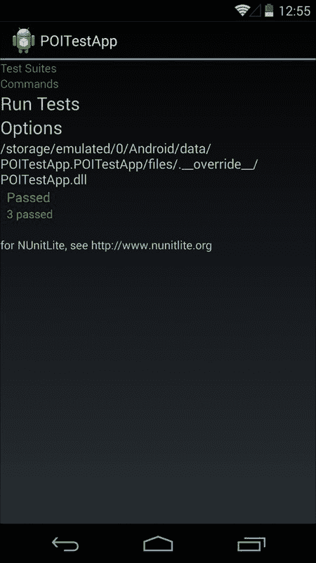

# 第八章. 创建数据存储机制

我们现在转向数据存储需求。我们需要一种方法来存储从服务器获取的 **兴趣点**（**POI**）数据列表，并在设备离线时使列表可访问。本章将展示如何使用内置的 SQLite 数据库引擎以跨平台的方式存储和检索 POI 数据。本章将涵盖以下主题：

+   数据存储解决方案的方法

+   Android 中不同的应用程序存储选项

+   使用首选项存储键值对

+   在 Xamarin.Android 中使用 SQLite 数据库存储

+   使用 SQLite.NET ORM 组件

+   执行数据库 CRUD 操作

+   使用 NUnitLite 对 Android 应用进行单元测试

+   在 `POIApp` 中实现缓存

数据存储解决方案主要分为两大类：使用网络服务在云端存储或使用设备的本地存储。在云端存储数据相对于本地数据存储选项提供了巨大的优势，但在某些情况下，例如运行离线应用程序或游戏，通常需要将数据存储在设备的存储中。

当前的 `POIApp` 使用网络服务将 POI 列表存储在服务器上，而移动应用程序通过发出 REST API 调用来检索列表。到目前为止，它运行得很好。然而，它始终需要互联网连接来获取和显示 POI 列表。让我们通过在本地存储 POI 列表并即使在设备离线时也能访问它们来克服这个问题。

# Android 中的数据存储

Android 支持多种用于本地持久化数据的解决方案。即使应用程序关闭或设备重启，持久化的数据仍然可以访问。此类数据的例子包括设备设置、联系人列表、浏览器书签或任何此类特定应用程序的数据。

下表展示了 Android 平台可用的不同数据存储选项：

存储选项

描述

共享首选项

这是您的应用程序的私有数据存储，仅持久化原始键值数据对。当用户卸载应用程序时，此数据将被删除。

内部存储

这将数据存储在设备的内部内存中，直到应用程序从设备中卸载，数据都是可用的。这些数据仅对您的应用程序是私有的，其他应用程序无法访问它。

外部文件存储

这将数据存储在共享的外部存储中，如外部 SD 卡。存储的数据是公开的。其他应用程序或用户可以通过将设备连接到计算机来访问这些文件。

SQLite 存储

这是一个结构化的私有数据存储。从应用程序创建的 SQLite 数据库只能由同一应用程序访问。

本章简要介绍了共享首选项和 SQLite 存储选项。您可以从官方 Xamarin 网站自行研究内部和外部存储选项。

## 共享首选项

共享偏好是持久化的 **键/值** 数据对，用于存储原始数据对，例如 **bool**、**float**、**int**、**string** 和 **long**。在 Android 偏好中保存的数据在不同的应用程序会话之间持久化，并且对创建它的应用程序是私有的。任何其他应用程序都无法访问它。

要使用共享偏好保存数据对，您首先需要获取 `ISharedPreferences` 接口的实例。共享偏好可以特定于一个活动，也可以使应用程序中所有活动的共享偏好全局化。如果您想创建一个特定于活动的单个偏好文件，可以使用 `Activity.GetPreferences` 来获取 `ISharedPreferences` 接口的实例，或者您可以通过传递偏好名称和操作模式到应用程序上下文中调用 `GetSharedPreferences` 方法来获取应用程序级别的偏好：

```java
ISharedPreferences prefs = Application.Context.GetSharedPreferences ("PREF_NAME", FileCreationMode.Private);
```

现在，让我们调用 `Edit()` 方法来获取 `ISharedPreferencesEditor` 的实例。这将匹配对共享偏好中值所做的所有更改，并且只有在调用 `Commit()` 或 `Apply()` 时才会保存：

```java
ISharedPreferencesEditor editor = prefs.Edit();
editor.PutInt("your_key1" ,10);
editor.PutString("your_key2", "Xamarin Example");
editor.Apply();
```

要从共享偏好中读取值，我们可以通过提供保存数据时使用的相同键来使用 `GetXX()` 方法，其中 `XX` 代表支持的原始类型。以下代码片段检索了之前步骤中存储的值：

```java
var value1 = prefs.GetInt ("your_key1", 0);
var value2 = prefs.GetString ("your_key2", null);
```

## SQLite 数据库存储

SQLite 是一个开源、轻量级且支持事务的数据库引擎，它随移动平台（包括 Android、iOS 和 Windows 手机）一起提供。根据官方文档，Android 正在使用 **SQLite 版本 3.4.0**。它是一个广泛使用的、独立的、关系型数据库引擎，不需要单独的服务器进程。

以下是一些使 SQLite 数据库引擎成为当今最广泛使用的数据库引擎之一的优点：

1.  它是一个开源项目，一个庞大的开源社区正在积极为其工作。

1.  它没有服务器，因此不需要服务器基础设施。

1.  它是一个轻量级引擎，提供了一套用于执行数据库事务的类。

1.  完整的数据库是一个存储在设备内存中的单个文件，该文件对您的应用程序是私有的。SQLite 数据库的隐私性归结为平台文件系统的隐私性。

因此，我们决定使用 SQLite 来缓存 POI 列表。当列表成功下载后，我们将把 POI 保存到数据库中，并在下载成功时定期更新它。当设备离线或无法从服务器获取更新列表时，缓存的 POI 列表可以在屏幕上显示。

虽然 SQLite 内置在 Android 中，并提供了一套 API 来执行所有数据库 CRUD（创建、读取、更新和删除）操作，但我们将使用组件存储库中的 SQLite.ORM 组件。下一节将指导您使用 SQLite.ORM 组件执行不同的数据库操作。

# 使用 SQLite.net ORM 组件

SQLite.NET **对象关系映射**（**ORM**）是一个开源库，允许 .NET 和 Mono 应用程序将数据对象存储在 SQLite 数据库中。它是一个轻量级且易于使用的组件，允许你保存和检索数据对象，无需担心编写任何 SQL 查询。这是一个在 Xamarin 组件商店中可用的免费组件。它最初是为 iPhone 上的 MonoTouch 设计的，但后来扩展到支持其他平台，包括 Android、Windows 和 Silverlight 平台。感谢 **Frank A. Krueger** 开发和维护此组件。

有三种方法可以将 SQLite.NET ORM 添加到 Xamarin 应用程序中。你可以通过从 GitHub 开源代码仓库、NuGet 或 Xamarin 组件商店下载所需文件来实现：

+   SQLite.NET 是一个非常薄的库，只有一个文件。从 GitHub 下载 `SQLite.cs` 文件并将其添加到你的应用程序中。SQLite.NET 库直接绑定到每个平台的 SQLite 数据库引擎。

+   要从 Xamarin 组件商店添加，你需要遵循我们在第四章 *添加列表视图* 中添加 `UrlImageViewHelper` 组件时使用的相同步骤。

+   要将其作为 NuGet 包捆绑添加，你可以从你的解决方案资源管理器导航到 **包** | **添加包** 以打开 NuGet 画廊窗口。搜索 `SQlite.NET` 并选择它以将其添加到你的项目中。

一旦将 SQlite.NET ORM 组件的引用添加到项目中，我们就可以专注于执行数据库操作。

## 使用属性标记 POIApp 以进行持久化

SQLite.NET ORM 带来一组属性，允许你标记要持久化到数据库的类和字段。你可以应用以下任何属性来控制表的构建：

属性

用法

`Table`

默认情况下，类名称用作表名称。如果你想要指定自己的表名称，可以使用此属性。这是一个应用于类的可选属性。

`Column`

默认情况下，属性名称用作列名称。此属性提供你指定自己的列名称的控制权。

`PrimaryKey`

此属性是表的键。仅支持单列主键。

`AutoIncrement`

此属性在插入时由数据库自动生成。属性类型应为整数，并且还应标记为 `PrimaryKey` 属性。

`Indexed`

应为此属性创建一个索引。

`Unique`

此属性将在表中是唯一的。

`MaxLength`

此属性指定 `varchar` 的最大长度。默认最大长度为 `140`。

`Ignore`

此属性将不会在表中。

`NotNull`

此属性不能为空。

对于 `POIApp`，我们可以使用 `PointOfInterest` 类前述列表中的某些属性：

```java
using SQLite;
namespace POIApp
{
  [Table("POITable")]
  public class PointOfInterest
  {
    [PrimaryKey, AutoIncrement, Column("_id")]
    public int Id { get; set;}
     [NotNull]
    public string Name { get; set; }
     [MaxLength(1000)]
    public string Description { get; set; }
     [MaxLength(150)]
    public string Address { get; set; }
     public string Image { get; set; }
    public double? Latitude { get; set; }
    public double? Longitude { get; set; }
  }
}
```

在前面的代码片段中，请注意我们声明了表名将是 `POITable`，`Id` 字段被标记为主键，并且 `Name` 字段不能为空。

## 添加数据库辅助类

现在我们需要创建一个标准类，该类将定义一组方法以允许基本的 CRUD 操作。此类可能被多次访问；因此，我们将此类标记为单例类以防止创建相同类的多个实例。

要创建数据库辅助实现类，请执行以下步骤：

1.  创建一个名为 `DBManager` 的类。

1.  要使 `DBManager` 类成为单例类，首先声明默认构造函数为私有：

    ```java
    public class DBManager
    {
      private DBManager() 
        {
      }
    }
    ```

现在声明一个 `DBManager` 类的私有静态实例并执行早期初始化。我们需要添加一个静态获取方法来使 `DBManager` 类可访问。将以下代码片段添加到 `DBManager` 类中：

```java
private static readonly DBManager instance = new DBManager();
public static DBManager Instance
{
  get 
  {
    return instance;
  }
}
```

注意，创建单例类的方法有很多种。我选择使用 *早期初始化* 方法来使用单例类。有关单例类实现的更多信息，请访问 MSDN 开发者网站。

在保存数据之前，我们首先需要创建一个数据库。让我们通过传递文件路径到 `SQLiteConnection` 类构造函数来创建一个空数据库或打开一个现有的数据库。将以下 `CreateTable()` 方法添加到您的 `DBManager` 类中：

```java
SQLiteConnection dbConn;
private const string DB_NAME = "PointOfInterest_DB.db3";
 public void CreateTable()
{
  var path = System.Environment.GetFolderPath (System.Environment.SpecialFolder.Personal);
  dbConn = new SQLiteConnection (System.IO.Path.Combine (path, DB_NAME));
  dbConn.CreateTable&lt;PointOfInterest&gt; ();
}
```

注意以下代码：

+   `DB_NAME` 常量定义了数据库的名称。数据库文件将使用此名称创建，并保存到路径变量指定的位置。

+   SQLite 数据库文件路径可能因平台而异。Android 和 iOS 都使用环境类来构建有效的路径。

+   `SQLiteConnection` 类构造函数如果已存在则使用指定名称打开数据库，否则创建一个新的数据库。

+   `CreateTable()` 方法如果存在则打开表，否则创建一个新的表。

### 创建或更新 POI 记录

一旦您的数据库连接打开，我们就可以执行不同的数据库操作。首先，让我们创建一个名为 `SavePOI()` 的方法来保存数据库中的 POI 对象。`SQLiteConnection` 类提供了如 **Insert**、`InsertOrReplace`、`InsertAll`、`Update` 和 `UpdateAll` 等方法，用于在数据库中创建或更新记录。

我们将使用 `InsertOrReplace` 方法，因为它对我们来说很方便。此方法在数据库中查找相同的记录，如果它已经存在，则更新它，否则插入一个新的记录。为了使 `InsertOrReplace()` 方法正常工作，您的表必须有一个主键。

让我们在 `SavePOI` 方法中添加以下代码片段：

```java
public int SavePOI(PointOfInterest poi) 
{
  int result = dbConn.InsertOrReplace (poi);
  Console.WriteLine ("{0} record updated!", result);
  return result;
}
```

### 从数据库中读取 POI 详细信息

当设备处于离线模式运行，或者如果应用未能从服务器下载 POI 列表数据时，`POIApp`会读取 POI 对象的列表。将以下`GetPOIListFromCache()`方法添加到数据库中检索所有记录：

```java
public List&lt;PointOfInterest&gt; GetPOIListFromCache() 
{
  var poiListData = new List&lt;PointOfInterest&gt; ();
  IEnumerable&lt;PointOfInterest&gt; table = dbConn.Table&lt;PointOfInterest&gt; ();
  foreach (PointOfInterest poi in table) 
  {
    poiListData.Add (poi);
  }
  return poiListData;
}
```

`GetPOIListFromCache`方法返回数据库中所有可用的 POI 列表。如果你正在通过 ID 查找特定的 POI，以下方法将帮助你：

```java
public PointOfInterest  GetPOI(int poiId)
{
  PointOfInterest poi = dbConn.Table&lt;PointOfInterest&gt;().Where(a =&gt; a.Id.Equals(poiId)).FirstOrDefault();
  return poi;
}
```

### 从数据库中删除 POI 数据

就像从数据库中读取记录一样，我们可以通过 POI ID 逐个删除记录，或者清除所有数据库记录。将以下方法添加到`DBManager`类中。它们简单直接，相当直观：

```java
public int DeletePOI(int poiId) 
{
  int result = dbConn.Delete&lt;PointOfInterest&gt;(poiId);
  Console.WriteLine("{0} record effected!", result);
  return result;
}
 public int ClearPOICache()
{
  int result = dbConn.DeleteAll&lt;PointOfInterest&gt;();
  Console.WriteLine("{0} records effected!", result);
  return result;
}
```

现在我们已经定义了执行不同数据库操作的所有方法。下一步是在使用`POIApp`之前，通过编写单元测试用例来验证每个方法。

# 使用 Xamarin.Android NUnitLite

你可能熟悉一个叫做**测试驱动开发**（**TDD**）的过程。从高层次来看，这种方法建议你创建自动化的单元测试用例来测试你的软件需要支持的功能，并使用这些测试用例来驱动开发和单元测试周期。

本章不会详细介绍测试驱动开发背后的概念，但我们将介绍 Xamarin.Android 提供的一个功能，该功能支持使用 TDD 的团队。这个功能是**NUnitLite**。NUnitLite 是一个轻量级、开源的测试框架，其理念与**NUnit**相同。它被设计为使用最少的资源，非常适合嵌入式和移动软件开发。

当使用 NUnitLite 时，你创建名为测试固定点的类。这些类包含用于测试测试目标的各个方面的测试方法；在我们的案例中，是`DBManager`类。为了将一个类指定为测试固定点或方法指定为测试方法，NUnitLite 使用.NET 属性。一旦创建了测试固定点和测试方法，Xamarin.Android 提供了一个用户界面，允许在 Android 模拟器或设备上执行测试。

要开始使用 NUnitLite，我们需要在我们一直在使用的解决方案面板中创建一个测试项目。

要创建一个测试项目，执行以下步骤：

1.  从 Xamarin Studio 的**解决方案**面板中选择`POIApp`解决方案。

1.  右键单击并选择**添加新项目**。

1.  在**新项目**对话框的左侧，转到**C#** | **Android**。

1.  在对话框的模板列表中，选择对话框中间的**Android 单元测试**项目。

1.  输入`POITestApp`作为名称，然后点击**确定**。新的单元测试项目被创建并添加到`POIApp`解决方案中。

1.  前往新项目的**选项**对话框，将**包名**设置为`POITestApp`，并确认**目标框架**设置为最新的可用 Android SDK 框架。

你会注意到新的单元测试项目有以下文件：

+   `MainActivity.cs`：此活动继承自 `TestSuiteActivity`，并在我们运行测试时提供测试套件用户界面。基本上，它允许我们运行测试并查看结果。

+   `TestsSample.cs`：此类充当测试固定装置，并允许我们添加测试方法，这些方法将测试 `DBManager` 提供的功能。

现在，我们需要创建测试方法来测试 `DBManager` 类执行的数据操作功能。

## 准备测试

NUnitLite 提供了一个执行可能需要的任何初始化代码的地方。在我们的情况下，我们需要创建 `DBManager` 类的实例，测试方法稍后会与其交互。`Setup()` 方法是完美的选择，因为它将在每个测试之前被调用。以下步骤将帮助你在 Xamarin Studio 中设置一个新的测试用例：

1.  将 `TestsSample.cs` 文件重命名为 `POITestFixture.cs`。同时，将文件内的相应类也重命名。

1.  在 `POITestApp` 中，选择 **引用**，右键单击它，然后选择 **编辑引用**。在 **编辑引用** 对话框中，选择 **项目** 选项卡，勾选 `POIApp` 项目，然后单击 **确定**。`POITestApp` 需要引用 `POIApp`，以便它可以与 `DBManager` 类一起工作。

    ### 小贴士

    一些版本的 Xamarin Studio 存在一个错误，即使将项目引用添加到测试项目中，引用也不会链接。在这种情况下，您需要转到 **编辑引用** 对话框中的 .NET 程序集选项卡，并手动浏览到 `POIApp/bin/Debug/POIApp.dll` 文件。

1.  打开 `POITestFixture` 类并删除除 `Setup()` 之外的所有其他方法。

1.  在 `Setup()` 方法中，从 `DBManager` 类调用 `CreateTable()` 方法：

    ```java
    [TestFixture]
    public class POITestFixture
    {
      [SetUp]
      public void Setup ()
      {
        DBManager.Instance.CreateTable ();
      }
    }
    ```

## 创建测试方法

现在真正的任务开始了；我们需要创建测试方法来测试每个重要的场景。在数据服务的情况下，我们需要确保我们涵盖了以下主题：

+   创建一个新的 POI

+   更新现有的 POI

+   删除现有的 POI

我们可以选择测试的情景还有很多，但前面的小集合应该有助于验证我们数据库逻辑的基本功能。

### CreatePOI 测试

我们将首先开始的第一个测试方法是 `CreatePOI()`，正如其名称所暗示的，我们将测试创建和保存新 POI 的过程。为了完成这个任务，我们需要执行以下步骤：

1.  创建 `PointOfInterest` 的新实例并填写一些属性。

1.  在 `DBManager` 类上调用 `SavePOI()` 方法。

1.  `save` 方法返回一个整数，表示更新的记录数。确保它返回值 `1`。

1.  根据保存的 ID 调用 `GetPOI()` 来检索 POI。

1.  使用 `Assert` 类来确认检索到的 POI（引用不是 null）以及 POI 的名称符合预期。

以下代码展示了 `CreatePOI()` 的实现：

```java
[Test]
public void CreatePOI ()
{
  int testId = 1091;
  PointOfInterest newPOI = new PointOfInterest ();
  newPOI.Id = testId;
  newPOI.Name = "New POI";
  newPOI.Description = "POI to test creating a new POI";
  newPOI.Address = "100 Main Street\nAnywhere, TX 75069";
   //Saving poi record
  int recordsUpdated = DBManager.Instance.SavePOI (newPOI);
   //Check if the number of records updated are same as expected
  Assert.AreEqual (1, recordsUpdated);
   // verify if the newly create POI exists
  PointOfInterest poi = DBManager.Instance.GetPOI (testId);
  Assert.NotNull (poi);
  Assert.AreEqual (poi.Name, "New POI");
}
```

### 删除 POI 测试

接下来，我们将实现`DeletePOI()`。同样，我们希望`DeletePOI()`独立于其他测试，因此我们首先需要创建一个稍后将被删除的 POI。

在调用`DeletePOI()`时，将执行以下步骤：

1.  创建一个新的`PointOfInterest`实例并填写一些属性。

1.  在`DBManager`类上调用`SavePOI()`方法。

1.  使用`GetPOI()`根据保存的 ID 检索 POI。

1.  使用`DeletePOI()`来删除 POI 文件并将其从数据库中删除。

1.  使用`GetPOI()`根据保存的 ID 检索 POI。

1.  使用`Assert`类来确保找不到 POI（引用为 null）。

以下代码展示了`DeletePOI()`的实现：

```java
[Test]
public void DeletePOI ()
{
  int testId = 1019;
  PointOfInterest testPOI = new PointOfInterest ();
  testPOI.Id = testId;
  testPOI.Name = "Delete POI";
  testPOI.Description = "POI being saved so we can test delete";
  testPOI.Address = "100 Main Street\nAnywhere, TX 75069";
  DBManager.Instance.SavePOI (testPOI);
   PointOfInterest deletePOI = DBManager.Instance.GetPOI (testId);
  Assert.NotNull (deletePOI);

  DBManager.Instance.DeletePOI(testId);  

  PointOfInterest poi = DBManager.Instance.GetPOI (testId);
  Assert.Null (poi);
}
```

此外，我们将实现`ClearCache()`以验证对`ClearPOICache()`的调用是否清除了所有数据库记录。以下步骤将在`ClearCache`测试方法中执行：

1.  在`DBManager`类上调用`ClearPOICache()`以从数据库中删除所有记录。

1.  在`DBManager`类上调用`GetPOIListFromCache`以从数据库中获取记录列表。

1.  使用`Assert`类来确保从服务器检索的记录数为`0`。

以下代码展示了`ClearCache()`的实现：

```java
[Test]
public void ClearCache ()
{
  DBManager.Instance.ClearPOICache ();
  List&lt;PointOfInterest&gt; poiList = DBManager.Instance.GetPOIListFromCache ();
  Assert.AreEqual (0, poiList.Count);
}
```

## 执行测试

现在测试已经开发完毕，我们准备执行它们。为此，我们只需使用 Android 模拟器或物理设备运行测试应用。要在模拟器中执行测试，请执行以下步骤：

1.  使用 Android 模拟器运行`POITestApp`。请注意，`POITestApp`没有被设置为启动项目，所以当你选择**运行**时，你需要选择项目。你可以通过选择它，右键单击它，并选择**设置为启动项目**来将`POITestApp`设置为启动项目。一旦`POITestApp`开始运行，你应该会看到以下屏幕，当应用已部署并启动时：

1.  通过点击**运行测试**标签来执行测试。你应该会看到一个绿色的消息标签，表示所有测试都已通过。

1.  如果测试用例失败，消息将以红色显示，你可以进一步深入测试以查看失败详情。

到目前为止，我们已经创建了`DBManager`类，并有一套自动化测试来测试 CRUD 方法。现在是时候专注于填充逻辑，以便`POIApp`可以从数据库中保存和检索数据。

NUnitLite 是一个优秀的框架，用于实现 Android 应用开发的单元测试策略，但它不仅仅关于测试。你需要实现某种 UI 自动化测试框架来测试大多数应用组件，包括用户界面。

Xamarin 带来了另一个平台；Xamarin Test Cloud 使得可以在全球各地的真实设备上测试用任何语言编写的移动应用。您可以使用 Xamarin 测试框架编写测试脚本，并从 CI 系统中自动化应用测试。本书不涵盖 UI 自动化框架和 Xamarin Test Cloud 服务。您可以访问官方[`xamarin.com/`](http://xamarin.com/)网站获取更多信息。

# 实现缓存逻辑到 POIApp

`DBManager`类现在经过测试并可以直接在`POIApp`中使用。当下载完成时，`POIApp`将保存 POI 记录，当应用无法从服务器获取更新列表时，稍后将从列表中检索。执行以下步骤以将`DBManager`类集成到`POIApp`中：

1.  在`POIListActivity`类上调用`CreateTable()`方法以初始化数据库：

    ```java
    DBManager.Instance.CreateTable();
    ```

1.  打开`POIListFragment`类并进入`DownloadPoisListAsync()`方法。我们已使用此方法从服务器下载 POI 列表。以下是需要在此处进行的更新：

    1.  当从服务器成功下载 POI 时清除数据库缓存。

    1.  将新获取的 POI 数据保存到数据库中。

    1.  当设备未连接到网络时，从数据库返回缓存数据。

以下代码片段展示了更新后的`DownloadPoisListAsync()`方法：

```java
public async void DownloadPoisListAsync(){
      POIService service = new POIService ();
      if (!service.isConnected (activity)) {
        Toast toast = Toast.MakeText (activity, "Not conntected to internet. Please check your device network settings.", ToastLength.Short);
        toast.Show ();
        poiListData = DBManager.Instance.GetPOIListFromCache ();
      } else {
        progressBar.Visibility = ViewStates.Visible;
        poiListData = await service.GetPOIListAsync ();
         //Clear cached data
        DBManager.Instance.ClearPOICache ();
         //Save updated POI data
        DBManager.Instance.InsertAll (poiListData); progressBar.Visibility = ViewStates.Gone;
      }
       poiListAdapter = new POIListViewAdapter (activity, poiListData);
      this.ListAdapter = poiListAdapter;
      ListView.Post(() =&gt; {
        ListView.SetSelection(scrollPosition);
      });
}
```

在前面的代码块中，我们保存了从服务器接收到的所有 POI 列表数据。然而，当用户编辑并保存任何 POI 数据时，我们需要更新该 POI 的本地数据库。

要做到这一点，让我们在`CreateOrUpdatePOIAsync()`方法中从`POIDetailFragment`类调用`SavePOI()`方法：

```java
private async void CreateOrUpdatePOIAsync(PointOfInterest poi){
      .....
      .....
      if (!string.IsNullOrEmpty (response)) {
        Toast toast = Toast.MakeText (activity, String.Format ("{0} saved.", _poi.Name), ToastLength.Short);
        toast.Show();
         DBManager.Instance.SavePOI (poi);
         if(!POIListActivity.isDualMode)
          activity.Finish ();
      } else {
        Toast toast = Toast.MakeText (activity, "Something went Wrong!", ToastLength.Short);
        toast.Show();
      }
}
```

在`POIDetailFragment`类中从服务器删除 POI 记录时，在`DeletePOIAsync()`方法中我们需要调用`DeletePOI()`方法来从本地设备数据库中删除相同的 POI。

以下代码片段展示了更新后的`DeletePOIAsync()`方法：

```java
public async void DeletePOIAsync(){
     .....
     ....
      string response = await service.DeletePOIAsync (_poi.Id);
      if (!string.IsNullOrEmpty (response)) {
        Toast toast = Toast.MakeText (activity, String.Format ("{0} deleted.", _poi.Name), ToastLength.Short);
        toast.Show();
         DBManager.Instance.DeletePOI (poi);
       if(!POIListActivity.isDualMode)
          activity.Finish ();

      } else {
        Toast toast = Toast.MakeText (activity, "Something went Wrong!", ToastLength.Short);
        toast.Show();
      }
}
```

现在我们已经实现了`POIApp`的离线数据库逻辑。运行应用；当连接到网络时，它将下载并缓存 POI 列表。现在在设备离线状态下重新启动应用，注意屏幕上显示的是相同的旧缓存 POI 列表。

# 摘要

在本章中，我们使用了 SQLite.ORM 将 POI 记录保存到数据库中，并创建了一系列单元测试来验证数据库操作是否正常工作。

在下一章中，我们将通过添加相机支持来捕获和保存 POI 图像，继续集成设备功能。
