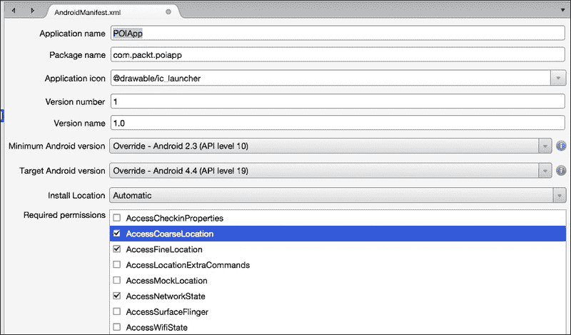
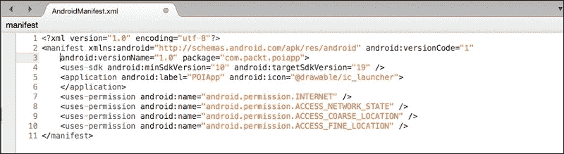
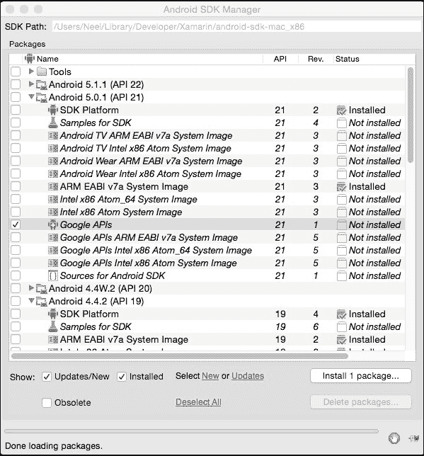
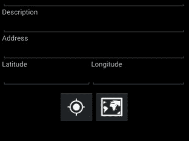
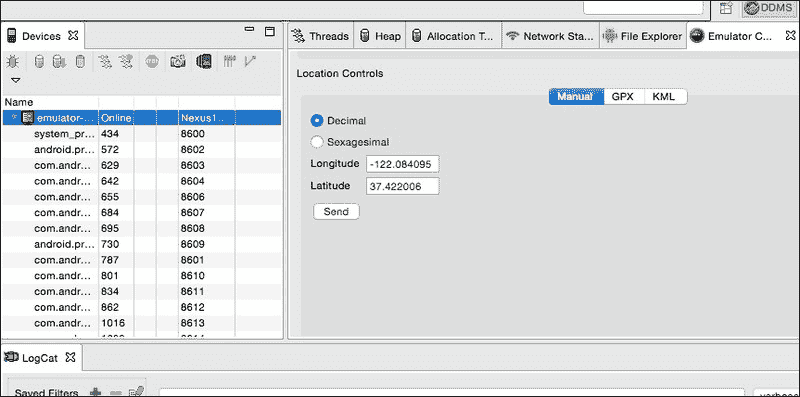
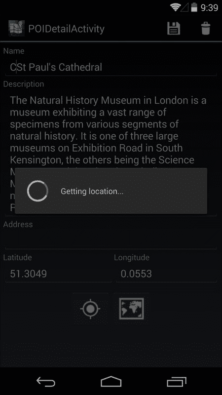

# 第九章：使 POIApp 具备位置感知功能

移动开发中最有趣的一个方面是与设备功能交互，例如运动传感器、摄像头和位置传感器。这些功能对于大多数应用来说是上下文相关的，并且对用户具有很高的价值。在本章中，我们将向您展示如何将位置感知添加到 POIApp 中。我们将涵盖以下主题：

+   设置应用程序权限

+   获取当前经纬度

+   获取经纬度的地址

+   计算两个地理点之间的距离

+   在地图应用中显示 POI

# 使用位置服务工作

在 Android 平台上集成位置服务比看起来要复杂。

您需要考虑不同的位置提供者、位置精度、用户移动，以及最重要的是设备的额定电池功耗。在 Android 平台上使用位置服务时，您将主要与`LocationManager`的一个实例一起工作。`LocationManager`类为您提供了获取设备地理位置周期性更新的能力，或者当设备进入特定地理位置的邻近区域时触发事件。

Android 设备通常提供两种不同的确定位置的方法：**GPS**和**网络**。在请求位置变化通知时，您可以指定希望接收更新的提供者。Android 平台定义了一组字符串常量，用于以下提供者：

提供者名称

描述

`GPS_PROVIDER`（GPS）

此提供者使用卫星确定位置。根据条件，此提供者可能需要一段时间才能返回位置修正。这需要`ACCESS_FINE_LOCATION`权限。

`NETWORK_PROVIDER`（网络）

此提供者根据蜂窝塔和 Wi-Fi 接入点的可用性确定位置。其结果通过网络查找获取。这需要`ACCESS_COARSE_LOCATION`权限。

`PASSIVE_PROVIDER`（被动）

此提供者可以在其他应用程序或服务请求位置更新时被动接收位置更新，而无需您自己实际请求位置。它需要`ACCESS_FINE_LOCATION`权限。如果 GPS 未启用，此提供者可能只能返回粗略的位置。

将位置服务集成到 Android 应用程序中的过程包括以下步骤：

1.  获取`LocationManager`实例的引用。

1.  使用`LocationManager`实例来请求位置变化通知，无论是持续通知还是单个通知。

1.  处理`LocationListener`回调方法。这些方法仅在通过`RequestLocationUpdates(string, long, float, ILocationListener)`方法请求位置时才会触发。

访问 Android 应用程序中的位置服务需要添加特定的权限，具体取决于您想使用的提供者。

## 设置应用权限

要在 Android 中访问位置服务，您必须向`AndroidManifest.xml`文件提供权限。Android 应用程序使用两个权限来访问位置 API：`ACCESS_COARSE_LOCATION`和`ACCESS_FINE_LOCATION`。`ACCESS_FINE_LOCATION`包括对`GPS_PROVIDER`和`NETWORK_PROVIDER`提供者的权限。`ACCESS_COARSE_LOCATION`权限仅包括对`NETWORK_PROVIDER`的权限。

要将适当的权限添加到您的应用程序描述符中，请执行以下步骤：

1.  双击**属性**/`AndroidManifest.xml`在**解决方案**面板中。文件将在清单编辑器中打开。屏幕底部有两个标签页，**应用程序**和**源**，可以用来在查看用于编辑文件的表单或原始 XML 之间切换。

1.  在**所需权限**列表中，勾选**AccessCoarseLocation**、**AccessFineLocation**和**Internet**。导航到**文件** | **保存**：

1.  切换到**源**视图以查看以下内容：

## 配置模拟器

要使用**模拟器**进行开发，本章将需要配置模拟器以使用 Google APIs，以便地址查找和将应用映射到地图上。

要安装和配置**Google APIs**，请执行以下步骤：

1.  从主菜单导航到**工具**并打开**Android SDK Manager**。

1.  选择您正在使用的平台版本，勾选**Google APIs**，然后单击**安装 1 个包...**，如图所示：

1.  安装完成后，关闭 Android SDK Manager，然后从主菜单导航到**工具** | 打开**Android 模拟器管理器**。

1.  选择您想要配置的模拟器并单击**编辑**。

1.  在**目标**中，选择您想要工作的 API 级别的**Google APIs**条目。

1.  点击**确定**以保存。

## 获取`LocationManager`实例

`LocationManager`类是一个系统服务，它提供对设备位置和方位的访问，如果设备支持这些服务。您不需要显式创建`LocationManager`实例；相反，您可以使用`GetSystemService()`方法从一个`Context`对象请求一个实例。在大多数情况下，`Context`对象是 activity 的子类型。以下代码展示了声明一个`LocationManager`类的引用并请求一个实例：

```java
LocationManager locMgr;
. . .
locMgr = (LocationManager) GetSystemService (Context.LocationService);
```

# 请求位置变更通知

`LocationManager`类提供了一系列重载方法，可用于请求位置更新通知。如果您只需要单个更新，可以调用`RequestSingleUpdate()`；要接收持续更新，请调用`RequestLocationUpdate()`。

在请求位置更新之前，您必须确定应使用的位置提供者。在我们的例子中，我们只想使用当时可用的最精确的提供者。这可以通过使用`Android.Location.Criteria`实例指定所需提供者的标准来实现。以下代码示例显示了如何指定最小标准：

```java
Criteria criteria = new Criteria();
criteria.Accuracy = Accuracy.NoRequirement;
criteria.PowerRequirement = Power.NoRequirement;
```

现在我们有了标准，我们准备按照以下方式请求更新：

```java
locMgr.RequestSingleUpdate (criteria, this, null);
```

## 实现`ILocationListener`

您会注意到`RequestSingleUpdate()`的第二个参数必须是一个实现`ILocationListener`的对象，该对象定义了以下方法：

```java
void OnLocationChanged (Location location);
void OnProviderDisabled (string provider);
void OnProviderEnabled (string provider);
void OnStatusChanged (string provider, Availability status, Bundle extras);
```

在大多数情况下，我们将为所有方法创建空白存根，除了`OnLocationChanged()`。在编写更复杂的应用程序时，为其他一些方法提供实现将很有用。例如，您可能调用`RequestLocationUpdate()`以开始接收更新，然后通过`OnProviderEnabled()`接收通知，表明首选提供者现在可用，在这种情况下，您可能想要停止更新并再次使用首选提供者启动它们。

# 将位置服务添加到 POIApp

在`POIApp`中，我们有两个不同的场景用于请求位置更新：

+   在 POI 列表中，我们需要计算每个列表中 POI 的距离。在这种情况下，我们希望持续请求位置变化通知，并使用最新的位置来计算距离。

+   在`POIDetailFragment`中，我们希望在添加新的 POI 时请求当前位置。在这种情况下，我们希望请求一个单一的位置变化通知。

## 将位置服务添加到 POI 列表

现在我们已经了解了如何向应用程序添加位置服务，让我们按照以下方式将位置服务添加到`POIListFragment`：

1.  在`OnCreateView()`方法中声明`LocationManager`的私有实例并获取引用，如下所示：

    ```java
    LocationManager locMgr;
    ...
    public override View OnCreateView(LayoutInflater inflater, ViewGroup container, Bundle savedInstanceState)
    {
      View view = inflater.Inflate(Resource.Layout.POIListFragment, container, false);
      progressBar = view.FindViewById&lt;ProgressBar&gt; (Resource.Id.progressBar);
      SetHasOptionsMenu (true);
      locMgr = (LocationManager) Activity.GetSystemService (Context.LocationService);
      return view;
    }
    ```

1.  在`POIListFragment`中包含`Android.Locations`命名空间并实现`ILocationListener`接口：

    ```java
    public class POIListFragment: ListFragment, ILocationListener
    {
      ...
    }
    ```

1.  在代码编辑器中，右键单击`ILocationListener`接口，选择**重构** | **实现接口**以实现存根方法。删除任何默认放置在存根方法中的代码；我们将提供`OnLocationChange()`的逻辑。

1.  在`OnResume()`中，获取最佳位置提供者并调用`RequestLocationUpdates()`以开始接收更新，如下所示：

    ```java
    public override void OnResume ()
    {
      base.OnResume ();
      DownloadPoisListAsync ();
       Criteria criteria = new Criteria ();
      criteria.Accuracy = Accuracy.NoRequirement;
      criteria.PowerRequirement = Power.NoRequirement;
      string provider = locMgr.GetBestProvider (criteria, true);
      locMgr.RequestLocationUpdates (provider, 2000, 100, this);
    }
    ```

1.  在`POIListFragment`类中重写`OnPause()`方法并添加对`RemoveUpdates()`的调用。这样，当`POIListFragment`类不可见时，可以消除对位置变化的不必要处理，如下面的代码所示：

    ```java
    protected override void OnPause ()
    {
      base.OnPause ();
      locMgr.RemoveUpdates (this);
    }
    ```

1.  将`CurrentLocation`属性添加到`POIListViewAdapter`中。`POIListFragment`类将使用此属性将位置变化通知适配器：

    ```java
    public Location CurrentLocation { get; set; }
    ```

1.  在 `OnLocationChanged()` 中添加逻辑，当接收到位置变化时在 `POIListViewAdapter` 上设置 `CurrentLocation`，并调用 `NotifyDataSetChange()` 以使 `ListView` 刷新，如下所示：

    ```java
    public void OnLocationChanged (Location location)
    {
    (this.ListAdapter as POIListViewAdapter).CurrentLocation = location;this.ListView.InvalidateViews ();     
    }
    ```

1.  在 `POIListViewAdapter` 的 `GetView()` 方法中添加逻辑，以计算 `CurrentLocation` 和 POI 的位置属性之间的距离，并将结果更新到 `distanceTextView`。只有在 `CurrentLocation` 不是 `null`，并且要添加到 `ListView` 的 POI 的 `Latitude` 和 `Longitude` 属性不是 `null` 时，才进行计算。如果这些值中的任何一个为 `null`，则在距离字段中简单地放置 `??` 以指示此时无法计算，如下所示：

    ```java
    var distanceTextView = view.FindViewById&lt;TextView&gt; (Resource.Id.distanceTextView);
    if ((CurrentLocation != null) &amp;&amp; (poi.Latitude.HasValue) &amp;&amp; (poi.Longitude.HasValue)) {
      Location poiLocation = new Location ("");
      poiLocation.Latitude = poi.Latitude.Value;
      poiLocation.Longitude = poi.Longitude.Value;
      float distance = CurrentLocation.DistanceTo (poiLocation) * 0.000621371F;
      distanceTextView.Text = String.Format("{0:0,0.00}  miles", distance);
    }
    else {
      distanceTextView.Text = "??";
    }
    ```

现在，运行 `POIApp` 并在 `POIListView` 中查看结果。

## 将位置服务添加到 POI 详细信息

将位置服务添加到 `POIDetailFragment` 的步骤将与上一节非常相似，但会稍微简单一些。

### 更新用户界面

在添加逻辑之前，我们需要在我们的应用程序中添加几个按钮；一个用于获取我们的位置，一个用于导航到地图，我们将在本章后面介绍。我们可以将这些按钮作为 `POIDetailFragment.axml` 底部的一行添加，如下面的截图所示：



使用 `ImageButton` 允许指定 `drawable` 类。要添加 `ImageButton` 小部件，请执行以下步骤：

1.  在 `POIDetailFragment.axml` 的底部添加一个 `LinearLayout` 实例，位于用于排列纬度和经度内容的 `TableLayout` 下方。方向应该是 `horizontal`。

1.  在 `LinearLayout` 实例上，方向应该是 `horizontal`，内容应该被包裹（高度和宽度），并且它应该在父元素中水平居中。可以使用布局重力在父元素内水平居中内容。`10dp` 的顶部和底部填充将为按钮提供良好的间距。

1.  在 `LinearLayout` 实例中添加两个 `ImageButton` 小部件：`locationImageButton` 和 `mapImageButton`。这些按钮的图片可以在 `assets` 位置的 `drawable` 文件夹中找到。

1.  以下 XML 代码显示了结果：

    ```java
    .. . &lt;/TableLayout&gt; 
    &lt;LinearLayout
             p1:orientation="horizontal"
             p1:layout_width="wrap_content"
             p1:layout_height="wrap_content"
             p1:layout_gravity="center_horizontal"
             p1:minWidth="25px"
             p1:minHeight="25px"
             p1:layout_marginTop="10dp"
             p1:layout_marginBottom="10dp"&gt;
             &lt;ImageButton
               p1:src="img/ic_locate"
               p1:layout_width="wrap_content"
               p1:layout_height="wrap_content"
               p1:id="@+id/locationImageButton" /&gt;
             &lt;ImageButton
               p1:src="img/ic_map"
               p1:layout_width="wrap_content"
               p1:layout_height="wrap_content"
               p1:id="@+id/mapImageButton" /&gt;
    &lt;/LinearLayout&gt;
    ```

### 添加代码

现在我们已经在 UI 上有了按钮，我们可以添加以下代码来获取位置：

1.  声明一个 `LocationManager` 的私有实例，并在 `OnCreate()` 中以与上一节中 `POIListView` 相同的方式获取引用：

    ```java
    locMgr = (LocationManager) Activity.GetSystemService (Context.LocationService);
    ```

1.  添加 `GetLocationClicked` 事件处理程序并将其连接到 `ImageButton`，如下所示：

    ```java
    _locationImageButton = FindViewById&lt;ImageButton&gt;
             (Resource.Id.locationImageButton);
           _locationImageButton.Click += GetLocationClicked;
    ```

1.  在 `GetLocationClicked()` 中添加对 `RequestSingleUpdate()` 的调用。`RequestSingleUpdate()` 方法允许传入一个 `Criteria` 对象，这样我们就不需要单独调用 `GetBestProvider()`，如下所示：

    ```java
    protected void GetLocationClicked(object sender, EventArgs   e)
           {
             Criteria criteria = new Criteria();
             criteria.Accuracy = Accuracy.NoRequirement;
             criteria.PowerRequirement = Power.NoRequirement;
             locMgr.RequestSingleUpdate (criteria, this, null);
           }
    ```

1.  指定 `POIDetailFragment` 实现 `Android.Locations`。使用 Refactor | Implement 接口实现 `ILocationListener` 的存根方法。删除存根方法中放置的任何代码；我们将提供 `OnLocationChange()` 的逻辑。

1.  在 `OnLocationChange()` 中添加逻辑以更新位置字段，如下所示：

    ```java
    public void OnLocationChanged (Location location)
           {
             _latEditText.Text = location.Latitude.ToString();
             _longEditText.Text = location.Longitude.ToString ();
           }
    ```

## 模拟位置数据以进行测试

运行 `POIApp` 并尝试添加一个新的 POI 并获取位置。在模拟器中运行应用时，您会注意到当您点击位置按钮时似乎没有任何反应。实际上，应用正在等待从位置管理器来的 `OnLocationChanged()` 回调。要触发此回调，您必须使用 **Android Device Monitor** （**ADM**）来模拟位置数据。

要触发 `OnLocationChanged()`，执行以下步骤：

1.  启动 ADM 并选择屏幕左侧的模拟器实例。

1.  点击屏幕右侧的 **Emulator Control** 标签。如果 **Emulator Control** 标签不存在，导航到 **Window** | **Show View** 来显示该标签。注意，在面板底部有一个嵌套的标签，标题为 **Location Controls**，如下截图所示：

1.  选择 **Manual** 标签，根据需要调整 **经度** 和 **纬度**，然后点击 **Send**。这将导致在 `POIDetailFragment` 上触发 `OnLocationChanged()` 方法。

注意 **Location Controls** 下的其他两个标签：**GPX** 和 **KML**。这些标签可以用来从文件中加载一系列位置更新并回放到您的应用中，以测试更复杂的场景。

## 获取位置的地址

Android 平台提供的另一个有用功能称为 **地理编码**。这是从已知地址以纬度和经度表示位置的过程。Android 还支持反向地理编码，正如其名称所暗示的，从已知位置获取地址。

`Android.Locations.Geocoder` 类是用来执行地理编码和反向地理编码的类。使用它非常简单，如下步骤所示：

1.  创建 `Android.Locations.Geocoder` 的实例。

1.  通过传递您想要查找地址的位置来调用 `GetFromLocation()`。

1.  处理返回的 `IList<Address>` 集合。从 `GetFromLocation()` 返回的地址集合在具体细节上有所不同，这意味着一些是具体的街道地址，一些指定了城市、国家等。第一个地址总是最具体的，因此我们将使用以下代码自动选择它：

    ```java
    public void OnLocationChanged (Location location)
    {
        _latEditText.Text = location.Latitude.ToString();
        _longEditText.Text = location.Longitude.ToString ();
        Geocoder geocdr = new Geocoder(activity);
        IList&lt;Address&gt; addresses = geocdr.GetFromLocation (location.Latitude, location.Longitude, 5);
        if (addresses.Any()) {
            UpdateAddressFields (addresses.First ());
        } 
    }
    ```

注意，在 `GetFromLocation()` 方法调用中的数字 `5` 参数表示已知可以描述围绕纬度和经度的区域的最多结果数量。

你可以看到我们选择调用一个方法来格式化地址信息。`FeatureName`属性可能包含一个标题，例如*金门大桥*或*帝国大厦*。很多时候，`FeatureName`将简单地包含街道号码。地址包含一系列地址行，我们将它们组合并放置在`_addrEditText`中，如下所示：

```java
protected void UpdateAddressFields(Address addr)
{
    if (String.IsNullOrEmpty(_nameEditText.Text))
        _nameEditText.Text = addr.FeatureName;
    if (String.IsNullOrEmpty(_addrEditText.Text)) 
    {
      for (int i = 0; i &lt; addr.MaxAddressLineIndex; i++) {
        if (!String.IsNullOrEmpty(_addrEditText.Text))
              _addrEditText.Text += System.Environment.NewLine;
        _addrEditText.Text += addr.GetAddressLine (i);
      }
    } 
}
```

现在，运行`POIApp`并尝试添加一个新的 POI 和获取位置的地址。

## 保持用户知情

在使用获取位置按钮后，你会注意到请求位置信息需要一些时间来处理；通常，几秒钟或更长时间。最好让用户知道正在处理，这样他们就不会不断地点击按钮。

这可以通过两种方式实现。你可以直接将`ProgressBar`附加到详情片段布局中，就像我们在`POIListFragment`中所做的那样，或者我们可以使用`ProgressDialog`类。`ProgressDialog`类提供了一个简单的方法来显示一个带有旋转进度小部件和描述正在进行的进程的文本描述的对话框。自从`DialogFragment`类被添加到 Android 以来，谷歌推荐使用`DialogFragment`类而不是`ProgressDialog`。在这里，在这个例子中，我们将创建一个`DialogFragment`类，它显示的加载进度与`DeleteDialogFragment`类类似。

以下步骤将指导你添加一个对话框片段以显示加载进度：

1.  让我们添加一个名为`ProgressDialogFragment`的新片段，并从`DialogFragment`类扩展它。

1.  重写`OnCreateDialog()`方法并添加以下代码块：

    ```java
    public class ProgressDialogFragment : DialogFragment
    {
      public override Dialog OnCreateDialog (Android.OS.Bundle savedInstanceState)
      {
        Cancelable = false;
        ProgressDialog _progressDialog = new ProgressDialog (Activity);
        _progressDialog.SetMessage ("Getting location...");
        _progressDialog.Indeterminate = true;
        _progressDialog.SetProgressStyle (ProgressDialogStyle.Spinner);
        return _progressDialog;
      }
    }
    ```

1.  我们还没有准备好`ProgressDialogFragment`片段。让我们将以下代码片段添加到`GetLocationClicked()`方法中，以便在用户从`POIDetailFragment`点击位置按钮时显示加载进度：

    ```java
    FragmentTransaction ft = FragmentManager.BeginTransaction();
    var dialogFragment = new ProgressDialogFragment ();
    dialogFragment.Show(ft, "progress_dialog");
    ```

1.  现在我们需要从位置管理器检索到位置后，移除加载进度对话框。将以下代码片段添加到`OnLocationChanged()`回调中，以移除进度对话框：

    ```java
    FragmentTransaction ft = FragmentManager.BeginTransaction();
    ProgressDialogFragment dialogFragment = (ProgressDialogFragment) FragmentManager.FindFragmentByTag("progress_dialog");
    if (dialogFragment != null) {
      ft.Remove (dialogFragment).Commit();
    }
    ```

现在，运行`POIApp`并检查新的进度对话框，如图所示：



# 添加地图集成

地图是移动计算中真正酷的一部分。它们提供了一种导航方式，在区域内查找兴趣点，以及支持许多其他有用的场景。

从应用程序与地图交互有两种基本方法如下：

+   导航到设备上已安装的现有 Android 地图应用程序以显示兴趣点。大多数最新的 Android 设备都预装了 Google 地图应用程序。但是，这并不保证。

+   集成 Google Maps API。这种方法直接使用 Google Play 服务将地图视图集成到你的应用程序中。你必须在 Google 开发者控制台中创建一个应用程序，并获取你应用的 API 密钥副本。

第一个选项更容易实现，而第二个选项允许更紧密的集成和控制地图，但代价是更多的代码和复杂性。第二个选项需要与 Google Play 库对应的非常具体的 Xamarin.Android 绑定库版本。我们选择第一个选项在`POIApp`示例中，以下是一些原因：

+   在模拟器中实现第二个选项非常困难，这意味着您可能需要在实际设备上测试和查看代码的结果，这可能不是所有读者都有的选择

+   我们需要比本章中可用的更多时间来设置第二个选项

Xamarin 的官方网站包含所有必要的详细信息，以实现第二个选项。

## 导航到地图应用程序

要导航到地图应用程序，我们将依赖本书前面使用过的`Intent`类；然而，我们不会指定我们想要启动的`Activity`类，而是将指定我们想要通过 URI 查看的信息类型。Android 包含一个可以显示不同类型信息的应用程序注册表，并将启动最合适的应用程序。

Android 平台定义了一系列可以用于在 Android 设备上启动 Google 应用程序的`Intent`类。以下表格总结了与位置相关的`Intent`类：

URI

动作

`geo:latitude,longitude`

此操作将在指定的纬度或经度上打开地图应用程序

`geo:latitude,longitude?z=zoom`

此操作将在指定的纬度或经度上打开地图应用程序，并放大到指定级别

`geo:0,0?q=my+street+address`

此操作将在地图应用程序中打开街道地址的位置

`geo:0,0?q=business+near+city`

此操作将在地图应用程序中打开并显示标注的搜索结果

在我们的案例中，我们有一个街道地址、纬度和经度，或者两者都有。如果存在街道地址，我们应该使用它构建`Intent`类，因为这会使街道地址在地图应用程序中显示，使其更用户友好。如果不存在街道地址，我们将使用纬度和经度构建`Intent`类。以下代码显示了构建`Intent`类的逻辑：

```java
Android.Net.Uri geoUri;
if (String.IsNullOrEmpty (_addrEditText.Text)) {
  geoUri = Android.Net.Uri.Parse (String.Format("geo:{0},{1}", _poi.Latitude, _poi.Longitude));
}
else {
  geoUri = Android.Net.Uri.Parse (String.Format("geo:0,0?q={0}", _addrEditText.Text));
}
Intent mapIntent = new Intent (Intent.ActionView, geoUri);
```

在启动`Intent`类之前，我们需要确保有一个可以处理`Intent`类的应用程序；否则，我们可能会在`StartActivity()`中遇到未处理的异常。

## 检查已注册的地图应用程序

应用程序在其清单文件中通过 `<intent-filter/>` 元素提供有关它们提供的任何功能（`Intent` 类）的信息。由于我们依赖于外部地图应用来显示我们的位置，因此我们应该检查我们正在运行的设备上是否存在此类应用。我们可以通过调用 `PackageManager` 类的几个方法来完成此操作。`PackageManager` 类允许您检索有关设备上安装的应用程序包的各种类型的信息。`QueryIntentActivities()` 方法允许您检查是否有任何应用程序可以处理特定的 `Intent` 类。以下代码演示了 `QueryIntentActivities()` 的使用：

```java
PackageManager packageManager = Activity.PackageManager;
IList&lt;ResolveInfo&gt; activities = packageManager.QueryIntentActivities(mapIntent, 0);
if (activities.Count == 0) {
  Toast.MakeText (activity, "No map app available.", ToastLength.Short).Show ();
} 
else
{
  StartActivity (mapIntent);
}
```

创建一个 `MapClicked()` 事件处理程序并将其附加到 `_mapImageButton`。以下代码片段表示用于打开地图应用的完整 `MapClicked()` 代码：

```java
protected void MapClicked(object sender, EventArgs   e){
  Android.Net.Uri geoUri;
  if (String.IsNullOrEmpty (_addrEditText.Text)) {
    geoUri = Android.Net.Uri.Parse (String.Format("geo:{0},{1}", _poi.Latitude, _poi.Longitude));
  }
  else {
    geoUri = Android.Net.Uri.Parse (String.Format("geo:0,0?q={0}", _addrEditText.Text));
  }
  Intent mapIntent = new Intent (Intent.ActionView, geoUri);
   PackageManager packageManager = Activity.PackageManager;
  IList&lt;ResolveInfo&gt; activities = packageManager.QueryIntentActivities(mapIntent, 0);
  if (activities.Count == 0) {
    Toast.MakeText (activity, "No map app available.", ToastLength.Short).Show ();
  } 
  else
  {
    StartActivity (mapIntent);
  }
}
```

运行 `POIApp` 并从 POI 详细页面点击 **地图** 按钮。你会注意到地图应用会以 POI 位置打开。你可以选择从当前位置导航到那里。

# 摘要

在本章中，我们看到了如何使用设备位置服务来查找当前位置。我们还集成了 `POIApp` 与原生设备地图，以便在地图上定位 POI。在下一章中，我们将继续通过添加与摄像头的集成来扩展设备功能。
