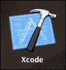
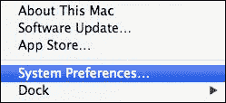
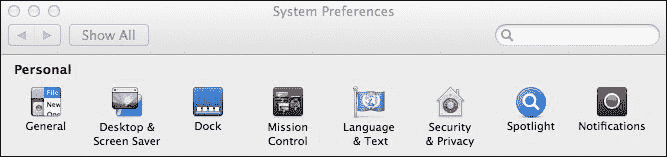
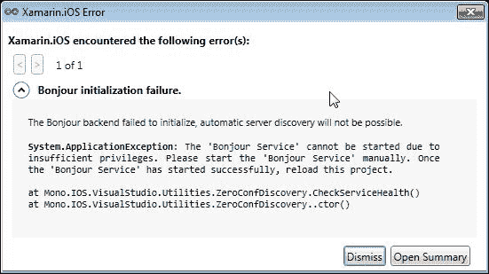
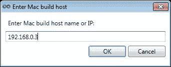
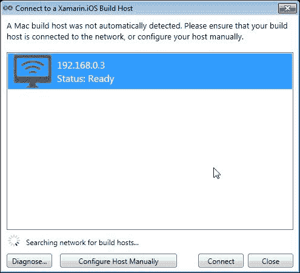
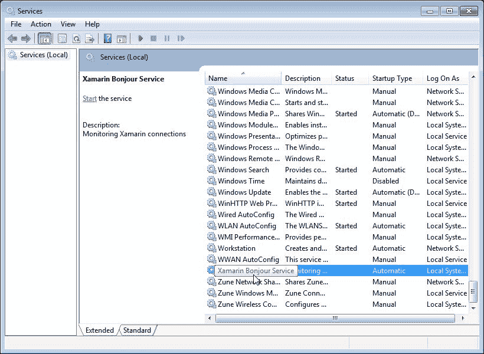
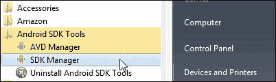
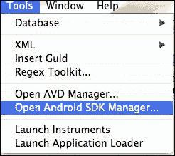
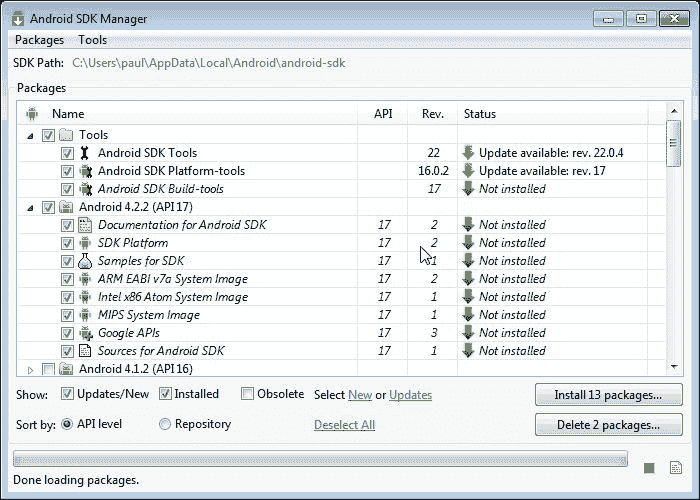

# 第一章. 安装 Xamarin 产品系列以支持 Android 和 iOS

Xamarin 产品系列涵盖了 iOS、OS X 和 Android 开发。这使您能够在不支持其的设备上通过受尊敬且成熟的 Mono 框架进行**.NET**框架开发。

在本章中，我们将涵盖以下主题：

+   安装 Xamarin.iOS、Xamarin.Android 和 Xamarin Studio

+   设置 Windows 机器以开发 iOS 应用程序

# 安装 Xamarin.iOS 和 Xamarin.Android

在 Windows 和 OS X 上安装 Xamarin 的过程非常相似且简单。在下载之前，您需要确保您的计算机满足以下最低要求：

| Windows | Mac |
| --- | --- |

|

+   Windows 7 或 Windows 8

+   Visual Studio 2010 或 2012

|

+   OS X Lion 或 Mountain Lion

+   Xcode v4.6 或更高版本

|

对于两者，一般规则是您拥有的内存越多越好。您还需要有一个活跃的网络连接。

## 下载软件

该网站能够检测您正在使用的操作系统，并在您选择下载时，将为您下载适合您操作系统的正确版本。

在您被允许下载评估副本之前，您需要向 Xamarin 提供一些基本信息。评估副本将允许您开发并部署应用程序 30 天，之后您将需要购买副本。如果您已将任何应用程序发布到 Apple Store 或 Google Play，它们将不再工作。

在 PC 上，双击`XamarinInstaller.exe`文件（Windows 8 用户应作为管理员运行此文件）。对于 Mac 用户，双击安装程序。

## 安装软件

根据您的网络连接，这个过程可能需要长达一个小时，因为每个软件包都会依次下载并安装。安装过程是自动的，除了**Xcode**之外，所有软件运行所需的组件都会被安装。检查您是否已安装 Xcode 在 Mac 上的简单方法是：点击“应用程序”文件夹，然后在底部附近寻找图标。如果找不到，请前往 App Store 并输入`Xcode`。下载是免费的。除非您有理由更改默认设置，否则每次出现选项时，请点击**下一步**接受默认设置选项。

# 启用 Visual Studio 以构建和运行 iOS 应用程序

为了让 Windows 能够创建、构建和部署 iOS 应用程序，它必须连接到网络上的某个 Mac。该 Mac 还必须安装 Xamarin.iOS。这是一个两步过程。

## 在 Mac 上

1.  点击苹果图标并选择**系统偏好设置**。

1.  然后您需要选择**安全与隐私**首选项选项。

1.  然后需要关闭防火墙。虽然这通常不是一个好主意，但大多数内部网络在任何路由器上都有一个足够好的防火墙。如果你不满意这个设置，请保留设置——你将无法在 Windows 下运行或为 iOS 开发。

## 在 PC 上

当 Xamarin.iOS for Visual Studio 安装时，它还会安装一个名为**Bonjour**的小型监听服务。当你尝试创建 iOS 应用程序时，Bonjour 将尝试自动找到你的网络上的 Mac。这可能失败，如果发生这种情况，你将看到以下屏幕截图：

你不需要担心错误。点击**关闭**。你将看到一个窗口，允许你输入你的 Mac 的 IP 地址。

在此示例中，我网络上的 Mac 的 IP 地址显示在上一个屏幕截图中。当你点击**确定**时，Bonjour 将尝试连接到 Mac。如果成功，你将看到以下屏幕截图：

一旦你在屏幕上看到前面屏幕截图所示的窗口，你就快完成了。下一步是点击主机机（如前面屏幕截图所示）并点击**连接**。完成后，你就在 PC 上设置了 iOS 开发环境。

所有开发工具（如模拟器——模拟的 iOS 设备）都可以在 iPhone 或 iPad 系列中的任何一个上。

如果 Bonjour 服务无法自动确定 Mac，你可能需要手动设置服务。这可以非常容易地完成。

假设你正在 Windows 7 上，以下步骤将帮助你设置 Bonjour 服务：

1.  点击**开始**按钮并选择**控制面板**。

1.  在**控制面板**上，点击**管理工具**，然后选择**服务**。你将看到一个窗口，如下面的屏幕截图所示：

1.  确保状态为**已启动**，启动类型为**自动**。（这将在 Windows 重新启动时启动 Bonjour 服务。）

    ### 注意

    当使用 PC 开发 iOS 应用程序时，确保 PC 和 Mac 都运行相同的 Xamarin.iOS 版本——如果它们不一致，你需要在不一致的设备上安装较新的 Xamarin.iOS 版本。

    

# 安装 Android 开发的额外代码

这在 iOS 和 PC 上有所不同，但最终效果是相同的。

当 Xamarin.Android 在任一平台上安装时，编译器和 Android 软件开发工具包（**SDK**）的最小集合将被安装。这将让你开始开发，但不会让你针对一系列设备。因此，安装其他版本的 Android 操作系统的 SDK 非常重要。这是通过**Android SDK** **管理器**完成的。

要在 PC 上访问**SDK 管理器**，请选择**开始**，然后在**所有程序**菜单中，有一个名为**Android SDK 工具**的菜单选项，其中包含**Android SDK 管理器**。选择**SDK 管理器**，您将看到一个新窗口，允许您选择您想要的 SDK。

## 对于 iOS 用户

在 Mac 上的安装过程中，会安装**Xamarin IDE**（**集成开发环境**）——Xamarin Studio。它在许多方面与 Visual Studio 相似，并且执行非常相似的任务。

要在 Xamarin Studio 中访问 SDK 管理器，请选择**工具**，然后选择**打开 Android SDK 管理器**。

在这两种情况下，您都会看到 SDK 管理器中的以下截图。最简单的方法是选择所有 SDK，然后点击**安装包...**按钮开始安装过程。根据您的网络连接速度，这个过程可能需要一段时间。

# 摘要

就这样——您已经在 Mac 和 PC 上设置好了，可以创建令人惊叹的 Android 和 iOS 应用程序。您的开发环境已经设置好。然而，在这本书的其余部分，我将专注于 iOS 应用程序的开发，并将 Android 留给配套书籍。
