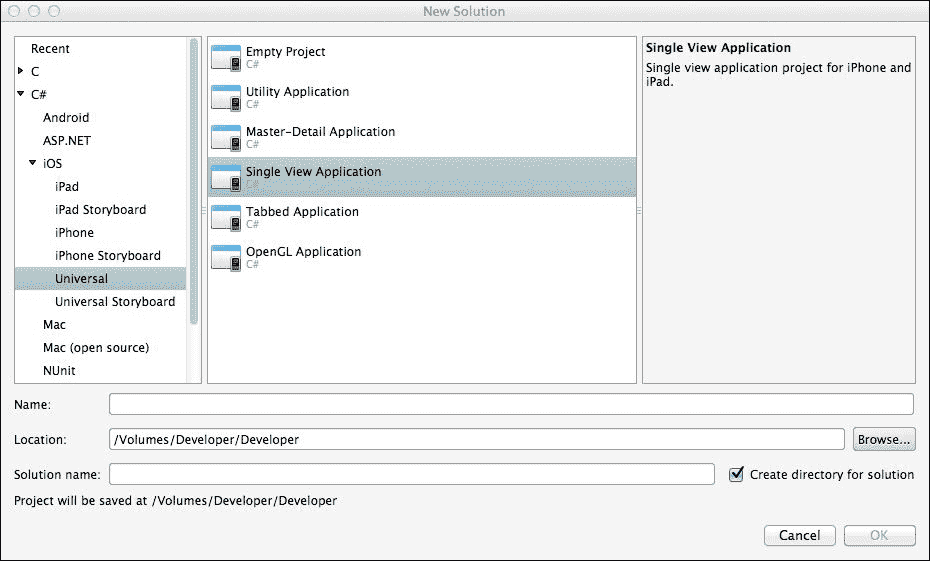
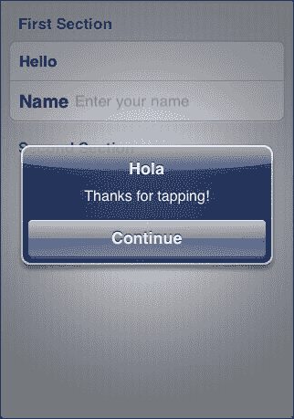

# 第二章. 用户界面

用户界面是设备与用户之间主要的通信方式。设计和外观是区分优秀应用程序和卓越应用程序的关键。

在本章中，我们将介绍用户界面的一些基本功能：

+   画布

+   MonoTouch.Dialog

+   将外部视图集成到您的用户界面中

+   颜色

+   标签

+   图片

# 使用 Xcode 创建用户界面

除了 `MonoTouch.Dialog` 之外，任何 iOS 应用程序的用户界面都是使用 Xcode 创建的。

在考虑如何创建用户界面以及任何可用小部件的位置时，您需要从在画布上放置毛绒布的角度思考。您可以在毛绒布的任何地方放置任何 iOS 小部件。

要创建简单的用户界面，创建一个新的 iOS 应用程序。点击**文件**，然后**新建**。您将看到一个如下所示的窗口：



点击**单视图应用程序**，在**名称**字段中输入文件名，完成后点击**确定**。Xamarin.iOS 将创建一个包含所有文件夹和文件的目录，以帮助您开始。取消选中**为解决方案创建目录**复选框仍然会创建应用程序，但文件将不会保存在目录结构中，而是保存在**位置**路径指向的地方。应用程序仍然可以编辑和修改，但文件丢失或被覆盖的可能性很大（例如，如果您在多个项目中工作，每个项目都会创建一个 `AppDelegate.cs` 文件。当创建新版本时，它将覆盖旧版本。）

一旦设置好应用程序结构，您将看到一个新文本编辑窗口，如下所示：


在解决方案资源管理器的底部，有三个文件需要特别注意：

+   **testappViewController.cs**：这是创建应用程序 C# 代码的文件

+   **testappViewController.designer.cs**：这是一个由 Xamarin.iOS 创建的设计师文件，基于使用 Xcode 创建的用户界面

+   **testappViewController_iPad.xib** 和 **testappViewController_iPhone.xib**：任何以 `.xib` 扩展名的文件都是 Xcode 设计师文件

    ### 小贴士

    要启动 Xcode，只需双击 `.xib` 文件。要编辑 `.xib` 文件，您必须根据您希望编辑的视图控制器用户界面双击 **testappViewController_iPad.xib** 或 **testappViewController_iPhone.xib** 文件。

    

Xcode 是一个非常简单的设计师，但在这个简单性中隐藏着非常强大的软件。启动时，您将看到以下屏幕：


Xcode 设计器是一个非常复杂的软件。然而，由于有书籍专门介绍如何最大限度地利用它，以及由于篇幅限制，我将在此仅讨论最小化内容。

要添加小部件，只需选择并将其拖放到主视图中。您几乎可以将任何小部件拖放到任何位置。然而，您的应用程序对此一无所知，因为它需要连接。连接小部件很简单。前面的截图显示了一个名为“连接器”的按钮。点击此图标，将在属性框架的左侧出现另一个框架。要连接小部件，请点击*Ctrl*并将其拖动到连接器框架中。


从这一点开始，您必须决定按钮的类型：**出口**、**动作**或**出口集合**。每个都大不相同，它们的名称有时会令人困惑。

通常认为**出口**按钮用于显示信息而不是接受事件。然而，动作，比如点击事件，是在**出口**中处理的。如果您将按钮作为**出口**连接，它被视为一个接口。它对所有可用的修改器和事件都开放。**出口集合**是一组出口。**动作**就是那样——它是一个与该对象链接的特定动作（或事件）。

然而，它们之间有一个重大区别。如果您将按钮连接为**出口**，则必须专门添加事件。如果您对按钮不做任何操作，应用程序将在您的设备上运行，但按钮将不会做任何事情。如果您将按钮连接为**动作**，则必须在应用程序运行之前编写动作代码。不这样做会导致应用程序崩溃。

事件将在后面的章节中处理。

## 屏幕原点和尺寸

所有屏幕和视图都从左上角的**0,0**开始。要获取屏幕尺寸（记住，这将因 iPhone 和 iPad 的不同版本而异），请考虑以下代码行：

```swift
var window = new UIWindow(UIScreen.MainScreen.Bounds);
float ScreenX = window.Screen.CurrentMode.Size.Width;
float ScreenY = window.Screen.CurrentMode.Size.Height;
```

# MonoTouch.Dialog (MT.D)

iOS 屏幕通常以列表形式包含大量数据（想想 Facebook 或 Twitter 的外观）。在 iOS 上，这些是通过`UITableView`构建的。这是 UI 中非常灵活的部分，但编码起来可能很棘手。为了减轻`UITableView`的问题，Xamarin 创建了`MonoTouch.Dialog`类。`MT.D`的好处是，设计界面不需要 Xcode，因此它可以在 Windows 和 Mac 上一样简单地创建。

`MonoTouch.Dialog`视图非常简单创建，并且基于三层系统进行设计：

+   **元素**: 这些包含诸如`on`/`off`布尔开关、字符串、图像以及您通常在用户界面中看到的其他任何内容。

+   **部分**: 这些包含任意数量的元素。

+   **根元素**: 这些元素包含部分内容。`MT.D`类必须至少有一个根元素。

有许多不同类型的元素。在以下示例中，构建了一个简单的用户界面（此代码是在您要求 Xamarin Studio 创建`MT.D`类时自动生成的）：

```swift
public partial class Login : DialogViewController{
  public Login() : base (UITableViewStyle.Grouped, null){
    Root = new RootElement(“Login”){
      new Section (“First Section”){
        new StringElement (“Hello”, () => {
          new UIAlertView (“Hola”, “Thanks for tapping!”, null,“Continue”).Show();
        }),
        new EntryElement(“Name”, “Enter your name”, string.Empty)
      },
      new Section (“Second Section”){
      },
    };
  }
}
```

编译后，代码生成以下结果（第一个视图是初始显示；第二个视图是在点击**Hello**条目时显示）：


图像 A

点击后会得到以下图像：



图像 B

键盘不必是标准的 QWERTY 键盘。它可以是一个专门用于电子邮件地址、电话号码或仅数字的键盘。这是使用`UIKeyboardType`定义的。

## 更改键盘类型

考虑以下代码行：

```swift
var entryExample = new EntryElement(“Caption”,“Type a number here”, string.Empty);
```

当前面的代码行附加到 MT.D 类视图时，点击元素将弹出一个标准字母数字键盘。对于标准输入，这很好；然而，在这个例子中，需要不同类型的键盘。为此，可以使用以下任一方法：

```swift
entryElement.KeyboardType = UIKeyboardType.DecimalPad
entryElement.KeyboardType = UIKeyboardType.NumberPad
```

然而，这些键盘有一个问题，那就是关闭它们。对于标准字母数字键盘，可以通过以下方式在键盘本身添加一个回车键：

```swift
entryElement.ReturnKeyType = UIReturnKeyType.Done
```

类似于数字键盘，即使添加了`ReturnKeyType`，也没有回车键。有三种方法可以解决这个问题：

+   `ShouldReturn`

+   `ResignFirstResponder`

+   向键盘添加一个带有关闭按钮的工具栏

### 使用 ShouldReturn

这是一个简单的方法来使用，但它依赖于键盘上有回车键：

```swift
entryElement.ShouldReturn += delegate {
  adminPhone.ResignFirstResponder(true); // animated
};
```

### 使用 ResignFirstResponder

除非在设计师或代码中定义，否则`FirstResponder`方法就是首先点击的控制。当点击其他东西（比如另一个`EntryElement`，但这也适用于任何其他控制）时，需要将其变为`FirstResponder`控制。通过发出`ResignFirstResponder`方法，关闭该控制的键盘。点击新的控制应该发出`BecomeFirstResponder`控制，并且其键盘出现（假设与控制相关联的键盘）。

### 向键盘添加工具栏

工具栏实际上不是键盘的一部分，但可以附加到键盘上以提供额外的或缺失的功能。对于`MT.D`类，添加键盘的方式与标准`UITextField`或`UITextView`控件不同。

#### **对于 MT.D**

在这里，需要一个`EntryElement`类的子类来实现`InputAccessoryView`方法。虽然可以通过从 Root 构造函数查看`TableView`来找到正在使用的单元格，但`InputAccessoryView`是从这里的一个只读参数，因此不能设置。

子类的示例如下：

```swift
public class ToolbarKeyboardEntryElement : EntryElement{
  private UITextField textField;
  public ToolbarKeyboardEntryElement(string caption, 
    string placeholder, string value) : 
    base(caption, placeholder, value) {
    }

  protected override UITextField CreateTextField(System.Drawing.RectangleF frame) {
      textField = base.CreateTextField(frame);
      UIToolbar toolHigh = new UIToolbar() {
        BarStyle = UIBarStyle.Black, Translucent = true
      };
      toolHigh.SizeToFit();
      UIBarButtonItem doneHigh = new UIBarButtonItem(“Done”,UIBarButtonItemStyle.Done, (ss, ea) => {
          textField.ResignFirstResponder();
        }
      );
      toolHigh.SetItems(new UIBarButtonItem[] { doneHigh }, true);
      textField.InputAccessoryView = toolHigh;
      return textField;
    }
    private NSString key = new NSString(“CustomEntryElement”);
    protected override NSString CellKey {
      get {
        return key;
      }
    }
  }
}
```

主代码中的`EntryElement`类需要修改以读取。

```swift
var entry = new ToolbarKeyboardEntryElement(“Caption”,“Enter a number”, string.Empty);
```


### 小贴士

对于这个例子，我没有包括密码参数。


#### **对于标准的 UITextField**

在这里，工具栏（如前一小节所述）被创建，但没有动作表，然后通过以下方式添加到 `UITextField` 方法中：

```swift
var txtField = new UITextField();
txtField.InputAccessoryView = toolBar;
```

图像 B（*MonoTouch.Dialog (MT.D)*部分）显示了 `UIAlertView` 控件。这是一个可定制的警告框，通常用于信息（例如，错误、在慢速过程中停止用户担心，或需要用户选择时）。

`MT.D` 的真正美在于它消除了与 `UITableView` 控件相关的乏味。它为开发者提供了从 `UITableView` 控件中所需的大多数功能，而无需麻烦。此外，如果您需要特殊的东西（例如标准界面按钮），这些可以通过简单地创建元素类型的子类来实现。

`MT.D` 类支持的元素类型如下：

| Element | 使用 | 使用注意事项 |
| --- | --- | --- |
| `ActivityElement` | 用于显示正在发生的事情（它是一个旋转器） |   |
| `BadgeElement` | 带文本的图像 |   |
| `BaseBooleanImageElement` |   | 布尔的基础类型，不能直接使用（抽象类） |
| `BooleanElement` | 简单的 `开`/`关` 开关 |   |
| `BooleanImageElement` | 简单的 `开`/`关` 开关，允许显示两种不同的图像 |   |
| `BoolElement` |   | 不能直接使用（抽象类） |
| `CheckboxElement` | 选择时在字符串旁边打勾 |   |
| `DateElement` | 显示日期选择器 | 这是一个两部分的元素。第一部分看起来像标准的 `StringElement` 元素，但在右侧值的旁边有一个 **>** 符号。点击时，会显示一个 `UIDatePicker` 元素。选定的值在值元素中返回。 |
| `DateTimeElement` | 显示日期/时间选择器 | 实质上与 `DateElement` 相同，但包括时间。时间可以设置为 12 小时或 24 小时制 |
| `Element` |   | 基础元素 |
| `EntryElement` | 允许数据输入 | 构造函数中的可选第四个参数允许将输入用于密码（将密码设置为 `true`）。构造函数接受三个字符串：标题、占位符和值。占位符和值可以是字符串或 `Empty`，但标题必须有值。 |
| `FloatElement` | 滑块栏 | 值为浮点数 |
| `HtmlElement` | 带有 HTML 视图的标题 | 这是一个交叉元素，因为发起者只是一个 `Element`，但点击时显示一个 `UIWebView` 元素。 |
| `ImageElement` | 生成图像 |   |
| `ImageStringElement` | 生成带有字符串的图像 |   |
| `JsonElement` | 允许从本地或远程 URL 加载内容 |   |
| `LoadMoreElement` | 允许用户向屏幕上的列表添加更多项目 |   |
| `MessageElement` | 将其视为在 Twitter 上找到的消息类型 |   |
| `MultilineElement` | 允许显示多行文本 | 不能被样式化 |
| `OwnerDrawnElement` | 不直接使用 | 必须子类化。必须重写 `Height` 和 `Draw` 方法 |
| `RadioElement` | 允许从多个选项中选择单个选项的无线电元素 | 需要在元素中指定一个无线电组 |
| `RootElement` | 根元素 |   |
| `StringElement` | 左侧有一个简单的标题，右侧有一个值 | 此元素也可以用作按钮，通过提供匿名代理作为第二个参数（如上例所示） |
| `StyledMultilineElement` | 与 `MultilineElement` 基本相同，但可以自定义样式 |   |
| `StyledStringElement` | 允许使用内置样式（如颜色、字体和大小）和自定义格式来显示字符串 |   |
| `TimeElement` | 显示时间选择器 | 与 `DateElement` 相同，但用于时间。 |
| `UIViewElement` | 可显示的 `UIView` | 使用 Xcode 设计 `UIView`。 |

## 在 MT.D 上创建自己的选择器

我决定使用 `UIPickerView` 并将其与顶部的 `UIToolBar` 结合，然后将其整合到 `UIActionSheet` 中来演示这一点。

首先，我们需要两样东西：一个事件来挂钩，以及模型（包含 `UIPickerView` 所需的信息）。然后就是将这两者连接起来。

1.  首先是事件：

    ```swift
    public class PickerChangedEventArgs : EventArgs {
      public string SelectedValue { get; set; }
    }
    ```

    实际上，这可以返回任何东西，不仅仅是字符串。但出于我的目的，我会将其保持为字符串。

1.  接下来是模型：

    ```swift
    public class PickerModel : UIPickerViewModel {
      private Ilist<string> myValues;
      public event EventHandler<PickerChangedEventArgs>PickerChanged;
      public PickerModel(IList<string> values)
        {
          myValues = values;}
      public override int GetComponentCount(UIPickerView picker) {
        return 1;
      }

      public override int GetRowsInComponent(UIPickerView picker, int component) {
        return myValues.Count;
      }

      public override string GetTitle(UIPickerView picker,int row, int component) {
        return myValues[row];
      }

      public override float GetRowHeight(UIPickerView picker, int component) {
        return 40f;
      }

      public override void Selected(UIPickerView picker,int row, int component) {
        if (PickerChanged != null) {
          PickerChanged(this, new PickerChangedEventArgs {SelectedValue = myValues[row] });
        }
      }
    }
    ```

    这不是什么火箭科学——唯一重要的是父类的 `Selected()` 方法被重写以返回所选行的值；其他所有内容都覆盖了默认类设置。

1.  为了将其连接到主 `MT.D` 类，使用 `EntryElement`：

    ```swift
    EntryElement myElement = null;
    ```

1.  还需要一个 `UIActionSheet` 元素：

    ```swift
    UIActionSheet action = new UIActionSheet();
    ```

1.  然后我们创建 `UIPickerView`：

    ```swift
    List<string> data = new List<string>() {“Hello”,“This is a”, “test”};
    Ilist<string> iData = data;
    var myPickerViewModel = new PickerModel(iData);
    var MyPickerView = new UIPickerView() {
      Model = myPickerViewModel,
      ShowSelectionIndicator = true,
      Hidden = false,
      AutosizeSubviews = true,
    };
    myPickerView.Frame = new RectangleF(0, 100, 320, 162);
    // 320 = screen x size for an iPhone 4
    ```

1.  接下来，创建 `UIToolbar` 和 `UIBarButtonItem`

    ```swift
    var toolBar = new UIToolbar() {
      BarStyle = UIBarStyle.Black,
      Translucent = true,
    };
    toolBar.SizeToFit();
    var doneButton = new UIBarButtonItem(“Done”,UIBarButtonItemStyle.Done, (s, e) => {
          action.DismissWithClickedButtonIndex(0, true);myElement.ResignFirstResponder(true);
    });
    toolBar.SetItems(new UIBarButtonItem[] { doneButton },true);

    myPickerViewModel.PickerChanged += (object sender,PickerChangedEventArgs e) => {
      myElement.Value = e.SelectedValue;
    };
    ```

1.  创建 `EntryElement` 对象：

    ```swift
    myElement = new EntryElement(“Hello”, string.Empty,string.Empty);
    ```

1.  现在只需要使用 `EntryStarted` 事件来调用选择器：

    ```swift
    myElement.EntryStarted += (object ss, EventArgs ee) => {
      action.Style = UIActionSheetStyle.BlackTranslucent;
      action.ShowInView(View);
      action.AddSubview(toolBar);
      action.AddSubview(myPickerView);
      action.Frame = new RectangleF(0, 100, 320, 500);
      myPickerView.Frame = new RectangleF(action.Frame.X,action.Frame.Y – 25, action.Frame.Width, 216);
    };
    ```

    当所有代码都编写完成后，结果如下：

    

1.  元素的子类化同样简单。子类 `EntryElement` 允许输入特定数量的字符：

    ```swift
    public class MaxNumberEntryElement : EntryElement {
      private UITextField textField;
      public int MaxLength { get; set; }

      public MaxNumberEntryElement(string caption,string placeholder, string value, int maxLength) :base(caption, placeholder, value) {
          MaxLength = maxLength;
        }

        protected override UITextField CreateTextField(System.Drawing.RectangleF frame) {
            textField = base.CreateTextField(frame);
            textField.ShouldChangeCharacters = (UITextField t,NSRange range, string replacementText) => {
                int newLength = t.Text.Length + replacementText.Length- range.Length;
              return (newLength <= MaxLength);
            };
          return textField;
        }

        private NSString key = new NSString(“CustomEntryElement”);

        protected override NSString CellKey {
          get { return key; }
        }
    }
    ```

    当然，你仍然可以使用 `UITableView` 和 `UITableViewCell`。

## `UITableView` 和 `UITableViewCell`

`UITableView` 方法是 iPhone 的主力。大多数，如果不是所有，的列表数据都是通过 `TableView` 和 `TableViewCell` 方法显示的。如果你是 Facebook、Twitter、标准 iPhone 文本消息应用或 iPhone 上的任何形式配置的用户，你将使用这两个组件——这让你了解到它们的使用程度。

这个主题非常庞大，将在第四章控制器中进一步讨论。

## 颜色、按钮和标签

`UILabel`是将文本放置在屏幕上的最简单方法。与其使用相关联的操作范围非常有限（例如，你不能将其用作可点击的对象）。可以设置标签的颜色和文本，也可以设置格式。例如，考虑以下代码行：

```swift
label.Text = “text”; // sets the text label to be “text”
label.TextColor = UIColor.Blue; // sets the text color to be blue
label.BackgroundColor = UIColor.FromRGB(255,255,200);
// sets the background to be yellow

label.TextAlignment = UITextAlignment.Center; // centres the text in the label
```

`UILabel`方法有五个构造函数，其中两个非常有用：

+   `UILabel()`

    ```swift
    UILabel(new RectangleF(x_pos, y_pos, width, height))
    ```

第二个构造函数可以使用`Frame`属性来复制，如下所示：

+   `UILabel lbl = new UILabel();`

    ```swift
    lbl.Frame = new RectangleF(x_pos, y_pos, width, height);
    ```

使用`UILabel`的一个主要问题是确保边界框足够大。有一种方法可以解决这个问题：

1.  将标签的大小做得比所需的大得多。

1.  计算字符串的长度，并使用`Frame`属性来改变标签的大小。

1.  减小字符串的字体大小以确保其能够适应。

这两种方法都有其优点和缺点。第一种是文本总是能够适应，但前提是字体大小是系统默认值。第二种是你会始终拥有正确的大小边界框，但你需要自己计算大小，这会花费时间。

### 确保你有正确的大小边界框

这假设已经使用 Xcode 创建了一个标签。在这个例子中，标签的宽度是 96（足够写“更多文本”）：

```swift
string test2 = “More text to fit and boy, does it fit!”;
lblTestLabel.AdjustsFontSizeToFitWidth = true;
lblTestLabel.Text = test2;
```

### UIColor

iOS 自带一系列预设的颜色（如红色、绿色、蓝色、黑色和白色）。你也可以使用`UIColor.FromRGB[A]`以及`FromHSB[A]`（其中`HSB`代表色调、饱和度和亮度，而`[A]`是透明度通道）来创建自己的颜色。后者可以看作是颜色的透明度。颜色也可以从图案（这很有用，因为它可以根据图像创建颜色，然后可以用作画笔来绘制图像）、`CoreImage`和`CoreGraphicsColor`（`CI`和`CGColor`）以及`FromWhiteAlpha`（基于当前颜色空间的灰度颜色）中设置。

使用`CIColor`和`CGColor`需要做更多的工作，但允许在颜色上有更大的灵活性。

最简单易用的方法是`FromRGB`。这允许输入的值以字节、整数和浮点数的形式输入。但在这里需要注意的是，浮点数的范围是从`0`到`1`而不是从`0`到`255`，所以`82, 184, 33`的值将是`0.32`、`0.72`和`0.13`（即 82/255、184/255 和 33/255）。

### UIButton

一个按钮不仅仅是一个按钮；它可以应用一系列有趣的效果（如添加图形、渐变色、文本和图形）。假设在 Xcode 中创建了一个按钮（`btn`），我们希望给它应用渐变色。

```swift
var gradient = new CAGradientLayer();
gradient.Colors = new MonoTouch.CoreGraphics.CGColor[] {
  UIColor.FromRGB(115, 181, 216).CGColor,
  UIColor.FromRGB(35, 101, 136).CGColor
};
gradient.Locations = new NSNumber[] { .5f, 1f };
gradient.Frame = btn.Layer.Bounds;
btn.Layer.AddSublayer(gradient);
btn.Layer.MasksToBounds = true;
```

`CAGradientLayer`来自`CoreAnimation`命名空间。

添加图像也是相当简单的，但重要的是要记住，当在按钮上放置任何东西时，你必须将那个按钮视为一个新的视图，其原点设置在按钮的左上角。还要记住，按钮可以有前景和背景图像。

通常，背景图像会覆盖整个按钮。

```swift
btn.SetBackgroundImage(UIImage.FromFile(“Path/ToImage.png”),UIControlState.Normal);
```

这里的第二个参数（`UIControlState`）是按钮（或控件）所处的状态。`Normal` 表示未选中状态。当按钮被按下时，状态变为 `Highlighted`，当释放时，状态再次变为 `Normal`。这意味着你可以根据按钮的状态显示不同的图片。

前景图像通常不会覆盖整个按钮，而会是一个特定的尺寸。例如，假设按钮是 92 x 92。为了填充按钮的大部分区域，每边 4 的间距会很好；这使得尺寸为 84 x 84（左右间距，以及高度和宽度）。为按钮创建此图像是一个两步过程：创建图像并添加图像。这次，`ImageView` 首先被使用，然后通过 `SetImage` 方法传递：

```swift
UIImageView btnImage = new UIImageView (new RectangleF(new PointF(4, 4), new SizeF(84, 84)));
btnImage.Image = UIImage.FromFile (“Path/ToImage.png”).Scale (new SizeF(84, 84));
btn.SetImage(btnImage.Image, UIControlState.Normal);
```

另一个选择是将 `ImageView` 作为子视图添加到按钮中。

```swift
btn.AddSubview(btnImage);
```

`UIButton` 也可以直接为其分配颜色。

```swift
btn.BackgroundColor = UIColor.Gray;
```

按钮上还有一个默认的文本，称为 `Title`。与任何文本元素一样，这也可以设置：

```swift
btn.SetTitle(“Some text”, UIControlState.Normal);
```

一个更有趣的效果是在按钮上同时显示文本和图形。考虑放置的最简单方法是以下这样：

设 `a` 和 `b` 为图像的左上角和右下角的位置（在我们之前的例子中，这将是 `4`, `4`）。为了方便，右侧也有相同的间距。

设 `c` 为从顶部（`a` + “图像高度”+ “一些间距”）的偏移量。

然而，这里的技巧是确保底部有足够的间距，以免看起来杂乱。

添加图像是一个两步或三步的过程。

1.  如果设置了 `Title`，则清除它（这可以在设计器中实现）。

1.  添加图片（参见上一个示例）。

1.  创建并添加一个 `UILabel`。

    ```swift
    // step 1
    if (!string.IsNullOrEmpty(btn.CurrentTitle))
      btnTitle.SetTitle(string.Empty, UIControlState.Normal);

    // step 3
    UILabel myLabel = new UILabel(new RectangleF(4, 78),new SizeF(84,10));
    myLabel.Text = “some text”;
    btn.AddSubview(myLabel);
    ```

### UIControlStates

（如前所述）有几种 `UIControlStates`：`Application`、`Disabled`、`Highlighted`、`Normal`、`Reserved` 和 `Selected`。对于大多数日常考虑，最常用的是 `Disabled`、`Highlighted` 和 `Normal`。

如果 `Enabled` 属性为 `false`，按钮处于 `Disabled` 状态。唯一的问题是这是使用系统默认值判断按钮是否禁用的唯一方式。可能更好的做法是在禁用状态下设置背景颜色以及文本。

按钮不一定是圆形的。有四个预定义的按钮（`ContactsAdd`、`DetailDisclosure` [即 **>** 箭头]、`InfoDark` 和 `InfoLight` [带有深色或浅色背景的信息图标]）。还有一个自定义的 `UIButtonType` 类型。默认情况下，它不会为按钮添加边框，但允许创建有趣的按钮，其中 `.png` 文件可以是按钮的形状。所以如果你想有一个八边形的按钮，你将需要一个八边形的 `.png` 文件，然后编写以下代码：

```swift
btn.ButtonType = UIButtonType.Custom;
btn.SetBackgroundImage(UIImage.FromFile(“octagon.png”,UIControlState.Normal));
btn.SetBackgroundImage(UIImage.FromFile(“octagon-selected.png”,UIControlState.Highlighted));
```

# 摘要

如您从这次匆匆一瞥中可以看到，iOS 为您提供了大量丰富且多样化的对象，这些对象可以在 UI 中使用。在后续章节中，我们将看到这些对象如何被扩展，以及如何最大限度地利用它们。
