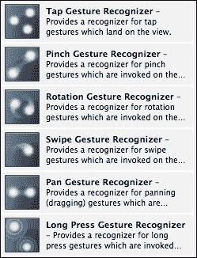

# 第七章：手势

在撰写本文时，美国法院正在就谁发明了拖动图像等问题进行争论，但毫无疑问，iOS 的一个关键特性是能够使用**手势**。简单来说，当您点击屏幕以启动应用程序或选择图像的一部分以放大它或类似操作时，您正在使用手势。

本章将涵盖以下主题：

+   什么是手势？

+   向 UI 添加手势

+   处理手势

+   处理拖放

# 手势

（在 iOS 的术语中）手势是 UI 与设备之间的任何触摸交互。iOS 6 提供了六种用户可以使用的手势。以下表格列出了这些手势及其简要说明：

| 类 | 名称和类型 | 手势 |
| --- | --- | --- |
| `UIPanGestureRecognizer` | `PanGesture`;连续类型 | 通过在屏幕上拖动来平移图像或超大视图 |
| `UISwipeGestureRecognizer` | `SwipeGesture`;连续类型 | 与平移类似，但它是滑动 |
| `UITapGestureRecognizer` | `TapGesture`;离散类型 | 连续点击屏幕（可配置） |
| `UILongPressGestureRecognizer` | `LongPressGesture`;离散类型 | 长按屏幕 |
| `UIPinchGestureRecognizer` | `PinchGesture`;连续类型 | 通过捏住区域并移动手指来缩放 |
| `UIRotationGestureRecognizer` | `RotationGesture`;连续类型 | 通过相反方向移动手指来旋转 |

可以通过编程或通过 Xcode 添加手势。以下截图列出了可用的手势，以及设计师右侧的其余小部件：



要添加手势，将您想要使用的手势拖动到视图栏下的视图（如下截图所示）：


按照您想要的样式设计 UI，同时按住*Ctrl*键，将手势拖动到您想要识别的对象上。在我的例子中，您想要识别的对象可以在屏幕上的任何位置。一旦将手势连接到您想要识别的对象，您将看到手势的可配置选项。

**Taps**字段是在触发识别器之前所需的点击次数，而**Touches**字段是在屏幕上需要触摸的点数，以触发识别器。

当您连接 UI 时，必须添加手势。

## 手势代码

当使用 Xcode 时，编写手势代码很简单。Xcode 中为点击手势定义的类称为`tapGesture`，并在以下代码中使用：

```swift
private int tapped = 0;
public override void ViewDidLoad()
{
    base.ViewDidLoad();
    tapGesture.AddTarget(this, new Selector("screenTapped"));
    View.AddGestureRecognizer(tapGesture);
}
[Export("screenTapped")]public void SingleTap(UIGestureRecognizer s)
{
    tapped++;
    lblCounter.Text = tapped.ToString();
}
```

代码本身并没有什么特别之处；它只是显示屏幕被点击了多少次。

当检测到点击时，代码会调用`Selector`方法。只要`Selector`和`Export`名称相同，方法名无关紧要。

## 类型

当最初描述手势类型时，它们被赋予了一个类型。这个类型反映了发送到`Selector`方法的消息数量。离散类型生成单个消息。连续类型生成多个消息，这要求`Selector`方法更加复杂。复杂性是通过`Selector`方法必须检查手势的**状态**来决定如何处理消息以及是否已完成而增加的。

## 在代码中添加手势

使用 Xcode 添加手势不是必需的。要在以下代码中执行与我在 Xcode 中先前代码相同的任务非常简单。代码将如下所示：

```swift
UITapGestureRecognizer t'pGesture = new UITapGestureRecognizer()
{
    NumberOfTapsRequired = 1
};
```

然后可以使用`AddTarget`中的其余代码。

## 连续类型

以下代码，一个捏合识别器，展示了简单的缩放。代码之后，我将解释几个其他状态。设计师代码中唯一的区别是，我使用了`UIImageView`而不是标签，以及`UIPinchGestureRecognizer`类而不是`UITapGestureRecognizer`类。

```swift
public override void ViewDidLoad()
{
    base.ViewDidLoad();
    uiImageView.Image =UIImage.FromFile("graphics/image.jpg")Scale(new SizeF(160f, 160f);
    pinchGesture.AddTarget(this, new Selector("screenTapped"));
    uiImageView.AddGestureRecognizer(pinchGesture);
}
[Export("screenTapped")]public void SingleTap(UIGestureRecognizer s)
{
    UIPinchGestureRecognizer pinch = (UIPinchGestureRecognizer)s;
    float scale = 0f;
    PointF location;
    switch(s.State)
    {
        case UIGestureRecognizerState.Began:
            Console.WriteLine("Pinch begun");
            location = s.LocationInView(s.View);
            break;
         case UIGestureRecognizerState.Changed:
             Console.WriteLine("Pinch value changed");
             scale = pinch.Scale;
             uiImageView.Image = UIImageFromFile("graphics/image.jpg")Scale(new SizeF(160f, 160f), scale);
             break;
         case UIGestureRecognizerState.Cancelled:
             Console.WriteLine("Pinch cancelled");
             uiImageView.Image = UIImageFromFile("graphics/image.jpg")Scale(new SizeF(160f, 160f));
             scale = 0f;
             break;
         case UIGestureRecognizerState.Recognized:
             Console.WriteLine("Pinch recognized");
             break;
    }
}
```

### 其他 UIGestureRecognizerState 值

下表列出了其他识别器状态：

| 状态 | 描述 | 备注 |
| --- | --- | --- |
| 可能 | 默认状态；手势尚未被识别 | 所有手势都使用 |
| 失败 | 手势失败 | 此状态未发送任何消息 |
| 平移 | 滚动方向 | 用于滚动手势 |
| 速度 | 滚动速度 | 用于滚动手势 |

除了这些，还应注意的是，离散类型仅使用可能和已识别状态。

# 处理拖放

可以使用手势或使用`TouchesBegan`、`TouchesMoved`和`TouchesEnded`处理程序来处理拖放。本质上，可以使用如以下代码所示的定制`UIImageView`类：

```swift
public class myDragImage : UIImageView 
{
    private PointF myLoc, myStartLoc;
    private bool TouchedOnce = false;

    public myDragImage (RectangleF frame)
    {
        this.Frame = frame;
        myStartLoc = this.Frame.Location;
    }
    public override void TouchesBegan(NSSet touches, UIEvent e)
    {
        myLoc = Frame.Location;

        var touch = (UITouch)e.TouchesForView(this).AnyObject;
        var bounds = Bounds;

        myStartLoc = touch.LocationInView(this);
        Frame = new RectangleF(Location,bounds.Size);
    }
    public override void TouchesMoved(NSSet touches, UIEvent e)
    {
        var bounds = Bounds;
        var touch = (UITouch)e.TouchesForView(this).AnyObject;

        myLoc.X += touch.LocationInView(this).X - myStartLoc.X;
        myLoc.Y += touch.LocationInView(this).Y - myStartLoc.Y;

        Frame = new RectangleF(myLoc, bounds.Size);
        TouchedOnce = true;
    }

    public override void TouchesEnded(NSSet touches, UIEvent e)
    {
        myStartLoc = myLoc;
    }
}
```

这是一种简单的处理拖放的方式。对于手势，应使用连续类型。

# 概述

手势无疑可以为您的应用增添很多功能。它们可以让用户快速浏览图片，在地图上移动，放大和缩小，以及选择视图上任何内容的区域。它们的灵活性是 iOS 被公认为用户操作屏幕上图像、视频和其他内容的极其灵活设备的根本原因。
