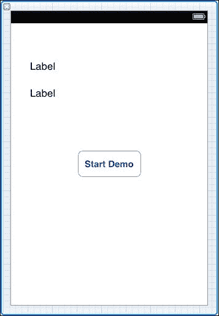
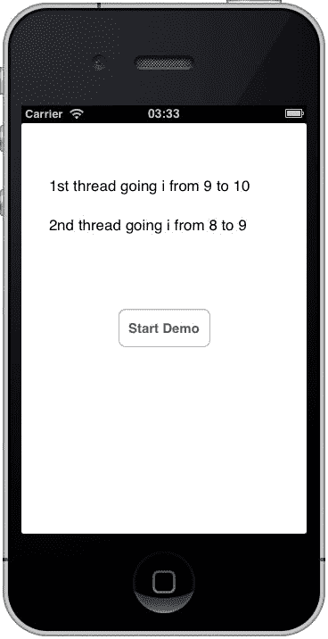
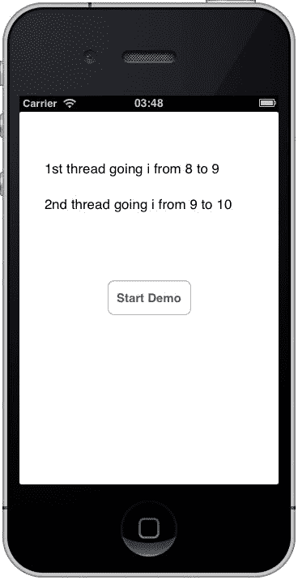

# 第八章. 线程

iOS 被称为多线程系统，理解如何在应用中使用线程可能会有所帮助。

我们将在本章中介绍以下主题：

+   线程的简要介绍

+   主要 UI 线程

+   子线程

+   AppDelegate 类

# 线程概念

让我们讨论一种学习线程的简单方法。

可以将单线程环境视为去你当地的大学一样。你可以选择多条路线，但最终你都会到达那里，这个过程需要一定的时间；你出发，你旅行，你到达。

多线程环境需要被视为大学本身，每个线程都是一个学生。所有学生都是从早上 9 点开始，一直持续到中午 12 点。他们在那段时间里可能互相干扰，也可能不干扰；他们都会执行一个任务或合作完成任务以加快答案的交付。30 个不同的线程，同时以不同的速度工作，但到了中午 12 点，他们都能成功收敛并结束他们的活动，任务完成。他们从下午 1 点到 4 点重复这个过程，同样，在这些小时里，也存在有组织的混乱，但到了下午 4 点，一切都会收敛。讲师是控制谁做什么的人，在线程模型中，是控制线程。*简单！*

在 iOS 开发中，讲师会被归类为 UI 线程；它是可以启动新线程的线程，最终，所有信息都需要反馈到这个线程上。

# 主要 UI 线程

如其名所示，UI 线程控制着用户界面。它通常在资源和使用处理器时间方面需求最大。并非所有操作都在 UI 线程上运行。例如，如果 UI 调用一个方法，而这个方法不能在 UI 线程上运行（例如，在第十一章中列出的 SQLite 示例，*处理数据*），那么就会发生这种情况。一旦方法返回，代码就会执行，流程继续。

UI 线程不应被误认为是单一任务；*它不是*。单一任务会阻止其他应用程序运行，我们知道这不是情况（例如，你可以在玩愤怒的小鸟的同时收到短信）。

`Xamarin.iOS`允许非 UI 调用简单地跳回 UI 线程。

```swift
InvokeOnMainThread(delegate () {…});
```

或者，如果找不到线程的引用（例如超出范围或在非 UI 线程类中），可以使用以下代码行：

```swift
using (var pool = new NSAutoreleasePool()) {
  pool.InvokeOnMainThread(delegate() {
    // do something on the UI thread
  });
}
```

## 死锁

在多线程系统的描述中，你可能在想，如果所有学生应该在的时候没有回来会怎样？那时会发生什么？这是一个好问题，因为它是在处理多线程环境时，如果不小心可能会遇到的问题。这被称为死锁，字面上说，它可能会锁定应用程序甚至设备（尽管这种情况很少发生）。另一个问题是线程覆盖相同的内存位置（想象一下这是两个人或更多人同时与讲师交谈；只有一种声音会被记住）。

在这个例子中，如果两个线程几乎同时运行，它们都有时间在任何人到达内部锁之前获取第一个锁。如果没有`Sleep()`调用，其中一个线程很可能在另一个线程甚至开始之前就有时间获取并释放两个锁。

```swift
// thread 1
lock(typeof(int)) {
  Thread.Sleep(1000);
  lock(typeof(float)) {
    Console.WriteLine("Thread 1 got both locks");
  }
}

// thread 2
lock(typeof(float)) {
  Thread.Sleep(1000);
  lock(typeof(int)) {
    Console.WriteLine("Thread 2 got both locks");
  }
}
```

## 避免同步访问器的死锁

避免这种形式死锁的一个简单方法是为每个持有类拥有它自己的私有死锁。这个问题及其解决方案在 MSDN 上描述得很好([`msdn.microsoft.com/en-us/library/orm-9780596516109-03-18.aspx`](http://msdn.microsoft.com/en-us/library/orm-9780596516109-03-18.aspx))。

# 从主 UI 线程启动新线程

从现有线程中产生的新线程被称为子线程。

在 iOS 设备上添加子线程的一个非常简单的方法是这样的。我首先创建了一个简单的 UI 来显示正在发生的事情。顶部的标签称为线程 1，底部的标签称为线程 2。



代码还展示了`InvokeOnMainThread`的作用——没有它，应用程序将失败：

```swift
using System.Threading;
...
private int i = 0;

public override void ViewDidLoad() {
  base.ViewDidLoad();
  var first = new Thread(new ThreadStart(firstThread));
  var second = new Thread(new ThreadStart(secondThread));
  btnStart.TouchUpInside += delegate {
    first.Start();
    Thread.Sleep(10);
// causes a 10ms delay between starting the next thread

    second.Start();
  };
}

private void firstThread() {
  string text = string.Empty;
  while (i < 10) {
    text = string.Format("1st thread going i from {0} to {1}",i, ++i);
    InvokeOnMainThread(delegate() {thread1.Text = text;
    });
    Thread.Sleep(100);
  }
}

private void secondThread() {
  string text = string.Empty;
  while (i < 10) {
    text = string.Format("2nd thread going i from {0} to {1}",i, ++i);
    InvokeOnMainThread(delegate() {
      thread2.Text = text;
    });
    Thread.Sleep(100);
  }
}
```

当运行时，模拟器给出以下输出：



运行几次，你会得到不同的结果。线程在不同的时间在 UI 上执行操作；这很好地展示了线程的问题。如果 UI 正在等待线程 1 完成，但线程 2 完成了，那么它将不知道发生了什么。

在这种情况下，可以通过使用锁来清理代码。

## 使用锁

使用锁时要小心，可能是需要说的第一件事。锁用于同步线程并获得一个更加合理的输出。

```swift
private int i = 0;
private object lock_i = new object();
public override void ViewDidLoad() {
  base.ViewDidLoad();
  var first = new Thread(new ThreadStart(firstThread));
  var second = new Thread(new ThreadStart(secondThread));
  btnStart.TouchUpInside += delegate {
    first.Start();
    Thread.Sleep(10);
    // causes a 10ms delay between starting the next thread

        second.Start();
  };
}
private void firstThread() {
  string text = string.Empty;
  do {
    lock(this.lock_i) {
      if (i >= 10) return;
      text = string.Format("1st thread going i from {0} to {1}",i, ++i);
      InvokeOnMainThread(delegate() {
        thread1.Text = text;
      });
    }
    Thread.Sleep(100);
  }
  while(true);
}
private void secondThread() {
  string text = string.Empty;
  do {
    lock(this.lock_i) {
      if (i >= 10) return;
      text = string.Format("2nd thread going i from {0} to {1}",i, ++i);
      InvokeOnMainThread(delegate() {
        thread2.Text = text;
      });
    }
    Thread.Sleep(100);
  }
  while(true);
}
```

这次当应用程序运行时，线程是同步的，结果总是相同的。使用这个锁定系统，应用程序可以自由地使用它需要的任何数量的线程来从 UI 线程完成任何工作。



# AppDelegate 类

这里描述`AppDelegate`类可能看起来有些奇怪，但它很合适。`AppDelegate`类被称为单例类。它只使用一次，并且所有内容都来自它。将其视为超级线程；没有它，其他什么都不会发生。

我在第五章中对`AppDelegate`类进行了更详尽的处理，*UI 控件*，阅读完这一章后，你应该对其重要性有更清晰的认识。

# 摘要

在 iOS 应用程序中，多线程可以使用户体验更加响应，但与此同时，对于开发者来说，它也可能是导致许多夜晚晚归的原因，试图弄清楚为什么某些东西会在随机的时间崩溃，或者没有任何真正原因地突然停止工作。对待线程要小心，它们既可以是一种痛苦，也可以是一种乐趣。
