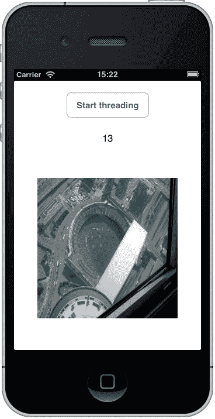

# 第九章。线程任务

在上一章中，我们探讨了在 iOS 应用程序中使用线程的基本知识以及使用它们可能遇到的陷阱。在这一章中，我将继续这一主题，并探讨线程的其它方面以及异步调用。

在本章中，我们将涵盖以下主题：

+   在你的代码中使用后台线程和 `System.Threading.Tasks`

+   使用异步代码

+   使用任务可能对线程模型产生的问题

# 线程简介

线程从其不起眼的起点发展起来，当开发者发现了它的力量时，就创造了后台线程和任务线程。后台线程正是如此——你设置一些在后台运行的任务，有时检查它，或者当它完成时，它会向你报告。在上一章中我使用的大学类比中，后台线程是行政人员——他们在后台工作，完成时报告。

线程任务需要被视为几乎独立的微型应用程序。它们开始、结束，并且可以在列表中的下一个任务上继续——在这整个过程中，应用程序可以自由地处理其他任务。任何线程操作都会有一些开销需要考虑，但除非你正在做非常复杂的事情，否则它不会很糟糕。

## 在你的应用程序中使用后台线程

后台线程来自 `System.ComponentModel` 命名空间，被称为 `BackgroundWorker` 线程。或者，`ThreadPool.QueueUserWorkItem()` 也做同样的事情（因为 `ThreadPool` 来自 `System.Threading`）。

### BackgroundWorker

当你不想占用 UI 时，建议使用 `BackgroundWorker` 线程，因此创建大文件或将大量数据发送到服务器可以考虑使用 `BackgroundWorker`。当线程完成时，将触发 `WorkerCompleted` 事件。在 `BackgroundWorker` 的操作过程中，可以通过 `ProgressChanged` 事件更新 UI。后台操作持续一定的时间。重要的是要记住 `BackgroundWorker` 是一个异步任务。

当你使用 `BackgroundWorker` 线程时，你需要编写使用三个事件（如果你不想使用 `ProgressChanged`，则可以省略）的代码。

```swift
DoWork(object sender, DoWorkEventArgs e);
RunWorkerCompleted(object sender, RunWorkerCompletedEventArgs e);
ProgressChanged(object sender, ProgressChangedEventArgs e);
```

上一段代码演示了在应用程序中使用 `BackgroundWorker`。这很简单；它在屏幕上显示一个计数器，在下载图片的同时继续计数，当 `RunWorkerCompleted` 事件被触发时，显示下载的图片。

```swift
private UIImage downloadedImage;
private BackgroundWorker bgWorker;
private Timer t;
private int counter = 0;

public override void ViewDidLoad()
{
    base.ViewDidLoad();
    bgWorker = new BackgroundWorker();
    bgWorker.DoWork += HandleDoWork;
    bgWorker.RunWorkerCompleted += HandleRunWorkerCompleted;
    btnStart.TouchUpInside += delegate
    {
        t = new Timer(1000); // 1 second
        t.Elapsed += delegate
        {
            counter++;
            InvokeOnMainThread(delegate()
            {
                lblCountValue.Text = counter.ToString();
            });
        };
        t.Start();
        bgWorker.RunWorkerAsync();
    };
}

private void HandleRunWorkerCompleted(object sender,RunWorkerCompletedEventArgs e)
{
    uiImageView.Image =UIImage.FromImage(downloadedImage.CGImage).Scale(newSizeF(240f, 240f));
    t.Stop();
}

private void HandleDoWork(object sender, DoWorkEventArgs e)
{
    NSUrl url = new NSUrl("http://edmullen.net/test/rc.jpg");
    NSData data = NSData.FromUrl(url);
    downloadedImage = new UIImage(data);
}
```

上述代码足够简单，易于理解，它创建了`BackgroundWorker`对象，并为按钮创建了句柄和点击事件。在按钮内部，它设置了一个定时器，每秒更新计数器并启动`BackgroundWorker`。当`BackgroundWorker`的`DoWork`线程完成时，将显示并缩放图像。上述代码的结果以以下图像的形式展示：



记住，这是一个后台任务——UI 无法对数据进行操作，直到数据准备就绪。当你运行应用程序时，计数器的值也会有所不同，这取决于你是否在无线网络或户外，使用 3G 或 4G。

### ThreadPool.QueueUserWorkItem

在了解了后台工作线程的工作方式后，让我们考虑使用`ThreadPool.QueueUserWorkItem`来完成相同任务：

```swift
private UIImage downloadedImage;
private System.Timers.Timer t;
private int counter = 0;

public override void ViewDidLoad()
{
    base.ViewDidLoad();
    btnStart.TouchUpInside += delegate
    {
        t = new Timer(100);
        t.Elapsed += delegate
        {
            counter++;
            InvokeOnMainThread(delegate()
            {
                lblCountValue.Text = counter.ToString();
            });
        };
        t.Start();
        ThreadPool.QueueUserWorkItem(delegate
        {
            ProcessFile();
        }); 
    };
}

private void ProcessFile()
{
    NSUrl url = new NSUrl("http://edmullen.net/test/rc.jpg");
    NSData data = NSData.FromUrl(url);
    downloadedImage = new UIImage(data);
    InvokeOnMainThread(delegate()
    {
        uiImageView.Image =UIImage.FromImage(downloadedImage.CGImage).Scale(newSizeF(240f, 240f));
    });
    t.Stop();
}
```

**回调**是一段作为参数传递的代码，需要在某个时间点执行。在多线程术语中，它通常在被调用或创建的线程中执行。回调告诉线程何时将其回调到主线程。最终结果是相同的，但`QueueUserWorkItem`方法可以用于前台和后台任务。

## 使用 System.Threading.Tasks

`System.Threading.Tasks`命名空间在线程内设置任务，因此线程可以执行一种小型程序，然后报告结果。它还可以用于启动任务。

```swift
var scheduler = TaskScheduler.FromCurrentSynchronizationContext();
Task.Factory.StartNew(() => GetMessage(currentPosition)).ContinueWith(ShowResults, scheduler);
```

调用启动了一个新的线程任务，该任务调用`GetMessage`。一旦返回，任务将继续执行`ShowResults`。调度器防止时间失控。


### 注意

虽然在[`www.gregshackles.com/2011/04/using-background-threads-in-mono-for-android-applications/`](http://www.gregshackles.com/2011/04/using-background-threads-in-mono-for-android-applications/)上可用的代码是为 Android 设计的，但相同的代码（或多或少）可以用于 Xamarin.iOS，并提供了不同类型的线程及其使用方式的出色覆盖。


## 在线程上使用任务时遇到的问题

每当创建一个额外任务时，处理器必须开始在任务之间进行交换，这会减慢代码的执行速度。你还有跟踪任务以及它们如何与主 UI 线程协同工作的问题。一般来说，它们不应该引起问题，但你也要考虑到，除非你明确编程线程以同步方式运行，否则它们是异步运行的。为了防止代码失控，需要使用锁或回调。**锁**可能导致**死锁**条件，所以请小心！请参阅第八章，*线程*，以了解死锁及其避免的概述。

# 使用异步代码

异步是.NET 的重大变化之一，并在.NET v4 中发布，但直到最近才在 Mono 框架中实现，因此也在 Xamarin.Android 和 Xamarin.iOS 中实现。正如我在前一章中解释的，异步代码可能有点棘手，但幸运的是，这部分棘手的内容很容易理解。

## 任务和事件处理器

以以下代码为例：

```swift
var webView = new UIWebView();
webView.LoadStarted += HandleLoadStarted;
…
private void HandleLoadStarted (object sender, EventArgs e)
{}
```

`LoadStarted`事件的处理程序是一个同步过程——换句话说，它就像直线上去酒吧一样。问题是，当`webView`正在加载页面时，所有事情都会被阻塞——所以如果页面加载缓慢或者你需要运行其他东西（比如播放音乐），就会出现瓶颈。这就是异步`LoadStarted`事件可以发挥作用的地方。

```swift
var webView = new UIWebView();
webView.LoadStarted += async(object sender, EventArgs e) =>{HandleLoadStarted(sender, e);};
```

`async`方法与普通方法在以下代码中看起来不同：

```swift
private async void HandleLoadStarted(object sender, EventArgs e)
```

## 一个更实际的例子

在实现`async`方法之前，必须实现一个事件系统，以便一旦数据返回，就可以由方法处理（例如，从网络数据下载）。例如（以下是一个伪代码，以便你理解这个概念）：

```swift
login.name = "nodoid201213";
login.password = "312102diodon";
login.DataReturned += HandleDataReturned;
callLoginService(login);
private void HandleDataReturned { … }
```

之前的代码现在可以由单个`async`方法处理，如下所示：

```swift
private async Task<bool> LogUserIn()
{
    login.name = "nodoid201213";
    login.password = "312102diodon";
    bool loginResult = await callLoginService(login);
    return loginResult;
}
```

这里关键是`await`——这会阻止下一行执行，直到`callLoginService`方法返回。这大大提高了响应速度——代码更少，需要监听的事件更少，而且几乎不需要做额外的事情。

如果一个方法返回一个值，需要在方法名之前使用`Task<T>`参数。如果没有返回值（例如，响应按钮点击），则需要使用`void`。

# 摘要

背景线程和异步调用有许多用途，一般建议如果某个过程耗时较长，就将其放在后台执行。使用线程时要小心。虽然大多数时候它们都很好，但你仍然需要在真实设备上测试所有应用程序，以确保线程正常工作。记住，模拟器是有缺陷的（例如，模拟器在**即时编译**处理器模型上工作，而不是手机使用的**预编译**，结果是网络服务可能不会按计划工作）并且与手机的工作方式不同。
