# 第二章. 在 Android 上进行测试

现在我们已经介绍了测试的原因和基本概念，是时候将它们付诸实践了。

在这一章中，我们将涵盖：

+   在 Android 上进行测试

+   单元测试和 JUnit

+   创建 Android 测试项目

+   运行测试

我们将创建一个简单的 Android **主**项目及其配套的**测试**项目。主项目将几乎是空的，只是突出测试组件。

根据我的个人经验，我建议这一章对新开发者（没有 Android 测试经验）很有用。如果你对 Android 项目有一些经验，并且已经使用测试技术对它们进行过测试，你可能会将这一章作为复习或概念重申。

虽然这不是强制性的，但最佳实践规定测试应该存在于一个单独的相关项目中。现在 Android ADP 插件支持这一功能，但这并不总是如此。一些时间以前，我发表了一篇文章([`dtmilano.blogspot.com/2008/11/android-testing-on-android-platf.html`](http://dtmilano.blogspot.com/2008/11/android-testing-on-android-platf.html))，描述了一种手动维护两个相关项目的方法——一个主项目和测试项目。

这个决定的优点可能不会立即显现，但其中我们可以列出：

+   测试代码可以从生产构建中轻松剥离，因为它不包括在主项目中，因此不在 APK 中

+   通过 Dev Tools 中的 Instrumentation 选项简化在模拟器上运行测试的方式

+   对于大型项目，如果它们是分开的，部署主包和测试包将花费更少的时间

+   鼓励在类似项目中重用代码

# JUnit

在上一章中，我们已经对 JUnit 进行了概述，所以这里不需要介绍。值得一提的是，JUnit 测试框架是 Android 测试项目的默认选项，它由 Eclipse、Android ADT 插件以及 Ant 支持，即使你不是在 IDE 中开发。

因此，你可以自由地为每种情况选择最佳替代方案。

以下的大部分示例将基于 Eclipse，因为它是最常见的选项。所以，让我们打开 Eclipse，不进行任何前言。

# 创建 Android 主项目

我们将创建一个新的 Android 项目。这是通过 Eclipse 菜单**文件** | **新建** | **项目..**. | **Android** | **Android 项目**来完成的。

在这个特定的情况下，我们使用以下值作为所需组件名称：

| 项目名称: | **MyFirstProject** |
| --- | --- |
| 构建目标: | **Android 2.3.1** |
| 应用名称: | **我的第一个项目** |
| 包名: | **com.example.aatg.myfirstproject** |
| 创建活动: | **MyFirstProjectActivity** |
| 最小 SDK 版本: | **9** |

输入这些值后，你的项目创建对话框将看起来像这样：

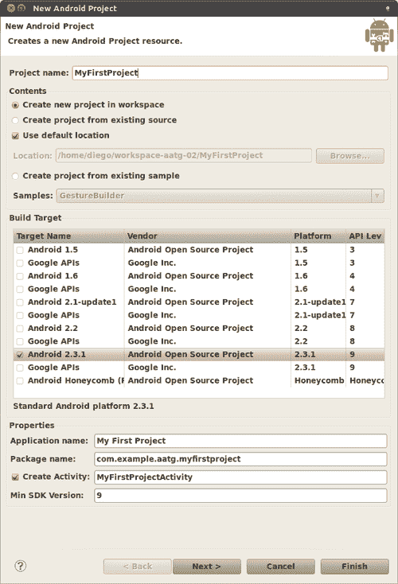

# 创建 Android 测试项目

按下**下一步**按钮，将显示 Android 测试项目创建对话框。注意，一些值已经根据主项目中选择的相应值预先选择了。

### 注意

或者，要为现有的 Android 项目创建测试项目，您可以选中主项目，然后选择**Android 工具 | 创建测试项目**。在 *测试目标* 中选择现有项目的名称，所需值将自动填写。

这张图片显示了输入相应值后的 Android 测试项目创建对话框。所有值都已为我们填写，我们只需点击**完成**：

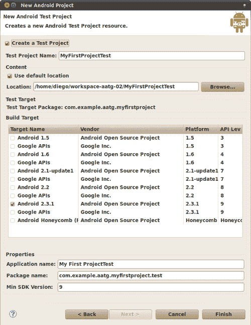

# 包资源管理器

创建了两个项目后，我们的包资源管理器应该看起来像下面的图片。我们可以注意到存在两个相关联的项目，每个项目都有独立的一组组件和项目属性。

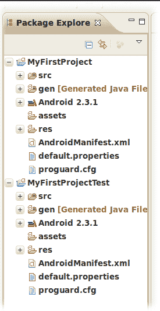

现在我们已经建立了基本的基础设施，是时候开始添加一些测试了。

目前没有东西可以测试，但因为我们正在设置测试驱动开发学科的基石，所以我们添加了一个虚拟测试，以便熟悉这项技术。

`MyFirstProjectTest`项目的`src`文件夹是添加测试的完美位置。这不是强制性的，但是一种良好的实践。包应该与被测试组件的相应包相同。

目前，我们不是专注于测试，而是关注测试的概念和位置。

# 创建测试用例

如前所述，我们正在 Test 项目的`src`文件夹中创建测试用例。

在这个特定的情况下，我们正在使用 JUnit TestCase 创建单元测试。Eclipse 提供了一个向导来帮助我们**(文件 | 新建... | JUnit 测试用例)**。

我们正在选择主项目中的 Activity 作为要测试的类；然而，在这个示例中这并不相关。

创建测试用例时，我们应该输入以下值：

| JUnit: | **JUnit 3** |
| --- | --- |
| 源文件夹: | **MyFirstProjectTest/src** |
| 包: | **com.example.aatg.myfirstproject.test** |
| 名称: | **MyFirstProjectTests** |
| 超类: | **junit.framework.TestCase** |
| 您想创建哪些方法存根？ | **setUp()**、**tearDown()**、**构造函数** |
| 要测试的类: | **com.example.aatg.myfirstproject.MyFirstProjectActivity** |

### 注意

严格来说，我们可以不选择**setUp()**、**tearDown()**和**构造函数**选项，我们创建的基本测试将不会受到影响，但在这里我们描述的是最通用的实践，我们将在许多实际场景中发现这些方法是必需的。

输入所有必需的值后，我们的 JUnit 测试用例创建对话框将看起来像这样：

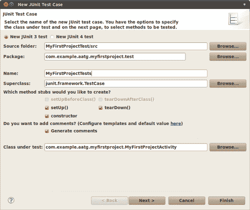

我们测试的基本基础设施已经就绪；剩下的是添加一个虚拟测试来验证一切是否按预期工作。

Eclipse 还提供了一种为测试方法创建存根的方法。按下**下一步 >**后，将显示以下对话框，您可以选择要为哪些测试方法生成存根：

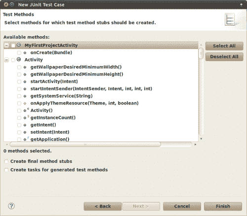

这些存根方法在某些情况下可能很有用，但您必须考虑测试应该是行为驱动而不是方法驱动的。

现在我们有了测试用例模板，下一步是开始完成它以满足我们的需求。要做到这一点，打开最近创建的用例类，并添加测试`testSomething()`。作为一个最佳实践，将测试添加到类的末尾。

我们应该有类似这样的内容：

```java
/**
*
*/
package com.example.aatg.myfirstproject.test;
import android.test.suitebuilder.annotation.SmallTest;
import junit.framework.TestCase;
/**
* @author diego
*
*/
public class MyFirstProjectTests extends TestCase { public MyFirstProjectTests() {
this("MyFirstProjectTests");
}
/**
* @param name
*/
public MyFirstProjectTests(String name) {
super(name);
}
/* (non-Javadoc)
* @see junit.framework.TestCase#setUp()
*/
protected void setUp() throws Exception {
super.setUp();
}
/* (non-Javadoc)
* @see junit.framework.TestCase#tearDown()
*/
protected void tearDown() throws Exception {
super.tearDown();
} @SmallTest
public void testSomething() {
fail("Not implemented yet");
}
}

```

这个测试将始终失败，显示消息：**尚未实现**。为了做到这一点，我们使用了`junit.framework.Assert`类中的`fail`方法，该方法使用给定消息使测试失败。

### 注意

需要一个无参构造函数来从命令行运行特定的测试，如稍后使用`am instrumentation`解释的那样。

## 特殊方法

下表描述了在测试用例类中找到的特殊方法：

| 方法 | 描述 |
| --- | --- |
| `setUp` | 设置固定装置。例如，打开网络连接或创建可能被测试需要的全局对象。在执行测试之前调用此方法。在这种情况下，我们只调用超类方法。有关详细信息，请参阅第一章，*开始测试*。 |
| `tearDown` | 断开固定装置。例如，关闭网络连接。在执行测试之后调用此方法。在这种情况下，我们只调用超类方法。有关详细信息，请参阅第一章，*开始测试*。 |
| `testSomething` | 一个简单的测试。为了被 JUnit 3 通过反射发现，测试方法应该以单词`test`开头。方法名的其余部分应清楚地标识要测试的功能。 |

## 测试注解

仔细查看测试定义，您可能会发现我们使用了`@MediumTest`注解来装饰测试。这是一种组织或分类我们的测试并单独运行它们的方法。

测试还可以使用其他注解，例如：

| 注解 | 描述 |
| --- | --- |
| `@SmallTest` | 标记应该作为小测试运行的部分测试。 |
| `@MediumTest` | 标记应该作为中等测试运行的部分测试。 |
| `@LargeTest` | 标记应该作为大测试运行的部分测试。 |
| `@Smoke` | 标记应该作为烟雾测试运行的部分测试。`android.test.suitebuilder.SmokeTestSuiteBuilder`将运行所有带有此注解的测试。 |
| `@FlakyTest` | 在`InstrumentationTestCase`类的测试方法上使用此注解。当存在此注解时，如果测试失败，则测试方法将被重新执行。总执行次数由容错值指定，默认为 1。这对于可能因外部条件变化而失败（随时间变化）的测试很有用。例如，要指定容错值为 4，您可以在测试上添加以下注解：`@FlakyTest(tolerance=4)`。 |

| `@UIThreadTest` | 在`InstrumentationTestCase`类的测试方法上使用此注解。当存在此注解时，测试方法将在应用程序的主线程（或 UI 线程）上执行。因为当存在此注解时可能不会使用 instrumentation 方法，所以如果有需要修改 UI 并在同一测试中访问 instrumentation 的情况，可以使用其他技术。在这种情况下，您可以使用`Activity.runOnUIThread`方法，允许在测试中创建任何`Runnable`并在 UI 线程中运行它。|

```java
mActivity.runOnUIThread(new Runnable() {
public void run() {
// do somethings
}
});

```

|

| `@Suppress` | 在不应包含在测试套件中的测试类或测试方法上使用此注解。此注解可以在类级别使用，其中该类中的所有方法都不包含在测试套件中，或者在方法级别排除单个方法或一组方法。 |
| --- | --- |

现在我们已经设置了测试，是时候运行它们了，这就是我们接下来要做的。

# 运行测试

运行我们的测试有几种方法，我们将在下面分析它们。

此外，正如前一小节中提到的关于注解的内容，测试可以根据情况分组或分类并一起运行。

## 从 Eclipse 运行所有测试

如果您已经采用 Eclipse 作为您的开发环境，这可能是一种最简单的方法。这将运行包中的所有测试。

选择测试项目，然后**运行方式 | Android JUnit 测试**。

如果找不到合适的设备或模拟器，系统将自动启动一个。

然后运行测试，并在 Eclipse DDMS 视图中显示结果，您可能需要手动更改。

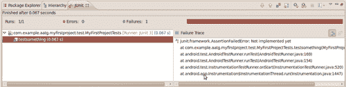

还可以在 Eclipse DDMS 视图中获得更详细的结果和执行期间产生的消息：

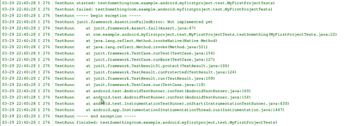

## 从 Eclipse 运行单个测试用例

如果需要，您可以从 Eclipse 运行单个测试用例。

选择测试项目，然后**运行方式 | 运行配置**。

然后创建一个新的配置，在*测试*下使用以下值：

| 运行单个测试： | **选中** |
| --- | --- |
| 项目： | **MyFirstProjectTest** |
| 测试类： | **com.example.aatg.myfirstproject.test.MyFirstProjectTests** |

当您以常规方式运行时，只有此测试将被执行。在我们的例子中，我们只有一个测试，所以结果将与之前展示的截图相似。

### 小贴士

在 Eclipse 编辑器中，你可以使用一个快捷键来执行此操作。选择方法名称，你可以按*Shift+Alt+X T*或右键单击它，然后选择**运行方式 | JUnit 测试**。

## 从模拟器运行

模拟器使用的默认系统镜像已安装了**开发工具**应用程序，提供了几个方便的工具和设置。在这些工具中，我们可以找到一个相当长的列表，如下面的截图所示：

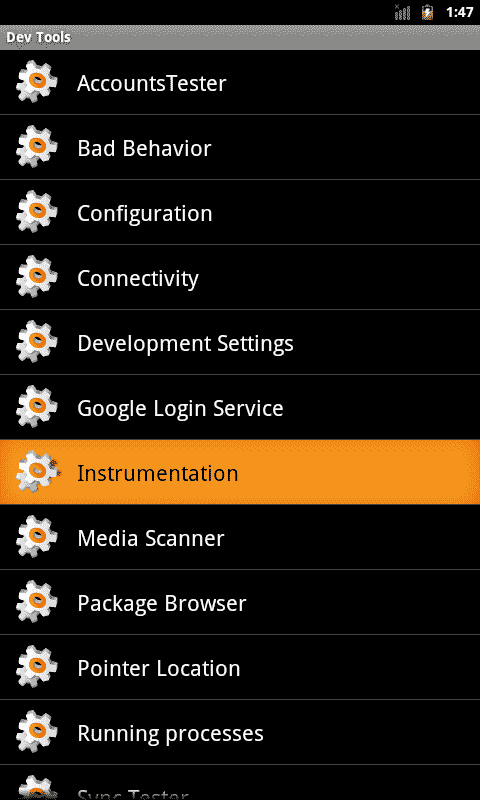

我们现在对**测试**感兴趣，这是运行我们的测试的方式。此应用程序列出了所有安装的包，这些包在它们的`AndroidManifest.xml`中定义了`instrumentation`标签。默认情况下，包使用默认的测试运行器列出，这通常是`android.test.InstrumentationTestRunner`，如果你有多个包列表，这会成为一个问题。为了解决这个问题，你可以在清单中设置一个可选的标签，在测试标签页下，如下所示：

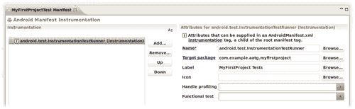

一旦完成此操作并重新显示仪器列表，我们的包将显示在这个新标签下，我们可以通过选择它来运行测试：

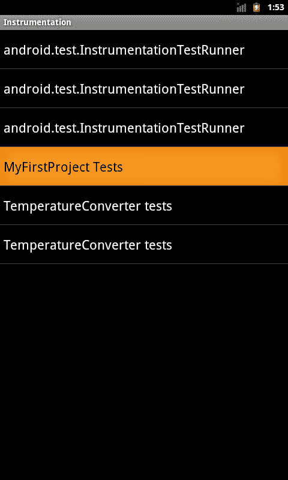

当以这种方式运行测试时，结果可以通过上一节中描述的**日志猫**查看。

### 注意

如前所述，如果你没有设置可选的标签，则多个测试将出现在相同的默认标签`android.test.InstrumentationTestRunner`下。

## 从命令行运行测试

最后，测试也可以从命令行运行。如果你想要自动化或脚本化这个过程，这很有用。

为了运行测试，我们使用`am instrument`命令（严格来说，是`am`命令和`instrument`子命令），它允许我们通过指定包名和一些其他选项来运行测试。

你可能会想知道`am`代表什么。它是**活动管理器**的缩写，是 Android 内部基础设施的主要组件，在启动过程中由**系统服务器**启动，负责管理活动和它们的生命周期。此外，正如我们所看到的，它还负责活动测试。

`am instrument`命令的一般用法是：

```java
am instrument [flags] <COMPONENT>
-r: print raw results (otherwise decode REPORT_KEY_STREAMRESULT)
-e <NAME> <VALUE>: set argument <NAME> to <VALUE>
-p <FILE>: write profiling data to <FILE>
-w: wait for instrumentation to finish before returning

```

此表总结了最常见的选项：

| 选项 | 描述 |
| --- | --- |
| `-r` | 打印原始结果。用于收集原始性能数据。 |
| `-e <NAME> <VALUE>` | 通过名称设置参数。我们将在稍后检查其用法。这是一个通用的选项参数，允许我们设置`<name, value>`对。 |
| `-p <FILE>` | 将分析数据写入外部文件。 |
| `-w` | 在退出之前等待测试完成。通常用于命令中，虽然不是强制性的，但非常方便，否则你将无法看到测试结果。 |

要调用`am`命令，我们将使用`adb shell`命令，或者如果你已经在模拟器或设备上运行了一个 shell，你可以在 shell 命令提示符下直接发出`am`命令。

### 运行所有测试

此命令行将运行所有测试，除了性能测试：

```java
diego@bruce:\~$ adb shell am instrument -w com.example.aatg.myfirstproject.test/android.test.InstrumentationTestRunner
com.example.aatg.myfirstproject.test.MyFirstProjectTests:
Failure in testSomething:
junit.framework.AssertionFailedError: Not implemented yet
at com.example.aatg.myfirstproject.test.MyFirstProjectTests.testSomething(MyFirstProjectTests.java:22)
at java.lang.reflect.Method.invokeNative(Native Method)
at android.test.AndroidTestRunner.runTest(AndroidTestRunner.java:169)
at android.test.AndroidTestRunner.runTest(AndroidTestRunner.java:154)
at android.test.InstrumentationTestRunner.onStart(InstrumentationTestRunner.java:430)
at android.app.Instrumentation$InstrumentationThread.run(Instrumentation.java:1447)
Test results for InstrumentationTestRunner=.F
Time: 0.2
FAILURES!!!
Tests run: 1, Failures: 1, Errors: 0

```

### 从特定测试用例运行测试

要运行特定测试用例中的所有测试，你可以使用：

```java
diego@bruce:\~$ adb shell am instrument -w -e class com.example.aatg.myfirstproject.test.MyFirstProjectTests com.example.aatg.myfirstproject.test/android.test.InstrumentationTestRunner

```

### 通过名称运行特定测试

此外，我们还可以在命令行中指定要运行的特定测试：

```java
diego@bruce:\~$ adb shell am instrument -w -e class com.example.aatg.myfirstproject.test.MyFirstProjectTests\#testSomething com.example.aatg.myfirstproject.test/android.test.InstrumentationTestRunner

```

此测试不能以这种方式运行，除非我们在测试用例中有一个无参数的构造函数——这就是我们之前添加它的原因。

### 通过类别运行特定测试

正如我们之前提到的，可以使用注解（测试注解）将测试分组到不同的类别中，并且你可以运行该类别中的所有测试。

可以添加到命令行的以下选项：

| `-e unit true` | 运行所有单元测试。这些测试不是从`InstrumentationTestCase`派生的（也不是性能测试）。 |
| --- | --- |
| `-e func true` | 运行所有功能测试。这些测试是从`InstrumentationTestCase`派生的。 |
| `-e perf true` | 包含性能测试。 |
| `-e size {small | medium | large}` | 根据添加到测试中的注解运行小、中或大型测试。 |
| `-e annotation <annotation-name>` | 运行带有此注解的测试。此选项与大小选项互斥。 |

在我们的例子中，我们使用`@SmallTest`注解了测试方法`testSomething()`。因此，这个测试被认为属于该类别，并且最终在指定测试大小为`small`时，与其他属于同一类别的测试一起运行。

此命令行将运行所有带有`@SmallTest:`注解的测试

```java
diego@bruce:\~$ adb shell am instrument -w -e size small com.example.aatg.myfirstproject.test/android.test.InstrumentationTestRunner

```

#### 创建自定义注解

如果你决定根据不同于大小的其他标准对测试进行排序，可以创建一个自定义注解，然后在命令行中指定它。

例如，如果我们想根据其重要性来安排它们，那么我们可以创建一个注解`@VeryImportantTest`。

```java
package com.example.aatg.myfirstproject.test;
/**
* Annotation for very important tests.
*
* @author diego
*
*/
public @interface VeryImportantTest {
}

```

在此之后，我们可以创建另一个测试，并用`@VeryImportantTest`注解它。

```java
@VeryImportantTest
public void testOtherStuff() {
fail("Not implemented yet");
}

```

因此，正如我们之前提到的，我们可以在`am instrument`命令行中包含此注解，以仅运行注解的测试：

```java
diego@bruce:\~$ adb shell am instrument -w -e annotation VeryImportantTest \ com.example.aatg.myfirstproject.test/android.test.InstrumentationTestRunner

```

### 运行性能测试

我们将在第九章*性能测试*中回顾性能测试的详细信息，但在这里我们将介绍`am instrument`命令的可用选项。

要在测试运行中包含性能测试，你应该添加此命令行选项

| `-e perf true` | 包含性能测试。 |
| --- | --- |

### 干运行

有时你可能只需要知道将要运行哪些测试，而不是实际运行它们。

这是你需要添加到命令行中的选项：

| `-e log true` | 显示要运行的测试而不是运行它们。 |
| --- | --- |

这对于编写脚本或构建其他工具很有用。

# 调试测试

您的测试也可能存在错误；您应该假设这一点。在这种情况下，通常的调试技术适用，例如通过 LogCat 添加消息。

如果需要更复杂的调试技术，您应该将调试器附加到测试运行器。为此，有两种主要替代方案。

第一件事很简单——不离开 Eclipse 的便利性，也不必记住难以记忆的命令行选项。在 Android ADT 插件的最新版本中，添加了**调试方式 | Android JUnit 测试**选项。因此，您可以在测试中设置断点并使用它。

要切换断点，您可以在编辑器中选择所需的行，然后使用菜单选项**运行 | 切换行断点**。或者，您可以稍微修改测试代码以等待调试器连接。但请放心，这种更改非常简单。将以下片段添加到构造函数或任何其他您想要调试的测试中。您添加它的位置并不重要，因为调试器会在断点处停止。在这种情况下，我们决定将`Debug.waitForDebugger()`添加到构造函数中，如下所示：

```java
public class MyFirstProjectTests extends TestCase { private static final boolean DEBUG = true;
public MyFirstProjectTests(String name) {
super(name); if ( DEBUG ) {
Debug.waitForDebugger();
}
}
…

```

当您像往常一样运行测试，使用**运行方式 | Android JUnit 测试**时，您可能需要更改视角。

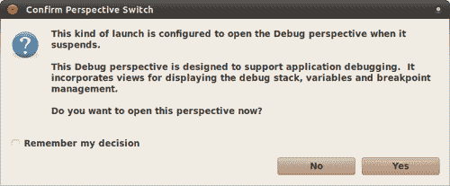

一旦完成，您将进入标准调试视角和会话。

此外，如果您无法或不想更改测试代码，您可以在其中设置断点，并将以下选项传递给`am instrument`。

| `-e debug true` | 附加到调试器。 |
| --- | --- |

一旦开始测试，测试运行器将等待您的调试器附加。

执行此命令行以调试测试：

```java
$ adb shell am instrument -w -e debug true com.example.aatg.myfirstproject.test/android.test.InstrumentationTestRunner

```

您将在到达第一个断点时等待时看到此行：

```java
com.example.aatg.myfirstproject.test.MyFirstProjectTests:

```

这将在调试附加后正常继续并退出，您的调试会话也将完成。

# 其他命令行选项

`am instrument`命令除了之前提到的`<name, value>`对之外，还接受其他`<name, value>`对：

| 名称 | 值 |
| --- | --- |
| package | 测试应用程序中一个或多个包的完全限定包名。多个值由逗号（,）分隔。 |
| class | 要由测试运行器执行的完全限定测试用例类。可选地，这可以包括通过哈希（`#`）与类名分开的测试方法名称。 |
| coverage | True 运行 EMMA 代码覆盖率，并将输出写入一个文件，该文件也可以指定。我们将在第十章*替代测试策略*中深入了解支持我们的测试的 EMMA 代码覆盖率。 |

# 摘要

我们已经回顾了 Android 测试背后的主要技术和工具。

以下是我们在本章中涵盖的内容：

+   创建了我们第一个 Android 测试项目，作为示例 Android 项目的配套。

+   跟随最佳实践，我们始终创建我们的伴随测试项目，即使最初你可能认为它不是必需的。

+   创建了一个简单的测试类来测试项目中的 Activity。我们还没有添加任何有用的测试用例，但添加这些简单的用例是为了验证我们的所有基础设施。

+   我们还从 Eclipse 和命令行运行了这个简单的测试，以了解我们拥有的替代方案。在这个过程中，我们提到了活动管理器及其命令行版本 `am`。

+   分析了最常用的命令行并解释了它们的选项。

+   创建了一个自定义注解来排序我们的测试，并演示了其用法。

+   运行测试并解释结果让我们了解到我们的应用程序表现如何。

在下一章中，我们将更详细地分析提到的技术、框架和工具，并提供它们用法的示例。
