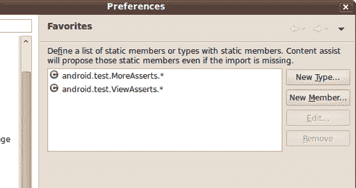
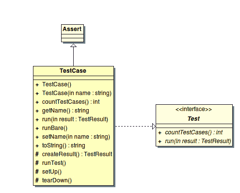
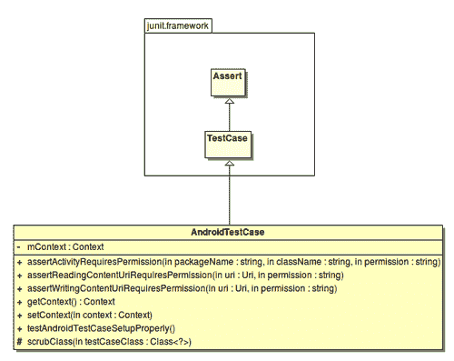
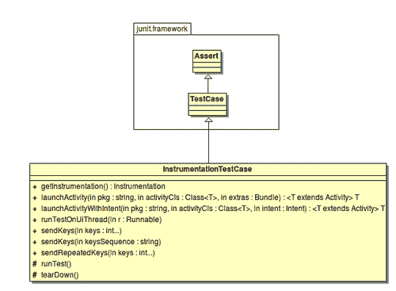
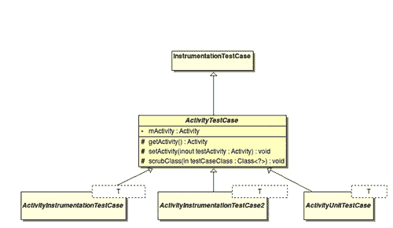
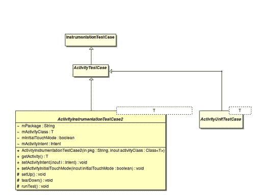
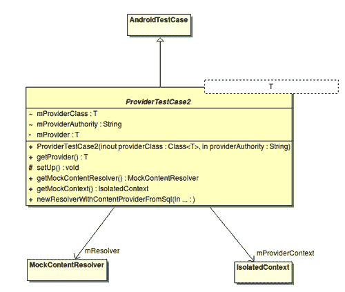
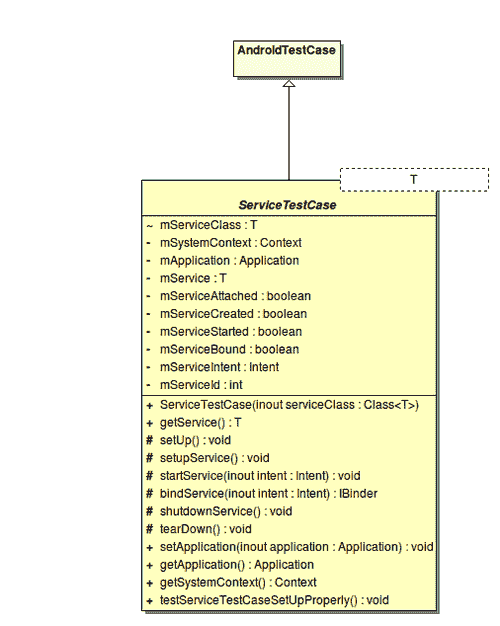
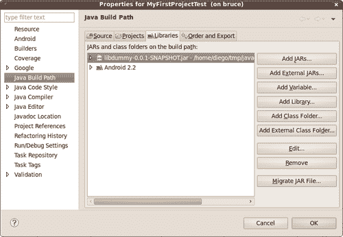
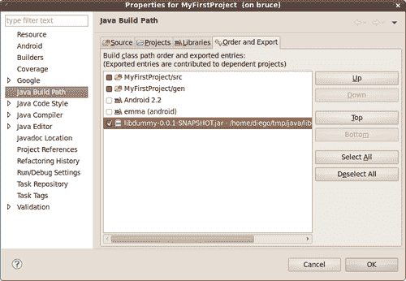

# 第三章：Android SDK 上的构建块

我们现在知道了如何创建测试项目和运行测试。现在是时候深入挖掘以找到可用于创建测试的构建块了。

因此，在本章的第三部分，我们将涵盖：

+   常见断言

+   视图断言

+   其他断言类型

+   TouchUtils，用于测试用户界面

+   模拟对象

+   仪器化

+   TestCase 类层次结构

+   使用外部库

我们将分析这些组件，并在适用时展示它们的使用示例。本章中的示例故意从包含它们的原始 Android 项目中分离出来，以便您集中注意力和关注所展示的主题，尽管完整的示例可以按稍后解释的方式下载。目前，我们感兴趣的只是树木，而不是森林。

除了提供的示例外，我们还将识别常见的、可重用的模式，这些模式将帮助您为自己的项目创建测试。

# 演示应用程序

我们创建了一个非常简单的应用程序来演示本章中一些测试的使用。此应用程序的源代码可以从 [`www.packtpub.com/support`](http://www.packtpub.com/support) 下载。

下一个截图显示了此应用程序的运行情况：

.jpg)

# 深入探讨断言

断言是应该检查可能被评估的条件的方法，如果条件不满足，则抛出异常，从而终止测试的执行。

JUnit API 包含名为 `Assert` 的类，它是所有测试用例类的基类。它包含几个对编写测试有用的断言方法。这些继承的方法用于测试各种条件，并且被重载以支持不同的参数类型。它们可以根据检查的条件分组到不同的集合中；例如：

+   `assertEquals`

+   `assertFalse`

+   `assertNotNull`

+   `assertNotSame`

+   `assertNull`

+   `assertSame`

+   `assertTrue`

+   `fail`

被测试的条件非常明显，可以通过方法名轻松识别。可能值得注意的断言是 `assertEquals()` 和 `assertSame()`。前者在对象上使用时断言传入的两个参数对象相等，调用对象的 `equals()` 方法。后者断言两个对象引用同一个对象。如果在某些情况下类没有实现 `equals()`，那么 `assertEquals()` 和 `assertSame()` 将执行相同的事情。

当这些断言之一在测试中失败时，会抛出 `AssertionFailedException`。

在开发过程中，偶尔你可能需要创建一个你当时没有实现测试。然而，你希望标记测试的创建被推迟。我们在 第一章 的 *开始测试* 中这样做，当时我们只添加了测试方法存根。在这些情况下，你可以使用 `fail` 方法，它总是失败，并使用自定义消息来指示条件：

```java
public void testNotImplementedYet() { fail("Not implemented yet");
}

```

值得注意的是，`fail()` 方法还有另一个常见的用途。如果我们需要测试一个方法是否抛出异常，我们可以用 try-catch 块包围代码，并在未抛出异常的情况下强制失败。例如：

```java
public void testShouldThrowException() {
try {
MyFirstProjectActivity.methodThatShouldThrowException(); fail("Exception was not thrown");
} catch ( Exception ex ) {
// do nothing
}
}

```

## 自定义消息

说到自定义消息，值得知道的是，所有的 `assert` 方法都提供了一个包含自定义 `String` 消息的重载版本。如果断言失败，测试运行器将打印这个自定义消息而不是默认消息。这个自定义消息在查看测试报告时很容易识别失败，因此强烈建议将其作为最佳实践使用。

这是一个使用此建议进行的简单测试示例：

```java
public void testMax() {
final int a = 1;
final int b = 2;
final int expected = b;
final int actual = Math.max(a, b); assertEquals("Expection " + expected + " but was " + actual,
expected, actual);
}

```

在示例中，我们可以看到另一种有助于你轻松组织和理解测试的实践。这是为存储预期值和实际值的变量使用显式名称的使用。

## 静态导入

虽然基本的断言方法是从 Assert 基类继承的，但某些其他断言需要特定的导入。为了提高测试的可读性，有一种模式是从相应的类中静态导入断言方法。使用这种模式而不是有：

```java
public void testAlignment() {
final int margin = 0;
... android.test.ViewAsserts.assertRightAligned( mMessage, mCapitalize, margin);
}

```

我们可以通过添加静态导入来简化它：

```java
import static android.test.ViewAsserts.assertRightAligned;
public void testAlignment() {
final int margin = 0;
assertRightAligned(mMessage, mCapitalize, margin);
}

```

Eclipse 通常不会自动处理这些静态导入，所以如果你想当你在输入这些断言的开始时，让内容辅助 (*Ctrl+SPACE*) 为你添加静态导入，你应该将这些类添加到 Eclipse 的收藏夹列表中。为此，导航到 **窗口 | 首选项 | Java | 编辑器 | 内容辅助 | 收藏夹 | 新类型**。输入：**android.test.ViewAsserts**，然后添加另一个类型：**android.test.MoreAsserts**。



# 视图断言

之前引入的断言可以处理各种类型的参数，但它们仅用于测试简单的条件或简单的对象。

例如，我们有 `assertEquals(short expected, short actual)` 来测试 `short` 值，`assertEquals(int expected, int actual)` 来测试整数值，`assertEquals(Object expected, Object actual)` 来测试任何 `Object` 实例，等等。

通常在测试 Android 用户界面时，你会面临需要更复杂的方法，主要与`Views`相关。在这方面，Android 提供了一个类，在`android.test.ViewAsserts`中提供了大量的断言（有关详细信息，请参阅[`developer.android.com/reference/android/test/ViewAsserts.html`](http://developer.android.com/reference/android/test/ViewAsserts.html)）来测试视图及其在屏幕上的绝对和相对位置之间的关系。

这些方法也被重载以提供不同的条件。在断言中，我们可以找到：

+   `assertBaselineAligned:` 断言两个视图在其基线对齐，即它们的基线位于相同的 y 位置。

+   `assertBottomAligned:` 断言两个视图底部对齐，即它们的底部边缘位于相同的 y 位置。

+   `assertGroupContains:` 断言指定的组包含特定的子视图一次且仅一次。

+   `assertGroupIntegrity:` 断言指定组的完整性。子视图的数量应该是 >= 0，并且每个子视图都应该非空。

+   `assertGroupNotContains:` 断言指定的组不包含特定的子视图。

+   `assertHasScreenCoordinates:` 断言一个视图在可见屏幕上有特定的 x 和 y 位置。

+   `assertHorizontalCenterAligned:` 断言测试视图相对于参考视图水平居中对齐。

+   `assertLeftAligned:` 断言两个视图左对齐，即它们的左边缘位于相同的 x 位置。也可以提供一个可选的边距。

+   `assertOffScreenAbove:` 断言指定的视图在可见屏幕上方。

+   `assertOffScreenBelow:` 断言指定的视图在可见屏幕下方。

+   `assertOnScreen:` 断言一个视图在屏幕上。

+   `assertRightAligned:` 断言两个视图右对齐，即它们的右边缘位于相同的 x 位置。也可以指定一个可选的边距。

+   `assertTopAligned:` 断言两个视图顶部对齐，即它们的顶部边缘位于相同的 y 位置。也可以指定一个可选的边距。

+   `assertVerticalCenterAligned:` 断言测试视图相对于参考视图垂直居中对齐。

以下示例展示了如何使用`ViewAsserts`来测试用户界面布局：

```java
public void testUserInterfaceLayout() {
final int margin = 0;
final View origin = mActivity.getWindow().getDecorView(); assertOnScreen(origin, mMessage);
assertOnScreen(origin, mCapitalize);
assertRightAligned(mMessage, mCapitalize, margin);
}

```

`assertOnScreen` 方法使用一个原点开始查找请求的`Views`。在这种情况下，我们使用顶级窗口装饰视图。如果由于某种原因你不需要在层次结构中走那么高，或者这种方法不适合你的测试，你可以使用层次结构中的另一个根`View`；例如 `View.getRootView()`，在我们的具体示例中将是 `mMessage.getRootView()`。

# 更多的断言

如果之前审查的断言似乎不足以满足测试需求，Android 框架中还包括另一个类来涵盖其他情况。这个类是 `MoreAsserts` ([`developer.android.com/reference/android/test/MoreAsserts.html`](http://developer.android.com/reference/android/test/MoreAsserts.html))。

这些方法也是重载的，以支持不同的条件。在这些断言中，我们可以找到：

+   `assertAssignableFrom:` 断言一个对象可以被分配给一个类。

+   `assertContainsRegex:` 断言预期的 `Regex` 匹配指定的 `String` 的任何子串。如果不匹配，则使用指定的信息失败。

+   `assertContainsInAnyOrder:` 断言指定的 `Iterable` 包含精确期望的元素，但顺序可以是任意的。

+   `assertContainsInOrder:` 断言指定的 `Iterable` 包含精确期望的元素，且顺序相同。

+   `assertEmpty:` 断言一个 `Iterable` 是空的。

+   `assertEquals` 用于一些 JUnit 断言中没有涵盖的 `Collections`。

+   `assertMatchesRegex:` 断言指定的 `Regex` 与 `String` 完全匹配，如果不匹配则使用提供的信息失败。

+   `assertNotContainsRegex:` 断言指定的 `Regex` 不匹配指定的 String 的任何子串，如果匹配则使用提供的信息失败。

+   `assertNotEmpty:` 断言一些 JUnit 断言中没有涵盖的 `Collections` 不是空的。

+   `assertNotMatchesRegex:` 断言指定的 `Regex` 与指定的 String 不完全匹配，如果匹配则使用提供的信息失败。

+   `checkEqualsAndHashCodeMethods:` 用于一次性测试 `equals()` 和 `hashCode()` 结果的工具。测试应用于两个对象的 `equals()` 是否匹配指定的结果。

以下测试检查通过点击 UI 按钮调用的首字母大写方法调用期间是否出现错误。

```java
@UiThreadTest
public void testNoErrorInCapitalization() {
final String msg = "this is a sample";
mMessage.setText(msg);
mCapitalize.performClick();
final String actual = mMessage.getText().toString();
final String notExpectedRegexp = "(?i:ERROR)"; assertNotContainsRegex("Capitalization found error:",
notExpectedRegexp, actual);
}

```

注意，因为这是一个修改用户界面的测试，我们必须用 `@UiThreadTest` 注解它，否则它将无法从不同的线程更改 UI，并且我们会收到以下异常：

**03-02 23:06:05.826: INFO/TestRunner(610): ----- 开始异常 -----**

**03-02 23:06:05.862: INFO/TestRunner(610): android.view.ViewRoot$CalledFromWrongThreadException: 只能是创建视图层次结构的原始线程才能触摸其视图**。

**03-02 23:06:05.862: INFO/TestRunner(610): 在 android.view.ViewRoot.java:2932 的 android.view.ViewRoot.checkThread()**

**[...]**

**03-02 23:06:05.862: INFO/TestRunner(610): 在 android.app.Instrumentation$InstrumentationThread.run(Instrumentation.java:1447)**

**03-02 23:06:05.892: INFO/TestRunner(610): ----- 结束异常 -----**

如果你不太熟悉正则表达式，花些时间访问 [`developer.android.com/reference/java/util/regex/package-summary.html`](http://developer.android.com/reference/java/util/regex/package-summary.html)，这将值得。

在这个特定的情况下，我们正在寻找结果中包含的单词"ERROR"，进行不区分大小写的匹配（为此设置了标志'i'）。也就是说，如果由于某种原因，大写字母在我们的应用程序中没有起作用，并且它包含错误消息，我们将通过断言检测这种条件。

# TouchUtils 类

有时，在测试 UI 时，模拟不同类型的触摸事件是有帮助的。这些触摸事件可以通过许多不同的方式生成，但可能`android.test.TouchUtils`是最简单的。这个类为从`InstrumentationTestCase`派生的测试用例提供了生成触摸事件的可重用方法。

特色方法允许模拟与正在测试的 UI 的交互。`TouchUtils`提供了使用正确的 UI 或主线程注入事件的框架，因此不需要特殊处理，你也不需要使用`@UIThreadTest`注解测试。

提到的方法支持：

+   点击视图并释放

+   在视图中轻触，即触摸它然后快速释放

+   在视图中长按

+   拖动屏幕

+   拖动视图

以下测试代表了`TouchUtils`的典型用法：

```java
public void testListScrolling() {
mListView.scrollTo(0, 0);
TouchUtils.dragQuarterScreenUp(this, mActivity);
TouchUtils.dragQuarterScreenUp(this, mActivity);
TouchUtils.dragQuarterScreenUp(this, mActivity);
TouchUtils.dragQuarterScreenUp(this, mActivity);
TouchUtils.tapView(this, mListView);
final int expectedItemPosition = 6;
final int actualItemPosition = mListView.getFirstVisiblePosition();
assertEquals("Wrong position", expectedItemPosition, actualItemPosition);
final String expected = "Anguilla";
final String actual = mListView.getAdapter(). getItem(expectedItemPosition).toString();
assertEquals("Wrong content", actual, expected);
}

```

这个测试执行以下操作：

1.  将列表重新定位到开始位置，以从已知条件开始。

1.  滚动列表几次。

1.  检查第一个可见位置，以确认列表已正确滚动。

1.  检查元素的内容，以验证其是否正确。

即使是最复杂的 UI 也可以用这种方式进行测试，这将帮助你检测可能影响用户体验的各种条件。

# 模拟对象

我们在第一章 *开始测试* 中访问了 Android 测试框架提供的模拟对象，并评估了不使用真实对象以隔离测试环境的相关问题。

下一章将讨论测试驱动开发（Test Driven Development），如果我们是测试驱动开发的纯粹主义者，我们可能会争论模拟对象的使用，并更倾向于使用真实对象。马丁·福勒在他的杰出文章《Mock 对象不是存根》（Mocks Aren't Stubs）中将这两种风格称为*经典*和*模拟主义*测试驱动开发的二分法。这篇文章可以在[`www.martinfowler.com/articles/mocksArentStubs.html`](http://www.martinfowler.com/articles/mocksArentStubs.html)上在线阅读。

独立于这次讨论，我们在这里介绍可用的模拟对象作为可用的构建块之一，因为有时在测试中引入模拟对象是推荐的、期望的、有用的，甚至是不可避免的。

Android SDK 在子包`android.test.mock`中提供了一些类，以帮助我们在这个任务中：

+   `MockApplication:` `Application`类的模拟实现。所有方法都是非功能的，并抛出`UnsupportedOperationException`。

+   `MockContentProvider:` `ContentProvider` 的模拟实现。所有方法都是非功能的，并抛出 `UnsupportedOperationException`。

+   `MockContentResolver:` 隔离测试代码与真实内容系统的 `ContentResolver` 类的模拟实现。所有方法都是非功能的，并抛出 `UnsupportedOperationException`。

+   `MockContext:` 模拟的 Context 类。这可以用来注入其他依赖。所有方法都是非功能的，并抛出 `UnsupportedOperationException`。

+   `MockCursor:` 隔离测试代码与真实 Cursor 实现的模拟 Cursor 类。所有方法都是非功能的，并抛出 `UnsupportedOperationException`。

+   `MockDialogInterface:` `DialogInterface` 类的模拟实现。所有方法都是非功能的，并抛出 `UnsupportedOperationException`。

+   `MockPackageManager:` `PackageManager` 类的模拟实现。所有方法都是非功能的，并抛出 `UnsupportedOperationException`。

+   `MockResources:` 模拟的 Resources 类。所有方法都是非功能的，并抛出 `UnsupportedOperationException`。

正如我们提到的，所有这些类都有非功能的方法，如果使用这些方法，将会抛出 `UnsupportedOperationException`。因此，如果你需要使用这些方法之一，或者如果你检测到你的测试因为这个 `Exception` 而失败，你应该扩展这些基类之一并提供所需的功能。

## MockContext 概述

`MockContext` 类以非功能方式实现所有方法并抛出 `UnsupportedOperationException`。因此，如果你忘记实现你正在处理的测试用例所需的某个方法，这个异常将会被抛出，你可以立即检测到这种情况。

这个模拟可以用来向待测试的类中注入其他依赖、模拟或监视器。通过扩展这个类可以获得更细粒度的控制。

扩展这个类以提供你期望的行为，重写相应的方法。

正如我们将要介绍的，Android SDK 提供了一些预构建的模拟 `Context`，在某些情况下非常有用。

## `IsolatedContext` 类

在你的测试中，你可能需要隔离待测试的 `Activity` 以防止与其他组件交互。这可能是一种完全隔离，但有时这种隔离可以避免与其他组件交互，并且为了你的 `Activity` 正确行为，仍然需要与系统保持一些连接。

对于这些情况，Android SDK 提供了 `android.test.IsolatedContext`，这是一个模拟的 `Context`，它防止与大多数底层系统交互，同时也满足与其他包或组件（如 `Services` 或 `ContentProviders`）交互的需求。

## 文件和数据库操作的替代路径

在某些情况下，我们需要的只是能够提供文件和数据库操作的替代路径。例如，如果我们正在对真实设备上的应用程序进行测试，可能我们不想在测试期间影响现有的文件。

这种情况可以利用另一个类，这个类不属于`android.test.mock`子包，而是属于`android.test`包：`RenamingDelegatingContext`。

这个类允许我们通过在构造函数中指定的前缀来改变对文件和数据库的操作。所有其他操作都委托给构造函数中必须指定的委托上下文。

假设我们要测试的`Activity`使用了我们想要以某种方式控制的文件，可能是在测试中引入特殊内容或固定装置来驱动测试，而我们不想或不能使用真实文件。在这种情况下，我们创建一个指定前缀的`RenamingDelegatingContext`；我们将这个前缀添加到替换文件名中，我们的未更改的`Activity`将使用它们。

例如，如果我们的`Activity`试图访问名为`birthdays.txt`的文件，而我们提供了指定前缀“test”的`RenamingDelegatingContext`，那么当它被测试时，这个相同的`Activity`将访问文件`testbirthdays.txt`。

## `MockContentResolver`类

`MockContentResolver`类以非功能方式实现了所有方法，并在你尝试使用它们时抛出`UnsupportedOperationException`异常。这个类的原因是将测试与真实内容隔离开来。

假设你的应用程序使用了一个`ContentProvider`，可能来自多个`Activity`。你可以使用`ProviderTestCase2`对这个`ContentProvider`创建单元测试，我们很快就会看到它，在某些情况下，还可以实现一个如之前所述的`RenamingDelegatingContext`。

但是当我们尝试对`ContentProvider`进行功能或集成测试时，使用哪个测试案例并不那么明显。如果你的功能测试主要模拟用户体验，最明显的选择是`ActivityInstrumentationTestCase2`，因为你可能需要`sendKeys()`或类似的方法，这些方法在这些测试中是现成的。

你可能遇到的第一问题是，不清楚在哪里注入`MockContentResolver`到你的测试中，以便能够使用测试数据库实例或数据库固定装置与你的`ContentProvider`一起使用。也无法注入`MockContext`。

这个问题将在第七章中解决，*测试食谱*，其中提供了更多详细信息。

# `TestCase`基类

这是 JUnit 框架中所有其他测试案例的基类。它实现了我们在前例中分析的基本方法。

`TestCase`还实现了`junit.framework.Test`接口。

这是`TestCase`和`Test`接口的 UML 类图。



测试案例应该直接扩展`TestCase`或其子类之一。

除了之前解释的方法之外，还有其他方法。

## 无参构造函数

所有测试用例都需要默认构造函数，因为有时，根据使用的测试运行器，这可能是唯一被调用的构造函数。它也用于序列化。

根据文档，这个方法不打算在没有调用 `setName(String name)` 的情况下由普通人使用。

一个常见的模式是在这个构造函数中使用默认常量测试用例名称，然后调用 **Given name** 构造函数。

```java
public class MyTestCase extends TestCase { public MyTestCase() {
this("MyTestCase Default Name");
}
public MyTestCase(String name) {
super(name);
}
}

```

## 带名称的构造函数

这个构造函数接受一个参数作为测试用例的名称。它将出现在测试报告中，并在尝试识别失败的测试时很有帮助。

## setName() 方法

有些扩展自 `TestCase` 的类没有提供带名称的构造函数。在这种情况下，唯一的替代方案是调用 `setName(String name)`。

# AndroidTestCase 基类

这个类可以用作通用 Android 测试用例的基类。

这是 `AndroidTestCase` 及其最相关类的 UML 类图。



当你需要访问 Activity Context（如资源、数据库或文件系统中的文件）时，请使用这个类。Context 作为名为 `mContext` 的字段存储在这个类中，并在需要时可以在测试中使用。也可以使用 `getContext()` 方法。

基于这个类的测试可以启动多个 `Activity`，使用 `Context.startActivity()`。

Android SDK 中有许多扩展这个基类的测试用例：

+   `ApplicationTestCase<T extends Application>`

+   `ProviderTestCase2<T extends ContentProvider>`

+   `ServiceTestCase<T extends Service>`

## assertActivityRequiresPermission() 方法

该方法的签名如下：

```java
public void assertActivityRequiresPermission (String packageName, String className, String permission)

```

### 描述

这个断言方法检查特定 `Activity` 的启动是否受到特定权限的保护。它接受三个参数：

+   `packageName:` 表示要启动的 Activity 的包名的字符串

+   `className:` 表示要启动的 Activity 类的字符串

+   `permission:` 一个表示查询权限的字符串

`Activity` 被启动，然后预期会抛出一个 `SecurityException`，错误信息中提到所需的权限缺失。该 `Activity` 不由这个测试处理，因此不需要 `Instrumentation`。

### 示例

这个测试检查 `MyContactsActivity` 活动中写入外部存储所需的 `android.Manifest.permission.WRITE_EXTERNAL_STORAGE` 权限的要求。

```java
public void testActivityPermission() {
final String PKG = "com.example.aatg.myfirstproject";
final String ACTIVITY = PKG + ".MyFirstProjectActivity";
final String PERMISSION = android.Manifest.permission.WRITE_EXTERNAL_STORAGE;
assertActivityRequiresPermission(PKG, ACTIVITY, PERMISSION);
}

```

### 小贴士

总是使用来自 `android.Manifest.permission` 的权限描述常量，而不是 `Strings`，这样如果实现发生变化，你的代码仍然有效。

## assertReadingContentUriRequiresPermission 方法

该方法的签名如下：

```java
public void assertReadingContentUriRequiresPermission ( Uri uri, String permission)

```

### 描述

这个断言方法检查从特定 URI 读取是否需要作为参数提供的权限。

它接受两个参数：

+   `uri:` 需要查询权限的 URI

+   `permission:` 包含查询权限的字符串

如果生成了包含指定权限的`SecurityException`，则验证此断言。

### 示例

此测试尝试读取联系人并验证是否生成了正确的`SecurityException`：

```java
public void testReadingContacts() {
final Uri URI = ContactsContract.AUTHORITY_URI;
final String PERMISSION = android.Manifest.permission.READ_CONTACTS;
assertReadingContentUriRequiresPermission(URI, PERMISSION);
}

```

## `assertWritingContentUriRequiresPermission()`方法

此方法的签名如下：

```java
public void assertWritingContentUriRequiresPermission( Uri uri, String permission)

```

### 描述

此断言方法检查将数据插入特定 URI 是否需要作为参数提供的权限。

它接受 2 个参数：

+   `uri:` 需要查询权限的 URI

+   `permission:` 包含查询权限的字符串

如果生成了包含指定权限的`SecurityException`，则验证此断言。

### 示例

此测试尝试写入联系人并验证是否生成了正确的`SecurityException`：

```java
public void testWritingContacts() {
final Uri URI = ContactsContract.AUTHORITY_URI;
final String PERMISSION = android.Manifest.permission.WRITE_CONTACTS;
assertWritingContentUriRequiresPermission(URI, PERMISSION);
}

```

# Instrumentation

在运行任何应用程序代码之前，系统会实例化 Instrumentation，使其能够监控系统与应用程序之间的所有交互。

与许多其他 Android 应用程序组件一样，Instrumentation 实现是在`AndroidManifest.xml`文件中的`<instrumentation>`标签下描述的。例如，如果你打开我们测试的`AndroidManifest.xml`文件并查看其中内容，你会找到：

```java
<instrumentation
android:targetPackage="com.example.aatg.myfirstproject"
android:name="android.test.InstrumentationTestRunner"
android:label="MyFirstProject Tests"/>

```

这是 Instrumentation 声明。

`targetPackage`属性定义了测试包的名称，`name`是测试运行器的名称，`label`是当此 Instrumentation 被列出时显示的文本。

请注意，如前所述，此声明属于测试项目，而不是主项目。

## `ActivityMonitor`内部类

如前所述，Instrumentation 类用于监控系统与应用程序或测试中的活动之间的交互。内部类`Instrumentation.ActivityMonitor`允许监控应用程序中的单个活动。

### 示例

假设我们在`Activity`中有一个`TextField`，它包含一个 URL，并且其自动链接属性已设置：

```java
<TextView android:layout_width="fill_parent"
android:layout_height="wrap_content"
android:text="@string/home"
android:layout_gravity="center" android:gravity="center"
android:autoLink="web" android:id="@+id/link" />

```

如果我们想验证当点击超链接时，是否正确地跟随并调用浏览器，我们可以创建一个类似的测试：

```java
public void testFollowLink() {
final Instrumentation inst = getInstrumentation();
IntentFilter intentFilter = new IntentFilter( Intent.ACTION_VIEW);
intentFilter.addDataScheme("http");
intentFilter.addCategory(Intent.CATEGORY_BROWSABLE);
ActivityMonitor monitor = inst.addMonitor( intentFilter, null, false);
assertEquals(0, monitor.getHits());
TouchUtils.clickView(this, mLink);
monitor.waitForActivityWithTimeout(5000); assertEquals(1, monitor.getHits());
inst.removeMonitor(monitor);
}

```

在这里，我们：

1.  获取 instrumentation。

1.  添加基于`IntentFilter`的监控器。

1.  等待活动。

1.  验证监控器命中次数是否增加。

1.  移除监控器。

使用监控器，我们可以测试与系统和其他活动之间甚至最复杂的交互。这是创建集成测试的非常强大的工具。

# `InstrumentationTestCase`类

`InstrumentationTestCase`类是具有访问 Instrumentation 的各种测试案例的直接或间接基类。以下是直接和间接子类列表中最重要的一些：

+   `ActivityTestCase`

+   `ProviderTestCase2<T extends ContentProvider>`

+   `SingleLaunchActivityTestCase<T extends Activity>`

+   `SyncBaseInstrumentation`

+   `ActivityInstrumentationTestCase2<T extends Activity>`

+   `ActivityUnitTestCase<T extends Activity>`

这是`InstrumentationTestCase`及其最相关类的 UML 类图：



`InstrumentationTestCase`位于`android.test`包中，图中未显示，它扩展了`junit.framework.TestCase`，而`junit.framework.TestCase`又扩展了`junit.framework.Assert`。

## `launchActivity`和`launchActivityWithIntent`方法

这些实用方法用于从测试中启动 Activity。如果未使用第二种选项指定`Intent`，则使用默认的`Intent`：

```java
public final T launchActivity( String pkg, Class<T> activityCls, Bundle extras)

```

### 注意

注意，模板类参数`T`在`activityCls`和返回类型中使用，这限制了其只能用于该类型的 Activity。

如果需要指定自定义的`Intent`，可以使用以下代码，它还添加了`intent`参数：

```java
public final T launchActivityWithIntent( String pkg, Class<T> activityCls, Intent intent)

```

## `sendKeys`和`sendRepeatedKeys`方法

在测试 Activity 的 UI 时，您将需要模拟与基于 qwerty 键盘或 DPAD 按钮的交互，以发送按键来完成字段、选择快捷方式或在不同组件之间导航。

这就是不同的`sendKeys`和`sendRepeatedKeys`的作用。

有一个版本的`sendKeys`接受整数键值。它们可以从`KeyEvent`类中定义的常量中获得。

例如，我们可以这样使用`sendKeys`方法：

```java
public void testSendKeyInts() {
try {
runTestOnUiThread(new Runnable() {
public void run() {
mMessage.requestFocus();
}
});
} catch (Throwable e) {
fail("Couldn't set focus");
}
sendKeys(KeyEvent.KEYCODE_H,
KeyEvent.KEYCODE_E,
KeyEvent.KEYCODE_E,
KeyEvent.KEYCODE_E,
KeyEvent.KEYCODE_Y,
KeyEvent.KEYCODE_ALT_LEFT,
KeyEvent.KEYCODE_1,
KeyEvent.KEYCODE_DPAD_DOWN,
KeyEvent.KEYCODE_ENTER);
final String expected = "HEEEY!";
final String actual = mMessage.getText().toString();
assertEquals(expected, actual);
}

```

在这里，我们正在使用它们的整数表示法向测试中的 Activity 发送*H, E*和*Y*字母按键、感叹号，然后是*Enter*键。

或者，我们可以创建一个字符串，将我们想要发送的按键连接起来，忽略 KEYCODE 前缀，并用空格分隔，这些空格最终会被忽略：

```java
public void testSendKeyString() {
try {
runTestOnUiThread(new Runnable() {
public void run() {
mMessage.requestFocus();
}
});
} catch (Throwable e) {
fail("Couldn't set focus");
}
sendKeys("H 3*E Y ALT_LEFT 1 DPAD_DOWN ENTER");
final String expected = "HEEEY!";
final String actual = mMessage.getText().toString();
assertEquals(expected, actual);
}

```

在这里，我们与之前的测试完全相同，但使用了一个`String`。请注意，`String`中的每个按键都可以由一个重复因子前缀，后跟`*`和要重复的键来表示。在我们的上一个例子中，我们使用了 3*E，这等同于"E E E"，即字母*E*重复了三次。

如果在我们的测试中需要发送重复按键，还有一个专门针对这些情况的替代方案：

```java
public void testSendRepeatedKeys() {
try {
runTestOnUiThread(new Runnable() {
public void run() {
mMessage.requestFocus();
}
});
} catch (Throwable e) {
fail("Couldn't set focus");
}
sendRepeatedKeys(1, KeyEvent.KEYCODE_H,
3, KeyEvent.KEYCODE_E,
1, KeyEvent.KEYCODE_Y,
1, KeyEvent.KEYCODE_ALT_LEFT,
1, KeyEvent.KEYCODE_1,
1, KeyEvent.KEYCODE_DPAD_DOWN,
1, KeyEvent.KEYCODE_ENTER);
final String expected = "HEEEY!";
final String actual = mMessage.getText().toString();
assertEquals(expected, actual);
}

```

这是以不同方式实现的相同测试。每个按键前面都跟着重复次数。

## `runTestOnUiThread`辅助方法

`runTestOnUiThread`方法是一个辅助方法，用于在 UI 线程上运行测试的一部分。

或者，正如我们之前讨论过的，要在一个 UI 线程上运行测试，我们可以使用`@UiThreadTest`注解它。

但有时，我们只需要在 UI 线程上运行测试的一部分，因为其他部分不适合在该线程上运行，或者正在使用提供该线程基础设施的辅助方法，如`TouchUtils`方法。

最常见的模式是在发送按键之前改变焦点，这样按键就能正确地发送到目标`View`：

```java
public void testCapitalizationSendingKeys() {
final String keysSequence = "T E S T SPACE M E"; runTestOnUiThread(new Runnable() {
public void run() {
mMessage.requestFocus();
}
});
mInstrumentation.waitForIdleSync();
sendKeys(keysSequence);
TouchUtils.clickView(this, mCapitalize);
final String expected = "test me".toUpperCase();
final String actual = mMessage.getText().toString();
assertEquals(expected, actual);
}

```

在等待应用程序空闲之前，我们使用 `Instrumentation.waitForIdleSync()` 请求 `mMessage EditText` 的焦点，然后向其发送按键序列。之后，使用 `TouchUtils.clickView()`，我们点击 `Button`，最终检查转换后的字段内容。

# ActivityTestCase 类

这是一个主要持有其他测试用例通用代码的类，这些测试用例访问 Instrumentation。

如果您正在实现特定于测试用例的行为，并且现有替代方案不符合您的需求，您可以使用此类。

如果不是这样，您可能发现以下选项更适合您的需求：

+   `ActivityInstrumentationTestCase2<T extends Activity>`

+   `ActivityUnitTestCase<T extends Activity>`

这是 `ActivityTestCase` 和最相关类的 UML 类图：



抽象类 `android.test.ActivityTestCase` 扩展 `android.test.InstrumentationTestCase` 并作为其他不同测试用例的基类，例如 `android.test.ActivityInstrumentationTestCase, android.test.ActivityInstrumentationTestCase2` 和 `android.test.ActivityUnitTestCase`。

### 注意

`android.test.ActivityInstrumentationTestCase` 自 Android API Level 3 (Android 1.5) 起已被弃用，不应在新项目中使用。

## scrubClass 方法

这是该类中的一个受保护方法：

```java
protected void scrubClass (Class<?> testCaseClass)

```

它在多个测试用例的实现中的 `tearDown()` 方法中被调用，以清理可能作为非静态内部类实例化的类的变量，从而避免需要持有它们的引用。

这是为了防止大型测试套件出现内存泄漏。

如果发现访问这些变量存在问题，将抛出 `IllegalAccessException`。

# ActivityInstrumentationTestCase2 类

这个类可能是您在编写 Android 测试用例时使用最多的类。它提供单个 `Activity` 的功能测试。

这个类可以访问 Instrumentation，并通过调用 `InstrumentationTestCase.launchActivity()` 使用系统基础设施创建受测试的 `Activity`。

这是显示 `ActivityInstrumentationTestCase2` 和最相关类的 UML 类图：



类 `android.test.ActivityInstrumentationTestCase2` 扩展 `android.test.ActivityTestCase`。此图还显示了 `ActivityUnitTestCase`，它也扩展了 `ActivityTestCase`。类模板参数 T 代表 Activity 的类。

创建后，`Activity` 可以被操作和监控。

如果您需要提供一个自定义 Intent 来启动您的 `Activity`，在调用 `getActivity()` 之前，您可以使用 `setActivityIntent(Intent intent)` 注入一个 Intent。

这种功能测试对于通过用户界面测试交互非常有用，因为可以注入事件来模拟用户行为。

## 构造函数

这个类只有一个公开的非弃用构造函数。这是：

```java
ActivityInstrumentationTestCase2(Class<T> activityClass)

```

它应该使用与类模板参数相同的 `Activity` 类的实例来调用。

## setUp 方法

如我们之前在第一章中看到的，*开始测试*，`setUp` 方法是初始化测试用例字段和其他需要初始化的固定组件的最佳位置。

这是一个示例，展示了你可能在测试用例中反复找到的一些模式：

```java
protected void setUp() throws Exception {
super.setUp();
// this must be called before getActivity()
// disabling touch mode allows for sending key events
setActivityInitialTouchMode(false);
mActivity = getActivity();
mInstrumentation = getInstrumentation();
mLink = (TextView) mActivity.findViewById( com.example.aatg.myfirstproject.R.id.link);
mMessage = (EditText) mActivity.findViewById( com.example.aatg.myfirstproject.R.id.message);
mCapitalize = (Button) mActivity.findViewById(com.example. aatg.myfirstproject.R.id.capitalize);
}

```

我们执行了以下操作：

1.  调用超类方法。这是一个 JUnit 模式，在这里应该遵循以确保正确操作。

1.  禁用触摸模式。这应该在通过调用 `getActivity()` 创建 `Activity` 之前完成，以便产生一些效果。它将测试中的 `Activity` 的初始触摸模式设置为禁用。触摸模式是 Android UI 的一个基本概念，在 [`developer.android.com/resources/articles/touch-mode.html`](http://developer.android.com/resources/articles/touch-mode.html) 中有讨论。

1.  使用 `getActivity()` 启动 Activity。

1.  获取仪器。我们因为 `ActivityInstrumentationTestCase2` 扩展了 `InstrumentationTestCase` 而有权访问仪器。

1.  查找视图并设置字段。在这些操作中，请注意使用的 R 类来自目标包，而不是来自测试。

## tearDown 方法

通常这个方法会清理在 `setUp` 中初始化的内容。

在这个例子中，我们只调用了超类方法：

```java
protected void tearDown() throws Exception { super.tearDown();
}

```

## testPreconditions 方法

此方法用于检查一些初始条件以确保我们的测试能够正确运行。

尽管它的名字如此，但并不能保证这个测试在其它测试之前运行。然而，将所有预置条件测试收集在这个自定义名称下是一个好的实践。

这是一个 `testPrecondition` 测试的示例：

```java
public void testPreconditions() {
assertNotNull(mActivity);
assertNotNull(mInstrumentation);
assertNotNull(mLink);
assertNotNull(mMessage);
assertNotNull(mCapitalize);
}

```

我们只检查非空值，但在这个情况下，断言这一点我们也可以确信视图是通过特定的 ID 找到的，并且它们的类型是正确的，否则它们在 `setUp` 中被分配。

# `ProviderTestCase2<T>` 类

这是一个设计来测试 `ContentProvider` 类的测试用例。

这是 `ProviderTestCase2` 及其最相关的类的 UML 类图：



类 `android.test.ProviderTestCase2` 也扩展了 `AndroidTestCase`。类模板参数 T 代表正在测试的 `ContentProvider`。此测试的实现使用了一个 `IsolatedContext` 和一个 `MockContentResolver`，这些是我们在本章中之前描述的模拟对象。

## 构造函数

这个类只有一个公开的非弃用构造函数。这是：

```java
ProviderTestCase2(Class<T> providerClass, String providerAuthority)

```

它应该使用与类模板参数相同的 `ContentProvider` 类的实例来调用。

第二个参数是提供者的权限，通常在 `ContentProvider` 类中定义为 `AUTHORITY` 常量。

## 示例

这是一个典型的`ContentProvider`测试示例：

```java
public void testQuery() {
Uri uri = Uri.withAppendedPath( MyProvider.CONTENT_URI, "dummy");
final Cursor c = mProvider.query(uri, null, null, null, null);
final int expected = 2;
final int actual = c.getCount();
assertEquals(expected, actual);
}

```

在这个测试中，我们期望查询返回一个包含 2 行的`Cursor`。这只是一个例子——使用适用于您特定情况的行数，并断言这个条件。

通常在`setUp`方法中，我们使用`getProvider()`获取提供者的引用，在这个例子中是`mProvider`。

值得注意的是，因为这些测试使用了`MockContentResolver`和`IsolatedContext`，所以真实数据库的内容不会受到影响，我们也可以运行这样的测试：

```java
public void testDelete() {
Uri uri = Uri.withAppendedPath( MyProvider.CONTENT_URI, "dummy");
final int actual = mProvider.delete( uri, "_id = ?", new String[] { "1" });
final int expected = 1;
assertEquals(expected, actual);
}

```

这个测试删除了数据库的一些内容，但数据库被恢复到其初始内容，这样就不会影响其他测试。

# The ServiceTestCase<T>

这是一个专门创建来测试服务的测试用例。

这个类，`ServiceTestCase<T>`，正如这个 UML 类图所示，扩展了`AndroidTestCase`：



包含了用于练习服务生命周期的方法，如`setupService`、`startService`、`bindService`和`shutDownService`。

## 构造函数

这个类只有一个公开的非弃用构造函数。它是：

```java
ServiceTestCase(Class<T> serviceClass)

```

它应该使用与用作类模板参数的`Service`类相同的`Service`类的实例来调用。

# TestSuiteBuilder.FailedToCreateTests 类

`TestSuiteBuilder.FailedToCreateTests`类是一个特殊的`TestCase`，用于在`build()`步骤中指示失败。

即，如果在测试套件创建过程中检测到错误，您将收到一个像这样的异常，表明无法构建测试套件：

```java
 01-02 06:31:26.656: INFO/TestRunner(4569): java.lang.RuntimeException: Exception during suite construction
01-02 06:31:26.656: INFO/TestRunner(4569): at android.test.suitebuilder.TestSuiteBuilder$FailedToCreateTests.testSuiteConstructionFailed(TestSuiteBuilder.java:239)
01-02 06:31:26.656: INFO/TestRunner(4569): at java.lang.reflect.Method.invokeNative(Native Method)
[...]
01-02 06:31:26.656: INFO/TestRunner(4569): at android.test.InstrumentationTestRunner.onStart(InstrumentationTestRunner.java:520)
01-02 06:31:26.656: INFO/TestRunner(4569): at android.app.Instrumentation$InstrumentationThread.run(Instrumentation.java:1447)

```

# 在测试项目中使用外部库

您的主要 Android 项目可能需要外部库。让我们假设在一个`Activity`中，我们正在从一个外部库中的类创建对象。为了我们的示例，让我们说这个库叫做`libdummy-0.0.1-SNAPSHOT.jar`，提到的类是`Dummy`。这里使用一个不执行任何操作的`Dummy`类，只是为了不分散您对主要目标的注意力，这个目标是包括您可能需要的任何库，而不仅仅是特定的一个。

因此，我们的`Activity`将看起来像这样：

```java
package com.example.aatg.myfirstproject; import com.example.libdummy.Dummy;
import android.app.Activity;
import android.os.Bundle;
import android.view.View;
import android.view.View.OnClickListener;
import android.widget.Button;
import android.widget.EditText;
public class MyFirstProjectActivity extends Activity {
private EditText mMessage;
private Button mCapitalize;
private Dummy mDummy;
/** Called when the activity is first created. */
@Override
public void onCreate(Bundle savedInstanceState) {
super.onCreate(savedInstanceState);
setContentView(R.layout.main);
mMessage = (EditText) findViewById(R.id.message);
mCapitalize = (Button) findViewById(R.id.capitalize);
mCapitalize.setOnClickListener(new OnClickListener() {
public void onClick(View v) {
mMessage.setText(mMessage.getText().toString(). toUpperCase());
}
}); mDummy = new Dummy();
}
public static void methodThatShouldThrowException() throws Exception {
throw new Exception("This is an exception");
} public Dummy getDummy() {
return mDummy;
}
}

```

这个库应该像通常一样添加到项目的 Java 构建路径中，作为一个 JAR 或外部 JAR，具体取决于文件的位置。

现在，让我们创建一个简单的测试。根据我们之前的经验，我们知道如果我们需要测试一个`Activity`，我们应该使用`ActivityInstrumentationTestCase2`，这正是我们将要做的。我们的简单测试将是：

```java
public void testDummy() {
assertNotNull(mActivity.getDummy());
}

```

不幸的是，这个测试无法编译。问题是我们引用了一个缺失的类。我们的测试项目对`Dummy`类或`libdummy`库一无所知，因此我们收到了这个错误：

**从类型 DummyActivity 引用的 getDummy()方法指向缺失的类型 Dummy**。

让我们使用**添加外部 JARs..**.按钮将`libdummy`库添加到测试项目的属性中：



然而，这样做会导致另一个错误。如果你运行测试，你会收到以下错误：

**08-10 00:26:11.820: ERROR/AndroidRuntime(510): FATAL EXCEPTION: main**

**08-10 00:26:11.820: ERROR/AndroidRuntime(510): java.lang.IllegalAccessError: Class ref in pre-verified class resolved to unexpected implementation**

**...[为了简洁而省略的行]**

**08-10 00:26:11.820: ERROR/AndroidRuntime(510): at com.android.internal.os.ZygoteInit$MethodAndArgsCaller.run(ZygoteInit.java:868)**

**08-10 00:26:11.820: ERROR/AndroidRuntime(510): at com.android.internal.os.ZygoteInit.main(ZygoteInit.java:626)**

**08-10 00:26:11.820: ERROR/AndroidRuntime(510): at dalvik.system.NativeStart.main(Native Method)**

这个问题的原因是将库添加到两个项目中会导致相同的类被插入到两个 APK 中。然而，测试项目会从被测试的项目中加载类。库中的类将从测试项目加载，而被测试项目中的类将引用被测试项目 APK 中的副本。因此产生了引用错误。

解决此问题的方法是导出 `libdummy` 条目到依赖项目，并从测试项目的 Java 构建路径中删除 JAR 文件。

以下截图显示了如何在主项目的属性中进行此操作：



注意，`libdummy-0.0.1-SNAPSHOT.jar` 现已检查到 **顺序和出口**。

# 摘要

我们调查了创建测试最相关的基本构建块和可重用模式。在这段旅程中，我们：

+   使用了从 JUnit 测试中通常找到的最常见断言到 Android SDK 中找到的最专业断言的多种类型的断言来测试应用程序 UI

+   解释了模拟对象及其在 Android 测试中的应用

+   举例说明了从单元测试到功能测试在 Android SDK 中可用的不同测试的使用

+   使用 UML 类图说明了最常见的类之间的关系，以便清晰地理解它们

+   深入研究了活动可用的仪器和不同监控器

现在我们有了所有构建块，是时候开始创建更多测试，以获得掌握这项技术所需的经验了。

下一章将使用一个示例项目介绍测试驱动开发，以展示其所有优点。
