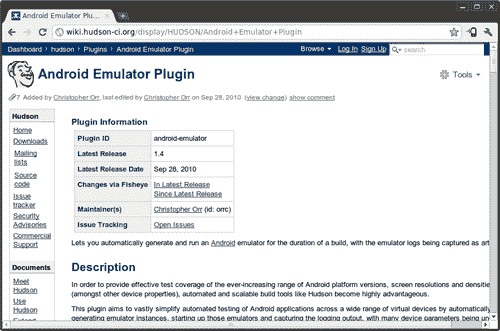
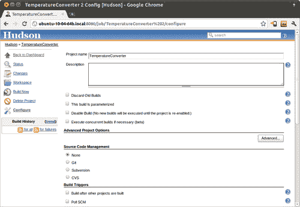
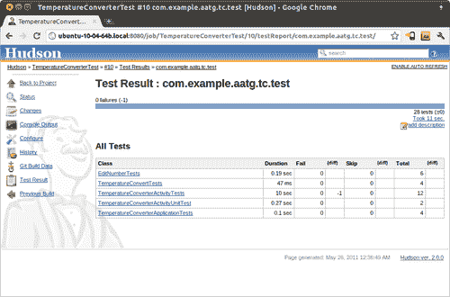
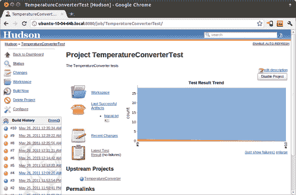
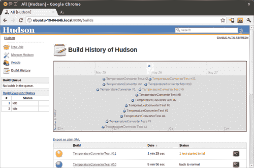

# 第八章 持续集成

**持续集成**是软件工程中的一种敏捷技术，旨在通过持续应用集成和测试来提高软件质量并减少集成更改所需的时间，这与开发周期结束时进行集成和测试的传统方法形成对比。这篇文章最初由马丁·福勒在 2000 年撰写([`www.martinfowler.com/articles/continuousIntegration.html`](http://www.martinfowler.com/articles/continuousIntegration.html))，描述了在一个大型软件项目中实施持续集成的经验。

近年来，持续集成得到了广泛的应用，商业工具和开源项目的激增清楚地证明了其成功。这一点并不难理解，因为任何在其职业生涯中参与过使用传统方法进行软件开发项目的人，很可能都经历过所谓的“集成地狱”，在那里集成更改所需的时间超过了制作更改所需的时间。这让你想起了什么吗？

相反，持续集成是一种频繁且分步骤地集成更改的实践。这些步骤微不足道，通常不会出现错误，因为集成过程中产生的错误通常不会立即被发现。最常见的方法是在每次提交源代码仓库后触发构建过程。

这种实践还意味着除了源代码由版本控制系统（VCS）维护之外的其他要求：

+   应通过运行单个命令来自动化构建过程。这个特性已经被像`make`这样的工具支持了很长时间，最近也被`ant`和`maven`所支持。

+   构建过程应该进行自我测试，以确认新构建的软件符合开发者的期望，这一点到目前为止一直是本书的主题。

+   测试的工件和结果应该易于查找和查看。

在前面的章节中，我们已经为我们的 Android 项目编写了一些测试，现在我们希望将持续集成考虑在内。为了实现这一点，我们想要创建一个与传统的 Eclipse 和 Android ADT 环境共存的模式，因此从源代码树中支持这两种选择。

在本章中，我们将讨论：

+   自动化构建过程

+   将版本控制系统引入流程

+   使用 Hudson 进行持续集成

+   自动化测试

在本章之后，你将能够将持续集成应用于自己的项目，无论其规模大小，无论是拥有数十名开发者的中型或大型软件项目，还是你独自编程的项目。

# 使用 Ant 手动构建 Android 应用程序

如果我们旨在将**持续集成**纳入我们的开发流程，第一步将是手动构建 Android 应用程序，因为我们可以将此技术与自动化流程相结合。

在这样做的时候，我们旨在保持我们的项目与 Eclipse 和 ADT 插件构建过程兼容，这正是我们打算做的。据我了解，这是一个巨大的优势，并且通过自动构建并最终显示项目中可能存在的错误来加快开发过程。当编辑资源或其他生成中间类的文件时，这也是一个无价的工具，否则一些简单的错误会在构建过程中太晚被发现。

幸运的是，Android 支持这种替代方案，并且不需要太多努力就可以在同一项目中合并这两种方法。在这种情况下，手动使用**ant**进行构建是支持的。然而，也存在其他选项，尽管不是**开箱即用**支持的，例如使用**maven**或甚至**make**。

### 注意

Ant 是一个软件命令行工具和 Java 库，通过在包含目标和依赖关系的 XML 文件中描述它来自动化软件构建过程。

更多信息可以在其主页找到，[`ant.apache.org/`](http://ant.apache.org/)。

Android 基于 Ant 的构建系统需要至少 Ant 1.8 或更高版本。

这里值得注意，整个 Android 平台都是由一个极其复杂的 makefile 结构构建的，这种方法甚至用于构建平台中包含的应用程序，如计算器、联系人、浏览器等。

如果你已经使用 Eclipse 构建项目，你可以使用`android`工具将其转换。`android`位于 Android SDK 的工具目录中。如果你使用 Microsoft Windows，你应该将以下示例调整为使用有效的 Windows 路径，并用它们的值替换以下示例中不可用的变量。

首先，我们将当前目录更改为项目目录；虽然不是强制性的，但这简化了一些事情。

然后使用`android`命令，我们将项目转换为使用`ant`构建，并创建`build.xml`构建文件：

```java
$ cd <path/to>/TemperatureConverter
$ android update project --path $PWD --name TemperatureConverter

```

这是获得的输出：

**更新 local.properties**

**添加文件 <path/to>/TemperatureConverter/build.xml**

**更新文件 <path/to>/TemperatureConverter/proguard.cfg**

完成此步骤后，我们就可以从命令行手动构建项目了。此构建文件具有以下目标：

| Target | Description |
| --- | --- |
| help | 显示简短的帮助信息。 |
| clean | 删除由其他目标创建的输出文件。 |
| compile | 将项目的`.java`文件编译成`.class`文件。 |
| debug | 构建应用程序，并使用调试密钥对其进行签名。 |
| release | 构建应用程序。在发布之前，必须对生成的`.apk`文件进行签名。 |
| install | 将调试包安装/重新安装到运行中的模拟器或设备上。如果应用程序之前已安装，签名必须匹配。 |
| uninstall | 从运行中的模拟器或设备卸载应用程序。 |

其中一些目标在设备或模拟器上操作。如果有多个设备或模拟器连接到构建机器，我们需要在命令行上指定特定的目标。因此，目标使用名为 `adb.device.arg` 的变量，以便我们指定目标：

```java
$ ant -Dadb.device.arg='-s emulator-5554' install

```

这是生成的输出：

**Buildfile: build.xml**

**[setup] Android SDK 工具版本 9**

**[setup] 项目目标：Android 2.3.1**

**[setup] API 级别：9**

**[setup] 导入规则文件：platforms/android-8/ant/ant_rules_r2.xml**

**-compile-tested-if-test:** 

**-dirs:**

**[echo] 如有必要，创建输出目录..**.

**[mkdir] 创建目录：TemperatureConverter/bin/classes**

**-resource-src:** 

**[echo] 从资源生成 R.java / Manifest.java..**.

**-aidl:** 

**[echo] 将 aidl 文件编译成 Java 类..**.

**compile:**

**[javac] 编译 6 个源文件到 TemperatureConverter/bin/classes**

**-dex:**

**[echo] 将编译的文件和外部库转换为 TemperatureConverter/bin/classes.dex..**.

**-package-resources:**

**[echo] 打包资源**

**[aaptexec] 创建完整的资源包...**.

**-package-debug-sign:**

**[apkbuilder] 创建 TemperatureConverter-debug-unaligned.apk 并使用调试密钥进行签名..**.

**[apkbuilder] 使用密钥库：.android/debug.keystore**

**debug:**

**[echo] 对最终 APK 进行 zip 对齐..**.

**[echo] 调试包：TemperatureConverter/bin/TemperatureConverter-debug.apk**

**install:**

**[echo] 将 TemperatureConverter/bin/TemperatureConverter-debug.apk 安装到默认模拟器或设备上..**.

**[exec] 371 KB/s (18635 字节在 0.049 秒内)**

**[exec] pkg: /data/local/tmp/TemperatureConverter-debug.apk**

**[exec] 成功**

**构建成功**

**总耗时：6 秒**

即，运行提到的命令行，以下步骤将被执行：

+   环境设置，包括使用的特定规则

+   如有必要，创建输出目录

+   编译源文件，包括资源、aidl 和 Java 文件

+   将编译的文件转换为 `dex`

+   打包创建和签名

+   将安装到指定的设备或模拟器

一旦我们安装了 APK，并且因为我们现在是从命令行进行所有操作，我们甚至可以启动 `TemperatureConverterActivity`。使用 `am start` 命令和一个使用 `MAIN` 动作以及我们想要启动的活动作为组件的 `Intent`，我们可以创建以下命令行：

```java
$ adb -s emulator-5554 shell am start -a android.intent.action.MAIN -n com.example.aatg.tc/.TemperatureConverterActivity

```

活动已启动，您可以在模拟器中验证。然后，我们可以以类似的方式对测试项目进行操作：

```java
$ cd </path/to>/TemperatureConverterTest
$ android update test-project --path $PWD --main <path/to>/TemperatureConverter

```

如果一切顺利，运行此命令将获得以下类似的输出：

**Updated default.properties**

**更新 local.properties**

**添加文件 <path/to>/TemperatureConverterTest/build.xml**

**更新文件 <path/to>/TemperatureConverterTest/proguard.cfg**

**更新 build.properties**

同样，正如我们在主项目中做的那样，我们可以构建和安装测试。要做到这一点，一旦我们将测试项目转换好，我们就可以使用`ant`来构建它，就像我们为主项目做的那样。要在运行的模拟器上构建和安装它，使用以下命令：

```java
$ ant -Dadb.device.arg='-s emulator-5554' install

```

值得注意的是，为了能够成功构建项目，我们需要使用的库必须位于项目内部的`libs`目录中。如果你更喜欢不复制它们，你可以创建到它们原始位置的符号链接。

此外，保持 Eclipse 和 Ant 构建过程同步是一个好习惯，所以如果你将所需的库添加到`libs`目录中，你也可以使用**属性 | Java 构建路径 | 库**来替换 Eclipse 项目中库的位置。

现在，我们可以像在前面章节中讨论的那样，从命令行运行测试：

```java
$ adb -e shell am instrument -w com.example.aatg.tc.test/android.test.InstrumentationTestRunner

```

运行命令后，我们将获得测试结果：

**com.example.aatg.tc.test.EditNumberTests:.......**.

**com.example.aatg.tc.test.TemperatureConverterActivityTests:.........**.

**com.example.aatg.tc.test.TemperatureConverterApplicationTests:....**.

**com.example.aatg.tc.test.TemperatureConverterTests:...**.

**InstrumentationTestRunner 的测试结果=..........................**.

**时间：12.125**

**OK (28 tests)**

我们已经通过仅调用一些简单的命令从命令行完成了所有操作，这正是我们为了将其输入到**持续集成**过程中所寻找的。

# Git——快速版本控制系统

**Git**是一个免费且开源的分布式版本控制系统，旨在以速度和效率处理从小型到非常大的项目。它非常简单易设，我强烈建议即使是个人项目也使用它。没有哪个项目简单到不能从应用这个工具中受益。你可以在[`git-scm.com/`](http://git-scm.com/)找到信息和下载。

另一方面，版本控制系统或 VCS（也称为**源代码管理**或**SCM**）是涉及多个开发者的开发项目中不可避免的一个元素。此外，即使在没有 VCS 的情况下应用持续集成也是可能的，尽管它不是必需的，但这并不是一个合理的做法。

其他，可能还有更多传统的选项存在于版本控制系统（VCS）领域，例如 Subversion 或 CVS，如果你觉得更舒服，可以自由使用。无论如何，Git 在 Android 项目中得到了广泛的应用，因此花些时间至少了解其基础是值得的。

话虽如此，且记住这是一个非常广泛的主题，足以写成一本书（而且确实有一些关于它的好书），我们在这里讨论的是最基本的话题，并提供示例以帮助那些尚未采用这种实践的人入门。

## 创建本地 git 仓库

这些是创建本地仓库并将我们的项目初始源代码填充到其中的最简单命令。在这种情况下，我们再次使用在前面章节中创建并使用的`TemperatureConverter`和`TemperatureConverterTest`项目。我们选择一个名为`git-repos`的目录作为两个项目的父目录，并将我们在上一节中手动构建时使用的代码复制过来：

```java
$ cd <path/to>/git-repos
$ mkdir TemperatureConverter
$ cd TemperatureConverter
$ git init
$ cp -a <path/to>/TemperatureConverter/. .
$ ant clean
$ rm local.properties
$ git add .
$ git commit -m "Initial commit"

```

即，我们为仓库创建父目录，创建项目目录，初始化 git 仓库，复制初始内容，清理之前的构建，删除`local.properties`文件，将所有内容添加到仓库中，并提交。

### 小贴士

`local.properties`文件永远不应该被提交到版本控制系统，因为它包含特定于你本地配置的信息。

然后，对于`TemperatureConverterTest`项目也应做同样的处理：

```java
$ cd <path/to>/git-repos
$ mkdir TemperatureConverterTest
$ cd TemperatureConverterTest
$ git init
$ cp -a <path/to>/TemperatureConverterTest/. .
$ ant clean
$ rm local.properties
$ git add .
$ git commit -m "Initial commit"

```

到目前为止，我们有两个项目仓库，包含了`TemperatureConverter`和`TemperatureConverterTest`项目的初始源代码。我们没有改变它们的结构，因此它们也与**Eclipse**和**Android ADT**插件兼容，以便我们在 IDE 中开发时可以构建。

下一步是确保每次我们对源代码进行更改时，两个项目都会自动构建和测试。

# 使用 Hudson 进行持续集成

**Hudson**是一个开源、可扩展的**持续集成**服务器，它具有构建和测试软件项目或监控外部作业执行的能力。Hudson 的安装和配置都很简单，并且做得非常出色，这也是我们以它为基础的原因。

### 注意

最近（2011 年 1 月），有人提出将名称从 Hudson 更改为 Jenkins，以避免未来可能出现的法律问题，因为 Oracle 已经提交了商标注册。因此，现在存在两个不同的分支项目。尽管这些示例基于 Hudson，但你应该监控各个项目的演变，以找到更适合你需求的项目。

## 安装和配置 Hudson

我们将简单安装作为 Hudson 的优点之一，安装过程无法再简单。

从[`hudson-ci.org/`](http://hudson-ci.org/)下载你选择的操作系统的原生包。有适用于 Debian/Ubuntu、RedHat/Fedora/Centos、openSUSE、OpenSolaris/Nevada 和 FreeBSD 的原生包，或者下载最新的通用`hudson.war`（它也适用于 Mac 和 Windows）。在以下示例中，我们将使用 2.0 版本。我们将展示后者，因为它不需要管理员权限即可安装、配置和运行。

完成后，将其复制到选定的目录中，比如`~/hudson`，然后运行以下命令：

```java
$ java -jar hudson-2.0.0.war

```

这将扩展并启动 Hudson。

默认配置使用 8080 端口作为 HTTP 监听端口，因此将您选择的浏览器指向`http://localhost:8080`应该会显示 Hudson 主页。

如果需要，您可以通过访问**管理 Hudson**屏幕来验证和更改 Hudson 的操作参数。我们应该添加到这个配置中用于 Git 集成和构建期间支持 Android 模拟器的插件。这些插件分别命名为**Hudson GIT 插件**和**Android 模拟器插件**。

此截图显示了您可以通过 Hudson 管理页面上的超链接获取有关插件的信息：



安装并重新启动 Hudson 后，这些插件将可用于使用。我们的下一步是创建构建项目所需的工作。

## 创建工作

让我们从使用 Hudson 主页上的**新建工作**开始创建`TemperatureConverter`工作。可以创建不同类型的作业；在这种情况下，我们选择**构建自由风格软件项目**，允许您连接任何 SCM 与任何构建系统。

点击“确定”按钮后，您将看到以下表格中描述的具体工作选项。这是工作属性页面：



**新工作**屏幕中的所有选项都关联有帮助文本，因此这里我们只解释我们将要输入的选项：

| 选项 | 描述 |
| --- | --- |
| 项目名称 | 分配给项目的名称。 |
| 描述 | 可选描述。 |
| 丢弃旧构建 | 这有助于您通过管理构建记录（如控制台输出、构建工件等）的保留时间来节省磁盘消耗。 |
| 此构建是参数化的 | 这允许您配置传递给构建过程的参数以创建参数化构建。 |
| 禁用构建（直到项目重新启用，将不会执行新的构建。） | 暂时禁用项目。 |
| 如有必要执行并发构建（beta） | 这允许同时执行多个构建。 |
| 源代码管理 | 也称为 VCS。项目的源代码在哪里？在这种情况下，我们使用 git 和一个 URL 为之前创建的仓库的绝对路径的仓库。例如，`/home/diego/aatg/git-repos/TemperatureConverter`。 |
| 构建触发器 | 这描述了项目是如何自动构建的。在这种情况下，我们希望每次源代码的更改都触发自动构建，所以我们选择**轮询 SCM**。另一种选择是使用**定期构建**。这个功能主要用于将 Hudson 用作`cron`的替代品，并且对于持续构建软件项目来说并不理想。当人们刚开始持续集成时，他们通常非常习惯于定期构建的想法，如夜间/每周构建，因此他们会使用这个功能。然而，持续集成的目的是在更改发生后立即开始构建，以便为更改提供快速反馈。 |
| 调度 | 此字段遵循`cron`语法（有一些细微差别）。具体来说，每一行由五个字段组成，字段之间由制表符或空格分隔：`分钟 小时 星期几 月份 星期`。例如，如果我们想在每小时三十分钟后持续轮询，指定：`30 * * * *`。请查看文档以获取所有选项的完整解释。 |
| 构建环境 | 允许你为构建环境和可能运行在构建期间的 Android 模拟器指定不同的选项。 |
| 构建 | 这描述了构建步骤。我们选择**调用 Ant**，因为我们正在重现我们之前手动构建项目的步骤。我们在这里使用的目标是`debug`，因为我们只想编译项目并生成 APK，而不安装或运行它。此外，使用**高级...**选项，我们需要指定 Android SDK 目录和 Android 目标版本**属性**。`sdk.dir=/opt/android-sdk target=android-9` |
| 构建后操作 | 这些是在构建完成后我们可以执行的一系列操作。我们感兴趣的是保存 APK，所以我们启用了**存档工件**，然后定义它们的路径为**存档文件**；在这个特定情况下是`**/*-debug.apk`。 |

现在有两种选择：你可以通过**立即构建**来强制构建，或者通过 Git 对源代码进行一些更改，然后等待我们的轮询策略检测到这些更改。无论哪种方式，我们都会构建我们的项目，并准备好我们的工件，以便用于其他目的，例如依赖项目或质量保证。

到目前为止，我们还没有运行任何测试，我们现在展示的就是这个。Hudson 有处理项目之间依赖关系的能力，因此我们现在创建一个 Hudson 作业，`TemperatureConverterTest`依赖于`TemperatureConverter`。

按照之前的方式进行。我们只是在设置此项目与之前设置的不同之处进行精确定位。

| 选项 | 描述 |
| --- | --- |
| 构建触发器 | 这是我们触发此项目构建的方式。选择**在其他项目构建后构建**，这样当其他项目完成构建时，就会为该项目安排一个新的构建。我们需要它在`TemperatureConverter`之后构建。这在构建完成后运行广泛的测试时很方便，就像这个例子一样。 |
| 构建环境 | 我们的意图是在模拟器上安装和运行测试，因此我们的构建环境使用 **Android 模拟器插件** 提供的设施。如果你希望在构建步骤执行之前自动启动你选择的 Android 模拟器，并在构建完成后停止模拟器，这将非常有用。你可以选择启动一个预定义的、现有的 Android 模拟器实例（AVD）。或者，插件可以自动在构建从机上创建一个新的模拟器，其属性由你在此处指定。无论如何，`logcat` 输出将自动捕获并归档。然后选择 `2.3` 作为 **Android 操作系统版本**，`240` DPI 作为 **屏幕密度**，以及 `WVGA` 作为 **屏幕分辨率**。请随意实验并选择更适合你需求的选项。 |
| 常用模拟器选项 | 我们希望 **在启动时重置模拟器状态** 以清除用户数据并禁用 **显示模拟器窗口**，这样模拟器窗口就不会显示。 |
| 构建 | 选择 **调用 ant** 作为构建步骤，并将 `install` 作为 **目标**。在这里，就像我们在 `TemperatureConverter` 中做的那样，我们必须设置一些变量来构建和安装当前作业。使用 **高级...** 选项设置：`sdk.dir=/opt/android-sdk` `target=android-9` `tested.project.dir=../../TemperatureConverter/workspace/` `adb.device.arg=-s $ANDROID_AVD_DEVICE`。和之前一样，我们指定了 Android SDK 目录和目标版本。此外，在这里我们应该指定目标项目目录，即 SUT，以及我们想要安装 APK 的设备。我们使用 **Android 模拟器插件** 设置的特殊变量来识别选择为目标的目标设备。 |

在配置和构建此项目后，我们在目标模拟器上安装了 APK。还有一些步骤需要完成，因为我们仍然缺少运行测试和获取要在 Hudson 中显示的结果。

## 获取 Android 测试结果

为了能够显示测试结果，我们应该在测试运行器中存储原始 XML 结果。默认的 `android.test.InstrumentationTestRunner` 不支持存储原始 XML，因此这里的解决方案是扩展它以提供缺失的功能。

我在 Google code 上找到了名为 `nbandroid-utils` ([`code.google.com/p/nbandroid-utils/`](http://code.google.com/p/nbandroid-utils/)) 的项目，该项目提供了我们需要的几乎相同的功能。

`com.neenbedankt.android.test.InstrumentationTestRunner` 类扩展了 Android 类，以便在运行测试时将测试结果的 XML 写入设备。

我们还希望能够从测试参数中指定文件名，并且能够将文件存储在外部存储中，以防测试结果变得非常大，因此我们稍微修改了该类以支持这些功能。为了使这些更改明显，我们将新类命名为 `XMLInstrumentationTestRunner:`。

```java
package com.neenbedankt.android.test;
import java.io.File;
import java.io.FileWriter;
import java.io.IOException;
import java.io.Writer;
import org.xmlpull.v1.XmlPullParserFactory;
import org.xmlpull.v1.XmlSerializer;
import android.os.Bundle;
import android.util.Log;
/*
* Copyright (C) 2010 Diego Torres Milano
*
* Base on previous work by
* Copyright (C) 2007 Hugo Visser
*
* Licensed under the Apache License, Version 2.0 (the "License");
* you may not use this file except in compliance with the License.
* You may obtain a copy of the License at
*
* http://www.apache.org/licenses/LICENSE-2.0
*
* Unless required by applicable law or agreed to in writing,
* software distributed under the License is distributed on an
* "AS IS" BASIS,WITHOUT WARRANTIES OR CONDITIONS OF ANY KIND,
* either express or implied.
* See the License for the specific language governing permissions
* and limitations under the License.
*/
/**
* This test runner creates an xml in the files directory of
* the application under test. The output is compatible with
* that of the junitreport ant task, the format that is
* understood by Hudson. Currently this implementation does not
* implement the all aspects of the junitreport format, but
* enough for Hudson to parse the test results.
*/
public class XMLInstrumentationTestRunner extends android.test.InstrumentationTestRunner {
private Writer mWriter;
private XmlSerializer mTestSuiteSerializer;
private long mTestStarted;

```

这里我们提供了字段以保存输出文件的名称及其默认值。

我们还在定义测试运行器将使用以接收此值的参数名称：

```java
/**
* Output file name.
*/
private String mOutFileName;
/**
* Outfile argument name.
* This argument can be passed to the instrumentation using <code>-e</code>.
*/
private static final String OUT_FILE_ARG = "outfile";
/**
* Default output file name.
*/
private static final String OUT_FILE_DEFAULT = "test-results.xml";

```

在我们的`onCreate()`方法中，我们验证是否提供了参数，如果是，则将其存储在之前定义的字段中：

```java
@Override
public void onCreate(Bundle arguments) {
if ( arguments != null ) {
mOutFileName = arguments.getString(OUT_FILE_ARG);
}
if ( mOutFileName == null ) {
mOutFileName = OUT_FILE_DEFAULT;
}
super.onCreate(arguments);
}

```

在`onStart()`方法中，我们创建文件并使用它作为 JUnit 输出：

```java
@Override
public void onStart() {
try {
File dir = getTargetContext().getExternalFilesDir(null);
if ( dir == null ) {
dir = getTargetContext().getFilesDir();
}
final File outFile = new File(dir, mOutFileName);
startJUnitOutput(new FileWriter(outFile));
} catch (IOException e) {
throw new RuntimeException(e);
}
super.onStart();
}

```

以下代码是这个测试运行器的原始代码：

```java
void startJUnitOutput(Writer writer) {
try {
mWriter = writer;
mTestSuiteSerializer = newSerializer(mWriter);
mTestSuiteSerializer.startDocument(null, null);
mTestSuiteSerializer.startTag(null, "testsuites");
mTestSuiteSerializer.startTag(null, "testsuite");
} catch (Exception e) {
throw new RuntimeException(e);
}
}
private XmlSerializer newSerializer(Writer writer) {
try {
XmlPullParserFactory pf = XmlPullParserFactory.newInstance();
XmlSerializer serializer = pf.newSerializer();
serializer.setOutput(writer);
return serializer;
} catch (Exception e) {
throw new RuntimeException(e);
}
}
@Override
public void sendStatus(int resultCode, Bundle results) {
super.sendStatus(resultCode, results);
switch (resultCode) {
case REPORT_VALUE_RESULT_ERROR:
case REPORT_VALUE_RESULT_FAILURE:
case REPORT_VALUE_RESULT_OK:
try {
recordTestResult(resultCode, results);
} catch (IOException e) {
throw new RuntimeException(e);
}
break;
case REPORT_VALUE_RESULT_START:
recordTestStart(results);
default:
break;
}
}
void recordTestStart(Bundle results) {
mTestStarted = System.currentTimeMillis();
}
void recordTestResult(int resultCode, Bundle results) throws IOException {
float time = (System.currentTimeMillis() - mTestStarted) / 1000.0f;
String className = results.getString(REPORT_KEY_NAME_CLASS);
String testMethod = results.getString(REPORT_KEY_NAME_TEST);
String stack = results.getString(REPORT_KEY_STACK);
int current = results.getInt(REPORT_KEY_NUM_CURRENT);
int total = results.getInt(REPORT_KEY_NUM_TOTAL);
mTestSuiteSerializer.startTag(null, "testcase");
mTestSuiteSerializer.attribute(null, "classname", className);
mTestSuiteSerializer.attribute(null, "name", testMethod);
if (resultCode != REPORT_VALUE_RESULT_OK) {
mTestSuiteSerializer.startTag(null, "failure");
if (stack != null) {
String reason = stack.substring(0, stack.indexOf('\n'));
String message = "";
int index = reason.indexOf(':');
if (index > -1) {
message = reason.substring(index+1);
reason = reason.substring(0, index);
}
mTestSuiteSerializer.attribute(null, "message", message);
mTestSuiteSerializer.attribute(null, "type", reason);
mTestSuiteSerializer.text(stack);
}
mTestSuiteSerializer.endTag(null, "failure");
} else {
mTestSuiteSerializer.attribute(null, "time", String.format("%.3f", time));
}
mTestSuiteSerializer.endTag(null, "testcase");
if (current == total) {
mTestSuiteSerializer.startTag(null, "system-out");
mTestSuiteSerializer.endTag(null, "system-out");
mTestSuiteSerializer.startTag(null, "system-err");
mTestSuiteSerializer.endTag(null, "system-err");
mTestSuiteSerializer.endTag(null, "testsuite");
mTestSuiteSerializer.flush();
}
}
@Override
public void finish(int resultCode, Bundle results) {
endTestSuites();
super.finish(resultCode, results);
}
void endTestSuites() {
try {
if ( mTestSuiteSerializer != null ) {
mTestSuiteSerializer.endTag(null, "testsuites");
mTestSuiteSerializer.endDocument();
mTestSuiteSerializer.flush();
}
if ( mWriter != null) {
mWriter.flush();
mWriter.close();
}
} catch (IOException e) {
throw new RuntimeException(e);
}
}
}

```

实现我们的目标还需要几个步骤。首先是将这个测试运行器通过组合`git add/git commit`添加到我们的项目中：

您可以简单地使用以下命令：

```java
$ git add src/com/neenbedankt/
$ git commit -a -m "Added XMLInstrumentationTestRunner"

```

然后我们需要在`AndroidManifest.xml`中使用测试运行器声明测试。也就是说，使用最近创建的测试运行器`com.neenbedankt.android.test.XMLInstrumentationTestRunner`作为`com.example.aatg.tc`包的测试：

```java
<instrumentation
android:targetPackage="com.example.aatg.tc"
android:label="TemperatureConverter tests" android:name="com.neenbedankt.android.test. XMLInstrumentationTestRunner"
/>

```

同样，将其添加到仓库中，就像我们之前对其他文件所做的那样。

最后，由于我们能够通过使用**添加构建步骤**来在构建过程中添加一个执行 shell 脚本的步骤，我们将此步骤添加到作业配置页面中的**执行 shell**步骤。我们使用一些 shell 变量以便能够将此步骤重新用于其他项目：

```java
PKG=com.example.aatg.tc
OUTDIR=/data/data/${PKG}/files/
OUTFILE=test-results.xml
ADB=/opt/android-sdk/platform-tools/adb
$ADB -s $ANDROID_AVD_DEVICE install -r "$WORKSPACE/../../ TemperatureConverter/lastSuccessful/ archive/bin/TemperatureConverter-debug.apk"
$ADB -s $ANDROID_AVD_DEVICE shell am instrument -w -e outfile "$OUTFILE" $PKG.test/com.neenbedankt.android.test.XMLInstrumentationTestRunner
$ADB -s $ANDROID_AVD_DEVICE pull "$OUTDIR/$OUTFILE" "$WORKSPACE/$OUTFILE"

```

让我们更详细地解释这些步骤：

+   我们将特定的项目包名称分配给 PKG 变量。

+   `OUTDIR`是测试运行器将文件`OUTFILE`留下的目录名称。请注意，这是一个在模拟器或设备上的目录，而不是本地目录。

+   将测试包安装到模拟器或设备上。

+   从命令行运行测试，就像我们之前看到的那样，但在这个情况下，添加一个额外的参数`-e outfile`，其中包含我们期望接收的文件名。

+   从该文件获取测试结果，从设备拉取到本地工作区。

几乎一切都已经就绪。唯一剩下的是告诉 Hudson 在哪里期望这些测试结果。在这种情况下，我们在作业配置页面中使用**构建后操作**。

| 选项 | 描述 |
| --- | --- |
| 发布 JUnit 测试结果报告 | 当此选项配置时，Hudson 可以提供有关测试结果的有用信息，例如历史测试结果趋势、查看测试报告的 Web UI、跟踪失败等。要使用此功能，首先设置构建以运行测试，然后使用`com.neenbedankt.android.test.XMLInstrumentationTestRunner`作为测试运行器，在仪器测试中使用`-e outfile`指定输出，并使用此相同的名称告诉 Hudson 在哪里找到结果。Ant glob 语法，如`**/build/test-reports/*.xml`，也可以使用。确保不要将任何非报告文件包含在此模式中。简单来说，这仅仅是我们在之前的`OUTFILE`变量中指定的`test-results.xml`。一旦运行了几个带有测试结果的构建，您应该开始看到一些趋势图表，显示测试的演变。 |

完成之前描述的所有步骤后，只剩下强制构建以查看结果。像往常一样按**现在构建**，几分钟后您将看到测试结果和统计信息以类似以下屏幕截图所示的方式显示：



从这里我们可以轻松理解我们的项目状态，了解有多少测试失败以及原因。通过检查失败的测试，我们还可以找到广泛的**错误消息**和**堆栈跟踪**。

通过评估不同的趋势来了解项目的演变也非常有帮助。每个项目都使用类似天气的图标来展示当前趋势，当项目健康度提高 80%时为晴朗，当健康度低于 20%时为雷暴。此外，对于每个项目，测试成功与失败比率的演变在以下图表中显示：



在这种情况下，我们可以看到自上次构建以来，一个测试开始失败。

要查看通过强制失败来查看项目状态变化的情况，让我们添加一个如下所示的失败测试：

```java
public final void testForceFailure1() {
fail("Forced fail");
}

```

另一个值得提及的非常有趣的功能是 Hudson 能够保持并显示时间线和构建时间趋势，如下面的屏幕截图所示：



此页面展示了构建历史记录，并提供到每个特定构建的超链接，您可以跟踪以查看详细信息。

现在我们对担忧的事情减少了很多，每次开发团队中的某人在仓库中提交更改时，我们知道这些更改将立即集成，整个项目将构建和测试。如果我们进一步配置 Hudson，我们甚至可以通过电子邮件接收状态。为此，在作业配置页面启用**电子邮件通知**并输入所需的**收件人**。

# 摘要

本章在实践上介绍了**持续集成**，提供了宝贵的信息，以便您尽快将其应用于项目，无论项目规模大小，无论您是独立开发还是在大公司团队中工作。

所展示的技术专注于 Android 项目的特定之处，维护和支持广泛使用的开发工具，如 Eclipse 和 Android ADT。

我们引入了真实世界的例子，使用了从庞大的开源工具库中可用的真实世界工具。我们使用了 Ant 来自动化构建过程，git 来创建一个简单的版本控制系统存储库以存储我们的源代码并管理变更，最后安装并配置了 Hudson 作为首选的持续集成工具。

在本课程中，我们详细介绍了为自动化创建`TemperatureConverter`及其测试而创建作业的过程，并强调了项目之间的关系。

最后，我们分析了一种从 Android 测试中获取 XML 结果的方法，并将其实现，以获得一个吸引人的界面来监控测试的运行、结果和现有趋势。

下一章处理测试的不同方面，专注于性能和剖析，这可能是我们在应用程序正确运行并符合我们的规范之后的自然步骤。
