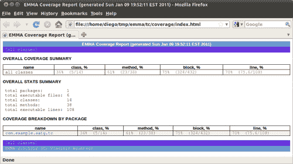
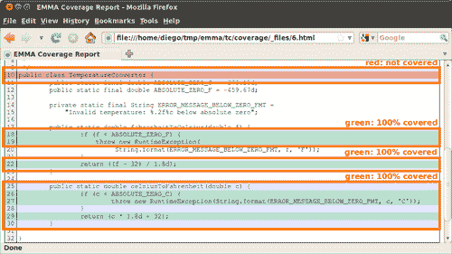
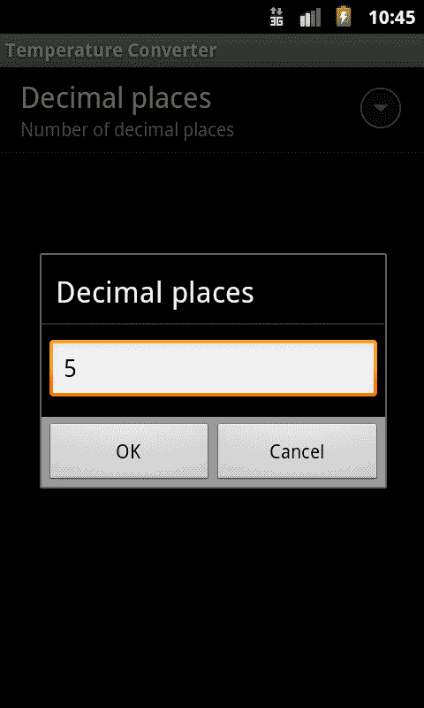
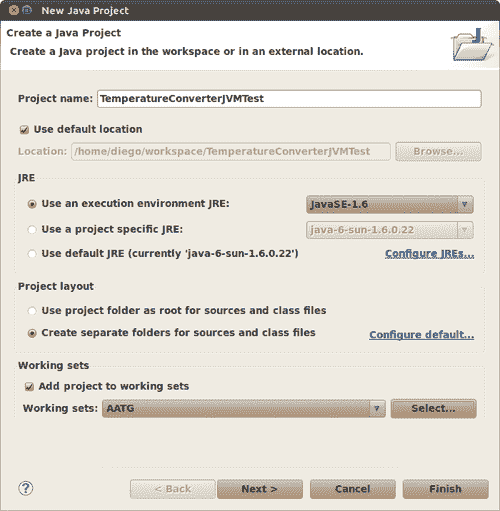
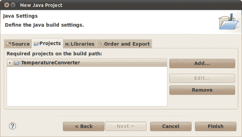
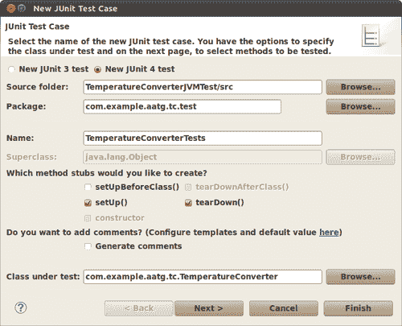
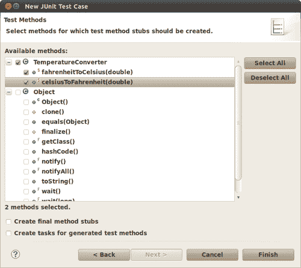
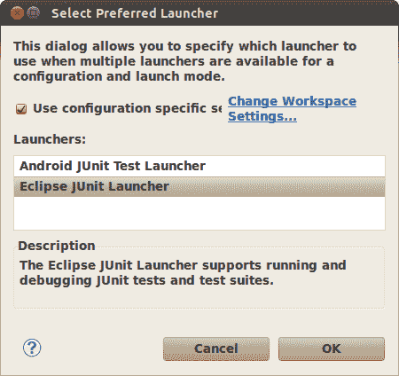
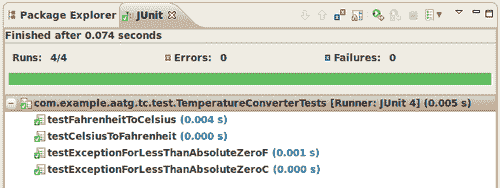
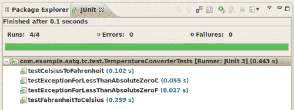

# 第十章。替代测试策略

到目前为止，我们已经分析了在项目中实现测试的最常见和最易访问的策略。然而，在我们的拼图中还有一些缺失的部分，并且随着当前版本的 Android SDK（截至本文撰写时为 *Android 2.3 姜饼*），这些功能尚未实现。尽管如此，并非一切皆无。Android 最大的和最强大的优势之一是其开源性质，而我们将要利用的功能正是依赖于它，因为我们将会使用完整的源代码来引入一些我们计划提供的更改所需的变化。

从源代码构建 Android 并非易事。这需要极多的时间，尤其是在你熟悉整个 Android 环境的初期，同时还需要大量的磁盘空间和计算能力。为了说明这一点，对单个目标的简单构建就需要近 10GB 的磁盘空间，并在 4 核机器上花费近一个小时来构建。我并不是想吓唬你，而是警告你，同时请求你有一点耐心。

他们说，巨大的牺牲伴随着巨大的回报，这似乎又是一个遵循这一规则的案例。

在本章中，我们将涵盖：

+   从源代码构建 Android

+   使用 EMMA 进行代码覆盖率

+   将代码覆盖率添加到我们的温度转换器项目中

+   介绍 Robotium

+   在宿主机的 JVM 上进行测试

+   介绍 Robolectric

# 从源代码构建 Android

也许 Android 的**致命弱点**就是缺乏文档，以及你需要访问的多个地方才能找到你试图寻找的完整版本，或者更糟糕的是，在许多情况下，官方文档是错误的，或者没有更新以匹配当前版本。一个例子是，在撰写本文时，关于从源代码构建 Android 的要求文档（可在[`source.android.com/source/download.html`](http://source.android.com/source/download.html)找到）仍然声称 Java 6 不受支持，可以使用 Ubuntu 8.10（intrepid）32 位，这是完全错误的。有趣的是，Java 6 和至少 Ubuntu 10.04（lucid）64 位是必需的。从 Android 2.3（姜饼）开始，在 32 位机器上构建不再受支持。但这就足够了，我要把这些牢骚留到我的个人博客上，否则如果文档是完整的，像这样的书就不需要了，我可能正在写一本关于 Windows Phone 7 的书...

开个玩笑，我不认为这会在近期发生。

## 代码覆盖率

我们从源代码构建 Android 的一个目标是在 EMMA 的帮助下实现代码覆盖率（[`emma.sourceforge.net/`](http://emma.sourceforge.net/)）。

代码覆盖率是软件测试中用来描述测试套件实际测试的源代码量以及达到某些标准的程度的度量。由于代码覆盖率直接检查代码，因此它是一种白盒测试。

在为 Java 提供代码覆盖率分析的几个工具中，我们使用 EMMA，这是一个由 Android 项目支持的、用于测量和报告 Java 代码覆盖率的开源工具包，并且已经存在用于启动您自己的项目的基础设施，因此最小化了实现它的努力。EMMA 出现填补了庞大的开源生态系统中的一个空白，在该空白中不存在具有兼容许可证的覆盖率工具。EMMA 基于 IBM 的 Common Public License v1.0，因此对开源和商业开发都是免费的。

EMMA 通过追求独特的功能组合来区别于其他工具：支持大规模企业级软件开发，同时保持单个开发者的工作快速和迭代。这对于 Android 这样规模的项目至关重要，而 EMMA 在提供代码覆盖率方面表现出色。

### EMMA 功能

Android 2.3 包含 EMMA v2.0，版本 5312。其最独特的功能集合，根据其文档的描述，可以在其网站上找到，如下：

+   EMMA 可以在离线（在它们被加载之前）或实时（使用一个分析应用程序类加载器）对类进行代码覆盖率分析。

+   支持的覆盖率类型：类、方法、行、基本块。EMMA 可以检测到单行源代码只部分被覆盖的情况。

+   覆盖率统计数据在方法、类、包和“所有类”级别进行汇总。

+   输出报告类型：纯文本、HTML、XML。所有报告类型都支持钻取，达到用户控制的详细程度。HTML 报告支持源代码链接。

+   输出报告可以突出显示低于用户提供的阈值覆盖率的项。

+   在不同的代码覆盖率分析或测试运行中获得的数据可以合并在一起。

+   EMMA 不需要访问源代码，并且当输入类中可用的调试信息减少时，它能够优雅地降级。

+   EMMA 可以对单个 `.class` 文件或整个 `.jar` 文件（如果需要，就地）进行代码覆盖率分析。也支持高效的覆盖率子集过滤。

+   Makefile 和 ANT 构建集成得到同等支持。

+   EMMA 非常快：添加的代码覆盖率分析器的运行时开销很小（5 到 20%），而字节码分析器本身也非常快（主要受限于文件 I/O 速度）。内存开销是每个 Java 类几百字节。

+   EMMA 是 100% 纯 Java，没有外部库依赖，并且可以在任何 Java 2 JVM（甚至 1.2.x）上运行。

Android 对 EMMA 项目进行了一些小的修改，以使其完全适应并支持代码覆盖率：

+   将 `core/res/emma_default.properties` 中的 `coverage.out.file` 位置更改为 `/data/coverage.ec`

+   从 `core/java14/com/vladium/util/IJREVersion.java` 中移除对 `sun.misc.*` 的引用

+   从 `core/java13/com/vladium/util/exit/ExitHookManager.java` 中移除对 `sun.misc.*` 和 `SunJREExitHookManager` 类的引用

+   将 `java.security.cert.Certificate` 强制转换为 `core/java12/com/vladium/emma/rt/InstrClassLoader.java` 中的 `cast` 以修复编译器错误

+   将 `out/core/res/com/vladium/emma/rt/RTExitHook.closure`（来自 Emma Ant 构建）移动到 `pregenerated/` 目录中，这样它就不需要在 Android 的基于 make 的构建中生成，但也不会破坏 Emma 的构建

## 系统要求

Gingerbread 版本的 Android 构建需要一个 64 位构建环境以及一些其他工具：

必需的软件包：

+   Git、JDK、flex 以及其他开发包

+   Java 6

+   32 位交叉构建环境中的片段

+   X11 开发

如果您正在运行推荐的 Ubuntu 10.04 LTS 64 位系统，以下是指令：

```java
$ sudo apt-get install git-core gnupg flex bison gperf libsdl-dev \
libesd0-dev libwxgtk2.6-dev build-essential zip curl libncurses5-dev \
zlib1g-dev $ sudo apt-get install gcc-multilib g++-multilib libc6-dev-i386 \
lib32ncurses5-dev ia32-libs x11proto-core-dev libx11-dev \
lib32readline5-dev lib32z-dev

```

设置系统默认使用正确的 java 版本：

```java
$ sudo update-java-alternatives -s java-6-sun

```

在任何情况下，请访问 AOSP 网站 ([`source.android.com/source/download.html`](http://source.android.com/source/download.html)) 以获取更新的说明。

## 下载 Android 源代码

Android 项目是一组相对独立的项目的集合，它们被置于 Android 的伞下。所有这些项目都使用 Git 作为版本控制系统。您可以通过访问 Android 项目的 **Gitweb** 界面来了解这一点，网址为 [`android.git.kernel.org/`](http://android.git.kernel.org/)。

如您所见，列出了数十个项目，您需要所有这些来构建整个平台。为了简化同时处理大量 Git 项目的流程，Google 创建了 **repo**，这是一个基于 Git 构建的工具，旨在帮助管理多个 Git 仓库，上传到版本控制系统，并自动化 Android 开发工作流程的一部分。

`Repo` 是一个补充工具，它并不取代 Git，但使得在 Android 的背景下使用 Git 更加容易。`repo` 命令是一个 Python 可执行文件，被封装在一个 shell 脚本中，并且可以被放置在您的路径中的任何位置。

在 Android 项目的范围内，有关 Git 和 Repo 的详细信息可以从它们的信息页面 [`source.android.com/source/git-repo.html`](http://source.android.com/source/git-repo.html) 获取。

### 安装 repo

如我们之前提到的，`repo` 是我们进入 Android 源代码世界的钥匙，因此第一步是安装它。

按照以下命令操作：

```java
$ curl http://android.git.kernel.org/repo > ~/bin/repo
$ chmod a+x ~/bin/repo

```

这将创建初始的 repo 脚本，它将初始化完整的仓库，并将包括 `repo.git` 项目，因此 `repo` 将自动维护。每次您与仓库同步时，如果需要，`repo` 自身的更改将被传播。这是一个非常聪明的工具使用方式。

### 创建工作副本

我们可以在计算机的任何位置创建仓库的工作副本。只需记住，至少需要 10GB 的可用空间，如果您为不同的目标构建，有时可能需要更多空间。

假设我们决定在 `~/android/android-2.3` 中创建工作副本，然后使用以下命令：

```java
$ mkdir ~/android/android-2.3
$ cd ~/android/android-2.3
$ repo init -u git://android.git.kernel.org/platform/manifest.git

```

这三个简单的步骤已经创建了我们准备同步的工作副本。请记住，这是一个非常大的下载，根据您的网络连接速度和服务器负载，可能需要一些时间。因此，在主要版本推送到服务器后等待几天是非常明智的。

当您准备好同步时，只需在您的工作副本中调用此命令：

```java
$ repo sync

```

当您运行 `repo sync` 时，会发生以下情况：

+   如果项目从未同步过，则 `repo sync` 等同于 `git clone`。远程仓库中的所有分支都将复制到本地项目目录。

+   如果项目已经同步过一次，则 `repo sync` 等同于：

    +   `git remote update`

    +   `git rebase origin/branch`

    +   其中分支是本地项目目录中当前签出的分支。如果本地分支没有跟踪远程仓库中的分支，则项目不会发生同步。

+   如果 `git rebase` 操作导致合并冲突，您需要使用正常的 Git 命令（例如，`git rebase --continue`）来解决冲突。

完成后，完整的 Android 源代码已下载到您的工作副本。我们没有指定任何特定的分支，所以我们只下载了最新的 Android 开源项目 (AOSP) 主分支。

### 构建步骤

我们已经准备好开始支持代码覆盖率分析的建设。

要实现这一点，我们需要遵循设置环境和选择您的组合的步骤：

```java
~/android/android-2.3$ source build/envsetup.sh

```

**包括 device/htc/passion/vendorsetup.sh**

**包括 device/samsung/crespo/vendorsetup.sh**

```java
~/android/android-2.3$ lunch

```

**您正在 Linux 上构建**

**午餐菜单...选择一个组合：**

**1. full-eng**

**2. full_x86-eng**

**3. 模拟器**

**4. full_passion-userdebug**

**5. full_crespo-userdebug**

**您想选择哪个？ [full-eng]**

在此情况下选择 **full-eng**。

**============================================**

**PLATFORM_VERSION_CODENAME=AOSP**

**PLATFORM_VERSION=AOSP**

**TARGET_PRODUCT=full**

**TARGET_BUILD_VARIANT=eng**

**TARGET_SIMULATOR=false**

**TARGET_BUILD_TYPE=release**

**TARGET_BUILD_APPS=**

**TARGET_ARCH=arm**

**TARGET_ARCH_VARIANT=armv5te**

**HOST_ARCH=x86**

**HOST_OS=linux**

**HOST_BUILD_TYPE=release**

**BUILD_ID=OPENMASTER**

**============================================**

在这种情况下还需要进行一个步骤。因为我们想启用 EMMA 代码覆盖率，所以需要在环境中设置此选项：

```java
~/android/android-2.3$ export EMMA_INSTRUMENT=true

```

准备好，出发：

```java
~/android/android-2.3$ make -j4

```

### 注意

`make` 的 `-j` 或 `-jobs` 选项允许您指定同时运行的作业（命令）数量。这在多处理器或多核机器中加快长时间构建过程非常有用。如果没有给 `-j` 选项提供参数，则 `make` 不会限制可以同时运行的作业数量。

经过一段时间和大量消息后，你的构建将可用。如果一切顺利，你将在结束时看到类似以下的消息：

**目标系统文件系统镜像：out/target/product/generic/obj/PACKAGING/systemimage_intermediates/system.img**

**安装系统文件系统镜像：out/target/product/generic/system.img**

**已安装文件列表：out/target/product/generic/installed-files.txt**

这是因为最后一步是创建系统镜像和已安装文件列表。

如果构建失败，请尝试以下建议中的某些方法来修复它，或者更多地在 AOSP 网站上了解信息([`source.android.com/source/building.html`](http://source.android.com/source/building.html))。如果有一些问题，事情并不那么顺利，这里有一份你可以遵循的提示列表来恢复情况。

### 提示

**从损坏的构建中恢复的提示**

清理，使用`make clean`，然后再次构建。

减少作业数量（使用`make -j`或`make jobs`）通常也很有帮助。

有时候，仅仅在构建失败后再次调用 make，就可以使构建成功。是的，我知道这听起来很荒谬，但当你尝试了所有其他方法时，它是有帮助的。

我们现在有一个经过测试的构建，这将使我们能够为我们项目的测试获得代码覆盖率分析。所以这是我们的下一步。

# 温度转换器代码覆盖率

我们从源代码构建 Android，主要是为了能够为我们项目的代码覆盖率分析报告。主要有两个原因：

+   我们需要一个 EMMA 测试的构建，这正是我们在前面的章节中做的。

+   要能够对应用程序进行测试，这个应用程序应该作为主构建树的一部分进行构建，这正是我们现在要做的；

我们的应用程序和测试在主 Android 树中的可能位置是`development/samples`，因此我们将使用它。如果你决定使用不同的位置，这里提供的文件和命令可能需要进行一些小的调整。

我们已经在我们的文件系统中某个地方有了我们的`TemperatureConverter`项目和它的测试`TemperatureConverterTests`，如果你之前遵循了示例，它们可能已经被检查到你所选择的版本控制系统，所以这里的选项是在这个位置再次检出项目或者创建一个符号链接。让我们选择后者，为了简化这个示例：

```java
~/android/android-2.3/development/samples$ ln -s ~/workspace/TemperatureConverter .
~/android/android-2.3/development/samples$ ln -s ~/workspace/TemperatureConverterTest .

```

接下来，我们需要添加 makefiles。我们最初从 Eclipse 构建我们的项目，后来添加了`ant`支持。现在我们正在添加对第三个构建系统`make`的支持。

构建的 Android 是基于`make`的，我们应该遵循其约定和风格，以便能够将我们的应用程序及其测试作为主构建的一部分进行构建。

在`TemperatureConverter`项目内部创建以下`Android.mk`：

```java
LOCAL_PATH:= $(call my-dir)
include $(CLEAR_VARS)
LOCAL_MODULE_TAGS := samples
# Only compile source java files in this apk.
LOCAL_SRC_FILES := $(call all-java-files-under, src)
LOCAL_PACKAGE_NAME := TemperatureConverter
LOCAL_SDK_VERSION := current
include $(BUILD_PACKAGE)

```

如果执行，此 makefile 将作为主构建的一部分包含。

要单独构建它，我们可以使用在设置环境时定义的辅助函数。这个函数是`mm`，定义为：

```java
mm ()
{
if [ -f build/core/envsetup.mk -a -f Makefile ]; then
make $@;
else
T=$(gettop);
local M=$(findmakefile);
local M=`echo $M|sed 's:'$T'/::'`;
if [ ! "$T" ]; then
echo "Couldn't locate the top of the tree. Try setting TOP.";
else
if [ ! "$M" ]; then
echo "Couldn't locate a makefile from the current directory.";
else
ONE_SHOT_MAKEFILE=$M make -C $T all_modules $@;
fi;
fi;
fi
}

```

用于定位和包含所需组件的样板代码由这个函数提供。

要构建应用程序，只需在当前工作目录是我们想要编译的项目时调用它即可。

```java
~/android/android-2.3/development/samples/TemperatureConverter$ EMMA_INSTRUMENT=true mm

```

由于我们在环境中通过设置`EMMA_INSTRUMENT=true`启用了 EMMA，因此我们应该看到以下信息：

**EMMA：处理仪器化路径 ..**.

**EMMA：处理仪器化路径耗时 149 毫秒**

**EMMA：[仪器化 14 个类，复制 4 个资源]**

**EMMA：元数据已合并到[/home/diego/android/android-2.3/out/target/common/obj/APPS/TemperatureConverter_intermediates/coverage.em] {耗时 16 毫秒}**

这表明我们的构建正在被仪器化。

我们应该以类似的方式继续构建和仪器化我们的测试。

在`TemperatureConverterTest`项目中创建相应的 makefile：`Android.mk`，这次包含以下信息，与主项目略有不同：

```java
LOCAL_PATH:= $(call my-dir)
include $(CLEAR_VARS)
# We only want this apk build for tests.
LOCAL_MODULE_TAGS := tests
LOCAL_JAVA_LIBRARIES := android.test.runner
LOCAL_STATIC_JAVA_LIBRARIES := easymock hamcrest-core \
hamcrest-integration hamcrest-library
# Include all test java files.
LOCAL_SRC_FILES := $(call all-java-files-under, src)
LOCAL_PACKAGE_NAME := TemperatureConverterTest
LOCAL_INSTRUMENTATION_FOR := TemperatureConverter
LOCAL_SDK_VERSION := current
include $(BUILD_PACKAGE)
LOCAL_PREBUILT_STATIC_JAVA_LIBRARIES := \
easymock:libs/easymock-2.5.2.jar \
hamcrest-core:libs/hamcrest-core-1.2-android.jar \
hamcrest-integration:libs/hamcrest-integration-1.2-android.jar \
hamcrest-library:libs/hamcrest-library-1.2-android.jar
include $(BUILD_MULTI_PREBUILT)

```

这稍微复杂一些，因为测试正在使用我们需要在构建过程中定义的外部库。

再次强调，我们应该使用`mm`函数来构建它：

```java
~/android/android-2.3/development/samples/TemperatureConverterTest \ $ EMMA_INSTRUMENT=true mm

```

我们已成功构建了`TemperatureConverter`应用程序及其测试，现在它已成为 Android 主构建的一部分。此时，我们准备通过执行几个更多步骤来获取代码覆盖率分析报告。

## 生成代码覆盖率分析报告

到达这一点后，我们已经在输出目录`out/target/common/obj/APPS/`中构建并仪器化了`TemperatureConverter`及其测试。

我们需要一个属于我们的仪器构建的模拟器实例。这个模拟器也在`out`目录中。

在这种情况下，我们将默认系统分区大小扩展到 256MB，并包括一个之前应该创建的 sdcard 镜像。这些元素是必需的，因为在仪器化测试运行期间将收集一些数据，我们需要一些空间来保存它。

```java
~/android/android-2.3$ ./out/host/linux-x86/bin/emulator -sdcard ~/tmp/sdcard.img -partition-size 256

```

我们现在的目的是将模拟器上运行的镜像与我们的更改同步。

这些步骤通过复制修改后的文件来避免在有更改或更新可用时创建新的镜像。

要能够做到这一点，我们首先需要启用向系统镜像写入：

```java
~/android/android-2.3$ adb remount

```

当此命令成功完成后，应该给出以下输出：

**挂载成功**

紧接着是同步更改：

```java
~/android/android-2.3/development/samples/TemperatureConverterTest$ adb sync

```

显示正在复制到模拟器映像的文件列表。一旦所有内容都更新完毕，我们现在可以使用`am instrument`命令运行测试，就像我们之前做的那样。正如我们在第二章中提到的，在回顾此命令的可用选项时，`-e`可以用来设置各种子选项。在这种情况下，我们使用它来启用代码覆盖率收集：

```java
~/android/android-2.3$ adb shell am instrument -e coverage 'true' \ -w com.example.aatg.tc.test/android.test.InstrumentationTestRunner

```

以下信息验证了我们的测试正在收集覆盖率数据：

**EMMA：收集运行时覆盖率数据 ..**。

最后一条信息确实告诉我们数据是从哪里收集的：

**生成的代码覆盖率数据写入/data/data/com.example.aatg.tc/files/coverage.ec**

我们可以在开发计算机上创建一个目录来保存本项目的覆盖率报告。在这个目录中，我们还应该复制离线覆盖率元数据，然后生成报告：

```java
~/android/android-2.3$ mkdir -p out/emma/tc
~/android/android-2.3$ cd out/emma/tc

```

然后我们从设备复制覆盖率报告：

```java
~/android/android-2.3/out/emma/tc$ adb pull /data/data/com.example.aatg.tc/files/coverage.ec coverage.ec

```

数据传输时，我们会收到以下统计信息：

**200 KB/s（0.110 秒内 22840 字节）**

以及离线覆盖率元数据：

```java
~/android/android-2.3/out/emma/tc$ cp ~/android/android-2.3/out/target/common/obj/APPS/TemperatureConverter_intermediates/coverage.em .# not the dot (.) at the end

```

在我们的工作目录中存在所有这些组件后，指定命令行选项将更容易。如果您愿意，可以使用不同的组织结构，并将文件放在其他地方，甚至在此处创建符号链接。

阅读完所有内容后，我们可以调用`emma`来生成报告。默认报告显示整体覆盖率摘要，然后按包分拆。在这个例子中，我们使用 HTML 输出，并链接到源代码。

### 注意

如果`TemperatureConverter`主项目的源文件夹不是`~/workspace/TemperatureConverter/src`，请记住调整以下命令，否则命令将失败：`~/android/android-2.3/out/emma/tc$ java -cp ~/android/android-2.3/external/emma/lib/emma.jar emma report -r html -in coverage.ec -sp ~/workspace/TemperatureConverter/src -in coverage.em`。

我们还将能够看到指示报告创建的消息：

**EMMA：处理输入文件 ..**。

**EMMA：2 个文件在 20 毫秒内读取并合并**

**EMMA：将[html]报告写入[/home/diego/android/android-2.3/out/emma/tc/coverage/index.html] ..**。

**EMMA：将[html]报告写入[/home/diego/android/android-2.3/out/emma/tc/coverage/index.html] ..**。

这在覆盖率目录内创建了报告文件，因此我们可以通过调用以下命令来打开索引：

```java
~/android/android-2.3/out/emma/tc$ firefox coverage/index.html

```

然后，显示覆盖率分析报告：



该报告有三个主要部分：

+   **总体覆盖率摘要：** 这里展示了所有类的摘要。

+   **总体统计摘要：** 这里展示了覆盖率统计信息，例如有多少个包、类或行。

+   **按包分拆的覆盖率：** 对于较大的应用程序，这将显示特定包的覆盖率。在这个例子中，它与总数相同，因为只有一个包。

报告中展示的信息以允许自上而下钻取数据的方式呈现覆盖率指标，从所有类开始，一直钻取到单个方法和源代码行（在 HTML 报告中）。

EMMA 中代码覆盖率的基本单位是基本块；所有其他类型的覆盖率都是以某种方式从基本块覆盖率派生出来的。行覆盖率主要用于链接到源代码。

此表描述了 EMMA 覆盖率报告中重要信息的关键部分：

| 标签 | 描述 |
| --- | --- |
| 名称 | 类或包的名称 |
| 类，% | 总类覆盖的百分比和详细数字。 |
| 方法，% | 总方法覆盖的百分比和详细数字。这是一个基本的 Java 方法，由给定数量的基本块组成。 |
| 块，% | 总块覆盖的百分比和详细数字。基本块被定义为没有跳转或跳转目标的字节码指令序列。一个方法中的基本块数量是该方法复杂度的一个良好度量。 |
| 行，% | 总行覆盖的百分比和详细数字。这基本上用于链接到源代码。 |

当显示的值低于阈值覆盖率指标值时，这些指标在报告中以红色显示。默认情况下，这些值是：

+   对于方法：70%

+   对于块：80%

+   对于行：80%

+   对于类：100%

所有这些值都可以更改，可以通过命令行或配置文件指定参数。请参阅文档以获取详细信息（[`emma.sourceforge.net/docs.html`](http://emma.sourceforge.net/docs.html)）。

我们可以从包中钻取到具体的方法，被覆盖的行以绿色显示，未覆盖的行以红色显示，部分覆盖的行以黄色显示。

这是`TemperatureConverter`类的报告示例：



在此报告中，我们可以看到`TemperatureConverter`类没有 100%覆盖，但其中的所有基本块都被覆盖了。

你知道为什么吗？

想想看...

是的，因为隐式的默认构造函数尚未经过测试。但是等等；这是一个不应该被实例化的工具类。我们可以看到，这种分析不仅帮助我们测试代码和发现潜在的错误，还可以改进设计。

为了防止`TemperatureConverter`被实例化，我们需要创建一个私有的默认构造函数：

```java
public TemperatureConverter {
…
private TemperatureConverter() {
}
...
}

```

一旦我们添加了这个私有构造函数并再次运行测试和覆盖率，现在我们可以看到，尽管类还没有 100%覆盖，因此不是绿色的，但我们可以确保这个构造函数不会被其他任何类调用。

## 覆盖恢复实例状态

另有一个情况我们将进行分析。在 `TemperatureConverterActivity` 的报告中，我们可以看到一些代码块仍然没有被覆盖，并且它们是红色的。其中之一是我们之前添加的恢复保存实例的部分支持，尽管这个代码块尚未启用，它只是记录了一条消息，我们应该用测试来覆盖它。

在 `TemperatureConverterActivity.java` 中提到的代码是：

```java
/** Called when the activity is first created. */
@Override
public void onCreate(Bundle savedInstanceState) {
super.onCreate(savedInstanceState);
setContentView(R.layout.main);
if ( savedInstanceState != null ) { Log.d(TAG, "Should restore state from " + savedInstanceState);
}
…

```

要测试此代码块，我们必须控制 `onCreate()` 方法的调用，并注入一个模拟的 `Bundle` 来模拟实际的 Android 生命周期。

我们可能会考虑使用之前创建的测试类来添加所需的测试，但如果你记得我们之前的章节，我们提到当我们需要对测试的 `Activity` 创建有更高程度的控制时，我们应该使用 `ActivityUnitTestCase<T>` 而不是 `ActivityInstrumentationTestCase2<T>`，后者也是从 `InstrumentationTestCase` 派生的（参见 第三章 中 `ActivityInstrumentationTestCase2<T>` 的 UML 类图，*Android SDK 的构建块*）

基于 `ActivityUnitTestCase<T>` 的测试用例允许我们在通过 `startActivity(Intent intent, Bundle savedInstanceState, Object lastNonConfigurationInstance)` 启动 Activity 的同时，向 `onCreate()` 注入所需的值。

以下代码片段显示了我们要添加到现有 `TemperatureConverterActivityUnitTests` 类中的测试用例：

```java
package com.example.aatg.tc.test;
import com.example.aatg.tc.TemperatureConverterActivity;
import com.example.aatg.tc.TemperatureConverterApplication;
import android.app.Instrumentation;
import android.content.Intent;
import android.os.Bundle;
import android.test.ActivityUnitTestCase;
public class TemperatureConverterActivityUnitTests extends
ActivityUnitTestCase<TemperatureConverterActivity> {
public TemperatureConverterActivityUnitTests(String name) {
super(TemperatureConverterActivity.class);
setName(name);
}
protected void setUp() throws Exception {
super.setUp(); mStartIntent = new Intent(Intent.ACTION_MAIN);
mInstrumentation = getInstrumentation();
setApplication(new TemperatureConverterApplication());
}
protected void tearDown() throws Exception {
super.tearDown();
}
// other tests not displayed here … public final void testOnCreateBundle() {
Bundle savedInstanceState = new Bundle();
savedInstanceState.putString("dummy", "dummy");
setApplication(new TemperatureConverterApplication());
Intent intent = new Intent(mInstrumentation.getTargetContext(), TemperatureConverterActivity.class);
startActivity(intent, savedInstanceState, null);
TemperatureConverterActivity activity = getActivity();
assertNotNull(activity);
}
}

```

我们正在创建一个只包含模拟值的 `Bundle`，因为在 Activity 中没有期望到任何特殊的东西。此外，我们注入了一个真实的 `TemperatureConverterApplication` 对象而不是 Application 模拟对象，因为它在 Activity 的 `onCreate()` 方法中被使用和转换，否则会失败。

在恢复保存状态时没有进行任何特殊操作，因此没有向此类添加额外的测试。对于您的特定应用程序，您可能希望检查某些值是否已正确恢复。

如果我们再次运行测试覆盖率报告，我们会看到现在提到的代码块已被覆盖。

## 覆盖异常

继续检查覆盖率报告将引导我们发现另一个当前测试未涉及的代码块。所讨论的代码块是以下 try-catch 块中的最后一个 catch 在 `TemeratureConverterActivity:` 中：

```java
try {
final double temp = Double.parseDouble(str);
final double result = (mOp == OP.C2F) ?
TemperatureConverter.celsiusToFahrenheit(temp) :
TemperatureConverter.fahrenheitToCelsius(temp);
final String resultString = String.format("%.2f", result);
mDest.setNumber(result);
mDest.setSelection(resultString.length());
} catch (NumberFormatException e) {
// WARNING
// this is generated while a number is entered,
// for example just a '-'
// so we don't want to show the error } catch (InvalidTemperatureException e) {
mSource.setError("ERROR: " + e.getLocalizedMessage());
}

```

我们应该提供一个测试，或者更好的是一个测试对，每个温度单位一个，以验证无效的温度会显示错误。这是 `TemperatureConverterActivityTests` 中的 Celsius 情况的测试，你可以轻松地将其转换为提供其他情况：

```java
public void testInvalidTemperatureInCelsius() throws Throwable {
runTestOnUiThread(new Runnable() {
@Override
public void run() {
mCelsius.clear();
mCelsius.requestFocus();
}
});
// temp less than ABSOLUTE_ZERO_C
assertNull(mCelsius.getError());
sendKeys("MINUS 3 8 0");
assertNotNull(mCelsius.getError());
}

```

我们清除并请求测试字段的关注。正如我们之前所做的那样，我们应该通过在 UI 线程上使用 Runnable 来实现这一点，否则我们将收到一个异常。

然后，我们检查没有之前的错误，设置无效的温度，并检索错误消息以验证它不为 null。再次运行端到端过程，我们可以证明现在块已被覆盖，从而实现了预期的全面覆盖。

这是你应该遵循的迭代过程，尽可能多地更改代码以使其变为绿色。理想情况下，这应该是 100%，但有时这是不可实现的，主要是因为一些在测试期间无法到达的块。

## 绕过访问限制

我们添加的一个块，为了满足我们的需求，`TemperatureConverter`的私有构造函数现在无法被我们的测试访问，并标记为红色。在这种情况下，我们可以让它保持原样，或者我们可以使用更复杂的解决方案，通过反射绕过访问限制并创建一个测试。尽管这并不是真的建议，因为严格来说，你应该限制测试公共接口，但我们将其包括在内，以说明这种技术。

这是我们要添加到`TemperatureConverterTests`类中的测试：

```java
public final void testPrivateConstructor() throws
SecurityException, NoSuchMethodException,
IllegalArgumentException, InstantiationException,
IllegalAccessException, InvocationTargetException {
Constructor<TemperatureConverter> ctor =
TemperatureConverter.class.getDeclaredConstructor();
ctor.setAccessible(true);
TemperatureConverter tc = ctor.newInstance((Object[])null);
assertNotNull(tc);
}

```

此示例使用反射来绕过访问限制并创建一个新的`TemperatureConstructor`实例，然后验证它是否已成功创建。

如果你对这个技术或 Java 反射不太熟悉，你可以阅读 Oracle 的 Java 教程中的优秀教程（[`download.oracle.com/javase/tutorial/reflect/`](http://download.oracle.com/javase/tutorial/reflect/))。

## 覆盖选项菜单

再次查看覆盖率报告，我们还可以识别出一个我们的测试没有覆盖的方法。它是`TemperatureConverterActivity.onCreateOptionsMenu()`，它在我们特定情况下创建了包含“偏好设置”选项的菜单。它的操作非常简单直接。它创建了一个`MenuItem`，当点击时，通过相应的 intent 调用`TemperatureConverterPreferences`活动。这正是我们要测试的。根据我们的经验，如果我们想知道是否从我们的测试活动启动了活动，那么我们需要的是一个`ActivityMonitor`，因此我们基于这个组件建立测试。

这是我们要添加到`TemperatureConverterActivityTests`类中的新测试：

```java
public final void testOnCreateOptionsMenu() {
final Instrumentation instrumentation = getInstrumentation();
final ActivityMonitor preferencesMon = instrumentation.addMonitor( "com.example.aatg.tc.TemperatureConverterPreferences", null, false);
assertTrue(instrumentation.invokeMenuActionSync( mActivity, TemperatureConverterActivity. MENU_ID_PREFERENCES, 0));
final Activity preferences = preferencesMon.waitForActivityWithTimeout(3000);
assertNotNull(preferences);
preferences.finish();
}

```

首先，我们像其他情况一样获取 Instrumentation。然后，我们使用`addMonitor()`添加一个监控器，这是一个便利包装器，它也会为我们创建`ActivityMonitor`并返回它，定义要监控的活动类名称，结果为 null，因为我们对此不感兴趣，并且不阻塞活动的启动。如果启动了一个匹配的 Activity，这个监控器将被触发。

接下来，我们调用 ID 为`0`的菜单选项，正如它在`onCreateOptionsMenu()`中定义的那样，并传递没有标志（再次为 0）。我们断言调用是成功的，因为在这种情况下`invokeMenuActionSync()`返回 true。

我们等待`Activity`启动，验证它实际上已经启动，因为如果`waitForActivityWithTimeout()`在`Activity`启动之前超时，则返回 null，最后`finishing()``Activity`。

这是一个`ActivityMonitor`使用的良好示例。然而，我们过去调用特定菜单项的方式以及如果我们打算继续测试新的`Activity`进行实际功能测试时可能面临的限制，使我们相信应该有另一种方式，实际上确实存在！

我们将在下一节中探讨这些方法。

# 未记录的 Ant 覆盖率目标

如果使用 make 构建不太吸引你，还有另一种选择。Android 工具的最新版本包括一个未记录的选项，它增加了我们之前提到的文档化目标：帮助、清理、编译、调试、发布、安装和卸载。

此目标是`coverage`，可以在以下示例中像在`TemperatureConverterTest`项目中一样使用。

### 注意

要能够成功完成所有子任务，应运行一个合适的模拟器或设备。

```java
$ ant coverage

```

这将生成以下输出（为了包含在这里，输出的一部分已被裁剪）：

```java
Buildfile: <path/to>/TemperatureConverterTest/build.xml
[setup] Android SDK Tools Revision 11
[setup] Project Target: Android 2.3.1
...
-set-coverage-classpath:
-install-instrumented:
...
-package-with-emma:
...
-install-with-emma:
...
coverage:
[echo] Running tests ...
[exec]
[exec] com.example.aatg.tc.test.EditNumberTests:.......
[exec] com.example.aatg.tc.test. TemperatureConverterActivityTests:...............
[exec] com.example.aatg.tc.test. TemperatureConverterActivityUnitTest:...
[exec] com.example.aatg.tc.test. TemperatureConverterApplicationTests:....
[exec] com.example.aatg.tc.test.TemperatureConverterTests:.......
[exec] com.example.aatg.tc.test.robotium. TemperatureConverterActivityTests:..
[exec] Test results for InstrumentationTestRunner=..........................
[exec] Time: 61.931
[exec]
[exec] OK (38 tests)
[exec]
[exec]
[exec] Generated code coverage data to /data/data/com.example.aatg.tc/files/coverage.ec
[echo] Downloading coverage file into project directory...
[exec] 14 KB/s (751 bytes in 0.050s)
[echo] Extracting coverage report...
... [echo] Saving the report file in <path/to>/ TemperatureConverterTest/coverage/coverage.html
BUILD SUCCESSFUL
Total time: 1 minute 31 seconds

```

这自动化了我们之前描述的几个步骤。然而，它尚未被记录，因此将来可能会被删除或更改。另一方面，当项目复杂或有很多依赖项时，如果 makefile 成功，则此构建目标可能会失败，因此请谨慎使用。

# 介绍 Robotium

广泛兴起的机器人群体中的一个组成部分是 Robotium ([`code.google.com/p/robotium/`](http://code.google.com/p/robotium/))，这是一个测试框架，旨在简化需要最少了解被测试应用程序的测试的编写。Robotium 主要面向编写强大且健壮的自动黑盒测试用例，用于 Android 应用程序。它可以覆盖功能、系统和验收测试场景，甚至可以自动跨越同一应用程序的多个 Android 活动。

Robotium 还可以用于测试我们没有源代码的应用程序，甚至可以用于测试预安装的应用程序。

Robotium 完全支持`Activities`、`Dialogs`、`Toasts`、`Menus`和`Context Menus`。

让我们使用 Robotium 为`TemperatureConverter`创建一些新的测试。为了使我们的测试井然有序，我们在`TemperatureConverterTest`项目中创建了一个名为`com.example.aatg.tc.tests.robotium`的新包。在这个包中，我们创建测试用例的类，因为我们最初将测试`TemperatureConverterActivity`。即使我们还有一个在另一个包中具有相同名称的类，它也扩展了`ActivityInstrumentationTestCase2`，将其命名为`TemperatureConverterActivityTests`也是合理的。毕竟，这个类也将包含对这个相同`Activity`的测试。

## 下载 Robotium

我们需要下载 `robotium-solo` JAR 文件及其 Javadoc，以便将它们添加到我们的项目中。请访问 Robotium 下载网站 ([`code.google.com/p/robotium/downloads/list`](http://code.google.com/p/robotium/downloads/list)) 并选择可用的最新版本，在撰写本文时是 `robotium-solo-2.1.jar`。

## 配置项目

在我们的 `TemperatureConverterTest` 项目的属性中，我们需要将此 JAR 添加到 **Java Build Path | Libraries**。一旦添加，您可以展开此节点，并使用 **Javadoc in archive** 选项将 Javadoc 位置指向伴随的 JAR 文件。

## 创建测试用例

从前一章我们知道，如果我们为应该连接到系统基础设施的 Activity 创建测试用例，我们应该基于 `ActivityInstrumentationTestCase2`，这正是我们要做的。

### 测试 FahrenheitToCelsiusConversion() 测试

大体上，测试用例的结构与其他基于 Instrumentation 的测试相同。主要区别在于我们需要在测试的 `setUp()` 中实例化 Robotium 的 `Solo`，并在 `tearDown()` 中最终化它：

```java
package com.example.aatg.tc.test.robotium;
import android.test.ActivityInstrumentationTestCase2;
import com.example.aatg.tc.TemperatureConverterActivity; import com.jayway.android.robotium.solo.Solo;
/**
* @author diego
*
*/
public class TemperatureConverterActivityTests extends
ActivityInstrumentationTestCase2<TemperatureConverterActivity> { private Solo mSolo;
private TemperatureConverterActivity mActivity;
/**
* @param name
*/
public TemperatureConverterActivityTests(String name) {
super(TemperatureConverterActivity.class);
setName(name);
}
/* (non-Javadoc)
* @see android.test.ActivityInstrumentationTestCase2#setUp()
*/
protected void setUp() throws Exception {
super.setUp();
mActivity = getActivity(); mSolo = new Solo(getInstrumentation(), mActivity);
}
testFahrenheitToCelsiusConversion() testabout/* (non-Javadoc)
* @see android.test.ActivityInstrumentationTestCase2#tearDown()
*/
protected void tearDown() throws Exception {
try { mSolo.finalize();
}
catch (Throwable ex) {
ex.printStackTrace();
}
mActivity.finish();
super.tearDown();
}
}

```

要实例化 `Solo`，我们必须传递对 `Instrumentation` 和待测试的 `Activity` 的引用。

另一方面，为了最终化 `Solo`，我们应该精确地调用 `finalize()` 方法，然后完成 `Activity`，并调用 `super.tearDown()`。

Solo 提供了各种方法来驱动 UI 测试和一些断言。让我们从重新实现 `testFahrenheitToCelsiusConversion()` 开始，这是我们之前使用传统方法实现的，但这次使用 `Solo` 功能：

```java
public final void testFahrenheitToCelsiusConversion() {
mSolo.clearEditText(CELSIUS);
mSolo.clearEditText(FAHRENHEIT);
final double f = 32.5d;
mSolo.clickOnEditText(FAHRENHEIT);
mSolo.enterText(FAHRENHEIT, Double.toString(f));
mSolo.clickOnEditText(CELSIUS);
final double expectedC = TemperatureConverter.fahrenheitToCelsius(f);
final double actualC = Double.parseDouble(mSolo.getEditText(CELSIUS). getText().toString());
final double delta = Math.abs(expectedC - actualC);
final String msg = "" + f + "F -> " + expectedC + "C but was " + actualC + "C (delta " + delta + ")";
assertTrue(msg, delta < 0.005);
}

```

这非常相似，然而你可能注意到的第一个区别是，在这种情况下，我们并没有像在 `setUp()` 方法中使用 `findViewById()` 定位 View 那样获取 UI 元素的引用。然而，我们正在使用 Solo 的一个最大的优点，即使用某些标准为我们定位 View。在这种情况下，标准按照它们在屏幕上出现的顺序使用，并且由于它们被计数，因此分配了一个索引。方法 `mSolo.clearEditText(int index)` 期望一个整数索引，该索引从屏幕上的 `0` 开始。因此，我们应该将这些常量添加到测试用例中，因为在我们 UI 中，摄氏度字段在顶部，华氏度在下面：

```java
private static final int CELSIUS = 0;
private static final int FAHRENHEIT = 1;

```

其他方法遵循相同的约定，并在必要时提供这些常量。这个测试与 `com.example.aatg.tc.test.TemperatureConverterActivityTest` 中的测试非常相似，但你可能已经注意到有一个细微的差别。在这里，我们处于一个更高的层次，不必担心内部或实现细节；例如，在我们之前的测试中，我们调用 `mCelsius.requestFocus()` 来触发转换机制，但在这里我们只是模拟用户的行为并发出 `mSolo.clickOnEditText(CELSIUS)`。

由于这个原因，我们也不想使用`EditNumber.getNumber()`进行类型转换和使用。我们只是获取屏幕上的文本数据，将其转换为`Double`，然后将其与预期值进行比较。

我们合理地简化了测试，但使用`Solo`的最大优势还在后面。

### 再次审视 testOnCreateOptionsMenu()

你可能从我们之前的`testOnCreateOptionsMenu()`实现中宣布这个功能以来一直在等待这个时刻。这次我们处于一个更高的层次，我们不需要处理实现细节。当我们点击菜单项时，如果启动了一个新的活动，这不是我们的问题；我们只从 UI 的角度处理这种情况。

这是一张显示**小数位数**偏好设置的截图：



我们的目的是也将**小数位数**偏好值更改为 5，并验证更改是否确实发生了。

以下代码片段说明了测试的细节：

```java
public final void testOnCreateOptionsMenu() {
final int decimalPlaces = 5;
final String numberRE = "^[0-9]+$";
mSolo.sendKey(Solo.MENU);
mSolo.clickOnText("Preferences");
mSolo.clickOnText("Decimal places");
assertTrue(mSolo.searchText(numberRE));
mSolo.clearEditText(DECIMAL_PLACES);
assertFalse(mSolo.searchText(numberRE));
mSolo.enterText(DECIMAL_PLACES, Integer.toString(decimalPlaces));
mSolo.clickOnButton("OK");
mSolo.goBack();
mSolo.sendKey(Solo.MENU);
mSolo.clickOnText("Preferences");
mSolo.clickOnText("Decimal places");
assertTrue(mSolo.searchText(numberRE));
assertEquals(decimalPlaces, Integer.parseInt( mSolo.getEditText(DECIMAL_PLACES). getText().toString()));
}

```

你已经能感受到这种差异了吗？这里没有关于如何实现这些功能的血腥细节。我们只测试其功能。

我们首先按下`菜单`键，点击**偏好设置**。

哇，我们只需指定菜单项标题就足够了！

新的活动已经开始，但我们不必担心它。我们继续并点击**小数位数**。

我们验证了一个包含数字的字段出现了，这个数字是此偏好的先前值。你还记得我关于正则表达式说过的话吗：它们总是以某种方式派上用场；这里用来匹配任何十进制整数（任何数字后跟零个或多个数字）。然后我们清除字段并验证它确实被清除了。

我们输入代表我们想要用作偏好的数字的字符串，在这个例子中是 5。点击**确定**按钮，偏好设置就被保存了。

剩下的工作就是验证它确实发生了。使用相同的程序来获取菜单和字段，最后我们验证实际数字已经存在。

你可能会想知道`DECIMAL_PLACES`是从哪里来的。我们之前为屏幕上的字段定义了`CELSIUS`和`FAHRENHEIT`索引常量，这是同样的情况，因为这将是我们类中应该定义的第三个`EditText`：

```java
private static final int DECIMAL_PLACES = 2;

```

根据你的偏好，可以从 Eclipse 或命令行运行测试。

我希望你和我的感受一样，喜欢这种简单性，并且你的大脑现在充满了实现你自己的测试的想法。

# 在主机 JVM 上测试

我们把这个主题留到了本章的末尾，因为它似乎是这个 Android 平台的**圣杯**。

你知道 Android 是基于名为 Dalvik 的虚拟机，这个名字来源于冰岛的一个村庄，它针对具有有限能力如内存和处理器速度受限的移动资源进行了优化。这当然与我们的开发主机计算机非常不同的环境，后者可能拥有大量的内存和处理器速度来享受。

通常，我们在模拟器或设备上运行我们的应用程序和测试。这些目标具有较慢的真实或模拟 CPU，因此运行我们的测试是一个耗时活动，尤其是在我们的项目开始增长时，并且应用测试驱动开发技术迫使我们运行数百个测试来验证我们引入的每个更改。

### 注意

值得注意的是，这种技术只能在开发过程中作为权宜之计来加快速度，它永远不应该取代在真实平台上的最终测试，因为 Dalvik 和 JavaSE 运行时之间的不兼容性可能会影响测试的准确性。

之后，我们应该找到一个方法，允许我们在模拟器或设备上拦截标准的 *编译-dexing-运行* 序列，并能够直接在我们的主机计算机上运行。

## 创建 TemperatureConverterJVMTest 项目

让我们把这里提出的想法付诸实践。这次我们在 Eclipse 中创建一个 Java 项目，而不是我们之前创建的 Android 项目。

这是完成此操作的步骤：

1.  首先，我们创建项目并选择 **JavaSE-1.6** 作为执行环境：

1.  按下 **Next >** 我们可以为此项目选择 **Java 设置**，由于我们的意图是为 `TemperatureConverter` 项目创建测试，因此我们应该将其添加为 **构建路径上的必需项目**：

1.  然后，我们在项目中创建一个新的包来保存我们的测试，命名为 `com.example.aatg.tc.test`。在这个包中，我们创建一个新的 **JUnit 测试用例**，命名为 `TemperatureConverterTests`，使用 JUnit 版本 4，而不是标准 Android 测试用例中使用的支持的 JUnit 版本 3。选择 **TemperatureConverter** 作为 **测试的类**：

1.  按下 **Next >** 这次我们可以选择要测试的方法，方法占位符将自动生成：



现在我们已经完成了测试用例模板和方法占位符。我们现在需要将这些之前章节中为 `TemperatureConverter` 创建的测试代码输入到这些占位符中：

```java
package com.example.aatg.tc.test;
import static org.junit.Assert.*;
import java.util.HashMap;
import org.junit.After;
import org.junit.Before;
import org.junit.Test;
import com.example.aatg.tc.TemperatureConverter;
public class TemperatureConverterTests {
private static final HashMap<Double, Double> conversionTableDouble =
new HashMap<Double, Double>();
static {
// initialize (c, f) pairs
conversionTableDouble.put(0.0, 32.0);
conversionTableDouble.put(100.0, 212.0);
conversionTableDouble.put(-1.0, 30.20);
conversionTableDouble.put(-100.0, -148.0);
conversionTableDouble.put(32.0, 89.60);
conversionTableDouble.put(-40.0, -40.0);
conversionTableDouble.put(-273.0, -459.40);
}

```

之前的代码片段显示了导入和 `TemperatureConverterTests` 的定义。这几乎与之前完全相同，只是增加了一个 JUnit 4 注解：

```java
@Before
public void setUp() throws Exception {
}
@After
public void tearDown() throws Exception {
}
/**
* Test method for {@link com.example.aatg.tc. TemperatureConverter#fahrenheitToCelsius(double)}.
*/ @Test
public void testFahrenheitToCelsius() {
for (double c: conversionTableDouble.keySet()) {
final double f = conversionTableDouble.get(c);
final double ca = TemperatureConverter.fahrenheitToCelsius(f);
final double delta = Math.abs(ca - c);
final String msg = "" + f + "F -> " + c + "C but is " + ca + " (delta " + delta + ")";
assertTrue(msg, delta < 0.0001);
}
}
/**
* Test method for {@link com.example.aatg.tc. TemperatureConverter#celsiusToFahrenheit(double)}.
*/ @Test
public void testCelsiusToFahrenheit() {
for (double c: conversionTableDouble.keySet()) {
final double f = conversionTableDouble.get(c);
final double fa = TemperatureConverter.celsiusToFahrenheit(c);
final double delta = Math.abs(fa - f);
final String msg = "" + c + "C -> " + f + "F but is " + fa + " (delta " + delta + ")";
assertTrue(msg, delta < 0.0001);
}
}

```

再次，这个代码片段与我们的测试用例的先前版本没有变化，只是增加了一个 JUnit 4 注解：

```java
 @Test
public final void testExceptionForLessThanAbsoluteZeroF() {
try {
final double c = TemperatureConverter.fahrenheitToCelsius( TemperatureConverter.ABSOLUTE_ZERO_F-1);
fail("Less than absolute zero F not detected");
}
catch (InvalidTemperatureException ex) {
// do nothing
}
} @Test
public final void testExceptionForLessThanAbsoluteZeroC() {
try {
final double f = TemperatureConverter.celsiusToFahrenheit( TemperatureConverter.ABSOLUTE_ZERO_C-1);
fail("Less than absolute zero C not detected");
}
catch (RuntimeException ex) {
// do nothing
}
}
}

```

代码完全相同，只有一些细微的差异。其中一个差异是我们现在使用 `@Test` 注解测试，因为 JUnit 4 通过这个注解找到测试方法，而不是通过它们的名称。所以在这个例子中，我们使用与之前相同的测试方法名称，但严格来说，我们也可以使用不同的名称，例如 `shouldRaiseExceptionForLessThanAbsoluteZeroC` 而不是 `testExceptionForLessThanAbsoluteZeroC`。

## 比较性能提升

一旦测试完成，我们就可以通过选择适当的测试启动器在 Eclipse 中运行它们，**Eclipse JUnit 启动器：**



区别很明显。没有模拟器启动，没有设备通信，因此速度提升很重要。分析证据，我们可以找出这些差异。

在我的开发计算机上运行所有测试需要 0.005 秒，有些测试所需时间如此之短，以至于甚至不计入，显示为 0.000 秒：



将此与在模拟器上运行相同测试所需的时间进行比较，这种巨大的差异就显而易见了：



这些相同的测试运行了 0.443 秒，几乎是前者的 100 倍，如果你考虑到每天运行成百上千次测试，这将是巨大的差异。

还值得注意的是，除了速度提升之外，还存在其他优势，那就是有多个模拟框架和代码覆盖率工具可用。

## 将 Android 加入画面

我们故意将 Android 留在我们的画面之外。让我们分析如果我们包含一个简单的 Android 测试会发生什么。记住，为了使这些测试编译，`android.jar` 也应该添加到项目的库中。

将此测试添加到名为 `TemperatureConverterActivityUnitTests:` 的新 JUnit 测试用例中

```java
package com.example.aatg.tc.test;
import static org.junit.Assert.assertNotNull;
import org.junit.After;
import org.junit.Before;
import org.junit.Test;
import android.app.Application;
import android.content.Intent;
import com.example.aatg.tc.TemperatureConverterActivity;
import com.example.aatg.tc.TemperatureConverterApplication;
public class TemperatureConverterActivityUnitTests { @Before
public void setUp() throws Exception {
} @After
public void tearDown() throws Exception {
} @Test
public final void testApplication() {
Application application = new TemperatureConverterApplication();
assertNotNull(application);
}
}

```

下面是我们得到的结果：

**java.lang.RuntimeException: Stub!**

**在 android.content.Context.<init>(Context.java:4)**

**在 android.content.ContextWrapper.<init>(ContextWrapper.java:5)**

**在 android.app.Application.<init>(Application.java:6)**

**在 com.example.aatg.tc.TemperatureConverterApplication.<init>(TemperatureConverterApplication.java:27)**

**…**

原因是 `android.jar` 只提供了 API，没有实现。所有方法在使用时都会抛出 `java.lang.RuntimeException: Stub!`。

如果我们想绕过这种限制来测试 Android 操作系统之外的某些类，我们应该创建一个模拟每个类的 `android.jar`。然而，我们也会发现 Android 类的子类（如 `TemperatureConverterApplication`）存在问题。这将是一项艰巨的任务，需要大量的工作，因此我们应该寻找另一种解决方案。

# 介绍 Robolectric

**Robolectric** ([`pivotal.github.com/robolectric/`](http://pivotal.github.com/robolectric/)) 是一个单元测试框架，它拦截 Android 类的加载并重写方法体。Robolectric 重新定义了 Android 方法，使它们返回默认值，如 `null, 0` 或 `false`，如果提供了，它将方法调用转发到阴影对象，以提供 Android 的行为。

提供了大量阴影对象，但这远非全面覆盖，然而它正在不断改进。这也应该引导你将其视为一个不断发展的开源项目，你应该准备好为其做出贡献以使其变得更好，但也应谨慎依赖它，因为你可能会发现你为测试所需的功能尚未实现。这绝不是要贬低其有希望的未来。

## 安装 Robolectric

Robolectric 可以通过从 Maven 中央仓库下载 `robolectric-<version>-jar-with-dependencies.jar` 来安装 ([`repo1.maven.org/maven2/com/pivotallabs/robolectric/`](http://repo1.maven.org/maven2/com/pivotallabs/robolectric/))。在撰写本文时，可用的最新 JAR 文件是 `robolectric-0.9.8-jar-with-dependencies.jar`，这是我们将在示例中使用的内容。

方便的是，您还可以下载相应的 Javadoc 并将其附加到项目属性中的库，以便您可以从 Eclipse 访问文档。

## 创建一个新的 Java 项目

为了使我们的测试保持组织，我们正在创建一个新的 Java 项目，就像我们在前面的部分中所做的那样。这次我们添加了以下库：

+   `robolectric-<version>-jar-with-dependencies.jar`。

+   您 Android SDK 中的 `android.jar`。

+   `maps.jar` 也来自您的 Android SDK。请注意，当您安装 SDK 时，这是一个可选包。

+   JUnit 4.

## 编写一些测试

我们将通过重现我们之前编写的一些测试来熟悉 Robolectric。

一个很好的例子可以重写 `EditNumber` 测试。让我们创建一个新的 `EditNumberTests` 类，这次是在新创建的项目中，并将测试从 `TemperatureConverterTest` 项目的 `EditNumberTests` 中复制过来：

```java
package com.example.aatg.tc.test;
import static org.junit.Assert.assertEquals;
import static org.junit.Assert.assertNotNull;
import org.junit.After;
import org.junit.Before;
import org.junit.Test;
import org.junit.runner.RunWith;
import com.example.aatg.tc.EditNumber;
import com.xtremelabs.robolectric.RobolectricTestRunner; @RunWith(RobolectricTestRunner.class)
public class EditNumberTests {
private static final double DELTA = 0.00001d;
private EditNumber mEditNumber;

```

在前面的代码片段中，我们定义了包。在这种情况下，使用 `com.example.aatg.tc.test` 如常。我们还使用 `@RunWith` 注解声明了测试运行器。稍后，我们定义了 `mEditNumber` 字段来保存对 `EditNumber:` 的引用：

```java
@Before
public void setUp() throws Exception { mEditNumber = new EditNumber(null);
mEditNumber.setFocusable(true);
}
@After
public void tearDown() throws Exception {
}
@Test
public final void testPreconditions() {
assertNotNull(mEditNumber);
}
/**
* Test method for {@link com.example.aatg.tc.EditNumber# EditNumber(android.content.Context, AttributeSet attrs, int defStyle)}.
*/
@Test
public final void testEditNumberContextAttributeSetInt() {
final EditNumber e = new EditNumber(null, null, -1);
assertNotNull(e);
}

```

这个代码片段包括通常的 `setup()` 和 `tearDown()` 方法，然后是 `testPreconditions()` 测试。在 `setUp()` 方法中，我们创建了一个具有 null 上下文的 `EditNumber`，然后将其设置为可聚焦：

```java
/**
* Test method for {@link com.example.aatg.tc.EditNumber#clear()}.
*/
@Test
public final void testClear() {
final String value = "123.45";
mEditNumber.setText(value);
mEditNumber.clear();
String expectedString = "";
String actualString = mEditNumber.getText().toString();
assertEquals(expectedString, actualString);
}
/**
* Test method for {@link com.example.aatg.tc.EditNumber# setNumber(double)}.
*/
@Test
public final void testSetNumber() {
mEditNumber.setNumber(123.45);
final String expected = "123.45";
final String actual = mEditNumber.getText().toString();
assertEquals(expected, actual);
}
/**
* Test method for {@link com.example.aatg.tc.EditNumber# getNumber()}.
*/
@Test
public final void testGetNumber() {
mEditNumber.setNumber(123.45);
final double expected = 123.45;
final double actual = mEditNumber.getNumber(); assertEquals(expected, actual, DELTA);
}
}

```

在这个最后的代码片段中，我们有基本的测试，与之前示例中的 `EditNumber` 测试相同。

我们强调最重要的变化。第一个变化是使用注解`@RunWith`指定 JUnit 将委托处理测试的测试运行器。在这种情况下，我们需要使用`RobolectricTestRunner.class`作为运行器。然后我们使用一个 null 的`Context`创建一个`EditText`，因为这个类不能被实例化。最后，在`testGetNumber`中指定了一个`DELTA`值，因为 JUnit 4 中浮点数需要它。此外，我们还添加了`@Test`注解来标记方法为测试。

原始`EditNumberTests`中存在的其他测试方法由于各种原因无法实现或简单地失败。例如，正如我们之前提到的，Robolectric 类返回默认值，如`null, 0, false`等，这种情况也适用于`Editable.Factory.getInstance()`，它返回 null 并导致测试失败；因为没有其他方法创建`Editable`对象，所以我们陷入了僵局。

同样，`EditNumber`设置的`InputFilter`是非功能的。创建一个期望某些行为的测试是徒劳的。

这些不足的替代方案是创建`Shadow`类，但这需要修改 Robolectric 源代码并创建`Robolectric.shadowOf()`方法。如果您有兴趣将这种方法应用于测试，可以在文档中找到此过程的描述。

在能够运行测试之前，您需要为`TemperatureConverter`项目的`AndroidManifest.xml`和 Robolectric 使用的资源创建符号链接。

```java
$ cd ~/workspace/TemperatureConverterJVMTests
$ ln -s ../TemperatureConverter/AndroidManifest.xml
$ ln -s ../TemperatureConverter/res . # note the dot at the end

```

在确定了这些问题之后，我们可以从 Eclipse 内部运行测试，它们将在主机的 JVM 上运行，无需启动或与模拟器或设备通信。

# 摘要

这一章比之前的章节要复杂一些，唯一的目的是面对现实情况以及最先进的 Android 测试。

我们开始分析从源代码构建 Android 的要求和步骤。这项措施是为了能够通过 EMMA 激活代码覆盖率，我们确实这样做了，并且后来运行了我们的测试，获得了详细的代码覆盖率分析报告。

然后，我们使用这份报告来改进我们的测试，并创建了一些覆盖我们之前未意识到尚未测试的区域。这使我们有了更好的测试，并在某些情况下改进了被测试项目的架构。

我们介绍了 Robotium，这是一个非常有用的工具，可以帮助我们轻松创建 Android 应用的测试用例，并且我们用它改进了一些测试。

然后，我们分析了 Android 测试中最热门的话题之一，即开发主机 JVM 上的测试优化，这可以显著减少运行测试所需的时间，这在我们将测试驱动开发应用于我们的流程时是非常期望的。在这个范围内，我们分析了 JUnit 4 和 Robolectric，并创建了一些测试作为演示，以便您开始使用这些技术。

我们已经到达了通过可用方法和工具探索 Android 测试的旅程的终点。现在，你应该已经为开始将所学应用到自己的项目中做好了充分的准备。一旦开始使用，效果就会立即显现。

最后，我希望你阅读这本书的乐趣和我写作这本书的乐趣一样多。

祝测试愉快！
