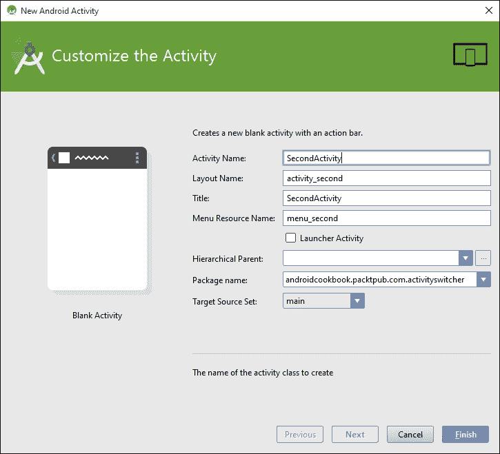

# 第一章。活动

本章涵盖了以下食谱：

+   声明活动

+   使用意图对象启动新活动

+   在活动之间切换

+   将数据传递给另一个活动

+   从活动返回结果

+   保存活动的状态

+   存储持久活动数据

+   理解活动生命周期

# 简介

Android SDK 提供了一个强大的工具来编程移动设备，掌握这样一个工具的最佳方式是直接上手。虽然您可以从头到尾阅读这本书，因为它是烹饪书，但它特别设计为允许您跳转到特定任务并立即获得结果。

**活动**是大多数 Android 应用程序的基本构建块，因为活动类提供了应用程序和屏幕之间的接口。大多数 Android 应用程序至少将有一个活动，如果不是几个（但不是必需的）。没有用户界面的后台服务应用程序不一定需要活动。

本章解释了如何在应用程序中**声明**和**启动**活动，以及如何通过在它们之间共享数据、从它们请求结果和在其中一个活动中调用另一个活动来同时管理多个活动。

本章还简要探讨了**意图**对象，该对象通常与活动一起使用。意图可以用于在您的应用程序中的活动之间以及在外部应用程序之间（例如，Android 操作系统中的应用程序）传输数据（一个常见的例子是使用意图启动默认的网络浏览器）。

### 注意事项

要开始开发 Android 应用程序，请转到**Android Studio**页面下载新的 Android Studio IDE 和**Android SDK**套件：

[`developer.android.com/sdk/index.html`](http://developer.android.com/sdk/index.html)

# 声明活动

活动和其他应用程序组件，如**服务**，在`AndroidManifest` XML 文件中声明。声明活动是告诉系统我们的活动以及如何请求它的方式。例如，应用程序通常会指示至少有一个活动应作为桌面图标可见，并作为应用程序的主要入口点。

## 准备工作

Android Studio 是用于开发 Android 应用程序的新工具，取代了现在已弃用的**Eclipse ADT**解决方案。本书中展示的所有食谱都将使用 Android Studio，因此如果您尚未安装它，请访问 Android Studio 网站（链接已在之前提供）以安装 IDE 和 SDK 套件。

## 如何做到...

对于这个第一个示例，我们将引导您创建一个新项目。Android Studio 提供了一个**快速入门**向导，这使得整个过程变得极其简单。按照以下步骤开始：

1.  启动 Android Studio，将弹出**欢迎使用 Android Studio**对话框。

1.  点击**启动新的 Android Studio 项目**选项。

1.  输入一个应用程序名称；在这个例子中，我们使用了`DeclareAnActivity`。点击**下一步**。

1.  在**添加活动到移动设备**对话框中，点击**空白活动**按钮，然后点击**下一步**。

1.  在**目标 Android 设备**对话框中，选择**Android 6.0（API 23）**作为最低 SDK（对于这个例子，您选择的 API 级别实际上并不重要，因为活动自 API 级别 1 以来就存在了，但选择最新版本被认为是最佳实践）。点击**下一步**。

1.  由于我们之前选择了**空白活动**选项，因此会显示**自定义活动**对话框。您可以将默认值保持不变，但请注意默认活动名称是`MainActivity`。点击**完成**。

在完成向导后，Android Studio 将创建项目文件。对于这个配方，我们将检查的两个文件是`MainActivity.java`（对应于第 6 步中提到的活动名称）和`AndroidManifest.xml`。

如果您查看`MainActivity.java`文件，您会意识到它相当基础。这是因为我们选择了**空白活动**选项（在第 4 步中）。现在看看`AndroidManifest.xml`文件。这是我们实际声明活动的地方。在`<application>`元素内是`<activity>`元素：

```java
<activity
    android:name=".MainActivity"
    android:label="@string/app_name">
    <intent-filter>
        <action android:name="android.intent.action.MAIN"/>

        <category android:name="android.intent.category.LAUNCHER"/>
    </intent-filter>
</activity>
```

### 注意

当在 Android Studio 中查看此`xml`时，您可能会注意到标签元素显示的是在`strings.xml`资源文件中定义的实际文本。这只是新 IDE 中增强功能的一个小例子。

## 它是如何工作的...

声明一个活动只是声明`<activity>`元素并使用`android:name`属性指定活动类的名称。通过将`<activity>`元素添加到**AndroidManifest**中，我们指定了我们的意图是将此组件包含在我们的应用程序中。任何未在清单中声明的活动（或任何其他组件）将不会包含在应用程序中。尝试访问或使用未声明的组件将在运行时抛出异常。

在前面的代码中，还有一个属性——`android:label`。此属性表示屏幕上显示的标题以及如果是启动器活动，则图标标签。

### 注意

要查看可用应用程序属性的完整列表，请参阅此资源：

[`developer.android.com/guide/topics/manifest/activity-element.html`](http://developer.android.com/guide/topics/manifest/activity-element.html)

# 使用意图对象启动新的活动

Android 应用程序模型可以看作是一个面向服务的模型，其中活动是组件，意图是它们之间发送的消息。在这里，使用意图启动一个显示用户通话记录的活动，但意图可以用于做很多事情，我们将在整本书中遇到它们。

## 准备工作

为了保持简单，我们将使用意图对象来启动 Android 的一个内置应用程序，而不是创建一个新的应用程序。这只需要一个非常基础的应用程序，因此使用 Android Studio 创建一个新的 Android 项目，并将其命名为`ActivityStarter`。

## 如何操作...

再次，为了使示例简单，以便我们可以专注于手头的任务，我们将创建一个显示意图操作的函数，并从我们的活动中的按钮调用此函数。

一旦在 Android Studio 中创建了新的项目，请按照以下步骤操作：

1.  打开`MainActivity.java`类，并添加以下函数：

    ```java
    public void launchIntent(View view) {
        Intent intent = new Intent(Intent.ACTION_VIEW);
        intent.setData(Uri.parse("https://www.packtpub.com/"));
        startActivity(intent);
    }
    ```

    当您输入此代码时，Android Studio 将在视图和意图上给出以下警告：**无法解析符号 'Intent'**。

    这意味着您需要将库引用添加到项目中。您可以通过在`import`部分输入以下代码手动完成此操作：

    ```java
    import android.view.View;

    import android.content.Intent;
    ```

    或者，只需单击（红色字体中的）文字，按*Alt* + *Enter*，让 Android Studio 为您添加库引用。

1.  打开`activity_main.xml`文件，并添加以下 XML：

    ```java
    <Button
        android:layout_width="wrap_content"
        android:layout_height="wrap_content"
        android:text="Launch Browser"
        android:id="@+id/button"
        android:layout_centerVertical="true"
        android:layout_centerHorizontal="true"
        android:onClick="launchIntent"/>
    ```

    

1.  现在是时候运行应用程序并查看意图的操作了。您需要创建一个 Android 模拟器（在 Android Studio 中，转到**工具 | Android | AVD 管理器**）或将物理设备连接到您的计算机。

1.  当您按下**启动浏览器**按钮时，您将看到默认的网页浏览器打开，并显示指定的 URL。

## 它是如何工作的...

虽然简单，但这个应用程序展示了 Android 操作系统背后的强大功能。意图对象只是一个消息对象。意图可以用来在您的应用程序组件之间（如服务和广播接收器）以及与设备上的其他应用程序（如我们在本食谱中所做的那样）进行通信。

### 注意

要在物理设备上进行测试，您可能需要安装您设备的驱动程序（驱动程序针对硬件制造商特定）。您还需要在您的设备上启用开发者模式。启用开发者模式的方式根据 Android 操作系统版本而有所不同。如果您在设备设置中看不到开发者模式选项，请打开**关于手机**选项，并开始连续点击**构建号**。点击三次后，您应该会看到一个**Toast**消息告诉您您正在成为开发者的路上。再点击四次将启用该选项。

在这个食谱中，我们通过指定`ACTION_VIEW`作为我们想要执行的操作（我们的意图）来创建了一个意图对象。您可能已经注意到，当您输入`Intent`然后按点时，Android Studio 提供了一个可能的弹出列表（这是自动完成功能），如下所示：


`ACTION_VIEW`，连同数据中的 URL，表示意图是查看网站，因此默认浏览器被启动（不同的数据可以启动不同的应用）。在这个例子中，我们的意图只是查看 URL，所以我们只使用`startActivity()`方法调用意图。根据我们的需求，还有其他调用意图的方法。在*从活动中返回结果*的配方中，我们将使用`startActivityForResult()`方法。

## 还有更多...

对于 Android 用户来说，下载他们喜欢的应用进行网页浏览、拍照、短信等是非常常见的。使用意图，你可以让你的应用利用用户喜欢的应用，而不是试图重新发明所有这些功能。

## 相关内容

要从菜单选择中启动活动，请参考第四章中的*处理菜单选择*配方。

# 在活动之间切换

经常情况下，我们可能需要在另一个活动内部激活一个活动。尽管这不是一个困难的任务，但与之前的方法相比，它需要更多的设置，因为它需要两个活动。我们将创建两个活动类，并在清单中声明它们。我们还将创建一个按钮，就像在之前的方法中做的那样，用于切换到活动。

## 准备工作

我们将在 Android Studio 中创建一个新的项目，就像之前的方法中做的那样，并将其命名为`ActivitySwitcher`。Android Studio 将创建第一个活动`ActivityMain`，并在清单中自动声明它。

## 如何实现...

1.  由于 Android Studio 新建项目向导已经创建了第一个活动，我们只需要创建第二个活动。打开**ActivitySwitcher**项目，导航到**文件** | **新建** | **活动** | **空白活动**，如图所示：

1.  在**自定义活动**对话框中，你可以保留默认的**活动名称**不变，它是`Main2Activity`，或者将其更改为`SecondActivity`，如图所示：

1.  打开`MainActivity.java`文件，并添加以下函数：

    ```java
    public void onClickSwitchActivity(View view) {
        Intent intent = new Intent(this, SecondActivity.class);
        startActivity(intent);
    }
    ```

1.  现在，打开位于`\res\layout`文件夹中的`activity_main.xml`文件，并添加以下 XML 以创建按钮：

    ```java
    <Button
        android:id="@+id/button"
        android:layout_width="wrap_content"
        android:layout_height="wrap_content"
        android:layout_centerVertical="true"
        android:layout_centerHorizontal="true"
        android:text="Launch SecondActivity"
        android:onClick="onClickSwitchActivity"/>
    ```

1.  实际上，你现在可以运行代码，看到第二个活动出现。我们将进一步添加一个按钮到`SecondActivity`中，用于关闭它，这将带我们回到第一个活动。打开`SecondActivity.java`文件，并添加以下函数：

    ```java
    public void onClickClose(View view) {
        finish();
    }
    ```

1.  最后，将**关闭**按钮添加到`SecondActivity`布局中。打开`activity_second.xml`文件，并在自动生成的`<TextView>`元素之后添加以下`<Button>`元素：

    ```java
    <Button
        android:id="@+id/buttonClose"
        android:layout_width="wrap_content"
        android:layout_height="wrap_content"
        android:text="Close"
        android:layout_centerVertical="true"
        android:layout_centerHorizontal="true"
        android:onClick="onClickClose"/>
    ```

1.  在你的设备或模拟器上运行应用程序，并查看按钮的实际效果。

## 工作原理...

这个练习的真正工作在于第 3 步中的`onClickSwitchActivity()`方法。这是我们在意图中使用`SecondActivity.class`声明第二个活动的地方。我们更进一步，在第二个活动中添加了关闭按钮，以展示一个常见的现实世界情况——启动一个新的活动，然后关闭它，并返回到原始调用活动。这种行为是在`onClickClose()`函数中实现的。它所做的只是调用`finish()`，但这告诉系统我们已经完成了活动。`finish()`实际上不会返回我们到调用活动或任何特定的活动；它只是关闭当前活动并依赖于**返回栈**。如果我们想要特定的活动，我们还可以再次使用意图对象（我们只需在创建意图时更改类名）。

这种活动切换并不构成一个令人兴奋的应用程序。我们的活动除了演示如何从一个活动切换到另一个活动之外，没有做任何事情，这当然将是几乎所有我们开发的应用程序的基本方面之一。

如果我们手动创建了活动，我们需要将它们添加到清单中。通过使用这些步骤，Android Studio 已经处理好了 XML。要查看 Android Studio 做了什么，请打开`AndroidManifest.xml`文件并查看`<application>`元素：

```java
<activity
    android:name=".MainActivity"
    android:label="@string/app_name">
    <intent-filter>
        <action android:name="android.intent.action.MAIN"/>
        <category android:name="android.intent.category.LAUNCHER/>
    </intent-filter>
</activity>
<activity
    android:name=".SecondActivity"
    android:label="@string/title_activity_second">
</activity>
```

在前面的自动生成代码中需要注意的一点是，第二个活动没有`<intent-filter>`元素。主活动通常是启动应用程序时的入口点。这就是为什么定义了`MAIN`和`LAUNCHER`——这样系统就会知道在应用程序启动时启动哪个活动。

## 相关内容

+   要了解更多关于嵌入小部件（如按钮）的信息，请访问第三章，*视图、小部件和样式*。

# 将数据传递给另一个活动

意图对象被定义为消息对象。作为一个消息对象，它的目的是与应用程序的其它组件进行通信。在这个示例中，我们将向您展示如何使用意图传递信息以及如何再次获取它。

## 准备工作

这个示例将从上一个示例结束的地方继续。我们将把这个项目命名为`SendData`。

## 如何实现...

由于这个示例是基于上一个示例构建的，大部分工作已经完成。我们将在主活动中添加一个`EditText`元素，以便我们可以向`SecondActivity`发送一些内容。我们将使用（自动生成的）`TextView`视图来显示消息。以下是完整的步骤：

1.  打开`activity_main.xml`，删除现有的`<TextView>`元素，并添加以下`<EditText>`元素：

    ```java
    <EditText
        android:id="@+id/editTextData"
        android:layout_width="match_parent"
        android:layout_height="wrap_content"/>
    ```

    我们在之前的示例中创建的`<Button>`元素没有变化。

1.  现在，打开`MainActivity.java`文件，并按照以下方式修改`onClickSwitchActivity()`方法：

    ```java
    public void onClickSwitchActivity(View view) {
        EditText editText = (EditText)findViewById(R.id.editTextData);
        String text = editText.getText().toString();
        Intent intent = new Intent(this, SecondActivity.class);
        intent.putExtra(Intent.EXTRA_TEXT,text);
        startActivity(intent);
    }
    ```

1.  接下来，打开`activity_second.xml`文件，并修改`<TextView>`元素以包含 ID 属性：

    ```java
    <TextView
        android:id="@+id/textViewText"
        android:text="@string/hello_world"
        android:layout_width="wrap_content"
        android:layout_height="wrap_content"/>
    ```

1.  最后一个更改是编辑第二个活动以查找新数据并在屏幕上显示它。打开`SecondActivity.java`并按以下方式编辑`onCreate()`：

    ```java
    protected void onCreate(Bundle savedInstanceState) {
        super.onCreate(savedInstanceState);
        setContentView(R.layout.activity_second);
        TextView textView = (TextView)findViewById(R.id.textViewText);
        if (getIntent()!=null && getIntent().hasExtra(Intent.EXTRA_TEXT)) {
            textView.setText(getIntent().getStringExtra(Intent.EXTRA_TEXT));
        }
    }
    ```

1.  现在运行项目。在主活动上输入一些文本，然后按下**启动第二个活动**以查看它发送的数据。

## 它是如何工作的...

如预期的那样，intent 对象正在做所有的工作。我们就像在先前的食谱中一样创建了一个 intent，并添加了一些额外数据。你注意到`putExtra()`方法的调用吗？在我们的例子中，我们使用了已经定义的`Intent.EXTRA_TEXT`作为标识符，但并不一定非得这样做。我们可以使用任何我们想要的键（如果你熟悉名称/值对，你之前已经见过这个概念）。

使用名称/值对的关键点是您必须使用相同的名称来获取数据。这就是为什么我们在使用`getStringExtra()`读取额外数据时使用了相同的键标识符。

第二个活动是通过我们创建的 intent 启动的，所以这只是一个获取 intent 并检查随它发送的数据的问题。我们在`onCreate()`中这样做：

```java
textView.setText(getIntent().getStringExtra(Intent.EXTRA_TEXT));
```

## 还有更多...

我们不仅限于发送`String`数据。intent 对象非常灵活，并且已经支持基本数据类型。回到 Android Studio，点击`putExtra`方法。然后按*Ctrl*和*空格键*。Android Studio 将显示自动完成列表，以便您可以看到可以存储的不同数据类型。

# 从一个活动返回结果

能够从一个活动启动另一个活动固然很好，但我们将经常需要知道被调用的活动在任务中的表现，甚至哪个活动被调用了。`startActivityForResult()`方法提供了解决方案。

## 准备工作

从一个活动返回结果与我们在前面的食谱中调用活动的方式非常相似。您可以使用上一个食谱中的项目，或者启动一个新的项目并将其命名为`GettingResults`。无论哪种方式，一旦您有一个包含两个活动和调用第二个活动所需代码的项目，您就可以开始了。

## 如何做到这一点...

只需要做几个更改就可以获取结果：

1.  首先，打开`MainActivity.java`并将以下常量添加到类中：

    ```java
    public static final String REQUEST_RESULT="REQUEST_RESULT";
    ```

1.  接下来，通过修改`onClickSwitchActivity()`方法来更改调用 intent 的方式，使其期望一个结果：

    ```java
    public void onClickSwitchActivity(View view) {
        EditText editText = (EditText)findViewById(R.id.editTextData);
        String text = editText.getText().toString();
        Intent intent = new Intent(this, SecondActivity.class);
        intent.putExtra(Intent.EXTRA_TEXT,text);
        startActivityForResult(intent,1);
    }
    ```

1.  然后，添加这个新方法来接收结果：

    ```java
    @Override
    protected void onActivityResult(int requestCode, int resultCode, Intent data) {
        super.onActivityResult(requestCode, resultCode, data);
        if (resultCode==RESULT_OK) {
            Toast.makeText(this, Integer.toString(data.getIntExtra(REQUEST_RESULT, 0)), Toast.LENGTH_LONG).show();
        }
    }
    ```

1.  最后，修改`SecondActivity.java`中的`onClickClose`以设置返回值如下：

    ```java
    public void onClickClose(View view) {
        Intent returnIntent = new Intent();
        returnIntent.putExtra(MainActivity.REQUEST_RESULT,42);
        setResult(RESULT_OK, returnIntent);
        finish();
    }
    ```

## 它是如何工作的...

如您所见，获取结果相对简单。我们只是使用`startActivityForResult`调用 intent，这样它就知道我们想要一个结果。我们设置了`onActivityResult()`回调处理程序来接收结果。最后，在关闭活动之前，我们确保第二个活动通过`setResult()`返回一个结果。在这个例子中，我们只是设置一个静态值的结果。我们只是显示我们接收到的内容来演示这个概念。

检查结果代码以确保用户没有取消操作是一个好习惯。技术上它是一个整数，但系统将其用作布尔值。检查`RESULT_OK`或`RESULT_CANCEL`并根据情况相应处理。在我们的例子中，第二个活动没有取消按钮，为什么还要检查？如果用户点击返回按钮怎么办？系统会将结果代码设置为`RESULT_CANCEL`并将 intent 设置为 null，这将导致我们的代码抛出异常。

我们使用了**Toast**对象，这是一个方便的弹出**消息**，可以用来不引人注目地通知用户。它还作为一个方便的调试方法，因为它不需要特殊的布局或屏幕空间。

## 更多...

除了结果代码外，`onActivityResult()`还包括一个**请求代码**。你在想它从哪里来吗？它只是与`startActivityForResult()`调用一起传递的整数值，其形式如下：

```java
startActivityForResult(Intent intent, int requestCode);
```

我们没有检查请求代码，因为我们知道我们只有一个结果需要处理——但在有多个活动的简单应用中，这个值可以用来识别请求的来源。

### 小贴士

如果`startActivityForResult()`使用负请求代码调用，它将表现得就像调用`startActivity()`一样——也就是说，它不会返回结果。

## 参见

+   要了解更多关于创建新活动类，请参阅*在活动之间切换*配方

+   更多关于 Toast 的信息，请参阅第七章中的*制作 Toast*配方，*警报和通知*

# 保存活动的状态

移动环境非常动态，用户比在桌面电脑上更频繁地更改任务。由于移动设备上通常资源较少，因此预期您的应用在某个时刻会被中断。系统也可能完全关闭您的应用，以向当前任务提供额外的资源。这是移动设备的本质。

用户可能在您的应用中开始输入某些内容，然后被电话打断，或者切换到另一个应用发送短信，当他们回到您的应用时，系统可能已经完全关闭它以释放内存。为了提供最佳的用户体验，您需要预料到这种行为，并让用户更容易从他们离开的地方继续。好事是，Android 操作系统通过提供回调来通知您的应用状态变化，使得这个过程变得更容易。

### 注意

简单地旋转设备将导致操作系统销毁并重新创建您的活动。这看起来可能有点过于强硬，但这是出于良好的原因——在纵向和横向布局中，非常常见，这确保了您的应用正在使用正确的资源。

在这个菜谱中，您将看到如何处理`onSaveInstanceState()`和`onRestoreInstanceState()`回调来保存应用程序的状态。我们将通过创建一个计数器变量并在每次按下**计数**按钮时增加它来演示这一点。我们还将有一个`EditText`和`TextView`小部件来观察它们的默认行为。

## 准备工作

在 Android Studio 中创建一个新的项目，并将其命名为`StateSaver`。我们只需要一个活动，因此自动生成的 MainActivity 就足够了。然而，我们需要一些小部件，包括`EditText`、`Button`和`TextView`。它们的布局（在`activity_main.xml`中）将如下所示：

```java
<EditText
    android:id="@+id/editText"
    android:layout_width="match_parent"
    android:layout_height="wrap_content"
    android:layout_alignParentTop="true"
    android:layout_alignParentStart="true"/>

<Button
    android:id="@+id/button"
    android:layout_width="wrap_content"
    android:layout_height="wrap_content"
    android:layout_centerInParent="true"
    android:text="Count"
    android:onClick="onClickCounter"/>

<TextView
    android:id="@+id/textViewCounter"
    android:layout_width="wrap_content"
    android:layout_height="wrap_content"
    android:layout_below="@id/button"/>
```

## 如何做到这一点...

执行以下步骤：

1.  为了跟踪计数器，我们需要在项目中添加一个全局变量，以及一个用于保存和恢复的键。将以下代码添加到`MainActivity.java`类中：

    ```java
    static final String KEY_COUNTER = "COUNTER";
    private int mCounter=0;
    ```

1.  然后添加处理按钮点击的代码；它增加计数器并在`TextView`小部件中显示结果：

    ```java
    public void onClickCounter(View view) {
        mCounter++;
        ((TextView)findViewById(R.id.textViewCounter)).setText("Counter: " + Integer.toString(mCounter));
    }
    ```

1.  要接收应用程序状态变化的通知，我们需要将`onSaveInstanceState()`和`onRestoreInstanceState()`方法添加到我们的应用程序中。打开`MainActivity.java`并添加以下代码：

    ```java
    @Override
    protected void onSaveInstanceState(Bundle outState) {
        super.onSaveInstanceState(outState);
        outState.putInt(KEY_COUNTER,mCounter);
    }

    @Override
    protected void onRestoreInstanceState(Bundle savedInstanceState) {
        super.onRestoreInstanceState(savedInstanceState);
        mCounter=savedInstanceState.getInt(KEY_COUNTER);
    }
    ```

1.  运行程序并尝试更改方向以查看其行为（如果您使用的是模拟器，*Ctrl* + *F11* 将旋转设备）。

## 它是如何工作的...

所有活动在其生命周期中都会经历多个状态。通过设置回调来处理事件，我们可以在活动被销毁之前保存重要信息。

第 3 步是实际保存和恢复发生的地方。系统向方法发送一个**Bundle**（一个也使用名称/值对的 数据对象）。我们使用`onSaveInstanceState()`回调来保存数据，并在`onRestoreInstanceState()`回调中提取它。

但是等等！您在旋转设备之前尝试在`EditText`视图中输入文本了吗？如果是这样，您会注意到文本也被恢复了，但我们没有处理该视图的代码。默认情况下，如果系统具有唯一的 ID（并非所有视图都会自动保存其状态，例如`TextView`，但如果我们想，我们可以手动保存它），系统将自动保存状态。

### 小贴士

注意，如果您想让 Android 自动保存和恢复视图的状态，该视图必须具有唯一的 ID（在布局中通过`android:id=`属性指定）。小心；并非所有视图类型都会自动保存和恢复视图的状态。

## 还有更多...

`onRestoreInstanceState()`回调不是唯一可以恢复状态的地方。看看`onCreate()`的签名：

```java
onCreate(Bundle savedInstanceState)

```

这两种方法都接收同一个名为`savedInstanceState`的`Bundle`实例。您可以将恢复代码移动到`onCreate()`方法，它将按相同的方式工作。但有一个陷阱是，如果没有数据，例如在活动的初始创建期间，`savedInstanceState`包将是 null。如果您想从`onRestoreInstanceState()`回调中移动代码，只需确保数据不为 null，如下所示：

```java
if (savedInstanceState!=null) {
    mCounter = savedInstanceState.getInt(KEY_COUNTER);
}
```

## 参见

+   *存储持久活动数据*菜谱将介绍持久存储。

+   请参阅第六章，*处理数据*，以获取更多关于 Android 活动的示例。

+   *理解活动生命周期*菜谱解释了 Android 活动生命周期。

# 存储持久活动数据

能够暂时存储有关我们活动的信息非常有用，但更常见的情况是我们希望我们的应用程序能够在多个会话之间记住信息。

Android 支持 SQLite，但对于像用户名或高分这样的简单数据，这可能会带来很多开销。幸运的是，Android 还提供了这些场景的轻量级选项，即`SharedPreferences`。

## 准备工作

您可以使用之前菜谱中的项目，或者开始一个新的项目并将其命名为`PersistentData`（在现实世界的应用中，您可能无论如何都会这样做）。在之前的菜谱中，我们在会话状态中保存了`mCounter`。在这个菜谱中，我们将添加一个新的方法来处理`onPause()`并将`mCounter`保存到`SharedPreferences`中。我们将在`onCreate()`中恢复该值。

## 如何做到这一点...

我们只需要做两个更改，而且这两个更改都在`MainActivity.java`中：

1.  在活动关闭前，添加以下`onPause()`方法以保存数据：

    ```java
    @Override
    protected void onPause() {
        super.onPause();

        SharedPreferences settings = getPreferences(MODE_PRIVATE);
        SharedPreferences.Editor editor = settings.edit();
        editor.putInt(KEY_COUNTER, mCounter);
        editor.commit();
    }
    ```

1.  然后在`onCreate()`的末尾添加以下代码以恢复计数器：

    ```java
    SharedPreferences settings = getPreferences(MODE_PRIVATE);

    int defaultCounter = 0;
    mCounter = settings.getInt(KEY_COUNTER, defaultCounter);
    ```

1.  运行程序并尝试它。

## 它是如何工作的...

如您所见，这与保存状态数据非常相似，因为它也使用名称/值对。在这里，我们只存储了一个`int`，但我们同样可以轻松地存储其他原始数据类型之一。每种数据类型都有等效的获取器和设置器，例如`SharedPreferences.getBoolean()`或`SharedPreferences.setString()`。

保存我们的数据需要使用`SharedPreferences.Editor`服务。这可以通过`edit()`方法调用，并接受`remove()`和`clear()`等过程以及`putInt()`等设置器。请注意，我们必须使用`commit()`语句来结束我们在这里所做的任何存储。

## 还有更多...

`getPreferences()`访问器的稍微复杂一些的变体是`getSharedPreferences()`。它可以用来存储多个首选项集。

### 使用多个首选项文件

使用`getSharedPreferences()`与使用其对应物没有区别，但它允许使用多个首选项文件。它具有以下形式：

```java
getSharedPreferences(String name, int mode)
```

在这里，`name` 是文件名。`mode` 可以是 `MODE_PRIVATE`、`MODE_WORLD_READABLE` 或 `MODE_WORLD_WRITABLE`，它描述了文件的可访问级别。

## 参见

+   第六章，*处理数据*，了解更多关于数据存储的示例

# 理解活动生命周期

Android 操作系统对活动来说是一个危险的地方。在电池供电平台上对资源的需求被系统管理得相当残酷。我们的活动可以在运行时被从内存中移除，甚至没有一点通知，以及它们包含的任何数据。因此，理解活动生命周期是至关重要的。

以下图表显示了活动在其生命周期中经过的阶段：


除了阶段之外，图表还显示了可以覆盖的方法。正如你所见，我们已经在先前的菜谱中使用了这些方法中的大多数。希望了解整体情况能帮助你理解。

## 准备工作

在 Android Studio 中创建一个新的项目，并使用一个 **空白活动**，命名为 `ActivityLifecycle`。我们将使用（自动生成的）`TextView` 方法来显示状态信息。

## 如何做到这一点...

为了看到应用程序通过各个阶段，我们将为所有阶段创建方法：

1.  打开 `activity_main.xml` 并为自动生成的 `TextView` 添加一个 ID：

    ```java
    android:id="@+id/textViewState"
    ```

1.  剩余的步骤将在 `MainActivity.java` 中进行。添加以下全局声明：

    ```java
    private TextView mTextViewState;
    ```

1.  修改 `onCreate()` 方法以保存 `TextView` 并设置初始文本：

    ```java
    mTextViewState = (TextView)findViewById(R.id.textViewState);
    mTextViewState.setText("onCreate()\n");
    ```

1.  添加以下方法来处理剩余的事件：

    ```java
    @Override
    protected void onStart() {
        super.onStart();
        mTextViewState.append("onStart()\n");
    }

    @Override
    protected void onResume() {
        super.onResume();
        mTextViewState.append("onResume()\n");
    }

    @Override
    protected void onPause() {
        super.onPause();
        mTextViewState.append("onPause()\n");
    }

    @Override
    protected void onStop() {
        super.onStop();
        mTextViewState.append("onStop()\n");
    }

    @Override
    protected void onRestart() {
        super.onRestart();
        mTextViewState.append("onRestart()\n");
    }

    @Override
    protected void onDestroy() {
        super.onDestroy();
        mTextViewState.append("onDestroy()\n");
    }
    ```

1.  运行应用程序并观察当通过按下返回键和主页键中断活动时会发生什么。尝试其他操作，例如任务切换，以查看它们如何影响您的应用程序。

## 它是如何工作的...

我们的活动可以处于以下三种状态之一：**active**、**paused** 或 **stopped**。还有一个第四种状态，**destroyed**，但我们可以安全地忽略它：

+   当活动的界面对用户可用时，活动处于 `active` 状态。它从 `onResume()` 开始持续到 `onPause()`，这是当另一个活动进入前台时发生的。如果这个新活动并没有完全遮挡我们的活动，那么我们的活动将保持在 `paused` 状态，直到新活动完成或被取消。然后它将立即调用 `onResume()` 并继续。

+   当一个新启动的活动填满屏幕或使我们的活动不可见时，我们的活动将进入 `stopped` 状态，并且恢复将始终调用 `onRestart()`。

+   当活动处于 `paused` 或 `stopped` 状态时，操作系统可以在内存低或其他应用程序需要时将其从内存中移除。

+   值得注意的是，我们实际上从未看到 `onDestroy()` 方法的执行结果，因为到这时活动已经被移除。如果您想进一步探索这些方法，那么使用 `Activity.isFinishing()` 来查看在 `onDestroy()` 执行之前活动是否真的正在结束是非常有价值的，如下面的代码片段所示：

    ```java
    @Override
      public void onPause() {
      super.onPause();
      mTextView.append("onPause()\n ");
      if (isFinishing()){
        mTextView.append(" ... finishing");
      }
    }
    ```

### 小贴士

在实现这些方法时，始终在执行任何工作之前调用超类。

## 还有更多...

### 关闭活动

要关闭一个活动，直接调用其 `finish()` 方法，该方法会进一步调用 `onDestroy()`。要从子活动中执行相同操作，请使用 `finishFromChild(Activity child)`，其中 `child` 是调用子活动。

有时了解活动是被关闭还是仅仅暂停是有用的，`isFinishing(boolean)` 方法返回一个值，指示活动处于这两种状态中的哪一种。
