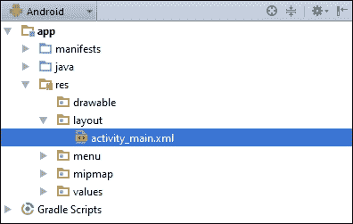
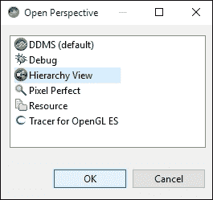
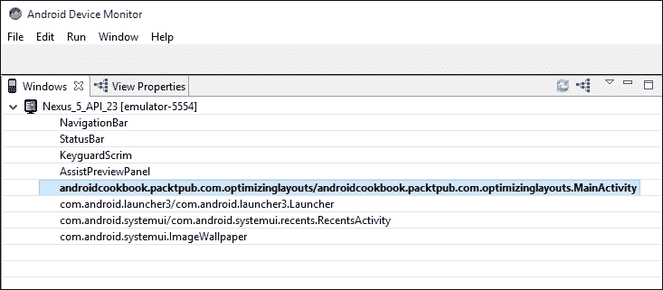
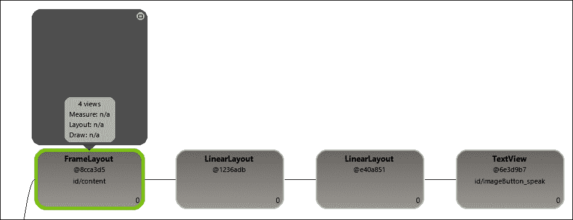
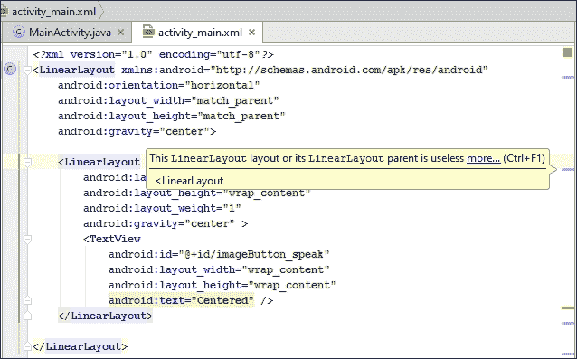

# 第二章. 布局

在本章中，我们将涵盖以下主题：

+   定义和填充布局

+   使用 RelativeLayout

+   使用 LinearLayout

+   创建表格 – TableLayout 和 GridLayout

+   使用 ListView、GridView 和适配器

+   在运行时更改布局属性

+   使用 Hierarchy Viewer 优化布局

# 简介

在 Android 中，用户界面是在**布局**中定义的。布局可以在 XML 中声明或在代码中动态创建。（建议在 XML 中声明布局，而不是在代码中，以保持表示层与实现层的分离。）布局可以定义单个`ListItem`、片段，甚至整个 Activity。布局文件存储在`/res/layout`文件夹中，并在代码中使用以下标识符引用：`R.layout.<filename_without_extension>`。

Android 提供了一系列有用的`Layout`类，它们包含和组织活动（如按钮、复选框和其他`Views`）的各个元素。`ViewGroup`对象是一个容器对象，作为 Android 家族`Layout`类的基类。放置在布局中的视图形成一个层次结构，最顶层的布局是父布局。

Android 提供了一些内置的布局类型，专为特定目的设计，例如`RelativeLayout`，它允许视图相对于其他元素进行定位。`LinearLayout`可以根据指定的方向堆叠视图或使它们水平对齐。`TableLayout`可用于布局视图网格。在各种布局中，我们还可以使用`Gravity`来对齐视图，并使用`Weight`控制提供比例大小。布局和`ViewGroups`可以嵌套在彼此内部以创建复杂的配置。提供了十几种不同的布局对象来管理小部件、列表、表格、画廊和其他显示格式，并且您始终可以从基类派生来自定义布局。

# 定义和填充布局

当使用 Android Studio 向导创建新项目时，它会自动创建`res/layout/activity_main.xml`文件（如下截图所示）。然后，在`onCreate()`回调中使用`setContentView(R.layout.activity_main)`来填充 XML 文件。



对于这个菜谱，我们将创建两个略有不同的布局，并通过按钮在它们之间切换。

## 准备工作

在 Android Studio 中创建一个新的项目，命名为`InflateLayout`。项目创建完成后，展开`res/layout`文件夹，以便我们可以编辑`activity_main.xml`文件。

## 如何操作...

1.  编辑`res/layout/activity_main.xml`文件，使其包含如下定义的按钮：

    ```java
    <Button
        android:id="@+id/buttonLeft"
        android:layout_width="wrap_content"
        android:layout_height="wrap_content"
        android:text="Left Button"
        android:layout_centerVertical="true"
        android:layout_alignParentLeft="true"
        android:onClick="onClickLeft"/>
    ```

1.  现在复制`activity_main.xml`并命名为`activity_main2.xml`。修改按钮以匹配以下内容：

    ```java
    <Button
        android:id="@+id/buttonRight"
        android:layout_width="wrap_content"
        android:layout_height="wrap_content"
        android:text="Right Button"
        android:layout_centerVertical="true"
        android:layout_alignParentRight="true"
        android:onClick="onClickRight"/>
    ```

1.  打开`MainActivity.java`，添加以下两个方法来处理按钮点击：

    ```java
    public void onClickLeft(View view) {
        setContentView(R.layout.activity_main2);
    }

    public void onClickRight(View view) {
        setContentView(R.layout.activity_main);
    }
    ```

1.  在设备或模拟器上运行此应用程序，以查看其效果。

## 它是如何工作的...

关键在于对`setContentView()`的调用，我们之前在自动生成的`onCreate()`代码中遇到过。只需将布局 ID 传递给`setContentView()`，它就会自动展开布局。

这段代码的目的是使概念易于理解，但仅用于更改按钮（在本例中，我们可以在按钮点击时更改对齐方式）的属性时可能会过度。展开布局通常在`onCreate()`方法中只需要一次，但有时您可能希望手动展开布局，就像我们在这里所做的那样。（如果您手动处理方向变化，这将是一个很好的例子。）

## 更多内容...

除了使用资源 ID 标识布局，如我们在这里所做的那样，`setContentView()`还可以接受一个视图作为参数，例如：

```java
findViewById(R.id.myView)
setContentView(myView);
```

## 参见

+   如前所述，请参阅*Fragment*主题，在第五章，*探索 Fragment、AppWidget 和系统 UI*，了解更改屏幕布局的替代方法

# 使用 RelativeLayout

如*简介*中所述，`RelativeLayout`允许视图相对于彼此和父视图进行定位。`RelativeLayout`特别适用于减少嵌套布局的数量，这对于减少内存和处理需求非常重要。

## 准备工作

创建一个新的项目，并将其命名为`RelativeLayout`。默认布局使用`RelativeLayout`，我们将使用它来水平和垂直对齐视图。

## 如何实现...

1.  打开`res/layout/activity_main.xml`文件并按以下方式修改：

    ```java
    <TextView
        android:id="@+id/textView1"
        android:layout_width="wrap_content"
        android:layout_height="wrap_content"
        android:text="Centered"
        android:layout_centerVertical="true"
        android:layout_centerHorizontal="true" />
    <TextView
        android:id="@+id/textView2"
        android:layout_width="wrap_content"
        android:layout_height="wrap_content"
        android:text="Below TextView1"
        android:layout_below="@+id/textView1"
        android:layout_toLeftOf="@id/textView1" />
    <TextView
        android:id="@+id/textView3"
        android:layout_width="wrap_content"
        android:layout_height="wrap_content"
        android:text="Bottom Right"
        android:layout_alignParentBottom="true"
        android:layout_alignParentEnd="true" />
    ```

1.  运行代码，或在**设计**选项卡中查看布局

## 它是如何工作的...

这是一个非常简单的练习，但它演示了几个`RelativeLayout`选项：`layout_centerVertical`、`layout_centerHorizontal`、`layout_below`、`layout_alignParentBottom`等等。

最常用的`RelativeLayout`布局属性包括：

+   `layout_below`: 此视图应在指定的视图之下

+   `layout_above`: 此视图应在指定的视图之上

+   `layout_alignParentTop`: 将此视图与父视图的顶部边缘对齐

+   `layout_alignParentBottom`: 将此视图与父视图的底部边缘对齐

+   `layout_alignParentLeft`: 将此视图与父视图的左侧边缘对齐

+   `layout_alignParentRight`: 将此视图与父视图的右侧边缘对齐

+   `layout_centerVertical`: 在父视图中垂直居中此视图

+   `layout_centerHorizontal`: 在父视图中水平居中此视图

+   `layout_center`: 在父视图中水平和垂直居中此视图

    ### 注意

    要查看`RelativeLayout`参数的完整列表，请访问：[`developer.android.com/reference/android/widget/RelativeLayout.LayoutParams.html`](http://developer.android.com/reference/android/widget/RelativeLayout.LayoutParams.html)。

## 更多内容...

与我们之前看到的不同，这里是一个使用 `LinearLayout` 仅用于居中 `TextView` 的例子（创建与 `RelativeLayout` 的 `layout_center` 参数相同的效果）：

```java
<?xml version="1.0" encoding="utf-8"?>
<LinearLayout 
    android:orientation="horizontal"
    android:layout_width="match_parent"
    android:layout_height="match_parent"
    android:gravity="center">
    <LinearLayout
        android:layout_width="0dp"
        android:layout_height="wrap_content"
        android:layout_weight="1"
        android:gravity="center" >
        <TextView
            android:id="@+id/imageButton_speak"
            android:layout_width="wrap_content"
            android:layout_height="wrap_content"
            android:text="Centered" />
    </LinearLayout>
</LinearLayout>
```

注意这个布局比等效的 `RelativeLayout`（它是一个嵌套在父 `LinearLayout` 中的 `LinearLayout`）深一级。虽然这是一个简单的例子，但避免不必要的嵌套是一个好主意，因为它可能会影响性能，尤其是在布局被反复填充时（例如 `ListItem`）。

## 参见

+   下一个菜谱，*使用 LinearLayout*，它将提供一个替代布局

+   查看关于高效布局设计的 *使用 Hierarchy Viewer 优化布局* 菜谱以获取更多信息

# 使用 LinearLayout

另一个常见的布局选项是 `LinearLayout`，它根据指定的方向排列子视图，可以是单列或单行。默认方向（如果没有指定）是垂直的，它将视图对齐在单列中。

`LinearLayout` 有一个 `RelativeLayout` 中没有的关键特性——`weight` 属性。我们可以在定义视图时指定 `layout_weight` 参数，以便视图可以根据可用空间动态调整大小。选项包括让视图填充所有剩余空间（如果视图具有更高的权重），让多个视图适应给定空间（如果所有视图都具有相同的权重），或者按权重成比例地分配视图空间。

我们将创建一个包含三个 `EditText` 视图的 `LinearLayout` 来演示如何使用权重属性。在这个例子中，我们将使用三个 `EditText` 视图——一个用于输入 `To Address` 参数，另一个用于输入 `Subject`，第三个用于输入 `Message`。`To` 和 `Subject` 视图将各占一行，剩余空间留给 `Message` 视图。

## 准备工作

创建一个新的项目，并将其命名为 `LinearLayout`。我们将用 `LinearLayout` 替换 `activity_main.xml` 中创建的默认 `RelativeLayout`。

## 如何操作...

1.  打开 `res/layout/activity_main.xml` 文件，并按以下方式替换：

    ```java
    <LinearLayout 
        android:orientation="vertical"
        android:layout_width="match_parent"
        android:layout_height="match_parent">
        <EditText
            android:id="@+id/editTextTo"
            android:layout_width="match_parent"
            android:layout_height="wrap_content"
            android:hint="To" />
        <EditText
            android:id="@+id/editTextSubject"
            android:layout_width="match_parent"
            android:layout_height="wrap_content"
            android:hint="Subject" />
        <EditText
            android:id="@+id/editTextMessage"
            android:layout_width="match_parent"
            android:layout_height="0dp"
            android:layout_weight="1"
            android:gravity="top"
            android:hint="Message" />
    </LinearLayout>
    ```

1.  运行代码，或在 **设计** 选项卡中查看布局。

## 它是如何工作的...

当使用 `LinearLayout` 的垂直方向时，子视图将在单列中创建（堆叠在彼此之上）。前两个视图使用 `android:layout_height="wrap_content"` 属性，每个视图占一行。`editTextMessage` 使用以下方式指定高度：

```java
android:layout_height="0dp"
android:layout_weight="1"
```

当使用 `LinearLayout` 时，它告诉 Android 根据权重计算高度。权重为 0（如果没有指定则为默认值）表示视图不应扩展。在这个例子中，`editTextMessage` 是唯一一个定义了权重的视图，因此它将独自扩展以填充父布局中的任何剩余空间。

### 小贴士

当使用水平方向时，指定 `android:layout_height="0dp"`（连同权重）以让 Android 计算宽度。

将权重属性视为百分比可能会有所帮助。在这种情况下，定义的总权重是 1，因此此视图获得剩余空间的 100%。如果我们给另一个视图分配权重 1，总数将是 2，因此此视图将获得 50%的空间。尝试给其他视图之一添加权重（同时确保将高度更改为`0dp`）以查看其效果。

如果你给其他视图（或两个视图）之一（或两个）添加了权重，你是否注意到了文本的位置？如果没有指定`gravity`的值，文本就会保持在视图空间中心。`editTextMessage`指定了：`android:gravity="top"`，这会强制文本位于视图的顶部。

## 更多内容...

可以使用位运算符`OR`组合多个属性选项。（Java 使用管道字符（|）表示`OR`）。例如，我们可以组合两个重力选项，使文本既沿父视图的顶部对齐，又在其可用空间内居中：

```java
android:layout_gravity="top|center"
```

应该注意的是，`layout_gravity`和`gravity`标签不是同一回事。`layout_gravity`决定了视图在其父视图中的位置，而`gravity`控制视图内内容的定位——例如，按钮上文本的对齐方式。

## 参见

+   之前的菜谱，*使用 RelativeLayout*

# 创建表格 – TableLayout 和 GridLayout

当你需要在你的 UI 中创建表格时，Android 提供了两个方便的布局选项：`TableLayout`（以及`TableRow`）和`GridLayout`（在 API 14 中添加）。这两个布局选项都可以创建类似外观的表格，但每个都使用不同的方法。使用`TableLayout`时，随着你构建表格，行和列会动态添加。使用`GridLayout`时，行和列的大小在布局定义中定义。

两个布局都没有更好，这只是使用最适合你需求的布局。我们将使用每个布局创建一个 3 x 3 的网格以进行比较，因为你可能会很容易地在同一个应用程序中使用这两个布局。

## 准备工作

为了专注于布局并提供更简单的比较，我们将为这个菜谱创建两个独立的应用程序。创建两个新的 Android 项目，第一个命名为`TableLayout`，另一个命名为`GridLayout`。

## 如何操作...

1.  从`TableLayout`项目开始，打开**activity_main.xml**。将根布局更改为`TableLayout`。

1.  向每个`TableRow`添加三个`TextViews`的集合，以创建一个 3 x 3 的矩阵。为了演示目的，列被标记为 A-C，行标记为 1-3，因此`TextViews`的第一行将是 A1、B1 和 C1。最终结果将如下所示：

    ```java
    <TableLayout

        android:layout_width="match_parent"
        android:layout_height="match_parent">
        <TableRow
            android:layout_width="match_parent"
            android:layout_height="match_parent">
            <TextView
                android:layout_width="wrap_content"
                android:layout_height="wrap_content"
                android:text="A1"
                android:id="@+id/textView1" />
            <TextView
                android:layout_width="wrap_content"
                android:layout_height="wrap_content"
                android:text="B1"
                android:id="@+id/textView2" />
            <TextView
                android:layout_width="wrap_content"
                android:layout_height="wrap_content"
                android:text="C1"
                android:id="@+id/textView3" />
        </TableRow>
        <TableRow
            android:layout_width="match_parent"
            android:layout_height="match_parent">
            <TextView
                android:layout_width="wrap_content"
                android:layout_height="wrap_content"
                android:text="A2"
                android:id="@+id/textView4" />
            <TextView
                android:layout_width="wrap_content"
                android:layout_height="wrap_content"
                android:text="B2"
                android:id="@+id/textView5" />
            <TextView
                android:layout_width="wrap_content"
                android:layout_height="wrap_content"
                android:text="C2"
                android:id="@+id/textView6" />
        </TableRow>
        <TableRow
            android:layout_width="match_parent"
            android:layout_height="match_parent">
            <TextView
                android:layout_width="wrap_content"
                android:layout_height="wrap_content"
                android:text="A3"
                android:id="@+id/textView7" />
            <TextView
                android:layout_width="wrap_content"
                android:layout_height="wrap_content"
                android:text="B3"
                android:id="@+id/textView8" />
            <TextView
                android:layout_width="wrap_content"
                android:layout_height="wrap_content"
                android:text="C3"
                android:id="@+id/textView9" />
        </TableRow>
    </TableLayout>
    ```

1.  现在，打开`GridLayout`项目以编辑`activity_main.xml`。将根布局更改为`GridLayout`。向`GridLayout`元素添加`columnCount=3`和`rowCount=3`属性。

1.  现在，向 `GridLayout` 添加九个 `TextViews`。我们将使用与前面 `TableLayout` 相同的文本，以便进行一致的比较。由于 `GridView` 不使用 `TableRows`，前三个 `TextViews` 在第 1 行，接下来的三个在第 2 行，依此类推。最终结果将如下所示：

    ```java
    <GridLayout

        android:layout_width="match_parent"
        android:layout_height="match_parent"
        android:columnCount="3"
        android:rowCount="3">
        <TextView
            android:layout_width="wrap_content"
            android:layout_height="wrap_content"
            android:text="A1"
            android:id="@+id/textView1" />
        <TextView
            android:layout_width="wrap_content"
            android:layout_height="wrap_content"
            android:text="B1"
            android:id="@+id/textView2" />
        <TextView
            android:layout_width="wrap_content"
            android:layout_height="wrap_content"
            android:text="C1"
            android:id="@+id/textView3" />
        <TextView
            android:layout_width="wrap_content"
            android:layout_height="wrap_content"
            android:text="A2"
            android:id="@+id/textView4" />
        <TextView
            android:layout_width="wrap_content"
            android:layout_height="wrap_content"
            android:text="B2"
            android:id="@+id/textView5" />
        <TextView
            android:layout_width="wrap_content"
            android:layout_height="wrap_content"
            android:text="C2"
            android:id="@+id/textView6" />
        <TextView
            android:layout_width="wrap_content"
            android:layout_height="wrap_content"
            android:text="A3"
            android:id="@+id/textView7" />
        <TextView
            android:layout_width="wrap_content"
            android:layout_height="wrap_content"
            android:text="B3"
            android:id="@+id/textView8" />
        <TextView
            android:layout_width="wrap_content"
            android:layout_height="wrap_content"
            android:text="C3"
            android:id="@+id/textView9" />
    </GridLayout>
    ```

1.  您可以选择运行应用程序或使用 **设计** 选项卡来查看结果。

## 它是如何工作的...

如您在查看创建的表格时所见，表格在屏幕上基本上看起来相同。主要区别是创建它们的代码。

在 `TableLayout` XML 中，每行都是通过 `TableRow` 添加到表格中的。每个视图成为一个列。这不是一个要求，因为可以跳过单元格或将其留空。（参见下一节中如何指定 `TableRow` 中的单元格位置。）

`GridLayout` 使用相反的方法。在创建表格时指定行数和列数。我们不需要指定行或列信息（尽管我们可以，如下文所述）。Android 会自动按顺序将每个视图添加到单元格中。

## 更多...

首先，让我们看看布局之间的更多相似之处。两种布局都有拉伸列以使用剩余屏幕空间的能力。对于 `TableLayout`，在 xml 声明中添加以下属性：

```java
android:stretchColumns="1"
```

`stretchColumns` 指定要拉伸的列的（基于零的）索引。 (`android:shrinkColumns` 是可以收缩的列的基于零的索引，因此表格可以适应屏幕。)

要使用 `GridLayout` 实现相同的效果，请将以下属性添加到 B 列中所有视图（`textView2`、`textView5` 和 `textView8`）：

```java
android:layout_columnWeight="1"
```

### 注意

给定列中的所有单元格都必须定义权重，否则它将不会拉伸。

现在，让我们看看一些差异，因为这确实是确定针对特定任务使用哪种布局的关键。首先要注意的是列和行是如何实际定义的。在 `TableLayout` 中，行是具体定义的，使用 `TableRow`。 (Android 将根据具有最多单元格的行来确定表格中的列数。)在定义视图时使用 `android:layoutColumn` 属性来指定列。

相比之下，使用 `GridLayout`，行和列的数量是在定义表格时指定的（使用前面显示的 `columnCount` 和 `rowCount`。）

在前面的示例中，我们只是将 `TextViews` 添加到 `GridLayout` 中，并让系统自动定位它们。我们可以通过在定义视图时指定行和列位置来改变这种行为，例如：

```java
android:layout_row="2"
android:layout_column="2"
```

### 提示

Android 在添加每个视图后自动增加单元格计数器，因此 *下一个* 视图也应该指定行和列，否则您可能不会得到预期的结果。

如同 *LinearLayout* 菜单中显示的 `LinearLayout`，`GridLayout` 也提供了支持水平（默认）和垂直（vertical）方向的属性。方向决定了单元格的放置方式。（水平方向首先填充列，然后移动到下一行。垂直方向首先填充每行的第一列，然后移动到下一列。）

# 使用 ListView、GridView 和适配器

`ListView` 和 `GridView` 都是 `ViewGroup` 的子类，但它们更像是视图，因为它们是数据驱动的。换句话说，我们不是在设计时定义所有可能填充 `ListView`（或 `GridView`）的视图，而是从传递给视图的数据动态创建内容。（`ListItem` 的布局可能在设计时创建，以控制运行时数据的显示。）

例如，如果你需要向用户展示国家列表，你可以创建一个 `LinearLayout` 并为每个国家添加一个按钮。这种方法有几个问题：确定可用的国家，保持按钮列表的更新，确保屏幕空间足够容纳所有国家，等等。否则，你可以创建一个国家列表来填充 `ListView`，然后为每个条目创建一个按钮。

我们将创建一个示例，使用第二种方法，从国家名称数组中填充 `ListView`。

## 准备工作

在 Android Studio 中创建一个新的项目，并将其命名为 `ListView`。默认的 `ActivityMain` 类扩展了 `Activity` 类。我们将将其更改为扩展 `ListActivity` 类。然后我们将创建一个简单的字符串列表并将其绑定到 `ListView`，以在运行时派生按钮。

## 如何做到这一点...

1.  打开 **MainActivity.java** 文件，并更改基本声明，使其扩展 `ListActivity` 而不是 `Activity` 类：

    ```java
    public class MainActivity extends ListActivity {
    ```

1.  将 `onCreate()` 改变为以下内容：

    ```java
    protected void onCreate(Bundle savedInstanceState) {
      super.onCreate(savedInstanceState);
      String[] countries = new String[]{"China", "France", "Germany", "India", "Russia", "United Kingdom", "United States"};

      ListAdapter countryAdapter = new ArrayAdapter<String>(this, android.R.layout.simple_list_item_1, countries);
      setListAdapter(countryAdapter);

        getListView().setOnItemClickListener(new AdapterView.OnItemClickListener() {
            @Override
            public void onItemClick(AdapterView<?> parent, Viewview, int position, long id) {
                String s = ((TextView) view).getText() + " " +position;
                Toast.makeText(getApplicationContext(), s, 
                    Toast.LENGTH_SHORT).show();
            }
        });
    }
    ```

1.  现在在模拟器或设备上运行应用程序，以查看填充的 `ListView`。

## 它是如何工作的...

我们首先创建一个简单的国家名称数组，然后使用它来填充 `ListAdapter`。在这个例子中，我们在构建 `ListAdapter` 时使用了 `ArrayAdapter`，但 Android 还提供了其他几种适配器类型。例如，如果你的数据存储在数据库中，你可以使用 `CursorAdapter`。如果内置类型不能满足你的需求，你总是可以使用 `CustomAdapter`。

我们使用以下代码创建适配器：

```java
ListAdapter countryAdapter = new ArrayAdapter<String>(this, android.R.layout.simple_list_item_1, countries);
```

在这里，我们使用我们的字符串数组（最后一个参数）实例化 `ArrayAdapter`。注意 `android.R.layout.simple_list_item_1` 参数吗？这定义了按钮的布局。在这里，我们使用 Android 提供的布局之一，但我们可以创建自己的布局并传递我们的 ID。

一旦我们准备好了适配器，我们只需通过`setListAdapter()`调用将其传递给底层的`ListView`。（底层的`ListView`来自扩展`ListViewActivity`。）最后，我们实现`setOnItemClickListener`以在用户按下列表中的按钮（代表一个国家）时显示 Toast。

`ListView`在 Android 中非常常见，因为它们通过滚动视图有效地利用屏幕空间，这在小屏幕上非常有用。`ScrollView`布局提供了一个创建类似滚动效果的替代方法。这两种方法的主要区别在于，`ScrollView`布局在显示给用户之前完全填充，而`ListView`只填充将可见的视图。对于有限的数据，这可能不是问题，但对于更大的数据集，应用在列表显示之前可能会耗尽内存。

此外，由于`ListView`是由数据适配器驱动的，数据可以轻松更改。即使在我们的有限示例中，将一个新国家添加到屏幕上也只需将名称添加到国家列表中。更重要的是，列表可以在用户使用应用时更新（例如，从网站下载更新列表以显示实时选项）。

## 还有更多...

`ListView`还支持使用`setChoiceMode()`方法的多选模式。要看到它的实际效果，请在`setListAdapter()`之后添加以下代码行：

```java
getListView().setChoiceMode(ListView.CHOICE_MODE_MULTIPLE);
```

然后，将`ListItem`布局从`android.R.layout.simple_list_item_1`更改为`android.R.layout.simple_list_item_checked`。

虽然大多数需要滚动列表的应用都转向使用`ListView`，但 Android 还提供了`GridView`。它们在功能上非常相似，甚至使用相同的数据适配器。主要区别是视觉上的，允许多列。为了更好地理解，让我们将`ListView`示例更改为`GridView`。

首先，我们需要将`MainActivity`改为从`Activity`扩展，而不是`ListActivity`。（这将撤销前面的步骤 1。）然后，用以下代码替换`onCreate()`：

```java
protected void onCreate(Bundle savedInstanceState) {
    super.onCreate(savedInstanceState);
    GridView gridView = new GridView(this);
    setContentView(gridView);
    String[] countries = new String[]{"China", "France", "Germany", "India", "Russia", "United Kingdom", "United States"};
    ListAdapter countryAdapter = new ArrayAdapter<String>(this, android.R.layout.simple_list_item_1, countries);
    gridView.setAdapter(countryAdapter);
    gridView.setNumColumns(2);
    gridView.setOnItemClickListener(new AdapterView.OnItemClickListener() {
        @Override
        public void onItemClick(AdapterView<?> parent, View view, int position, long id) {
                String s = ((TextView) view).getText() + " " + position;
            Toast.makeText(getApplicationContext(), s, Toast.LENGTH_SHORT).show();
        }
    });
}
```

如您所见，为`GridView`设置的代码比`ListView`多。`onCreate()`方法创建一个新的`GridView`，并在`setContentView()`调用中传递它。（正如在*定义和填充布局*中提到的，我们使用了这种`setContentView`变体，而不是仅创建一个包含`GridView`的布局，但最终结果是一样的。）

`ListViewActivity`基类处理了其中大部分工作，但`GridView`没有相应的活动类可以扩展。

# 在运行时更改布局属性

在 Android 开发中，通常的做法是用 XML 定义 UI，用 Java 定义应用程序代码，保持用户界面代码与应用程序代码分离。有时，从 Java 代码中修改（甚至构建）UI 会更容易或更高效。幸运的是，Android 支持这种做法。

我们在上一道菜谱中看到了一个修改布局的例子，其中我们在代码中设置了要显示的 `GridView` 列数。在本道菜谱中，我们将获取 `LayoutParams` 对象的引用，以便在运行时更改边距。

## 准备工作

在这里，我们将使用 XML 设置一个简单的布局，并使用 `LinearLayout.LayoutParams` 对象在运行时更改视图的边距。

## 如何做到这一点……

1.  打开 `activity_main.xml` 文件，将布局从 `RelativeLayout` 更改为 `LinearLayout`。它将如下所示：

    ```java
    <LinearLayout 

        android:layout_width="match_parent"
        android:layout_height="match_parent">
    </LinearLayout>
    ```

1.  添加一个 `TextView` 并包含以下 ID：

    ```java
    android:id="@+id/textView"
    ```

1.  添加 `Button` 并包含以下 ID：

    ```java
    android:id="@+id/button"
    ```

1.  打开 `MainActivity.java` 并将以下代码添加到 `onCreate()` 方法中，以设置 `onClick` 事件监听器：

    ```java
    Button button = (Button)findViewById(R.id.button);
    button.setOnClickListener(new View.OnClickListener() {
        @Override
        public void onClick(View view) {
            ((TextView)findViewById(R.id.textView)).setText("Changed at runtime!");
            LinearLayout.LayoutParams params = (LinearLayout.LayoutParams)view.getLayoutParams();
            params.leftMargin += 5;
        }
    });
    ```

1.  在设备或模拟器上运行程序。

## 它是如何工作的……

每个视图（以及因此 `ViewGroup`）都有一组与其关联的布局参数。特别是，所有视图都有参数来通知其父视图其期望的高度和宽度。这些参数由 `layout_height` 和 `layout_width` 参数定义。我们可以通过 `getLayoutParams()` 方法从代码中访问这些布局信息。布局信息包括布局高度、宽度、边距以及任何类特定的参数。在这个例子中，我们通过获取按钮的 `LayoutParams` 并更改边距来在每次点击时移动按钮。

# 使用层次结构查看器优化布局

在开始优化布局之前，了解 Android 布局过程很有帮助。布局填充开始于活动首次显示时。发生三个步骤：

+   **测量**：这是视图确定其大小的地方，从父视图开始，遍历所有子视图。父视图可能需要多次调用其子视图来确定最终大小。

+   **布局**：这是父视图确定其子视图位置的地方

+   **绘制**：这是视图实际渲染的地方

这个过程从父节点开始，然后遍历其所有子节点。这些子节点再遍历它们的子节点。这创建了布局树，其中父节点成为树中的根节点。

**层次结构查看器**是 Android SDK 中包含的一个工具，用于检查布局。它以图形方式显示布局树以及每个视图/节点的计时结果。通过检查布局树和计时结果，你可以查找低效的设计和瓶颈。有了这些信息，你就可以优化你的布局。

对于这个菜谱，我们将使用层次结构查看器来检查 *使用 RelativeLayout* 菜谱中给出的示例布局。

## 准备工作

在*更多内容…*部分的*使用 RelativeLayout*菜谱中，展示了`LinearLayout`示例以突出显示布局之间的差异。评论指出`LinearLayout`需要一个嵌套布局。我们将使用示例`LinearLayout`创建一个名为`OptimizingLayouts`的新项目。然后我们将使用 Hierarchy Viewer 来检查布局。我们为此菜谱需要一个 rooted Android 设备或模拟器。

### 注意事项

Hierarchy Viewer 只能连接到 rooted 设备，例如模拟器。

## 如何操作...

1.  在 Android Studio 中打开`OptimizingLayouts`项目。在你的 rooted 设备（或模拟器）上运行项目，并确保屏幕可见（如有需要，请解锁）。

1.  在 Android Studio 中，通过转到以下菜单选项来启动 Android Device Monitor：**Tools** | **Android** | **Android Device Monitor**。

1.  在 Android Device Monitor 中，通过转到**Window** | **Open Perspective…**来切换到 Hierarchy View 视角，这将弹出以下对话框：

1.  现在点击**Hierarchy Viewer**和**OK**。

1.  在左侧的**Windows**部分是运行中的进程的设备列表。点击`OptimizingLayouts`进程以检查布局。

1.  在**TreeView**部分（位于中心面板，占据了大部分的 Hierarchy Viewer 视角）中查看此活动的图形表示。

## 它是如何工作的...

树布局部分显示了构成此布局的视图的图形层次结构，以及布局时间。（不幸的是，对于这个演示，渲染时间太快，无法用于视觉颜色编码参考。）对于这个例子来说，重要的是之前显示的嵌套`LinearLayouts`。（花些时间探索构成此布局的其他视图是有益的，这样你就可以看到 Android 在我们背后做了什么。）

如同在`RelativeLayout`示例中已提到的，解决方案是使用`RelativeLayout`重新设计这个布局。理想情况下，我们希望有一个更宽、更平的布局，而不是深层嵌套的布局，以减少在尺寸步骤中所需的迭代次数。对于时间来说，这显然是一个简单的例子，但即使是这个例子也可能产生影响。想象一下，用户基于这个低效的布局在包含数千项的`ListView`中快速翻页。如果你在滚动时遇到卡顿，你的优化步骤可以从检查 Hierarchy Viewer 中的布局开始。

## 更多内容...

**Lint**是 Android SDK 中包含的另一个工具，由 Android Studio 内置支持。默认情况下，你已经在使用 Lint 来检查你的代码中的问题，如已弃用的 API 调用、针对目标 API 级别的未支持 API 调用、安全问题等。对于我们的优化布局关注点，Lint 将自动检查的一些条件包括以下内容：

+   深层布局——默认最大深度为 10 级

+   嵌套权重，这会影响性能

+   无用的父节点

+   无用的叶子节点

如果你检查 Android Studio 中此布局的 Lint 警告，你将在第二个 `LinearLayout` 元素上看到以下警告：



`ViewStub` 也可以用来优化布局。将 `ViewStub` 想象成布局的“懒加载”。在 `ViewStub` 中的布局只有在需要时才会被填充，这减少了需要填充的视图数量。布局将渲染得更快，并使用更少的内存。这是一个很好的方法，可以在需要时提供很少使用的功能，例如 `打印` 功能，但在不需要时不会占用内存。以下是一个 `ViewStub` 的示例：

```java
<ViewStub
    android:id="@+id/viewStubPrint"
    android:inflatedId="@id/print"
    android:layout="@layout/print"
    android:layout_width="wrap_content"
    android:layout_height="wrap_content"/>
```

实际上，有两种方法可以填充 `ViewStub`：

+   将 `ViewStub` 的可见性参数设置为 `VISIBLE`：

    ```java
    ((ViewStub) findViewById(R.id.viewStubPrint)).setVisibility(View.VISIBLE);
    ```

+   在 `ViewStub` 上调用 `inflate()` 方法：

    ```java
    View view = ((ViewStub) findViewById(R.id.viewStubPrint)).inflate();
    ```

一旦 `ViewStub` 被填充，`ViewStub` 的 ID 将从布局中移除，并替换为填充后的 ID。
