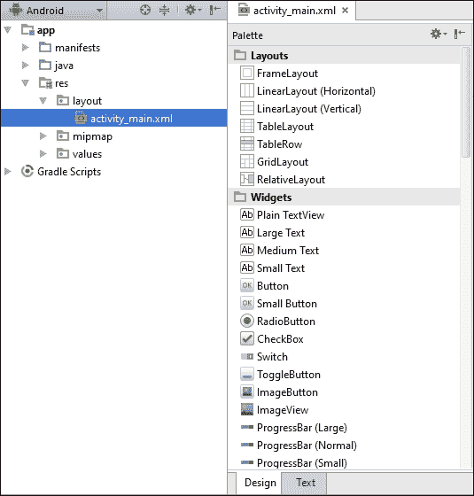
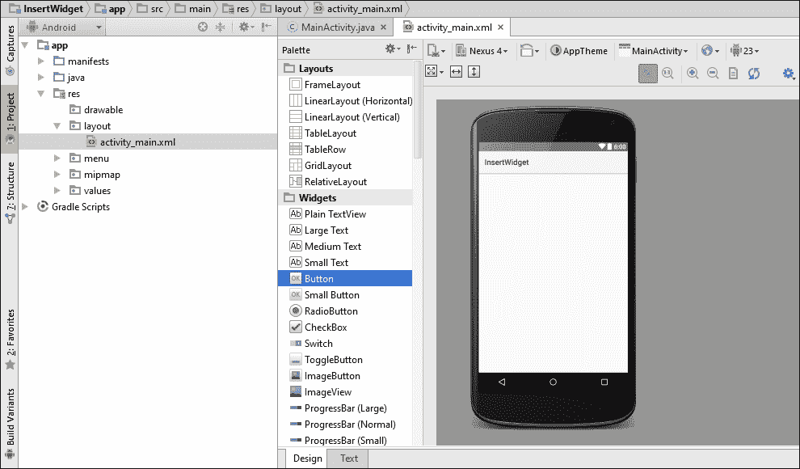
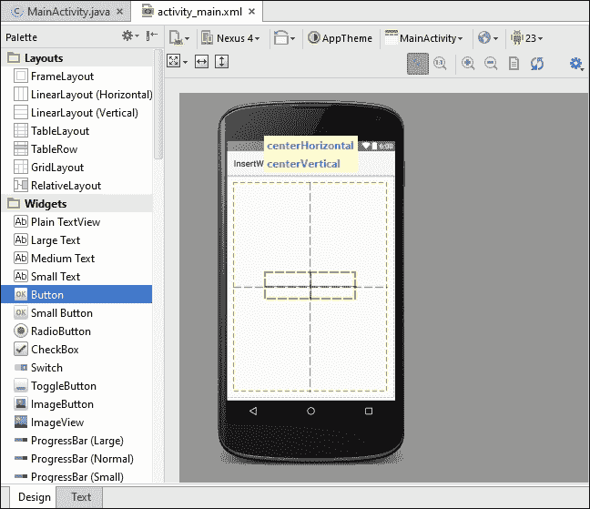
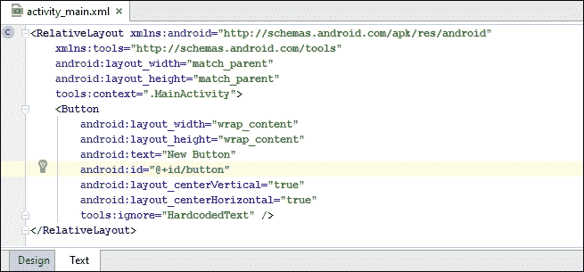
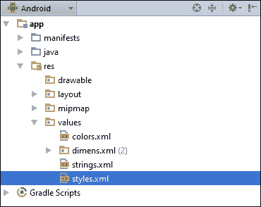
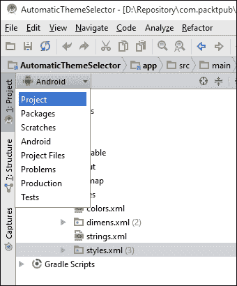
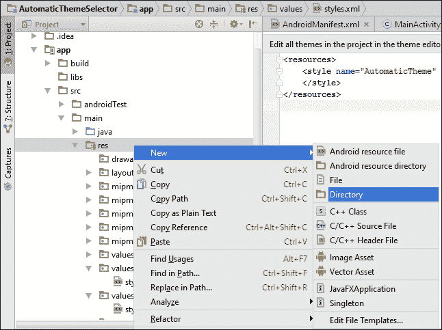

# 第三章. 视图、组件和样式

在本章中，我们将涵盖以下主题：

+   将组件插入布局中

+   使用图形来显示按钮状态

+   在运行时创建组件

+   创建自定义组件

+   将样式应用于视图

+   将样式转换为主题

+   根据 Android 操作系统版本选择主题

# 简介

在 Android 中，**组件**一词可以指代几个不同的概念。当大多数人谈论组件时，他们指的是**应用组件**，通常在主屏幕上看到。应用组件作为独立的迷你应用程序存在，因为它们通常提供基于其主要应用程序的功能子集。（通常，大多数应用组件与应用程序一起安装，但这不是必需的。它们可以作为独立的应用程序以组件格式存在。）一个常见的应用组件示例是提供多个不同主屏幕应用组件的天气应用程序。第五章，*探索片段、应用组件和系统 UI*，将讨论主屏幕应用组件并提供创建自己的食谱。

在为 Android 开发时，**组件**一词通常指的是放置在布局文件中的专用视图，例如按钮、TextView、CheckBox 等。在本章中，我们将专注于应用开发中的组件。

要查看**Android SDK**提供的组件列表，请在 Android Studio 中打开布局文件，并点击**设计**选项卡。在设计视图的左侧，您将在**布局**部分下方看到**组件**部分，如下面的截图所示：



如您从列表中看到的，**Android SDK**提供了许多有用的组件——从简单的 TextView、Button 或 Checkbox 到更复杂的组件，如时钟、日期选择器和日历。尽管内置组件很有用，但也很容易在 SDK 提供的内容上扩展。我们可以扩展现有的组件以自定义其功能，或者我们可以通过扩展基本视图类从头开始创建自己的组件。（我们将在*创建自定义组件*食谱中提供一个示例。）

组件的视觉外观也可以进行自定义。这些设置可以用来创建**样式**，进而可以用来创建**主题**。就像在其他开发环境中一样，创建主题的好处是可以通过最小的努力轻松地更改整个应用程序的外观。最后，Android SDK 还提供了许多内置的主题和变体，例如 Android 3/4 的 Holo 主题和 Android 5 的 Material 主题。（Android 6.0 没有发布新的主题。）

# 将组件插入布局中

如您从前面的示例中看到的，**小部件**是在布局文件中声明的，或者是在代码中创建的。对于这个示例，我们将一步一步地使用 Android Studio Designer 添加一个按钮。 (对于后续的示例，我们只展示 TextView 的布局 XML。) 创建按钮后，我们将创建一个`onClickListener()`。

## 准备工作

在 Android Studio 中启动一个新项目，并将其命名为`InsertWidget`。使用创建手机和平板项目的默认选项，并在提示活动类型时选择**Empty Activity**。您可以删除默认的 TextView（或者保留它），因为在这个示例中不需要它。

## 如何操作...

要将小部件插入布局中，请按照以下步骤操作：

1.  在 Android Studio 中打开**activity_main.xml**文件，并点击**设计**选项卡。

1.  在小部件列表中找到**Button**并将其拖到右侧活动屏幕的中心。Android 会根据按钮放置的位置自动设置布局参数。如果您将按钮居中，如图所示，Android Studio 会在 XML 中设置这些参数。

1.  要查看创建的`xml`，请点击**文本**选项卡，如图所示。看看按钮是如何使用`RelativeLayout`参数居中的。同时，请注意默认 ID，我们将在下一步需要它。

1.  现在，打开`MainActivity.java`文件进行代码编辑。将以下代码添加到`onCreate()`方法中，以设置`onClickListener()`：

    ```java
    Button button = (Button)findViewById(R.id.button);
    button.setOnClickListener(new View.OnClickListener() {
        @Override
        public void onClick(View view) {
            Toast.makeText(MainActivity.this,"Clicked",Toast.LENGTH_SHORT).show();
        }
    });
    ```

1.  在设备或模拟器上运行应用程序。

## 它是如何工作的...

使用 Android Studio 创建 UI 就像拖放视图一样简单。您还可以直接在**设计**选项卡中编辑视图的属性。切换到 XML 代码就像点击**文本**选项卡一样简单。

我们在这里所做的是 Android 开发中非常常见的事情——在 XML 中创建 UI，然后在 Java 代码中连接 UI 组件（视图）。要从代码中引用视图，它必须与一个资源标识符相关联。这是通过使用`id`参数来完成的：

```java
android:id="@+id/button"
```

当按钮被按下时，我们的`onClickListener`函数会在屏幕上显示一个名为**Toast**的弹出消息。

## 更多内容...

再次查看我们之前创建的标识符的格式，`@+id/button`。`@`指定这是一个资源，而**+**符号表示这是一个新资源。（如果我们没有包含加号，我们会得到一个编译时错误，指出**没有资源与指定的名称匹配**）。

## 参考信息

+   Butter Knife（开源项目）——Android 视图的字段和方法绑定：[`jakewharton.github.io/butterknife/`](http://jakewharton.github.io/butterknife/)

# 使用图形来显示按钮状态

我们已经讨论了 Android 视图的通用性以及如何自定义行为和视觉外观。在这个菜谱中，我们将创建一个可绘制**状态选择器**，这是一个在 XML 中定义的资源，它根据视图的状态指定要使用的可绘制资源。最常用的状态及其可能的值包括：

+   `state_pressed=["true" | "false"]`

+   `state_focused=["true" | "false"]`

+   `state_selected=["true" | "false"]`

+   `state_checked=["true" | "false"]`

+   `state_enabled=["true" | "false"]`

要定义状态选择器，创建一个包含`<selector>`元素的 XML 文件，如下所示：

```java
<?xml version="1.0" encoding="utf-8"?>
<selector  >
</selector>
```

在`<selector>`元素内，我们定义一个`<item>`来识别基于指定状态（s）要使用的可绘制资源。以下是一个使用多个状态的`<item>`元素的示例：

```java
<item
    android:drawable="@android:color/darker_gray"
    android:state_checked="true"
    android:state_selected="false"/>
```

### 小贴士

重要的是要记住文件是从上到下读取的，所以第一个满足状态要求的项将被使用。一个默认的可绘制资源，即不包含任何状态的资源，需要放在最后。

对于这个菜谱，我们将使用状态选择器根据`ToggleButton`状态改变背景颜色。

## 准备工作

在 Android Studio 中创建一个新的项目，命名为`StateSelector`，使用默认的**手机和平板**选项。当提示**活动类型**时，选择**空活动**。为了使编写此菜谱的代码更简单，我们将使用颜色作为表示按钮状态的图形。

## 如何做...

我们将首先创建状态选择器，这是一个用 XML 代码定义的资源文件。然后我们将设置按钮使用我们新的状态选择器。以下是步骤：

1.  在`res/drawable`文件夹中创建一个新的`XML`文件，命名为：`state_selector.xml`。该文件应包含以下 XML 代码：

    ```java
    <?xml version="1.0" encoding="utf-8"?>
    <selector >
        <item
            android:drawable="@android:color/darker_gray"
            android:state_checked="true"/>
        <item
            android:drawable="@android:color/white"
            android:state_checked="false"/>
    </selector>
    ```

1.  现在打开**activity_main.xml**文件，并按照以下方式添加一个`ToggleButton`：

    ```java
    <ToggleButton
        android:layout_width="wrap_content"
        android:layout_height="wrap_content"
        android:text="New ToggleButton"
        android:id="@+id/toggleButton"
        android:layout_centerVertical="true"
        android:layout_centerHorizontal="true"
        android:background="@drawable/state_selector" />
    ```

1.  在设备或模拟器上运行应用程序。

## 它是如何工作的...

在这里要理解的主要概念是 Android 状态选择器。如步骤 2 所示，我们创建了一个资源文件，它指定了基于`state_checked`的**可绘制资源**（在这种情况下是一个颜色）。

Android 支持许多其他状态条件，除了已检查状态。在输入`android:state`时，查看自动完成下拉列表以查看其他选项列表。

一旦创建了可绘制资源（第 1 步中的 XML），我们只需告诉视图使用它。由于我们希望背景颜色根据状态改变，所以我们使用`android:background`属性。

`state_selector.xml`是一个可绘制资源，可以被传递给任何接受可绘制资源的属性。例如，我们可以用以下 XML 替换复选框中的按钮：

```java
android:button="@drawable/state_selector"
```

## 还有更多...

如果我们想要实际的图像而不是仅仅改变颜色，这就像更改项目状态中引用的可绘制资源一样简单。

可以下载的源代码使用了两个图形图像，下载自：[`pixabay.com/`](https://pixabay.com/)（之所以选择这些图像，是因为它们免费使用且不需要登录。）

一旦你有了你想要的图片，将它们放置在`res/drawable`文件夹中。然后，将 XML 中的状态项行更改为引用你的图片。以下是一个示例：

```java
<item
    android:drawable="@drawable/checked_on"
    android:state_checked="true"/>
```

（将`check_on`更改为与你的图像资源名称匹配。）

### 使用特定屏幕的资源文件夹

当 Android 遇到`@drawable`引用时，它期望在`res/drawable`文件夹中的一个找到目标。这些是为不同的屏幕密度设计的：`ldpi`（每英寸低点）、`mdpi`（中等）、`hdpi`（高）和`xhdpi`（超高），它们允许我们为特定的目标设备创建资源。当应用程序在特定设备上运行时，Android 将从最接近实际屏幕密度的指定文件夹中加载资源。

如果它发现这个文件夹为空，它将尝试下一个最近的匹配，依此类推，直到找到命名的资源。出于教程目的，不需要为每个可能的密度设置一组单独的文件，因此将我们的图片放在`drawable`文件夹中是运行任何设备上的练习的简单方法。

### 小贴士

要获取可用的资源标识符的完整列表，请访问[`developer.android.com/guide/topics/resources/providing-resources.html`](http://developer.android.com/guide/topics/resources/providing-resources.html)。

## 参见

对于另一个关于 Android 资源选择的示例，请参阅*根据操作系统版本选择主题*的配方。

# 在运行时创建小部件

如前所述，通常 UI 在`XML`文件中声明，然后在运行时通过 Java 代码进行修改。虽然可以在 Java 代码中完全创建 UI，但对于复杂的布局，通常不会将其视为最佳实践。

上一章的 GridView 示例是在代码中创建的。但与 GridView 配方不同，在这个配方中，我们将向在`activity_main.xml`中定义的现有布局添加一个视图。

## 准备工作

在 Android Studio 中创建一个新的项目，并将其命名为`RuntimeWidget`。当被提示选择**Activity 类型**时，选择**Empty Activity**选项。

## 如何做到这一点...

我们将首先向现有的布局添加一个 ID 属性，这样我们就可以在代码中访问布局。一旦我们在代码中有了布局的引用，我们就可以向现有的布局添加新的视图。以下是步骤：

1.  打开`res/layout/activity_main.xml`，并将 ID 属性添加到主`RelativeLayout`中，如下所示：

    ```java
    android:id="@+id/layout"
    ```

1.  完全移除默认的`<TextView>`元素。

1.  打开`MainActivity.java`文件，以便我们可以向`onCreate()`方法添加代码。在`setContentView()`之后添加以下代码以获取`RelativeLayout`的引用：

    ```java
    RelativeLayout layout = (RelativeLayout)findViewById(R.id.layout);
    ```

1.  创建一个 DatePicker 并将其添加到布局中，如下所示：

    ```java
    DatePicker datePicker = new DatePicker(this);
    layout.addView(datePicker);
    ```

1.  在设备或模拟器上运行程序。

## 它是如何工作的...

这应该是非常直接的代码。首先，我们使用`findViewById`获取父布局的引用。我们在步骤 1 中添加了 ID 到现有的`RelativeLayout`，以便更容易引用。我们通过`addView()`方法在代码中创建一个 DatePicker 并将其添加到布局中。

## 还有更多...

如果我们想完全通过代码创建布局呢？虽然这不一定被认为是最佳实践，但在某些情况下，从代码创建布局确实更容易（且更简单）。让我们看看如果不使用`activity_main.xml`中的布局，这个示例会是什么样子。以下是`onCreate()`方法的样子：

```java
@Override
protected void onCreate(Bundle savedInstanceState) {
    super.onCreate(savedInstanceState);
    RelativeLayout layout = new RelativeLayout(this);
    DatePicker datePicker = new DatePicker(this);
    layout.addView(datePicker);
    setContentView(layout);
}
```

在这个例子中，实际上并没有太大的不同。如果你在代码中创建了一个视图并希望在以后引用它，你要么需要保留对对象的引用，要么给视图分配一个 ID 以使用`findViewByID()`。要给视图分配一个 ID，可以使用`**setID()**`方法并通过传递`**View.generateViewId()**`（以生成一个唯一的 ID）或使用 xml 中的`**<resources>**`来定义 ID。

# 创建一个自定义组件

正如我们在之前的菜谱中看到的，Android SDK 提供了广泛的各种组件。但当你找不到适合你独特需求的预构建组件时会发生什么？你总是可以创建自己的！

在这个菜谱中，我们将通过创建一个继承自`View`类的自定义组件，就像内置小部件一样。以下是高级概述：

1.  创建一个新的类，它扩展了`View`。

1.  创建自定义构造函数。

1.  重写`onMeasure()`，默认实现返回 100 x 100 的大小。

1.  重写`onDraw()`，默认实现不绘制任何内容。

1.  定义自定义方法和监听器（例如`on<*Event*>()`）。

1.  实现自定义功能。

### 小贴士

虽然`onMeasure()`和`onDraw()`方法不是强制要求的，但默认行为可能并不是你想要的。

## 准备工作

在 Android Studio 中启动一个新的项目，并将其命名为`CustomView`。使用默认向导选项，包括**Phone & Tablet SDK**，并在被提示选择活动类型时选择**Empty Activity**。一旦项目文件创建并打开在 Android Studio 中，你就可以开始工作了。

## 如何做到这一点...

我们将为自定义组件创建一个新的类，它将继承自 Android 的`View`类。我们的自定义组件可以是现有类的子类，例如`Activity`，但我们将它创建在单独的文件中，以便更容易维护。以下是步骤：

1.  首先，创建一个新的 Java 类，并将其命名为`CustomView`。这就是我们将实现自定义组件的地方，正如介绍中所描述的。

1.  修改类构造函数，使其扩展`View`。它应该如下所示：

    ```java
    public class CustomView extends View {
    ```

1.  为类定义一个`Paint`对象，它将在`onDraw()`中使用：

    ```java
    final Paint mPaint = new Paint();
    ```

1.  创建一个默认构造函数，它需要一个活动`Context`，这样我们就可以填充视图。我们也将在这里设置画笔属性。构造函数应该如下所示：

    ```java
    public CustomView(Context context) {
        super(context);
        mPaint.setColor(Color.BLACK);
        mPaint.setTextSize(30);
    }
    ```

1.  如下重写`onDraw()`方法：

    ```java
    @Override
    protected void onDraw(Canvas canvas) {
        super.onDraw(canvas);
        setBackgroundColor(Color.CYAN);
        canvas.drawText("Custom Text", 100, 100, mPaint);
        invalidate();
    }
    ```

1.  最后，在`MainActivity.java`中通过将`setContentView()`替换为我们的视图来扩展我们的自定义视图，如下所示：

    ```java
    setContentView(new CustomView(this));
    ```

1.  在设备或模拟器上运行应用程序以查看其实际效果。

## 它是如何工作的...

我们首先扩展了`View`类，就像内置组件一样。接下来，我们创建了默认构造函数。这很重要，因为我们需要将上下文传递给父类，我们通过调用以下方式实现：

```java
super(context);
```

我们需要重写`onDraw()`，否则，如引言中提到的，我们的自定义视图将不会显示任何内容。当`onDraw()`被调用时，系统会传递一个**画布**对象。画布是屏幕上我们的视图区域。（由于我们没有重写`onMeasure()`，我们的视图将是 100 x 100，但由于我们的整个活动只包含这个视图，所以我们得到整个屏幕作为我们的画布。）

我们在类级别创建了`Paint`对象，并将其声明为`final`，以提高内存分配的效率。（`onDraw()`应该尽可能高效，因为它可能每秒被调用多次。）正如你在运行程序时看到的那样，我们的`onDraw()`实现只是将背景颜色设置为青色，并在屏幕上打印文本（使用`drawText()`）。

## 更多内容...

实际上，还有很多。我们只是触及了使用自定义组件可以做的事情的表面。幸运的是，正如你从这个例子中看到的那样，实现基本功能不需要很多代码。我们很容易花上一整章来讨论诸如将布局参数传递给视图、添加监听器回调、重写`onMeasure()`、在 IDE 中使用我们的视图等问题。这些都是你可以根据需要添加的功能。

虽然自定义组件应该能够处理任何解决方案，但还有其他可能需要更少编码的选项。扩展现有小部件通常足以避免从头开始创建自定义组件的开销。如果你需要的是包含多个小部件的解决方案，还有**复合控件**。例如，组合框就是一个或多个控件组合在一起作为一个单独的小部件。

复合控件通常从布局而不是视图开始扩展，因为你将添加多个小部件。你可能不需要重写`onDraw()`和`onMeasure()`方法，因为每个小部件都会在其相应的方法中处理绘制。

## 参见

+   关于绘制的更多信息，请参阅*第九章，图形和动画*。关于视图对象的完整详细信息，请参考 Android 开发者资源：[`developer.android.com/reference/android/view/View.html`](http://developer.android.com/reference/android/view/View.html)

# 将样式应用于视图

**样式**是一组属性设置，用于定义视图的外观。正如你在定义布局时已经看到的，视图提供了许多设置来决定其外观以及功能。我们已经在视图中设置了高度、宽度、背景颜色和填充，还有许多其他设置，如文本颜色、字体、文本大小、边距等。创建样式就像将这些设置从布局中提取出来，并将它们放入样式资源中。

在本菜谱中，我们将逐步讲解创建样式并将其连接到视图的步骤。

与层叠样式表（Cascading Style Sheets）类似，Android 样式允许你将设计设置与 UI 代码分开指定。

## 准备工作

创建一个新的 Android Studio 项目，并将其命名为 `Styles`。使用默认向导选项创建一个手机和平板项目，并在提示选择 Activity 时选择空 Activity。默认情况下，向导还会创建一个 `styles.xml` 文件，我们将使用这个文件来完成本菜谱。

## 如何操作...

我们将创建自己的样式资源来改变 `TextView` 的外观。我们可以使用以下步骤将我们的新样式添加到 Android Studio 创建的 `styles.xml` 资源中：

1.  打开默认的 `styles.xml` 文件，该文件位于 `res/values` 目录中，如图所示：

1.  我们将通过在现有的 `AppTheme` 样式下方添加以下 XML 来创建一个名为 `MyStyle` 的新样式：

    ```java
    <style name="MyStyle">
        <item name="android:layout_width">match_parent</item>
        <item name="android:layout_height">wrap_content</item>
        <item name="android:background">#000000</item>
        <item name="android:textColor">#AF0000</item>
        <item name="android:textSize">20sp</item>
        <item name="android:padding">8dp</item>
        <item name="android:gravity">center</item>
    </style>
    ```

1.  现在告诉视图使用这个样式。打开 `activity_main.xml` 文件，并将以下属性添加到现有的 `<TextView>` 元素中：

    ```java
    style="@style/MyStyle"
    ```

1.  要么运行应用程序，要么在 **设计** 选项卡中查看结果。

## 工作原理...

**样式**是一个资源，通过在 xml 文件的 `<resources>` 元素中嵌套 `<style>` 元素来定义。我们使用了现有的 `styles.xml` 文件，但这不是必需的，因为我们可以使用任何我们想要的文件名。正如本菜谱所示，一个 xml 文件中可以包含多个 `<style>` 元素。

一旦创建了样式，你就可以轻松地将它应用到任意数量的其他视图上。如果你想有一个具有相同样式的按钮？只需在布局中添加一个按钮，并分配相同的样式。

如果我们创建了一个新的按钮，但希望按钮扩展到视图的全宽？我们如何只为该视图覆盖样式？很简单，就像你以前做的那样，在布局中指定属性。局部属性将优先于 `style` 中的属性。

## 还有更多...

样式还有一个特性：**继承**。通过在定义样式时指定父样式，我们可以让样式相互构建，创建一个样式层次结构。如果你查看 `styles.xml` 中的默认样式 `AppTheme`，你会看到以下行：

```java
<style name="AppTheme" parent="Theme.AppCompat.Light.DarkActionBar">
```

`AppTheme` 继承自 Android SDK 中定义的主题。

### 小贴士

如果你想要继承你创建的自定义样式，有一个快捷方法。你不需要使用父属性，而是首先指定父名称，然后跟一个点号，接着是新名称，例如：

`<style name="MyParent.MyStyle" >`

你看到了如何为视图指定样式，但如果我们想让应用程序中的所有 TextView 使用特定的样式怎么办？我们不得不回到每个 TextView 并指定样式。但还有另一种方法。我们可以在样式中包含一个 `textViewStyle` 项，以自动将样式分配给所有 TextView。（每种小部件类型都有一个样式，因此你可以为按钮、切换按钮、TextView 等执行此操作。）

要设置所有 TextView 的样式，将以下行添加到 `AppTheme` 样式中：

```java
<item name="android:textViewStyle">@style/MyStyle</item>
```

由于我们的应用程序主题已经使用了 `AppThem`，我们只需将这一行添加到 `AppTheme` 中，就可以让所有 TextView 使用我们的自定义 `MyStyle`。

## 参见

在以下位置查看 Android 设计支持库：

[`android-developers.blogspot.de/2015/05/android-design-support-library.html`](http://android-developers.blogspot.de/2015/05/android-design-support-library.html)

# 将样式转换为主题

**主题**是应用于 Activity 或整个应用程序的样式。要设置主题，请使用 `AndroidManifest.xml` 文件中的 `android:theme` 属性。`theme` 属性适用于 `<Application>` 元素以及 `<Activity>` 元素。该元素内的所有视图都将使用指定的主题进行样式化。

设置应用程序主题很常见，但随后会覆盖特定的 Activity 使用不同的主题。

在之前的菜谱中，我们使用 AppTheme 样式（由向导自动创建）设置了 `textViewStyle`。在这个菜谱中，你将学习如何设置应用程序和 Activity 主题。

除了我们已经探索过的样式设置外，还有一些我们没有讨论的额外样式选项，因为它们不适用于视图，而是适用于整个窗口。例如，隐藏应用程序标题或操作栏，以及设置窗口背景等设置，都适用于窗口，因此必须作为主题设置。

对于这个菜谱，我们将基于自动生成的 `AppTheme` 创建一个新的主题。我们的新主题将修改窗口外观，使其成为一个**对话框**。我们还将查看 `AndroidManifest.xml` 中的 `theme` 设置。

## 准备工作

在 Android Studio 中启动一个新的项目，并将其命名为 `Themes`。使用默认向导选项，并在被提示选择 Activity 类型时选择**空活动**。

## 如何做到这一点...

我们首先向现有的 `styles.xml` 文件中添加一个新的主题，使我们的活动看起来像对话框。以下是创建新主题并将活动设置为使用新主题的步骤：

1.  由于**主题**与**样式**定义在相同的资源中，请打开位于 `res/values` 的 `styles.xml` 文件并创建一个新的样式。我们将基于已提供的 AppTheme 创建一个新的样式，并设置 `windowIsFloating`。XML 将如下所示：

    ```java
    <style name="AppTheme.MyDialog">
        <item name="android:windowIsFloating">true</item>
    </style>
    ```

1.  接下来，设置活动使用这个新的对话框主题。打开 `AndroidManifest.xml` 文件，并将 `theme` 属性添加到活动元素中，如下所示：

    ```java
    <activity android:name=".MainActivity"
        android:theme="@style/AppTheme.MyDialog">
    ```

    注意，现在应用程序和活动都将指定一个主题。

1.  现在，在设备或模拟器上运行应用程序，以查看对话框主题的实际效果。

## 它是如何工作的...

我们的新主题 `MyDialog` 使用替代父声明继承了基本 `AppTheme`，因为 `AppTheme` 在我们的代码中定义（而不是系统主题）。如介绍中所述，一些设置适用于整个窗口，这就是我们看到的 `windowIsFloating` 设置。一旦我们声明了新的主题，我们就在 `AndroidManifest` 文件中将我们的主题分配给活动。

## 还有更多...

你可能已经注意到，我们只需将 `windowIsFloating` 添加到现有的 `AppTheme` 中，就可以完成。由于此应用程序只有一个活动，最终结果将是相同的，但这样，任何新的活动也会显示为对话框。

# 根据 Android 版本选择主题

大多数用户更喜欢看到使用 Android 提供的最新主题的应用程序。"**现在支持 Material 主题**" 对于升级到 Android Lollipop 的应用程序来说是常见的。为了在市场上与其他许多应用程序竞争，你可能也想升级你的应用程序，但你的用户还在运行较旧的 Android 版本怎么办？通过正确设置我们的资源，我们可以使用 Android 中的 **资源选择** 来自动根据用户运行的 Android 操作系统版本定义父主题。

首先，让我们探索 Android 中可用的三个主要主题：

+   主题 – 蜜饯面包和更早版本

+   Theme.Holo – Honeycomb (API 11)

+   Theme.Material – Lollipop (API 21)

（截至撰写本文时，Android 6.0 中似乎没有新的主题。）

本食谱将展示如何为 Android 正确设置资源目录，以便根据应用程序运行的 API 版本使用最合适的主题。

## 准备工作

在 Android Studio 中创建一个新的项目，命名为 `AutomaticThemeSelector`。使用默认向导选项创建一个手机和平板项目。当提示活动类型时，选择**空活动**。

## 如何做到这一点...

根据选择的 API 版本，Android Studio 可能会使用应用程序兼容性库。我们不想在这个项目中使用这些库，因为我们想明确设置要使用哪个主题。我们将首先确保我们扩展了通用的 Activity 类，然后我们可以添加我们的新样式资源来根据 API 选择主题。以下是步骤：

1.  我们需要确保 `MainActivity` 扩展自 `Activity` 而不是 `AppCompatActivity`。打开 `ActivityMain.java` 并在必要时将其更改为以下内容：

    ```java
    public class MainActivity extends Activity {
    ```

1.  打开`activity_main.xml`并添加两个视图：一个按钮和一个复选框。

1.  打开`styles.xml`并删除`AppTheme`，因为它将不会使用。添加我们的新主题，使文件如下所示：

    ```java
    <resources>
        <style name="AutomaticTheme" parent="android:Theme.Light">
        </style>
    </resources>
    ```

1.  我们需要为 API 11 和 21 创建两个新的值文件夹。为此，我们需要将 Android Studio 更改为使用项目视图而不是 Android 视图。（否则，我们不会在下一步看到新文件夹。）在**项目**窗口的顶部，它显示**Android**，将其更改为**项目**以使用项目视图。请参阅以下截图：

1.  通过在`res`文件夹上右键单击并导航到**新建** | **目录**来创建一个新的目录，如图所示：

    使用以下名称为第一个目录：`values-v11`

    使用`values-v21`重复此操作为第二个目录

1.  现在在每个新目录中创建一个`styles.xml`文件。（在`values-v11`目录上右键单击，然后选择**新建** | **文件**选项。）对于`values-v11`，使用以下样式来定义 Holo 主题：

    ```java
    <resources>
        <style name="AutomaticTheme" parent="android:Theme.Holo.Light">
        </style>
    </resources>
    For the values-v21, use the following code to define the Material theme:
    <resources>
        <style name="AutomaticTheme" parent="android:Theme.Material.Light">
        </style>
    </resources>
    ```

1.  最后一步是告诉应用程序使用我们新的主题。为此，打开`AndroidManifest.xml`并将`android:theme`属性更改为`AutomaticTheme`。它应该如下所示：

    ```java
    android:theme="@style/AutomaticTheme"
    ```

1.  现在在物理设备或模拟器上运行应用程序。如果您想看到三种不同的主题，您将需要一个运行不同版本 Android 的设备或模拟器。

## 它是如何工作的...

在这个菜谱中，我们使用 Android 资源选择过程根据 API 版本分配适当的主题（这是一个资源）。由于我们需要根据发布时的操作系统版本来选择主题，因此我们创建了两个新的值文件夹来指定 API 版本。这使我们总共有三个`styles.xml`文件：默认样式，一个在`values-v11`目录中，最后一个在`values-v21`目录中。

注意，在所有三个`styles.xml`文件中定义了相同的主题名称。这就是资源选择的工作方式。Android 将使用最适合我们值的目录中的资源。在这里，我们使用 API 级别，但还有其他标准可用。根据屏幕大小、屏幕密度，甚至方向定义单独的资源是非常常见的。

最后一步是将我们的新主题指定为应用程序主题，我们在 AndroidManifest 中做到了这一点。

## 还有更多…

关于资源选择的更多信息，请参阅前一个菜谱中“使用指定文件夹为屏幕特定资源”主题，*使用图形显示按钮状态*。
