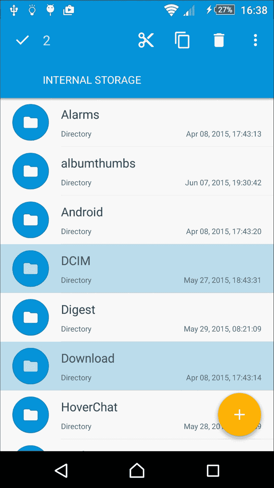
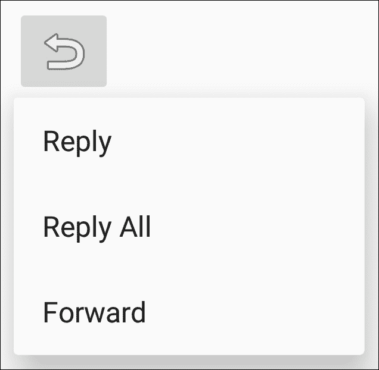

# 第四章。菜单

在本章中，我们将涵盖以下主题：

+   创建选项菜单

+   在运行时修改菜单和菜单项

+   为视图启用上下文操作模式

+   使用 ListView 的上下文批量模式

+   创建弹出菜单

# 简介

Android 操作系统是一个不断变化的环境。最早的 Android 设备（在 Android 3.0 之前），需要有一个硬件菜单按钮。尽管硬件按钮不再需要，但菜单同样重要。事实上，**菜单** API 已扩展到现在支持三种不同类型的菜单：

+   **选项菜单和操作栏**：这是标准菜单，用于应用程序的全局选项。用于搜索、设置等附加功能。

+   **上下文** **模式**（**上下文操作模式**）：通常通过长按激活。（将其视为类似于桌面上的右键点击。）这用于对按下的项目执行操作，例如回复电子邮件或删除文件。

+   **弹出** **菜单**：这为附加操作提供了一个弹出选择（类似于旋转选择器）。菜单选项不旨在影响按下的项目，而是使用前面描述的上下文模式。一个例子是点击分享按钮并获取额外的分享选项列表。

菜单资源类似于其他 Android UI 组件；它们通常在 XML 中创建，但也可以在代码中创建。我们将在以下部分中展示的第一个菜谱，将展示 XML 菜单格式以及如何填充它。

# 创建选项菜单

在我们实际创建和显示菜单之前，让我们看看一个菜单以查看最终结果。以下是一个显示 Chrome 菜单部分的屏幕截图：


最明显的特点是菜单的外观会根据屏幕大小而有所不同。默认情况下，菜单项将被添加到溢出菜单中——即你按下最右侧边缘的三个点时看到的菜单。

菜单通常使用 `XML`（如许多其他 Android 资源）在资源文件中创建，但它们存储在 `res/menu` 目录中，尽管也可以在代码中创建。要创建菜单资源，请使用如下所示的 `<menu>` 元素：

```java
<menu >
</menu>
```

`<item>` 元素定义每个单独的菜单项，并包含在 `<menu>` 元素中。一个基本的菜单项看起来如下：

```java
<item 
    android:id="@+id/settings"
    android:title="@string/settings" />
```

最常见的 `<item>` 属性如下：

+   `id`：这是一个标准的资源标识符

+   `title`：这表示要显示的文本

+   `图标`：这是一个可绘制的资源

+   `showAsAction`：如下所述（*见下一段*）

+   `enabled`：默认启用

让我们更详细地看看 `showAsAction`。

`showAsAction` 属性控制菜单项的显示方式。选项包括以下内容：

+   `ifRoom`：如果空间足够，则应将此菜单项包含在操作栏中

+   `withText`：这表示标题和图标都应该显示

+   `never`：这表示菜单项永远不会包含在操作栏中；始终显示在溢出菜单中

+   `always`：这表示菜单项应该始终包含在操作栏中（谨慎使用，因为空间有限）

    ### 注意

    可以使用管道（|）分隔符组合多个选项，例如`showAsAction="ifRoom|withText"`。

在了解了菜单资源的根本之后，我们现在可以创建一个标准的选项菜单并将其填充。

## 准备工作

使用 Android Studio 创建一个名为`OptionsMenu`的新项目。使用默认的**手机和平板**选项，并在提示活动类型时选择**空活动**选项。由于向导默认不会创建`res/menu`文件夹，请在继续之前导航到**文件** | **新建** | **目录**来创建它。

## 如何做到这一点...

根据前述章节中创建的新项目，你现在可以创建一个菜单。然而，首先，我们将向`strings.xml`文件添加一个字符串资源作为菜单标题。当创建菜单的 XML 时，我们将使用这个新字符串作为菜单标题。以下是步骤：

1.  首先打开`strings.xml`文件，并在`<resources>`元素中添加以下`<string>`元素：

    ```java
    <string name="menu_settings">Settings</string>
    ```

1.  在`res/menu`目录中创建一个新文件，并将其命名为`menu_main.xml`。

1.  打开`menu_main.xml`文件，并添加以下 XML 以定义菜单：

    ```java
    <?xml version="1.0" encoding="utf-8"?>
    <menu

        >
        <item android:id="@+id/menu_settings"
            android:title="@string/menu_settings"
            app:showAsAction="never">
        </item>
    </menu>
    ```

1.  菜单现在已创建，我们只需在`ActivityMain.java`中重写`onCreateOptionsMenu()`方法以填充菜单：

    ```java
    @Override
    public boolean onCreateOptionsMenu(Menu menu) {
        getMenuInflater().inflate(R.menu.menu_main, menu);
        return true;
    }
    ```

1.  在设备或模拟器上运行程序，以查看操作栏中的菜单。

## 它是如何工作的...

这里有两个基本步骤：

1.  在 XML 中定义菜单。

1.  在活动创建时填充菜单。

作为良好的编程习惯，我们在`strings.xml`文件中定义字符串，而不是在`XML`中硬编码它。然后我们使用标准的 Android 字符串标识符在第 3 步中设置菜单的标题。由于这是一个“设置”菜单项，我们不希望它在操作栏中显示。为了确保它永远不会显示，使用`showAsAction="never"`。

菜单定义完成后，我们将在第 4 步中使用菜单填充器在活动创建期间加载菜单。注意`R.menu.menu_main`菜单资源语法？这就是为什么我们在`res/menu`目录中创建 XML 的原因——这样系统就会知道这是一个菜单资源。

在第 4 步中，我们使用了`app:showAsAction`而不是 Android 的`android:showAsAction`。这是因为我们正在使用`AppCompat`库（也称为 Android 支持库）。默认情况下，Android Studio 的新项目向导会将支持库包含在项目中。

## 更多内容...

如果你运行了第 5 步的程序，那么当你按下菜单溢出按钮时，你必须已经看到了**设置**菜单项。但仅此而已。没有其他发生。显然，如果应用程序不响应用户的菜单项，菜单项就没什么用了。响应用户的**选项**菜单是通过`onOptionsItemSelected()`回调完成的。

将以下方法添加到应用程序中，以便在选择设置菜单时显示 Toast：

```java
@Override
public boolean onOptionsItemSelected(MenuItem item) {
    if (item.getItemId() == R.id.menu_settings) {
        Toast.makeText(this, "Settings", Toast.LENGTH_LONG).show();
    } else {
        return super.onContextItemSelected(item);
    }
    return true;
}
```

就这些了。你现在有一个可以工作的菜单了！

### 小贴士

如前例所示，当处理回调时返回`true`；否则，如`else`语句所示调用超类。

### 使用菜单项启动活动

在这个例子中，我们显示了一个 Toast，以便我们可以看到工作示例；然而，如果需要，我们也可以轻松地启动一个新的活动。正如你在第一章的“使用 Intent 对象启动新活动”食谱中所做的那样，创建一个 Intent 并使用`startActivity()`调用它。

### 创建子菜单

**子菜单**的创建和访问几乎与其他菜单元素完全相同，可以放置在任何提供的菜单中，尽管它们不能放置在其他子菜单中。要定义子菜单，请在`<item>`元素内包含一个`<menu>`元素。以下是本食谱中添加了两个子菜单项的 XML 形式：

```java
<?xml version="1.0" encoding="utf-8"?>
<menu

    >
    <item android:id="@+id/menu_settings
        android:title="@string/menu_settings"
        app:showAsAction="never">
        <menu>
            <item android:id="@+id/menu_sub1"
                android:title="Storage Settings" />
            <item android:id="@+id/menu_sub2"
                android:title="Screen Settings" />
        </menu>
    </item>
</menu>
```

### 分组菜单项

Android 支持的其他菜单功能之一是分组菜单项。Android 提供了几个用于分组的函数，包括以下内容：

+   `setGroupVisible()`: 显示或隐藏所有项目

+   `setGroupEnabled()`: 启用或禁用所有项目

+   `setGroupCheckable()`: 设置可勾选行为

### 小贴士

Android 会将所有带有`showAsAction="ifRoom"`的分组项一起保留。这意味着组中所有带有`showAsAction="ifRoom"`的项都将显示在操作栏中，或者所有项都将显示在溢出菜单中。

要创建一个组，将`<item>`菜单元素添加到`<group>`元素中。以下是一个使用本食谱中菜单 XML 的示例，其中包含了一个组中的两个附加项：

```java
<?xml version="1.0" encoding="utf-8"?>
<menu

    >

    <group android:id="@+id/group_one" >
        <item android:id="@+id/menu_item1"
            android:title="Item 1"
            app:showAsAction="ifRoom"/>
        <item android:id="@+id/menu_item2"
            android:title="Item 2"
            app:showAsAction="ifRoom"/>
    </group>
    <item android:id="@+id/menu_settings"
        android:title="@string/menu_settings"
        app:showAsAction="never"/>
</menu>
```

## 参见

+   要获取有关菜单的完整详细信息，请访问 Android 开发者菜单资源网站[`developer.android.com/guide/topics/resources/menu-resource.html`](http://developer.android.com/guide/topics/resources/menu-resource.html)

# 在运行时修改菜单和菜单项

虽然已经多次提到，但被认为的“最佳”编程实践是在 XML 中而不是在 Java 中创建 UI。仍然有需要通过代码执行的时候。这尤其适用于你想要根据某些外部标准使菜单项可见（或启用）的情况。菜单也可以包含在资源文件夹中，但有时你需要代码来执行逻辑。一个例子可能是，如果你想只在用户登录你的应用时提供上传菜单项。

在这个食谱中，我们将仅通过代码创建和修改菜单。

## 准备工作

在 Android Studio 中创建一个新的项目，并将其命名为`RuntimeMenu`，使用默认的**手机和平板**选项。当被提示添加活动时，选择**空活动**选项。由于我们将在代码中完全创建和修改菜单，因此我们不需要创建`res/menu`目录。

## 如何实现...

首先，我们将添加用于我们的菜单项和切换菜单可见性的按钮的字符串资源。打开`res/strings.xml`文件并按照以下步骤操作：

1.  将以下两个字符串添加到现有的`<resources>`元素中：

    ```java
    <string name="menu_download">Download</string>
    <string name="menu_settings">Settings</string>
    ```

1.  在`activity_main.xml`中添加一个按钮，并将其`onClick()`设置为`toggleMenu`，如下所示：

    ```java
    <Button
        android:id="@+id/buttonToggleMenu"
        android:layout_width="wrap_content"
        android:layout_height="wrap_content"
        android:text="Toggle Menu"
        android:layout_centerVertical="true"
        android:layout_centerHorizontal="true"
        android:onClick="toggleMenu"/>
    ```

1.  打开`ActivityMain.java`并在类声明下方添加以下三行代码：

    ```java
    private final int MENU_DOWNLOAD = 1;
    private final int MENU_SETTINGS = 2;
    private boolean showDownloadMenu = false;
    ```

1.  为按钮添加以下方法以供调用：

    ```java
    public void toggleMenu(View view) {
        showDownloadMenu=!showDownloadMenu;
    }
    ```

1.  当活动首次创建时，Android 会调用`onCreateOptionsMenu()`来创建菜单。以下是动态构建菜单的代码：

    ```java
    @Override
    public boolean onCreateOptionsMenu(Menu menu) {
        menu.add(0, MENU_DOWNLOAD, 0, R.string.menu_download);
        menu.add(0, MENU_SETTINGS, 0, R.string.menu_settings);
        return true;
    }
    ```

1.  为了最佳编程实践，不要使用`onCreateOptionsMenu()`来更新或更改你的菜单；相反，使用`onPrepareOptionsMenu()`。以下是根据我们的标志更改**下载**菜单项可见性的代码：

    ```java
    @Override
    public boolean onPrepareOptionsMenu(Menu menu) {
        MenuItem menuItem = menu.findItem(MENU_DOWNLOAD);
        menuItem.setVisible(showDownloadMenu);
        return true;
    }
    ```

1.  虽然这个菜谱技术上不是必需的，但这个`onOptionsItemSelected()`代码展示了如何响应每个菜单项：

    ```java
    @Override
    public boolean onOptionsItemSelected(MenuItem item) {
        switch (item.getItemId()) {
            case MENU_DOWNLOAD:
                Toast.makeText(this, R.string.menu_download, Toast.LENGTH_LONG).show();
                break;
            case MENU_SETTINGS:
                Toast.makeText(this, R.string.menu_settings, Toast.LENGTH_LONG).show();
                break;
            default:
                return super.onContextItemSelected(item);
        }
        return true;
    }
    ```

1.  在设备或模拟器上运行程序以查看菜单更改。

## 它是如何工作的...

我们为`onCreateOptionsMenu()`创建了一个覆盖，就像我们在之前的菜谱中做的那样，*创建一个选项菜单*。但是，我们不是填充现有的菜单资源，而是使用`Menu.add()`方法创建菜单。由于我们希望在以后也修改菜单项以及响应菜单项事件，我们定义了自己的菜单 ID 并将它们传递给`add()`方法。

`onOptionsItemSelected()`会为所有菜单项调用，因此我们获取菜单 ID 并使用基于我们创建的 ID 的`switch`语句。如果我们正在处理菜单事件，我们返回`true`，否则我们将事件传递给父类。

在`onPrepareOptionsMenu()`方法中发生菜单更改。为了模拟外部事件，我们创建了一个按钮来切换一个布尔标志。**下载**菜单的可见性由这个标志决定。这就是你根据设定的任何标准创建自定义代码的地方。你可以使用当前播放器级别或者当新级别准备发布时设置这个标志；你发送一个推送消息，以启用菜单项。

## 还有更多...

如果我们想让这个**下载**选项容易被注意到，以指示它是否可用？我们可以通过在`onPrepareOptionsMenu()`中添加以下代码来告诉 Android 我们想在操作栏中显示菜单（在返回语句之前）：

```java
menuItem.setShowAsAction(MenuItem.SHOW_AS_ACTION_ALWAYS);
```

现在如果你运行代码，你将在操作栏中看到**下载**菜单项，但行为是不正确的。

在之前我们没有在操作栏中添加菜单项时，每次打开溢出菜单，Android 都会调用 `onPrepareOptionsMenu()` 方法来确保可见性始终更新。为了纠正这种行为，请将以下代码行添加到按钮调用的 `toggleMenu()` 方法中：

```java
invalidateOptionsMenu();
```

调用 `invalidateOptionsMenu()` 方法告诉 Android 我们的操作菜单已不再有效，这会强制调用 `onPrepareOptionsMenu()` 方法，从而得到我们期望的行为。

### 注意

如果在操作栏中显示菜单项，Android 会认为菜单始终处于打开状态。

# 为视图启用上下文操作模式

上下文菜单提供与特定视图相关的附加选项——这与桌面上的右键点击概念相同。Android 目前支持两种不同的方法：浮动上下文菜单和上下文模式。上下文操作模式是在 Android 3.0 中引入的。较老的浮动上下文菜单可能会导致混淆，因为没有指示当前选中的项，并且它不支持对多个项执行操作——例如，在一次操作中删除多个电子邮件。

## 创建浮动上下文菜单

如果你需要使用旧式的上下文菜单，例如，为了支持 Android 3.0 之前的设备，它与选项菜单 API 非常相似，只是方法名不同。要创建菜单，请使用 `onCreateContextMenu()` 而不是 `onCreateOptionsMenu()`。要处理菜单项选择，请使用 `onContextItemSelected()` 而不是 `onOptionsItemSelected()`。最后，调用 `registerForContextMenu()` 来让系统知道你想要为视图获取上下文菜单事件。

由于上下文模式被认为是显示上下文选项的首选方式，本食谱将侧重于较新的 API。上下文模式提供了与浮动上下文菜单相同的特性，但通过允许在批量模式下进行多项选择，还增加了额外的功能。

本食谱将演示为单个视图设置上下文模式。一旦激活，通过长按，一个 **上下文操作栏**（**CAB**）将替换操作栏，直到上下文模式完成。

### 注意

上下文操作栏与操作栏不同，你的活动不需要包含操作栏。

## 准备工作

使用 Android Studio 创建一个新的项目，并将其命名为 `ContextualMode`。使用默认的 **Phone & Tablet** 选项，并在被提示添加活动时选择 **Empty Activity**。创建一个菜单目录 (`res/menu`)，就像我们在第一个食谱中做的那样，用于存储上下文菜单的 XML。

## 如何实现...

我们将创建一个 **ImageView** 作为宿主视图以初始化上下文模式。由于上下文模式通常通过长按触发，我们将在 `onCreate()` 方法中为 `ImageView` 设置一个长按监听器。当被调用时，我们将启动上下文模式，并传递一个 `ActionMode` 回调来处理上下文模式事件。以下是步骤：

1.  我们将首先添加两个新的字符串资源。打开`strings.xml`文件并添加以下内容：

    ```java
    <string name="menu_cast">Cast</string>
    <string name="menu_print">Print</string>
    ```

1.  字符串创建完成后，我们现在可以创建菜单，通过在`res/menu`中创建一个名为`context_menu.xml`的新文件，使用以下 XML：

    ```java
    <?xml version="1.0" encoding="utf-8"?>
    <menu

        >
    <item android:id="@+id/menu_cast"
        android:title="@string/menu_cast" />
    <item android:id="@+id/menu_print"
        android:title="@string/menu_print" /> </menu>
    ```

1.  现在将一个`ImageView`添加到`activity_main.xml`中，作为启动 Contextual Mode 的源。以下是 ImageView 的 XML：

    ```java
    <ImageView
        android:id="@+id/imageView"
        android:layout_width="wrap_content"
        android:layout_height="wrap_content"
        android:layout_centerVertical="true"
        android:layout_centerHorizontal="true"
        android:src="img/ic_launcher"/>
    ```

1.  现在 UI 已经设置好了，我们可以添加 Contextual Mode 的代码。首先，我们需要一个全局变量来存储在调用`startActionMode()`时返回的`ActionMode`实例。在`MainActivity.java`中的类构造函数下方添加以下代码行：

    ```java
    ActionMode mActionMode;
    ```

1.  接下来，创建一个`ActionMode`回调并将其传递给`startActionMode()`。在上一步骤中的代码下方添加以下代码到`MainActivity`类中：

    ```java
    private ActionMode.Callback mActionModeCallback = new ActionMode.Callback() {
        @Override
        public boolean onCreateActionMode(ActionMode mode, Menu menu) {
            mode.getMenuInflater().inflate(R.menu.context_menu, menu);
            return true;
        }
        @Override
        public boolean onPrepareActionMode(ActionMode mode, Menu menu) {
            return false;
        }
        @Override
        public boolean onActionItemClicked(ActionMode mode, MenuItem item) {
            switch (item.getItemId()) {
                case R.id. menu_cast:
                    Toast.makeText(MainActivity.this, "Cast", Toast.LENGTH_SHORT).show();
                    mode.finish();
                    return true;
                case R.id. menu_print:
                    Toast.makeText(MainActivity.this, "Print", Toast.LENGTH_SHORT).show();
                    mode.finish();
                    return true;
                default:
                    return false;
            }
        }
        @Override
        public void onDestroyActionMode(ActionMode mode) {
            mActionMode = null;
        }
    };
    ```

1.  创建了`ActionMode`回调后，我们只需要调用`startActionMode()`来开始 Contextual Mode。将以下代码添加到`onCreate()`方法中以设置长按监听器：

    ```java
    ImageView imageView = (ImageView)findViewById(R.id.imageView);
    imageView.setOnLongClickListener(new View.OnLongClickListener() {
        public boolean onLongClick(View view) {
            if (mActionMode != null) return false;
            mActionMode = startActionMode(mActionModeCallback);
            return true;
        }
    });
    ```

1.  在设备或模拟器上运行程序，以查看 CAB 的实际效果。

## 它是如何工作的...

正如你在第二步中看到的，我们使用了相同的菜单 XML 来定义上下文菜单，就像其他菜单一样。

需要理解的主要代码是`ActionMode`回调。这是我们处理 Contextual Mode 事件的地点：初始化菜单、处理菜单项选择和清理。我们在长按事件中通过调用`startActionMode()`并传递在第五步中创建的`ActionMode`回调来启动 Contextual Mode。

当触发操作模式时，系统会调用`onCreateActionMode()`回调，它会展开菜单并在 Contextual Action Bar 中显示它。用户可以通过按返回箭头或返回键来关闭 Contextual Action Bar。当用户进行菜单选择时，CAB 也会关闭。我们显示一个 Toast 来为这个菜谱提供视觉反馈，但这是你实现功能的地方。

## 更多内容...

在这个例子中，我们存储了从`startActionMode()`调用返回的`ActionMode`。我们使用它来防止在 Action Mode 已经激活时创建新的实例。我们也可以使用这个实例来对 Contextual Action Bar 本身进行更改，例如使用以下方式更改标题：

```java
mActionMode.setTitle("New Title");
```

当我们将在下一道菜谱中看到的多项选择一起工作时，这尤其有用。

## 参见

+   参见下一道菜谱，*使用 ListView 与 Contextual Batch Mode*，以处理多项选择

# 使用 ListView 与 Contextual Batch Mode

如前一道菜谱中讨论的，Contextual Mode 支持两种使用形式：单视图模式（如演示所示）和多项选择（或批量）模式。批量模式是 Contextual Mode 优于旧式上下文菜单的地方，因为批量选择不受支持。

如果你曾经使用过像 Gmail 或文件浏览器这样的电子邮件应用，你可能在选择多个项时见过上下文模式。以下是从 Solid Explorer 的截图，它展示了出色的 Material 主题和上下文模式的实现：



在这个菜谱中，我们将创建一个填充多个国家名称的`ListView`来演示多选或批量模式。此示例将使用正常的长按事件以及项点击事件来启动上下文模式。

## 准备工作

在 Android Studio 中创建一个新的项目，并将其命名为`ContextualBatchMode`。使用默认的**手机和平板电脑**选项，并在被提示添加活动时选择**空活动**。为上下文菜单创建一个菜单目录（`res/menu`）。

## 如何做...

与上一个菜谱类似，我们首先创建一个在上下文模式开始时展开的 XML 菜单。我们需要定义`MultiChoiceModeListener`来处理与`ListView`的批量模式。然后我们设置`ListView`以允许多选，并传入`MultiChoiceModeListener`。以下是步骤：

1.  打开`strings.xml`文件，并添加两个新的字符串资源用于菜单项，如下所示：

    ```java
    <string name="menu_move">Move</string>
    <string name="menu_delete">Delete</string>
    ```

1.  在`res/menu`文件夹中创建一个名为`contextual_menu.xml`的新文件，内容如下所示：

    ```java
    <?xml version="1.0" encoding="utf-8"?>
    <menu

        >
        <item android:id="@+id/menu_move"
            android:title="@string/menu_move" />
        <item android:id="@+id/menu_delete
            android:title="@string/menu_delete" />
    </menu>
    ```

1.  由于我们需要`ListView`，我们将`MainActivity`更改为从`ListActivity`扩展，如下所示：

    ```java
    public class MainActivity extends ListActivity
    ```

1.  创建一个`MultiChoiceModeListener`来处理上下文操作栏事件。在`MainActivity.java`中的类构造函数下方添加以下代码：

    ```java
    AbsListView.MultiChoiceModeListener mMultiChoiceModeListener = new AbsListView.MultiChoiceModeListener() {
        @Override
        public void onItemCheckedStateChanged(ActionMode mode, int position, long id, boolean checked) {
        }

        @Override
        public boolean onCreateActionMode(ActionMode mode, Menu menu) {
            // Inflate the menu for the CAB
            MenuInflater inflater = mode.getMenuInflater();
            inflater.inflate(R.menu.contextual_menu, menu);
            return true;
        }

        @Override
        public boolean onPrepareActionMode(ActionMode mode, Menu menu) {
            return false;
        }

        @Override
        public boolean onActionItemClicked(ActionMode mode, MenuItem item) {
            // Handle menu selections
            switch (item.getItemId()) {
                case R.id.menu_move
                    Toast.makeText(MainActivity.this, "Move", Toast.LENGTH_SHORT).show();
                    mode.finish();
                    return true;
                case R.id.menu_delete
                    Toast.makeText(MainActivity.this, "Delete", Toast.LENGTH_SHORT).show();
                    mode.finish();
                    return true;
                default:
                    return false;
            }
        }

        @Override
        public void onDestroyActionMode(ActionMode mode) {
        }
    };
    ```

1.  接下来，我们将更改`onCreate()`以设置`ListView`并使用国家名称的字符串数组填充`ListAdapter`，如下所示：

    ```java
    @Override
    protected void onCreate(Bundle savedInstanceState) {
        super.onCreate(savedInstanceState);

        String[] countries = new String[]{"China", "France", "Germany", "India", "Russia", "United Kingdom", "United States"};
        ListAdapter countryAdapter = new ArrayAdapter<String>(this, android.R.layout.simple_list_item_checked, countries);
        setListAdapter(countryAdapter);
        getListView().setChoiceMode(ListView.CHOICE_MODE_MULTIPLE_MODAL);
        getListView().setMultiChoiceModeListener(mMultiChoiceModeListener);

        getListView().setOnItemClickListener(new AdapterView.OnItemClickListener() {
            @Override
            public void onItemClick(AdapterView<?> parent, View view, int position, long id) {
                ((ListView)parent).setItemChecked(position, true);
            }
        });
    }
    ```

1.  在设备或模拟器上运行程序，以查看上下文操作栏的实际效果。

## 它是如何工作的...

使批量模式中的操作模式工作有三个关键元素：

1.  创建上下文菜单以展开

1.  定义`MultiChoiceModeListener`以传递给`setMultiChoiceModeListener()`

1.  将`ListView`的`ChoiceMode`设置为`CHOICE_MODE_MULTIPLE_MODAL`。

`MultiChoiceModeListener`的作用与在单视图上下文模式中使用的`ActionMode`回调相同，并且实际上实现了`ActionMode.Callback`。与`ActionMode.Callback`一样，当`MultiChoiceModeListener`调用`onCreateActionMode()`时，菜单会被展开。

默认情况下，上下文模式是通过在`ListView`中的项上长按来启动的。我们将更进一步，通过使用`onItemClick()`事件来检查项时启动上下文模式。如果我们不这样做，启动上下文模式的唯一方法将是长按，这可能会让许多用户不了解额外的功能。

## 更多内容...

如本章引言所述，您的活动不需要包含操作栏即可使用上下文操作栏。如果您确实有操作栏并且它是可见的，它将被上下文操作栏覆盖。如果您没有操作栏作为此菜谱的默认设置，布局将被重新绘制以包含上下文操作栏（当上下文操作栏关闭时再次重新绘制）。如果您希望操作栏可见，则可以更改活动的主题或更改基本类并手动设置`ListView`。

## 相关内容

+   有关`ListView`的更多信息，请参阅第二章，*布局*

# 创建弹出菜单

弹出菜单类似于选择器下拉的视图。弹出菜单的目的是提供额外的选项以完成操作。一个常见的例子可能是电子邮件应用中的**回复**按钮。按下时，会显示几个回复选项，例如：**回复**、**全部回复**和**转发**。

这是菜谱中弹出菜单的示例：



如果有空间，Android 将在锚点视图下方显示菜单选项；否则，它将在视图上方显示。

### 小贴士

弹出菜单**不是**用来影响视图本身的。这是上下文菜单的目的。相反，请参阅*启用视图的上下文操作模式*菜谱中描述的浮动菜单/上下文模式。

在此菜谱中，我们将使用`ImageButton`作为锚点视图创建之前显示的弹出菜单。

## 准备工作

在 Android Studio 中创建一个新的项目并将其命名为`PopupMenu`。在提示添加活动时，使用默认的**手机和平板电脑**选项并选择**空活动**。像之前一样，创建一个菜单目录（`res/menu`）以存储菜单 XML。

## 如何实现...

我们首先创建一个 XML 菜单，以便在按钮按下时展开。在展开弹出菜单后，我们通过传递回调来调用`setOnMenuItemClickListener()`以处理菜单项选择。以下是步骤：

1.  将以下字符串添加到`strings.xml`中：

    ```java
    <string name="menu_reply">Reply</string>
    <string name="menu_reply_all">Reply All</string>
    <string name="menu_forward">Forward</string>
    ```

1.  在`res/menu`目录中创建一个名为`menu_popup.xml`的新文件，使用以下 XML：

    ```java
    <?xml version="1.0" encoding="utf-8"?>
    <menu

        >
        <item android:id="@+id/menu_reply
            android:title="@string/menu_reply" />
        <item android:id="@+id/menu_reply_all
            android:title="@string/menu_reply_all" />
        <item android:id="@+id/menu_forward
            android:title="@string/menu_forward" />
    </menu>
    ```

1.  在`activity_main.xml`中创建一个`ImageButton`以提供弹出菜单的锚点视图。按照以下 XML 代码创建它：

    ```java
    <ImageButton
        android:id="@+id/imageButtonReply"
        android:layout_width="wrap_content"
        android:layout_height="wrap_content"
        android:layout_centerVertical="true"
        android:layout_centerHorizontal="true"
        android:src="img/ic_menu_revert"
        android:onClick="showPopupMenu"/>
    ```

1.  打开`MainActivity.java`并在类构造函数下方添加以下`OnMenuItemClickListener`：

    ```java
    private PopupMenu.OnMenuItemClickListener mOnMenuItemClickListener = new PopupMenu.OnMenuItemClickListener() {
        @Override
        public boolean onMenuItemClick(MenuItem item) {
            // Handle menu selections
            switch (item.getItemId()) {
                case R.id.menu_reply
                    Toast.makeText(MainActivity.this, "Reply", Toast.LENGTH_SHORT).show();
                    return true;
                case R.id.menu_reply_all
                    Toast.makeText(MainActivity.this,"Reply All",Toast.LENGTH_SHORT).show();
                    return true;
                case R.id.menu_forward
                    Toast.makeText(MainActivity.this, "Forward", Toast.LENGTH_SHORT).show();
                    return true;
                default:
                    return false;
            }
        }
    };
    ```

1.  最终的代码是处理按钮`onClick()`事件，如下所示：

    ```java
    public void showPopupMenu(View view) {
        PopupMenu popupMenu = new PopupMenu(MainActivity.this,view);
        popupMenu.inflate(R.menu.menu_popup);
        popupMenu.setOnMenuItemClickListener(mOnMenuItemClickListener);
        popupMenu.show();
    }
    ```

1.  在设备或模拟器上运行程序以查看弹出菜单。

## 它是如何工作的...

如果您已经阅读了之前的菜单菜谱，这可能会看起来非常熟悉。基本上，我们只是在`ImageButton`被按下时展开一个弹出菜单。我们设置一个菜单项监听器以响应菜单选择。

关键在于理解 Android 中可用的每个菜单选项，这样你就可以为特定场景选择正确的菜单类型。这将通过提供一致的用户体验和降低学习曲线来帮助你的应用程序。
