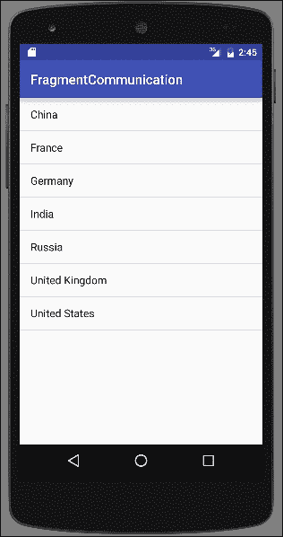
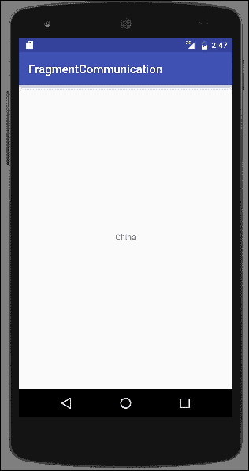
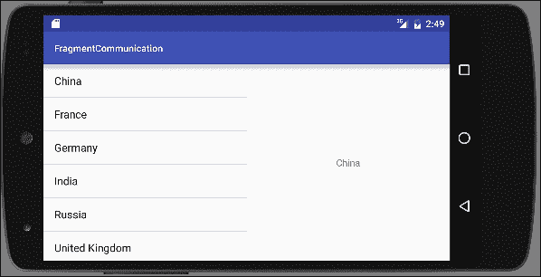
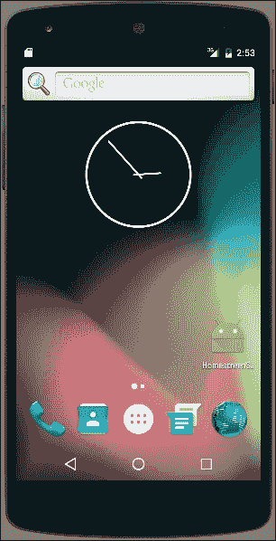
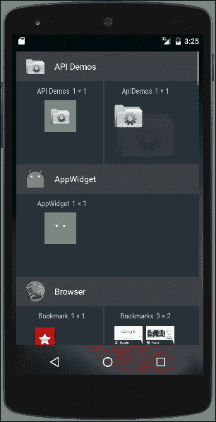
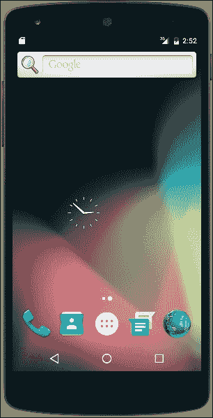
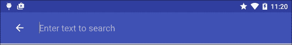

# 第五章：探索 Fragment、AppWidget 和系统 UI

在本章中，我们将涵盖以下主题：

+   创建和使用 Fragment

+   在运行时添加和删除 Fragment

+   在 Fragment 之间传递数据

+   在主屏幕上创建快捷方式

+   创建主屏幕小工具

+   向 ActionBar 添加搜索功能

+   全屏显示你的应用

# 简介

在对第二章中的布局有牢固理解的基础上，*布局*，我们将深入探讨使用 Fragment 的 UI 开发。Fragment 是一种将 UI 分割成更小部分的方法，这些部分可以轻松重用。将 Fragment 视为迷你活动，它们有自己的类、布局和生命周期。您不必在一个 Activity Layout 中设计整个屏幕，可能还会在多个布局中重复功能，而是可以将屏幕分割成更小、更逻辑的部分，并将它们转换为 Fragment。根据需要，您的 Activity Layout 可以引用一个或多个 Fragment。前三个菜谱将深入探讨 Fragment。

在理解 Fragment 的基础上，我们准备扩展对 Widgets 的讨论。在第三章，*视图、小工具和样式*中，我们讨论了如何向您的应用添加小工具。现在，我们将探讨如何创建 App Widget，以便用户可以将他们的应用放在主屏幕上。

本章的最后几节将探索系统 UI 选项。我们有一个菜谱，使用 Android 的`SearchManager` API 向 ActionBar 添加`搜索`选项。最后一个菜谱展示了全屏模式以及改变系统 UI 的几种额外变体。

# 创建和使用 Fragment

Android 并非始终支持 Fragment。Android 的早期版本是为手机设计的，当时屏幕相对较小。直到 Android 开始在平板电脑上使用时，才需要将屏幕分割成更小的部分。Android 3.0 引入了`Fragments`类和 Fragment Manager。

随着新类一起到来的还有 Fragment 生命周期。Fragment 生命周期与在第一章中引入的活动生命周期相似，*活动*，因为大多数事件都与活动生命周期并行。

这里是主要回调的简要概述：

+   `onAttach()`: 当 Fragment 与 Activity 关联时被调用。

+   `onCreate()`: 当 Fragment 首次创建时被调用。

+   `onCreateView()`: 当 Fragment 即将首次显示时被调用。

+   `onActivityCreated()`: 当相关 Activity 被创建时被调用。

+   `onStart()`: 当 Fragment 将变为用户可见时被调用。

+   `onResume()`: 它在 Fragment 显示之前被调用。

+   `onPause()`: 当 Fragment 首次暂停时被调用。用户可能会返回到 Fragment，但这是你应该持久化任何用户数据的地方。

+   `onStop()`: 当 Fragment 不再对用户可见时被调用。

+   `onDestroyView()`：用于允许最终的清理。

+   `onDetach()`：当 Fragment 不再与 Activity 关联时被调用。

在我们的第一个练习中，我们将创建一个新的由标准 `Fragment` 类派生的 `Fragment`。但我们可以从几个其他的 `Fragment` 类中派生，包括：

+   `DialogFragment`：用于创建浮动对话框

+   `ListFragment`：它在 Fragment 中创建一个 `ListView`，类似于 `ListActivity`

+   `PreferenceFragment`：它创建了一个偏好对象列表，通常用于设置页面

在这个菜谱中，我们将逐步演示如何创建一个由 `Fragment` 类派生的基本 `Fragment` 并将其包含在 Activity 布局中。

## 准备工作

在 Android Studio 中创建一个新的项目，命名为：`CreateFragment`。使用默认的 **手机和平板** 选项，并在提示活动类型时选择 **空活动** 选项。

## 如何操作...

在这个菜谱中，我们将创建一个新的 `Fragment` 类及其相应的布局文件。然后我们将 Fragment 添加到 Activity 布局中，以便在 Activity 启动时可见。以下是创建和显示新 Fragment 的步骤：

1.  使用以下 XML 创建一个新的布局文件 `fragment_one.xml`：

    ```java
    <RelativeLayout 
        android:layout_height="match_parent"
        android:layout_width="match_parent">
        <TextView
            android:layout_width="wrap_content"
            android:layout_height="wrap_content"
            android:text="Fragment One"
            android:id="@+id/textView"
            android:layout_centerVertical="true"
            android:layout_centerHorizontal="true" />
    </RelativeLayout>
    ```

1.  创建一个新的 Java 文件 `FragmentOne`，包含以下代码：

    ```java
    public class FragmentOne extends Fragment {
        @Override
        public View onCreateView(LayoutInflater inflater, ViewGroup container, Bundle savedInstanceState) {
            return inflater.inflate(R.layout.fragment_one, container, false);
        }
    }
    ```

1.  打开 `main_activity.xml` 文件，将现有的 `<TextView>` 元素替换为以下 `<fragment>` 元素：

    ```java
      <fragment
        android:name="com.packtpub.androidcookbook.createfragment.FragmentOne"
        android:id="@+id/fragment"
        android:layout_width="wrap_content"
        android:layout_height="wrap_content"
        android:layout_centerVertical="true"
        android:layout_centerHorizontal="true"
        tools:layout="@layout/fragment_one" />
    ```

1.  在设备或模拟器上运行程序。

## 它是如何工作的...

我们首先创建一个新的类，与创建 Activity 时的做法相同。在这个菜谱中，我们只创建了一个覆盖 `onCreateView()` 方法来加载我们的 Fragment 布局的覆盖。但是，就像 Activity 事件一样，我们可以根据需要覆盖其他事件。一旦创建了新的 Fragment，我们就将其添加到 Activity 布局中。由于 `Activity` 类是在 `Fragments` 存在之前创建的，它们不支持 `Fragments`。如果我们使用纯框架类，我们希望使用 `FragmentActivity`。如果你使用了 Android Studio 新建项目向导，那么默认情况下 `MainActivity` 继承自 `AppCompatActivity`，它已经包含了 Fragment 的支持。

## 更多内容...

在这个菜谱中，我们只创建了一个简单的 Fragment 来教授 Fragment 的基础知识。但这是一个指出 Fragment 强大功能的好时机。如果我们正在创建多个 Fragment（通常我们是这样做的，因为这是使用 Fragment 的目的），在创建 Activity 布局时（如步骤 4 所示），我们可以使用 Android 资源文件夹创建不同的布局配置。纵向布局可能只有一个 Fragment，而横向布局可能有两个或更多。

# 在运行时添加和移除 Fragment

在布局中定义片段，就像我们在前面的菜谱中所做的那样，被称为静态片段，在运行时无法更改。我们不会使用`<fragment>`元素，而是创建一个容器来容纳片段，然后在 Activity 的`onCreate()`方法中动态创建片段。

`FragmentManager`提供了在运行时使用`FragmentTransaction`添加、删除和更改片段的 API。一个片段事务包括：

+   开始事务

+   执行一个或多个操作

+   提交事务

这个菜谱将通过在运行时添加和删除片段来演示`FragmentManager`。

## 准备工作

在 Android Studio 中创建一个新的项目，命名为：`RuntimeFragments`。使用默认的**手机和平板**选项，并在提示**活动类型**时选择**空活动**选项。

## 如何操作...

为了演示添加和删除片段，我们首先需要创建片段，我们将通过扩展`Fragment`类来实现。在创建了新的片段之后，我们需要修改主活动的布局以包含`Fragment`容器。从那里，我们只需添加处理片段事务的代码。以下是步骤：

1.  创建一个名为`fragment_one.xml`的新布局文件，并包含以下 XML：

    ```java
    <RelativeLayout 
        android:layout_height="match_parent"
        android:layout_width="match_parent">
        <TextView
            android:layout_width="wrap_content"
            android:layout_height="wrap_content"
            android:text="Fragment One"
            android:id="@+id/textView"
            android:layout_centerVertical="true"
            android:layout_centerHorizontal="true" />
    </RelativeLayout>
    ```

1.  第二个布局文件`fragment_two.xml`几乎与它完全相同，唯一的区别是文本：

    ```java
    android:text="Fragment Two"
    ```

1.  创建一个名为`FragmentOne`的新 Java 文件，并包含以下代码：

    ```java
    public class FragmentOne extends Fragment {
        @Override
        public View onCreateView(LayoutInflater inflater, ViewGroup container, Bundle savedInstanceState) {
            return inflater.inflate(R.layout.fragment_one, container, false);
        }
    }
    ```

    从以下库导入：

    ```java
    android.support.v4.app.Fragment
    ```

1.  创建第二个 Java 文件，命名为`FragmentTwo`，并包含以下代码：

    ```java
    public class FragmentTwo extends Fragment {
        @Override
        public View onCreateView(LayoutInflater inflater, ViewGroup container, Bundle savedInstanceState) {
            return inflater.inflate(R.layout.fragment_two, container, false);
        }
    }
    ```

    从以下库导入：

    ```java
    android.support.v4.app.Fragment
    ```

1.  现在我们需要在主活动布局中添加一个容器和一个按钮。按照以下方式更改`main_activity.xml`：

    ```java
    <?xml version="1.0" encoding="utf-8"?>
    <RelativeLayout 

        android:layout_width="match_parent"
        android:layout_height="match_parent">
        <FrameLayout
            android:id="@+id/frameLayout"
            android:layout_width="match_parent"
            android:layout_height="wrap_content"
            android:layout_above="@+id/buttonSwitch"
            android:layout_alignParentTop="true">
        </FrameLayout>
        <Button
            android:id="@+id/buttonSwitch"
            android:layout_width="wrap_content"
            android:layout_height="wrap_content"
            android:text="Switch"
            android:layout_alignParentBottom="true"
            android:layout_centerInParent="true"
            android:onClick="switchFragment"/>
    </RelativeLayout>
    ```

1.  在创建了片段并将容器添加到布局中之后，我们现在可以编写操作片段的代码。打开`MainActivity.java`文件，并在类构造函数下方添加以下代码：

    ```java
    FragmentOne mFragmentOne;
    FragmentTwo mFragmentTwo;
    int showingFragment=0;
    ```

1.  在现有的`onCreate()`方法中，在`setContentView()`下方添加以下代码：

    ```java
    mFragmentOne = new FragmentOne();
    mFragmentTwo = new FragmentTwo();
    FragmentManager fragmentManager = getSupportFragmentManager();
    FragmentTransaction fragmentTransaction = fragmentManager.beginTransaction();
    fragmentTransaction.add(R.id.frameLayout, mFragmentOne);
    fragmentTransaction.commit();
    showingFragment=1;
    ```

    从以下库导入：

    ```java
    android.support.v4.app.FragmentManager
    android.support.v4.app.FragmentTransaction
    ```

1.  最后需要添加的代码处理了片段切换，由按钮调用：

    ```java
    public void switchFragment(View view) {
        FragmentManager fragmentManager = getSupportFragmentManager();
        FragmentTransaction fragmentTransaction = fragmentManager.beginTransaction();
        if (showingFragment==1) {
            fragmentTransaction.replace(R.id.frameLayout, mFragmentTwo);
            showingFragment = 2;
        } else {
            fragmentTransaction.replace(R.id.frameLayout, mFragmentOne);
            showingFragment=1;
        }
        fragmentTransaction.commit();
    }
    ```

1.  在设备或模拟器上运行程序。

## 它是如何工作的...

这个菜谱的大部分步骤都涉及设置片段。一旦片段被声明，我们就在`onCreate()`方法中创建它们。尽管代码可以压缩成一行，但为了便于阅读和理解，这里以长形式展示。

首先，我们获取`FragmentManager`以便开始一个`FragmentTransaction`。一旦我们有了`FragmentTransaction`，我们就通过调用`beginTransaction()`开始事务。事务中可以发生多个操作，但这里我们只需要`add()`我们的初始片段。我们调用`commit()`方法来最终确定事务。

现在你已经了解了片段事务，以下是`onCreate()`方法的简洁版本：

```java
getFragmentManager().beginTransaction().add(R.id.framLayout, mFragmentOne).commit();
```

`switchFragment`基本上执行相同的片段事务。我们不是调用`add()`方法，而是调用带有现有片段的`replace()`方法。我们通过`showingFragment`变量跟踪当前片段，以便我们知道要显示哪个片段。我们也不限于在两个片段之间切换。如果我们需要额外的片段，我们只需创建它们即可。

## 还有更多...

在第一章的*在活动之间切换*食谱中，我们讨论了返回栈。大多数用户都期望返回键可以向后移动通过“屏幕”，他们不知道或不在乎那些屏幕是活动还是片段。幸运的是，Android 通过在调用`commit()`之前添加对`addToBackStack()`的调用，使得将片段添加到返回栈变得非常容易。

### 小贴士

当一个片段在没有添加到返回栈的情况下被移除或替换时，它会被立即销毁。如果它被添加到返回栈中，它会被停止，并且如果用户返回到该片段，它会被重新启动，而不是重新创建。

# 在片段之间传递数据

经常会出现需要在片段之间传递信息的需求。电子邮件应用程序是一个经典的例子。通常，电子邮件列表在一个片段中，而在另一个片段中显示电子邮件详情（这通常被称为主/详细模式）。片段使得创建这种模式变得更容易，因为我们只需要为每个片段编写一次代码，然后我们就可以将它们包含在不同的布局中。我们可以轻松地在一个纵向布局中放置一个片段，当选择电子邮件时，可以用详细片段替换主片段。我们还可以创建一个双面板布局，其中列表和详细片段并排显示。无论哪种方式，当用户点击列表中的电子邮件时，电子邮件就会在详细面板中打开。这就是我们需要在两个片段之间进行通信的时候。

由于片段的主要目标之一是它们应该是完全自包含的，因此不建议片段之间进行直接通信，这有很好的理由。如果片段必须依赖于其他片段，那么当布局发生变化且只有一个片段可用时，你的代码很可能会出错。幸运的是，在这种情况下也不需要直接通信。所有片段通信都应该通过宿主活动进行。宿主活动负责管理片段，并且可以正确地路由消息。

现在的问题是：片段如何与活动通信？答案是使用一个`interface`。你可能已经熟悉接口，因为这是视图将事件回传给活动的方式。按钮点击是一个常见的例子。

在本食谱中，我们将创建两个片段来演示通过宿主活动从一个片段向另一个片段传递数据。我们还将利用之前食谱中学到的知识，包括两个不同的活动布局——一个用于纵向，一个用于横向。在纵向模式下，活动将根据需要交换片段。以下是应用程序首次在纵向模式下运行的截图：



这是点击国家名称时显示详细片段的屏幕：



在横向模式下，两个片段将并排显示，如横向截图所示：



由于主/详细模式通常涉及一个主列表，我们将利用 `ListFragment`（在 *创建和使用片段* 介绍中提到）。当列表中的项目被选中时，项目文本（在我们的例子中是国家名称）将通过宿主活动发送到详细片段。

## 准备工作

在 Android Studio 中创建一个新的项目，并将其命名为：`Fragmentcommunication`。使用默认的 **手机和平板** 选项，并在提示 **活动类型** 时选择 **空活动**。

## 如何实现...

为了完全演示工作的片段，我们需要创建两个片段。第一个片段将继承自 `ListFragment`，因此它不需要布局。我们将更进一步，为我们的活动创建纵向和横向布局。在纵向模式下，我们将交换片段，在横向模式下，我们将并排显示两个片段。

### 注意

当输入此代码时，Android Studio 将提供两种不同的库导入选项。由于新项目向导自动引用了 `AppCompat` 库，我们需要使用支持库 API 而不是框架 API。尽管非常相似，以下代码使用支持片段 API。

下面是步骤，从第一个片段开始：

1.  创建一个名为 `MasterFragment` 的新 Java 类，并将其修改为继承 `ListFragment`，如下所示：

    ```java
    public class MasterFragment extends ListFragment
    ```

    从以下库导入：

    ```java
    android.support.v4.app.ListFragment
    ```

1.  在 `MasterFragment` 类内部创建以下 `interface`：

    ```java
    public interface OnMasterSelectedListener {
        public void onItemSelected(String countryName);
    }
    ```

1.  使用以下代码设置接口回调监听器：

    ```java
    private OnMasterSelectedListener mOnMasterSelectedListener=null;

    public void setOnMasterSelectedListener(OnMasterSelectedListener listener) {
        mOnMasterSelectedListener=listener;
    }
    ```

1.  `MasterFragment` 的最后一步是创建一个 `ListAdapter` 来填充 `ListView`，我们在 `onViewCreated()` 方法中这样做。我们将使用 `setOnItemClickListener()` 在选择国家名称时调用我们的 `OnMasterSelectedListener` 接口，如下所示：

    ```java
    public void onViewCreated(View view, Bundle savedInstanceState) {
        super.onViewCreated(view, savedInstanceState);
        String[] countries = new String[]{"China", "France", "Germany", "India", "Russia", "United Kingdom", "United States"};
        ListAdapter countryAdapter = new ArrayAdapter<String>(getActivity(), android.R.layout.simple_list_item_1, countries);
        setListAdapter(countryAdapter);
        getListView().setChoiceMode(ListView.CHOICE_MODE_SINGLE);
        getListView().setOnItemClickListener(new AdapterView.OnItemClickListener() {
            @Override
            public void onItemClick(AdapterView<?> parent, View view, int position, long id) {
                if (mOnMasterSelectedListener != null) {
                    mOnMasterSelectedListener.onItemSelected(((TextView) view).getText().toString());
                }
            }
        });
    }
    ```

1.  接下来我们需要创建 `DetailFragment`，从布局开始。创建一个名为：`fragment_detail.xml` 的新布局文件，其 XML 如下所示：

    ```java
    <?xml version="1.0" encoding="utf-8"?>
    <RelativeLayout

        android:layout_width="match_parent"
        android:layout_height="match_parent">
        <TextView
            android:id="@+id/textViewCountryName"
            android:layout_width="wrap_content"
            android:layout_height="wrap_content"
            android:layout_centerVertical="true"
            android:layout_centerHorizontal="true" />
    </RelativeLayout>
    ```

1.  创建一个名为 `DetailFragment` 的新 Java 类，它继承自 `Fragment`，如下所示：

    ```java
    public class DetailFragment extends Fragment
    ```

    从以下库导入：

    ```java
    android.support.v4.app.Fragment
    ```

1.  将以下常量添加到类中：

    ```java
    public static String KEY_COUNTRY_NAME="KEY_COUNTRY_NAME";
    ```

1.  如下重写 `onCreateView()`：

    ```java
    public View onCreateView(LayoutInflater inflater, ViewGroup container, Bundle savedInstanceState) {
        return inflater.inflate(R.layout.fragment_detail, container, false);
    }
    ```

1.  编写 `onViewCreated()` 如下：

    ```java
    public void onViewCreated(View view, Bundle savedInstanceState) {
        super.onViewCreated(view, savedInstanceState);

        Bundle bundle = getArguments();
        if (bundle != null && bundle.containsKey(KEY_COUNTRY_NAME)) {
            showSelectedCountry(bundle.getString(KEY_COUNTRY_NAME));
        }
    }
    ```

1.  对于这个 Fragment 的最后一步是在我们接收到选定的国家名称时更新 TextView。向类中添加以下方法：

    ```java
    public void showSelectedCountry(String countryName) {
        ((TextView)getView().findViewById(R.id.textViewCountryName)).setText(countryName);
    }
    ```

1.  现有的`activity_main.xml`布局将处理纵向模式布局。删除现有的`<TextView>`并将其替换为以下`<FrameLayout>`：

    ```java
    <FrameLayout
        android:id="@+id/frameLayout"
        android:layout_width="match_parent"
        android:layout_height="match_parent"/>
    ```

1.  在**res**文件夹中为横向布局创建一个新的目录：`res/layout-land`。

    ### 提示

    如果您看不到新的`res/layout-land`目录，请从**Android** **view**更改为**Project** **view**。

1.  在`res/layout-land`中创建一个新的`activity_main.xml`布局，如下所示：

    ```java
    <?xml version="1.0" encoding="utf-8"?>
    <LinearLayout 

        android:layout_width="match_parent"
        android:layout_height="match_parent"
        android:orientation="horizontal">
        <FrameLayout
            android:id="@+id/frameLayoutMaster"
            android:layout_width="0dp"
            android:layout_weight="1"
            android:layout_height="match_parent"/>
        <FrameLayout
            android:id="@+id/frameLayoutDetail"
            android:layout_width="0dp"
            android:layout_weight="1"
            android:layout_height="match_parent"/>
    </LinearLayout>
    ```

1.  最后的步骤是将`MainActivity`设置为处理 Fragment。打开`MainActivity.java`文件，并添加以下类变量以跟踪单/双面板：

    ```java
    boolean dualPane;
    ```

1.  接下来，按照以下方式更改`onCreate()`：

    ```java
    protected void onCreate(Bundle savedInstanceState) {
        super.onCreate(savedInstanceState);
        setContentView(R.layout.activity_main);

        MasterFragment masterFragment=null;
        FrameLayout frameLayout = (FrameLayout)findViewById(R.id.frameLayout);
        if (frameLayout != null) {
            dualPane=false;
            FragmentTransaction fragmentTransaction = getSupportFragmentManager().beginTransaction();
            masterFragment=(MasterFragment)getSupportFragmentManager().findFragmentByTag("MASTER");
            if (masterFragment == null) {
                masterFragment = new MasterFragment();
                fragmentTransaction.add(R.id.frameLayout, masterFragment, "MASTER");
            }
            DetailFragment detailFragment = (DetailFragment)getSupportFragmentManager().findFragmentById(R.id.frameLayoutDetail);
            if (detailFragment != null) {
                fragmentTransaction.remove(detailFragment);
            }
            fragmentTransaction.commit();
        } else {
            dualPane=true;
            FragmentTransaction fragmentTransaction = getSupportFragmentManager().beginTransaction();
            masterFragment=(MasterFragment)getSupportFragmentManager().findFragmentById(R.id.frameLayoutMaster);
            if (masterFragment==null) {
                masterFragment = new MasterFragment();
                fragmentTransaction.add(R.id.frameLayoutMaster, masterFragment);
            }
            DetailFragment detailFragment=(DetailFragment)getSupportFragmentManager().findFragmentById(R.id.frameLayoutDetail);
            if (detailFragment==null) {
                detailFragment = new DetailFragment();
                fragmentTransaction.add(R.id.frameLayoutDetail, detailFragment);
            }
            fragmentTransaction.commit();
        }
        masterFragment.setOnMasterSelectedListener(new MasterFragment.OnMasterSelectedListener() {
            @Override
            public void onItemSelected(String countryName) {
                sendCountryName(countryName);
            }
        });
    }
    ```

1.  需要添加的最后一段代码是`sendCountryName()`方法，它处理将国家名称发送到`DetailFragment`：

    ```java
    private void sendCountryName(String countryName) {
        DetailFragment detailFragment;
        if (dualPane) {
            //Two pane layout
            detailFragment = (DetailFragment)getSupportFragmentManager().findFragmentById(R.id.frameLayoutDetail);
            detailFragment.showSelectedCountry(countryName);
        } else {
            // Single pane layout
            detailFragment = new DetailFragment();
            Bundle bundle = new Bundle();
            bundle.putString(DetailFragment.KEY_COUNTRY_NAME, countryName);
            detailFragment.setArguments(bundle);
            FragmentTransaction fragmentTransaction = getSupportFragmentManager().beginTransaction();
            fragmentTransaction.replace(R.id.frameLayout, detailFragment);
            fragmentTransaction.addToBackStack(null);
            fragmentTransaction.commit();
        }
    }
    ```

1.  在设备或模拟器上运行程序。

## 它是如何工作的...

我们首先创建`MasterFragment`。在我们使用的 Master/Detail 模式中，这通常代表一个列表，因此我们通过扩展`ListFragment`创建一个列表。`ListFragment`是`ListActivity`的 Fragment 等价物。除了扩展 Fragment 之外，它基本上是相同的。

如食谱介绍中所述，我们不应尝试直接与其他 Fragment 通信。

为了提供一个通信列表项选择的方法，我们暴露了接口：`OnMasterSelectedListener`。每次在列表中选择一个项目时，我们都调用`onItemSelected()`。

在 Fragment 之间传递数据的大部分工作是在宿主活动中完成的，但最终，接收数据的 Fragment 需要一种接收数据的方式。`DetailFragment`通过两种方式支持这一点：

+   在创建时通过参数包传递国家名称。

+   活动可以直接调用的公共方法。

当活动创建 Fragment 时，它也会创建一个`bundle`来保存我们想要发送的数据。在这里，我们使用在步骤 7 中定义的`KEY_COUNTRY_NAME`添加国家名称。我们在`onViewCreated()`中使用`getArguments()`检索这个 bundle。如果键在 bundle 中找到，它将通过`showSelectedCountry()`方法提取并显示。这是活动如果 Fragment 已经可见（在两面板布局中）将直接调用的相同方法。

这个食谱的大部分工作都在活动中。我们创建了两个布局：一个用于纵向，一个用于横向。Android 将使用在*步骤 12*中创建的`res/layout-land`目录选择横向布局。这两个布局都使用一个`<FrameLayout>`占位符，类似于之前的练习。我们在`onCreate()`和`sendCountryName()`中管理 Fragment。

在`onCreate()`中，我们通过检查当前布局是否包含`frameLayout`视图来设置`dualPane`标志。如果找到`frameLayout`（它不会为 null），那么我们只有一个面板，因为`frameLayout` ID 只在纵向布局中。如果没有找到`frameLayout`，那么我们有两个`<FrameLayout>`元素：一个用于`MasterFragment`，另一个用于`DetailFragment`。

在`onCreate()`中我们做的最后一件事是通过创建匿名回调来设置`MasterFragment`监听器，该回调将国家名称传递给`sendCountryName()`。

`sendCountryName()`是数据实际上传递给`DetailFragment`的地方。如果我们处于纵向（或单面板）模式，我们需要创建一个`DetailFragment`并替换现有的`MasterFragment`。这是我们在其中创建包含国家名称的 bundle 并调用`setArguments()`的地方。注意我们在提交事务之前调用`addToBackStack()`？这允许返回键将用户带回列表（`MasterFragment`）。如果我们处于横向模式，`DetailFragment`已经可见，所以我们直接调用`showSelectedCountry()`公共方法。

## 更多内容...

在`MasterFragment`中，在发送`onItemSelected()`事件之前，我们使用以下代码检查监听器是否为 null：

```java
if (mOnMasterSelectedListener != null)
```

虽然设置回调以接收事件是活动的职责，但我们不希望在没有监听器的情况下代码崩溃。另一种方法是在 Fragment 的`onAttach()`回调中验证活动是否扩展了我们的接口。

## 参见

+   有关 ListView 的更多信息，请参阅第二章中的*使用 ListView、GridView 和适配器*，*布局*。

+   有关资源目录的更多信息，请参阅第三章中的*根据 Android 版本选择主题*，*视图、小部件和样式*。

# 在主屏幕上创建快捷方式

这个菜谱解释了如何在用户的 Home 屏幕上创建链接或创建应用的快捷方式。为了不过于侵扰，通常最好将其作为用户可以启动的选项，例如在设置中。

这里是一张显示我们在主屏幕上的快捷方式的截图：



如您所见，这只是一个快捷方式，但我们将探索在下一个菜谱中创建主屏幕（AppWidget）。

## 准备工作

在 Android Studio 中创建一个新的项目，并将其命名为：`HomescreenShortcut`。使用默认的**电话和平板电脑**选项，并在提示**活动类型**时选择**空活动**选项。

## 如何做...

第一步是添加适当的权限。以下是步骤：

1.  打开`AndroidManifest`文件并添加以下权限：

    ```java
    <uses-permission android:name="com.android.launcher.permission.INSTALL_SHORTCUT" />
    ```

1.  接下来，打开`activity_main.xml`并将现有的 TextView 替换为以下按钮：

    ```java
    <Button
        android:layout_width="wrap_content"
        android:layout_height="wrap_content"
        android:text="Create Shortcut"
        android:id="@+id/button"
        android:layout_centerVertical="true"
        android:layout_centerHorizontal="true"
        android:onClick="createShortcut"/>
    ```

1.  将以下方法添加到`ActivityMain.java`：

    ```java
    public void createShortcut(View view) {
        Intent shortcutIntent = new Intent(this, MainActivity.class);
        shortcutIntent.setAction(Intent.ACTION_MAIN);
        Intent intent = new Intent();
        intent.putExtra(Intent.EXTRA_SHORTCUT_INTENT, shortcutIntent);
        intent.putExtra(Intent.EXTRA_SHORTCUT_NAME, getString(R.string.app_name));
        intent.putExtra(Intent.EXTRA_SHORTCUT_ICON_RESOURCE, Intent.ShortcutIconResource.fromContext(this, R.mipmap.ic_launcher));
        intent.setAction("com.android.launcher.action.INSTALL_SHORTCUT");
        sendBroadcast(intent);
    }
    ```

1.  在设备或模拟器上运行程序。注意，每次你按下按钮，应用都会在主屏幕上创建一个快捷方式。

## 它是如何工作的...

一旦你设置了适当的权限，这便是一个相当直接的任务。当按钮被点击时，代码会创建一个新的意图，称为：`shortcutIntent`。这是当在主屏幕上按下图标时将被调用的意图。接下来创建的意图 `installIntent` 负责实际创建快捷方式。

## 还有更多...

如果你还想删除快捷方式，你需要以下权限：

```java
<uses-permission android:name="com.android.launcher.permission.UNINSTALL_SHORTCUT" />
```

而不是使用 `INSTALL_SHORTCUT` 动作，你将设置以下动作：

```java
com.android.launcher.action.UNINSTALL_SHORTCUT
```

# 创建主屏幕小部件

在我们深入研究创建 App Widget 的代码之前，让我们先了解基础知识。有三个必需组件和一个可选组件：

+   `AppWidgetProviderInfo` 文件：它是一个稍后描述的 XML 资源

+   `AppWidgetProvider` 类：这是一个 Java 类

+   视图布局文件：它是一个带有一些限制的标准布局 XML 文件

+   App Widget 配置 Activity（可选）：当放置小部件以设置配置选项时启动此 Activity

`AppWidgetProvider` 也必须在 `AndroidManifest` 文件中声明。由于 `AppWidgetProvider` 是基于广播接收器的辅助类，它在 Manifest 中使用 `<receiver>` 元素声明。以下是一个示例 Manifest 条目：

```java
<receiver android:name="AppWidgetProvider" >
    <intent-filter>
        <action android:name="android.appwidget.action.APPWIDGET_UPDATE" />
    </intent-filter>
    <meta-data android:name="android.appwidget.provider"
        android:resource="@xml/appwidget_info" />
</receiver>
```

元数据指向 `AppWidgetProviderInfo` 文件，该文件位于 `res/xml` 目录中。以下是一个示例 `AppWidgetProviderInfo.xml` 文件：

```java
<appwidget-provider 
    android:minWidth="40dp"
    android:minHeight="40dp"
    android:updatePeriodMillis="1800000"
    android:previewImage="@drawable/preview_image"
    android:initialLayout="@layout/appwidget"
    android:configure="com.packtpub.androidcookbook.AppWidgetConfiguration"
    android:resizeMode="horizontal|vertical"
    android:widgetCategory="home_screen">
</appwidget-provider>
```

这里是可用属性的简要概述：

+   `minWidth`：放置在主屏幕上的默认宽度

+   `minHeight`：放置在主屏幕上的默认高度

+   `updatePeriodMillis`：它是 `onUpdate()` 轮询间隔的一部分（以毫秒为单位）

+   `initialLayout`：AppWidget 布局

+   `previewImage`（可选）：浏览 App Widget 时显示的图像

+   `configure`（可选）：用于配置设置的 Activity

+   `resizeMode`（可选）：标志指示调整大小选项 — `horizontal`、`vertical`、`none`

+   `minResizeWidth`（可选）：调整大小时允许的最小宽度

+   `minResizeHeight`（可选）：调整大小时允许的最小高度

+   `widgetCategory`（可选）：Android 5+ 仅支持主屏幕小部件

`AppWidgetProvider` 类扩展了 `BroadcastReceiver` 类，这就是为什么在 Manifest 中声明 `AppWidget` 时使用 `<receiver>` 的原因。由于它是 `BroadcastReceiver`，该类仍然接收操作系统广播事件，但辅助类将这些事件过滤到适用于 App Widget 的事件。`AppWidgetProvider` 类公开了以下方法：

+   `onUpdate()`：它在首次创建时和指定的时间间隔被调用。

+   `onAppWidgetOptionsChanged()`：它在首次创建和任何时间大小改变时被调用。

+   `onDeleted()`：任何时间删除小部件时都会被调用。

+   `onEnabled()`: 当小部件首次放置时调用（添加第二个和后续小部件时不会调用）。

+   `onDisabled()`: 当最后一个小部件被移除时调用。

+   `onReceive()`: 在接收到每个事件时调用，包括前面的事件。通常不重写，因为默认实现只发送适用的事件。

最后必需的组件是布局。远程视图只支持可用布局的子集。由于小部件是远程视图，因此只支持以下布局：

+   `FrameLayout`

+   `LinearLayout`

+   `RelativeLayout`

+   `GridLayout`

以及以下小部件：

+   `AnalogClock`

+   `Button`

+   `Chronometer`

+   `ImageButton`

+   `ImageView`

+   `ProgressBar`

+   `TextView`

+   `ViewFlipper`

+   `ListView`

+   `GridView`

+   `StackView`

+   `AdapterViewFlipper`

在了解了小部件的基本知识后，现在是时候开始编码了。我们的示例将涵盖基础知识，这样您就可以根据需要扩展功能。这个示例使用了一个带有时钟的视图，按下时将打开我们的活动。

此截图显示了添加到主屏幕时小部件在部件列表中的外观：



### 注意

小部件列表的外观因启动器而异。

这是一张截图，显示了添加到主屏幕后的小部件外观：



## 准备工作

在 Android Studio 中创建一个新的项目并命名为：`AppWidget`。使用默认的**手机和平板**选项，并在提示**活动类型**时选择**空活动**选项。

## 如何操作...

我们首先创建小部件布局，该布局位于标准布局资源目录中。然后我们将创建 xml 资源目录以存储`AppWidgetProviderInfo`文件。我们将添加一个新的 Java 类并扩展`AppWidgetProvider`，该类处理小部件的`onUpdate()`调用。创建接收器后，我们就可以将其添加到 AndroidManifest 中。

这里是详细步骤：

1.  在`res/layout`中创建一个名为`widget.xml`的新文件，使用以下 XML：

    ```java
    <?xml version="1.0" encoding="utf-8"?>
    <RelativeLayout 
        android:layout_width="match_parent"
        android:layout_height="match_parent">
        <AnalogClock
            android:layout_width="wrap_content"
            android:layout_height="wrap_content"
            android:id="@+id/analogClock"
            android:layout_centerVertical="true"
            android:layout_centerHorizontal="true" />
    </RelativeLayout>
    ```

1.  在资源目录中创建一个名为`xml`的新目录。最终结果将是：`res/xml`。

1.  在`res/xml`中创建一个名为`appwidget_info.xml`的新文件，使用以下 xml：

    ```java
    <appwidget-provider 
        android:minWidth="40dp"
        android:minHeight="40dp"
        android:updatePeriodMillis="0"
        android:initialLayout="@layout/widget"
        android:resizeMode="none"
        android:widgetCategory="home_screen">
    </appwidget-provider>
    ```

    ### 提示

    如果您看不到新的 xml 目录，请在**项目**面板的下拉菜单中从**Android**视图切换到**项目**视图。

1.  创建一个名为`HomescreenWidgetProvider`的新 Java 类，并扩展`AppWidgetProvider`。

1.  将以下`onUpdate()`方法添加到`HomescreenWidgetProvider`类中：

    ```java
    public void onUpdate(Context context, AppWidgetManager appWidgetManager, int[] appWidgetIds) {
        super.onUpdate(context, appWidgetManager, appWidgetIds);
        for (int count=0; count<appWidgetIds.length; count++) {
            RemoteViews appWidgetLayout = new RemoteViews(context.getPackageName(), R.layout.widget);
            Intent intent = new Intent(context, MainActivity.class);
            PendingIntent pendingIntent = PendingIntent.getActivity(context, 0, intent, 0);
            appWidgetLayout.setOnClickPendingIntent(R.id.analogClock, pendingIntent);
            appWidgetManager.updateAppWidget(appWidgetIds[count], appWidgetLayout);
        }
    }
    ```

1.  使用以下 XML 声明在`<application>`元素内将`HomescreenWidgetProvider`添加到`AndroidManifest`：

    ```java
    <receiver android:name=".HomescreenWidgetProvider" >
        <intent-filter>
            <action android:name="android.appwidget.action.APPWIDGET_UPDATE" />
        </intent-filter>
        <meta-data android:name="android.appwidget.provider"
            android:resource="@xml/appwidget_info" />
    </receiver>
    ```

1.  在设备或模拟器上运行程序。在首次运行应用程序后，小部件将可供添加到主屏幕。

## 如何工作...

我们的第一步是为小部件创建布局文件。这是一个标准的布局资源，其限制基于 App Widget 是一个远程视图，如配方介绍中所述。尽管我们的示例使用了一个模拟时钟小部件，但这是您根据应用程序需求扩展功能的地方。

xml 资源目录用于存储`AppWidgetProviderInfo`，它定义了默认的小部件设置。配置设置决定了小部件在最初浏览可用小部件时的显示方式。我们为这个配方使用了非常基本的设置，但它们可以很容易地扩展以包括其他功能，例如显示一个功能小部件的预览图像和尺寸选项。`updatePeriodMillis`属性设置了更新频率。由于更新会唤醒设备，这需要在最新的数据和电池寿命之间做出权衡。（这就是可选的设置活动有用的地方，可以让用户决定。）

`AppWidgetProvider`类是我们处理由`updatePeriodMillis`轮询触发的`onUpdate()`事件的地方。我们的示例不需要任何更新，所以我们把轮询设置为零。当最初放置小部件时，更新仍然会被调用。`onUpdate()`是我们设置挂起意图以在时钟被按下时打开我们的应用的地方。

由于`onUpdate()`方法可能是 AppWidgets 中最复杂的一部分，我们将对此进行详细解释。首先，值得注意的是，对于由该提供程序创建的所有小部件，`onUpdate()`方法在每个轮询间隔内只会发生一次。（在第一个之后创建的小部件将处于第一个小部件的周期中。）这解释了`for`循环，因为我们需要它来遍历所有现有的小部件。这就是我们创建一个挂起意图，在时钟被按下时调用我们的应用的地方。如前所述，AppWidget 是一个远程视图。因此，为了获取布局，我们使用我们的完全限定包名和布局 ID 调用`RemoteViews()`。一旦我们有了布局，我们就可以使用`setOnClickPendingIntent()`将挂起意图附加到时钟视图。我们调用名为`updateAppWidget()`的`AppWidgetManager`来启动我们所做的更改。

使所有这些工作完成的最后一步是在 AndroidManifest 中声明小部件。我们使用`<intent-filter>`标识我们想要处理的操作。大多数 App Widgets 可能希望处理更新事件，就像我们的那样。声明中需要注意的另一项是这一行：

```java
<meta-data android:name="android.appwidget.provider"
    android:resource="@xml/appwidget_info" />
```

这告诉系统在哪里可以找到我们的配置文件。

## 还有更多...

添加 App Widget 配置活动可以使您的部件更加灵活。您不仅可以选择轮询选项，还可以提供不同的布局、点击行为等。用户通常非常欣赏灵活的 App Widgets。

添加配置活动需要几个额外的步骤。该活动需要像往常一样在 Manifest 中声明，但需要包含 `APPWIDGET_CONFIGURE` 动作，如下例所示：

```java
<activity android:name=".AppWidgetConfigureActivity">
    <intent-filter>
        <action android:name="android.appwidget.action.APPWIDGET_CONFIGURE"/>
    </intent-filter>
</activity>
```

该活动还需要在 `AppWidgetProviderInfo` 文件中使用配置属性进行指定，如下例所示：

```java
android:configure="com.packtpub.androidcookbook.appwidget.AppWidgetConfigureActivity"
```

`configure` 属性需要完全限定的包名，因为此活动将从应用程序外部调用。

### 小贴士

记住，当使用配置活动时，`onUpdate()` 方法不会被调用。配置活动负责处理任何所需的初始设置。

## 参见

+   对于 App Widget 设计指南，请访问 Google 的页面：[`developer.android.com/design/patterns/widgets.html`](http://developer.android.com/design/patterns/widgets.html)

# 将搜索添加到操作栏

除了操作栏外，Android 3.0 还引入了 `SearchView` 小部件，可以在创建菜单时将其作为菜单项包含。现在这是提供一致用户体验的推荐 UI 模式。

以下截图显示了搜索图标在操作栏中的初始外观：


此截图显示了按下时搜索选项的展开方式：



如果您想向您的应用程序添加搜索功能，本食谱将指导您设置用户界面并正确配置搜索管理器 API。

## 准备工作

在 Android Studio 中创建一个新的项目，命名为：`SearchView`。使用默认的 **Phone & Tablet** 选项，并在提示活动类型时选择 **Empty Activity**。

## 如何操作...

要设置搜索 UI 模式，我们需要创建搜索菜单项和一个名为 `searchable` 的资源。然后我们将创建第二个活动来接收搜索查询。然后我们将在 `AndroidManifest` 文件中将所有这些连接起来。要开始，请打开 `res/values` 中的 `strings.xml` 文件并按照以下步骤操作：

1.  添加以下字符串资源：

    ```java
    <string name="search_title">Search</string>
    <string name="search_hint">Enter text to search</string>
    ```

1.  创建菜单目录：`res/menu`。

1.  在 `res/menu` 中创建一个新的菜单资源 `menu_options.xml`，使用以下 xml：

    ```java
    <?xml version="1.0" encoding="utf-8"?>
    <menu

        >
        <item android:id="@+id/menu_search"
            android:title="@string/search_title"
            android:icon="@android:drawable/ic_menu_search"
            app:showAsAction="collapseActionView|ifRoom"
            app:actionViewClass="android.support.v7.widget.SearchView" />
    </menu>
    ```

1.  重写 `onCreateOptionsMenu()` 来填充菜单并设置搜索管理器如下：

    ```java
    public boolean onCreateOptionsMenu(Menu menu) {
        MenuInflater inflater = getMenuInflater();
        inflater.inflate(R.menu.menu_options, menu);
        SearchManager searchManager = (SearchManager) getSystemService(Context.SEARCH_SERVICE);
        SearchView searchView = (SearchView) MenuItemCompat.getActionView(menu.findItem(R.id.menu_search));
        searchView.setSearchableInfo(searchManager.getSearchableInfo(getComponentName()));
        return true;
    }
    ```

1.  创建一个新的 xml 资源目录：`res/xml`。

1.  在 `res/xml` 中创建一个新的文件 `searchable.xml`，使用以下 xml：

    ```java
    <?xml version="1.0" encoding="utf-8"?>
    <searchable 
        android:label="@string/app_name"
        android:hint="@string/search_hint" />
    ```

1.  使用以下 xml 创建一个新的布局 `activity_search_result.xml`：

    ```java
    <?xml version="1.0" encoding="utf-8"?>
    <RelativeLayout 

        android:layout_width="match_parent"
        android:layout_height="match_parent" >
        <TextView
            android:id="@+id/textViewSearchResult"
            android:layout_width="wrap_content"
            android:layout_height="wrap_content"
            android:layout_centerInParent="true" />
    </RelativeLayout>
    ```

1.  创建一个新的活动，命名为 `SearchResultActivity`。

1.  向类中添加以下变量：

    ```java
    TextView mTextViewSearchResult;
    ```

1.  将 `onCreate()` 改为加载我们的布局，设置 TextView 并检查 `QUERY` 动作：

    ```java
    protected void onCreate(Bundle savedInstanceState) {
        super.onCreate(savedInstanceState);
        setContentView(R.layout.activity_search_result);
        mTextViewSearchResult = (TextView)findViewById(R.id.textViewSearchResult);

        if (Intent.ACTION_SEARCH.equals(getIntent().getAction())) {
            handleSearch(getIntent().getStringExtra(SearchManager.QUERY));
    }
    ```

1.  添加以下方法来处理搜索：

    ```java
    private void handleSearch(String searchQuery) {
        mTextViewSearchResult.setText(searchQuery);
    }
    ```

1.  界面和代码现在已完成，我们只需在 `AndroidManifest` 中正确连接一切。以下是包含两个活动的完整 Manifest：

    ```java
    <?xml version="1.0" encoding="utf-8"?>
    <manifest 
        package="com.packtpub.androidcookbook.searchview" >
        <application
            android:allowBackup="true"
            android:icon="@mipmap/ic_launcher"
            android:label="@string/app_name"
            android:supportsRtl="true"
            android:theme="@style/AppTheme" >
            <meta-data
                android:name="android.app.default_searchable"
                android:value=".SearchResultActivity" />
            <activity android:name=".MainActivity" >
                <intent-filter>
                    <action android:name="android.intent.action.MAIN" />
                    <category android:name="android.intent.category.LAUNCHER" />
                </intent-filter>
            </activity>
            <activity android:name=".SearchResultActivity" >
                <intent-filter>
                    <action android:name="android.intent.action.SEARCH" />
                </intent-filter>
                <meta-data android:name="android.app.searchable" android:resource="@xml/searchable" />
            </activity>
        </application>
    </manifest>
    ```

1.  在设备或模拟器上运行应用程序。输入一个搜索查询并点击**搜索**按钮（或按回车键）。`SearchResultActivity`将显示并显示输入的搜索查询。

## 它是如何工作的...

由于新项目向导使用`AppCompat`库，我们的示例使用支持库 API。使用支持库提供了最大的设备兼容性，因为它允许在较旧的 Android OS 版本上使用现代功能（如操作栏）。这有时会带来额外的挑战，因为官方文档通常关注框架 API。尽管支持库通常紧跟框架 API，但它们并不总是可以互换。搜索 UI 模式就是这样一种情况，因此值得特别注意之前概述的步骤。

我们首先为`searchable`创建字符串资源，正如第 6 步所声明的。

在第 3 步中，我们创建菜单资源，就像我们多次做的那样。一个不同之处在于我们使用`app`命名空间来为`showAsAction`和`actionViewClass`属性。Android OS 的早期版本不包括它们在 Android 命名空间中的这些属性。这可以作为将新功能引入较旧版本的 Android OS 的一种方式。

在第 4 步中，我们设置了`SearchManager`，再次使用支持库 API。

第 6 步是我们定义`searchable`的地方，这是一个由`SearchManager`使用的 xml 资源。唯一必需的属性是`label`，但推荐使用`hint`，这样用户就会知道应该在字段中输入什么。

### 小贴士

`android:label`必须与应用程序名称或活动名称匹配，并且必须使用字符串资源（因为它不适用于硬编码的字符串）。

第 7 步至第 11 步是针对`SearchResultActivity`的。调用第二个活动不是`SearchManager`的要求，但通常这样做是为了提供一个活动来处理应用程序中启动的所有搜索。

如果你现在运行应用程序，你会看到搜索图标，但什么都不会工作。第 12 步是我们将所有内容组合到`AndroidManifest`文件中的地方。首先要注意的是以下内容：

```java
<meta-data
android:name="android.app.default_searchable"
android:value=".SearchResultActivity" />
```

注意这位于`application`元素中，而不是任一`<activity>`元素中。

我们在`SearchResultActivity <meta-data>`元素中指定可搜索的资源：

```java
<meta-data android:name="android.app.searchable" android:resource="@xml/searchable" />
```

我们还需要像这里一样设置`SearchResultActivity`的 intent 过滤器：

```java
<intent-filter>
    <action android:name="android.intent.action.SEARCH" />
</intent-filter>
```

当用户启动搜索时，`SearchManager`会广播`SEARCH`意图。这个声明将意图指向`SearchResultActivity`活动。一旦搜索被触发，查询文本将通过`SEARCH`意图发送到`SearchResultActivity`。我们在`onCreate()`中检查`SEARCH`意图，并使用以下代码提取查询字符串：

```java
if (Intent.ACTION_SEARCH.equals(getIntent().getAction())) {
    handleSearch(getIntent().getStringExtra(SearchManager.QUERY));
}
```

您现在已完全实现了搜索 UI 模式。随着 UI 模式的完成，您如何处理搜索将具体取决于您的应用程序需求。根据您的应用程序，您可能需要搜索本地数据库或可能是一个网络服务。

## 相关内容

要将搜索扩展到互联网，请参阅第十二章 “Internet 查询”，*电话、网络和互联网*。

# 展示应用全屏

Android 4.4 (API 19) 引入了一个名为沉浸模式的 UI 功能。与之前的全屏标志不同，在沉浸模式下，您的应用会接收到所有触摸事件。这种模式非常适合某些活动，例如阅读书籍和新闻、全屏绘图、游戏或观看视频。全屏有几种不同的方法，每种方法都有最佳的使用场景：

+   阅读书籍/文章等：带有轻松访问系统 UI 的沉浸模式

+   游戏/绘图应用：全屏使用沉浸模式但最小化系统 UI

+   观看视频：全屏和正常系统 UI

两种模式之间的关键区别在于系统 UI 的响应方式。在前两种场景中，您的应用期望用户交互，因此系统 UI 被隐藏，以便更容易使用（例如，在玩游戏时不会误按返回按钮）。在使用带有正常系统 UI 的全屏模式，如观看视频时，您不会期望用户使用屏幕，因此当用户这样做时，系统 UI 应该正常响应。在所有模式下，用户可以通过在隐藏的系统栏上向内滑动来恢复系统 UI。

由于观看视频不需要新的 **沉浸模式**，全屏模式可以使用两个标志：`SYSTEM_UI_FLAG_FULLSCREEN` 和 `SYSTEM_UI_FLAG_HIDE_NAVIGATION` 实现，这两个标志自 Android 4.0 (API 14) 以来可用。

我们的配方将演示如何设置沉浸模式。我们还将添加通过屏幕点击切换系统 UI 的功能。

## 准备工作

在 Android Studio 中创建一个新的项目，并将其命名为：`ImmersiveMode`。使用默认的 **手机和平板** 选项，并在提示 **活动类型** 时选择 **空活动**。在选择 **最小 API 级别** 时，选择 **API 19** 或更高版本。

## 如何做到这一点...

我们将创建两个处理系统 UI 可见性的函数，然后创建一个手势监听器来检测屏幕点击。这个配方的所有步骤都是在 `MainActivity.java` 中添加代码，所以请打开文件，让我们开始：

1.  添加以下方法以隐藏系统 UI：

    ```java
    private void hideSystemUi() {
        getWindow().getDecorView().setSystemUiVisibility(
            View.SYSTEM_UI_FLAG_IMMERSIVE | View.SYSTEM_UI_FLAG_FULLSCREEN | View.SYSTEM_UI_FLAG_LAYOUT_STABLE | View.SYSTEM_UI_FLAG_LAYOUT_HIDE_NAVIGATION | View.SYSTEM_UI_FLAG_LAYOUT_FULLSCREEN | View.SYSTEM_UI_FLAG_HIDE_NAVIGATION);
    }
    ```

1.  添加以下方法以显示系统 UI：

    ```java
    private void showSystemUI() {
        getWindow().getDecorView().setSystemUiVisibility(
            View.SYSTEM_UI_FLAG_LAYOUT_STABLE | View.SYSTEM_UI_FLAG_LAYOUT_HIDE_NAVIGATION | View.SYSTEM_UI_FLAG_LAYOUT_FULLSCREEN);
    }
    ```

1.  添加以下类变量：

    ```java
    private GestureDetectorCompat mGestureDetector;
    ```

1.  在类级别，在之前的类变量下方添加以下 `GestureListener` 类：

    ```java
    private class GestureListener extends GestureDetector.SimpleOnGestureListener {
        @Override
        public boolean onDown(MotionEvent event) {
            return true;
        }

        @Override
        public boolean onFling(MotionEvent event1, MotionEvent event2, float velocityX, float velocityY) {
            return true;
        }

        @Override
        public boolean onSingleTapUp(MotionEvent e) {
            if (getSupportActionBar()!= null && getSupportActionBar().isShowing()) {
                hideSystemUi();
            } else {
                showSystemUI();
            }
            return true;
        }
    }
    ```

1.  用以下代码覆盖 `onTouchEvent()` 回调：

    ```java
    public boolean onTouchEvent(MotionEvent event){
        mGestureDetector.onTouchEvent(event);
        return super.onTouchEvent(event);
    }
    ```

1.  将以下代码添加到 `onCreate()` 方法中，以设置 `GestureListener` 并隐藏系统 UI：

    ```java
    mGestureDetector = new GestureDetectorCompat(this, new GestureListener());
    hideSystemUi();
    ```

1.  在设备或模拟器上运行应用程序。向内滑动隐藏的系统栏将显示系统界面。轻触屏幕将切换系统界面。

## 它是如何工作的...

我们通过在应用程序窗口上使用`setSystemUiVisibility()`来创建`showSystemUI()`和`hideSystemUI()`方法。我们设置的（和未设置的）标志控制着什么可见和什么隐藏。当我们设置可见性而不使用`SYSTEM_UI_FLAG_IMMERSIVE`标志时，实际上我们禁用了沉浸模式。

如果我们只想隐藏系统界面，我们只需在`onCreate()`中添加`hideSystemUI()`方法，任务就完成了。问题是它不会保持隐藏。一旦用户退出沉浸模式，它就会保持在常规显示模式。这就是我们创建`GestureListener`的原因。（我们将在第八章中再次讨论手势，*使用触摸屏和传感器*。）因为我们只想对`onSingleTapUp()`手势做出响应，所以我们没有实现所有手势范围。当检测到`onSingleTapUp`时，我们切换系统界面。

## 还有更多...

让我们看看可以执行的一些其他重要任务：

### 粘性沉浸

如果我们想要系统界面自动隐藏，还有一个选项可以使用。我们不是使用`SYSTEM_UI_FLAG_IMMERSIVE`来隐藏 UI，而是可以使用`SYSTEM_UI_FLAG_IMMERSIVE_STICKY`。

### 调暗系统界面

如果你只需要减少导航栏的可见性，还有`SYSTEM_UI_FLAG_LOW_PROFILE`来调暗 UI。

使用与沉浸模式标志相同的`setSystemUiVisibility()`调用此标志：

```java
getWindow().getDecorView().setSystemUiVisibility(View.SYSTEM_UI_FLAG_LOW_PROFILE);
```

使用 0 调用`setSystemUiVisibility()`以清除所有标志：

```java
getWindow().getDecorView().setSystemUiVisibility(0);
```

### 将操作栏设置为叠加层

如果你只需要隐藏或显示操作栏，请使用以下方法：

```java
getActionBar().hide();
getActionBar().show();
```

这种方法的一个问题是，每次调用任一方法时，系统都会重新调整布局的大小。相反，你可能想考虑使用主题选项来使系统界面表现得像一个叠加层。要启用叠加模式，请将以下内容添加到主题中：

```java
<item name="android:windowActionBarOverlay">true</item>
```

### 透明系统栏

这两个主题启用了透明设置：

```java
Theme.Holo.NoActionBar.TranslucentDecor
Theme.Holo.Light.NoActionBar.TranslucentDecor
```

如果你正在创建自己的主题，请使用以下主题设置：

```java
<item name="android:windowTranslucentNavigation">true</item>
<item name="android:windowTranslucentStatus">true</item>
```

## 参见

第八章中关于*识别手势*的配方，*使用触摸屏和传感器*。
