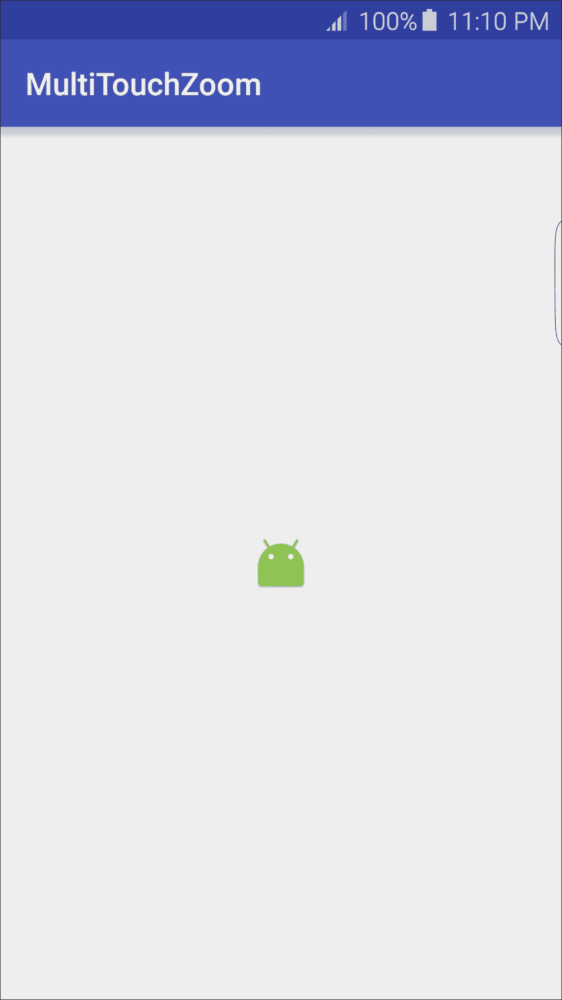
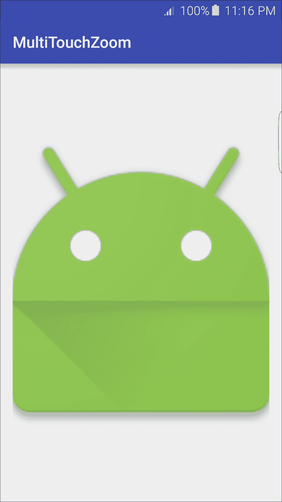
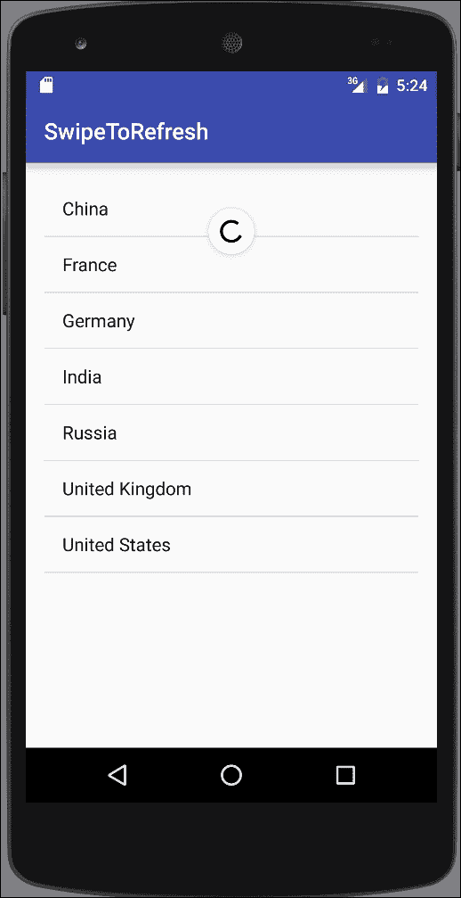
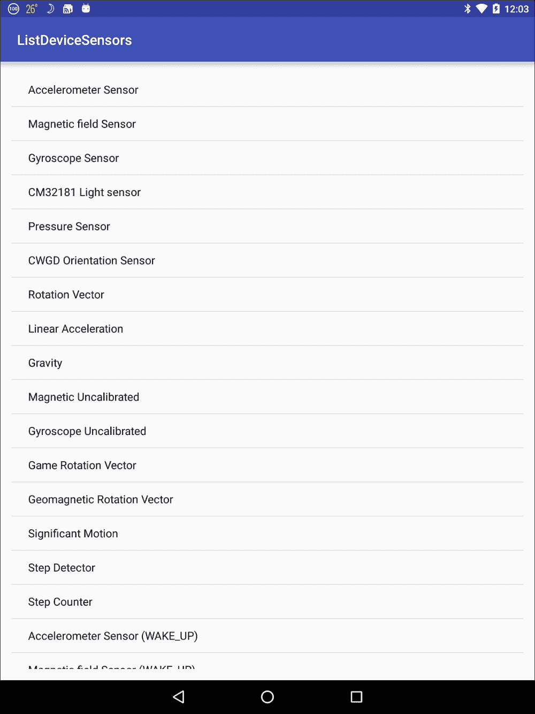

# 第八章。使用触摸屏和传感器

在本章中，我们将涵盖以下主题：

+   监听点击和长按事件

+   识别点击和其他常见手势

+   使用多点触控手势进行捏合缩放

+   滑动刷新

+   列出可用传感器 - Android 传感器框架简介

+   读取传感器数据 - 使用 Android 传感器框架事件

+   读取设备方向

# 简介

这些日子，移动设备充满了传感器，通常包括陀螺仪、磁性、重力、压力和/或温度传感器，更不用说触摸屏了。这为与用户交互提供了许多新的和令人兴奋的选项。通过传感器，您可以确定三维设备位置以及设备本身的使用方式，例如摇晃、旋转、倾斜等。即使是触摸屏也提供了从简单的点击到手势和多点触控的许多新的输入方法。

我们将从这个章节开始，通过探索触摸屏交互来开始，从简单的点击和长按开始，然后继续使用`SimpleOnGestureListener`类检测常见的手势。接下来，我们将查看使用`ScaleGestureDetector`的多点触控，通过捏合缩放手势。

这本书旨在为您提供快速指南，以添加功能和功能到您自己的应用程序中。因此，它侧重于所需的代码。强烈建议您花些时间阅读设计指南。

### 小贴士

Google 手势设计指南，请参阅[`www.google.com/design/spec/patterns/gestures.html`](https://www.google.com/design/spec/patterns/gestures.html)

在本章的后面部分，我们将探讨 Android 中的传感器功能，使用 Android 传感器框架。我们将演示如何获取所有可用传感器的列表，以及如何检查特定传感器。一旦我们获取了传感器，我们将演示设置监听器以读取传感器数据。最后，我们将以确定设备方向的方法结束本章。

# 监听点击和长按事件

几乎每个应用程序都需要识别和响应对基本事件，如点击和长按。这在大多数食谱中是如此基本，我们通常使用 XML 的`onClick`属性，但对于更高级的监听器则需要通过代码设置。

Android 提供了一个事件监听器接口，用于在发生某些操作时接收单个通知，如下列所示：

+   `onClick()`：当视图被按下时调用

+   `onLongClick()`：当视图被长按时调用

+   `onFocusChange()`：当用户导航到或从视图时调用

+   `onKey()`：当硬件键被按下或释放时调用

+   `onTouch()`：当发生触摸事件时调用

这个食谱将演示如何响应用户的点击事件以及长按事件。

## 准备工作

在 Android Studio 中创建一个新的项目，并将其命名为：`PressEvents`。使用默认的 **Phone & Tablet** 选项，并在提示 **Activity Type** 时选择 **Empty Activity**。

## 如何做到这一点...

设置接收基本视图事件非常简单。首先我们将创建一个视图；在我们的例子中，我们将使用按钮，然后在 Activity 的 `onCreate()` 方法中设置事件监听器。以下是步骤：

1.  打开 `activity_main.xml` 并将现有的 `TextView` 替换为以下 `Button`：

    ```java
    <Button
        android:id="@+id/button"
        android:layout_width="wrap_content"
        android:layout_height="wrap_content"
        android:text="Button"
        android:layout_centerVertical="true"
        android:layout_centerHorizontal="true" />
    ```

1.  现在，打开 `MainActivy.java` 并将以下代码添加到现有的 `onCreate()` 方法中：

    ```java
    Button button = (Button)findViewById(R.id.button);
    button.setOnClickListener(new View.OnClickListener() {
        @Override
        public void onClick(View v) {
            Toast.makeText(MainActivity.this, "Click", Toast.LENGTH_SHORT).show();
        }
    });
    button.setOnLongClickListener(new View.OnLongClickListener() {
        @Override
        public boolean onLongClick(View v) {
            Toast.makeText(MainActivity.this, "Long Press", Toast.LENGTH_SHORT).show();
            return true;
        }
    });
    ```

1.  在设备或模拟器上运行应用程序，并尝试常规点击和长按。

## 它是如何工作的...

在本书中使用的多数示例中，我们使用以下属性在 XML 中设置了 `onClick` 监听器：

```java
android:onClick=""
```

您可能会注意到 XML 的 `onClick()` 方法回调需要与 `setOnClickListener` 相同的方法签名。`onClick()` 回调：

```java
public void onClick(View v) {}
```

这是因为当我们使用 XML 的 `onClick` 属性时，Android 会自动为我们设置回调。这个例子还演示了我们可以在一个视图上拥有多个监听器。

最后一点需要注意的是，`onLongClick()` 方法返回一个布尔值，就像大多数其他事件监听器一样。返回 `true` 以指示事件已被处理。

## 还有更多...

尽管按钮通常用于指示用户应“按下”的位置，但我们可以在任何视图上使用 `setOnClickListener()` 和 `setOnLongClickListener()`，甚至是 `TextView`。

如介绍中所述，还有其他事件监听器。您可以使用 Android Studio 的自动完成功能。首先输入以下命令：

```java
button.setOn
```

然后按 *Ctrl* + *Spacebar* 来查看列表。

# 识别点击和其他常见手势

与前一个配方中描述的事件监听器不同，手势需要两步过程：

+   收集运动数据

+   分析数据以确定它是否与已知的手势匹配

第一步开始于用户触摸屏幕时，这会触发 `onTouchEvent()` 回调，并带有在 `MotionEvent` 对象中发送的运动数据。幸运的是，Android 通过 `GestureDetector` 类使第二步，即分析数据，变得更容易，该类可以检测以下手势：

+   `onTouchEvent()`

+   `onDown()`

+   `onFling()`

+   `onLongPress()`

+   `onScroll()`

+   `onShowPress()`

+   `onDoubleTap()`

+   `onDoubleTapEvent()`

+   `onSingleTapConfirmed()`

本配方将演示使用 `GestureDetector.SimpleOnGestureListener` 来识别触摸和双击手势。

## 准备工作

在 Android Studio 中创建一个新的项目，并将其命名为：`CommonGestureDetector`。使用默认的 **Phone & Tablet** 选项，并在提示 **Activity Type** 时选择 **Empty Activity**。

## 如何做到这一点...

我们将使用活动本身来检测手势，因此我们不需要在布局中添加任何视图。打开 `MainActivity.java` 并按照以下步骤操作：

1.  添加以下全局变量：

    ```java
    private GestureDetectorCompat mGestureDetector;
    ```

1.  在 `MainActivity` 类中添加以下 `GestureListener` 类：

    ```java
    private class GestureListener extends GestureDetector.SimpleOnGestureListener {
        @Override
        public boolean onSingleTapConfirmed(MotionEvent e) {
            Toast.makeText(MainActivity.this, "onSingleTapConfirmed", Toast.LENGTH_SHORT).show();
            return super.onSingleTapConfirmed(e);
        }
        @Override
        public boolean onDoubleTap(MotionEvent e) {
            Toast.makeText(MainActivity.this, "onDoubleTap", Toast.LENGTH_SHORT).show();
            return super.onDoubleTap(e);
        }
    }
    ```

1.  如下重写`onTouchEvent()`方法：

    ```java
    public boolean onTouchEvent(MotionEvent event) {
        mGestureDetector.onTouchEvent(event);
        return super.onTouchEvent(event);
    }
    ```

1.  最后，将以下代码行添加到`onCreate()`方法中：

    ```java
    mGestureDetector = new GestureDetectorCompat(this, new GestureListener());
    ```

1.  在设备或模拟器上运行此应用程序。

## 工作原理...

我们使用`GestureDetectorCompat`，它来自 Support Library，允许在运行 Android 1.6 及更高版本的设备上支持手势。

如食谱介绍中所述，检测手势是一个两步过程。为了收集运动或手势数据，我们开始通过触摸事件跟踪运动。每次调用`onTouchEvent()`时，我们将该数据发送到`GestureDetector`。`GestureDetector`处理第二步，即分析数据。一旦检测到手势，就会调用适当的回调。我们的示例处理了单次和双击手势。

## 还有更多...

您的应用程序可以通过简单地重写适当的回调来轻松添加对`GestureDetector`检测到的剩余手势的支持。

## 相关内容

+   查看下一食谱，*使用多指手势进行缩放*，了解多指手势

# 使用多指手势进行缩放

之前的食谱使用了`SimpleOnGestureListener`来提供简单、单指手势的检测。在这个食谱中，我们将使用`SimpleOnScaleGestureListener`类演示多指的缩放手势。

以下截图显示了使用以下食谱创建的应用程序缩放后的图标：



以下截图显示了缩放后的图标：



## 准备工作

在 Android Studio 中创建一个新的项目，并将其命名为：`MultiTouchZoom`。使用默认的**手机和平板电脑**选项，并在提示**活动类型**时选择**空活动**。

## 如何操作...

为了提供缩放手势的视觉指示，我们将使用一个带有应用程序图标的`ImageView`。打开`activity_main.xml`文件，按照以下步骤操作：

1.  将现有的`TextView`替换为以下`ImageView`：

    ```java
    <ImageView
        android:id="@+id/imageView"
        android:layout_width="wrap_content"
        android:layout_height="wrap_content"
        android:src="img/ic_launcher"
        android:layout_centerVertical="true"
        android:layout_centerHorizontal="true" />
    ```

1.  现在打开`MainActivity.java`文件，并将以下全局变量添加到类中：

    ```java
    private ScaleGestureDetector mScaleGestureDetector;
    private float mScaleFactor = 1.0f;
    private ImageView mImageView;
    ```

1.  如下重写`onTouchEvent()`方法：

    ```java
    public boolean onTouchEvent(MotionEvent motionEvent) {
        mScaleGestureDetector.onTouchEvent(motionEvent);
        return true;
    }
    ```

1.  将以下`ScaleListener`类添加到`MainActivity`类中：

    ```java
    private class ScaleListener extends ScaleGestureDetector.SimpleOnScaleGestureListener {
        @Override
        public boolean onScale(ScaleGestureDetector scaleGestureDetector) {
            mScaleFactor *= scaleGestureDetector.getScaleFactor();
            mScaleFactor = Math.max(0.1f, Math.min(mScaleFactor, 10.0f));
            mImageView.setScaleX(mScaleFactor);
            mImageView.setScaleY(mScaleFactor);
            return true;
        }
    }
    ```

1.  将以下代码添加到现有的`onCreate()`方法中：

    ```java
    mImageView=(ImageView)findViewById(R.id.imageView);
    mScaleGestureDetector = new ScaleGestureDetector(this, new ScaleListener());
    ```

1.  要实验缩放功能，请在具有触摸屏的设备上运行应用程序。

## 工作原理...

`ScaleGestureDetector`通过分析手势数据并通过`onScale()`回调报告最终缩放因子来完成所有工作。我们通过在`ScaleGestureDetector`上调用`getScaleFactor()`来获取实际的缩放因子。

我们使用一个`ImageView`来显示应用程序图标，通过设置`ImageView`的缩放来提供缩放的视觉表示。为了防止缩放过大或过小，我们添加了以下检查：

```java
mScaleFactor = Math.max(0.1f, Math.min(mScaleFactor, 10.0f));
```

# 滑动刷新

通过下拉列表来指示手动刷新的称为 Swipe-to-Refresh 手势。这是一个如此常见的功能，以至于这个功能被封装在一个名为`SwipeRefreshLayout`的单个小部件中。

这个菜谱将展示如何使用这个小部件通过`ListView`添加 Swipe-to-Refresh 功能。以下截图显示了刷新动作：



## 准备工作

在 Android Studio 中创建一个新的项目，并将其命名为：`SwipeToRefresh`。使用默认的 **Phone & Tablet** 选项，并在提示 **Activity Type** 时选择 **Empty Activity**。

## 如何做到这一点...

首先，我们需要将 `SwipeRefreshLayout` 小部件和 `ListView` 添加到活动布局中，然后我们将在 Java 代码中实现刷新监听器。以下是详细步骤：

1.  打开 `activity_main.xml` 并将现有的 `<TextView>` 替换为以下内容：

    ```java
    <android.support.v4.widget.SwipeRefreshLayout

        android:id="@+id/swipeRefresh"
        android:layout_width="match_parent"
        android:layout_height="match_parent">
        <ListView
            android:id="@android:id/list"
            android:layout_width="match_parent"
            android:layout_height="match_parent" />
    </android.support.v4.widget.SwipeRefreshLayout>
    ```

1.  现在打开`MainActivity.java`并为该类添加以下全局变量：

    ```java
    SwipeRefreshLayout mSwipeRefreshLayout;
    ListView mListView;
    List mArrayList = new ArrayList<>();
    private int mRefreshCount=0;
    ```

1.  添加以下方法来处理刷新：

    ```java
    private void refreshList() {
        mRefreshCount++;
        mArrayList.add("Refresh: " + mRefreshCount);
        ListAdapter countryAdapter = new ArrayAdapter<String>(this, android.R.layout.simple_list_item_1, mArrayList);
        mListView.setAdapter(countryAdapter);
        mSwipeRefreshLayout.setRefreshing(false);
    }
    ```

1.  将以下代码添加到现有的 `onCreate()` 方法中：

    ```java
    mSwipeRefreshLayout = (SwipeRefreshLayout)findViewById(R.id.swipeRefresh);
    mSwipeRefreshLayout.setOnRefreshListener(new SwipeRefreshLayout.OnRefreshListener() {
        @Override
        public void onRefresh() {
            refreshList();
        }
    });

    mListView = (ListView)findViewById(android.R.id.list);
    final String[] countries = new String[]{"China", "France", "Germany", "India", "Russia", "United Kingdom", "United States"};
    mArrayList = new ArrayList<String>(Arrays.asList(countries));
    ListAdapter countryAdapter = new ArrayAdapter<String>(this, android.R.layout.simple_list_item_1, mArrayList);
    mListView.setAdapter(countryAdapter);
    ```

1.  在设备或模拟器上运行应用程序。

## 它是如何工作的...

这个菜谱的大部分代码都是为了模拟每次调用刷新方法时向 `ListView` 添加项目来模拟刷新。实现 Swipe-to-Refresh 的主要步骤包括：

1.  添加`SwipeRefreshLayout`小部件。

1.  在`SwipeRefreshLayout`内包含`ListView`。

1.  添加`OnRefreshListener`以调用你的刷新方法。

1.  完成更新后调用 `setRefreshing(false)`。

就这样。这个小部件使得添加 Swipe-to-Refresh 变得非常简单！

## 还有更多...

虽然 Swipe-to-Refresh 手势现在是应用程序的常见功能，但仍然是一个好习惯包括一个菜单项（尤其是为了可访问性原因）。以下是菜单布局的 XML 片段：

```java
<menu  >
    <item
        android:id="@+id/menu_refresh"
        android:showAsAction="never"
        android:title="@string/menu_refresh"/>
</menu>
```

在`onOptionsItemSelected()`回调中调用你的刷新方法。当从代码执行刷新，例如从菜单项事件时，你想要通知`SwipeRefreshLayout`刷新，以便它可以更新 UI。使用以下代码执行此操作：

```java
SwipeRefreshLayout.setRefreshing(true);
```

这告诉`SwipeRefreshLayout`一个刷新开始，以便它可以显示正在进行的指示器。

# 列出可用传感器 - Android Sensor Framework 简介

Android 使用 Android Sensor Framework 支持硬件传感器。该框架包括以下类和接口：

+   `SensorManager`

+   `Sensor`

+   `SensorEventListener`

+   `SensorEvent`

大多数 Android 设备都包括硬件传感器，但它们在不同制造商和型号之间差异很大。如果你的应用程序使用传感器，你有两种选择：

+   在 Android Manifest 中指定传感器

+   在运行时检查传感器

要指定你的应用程序使用传感器，请在 Android Manifest 中包含`<uses-feature>`声明。以下是一个需要罗盘可用的示例：

```java
<uses-feature android:name="android.hardware.sensor.compass" android:required="true"/>
```

如果您的应用程序使用指南针，但不需要它来运行，则应将 `android:required="false"` 设置为 `false`，否则应用程序将无法通过 Google Play 获取。

传感器被分为以下三个类别：

+   运动传感器

+   环境传感器

+   位置传感器

Android SDK 提供了对以下传感器类型的支持：

| 传感器 | 检测 | 使用 |
| --- | --- | --- |
| `TYPE_ACCELEROMETER` | 包括重力在内的运动检测 | 用于确定震动、倾斜等 |
| `TYPE_AMBIENT_TEMPERATURE` | 测量环境室温 | 用于确定局部温度 |
| `TYPE_GRAVITY` | 测量三个轴上的重力 | 用于运动检测 |
| `TYPE_GYROSCOPE` | 测量三个轴上的旋转 | 用于确定转向、旋转等 |
| `TYPE_LIGHT` | 测量光照强度 | 用于设置屏幕亮度 |
| `TYPE_LINEAR_ACCELERATION` | 排除重力在内的运动检测 | 用于确定加速度 |
| `TYPE_MAGNETIC_FIELD` | 测量地磁场 | 用于创建指南针或确定方位 |
| `TYPE_PRESSURE` | 测量空气压力 | 用于气压计 |
| `TYPE_PROXIMITY` | 测量屏幕相对于物体的距离 | 用于确定在通话期间设备是否被紧贴耳朵 |
| `TYPE_RELATIVE_HUMIDITY` | 测量相对湿度 | 用于确定露点和湿度 |
| `TYPE_ROTATION_VECTOR` | 测量设备方向 | 用于检测运动和旋转 |

有两个额外的传感器：`TYPE_ORIENTATION` 和 `TYPE_TEMPERATURE`，它们已经被弃用，因为它们已经被新的传感器所取代。

本教程将演示如何检索可用传感器的列表。以下是来自物理设备的截图：



## 准备工作

在 Android Studio 中创建一个新的项目，并将其命名为：`ListDeviceSensors`。使用默认的 **Phone & Tablet** 选项，并在提示选择 **Activity Type** 时选择 **Empty Activity**。

## 如何实现...

首先，我们将查询可用的传感器列表，然后将在 `ListView` 中显示结果。以下是详细步骤：

1.  打开 `activity_main.xml` 并将现有的 `TextView` 替换为以下内容：

    ```java
    <ListView
        android:id="@+id/list"
        android:layout_width="match_parent"
        android:layout_height="match_parent" />
    ```

1.  接下来，打开 `ActivityMain.java` 并将以下代码添加到现有的 `onCreate()` 方法中：

    ```java
    ListView listView = (ListView)findViewById(R.id.list);
    List sensorList = new ArrayList<String>();

    List<Sensor> sensors = ((SensorManager) getSystemService(Context.SENSOR_SERVICE)).getSensorList(Sensor.TYPE_ALL);
    for (Sensor sensor : sensors ) {
        sensorList.add(sensor.getName());
    }
    ListAdapter sensorAdapter = new ArrayAdapter<String>(this, android.R.layout.simple_list_item_1, sensorList);
    listView.setAdapter(sensorAdapter);
    ```

1.  在设备或模拟器上运行程序。

## 工作原理...

以下代码行负责获取可用传感器的列表；其余代码用于填充 `ListView`：

```java
List<Sensor> sensors = ((SensorManager) getSystemService(Context.SENSOR_SERVICE)).getSensorList(Sensor.TYPE_ALL);
```

注意，我们返回了一个 `Sensor` 对象的列表。我们只获取传感器名称以在 `ListView` 中显示，但还有其他属性可用。请参阅 *另请参阅* 部分中提供的链接，以获取完整的列表。

## 还有更多...

如 Nexus 9 的介绍截图所示，一个设备可以拥有多个相同类型的传感器。如果你在寻找特定的传感器，你可以传递介绍中显示的表中的一个常量。在这种情况下，如果你想查看所有可用的加速度计传感器，你可以使用以下调用：

```java
List<Sensor> sensors = sensorManager.getSensorList(Sensor.TYPE_ACCELEROMETER);
```

如果你不是在寻找传感器列表，而是需要与特定传感器一起工作，你可以使用以下代码检查默认传感器：

```java
if (sensorManager.getDefaultSensor(Sensor.TYPE_ACCELEROMETER) != null){
    //Sensor is available - do something here
}
```

## 参见

+   **Android 开发者传感器**网站：[`developer.android.com/reference/android/hardware/Sensor.html`](http://developer.android.com/reference/android/hardware/Sensor.html)

# 读取传感器数据 – 使用 Android 传感器框架事件

前一个示例，*列出可用传感器 – Android 传感器框架简介*，提供了对 Android 传感器框架的介绍。现在我们将通过使用`SensorEventListener`来查看如何读取传感器数据。`SensorEventListener`接口只有两个回调：

+   `onSensorChanged`()

+   `onAccuracyChanged`()

当传感器有新的数据要报告时，它会调用带有`SensorEvent`对象的`onSensorChanged()`。本示例将演示如何读取光传感器，但由于所有传感器都使用相同的框架，因此将此示例适配到任何其他传感器都非常容易。（参见前一个示例介绍中提供的传感器类型列表。）

## 准备工作

在 Android Studio 中创建一个新的项目，并将其命名为：`ReadingSensorData`。使用默认的**手机和平板**选项，并在提示**活动类型**时选择**空活动**。

## 如何操作...

我们将在活动布局中添加一个`TextView`来显示传感器数据，然后我们将添加`SensorEventListener`到 Java 代码中。我们将使用`onResume()`和`onPause()`事件来启动和停止我们的事件监听器。要开始，请打开`activity_main.xml`并按照以下步骤操作：

1.  按照以下方式修改现有的`TextView`：

    ```java
    <TextView
        android:id="@+id/textView"
        android:layout_width="wrap_content"
        android:layout_height="wrap_content"
        android:layout_centerHorizontal="true"
        android:layout_centerVertical="true"
        android:text="0"/>
    ```

1.  现在打开`MainActivity.java`并添加以下全局变量声明：

    ```java
    private SensorManager mSensorManager;
    private Sensor mSensor;
    private TextView mTextView;
    ```

1.  按照以下方式将`SensorListener`类添加到`MainActivity`类中：

    ```java
    private SensorEventListener mSensorListener = new SensorEventListener() {
        @Override
        public void onSensorChanged(SensorEvent event) {
            mTextView.setText(String.valueOf(event.values[0]));
        }
        @Override
        public void onAccuracyChanged(Sensor sensor, int accuracy) {
            //Nothing to do
        }
    };
    ```

1.  我们将在`onResume()`和`onPause()`中注册和注销传感器事件，如下所示：

    ```java
    @Override
    protected void onResume() {
        super.onResume();
        mSensorManager.registerListener(mSensorListener, mSensor, SensorManager.SENSOR_DELAY_NORMAL);
    }

    @Override
    protected void onPause() {
        super.onPause();
        mSensorManager.unregisterListener(mSensorListener);
    }
    ```

1.  将以下代码添加到`onCreate()`中：

    ```java
    mTextView = (TextView)findViewById(R.id.textView);
    mSensorManager = (SensorManager) getSystemService(Context.SENSOR_SERVICE);
    mSensor = mSensorManager.getDefaultSensor(Sensor.TYPE_LIGHT);
    ```

1.  你现在可以在物理设备上运行应用程序，以查看来自光传感器的原始数据。

## 它是如何工作的...

使用 Android 传感器框架首先是从获取传感器开始，我们在`onCreate()`中这样做。在这里，我们调用`getDefaultSensor()`，请求`TYPE_LIGHT`。我们在`onResume()`中注册监听器，并在`onPause()`中再次注销以减少电池消耗。当我们调用`registerListener()`时，我们传递我们的`mSensorListener`对象。

在我们的案例中，我们只关注传感器数据，这些数据是在`onSensorChanged()`回调中发送的。当传感器发生变化时，我们会用传感器数据更新`TextView`。

## 还有更多...

现在你已经使用了一个传感器，你知道如何使用所有传感器，因为它们都使用相同的框架。当然，你对数据的处理将因读取的数据类型而大不相同。环境传感器，如这里所示，返回单个值，但位置和运动传感器也可以返回额外的元素，如下所示。

### 环境传感器

Android 支持以下四种环境传感器：

+   湿度

+   光线

+   压力

+   温度

环境传感器通常更容易处理，因为返回的数据是单个元素，通常不需要校准或过滤。我们使用光线传感器进行此演示，因为大多数设备都包含光线传感器以控制屏幕亮度。

### 位置传感器

位置传感器包括：

+   地磁场

+   接近度

以下传感器类型使用地磁场：

+   `TYPE_GAME_ROTATION_VECTOR`

+   `TYPE_GEOMAGNETIC_ROTATION_VECTOR`

+   `TYPE_MAGNETIC_FIELD`

+   `TYPE_MAGNETIC_FIELD_UNCALIBRATED`

这些传感器在`onSensorChanged()`事件中返回三个值，除了`TYPE_MAGNETIC_FIELD_UNCALIBRATED`，它发送六个值。

第三个传感器，方向传感器已被弃用，现在建议使用`getRotation()`和`getRotationMatrix()`来计算方向变化。（有关设备方向，如纵向和横向模式，请参阅下一配方：*读取设备方向*。）

### 运动传感器

运动传感器包括以下内容：

+   加速度计

+   惯性传感器

+   重力

+   线性加速度

+   旋转向量

这些包括以下传感器类型：

+   `TYPE_ACCELEROMETE`

+   `TYPE_GRAVITY`

+   `TYPE_GYROSCOPE`

+   `TYPE_GYROSCOPE_UNCALIBRATED`

+   `TYPE_LINEAR_ACCELERATION`

+   `TYPE_ROTATION_VECTOR`

+   `TYPE_SIGNIFICANT_MOTION`

+   `TYPE_STEP_COUNTER`

+   `TYPE_STEP_DETECTOR`

这些传感器也包括三个数据元素，除了最后三个。`TYPE_SIGNIFICANT_MOTION`和`TYPE_STEP_DETECTOR`表示一个事件，而`TYPE_STEP_COUNTER`返回自上次启动（传感器处于活动状态）以来的步数。

## 参见

+   *列出可用传感器 - Android 传感器框架简介*配方

+   在第九章 *图形和动画*的*使用传感器数据和 RotateAnimation 创建指南针*配方中

+   关于设备方向，请参阅*读取设备方向*配方

+   第十三章 *获取位置和使用地理围栏*，涵盖了*GPS 和位置*配方

# 读取设备方向

虽然 Android 框架会在方向改变时自动加载新的资源（如布局），但有时你可能希望禁用此行为。如果你希望被通知方向改变而不是 Android 自动处理，请将以下属性添加到 AndroidManifest 中的 Activity：

```java
android:configChanges="keyboardHidden|orientation|screenSize"
```

当以下配置更改之一发生时，系统将通过`onConfigurationChanged()`方法通知你，而不是自动处理：

+   `keyboardHidden`

+   `orientation`

+   `screenSize`

`onConfigurationChanged()`的签名如下：

```java
onConfigurationChanged (Configuration newConfig)
```

你将在`newConfig.orientation`中找到新的方向。

### 小贴士

禁用自动配置更改（这会导致布局重新加载并重置状态信息）不应作为正确保存状态信息的替代方案。你的应用程序仍然可能在任何时候被中断或完全停止，并由系统杀死。（有关正确保存状态信息，请参阅第一章中的*保存活动状态*。）

本配方将演示如何确定当前设备方向。

## 准备工作

在 Android Studio 中创建一个新的项目，并将其命名为：`GetDeviceOrientation`。使用默认的**手机和平板**选项，并在提示**活动类型**时选择**空活动**。

## 如何操作...

我们将在布局中添加一个按钮以按需检查方向。首先打开`activity_main.xml`，然后按照以下步骤操作：

1.  将现有的`TextView`替换为以下`Button`：

    ```java
    <Button
        android:layout_width="wrap_content"
        android:layout_height="wrap_content"
        android:text="Check Orientation"
        android:id="@+id/button"
        android:layout_centerVertical="true"
        android:layout_centerHorizontal="true"
        android:onClick="checkOrientation"/>
    ```

1.  添加以下方法来处理按钮点击：

    ```java
    public void checkOrientation(View view){
        int orientation = getResources().getConfiguration().orientation;
        switch (orientation) {
            case Configuration.ORIENTATION_LANDSCAPE:
                Toast.makeText(MainActivity.this, "ORIENTATION_LANDSCAPE", Toast.LENGTH_SHORT).show();
                break;
            case Configuration.ORIENTATION_PORTRAIT:
                Toast.makeText(MainActivity.this, "ORIENTATION_PORTRAIT", Toast.LENGTH_SHORT).show();
                break;
            case Configuration.ORIENTATION_UNDEFINED:
                Toast.makeText(MainActivity.this, "ORIENTATION_UNDEFINED", Toast.LENGTH_SHORT).show();
                break;
        }
    }
    ```

1.  在设备或模拟器上运行应用程序。

    ### 小贴士

    使用*Ctrl* + *F11*旋转模拟器。

## 的工作原理...

要获取当前方向，我们只需调用以下代码行：

```java
getResources().getConfiguration().orientation
```

方向以`int`类型返回，我们将其与三个可能值之一进行比较，如下所示。

## 还有更多...

### 获取当前设备旋转

另一个你可能需要知道当前方向的情况是在处理相机数据——图片和/或视频时。通常，图像可能会根据设备方向或为了补偿当前方向而旋转。在这种情况下，还有另一个选项可以获取旋转：

```java
int rotation = getWindowManager().getDefaultDisplay().getRotation();
```

在前面的代码行中，`rotation`将是以下值之一：

+   `Surface.ROTATION_0`

+   `Surface.ROTATION_90`

+   `Surface.ROTATION_180`

+   `Surface.ROTATION_270`

### 小贴士

旋转值将来自其正常方向。例如，当使用具有正常方向为横屏的表格时，如果以竖屏方向拍照，值将是`ROTATION_90`或`ROTATION_270`。

## 参见

+   第一章中“活动”的*保存活动状态*配方

+   请参阅[配置开发者链接](http://developer.android.com/reference/android/content/res/Configuration.html)。

+   请参阅[显示开发者链接](http://developer.android.com/reference/android/view/Display.html#getRotation())。
