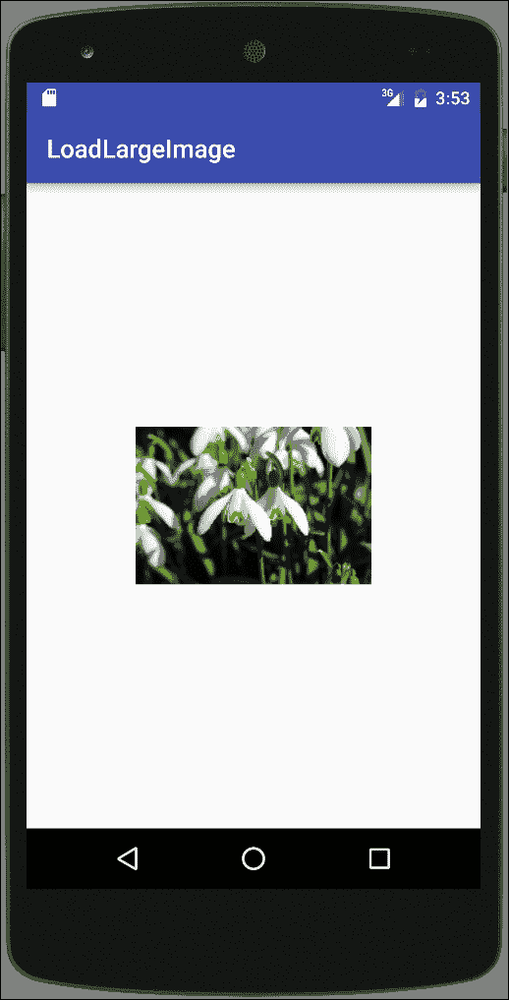
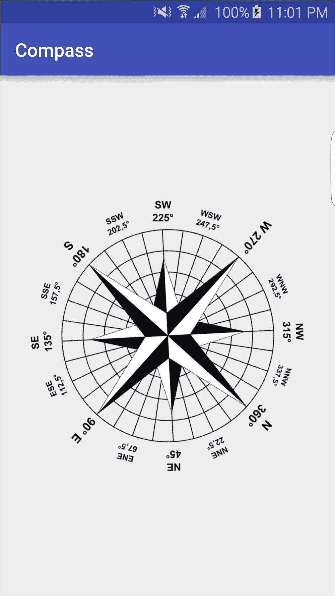
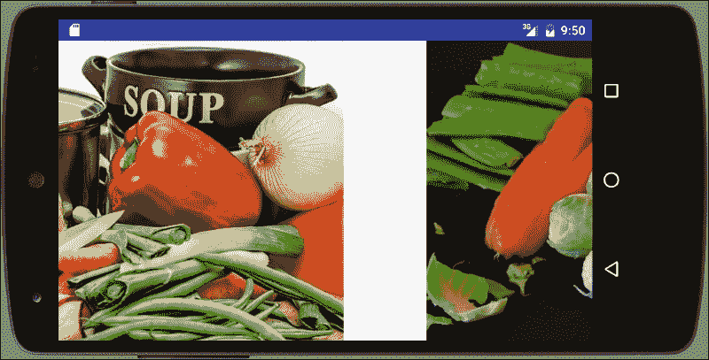
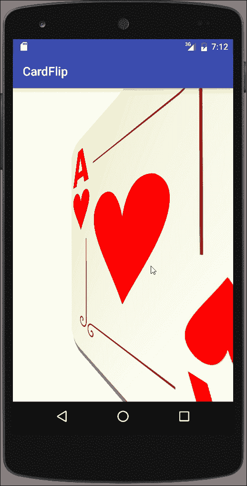
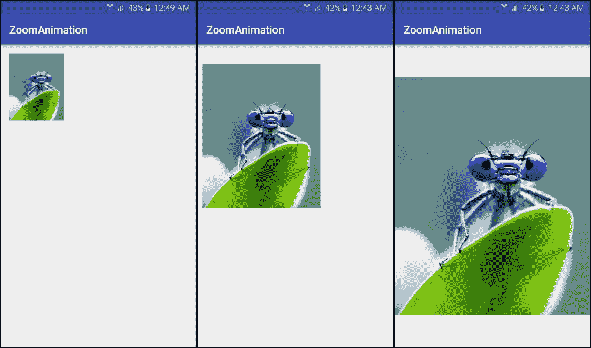

# 第九章. 图形和动画

在本章中，我们将涵盖以下主题：

+   缩小大型图像以避免内存不足异常

+   过渡动画 - 定义场景并应用过渡

+   使用传感器数据和 RotateAnimation 创建指南针

+   使用 ViewPager 创建幻灯片

+   使用片段创建卡片翻转动画

+   使用自定义过渡创建缩放动画

# 简介

动画可以既美观又实用，如简单的按钮按下所示。按钮按下的图形表示使应用程序生动起来，同时它通过给用户提供对事件的视觉响应来提供功能价值。

Android 框架提供了几个动画系统，以使在您的应用程序中包含动画变得更加容易。它们包括以下内容：

+   **视图动画**：(原始的动画系统。)它通常需要更少的代码，但动画选项有限

+   **属性动画**：这是一个更灵活的系统，允许动画化任何对象的任何属性

+   **可绘制动画**：它使用可绘制资源来创建帧帧动画（如电影）

属性动画系统是在 Android 3.0 中引入的，由于它的灵活性，通常比视图动画更受欢迎。视图动画的主要缺点包括：

+   可以动画化的方面有限 - 例如缩放和旋转

+   只能动画视图的内容 - 它不能改变视图在屏幕上的绘制位置（因此不能动画化在屏幕上移动的球）

+   只能动画视图对象

这里是一个简单的示例，演示了如何使用视图动画来“闪烁”视图（按钮按下的简单模拟）：

```java
Animation blink =AnimationUtils.loadAnimation(this,R.anim.blink);
view.startAnimation(blink);
```

这里是位于`res/anim`文件夹中的`blink.xml`资源文件的 内容：

```java
<?xml version="1.0" encoding="utf-8"?>
<set >
    <alpha android:fromAlpha="1.0"
        android:toAlpha="0.0"
        android:background="#000000"
        android:interpolator="@android:anim/linear_interpolator"
        android:duration="100"
        android:repeatMode="restart"
        android:repeatCount="0"/>
</set>
```

如您所见，创建此动画非常简单，因此如果视图动画实现了您的目标，请使用它。当它不符合您的需求时，转向属性动画系统。我们将在*使用片段创建卡片翻转动画*和*使用自定义过渡创建缩放动画*菜谱中演示属性动画。

*过渡动画 - 定义场景并应用过渡* 菜单将提供有关 Android 过渡框架的更多信息，我们将在许多菜谱中使用它。

### 注意

插值器是一个定义动画变化率的函数。

在本章和前面的闪烁示例中，将提到`Interpolators`。插值器定义了过渡的计算方式。线性插值器将在设定的持续时间内均匀地计算变化，而`AccelerateInterpolator`函数将创建一个在持续时间内更快的移动。以下是可用的完整插值器列表，以及相应的 XML 标识符：

+   `AccelerateDecelerateInterpolator (@android:anim/accelerate_decelerate_interpolator)`

+   `AccelerateInterpolator (@android:anim/accelerate_interpolator)`

+   `AnticipateInterpolator (@android:anim/anticipate_interpolator)`

+   `AnticipateOvershootInterpolator (@android:anim/anticipate_overshoot_interpolator)`

+   `BounceInterpolator (@android:anim/bounce_interpolator)`

+   `CycleInterpolator (@android:anim/cycle_interpolator)`

+   `DecelerateInterpolator (@android:anim/decelerate_interpolator)`

+   `LinearInterpolator (@android:anim/linear_interpolator)`

+   `OvershootInterpolator (@android:anim/overshoot_interpolator)`

虽然动画通常不需要太多内存，但图形资源通常需要。你可能想要处理的许多图像往往超过了可用设备内存。在本章的第一个菜谱中，*将大图像缩小以避免内存不足异常*，我们将讨论如何子采样（或缩小）图像。

# 将大图像缩小以避免内存不足异常

处理图像可能会非常消耗内存，通常会导致你的应用程序因 *内存不足* 异常而崩溃。这尤其适用于用设备相机拍摄的图片，因为它们的分辨率通常比设备本身要高得多。

由于在这个例子中，加载比 UI 支持的更高分辨率的图像不会提供任何视觉上的好处，这个菜谱将演示如何为显示获取图像的小样本。我们将使用 `BitmapFactory` 首先检查图像大小，然后加载一个缩小后的图像。

这里是一个从这个菜谱中截取的屏幕截图，显示了非常大的图像的缩略图：



## 准备就绪

在 Android Studio 中创建一个新的项目，并将其命名为：`LoadLargeImage`。使用默认的 **Phone & Tablet** 选项，并在提示 **Activity Type** 时选择 **Empty Activity**。

为了这个菜谱，我们需要一个大图像；所以我们转向 [www.Pixabay.com](http://www.Pixabay.com) 获取一个图像。由于图像本身并不重要，我们下载了当时显示的第一张图像。（完整尺寸的图像是 6000 x 4000 和 3.4MB。）

## 如何操作...

如前所述在 *准备就绪* 中，我们需要一个大图像来演示缩放。一旦你有了图像，请按照以下步骤操作：

1.  将图像复制到 `res/drawable` 目录下，命名为 `image_large.jpg`（如果你选择不同的文件类型，请使用适当的扩展名）。

1.  打开 `activity_main.xml` 并将现有的 `TextView` 替换为以下 `ImageView`：

    ```java
    <ImageView
        android:id="@+id/imageViewThumbnail"
        android:layout_width="100dp"
        android:layout_height="100dp"
        android:layout_centerInParent="true" />
    ```

1.  现在打开 `MainActivity.java` 并添加以下方法，我们将在稍后解释：

    ```java
    public Bitmap loadSampledResource(int imageID, int targetHeight, int targetWidth) {
        final BitmapFactory.Options options = new BitmapFactory.Options();
        options.inJustDecodeBounds = true;
        BitmapFactory.decodeResource(getResources(), imageID, options);
        final int originalHeight = options.outHeight;
        final int originalWidth = options.outWidth;
        int inSampleSize = 1;
        while ((originalHeight / (inSampleSize *2)) > targetHeight && (originalWidth / (inSampleSize *2)) > targetWidth) {
            inSampleSize *= 2;
        }
        options.inSampleSize = inSampleSize;
        options.inJustDecodeBounds = false;
        return BitmapFactory.decodeResource(getResources(), imageID, options);
    }
    ```

1.  将以下代码添加到现有的 `onCreate()` 方法中：

    ```java
    ImageView imageView = (ImageView)findViewById(R.id.imageViewThumbnail);
    imageView.setImageBitmap(loadSampledResource(R.drawable.image_large, 100, 100));
    ```

1.  在设备或模拟器上运行应用程序。

## 它是如何工作的...

`loadSampledResource()`方法的目的在于加载一个较小的图像，以减少图像的内存消耗。如果我们尝试加载从[www.Pixabay.Com](http://www.Pixabay.Com)（见前面的*准备就绪*部分）选择的完整图像，应用程序将需要超过 3 MB 的 RAM 来加载。这比大多数设备能处理的内存还要多（至少目前是这样），即使它能完全加载，也不会为我们的缩略图视图提供任何视觉上的好处。

为了避免`内存不足`的情况，我们使用`BitmapFactory.Options`的`inSampleSize`属性来减少或子采样图像。（如果我们设置`inSampleSize=2`，则图像将减半。如果我们使用`inSampleSize=4`，则图像将减为四分之一）要计算`inSampleSize`，首先我们需要知道图像大小。我们可以使用以下`inJustDecodeBounds`属性：

```java
options.inJustDecodeBounds = true;
```

这告诉`BitmapFactory`获取图像尺寸而不实际存储图像内容。一旦我们有了图像大小，我们使用以下代码计算样本：

```java
while ((originalHeight / (inSampleSize *2)) > targetHeight && (originalWidth / (inSampleSize *2)) > targetWidth) {
        inSampleSize *= 2;
}
```

这段代码的目的是确定最大的样本大小，不会将图像降低到目标尺寸以下。为此，我们将样本大小加倍并检查其是否超过目标尺寸。如果没有，我们保存加倍后的样本大小并重复。一旦减小后的尺寸低于目标尺寸，我们就使用最后保存的`inSampleSize`。

### 注意

从`inSampleSize`文档（以下*另请参阅*部分的链接）中，请注意，解码器使用基于 2 的幂的最终值，任何其他值都将四舍五入到最接近的 2 的幂。

一旦我们有了样本大小，我们设置`inSampleSize`属性并将`inJustDecodeBounds`设置为`false`，以正常加载。以下是代码：

```java
options.inSampleSize = inSampleSize;
options.inJustDecodeBounds = false;
```

需要注意的是，这个菜谱展示了将任务应用于您自己的应用程序的概念。加载和处理图像可能是一个耗时的操作，这可能导致您的应用程序停止响应。这不是一个好现象，可能会导致 Android 显示**应用程序无响应**（**ANR**）对话框。建议在后台线程上执行长时间任务以保持 UI 线程的响应性。`AsyncTask`类可用于执行后台网络处理，但还有许多其他库可供选择（菜谱末尾的链接）：

+   **Volley**：在网络中执行快速、可扩展的 UI 操作（见第十二章，*电话、网络和互联网*）

+   **Picasso**：一个强大的 Android 图像下载和缓存库

+   **Android 通用图像加载器**：一个用于加载、缓存和显示图像的强大且灵活的库

## 还有更多...

重要的是要注意，我们传递给 `loadSampledResource()` 方法的 `targetHeight` 和 `targetWidth` 参数实际上并没有设置图片大小。如果你使用与我们相同的尺寸的图片运行应用程序，样本大小将为 32，导致加载的图片大小为 187 x 125。

如果你的布局需要特定大小的图片，你可以在布局文件中设置大小，或者可以直接使用 Bitmap 类修改图片大小。

## 参见

+   **开发者文档：BitmapFactory.inSampleSize()** 在 [`developer.android.com/reference/android/graphics/BitmapFactory.Options.html#inSampleSize`](https://developer.android.com/reference/android/graphics/BitmapFactory.Options.html#inSampleSize)

+   参考位于 [`github.com/nostra13/Android-Universal-Image-Loader`](https://github.com/nostra13/Android-Universal-Image-Loader) 的 **Android Universal Image Loader** 页面

+   请参考**毕加索**的[`square.github.io/picasso/`](https://square.github.io/picasso/)

+   检查 第十四章 中的 *AsyncTask* 任务，*为 Play 商店准备你的应用*，以在后台线程上处理长时间运行的操作。

# 过渡动画 - 定义场景并应用过渡

Android Transition 框架提供了以下功能：

+   **组级动画**：动画应用于层次结构中的所有视图

+   **基于过渡的动画**：基于起始和结束属性变化的动画

+   **内置动画**：一些常见的过渡效果，如淡入/淡出和移动

+   **资源文件支持**：将动画值保存到资源（XML）文件中，在运行时加载

+   **生命周期回调**：在动画期间接收回调通知

过渡动画由以下组成：

+   **起始场景**：动画开始时的视图（或 `ViewGroup`）

+   **Transition**：更改类型（见后文）

+   **结束场景**：结束视图（或 `ViewGroup`）

+   **过渡效果**：Android 提供了对以下三种过渡效果的内置支持：

    +   **AutoTransition（默认过渡）**：淡出，移动，然后调整大小，最后淡入（按此顺序）

    +   **淡入淡出**：淡入，淡出（默认），或两者（指定顺序）

    +   **ChangeBounds**：移动和调整大小

Transition 框架将自动创建从起始场景到结束场景所需的所有帧以进行动画。

以下是在使用以下类时 Transition 框架的一些已知限制：

+   **SurfaceView**：由于 `SurfaceView` 动画是在非 UI 线程上执行的，因此动画可能不正确，可能与应用程序不同步

+   **TextView**：动画文本大小变化可能无法正确执行，导致文本跳转到最终状态

+   **AdapterView**：扩展 `AdapterView` 的类，如 `ListView` 和 `GridView`，可能会挂起

+   **TextureView**：某些过渡可能无法正常工作

本菜谱提供了一个关于使用过渡动画系统的快速教程。我们将从定义场景和过渡资源开始，然后应用过渡，从而创建动画。以下步骤将指导你创建 XML 中的资源，因为这通常是推荐的。资源也可以通过代码创建，我们将在*还有更多*部分中讨论。

## 准备工作

在 Android Studio 中创建一个新的项目，并将其命名为：`TransitionAnimation`。在**目标 Android 设备**对话框中，选择**手机和平板**选项，并选择 API 19（或更高）作为**最小 SDK**。当提示**活动类型**时，选择**空活动**。

## 如何操作...

创建资源文件和应用过渡动画的步骤如下：

1.  按如下方式更改现有的`activity.main.xml`布局文件：

    ```java
    <?xml version="1.0" encoding="utf-8"?>
    <RelativeLayout 

        android:id="@+id/layout"
        android:layout_width="match_parent"
        android:layout_height="match_parent">
        <TextView
            android:layout_width="wrap_content"
            android:layout_height="wrap_content"
            android:text="Top"
            android:id="@+id/textViewTop"
            android:layout_alignParentTop="true"
            android:layout_centerHorizontal="true" />
        <TextView
            android:layout_width="wrap_content"
            android:layout_height="wrap_content"
            android:text="Bottom"
            android:id="@+id/textViewBottom"
            android:layout_alignParentBottom="true"
            android:layout_centerHorizontal="true" />
        <Button
            android:layout_width="wrap_content"
            android:layout_height="wrap_content"
            android:text="Go"
            android:id="@+id/button"
            android:layout_centerInParent="true"
            android:onClick="goAnimate"/>
    </RelativeLayout>
    ```

1.  使用以下 XML 创建一个名为`activity_main_end.xml`的新布局文件：

    ```java
    <?xml version="1.0" encoding="utf-8"?>
    <RelativeLayout 

        android:id="@+id/layout"
        android:layout_width="match_parent"
        android:layout_height="match_parent">
        <TextView
            android:layout_width="wrap_content"
            android:layout_height="wrap_content"
            android:text="Bottom"
            android:id="@+id/textViewBottom"
            android:layout_alignParentTop="true"
            android:layout_centerHorizontal="true" />
        <TextView
            android:layout_width="wrap_content"
            android:layout_height="wrap_content"
            android:text="Top"
            android:id="@+id/textViewTop"
            android:layout_alignParentBottom="true"
            android:layout_centerHorizontal="true" />
        <Button
            android:layout_width="wrap_content"
            android:layout_height="wrap_content"
            android:text="Go"
            android:id="@+id/button"
            android:layout_centerInParent="true"/>
    </RelativeLayout>
    ```

1.  创建一个新的过渡资源目录（**文件** | **新建** | **Android 资源目录**，并选择**过渡**作为**资源类型**）。

1.  在`res/transition`文件夹中创建一个名为`transition_move.xml`的新文件，使用以下 XML：

    ```java
    <?xml version="1.0" encoding="utf-8"?>
    <changeBounds  />
    ```

1.  使用以下代码添加`goAnimate()`方法：

    ```java
    public void goAnimate(View view) {
        ViewGroup root = (ViewGroup) findViewById(R.id.layout);
        Scene scene = Scene.getSceneForLayout(root, R.layout.activity_main_end, this);
        Transition transition = TransitionInflater.from(this).inflateTransition(R.transition.transition_move);
        TransitionManager.go(scene, transition);
    }
    ```

1.  你现在可以运行应用程序在设备或模拟器上。

## 它是如何工作的...

你可能觉得代码本身相当简单。正如在菜谱介绍中概述的那样，我们只需要创建起始场景和结束场景，并设置过渡类型。以下是代码的详细分解。

### 创建起始场景

执行以下代码行将创建起始场景：

```java
ViewGroup root = (ViewGroup) findViewById(R.id.layout);
```

### 创建过渡：

执行以下代码行将创建过渡：

```java
Transition transition = TransitionInflater.from(this).inflateTransition(R.transition.transition_move);
```

### 定义结束场景：

执行以下代码行将定义结束场景：

```java
Scene scene = Scene.getSceneForLayout(root, R.layout.activity_main_end, this);
```

### 开始过渡：

执行以下代码行将开始过渡：

```java
TransitionManager.go(scene, transition);
```

虽然简单，但这个菜谱的大部分工作都在于创建必要的资源文件。

## 还有更多...

现在，我们将查看如何仅使用代码创建相同的过渡动画（尽管我们仍然会使用初始的`activity_main.xml`布局文件）：

```java
ViewGroup root = (ViewGroup) findViewById(R.id.layout);
Scene scene = new Scene(root);

Transition transition = new ChangeBounds();
TransitionManager.beginDelayedTransition(root,transition);

TextView textViewTop = (TextView)findViewById(R.id.textViewTop);
RelativeLayout.LayoutParams params = (RelativeLayout.LayoutParams)textViewTop.getLayoutParams();
params.addRule(RelativeLayout.ALIGN_PARENT_BOTTOM,1);
params.addRule(RelativeLayout.ALIGN_PARENT_TOP, 0);
textViewTop.setLayoutParams(params);

TextView textViewBottom = (TextView)findViewById(R.id.textViewBottom);
params = (RelativeLayout.LayoutParams)textViewBottom.getLayoutParams();
params.addRule(RelativeLayout.ALIGN_PARENT_BOTTOM,0);
params.addRule(RelativeLayout.ALIGN_PARENT_TOP, 1);
textViewBottom.setLayoutParams(params);

TransitionManager.go(scene);
```

我们仍然需要起始场景、结束场景和过渡；唯一的区别是我们如何创建资源。在之前的代码中，我们使用当前布局创建了起始场景。

在我们开始通过代码修改布局之前，我们使用过渡类型调用`TransitionManager`的`beginDelayedTransition()`方法。`TransitionManager`将跟踪结束场景的变化。当我们调用`go()`方法时，`TransitionManager`会自动动画化变化。

## 相关内容

+   参考动画资源网页[`developer.android.com/guide/topics/resources/animation-resource.html`](https://developer.android.com/guide/topics/resources/animation-resource.html)

# 使用传感器数据和 RotateAnimation 创建指南针

在上一章中，我们展示了从物理设备传感器读取传感器数据的方法。在那个配方中，我们使用了光传感器，因为环境传感器的数据通常不需要任何额外的处理。虽然获取磁场强度数据很容易，但这些数字本身并没有太多意义，当然也不会创建一个吸引人的显示。

在这个配方中，我们将展示如何获取磁场数据以及加速度计数据来计算磁北。我们将使用 `SensorManager.getRotationMatrix` 来在响应设备移动时动画化指南针。以下是我们在物理设备上的指南针应用程序的截图：



## 准备工作

在 Android Studio 中创建一个新的项目，并将其命名为：`Compass`。使用默认的 **Phone & Tablet** 选项，并在提示 **Activity Type** 时选择 **Empty Activity**。

我们需要一个图像来表示指南针指示器。同样，我们可以转向 [www.Pixabay.Com](http://www.Pixabay.Com) 来获取图像。我们使用了以下图像：

[`pixabay.com/en/geography-map-compass-rose-plot-42608/`](https://pixabay.com/en/geography-map-compass-rose-plot-42608/)

虽然不是必需的，但这个图像有一个透明的背景，当旋转图像时看起来更好。

## 如何操作...

如前一个 *准备工作* 部分所述，我们需要一个指南针的图像。你可以下载之前链接的图像，或者使用你喜欢的任何图像，然后按照以下步骤操作：

1.  将你的图像复制到 `res/drawable` 文件夹，并命名为 `compass.png`。

1.  打开 `activity_main.xml` 并将现有的 `TextView` 替换为以下 `ImageView`：

    ```java
    <ImageView
        android:id="@+id/imageViewCompass"
        android:layout_width="wrap_content"
        android:layout_height="wrap_content"
        android:layout_centerInParent="true"
        android:src="img/compass"/>
    ```

1.  现在打开 `MainActivity.java` 并添加以下全局变量声明：

    ```java
    private SensorManager mSensorManager;
    private Sensor mMagnetometer;
    private Sensor mAccelerometer;
    private ImageView mImageViewCompass;
    private float[] mGravityValues=new float[3];
    private float[] mAccelerationValues=new float[3];
    private float[] mRotationMatrix=new float[9];
    private float mLastDirectionInDegrees = 0f;
    ```

1.  将以下 `SensorEventListener` 类添加到 `MainActivity` 类中：

    ```java
    private SensorEventListener mSensorListener = new SensorEventListener() {
        @Override
        public void onSensorChanged(SensorEvent event) {
            calculateCompassDirection(event);
        }
        @Override
        public void onAccuracyChanged(Sensor sensor, int accuracy) {
            //Nothing to do
        }
    };
    ```

1.  如下重写 `onResume()` 和 `onPause()`：

    ```java
    @Override
    protected void onResume() {
        super.onResume();
        mSensorManager.registerListener(mSensorListener, mMagnetometer, SensorManager.SENSOR_DELAY_FASTEST);
        mSensorManager.registerListener(mSensorListener, mAccelerometer, SensorManager.SENSOR_DELAY_FASTEST);
    }

    @Override
    protected void onPause() {
        super.onPause();
        mSensorManager.unregisterListener(mSensorListener);
    }
    ```

1.  将以下代码添加到现有的 `onCreate()` 方法中：

    ```java
    mImageViewCompass=(ImageView)findViewById(R.id.imageViewCompass);
    mSensorManager = (SensorManager) getSystemService(Context.SENSOR_SERVICE);
    mMagnetometer = mSensorManager.getDefaultSensor(Sensor.TYPE_MAGNETIC_FIELD);
    mAccelerometer = mSensorManager.getDefaultSensor(Sensor.TYPE_ACCELEROMETER);
    ```

1.  最终的代码执行实际的计算和动画：

    ```java
    private void calculateCompassDirection(SensorEvent event) {
        switch (event.sensor.getType()) {
            case Sensor.TYPE_ACCELEROMETER:
                mAccelerationValues = event.values.clone();
                break;
            case Sensor.TYPE_MAGNETIC_FIELD:
                mGravityValues = event.values.clone();
                break;
        }
        boolean success = SensorManager.getRotationMatrix(mRotationMatrix, null, mAccelerationValues, mGravityValues);
        if(success){
            float[] orientationValues = new float[3];
            SensorManager.getOrientation(mRotationMatrix, orientationValues);
            float azimuth = (float)Math.toDegrees(-orientationValues[0]);
            RotateAnimation rotateAnimation = new RotateAnimation(mLastDirectionInDegrees, azimuth, Animation.RELATIVE_TO_SELF, 0.5f, Animation.RELATIVE_TO_SELF, 0.5f);
            rotateAnimation.setDuration(50);
            rotateAnimation.setFillAfter(true);
            mImageViewCompass.startAnimation(rotateAnimation);
            mLastDirectionInDegrees = azimuth;
        }
    ```

1.  你已经准备好运行应用程序了。虽然你可以在模拟器上运行这个应用程序，但没有加速度计和磁力计，你将看不到指南针移动。

## 工作原理...

由于我们已经在 *读取传感器数据 – 使用 Android 传感器框架*（来自上一章）中介绍了读取传感器数据，因此我们不会重复解释传感器框架，而是直接跳到 `calculateCompassDirection()` 方法。

我们直接从`onSensorChanged()`回调中调用此方法。由于我们使用同一个类来处理磁力计和加速度计的传感器回调，我们首先检查`SensorEvent`中报告的是哪个传感器。然后我们调用`SensorManager.getRotationMatrix()`，传入最后的传感器数据。如果计算成功，它将返回一个`RotationMatrix`，我们使用它来调用`SensorManager.getOrientation()`方法。`getOrientation()`将在`orientationValues`数组中返回以下数据：

+   **方位角**: `value [0]`

+   **俯仰**: `value [1]`

+   **翻滚**: `value [2]`

方位角以弧度报告，方向相反，因此我们反转符号并使用`Math.toDegrees()`将其转换为度数。方位角表示北方的方向，所以我们使用它在我们的`RotateAnimation`中。

由于`SensorManager`已经完成了数学计算，实际的指南针动画非常简单。我们使用前一个方向和新方向创建一个`RotateAnimation`。我们使用`Animation.RELATIVE_TO_SELF`标志和 0.5f（或 50%）将图像的中心设置为旋转点。在调用`startAnimation()`更新指南针之前，我们使用`setDuration()`和`setFillAfter(true)`设置动画持续时间。（使用`true`表示我们希望在动画完成后将图像保留“原样”，否则图像将重置回原始图像。）最后，我们保存下一次传感器更新时的方位角。

## 更多内容...

值得花些时间实验`RotationAnimation`设置和传感器更新时间。在我们的注册传感器监听器的调用中，我们使用`SensorManager.SENSOR_DELAY_FASTEST`以及 50 毫秒的`setDuration()`来创建快速动画。你也可以尝试使用较慢的传感器更新和较慢的动画，并比较结果。

## 参见

+   在上一章中关于*使用 Android 传感器框架读取传感器数据*的详细说明。

+   请参考[**getRotationMatrix() 开发者文档**](http://developer.android.com/reference/android/hardware/SensorManager.html#getRotationMatrix(float[], float[], float[], float[]))

+   请参考[**getOrientation() 开发者文档**](http://developer.android.com/reference/android/hardware/SensorManager.html#getOrientation(float[], float[]))

+   请参考[**RotateAnimation 开发者文档**](http://developer.android.com/reference/android/view/animation/RotateAnimation.html)

# 使用 ViewPager 创建幻灯片

这个菜谱将展示如何使用 `ViewPager` 类创建幻灯片。以下是显示从一张图片切换到另一张图片的截图：



## 准备工作

在 Android Studio 中创建一个新的项目，命名为：`SlideShow`。使用默认的 **Phone & Tablet** 选项，并在提示 **Activity Type** 时选择 **Empty Activity**。

我们需要为幻灯片准备几个图像。为了演示目的，我们从 [www.Pixabay.com](http://www.Pixabay.com) 下载了四张图像并将其包含在项目源文件中，但你可以使用任何图像。

## 如何做到这一点...

我们将创建一个 Fragment 来显示幻灯片中的每一张图片，然后在主活动中设置 `ViewPager`。以下是步骤：

1.  将四个图像复制到 `/res/drawable` 文件夹，并命名为 `slide_0` 至 `slide_3`，保持它们的原始文件扩展名。

1.  使用以下 XML 创建一个名为 `fragment_slide.xml` 的新布局文件：

    ```java
    <?xml version="1.0" encoding="utf-8"?>
    <LinearLayout 
        android:orientation="vertical"
        android:layout_width="match_parent"
        android:layout_height="match_parent">
        <ImageView
            android:layout_width="wrap_content"
            android:layout_height="wrap_content"
            android:id="@+id/imageView"
            android:layout_gravity="center_horizontal" />
    </LinearLayout>
    ```

1.  现在创建一个新的 Java 类 `SlideFragment`。它将继承 `Fragment`，如下所示：

    ```java
    public class SlideFragment extends Fragment {
    ```

    使用以下导入：

    ```java
    import android.support.v4.app.Fragment;
    ```

1.  添加以下全局声明：

    ```java
    private int mImageResourceID;
    ```

1.  添加以下空的默认片段构造函数：

    ```java
    public SlideFragment() {}
    ```

1.  添加以下方法以保存图像资源 ID：

    ```java
    public void setImage(int resourceID) {
        mImageResourceID=resourceID;
    }
    ```

1.  重写 `onCreateView()` 如下：

    ```java
    @Override
    public View onCreateView(LayoutInflater inflater, ViewGroup container, Bundle savedInstanceState) {
        ViewGroup rootView = (ViewGroup) inflater.inflate(R.layout.fragment_slide, container, false);
        ImageView imageView = (ImageView)rootView.findViewById(R.id.imageView);
        imageView.setImageResource(mImageResourceID);
        return rootView;
    }
    ```

1.  我们的主活动将仅显示一个 `ViewPager`。打开 `activity_main.xml` 并替换文件内容如下：

    ```java
    <android.support.v4.view.ViewPager

        android:id="@+id/viewPager"
        android:layout_width="match_parent"
        android:layout_height="match_parent" />
    ```

1.  现在打开 `MainActivity.java` 并将 `MainActivity` 改为继承 `FragmentActivity`，如下所示：

    ```java
    public class MainActivity extends FragmentActivity {
    ```

    使用以下导入：

    ```java
    import android.support.v4.app.FragmentActivity;
    ```

1.  添加以下全局声明：

    ```java
    private final int PAGE_COUNT=4;
    private ViewPager mViewPager;
    private PagerAdapter mPagerAdapter;
    ```

    使用以下导入：

    ```java
    import android.support.v4.view.PagerAdapter;
    import android.support.v4.view.ViewPager;
    ```

1.  在 `MainActivity` 中创建以下子类：

    ```java
    private class SlideAdapter extends FragmentStatePagerAdapter {
        public SlideAdapter(FragmentManager fm) {
            super(fm);
        }
        @Override
        public Fragment getItem(int position) {
            SlideFragment slideFragment = new SlideFragment();
            switch (position) {
                case 0:
                    slideFragment.setImage(R.drawable.slide_0);
                    break;
                case 1:
                    slideFragment.setImage(R.drawable.slide_1);
                    break;
                case 2:
                    slideFragment.setImage(R.drawable.slide_2);
                    break;
                case 3:
                    slideFragment.setImage(R.drawable.slide_3);
                    break;
            }
            return slideFragment;
        }
        @Override
        public int getCount() {
            return PAGE_COUNT;
        }
    }
    ```

    使用以下导入：

    ```java
    import android.support.v4.app.Fragment;
    import android.support.v4.app.FragmentManager;
    import android.support.v4.app.FragmentStatePagerAdapter;
    ```

1.  重写 `onBackPressed()` 如下：

    ```java
    @Override
    public void onBackPressed() {
        if (mViewPager.getCurrentItem() == 0) {
            super.onBackPressed();
        } else {
            mViewPager.setCurrentItem(mViewPager.getCurrentItem() - 1);
        }
    }
    ```

1.  将以下代码添加到 `onCreate()` 方法中：

    ```java
    mViewPager = (ViewPager) findViewById(R.id.viewPager);
    mPagerAdapter = new SlideAdapter(getSupportFragmentManager());
    mViewPager.setAdapter(mPagerAdapter);
    ```

1.  在设备或模拟器上运行应用程序。

## 它是如何工作的...

第一步是创建一个 Fragment。由于我们正在进行幻灯片展示，我们只需要一个 `ImageViewer`。我们还把 `MainActivity` 改为继承 `FragmentActivity` 以将片段加载到 `ViewPager` 中。

`ViewPager` 使用 `FragmentStatePagerAdapter` 作为片段切换的来源。我们创建 `SlideAdapter` 来处理来自 `FragmentStatePagerAdapter` 类的两个回调：

+   `getCount()`

+   `getItem()`

`getCount()` 简单地返回我们在幻灯片中拥有的页面数。`getItem()` 返回要显示的实际片段。这是我们指定要显示的图像的地方。正如你所见，添加或更改幻灯片会非常简单。

处理 *Back* 键不是 `ViewPager` 的要求，但它确实提供了更好的用户体验。`onBackPressed()` 减少当前页面直到达到第一页，然后它将 *Back* 键发送到超类，从而退出应用程序。

## 更多内容...

如示例所示，`ViewPager` 负责处理大部分工作，包括处理过渡动画。如果我们想自定义过渡，可以通过在 `ViewPager.PageTransformer` 接口上实现 `transformPage()` 回调来实现。（请参阅下一个菜谱以获取自定义动画的示例。）

### 创建设置向导

`ViewPager` 也可以用来创建设置向导。不是创建一个用于显示图像的单个片段，而是为向导的每个步骤创建一个片段，并在 `getItem()` 回调中返回适当的片段。

## 参考信息

+   请参阅[Android ViewPager 文档](http://developer.android.com/reference/android/support/v4/view/ViewPager.html)中的**Android ViewPager Documentation**。

+   请参阅 *Creating a custom Zoom Animation* 菜单以获取创建自定义动画的示例。

# 使用片段创建卡片翻转动画

卡片翻转是一种常见的动画，我们将通过片段转换来演示。我们将使用两个不同的图像——一个用于正面，一个用于背面，以创建卡片翻转效果。我们需要四个动画资源：两个用于正面转换，两个用于背面转换，我们将使用 `objectAnimator` 在 XML 中定义它们。

下面是应用程序的截图，展示了正在运行的卡片翻转动画：



## 准备工作

在 Android Studio 中创建一个新的项目，命名为：`CardFlip`。使用默认的 **Phone & Tablet** 选项，并在提示 **Activity Type** 时选择 **Empty Activity**。

对于游戏牌的正反两面图像，我们在 [www.Pixabay.com](http://www.Pixabay.com) 找到了以下图像：

+   []

+   []

## 如何实现...

我们需要两个片段——一个用于卡片的前面，另一个用于背面。每个片段将定义卡片的图像。然后我们需要四个动画文件来实现完整的卡片翻转效果。以下是正确设置项目结构和创建所需资源的步骤：

1.  一旦你有卡片的前面和背面图像，将它们复制到 `res/drawable` 文件夹中，命名为 `card_front.jpg` 和 `card_back.jpg`（如果图像的文件扩展名不同，请保留原始文件扩展名）。

1.  创建一个动画资源目录：`res/animator`。（在 Android Studio 中，转到 **File** | **New** | **Android resource directory**。当 **New Android Resource** 对话框显示时，在 **Resource Type** 下拉菜单中选择 `animator`。）

1.  在 `res/animator` 目录下创建 `card_flip_left_enter.xml`，使用以下 XML 格式：

    ```java
    <set >
        <objectAnimator
            android:valueFrom="1.0"
            android:valueTo="0.0"
            android:propertyName="alpha"
            android:duration="0" />
        <objectAnimator
            android:valueFrom="-180"
            android:valueTo="0"
            android:propertyName="rotationY"
            android:interpolator="@android:interpolator/accelerate_decelerate"
            android:duration="@integer/card_flip_duration_full"/>
        <objectAnimator
            android:valueFrom="0.0"
            android:valueTo="1.0"
            android:propertyName="alpha"
            android:startOffset="@integer/card_flip_duration_half"
            android:duration="1" />
    </set>
    ```

1.  在 `res/animator` 目录下创建 `card_flip_left_exit.xml`，使用以下 XML 格式：

    ```java
    <set >
        <objectAnimator
            android:valueFrom="0"
            android:valueTo="180"
            android:propertyName="rotationY"
            android:interpolator="@android:interpolator/accelerate_decelerate"
            android:duration="@integer/card_flip_duration_full"/>
        <objectAnimator
            android:valueFrom="1.0"
            android:valueTo="0.0"
            android:propertyName="alpha"
            android:startOffset="@integer/card_flip_duration_half"
            android:duration="1" />
    </set>
    ```

1.  在 `res/animator` 目录下创建 `card_flip_right_enter.xml`，使用以下 XML 格式：

    ```java
    <set >
        <objectAnimator
            android:valueFrom="1.0"
            android:valueTo="0.0"
            android:propertyName="alpha"
            android:duration="0" />
        <objectAnimator
            android:valueFrom="180"
            android:valueTo="0"
            android:propertyName="rotationY"
            android:interpolator="@android:interpolator/accelerate_decelerate"
            android:duration="@integer/card_flip_duration_full" />
        <objectAnimator
            android:valueFrom="0.0"
            android:valueTo="1.0"
            android:propertyName="alpha"
            android:startOffset="@integer/card_flip_duration_half"
            android:duration="1" />
    </set>
    ```

1.  在`res/animator`中创建`card_flip_right_exit.xml`，使用以下 XML：

    ```java
    <set >
        <objectAnimator
            android:valueFrom="0"
            android:valueTo="-180"
            android:propertyName="rotationY"
            android:interpolator="@android:interpolator/accelerate_decelerate"
            android:duration="@integer/card_flip_duration_full" />
        <objectAnimator
            android:valueFrom="1.0"
            android:valueTo="0.0"
            android:propertyName="alpha"
            android:startOffset="@integer/card_flip_duration_half"
            android:duration="1" />
    </set>
    ```

1.  在`res/values`中创建一个新的资源文件，命名为`timing.xml`，使用以下 XML：

    ```java
    <?xml version="1.0" encoding="utf-8"?>
    <resources>
        <integer name="card_flip_duration_full">1000</integer>
        <integer name="card_flip_duration_half">500</integer>
    </resources>
    ```

1.  在`res/layout`中创建一个新的文件，命名为`fragment_card_front.xml`，使用以下 XML：

    ```java
    <?xml version="1.0" encoding="utf-8"?>
    <ImageView 
        android:layout_width="match_parent"
        android:layout_height="match_parent"
        android:src="img/card_front"
        android:scaleType="centerCrop" />
    ```

1.  在`res/layout`中创建一个新的文件，命名为`fragment_card_back.xml`，使用以下 XML：

    ```java
    <?xml version="1.0" encoding="utf-8"?>
    <ImageView 
        android:layout_width="match_parent"
        android:layout_height="match_parent"
        android:src="img/card_back"
        android:scaleType="centerCrop" />
    ```

1.  使用以下代码创建一个新的 Java 类`CardFrontFragment`：

    ```java
    public class CardFrontFragment extends Fragment {
        @Override
        public View onCreateView(LayoutInflater inflater, ViewGroup container, Bundle savedInstanceState) {
            return inflater.inflate(R.layout.fragment_card_front, container, false);
        }
    }
    ```

1.  使用以下代码创建一个新的 Java 类`CardBackFragment`：

    ```java
    public class CardBackFragment extends Fragment {
        @Override
        public View onCreateView(LayoutInflater inflater, ViewGroup container, Bundle savedInstanceState) {
            return inflater.inflate(R.layout.fragment_card_back, container, false);
        }
    }
    ```

1.  将现有的`activity_main.xml`文件替换为以下 XML：

    ```java
    <FrameLayout

        android:id="@+id/container"
        android:layout_width="match_parent"
        android:layout_height="match_parent" />
    ```

1.  打开`MainActivity.java`并添加以下全局声明：

    ```java
    boolean mShowingBack = false;
    ```

1.  将以下代码添加到现有的`onCreate()`方法中：

    ```java
    FrameLayout frameLayout = (FrameLayout)findViewById(R.id.frameLayout);
    frameLayout.setOnClickListener(new View.OnClickListener() {
        @Override
        public void onClick(View v) {
            flipCard();
        }
    });

    if (savedInstanceState == null) {
        getFragmentManager()
            .beginTransaction()
            .add(R.id.frameLayout, new CardFrontFragment())
            .commit();
    }
    ```

1.  添加以下方法，它处理实际的片段转换：

    ```java
    private void flipCard() {
        if (mShowingBack) {
            mShowingBack = false;
            getFragmentManager().popBackStack();
        } else {
            mShowingBack = true;
            getFragmentManager()
                .beginTransaction()
                .setCustomAnimations(
                    R.animator.card_flip_right_enter, R.animator.card_flip_right_exit, R.animator.card_flip_left_enter, R.animator.card_flip_left_exit)
                .replace(R.id.frameLayout, new CardBackFragment())
                .addToBackStack(null)
                .commit();
        }
    }
    ```

1.  你已经准备好在设备或模拟器上运行应用程序。

## 工作原理...

创建卡片翻页的大部分工作在于设置资源。由于我们想要卡片的正反两面视图，我们创建了两个包含适当图像的片段。当卡片被按下时，我们调用`flipCard()`方法。实际的动画由`setCustomAnimations()`处理。这就是我们传入在 XML 中定义的四个动画资源的地方。正如你所见，Android 使这变得非常简单。

重要的是要注意，我们没有使用 Support Library Fragment Manager，因为支持库不支持`objectAnimator`。如果你想要支持预 Android 3.0，你需要包含旧的`anim`资源，并在运行时检查操作系统版本，或者直接在代码中创建动画资源。（参见下一个配方。）

## 相关内容

+   参考下一个配方，*使用自定义转换创建缩放动画*，以查看在代码中创建的动画资源示例

+   参考关于**Integer Resource Type**的网页[`developer.android.com/guide/topics/resources/more-resources.html#Integer`](https://developer.android.com/guide/topics/resources/more-resources.html#Integer)

# 使用自定义转换创建缩放动画

之前的配方，*使用片段创建卡片翻页动画*，演示了使用动画资源文件创建的转换动画。在这个配方中，我们将使用在代码中创建的动画资源创建缩放效果。应用程序显示缩略图图像，然后按下时扩展到放大图像。

以下图像包含三个截图，展示了正在进行的缩放动画：



## 准备工作

在 Android Studio 中创建一个新的项目，命名为`<project name>`。使用默认的**Phone & Tablet**选项，并在提示**Activity Type**时选择**Empty Activity**。

对于本配方所需的图像，我们从[www.Pixabay.com](http://www.Pixabay.com)下载了一张图片，并将其包含在项目源文件中，但你也可以使用任何图像。

## 如何实现...

一旦你的图像准备就绪，按照以下步骤操作：

1.  将您的图像复制到 `res/drawable` 文件夹，并命名为 `image.jpg`（如果不是 jpeg 图像，则保留原始文件扩展名）。

1.  现在打开 `activity_main.xml` 并用以下内容替换现有的 XML：

    ```java
    <?xml version="1.0" encoding="utf-8"?>
    <FrameLayout 
        android:id="@+id/frameLayout"
        android:layout_width="match_parent"
        android:layout_height="match_parent">
        <LinearLayout
            android:layout_width="match_parent"
            android:layout_height="wrap_content"
            android:orientation="vertical"
            android:padding="16dp">
            <ImageButton
                android:id="@+id/imageViewThumbnail"
                android:layout_width="wrap_content"
                android:layout_height="wrap_content"
                android:scaleType="centerCrop"
                android:background="@android:color/transparent"/>
        </LinearLayout>
        <ImageView
            android:id="@+id/imageViewExpanded"
            android:layout_width="match_parent"
            android:layout_height="match_parent"
            android:visibility="invisible" />
    </FrameLayout>
    ```

1.  现在打开 `MainActivity.java` 并声明以下全局变量：

    ```java
    private Animator mCurrentAnimator;
    private ImageView mImageViewExpanded;
    ```

1.  将我们在 *缩小大图像以避免内存不足异常* 菜单中创建的 `loadSampledResource()` 方法添加到 `zoomFromThumbnail()` 方法中，以调整图像大小：

    ```java
    public Bitmap loadSampledResource(int imageID, int targetHeight, int targetWidth) {
        final BitmapFactory.Options options = new BitmapFactory.Options();
        options.inJustDecodeBounds = true;
        BitmapFactory.decodeResource(getResources(), imageID, options);
        final int originalHeight = options.outHeight;
        final int originalWidth = options.outWidth;
        int inSampleSize = 1;
        while ((originalHeight / (inSampleSize *2)) > targetHeight && (originalWidth / (inSampleSize *2)) > targetWidth) {
            inSampleSize *= 2;
        }
        options.inSampleSize =inSampleSize;
        options.inJustDecodeBounds = false;
        return (BitmapFactory.decodeResource(getResources(), imageID, options));
    }
    ```

1.  将以下代码添加到 `onCreate()` 方法中：

    ```java
    final ImageView imageViewThumbnail = (ImageView)findViewById(R.id.imageViewThumbnail);
    imageViewThumbnail.setImageBitmap(loadSampledResource(R.drawable.image, 100, 100));
    imageViewThumbnail.setOnClickListener(new View.OnClickListener() {
        @Override
        public void onClick(View view) {
            zoomFromThumbnail((ImageView) view);
        }
    });
    mImageViewExpanded = (ImageView) findViewById(R.id.imageViewExpanded);
    mImageViewExpanded.setOnClickListener(new View.OnClickListener() {
        @Override
        public void onClick(View v) {
            mImageViewExpanded.setVisibility(View.GONE);
            mImageViewExpanded.setImageBitmap(null);
            imageViewThumbnail.setVisibility(View.VISIBLE);
        }
    });
    ```

1.  添加以下 `zoomFromThumbnail()` 方法，它处理实际的动画，稍后解释：

    ```java
    private void zoomFromThumbnail(final ImageView imageViewThumb) {
        if (mCurrentAnimator != null) {
            mCurrentAnimator.cancel();
        }

        final Rect startBounds = new Rect();
        final Rect finalBounds = new Rect();
        final Point globalOffset = new Point();

        imageViewThumb.getGlobalVisibleRect(startBounds);
        findViewById(R.id.frameLayout).getGlobalVisibleRect(finalBounds, globalOffset);
        mImageViewExpanded.setImageBitmap(loadSampledResource(R.drawable.image, finalBounds.height(), finalBounds.width()));

        startBounds.offset(-globalOffset.x, -globalOffset.y);
        finalBounds.offset(-globalOffset.x, -globalOffset.y);

        float startScale;
        if ((float) finalBounds.width() / finalBounds.height() > (float) startBounds.width() / startBounds.height()) {
            startScale = (float) startBounds.height() / finalBounds.height();
            float startWidth = startScale * finalBounds.width();
            float deltaWidth = (startWidth - startBounds.width()) / 2;
            startBounds.left -= deltaWidth;
            startBounds.right += deltaWidth;
        } else {
            startScale = (float) startBounds.width() / finalBounds.width();
            float startHeight = startScale * finalBounds.height();
            float deltaHeight = (startHeight - startBounds.height()) / 2;
            startBounds.top -= deltaHeight;
            startBounds.bottom += deltaHeight;
        }

        imageViewThumb.setVisibility(View.GONE);
        mImageViewExpanded.setVisibility(View.VISIBLE);
        mImageViewExpanded.setPivotX(0f);
        mImageViewExpanded.setPivotY(0f);

        AnimatorSet animatorSet = new AnimatorSet();
        animatorSet.play(ObjectAnimator.ofFloat(mImageViewExpanded, View.X,startBounds.left, finalBounds.left)).with(ObjectAnimator.ofFloat(mImageViewExpanded, View.Y,startBounds.top, finalBounds.top))
                    .with(ObjectAnimator.ofFloat(mImageViewExpanded, View.SCALE_X, startScale, 1f))
                    .with(ObjectAnimator.ofFloat(mImageViewExpanded, View.SCALE_Y, startScale, 1f));
        animatorSet.setDuration(1000);
        animatorSet.setInterpolator(new DecelerateInterpolator());
        animatorSet.addListener(new AnimatorListenerAdapter() {
            @Override
            public void onAnimationEnd(Animator animation) {
                mCurrentAnimator = null;
            }
            @Override
            public void onAnimationCancel(Animator animation) {
                mCurrentAnimator = null;
            }
        });
        animatorSet.start();
        mCurrentAnimator = animatorSet;
    }
    ```

1.  在设备或模拟器上运行应用程序。

## 它是如何工作的...

首先，看看我们使用的布局文件。有两个部分——包含缩略图 `ImageView` 的 `LinearLayout` 和扩展的 `ImageView`。我们控制这两个视图的可见性，当图像被点击时。我们使用与 *缩小大图像以避免内存不足异常* 菜单中讨论的相同 `loadSampledResource()` 方法设置起始缩略图图像。

`zoomFromThumbnail()` 是这个演示中实际工作的地方。有很多代码，分解如下。

首先，我们将当前动画存储在 `mCurrentAnimator` 中，这样我们就可以在动画正在运行时取消它。

接下来，我们使用 `getGlobalVisibleRect()` 方法获取图像的起始位置。这个方法返回视图的屏幕位置。当我们获取扩展的 `ImageView` 的可见边界时，我们也获取视图的 `GlobalOffset`，以将坐标从应用坐标转换为屏幕坐标。

设置起始边界后，下一步是计算结束边界。我们希望保持最终图像的相同宽高比，以防止其变形。我们需要计算边界需要如何调整，以保持宽高比在扩展的 `ImageView` 内。介绍中展示的截图显示了如何调整此图像的大小，但这一点会因图像和设备而异。

计算起始和结束边界后，我们现在可以创建动画——实际上，在这个例子中有四个动画。每个动画对应矩形的一个点，如代码所示：

```java
animatorSet.play(ObjectAnimator.ofFloat(mImageViewExpanded, View.X,startBounds.left, finalBounds.left)).with(ObjectAnimator.ofFloat(mImageViewExpanded, View.Y,startBounds.top, finalBounds.top)).with(ObjectAnimator.ofFloat(mImageViewExpanded, View.SCALE_X,startScale, 1f)).with(ObjectAnimator.ofFloat(mImageViewExpanded, View.SCALE_Y, startScale, 1f));
```

这两行代码控制动画的显示方式：

```java
animatorSet.setDuration(1000);
animatorSet.setInterpolator(new AccelerateInterpolator());
```

`setDuration()` 方法告诉动画器对象动画所需的时间。`setInterpolator()` 控制平移的方式。（在 *介绍* 中提到了 Interpolator，并且稍后会提供链接。）使用 `start()` 方法开始动画后，我们将当前动画保存到 `mCurrentAnimator` 变量中，这样如果需要的话可以取消动画。我们创建一个 `AnimatorListenerAdapter` 来响应动画事件，以清除 `mCurrentAnimator` 变量。

## 还有更多...

当用户按下展开的图像时，应用程序只是隐藏展开的`ImageView`并将缩略图设置为`可见`。我们可以在`mImageViewExpanded`点击事件中使用展开的边界作为起点，返回到缩略图边界来创建反向缩放动画。（在`zoomFromThumbnail()`中创建`mImageViewExpanded`事件可能更容易，这样可以避免再次重复计算起始和结束边界。）

### 获取默认动画持续时间

我们在设置持续时间时使用了 1000 毫秒，通过`setDuration()`方法。我们故意使用较长的持续时间以便更容易查看动画。我们可以使用以下代码获取默认的 Android 动画持续时间：

```java
getResources().getInteger(android.R.integer.config_shortAnimTime)
```

## 参见

+   第一道菜谱，*将大图像缩小以避免内存不足异常*，对`loadSampledResource()`方法的详细解释。

+   请参阅[**插值器开发者文档**](http://developer.android.com/reference/android/view/animation/Interpolator.html)
