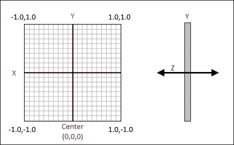
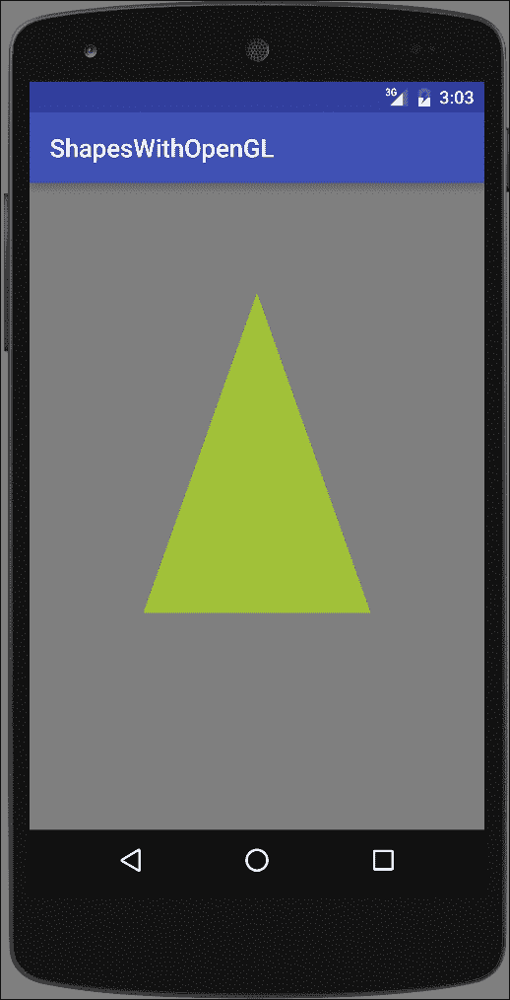
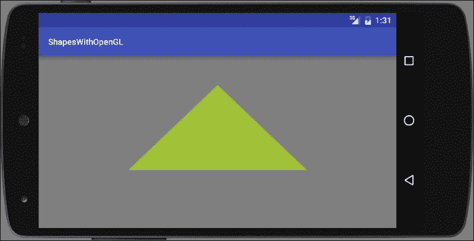
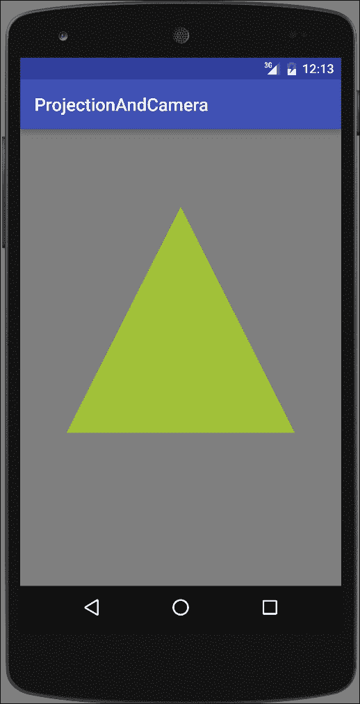
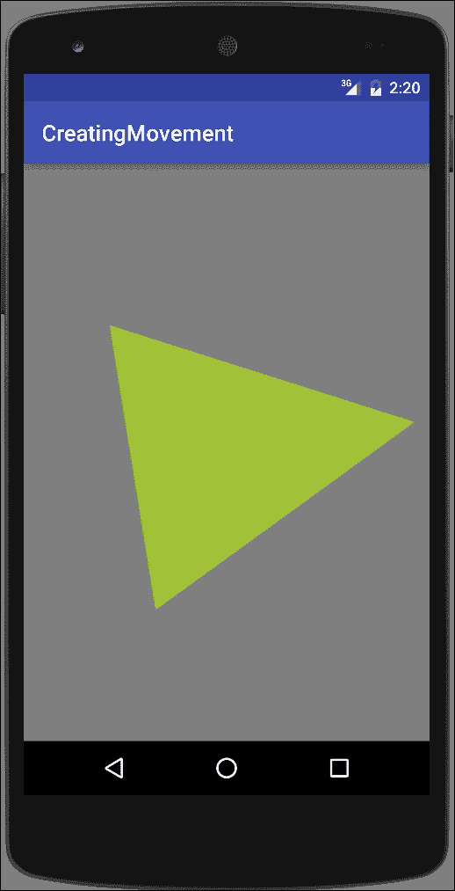
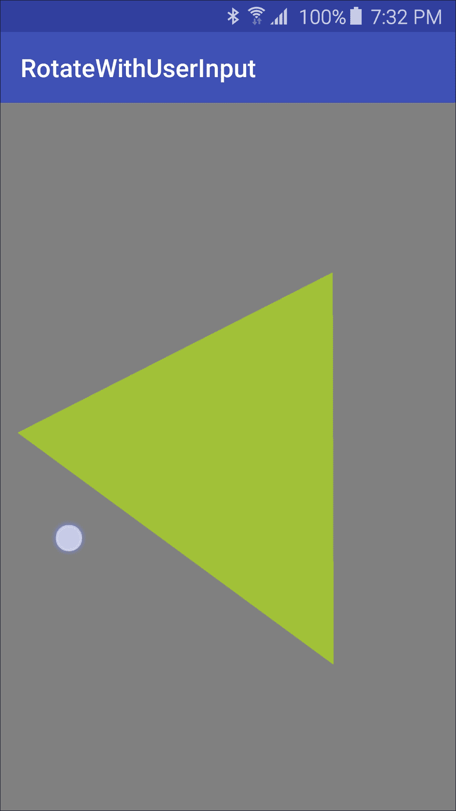

# 第十章. 初识 OpenGL ES

在本章中，我们将涵盖以下主题：

+   设置 OpenGL ES 环境

+   在 GLSurfaceView 上绘制形状

+   在绘图时应用投影和相机视图

+   通过旋转移动三角形

+   根据用户输入旋转三角形

# 简介

正如我们在上一章中看到的，Android 提供了许多处理图形和动画的工具。尽管画布和可绘制对象是为自定义绘图设计的，但在你需要高性能图形，尤其是 3D 游戏图形时，Android 也支持 OpenGL ES。**嵌入式系统开放图形库**（**OpenGL ES**）针对嵌入式系统。（嵌入式系统包括游戏机和手机。）

本章旨在作为在 Android 上使用 OpenGL ES 的入门介绍。像往常一样，我们将提供步骤并解释其工作原理，但不会深入探讨 OpenGL 的数学或技术细节。如果你已经熟悉来自其他平台（如 iOS）的 OpenGL ES，本章应该能让你快速上手。如果你是 OpenGL 的新手，希望这些食谱能帮助你决定是否想在这个领域继续深入。

Android 支持以下版本的 OpenGL：

+   **OpenGL ES 1.0**：Android 1.0

+   **OpenGL ES 2.0**：在 Android 2.2（API 8）中引入

+   **OpenGL ES 3.0**：在 Android 4.3（API 18）中引入

+   **OpenGL ES 3.1**：在 Android 5.0（API 21）中引入

本章的食谱具有入门性质，针对 OpenGL ES 2.0 及以上版本。OpenGL ES 2.0 几乎适用于目前所有可用的设备。与 OpenGL ES 2.0 及以下版本不同，OpenGL 3.0 及以上版本需要硬件制造商提供驱动程序实现。这意味着，即使你的应用程序运行在 Android 5.0 上，OpenGL 3.0 及以上版本可能不可用。因此，在运行时检查可用的 OpenGL 版本是一种良好的编程实践。或者，如果你的应用程序需要 3.0 及以上版本的功能，你可以在 Android 清单中添加一个`<uses-feature/>`元素。（我们将在接下来的第一个食谱中讨论这个问题。）

与本书中的其他章节不同，本章更像是一个教程，每个食谱都是基于前一个食谱中学到的经验。每个食谱的“准备”部分将明确说明先决条件。

# 设置 OpenGL ES 环境

我们的第一道食谱将从展示如何设置一个活动来使用 OpenGL `GLSurfaceView`的步骤开始。类似于 Canvas，`GLSurfaceView`是你将执行 OpenGL 绘图的地方。由于这是起点，其他食谱在需要创建`GLSurfaceView`时，将把这个食谱作为基础步骤进行引用。

## 准备工作

在 Android Studio 中创建一个新的项目，并将其命名为：`SetupOpenGL`。使用默认的**手机和平板电脑**选项，并在提示**活动类型**时选择**空活动**。

## 如何操作...

我们首先在 AndroidManifest 中指明应用程序使用 OpenGL，然后我们将 OpenGL 类添加到活动中。以下是步骤：

1.  打开 AndroidManifest 并添加以下 XML：

    ```java
    <uses-feature android:glEsVersion="0x00020000" android:required="true" />
    ```

1.  打开`MainActivity.java`并添加以下全局变量：

    ```java
    private GLSurfaceView mGLSurfaceView;
    ```

1.  将以下内部类添加到`MainActivity`类中：

    ```java
    class CustomGLSurfaceView extends GLSurfaceView {

        private final GLRenderer mGLRenderer;

        public CustomGLSurfaceView(Context context){
            super(context);
    		setEGLContextClientVersion(2);
            mGLRenderer = new GLRenderer();
            setRenderer(mGLRenderer);
        }
    }
    ```

1.  将另一个内部类添加到`MainActivity`类中：

    ```java
    class GLRenderer implements GLSurfaceView.Renderer {
        public void onSurfaceCreated(GL10 unused, EGLConfig config) {
            GLES20.glClearColor(0.5f, 0.5f, 0.5f, 1.0f);
        }
        public void onDrawFrame(GL10 unused) {
    	GLES20.glClear(GLES20.GL_COLOR_BUFFER_BIT);
        }
        public void onSurfaceChanged(GL10 unused, int width, int height) {
            GLES20.glViewport(0, 0, width, height);}
    }
    ```

1.  将以下代码添加到现有的`onCreate()`方法中：

    ```java
    mGLSurfaceView = new CustomGLSurfaceView(this);
    setContentView(mGLSurfaceView);
    ```

1.  你现在可以运行应用程序在设备或模拟器上了。

## 它是如何工作的...

如果你运行了前面的应用程序，你应该看到了创建的活动和背景被设置为灰色。由于这些是设置 OpenGL 的基本步骤，你将在本章的其他菜谱中重用此代码。以下是详细解释的过程：

### 在 AndroidManifest 中声明 OpenGL

我们首先通过以下行在 AndroidManifest 中声明我们使用 OpenGL ES 版本 2.0 的需求：

```java
<uses-feature android:glEsVersion="0x00020000" android:required="true" />
```

如果我们使用版本 3.0，我们会使用这个：

```java
<uses-feature android:glEsVersion="0x00030000" android:required="true" />
```

对于版本 3.1，使用这个：

```java
<uses-feature android:glEsVersion="0x00030001" android:required="true" />
```

### 扩展 GLSurfaceView 类

通过扩展`GLSurfaceView`创建一个自定义的 OpenGL `SurfaceView`类，就像我们在代码中所做的那样：

```java
class CustomGLSurfaceView extends GLSurfaceView {

    private final GLRenderer mGLRenderer;

    public CustomGLSurfaceView(Context context){
        super(context);
        setEGLContextClientVersion(2);
        mGLRenderer = new GLRenderer();
        setRenderer(mGLRenderer);
    }
}
```

在这里，我们实例化一个 OpenGL 渲染类，并通过`setRenderer()`方法将其传递给`GLSurfaceView`类。OpenGL `SurfaceView`为我们提供了 OpenGL 绘图的表面，类似于`Canvas`和`SurfaceView`对象。实际的绘图是在`Renderer`中完成的，我们将在下一步创建它：

### 创建一个 OpenGL 渲染类

最后一步是创建`GLSurfaceView.Renderer`类并实现以下三个回调：

+   `onSurfaceCreated()`

+   `onDrawFrame()`

+   `onSurfaceChanged()`

这里是代码：

```java
class GLRenderer implements GLSurfaceView.Renderer {
    public void onSurfaceCreated(GL10 unused, EGLConfig config) {
        GLES20.glClearColor(0.5f, 0.5f, 0.5f, 1.0f);
    }
    public void onDrawFrame(GL10 unused) {
        GLES20.glClear(GLES20.GL_COLOR_BUFFER_BIT);
    }
    public void onSurfaceChanged(GL10 unused, int width, int height) {
        GLES20.glViewport(0, 0, width, height);
    }
}
```

目前，我们使用这个类所做的只是设置回调和清除屏幕，使用我们通过`glClearColor()`指定的颜色（在这种情况下是灰色）。

## 还有更多...

在设置好 OpenGL 环境后，我们将继续到下一个菜谱，我们将实际在视图中绘制。

# 在 GLSurfaceView 上绘制形状

前一个菜谱设置了活动以使用 OpenGL。这个菜谱将继续展示如何在`OpenGLSurfaceView`上绘制。

首先，我们需要定义形状。使用 OpenGL 时，重要的是要意识到形状顶点的定义顺序非常重要，因为它们决定了形状的前面（面）和背面。通常（并且是默认行为）是逆时针定义顶点。（尽管这种行为可以改变，但它需要额外的代码，并且不是标准实践。）

理解 OpenGL 屏幕坐标系也很重要，因为它与 Android 画布不同。默认坐标系定义(`0,0,0`)为屏幕中心。四个边缘点如下：

+   **左上角**：(-1.0, 1.0, 0)

+   **右上角**：(1.0, 1.0, 0)

+   **左下角**：(-1.0, -1.0, 0)

+   **右下角**：(1.0, -1.0, 0)

*Z*轴直接从屏幕中出来或直接在屏幕后面。

这里是一个显示*X*，*Y*和*Z*轴的插图：



我们将创建一个`Triangle`类，因为它是基本形状。在 OpenGL 中，通常使用三角形的集合来创建对象。要使用 OpenGL 绘制形状，我们需要定义以下内容：

+   **顶点着色器**：这是用来绘制形状的

+   **片段着色器**：这是用来着色形状的

+   **程序**：这是用于前面着色器的 OpenGL ES 对象

着色器使用**OpenGL 着色语言（GLSL）**定义，然后编译并添加到 OpenGL 程序对象中。

这里有两张截图显示了肖像和横幅方向下的三角形：



## 准备工作

在 Android Studio 中创建一个新的项目，并将其命名为：`ShapesWithOpenGL`。使用默认的**手机和平板**选项，并在提示**活动类型**时选择**空活动**。

本菜谱使用前一个菜谱中创建的 OpenGL 环境*设置 OpenGL 环境*。如果你还没有完成这些步骤，请参考前一个菜谱。

## 如何操作...

如前所述，我们将使用前一个菜谱中创建的 OpenGL 环境。以下步骤将指导你创建一个用于三角形形状的类，并在 GLSurfaceView 上绘制它：

1.  创建一个名为`Triangle`的新 Java 类。

1.  将以下全局声明添加到`Triangle`类中：

    ```java
    private final String vertexShaderCode ="attribute vec4 vPosition;" +"void main() {" +"  gl_Position = vPosition;" +"}";

    private final String fragmentShaderCode ="precision mediump float;" +"uniform vec4 vColor;" +"void main() {" +"  gl_FragColor = vColor;" +"}";

    final int COORDS_PER_VERTEX = 3;
    float triangleCoords[] = {
            0.0f,  0.66f, 0.0f,
            -0.5f, -0.33f, 0.0f,
            0.5f, -0.33f, 0.0f
    };

    float color[] = { 0.63f, 0.76f, 0.22f, 1.0f };

    private final int mProgram;
    private FloatBuffer vertexBuffer;
    private int mPositionHandle;
    private int mColorHandle;
    private final int vertexCount = triangleCoords.length / COORDS_PER_VERTEX;
    private final int vertexStride = COORDS_PER_VERTEX * 4;
    ```

1.  将以下`loadShader()`方法添加到`Triangle`类中：

    ```java
    public int loadShader(int type, String shaderCode){
        int shader = GLES20.glCreateShader(type);
        GLES20.glShaderSource(shader, shaderCode);
        GLES20.glCompileShader(shader);
        return shader;
    }
    ```

1.  按照以下方式添加`Triangle`构造函数：

    ```java
    public Triangle() {
        int vertexShader = loadShader(GLES20.GL_VERTEX_SHADER,vertexShaderCode);
        int fragmentShader = loadShader(GLES20.GL_FRAGMENT_SHADER,fragmentShaderCode);
        mProgram = GLES20.glCreateProgram();
        GLES20.glAttachShader(mProgram, vertexShader);
        GLES20.glAttachShader(mProgram, fragmentShader);
        GLES20.glLinkProgram(mProgram);

        ByteBuffer bb = ByteBuffer.allocateDirect(triangleCoords.length * 4);
        bb.order(ByteOrder.nativeOrder());

        vertexBuffer = bb.asFloatBuffer();
        vertexBuffer.put(triangleCoords);
        vertexBuffer.position(0);
    }
    ```

1.  按照以下方式添加`draw()`方法：

    ```java
    public void draw() {
        GLES20.glUseProgram(mProgram);
        mPositionHandle = GLES20.glGetAttribLocation(mProgram, "vPosition");
        GLES20.glEnableVertexAttribArray(mPositionHandle);
        GLES20.glVertexAttribPointer(mPositionHandle, COORDS_PER_VERTEX,GLES20.GL_FLOAT, false,vertexStride, vertexBuffer);
        mColorHandle = GLES20.glGetUniformLocation(mProgram, "vColor");
        GLES20.glUniform4fv(mColorHandle, 1, color, 0);
        GLES20.glDrawArrays(GLES20.GL_TRIANGLES, 0, vertexCount);
        GLES20.glDisableVertexAttribArray(mPositionHandle);
    }
    ```

1.  现在打开`MainActivity.java`文件，并在`GLRenderer`类中添加一个`Triangle`变量，如下所示：

    ```java
    private Triangle mTriangle;
    ```

1.  在`onSurfaceCreated()`回调中初始化`Triangle`变量，如下所示：

    ```java
    mTriangle = new Triangle();
    ```

1.  在`onDrawFrame()`回调中调用`draw()`方法：

    ```java
    mTriangle.draw();
    ```

1.  你已经准备好在设备或模拟器上运行应用程序了。

## 它是如何工作的...

如介绍中所述，要使用 OpenGL 绘制，我们首先必须定义着色器，这可以通过以下代码完成：

```java
private final String vertexShaderCode ="attribute vec4 vPosition;" +"void main() {" +"  gl_Position = vPosition;" +"}";

private final String fragmentShaderCode ="precision mediump float;" +"uniform vec4 vColor;" +"void main() {" +"  gl_FragColor = vColor;" +"}";
```

由于这是未编译的**OpenGL 着色语言（OpenGLSL）**，下一步是将它编译并附加到我们的 OpenGL 对象上，我们使用以下两个 OpenGL ES 方法来完成：

+   `glAttachShader()`

+   `glLinkProgram()`

在设置好着色器后，我们创建`ByteBuffer`来存储三角形顶点，这些顶点在`triangleCoords`中定义。`draw()`方法是在`onDrawFrame()`回调中调用 GLES20 库调用进行实际绘制的位置。

## 还有更多...

你可能已经注意到，从介绍中的截图来看，肖像和横幅模式下的三角形看起来确实相同。正如你从代码中看到的，我们在绘制时没有对方向进行区分。我们将解释为什么会发生这种情况，并展示如何在下一个菜谱中纠正这个问题。

## 参见

关于 OpenGL 着色语言（OpenGL Shading Language）的更多信息，请参考以下链接：

[`www.opengl.org/documentation/glsl/`](https://www.opengl.org/documentation/glsl/)

# 绘制时应用投影和相机视图

如前一个配方中看到的，当我们将形状绘制到屏幕上时，形状会因为屏幕方向而倾斜。原因是默认情况下，OpenGL 假设屏幕是完美的正方形。我们之前提到，默认屏幕坐标中右上角是 (1,1,0)，左下角是 (-1,-1,0)。

由于大多数设备屏幕不是完美的正方形，我们需要将显示坐标映射到与我们的物理设备匹配。在 OpenGL 中，我们通过 *投影* 来做这件事。这个配方将展示如何使用投影来匹配 GLSurfaceView 坐标与设备坐标。除了投影之外，我们还将展示如何设置相机视图。以下是显示最终结果的截图：



## 准备中

在 Android Studio 中创建一个新的项目，并将其命名为：`ProjectionAndCamera`。使用默认的 **Phone & Tablet** 选项，并在提示 **Activity Type** 时选择 **Empty Activity**。

这个配方建立在之前的配方 *在 GLSurfaceView 上绘制形状* 之上。如果您还没有输入之前的配方，请在开始这些步骤之前这样做。

## 如何做到这一点...

如前所述，这个配方将建立在之前的配方之上，所以在开始之前完成这些步骤。我们将修改之前的代码以添加投影和相机视图到绘制计算中。以下是步骤：

1.  打开 `Triangle` 类，并在现有声明中添加以下全局声明：

    ```java
    private int mMVPMatrixHandle;
    ```

1.  在 `vertexShaderCode` 中添加一个矩阵变量，并在位置计算中使用它。以下是最终结果：

    ```java
    private final String vertexShaderCode =
        "attribute vec4 vPosition;" +
        "uniform mat4 uMVPMatrix;" +
        "void main() {" +
        "  gl_Position = uMVPMatrix * vPosition;" +
        "}";
    ```

1.  将 `draw()` 方法修改为传入一个矩阵参数，如下所示：

    ```java
    public void draw(float[] mvpMatrix) {
    ```

1.  要使用变换矩阵，请在 `draw()` 方法中在 `GLES20.glDrawArrays()` 方法之前添加以下代码：

    ```java
    mMVPMatrixHandle = GLES20.glGetUniformLocation(mProgram, "uMVPMatrix");
    GLES20.glUniformMatrix4fv(mMVPMatrixHandle, 1, false, mvpMatrix, 0);
    ```

1.  打开 `MainActivity.java` 并将以下类变量添加到 `GLRenderer` 类中：

    ```java
    private final float[] mMVPMatrix = new float[16];
    private final float[] mProjectionMatrix = new float[16];
    private final float[] mViewMatrix = new float[16];
    ```

1.  修改 `onSurfaceChanged()` 回调以计算位置矩阵如下：

    ```java
    public void onSurfaceChanged(GL10 unused, int width, int height) {
        GLES20.glViewport(0, 0, width, height);
        float ratio = (float) width / height;
        Matrix.frustumM(mProjectionMatrix, 0, -ratio, ratio, -1, 1, 3, 7);
    }
    ```

1.  修改 `onDrawFrame()` 回调以计算相机视图如下：

    ```java
    public void onDrawFrame(GL10 unused) {
        Matrix.setLookAtM(mViewMatrix, 0, 0, 0, -3, 0f, 0f, 0f, 0f, 1.0f, 0.0f);
        Matrix.multiplyMM(mMVPMatrix, 0, mProjectionMatrix, 0, mViewMatrix, 0);
        GLES20.glClear(GLES20.GL_COLOR_BUFFER_BIT);
        mTriangle.draw(mMVPMatrix);
    }
    ```

1.  您现在可以运行应用程序在设备或模拟器上。

## 它是如何工作的...

首先，我们修改 `vertexShaderCode` 以包含一个矩阵变量。我们使用传入的参数高度和宽度在 `onSurfaceChanged()` 回调中计算矩阵。我们将变换矩阵传递给 `draw()` 方法，以便在计算绘制位置时使用。

在我们调用 `draw()` 方法之前，我们计算相机视图。这两行代码计算相机视图：

```java
Matrix.setLookAtM(mViewMatrix, 0, 0, 0, -3, 0f, 0f, 0f, 0f, 1.0f, 0.0f);
Matrix.multiplyMM(mMVPMatrix, 0, mProjectionMatrix, 0, mViewMatrix, 0);
```

没有这段代码，实际上不会绘制三角形，因为相机视角不会“看到”我们的顶点。（这回到了我们之前关于顶点顺序决定图像前后关系的讨论。）

当您现在运行程序时，您将看到 *简介* 中显示的输出。注意我们现在有一个均匀的三角形，即使显示被旋转。

## 更多...

在下一个配方中，我们将开始展示通过旋转三角形 OpenGL 的功能。

# 通过旋转移动三角形

我们到目前为止用 OpenGL 展示的内容可能使用传统的画布或可绘制对象会更简单。此配方将通过旋转三角形展示 OpenGL 的一些功能。虽然我们也可以用其他绘图方法创建运动，但使用 OpenGL 来做这一点是多么容易！

此配方将演示如何旋转三角形，如此截图所示：



## 准备工作

在 Android Studio 中创建一个新的项目，并将其命名为：`CreatingMovement`。使用默认的 **Phone & Tablet** 选项，并在提示 **Activity Type** 时选择 **Empty Activity**。

此配方基于之前的配方 *在绘图时应用投影和相机视图*。如果您还没有输入之前的配方，请在继续之前这样做。

## 如何操作...

由于我们是从上一个配方继续的，所以我们几乎没有工作要做。打开 `MainActivity.java` 并按照以下步骤操作：

1.  在 `GLRendered` 类中添加一个矩阵：

    ```java
    private float[] mRotationMatrix = new float[16];
    ```

1.  在 `onDrawFrame()` 回调中，将现有的 `mTriangle.draw(mMVPMatrix);` 语句替换为以下代码：

    ```java
    float[] tempMatrix = new float[16];
    long time = SystemClock.uptimeMillis() % 4000L;
    float angle = 0.090f * ((int) time);
    Matrix.setRotateM(mRotationMatrix, 0, angle, 0, 0, -1.0f);
    Matrix.multiplyMM(tempMatrix, 0, mMVPMatrix, 0, mRotationMatrix, 0);
    mTriangle.draw(tempMatrix);
    ```

1.  您现在可以运行应用程序在设备或模拟器上。

## 它是如何工作的...

我们使用 `Matrix.setRotateM()` 方法根据我们传递的角度计算一个新的旋转矩阵。在这个例子中，我们使用系统运行时间来计算一个角度。我们可以使用任何我们想要的方法来推导一个角度，例如传感器读取或触摸事件。

## 更多...

使用系统时钟提供了创建连续运动的额外好处，这对于演示目的当然看起来更好。下一个配方将演示如何使用用户输入来推导旋转三角形的角。

### 渲染模式

OpenGL 提供了一个 `setRenderMode()` 选项，仅在视图脏时绘制。这可以通过在 `CustomGLSurfaceView()` 构造函数中添加以下代码来实现，位于 `setRenderer()` 调用下方：

```java
setRenderMode(GLSurfaceView.RENDERMODE_WHEN_DIRTY);
```

这将导致显示更新一次，然后等待我们使用 `requestRender()` 请求更新。

# 通过用户输入旋转三角形

之前的例子演示了根据系统时钟旋转三角形。这创建了一个根据我们使用的渲染模式连续旋转的三角形。但如果你想要响应用户的输入怎么办？

在这个配方中，我们将展示如何通过覆盖 `GLSurfaceView` 的 `onTouchEvent()` 回调来响应用户输入。我们仍然会使用 `Matrix.setRotateM()` 方法来旋转三角形，但不是从系统时间推导角度，而是基于触摸位置计算角度。

下面是一张显示此配方在物理设备上运行的截图（为了突出触摸，已启用**显示触摸**开发者选项）：



## 准备工作

在 Android Studio 中创建一个新的项目，并将其命名为：`RotateWithUserInput`。使用默认的 **手机和平板** 选项，并在提示 **活动类型** 时选择 **空活动**。

此配方演示了与先前配方不同的替代方法，因此将基于 *在绘制时应用投影和相机视图*（与先前配方相同的起点）。

## 如何做到...

如前所述，我们将继续，而不是从先前的配方开始，而是从 *在绘制时应用投影和相机视图* 配方开始。打开 `MainActivity.java` 并按照以下步骤操作：

1.  将以下全局变量添加到 `MainActivity` 类中：

    ```java
    private float mCenterX=0;
    private float mCenterY=0;
    ```

1.  将以下代码添加到 `GLRendered` 类中：

    ```java
    private float[] mRotationMatrix = new float[16];
    public volatile float mAngle;
    public void setAngle(float angle) {
        mAngle = angle;
    }

    ```

1.  在同一类中，通过将现有的 `mTriangle.draw(mMVPMatrix);` 语句替换为以下代码来修改 `onDrawFrame()` 方法：

    ```java
    float[] tempMatrix = new float[16];
    Matrix.setRotateM(mRotationMatrix, 0, mAngle, 0, 0, -1.0f);
    Matrix.multiplyMM(tempMatrix, 0, mMVPMatrix, 0, mRotationMatrix, 0);
    mTriangle.draw(tempMatrix);
    ```

1.  将以下代码添加到 `onSurfaceChanged()` 回调中：

    ```java
    mCenterX=width/2;
    mCenterY=height/2;
    ```

1.  将以下代码添加到 `CustomGLSurfaceView` 构造函数中，该构造函数位于 `setRenderer()` 下方：

    ```java
    setRenderMode(GLSurfaceView.RENDERMODE_WHEN_DIRTY);
    ```

1.  将以下 `onTouchEvent()` 添加到 `CustomGLSurfaceView` 类中：

    ```java
    @Override
    public boolean onTouchEvent(MotionEvent e) {
      float x = e.getX();
      float y = e.getY();
      switch (e.getAction()) {
          case MotionEvent.ACTION_MOVE:
              double angleRadians = Math.atan2(y-mCenterY,x-mCenterX);
              mGLRenderer.setAngle((float)Math.toDegrees(-angleRadians));
              requestRender();
      }
      return true;
    }
    ```

1.  您现在可以在设备或模拟器上运行应用程序。

## 它是如何工作的...

与先前的配方相比，此示例的明显区别在于我们如何推导出传递给 `Matrix.setRotateM()` 调用的角度。我们还使用 `setRenderMode()` 改变了 `GLSurfaceView` 的渲染模式，使其仅在请求时绘制。我们在 `onTouchEvent()` 回调中计算了一个新角度后，使用 `requestRender()` 发出了请求。

我们还展示了自定义 `GLSurfaceView` 类的重要性。如果没有我们的 `CustomGLSurfaceView` 类，我们就无法覆盖 `onTouchEvent` 回调，或从 `GLSurfaceView` 的任何其他回调。

## 还有更多...

这就结束了 OpenGL ES 配方，但我们只是刚刚触及 OpenGL 的强大功能。如果您认真想学习 OpenGL，请查看下一节中的链接，并查看关于 OpenGL 的许多书籍之一。

值得注意的是，检查可用的许多框架之一，例如虚幻引擎：

### 小贴士

虚幻引擎 4 是由游戏开发者为游戏开发者制作的完整游戏开发工具套件。

[`www.unrealengine.com/what-is-unreal-engine-4`](https://www.unrealengine.com/what-is-unreal-engine-4)

## 相关内容

+   **OpenGL**: 高性能图形的行业标准

    [`www.opengl.org/`](https://www.opengl.org/)

+   **OpenGL ES**: 嵌入式加速 3D 图形的行业标准

    [`www.khronos.org/opengles/`](https://www.khronos.org/opengles/)

+   **虚幻引擎**: Android 快速入门

    [`docs.unrealengine.com/latest/INT/Platforms/Android/GettingStarted/index.html`](https://docs.unrealengine.com/latest/INT/Platforms/Android/GettingStarted/index.html)
