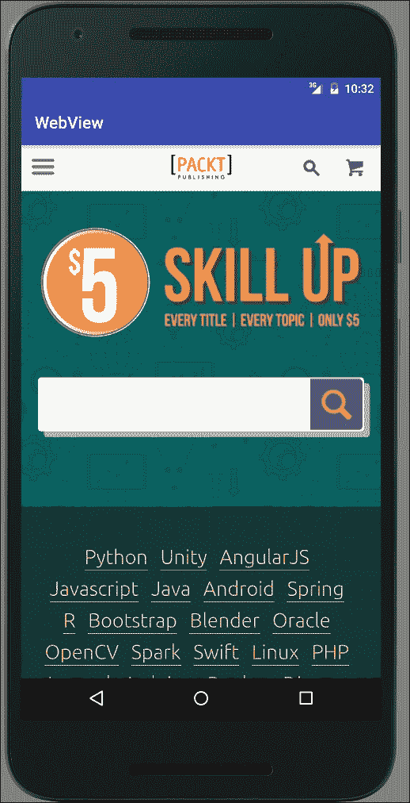
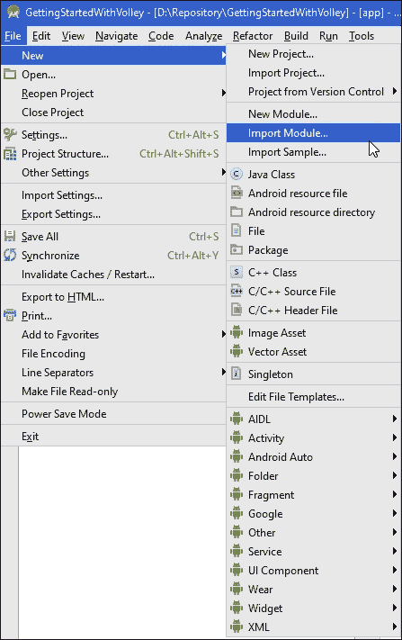
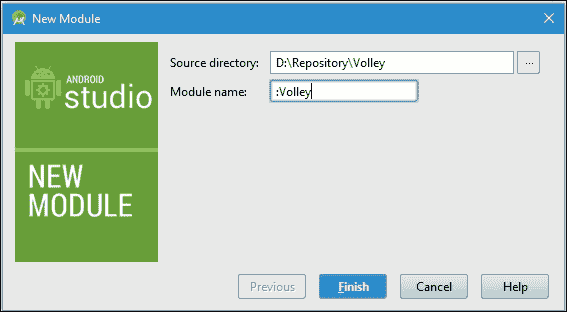
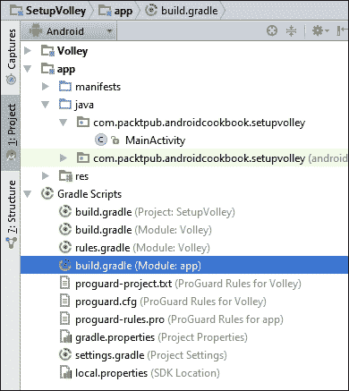

# 第十二章：电话、网络和 Web

在本章中，我们将涵盖以下主题：

+   如何打电话

+   监听电话事件

+   如何发送短信（文本）消息

+   接收短信消息

+   在您的应用程序中显示网页

+   检查在线状态和连接类型

+   使用 Volley 进行网络请求入门

+   取消 Volley 请求

+   使用 Volley 请求 JSON 响应

+   使用 Volley 请求图片

+   使用 Volley 的 NetworkImageView 和 ImageLoader

# 简介

我们将首先通过查看带有*如何打电话*的 Telephony 功能来开始本章。在探索如何打电话之后，我们将查看如何使用*监听电话事件*来监控电话。然后，我们将继续使用*如何发送短信消息*进行短信通信，然后我们将介绍如何使用*接收短信消息*接收短信。

然后，我们将探索`WebView`，以向您的应用程序添加浏览器功能。在基本层面上，`WebView`是一个基本的 HTML 查看器。我们将展示如何扩展`WebViewClient`类并通过`WebSettings`修改设置来创建完整的浏览器功能，包括 JavaScript 和缩放功能。

以下章节将介绍 Volley，这是一个通过 AOSP 提供的全新库。关于 Volley 如何进行网络请求的入门介绍将提供有关 Android 上可用的在线库的背景信息，并讨论为什么创建 Volley。它还提供了将 Volley 添加到您的 Android Studio 项目的完整指南。

# 如何打电话

如前几章所示，我们可以通过使用 Intent 简单地调用默认应用程序。要打电话，请在创建 Intent 时使用`Intent.ACTION_DIAL`。您可以使用`setData()`方法包含一个电话号码。以下是一个示例代码，它将使用指定的电话号码调用拨号器应用程序：

```java
Intent intent = new Intent(Intent.ACTION_DIAL);
intent.setData(Uri.parse("tel:" + number));
startActivity(intent);
```

由于您的应用程序不进行拨号，并且用户必须按下**拨号**按钮，因此您不需要在您的应用程序中设置任何拨号权限。以下食谱将向您展示如何直接拨打电话，绕过`Dial`活动。（为此，您需要添加一个权限。）

## 准备工作

在 Android Studio 中创建一个新的项目，并将其命名为`DialPhone`。使用默认的**电话和平板电脑**选项，并在提示**活动类型**时选择**空活动**。

## 如何做到...

首先，我们需要添加适当的权限来拨打电话。然后，我们需要添加一个按钮来调用我们的`Dial`方法。首先打开 AndroidManifest.xml，按照以下步骤操作：

1.  添加以下权限：

    ```java
    <uses-permission android:name="android.permission.CALL_PHONE"></uses-permission>
    ```

1.  打开`activity_main.xml`，并用以下按钮替换现有的`TextView`：

    ```java
    <Button
        android:id="@+id/button"
        android:layout_width="wrap_content"
        android:layout_height="wrap_content"
        android:text="Dial"
        android:layout_centerInParent="true"
        android:onClick="dialPhone"/>
    ```

1.  添加以下方法，该方法将检查您的应用程序是否已被授予`CALL_PHONE`权限：

    ```java
    private boolean checkPermission(String permission) {
        int permissionCheck = ContextCompat.checkSelfPermission(
                this, permission);
        return (permissionCheck == PackageManager.PERMISSION_GRANTED);
    }
    ```

1.  添加拨打电话的代码：

    ```java
    public void dialPhone(View view){
        if (checkPermission("android.permission.CALL_PHONE")) {
            Intent intent = new Intent(Intent.ACTION_CALL);
            intent.setData(Uri.parse("tel:0123456789"));
            startActivity(intent);
        }
    }
    ```

1.  在您的设备上运行此代码之前，请务必将`0123456789`替换为有效的电话号码。

## 它是如何工作的...

如我们从引言中的代码所看到的，调用默认拨号应用时我们不需要任何权限。但如果我们想直接拨打一个号码，我们需要添加`CALL_PHONE`权限。从 Android 6.0 Marshmallow（API 23）开始，权限不再在安装期间授予，因此，我们在尝试拨打电话之前会检查应用程序是否有权限。

## 参见

+   更多信息，请参阅第十四章中的*新的运行时权限模型*菜谱，*你的应用准备好 Play 商店*。

# 监听电话事件

在前面的菜谱中，我们展示了如何进行电话呼叫，无论是通过 Intent 调用默认应用，还是通过没有 UI 直接拨打号码。

如果你想在通话结束时收到通知怎么办？这会变得稍微复杂一些，因为你需要监控电话事件并跟踪电话状态。在这个菜谱中，我们将演示如何创建一个`PhoneStateListener`来读取电话状态事件。

## 准备工作

在 Android Studio 中创建一个新的项目，并将其命名为`PhoneStateListener`。使用默认的**Phone & Tablet**选项，并在提示**Activity Type**时选择**Empty Activity**。

虽然这不是必需的，但你可以使用前面的菜谱来发起电话呼叫以查看事件。否则，使用默认拨号器，或从来电中观察事件。（下载文件中提供的示例代码包含了前面的菜谱，以便更容易查看事件。）

## 如何做到这一点...

我们只需要在布局中添加一个`TextView`来显示事件信息。如果你是从前面的菜谱继续，或者开始一个新的菜谱，打开`activity_main.xml`文件并按照以下步骤操作：

1.  添加或修改`TextView`如下：

    ```java
    <TextView
        android:id="@+id/textView"
        android:layout_width="wrap_content"
        android:layout_height="wrap_content" />
    ```

1.  在 AndroidManifest.xml 中添加以下权限：

    ```java
    <uses-permission android:name="android.permission.READ_PHONE_STATE">
    </uses-permission>
    ```

1.  打开`MainActivity.java`并将以下`PhoneStateListener`类添加到`MainActivity`类中：

    ```java
    PhoneStateListener mPhoneStateListener = new PhoneStateListener() {
        @Override
        public void onCallStateChanged(int state, String number) {
            String phoneState = number;
            switch (state) {
                case TelephonyManager.CALL_STATE_IDLE:
                    phoneState += "CALL_STATE_IDLE\n";
                case TelephonyManager.CALL_STATE_RINGING:
                    phoneState += "CALL_STATE_RINGING\n";
                case TelephonyManager.CALL_STATE_OFFHOOK:
                    phoneState += "CALL_STATE_OFFHOOK\n";
            }
            TextView textView = (TextView)findViewById(R.id.textView);
            textView.append(phoneState);
        }
    };
    ```

1.  修改`onCreate()`以设置监听器：

    ```java
    final TelephonyManager telephonyManager = (TelephonyManager)getSystemService(Context.TELEPHONY_SERVICE);
    telephonyManager.listen(mPhoneStateListener,PhoneStateListener.LISTEN_CALL_STATE);
    ```

1.  在设备上运行应用程序并发起和/或接收电话呼叫以查看事件。

## 它是如何工作的...

为了演示使用监听器，我们在`onCreate()`中使用这两行代码创建 Telephony 监听器：

```java
final TelephonyManager telephonyManager = (TelephonyManager)getSystemService(Context.TELEPHONY_SERVICE);
telephonyManager.listen(mPhoneStateListener,PhoneStateListener.LISTEN_CALL_STATE);
```

当发生`PhoneState`事件时，它会被发送到我们的`PhoneStateListener`类。

## 更多内容...

在这个菜谱中，我们正在监控呼叫状态事件，如以下常量所示：`LISTEN_CALL_STATE`。其他有趣的选项包括以下内容：

+   `LISTEN_CALL_FORWARDING_INDICATOR`

+   `LISTEN_DATA_CONNECTION_STATE`

+   `LISTEN_SIGNAL_STRENGTHS`

查看以下`PhoneStateListener`链接以获取完整列表。

当我们完成事件监听后，调用`listen()`方法并传递`LISTEN_NONE`，如下所示：

```java
telephonyManager.listen(mPhoneStateListener,PhoneStateListener.LISTEN_NONE);
```

## 参见

+   **开发者文档：PhoneStateListener** 在 [`developer.android.com/reference/android/telephony/PhoneStateListener.html`](https://developer.android.com/reference/android/telephony/PhoneStateListener.html)

# 如何发送短信（文本）消息

由于你可能已经熟悉短信（或文本）消息，我们不会花时间解释它们是什么或为什么它们很重要。（如果你不熟悉短信或需要更多信息，请参阅本食谱*另请参阅*部分提供的链接。）本食谱将演示如何发送短信消息。（下一个食谱将演示如何接收新消息的通知以及如何读取现有消息。）

## 准备工作

在 Android Studio 中创建一个新的项目，命名为`SendSMS`。使用默认的**电话和平板电脑**选项，并在提示**活动类型**时选择**空活动**。

## 如何做到...

首先，我们将添加发送短信所需的必要权限。然后，我们将创建一个包含**电话号码**、**消息**字段和**发送**按钮的布局。当点击发送按钮时，我们将创建并发送短信。以下是步骤：

1.  打开 AndroidManifest 文件并添加以下权限：

    ```java
    <uses-permission android:name="android.permission.SEND_SMS"/>
    ```

1.  打开`activity_main.xml`并将现有的`TextView`替换为以下 XML：

    ```java
    <EditText
        android:id="@+id/editTextNumber"
        android:layout_width="match_parent"
        android:layout_height="wrap_content"
        android:inputType="number"
        android:ems="10"
        android:layout_alignParentTop="true"
        android:layout_centerHorizontal="true"
        android:hint="Number"/>
    <EditText
        android:id="@+id/editTextMsg"
        android:layout_width="match_parent"
        android:layout_height="wrap_content"
        android:layout_below="@+id/editTextNumber"
        android:layout_centerHorizontal="true"
        android:hint="Message"/>
    <Button
        android:id="@+id/buttonSend"
        android:layout_width="wrap_content"
        android:layout_height="wrap_content"
        android:text="Send"
        android:layout_below="@+id/editTextMsg"
        android:layout_centerHorizontal="true"
        android:onClick="send"/>
    ```

1.  打开`MainActivity.java`并添加以下全局变量：

    ```java
    final int SEND_SMS_PERMISSION_REQUEST_CODE=1;
    Button mButtonSend;
    ```

1.  将以下代码添加到现有的`onCreate()`回调中：

    ```java
    mButtonSend = (Button)findViewById(R.id.buttonSend);
    mButtonSend.setEnabled(false);

    if (checkCallPermission(Manifest.permission.SEND_SMS)) {
        mButtonSend.setEnabled(true);
    } else {
        ActivityCompat.requestPermissions(this,
                new String[]{Manifest.permission.SEND_SMS},
                SEND_SMS_PERMISSION_REQUEST_CODE);
    }
    ```

1.  添加以下方法来检查权限：

    ```java
    private boolean checkPermission(String permission) {
        int permissionCheck = ContextCompat.checkSelfPermission(this,permission);
        return (permissionCheck == PackageManager.PERMISSION_GRANTED);
    }
    ```

1.  重写`onRequestPermissionsResult()`以处理权限请求响应：

    ```java
    @Override
    public void onRequestPermissionsResult(int requestCode,String permissions[], int[] grantResults) {
        switch (requestCode) {
            case SEND_SMS_PERMISSION_REQUEST_CODE: {
                if (grantResults.length > 0 && grantResults[0] == PackageManager.PERMISSION_GRANTED) {
                    mButtonSend.setEnabled(true);
                }
                return;
            }
        }
    }
    ```

1.  最后，添加实际发送短信的方法：

    ```java
    public void send(View view) {
        String phoneNumber = ((EditText)findViewById(R.id.editTextNumber)).getText().toString();
        String msg = ((EditText)findViewById(R.id.editTextMsg)).getText().toString();

        if (phoneNumber==null || phoneNumber.length()==0 || msg==null || msg.length()==0 ) {
            return;
        }

        if (checkPermission(Manifest.permission.SEND_SMS)) {
            SmsManager smsManager = SmsManager.getDefault();
            smsManager.sendTextMessage(phoneNumber, null, msg, null, null);
        } else {
            Toast.makeText(MainActivity.this, "No Permission", Toast.LENGTH_SHORT).show();
        }
    }
    ```

1.  你现在可以运行应用程序在设备或模拟器上。（发送到另一个模拟器时，请使用模拟器设备号，例如 5556。）

## 它是如何工作的...

发送短信的代码只有两行，如下所示：

```java
SmsManager smsManager = SmsManager.getDefault();
smsManager.sendTextMessage(phoneNumber, null, msg, null, null);
```

`sendTextMessage()`方法负责实际发送。这个食谱的大部分代码都是为了设置权限，因为 Android 6.0 Marshmallow（API 23）中改变了权限模型。

## 还有更多...

虽然发送短信很简单，但我们还有一些其他选项。

### 多部分消息

虽然这取决于运营商，但通常每个短信允许的最大字符数是 160 个。你可以修改前面的代码来检查消息是否超过 160 个字符，如果是，你可以调用 SMSManager 的`divideMessage()`方法。该方法返回一个`ArrayList`，你可以将其发送到`sendMultipartTextMessage()`。以下是一个示例：

```java
ArrayList<String> messages=smsManager.divideMessage(msg);
smsManager.sendMultipartTextMessage(phoneNumber, null, messages, null, null);
```

### 小贴士

注意，使用`sendMultipartTextMessage()`发送的消息在使用模拟器时可能无法正确工作，因此请务必在真实设备上进行测试。

### 送达状态通知

如果你希望收到消息状态的更新，你可以使用两个可选字段。以下是在**SMSManager**文档中定义的`sendTextMessage()`方法的示例：

```java
sendTextMessage(String destinationAddress, String scAddress, String text, PendingIntent sentIntent, PendingIntent deliveryIntent)
```

您可以包含一个挂起的 Intent 来通知发送状态和/或投递状态。在接收到您的挂起 Intent 时，它将包含一个结果代码，要么是`Activity.RESULT_OK`，如果发送成功，要么是**SMSManager**文档（在以下*另请参阅*部分中提到的链接）中定义的错误代码：

+   `RESULT_ERROR_GENERIC_FAILURE`：通用失败原因

+   `RESULT_ERROR_NO_SERVICE`：失败，因为服务当前不可用

+   `RESULT_ERROR_NULL_PDU`：失败，因为没有提供 PDU

+   `RESULT_ERROR_RADIO_OFF`：失败，因为无线电被明确关闭

## 另请参阅

+   在维基百科上查看短信服务[`en.wikipedia.org/wiki/Short_Message_Service`](https://en.wikipedia.org/wiki/Short_Message_Service)

+   **开发者文档：SMSManager**[`developer.android.com/reference/android/telephony/SmsManager.html`](https://developer.android.com/reference/android/telephony/SmsManager.html)

# 接收短信消息

本食谱将演示如何设置广播接收器以通知您新的短信消息。请注意，您的应用无需运行即可接收短信意图。Android 会启动您的服务来处理短信。

## 准备工作

在 Android Studio 中创建一个新的项目，命名为`ReceiveSMS`。使用默认的**电话和平板电脑**选项，并在提示**活动类型**时选择**空活动**。

## 如何实现...

在本演示中，我们不会使用布局，因为所有的工作都将由广播接收器完成。我们将使用 Toast 显示传入的短信消息。打开 Android 清单并按照以下步骤操作：

1.  添加以下权限：

    ```java
    <uses-permission android:name="android.permission.RECEIVE_SMS" />
    ```

1.  将以下广播接收器声明添加到`<application>`元素中：

    ```java
    <receiver android:name=".SMSBroadcastReceiver">
        <intent-filter>
            <action android:name="android.provider.Telephony.SMS_RECEIVED">
            </action>
        </intent-filter>
    </receiver>
    ```

1.  打开`MainActivity.java`并添加以下方法：

    ```java
    private boolean checkPermission(String permission) {
        int permissionCheck = ContextCompat.checkSelfPermission(
                this, permission);
        return (permissionCheck == PackageManager.PERMISSION_GRANTED);
    }
    ```

1.  修改现有的`onCreate()`回调以检查权限：

    ```java
    if (!checkPermission(Manifest.permission.RECEIVE_SMS)) {
        ActivityCompat.requestPermissions(this,new String[]{Manifest.permission.RECEIVE_SMS}, 0);
    }
    ```

1.  在项目中添加一个名为`SMSBroadcastReceiver`的新 Java 类，使用以下代码：

    ```java
    public class SMSBroadcastReceiver extends BroadcastReceiver {
        final String SMS_RECEIVED = "android.provider.Telephony.SMS_RECEIVED";

        @Override
        public void onReceive(Context context, Intent intent) {
            if (SMS_RECEIVED.equals(intent.getAction())) {
                Bundle bundle = intent.getExtras();
                if (bundle != null) {
                    Object[] pdus = (Object[]) bundle.get("pdus");
                    String format = bundle.getString("format");
                    final SmsMessage[] messages = new SmsMessage[pdus.length];
                    for (int i = 0; i < pdus.length; i++) {
                        if (Build.VERSION.SDK_INT >= Build.VERSION_CODES.M) {
                            messages[i] = SmsMessage.createFromPdu((byte[]) pdus[i], format);
                        } else {
                            messages[i] = SmsMessage.createFromPdu((byte[]) pdus[i]);
                        }
                        Toast.makeText(context, messages[0].getMessageBody(), Toast.LENGTH_SHORT).show();
                    }
                }
            }
        }
    }
    ```

1.  您现在可以开始在设备或模拟器上运行应用程序了。

## 它是如何工作的...

就像在之前的发送短信食谱中一样，我们首先需要检查应用是否有权限。（在 Android 6.0 之前的设备上，清单声明将自动提供权限，但对于 Marshmallow 及以后的版本，我们需要像这里一样提示用户。）

如您所见，广播接收器接收新的短信消息通知。我们通过在 Android 清单中的此代码告诉系统我们想要接收新的短信接收广播：

```java
<receiver android:name=".SMSBroadcastReceiver">
    <intent-filter>
        <action android:name="android.provider.Telephony.SMS_RECEIVED"></action>
    </intent-filter>
</receiver>
```

通知是通过标准的`onReceive()`回调传入的，因此我们使用以下代码检查操作：

```java
if (SMS_RECEIVED.equals(intent.getAction())) {}
```

这可能是本演示中最复杂的一行代码：

```java
messages[i] = SmsMessage.createFromPdu((byte[]) pdus[i]);
```

基本上，它调用 `SmsMessage` 库从 PDU 创建 SMSMessage 对象。（PDU，即协议数据单元，是 SMS 消息的二进制数据格式。）如果您不熟悉 PDU 的构成，您不需要了解。`SmsMessage` 库会为您处理并返回 SMSMessage 对象。

### 小贴士

如果您的应用程序没有接收 SMS 广播消息，可能有一个现有的应用程序正在阻止您的应用程序。您可以尝试增加 `intent-filter` 中的优先级值，如所示，或者禁用/卸载其他应用程序：

```java
<intent-filter android:priority="100">
    <action android:name="android.provider.Telephony.SMS_RECEIVED" />
</intent-filter>
```

## 还有更多...

此配方演示了如何显示接收到的 SMS 消息，但关于读取现有消息怎么办？

### 读取现有 SMS 消息

首先，为了读取现有消息，您需要以下权限：

```java
<uses-permission android:name="android.permission.READ_SMS" />
```

这里是一个使用 SMS 内容提供者获取游标的示例：

```java
Cursor cursor = getContentResolver().query(Uri.parse("content://sms/"), null, null, null, null);
while (cursor.moveToNext()) {
    textView.append("From :" + cursor.getString(1) + " : " + cursor.getString(11)+"\n");
}
```

在撰写本文时，SMS 内容提供者有超过 30 列。以下是前 12 列，它们是最有用的（记住，列数从零开始）：

0\. `_id`

1\. `thread_id`

2\. `address`

3\. `person`

4\. `date`

5\. `protocol`

6\. `read`

7\. `status`

8\. `type`

9\. `reply_path_present`

10\. `subject`

11\. `body`

请记住，内容提供者不是公共 API 的一部分，并且可以在不通知的情况下更改。

## 参见

+   **开发者文档：SmsManager** 在 [`developer.android.com/reference/android/telephony/SmsManager.html`](https://developer.android.com/reference/android/telephony/SmsManager.html)

+   **PDU（协议数据单元**）在 [`en.wikipedia.org/wiki/Protocol_data_unit`](https://en.wikipedia.org/wiki/Protocol_data_unit)

+   **开发者文档：Telephony.Sms.Intents** 在 [`developer.android.com/reference/android/provider/Telephony.Sms.Intents.html`](https://developer.android.com/reference/android/provider/Telephony.Sms.Intents.html)

# 在您的应用程序中显示网页

当您想在网页上显示 HTML 内容时，您有两个选择：调用默认浏览器或在其应用程序内显示。如果您只想调用默认浏览器，请使用以下 Intent：

```java
Uri uri = Uri.parse("https://www.packtpub.com/");
Intent intent = new Intent(Intent.ACTION_VIEW, uri);
startActivity(intent);
```

如果您需要在您的应用程序中显示内容，您可以使用 `WebView`。此配方将展示如何在您的应用程序中显示网页，如图中所示：



## 准备工作

在 Android Studio 中创建一个新的项目，命名为 `WebView`。使用默认的 **Phone & Tablet** 选项，并在提示 **Activity Type** 时选择 **Empty Activity**。

## 如何操作...

我们将通过代码创建 `WebView`，因此我们不会修改布局。我们首先打开 Android Manifest 并按照以下步骤操作：

1.  添加以下权限：

    ```java
    <uses-permission android:name="android.permission.INTERNET"/>
    ```

1.  修改现有的 `onCreate()` 以包含以下代码：

    ```java
    WebView webview = new WebView(this);
    setContentView(webview);
    webview.loadUrl("https://www.packtpub.com/");
    ```

1.  您现在可以开始在设备或模拟器上运行应用程序。

## 它是如何工作的...

我们创建一个 `WebView` 作为我们的布局，并使用 `loadUrl()` 加载我们的网页。前面的代码是有效的，但在这一级别，它非常基础，仅显示第一页。如果您点击任何链接，默认浏览器将处理请求。

## 更多内容...

如果您想要完整的网络浏览功能，以便点击的任何链接都在您的 `WebView` 中加载，请创建一个 `WebViewClient`，如下所示：

```java
webview.setWebViewClient(new WebViewClient());
```

### 控制页面导航

如果您想要对页面导航有更多控制，例如仅允许您自己的网站内的链接，您可以创建自己的 `WebViewClient` 类并重写 `shouldOverrideUrlLoading()` 回调，如下所示：

```java
private class mWebViewClient extends WebViewClient {
    @Override
    public boolean shouldOverrideUrlLoading(WebView view, String url) {
        if (Uri.parse(url).getHost().equals("www.packtpub.com")) {
            return false;  //Don't override since it's the same //host
        } else {
            return true; //Stop the navigation since it's a //different site
        }
    }
}
```

### 如何启用 JavaScript

我们可以通过 `WebView` 的 `WebSettings` 进行许多其他自定义更改。如果您想启用 JavaScript，获取 `WebView` 的 `WebSettings` 并调用 `setJavaScriptEnabled()`，如下所示：

```java
WebSettings webSettings = webview.getSettings();
webSettings.setJavaScriptEnabled(true);
```

### 启用内置缩放

另一个 `webSetting` 选项是 `setBuiltInZoomControls()`。从前面的代码继续，只需添加：

```java
webSettings.setBuiltInZoomControls(true);
```

在下一节中检查 `webSetting` 链接，以获取大量附加选项。

## 相关内容

+   **开发者文档：WebView** 在 [`developer.android.com/reference/android/webkit/WebView.html`](https://developer.android.com/reference/android/webkit/WebView.html)

+   **开发者文档：WebSettings** 在 [`developer.android.com/reference/android/webkit/WebSettings.html`](https://developer.android.com/reference/android/webkit/WebSettings.html)

+   **开发者文档：android.webkit** 在 [`developer.android.com/reference/android/webkit/package-summary.html`](https://developer.android.com/reference/android/webkit/package-summary.html)

# 检查在线状态和连接类型

这是一个简单的配方，但非常常见，可能包含在您构建的每个互联网应用程序中：检查在线状态。在检查在线状态时，我们还可以检查连接类型：WIFI 或 MOBILE。

## 准备工作

在 Android Studio 中创建一个新的项目，命名为 `isOnline`。使用默认的 **Phone & Tablet** 选项，并在提示 **Activity Type** 时选择 **Empty Activity**。

## 如何实现...

首先，我们需要添加必要的权限以访问网络。然后，我们将创建一个包含 `Button` 和 `TextView` 的简单布局。要开始，打开 Android Manifest 并按照以下步骤操作：

1.  添加以下权限：

    ```java
    <uses-permission android:name="android.permission.INTERNET"/>
    <uses-permission android:name="android.permission.ACCESS_NETWORK_STATE" />
    ```

1.  打开 `activity_main.xml` 文件，并用以下视图替换现有的 `TextView`：

    ```java
    <TextView
        android:id="@+id/textView"
        android:layout_width="wrap_content"
        android:layout_height="wrap_content"
        android:text="" />
    <Button
        android:layout_width="wrap_content"
        android:layout_height="wrap_content"
        android:text="Check"
        android:layout_centerInParent="true"
        android:onClick="checkStatus"/>
    ```

1.  将此方法添加以报告连接状态：

    ```java
    private boolean isOnline() {
        ConnectivityManager connectivityManager = (ConnectivityManager)getSystemService(Context.CONNECTIVITY_SERVICE);
        NetworkInfo networkInfo = connectivityManager.getActiveNetworkInfo();
        return (networkInfo != null && networkInfo.isConnected());
    }
    ```

1.  添加以下方法以处理按钮点击：

    ```java
    public void checkStatus(View view) {
        TextView textView = (TextView)findViewById(R.id.textView);
        if (isOnline()) {
            ConnectivityManager connectivityManager = (ConnectivityManager)getSystemService(Context.CONNECTIVITY_SERVICE);
            NetworkInfo networkInfo = connectivityManager.getActiveNetworkInfo();
            textView.setText(networkInfo.getTypeName());
        } else {
            textView.setText("Offline");
        }
    }
    ```

1.  您现在可以运行应用程序在设备或模拟器上。

## 它是如何工作的...

我们创建了 `isOnline()` 方法，使其易于重用此代码。

要检查状态，我们获取 `ConnectivityManager` 的一个实例来读取 `NetworkInfo` 状态。如果它报告我们已连接，我们将通过调用 `getType()` 获取活动网络的名称，该函数返回以下常量之一：

+   `TYPE_MOBILE`

+   `TYPE_WIFI`

+   `TYPE_WIMAX`

+   `TYPE_ETHERNET`

+   `TYPE_BLUETOOTH`

此外，请参阅后面的`ConnectivityManager`链接以获取更多常量。为了显示目的，我们调用`getTypeName()`。我们也可以调用`getType()`来获取一个数字常量。

## 还有更多...

让我们来看看`ConnectivityManager`的一些其他常量。

### 监控网络状态变化

如果您的应用需要响应网络状态的变化，请查看`ConnectivityManager`中的`CONNECTIVITY_ACTION`。您需要创建一个广播接收器，然后注册该事件。以下是如何通过 AndroidManifest.xml 将操作包含在接收器的 intent filter 中的示例：

```java
<receiver android:name="com.vcs.timetrac.VCSBroadcastReceiver">
    <intent-filter>
        <action android:name="android.net.conn.CONNECTIVITY_CHANGE" />
    </intent-filter>
</receiver>
```

使用 Android 清单文件时要小心，因为它会在网络状态改变时通知您的应用，即使您的应用没有被使用。这可能会导致电池不必要的消耗。如果您的应用只需要在用户实际使用您的应用时响应网络变化，请在代码中创建监听器。

## 参见

+   **开发者文档：ConnectivityManager** 在 [`developer.android.com/reference/android/net/ConnectivityManager.html`](https://developer.android.com/reference/android/net/ConnectivityManager.html)

+   **开发者文档：NetworkInfo** 在 [`developer.android.com/reference/android/net/NetworkInfo.html`](https://developer.android.com/reference/android/net/NetworkInfo.html)

# 开始使用 Volley 进行网络请求

Android 包括多个用于网络查询的库，包括 Apache `HttpClient` 和 `HttpURLConnection`。在 Android 2.3 Gingerbread（API 9）之前，Apache `HttpClient` 是推荐的库。Android 2.3 Gingerbread（API 9）对`HttpURLConnection`库进行了许多改进，使其成为推荐的库，并且至今仍然是推荐的库。随着 Android 6.0 的发布，Apache `HttpClient` 已完全从 SDK 中移除，留下了`HttpURLConnection`库作为推荐的替代品。

虽然`HttpURLConnection`库仍然有效并且有其用途，但也有一些缺点：如果您是编写网络请求的新手，它不是最容易使用的库，并且需要大量的重复开销代码。幸运的是，我们从*Ficus Kirkpatrick*那里有一个新的选择，他是来自 Google Play 团队的 Google 开发者。他发布了一个名为 Volley 的库，它提供了一个简化的包装器。（默认情况下，它使用`HttpURLConnection`库，也可以与其他库一起使用。）

### 注意

您可以在这里查看他的 Google I/O 演讲：

[`www.youtube.com/watch?v=yhv8l9F44qo`](https://www.youtube.com/watch?v=yhv8l9F44qo)

使用 Volley 代替`HttpURLConnection`的几个原因包括以下：

+   线程池（默认为四个线程）

+   透明磁盘缓存

+   队列优先级设置

有额外的优势，但仅这三个就足以使学习 Volley 变得值得。第四个优势，如果您曾经使用过`HttpURLConnection`，将会很明显，那就是缺乏样板代码。您不需要在许多调用周围编写大量的标准`try`/`catch`代码，库将内部处理检查，让您能更多地专注于手头的具体任务。

Volley 内置了对以下请求类型的支持：

+   String

+   JSON

+   图片

+   自定义

虽然 Volley 在处理多个小请求调用（如滚动`ListView`时）表现出色，但它不擅长大文件下载，因为返回的对象是在内存中解析的。对于大文件下载，请查看`DownloadManager`（见食谱末尾的链接）。同样，出于同样的原因，它也不是流式内容的解决方案；对于这一点，请参考`HttpURLConnection`。

由于 Volley 目前不在 Android SDK 中，我们需要下载代码并将其添加到我们的项目中。本食谱将指导您将 Volley 添加到应用程序项目中并执行一个简单的请求。

## 准备工作

在创建新项目之前，使用以下 Git 命令下载托管在**Android 开源项目**（**AOSP**）网站上的 Volley 项目文件：

```java
git clone https://android.googlesource.com/platform/frameworks/volley

```

如果您不熟悉 Git，请参阅本食谱末尾的 Git（软件）链接以获取更多信息以及帮助您找到适合您平台的 Git 客户端。Git 是一种在许多平台上使用的**版本控制软件**（**VCS**）。（安装后，您还可以在 Android Studio 中集成 Git VCS。）

在 Android Studio 中创建一个新项目，并将其命名为`SetupVolley`。使用默认的**手机和平板**选项，并在提示**活动类型**时选择**空活动**。

## 如何操作...

在开始以下步骤之前，请确保您已按照之前描述的方式下载了 Volley 项目。我们将通过将 Volley 添加到我们的项目中来执行简单的网络调用开始以下步骤。我们将在布局中使用一个按钮来启动请求，并使用`TextView`来显示结果。以下是步骤：

1.  打开 AndroidManifest 文件并添加以下权限：

    ```java
    <uses-permission android:name="android.permission.INTERNET"/>
    ```

1.  通过**文件** | **新建** | **导入模块**（见下方的截图）导入`Volley`模块，并按照向导操作。

1.  在**新模块导入向导**的第二页（见下方的截图），您需要指定 Volley 文件的存放位置并分配**模块名称**。这是我们在下一步需要用到的名称：

1.  在`Gradle Scripts`部分，打开`build.gradle (Module: app)`文件。见下方的截图：

1.  在`dependencies`部分添加/验证以下声明：

    ```java
    compile project(":Volley")
    ```

    ### 注意

    括号中的值需要与您在上一步骤中指定的模块名称相匹配。

1.  在`Gradle Scripts`下，打开`settings.gradle`文件并验证内容如下：

    ```java
    include ':app', ':Volley'
    ```

1.  打开`activity_main.xml`文件，将现有的`TextView`替换为以下`TextView`和`Button`元素：

    ```java
    <TextView
        android:id="@+id/textView"
        android:layout_width="wrap_content"
        android:layout_height="wrap_content"
        android:layout_alignParentTop="true"
        android:layout_alignParentLeft="true"
        android:layout_above="@+id/button" />
    <Button
        android:id="@+id/button"
        android:layout_width="wrap_content"
        android:layout_height="wrap_content"
        android:text="Request"
        android:layout_alignParentBottom="true"
        android:layout_centerHorizontal="true"
        android:onClick="sendRequest"/>
    ```

1.  添加由按钮点击调用的`sendRequest()`方法：

    ```java
    public void sendRequest(View view) {
        final TextView textView = (TextView)findViewById(R.id.textView);
        RequestQueue queue = Volley.newRequestQueue(this);
        String url ="https://www.packtpub.com/";
        StringRequest stringRequest = new StringRequest(Request.Method.GET, url,new Response.Listener<String>() {
            @Override
            public void onResponse(String response) {
                textView.setText(response.substring(0,500));
            }
        }, new Response.ErrorListener() {
            @Override
            public void onErrorResponse(VolleyError error) {
                textView.setText("onErrorResponse(): "+ error.getMessage());
            }
        });
        queue.add(stringRequest);
    }
    ```

1.  你已经准备好在设备或模拟器上运行应用程序了。

## 它是如何工作的...

可能有助于理解，在 Volley 中，网络事务被称为**请求**。要执行请求，将其添加到队列中。要实现这一点，我们首先创建一个 Volley `RequestQueue`的实例，然后创建一个`StringRequest`并将其添加到队列中。`StringRequest`正如其名；我们正在请求一个字符串响应。

对于这个菜谱，我们只是调用 Packt Publishing 网站并获取作为字符串响应的页面。由于这只是为了说明，我们只显示前 500 个字符。

## 更多内容...

现在你已经正确设置了 Volley 并开始进行网络请求，这个菜谱将是后续 Volley 菜谱的基石。

## 相关内容

+   **Volley**：Git 在 Google，[`android.googlesource.com/platform/frameworks/volley`](https://android.googlesource.com/platform/frameworks/volley)

+   **Git**（软件）：维基百科，免费百科全书，[`en.wikipedia.org/wiki/Git_(software)`](https://en.wikipedia.org/wiki/Git_(software))

+   **开发者文档：DownloadManager**，[`developer.android.com/reference/android/app/DownloadManager.html`](http://developer.android.com/reference/android/app/DownloadManager.html)

+   **开发者文档：HttpURLConnection**，[`developer.android.com/reference/java/net/HttpURLConnection.html`](https://developer.android.com/reference/java/net/HttpURLConnection.html)

# 取消 Volley 请求

在上一个菜谱中，我们展示了如何将请求添加到 Volley 队列。如果你不再需要响应会怎样？这可能会发生在用户正在滚动`ListView`，而你正在通过从网络获取信息来更新`ListItems`的情况下。知道你只是要丢弃响应，允许请求完成将会浪费带宽、电力和 CPU 周期。

如果你使用的是`HTTPURLConnection`库，你需要跟踪所有请求并手动取消它们。这个菜谱将展示在 Volley 中取消请求是多么简单。

## 准备工作

如果你还没有完成前面的菜谱，即**使用 Volley 进行网络请求的入门**，你需要遵循步骤 1-5 将 Volley 模块添加到你的应用程序中。

在 Android Studio 中创建一个新的项目，命名为`CancelVolleyRequest`。使用默认的**手机和平板**选项，并在提示**活动类型**时选择**空活动**。

## 如何操作...

如果你还没有将 Volley 模块添加到你的应用程序中，请回顾前面的部分。在将 Volley 添加到你的项目后，按照以下步骤操作：

1.  打开`activity_main.xml`并替换现有的`TextView`为以下 XML：

    ```java
    <TextView
        android:id="@+id/textView"
        android:layout_width="wrap_content"
        android:layout_height="wrap_content"
        android:layout_alignParentTop="true"
        android:layout_alignParentLeft="true"
        android:layout_above="@+id/button" />
    <Button
        android:id="@+id/button"
        android:layout_width="100dp"
        android:layout_height="wrap_content"
        android:text="Request"
        android:layout_centerInParent="true"
        android:onClick="sendRequest"/>
    <Button
        android:id="@+id/buttonClose"
        android:layout_width="100dp"
        android:layout_height="wrap_content"
        android:layout_below="@+id/button"
        android:layout_centerHorizontal="true"
        android:text="Close"
        android:onClick="close"/>
    ```

1.  打开`MainActivity.java`并添加以下全局变量：

    ```java
    RequestQueue mRequestQueue;
    ```

1.  编辑现有的 `onCreate()` 以初始化 `RequestQueue`：

    ```java
    mRequestQueue = Volley.newRequestQueue(this);
    ```

1.  添加以下 `sendRequest()` 方法（注意，这与前一个食谱中的 `sendRequest()` 方法类似，但有一些更改）：

    ```java
    public void sendRequest(View view) {
        final TextView textView = (TextView)findViewById(R.id.textView);

        String url ="https://www.packtpub.com/";
        StringRequest stringRequest = new StringRequest(Request.Method.GET, url,new Response.Listener<String>() {
            @Override
            public void onResponse(String response) {
                textView.setText(response.substring(0,500));
            }
        }, new Response.ErrorListener() {
            @Override
            public void onErrorResponse(VolleyError error) {
                textView.setText("onErrorResponse(): "+ error.getMessage());
            }
        });
        stringRequest.setTag(this);
        mRequestQueue.add(stringRequest);
        finish();
    }
    ```

1.  添加 **Close** 按钮的 `onClick` 方法：

    ```java
    public void close(View view){
        finish();
    }
    ```

1.  为 `onStop()` 回调创建以下覆盖：

    ```java
    @Override
    protected void onStop() {
        super.onStop();
        mRequestQueue.cancelAll(this);
    }
    ```

1.  你已经准备好在设备或模拟器上运行应用程序。

## 工作原理...

要取消请求，我们可以调用 `RequestQueue` 的 `cancelAll()` 方法并传入我们的标签。在这个例子中，我们使用了活动 `this` 作为标签，但我们可以使用任何对象作为标签。这允许你为请求创建所需的任何分组。

## 更多...

我们不仅展示了取消请求有多容易，还展示了防御性编程策略。通过确保所有请求都被取消，我们不需要在响应中添加代码来检查活动是否为空，因为 Volley 保证在请求被取消后，我们不会收到 *任何* 响应。

# 使用 Volley 请求 JSON 响应

由于 JavaScript 对象表示法 (JSON) 可能是使用最广泛的数据交换格式，你可能会发现自己需要调用 JSON 网络服务。（如果你对 JSON 不熟悉，请查看本食谱末尾的链接。）本食谱将演示如何使用 Volley 进行 JSON 请求。（如果你对 JSON 不熟悉，请查看本食谱末尾的链接。）本食谱将演示如何使用 Volley 进行 JSON 请求。

## 准备工作

在 Android Studio 中创建一个新的项目，并将其命名为 `JSONRequest`。使用默认的 **Phone & Tablet** 选项，并在提示 **Activity Type** 时选择 **Empty Activity**。

本食谱将使用在 *使用 Volley 进行网络请求入门* 中描述的 Volley 设置。按照步骤 1-5 将 Volley 添加到你的新项目中。

## 如何操作...

如前所述，将 Volley 添加到你的项目中后，按照以下步骤操作：

1.  打开 `activity_main.xml` 并将现有的 `TextView` 替换为以下 XML：

    ```java
    <TextView
        android:id="@+id/textView"
        android:layout_width="wrap_content"
        android:layout_height="wrap_content"
        android:layout_alignParentTop="true"
        android:layout_alignParentLeft="true"
        android:layout_above="@+id/button" />
    <Button
        android:id="@+id/button"
        android:layout_width="wrap_content"
        android:layout_height="wrap_content"
        android:text="Request"
        android:layout_alignParentBottom="true"
        android:layout_centerHorizontal="true"
        android:onClick="sendRequest"/>
    ```

1.  添加以下 `sendRequest()` 方法：

    ```java
    public void sendRequest(View view) {
        final TextView textView = (TextView)findViewById(R.id.textView);
        RequestQueue queue = Volley.newRequestQueue(this);
        String url ="<json service>";
        //"http://ip.jsontest.com/"

        JsonObjectRequest jsonObjectRequest = new JsonObjectRequest(Request.Method.GET, url, null, new Response.Listener<JSONObject>() {
            @Override
            public void onResponse(JSONObject response) {
                textView.setText(response.toString());
            }
        }, new Response.ErrorListener() {
            @Override
            public void onErrorResponse(VolleyError error) {
                textView.setText("onErrorResponse(): "+ error.getMessage());
            }
        });
        queue.add(jsonObjectRequest);
    }
    ```

1.  在运行此应用程序之前，替换代码中的 `url` 字符串。

## 工作原理...

使用 `JsonObjectRequest()` 请求 JSON 响应基本上与 `StringRequest()` 的工作方式相同。区别在于响应，它以 `JSONObject` 的形式返回。

要运行此代码，你需要将 `url` 参数替换为你的网络服务 URL。如果你没有网络服务进行测试，你可以尝试 JSON 测试网站上的链接 ([`www.jsontest.com/`](http://www.jsontest.com/))。

## 更多...

在前面的例子中，我们使用 `JsonObjectRequest` 请求了一个 `JSONObject`。我们还可以使用 `JsonArrayRequest` 请求一个 `JSONArray`。

## 相关内容

+   访问 JSON 网页 [`json.org/`](http://json.org/)

+   **开发者文档：org.json (JSON 库)** 在 [`developer.android.com/reference/org/json/package-summary.html`](http://developer.android.com/reference/org/json/package-summary.html)

# 使用 Volley 请求图片

一旦您按照前面配方的示例制作了 JSON 请求，您接下来最可能进行的调用是获取一个图像。本配方将演示如何请求一个图像来更新 `ImageView`。

## 准备工作

在 Android Studio 中创建一个新的项目，并将其命名为 `ImageRequest`。在提示选择 **Activity 类型** 时，使用默认的 **Phone & Tablet** 选项，并选择 **Empty Activity**。

本配方将使用 *Getting started with Volley for Internet requests* 配方中描述的设置。按照步骤 1-5 将 Volley 添加到您的新项目中。

## 如何做到...

如前所述，将 Volley 添加到您的项目中后，请按照以下步骤操作：

1.  打开 `activity_main.xml` 并将现有的 `TextView` 替换为以下 XML：

    ```java
    <ImageView
        android:id="@+id/imageView"
        android:layout_width="wrap_content"
        android:layout_height="wrap_content"
        android:layout_centerInParent="true" />
    <Button
        android:id="@+id/button"
        android:layout_width="wrap_content"
        android:layout_height="wrap_content"
        android:text="Request"
        android:layout_alignParentBottom="true"
        android:layout_centerHorizontal="true"
        android:onClick="sendRequest"/>
    ```

1.  添加以下 `sendRequest()` 方法：

    ```java
    public void sendRequest(View view) {
        final ImageView imageView = (ImageView)findViewById(R.id.imageView);
        RequestQueue queue = Volley.newRequestQueue(this);
        String url ="http://www.android.com/static/img/logos-2x/android-wordmark-8EC047.png";
        ImageRequest imageRequest = new ImageRequest(url,
            new Response.Listener<Bitmap>() {
                @Override
                public void onResponse(Bitmap bitmap) {
                    imageView.setImageBitmap(bitmap);
                }
            }, 0, 0, ImageView.ScaleType.CENTER, null,
            new Response.ErrorListener() {
                @Override
                public void onErrorResponse(VolleyError error) {
                    error.printStackTrace();
                }
            });
        queue.add(imageRequest);
    }
    ```

1.  在设备或模拟器上运行应用程序。

## 它是如何工作的...

本配方基本上与前面两个 Volley 请求的方式相同。在本配方中，我们向一个图像传递一个 URL 并在响应中加载 `ImageView`。

我们现在已经涵盖了三种基本请求类型：String、JSON 和 Image。

## 更多内容...

虽然基本类型可能已经覆盖了您的大部分需求，但 Volley 是可扩展的，您也可以通过扩展 `Request<T>` 来实现自定义响应。

本配方演示了我们示例代码中的一个问题。如果您更改设备的方向，您会看到图像在活动重新创建时闪烁。

### 创建 Volley 单例

建议将 Volley 实例化为单例。 (另一种方法是在应用程序类中创建队列。) 要在 Android Studio 中创建单例类，请转到 **New** | **File** | **Singleton** 并为其指定一个类名，例如 `VolleySingleton`。

将创建请求队列的代码移动到单例类中。如果您创建一个如下所示的方法：

```java
public <T> void addToRequestQueue(Request<T> req) {
    mRequestQueue.add(req);
}
```

然后，您可以使用以下代码从任何地方添加到您的队列中：

```java
VolleySingleton.getInstance(this).addToRequestQueue(stringRequest);
```

使其正常工作的关键是始终使用应用程序上下文（而不是 Activity 或 Broadcast Receiver 上下文），通过在传入的上下文中调用 `getApplicationContext()` 来实现。

## 参见

+   **开发者文档：应用程序（类）** 在 [`developer.android.com/reference/android/app/Application.html`](https://developer.android.com/reference/android/app/Application.html)

# 使用 Volley 的 NetworkImageView 和 ImageLoader

我们关于 Volley 的最后一个配方将不会是一个请求本身，而是 `ImageView` 的替代品。请求一个图像来填充 `ImageView` 是一项非常常见的任务；Volley 将此功能结合到一个新的视图 `NetworkImageView` 中。本配方将演示如何使用 `NetworkImageView`。

## 准备工作

在 Android Studio 中创建一个新的项目，并将其命名为 `NetworkImageView`。在提示选择 **Activity 类型** 时，使用默认的 **Phone & Tablet** 选项，并选择 **Empty Activity**。

本配方将使用 *Getting started with Volley for Internet requests* 配方中描述的设置。按照步骤 1-5 将 Volley 添加到您的新项目中。

## 如何操作...

如前所述将 Volley 添加到你的项目中，按照以下步骤操作：

1.  打开 `activity_main.xml` 并将现有的 `TextView` 替换为以下 XML：

    ```java
    <com.android.volley.toolbox.NetworkImageView
        android:id="@+id/networkImageView"
        android:layout_width="wrap_content"
        android:layout_height="wrap_content"
        android:layout_centerInParent="true" />
    ```

1.  将以下代码添加到现有的 `onCreate()` 回调中：

    ```java
    NetworkImageView networkImageView = (NetworkImageView)findViewById(R.id.networkImageView);
    String url="http://www.android.com/static/img/logos-2x/android-wordmark-8EC047.png";
    RequestQueue queue = Volley.newRequestQueue(this);
    ImageLoader imageLoader = new ImageLoader(queue,new ImageLoader.ImageCache() {
            private final LruCache<String, Bitmap>cache = new LruCache<String, Bitmap>(20);

            @Override
            public Bitmap getBitmap(String url) {
                return cache.get(url);
            }

            @Override
            public void putBitmap(String url, Bitmap bitmap) {
                cache.put(url, bitmap);
            }
        });
    networkImageView.setImageUrl(url,imageLoader);
    ```

1.  你现在可以运行应用程序在设备或模拟器上了。

## 它是如何工作的...

这个例子与之前的 Volley 示例非常不同。我们不是创建一个请求对象，而是创建一个 `ImageLoader`。`ImageLoader` 类允许我们覆盖默认的缓存行为，例如位图的数量或如何计算大小。（我们可以将缓存改为基于总内存而不是图像数量。）有关更多信息，请参阅后面的 `LruCache` 链接。

创建了 `ImageLoader` 后，你可以将图像 URL 分配给 `NetworkImageView` 并将 `ImageLoader` 作为第二个参数传递。

## 还有更多...

如前一个食谱中提到的，我们 Volley 示例的问题是我们创建队列在活动中。这在图像中尤为明显，但无论如何，建议创建一个 Volley 单例。有关更多信息，请参阅前一个食谱中的 *创建 Volley 单例* 部分。

如果你按照前一个食谱中的描述创建了一个单例，你还可以将 `ImageLoader` 代码移动到单例中，并像这样公开 `ImageLoader`：

```java
public ImageLoader getImageLoader() {
    return mImageLoader;
}
```

创建单例后，这个食谱可以这样编写：

```java
NetworkImageView networkImageView = (NetworkImageView)findViewById(R.id.networkImageView);
String url="http://www.android.com/static/img/logos-2x/android-wordmark-8EC047.png";
networkImageView.setImageUrl(url, VolleySingleton.getInstance(this).getImageLoader());
```

## 参见

+   **开发者文档：LruCache** 在 [`developer.android.com/reference/android/util/LruCache.html`](https://developer.android.com/reference/android/util/LruCache.html)
