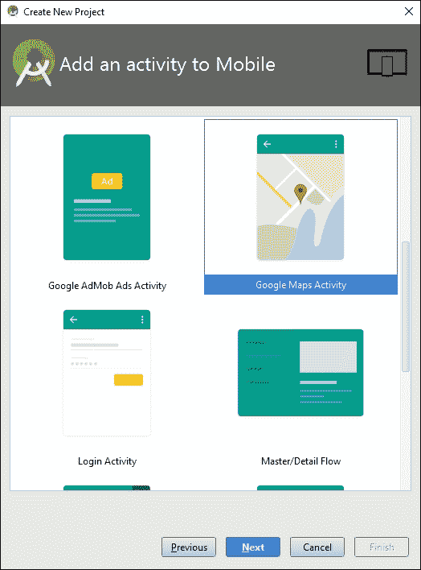
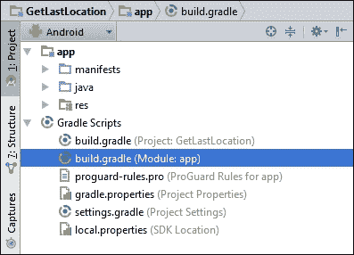
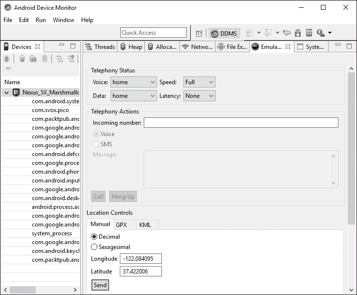

# 第十三章 获取位置和使用地理围栏

在本章中，我们将涵盖以下主题：

+   如何获取最后位置

+   解决 GoogleApiClient OnConnectionFailedListener 报告的问题

+   如何接收位置更新

+   创建并监控地理围栏

# 简介

位置感知为应用提供了许多好处，实际上如此之多，以至于现在甚至桌面应用也试图获取用户的位置。位置的使用范围从逐个方向指示，到“查找最近的”应用程序，基于位置的警报，现在甚至还有基于位置的游戏，让你用设备探索世界。

Google API 提供了许多丰富的功能，用于创建具有位置感知的应用程序和地图功能。我们的第一个配方*如何获取最后位置*将探讨如何获取存储在设备上的最后已知位置。如果你的应用不是位置密集型，这可能提供了一种在不大量消耗资源的情况下获取用户位置的理想方式。如果你需要持续更新，那么请转向*如何接收位置更新*配方。虽然持续的位置更新需要更多资源，但用户可能会在你提供逐个方向指示时理解这一点。如果你需要请求接近位置的位置更新，请查看*创建和监控地理围栏*配方中的 Geofence 选项。

本章中的所有配方都使用 Google 库。如果你还没有下载 SDK 包，请按照 Google 的说明操作。

### 小贴士

从[`developer.android.com/sdk/installing/adding-packages.html`](http://developer.android.com/sdk/installing/adding-packages.html)添加 SDK 包。

现在你已经获得了位置，很可能你还会想将其映射出来。这也是 Google 在 Android 上使用 Google Maps API 使这一过程变得非常简单的一个领域。要开始使用 Google Maps，请在新项目创建时查看 Android Studio 中的**Google Maps Activity**选项。不要选择**空白活动**，正如我们通常在这些配方中所做的那样，选择**Google Maps Activity**，如以下截图所示：



# 如何获取最后位置

我们将从这个章节开始，介绍一个常见的简单配方：如何获取最后已知的位置。这是一种使用 API 且资源消耗非常小的简单方法。（这意味着，你的应用不会负责耗尽电池。）

此配方还提供了设置 Google 位置 API 的良好介绍。

## 准备工作

在 Android Studio 中创建一个新的项目，命名为：`GetLastLocation`。使用默认的**手机和平板**选项，当提示选择**活动类型**时，选择**空活动**。

## 如何操作...

首先，我们将添加必要的权限到 AndroidManifest.xml 文件中，然后创建一个包含`Button`和`TextView`元素的布局。最后，我们将创建一个`GoogleAPIClient` API 来访问最后的位置。打开 AndroidManifest.xml 文件，按照以下步骤操作：

1.  添加以下权限：

    ```java
    <uses-permission android:name="android.permission.ACCESS_COARSE_LOCATION"/>
    ```

1.  在 **Gradle Scripts** 部分，打开 **build.gradle (Module: app)** 文件，如图所示：

1.  在 `dependencies` 部分添加以下语句：

    ```java
    compile 'com.google.android.gms:play-services:8.4.0'
    ```

1.  打开 `activity_main.xml` 并将现有的 `TextView` 替换为以下 XML：

    ```java
    <TextView
        android:id="@+id/textView"
        android:layout_width="wrap_content"
        android:layout_height="wrap_content" />
    <Button
        android:id="@+id/button"
        android:layout_width="wrap_content"
        android:layout_height="wrap_content"
        android:text="Get Location"
        android:layout_centerInParent="true"
        android:onClick="getLocation"/>
    ```

1.  打开 `MainActivity.java` 并添加以下全局变量：

    ```java
    GoogleApiClient mGoogleApiClient;
    TextView mTextView;
    Button mButton;
    ```

1.  添加 `ConnectionCallbacks` 的类：

    ```java
    GoogleApiClient.ConnectionCallbacks mConnectionCallbacks = new GoogleApiClient.ConnectionCallbacks() {
        @Override
        public void onConnected(Bundle bundle) {
            mButton.setEnabled(true);
        }
        @Override
        public void onConnectionSuspended(int i) {}
    };
    ```

1.  添加处理 `OnConnectionFailedListener` 回调的类：

    ```java
    GoogleApiClient.OnConnectionFailedListener mOnConnectionFailedListener = new GoogleApiClient.OnConnectionFailedListener() {
        @Override
        public void onConnectionFailed(ConnectionResult connectionResult) {
            Toast.makeText(MainActivity.this, connectionResult.toString(), Toast.LENGTH_LONG).show();
        }
    };
    ```

1.  将以下代码添加到现有的 `onCreate()` 方法中：

    ```java
    mTextView = (TextView) findViewById(R.id.textView);
    mButton = (Button) findViewById(R.id.button);
    mButton.setEnabled(false);
    setupGoogleApiClient();
    ```

1.  添加设置 `GoogleAPIClient` 的方法：

    ```java
    protected synchronized void setupGoogleApiClient() {
        mGoogleApiClient = new GoogleApiClient.Builder(this)
            .addConnectionCallbacks(mConnectionCallbacks)
            .addOnConnectionFailedListener(mOnConnectionFailedListener)
            .addApi(LocationServices.API)
            .build();
        mGoogleApiClient.connect();
    }
    ```

1.  为按钮点击添加以下方法：

    ```java
    public void getLocation(View view) {
        try {
            Location lastLocation = LocationServices.FusedLocationApi.getLastLocation(
                mGoogleApiClient);
            if (lastLocation != null) {
                mTextView.setText(
                    DateFormat.getTimeInstance().format(lastLocation.getTime()) + "\n" + "Latitude="+lastLocation.getLatitude() + "\n" + "Longitude=" + lastLocation.getLongitude());
            } else {
                Toast.makeText(MainActivity.this, "null", Toast.LENGTH_LONG).show();
            }
        }
        catch (SecurityException e) {e.printStackTrace();}
    }
    ```

1.  您现在可以运行应用在设备或模拟器上了。

## 它是如何工作的...

在我们能够调用 `getLastLocation()` 方法之前，我们需要设置 `GoogleApiClient`。我们在 `setupGoogleApiClient()` 方法中调用 `GoogleApiClient.Builder` 方法，然后连接到库。当库准备好时，它调用我们的 `ConnectionCallbacks.onConnected()` 方法。出于演示目的，这就是我们启用按钮的地方。（我们将在后面的菜谱中使用这个回调来启动其他功能。）

我们使用一个按钮来展示我们可以按需调用 `getLastLocation()`；这不是一次性的调用。系统负责更新位置，并且可能在重复调用时返回相同的位置。（这可以在时间戳中看到——这是位置时间戳，而不是按钮按下时的时间戳。）

这种按需调用位置的方法在您只需要在应用中发生某些事件时（例如对对象进行地理编码）需要位置的情况下很有用。由于系统负责位置更新，您的应用将不会因位置更新而耗电。

我们收到的位置对象的精度基于我们的权限设置。我们使用了 `ACCESS_COARSE_LOCATION`，但如果我们想要更高的精度，我们可以请求 `ACCESS_FINE_LOCATION`，如下所示权限：

```java
<uses-permission android:name="android.permission.ACCESS_FINE_LOCATION"/>
```

最后，为了使代码专注于 `GoogleApiClient`，我们只需将 `getLastLocation()` 包装在 `SecurityException` 中。在生产应用中，您应该检查并请求权限，如前一章所示。（参见 *新的运行时权限模型*。）

## 更多内容...

如果连接到 `GoogleApiClient` 时出现问题，将调用 `OnConnectionFailedListener`。在这个例子中，我们显示一个 Toast。下一个菜谱，*解决 GoogleApiClient OnConnectionFailedListener 报告的问题*，将展示处理这种情况的更健壮的方法。

测试位置可能是一个挑战，因为在测试和调试时很难实际移动设备。幸运的是，我们有能力使用模拟器模拟 GPS 数据。（在物理设备上创建模拟位置也是可能的，但并不容易。）

### 模拟位置

使用模拟器模拟位置有三种方法：

+   Android Studio

+   DDMS

+   通过 Telnet 的 `Geo` 命令

在 Android Studio 中设置模拟位置，请按照以下步骤操作：

1.  导航到 **工具** | **Android** | **Android 设备监控器**。

1.  在设备窗口中选择 **模拟器控制** 选项卡。

1.  在 **位置控制** 下输入 GPS 坐标。

下面是一个显示 **位置** **控制** 的截图：



### 小贴士

并非通过发送 GPS 数据来模拟位置有效。因此，为了让您的应用接收模拟位置，它需要接收 GPS 数据。测试 `lastLocation()` 可能不会发送模拟 GPS 数据，因为它并不完全依赖于 GPS 来确定设备位置。尝试使用 *如何接收位置更新* 的配方来使用模拟位置，我们可以在其中请求优先级。（我们无法强制系统使用任何特定的位置传感器，我们只能提出请求。系统将选择最佳解决方案来提供结果。）

## 参见

+   在第十四章 “为 Play 商店准备您的应用” 的 *“新的 Android 6.0 运行时权限模型”* 配方中，*“为 Play 商店准备您的应用”*

+   设置 Google Play 服务：[`developers.google.com/android/guides/setup`](https://developers.google.com/android/guides/setup)

+   **FusedLocationProviderApi** 接口：[`developers.google.com/android/reference/com/google/android/gms/location/FusedLocationProviderApi`](https://developers.google.com/android/reference/com/google/android/gms/location/FusedLocationProviderApi)

# 解决 GoogleApiClient OnConnectionFailedListener 报告的问题

由于 Google API 的不断变化，您的用户可能会尝试使用您的应用程序，但由于他们的文件过时，可能无法使用。在之前的示例中，我们只显示了一个 Toast，但我们可以做得更好。我们可以使用 `GoogleApiAvailability` 库来显示一个对话框，以帮助用户解决问题。

我们将继续使用之前的配方，并向 `onConnectionFailed()` 回调中添加代码。我们将使用错误结果向用户显示额外的信息以解决问题。

## 准备就绪

此配方将从之前的配方 *如何获取最后位置* 继续进行。如果您是从下载的源文件加载项目，它被称为 `HandleGoogleAPIError`。

## 如何操作...

由于我们正在继续之前的配方，我们只需涵盖更新之前代码所需的步骤。打开 `ActivityMain.java` 并按照以下步骤操作：

1.  将以下行添加到全局类变量中：

    ```java
    private final int REQUEST_RESOLVE_GOOGLE_CLIENT_ERROR=1;
    boolean mResolvingError;
    ```

1.  将以下方法添加以显示 Google API 错误对话框：

    ```java
    private void showGoogleAPIErrorDialog(int errorCode) {
      GoogleApiAvailability googleApiAvailability = GoogleApiAvailability.getInstance();
      Dialog errorDialog = googleApiAvailability.getErrorDialog(this, errorCode, REQUEST_RESOLVE_GOOGLE_CLIENT_ERROR);
      errorDialog.show();
    }
    ```

1.  将以下代码添加以覆盖 `onActivityResult()`：

    ```java
    @Override
    protected void onActivityResult(int requestCode, int resultCode, Intent data) {
      if (requestCode == REQUEST_RESOLVE_GOOGLE_CLIENT_ERROR) {
        mResolvingError = false;
        if (resultCode == RESULT_OK && !mGoogleApiClient.isConnecting() && !mGoogleApiClient.isConnected()) {
            mGoogleApiClient.connect();
        }
      }
    }
    ```

1.  在 `onConnectionFailed()` 中，替换现有的调用 Toast 的代码行，使用以下代码：

    ```java
    if (mResolvingError) {
      return;
    } else if (connectionResult.hasResolution()) {
      mResolvingError = true;
      try {
        connectionResult.startResolutionForResult(MainActivity.this, REQUEST_RESOLVE_GOOGLE_CLIENT_ERROR);
      } catch (IntentSender.SendIntentException e) {
        mGoogleApiClient.connect();
      }
    } else {
      showGoogleAPIErrorDialog(connectionResult.getErrorCode());
    }
    ```

1.  您现在可以运行应用程序在设备或模拟器上了。

## 它是如何工作的...

与我们之前使用 Toast 显示错误消息不同，我们现在检查 `connectionResult` 来查看我们可以做什么。`GoogleAPIClient` 使用 `connectionResult` 来指示可能的行动方案。我们可以调用 `hasResolution()` 方法，如下所示：

```java
connectionResult.hasResolution()
```

如果响应是 `true`，那么这是用户可以解决的问题，例如启用位置服务。如果响应是 `false`，我们得到一个 `GoogleApiAvailability` 实例并调用 `getErrorDialog()` 方法。完成后，我们的 `onActivityResult()` 回调被调用，其中我们重置 `mResolvingError`，如果成功，尝试重新连接。

### 小贴士

如果你没有设备用于测试较旧的 Google API，你可以尝试在具有较旧 Google API 版本的模拟器上测试。

## 还有更多...

如果你的应用程序正在使用片段，你可以使用此代码获取一个对话框片段：

```java
ErrorDialogFragment errorFragment = new ErrorDialogFragment();
Bundle args = new Bundle();
args.putInt("dialog_error", errorCode);
errorFragment.setArguments(args);
errorFragment.show(getSupportFragmentManager(), "errordialog");
```

## 相关内容

+   访问 Google API：[`developers.google.com/android/guides/api-client`](https://developers.google.com/android/guides/api-client)

# 如何接收位置更新

如果你的应用程序需要频繁的位置更新，你的应用程序可以请求周期性更新。这个菜谱将使用 `GoogleApiClient` 的 `requestLocationUpdates()` 方法来演示这一点。

## 准备工作

在 Android Studio 中创建一个新的项目并命名为：`LocationUpdates`。使用默认的 **Phone & Tablet** 选项，并在提示 **Activity Type** 时选择 **Empty Activity**。

## 如何操作...

由于我们从系统中接收更新，我们不需要为这个菜谱添加按钮。我们的布局将只包含 `TextView` 来查看位置数据。打开 AndroidManifest.xml 并按照以下步骤操作：

1.  添加以下权限：

    ```java
    <uses-permission android:name="android.permission.ACCESS_FINE_LOCATION"/>
    ```

1.  打开文件 `build.gradle (Module: app)` 并在 `dependencies` 部分添加以下语句：

    ```java
    compile 'com.google.android.gms:play-services:8.4.0'
    ```

1.  打开 `activity_main.xml` 并将现有的 `TextView` 替换为以下 XML：

    ```java
    <TextView
        android:id="@+id/textView"
        android:layout_width="wrap_content"
        android:layout_height="wrap_content" />
    ```

1.  打开 `MainActivity.java` 并添加以下全局变量：

    ```java
    GoogleApiClient mGoogleApiClient;
    LocationRequest mLocationRequest;
    TextView mTextView;
    ```

1.  创建以下 `LocationListener` 类：

    ```java
    LocationListener  mLocationListener = new LocationListener() {
        @Override
        public void onLocationChanged(Location location) {
            if (location != null) {
                mTextView.setText(
                    DateFormat.getTimeInstance().format(location.getTime()) + "\n" + "Latitude="+location.getLatitude()+"\n" + "Longitude="+location.getLongitude());
            }
        }
    };
    ```

1.  创建一个 `ConnectionCallbacks` 类来接收位置更新：

    ```java
    GoogleApiClient.ConnectionCallbacks mConnectionCallbacks = new GoogleApiClient.ConnectionCallbacks() {
        @Override
        public void onConnected(Bundle bundle) {
            Log.i("onConnected()", "start");
            try {
                LocationServices.FusedLocationApi.requestLocationUpdates(
                    mGoogleApiClient, mLocationRequest, mLocationListener);
            } catch (SecurityException e) {
                Log.i("onConnected()","SecurityException: "+e.getMessage());
            }
        }
        @Override
        public void onConnectionSuspended(int i) {}
    };
    ```

1.  创建一个 `OnConnectionFailedListener` 类：

    ```java
    GoogleApiClient.OnConnectionFailedListener mOnConnectionFailedListener = new GoogleApiClient.OnConnectionFailedListener() {
        @Override
        public void onConnectionFailed(ConnectionResult connectionResult) {
            Toast.makeText(MainActivity.this, connectionResult.toString(), Toast.LENGTH_LONG).show();
            Log.i("onConnected()", "SecurityException: " +connectionResult.toString());
        }
    };
    ```

1.  将以下代码添加到现有的 `onCreate()` 回调中：

    ```java
    mTextView = (TextView) findViewById(R.id.textView);
    setupLocationRequest();
    ```

1.  创建 `setupLocationRequest()` 方法：

    ```java
    protected synchronized void setupLocationRequest() {
        mLocationRequest = new LocationRequest();
        mLocationRequest.setInterval(10000);
        mLocationRequest.setFastestInterval(10000);
        mLocationRequest.setPriority(LocationRequest.PRIORITY_HIGH_ACCURACY);
        mGoogleApiClient = new GoogleApiClient.Builder(this)
                .addConnectionCallbacks(mConnectionCallbacks)
                .addOnConnectionFailedListener(mOnConnectionFailedListener)
                .addApi(LocationServices.API)
                .build();
        mGoogleApiClient.connect();
    }
    ```

1.  你已经准备好在设备或模拟器上运行应用程序了。

## 它是如何工作的...

这个菜谱与 *如何获取最后位置* 菜谱类似，因为我们需要像之前一样设置 `GoogleApiClient`。但是，我们不是在需要时调用 `lastLocation()` 方法，而是调用 `requestLocationUpdates()` 方法通过 `LocationListener` 类接收周期性的位置更新。

`requestLocationUpdates()` 方法需要三个参数：

+   `GoogleApiClient`

+   `LocationRequest`

+   `LocationListener`

我们像之前一样创建 `GoogleApiClient`。这是创建我们的 `LocationRequest` 的代码：

```java
mLocationRequest = new LocationRequest();
mLocationRequest.setInterval(10000);
mLocationRequest.setFastestInterval(10000);
mLocationRequest.setPriority(LocationRequest.PRIORITY_HIGH_ACCURACY)
```

当调用 `setInterval()` 时，通常最好使用最慢的延迟，这样对设备资源的需求更少。当调用 `setPriority()` 时，这个想法同样适用。第三个参数，即 `LocationListener`，是我们定义回调方法 `onLocationChanged()` 的地方。在这里，我们只是显示位置数据以及位置时间戳。

## 更多内容...

与之前的 Android API 不同，`GoogleApiClient` API 不允许选择特定的传感器进行位置更新。如 *如何获取最后位置* 部分的 *模拟位置* 所述，使用 `LocationRequest.PRIORITY_HIGH_ACCURACY` 与 `ACCESS_FINE_LOCATION` 权限应使用 GPS 传感器。请参阅 *模拟位置* 部分以获取模拟位置的说明。

### 停止接收位置更新

当你的应用程序不再需要位置更新时，调用 `removeLocationUpdates()` 方法，如下所示：

```java
LocationServices.FusedLocationApi.removeLocationUpdates(
    mGoogleApiClient, mLocationListener);
```

通常，当你的应用程序不再在前台时，你会想要禁用更新，但这取决于你具体的应用程序需求。如果你的应用程序需要持续更新，可能更希望创建一个后台服务来处理回调。

## 参见

+   **开发者文档：onLocationChanged** 在 [`developer.android.com/reference/com/google/android/gms/location/LocationRequest.html`](https://developer.android.com/reference/com/google/android/gms/location/LocationRequest.html)

# 创建和监控地理围栏

如果你的应用程序需要知道用户何时进入某个特定位置，有一个替代方案，即不需要持续检查用户的位置：地理围栏。地理围栏是一个位置（纬度和经度）以及一个半径。你可以创建一个地理围栏，并让系统在用户进入你指定的位置附近时通知你。（Android 目前允许每个用户最多 100 个地理围栏。）

地理围栏属性包括：

+   **位置**：经度和纬度

+   **半径**：圆的大小（以米为单位）

+   **逗留延迟**：用户在发送通知之前可以在半径内停留多长时间

+   **过期时间**：地理围栏自动过期前的时间

+   **过渡** **类型**：以下列出了这些类型：

    +   `GEOFENCE_TRANSITION_ENTER`

    +   `GEOFENCE_TRANSITION_EXIT`

    +   `INITIAL_TRIGGER_DWELL`

这个菜谱将展示如何创建地理围栏对象，并使用它来创建 `GeofencingRequest` 的实例。

## 准备工作

在 Android Studio 中创建一个新的项目，命名为：`Geofence`。使用默认的 **Phone & Tablet** 选项，并在提示 **Activity Type** 时选择 **Empty Activity**。

## 如何操作...

我们不需要为这个菜谱创建布局，因为我们将会使用 Toasts 和通知来进行用户交互。我们需要创建一个额外的 Java 类来处理 `IntentService`，它负责处理地理围栏警报。打开 Android Manifest 并按照以下步骤操作：

1.  添加以下权限：

    ```java
    <uses-permission android:name="android.permission.ACCESS_FINE_LOCATION"/>
    ```

1.  打开文件 `build.gradle (Module: app)` 并在 `dependencies` 部分添加以下语句：

    ```java
    compile 'com.google.android.gms:play-services:8.4.0'
    ```

1.  创建一个新的 Java 类 `GeofenceIntentService` 并扩展 `IntentService` 类。声明如下：

    ```java
    public class GeofenceIntentService extends IntentService {
    ```

1.  添加以下构造函数：

    ```java
    public GeofenceIntentService() {
        super("GeofenceIntentService");
    }
    ```

1.  添加 `onHandleIntent()` 以接收地理围栏警报：

    ```java
    protected void onHandleIntent(Intent intent) {
        GeofencingEvent geofencingEvent = GeofencingEvent.fromIntent(intent);
        if (geofencingEvent.hasError()) {
            Toast.makeText(getApplicationContext(), "Geofence error code= " + geofencingEvent.getErrorCode(), Toast.LENGTH_SHORT).show();
            return;
        }
        int geofenceTransition = geofencingEvent.getGeofenceTransition();
        if (geofenceTransition == Geofence.GEOFENCE_TRANSITION_DWELL) {
            sendNotification();
        }
    }
    ```

1.  添加 `sendNotification()` 方法以向用户显示消息：

    ```java
    private void sendNotification() {
        Log.i("GeofenceIntentService", "sendNotification()");
        Uri notificationSoundUri = RingtoneManager.getDefaultUri(RingtoneManager.TYPE_NOTIFICATION);
        NotificationCompat.Builder notificationBuilder = new NotificationCompat.Builder(this)
                .setSmallIcon(R.mipmap.ic_launcher)
                .setContentTitle("Geofence Alert")
                .setContentText("GEOFENCE_TRANSITION_DWELL")
                .setSound(notificationSoundUri)
                .setLights(Color.BLUE, 500, 500);
        NotificationManager notificationManager = (NotificationManager) getApplicationContext().getSystemService(Context.NOTIFICATION_SERVICE);
        notificationManager.notify(0, notificationBuilder.build());
    }
    ```

1.  打开 Android 清单并在 `<application>` 元素内添加以下内容，与 `<activity>` 元素处于同一级别：

    ```java
    <service android:name=".GeofenceIntentService"/>
    ```

1.  打开 `MainActivity.java` 并添加以下全局变量：

    ```java
    private final int MINIMUM_RECOMENDED_RADIUS=100;
    GoogleApiClient mGoogleApiClient;
    PendingIntent mGeofencePendingIntent;
    ```

1.  创建以下 `ResultCallback` 类：

    ```java
    ResultCallback mResultCallback = new ResultCallback() {
        @Override
        public void onResult(Result result) {
            Log.i("onResult()", "result: " + result.getStatus().toString());
        }
    };
    ```

1.  创建一个 `ConnectionCallbacks` 类：

    ```java
    GoogleApiClient.ConnectionCallbacks mConnectionCallbacks = new GoogleApiClient.ConnectionCallbacks() {
        @Override
        public void onConnected(Bundle bundle) {
            try {
              LocationServices.GeofencingApi.addGeofences(
                  mGoogleApiClient,
                  createGeofencingRequest(),
                  getGeofencePendingIntent()
              ).setResultCallback(mResultCallback);
            } catch (SecurityException e) {
                Log.i("onConnected()", "SecurityException: " + e.getMessage());
            }
        }
        @Override
        public void onConnectionSuspended(int i) {}
    };
    ```

1.  创建一个 `OnConnectionFailedListener` 类：

    ```java
    GoogleApiClient.OnConnectionFailedListener mOnConnectionFailedListener = new GoogleApiClient.OnConnectionFailedListener() {
        @Override
        public void onConnectionFailed(ConnectionResult connectionResult) {
            Log.i("onConnectionFailed()", "connectionResult: " +connectionResult.toString());
        }
    };
    ```

1.  将以下代码添加到现有的 `onCreate()` 回调中：

    ```java
      setupGoogleApiClient();
    ```

1.  添加设置 `GoogleAPIClient` 的方法：

    ```java
    protected synchronized void setupGoogleApiClient() {
        mGoogleApiClient = new GoogleApiClient.Builder(this)
            .addConnectionCallbacks(mConnectionCallbacks)
            .addOnConnectionFailedListener(mOnConnectionFailedListener)
            .addApi(LocationServices.API)
            .build();
        mGoogleApiClient.connect();
    }
    ```

1.  创建 `setupGoogleApiClient()` 方法：

    ```java
    protected synchronized void setupGoogleApiClient() {
        mGoogleApiClient = new GoogleApiClient.Builder(this)
            .addConnectionCallbacks(mConnectionCallbacks)
            .addOnConnectionFailedListener(mOnConnectionFailedListener)
            .addApi(LocationServices.API)
            .build();
        mGoogleApiClient.connect();
    }
    ```

1.  使用以下方法创建一个挂起意图：

    ```java
    private PendingIntent getGeofencePendingIntent() {
        if (mGeofencePendingIntent != null) {
            return mGeofencePendingIntent;
        }
        Intent intent = new Intent(this, GeofenceIntentService.class);
        return PendingIntent.getService(this, 0, intent, PendingIntent.FLAG_UPDATE_CURRENT);
    }
    ```

1.  创建 `geofence` 对象并将其添加到请求的列表中：

    ```java
    private List createGeofenceList() {
        List<Geofence> geofenceList = new ArrayList<Geofence>();
        geofenceList.add(new Geofence.Builder()
                .setRequestId("GeofenceLocation")
                .setCircularRegion(
                        37.422006, //Latitude
                        -122.084095, //Longitude
                        MINIMUM_RECOMENDED_RADIUS)
                .setLoiteringDelay(30000)
                .setExpirationDuration(Geofence.NEVER_EXPIRE)
                .setTransitionTypes(Geofence.GEOFENCE_TRANSITION_DWELL)
        .build());
        return geofenceList;
    }
    ```

1.  按如下方式创建 `createGeofencingRequest()` 方法：

    ```java
    private GeofencingRequest createGeofencingRequest() {
        GeofencingRequest.Builder builder = new GeofencingRequest.Builder();
        builder.setInitialTrigger(GeofencingRequest.INITIAL_TRIGGER_DWELL);
        builder.addGeofences(createGeofenceList());
        return builder.build();
    }
    ```

1.  您现在可以运行应用程序在设备或模拟器上。

## 它是如何工作的...

首先，我们添加 `ACCESS_FINE_LOCATION` 权限，因为这是地理围栏所必需的。我们设置 `GoogleApiClient`，就像我们在之前的菜谱中所做的那样，并等待 `onConnected()` 被调用以设置 `GeofencingApi`。

在我们可以调用 `GeofencingApi.addGeofences()` 方法之前，我们必须准备三个对象：

+   `GoogleApiClient`

+   地理围栏请求

+   悬挂意图

我们已经创建了 `GoogleApiClient`，并将其保存在 `mGoogleApiClient` 中。

要创建地理围栏请求，我们使用 `GeofencingRequest.Builder`。构建器需要地理围栏对象的列表，这些对象是在 `createGeofenceList()` 方法中创建的。（尽管我们只创建了一个地理围栏对象，但构建器需要一个列表，所以我们只需将我们的单个地理围栏添加到 `ArrayList` 中。）这就是我们设置地理围栏属性的地方：

```java
.setRequestId("GeofenceLocation")
.setCircularRegion(
        37.422006, //Latitude
        -122.084095, //Longitude
        MINIMUM_RECOMENDED_RADIUS)
.setLoiteringDelay(30000)
.setExpirationDuration(Geofence.NEVER_EXPIRE)
.setTransitionTypes(Geofence.GEOFENCE_TRANSITION_DWELL)
```

只有逗留延迟是可选的，但由于我们正在使用 `DWELL` 转换，我们需要它。当调用 `setTransitionTypes()` 时，我们可以使用 `OR` 运算符组合多个转换类型，如下所示，这里使用 `ENTER` 和 `EXIT` 作为示例：

```java
.setTransitionTypes(Geofence.GEOFENCE_TRANSITION_ENTER | Geofence.GEOFENCE_TRANSITION_EXIT)
```

对于这个示例，我们使用了与模拟器相同的默认纬度和经度。根据需要更改这些值。

我们对 `Geofence.Builder()` 的调用创建了地理围栏对象。有了准备好的地理围栏列表，我们调用 `GeofencingRequest.Builder` 并将我们的初始触发设置为 `INITIAL_TRIGGER_DWELL`。（如果您更改了前面的转换类型，您可能还想更改初始触发。）

我们需要的最后一个对象是 Pending Intent，这是系统在地理围栏条件满足时通知我们的应用的方式。我们创建了`GeofenceIntentService`来处理地理围栏意图，通过向用户发送通知来处理。（有关通知的更多信息，请参阅第七章中的*使用通知的“灯光、动作和声音重置”配方*，*警报和通知*。）

创建了所有三个对象后，我们只需调用`LocationServices.GeofencingApi.addGeofences()`并等待通知到达。

## 还有更多...

要停止接收地理围栏通知，你可以使用`removeGeofences()`方法，并传入`RequestID`参数或`PendingIntent`。以下示例使用了与通知相同的`PendingIntent`方法：

```java
LocationServices.GeofencingApi.removeGeofences(
    mGoogleApiClient,
    getGeofencePendingIntent()
).setResultCallback(mResultCallback);
```

## 参见

+   `Geofence.Builder`类位于：[`developers.google.com/android/reference/com/google/android/gms/location/Geofence.Builder.html`](https://developers.google.com/android/reference/com/google/android/gms/location/Geofence.Builder.html)

+   `GeofencingRequest.Builder`类位于：[`developers.google.com/android/reference/com/google/android/gms/location/GeofencingRequest.Builder`](https://developers.google.com/android/reference/com/google/android/gms/location/GeofencingRequest.Builder)
