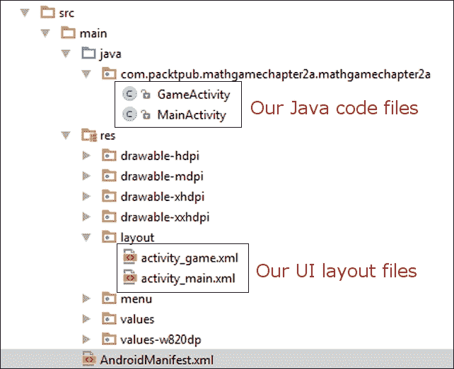

# 第一部分 第 1 模块

> ***通过构建 Android 游戏学习 Java***
> 
> *准备好通过为 Android 平台开发游戏来享受学习 Java 的乐趣*

# 第一章 为什么选择 Java、Android 和游戏？

欢迎来到《通过构建 Android 游戏学习 Java》，我希望这只是你进入设计和编写游戏激动人心的旅程的开始。到这本书的结尾，我们将制作四个完整的游戏：一个难度动态增加的数学测验，一个类似经典 Simon 玩具的记忆游戏，一个乒乓球风格的壁球游戏，以及经典*蛇*游戏的克隆版。

除了这些游戏，我们还将构建十几个工作应用来练习和展示单个概念，以帮助我们学习 Java、Android 和游戏。我们的游戏和应用将包含音效、图形和动画。我们将从使用标准的 Android **用户界面**（**UI**）设计器到通过绘制单个像素来创建平滑动画的一切内容。

虽然我会鼓励你和我一起工作，并实现书中详细分步说明的具体项目，但我完全期待一旦你掌握了不同的概念，你将希望立即在自己的独特创作中使用它们。这正是我希望你能受到的启发。

游戏项目本身不是本书的目标，而是达到更高目标的手段。到本书结束时，你将能够设计和实现自己的 2D Android 游戏，无论是为了出售还是免费赠送，都可以在 Google Play 上发布。

### 小贴士

首先需要做一些基础工作，但我保证这不会花费很长时间，也不会很复杂。任何人都可以学会编程。

然而，专家之间有如此多的不同意见，这会在初学者中产生关于学习编程最佳方法的困惑。因此，了解为什么学习 Java、Android 和游戏是初学者的理想途径是一个好主意。这是我们将在本书中首先讨论的内容。

在本章中，我们将学习以下内容：

+   这本书适合我吗？

+   我为什么要用游戏来学习编程？

+   为什么我要学习 Java 和 Android？

+   设置我们的开发环境

# 这本书适合我吗？

如果你已经决定要学习 Java、Android 或游戏，那么下一个问题可能就是，“这本书适合我吗？”。

对于初学者来说，有很多 Java 书籍，以及比我更有成就的作者和程序员的书籍。我读过很多，并且很钦佩这些作者。然而，当这些书籍偏离主题——它们都会这样做——涉及到诸如 Java 本地接口、网络浏览器小程序或服务器端远程通信等话题时，我有时会质疑它们对我直接的相关性。

在这个时候，至少在潜意识里，我的承诺会减弱，学习过程会放缓或停止。

## 如果你只想学习纯 Java

如果你只是想单独学习 Java，这本书将是一个坚实的起点。尽管 Android 的内容可能被认为是纯 Java 学习的额外开销，但这比任何其他 Java 书籍中可能引入的众多不必要的话题要少得多。这本书的唯一缺点是所有必要的开销都在开始时。但一旦这个最小开销被清除，我们就可以非常专注地学习 Java。

关于开销的量：

+   在本章中设置我们的编程环境需要大约六页

+   要熟悉 Android 工具、创建你的第一个工作项目并瞥见你的第一段真正的 Java 代码，需要第二章, *开始使用 Android*

+   从那时起，它将几乎完全是 Java 和构建游戏

你很快就会看到，微量的开销并不算多，而且是非常值得的。

## 如果 Android 是你的重点

如果是 Android 本身让你看了这本书，那么我很自豪地说，这是第一本不假设你有任何先前的 Java 或编程知识的 Android 书籍。

## 这本书将带你去往何方

到这本书结束时，你将能够轻松地选择许多路径之一，包括以下这些：

+   在任何平台上以更高水平学习 Java

+   中级水平的 Android 学习，包括纯游戏框架（将在第九章[Chapter 9. Making Your Game the Next Big Thing]中更详细地介绍），*制作你的游戏成为下一个大热门*

+   更高级别的游戏开发

+   更容易地处理任何现代面向对象的语言，如 iOS、Windows 或 Web 开发

所以如果你知道你想要学习 Android 或 Java，希望我已经走了一些路来让你承诺这本书将如何帮助你。但为什么是游戏、Android 或 Java 呢？

# 为什么要通过制作游戏来学习编程？

趣味，当然！但还有其他原因。成功运行我们编写的任何程序都令人无比满足，尤其是当它涉及到使用一些我们之前不理解的一些代码时。

但正如你很快就会意识到的那样，自己制作游戏会带来一种难以描述的愉悦感——必须亲身体验。然后还有将我们的作品与朋友在手机或平板电脑上分享，甚至公开在 Google Play Store 上分享的额外好处，你可能会意识到一旦你开始制作游戏，你就无法停止。

随着我们持续创建更复杂的游戏，你会发现所有技术和代码片段都可以重新组合来创建其他游戏，然后你可以开始规划你自己的独特杰作。这至少是非常令人兴奋的。

就像许多学科一样，我们练习得越多，我们就越好。所以，游戏是开始学习编程 Java 的完美方式。然而，大多数 Android 游戏入门书籍都需要相当高的 Java 知识水平。但正如我们将看到的，完全有可能将实际示例作为有趣的游戏项目，并从 Java 的非常基础开始。

这种方法有一些微小的权衡。我们不会总是以“按部就班”的方式处理工作游戏示例。这是为了避免在掌握前进翻滚之前就翻跟头的风险。

学习成果的优先级始终是 Java 编程概念，其次是理解 Android 环境和游戏设计原则。话虽如此，我们将仔细检查和实践大量的 Android 和游戏编程基础。

当然，根据我们刚才讨论的内容，如果你我们没有制作游戏，那么在相同数量的页码中，我们可能已经能够教授更多的 Java 知识。

这一点是正确的，但这样一来，我们就失去了使用游戏作为主题所带来的所有好处。制作游戏确实可以是一种乐趣，当我们的头脑开放且渴望信息时，我们会学得更快。这种学习方式的最低成本被抵消了百倍。如果你对游戏完全不感兴趣，那么市面上有很多采用传统方法的 Java 入门指南。只是不要期待当你发布带有在线排行榜和成就的第一款游戏时会有同样的兴奋感。

# 为什么选择 Android 和 Java？

成功学习的一部分是学生的承诺，不仅是要完成工作，而且要相信他们正在以正确的方式做正确的事情。所以，许多基于技术的课程和书籍并没有从读者那里获得这种承诺，至少不是无意识的承诺。

问题在于学生们的信念，他们可能至少部分地认为，他们在浪费时间，因为某些东西可能很快就会过时，或者可能并不完全适合他们。这在编程方面在很大程度上是正确的。那么，为什么你应该花有限的时间学习 Java，特别是 Android 的 Java 呢？

## Android 是发展最快、增长最快的操作系统

曾经，Android 的更新几乎每两个月就会推出一次。即便现在，它们大约每六个月更新一次。相比之下，Windows 版本之间的间隔需要数年，甚至 iOS 的更新也通常是每年一次，而且版本之间的变化相对较小。Android 显然正在以前所未有的速度发展和改进。

### 小贴士

查看自 Android 1.0 版本以来的 Android 版本历史，请访问[`www.cnet.com/news/history-of-android/`](http://www.cnet.com/news/history-of-android/)。

Android 的第一个版本于 2008 年发布，当时消费者对当时更加炫目的 iPhone 已经相当兴奋。新闻故事也报道说，开发者通过在 iTunes 应用商店销售应用而变得富有。

但在撰写本书的最后一整年，三星独自销售的安卓设备数量超过了苹果销售的 iOS 设备总和。我并不参与关于哪个设备更好的战争。我享受安卓和苹果的各个方面，但纯粹从选择学习平台的角度来看，你可能是在正确的时间和地点选择了安卓。

## 安卓开发者有广阔的前景

现在你可能只是因为学习编程游戏带来的乐趣和满足感而选择了这本书。但如果你决定进一步发展你的学习，你会发现安卓程序员的需求数量巨大，因此也非常有利可图。

### 小贴士

一些数据显示，薪资超过 10 万美元。更多信息，请访问[`www.indeed.com/salary?q1=Android+Developer&l1=United+States`](http://www.indeed.com/salary?q1=Android+Developer&l1=United+States)。

## 安卓是开源的

开源的意思是，尽管谷歌开发了用于最新设备上的所有安卓版本，但一旦代码发布，任何人都可以随意使用它。谷歌只对代码进行有限时间的控制。

在实践中，大多数安卓用户使用的是纯谷歌操作系统，或者是由三星和 HTC 等大型制造商推出的修改版。但没有任何东西可以阻止任何人获取操作系统并对其进行更改、适应或将其转换为任何他们喜欢的东西。简而言之，安卓永远不会从编程社区中消失。

## Java 将长期存在

好的，所以我们看到安卓不太可能消失，但 Java 是否会变得过时？而且你投入的大量时间是否会白费？在安卓平台上，就像大多数平台一样，你可以使用许多语言和工具。然而，安卓是从底层设计的，旨在促进 Java 开发。所有其他语言和工具都不是无效的，但往往只服务于相当具体的目的，而不是 Java 的真正替代品。实际上，就游戏而言，许多纯 Java 开发环境的替代品也是基于 Java 的，并且需要具备相当水平的 Java 技能才能使用。例如，流行的 LibGDX 游戏开发库，它允许你同时为安卓、iOS、Windows、Linux、Mac 甚至网络开发游戏，仍然使用 Java！我们将在第九章中更多讨论这一点，*让你的游戏成为下一个大热门*。重点是 Java 和安卓紧密相连，并且可能会共同繁荣。

## Java 不仅仅是为安卓

Java 的历史比安卓悠久得多，实际上是从 20 世纪 90 年代初开始的。尽管 Java 的应用范围在超过二十年的时间里已经演变和多样化，但语言本身最初实现的优势今天仍然保持不变。

Java 被设计成平台或计算机无关。这是通过使用**虚拟机**（**VM**）来实现的。这是一个用另一种语言编写的程序，它解码我们编写的 Java 程序，并与它运行的计算机平台交互。所以只要有一个 VM 可以在你想要运行 Java 程序的计算机上运行，有一些限制，你的 Java 程序就会工作。所以如果你学习 Java，你就是在学习一种从智能冰箱到网络以及大多数中间位置都使用的语言。 

然而，确实，每个平台上的虚拟机都可以并且通常确实实现了特定于其可能被用于的功能。一个明显的例子就是针对移动设备的功能，比如传感器、GPS 或者许多 Android 设备内置的摄像头。使用 Java 和 Android，你可以拍照、检测空气压力，并精确地计算出你在世界上的确切位置。大多数冰箱虚拟机可能不会这样做。所以你并不能总是只在设备 x 上运行为设备 y 设计的 Java 程序，但语言和语法是相同的。在 Android 上学习 Java 在很大程度上为你准备在任何情况下使用 Java。所以请放心，Java 不会很快消失。

## Java 快速且易于使用

关于哪种语言是整体上最好的或者哪种语言是学习编程最好的，已经有数十年的争论。Java 的批评者可能会说关于 Java 速度的一些事情。确实，Java 的内存管理和虚拟机解释过程确实有一些速度成本。然而，这些事情也有好处；它们显著提高了我们的生产力，并且 Android 虚拟机与设备交互的方式在很大程度上抵消了轻微的速度惩罚。并且自从 Android 4.4 以来，它完全通过**Android 运行时**（**ART**）来实现，将用 Java 编写的应用程序安装为完全本机应用程序。现在 Java 程序员可以用一种友好的、解释型语言构建游戏，并且它们可以像用更具挑战性的本机编译语言编写的那样运行。

## Java 和 Android 的总结

在一个快速变化的世界里，如果你担心在哪里投资你宝贵的学习时间，很难更有信心。这里我们有一个语言（Java），其基础几乎保持了近四分之一世纪不变，有一个平台（Android），它得到了硬件、软件和零售界最大公司的支持，尽管它确实受到了巨大的影响，但实际上并不属于任何人。

我并不是任何一种技术的传教士，尽管确实我喜欢在 Android 上做事情。但你可以确信，如果你正在考虑学习编程的最佳路径，有一个非常有力的论据认为 Java 和 Android 是最好的选择。

如果你想要学习 Java 以用于其众多用途中的任何一个，那么这是一个非常好的开始地方。如果你想要为 Android 开发或者进入任何形式的 Android 开发，那么 Java 是绝对的基础入门方式，制作游戏也有我们已讨论过的巨大好处。

到了本书的结尾，你将能够为几乎任何 Java 支持的平台编写 Java 代码。你将能够使用本书中学到的几乎所有内容，即使是在 Android 环境之外。

如果你计划通过制作 Android 游戏或任何 Android 应用来追求职业或商业，那么这本书可能是初学者开始的地方。

如果你完全对 Java 一无所知，并且想要掌握它的最简单路径——地球上增长最快的平台——那么《通过构建 Android 游戏学习 Java》可能正是你所需要的。

因此，希望你能确信这本书将带你学习 Java 的路径将和 Java 学习本身一样简单、有趣且全面。让我们开始设置，以便我们可以开始构建游戏。

# 设置我们的开发环境

我们需要做的第一件事是为使用 Java 开发 Android 准备我们的 PC。幸运的是，这对我们来说变得相当简单。

### 小贴士

如果你正在 Mac 或 Linux 上学习，这本书中的所有内容都将适用。接下来的两个教程将包含针对 Windows 的特定说明和屏幕截图。然而，调整步骤以适应 Mac 或 Linux 应该不会太难。

我们需要做的只是：

1.  安装一个名为**Java 开发工具包**（**JDK**）的软件包，它允许我们在 Java 中进行开发。

1.  安装 Android Studio，这是一个旨在使 Android 开发快速且简单的程序。Android Studio 使用 JDK 以及一些其他在安装 Android Studio 时自动安装的特定于 Android 的工具。

## 安装 JDK

我们需要做的第一件事是获取 JDK 的最新版本。为了完成本指南，请执行以下步骤：

1.  你需要访问 Java 网站，因此请访问 [`www.oracle.com/technetwork/java/javase/downloads/index.html`](http://www.oracle.com/technetwork/java/javase/downloads/index.html)。

1.  在以下屏幕截图中所显示的三个按钮中找到并点击标有**JDK**（高亮显示）的按钮。它们位于网页的右侧。在**JDK**选项下点击**下载**按钮：

1.  你将被带到具有多个下载 JDK 选项的页面。在**产品/文件描述**列中，你需要点击与你的操作系统匹配的选项。Windows、Mac、Linux 以及一些其他不太常见的选项都列出来了。

1.  这里一个常见的问题是，“我是否有 32 位或 64 位的 Windows？”要找出答案，请右键单击你的**我的电脑**（Windows 8 上的**此电脑）图标，点击**属性**选项，然后在**系统类型**条目下的**系统**标题下查看，如下面的屏幕截图所示：

1.  点击稍显隐藏的**接受许可协议**复选框：

1.  现在点击您之前确定的操作系统和系统类型的下载选项。等待下载完成。

1.  在您的`下载`文件夹中，双击您刚刚下载的文件。截至撰写本文时，64 位 Windows PC 的最新版本是`jdk-8u5-windows-x64`。如果您使用 Mac/Linux 或 32 位操作系统，您的文件名将相应变化。

1.  在几个安装对话框中的第一个，点击**下一步**按钮，您将看到下一个对话框：

1.  通过点击**下一步**接受之前屏幕截图显示的默认设置。在下一个对话框中，您可以通过点击**下一步**接受默认的安装位置。

1.  接下来是 Java 安装程序的最后一个对话框。点击**关闭**。

    JDK 现在已安装在您的 PC 上。接下来我们将确保 Android Studio 能够使用 JDK。

1.  右键单击您的**我的电脑**（Windows 8 上的“此电脑”）图标，导航到**属性** | **高级系统设置** | **环境变量** | **新建**（在**系统变量**下，不在**用户变量**下）。现在您可以看到如下所示的**新建系统变量**对话框：

1.  在**变量名**处输入`JAVA_HOME`，并在**变量值**字段中输入`C:\Program Files\Java\jdk1.8.0_05`。如果您在其他位置安装了 JDK，那么在**变量值**字段中输入的文件路径需要指向您放置它的位置。您的确切文件路径可能以不同的结尾结束，以匹配您下载时的 Java 最新版本。

1.  点击**确定**保存您的新设置。现在再次点击**确定**以清除**高级系统设置**对话框。

现在我们已经在我们的 PC 上安装了 JDK。我们距离开始学习 Java 编程已经走了一半的路，但我们需要一个友好的方式与 JDK 交互，并帮助我们用 Java 制作 Android 游戏。

## Android Studio

我们了解到 Android Studio 是一个简化 Android 开发的工具，并使用 JDK 允许我们编写和构建 Java 程序。您可以使用其他工具代替 Android Studio。它们各有优缺点。例如，另一个极其流行的选择是 Eclipse。就像编程中的许多事情一样，可以强烈论证为什么您应该使用 Eclipse 而不是 Android Studio。我两者都使用，但我希望您会喜欢 Android Studio 的以下元素：

+   它是一个非常整洁的界面，尽管仍在开发中，但非常精致和干净。

+   与 Eclipse 相比，开始使用它要容易得多，因为几个原本需要单独安装的 Android 工具已经包含在包中。

+   Android Studio 由 Google 开发，基于另一个名为 IntelliJ IDEA 的产品。它有可能在未来不久成为开发 Android 的标准方式。

### 小贴士

如果你想要使用 Eclipse，那也行；这本书中的所有代码都将正常工作。然而，一些快捷键和用户界面按钮显然会有所不同。如果你还没有安装 Eclipse，并且没有 Eclipse 的先验经验，那么我更强烈地建议你继续使用 Android Studio。

### 安装 Android Studio

因此，我们毫不拖延地开始安装 Android Studio，然后我们可以开始我们的第一个游戏项目。为此，让我们访问[`developer.android.com/sdk/installing/studio.html`](https://developer.android.com/sdk/installing/studio.html)。

1.  点击标有**下载 Android Studio**的按钮开始下载 Android Studio。这将带你去另一个看起来非常相似的网页，上面有一个你刚刚点击过的按钮。

1.  通过勾选复选框接受许可，通过点击标有**下载 Android Studio for Windows**的按钮开始下载，并等待下载完成。按钮上的确切文本可能会根据当前最新版本而有所不同。

1.  在你刚刚下载 Android Studio 的文件夹中，右键单击`android-studio-bundle-135.12465-windows.exe`文件，然后点击**以管理员身份运行**。文件名末尾将根据 Android Studio 的版本和你的操作系统而有所不同。

1.  当询问你是否想要**允许来自未知发布者的以下程序更改你的计算机**时，请点击**是**。在下一个屏幕上，点击**下一步**。

1.  在以下屏幕截图显示的屏幕上，你可以选择你的 PC 上哪些用户可以使用 Android Studio。选择适合你的选项，因为所有选项都会正常工作，然后点击**下一步**：

1.  在下一个对话框中，保留默认设置，然后点击**下一步**。

1.  然后在**选择开始菜单文件夹**对话框中，保留默认设置并点击**安装**。

1.  在**安装完成**对话框中，点击**完成**以首次运行 Android Studio。

1.  下一个对话框是为已经使用过 Android Studio 的用户准备的，所以假设你是第一次使用，请选择**我没有之前的 Android Studio 版本或我不想导入我的设置**复选框，然后点击**确定**：

那是我们需要的最后一个软件组件。我们刚刚经历的简单九步流程实际上已经设置了一系列我们将从下一章开始使用的 Android 工具。

# 摘要

我们讨论了为什么游戏、Java 和 Android 不仅非常令人兴奋，而且可以说是学习编程的最佳方式。这是因为游戏可以是一个非常激励人心的主题，Java 和 Android 在流行度和持久性方面具有巨大优势，并且对我们所有人都是免费开放的。

我们还设置了 Java 开发工具包并安装了 Android Studio，为下一章做准备，在下一章中，我们将实际创建游戏的一部分，并首次查看一些 Java 代码。

# 第二章. Android 入门

在本章中，我们将通过所有你需要学习的 Android 主题进行一次过山车之旅，以便开始使用 Java。但这不仅仅只是理论。我们将设计一个游戏菜单的**用户界面**（**UI**），我们还将查看和编辑我们的第一段 Java 代码。

此外，我们还将看到我们如何在 PC/Mac 上的 Android 模拟器或如果我们有的话，在真实的 Android 设备上运行我们的应用。

本章中我们将涵盖的一些内容只是冰山一角。也就是说，对于我们在讨论的一些主题，表面之下还有更多内容，这比适合 Java 学习书籍的第二章更为合适。有时，我们可能需要基于信仰接受一些信息。

这将使我们能够在本章结束时真正设计和运行我们自己的 Android 应用。然后我们可以在下一章的开始真正开始学习 Java。

如果这一章看起来有点难，那么不要担心；继续前进，因为随后的每一章都会从一些不太清楚的主题中揭开更多内容。

对于本章以及接下来的两章，我们将构建一个数学游戏。我们将从简单开始，到第四章的“发现循环和方法”结束时，我们将扩展到使用显著 Java 技能的游戏功能。

在本章中，我们将：

+   开始我们的第一个游戏项目

+   探索 Android Studio

+   使用 Android Studio 的视觉设计器来制作我们的游戏 UI

+   学习如何为 Android 构建我们的代码结构

+   首次查看一些 Java 代码

+   在模拟器和真实设备上构建和安装我们的游戏

# 我们的第一个游戏项目

现在，我们将直接使用 Android Studio 进行实际操作。通过双击桌面上的 Android Studio 图标或安装它的文件夹中的图标来运行 Android Studio。

### 注意

如果你在一个提到**权限提升**的对话框中遇到任何错误，那么尝试以管理员权限运行 Android Studio。为此，通过点击 Windows **开始**按钮并搜索**Android Studio**来找到 Android Studio 图标。现在右键单击图标并点击**以管理员身份运行**。每次运行 Android Studio 时都这样做。

## 准备 Android Studio

因此，在安装了 Android Studio 和 Java 之后，我们只需要添加我们将要使用的最新版本的 Android API，以便制作我们的第一个游戏。以下是安装 API 的步骤：

1.  从 Android Studio UI 顶部的菜单栏中，导航到 **工具** | **Android** | **SDK 管理器**。在 **Android SDK 管理器** 窗口中向下滚动并选择 **Android 4.4.2 (API 19)** 的复选框。

    ### 注意

    注意，由于 Android 发展非常迅速，当你阅读这一章节时，可能会有比 19 更新的 API，比如 20、21 等等。如果你遇到这种情况，请选择更新的（编号更高的）API。

    

1.  点击 **安装包**。

1.  在下一屏幕上，点击 **接受许可** 复选框，然后点击 **安装** 按钮。Android Studio 将下载并安装适当的包。

我们刚才所做的就是设置 Android Studio，使其可用最新的、预先编写的代码，称为 API，我们将在整本书中与之交互。

## 构建项目

1.  点击如下截图所示：

1.  将会弹出 **创建新项目** 配置窗口。在 **应用程序名称** 字段中填写 `Math Game Chapter 2`，在 **公司域名** 中填写 `packtpub.com`（或者你也可以在这里使用你自己的公司网站名称），如下面的截图所示：

1.  现在点击 **下一步** 按钮。在下一屏幕上，确认 **手机和平板** 复选框已被勾选。现在我们必须选择我们想要为构建我们的应用程序的最早版本的 Android。继续在下拉选择器中尝试几个选项。你会看到，我们选择的版本越早，我们的应用程序可以支持的设备百分比就越大。然而，这里的权衡是，我们选择的版本越早，我们应用程序中可用的最新 Android 功能就越少。一个好的平衡点是选择 **API 8: Android 2.2 (Froyo)**。现在就按照下面的截图所示进行操作：

1.  点击 **下一步**。现在选择 **空白活动**，如下一截图所示，然后再次点击 **下一步**：

1.  在下一屏幕上，只需将 **活动名称** 改为 `MainActivity`，然后点击 **完成**。

    ### 提示

    默认情况下，每次 Android Studio 启动时都会显示一个 **每日提示** 对话框。有些提示在你学习 Java 的过程中可能没有意义，但其中许多都非常实用，揭示了出色的快捷键和其他节省时间的技巧。当它们出现时，花几秒钟阅读它们是非常值得的。如前所述，Android Studio 是基于 IntelliJ IDEA 构建的，你可以在 [`www.jetbrains.com/idea/webhelp/keyboard-shortcuts-you-cannot-miss.html`](http://www.jetbrains.com/idea/webhelp/keyboard-shortcuts-you-cannot-miss.html) 找到完整的键盘快捷键列表。

1.  点击**关闭**按钮清除**每日提示**。

如果你完全对编程一无所知，那么代码、选项和文件可能看起来有些令人畏惧。别担心；坚持学习，因为我们不需要关注它们中的大多数来学习 Java。当需要与更详细的细节交互时，我们会一步一步地进行。

可能很难相信，但我们已经创建了我们第一个工作的应用程序。我们可以在 Android 设备上构建和运行它，很快我们就会做到。

在我们继续进行游戏开发之前，让我们更深入地了解一下 Android Studio。

# 探索 Android Studio

Android Studio 是一个非常强大的工具，但为了开始学习，我们只需要一次学习一个部分。对我们来说，命名 UI 的几个部分可能很有用，这样我们就可以在阅读本书的过程中轻松地引用它们。

看一下这个编号图和一些关于 Android Studio 关键部分的快速解释。如果你能的话，尝试记住这些部分，以便在未来的讨论中更容易理解。


这里有一个方便的表格，你可以快速参考并记住我们正在引用的 Android Studio 的哪个部分。以下是对每个区域的更详细解释。

| 编号 | 名称 |
| --- | --- |
| 1 | 项目资源管理器 |
| 2 | 编辑器 |
| 3 | 菜单栏 |
| 4 | 工具栏 |
| 5 | 导航栏 |
| 6 | 重要工具窗口 |

+   **项目资源管理器**（**1**）：在屏幕截图中显示为**1**，它有点像 Windows 资源管理器。它显示了为我们的项目生成的所有文件和文件夹。随着本书的继续，我们将从这里做很多事情。实际上，如果你深入研究 Android Studio 创建的文件和文件夹，项目资源管理器并不是一个精确的映射。它被稍微简化并突出显示，以便更容易管理和探索我们的项目。

+   **编辑器**（**2**）：正如其名所示，我们将在这里的编辑器中编辑我们的 Java 代码文件。然而，正如我们很快就会看到的，**编辑器**窗口会根据我们正在编辑的文件类型而改变。我们还将在这里查看和编辑 UI 设计。

+   **菜单栏**（**3**）：像大多数程序一样，**菜单**栏为我们提供了访问 Android Studio 完整功能的方法。

+   **工具栏**（**4**）：它包含许多非常有用的单点选项，例如部署和调试我们的游戏。将鼠标光标悬停在图标上，以获取弹出提示并深入了解每个工具栏图标。

+   **导航栏**（**5**）：就像文件路径一样，它显示了当前在编辑器中的文件在项目中的确切位置。

+   **重要工具窗口**（**6**）：这些是一些可以通过点击弹出和关闭的标签页。如果你愿意，现在尝试一些，看看它们是如何工作的。

让我们再详细谈谈 Android Studio UI 的各个部分以及编辑窗口如何将自己转换成视觉 UI 设计器。之后，当我们足够熟悉时，我们将看看如何为我们的数学游戏构建一个简单的菜单屏幕。

# 使用 Android Studio 视觉设计师

Android Studio 编辑窗口是一个非常动态的区域。它以最有用的方式呈现不同的文件类型。在我们创建项目的一小段时间之前，它还为我们创建了一个基本的 UI。Android 中的 UI 可以通过 Java 代码构建，或者，正如我们将看到的，在视觉设计师中构建，无需一行 Java 代码。然而，在我们构建游戏菜单的 UI 之后，为了使 UI 做出有用的操作，我们需要与之交互。这种交互始终是通过 Java 代码完成的。视觉设计师也会为我们生成 UI 代码。我们也会很快地看看这一点。

随着本书的进展，我们将主要避免 Android UI 开发，因为那通常是更多非游戏应用的基础。相反，我们将花更多的时间直接绘制像素和图像来制作我们的游戏。尽管如此，常规的 Android UI 仍然有其用途，Android Studio 视觉设计师是快速入门的最佳方式。

现在让我们看看这个：

1.  在 Android Studio 项目资源管理器中，双击 `layout` 文件夹以显示其中的 `activity_main.xml` 文件。除非您已折叠了目录，否则这应该很容易看到。如果您看不到 `layout` 文件夹，请使用项目资源管理器导航到它。您可以通过 Android Studio 项目资源管理器找到它，如以下截图所示：

1.  现在双击 **activity_main.xml** 以在编辑窗口中打开它。经过一段简短的加载时间后，您将看到与下一张截图非常相似的内容。下面的截图显示了之前仅包含我们代码的全部内容。如您所见，之前只是一个文本窗口，现在有多个部分。让我们仔细看看这个截图：

    在之前标记为（**1**）的截图，称为 **调色板**，您可以从可用的 Android UI 元素中选择，并简单地点击并拖动它们到您的 UI 设计中。区域（2）是您正在构建的 UI 的视觉视图，您将在这里点击并拖动来自调色板中的元素。在视觉 UI 视图的右侧，您将看到 **组件树** 区域（3）。组件树允许您检查复杂 UI 的结构，并更轻松地选择特定元素。在此树下方是 **属性** 面板（4）。在这里，您可以调整当前所选 UI 元素的属性。这些可以是简单的事情，如颜色和大小，或者更高级的属性。

    ### 注意

    注意标签上标记的（**5**）。这些标签允许你在 Android Studio 为这种布局文件提供的两个主要视图之间切换。正如你所看到的，这些视图是**设计**和**文本**。设计视图是默认视图，如前一个屏幕截图所示。文本视图也显示了你的正在构建的 UI，但它显示的是为我们自动生成的代码，而不是**调色板**元素和组件树。

    我们不需要担心这段代码，因为它都是为我们处理的。偶尔查看这个标签卡是有好处的，这样我们可以开始理解设计工具为我们生成的内容。但是，学习 Java 并不需要这样做。这段代码被称为**可扩展标记语言**（**XML**）。

1.  快速查看一下**文本**标签，完成后点击**设计**标签，然后我们将继续前进。

现在我们已经看到了视觉设计器的概述以及它为我们自动生成的代码的简要一瞥。我们可以更仔细地查看我们将在项目中使用的实际 UI 元素。

## Android UI 类型

现在，我们将快速浏览一些非常有用的 Android UI 元素、一些关键属性以及如何将它们组合起来以创建一个 UI。这将向我们介绍一些可能性以及如何使用它们。然后，我们将快速运用我们所知来制作我们的菜单。

### TextView

在视觉 UI 区域，点击文字**Hello world**！我们刚才选择的是一个名为 TextView 的小部件。TextView 可以是像这样的小文本，也可以是大型标题类型文本，这在我们的游戏菜单中可能很有用。

让我们尝试将另一个 TextView 拖放到我们的视觉 UI 上：

1.  在我们的调色板中的**小部件**标题下，你可以看到有多种类型的 TextView。它们在调色板中以**普通 TextView**、**大文本**、**中文字体**和**小字体**的形式呈现。将一个**大文本**小部件拖放到我们的视觉设计中。不要立即放手。当你将它拖动到手机图像周围时，注意 Android Studio 如何图形化地显示不同的定位选项。在下面的屏幕截图中，你可以看到当被拖动的小部件定位在中心时的设计师外观：

1.  在你想要放置小部件的位置释放鼠标左键。如果你在如图所示的定位时释放，文本将如预期地出现在中心位置。

1.  现在我们可以玩弄属性。在**属性**窗口中，点击**textSize**的右边。你可能需要滚动以找到它。将值设置为`100sp`并按*Enter*键。注意文本变得很大。我们可以通过增加和减少在此处输入的值来细化文本的大小。单位`sp`代表缩放像素，它是一个试图在不同屏幕密度上缩放文本到适当等效实际大小的测量系统。

1.  如果你喜欢，可以再玩一些属性，完成后，点击在视觉设计器中刚刚创建的 TextView 来突出显示它。然后点击*删除*键来移除它。现在删除我们开始时存在的 TextView——那个写着**Hello world**的 TextView。

### 布局元素

现在你可能看起来有一个空白的屏幕。然而，如果你在设计预览的任何地方点击，你会看到我们仍然在**属性**窗口中有一些选项。这个元素被称为 RelativeLayout。它是提供作为基础以控制和对齐布局小部件（如按钮、文本等）的几种布局元素类型之一。如果你查看**调色板**窗口的顶部，你会看到主要的布局选项。当我们实际构建游戏菜单时，我们将使用这个布局元素。

### ImageView 小部件

ImageViews 不出所料是用来显示图片的。在标准的 Android UI 中，这是向我们的游戏中添加设计师的艺术作品的一个非常快速的方法：

1.  以与刚才定位 TextView 相同的方式，将**ImageView**元素拖放到设计中。**ImageView**元素可以在**小部件**标题下找到。现在像之前一样将其居中，或者通过拖动它在设计中玩弄选项。我们将在一分钟内删除它；我们只是在真正做之前进行一点探索。

1.  在**属性**窗口中，以与之前选择**textSize**属性相同的方式选择**src**属性。

1.  注意，选择它之后，你可以点击**...**来获得更多选项。点击**...**并滚动到选项列表的底部。这些都是我们可以在 ImageView 中显示的图片文件。为了好玩，滚动到列表底部，选择**ic_launcher**，然后点击**确定**。我们可以使任何图片都可用，这是一种简单而强大的方法来构建一个吸引人的游戏菜单屏幕。

1.  将**layout:width**属性更改为`150dp`，将**layout:height**属性更改为`150dp`。单位**dp**是一种在具有非常不同像素数的屏幕上保持相对恒定的元素和小部件尺寸的方法。

1.  以与之前删除其他视图相同的方式删除 ImageView。

### ButtonView

ButtonView 的用途可能从其名称中可以看出。尝试将几个按钮拖放到我们的布局中。注意，有几种类型的 ButtonView，例如**小按钮**、**按钮**，如果您向下查看**小部件**列表，还有**ImageButton**。我们将使用常规的 ButtonView，标记为**按钮**。

现在，我们将使用这些 Android UI 元素中的每一个来制作我们的游戏菜单。

### 注意

您可以从本书配套网站的代码下载部分下载整个示例。

### 使用示例代码

本书中的所有代码都组织在项目中。如果一个项目跨越多个章节，每个章节都会提供一个完成状态的项目。这有助于您看到进展，而不仅仅是最终结果。要打开 Android Studio 中的项目，只需按照以下说明操作：

1.  下载本书的代码。

1.  在 **Android Studio** 的菜单栏中，导航到 **文件** | **关闭项目**。

1.  现在创建一个新的空白项目，就像我们之前做的那样。浏览到您下载本书代码的位置。

1.  导航到 `Chapter2` 文件夹。在这里，您可以找到我们在这个章节中创建的所有文件的代码。

1.  使用纯文本编辑器，如免费的 Notepad++ 打开代码文件。

1.  在您的 Android Studio 项目中复制并粘贴，或者就像您看到的那样比较代码。

### 小贴士

虽然本书中需要的所有代码都已提供以便您的方便，但您仍然需要通过 Android Studio 自己创建每个项目。然后，您可以简单地复制并粘贴整个文件中的代码，或者只复制您可能遇到困难的代码部分。请记住，如果您创建了一个具有不同包名的项目，那么您必须从提供的代码文件中*删除*包含包名的代码行。当我们在本章后面更多关于包的讨论中了解更多时，原因将更加清晰。

让我们实际看看如何自己完成所有这些操作。

## 制作我们的游戏菜单

目前，我们只是使我们的游戏菜单具有功能性。在第五章中，我们将看到如何通过添加一些酷炫的动画来使菜单看起来更好，从而使菜单更具视觉吸引力和趣味性。

在本教程中，我们的目标是：


在开始编码之前，您应该在纸上首先设计您的布局。然而，Android Studio 的设计师非常友好，特别是对于简单的布局，可以在布局设计师中实际细化设计。执行以下步骤以创建游戏菜单：

1.  通过逐个点击并按顺序在每个上按*删除*键，从您的设计师中删除所有小部件。请注意不要删除**RelativeLayout**布局元素，因为我们打算将其用作所有其他元素的基础。

1.  点击并拖动一个**大文本**元素到设计区域的顶部中央，并给它以下属性。记住，你可以通过点击要更改的属性右侧来在**属性**面板中更改属性。将**文本**属性更改为`我的数学游戏`，将**大小**更改为`30sp`。

1.  从调色板中点击并拖动一个**ImageView**元素到设计的中心，略低于上一个 TextView。将**layout:width**属性更改为`150dp`，将**layout:height**属性更改为`150dp`。

1.  现在点击并拖动三个按钮用于**玩**、**高分**和**退出**。将它们垂直居中，位于上一个 ImageView 下方，一个接一个，如之前的设计所示。

1.  点击顶部的按钮，配置**文本**属性，并输入值`玩`。

1.  点击中间的按钮，配置**文本**属性，并输入值`高分`。

1.  点击最底部的按钮，配置**文本**属性，并输入值`退出`。

1.  由于按钮之间包含的文本量相对不同，它们的大小将略有差异。你可以通过点击并拖动较小按钮的边缘来匹配较大按钮，使它们大小一致，以匹配预期的布局。这通常与你在 Windows 中调整应用程序窗口大小的方式相同。

1.  使用*Ctrl* + *S*或通过导航到**文件** | **全部保存**来保存项目。

    ### 小贴士

    如果你打算在比设计师中显示的 Nexus 4 大得多或小得多的屏幕上测试你的游戏，那么你可能希望调整本教程中使用的`sp`和`dp`单位的值。

    对多设备上的 Android UI 的全面讨论超出了本书的范围，并且对于制作本书中的任何游戏都不是必要的。如果你想立即开始为不同屏幕设计，请查看[`developer.android.com/training/multiscreen/index.html`](http://developer.android.com/training/multiscreen/index.html)。

你可以通过从以下截图所示的下拉菜单中选择设备来查看你的菜单在其他设备上的外观：


在我们让我们的菜单在实际设备上生动起来之前，让我们看看 Android 应用程序的结构以及我们如何在编写 Java 代码时使用该结构。

# 为 Android 结构化我们的代码

如果你曾经使用过 Android 设备，你可能已经注意到它与其他许多操作系统的工作方式相当不同。例如，你正在使用一个应用程序——比如说你在检查人们在 Facebook 上做什么。然后你收到一封电子邮件通知，你点击电子邮件图标来阅读它。在阅读电子邮件的过程中，你可能会收到一条 Twitter 通知，因为你正在等待你关注的某人的重要新闻，你中断了你的电子邮件阅读，并通过触摸将应用程序切换到 Twitter。

在阅读完推文后，你突然想玩一下愤怒的小鸟，但在第一次大胆尝试中途，你突然想起了 Facebook 上的帖子。所以你退出愤怒的小鸟，点击 Facebook 图标。

然后你重新打开 Facebook，可能是在你离开的那个地方。你可能会继续阅读电子邮件，决定回复推文，或者启动一个全新的应用程序。所有这些来回操作都需要操作系统进行大量的管理，看起来与单个应用程序本身是独立的。

在我们刚刚讨论的上下文中，Windows PC 和 Android 之间的区别在于，虽然用户决定使用哪个应用程序，但 Android 操作系统决定何时以及是否关闭（销毁）应用程序。我们在编写游戏代码时只需考虑这一点即可。

## 生命周期阶段——我们需要了解的内容

Android 系统有不同的**阶段**，任何应用程序都可以处于这些阶段之一。根据阶段，Android 系统确定应用程序如何被用户查看，或者是否被查看。Android 有这些阶段，以便它可以决定哪个应用程序正在使用，然后分配正确的资源，如内存和处理能力。但同时也允许我们作为游戏开发者与这些阶段交互。如果有人退出我们的游戏去接电话，他们会丢失进度吗？

Android 有一个相当复杂的系统，如果为了解释的目的稍微简化一下，可以确保 Android 设备上的每个应用程序都处于以下阶段之一：

+   正在创建

+   启动

+   恢复

+   运行

+   暂停

+   停止

+   被销毁

希望这个阶段的列表看起来相当合理。例如，用户按下 Facebook 应用程序图标，应用程序就被**创建**了。然后它被**启动**。到目前为止，这些都是相当直接的，但列表中的下一个是**恢复**！如果我们暂时接受应用程序在启动后恢复，那么随着我们继续前进，一切都将变得清晰。

在**恢复**之后，应用程序是**运行**的。这是 Facebook 应用程序控制屏幕并可能占用系统内存和处理器能力更大的时候。那么我们之前从 Facebook 应用程序切换到电子邮件应用程序的例子呢？

当我们轻触以阅读电子邮件时，Facebook 应用程序可能会进入**暂停**阶段，电子邮件应用程序将进入**正在创建**阶段，然后是**恢复**，接着是**运行**。如果我们决定重新访问 Facebook，就像之前的场景一样，Facebook 应用程序可能会直接进入**恢复**阶段，然后再次**运行**，很可能是我们离开的地方。

注意，在任何时候，Android 都可以决定*停止*或*销毁*一个应用，在这种情况下，当我们再次运行该应用时，它需要从头开始*创建*。所以，如果 Facebook 应用长时间处于不活跃状态，或者愤怒的小鸟需要消耗如此多的系统资源以至于 Android 会*销毁*Facebook 应用，那么我们找到之前阅读的确切帖子的体验可能会有所不同。

现在，如果所有这些阶段的东西开始变得令人困惑，那么您会很高兴地知道，提及的唯一原因如下：

+   您知道它的存在

+   我们偶尔需要与之交互

+   我们将逐步进行

## 生命周期阶段 – 我们需要做什么

当我们制作游戏时，我们如何与这种复杂性交互呢？好消息是，当我们创建第一个项目时自动生成的 Android 代码为我们做了大部分交互。

作为游戏开发者，我们唯一需要做的就是确保 Android 在发生时知道如何处理我们的应用在每个阶段。更有好消息是，所有这些阶段都默认处理，除非我们覆盖默认处理。

这意味着我们可以继续学习 Java 和制作游戏，直到我们遇到需要在我们游戏中做某事的少数几个实例，具体来说是在某个阶段。

### 将我们的游戏划分为活动

我们编写的 Java 代码将被划分为称为**活动**的部分或部分。我们可以将活动视为我们游戏的不同屏幕。例如，在书本中，我们通常会创建一个主屏幕活动、一个游戏屏幕活动和一个高分屏幕活动。

每个活动都将有自己的生命周期，并将进一步划分为与（进入）我们刚才讨论的 Android 阶段相对应的部分。Java 中的这些部分被称为**方法**。方法是 Java 编程中的一个重要概念。

然而，在这个阶段，我们只需要知道方法是用来隔离我们编写的 Java 代码的，并且 Android 系统提供了一些方法，以便我们能够轻松地处理其他情况下复杂的 Android 生命周期。

以下列表是 Android 为我们提供的方便方法的一个快速说明，用于管理生命周期的阶段。为了澄清我们对生命周期阶段的讨论，方法被列在其对应的阶段旁边。然而，正如您将看到的，方法名称本身就很清楚地说明了它们的位置。

在列表中，还有关于何时使用给定方法以及因此在一个特定阶段交互的简要说明或建议。我们将随着本书的进展遇到这些方法中的大多数。我们将在本章后面看到 `onCreate` 方法。以下是列表：

+   `onCreate`：当活动被创建时执行此方法。在这里，我们为游戏准备一切，包括图形、声音，也许还有高分。

+   `onStart`：当应用处于启动阶段时，将执行此方法。

+   `onResume`：此方法在`onStart`之后运行，但也可以在活动在之前暂停后恢复后，以最合理的方式进入。当应用被中断时，例如接电话或用户运行另一个应用，我们可能会重新加载之前保存的游戏情况。

+   `onPause`：当我们的应用暂停时，这会发生。在这里，我们可能想要保存当前游戏。你可能已经对这些方法有了感觉。

+   `onStop`：这关系到停止阶段。这是我们可能撤销在`onCreate`中执行的所有操作的地方。如果我们到达这里，我们的活动可能很快就会被销毁。

+   `onDestroy`：这是我们的活动最终被销毁的时候——我们拆解游戏的最后机会。如果我们到达这里，我们肯定会再次从头开始经历生命周期阶段。

所有方法描述及其相关阶段应该都很直观。也许，唯一真正的问题是关于运行阶段。正如我们将看到的，当我们在其他方法/阶段编写代码时，`onCreate`、`onStart`和`onResume`方法将准备游戏，使其持续，形成运行阶段。`onPause`、`onStop`和`onDestroy`方法将在之后发生。现在我们可以真正地查看这些方法之一以及一些其他方法。

# 我们对 Java 的第一印象

那么，关于我们在创建新项目时 Android Studio 生成的所有代码，又是什么呢？这是将我们的游戏菜单激活的代码。让我们仔细看看。编辑器窗口中的第一行代码是这样的：

```java
package com.packtpub.mathgamechapter2;
```

这行代码定义了我们首次创建项目时命名的包。随着本书的进展，我们将编写跨越多个文件的更复杂代码。我们创建的所有代码文件都需要它们所属的包，像上一行代码那样清晰地定义在顶部。这些代码实际上在我们的游戏中并没有做任何事情。注意，这一行以分号（`;`）结尾。这是 Java 语法的一部分，表示代码行的结束。如果你移除分号，将会得到一个错误，因为 Android Studio 会尝试将两行代码合并在一起。如果你喜欢，可以试一试。

### 小贴士

记住，如果你打算从下载包中复制和粘贴代码，这可能是一行可能会根据你的项目设置方式而变化的代码。如果代码文件中的包名与你在创建项目时创建的包名不同，始终使用创建项目时的包名。

要查看下一行代码，你可能需要点击小的**+**图标来展开它们。Android Studio 试图通过简化我们的代码视图来提供帮助。注意，编辑器窗口的侧面也有一些小的**-**图标。你可以根据需要展开和折叠它们，而不会影响程序的功能。这在上面的屏幕截图中显示：


一旦你展开了代码，你会看到这四行：

```java
import android.support.v7.app.ActionBarActivity;
import android.os.Bundle;
import android.view.Menu;
import android.view.MenuItem; 
```

注意，所有前面的行都是以单词`import`开头的。这是一条指令，指示在我们的游戏中包含其他包，而不仅仅是我们的包。这非常重要，因为它使我们能够利用其他程序员的辛勤工作，在这个案例中是 Android 开发团队的工作。正是这些导入使我们能够使用我们之前讨论过的方法，并允许我们与 Android 生命周期阶段交互。再次注意，所有行都以分号（`;`）结尾。

下一行引入了 Java 的一个基本构建块，称为**类**。类是我们将在整本书中不断扩展知识和理解的东西。现在，看看这一行代码，然后我们将详细讨论它：

```java
public class MainActivity extends ActionBarActivity {
```

逐字逐句，这里正在发生的事情。前一行是在说：创建一个新的`public class`，名为`MainActivity`，并基于（`extends`）`ActionBarActivity`。

你可能会记得，`MainActivity`是我们创建此项目时选择的名称。`ActionBarActivity`是由 Android 开发团队编写的代码（称为类），使我们能够将 Java 代码放入 Android 中。

如果你有一双敏锐的眼睛，你可能会注意到这一行的末尾没有分号。然而，有一个开括号（`{`）。这是因为`MainActivity`包含了其余的代码。实际上，所有内容都是我们`MainActivity`类的一部分，这个类是基于`ActionBarActivity`类/代码构建的。如果你滚动到编辑器窗口的底部，你会看到一个闭括号（`}`）。这表示我们名为`MainActivity`的类的结束。

+   我们现在还不需要了解类是如何工作的。

+   我们将使用类来访问其代码中包含的一些方法，而且不做任何更多的事情，我们就已经默认地利用了我们之前讨论过的 Android 生命周期方法。

+   我们现在可以挑选和选择我们希望在这些类中重写或保留默认设置的方法。

因此，是`ActionBarActivity`类包含了使我们能够与 Android 生命周期交互的方法。实际上，还有许多不同的类使我们能够做到这一点，稍后我们将从使用`ActionBarActivity`转换到一个更合适的类，这个类也执行了上述所有操作。

### 小贴士

在这个阶段，正确理解 Java 类并不重要；只需知道你可以导入一个包，一个包可以包含一个或多个类，你可以使用这些类的功能，或者基于这些类编写自己的 Java 程序。

在接下来的几章中，我们将经常遇到类。把它们想象成做事情的编程黑盒子。在 第六章，*面向对象编程 – 使用他人的辛勤工作* 中，我们将打开这个黑盒子，真正掌握它们，我们甚至开始创建自己的类。

继续编写代码，让我们看看我们类中包含的代码实际上做了什么。

这是紧接在我们刚才讨论的关键行之后的代码块：

```java
@Override
    protected void onCreate(Bundle savedInstanceState) {
        super.onCreate(savedInstanceState);
        setContentView(R.layout.activity_main);
    }
```

希望现在一些代码开始变得有意义，并与我们之前讨论的内容联系起来。尽管精确的语法仍然感觉有点陌生，但只要我们清楚发生了什么，我们就可以继续学习 Java。

在前面的代码中，我们首先注意到的是 `@override` 这个单词。记得我们说过，所有与 Android 生命周期交互的方法都是默认实现的，我们可以选择何时以及是否重写它们吗？这就是我们在 `onCreate` 方法中所做的。

`@override` 这个单词表示接下来的方法正在被重写。`protected void onCreate(Bundle savedInstanceState) {` 这一行包含了我们要重写的方法。你可能能够猜到，动作从问题行末尾的 `{` 开始，并在三行后的 `}` 结束。

在方法名 `onCreate` 前面的 `protected void` 和方法名后面的 `(Bundle savedInstanceState)` 看起来有些奇怪，但在这个时候并不重要，因为它们是由我们处理的。这与数据在程序各个部分之间传输有关。我们只需要知道这里发生的事情将在 Android 生命周期的创建阶段发生。其余的将在 第四章，*发现循环和方法* 中变得清晰。让我们继续到下一行：

```java
super.onCreate(savedInstanceState);
```

在这里，`super` 关键字引用的是原始 `onCreate` 方法中的代码，尽管我们看不到它，但它仍然存在。代码的意思是：尽管我正在重写你，但我希望你能像平时一样先设置好一切。然后，在 `onCreate` 完成了我们看不到也不需要看到的许多工作之后，方法继续进行，我们实际上可以用这一行代码来做一些自己的事情：

```java
setContentView(R.layout.activity_main);
```

在这里，我们告诉 Android 设置主内容视图（我们的用户屏幕），这是我们之前创建的酷炫游戏菜单。具体来说，我们声明它是一个 `R` 或资源，位于 `layout` 文件夹中，文件名为 `activity_main`。

## 清理我们的代码

下两个代码块是由 Android Studio 根据我们可能想要重写另外两个方法的假设创建的。我们不需要，因为它们是更常用于非游戏应用的类的方法：

1.  删除以下代码中显示的整个内容。小心不要删除我们的 `MainActivity` 类的结束花括号：

    ```java
    @Override
        public boolean onCreateOptionsMenu(Menu menu) {

            // Inflate the menu; this adds items to the action bar if it is present.
            getMenuInflater().inflate(R.menu.main, menu);
            return true;
        }

        @Override
        public boolean onOptionsItemSelected(MenuItem item) {
            // Handle action bar item clicks here. The action bar will
            // automatically handle clicks on the Home/Up button, so long
            // as you specify a parent activity in AndroidManifest.xml.
            int id = item.getItemId();
            if (id == R.id.action_settings) {
                return true;
            }
            return super.onOptionsItemSelected(item);
        }
    ```

1.  现在我们可以删除几个 `@import` 语句。原因是我们刚刚删除了不再需要的（之前导入的）类的重写方法。注意，编辑器窗口中的以下行是灰色的。注意，如果你保留它们，程序仍然可以工作。现在删除它们两个，使你的代码尽可能清晰：

    ```java
    import android.view.Menu;
    import android.view.MenuItem;
    ```

1.  在我们的代码完成之前的一些最终修改：在这个阶段，你可能认为我们已经删除和更改了太多的代码，以至于我们可能从一张空页开始并输入它。这几乎是正确的。但是，让 Android Studio 为我们创建一个新的项目并做出这些修改的过程更加彻底，同时也避免了相当多的步骤。以下是最后的代码更改。将 `import android.support.v7.app.ActionBarActivity;` 行更改为 `import android.support.app.Activity;`。

1.  现在你将在我们的代码下看到几条红色的下划线，表示错误。这是因为我们正在尝试使用我们尚未导入的类。只需将 `public class MainActivity extends ActionBarActivity {` 行更改为 `public class MainActivity extends Activity {`。

我们对最后两个更改所做的操作是使用 `Activity` 类的一个稍微更合适版本。为此，我们也必须更改我们导入的内容。

当你完成时，你的编辑器窗口应该看起来完全像这样：

```java
package com.packtpub.mathgamechapter2.mathgamechapter2; 
import android.app.Activity; 
import android.os.Bundle; 
public class MainActivity extends Activity { 

    @Override 
    protected void onCreate(Bundle savedInstanceState) { 
        super.onCreate(savedInstanceState); 
        setContentView(R.layout.activity_main); 
    } 
}
```

现在我们已经了解了情况，我们的代码干净且简洁，我们可以真正查看我们的游戏动作的开始部分！

### 小贴士

如果我们刚才讨论的任何内容看起来很复杂，你无需担心。Android 强制我们工作在 Activity 生命周期内，因此之前的步骤是不可避免的。即使你没有完全理解关于类和方法等的解释，你仍然可以从这里开始学习 Java。随着书籍的进展，所有的类和方法看起来都会更加直接。

# 构建和安装我们的游戏

很快，我们将真正看到我们的菜单在行动。但在我们这样做之前，我们需要了解如何使用 Android 模拟器和如何构建我们的游戏。然后我们将把它们放在一起，并将我们的游戏放入模拟器或真实设备中，以便像我们的玩家一样看到它。

## 模拟器和设备

现在我们已经准备好运行我们的游戏的第一部分。我们需要测试它以检查任何错误、崩溃或其他意外情况。同样重要的是要确保它在目标设备类型/尺寸上看起来很好并且运行正确。

### 注意

我们不会深入讨论处理不同设备类型的方法。我们所有的游戏都是全屏的，我们将在以后锁定方向并动态计算屏幕分辨率等参数。因此，我们可以为单一设备类型编写代码，并专注于学习 Java。

现在知道你可以为任何屏幕尺寸分类或像素密度创建不同的布局文件可能会有用。你只需要将布局文件放置在适当的文件夹中，使用完全相同的文件名。然后，Android 设备将*知道*最适合它的布局。有关详细讨论，请参阅 Google 开发者网站[`developer.android.com/guide/practices/screens_support.html`](http://developer.android.com/guide/practices/screens_support.html)。

注意，你不需要理解前面链接中的任何信息来学习 Java 并发布你的第一个游戏。

有几种方法可以做到这一点，我们将探讨两种。首先，我们将使用 Android Studio 和 Android 开发工具来创建设备模拟器，这样我们就可以在我们开发的同一台 PC/Mac 上使用、测试和调试我们的游戏。因此，我们不需要拥有设备。这将使我们能够从我们的游戏中获取崩溃报告。

然后，我们将直接将游戏安装到真实设备上，这样我们就可以看到当设备所有者下载我们的应用时将看到的确切内容。

还有更多选项。例如，你可以通过 USB 连接真实设备，并在 Android Studio 中直接在设备上调试，包括错误和语法反馈。这个过程可能因设备而异，并且由于我们不会专注于除基本调试之外的内容，因此我们不会在本书中介绍该内容。

### 创建模拟器

让我们启动我们的模拟器并开始模拟：

1.  在 Android Studio 快速启动栏的右侧，找到 AVD 管理器图标：

1.  点击图标以启动 Android 虚拟设备管理器。然后点击左下角的**创建虚拟设备...**按钮，以打开**虚拟设备配置**窗口。

1.  现在点击**Nexus 4**选项，然后点击**下一步**。

1.  现在我们需要选择我们将用于构建和测试游戏的 Android 版本。撰写本文时的最新版本是**Lollipop - 21 - x86**。这是唯一一个我们不需要完成下载即可继续的选项。因此，选择它（或你阅读此内容时的默认版本），然后点击**下一步**继续。

1.  在下一屏幕上，我们可以保留所有默认设置。因此，点击**完成**。

我们现在有一个可以运行的 Android 模拟器。

### 运行模拟器

现在我们将启动（开启）我们的虚拟设备，然后按照以下步骤实际运行我们之前制作的游戏：

1.  在**名称**列下点击**Nexus 4 API 21**。现在点击描述我们模拟器的右侧的三角形播放图标。

    ### 注意

    Android 模拟器启动需要很长时间。即使在高性能的 PC 上也是如此。预计至少需要等待几分钟，甚至 10 分钟。

1.  一旦启动，通过在模拟设备屏幕上的任何位置点击和拖动来解锁设备。这相当于滑动解锁真实的 Nexus 4。以下是我们的 Nexus 4 虚拟设备在运行和解锁时的样子：

您可以几乎以与真实 Android 设备相同的方式与这个模拟器玩耍。然而，您无法从 Google Play 下载应用。您可能会注意到，与真实设备相比，甚至与旧设备相比，模拟器有点慢。不久，我们将看看如何在真实设备上运行我们的应用。

### 在模拟器上运行我们的游戏

一旦模拟器运行，通常最好让它保持运行状态，这样每次我们想要使用它时，就无需等待它启动。让我们使用模拟器：

1.  如果模拟器尚未运行，请启动模拟器，并确保设备已按之前描述的方式解锁。

1.  点击工具栏中的运行图标（如下所示）来运行您的应用。您也可以通过从菜单栏导航到**Run** | **Math Game Chapter 2**来实现相同的功能：

1.  在 Android Studio 构建我们的应用后暂停片刻，一个弹出对话框会询问您要在哪个设备上运行应用。在描述中选择带有**Nexus 4 API 21**的设备。这是我们之前创建的已运行设备。现在按**OK**。

1.  注意此时，有用的 Android 窗口出现在 Android Studio 的底部区域。在不太可能遇到任何问题的前提下，只需检查代码中的拼写错误。如果事情真的出了问题，只需回到*使用示例代码*部分，与提供的代码进行比较或复制粘贴。

在短暂的暂停之后，我们的游戏菜单屏幕将在模拟器上出现。当然，它目前还没有做任何事情，但它正在运行，按钮可以被按下。

当您完成时，您可以按后退或主页图标退出应用，就像在真实的 Android 设备上一样。

现在我们已经看到一种方法，我们可以通过在 Android 模拟器中运行应用来测试我们的应用。让我们找出如何将我们的代码转换成可以在真实设备上分发和使用的应用。

## 构建我们的游戏

要在真实的 Android 设备上运行我们的游戏，我们需要创建一个`.apk`文件，即以`.apk`扩展名结尾的文件。`.apk`文件是 Android 系统用来运行和安装我们应用的文件和文件夹的压缩归档。以下是使用 Android Studio 制作游戏`.apk`的步骤：

1.  从菜单栏导航到**Build** | **Generate Signed APK**。

1.  一个稍微冗长的窗口会弹出，并显示：**对于基于 Gradle 的项目，应在 Gradle 构建脚本中指定签名配置**。您可以通过点击**OK**安全地关闭此窗口。

1.  接下来是**生成签名 APK 向导**对话框。在这里，我们正在创建一个密钥，以标识密钥持有者有权分发 APK。在此过程结束时，你将有一个`.keys`文件，每次构建`.apk`文件时都可以使用。所以这个步骤在将来可以省略。点击**创建新**按钮。

1.  在**密钥库路径**字段中，输入或前往你希望在硬盘上存储密钥的位置。然后你会被提示选择密钥库的文件名。这是任意的。输入`MyKeystore`并点击**确定**。

1.  在**密码**字段中输入密码，然后在**确认**字段中重新输入。这是保护你的密钥的密码。

1.  接下来，在**别名**字段中输入一个容易记住的别名。你可以将其视为你密钥的一种用户名。再次在**密码**字段中输入密码，然后在**确认**字段中重新输入。这是你密钥的密码。

1.  将**有效期**下拉菜单保留在默认的**25**年。

1.  然后，你可以填写你的姓名和组织详情（如果有），然后点击**确定**。

1.  现在我们的密钥和密钥库已经完成，我们可以在**生成签名 APK 向导**对话框中点击**确定**。

1.  我们随后会被提示选择**运行 Proguard**。在这个时候加密和优化我们的`.apk`文件是不必要的。所以只需点击**完成**来生成我们应用的`.apk`文件。

1.  生成的`.apk`文件将放在你选择放置项目文件的同一目录中。例如，`MathGameChapter2/app`。

我们现在已经构建了一个可以在我们首次创建项目时指定的任何安卓设备上运行的`.apk`文件。

## 将设置安装到设备

因此，我们已经有了`.apk`文件，并且知道在哪里找到它。以下是我们在安卓设备上运行它的方法。

我们可以使用多种方法之一将`.apk`文件放入设备中。我发现最简单的方法是使用像 Dropbox 这样的云存储服务。然后你可以简单地点击并拖动`.apk`文件到你的 Dropbox 文件夹，就完成了。或者，你的安卓设备可能附带 PC 同步软件，允许你将文件拖放到你的设备上。在你将`.apk`文件放置到你的安卓设备上后，继续教程。

大多数安卓手机被设置为只能从 Google Play Store 以外的任何地方安装应用。所以我们需要更改这一点。你将导航到的确切菜单可能因设备而略有不同，但以下选项在大多数设备上，新旧设备，都几乎相同：

1.  找到并点击**设置**应用。大多数安卓手机也都有一个**设置**菜单选项。任选其一即可。现在选择**安全**，然后向下滚动到**未知来源**选项。点击**未知来源**复选框以允许从未知来源安装应用。

1.  使用 Dropbox 应用或您的设备文件浏览器根据您选择的将 APK 放在设备上的方法，在您的 Android 设备上找到文件。点击`MathGameChapter2.apk`文件。

1.  您现在可以像安装任何其他应用一样安装该应用。当提示时，按**安装**然后**打开**。游戏现在将在您的设备上运行。

将您的设备保持纵向模式，因为这是 UI 设计的方向。恭喜您在自己的设备上运行自己的 Android 应用。在数学游戏的下一个版本中，我们将锁定方向以使其更友好。

## 未来项目

在整本书中，我们将测试和运行我们的游戏项目。完全取决于您喜欢我们讨论的哪种方法。如果您遇到崩溃或未解释的 bug，那么您将需要使用模拟器。如果一切正常，那么最快且可能最令人满意的方式是在您自己的设备上运行它。

# 自我测试问题

Q1) 如果关于生命周期、类和方法的讨论有点令人困惑，你应该怎么做？

Q2) 什么是 Java 类？

Q3) 方法与类之间有什么区别？

Q4) 查看 Android 开发者网站及其对生命周期阶段的更技术性解释[`developer.android.com/reference/android/app/Activity.html`](http://developer.android.com/reference/android/app/Activity.html)。您能看到我们未讨论的阶段及其相关方法吗？它会在应用程序中的什么时候被触发？活动从创建到销毁的精确路径是什么？

# 摘要

我们讨论过，到目前为止，完全理解代码的工作原理并不是很重要。这是因为它将仅仅作为本书中我们编写的代码的容器。然而，正如我们在第四章中详细讨论的，*发现循环和方法*，以及在第六章中讨论的类第六章。面向对象编程 – 利用他人的辛勤工作，我们将开始理解我们游戏中所有的代码。

我们详细讨论了 Android 生命周期的复杂性。我们了解到，在这个阶段，我们只需要理解我们必须在正确的方法中编写代码，这些方法与生命周期的不同阶段相关。然后我们将没有困难地学习 Java。就像类和方法一样，所有内容都会在过程中解释，并通过实践变得更加清晰。

我们还学习了 Android Studio UI 的关键区域。我们使用 Android Studio 设计器为我们的数学游戏构建了启动菜单。此外，我们创建了使游戏出现在玩家设备上的必要 Java 代码。这主要是通过修改为我们自动生成的代码来实现的。

这可能是这本书中最困难的一章，因为有必要介绍一些像 Java 类、Java 方法和 Android 生命周期这样的东西。我们这样做是因为我们需要在我们学习 Java 时了解周围发生的事情。

然而，从现在开始，我们可以非常逻辑地一步一步地推进。如果你已经达到这个阶段，你将没有问题完成这本书中最具挑战性的项目。

如果这一章让你的大脑有点疼痛，请放心，你能够走到这一步是一个非常好的迹象，表明你很快就会成为一个 Java 高手。从基础开始，我们现在就来学习一些 Java。

# 第三章。说 Java – 你的第一个游戏

在这一章中，我们将开始编写我们自己的 Java 代码，同时我们开始理解 Java 语法。我们将学习如何存储、检索和操作存储在内存中的不同类型的值。我们还将探讨根据这些数据值做出决策和分支我们的代码流程。

按照这个顺序，我们将：

+   学习一些 Java 语法，看看编译器如何将其转换成可运行的程序

+   存储数据并使用变量

+   学习如何用表达式在 Java 中表达自己

+   通过提问继续进行数学游戏

+   了解 Java 中的决策

+   通过获取和检查答案继续进行数学游戏

掌握前面的 Java 技能将使我们能够构建数学游戏的下一个两个阶段。这个游戏将能够向玩家提问关于乘法的问题，检查答案并根据给出的答案提供反馈，如下面的截图所示：


# Java 语法

在这本书的整个过程中，我们将使用简单的英语来讨论一些相当技术性的内容。你永远不会被要求阅读一个在非技术方式之前没有解释过的 Java 或 Android 概念的技术解释。

有时，我可能会要求或暗示你接受一个简化的解释，以便在更合适的时候提供更全面的解释，比如 Java 类作为一个黑盒；然而，你永远不会需要匆匆忙忙地去谷歌搜索以理解一个难词或充满术语的句子。

话虽如此，Java 和 Android 社区充满了使用技术术语的人，要加入并从这些社区中学习，你需要理解他们使用的术语。所以这本书采取的方法是使用完全平实的语言来学习一个概念或欣赏一个想法，同时，它将术语作为学习的一部分引入。

然后，许多术语将开始显示出其有用性，通常作为澄清或避免解释/讨论变得比必要的更长的一种方式。

“Java 语法”这个术语可能被认为是技术性的或术语性的。那么它是什么？Java 语法是我们将 Java 的语言元素组合在一起以产生在 Java/Dalvik 虚拟机上运行的代码的方式。语法也应该尽可能地对人类读者清晰，尤其是当我们未来再次访问我们的程序时。Java 语法是我们使用的单词及其形成句子结构的方式的组合。

这些 Java 元素或单词数量众多，但当我们将其分成小块时，几乎肯定比任何人类语言都容易学习。这是因为 Java 语言及其语法被特别设计成尽可能简单明了。我们还有 Android Studio 在我们这边，它经常会告诉我们我们是否犯了错误，有时甚至会提前思考并给出提示。

我相信，如果你能阅读，你就能学会 Java；因为学习 Java 非常容易。那么，完成基础 Java 课程的人和专家程序员之间有什么区别？这与语言学习者与大师诗人之间的区别相同。对语言的掌握是通过实践和进一步学习实现的。

在最后一章，如果你想要自己继续深入学习 Java，我会向你展示正确的方向。

## 编译器

编译器是将我们人类可读的 Java 代码转换成可以在虚拟机上运行的另一段代码的工具。这被称为**编译**。当我们的用户点击我们的应用图标时，Dalvik 虚拟机将运行这段编译后的代码。除了编译 Java 代码外，编译器还会检查错误。尽管我们可能仍然在我们的发布应用中存在错误，但许多错误是在代码编译时被发现的。

## 使用注释使代码清晰

随着你编写 Java 程序技能的提升，你用来创建程序的方法将会变得更长更复杂。此外，正如我们将在后面的章节中看到的，Java 是通过让我们将代码分成单独的部分，通常跨越多个文件，来设计用来管理复杂性的。 

**注释**是 Java 程序的一部分，在程序本身中没有任何功能。编译器会忽略它们。它们的作用是帮助程序员记录、解释和阐明他们的代码，以便在将来或对其他可能需要使用或修改代码的程序员来说更容易理解。

因此，一段好的代码将会大量使用这样的行：

```java
//this is a comment explaining what is going on
```

前面的注释以两个正斜杠字符开始，`//`。注释在行尾结束。这被称为单行注释。所以那一行上的内容仅供人类阅读，而下一行上的内容（除非它是另一个注释）需要是语法正确的 Java 代码：

```java
//I can write anything I like here
but this line will cause an error
```

我们可以使用多个单行注释：

```java
//Below is an important note
//I am an important note
//We can have as many single line comments like this as we like
```

如果我们想要暂时禁用一行代码，单行注释也非常有用。我们可以在代码前加上 `//`，这样它就不会被包含在程序中。回想一下以下代码，它告诉 Android 加载我们的菜单 UI：

```java
//setContentView(R.layout.activity_main);
```

在前面的情况下，菜单将不会被加载，当运行应用程序时，屏幕将是空的，因为整行代码被编译器忽略。Java 中还有一种注释类型——多行注释。这对于较长的注释以及在代码文件顶部添加版权信息非常有用。同样，像单行注释一样，它也可以用来暂时禁用代码，在这种情况下通常是多行代码。

在起始 `/*` 标签和结束 `*/` 标签之间的所有内容都会被编译器忽略。以下是一些示例：

```java
/*
This program was written by a Java expert
You can tell I am good at this because my
code has so many helpful comments in it.
*/
```

多行注释的行数没有限制。哪种类型的注释最适合使用将取决于具体情况。在这本书中，我会始终明确解释每一行代码，但你经常会发现代码中散布着大量的注释，这些注释提供了进一步的解释、见解或澄清。因此，阅读所有代码总是一个好主意：

```java
/*
The winning lottery numbers for next Saturday are
9,7,12,34,29,22
But you still want to learn Java? Right?
*/
```

### 小贴士

所有最好的 Java 程序员都会在他们的代码中大量添加注释。

# 使用变量存储数据和使用数据

我们可以将变量想象成一个带有标签的存储盒。它们也像是程序员通往 Android 设备（或我们正在编程的任何设备）内存的窗口。变量可以在内存（存储盒）中存储数据，以便在需要时通过适当的标签进行检索或修改。

计算机内存有一个非常复杂的寻址系统，幸运的是，我们不需要在 Java 中与之交互。Java 变量允许我们为程序想要处理的所有数据创建方便的名称；JVM 将处理所有与操作系统交互的技术细节，而操作系统反过来，可能通过几层委托，将与硬件交互。

因此，我们可以将我们的 Android 设备内存想象成一个巨大的仓库。当我们为变量命名时，它们被存储在仓库中，以便在我们需要时使用。当我们使用变量的名称时，设备会确切地知道我们指的是什么。然后我们可以告诉它做一些事情，比如“获取盒子 A 并将其添加到盒子 C，删除盒子 B”，等等。

在游戏中，我们可能会有一个名为 `score` 的变量。这个 `score` 变量将用于管理与用户分数相关的任何操作，例如增加、减少或者只是向玩家显示它。

可能会出现的一些以下情况：

+   玩家回答正确问题，因此将 10 分加到他们现有的 `score` 上。

+   玩家查看他们的统计数据界面，因此需要在屏幕上打印 `score`。

+   玩家获得了最佳分数，因此将 `hiScore` 设置为与当前 `score` 相同。

这些是变量命名的一些相当随意的例子，只要你不使用 Java 限制的关键字字符，你实际上可以随意命名你的变量。然而，在实践中，最好采用一种命名约定，以便你的变量名保持一致。在这本书中，我们将使用一个松散的变量命名约定，即变量名以小写字母开头。当变量名中有多个单词时，第二个单词将以大写字母开头。这被称为“驼峰式命名法”。

这里有一些驼峰式命名的例子：

+   `score`

+   `hiScore`

+   `playersPersonalBest`

在我们查看一些带有变量的真实 Java 代码之前，我们首先需要了解我们可以创建和使用哪些类型的变量。

## 变量类型

想象一个简单的游戏可能需要很多变量并不困难。在前一节中，我们以`hiScore`变量为例进行了介绍。如果游戏有一个记住前 10 名玩家名字的高分榜，那会怎样？那么我们可能需要为每个玩家设置变量。

那么当一款游戏需要知道一个可玩角色是死是活，或者可能还有剩余的生命/重试次数时，情况会怎样呢？我们可能需要编写测试生命状态的代码，如果可玩角色死亡，则通过一个漂亮的血溅动画结束游戏。

在计算机程序中，包括游戏在内的另一个常见需求是正确或错误的计算：真或假。

为了涵盖这些以及其他你可能想要跟踪的信息类型，Java 有**类型**。有许多种类的变量，正如我们将在第六章中看到的，*面向对象编程 – 利用他人的辛勤工作*，我们也可以发明自己的类型或使用他人的类型。但就目前而言，我们将查看内置的 Java 类型。为了公平起见，它们几乎涵盖了我们在一段时间内可能遇到的所有情况。一些例子是最好的解释方式。

我们已经讨论了假设但高度可能的`score`变量。`score`变量很可能是数字，因此我们必须通过给分数一个适当的数据类型来向 Java 编译器传达这一点（即分数是数字）。假设但同样可能的`playerName`将当然包含构成玩家名字的字符。跳过几段之后，存储常规数字的类型称为`int`，而存储类似名字的数据的类型称为`String`。如果我们尝试在用于数字的`score`中存储玩家名字，比如“Ada Lovelace”，我们肯定会遇到麻烦。

编译器说不行！实际上，错误信息会这样显示：


如我们所见，Java 被设计成不可能让这样的错误进入运行程序。你也在之前的屏幕截图中发现我忘记在行尾加上分号了吗？有了这个编译器识别我们的错误，还能有什么可能出错呢？

下面是 Java 中的主要数据类型。稍后我们将看到如何开始使用它们：

+   `int`：这种类型用于存储整数。它使用 32 位（**位**）内存，因此可以存储超过 20 亿的值，包括负值。

+   `long`：正如其名所示，这种数据类型可以在需要更大数字时使用。`long`数据类型使用 64 位内存，2 的 63 次方是我们可以在这种类型中存储的。如果你想看看它是什么样子，试试这个：`9,223,372,036,854,775,807`。也许令人惊讶的是，`long`变量有用途，但如果较小的变量可以满足需求，我们应该使用它，这样我们的程序就会使用更少的内存。

    ### 注意

    你可能会想知道何时会使用这种规模的数字。明显的例子是数学或科学应用，它们需要进行复杂的计算，但另一种用途可能是计时。当你计时某件事情花费了多长时间时，Java 的`Date`类使用自 1970 年 1 月 1 日以来的毫秒数。`long`数据类型可以用来从结束时间减去开始时间，以确定经过的时间。我们将在第五章，*游戏和 Java 基础*中使用`long`。

+   `float`：这是用于浮点数，即小数点后有精度的数。由于一个数的分数部分和整数部分一样占用内存空间，因此与非浮点数相比，float 类型可能存储的数值范围较小。所以，除非我们的变量确实需要额外的精度，否则 float 不会是我们的首选数据类型。

+   `double`：当`float`的精度不足时，我们有`double`。

+   `short`：当`int`数据类型也过于冗余时，超级瘦小的 short 类型可以放入最小的存储空间中，但我们只能存储大约 64,000 个值，从-32,768 到 32,767。

+   `byte`：这是一个比 short 类型更小的存储空间。在内存中有足够的空间，但一个 byte 只能存储从-128 到 127 的值。

+   `boolean`：在这本书中我们将大量使用布尔值。布尔变量可以是 true 或 false——没有其他情况。也许布尔值可以回答如下问题：

    +   玩家是否存活？

    +   是否已经达到了新的高分？

    +   两个例子是否足够说明布尔变量的用法？

+   `char`：这存储单个字母数字字符。它本身不会改变任何事情，但如果我们将很多这样的字符放在一起，可能会很有用。

    ### 小贴士

    我已经将数据类型的讨论保持在实用的水平，这在本书的上下文中是有用的。如果你对数据类型值的存储方式以及为什么限制是这样的感兴趣，请访问 Oracle Java 教程网站[`docs.oracle.com/javase/tutorial/java/nutsandbolts/datatypes.html`](http://docs.oracle.com/javase/tutorial/java/nutsandbolts/datatypes.html)。请注意，你不需要比我们已讨论的更多信息来继续阅读本书。

正如我们刚刚学到的，我们可能想要存储的每种数据类型都需要特定的内存量。因此，在我们开始使用变量之前，我们必须让 Java 编译器知道变量的类型。

前面的变量被称为**原始类型**。它们使用预定义的内存量，因此，使用我们的存储类比，可以适应预定义的存储盒大小。

如“原始”标签所暗示的，它们不如引用类型复杂。

### 引用类型

你可能已经注意到，我们没有涵盖我们之前用来介绍变量概念的`String`变量类型。

字符串是一种特殊的变量类型，称为引用类型。它们非常简单，指的是变量存储开始的内存位置，但引用类型本身并不定义特定的内存量。原因相当直接：我们并不总是知道程序实际运行时需要存储多少数据。

我们可以将字符串和其他引用类型想象成不断扩展和收缩的存储盒。那么，这些`String`引用类型最终不会撞到另一个变量吗？如果你把设备内存想象成一个装满了标签存储盒的巨大仓库，那么你可以把 Dalvik 虚拟机想象成一个超级高效的叉车司机，将不同类型的存储盒放在最合适的位置。

如果有必要，虚拟机将在几秒钟内快速移动东西以避免冲突。它甚至会在适当的时候销毁不需要的存储盒。这同时发生，不断卸载所有类型的新的存储盒并将它们放置在最佳位置，为该类型的变量。Dalvik 倾向于将引用变量保存在与原始变量不同的仓库部分，我们将在第六章 OOP – 使用他人的辛勤工作中了解更多细节，*面向对象编程 – 使用他人的辛勤工作*。

因此，字符串可以用来存储任何键盘字符，就像`char`数据类型一样，但长度几乎可以是任何长度。从玩家的名字到整本书都可以存储在一个单独的字符串中。我们将经常使用字符串，包括在本章中。

我们还将探索更多种类的引用类型。数组是一种存储大量相同类型变量的方式，便于快速高效地访问。我们将在第五章*游戏和 Java 基础*中查看数组。

将数组想象成我们仓库中一个通道，所有特定类型的变量都按精确的顺序排列。数组是引用类型，因此 Dalvik 将这些变量存储在仓库的同一部分，就像字符串一样。

另一种引用类型是我们将在第六章*面向对象编程 – 利用他人的辛勤工作*中探讨的神秘对象或类。

因此，我们知道我们可能想要存储的每种数据类型都需要一定量的内存。因此，我们必须在开始使用它之前让 Java 编译器知道变量的类型。

### 声明

理论就到这里。让我们看看我们实际上会如何使用我们的变量和类型。记住，每种原始类型都需要一定量的实际设备内存。这就是为什么编译器需要知道变量的类型。因此，在我们尝试对变量进行任何操作之前，我们必须首先**声明**变量及其类型。

要声明一个名为`score`的`int`类型变量，我们会输入：

```java
int score;
```

就这样！只需声明类型，在这种情况下是`int`，然后留一个空格，然后输入你想为这个变量使用的名称。还要注意，通常在行尾的分号，以向编译器表明我们已经完成了这一行，并且如果有的话，接下来的内容不是声明的一部分。

对于几乎所有的其他变量类型，声明方式都是相同的。以下是一些示例。变量名是任意的。这就像在仓库中预留一个带标签的存储箱：

```java
long millisecondsElapsed;
float gravity;
double accurateGravity;
boolean isAlive;
char playerInitial;
String playerName;
```

### 初始化

在这里，对于每种类型，我们给变量初始化一个值。想想在存储箱中放置一个值，如下面的代码所示：

```java
score = 0;
millisecondsElapsed = 1406879842000;//1st Aug 2014 08:57:22
gravity = 1.256;
accurateGravity =1.256098;
isAlive = true;
playerInitial = 'C';
playerName = "Charles Babbage";
```

注意，`char`变量使用单引号(`'`)包围初始化值，而`String`使用双引号(`"`)。

我们还可以将声明和初始化步骤结合起来。在下面的代码片段中，我们声明并初始化了之前相同的变量，但每个步骤都是一步：

```java
int score = 0;
long millisecondsElapsed = 1406879842000;//1st Aug 2014 08:57:22
float gravity = 1.256;
double accurateGravity =1.256098;
boolean isAlive = true;
char playerInitial = 'C';
String playerName = "Charles Babbage";
```

### 注意

我们是单独声明和初始化还是一起进行，这很可能取决于具体情况。重要的是我们必须做两件事：

```java
int a;
//The line below attempts to output a to the console
Log.i("info", "int a = " + a);
```

上述代码会导致以下结果：

```java
Compiler Error: Variable a might not have been initialized

```

这里有一个重要的例外。在特定情况下，变量可以有**默认值**。我们将在第六章*面向对象编程 – 利用他人的辛勤工作*中看到这一点。但良好的做法是同时声明和初始化变量。

#### 使用运算符更改变量

当然，在几乎任何程序中，我们都需要对这些值进行一些操作。以下是一个可能最常见的 Java 运算符列表，它允许我们操作变量。您不需要记住它们，因为当我们第一次使用它们时，我们会查看每一行代码：

+   **赋值运算符 (=)**: 这使得运算符左侧的变量与右侧的值相同。例如，`hiScore = score;` 或 `score = 100;`。

+   **加法运算符 (+)**: 这将运算符两侧的值相加。它通常与赋值运算符一起使用，例如 `score = aliensShot + wavesCleared;` 或 `score = score + 100;`。注意，在运算符两侧同时使用相同的变量是完全可接受的。

+   **减法运算符 (-)**: 这从运算符右侧的值减去运算符左侧的值。它通常与赋值运算符一起使用，例如 `lives = lives - 1;` 或 `balance = income - outgoings;`。

+   **除法运算符 (/)**: 这将左侧的数字除以右侧的数字。同样，它通常与赋值运算符一起使用，如 `fairShare = numSweets / numChildren;` 或 `recycledValueOfBlock = originalValue / .9;`。

+   **乘法运算符 (*)**: 这将变量和数字相乘，例如 `answer = 10 * 10;` 或 `biggerAnswer = 10 * 10 * 10;`。

+   **递增运算符 (++)**: 这是一种非常巧妙的方法，可以将 `1` 添加到变量的值。`myVariable = myVariable + 1;` 语句与 `myVariable++;` 相同。

+   **递减运算符 (--)**: 你猜对了：一种从某物中减去 `1` 的非常巧妙的方法。`myVariable = myVariable -1;` 语句与 `myVariable--;` 相同。

### 注意

这些运算符的正式名称与这里用于解释的名称略有不同。例如，除法运算符实际上是乘法运算符之一。但前面的名称对于学习 Java 来说更有用，如果您在与 Java 社区的人交谈时使用了“除法运算符”，他们会确切地知道您的意思。

实际上，Java 中还有许多其他运算符。当我们学习 Java 中的决策时，我们将在本章后面看到一大堆运算符。

### 提示

如果您对运算符感兴趣，可以在 Java 网站上找到它们的完整列表，网址为 [`docs.oracle.com/javase/tutorial/java/nutsandbolts/operators.html`](http://docs.oracle.com/javase/tutorial/java/nutsandbolts/operators.html)。本书中完成项目所需的所有运算符都将在此书中进行全面解释。此链接为好奇者提供。

# 在 Java 中表达自己

让我们尝试使用一些声明、赋值和运算符。当我们将这些元素组合成有意义的语法时，我们称之为表达式。所以让我们快速编写一个应用程序来尝试一下。

在这里，我们将进行一个小型的辅助项目，以便我们可以玩转到目前为止所学的所有内容。我们需要创建一个新的项目，就像我们在上一章中所做的那样，但这次我们不需要 UI。

相反，我们将简单地编写一些 Java 代码，并通过将变量的值输出到 Android 控制台（称为**logcat**）来检查其效果。我们将通过构建简单的项目并检查代码和控制台输出来确切了解这是如何工作的：

### 提示

以下是如何创建新项目的快速提醒。

1.  关闭当前打开的项目，请导航到**文件** | **关闭项目**。

1.  点击**开始一个新的 Android Studio 项目**。

1.  将会出现**创建新项目**配置窗口。填写**应用程序名称**字段和**公司域名**为`packtpub.com`，或者你也可以在这里使用你自己的公司网站名称。

1.  现在点击**下一步**按钮。在下一屏幕上，确保**手机和平板**复选框被勾选。现在我们必须选择我们想要为我们的应用构建的最早版本的 Android。尝试在下拉选择器中玩转几个选项。你会发现，我们选择的版本越早，我们的应用可以支持的设备百分比就越大。然而，这里的权衡是，我们选择的版本越早，我们应用中可用的最新 Android 功能就越少。一个好的平衡点是选择**API 8: Android 2.2 (Froyo)**。

1.  点击**下一步**。现在选择**空白活动**，然后再次点击**下一步**。

1.  在下一屏幕上，只需将**活动名称**更改为`MainActivity`，然后点击**完成**。

1.  正如我们在第二章中所述，为了保持代码清晰简单，你可以删除两个不需要的方法（`onCreateOptionsMenu`和`onOptionsItemSelected`）以及它们相关的`@override`和`@import`语句。然而，这对于示例的正常运行并不是必需的。

### 提示

要详细了解创建新项目的说明和图片，请参阅第二章，*Android 入门*。

与本书中的所有示例和项目一样，你可以从下载包中复制或查看代码。你可以在`Chapter3/ExpressionsInJava/MainActivity.java`文件中找到本教程的代码。只需按照之前描述的方式创建项目，并将下载包中的`MainActivity.java`文件中的代码粘贴到 Android Studio 创建项目时生成的`MainActivity.java`文件中。只需确保包名与创建项目时选择的相同。然而，我强烈建议跟随教程，这样我们可以学会自己完成所有事情。

### 注意

由于此应用使用 logcat 控制台来显示其输出，你应该只在模拟器上运行此应用，而不是在真实的 Android 设备上。此应用不会损害真实设备，但你将无法看到任何发生的事情。

1.  创建一个名为`Expressions In Java`的新空白项目。

1.  现在，在`setContentView`方法之后的`onCreate`方法中，添加以下代码以声明和初始化一些变量：

    ```java
    //first we declare and initialize a few variables
    int a = 10;
    String b = "Alan Turing";
    boolean c = true;
    ```

1.  现在添加以下代码。这段代码简单地以我们可以稍后仔细检查的形式输出变量的值：

    ```java
    //Let's look at how Android 'sees' these variables
    //by outputting them, one at a time to the console
    Log.i("info", "a = " + a);
    Log.i("info", "b = " + b);
    Log.i("info", "c = " + c);
    ```

1.  现在，让我们使用加法运算符和另一个新运算符来更改我们的变量。在查看输出和代码说明之前，看看你是否能计算出变量`a`、`b`和`c`的输出值：

    ```java
    //Now let's make some changes
    a++;
    a = a + 10;
    b = b + " was smarter than the average bear Booboo";
    b = b + a;
    c = (1 + 1 == 3);//1 + 1 is definitely 2! So false.
    ```

1.  让我们再次以第 3 步中的相同方式输出值，但这次输出应该不同：

    ```java
    //Now to output them all again
    Log.i("info", "a = " + a);
    Log.i("info", "b = " + b);
    Log.i("info", "c = " + c);
    ```

1.  以通常的方式在模拟器上运行程序。你可以通过点击位于项目资源管理器下方的“有用的标签”区域中的**Android**标签来查看输出。

这是输出，其中一些不必要的格式已被删除：

```java
info﹕ a = 10
info﹕ b = Alan Turing
info﹕ c = true
info﹕ a = 21
info﹕ b = Alan Turing was smarter than the average bear Booboo21
info﹕ c = false

```

现在我们来讨论发生了什么。在第 2 步中，我们声明并初始化了三个变量：

+   `a`：这是一个存储值为 10 的整型。

+   `b`：这是一个存储杰出计算机科学家名字的字符串。

+   `c`：这是一个存储值为`false`的布尔值

因此，当我们输出第 3 步中的值时，我们得到以下结果应该不会让人感到惊讶：

```java
info﹕ a = 10
info﹕ b = Alan Turing
info﹕ c = true

```

在第 4 步中，所有有趣的事情发生了。我们使用增量运算符`a++;`将我们的整型`a`的值增加 1。记住，`a++`与`a = a + 1`相同。

然后，我们将 10 加到`a`上。注意，我们在已经加 1 之后将 10 加到`a`上。因此，我们得到 10 + 1 + 10 操作的结果：

```java
info﹕ a = 21

```

现在，让我们检查我们的字符串`b`。我们似乎正在使用加法运算符在我们的杰出科学家上。发生的事情你可能已经猜到了。我们正在将两个字符串`"Alan Turing"`和`"was smarter than the average bear Booboo."`相加。当你将两个字符串相加时，这被称为**连接**，而`+`符号同时作为连接运算符。

最后，对于我们的字符串，我们似乎正在将其与`int a`相加。这是允许的，`a`的值被连接到`b`的末尾。

```java
info﹕ b = Alan Turing was smarter than the average bear Booboo21

```

### 注意

这不适用于相反的情况；你不能将一个字符串添加到一个`int`上。这合乎逻辑，因为没有合理的答案。

`a = a + b`


最后，让我们看看将我们的布尔值`c`从`true`变为`false`的代码：`c = (1+1=3);`。在这里，我们将括号内表达式的值赋给`c`。这本来是直截了当的，但为什么是双等号（`==`）？我们有点超前了。双等号是另一个称为**比较运算符**的运算符。

因此，我们实际上是在问，1+1 是否等于 3？显然答案是错误的。你可能会问，“为什么使用 `==` 而不是 `=`？” 简单来说，是为了让编译器清楚地知道我们是在赋值还是比较。

### 小贴士

不小心使用 `=` 而不是 `==` 是一个非常常见的错误。

赋值运算符 (`=`) 将右侧的值赋给左侧的值，而比较运算符 (`==`) 比较两侧的值。

当我们这样做时，编译器会通过错误警告我们，但乍一看，你可能会发誓编译器是错的。我们将在本章的后面和整本书中学习更多关于比较运算符和其他运算符的内容。

现在，让我们利用我们所知道的一切以及更多知识来制作我们的数学游戏项目。

# 数学游戏 – 提出问题

现在我们已经掌握了所有这些知识，我们可以用它来改进我们的数学游戏。首先，我们将创建一个新的 Android 活动，作为实际的游戏屏幕，而不是开始菜单屏幕。然后我们将使用 UI 设计器来布局一个简单的游戏屏幕，这样我们就可以使用我们的 Java 技能，包括变量、类型、声明、初始化、运算符和表达式，让我们的数学游戏为玩家生成一个问题。然后我们可以通过一个按钮将开始菜单和游戏屏幕连接起来。

如果你想要节省打字时间并仅查看完成的项目，你可以使用从 Packt Publishing 网站下载的代码。如果你在使任何代码工作时有任何问题，你可以查看、比较或复制粘贴下载包中已完成的代码。

完成的代码在以下文件中，这些文件对应于我们在本教程中将要使用的文件名：

+   `Chapter3/MathGameChapter3a/java/MainActivity.java`

+   `Chapter3/MathGameChapter3a/java/GameActivity.java`

+   `Chapter3/MathGameChapter3a/layout/activity_main.xml`

+   `Chapter3/MathGameChapter3a/layout/activity_game.xml`

如往常一样，我建议遵循这个教程，看看我们如何自己创建所有代码。

## 创建新的游戏活动

我们首先需要创建一个新的 Java 文件来存放游戏活动代码，以及一个相关的布局文件来存放游戏活动 UI。

1.  运行 Android Studio 并选择我们已在 第二章 中构建的 `Math Game Chapter 2` 项目，*Android 入门*。它可能已经默认打开了。现在我们将创建一个新的 Android 活动，该活动将包含实际的游戏屏幕，当玩家在我们的主菜单屏幕上点击 **Play** 按钮时，该屏幕将运行。

1.  要创建一个新的活动，我们现在需要另一个布局文件和另一个 Java 文件。幸运的是，Android Studio 会帮助我们完成这项工作。要开始创建新活动所需的所有文件，在项目资源管理器中右键单击 `src` 文件夹，然后转到 **New** | **Activity**。现在点击 **Blank Activity**，然后点击 **Next**。

1.  现在我们需要在上述对话框中输入一些信息来告诉 Android Studio 关于我们新的活动的一些信息。将**Activity Name**字段更改为`GameActivity`。注意**Layout Name**字段会自动更改为`activity_game`，而**Title**字段也会自动更改为`GameActivity`。

1.  点击**Finish**。Android Studio 已经为我们创建了两个文件，并且也在一个清单文件中注册了我们的新活动，所以我们不需要担心它。

1.  如果你查看编辑器窗口顶部的标签页，你会看到`GameActivity.java`已经打开，准备好供我们编辑，如以下截图所示：

1.  通过点击之前显示的**GameActivity.java**标签页，确保`GameActivity.java`在编辑器窗口中处于活动状态。

1.  回到第二章，我们在“Android 入门”中讨论了 Android 默认为我们覆盖了一些方法，并且大多数方法都是不必要的。在这里，我们再次可以看到不必要的代码。如果我们删除它，那么它将使我们的工作环境更简单、更干净。你可能还记得从第二章，“Android 入门”，删除和修改代码部分的过程，虽然不复杂，但相对较长。为了避免这种情况，我们将简单地使用`MainActivity.java`中的代码作为`GameActivity.java`的模板。然后我们可以做一些小的修改。

1.  在编辑器窗口中点击**MainActivity.java**标签页。使用键盘上的*Ctrl* + *A*组合键高亮显示编辑器窗口中的所有代码。

1.  现在在键盘上使用*Ctrl* + *C*组合键复制编辑器窗口中的所有代码。

1.  现在点击**GameActivity.java**标签页。

1.  使用键盘上的*Ctrl* + *A*组合键在编辑器窗口中高亮显示所有代码。

1.  现在将复制的代码粘贴到编辑器窗口中，并使用键盘上的*Ctrl* + *V*组合键覆盖当前高亮的代码。

1.  注意到我们的代码中有一个错误，如以下截图所示，用红色下划线标记。这是因为我们在名为`GameActivity`的文件中粘贴了引用`MainActivity`的代码。

    简单地将文本**MainActivity**更改为**GameActivity**，错误就会消失。在我告诉你之前，花点时间看看你是否能找出其他必要的微小更改。

1.  记住`setContentView`加载我们的 UI 设计。我们需要做的是将`setContentView`更改为加载新的设计（我们将在下一节构建），而不是主屏幕设计。将`setContentView(R.layout.activity_main);`更改为`setContentView(R.layout.activity_game);`。

1.  保存你的工作，我们就可以继续了。

注意项目资源管理器，Android Studio 会在这里放置为我们创建的两个新文件。在下一张截图中，我已经突出显示了两个文件夹。在未来的讨论中，我将简单地称它们为我们的`java`代码文件夹或`layout`文件文件夹。



### 注意

你可能会想知道为什么我们一开始没有简单地复制粘贴`MainActivity.java`文件，而是跳过创建新活动的过程？原因在于 Android Studio 在幕后做了很多事情。首先，它为我们创建布局模板。它还通过一个我们稍后会看到的文件，即`AndroidManifest.xml`，注册了新的活动。这对于新活动能够正常工作至关重要。综合考虑，我们这样做可能是最快的。

这阶段的代码与主菜单屏幕的代码完全相同。我们声明了包名并导入了 Android 提供的一些有用类：

```java
package com.packtpub.mathgamechapter3a.mathgamechapter3a;

import android.app.Activity;
import android.os.Bundle;
```

我们创建了一个新的活动，这次称为`GameActivity`：

```java
public class GameActivity extends Activity {
```

然后我们重写`onCreate`方法并使用`setContentView`方法将我们的 UI 设计设置为玩家屏幕的内容。然而，目前这个 UI 是空的：

```java
super.onCreate(savedInstanceState);
setContentView(R.layout.activity_game);
```

我们现在可以思考实际游戏屏幕的布局了。

## 布局游戏屏幕 UI

如我们所知，我们的数学游戏将提出问题并给玩家提供一些多项选择题作为答案。我们可以添加很多额外功能，例如难度级别、高分等等。但就目前而言，让我们只专注于提出一个简单、预定义的问题并提供三个预定义的可能答案的选择。

将 UI 设计保持到最简，这表明了一个布局。我们的目标 UI 将看起来大致如下：


布局应该是自解释的，但让我们确保我们真正清楚；当我们开始在 Android Studio 中构建这个布局时，模拟图中显示**2 x 2**的部分是问题，将由三个文本视图（数字和**=**符号也是一个单独的视图）组成。最后，三个选项由**按钮**布局元素组成。我们在上一章中使用了所有这些 UI 元素，但这次，因为我们将通过 Java 代码来控制它们，所以我们需要对它们做一些额外的事情。所以让我们一步一步来：

1.  在编辑器窗口中打开将包含我们的游戏 UI 的文件。通过双击`activity_game.xml`来完成此操作。这个文件位于我们的 UI `layout`文件夹中，可以在项目资源管理器中找到。

1.  删除**Hello World** TextView，因为它不是必需的。

1.  在调色板中找到**大文本**元素。它可以在**小部件**部分找到。将三个元素拖动到 UI 设计区域，并将它们排列在如图所示的顶部附近。它不需要非常精确；只需确保它们成一行且不重叠，如图所示：

1.  注意在**组件树**窗口中，Android Studio 已经自动为三个 TextView 分配了名称。它们是**textView**、**textView2**和**textView3**：

1.  Android Studio 将这些元素名称称为**id**。这是一个重要的概念，我们将利用它。为了确认这一点，通过点击其名称（id）选择任何一个 textView，无论是在先前的截图所示的组件树中，还是在之前的 UI 设计器中直接点击它。现在查看**属性**窗口，找到**id**属性。你可能需要稍微滚动一下才能找到它：

    注意，**id**属性的值为**textView**。正是这个`id`，我们将用它从 Java 代码中与 UI 进行交互。因此，我们希望将所有 TextView 的 ID 更改为有用且易于记忆的名称。

1.  如果你回顾我们的设计，你会看到具有**textView** ID 的 UI 元素将用于存储数学问题的第一部分数字。因此，将 ID 更改为`textPartA`。注意`text`中的小写`t`，`Part`中的大写`P`，以及`A`的大写。你可以使用任何组合的大小写，实际上你可以将 ID 命名为任何你喜欢的名称。但就像 Java 变量命名约定一样，坚持这里的约定会使程序变得更加复杂时，减少错误的可能性。

1.  现在选中**textView2**，将**id**改为`textOperator`。

1.  选中当前 ID 为**textView3**的元素，并将其更改为`textPartB`。这个 TextView 将用于存储问题的后半部分。

1.  现在从调色板中添加另一个**大文本**。将其放置在我们刚刚编辑的三行 TextView 之后。

    这段**大文本**仅仅用于存储等号，并且没有计划对其进行任何更改。因此，我们不需要在 Java 代码中与之交互。我们甚至不需要关心更改 ID 或了解它的具体内容。如果这种情况发生了变化，我们可以在稍后时间回来编辑它的 ID。

1.  然而，这个新的 TextView 当前显示的是**大号文本**，我们希望它显示等号。因此，在**属性**窗口中，找到**文本**属性，并输入值**=**。我们之前在第二章中已经更改过**文本**属性，*Android 入门*，你可能还希望更改`textPartA`、`textPartB`和`textOperator`的文本属性。这并不是绝对必要的，因为我们将很快看到如何通过 Java 代码来更改它；然而，如果我们将**文本**属性更改为更合适的内容，那么我们的 UI 设计将更接近游戏在真实设备上运行时的样子。

1.  因此，将**textPartA**的文本属性更改为`2`，**textPartB**更改为`2`，**textOperator**更改为`x`。你的 UI 设计和组件树现在应该看起来像这样：

1.  为了让按钮包含我们的多项选择题答案，将三个按钮排成一行，放在**=**符号下方。整齐地排列，就像我们的目标设计一样。

1.  现在，就像我们对 TextView 所做的那样，找到每个按钮的**id**属性，并从左到右，将**id**属性更改为`buttonChoice1`、`buttonChoice2`和`buttonChoice3`。

1.  为什么不为每个按钮的**文本**属性输入一些任意的数字，以便设计师更准确地反映我们的游戏外观，就像我们对其他 TextView 所做的那样？再次强调，这并不是绝对必要的，因为我们的 Java 代码将控制按钮的外观。

1.  我们现在实际上已经准备好继续前进。但你可能也同意，UI 元素看起来有点迷失。如果按钮和文本更大一些，看起来会更好。我们只需要调整每个 TextView 和每个按钮的 textSize 属性。然后，我们只需要找到每个元素的 textSize 属性，并输入一个带有 sp 语法的数字。如果你想你的设计看起来就像我们之前的目标设计，为每个 TextView 的 textSize 属性输入`70sp`，为每个按钮的 textSize 属性输入`40sp`。当你在你真实设备上运行游戏时，你可能想要回来调整大小上下一点。但在我们真正尝试我们的游戏之前，我们还有更多的事情要做。

1.  保存项目后，我们就可以继续下一步了。

如前所述，我们已经构建了我们的用户界面。然而，这次，我们给 UI 的所有重要部分都分配了一个独特、有用且易于识别的 ID。正如我们将看到的，我们现在能够通过 Java 代码与我们的 UI 进行通信。

## 在 Java 中编写一个问题

根据我们目前对 Java 的了解，我们还没有能力完成我们的数学游戏，但我们可以迈出重要的一步。我们将探讨如何向玩家提问并提供一些多项选择题答案（一个正确答案和两个错误答案）。

在这个阶段，我们已经有足够的 Java 知识来声明和初始化一些变量，这些变量将存储问题的各个部分。例如，如果我们想提出乘法表问题*2 x 2*，我们可以有以下的变量初始化来存储问题的每个部分的值：

```java
int partA = 2;
int partB = 2;
```

之前的代码声明并初始化了两个整型变量，每个变量的值都为 2。我们使用`int`类型，因为我们不会处理任何小数。记住，变量名是任意的，只是因为它们看起来合适。显然，任何值得下载的数学游戏都需要提出更多样化和高级的问题，而不仅仅是*2 x 2*，但这是一个开始。

现在我们知道我们的数学游戏将提供多个答案选项。因此，我们需要一个变量来存储正确答案，以及两个变量来存储两个错误答案。看看以下合并的声明和初始化：

```java
int correctAnswer = partA * partB;
int wrongAnswer1 = correctAnswer - 1;
int wrongAnswer2 = correctAnswer + 1; 
```

注意，错误答案变量的初始化依赖于正确答案的值，并且错误答案变量是在`correctAnswer`变量初始化之后初始化的。

现在我们需要将这些存储在变量中的值放入我们的 UI 上适当的位置。问题变量（`partA`和`partB`）需要在 UI 元素`textPartA`和`textPartB`中显示，而答案变量（`correctAnswer`、`wrongAnswer1`和`wrongAnswer2`）需要在具有以下 ID 的 UI 元素中显示：`buttonChoice1`、`buttonChoice2`和`buttonChoice3`。我们将在下一个逐步教程中看到如何做到这一点。我们还将实现之前讨论过的变量声明和初始化代码：

1.  首先，在编辑器窗口中打开`GameActivity.java`。记住，您可以通过在`java`文件夹中双击**GameActivity**或点击编辑器窗口上方的标签来实现这一点，如果`GameActivity.java`已经打开。

1.  所有的代码都将放入`onCreate`方法中。它将放在`setContentView(R.layout.activity_game);`行之后，但在`onCreate`方法的闭合花括号`}`之前。也许，留一个空白行以增加清晰度，并添加一个像以下代码中那样的良好解释性注释是个好主意。我们可以看到经过最新修改后的整个`onCreate`方法。粗体部分是需要添加的内容。如果您愿意，可以添加像我一样的有帮助的注释：

    ```java
    @Override
        protected void onCreate(Bundle savedInstanceState) {
            super.onCreate(savedInstanceState);
            //The next line loads our UI design to the screen
            setContentView(R.layout.activity_game);

     //Here we initialize all our variables
     int partA = 9;
     int partB = 9;
     int correctAnswer = partA * partB;
     int wrongAnswer1 = correctAnswer - 1;
     int wrongAnswer2 = correctAnswer + 1;

        }//onCreate ends here
    ```

1.  现在我们需要将变量中包含的值添加到我们的 UI 的`TextView`和`Button`中。但在做之前，我们需要获取我们创建的 UI 元素。我们通过创建适当类的一个变量，并通过适当 UI 元素的 ID 属性来链接它来实现这一点。我们已经知道我们的 UI 元素的类：`TextView`和`Button`。以下是创建我们每个必要 UI 元素的特殊类变量的代码。仔细查看代码，但如果你现在不完全理解也没有关系。一旦一切正常工作，我们将详细分析代码。在输入上一步代码之后立即输入代码。如果你愿意，可以留一个空白行以增加清晰度。在你继续之前，请注意，在编写此代码时，你将在两个地方被提示导入另一个类。请在这两个场合都进行导入：

    ```java
    /*Here we get a working object based on either the button
    or TextView class and base as well as link our new objects directly to the appropriate UI elements that we created previously*/

    TextView textObjectPartA = (TextView)findViewById(R.id.textPartA);

    TextView textObjectPartB = (TextView)findViewById(R.id.textPartB);

    Button buttonObjectChoice1 = (Button)findViewById(R.id.buttonChoice1);

    Button buttonObjectChoice2 = (Button)findViewById(R.id.buttonChoice2);

    Button buttonObjectChoice3 = (Button)findViewById(R.id.buttonChoice3);
    ```

    ### 注意

    在前面的代码中，如果你阅读了多行注释，你会看到我使用了术语**对象**。当我们基于一个类创建一个变量类型时，我们称之为对象。一旦我们有一个类的对象，我们就可以做该类设计能做的任何事情。这是非常强大的，这在第六章 *面向对象编程 – 利用他人的辛勤工作*中得到了充分的探讨。

1.  现在我们有五个新的对象与我们需要操作的 UI 元素相关联。我们究竟打算如何使用它们呢？我们需要在 UI 元素的文本中显示变量的值。我们可以使用我们刚刚创建的对象以及由类提供的方法，并将我们的变量作为文本的值。像往常一样，我们将在本教程的末尾进一步分析这段代码。以下是紧接上一步代码之后的代码。在我们一起查看之前，试着弄清楚正在发生什么：

    ```java
    //Now we use the setText method of the class on our objects
    //to show our variable values on the UI elements.
    //Just like when we output to the console in the exercise -
    //Expressions in Java, only now we use setText method
    //to put the values in our variables onto the actual UI.
    textObjectPartA.setText("" + partA);
    textObjectPartB.setText("" + partB);

    //which button receives which answer, at this stage is arbitrary.

    buttonObjectChoice1.setText("" + correctAnswer);
    buttonObjectChoice2.setText("" + wrongAnswer1);
    buttonObjectChoice3.setText("" + wrongAnswer2);
    ```

1.  保存你的工作。

如果你调整`partA`和`partB`的赋值，你可以将它们设置为任何你喜欢的值，游戏会相应地调整答案。显然，我们不应该每次想要新的问题都需要重新编程我们的游戏，我们很快就会解决这个问题。我们现在需要做的是将我们刚刚创建的游戏部分链接到起始屏幕菜单。我们将在下一教程中这样做。

现在我们更详细地探索我们代码中更复杂和较新的部分。

在第 2 步中，我们声明并初始化了迄今为止所需的变量：

```java
//Here we initialize all our variables
int partA = 9;
int partB = 9;
int correctAnswer = partA * partB;
int wrongAnswer1 = correctAnswer - 1;
int wrongAnswer2 = correctAnswer + 1;
```

然后在第 3 步中，我们通过 Java 代码获取了我们的 UI 设计参考。对于 TextViews，操作如下：

```java
TextView textObjectPartA = (TextView)findViewById(R.id.textPartA);
```

对于每个按钮，我们通过以下方式获取了我们的 UI 设计参考：

```java
Button buttonObjectChoice1 = 
    (Button)findViewById(R.id.buttonChoice1);
```

在第 4 步中，我们做了些新的事情。我们使用了`setText`方法来在我们的 UI 元素（`TextView`和`Button`）上向玩家显示变量的值。让我们逐行分析，看看它是如何工作的。以下是显示`correctAnswer`变量在`buttonObjectChoice1`上显示的代码。

```java
buttonObjectChoice1.setText("" + correctAnswer);
```

通过在以下代码行中输入`buttonObjectChoice1`并添加一个点，我们可以访问 Android 提供的该对象类类型的所有预编程方法：

```java
buttonObjectChoice1.
```

### 提示

**按钮和 Android API 的力量**

实际上，有很多方法可以用于按钮类型的对象。如果你感到勇敢，尝试以下操作，以了解 Android 中功能性的丰富程度。

输入以下代码：

```java
buttonObjectChoice1.
```

一定要在末尾输入句号。Android Studio 会弹出一个列表，显示可以在此对象上使用的可能方法。滚动列表，感受一下选项的数量和多样性：


如果一个普通的按钮可以做到这一切，想想当我们掌握了 Android 中包含的所有类之后，我们的游戏会有多少可能性。设计供他人使用的类集合统称为**应用程序编程接口(API**)。欢迎来到 Android API！

在这个例子中，我们只想设置按钮的文本。因此，我们使用`setText`并将存储在我们`correctAnswer`变量中的值连接到空字符串的末尾，如下所示：

```java
setText("" + correctAnswer);
```

我们为需要显示的每个 UI 元素都这样做。

### 提示

**使用自动完成功能**

如果你尝试了之前的提示**按钮和 Android API 的力量**，并探索了按钮类型对象的可用方法，你将已经对自动完成有一些了解。请注意，当你输入时，Android Studio 会不断为你可能想要输入的下一个内容提供建议。如果你注意这一点，可以节省很多时间。只需选择建议的正确代码完成语句并按*Enter*键。你甚至可以通过从菜单栏选择**帮助** | **生产力指南**来查看你节省了多少时间。在这里，你可以看到代码完成每个方面的统计数据以及更多内容。以下是我的一些条目：


如您所见，如果您早期就习惯了使用快捷键，从长远来看可以节省很多时间。

## 将我们的游戏链接到主菜单

目前，如果我们运行应用程序，我们没有让玩家实际到达我们的新游戏活动的方法。我们希望当玩家点击主`MainActivity` UI 上的**Play**按钮时，游戏活动能够运行。为了实现这一点，我们需要做以下事情：

1.  打开文件`activity_main.xml`，可以通过在项目资源管理器中双击它，或者在编辑器窗口中点击其标签来实现。

1.  现在，就像我们在构建游戏 UI 时做的那样，为**Play**按钮分配一个 ID。作为提醒，在 UI 设计或组件树中点击**Play**按钮。在**属性**窗口中找到**id**属性。将其分配给`buttonPlay`。现在我们可以通过在我们的 Java 代码中引用它来让这个按钮执行操作。

1.  通过在项目资源管理器中双击或点击编辑器窗口中的标签来打开`MainActivity.java`文件。

1.  在我们的`onCreate`方法中，就在我们`setContentView`的行之后，添加以下突出显示的代码行：

    ```java
    setContentView(R.layout.activity_main);
    Button buttonPlay = (Button)findViewById(R.id.buttonPlay);

    ```

1.  一旦我们使这个代码工作，我们就会详细剖析它。基本上，我们通过创建一个指向`Button`对象的引用变量来与**播放**按钮建立连接。注意，这两个词都被用红色突出显示，表示有错误。就像之前一样，我们需要导入`Button`类来使代码工作。使用*Alt* + *Enter*键盘组合。现在点击弹出的选项列表中的**导入类**。这将在我们的`MainActivity.java`文件顶部自动添加所需的导入指令。

1.  现在来点新的。我们将给按钮添加一个能力，使其能够*监听*用户对其的点击。在我们输入的最后一行代码之后立即输入以下内容：

    ```java
    buttonPlay.setOnClickListener(this);
    ```

1.  注意到`this`关键字被用红色突出显示，表示有错误。这引入了 Java 的另一个特性，我们将在第六章,*面向对象编程 – 使用他人的辛勤工作*中更详细地探讨。暂且不谈这个，我们现在需要修改我们的代码，以便使用一个特殊的代码元素，即接口，它允许我们添加功能，例如监听按钮点击。按照以下方式编辑这一行。当提示导入另一个类时，点击**确定**：

    ```java
    public class MainActivity extends Activity {
    ```

    to

    ```java
    public class MainActivity extends Activity implements View.OnClickListener{
    ```

    现在我们整行都被红色下划线标出。这表示有错误，但这是我们在这个阶段应该所在的位置。我们提到，通过添加`implements View.OnClickListener`，我们已经实现了一个接口。我们可以将其视为一个我们可以使用的类，但带有额外的规则。`OnClickListener`接口的规则指出，我们必须实现/使用其方法之一。注意，到目前为止，我们已经根据需要选择性地覆盖/使用方法。如果我们希望使用这个接口提供的功能，即监听按钮按下，那么我们必须添加/实现`onClick`方法。

1.  这就是我们这样做的方式。注意开括号`{`和闭括号`}`。这些表示方法的开始和结束。注意，这个方法是空的，它不做任何事情，但一个空的方法就足以符合`OnClickListener`接口的规则，并且表示我们的代码有错误的红色线条已经消失了。我们一直在使用的这些方法的语法，正如承诺的那样，将在我们开始编写自己的方法时在第六章中解释。确保你在`onCreate`方法的闭括号`}`之外、`MainActivity`类的闭括号`}`之内输入以下代码：

    ```java
    @Override
        public void onClick(View view) {

        }
    ```

1.  注意，我们在`onClick`方法的`{`和`}`之间有一个空行。我们现在可以在这里添加代码，使按钮真正做些事情。在`onClick`的`{`和`}`之间输入以下突出显示的代码：

    ```java
    @Override
        public void onClick(View view) {
            Intent i;
     i = new Intent(this, GameActivity.class);
     startActivity(i);
        }
    ```

1.  好吧，所以这段代码一次性理解起来有点困难。看看你是否能猜出发生了什么。线索在名为`startActivity`的方法和希望熟悉的术语`GameActivity`中。注意，我们在将某个东西分配给`i`。我们将快速使应用程序工作，然后全面诊断代码。当我们探索第六章类的工作方式时，理解将完整。

1.  注意，我们有一个错误：单词`Intent`的所有实例都是红色的。我们可以通过导入使`Intent`工作所需的类来解决此问题。像以前一样，按*Alt* + *Enter*。

1.  在模拟器或您的设备上运行游戏。

我们的应用程序现在将正常工作。这是在菜单屏幕上按下**播放**后新游戏屏幕的外观：


几乎我们代码的每一部分都有所改变，我们也添加了很多内容。让我们逐行查看`MainActivity.java`的内容。为了提供上下文，以下是它的完整内容：

```java
package com.packtpub.mathgamechapter3a.mathgamechapter3a;

import android.app.Activity;
import android.content.Intent;
import android.os.Bundle;
import android.view.View;
import android.widget.Button;

public class MainActivity extends Activity implements View.OnClickListener{

    @Override
    protected void onCreate(Bundle savedInstanceState) {
        super.onCreate(savedInstanceState);
        setContentView(R.layout.activity_main);
        final Button buttonPlay = (Button)findViewById(R.id.buttonPlay);
        buttonPlay.setOnClickListener(this);
    }

    @Override
    public void onClick(View view) {
        Intent i;
        i = new Intent(this, GameActivity.class);
        startActivity(i);
    }

}
```

我们之前已经看到了很多这样的代码，但在继续之前，让我们逐块地浏览它，以确保它绝对清晰。代码的工作方式如下：

```java
package com.packtpub.mathgamechapter3a.mathgamechapter3a;

import android.app.Activity;
import android.content.Intent;
import android.os.Bundle;
import android.view.View;
import android.widget.Button;
```

你可能还记得，这个代码块定义了我们的包名，并提供了我们为按钮、文本视图和活动所需的全部 Android API 功能。

从我们的`MainActivity.java`文件中，我们有以下内容：

```java
public class MainActivity extends Activity implements View.OnClickListener{
```

我们使用新代码声明的`MainActivity`实现了`View.OnClickListener`接口，这使我们能够检测按钮点击。

在我们的代码中接下来是：

```java
@Override
    protected void onCreate(Bundle savedInstanceState) {
        super.onCreate(savedInstanceState);
        setContentView(R.layout.activity_main); 
```

这段之前的代码自第二章以来没有变化，即“Android 入门”。它位于我们的`onCreate`方法的开头，我们首先使用`super.onCreate(savedInstanceState);`调用`onCreate`的隐藏代码来执行其功能。然后我们使用`setContentView(R.layout.activity_main);`将我们的 UI 设置到屏幕上。

接下来，我们通过 ID 为`buttonPlay`获取我们的按钮引用：

```java
Button buttonPlay = (Button)findViewById(R.id.buttonPlay);
buttonPlay.setOnClickListener(this);
```

最后，我们的`onClick`方法使用`Intent`类在用户点击**播放**按钮时将玩家发送到我们的`GameActivity`类和相关 UI：

```java
    @Override
    public void onClick(View view) {
        Intent i;
        i = new Intent(this, GameActivity.class);
        startActivity(i);
    }
```

如果运行应用程序，您会注意到我们现在可以点击**播放**按钮，我们的数学游戏会向我们提问。当然，我们目前还不能回答它。尽管我们非常简要地了解了如何处理按钮点击，但我们需要学习更多的 Java 知识，以便智能地响应它们。我们还将揭示如何编写处理多个按钮点击的代码。这将是接收来自以多选题为中心的`game_activity` UI 输入所必需的。

# Java 中的决策

我们现在可以召唤足够的 Java 能力来提问，但一个真正的数学游戏显然必须做更多的事情。我们需要捕捉玩家的答案，我们几乎做到了——我们可以检测按钮的按下。从那里，我们需要能够**决定**他们的答案是对是错。然后，基于这个决定，我们必须**选择**适当的行动方案。

让我们暂时把数学游戏放在一边，看看 Java 如何通过学习更多 Java 语言的基础知识和语法来帮助我们。

## 更多运算符

让我们看看一些更多的运算符：我们已经有加法（+）、减法（-）、乘法（*）、除法（/）、赋值（=）、递增（++）、比较（==）和递减（--）等运算符了。现在让我们介绍一些更超级有用的运算符，然后我们将直接了解如何在 Java 中实际使用它们。

### 小贴士

不要担心记住这里给出的每一个运算符。快速浏览它们及其解释，然后迅速进入下一节。在那里，我们将使用一些运算符，随着我们看到一些它们能做什么的例子，它们将变得更加清晰。这里将它们列出来，只是为了从一开始就清楚地展示运算符的多样性和范围。列表也将更方便在随后的实现讨论中参考。

+   **==**: 这是我们在之前非常简短地提到过的比较运算符。它用来测试相等性，结果要么为真要么为假。例如，表达式 `(10 == 9);` 是错误的。

+   **!**: 逻辑非运算符。表达式 `! (2+2==5)`.`)` 是正确的，因为 2+2 不等于 5。

+   **!=**: 这是另一个比较运算符，用来测试某个值是否不等于另一个值。例如，表达式 `(10 != 9);` 是正确的，也就是说 10 不等于 9。

+   **>**: 这是另一个比较运算符，用来测试某个值是否大于另一个值。表达式 `(10 > 9);` 是正确的。还有一些其他的比较运算符。

+   **<**: 你猜对了。这个运算符用来测试左边的值是否小于右边的值。表达式 `(10 < 9);` 是错误的。

+   **>=**: 这个运算符用来测试一个值是否大于或等于另一个值，如果任一条件为真，结果为真。例如，表达式 `(10 >= 9);` 是正确的。表达式 `(10 >= 10);` 也是正确的。

+   **<=**: 和前面的运算符类似，这个运算符测试两个条件，但这次是小于或等于。表达式 `(10 <= 9);` 是错误的。表达式 `(10 <= 10);` 是正确的。

+   **&&**: 这个操作符被称为逻辑与。它测试表达式中的两个或多个独立部分，并且所有部分都必须为真，结果才为真。逻辑与通常与其他操作符结合使用，以构建更复杂的测试。表达式 `((10 > 9) && (10 < 11));` 为真，因为两部分都是真的。表达式 `((10 > 9) && (10 < 9));` 为假，因为表达式中只有一部分为真，另一部分为假。

+   **||**: 这个操作符被称为逻辑或。它与逻辑与类似，只是表达式中的两个或多个部分中只需要一个为真，表达式就为真。让我们看看我们使用的最后一个例子，但将 && 符号替换为 ||。表达式 `((10 > 9) || (10 < 9));` 现在为真，因为表达式的一部分为真。

所有这些操作符在没有适当使用它们来做出影响真实变量和代码的实际决策的情况下几乎毫无用处。让我们看看如何在 Java 中做出决策。

## 决策 1 – 如果他们过桥，就射击他们

正如我们所见，操作符本身几乎没有用途，但看到我们可用的广泛而多样的范围的一部分可能是有用的。现在，当我们考虑使用最常用的操作符 `==` 时，我们可以开始看到操作符提供的强大而精细的控制。

让我们通过一个有趣的故事和一些代码，使用 Java 的 `if` 关键字和一些条件操作符来使前面的例子更具体。

上尉奄奄一息，知道他剩下的下属经验不足，他决定在他死后编写一个 Java 程序来传达他的最后命令。部队必须守住桥的一侧，等待增援。

上尉想要确保他的部队理解的第一条命令是：如果他们过桥，就射击他们。

那么，我们如何在 Java 中模拟这种情况？我们需要一个布尔变量 `isComingOverBridge`。接下来的代码段假设 `isComingOverBridge` 变量已经被声明并初始化。

我们可以像这样使用它：

```java
if(isComingOverBridge){
  //Shoot them
}
```

如果 `isComingOverBridge` 布尔值为真，则在大括号内的代码将执行。如果不是，程序将在 `if` 块之后继续执行，而不运行它。

## 决策 2 – 否则，这样做

上尉还想要告诉他的部队（原地待命），如果敌人没有过桥。

现在我们引入另一个 Java 关键字 `else`。当我们想要明确执行某些操作，而 `if` 块不评估为真时，我们可以使用 `else`。

例如，如果敌人没有过桥，告诉部队原地待命，我们使用 `else`：

```java
if(isComingOverBridge){
  //Shoot them
}else{
  //Hold position
}
```

上尉随后意识到问题并不像他最初想的那么简单。如果敌人过桥并且有更多的部队怎么办？他的小队将被包围。因此，他想出了以下代码（这次我们也会使用一些变量）：

```java
boolean isComingOverTheBridge;
int enemyTroops;
int friendlyTroops;
//Code that initializes the above variables one way or another

//Now the if
if(isComingOverTheBridge && friendlyTroops > enemyTroops){
  //shoot them
}else if(isComingOverTheBridge && friendlyTroops < enemyTroops) {
  //blow the bridge
}else{
  //Hold position
}
```

最后，船长的最后一个担忧是，如果敌人挥舞着白旗投降并立即被屠杀，那么他的手下最终会成为战争罪犯。所需的 Java 代码很明显。使用他写的`wavingWhiteFlag`布尔变量，他编写了这个测试：

```java
if (wavingWhiteFlag){
  //Take prisoners
}
```

但将这段代码放在哪里并不那么清楚。最后，船长选择了以下嵌套解决方案，并将`wavingWhiteFlag`的测试改为逻辑非，如下所示：

```java
if (!wavingWhiteFlag){//not surrendering so check everything else
  if(isComingOverTheBridge && friendlyTroops > enemyTroops){
    //shoot them
  }else if(isComingOverTheBridge && friendlyTroops < enemyTroops) {
    //blow the bridge
  }
}else{//this is the else for our first if
  //Take prisoners
{
//Holding position
```

这表明我们可以将`if`和`else`语句嵌套在一起，以创建更深层次的决策。

我们可以继续做出越来越复杂的决策，但我们所看到的已经足够作为入门。如果有任何不清楚的地方，请花时间重新阅读。谁知道呢，也许在章节末尾的自我测试中甚至有一个棘手的逻辑问题。重要的是要指出，通常情况下，到达解决方案的方法有两条或更多。*正确*的方法通常是以最清晰、最简单的方式解决问题的方法。

## 使用`switch`进行决策

我们已经看到了将 Java 运算符与`if`和`else`语句结合使用的广泛且几乎无限的组合可能性。但有时 Java 中的决策可以通过其他方式更好地做出。

当我们必须根据一个清晰的、不涉及复杂组合的可能性列表做出决策时，通常使用**switch**是最佳选择。

我们这样开始一个`switch`决策：

```java
switch(argument){

}
```

在上一个示例中，参数可以是一个表达式或一个变量。然后在大括号内，我们可以根据参数使用 case 和 break 元素来做出决策：

```java
case x:
  //code to for x
  break;

case y:
  //code for y
  break;
```

你可以看到在上一个示例中，每个 case 都声明了一个可能的结果，每个 break 都表示该 case 的结束，以及不应再评估后续 case 语句的点。第一个遇到的 break 将我们带出 switch 块，继续执行下一行代码。

我们还可以使用不带值的**default**来运行一些代码，如果没有任何 case 语句评估为 true，如下所示：

```java
default://Look no value
  //Do something here if no other case statements are true
break;
```

假设我们正在编写一个老式的文字冒险游戏——这类游戏中玩家输入命令，如`"Go East"`、`"Go West"`、`"Take Sword"`等。在这种情况下，switch 可以像以下示例代码那样处理这种情况，并且我们可以使用`default`来处理玩家输入的未特别处理的命令的情况：

```java
//get input from user in a String variable called command
switch(command){

  case "Go East":
  //code to go east
  break;

  case "Go West":
  //code to go west
  break;
  case "Take sword":
  //code to take the sword
  break;

  //more possible cases

  default:
  //Sorry I don't understand your command
  break;

}
```

在下一节中，我们将使用`switch`来确保我们的`onClick`方法能够处理数学游戏中的不同多选题按钮。

### 小贴士

Java 有比我们这里涵盖的还要多的运算符。我们已经看到了这本书中将要需要的所有运算符，以及最常用的运算符。如果你想了解运算符的完整信息，请查看官方 Java 文档[`docs.oracle.com/javase/tutorial/java/nutsandbolts/operators.html`](http://docs.oracle.com/javase/tutorial/java/nutsandbolts/operators.html)。

# 数学游戏 – 获取和检查答案

在这里，我们将检测正确或错误的答案，并向玩家提供弹出消息。我们的 Java 代码现在相当不错了，所以让我们深入其中并添加这些功能。我会边走边解释，然后在结束时，像往常一样，彻底剖析代码。

已经完成的代码在下载包中，在以下文件中，这些文件对应于我们将在 Android Studio 中创建/自动生成的文件名：

+   `Chapter3/MathGameChapter3b/java/MainActivity.java`

+   `Chapter3/MathGameChapter3b/java/GameActivity.java`

+   `Chapter3/MathGameChapter3b/layout/activity_main.xml`

+   `Chapter3/MathGameChapter3b/layout/activity_game.xml`

像往常一样，我建议您一步一步地跟随这个教程，看看我们如何自己创建所有的代码。

1.  打开编辑器窗口中可见的 `GameActivity.java` 文件。

1.  现在我们需要给 `GameActivity` 添加点击检测功能，就像我们为 `MainActivity` 做的那样。然而，这次我们会做得更深入一些。所以让我们一步一步地做，就像它是全新的。再一次，我们将给按钮添加用户点击它们的能力。在输入 `onCreate` 方法中的最后一行代码之后，但在关闭的 `}` 之前立即输入以下代码。这次当然，我们需要添加一些代码来监听三个按钮：

    ```java
    buttonObjectChoice1.setOnClickListener(this);
    buttonObjectChoice2.setOnClickListener(this);
    buttonObjectChoice3.setOnClickListener(this);
    ```

1.  注意到 `this` 关键字被红色突出显示，表示一个错误。再次，我们需要对我们的代码进行修改，以便使用接口，这是一个特殊的代码元素，它允许我们添加诸如监听按钮点击等功能。将这一行编辑如下。当提示导入另一个类时，点击 **确定**。考虑以下代码行：

    ```java
    public class GameActivity extends Activity {
    ```

    改成以下行：

    ```java
    public class GameActivity extends Activity implements View.OnClickListener{
    ```

1.  现在我们已经用红色划下了整行。这表示有一个错误，但这也是我们目前应该所在的位置。我们提到，通过添加 `implements View.OnClickListener`，我们已经实现了一个接口。我们可以把它想象成一个我们可以使用的类，但带有额外的规则。`OnClickListener` 接口的一个规则是我们必须实现其方法之一，正如你可能记得的那样。现在我们将添加 `onClick` 方法。

1.  输入以下代码。注意开括号 `{` 和闭括号 `}`，它们表示方法的开始和结束。注意，这个方法是空的；它不做任何事情，但一个空的方法就足以符合 `OnClickListener` 接口的规则，以及表示错误的红色线条已经消失。确保你在 `onCreate` 方法的闭括号 `}` 之外，但 `GameActivity` 类的闭括号之内输入以下代码：

    ```java
    @Override
        public void onClick(View view) {

        }
    ```

1.  注意，我们在 `onClick` 方法的 `{` 和 `}` 大括号之间有一个空行。现在我们可以在其中放入一些代码，使按钮真正做些事情。在 `onClick` 的 `{` 和 `}` 之间输入以下内容。这里与我们的 `MainActivity` 中的代码有所不同。我们需要区分可能被按下的三个按钮。我们将使用之前讨论过的 `switch` 语句来完成这个任务。查看 `case` 条件；它们应该看起来很熟悉。以下是使用 `switch` 语句的代码：

    ```java
    switch (view.getId()) {

                case R.id.buttonChoice1:
                //button 1 stuff goes here
                    break;

                case R.id.buttonChoice2:
                //button 2 stuff goes here
                    break;

                case R.id.buttonChoice3:
               //button 3 stuff goes here
                    break;

            }
    ```

1.  每个 `case` 元素处理不同的按钮。对于每个按钮情况，我们需要获取刚刚按下的按钮中存储的值，并查看它是否与我们的 `correctAnswer` 变量匹配。如果是，我们必须告诉玩家他们答对了，如果不是，我们必须告诉他们答错了。然而，我们仍然有一个问题需要解决。`onClick` 方法与 `onCreate` 方法以及按钮对象是分开的。实际上，所有变量都是在 `onCreate` 方法中声明的。如果你现在尝试输入步骤 9 中的代码，你会得到很多错误。我们需要在 `onClick` 中使所有需要的变量都可用。为此，我们将它们的声明从 `onCreate` 方法上方移动到 `GameActivity` 的开头 `{` 下方。这意味着这些变量成为 `GameActivity` 类的变量，可以在 `GameActivity` 的任何地方访问。以下是这样声明这些变量的方式：

    ```java
    int correctAnswer;
    Button buttonObjectChoice1;
    Button buttonObjectChoice2;
    Button buttonObjectChoice3;
    ```

1.  现在按照以下方式更改 `onCreate` 方法中这些变量的初始化。需要更改的实际代码部分已突出显示。其余部分是为了说明上下文：

    ```java
    //Here we initialize all our variables
    int partA = 9;
    int partB = 9;
    correctAnswer = partA * partB;
    int wrongAnswer1 = correctAnswer - 1;
    int wrongAnswer2 = correctAnswer + 1;
    ```

    和

    ```java
    TextView textObjectPartA = (TextView)findViewById(R.id.textPartA);

    TextView textObjectPartB = (TextView)findViewById(R.id.textPartB);

    buttonObjectChoice1 = (Button)findViewById(R.id.buttonChoice1);

    buttonObjectChoice2 = (Button)findViewById(R.id.buttonChoice2);

    buttonObjectChoice3 = (Button)findViewById(R.id.buttonChoice3);

    ```

1.  这里是我们的 `onClick` 方法顶部以及 `onClick` 方法的第一个 `case` 语句：

    ```java
    @Override
        public void onClick(View view) {
            //declare a new int to be used in all the cases
            int answerGiven=0;
            switch (view.getId()) {

                case R.id.buttonChoice1:
                //initialize a new int with the value contained in buttonObjectChoice1
                //Remember we put it there ourselves previously
                    answerGiven = Integer.parseInt("" + buttonObjectChoice1.getText());

                    //is it the right answer?
                    if(answerGiven==correctAnswer) {//yay it's the right answer
                        Toast.makeText(getApplicationContext(), "Well done!", Toast.LENGTH_LONG).show();
                    }else{//uh oh!
                        Toast.makeText(getApplicationContext(),"Sorry that's wrong", Toast.LENGTH_LONG).show();
                    }
                    break;
    ```

1.  这里是其余的 `case` 语句，它们执行与上一步骤中代码相同的步骤，除了处理最后两个按钮。在上一步骤输入的代码之后输入以下代码：

    ```java
                case R.id.buttonChoice2:
                    //same as previous case but using the next button
                    answerGiven = Integer.parseInt("" + buttonObjectChoice2.getText());
                    if(answerGiven==correctAnswer) {
                        Toast.makeText(getApplicationContext(), "Well done!", Toast.LENGTH_LONG).show();
                    }else{
                        Toast.makeText(getApplicationContext(),"Sorry that's wrong", Toast.LENGTH_LONG).show();
                    }
                    break;

                case R.id.buttonChoice3:
                    //same as previous case but using the next button
                    answerGiven = Integer.parseInt("" + buttonObjectChoice3.getText());
                    if(answerGiven==correctAnswer) {
                        Toast.makeText(getApplicationContext(), "Well done!", Toast.LENGTH_LONG).show();
                    }else{
                        Toast.makeText(getApplicationContext(),"Sorry that's wrong", Toast.LENGTH_LONG).show();
                    }
                    break;

            }
    ```

1.  运行程序后，我们将仔细查看代码，特别是那个看起来很奇怪的 `Toast` 东西。点击最左边的按钮时会发生以下情况：

这就是我们做到的：在步骤 1 到 6 中，我们设置了多选按钮的处理，包括使用 `onClick` 方法添加监听点击的能力，以及使用 `switch` 块来处理根据按下的按钮所做的决策。

在步骤 7 和 8 中，我们必须修改我们的代码，以便在 `onClick` 方法中使我们的变量可用。我们通过使它们成为 `GameActivity` 类的成员变量来实现这一点。

### 小贴士

当我们将一个变量作为类的一个成员时，我们称之为 **字段**。我们将在 第六章 *面向对象编程 – 利用他人的辛勤工作* 中讨论变量何时应该是一个字段，何时不应该。

在步骤 9 和 10 中，我们在`onClick`中的`switch`语句中实现了实际执行工作的代码。让我们逐行查看当按下`button1`时运行的代码。

```java
case R.id.buttonChoice1:
```

首先，当按下具有`buttonChoice1` ID 的按钮时，`case`语句为真。然后，接下来要执行的代码行是：

```java
answerGiven = Integer.parseInt(""+ buttonObjectChoice1.getText());
```

前一行使用两种方法获取按钮上的值。首先，`getText`方法将数字作为字符串获取，然后`Integer.parseInt`将其转换为整数。该值存储在我们的`answerGiven`变量中。接下来的代码执行如下：

```java
if(answerGiven==correctAnswer) {//yay it's the right answer
  Toast.makeText(getApplicationContext(), "Well done!", Toast.LENGTH_LONG).show();
}else{//uh oh!
    Toast.makeText(getApplicationContext(),"Sorry that's wrong", Toast.LENGTH_LONG).show();
                }
```

`if`语句使用`==`运算符检查`answerGiven`变量是否与`correctAnswer`相同。如果是这样，就使用`Toast`对象的`makeText`方法来显示一条祝贺信息。如果两个变量的值不相同，显示的消息会稍微负面一些。

### 注意

`Toast`代码行可能是我们迄今为止见过的最邪恶的东西。它看起来异常复杂，并且确实需要比我们目前所掌握的 Java 知识更深入的了解才能理解。现在我们只需要知道，我们可以直接使用这段代码，只需更改消息，它就是一个宣布给玩家消息的伟大工具。到第六章 *面向对象编程 – 使用他人的辛勤工作* 的结尾，`Toast`的代码将会清晰。如果你现在真的想要一个解释，你可以这样想：当我们创建按钮对象时，我们得到了使用所有按钮方法的机会。但是，对于 Toast，我们直接使用类来访问其`makeText`方法，而不需要首先创建一个对象。我们可以在类及其方法设计为允许这样做的时候进行这个过程。

最后，我们按照以下方式跳出整个`switch`语句：

```java
break;
```

现在我们已经用本章学到的知识尽可能改进了项目，为什么不测试一下到目前为止你所学的所有知识？

# 自我测试问题

Q1) 这段代码做了什么？

```java
// setContentView(R.layout.activity_main);
```

Q2) 哪一行代码会导致错误？

```java
String a = "Hello";
String b = " Vinton Cerf";
int c = 55;
a = a + b
c = c + c + 10;
a = a + c;
c = c + a;
```

Q3) 我们讨论了很多关于运算符的内容，以及如何将不同的运算符组合起来构建复杂的表达式。乍一看，表达式可能会让代码看起来很复杂。然而，仔细观察后，它们并没有看起来那么困难。通常，只需将表达式拆分成更小的部分，就可以弄清楚发生了什么。这里有一个比本书中任何其他表达式都更复杂的表达式。作为一个挑战，你能计算出：`x`将会是多少？

```java
int x = 10;
int y = 9;
boolean isTrueOrFalse = false;
isTrueOrFalse = (((x <=y)||(x == 10))&&((!isTrueOrFalse) || (isTrueOrFalse)));
```

# 摘要

本章我们涵盖了很多内容。我们从对 Java 语法一无所知，到学习注释、变量、运算符和决策。

就像任何语言一样，通过简单的练习、学习和增加我们的词汇量，我们可以掌握 Java。在这个时候，我们可能会倾向于等到当前 Java 语法的掌握之后再继续前进，但最好的方法是同时在回顾我们已经开始学习的内容的同时，继续学习新的语法。

在下一章中，我们将通过添加多种难度级别的随机问题以及为多选题按钮使用更合适和随机的错误答案，最终完成我们的数学游戏。

为了使我们能够做到这一点，我们首先将学习一些更多的 Java。

# 第四章：发现循环和方法

在本章中，我们将通过查看 Java 中不同类型的循环（包括`while`循环、`do-while`循环和`for`循环）来学习如何以受控和精确的方式重复执行我们的代码的一部分。我们将了解在不同情况下使用不同类型循环的最佳时机。

然后，我们将简要介绍随机数的话题。我们还将看到如何使用 Java 的`Random`类。这显然对我们的数学游戏有很大的帮助。

接下来，我们将研究**方法**。它们允许我们将代码分成更易于管理的块。然后我们将看到如何在不同方法之间共享数据，以及如何将编程任务分解以简化问题。

然后，我们将把关于循环、随机数和方法的所有知识应用到我们的数学游戏项目中。例如，我们将使游戏在每次尝试回答后更改问题。

我们还将添加问题难度级别和适合给定难度级别的随机问题。我们将展示并更新我们的分数。根据回答问题的难度级别（正确回答），分数上升得更快。最终，即使是我们中间最好的数学家也应该被游戏打败。然而，我们大多数人希望比下一张截图显示的更前进一点。

如果玩家回答错误，难度将回到最简单级别，分数归零。这就是我们完成游戏后的样子：


在本章中，我们将：

+   学习多种类型循环中的循环

+   学习如何在 Java 中生成随机数

+   了解 Java 方法的一切，包括如何编写和调用它们

+   显著提高我们的数学游戏

# 循环中的循环

提问循环与编程有什么关系是完全合理的，但它们正是名字所暗示的。它们是一种执行代码相同部分多次或循环相同代码部分的方式，但每次可能得到不同的结果。

这可以简单地意味着重复做同样的事情，直到被循环的代码提示循环结束。它可能在循环代码本身指定的预定次数后提示循环结束。它也可能在满足预定的某种情况或**条件**时提示循环结束。或者，可能有多种方式组合来提示循环结束。与 `if`、`else` 和 `switch` 一样，循环是 Java **控制流语句**的一部分。

我们将查看 Java 提供给我们控制代码的所有主要循环类型，在我们查看方法之后，我们将使用其中一些来实现我们数学游戏的增强。让我们继续到我们第一种循环类型。

## 当循环

`while` 循环具有最简单的语法。回忆一下 第三章 中的 `if` 语句，*说 Java – 你的第一个游戏*。我们可以在 `if` 语句的条件表达式中放置几乎任何组合的运算符和变量。如果表达式评估为 `true`，则执行 `if` 块体内的代码。同样，在 `while` 循环中，我们放置一个可以评估为 `true` 或 `false` 的表达式，如以下代码所示：

```java
int x = 10;

while(x > 0){
  x--;
  //x decreases by one each pass through the loop
}
```

这里发生的事情是在 `while` 循环外部，声明了一个整数 `x` 并将其初始化为 `10`。然后开始 `while` 循环。其条件是 `x > 0`，因此它将一直循环执行其体内的代码，直到条件评估为 `false`。因此，代码将执行 10 次。

在第一次遍历中，`x` 等于 `10`，然后是 `9`，然后是 `8`，以此类推。但是一旦 `x` 等于 `0`，显然就不再大于 `0`。因此，程序将退出 `while` 循环并继续执行循环之后的代码的第一行。

就像 `if` 语句一样，`while` 循环可能一次也不会执行。看看这个永远不会执行的 `while` 循环的例子：

```java
int x = 10;

while(x > 10){
  //more code here.
  //but it will never run unless x is greater than 10.
}
```

此外，条件表达式的复杂性和循环体内可以编写的代码量都没有限制：

```java
int playerLives = 3;
int alienShips = 10;

while(playerLives >0 && alienShips >0){
  //Entire game code here.
  //...
  //...
  //etc.
}
//continue here when either playerLives or alienShips = 0
```

前面的 `while` 循环将继续执行，直到 `playerLive`s 或 `alienShips` 等于或小于零。一旦这些条件中的任何一个发生，表达式评估为 `false`，程序将继续从 `while` 循环后的第一行代码执行。

值得注意的是，一旦进入循环体，它总是会完成，即使表达式在中间某处评估为 `false`，因为条件不会再次检查，直到代码尝试开始另一轮循环：

```java
int x = 1;

while(x > 0){
  x--;
  //x is now 0 so the condition is false
  //But this line still runs
  //and this one
  //and me!

}
```

前面的循环体将只执行一次。我们也可以设置一个会无限运行的 `while` 循环（这毫不奇怪地被称为**无限循环**），如下所示：

```java
int x = 0;

while(true){
  x++; //I am going to get mighty big!
}
```

### 跳出循环

我们可能会使用一个无限循环，就像前面例子中的循环一样，这样我们就可以在循环体内决定何时退出循环。当我们准备好离开循环体时，我们会使用 `break` 关键字，如下面的代码所示：

```java
int x = 0;

while(true){
  x++; //I am going to get mighty big!
  break; //No you're not haha.
  //code doesn't reach here
}
```

你可能已经猜到，我们可以在 `while` 循环以及我们稍后将看到的任何其他循环中结合任何决策工具，如 `if`、`else` 和 `switch`：

```java
int x = 0;
int tooBig = 10;

while(true){
  x++; //I am going to get mighty big!
  if(x == tooBig){
    break;
  } //No you're not haha.

  //code reaches here only until x = 10
}
```

要继续展示 `while` 循环的多样性，可能会占用更多页面，但我们想回到做一些真正的编程。所以这里有一个最后的概念，与 `while` 循环结合使用。

### `continue` 关键字

`continue` 关键字的行为与 `break` 类似——但仅到此为止。`continue` 关键字会跳出循环体，但之后也会检查条件表达式，因此循环*可能*会再次运行。以下示例将展示 `continue` 的用法：

```java
int x = 0;
int tooBig = 10;
int tooBigToPrint = 5;

while(true){
  x++; //I am going to get mighty big!
  if(x == tooBig){
    break;
  } //No your not haha.

  //code reaches here only until x = 10

  if(x >= tooBigToPrint){
    //No more printing but keep looping
    continue;
  }
  //code reaches here only until x = 5

  //Print out x 

}
```

## `do-while` 循环

`do-while` 循环与 `while` 循环非常相似，区别在于它是在体之后评估其表达式的。这意味着 `do-while` 循环至少会执行一次，如下面的代码所示：

```java
int x= 0;
do{
  x++;
}while(x < 10);
//x now = 10 
```

### 注意

`break` 和 `continue` 关键字也可以用在 `do-while` 循环中。

## `for` 循环

`for` 循环的语法比 `while` 和 `do-while` 循环稍微复杂一些，因为它需要三个部分来初始化。首先看看下面的 `for` 循环。然后我们将将其分解：

```java
for(int i = 0; i < 10; i++){
  //Something that needs to happen 10 times goes here
}
```

当这样表达时，`for` 循环的看似晦涩的形式就更加清晰了：

```java
for(declaration and initialization; condition; change after each pass through loop)
```

为了进一步阐明，我们可以在 `for` 循环中看到以下内容：

+   **声明和初始化**：我们创建一个新的 `int` 变量 `i` 并将其初始化为 0。

+   **条件**：就像其他循环一样，这指的是必须评估为真以使循环继续的条件。

+   **循环每次通过后的变化**：在前面的例子中，`i++` 表示在每次通过时将 1 添加到 `i` 中。我们也可以使用 `i--` 在每次通过时减少/递减 `i`，如下面的代码所示：

    ```java
    for(int i = 10; i > 0; i--){
      //countdown
    }
    //blast off i = 0
    ```

### 注意

注意，`break` 和 `continue` 也可以用在 `for` 循环中。

`for` 循环本质上将初始化、条件评估和控制变量的控制权掌握在自己手中。在我们查看随机数和方法之后，我们将立即使用 `for` 循环来增强我们的数学游戏。

## Java 中的随机数

在我们深入研究方法之前，我们首先看看我们如何可以创建随机数，因为这是我们生成随机问题的方法。

所有的艰苦工作都由 `Random` 类为我们完成。首先，我们需要创建一个 `Random` 类型的对象：

```java
Random randInt = new Random();
```

然后我们使用新对象的 `nextInt` 方法生成一定范围内的随机数：

```java
int ourRandomNumber = randInt.nextInt(10);
```

我们输入的数字的范围从零开始。因此，前面的代码将生成一个介于 0 和 9 之间的随机数。如果我们想要一个介于 1 和 10 之间的随机数，我们只需这样做：

```java
ourRandomNumber++;
```

### 小贴士

在这些早期章节中，我们通常需要接受在像 Random 这样的对象中发生了一些魔法。在第六章“面向对象编程 – 使用他人的辛勤工作”中，我们将打开黑盒子，甚至制作自己的。我们将能够编写自己的类，并在这些类中编写自己的方法。

一个好的开始是查看常规的香草方法，我们将在下一节中这样做。

# 方法

那么，Java 方法究竟是什么呢？方法是一系列变量、表达式和控制流语句的集合。我们已经使用了很多方法；我们只是还没有深入查看过它们。

在我们开始实际操作并使用所学知识来增强我们的数学游戏之前，了解 Java 方法将是本章的最后一个主题。

## 方法结构

我们所写的每个方法的第一部分被称为**签名**。以下是一个虚构的签名示例：

```java
public boolean shootLazers(int number, string type)
```

添加一对大括号，并在其中放置一些方法执行的操作代码，我们就有了完整的方法，或者称为**定义**。以下是一个虚构但语法正确的示例方法：

```java
private void setCoordinates(int x, int y){
  //code to set coordinates goes here
}
```

我们然后可以使用我们的新方法从代码的另一个部分，如下所示：

```java
//I like it here

setCoordinates(4,6);//now I am going off to setCoordinates method

//Phew, I'm back again - code continues here
```

在调用`setCoordinates`的点，程序的执行将分支到该方法内的代码，该代码将运行，直到它到达末尾或被指示返回。然后代码将从方法调用后的第一行继续运行。

这里是另一个方法的示例，包括使方法返回到调用它的代码的代码：

```java
int addAToB(int a, int b){
  int answer = a + b;
  return answer;
}
```

使用前面方法的调用可能看起来像这样：

```java
int myAnswer = addAToB(2,4); 
```

显然，我们不需要编写方法来将两个`int`变量相加，但前面的例子帮助我们更深入地了解了方法的工作原理。首先，我们传递了值`2`和`4`。在方法的签名中，值`2`被分配给`int a`，而值`4`被分配给`int b`。

在方法体内部，变量`a`和`b`被添加并用于初始化一个新的变量，这个新变量是`int`类型的`answer`。`return answer`这一行正是这样做的。它将存储在`answer`中的值返回给调用代码，导致`myAnswer`被初始化为`6`的值。

注意，前面示例中的每个方法签名都有所不同。这是因为 Java 方法签名非常灵活，允许我们构建我们需要的精确方法。

方法签名如何定义方法必须如何调用，以及方法必须返回值（如果必须的话），这值得进一步讨论。让我们给签名的每个部分起一个名字，这样我们就可以将其分解成块，并分别了解各个部分。

### 小贴士

这里有一个带有标签和准备讨论的方法签名。您还可以查看以下表格，以进一步确定签名的哪个部分是哪个。这将使我们对方法的讨论更加直接。

**修饰符** | **返回类型** | **方法名称**（**参数**）

这里有一些我们迄今为止使用的例子，以便您可以清楚地识别正在讨论的签名部分：

| 签名部分 | 示例 |
| --- | --- |
| 修饰符 | `public`、`private`等等 |
| 返回类型 | `int`、`boolean`、`float`等等，或任何 Java 类型、表达式或对象 |
| 方法名称 | `shootLazers`、`setCoordinates`、`addAToB`等等 |
| 参数 | (`int number`，`string type`)，(`int x`，`int y`)，(`int a`，`int b`)等等 |

### 修饰符

在我们之前的例子中，我们只使用了修饰符两次，部分原因是该方法不必使用修饰符。修饰符是一种指定哪些代码可以使用您的方法的方式。一些修饰符的类型是`public`和`private`。实际上，常规变量也可以有修饰符，例如这些：

```java
//Most code can see me
public int a;

//Code in other classes can't see me
private string secret = "Shhh, I am private";
```

（方法与变量的）修饰符是 Java 的一个基本主题，但最好在我们讨论其他重要的 Java 主题时处理，这些主题我们迄今为止已经绕过几次——对象和类。

### 注意

如前所述，这些神秘的对象将在第六章 *面向对象编程 - 使用他人的辛勤工作* 中揭晓。然而，正如我们可以从我们的示例方法和从我们迄今为止编写的所有示例都运行得很好这一事实中看到的那样，修饰符到目前为止并不是促进我们学习所必需的。

### 返回类型

接下来是`return`类型。像修饰符一样，`return`类型也是可选的，尽管它对我们来说更有直接用处。所以让我们更仔细地看看。我们已经看到我们的方法可以完成任何事情。但如果我们需要他们所做事情的结果呢？我们迄今为止看到的简单`return`类型示例是这样的：

```java
int addAToB(int a, int b){
  int answer = a + b;
  return answer;
}
```

在此代码中，签名中的`return`类型被突出显示。因此，`return`类型是`int`。`addAToB`方法将（返回）一个值给调用它的代码，这个值将适合一个`int`变量。

`return`类型可以是迄今为止我们看到的任何 Java 类型。然而，方法不必返回任何值。在这种情况下，签名必须使用`void`关键字作为`return`类型。当使用`void`关键字时，方法体不得尝试返回一个值，因为这会导致编译器错误。然而，它可以使用不带值的`return`关键字。以下是一些有效的返回类型和`return`关键字使用的组合：

```java
void doSomething(){
  //our code

  //I'm done going back to calling code here
  //no return is necessary
}
```

`return`和`void`的另一种组合如下：

```java
void doSomethingElse(){
  //our code

  //I can do this as long as I don't try and add a value
  return;
}
```

以下代码是`return`和`void`的另一种组合：

```java
void doYetAnotherThing(){
  //some code
  if(someCondition){
    //if someCondition is true returning to calling code 
    //before the end of the method body
    return;
  }
  //More code that might or might not get executed

  return;
  //As I'm at the bottom of the method body 
  //and the return type is void, I'm 
  //really not necessary but I suppose I make it 
  //clear that the method is over.
}

String joinTogether(String firstName, String lastName){
  return firstName + lastName;
}
```

我们可以逐个调用前面的每个方法，如下所示：

```java
//OK time to call some methods
doSomething();
doSomethingElse();
doYetAnotherThing();
String fullName = joinTogether("Jeff ","Minter")
//fullName now = Jeff Minter
//continue with code from here
```

### 注意

上述代码将逐个执行每个方法中的所有代码语句。如果方法签名有参数，调用方法的代码将略有不同。

### 方法名称

当我们设计自己的方法时，方法名是任意的，但有一个约定是使用动词，清楚地说明方法将要做什么。另一个约定是名字中第一个单词的首字母小写，后续每个单词的首字母大写。这被称为 **驼峰式命名法**，因为名字可以形成的形状有一个驼峰：

```java
XGHHY78802c(){
  //code here
}
```

这个名字是完全合法的，并且可以工作。然而，让我们看看一个使用约定更为清晰的例子：

```java
doSomeVerySpecificTask(){
  //code here
}

getMySpaceShipHealth(){
  //code here
}

startNewGame(){
  //code here
}
```

这些是更清晰的方法名称。

现在让我们来看看参数。

### 参数

我们知道一个方法可以向调用代码返回一个结果。如果我们需要从调用代码中共享一些数据值给方法怎么办？参数允许我们与方法共享值。当我们查看返回类型时，我们已经看到了一个带有参数的例子。我们将更仔细地查看相同的例子：

```java
int addAToB(int a, int b){
  int answer = a + b;
  return answer;
}
```

代码中的参数被突出显示。注意，在方法体的第一行，我们使用 `a + b` 仿佛它们已经被声明和初始化。嗯，那是因为它们已经被声明了。方法签名中的参数是它们的声明，调用方法的代码初始化它们：

```java
int returnedAnswer = addAToB(10,5);
```

此外，正如我们在之前的例子中部分看到的，我们不需要在我们的参数中使用 `int`。我们可以使用任何 Java 类型，包括我们自己设计的类型。我们还可以混合和匹配类型。我们可以使用必要的任何数量的参数来解决我们的问题。一个混合 Java 类型的例子可能有助于理解：

```java
void addToAddressBook(char firstInitial, String lastName, String city, int age){
  //all the parameters are now living breathing,
  //declared and initialized variables

  //code to add details to address book goes here
}
```

现在是时候认真对待我们的方法体了。

### 在方法体中完成事情

主体是我们迄今为止一直通过这样的注释来避免的部分：

```java
//code here
    //some code
```

但实际上，我们已经知道在这里要做什么了。我们迄今为止学到的任何 Java 语法都可以在方法体中使用。事实上，如果我们回顾一下，我们迄今为止编写的所有代码都已经在方法中，尽管是别人的方法。例如，我们在 `onCreate` 和 `onClick` 方法中编写了代码。

我们接下来能做的最好的事情就是编写一些在主体中实际做些事情的代码方法。

## 使用方法

我们不需要在我们的数学游戏项目中乱搞。我们将快速为接下来的两个方法探索创建一个新的空白项目。

我们也不需要花时间制作用户界面。我们将使用 Android 控制台来查看结果并讨论我们方法示例的影响。由于我们正在使用 Android 控制台来查看我们使用方法的工作结果，因此我们需要在 Android 模拟器上而不是在真实设备上运行所有这些示例。

### 注意

有可能设置一个真实设备以输出到控制台，但在这本书中我们没有涉及这一点。如果你想了解更多关于使用你的实际设备进行调试的信息，请查看[`developer.android.com/tools/device.html`](http://developer.android.com/tools/device.html)上的文章。

如同往常一样，你可以以通常的方式打开已经输入的代码文件。接下来的两个关于方法的示例可以在`Chapter4`文件夹和`AWorkingMethod`和`ExploringMethodOverloading`子文件夹中的 Packt Publishing 代码下载中找到。

### 小贴士

以下是如何创建一个新空白项目的快速提醒。

1.  通过导航到**文件** | **关闭项目**来关闭任何当前打开的项目。

1.  点击**新建项目...**。

1.  **创建新项目**配置窗口将出现。填写**应用程序名称**字段和**公司域名**为`packtpub.com`，或者你也可以在这里使用你自己的公司网站名称。

1.  现在点击**下一步**按钮。在下一屏，确保**手机和平板**复选框中有勾选。现在我们必须选择我们想要为构建我们的应用程序的最早版本的 Android。继续在下拉选择器中尝试一些选项。你会看到，我们选择的版本越早，我们的应用程序可以支持的设备百分比就越大。然而，这里的权衡是，我们选择的版本越早，我们可以在应用程序中拥有的最新 Android 功能就越少。一个好的平衡点是选择**API 8: Android 2.2 (Froyo)**。现在就按照下一张截图所示进行操作。

1.  点击**下一步**。现在选择**空白活动**并再次点击**下一步**。

1.  在下一屏，只需将**活动名称**改为`MainActivity`并点击**完成**。

1.  正如我们在第二章中做的那样，为了使我们的代码清晰简单，你可以删除两个不需要的方法（`onCreateOptionsMenu`和`onOptionsItemSelected`）以及它们相关的`@override`和`@import`语句，但这对于示例工作不是必要的。

有关创建新项目的详细说明和图像，请参阅第二章，*Android 入门*。

### 一个工作方法

首先，让我们创建一个简单的工作方法，包括返回类型和完全功能性的主体。

此方法将接受三个数字作为参数，并根据是否在方法中随机生成这三个数字之一，向调用代码返回`true`或`false`值：

1.  创建一个名为`A Working Method`的新空白项目。

1.  在这个方法中，我们将使用我们之前看到的`Random`类及其`randInt`方法作为演示的一部分。在`onCreate`的闭括号之后但在`MainActivity`的闭括号之前复制此方法的代码。当你被提示导入任何类时，只需点击**确定**：

    ```java
      boolean guessANumber(int try1, int try2, int try3){
      //all the Log.i lines print to the Android console
      Log.i("info", "Hi there, I am in the method body");
      //prove our parameters have arrived in the method
      //By printing them in the console
      Log.i("info", "try1 = " + try1);
      Log.i("info", "try2 = " + try2);
      Log.i("info", "try3 = " + try3);
    ```

1.  现在我们声明一个名为`found`的布尔变量并将其初始化为`false`。如果我们正确猜出随机数，我们将`found`改为`true`。接下来，我们声明我们的随机数并向控制台打印一些有用的值：

    ```java
      //we use the found variable to store our true or false
      //setting it to false to begin with
      boolean found = false;

      //Create an object of the Random class so we can use it
      Random randInt = new Random();
      //Generate a random number between 0 and 5
      int randNum = randInt.nextInt(6);
      //show our random number in the console
      Log.i("info", "Our random number = " + randNum);
    ```

1.  我们方法中的最后一部分代码检查是否有任何传入的参数与我们的随机数匹配，打印一些输出，然后使用`found`变量将`true`或`false`返回给`onCreate`方法中的调用代码：

    ```java
      //Check if any of our guesses are the same as randNum
      if(try1 == randNum || try2 == randNum || try3 == randNum){
        found = true;
        Log.i("info", "aha!");
       }else{
         Log.i("info", "hmmm");
       }

      return found;
     }
    ```

1.  现在将此代码写在`onCreate`方法的括号关闭之前，以调用代码并打印一些值到 Android 控制台：

    ```java
    //all the Log.i lines print to the Android console
    Log.i("info", "I am in the onCreate method");

    //Call guessANumber with three values
    //and if true is returned output - Found it!
    if(guessANumber( 1,2,3 )) {
      Log.i("info", "Found It!");
    }else{//guessANumber returned false -didn't find it
      Log.i ("info", "Can't find it");
    }

    //continuing with the rest of the program now
    Log.i("info", "Back in onCreate");
    ```

1.  启动一个模拟器。

1.  在模拟器上运行应用程序。

1.  我们所有的控制台消息都有一个名为**info**的标签。控制台窗口已经在编辑器窗口下方出现。我们可以在搜索框中键入`info`，以仅显示我们的消息，如下面的屏幕截图所示：

在前面的屏幕截图中，你可以看到搜索过滤器和控制台输出。我们现在将运行代码并解释输出。

为了清晰起见，以下是精确的控制台输出，没有在每个行首添加额外的日期、时间和包名。记住，我们正在处理一个随机数，所以你的输出可能会有所不同：

```java
info: I am in the onCreate method
info﹕Hi there, I am in the method body
info﹕try1 = 1
info﹕try2 = 2
info﹕try3 = 3
info﹕Our random number = 0
info﹕hmmm
info﹕Can't find it
info﹕Back in onCreate

```

这里是正在发生的事情。在第二步中，我们开始编写我们的第一个方法。我们将其命名为`guessANumber`。它有三个`int`参数，并将返回一个布尔值。记住，这三个`int`参数成为完全初始化的变量。然而，首先，在我们的方法中，我们只是输出作为参数传递的新变量的值以及一条确认信息，表明我们方法中的代码目前正在执行：

```java
boolean guessANumber(int try1, int try2, int try3){
  //all the Log.i lines print to the Android console
  Log.i("info", "Hi there, I am in the method body");
  //prove our parameters have arrived in the method
  //By printing them in the console
  Log.i("info", "try1 = " + try1);
  Log.i("info", "try2 = " + try2);
  Log.i("info", "try3 = " + try3);
```

在第三步中，我们在方法中添加了更多的代码。我们声明并初始化了一个名为`found`的布尔变量，我们将使用它将值返回给调用代码，并让调用代码知道传入的参数中是否有任何一个与随机数相同：

```java
//we use the found variable to store our true or false
//setting it to false to begin with
boolean found = false;
```

接下来（仍然在第三步中），我们以与本章前面相同的方式生成一个随机数。我们还使用`Log`输出随机数，以便我们可以检查发生了什么：

```java
//Create an object of the Random class so we can use it
Random randInt = new Random();
//Generate a random number between 0 and 5
int randNum = randInt.nextInt(6);
//show our random number in the console
Log.i("info", "Our random number = " + randNum);
```

在第四步中，我们使用逻辑或运算符的`if`语句检测传入的参数中是否有任何一个与刚刚生成的随机数匹配，如下面的代码所示：

```java
//Check if any of our guesses are the same as randNum
if(try1 == randNum || try2 == randNum || try3 == randNum){
```

如果条件为真，即`try1`、`try2`或`try3`中的任何一个等于`randNum`，则执行以下代码。我们的`found`布尔值被设置为`true`，并打印一条消息：

```java
found = true;
Log.i("info", "aha!");
```

如果条件不为真，则执行`else`语句，打印不同的消息，并将`found`变量保持与之前相同的状态——`false`：

```java
}else{
  Log.i("info", "hmmm");
}
```

最后，在我们的方法中，我们将`found`变量返回给调用代码，该变量将是`true`或`false`：

```java
  return found;
 }
```

现在我们来看第五步，这是`onCreate`方法中的代码，它首先调用我们的`guessANumber`方法。我们首先简单地打印一条消息，说明我们现在在`onCreate`中：

```java
//all the Log.i lines print to the Android console
Log.i("info", "I am in the onCreate method");
```

然后我们用三个参数调用`guessANumber`。在这种情况下，我们使用了 1、2 和 3，但任何`int`值都可以工作。然而，我们将调用包裹在一个`if`语句中。这意味着方法返回的`return`值将被用来评估`if`语句。简单来说，如果返回`true`，则执行`if`语句，并打印出"**找到了**！"：

```java
//Call guessANumber with three values
//and if true is returned output - Found it!
if(guessANumber(1,2,3)){
  Log.i("info", "Found It!");
  }
```

相反，如果返回`false`，则执行`else`语句，并打印出"**找不到**"：

```java
else{//guessANumber returned false -didn't find it
  Log.i ("info", "Can't find it");
}

//continuing with the rest of the program now
Log.i("info", "Back in onCreate");
```

记住我们正在处理随机数，所以你可能需要运行几次才能看到这个输出：


当然，你应该注意，发送给函数作为参数的猜测是任意的。只要所有数字都在 0 到 5 之间且不重复，它们共同将有 50%的机会找到随机数。

在结束语中，如果你只在这本书中读一条提示，那应该是这条。

### 提示

将变量值打印到控制台是检查你的游戏内部发生什么以及找到错误的好方法。

让我们看看方法的另一个例子。

### 探索方法重载

随着我们学习，方法这个主题真的是多种多样且深奥，但希望一步一步来，我们会发现它们并不令人畏惧。当我们增强我们的数学游戏时，我们会使用我们学到的关于方法的知识。我们将在第六章*面向对象编程 – 使用他人的辛勤工作*中更深入地探索方法。然而，现在，查看关于方法的一个更多主题将对我们大有裨益。让我们创建一个新的项目来探索**方法重载**。

正如我们现在将看到的，如果我们提供的参数不同，我们可以创建多个具有相同名称的方法。这个项目中的代码比上一个项目简单得多。直到我们稍后分析，这个代码是如何工作的可能会显得有些奇怪：

1.  创建一个名为`Exploring Method Overloading`的新空白项目。

1.  在第一个方法中，我们将简单地称其为`printStuff`，并通过参数传递一个要打印的`int`变量。在`onCreate`的括号关闭后但在`MainActivity`的括号关闭前复制这个方法的代码。当你被提示导入任何类时，只需点击**确定**：

    ```java
    void printStuff(int myInt){
      Log.i("info", "This is the int only version");
      Log.i("info", "myInt = "+ myInt);
    }
    ```

1.  我们还将调用第二个方法`printStuff`，但传递一个要打印的`string`变量。在`onCreate`的括号关闭后但在`MainActivity`的括号关闭前复制这个方法的代码。再次，当你被提示导入任何类时，只需点击**确定**：

    ```java
    void printStuff(String myString){
      Log.i("info", "This is the String only version");
      Log.i("info", "myString = "+ myString);
    }
    ```

1.  再次，我们将调用这个第三个方法`printStuff`，但传递一个要打印的`string`变量和一个`int`变量。和之前一样，在`onCreate`的括号关闭后但在`MainActivity`的括号关闭前复制这个方法的代码：

    ```java
    void printStuff(int myInt, String myString){
      Log.i("info", "This is the combined int and String version");
      Log.i("info", "myInt = "+ myInt);
      Log.i("info", "myString = "+ myString);
    }
    ```

1.  现在将此代码写在`onCreate`方法的闭合括号之前，以调用方法并将一些值打印到 Android 控制台：

    ```java
    //declare and initialize a String and an int
    int anInt = 10;
    String aString = "I am a string";

    //Now call the different versions of printStuff
    //The name stays the same, only the parameters vary
    printStuff(anInt);
    printStuff(aString);
    printStuff(anInt, aString);
    ```

1.  启动模拟器。

1.  在模拟器上运行应用程序。

这里是控制台输出：

```java
info﹕ This is the int only version
info﹕ myInt = 10
info﹕ This is the String only version
info﹕ myString = I am a string
info﹕ This is the combined int and String version
info﹕ myInt = 10
info﹕ myString = I am a string

```

如您所见，Java 将具有相同名称但参数不同的三个方法视为完全不同的方法。正如我们刚才所展示的，这可以非常实用。这被称为**方法重载**。

### 小贴士

**方法重载和重写的混淆**

重载和重写如下定义：

+   当我们有一个以上同名但参数不同的方法时，会发生重载。

+   当我们用具有相同名称和参数列表的方法替换一个方法时，会发生重写。

我们对重载和重写有了足够的了解，可以完成这本书，但如果您勇敢且好奇心强，您可以重写一个重载的方法。但这将是另一篇文章的内容。

这就是前面代码的工作原理。在每个三个步骤（2、3 和 4）中，我们创建了一个名为`printStuff`的方法，但每个`printStuff`方法都有不同的参数，因此每个都是可以单独调用的不同方法：

```java
void printStuff(int myInt){
...
}

void printStuff(String myString){
...
}

void printStuff(int myInt, String myString){
...
}
```

每个方法体的内容都很简单。它只是打印传入的参数并确认当前正在调用哪个版本的方法。

我们代码的下一个重要部分是我们使用适当的参数明确指出要调用哪个方法。在第 5 步中，我们依次使用适当的参数调用它们，以便 Java 知道确切需要的方法：

```java
printStuff(anInt);
printStuff(aString);
printStuff(anInt, aString);
```

现在我们对方法、循环和随机数有了足够的了解，可以对我们数学游戏进行一些改进。

# 增强我们的数学游戏

我们将利用我们刚刚学到的关于方法和循环的知识，为我们的数学游戏添加一些功能。

如常，代码可在代码下载的`Chapter4`文件夹中复制。项目位于`MathGameChapter4`子文件夹中，包括本章中涵盖的所有剩余改进阶段，包括增强 UI、修改我们的游戏活动、`setQuestion`、`updateScoreAndLevel`、`isCorrect`和调用我们的新方法。

我们将在每次尝试回答问题后更改游戏的问题。

我们还将为问题添加难度级别和随机问题，但都在适合该难度级别的范围内。

我们将显示和更新分数。正确回答问题的难度级别越高，分数上升得越快。

如果玩家回答问题错误，难度将回到最简单级别，分数归零。

## 增强 UI

让我们继续修改我们的数学游戏 UI，以融入我们新的游戏功能。我们将添加一个 TextView 来显示分数，并添加另一个 TextView 来显示等级。

1.  在编辑器窗口中打开`activity_game.xml`文件。我们将在 UI 的底部添加一个新的 TextView 来显示分数。

1.  从**调色板**中拖动一个**大文本**元素，并将其放置在我们的三个答案按钮的左侧下方。

1.  现在我们需要更改**id**属性，以便我们可以从 Java 代码中访问我们的新 TextView。确保通过单击它来选择新的 TextView。现在，在**属性**窗口中，将**id**属性更改为`textScore`。

1.  为了清晰起见（尽管这一步在编程中没有任何作用），将**text**属性更改为`Score:999`。

1.  现在将另一个**大文本**元素放置在我们刚刚配置的元素的右侧，并将**id**属性更改为`textLevel`。我们的 UI 的下半部分现在应该看起来像这样：

1.  再次为了清晰起见（尽管这一步在编程中没有任何作用），将**text**属性更改为`Level:4`。

1.  保存项目。

我们刚刚添加了两个新的 TextView 元素，并给它们都分配了一个 ID，我们可以在 Java 代码中引用它。

### 小贴士

你现在可能已经意识到，就使游戏运行而言，我们 UI 元素的精确布局和大小并不重要。这为我们设计不同屏幕尺寸的布局提供了很大的灵活性。只要每个屏幕尺寸的布局都包含相同类型的元素和相同的 ID，相同的 Java 代码就可以用于不同的布局。如果你想了解更多关于为多个屏幕尺寸设计的信息，请查看[`developer.android.com/training/multiscreen/screensizes.html`](http://developer.android.com/training/multiscreen/screensizes.html)。

现在我们有了增强的 UI，并且理解了 Java `Random`类的工作方式，我们可以添加 Java 代码来实现我们的新功能。

## 新的 Java 代码

如前所述，项目代码位于可下载代码的`Chapter4`文件夹中。项目名为`MathGameChapter4`，涵盖了本章中涵盖的所有改进。

在这个阶段，我们将添加大量的新代码，移动一些现有代码，并修改一些现有代码。由于变化如此之多，我们将从头开始处理代码。新代码将完全解释，移动的代码将给出原因，而保持不变且位置相同的代码将解释得最少。

我们将首先对我们的现有代码进行一些修改和删除。然后我们将查看设计和实现我们每个新方法，以改进我们的代码并添加我们的新功能。

### 修改 GameActivity

首先，让我们对我们的当前代码进行必要的修改和删除：

1.  在编辑器窗口中打开`GameActivity.java`文件。

1.  我们现在需要考虑代表我们 UI 元素的对象的作用域。`textObjectPartA` 和 `textObjectPartB` 都需要从我们将要创建的方法中可访问。所以，让我们像上一章中处理多选按钮一样，将它们的声明从 `onCreate` 方法中移出，以便它们在 `GameActivity` 类的任何地方都可以访问。以下代码显示了迄今为止的所有声明。它们位于 `GameActivity` 类开始之后。最近添加（或移动）的声明被突出显示。请注意，我们还添加了两个新 TextView 的声明以及得分和等级显示的声明。此外，还有两个新的 `int` 变量，我们可以操作它们来记录我们的得分和等级。它们是 `currentScore` 和 `currentLevel`：

    ```java
    public class GameActivity extends Activity implements View.OnClickListener{

        int correctAnswer;
        Button buttonObjectChoice1;
        Button buttonObjectChoice2;
        Button buttonObjectChoice3;
        TextView textObjectPartA;
     TextView textObjectPartB;
     TextView textObjectScore;
     TextView textObjectLevel;

     int currentScore = 0;
     int currentLevel = 1;

    ```

1.  所有分配文本给我们的按钮或 TextView 对象的代码，以及初始化问题部分并分配错误答案值的代码，现在都将改变并移动，因此我们需要删除所有这些。以下代码中显示的所有内容都将被删除：

    ```java
    //Here we initialize all our variables
    int partA = 9;
    int partB = 9;
    correctAnswer = partA * partB;
    int wrongAnswer1 = correctAnswer - 1;
    int wrongAnswer2 = correctAnswer + 1;
    ```

1.  以下代码片段也需要删除：

    ```java
    //Now we use the setText method of the class on our objects
    //to show our variable values on the UI elements.
    textObjectPartA.setText("" + partA);
    textObjectPartB.setText("" + partA);

    //which button receives which answer, at this stage is arbitrary.
    buttonObjectChoice1.setText("" + correctAnswer);
    buttonObjectChoice2.setText("" + wrongAnswer1);
    buttonObjectChoice3.setText("" + wrongAnswer2);
    ```

1.  为了清晰和上下文，这里展示了当前整个 `onCreate` 方法的内容。这里没有新的内容，但你可以看到你的代码，它连接了我们步骤 2 中声明的按钮和 TextView 对象。再次强调，这段代码包括我们新添加的两个 TextView，它们被突出显示，但步骤 3 和 4 中描述的其他所有内容都被删除了。和之前一样，有一段代码使我们的游戏能够监听按钮点击：

    ```java
    protected void onCreate(Bundle savedInstanceState) {
            super.onCreate(savedInstanceState);
            //The next line loads our UI design to the screen
            setContentView(R.layout.activity_game);

            /*Here we get a working object based on either the button
              or TextView class and base as well as link our new objects
              directly to the appropriate UI elements that we created previously*/
            textObjectPartA = (TextView)findViewById(R.id.textPartA);

            textObjectPartB = (TextView)findViewById(R.id.textPartB);

     textObjectScore = (TextView)findViewById(R.id.textScore);

     textObjectLevel = (TextView)findViewById(R.id.textLevel);

            buttonObjectChoice1 = (Button)findViewById(R.id.buttonChoice1);

            buttonObjectChoice2 = (Button)findViewById(R.id.buttonChoice2);

            buttonObjectChoice3 = (Button)findViewById(R.id.buttonChoice3);

            buttonObjectChoice1.setOnClickListener(this);
            buttonObjectChoice2.setOnClickListener(this);
            buttonObjectChoice3.setOnClickListener(this);

    }//onCreate ends here
    ```

1.  现在，我们将删除一些我们不需要的代码，因为我们将通过将其分块到我们新的方法中并添加我们的新功能来使其更高效。所以，在我们的 `onClick` 方法中，在 `switch` 语句的每个情况下，我们想要删除 `if` 和 `else` 语句。我们将完全重写这些，但我们将保留初始化我们的 `answerGiven` 变量的代码。我们的 `onClick` 方法现在将看起来像这样：

    ```java
    @Override
        public void onClick(View view) {
            //declare a new int to be used in all the cases
            int answerGiven=0;
            switch (view.getId()) {

                case R.id.buttonChoice1:
                    //initialize a new int with the value contained in buttonObjectChoice1
                    //Remember we put it there ourselves previously
                    answerGiven = Integer.parseInt("" + buttonObjectChoice1.getText());

                    break;

                case R.id.buttonChoice2:
                    //same as previous case but using the next button
                    answerGiven = Integer.parseInt("" + buttonObjectChoice2.getText());

                    break;

                case R.id.buttonChoice3:
                    //same as previous case but using the next button
                    answerGiven = Integer.parseInt("" + buttonObjectChoice3.getText());

                    break;

            }

        }
    ```

1.  保存你的项目。

哇！这有很多代码，但正如我们在过程中所看到的，没有新的概念。在步骤 2 中，我们只是将按钮和 TextView 对象的初始化移动到了一个它们现在可以从我们类中的任何地方可见的地方。

在步骤 3 和 4 中，我们进行了大量的删除，因为我们不再在 `onCreate` 中创建问题或填充多选按钮，因为这不够灵活。我们很快就会看到如何改进这一点。

在步骤 6 中，我们删除了测试答案是否正确的代码。然而，正如我们所看到的，我们仍然以相同的方式初始化了 `answerGiven` 变量——在 `onClick` 方法中的 `switch` 语句的适当情况下。

太好了！现在我们准备考虑和设计一些新的方法来划分我们的代码，避免其中的重复，并添加我们的额外功能。考虑以下我们将很快实现的方法。

### 方法

现在，我们将逐步编写一些方法。正如我们将看到的，这些方法将划分我们的代码，并防止我们的新功能的实现使代码变得过长和杂乱：

+   我们将编写一个`setQuestion`方法来准备一个难度适当的题目。

+   我们将编写一个`updateScoreAndLevel`方法来完成这项工作。我们还将编写一个`isCorrect`方法，我们的其他方法将使用它来评估答案的正确性。

+   然后，我们将有策略地放置调用我们新方法的代码。

我们将逐个完成这些任务，并在过程中解释代码，因为将解释留到最后会使引用单个步骤变得繁琐。

我们将使用我们在本章和上一章中学到的许多 Java 特性。这些包括以下内容：

+   方法

+   一个`for`循环

+   `switch`控制结构

因此，让我们从我们的第一个方法开始。

### `setQuestion`方法

我们确定我们需要一个为我们准备问题的方法；`setQuestion`似乎是一个不错的名字。每次我们的玩家通过点击三个多选按钮之一给出答案时，都需要准备一个新的问题。

此方法需要为我们的`partA`和`partB`变量生成值，并在由`textObjectPartA`和`textObjectPartB`对象引用的 TextViews 中显示它们。此外，该方法还需要将新的正确答案分配给我们的`correctAnswer`变量，然后该变量将被用来计算一些合适的错误答案。最后，该方法将在我们的多选按钮上显示正确和错误答案。

此外，我们的`setQuestion`方法需要考虑`currentLevel`中持有的级别，以确定它将提出的问题的范围或难度。让我们看一下代码。如果您想在我们进行时输入此代码，请确保将其放置在`onClick`的闭括号之后，但在我们的`GameActivity`类的闭括号之前：

1.  首先，我们有方法签名和位于方法体之前的方法开大括号：

    ```java
    void setQuestion(){
    ```

1.  这告诉我们返回类型是`void`，所以`setQuestion`不会向调用它的代码返回任何值。此外，这里没有参数，所以它不需要任何值传递给它才能工作。让我们看看它做了什么。现在我们进入代码以生成问题的两部分：

    ```java
    //generate the parts of the question
    int numberRange = currentLevel * 3;
    Random randInt = new Random();

    int partA = randInt.nextInt(numberRange);
    partA++;//don't want a zero value

    int partB = randInt.nextInt(numberRange);
    partB++;//don't want a zero value
    ```

1.  在上一步中，我们声明了一个新的`int`变量`numberRange`，并通过将玩家的`currentLevel`值乘以`3`来初始化它。然后我们得到了一个新的`Random`对象，称为`randInt`，并使用它根据`numberRange`生成新的值。我们对`partA`和`partB`变量都做了这样的事情。随着`currentLevel`值的增加，问题的难度也可能增加。现在，就像我们过去所写的那样，我们写下这个：

    ```java
    correctAnswer = partA * partB;
    int wrongAnswer1 = correctAnswer-2;
    int wrongAnswer2 = correctAnswer+2;

    textObjectPartA.setText(""+partA);
    textObjectPartB.setText(""+partB);
    ```

1.  我们将新乘法问题的答案分配给`correctAnswer`。然后我们声明并分配了两个错误的答案给新的`int`变量，`wrongAnswer1`和`wrongAnswer2`。我们还使用了 TextView 对象的`setText`方法来向玩家显示问题。请注意，我们还没有显示正确和错误的答案。下面是它们：尝试分析这里发生了什么：

    ```java
    //set the multi choice buttons
    //A number between 0 and 2
    int buttonLayout = randInt.nextInt(3);
    switch (buttonLayout){

    case 0:
    buttonObjectChoice1.setText(""+correctAnswer);
    buttonObjectChoice2.setText(""+wrongAnswer1);
    buttonObjectChoice3.setText(""+wrongAnswer2);
       break;

    case 1:

    buttonObjectChoice2.setText(""+correctAnswer);
    buttonObjectChoice3.setText(""+wrongAnswer1);
    buttonObjectChoice1.setText(""+wrongAnswer2);
       break;

    case 2:
    buttonObjectChoice3.setText(""+correctAnswer);
    buttonObjectChoice1.setText(""+wrongAnswer1);
    buttonObjectChoice2.setText(""+wrongAnswer2);
       break;
     }

    }
    ```

1.  在前面的代码中，我们使用了我们的`Rando`m 对象`randInt`来生成一个介于 0 和 2 之间的数字，并将其分配给一个新的`int`变量，称为`buttonLayou`t。然后我们使用`buttonLayou`t 在所有可能的值之间切换：0、1 或 2。每个`case`语句将正确和错误的答案以稍微不同的顺序设置到多选按钮中，这样玩家就不能只是不断地连续点击同一个按钮以获得高分。注意在关闭括号后面的额外关闭括号。这是我们的`setQuestion`方法的结束。

我们在解释代码时相当详细，但再次仔细看看一些部分可能是有益的。

在步骤 1 中，我们看到了我们的方法签名，它有一个`void`返回类型且没有参数。在步骤 2 中，我们生成了一些随机数，这些数将位于某个范围内。这个范围可能不像一开始看起来那么明显。首先，我们像这样分配、声明和初始化`numberRange`：

```java
int numberRange = currentLevel * 3;
```

因此，如果玩家处于第一个问题，那么`currentLevel`将持有值`1`，而`numberRange`将被初始化为`3`。然后我们像之前讨论的那样创建了一个新的`Random`对象，并输入了这一行代码：

```java
int partA = randInt.nextInt(numberRange);
```

这里发生的情况是，`Random`对象的`nextInt`方法，即`randInt`，将返回 0、1 或 2 的值，因为我们给它提供了一个 3 的种子。我们不希望我们的游戏中出现任何零，因为它们会导致非常简单的乘法，所以我们进入这个：

```java
partA++;//don't want a zero value
```

这个操作符，你可能还记得从第三章，*Speaking Java – 你的第一个游戏*，当我们讨论操作符时，会将`partA`增加 1。然后我们对`partB`变量做完全相同的事情，这意味着如果玩家仍然在第一级，他们将有一个以下的问题：

1 x 1，1 x 2，1 x 3，2 x 1，2 x 2，2 x 3，3 x 1，3 x 2，或 3 x 3

随着难度的提升，问题的潜在范围显著增加。因此，在 2 级时，问题选项可以是 1 到 6 的部分；对于 3 级，则是 1 到 9；以此类推。在更高难度级别上仍然有可能得到一个简单的问题，但随着难度的增加，这种情况变得越来越不可能。最后在这个步骤中，我们使用`setText`方法将问题显示给玩家。

在第 3 步中，我们之前已经看到过，但这次我们稍作修改。我们计算并分配一个值给`correctAnswer`，并声明和分配`wrongAnswer1`和`wrongAnswer2`的值，它们将持有按钮的错误答案选项。

第三部分与上一章中`onCreate`所做的内容略有不同，因为我们分别从`wrongAnswer1`和`wrongAnswer2`中减去和加上 2。这使得猜测乘法问题的答案变得更难，因为你不能根据答案的奇偶性来排除答案。

第 4 步简单地随机化正确和错误答案将被放置的按钮。我们不需要跟踪这一点，因为当需要比较按下的按钮上的值与正确答案时，我们可以简单地使用我们的 Java 代码来发现它，就像我们在第三章中做的那样，*Speaking Java – 你的第一个游戏*。

### `updateScoreAndLevel`方法

这个方法的名字本身就说明了它的作用。因为保持分数并不简单，而且我们希望更高难度级别产生更高的分数，所以我们将代码分块以保持程序的可读性。如果我们想要修改评分系统，所有这些修改都可以在这里进行。

让我们编写代码。

1.  这段代码可以放在`GameActivity {}`的任何开闭花括号内，但按照它们将被使用的顺序放置是良好的实践。所以为什么不从`setQuestion`的闭花括号之后开始添加你的代码，但显然在`GameActivity`的闭花括号之前呢？以下是带有开花括号的方法签名：

    ```java
    void updateScoreAndLevel(int answerGiven){
    ```

1.  这告诉我们，我们的方法不返回任何值，但它确实接收一个`int`类型的参数，它将需要这个参数来完成其功能。参数的名称为我们提供了将要传递内容的很大线索。我们将在下一分钟看到它的实际应用，但如果将玩家的答案传递给这个方法而不是`isCorrect`方法有些令人困惑，我们将在下一部分代码中看到事情变得更加清晰。以下是需要添加的代码的下一部分：

    ```java
    if(isCorrect(answerGiven)){
      for(int i = 1; i <= currentLevel; i++){
        currentScore = currentScore + i;
       }

       currentLevel++;
    }
    ```

1.  这里发生了很多事情，所以我们将在方法完成后再对其进行更详细的剖析。基本上，它调用`isCorrect`方法（我们很快就会编写），如果响应是`true`，则通过`for`循环给玩家的分数加 1。之后，该方法将`currentLevel`增加 1。以下是代码中的`else`部分，以防`isCorrect`的响应是`false`：

    ```java
    else{
      currentScore = 0;
      currentLevel = 1;
    }
    ```

1.  如果响应是`false`，即如果玩家答错了，`currentScore`变量将被设置为`0`，并将等级回退到`1`。最后，对于这个方法，我们输入以下内容：

    ```java
      //Actually update the two TextViews
      textObjectScore.setText("Score: " + currentScore);
      textObjectLevel.setText("Level: " + currentLevel);
    }
    ```

1.  在上一步中，我们更新了玩家看到的实际 TextViews，以显示新确定的分数和等级。然后方法结束，程序的控制在最初调用`updateScoreAndLevel`的代码处返回。保存你的项目。

我们在讲解代码的过程中解释了大部分内容，但快速回顾一下并深入探讨某些部分可能是个好主意，特别是那个看起来奇怪的`if`语句中的`isCorrect`调用。

在第一步中，我们从方法签名开始。然后在第二步中，我们从上述那个奇怪的`if`语句开始：

```java
if(isCorrect(answerGiven)){
```

我们在本书的“方法”部分的“*A working method*”示例中已经见过这种类型的语句。这里发生的情况是，`isCorrect`的调用正在替换要评估的语句，或者说它*就是*要评估的语句。所以`isCorrect`被调用时，带有`answerGiven`变量。你可能记得，`answerGiven`变量被传递给了`updateScoreAndLevel`。这次，它被传递给了`isCorrect`方法，该方法将对其进行一些操作，也许还有其他一些事情。然后它将返回一个`true`或`false`的值给`if`语句。如果问题被正确回答，该值将为`true`；如果没有，则为`false`。

假设`if`语句评估为真，程序将运行以下这段代码（也是第二步的内容）：

```java
for(int i = 1; i <= currentLevel; i++){
  currentScore = currentScore + i;
}

currentLevel++;
```

代码进入一个`for`循环，其中起始变量`i`被初始化为 1，如下所示：`int i = 1;`。此外，循环被指令在`i`小于或等于我们的`currentLevel`变量时继续。然后在`for`循环内，我们将`i`加到当前分数上。例如，假设玩家刚刚答对了一个问题，并且我们带着`currentLevel`为 1 进入`for`循环。玩家的分数仍然是 0，因为这是他们的第一个正确答案。

在第一次遍历中，我们得到以下结果：

+   `i = 1`，因此它等于`currentLevel`，也就是 1。所以我们进入了`for`循环

+   `i = 1`，所以`currentScore`等于 0

+   我们将`i`，即`1`，加到`currentScore`

+   我们的`currentScore`变量现在等于`1`

在第二次遍历中，发生以下步骤：

+   `i`增加到 2，所以它现在大于`currentLevel`，即 1

+   `for`循环的条件评估为`false`，我们继续执行`for`循环之后的代码

+   `currentLevel`增加 1 到 2

现在，让我们再次看看那个`for`循环，假设玩家也答对了下一个问题，并且我们回到了`updateScoreAndLevel`。这次，`isCorrect`评估为真，我们进入了`for`循环，但情况与上次略有不同。

在第一次遍历中，发生以下步骤：

+   `i = 1`，所以`i`小于`currentLevel`，即 2，我们进入了`for`循环

+   `i = 1`，`currentScore` `= 1`

+   我们将 `i`（等于 1）添加到 `currentScore`

+   我们的 `currentScore` 变量现在等于 2

在第 2 次遍历时，发生以下步骤：

+   `i` 增加到 2，现在等于 `currentLevel`，也就是 2

+   `i = 2`，`currentScore = 2`

+   我们将 `i`（现在等于 2）添加到 `currentScore`

+   我们的 `currentScore` 变量现在等于 4

在第 3 次遍历时，以下步骤发生：

+   `i` 增加到 3，现在大于 `currentLevel`，即 2。

+   `for` 循环的条件评估为 `false`，我们继续执行 `for` 循环之后的代码。

+   `currentLevel` 的值增加 1 到 3。所以下次，我们将有额外的 `for` 循环遍历。

发生的事情是，随着每个等级的提升，玩家将获得另一个遍历 `for` 循环的机会，每次遍历 `for` 循环都会给他们的分数增加更大的值。为了总结 `for` 循环中发生的事情，以下是一个简短的值表，显示了玩家的分数是如何根据 `currentLevel` 变量增加的：

| currentLevel | 添加到当前分数 | 循环后的当前分数 |
| --- | --- | --- |
| 1 | 1 | 1 |
| 2 | 3 (1 + 2) | 4 |
| 3 | 6 (1 + 2 + 3) | 10 |
| 4 | 10 (1 + 2 + 3 + 4) | 20 |
| 5 | 15 (1 + 2 + 3 + 4 + 5) | 35 |

### 注意

当然，我们本来可以保持它非常简单，不使用 `for` 循环。我们可能只是使用 `currentScore = currentScore + level`，但这样并不能像我们当前解决方案那样提供不断增长的奖励，而且我们也无法练习我们的 `for` 循环。

如果 `if(isCorrect(answerGiven))` 评估为 `false`，它将简单地在第 3 步将分数重置为 0，并将等级重置为 1。然后第 4 步使用我们刚刚讨论的变量更新我们的 TextViews 分数和等级。

现在我们只需要编写一个方法。当然，这是 `isCorrect` 方法，我们刚刚调用过。

### `isCorrect` 方法

这个方法很好也很简单，因为我们之前已经看到了所有相关的代码。我们只需要仔细查看方法签名和返回值：

1.  在 `updateScoreAndLevel` 方法的闭合括号之后和 `GameActivity` 类的闭合括号之前输入代码。输入方法签名如下：

    ```java
    boolean isCorrect(int answerGiven){
    ```

1.  在这里我们可以看到，该方法必须返回一个布尔值，`true` 或 `false`。如果不这样做，程序将无法编译。这保证了当我们使用此方法作为 `updateScoreAndLevel` 方法的评估表达式时，我们肯定会得到一个结果。它可以是 `true` 或 `false`。签名还显示了我们传入的 `answerGiven` 变量，准备好供我们使用。输入以下代码，这将确定该结果：

    ```java
    boolean correctTrueOrFalse;
    if(answerGiven == correctAnswer){//YAY!
      Toast.makeText(getApplicationContext(), "Well done!", Toast.LENGTH_LONG).show();
       correctTrueOrFalse=true;
    }else{//Uh-oh!
        Toast.makeText(getApplicationContext(), "Sorry", Toast.LENGTH_LONG).show();
        correctTrueOrFalse=false;
    }
    ```

1.  我们之前几乎看到了所有的代码。例外的是，我们声明了一个布尔变量`correctTrueOrFalse`，如果玩家回答正确，我们将其赋值为`true`，如果不正确，则赋值为`false`。我们知道玩家是否正确，因为我们比较了`answerGiven`和`correctAnswer`在`if`语句中。注意，我们像之前一样触发了适当的 Android 弹出提示消息。最后，我们这样做：

    ```java
      return correctTrueOrFalse;
    }
    ```

我们只是返回了`correctTrueOrFalse`中包含的任何值。所以，在`updateScoreAndLevel`中，我们详细讨论的关键的`if`语句将知道接下来要做什么。

为了确保我们理解`isCorrect`中发生的事情，让我们回顾一下我们代码中的事件序列。在步骤 1 中，我们有方法签名。我们看到我们将返回一个`true`或`false`值，并接收`int`。

在步骤 2 中，我们声明了一个名为`correctTrueOrFalse`的布尔变量来保存我们将要返回的值。然后我们用`if(answerGiven == correctAnswer)`测试正确或错误的答案。如果比较的两个值匹配，就会弹出恭喜的消息，并将`true`赋值给我们的布尔变量。当然，如果`if`语句是`false`，我们向玩家表示同情，并将`false`赋值给我们的重要布尔变量。

最后，在步骤 3 中，我们发送回`true`或`false`，以便`updateScoreAndLevel`方法可以继续其工作。

我们已经实现了所有的方法。现在是时候将它们投入使用。

### 调用我们的新方法

当然，我们这些闪亮的新方法在未被调用之前不会做任何事情。所以，这里是调用这些方法的计划：

1.  当游戏开始时，我们希望为玩家设置一个新的问题。因此，作为`onCreate`方法中的最后一行代码，我们可以这样调用我们的`setQuestion`方法：

    ```java
      setQuestion();

    }//onCreate ends here
    ```

1.  然后，我们将注意力转向`onClick`方法，它已经检测到哪个按钮被按下，并将玩家的答案加载到我们的`answerGiven`变量中。所以，在`onClick`方法的末尾，在`switch`语句的闭合括号之后，我们只需调用这个函数：

    ```java
    updateScoreAndLevel(answerGiven);
    ```

1.  这将玩家的尝试答案发送到`updateScoreAndLevel`，它使用`isCorrect`评估答案，如果答案正确则加分并增加分数，如果不正确则重置分数和等级。我们现在需要的只是另一个问题。添加这一行。它将询问另一个问题：

    ```java
    setQuestion();
    ```

因此，现在发生的情况是，玩家通过点击他们 Android 设备上的图标来开始我们的数学游戏。我们的`GameActivity`类声明了一些我们需要在整个过程中访问的变量：

```java
int correctAnswer;
Button buttonObjectChoice1;
Button buttonObjectChoice2;
Button buttonObjectChoice3;
TextView textObjectPartA;
TextView textObjectPartB;
TextView textObjectScore;
TextView textObjectLevel;

int currentScore = 0;
int currentLevel = 1;
```

然后 `onCreate` 方法初始化一些变量，并使我们的按钮准备好接收玩家的点击，在调用 `setQuestion` 方法提出第一个问题之前。游戏随后等待玩家尝试回答。当玩家尝试回答时，它会被 `onClick`、`updateScoreAndLevel` 和 `isCorrect` 处理。然后程序控制回到 `onClick`，再次调用 `setQuestion`，我们再次等待玩家的回答。

# 完成细节

我们的游戏数学游戏进展顺利。不幸的是，我们很快就要继续前进。该项目已经完成了它的目的，展示了 Java 编程的一些基本原理以及一些关键的 Android 功能。现在我们需要开始介绍一些更多与游戏相关的话题。

在我们继续之前，有两件非常简单的事情可以使我们的游戏更加酷和完整。如果你对高分按钮感到好奇，我们将在查看下一个游戏项目第五章时了解如何实现，即 *游戏和 Java 基础*。那时，你将拥有足够的信息轻松地回来并自己实现高分。

另一个真正使我们的游戏更加完整并使其更具可玩性的功能是整体或每题的时间限制。也许甚至根据给出正确答案的速度来增加分数也会有所帮助。在我们能够做到这一点之前，我们需要一些新的 Java 技巧，但我们将看到如何在第五章，*游戏和 Java 基础*中，当我们谈到线程时，如何测量和响应时间。

现在我们将快速学习两个改进：

+   锁定屏幕方向

+   更改主屏幕图像

## 全屏显示和锁定方向

你可能已经注意到，如果你在应用运行时旋转设备，不仅你的游戏用户界面会扭曲，游戏进度也会丢失。出问题的是，当设备旋转时，会调用 `onPause` 和 `onStop` 方法。然后应用被重新启动。我们可以通过重写 `onPause` 方法并保存我们的数据来处理这个问题。我们将在稍后做这个。现在我们无论如何都不想屏幕旋转，所以如果我们停止它，我们就能一劳永逸地解决两个问题。

在向此文件添加代码时，Android Studio 可能会试图“帮助”通过添加额外的格式。如果你得到红色的错误指示器，你可以将你的 `AndroidManifest.xml` 文件与 `Chapter4/MathGameChapter4` 文件夹中的代码下载中的文件进行比较。或者，你可以简单地用下载的文件内容替换你文件的内容。逐步更改在此指南中详细说明，只是为了突出显示正在更改的内容：

1.  这是锁定应用为纵向的第一步。打开 `AndroidManifest.xml` 文件。它在项目资源管理器中的 `res` 文件夹下方直接位置。找到代码中的第一个 `<activity>` 开标签。

1.  按如下方式输入新行：

    ```java
    android:screenOrientation="portrait"
    ```

1.  在第二个`<activity>`实例之后重复步骤 2。现在我们已经锁定菜单和游戏屏幕为横幅模式。

1.  要使游戏全屏，在同一文件中，找到以下文本，并在其后面但关闭`>`符号之前添加一行粗体：

    ```java
    <activity
    android:name="com.packtpub.mathgamechapter4.app.MainActivity"
    android:label="@string/app_name"
    android:theme="@android:style/Theme.NoTitleBar.Fullscreen">

    </activity>

    ```

1.  将相同的更改应用到`GameActivity`活动上，如下所示。再次，这里是在上下文中提供的代码，以避免这些`>`符号的错误：

    ```java
    <activity
    android:name="com.packtpub.mathgamechapter4.app.GameActivity"
    android:label="@string/title_activity_game"
    android:theme="@android:style/Theme.NoTitleBar.Fullscreen">
    </activity>

    ```

1.  保存项目。

现在，当你在游戏过程中旋转设备时，横幅方向将被固定。

## 添加自定义图片（而不是 Android 图标）

我们可能不想在我们的完成游戏主屏幕上显示 Android 图片，所以这里是更改它的步骤。这个快速指南依赖于你有一个想要使用的图片：

1.  首先，我们需要将所需的图片添加到布局文件夹中。通过在**Windows 资源管理器**中点击图片并使用*Ctrl* + *C*来复制你的图片文件。

1.  现在在 Android Studio 项目资源管理器中找到`drawable-mdpi`文件夹。点击该文件夹。

1.  使用*Ctrl* + *V*将图片粘贴到文件夹中。

1.  现在图片已成为我们项目的一部分。我们只需像之前选择 Android 机器人的图片一样选择它。在编辑窗口中打开`activity_main.xml`，并点击**ImageView**（目前是 Android 机器人）。

1.  在**属性**窗口中，找到**src**属性。点击它，然后点击**...**。

1.  搜索你的图片并选择它。

1.  保存你的项目。

1.  你现在已经在主屏幕上选择了你喜欢的图片。

# 自我测试问题

Q1) 猜猜这个方法有什么问题：

```java
void doSomething(){
  return 4;
}
```

Q2) 在这段代码的末尾`x`将等于多少？

```java
int x=19;
do{
  x=11;
  x++;
}while(x<20)
```

# 摘要

在本章中，我们走了很长的路。你掌握了 Java 循环，并首次深入了解了 Java 方法和如何使用它们。你学习了如何生成随机数，并利用你获得的所有知识显著增强了你的数学游戏。

随着章节的推进，游戏将变得越来越像真实游戏。在下一章中，我们将制作一个测试玩家记忆力的游戏。它将包含声音、动画，并且实际上还会保存玩家的高分。

恭喜你到目前为止取得的进步，但让我们继续前进。

# 第五章。游戏和 Java 基础

在本章中，我们将涵盖一系列多样且有趣的主题。我们将学习 Java 数组，它允许我们以有组织和高效的方式操纵大量数据。

然后，我们将探讨线程在游戏中的作用，以便同时执行多项操作。

如果你认为我们的数学游戏有点安静，那么我们还将考虑为我们的游戏添加音效，以及介绍一个酷的开源应用程序来生成逼真的音效。

我们将要学习的最后一项新内容将是持久性。这是当玩家退出我们的游戏，甚至关闭他们的 Android 设备时发生的事情。那么分数会怎样？我们如何加载他们下次玩时的正确级别？

一旦我们完成了所有这些，我们将使用所有新的技术和知识，以及我们已有的知识来创建一个有趣的游戏。

在本章中，我们将涵盖以下主题：

+   Java 数组——变量数组

+   线程同步

+   创建和使用蜂鸣声和嗡嗡声——Android 声音

+   破坏后的生活展望——持久性

+   构建记忆游戏

# Java 数组 - 变量数组

你可能会想知道当我们有一个需要跟踪大量变量的游戏时会发生什么。比如有一个包含前 100 名分数的高分表？我们可以像这样声明和初始化 100 个单独的变量：

```java
int topScore1;
int topScore2;
int topScore3;
//96 more lines like the above
int topScore100;
```

立刻，这可能会显得难以控制，那么当有人获得新的最高分而我们不得不将每个变量的分数向下移动一个位置时怎么办？噩梦开始了：

```java
topScore100 = topScore99;
topScore99 = topScore98;
topScore98 = topScore97;
//96 more lines like the above
topScore1 = score;
```

更新分数肯定有更好的方法。当我们有一大批变量时，我们需要的是一个 Java **数组**。数组是一个可以存储最多固定数量元素的引用变量。每个元素都是一个具有一致类型的变量。

以下代码行声明了一个可以存储`int`类型变量的数组，甚至可能是高分表：

```java
int [] intArray;
```

我们也可以声明其他类型的数组，如下所示：

```java
String [] classNames;
boolean [] bankOfSwitches;
float [] closingBalancesInMarch;
```

每个这些数组在使用之前都需要分配一个固定的最大存储空间，如下所示：

```java
intArray = new int [100];
```

上述代码行分配了最多 100 个整数大小的存储空间。想象一下在我们的变量仓库中有一排 100 个连续的存储空间。这些空间可能会被标记为`intArray[0]`、`intArray[1]`、`intArray[2]`等等，每个空间都存储一个`int`值。这里令人略感惊讶的事情是，存储空间从 0 开始，而不是从 1 开始。因此，在大小为 100 的数组中，存储空间将从 0 到 99。

我们实际上可以像这样初始化一些存储空间：

```java
intArray[0] = 5;
intArray[1] = 6;
intArray[2] = 7;
```

注意，我们只能将声明的类型放入数组中，并且数组所持有的类型永远不会改变：

```java
intArray[3]= "John Carmack";//Won't compile
```

因此，当我们有一个`int`类型的数组时，每个`int`变量叫什么呢？数组表示法语法替换了名称。我们可以对数组中的变量做任何我们可以在具有名称的常规变量上做的事情：

```java
intArray[3] = 123;
```

这里是另一个数组变量像常规变量一样使用的例子：

```java
intArray[10] = intArray[9] - intArray[4];
```

我们还可以将数组中的值赋给相同类型的常规变量，如下所示：

```java
int myNamedInt = intArray [3];
```

注意，然而，`myNamedInt`是一个独立且不同的原始变量，所以对其所做的任何更改都不会影响存储在`intArray`引用中的值。它在仓库中有自己的空间，并且与数组不相连。

## 数组是对象

我们说数组是引用变量。将数组变量想象成指向一组给定类型变量的地址。也许，使用仓库类比，`someArray`是一个通道号。所以`someArray[0]`、`someArray[1]`等等是通道号后面跟着通道中的位置号。

数组也是对象。这意味着它们有我们可以使用的方法和属性：

```java
int lengthOfSomeArray = someArray.length;
```

在上一行代码中，我们将`someArray`的长度赋值给名为`lengthOfSomeArray`的`int`变量。

我们甚至可以声明一个数组的数组。这是一个数组，在其每个元素中存储另一个数组，如下所示：

```java
String[][] countriesAndCities;
```

在前面的数组中，我们可以为每个国家存储一个城市列表。现在我们不要变得过于热衷于数组。只需记住，一个数组可以存储预定的数量和类型的变量，它们的值可以通过以下语法访问：

```java
someArray[someLocation];
```

让我们实际使用一些数组来尝试理解如何在实际代码中使用它们以及我们可能用它们做什么。

### 数组的一个简单示例

让我们通过以下步骤编写一个真正简单的数组工作示例。你可以在这个示例的完整代码在可下载的代码包中找到。它在`Chapter5/SimpleArrayExample/MainActivity.java`：

1.  创建一个带有空白活动的项目，就像我们在第二章中做的那样，*Android 入门*。同时，通过删除不必要的部分来清理代码，但这不是必需的。

1.  首先，我们声明我们的数组，分配五个空间，并将一些值初始化到每个元素中：

    ```java
    //Declaring an array
    int[] ourArray;

    //Allocate memory for a maximum size of 5 elements
    ourArray = new int[5];

    //Initialize ourArray with values
    //The values are arbitrary as long as they are int
    //The indexes are not arbitrary 0 through 4 or crash!

    ourArray[0] = 25;
    ourArray[1] = 50;
    ourArray[2] = 125;
    ourArray[3] = 68;
    ourArray[4] = 47;
    ```

1.  我们将每个值输出到**logcat**控制台。注意，当我们添加数组元素时，我们是在多行上进行的。这是可以的，因为我们直到最后一个操作之前省略了分号，所以 Java 编译器将这些行视为一个语句：

    ```java
    //Output all the stored values
    Log.i("info", "Here is ourArray:");
    Log.i("info", "[0] = "+ourArray[0]);
    Log.i("info", "[1] = "+ourArray[1]);
    Log.i("info", "[2] = "+ourArray[2]);
    Log.i("info", "[3] = "+ourArray[3]);
    Log.i("info", "[4] = "+ourArray[4]);

    //We can do any calculation with an array element
    //As long as it is appropriate to the contained type
    //Like this:
    int answer = ourArray[0] +
        ourArray[1] +
        ourArray[2] +
        ourArray[3] +
        ourArray[4];

    Log.i("info", "Answer = "+ answer);
    ```

1.  在模拟器上运行示例。

记住，在模拟器显示上不会发生任何事情，因为整个输出都将发送到 Android Studio 中的我们的**logcat**控制台窗口。以下是前面代码的输出：

```java
info﹕ Here is ourArray:
info﹕ [0] = 25
info﹕
 [1] = 50
info﹕ [2] = 125
info﹕ [3] = 68
info﹕ [4] = 47
info﹕ Answer = 315 

```

在第 2 步中，我们声明了一个名为`ourArray`的数组来存储`int`变量，并为该类型分配了最多五个变量的空间。

接下来，我们为我们的数组中的五个空间分别赋值。记住，第一个空间是`ourArray[0]`，最后一个空间是`ourArray[4]`。

在第 3 步中，我们简单地打印出每个数组位置的值到控制台。从输出中，我们可以看到它们持有我们在上一步中初始化的值。然后我们将`ourArray`中的每个元素相加，并将它们的值初始化到`answer`变量中。然后我们将`answer`打印到控制台，并看到所有的值都被加在一起，就像它们是以稍微不同的方式存储的普通旧`int`类型一样，这正是它们的本质。

## 数组的动态使用

就像我们在所有这些数组内容开始讨论时讨论的那样，如果我们需要单独声明和初始化数组的每个元素，那么数组与常规变量相比并没有太大的好处。让我们看看动态声明和初始化数组的示例。

### 动态数组示例

按照以下步骤创建一个非常简单的动态数组。你可以在这个示例的工作项目中找到它，在下载包中，位于`Chapter5/DynamicArrayExample/MainActivity.java`：

1.  创建一个带有空白活动的项目，就像我们在第二章中做的那样，*开始使用 Android*。同时，通过删除不必要的部分来清理代码，但这不是必需的。

1.  在`onCreate`的括号内输入以下内容。在我们讨论和分析代码之前，看看你能否预测输出结果：

    ```java
    //Declaring and allocating in one step
    int[] ourArray = new int[1000];

    //Let's initialize ourArray using a for loop
    //Because more than a few variables is allot of typing!
    for(int i = 0; i < 1000; i++){
       //Put the value of ourValue into our array
       //At the position determined by i.
       ourArray[i] = i*5;

                //Output what is going on
                Log.i("info", "i = " + i);
                Log.i("info", "ourArray[i] = " + ourArray[i]);
    }
    ```

1.  在模拟器上运行示例。记住，在模拟器显示上不会发生任何操作，因为所有的输出都将发送到 Android Studio 中的我们的**logcat**控制台窗口。以下是前面代码的输出：

    ```java
    info﹕ i = 0
    info﹕ ourArray[i] = 0
    info﹕ i = 1
    info﹕ ourArray[i] = 5
    info﹕ i = 2
    info﹕
     ourArray[i] = 10

    ```

    为了简洁起见，我删除了循环的 994 次迭代：

    ```java
    info﹕ ourArray[i] = 4985
    info﹕ i = 998
    info﹕ ourArray[i] = 4990
    info﹕ i = 999
    info﹕ ourArray[i] = 4995

    ```

所有的操作都在第 2 步完成。我们声明并分配了一个名为`ourArray`的数组来存储最多 1,000 个`int`类型的值。然而，这次我们在一行代码中完成了这两个步骤：

```java
int[] ourArray = new int[1000];
```

然后我们使用了一个设置为循环 1,000 次的`for`循环：

```java
(int i = 0; i < 1000; i++){
```

我们初始化数组中的空间从 0 到 999，其值为`i`乘以`5`，如下所示：

```java
ourArray[i] = i*5;
```

为了展示`i`的值和数组中每个位置所持有的值，我们按照以下方式输出`i`的值和数组中相应位置的值：

```java
Log.i("info", "i = " + i);
Log.i("info", "ourArray[i] = " + ourArray[i]);
```

所有这些操作重复了 1,000 次，产生了我们看到的输出。

## 使用数组进入第 n 维

我们非常简短地提到了数组甚至可以在每个位置存储其他数组。现在，如果一个数组包含很多存储很多其他类型的数组，我们如何访问包含数组中的值？我们为什么需要这样做呢？看看多维数组可以有用的下一个示例。

### 多维数组的示例

按照以下步骤创建一个非常简单的多维数组。你可以在这个示例的工作项目中找到它，在下载包中，位于`Chapter5/MultidimensionalArrayExample/MainActivity.java`：

1.  创建一个带有空白活动的项目，就像我们在第二章中做的那样，*开始使用 Android*。同时，通过删除不必要的代码来清理代码，但这不是必需的。

1.  在调用`setContentView`之后，声明并初始化一个二维数组，如下所示：

    ```java
    //A Random object for generating question numbers later
    Random randInt = new Random();
    //And a variable to hold the random value generated
    int questionNumber;

    //We declare and allocate in separate stages for clarity
    //but we don't have to
    String[][] countriesAndCities;
    //Here we have a 2 dimensional array

    //Specifically 5 arrays with 2 elements each
    //Perfect for 5 "What's the capital city" questions
    countriesAndCities = new String[5][2];

    //Now we load the questions and answers into our arrays
    //You could do this with less questions to save typing
    //But don't do more or you will get an exception
    countriesAndCities [0][0] = "United Kingdom";
    countriesAndCities [0][1] = "London";

    countriesAndCities [1][0] = "USA";
    countriesAndCities [1][1] = "Washington";

    countriesAndCities [2][0] = "India";
    countriesAndCities [2][1] = "New Delhi";

    countriesAndCities [3][0] = "Brazil";
    countriesAndCities [3][1] = "Brasilia";

    countriesAndCities [4][0] = "Kenya";
    countriesAndCities [4][1] = "Nairobi";
    ```

1.  现在我们使用`for`循环和一个`Random`类对象输出数组的内容。注意我们如何确保虽然问题是随机的，但我们总能选择正确的答案：

    ```java
    //Now we know that the country is stored at element 0
    //The matching capital at element 1
    //Here are two variables that reflect this
    int country = 0;
    int capital = 1;

    //A quick for loop to ask 3 questions
    for(int i = 0; i < 3; i++){
       //get a random question number between 0 and 4
       questionNumber = randInt.nextInt(5);

       //and ask the question and in this case just
       //give the answer for the sake of brevity
      Log.i("info", "The capital of " +countriesAndCities[questionNumber][country]);

      Log.i("info", "is " +countriesAndCities[questionNumber][capital]);

    }//end of for loop
    ```

在模拟器上运行示例。再次强调，在模拟器显示上不会发生任何事情，因为输出将被发送到 Android Studio 中的**logcat**控制台窗口。以下是上一段代码的输出：

```java
info﹕ The capital of USA
info﹕ is Washington
info﹕ The capital of India
info﹕ is New Delhi
info﹕ The capital of United Kingdom
info﹕ is London

```

刚才发生了什么？让我们逐块分析，以便我们确切地知道发生了什么。

我们创建一个新的`Random`类型对象，命名为`randInt`，以便在程序后面生成随机数：

```java
Random randInt = new Random();
```

我们声明一个简单的`int`变量来存储问题编号：

```java
int questionNumber;
```

然后我们声明`countriesAndCities`，我们的数组数组。外层数组包含数组：

```java
String[][] countriesAndCities;
```

现在我们为我们的数组分配空间。第一个外层数组将能够容纳五个数组，每个内层数组将能够容纳两个字符串：

```java
countriesAndCities = new String[5][2];
```

接下来，我们初始化我们的数组来存储国家和它们相应的首都城市。注意，随着每次初始化配对，外层数组的数字保持不变，这表明每个国家/首都对都在一个内层数组（字符串数组）中。当然，这些内层数组中的每一个都存储在外层数组的一个元素中（它包含数组）：

```java
countriesAndCities [0][0] = "United Kingdom";
countriesAndCities [0][1] = "London";

countriesAndCities [1][0] = "USA";
countriesAndCities [1][1] = "Washington";

countriesAndCities [2][0] = "India";
countriesAndCities [2][1] = "New Delhi";

countriesAndCities [3][0] = "Brazil";
countriesAndCities [3][1] = "Brasilia";

countriesAndCities [4][0] = "Kenya";
countriesAndCities [4][1] = "Nairobi";
```

为了使即将到来的`for`循环更清晰，我们声明并初始化`int`变量来表示来自我们数组的国家和首都。如果你回顾一下数组初始化，所有的国家都存储在内层数组的`0`位置，所有相应的首都城市都存储在`1`位置：

```java
int country = 0;
int capital = 1;
```

现在我们创建一个将运行三次的`for`循环。请注意，这个数字并不意味着我们访问数组的第一个三个元素。它实际上是我们通过循环的次数。我们可以让它循环一次或一千次，但示例仍然会工作：

```java
for(int i = 0; i < 3; i++){
```

接下来，我们实际上确定要问哪个问题，或者更具体地说，确定我们外层数组中的哪个元素。记住`randInt.nextInt(5)`返回一个介于 0 到 4 之间的数字。这正是我们所需要的，因为我们有一个包含五个元素的外层数组，从 0 到 4：

```java
questionNumber = randInt.nextInt(5);
```

现在，我们可以通过输出内层数组中持有的字符串来提出一个问题，而内层数组又是由上一行通过随机生成的数字选择的外层数组持有的：

```java
  Log.i("info", "The capital of " +countriesAndCities[questionNumber][country]);

  Log.i("info", "is " +countriesAndCities[questionNumber][capital]);

}//end of for loop
```

为了记录，我们将在本书的其余部分不使用任何多维数组。所以如果关于这些数组内部的数组还有一点模糊不清，那就没关系了。你知道它们存在以及它们能做什么，所以如果需要可以回过头来复习它们。

### 数组越界异常

当我们尝试访问一个不存在的数组元素时，会发生数组越界异常。每次我们尝试这样做时，我们都会得到一个错误。有时，编译器会捕获它，以防止错误进入一个正在运行的游戏，就像这样：

```java
int[] ourArray = new int[1000];
int someValue = 1;//Arbitrary value
ourArray[1000] = someValue;//Won't compile as compiler knows this won't work.
//Only locations 0 through 999 are valid
```

猜猜如果我们写点这样的东西会发生什么：

```java
int[] ourArray = new int[1000];
int someValue = 1;//Arbitrary value
int x = 999;
if(userDoesSomething){x++;//x now equals 1000
}
ourArray[x] = someValue;
//Array out of bounds exception if userDoesSomething evaluates to true! This is because we end up referencing position 1000 when the array only has positions 0 through 999
//Compiler can't spot it and game will crash on player - yuck!
```

我们避免这种问题的唯一方法就是了解规则。规则是数组从零开始，到分配数减一为止。我们还可以使用清晰、易读的代码，这样我们就可以轻松评估我们所做的工作，并找出问题。

# 线程的定时

那么什么是线程呢？你可以把 Java 编程中的线程想象成故事中的线程。在一个故事的一个线程中，我们有主要角色在前线与敌人战斗，而在另一个线程中，士兵的家庭在日常生活中过着日子。当然，一个故事不一定只有两个线程。我们可以引入第三个线程。也许故事还讲述了政治家和军事指挥官在做决策。这些决策微妙地或不太微妙地影响着其他线程发生的事情。

编程中的线程就像这样。我们在程序中创建部分/线程，它们为我们控制不同的方面。我们引入线程来表示这些不同的方面，原因如下：

+   从组织角度来看是有意义的

+   它们是构建程序的一种经过验证的方法

+   我们正在工作的系统的性质迫使我们使用它们

在 Android 中，我们出于所有这些原因同时使用线程。这是有意义的，它有效，我们必须使用它，因为系统的设计。

在游戏中，想想看有一个线程接收玩家的“左”，“右”和“射击”按钮点击，一个线程代表外星人思考下一步该移动到哪里，还有一个线程在屏幕上绘制所有图形。

具有多线程的程序可能会出现问题。就像故事中的线程一样，如果未能进行适当的同步，那么事情就会出错。如果我们的士兵在战斗或甚至战争存在之前就进入了战场呢？太奇怪了！

假设我们有一个变量，`int x`，它代表程序中三个线程使用的关键数据。如果一个线程稍微领先于自己，使得数据对其他两个线程“错误”怎么办？这个问题是**正确性**问题，由多个线程竞速完成，彼此之间毫无察觉——因为毕竟它们只是愚蠢的代码。

正确性问题可以通过对线程的密切监督和**锁定**来解决。锁定意味着暂时阻止一个线程的执行，以确保事情以同步的方式进行。这就像冻结士兵上船参战，直到船真正靠岸，跳板降下，避免尴尬的溅水。

具有多线程的程序的其他问题是**死锁**问题，其中一个或多个线程被锁定，等待合适的时机访问`x`，但那个时刻永远不会到来，整个程序最终会停止运行。

你可能已经注意到，第一个问题（正确性）的解决方案是导致第二个问题（死锁）的原因。现在考虑我们刚刚讨论的所有内容，并将其与 Android Activity 生命周期结合起来。你可能会因为复杂性而感到有些恶心。

幸运的是，问题已经为我们解决了。正如我们使用`Activity`类并重写其方法来与 Android 生命周期交互一样，我们也可以使用其他类来创建和管理我们的线程。正如`Activity`一样，我们只需要知道如何使用它们，而不需要知道它们是如何工作的。

所以，当你问我所有这些关于线程的事情，而你实际上并不需要知道时，你可能会正确地问道。这仅仅是因为我们将要编写的代码看起来不同，并且以不熟悉的方式结构化。如果我们能够做到以下这些，我们就不需要流汗来编写我们的 Java 代码以创建和在我们的线程中工作：

+   接受我们将要引入的新概念是我们为了创建与线程相关的问题的 Android 特定解决方案所必需的

+   理解线程的一般概念，这通常与几乎同时发生的故事线程相同

+   学习使用一些 Android 线程类的几个规则

注意，我在第三点中说的是类，复数。不同的线程类在不同的情境下工作得最好。你甚至可以写一本书专门讨论 Android 中的线程。在这本书中，我们将使用两个线程类。在本章中，我们将使用`Handler`。在第七章，*Retro Squash Game*和第八章，*蛇游戏*中，我们将使用`Runnable`类。我们只需要记住的是，我们将编写几乎同时运行的程序的部分。

### 小贴士

我所说的“几乎”是什么意思？实际上发生的情况是 CPU 会依次在各个线程之间切换。然而，这个过程发生得如此之快，以至于我们无法感知到任何东西，只能感觉到同时性。

## 使用 Handler 类的一个简单的线程计时器示例

在这个示例之后，当我们意识到线程并不像最初担心的那样复杂时，我们可以松一口气。在真实游戏中使用线程时，我们将在简单示例的代码旁边添加一些额外的代码，但这并不多，我们将在适当的时候讨论它。

如同往常，你可以简单地使用下载包中的完整代码。该项目位于`Chapter5`/`SimpleThreadTimer/MainActivity.java`。

正如其名所示，我们将创建一个计时器——这在许多游戏中都是一个非常有用的功能：

1.  创建一个带有空白活动的项目，就像我们在第二章中做的那样，*开始使用 Android*。同时，通过删除不必要的部分来清理代码，但这不是必需的。

1.  在类声明之后立即输入三条突出显示的行：

    ```java
    public class MainActivity extends Activity {

        private Handler myHandler;
     boolean gameOn;
     long startTime;

    ```

1.  在`onCreate`方法中输入此代码。它将在`if(gameOn)`块中创建一个线程，并有一些其他操作：

    ```java
    //How many milliseconds is it since the UNIX epoch
            startTime = System.currentTimeMillis();

            myHandler = new Handler() {
                public void handleMessage(Message msg) {
                    super.handleMessage(msg);

                    if (gameOn) {
                        long seconds = ((System.currentTimeMillis() - startTime)) / 1000;
                        Log.i("info", "seconds = " + seconds);
                    }

                    myHandler.sendEmptyMessageDelayed(0, 1000);
                }

            };

            gameOn = true;
            myHandler.sendEmptyMessage(0);
        }
    ```

1.  运行应用程序。在模拟器上使用主页或返回按钮退出。请注意，它仍在控制台打印。当我们实现我们的记忆游戏时，我们将处理这个异常。

当你在模拟器上运行示例时，请记住模拟器显示上不会发生任何事情，因为所有的输出都将发送到 Android Studio 中的**logcat**控制台窗口。以下是之前代码的输出：

```java
info﹕ seconds = 1
info﹕ seconds = 2
info﹕ seconds = 3
info﹕ seconds = 4
info﹕ seconds = 5
info﹕ seconds = 6

```

那么，刚才发生了什么？在 1 秒间隔后，已过去的时间数被打印到控制台。让我们学习这是如何发生的。

首先，我们声明了一个新的对象，名为`myHandler`，其类型为`Handler`。然后我们声明了一个名为`gameOn`的布尔变量。我们将使用它来跟踪游戏何时运行。最后，这段代码块的最后一行声明了一个`long`类型的变量。你可能还记得从第三章 *讲 Java - 你的第一个游戏* 中学到的`long`类型。我们可以使用`long`变量来存储非常大的整数，这就是我们在`startTime`中做的事情：

```java
private Handler myHandler;
boolean gameOn;
long startTime;
```

接下来，我们使用`currentTimeMillis`方法初始化`startTime`，这是`System`类的一个方法。该方法包含自 1970 年 1 月 1 日以来的毫秒数。我们将在下一行代码中看到我们如何使用这个值。

```java
startTime = System.currentTimeMillis();
```

接下来是重要的代码。直到`if(gameOn)`的所有代码标记了定义我们线程的代码。当然，代码有点长，但并不像第一眼看上去那么糟糕。此外，记住我们只需要使用线程；我们不需要理解它们如何工作的每一个方面。

让我们剖析前面的代码，以消除一些神秘感。`myHandler = new Handler()`这一行只是初始化我们的`myHandler`对象。与之前看到的不同之处在于，我们紧接着立即定制该对象。我们重写了`handleMessage`方法（这是我们放置在线程中运行的代码的地方），然后调用`super.handleMessage`，在运行我们的自定义代码之前调用默认版本的`handleMessage`。这与每次调用`super.onCreate`时我们为`onCreate`方法所做的是一样的。

然后我们有`if(gameOn)`块。该`if`块中的所有代码都是我们想要在线程中运行的代码。`if(gameOn)`块只是给我们提供了一个控制是否运行我们代码的方法。例如，我们可能想让线程运行，但只在某些时候运行我们的代码。这个`if`语句给了我们轻松选择的能力。现在看看代码。我们将在稍后分析`if`块中发生的事情：

```java
myHandler = new Handler() {
     public void handleMessage(Message msg) {
       super.handleMessage(msg);

       if (gameOn) {
         long seconds = ((System.currentTimeMillis() - startTime)) / 1000;
             Log.i("info", "seconds = " + seconds);
         }

       myHandler.sendEmptyMessageDelayed(0, 1000);
      }

 };
```

在`if`块内部，我们声明并初始化另一个名为`seconds`的`long`变量，并对其进行一些数学运算：

```java
long seconds = ((System.currentTimeMillis() - startTime)) / 1000;
```

首先，我们获取自 1970 年 1 月 1 日以来的当前毫秒数，然后从中减去`startTime`。这给出了自我们首次初始化`startTime`以来的毫秒数。然后我们将答案除以 1000，得到秒的值。我们使用以下行将此值打印到控制台：

```java
Log.i("info", "seconds = " + seconds);
```

接下来，就在我们的`if`块之后，我们有这一行：

```java
myHandler.sendEmptyMessageDelayed(0, 1000);
```

上行代码告诉 Android 系统，我们希望在每 1000 毫秒（每秒）运行一次`handleMessage`方法中的代码。

在`onCreate`中，在`handleMessage`方法和`Handler`类的闭合花括号之后，我们最终将`gameOn`设置为`true`，这样就可以在`if`块中运行代码：

```java
gameOn = true;
```

然后，代码的最后一行开始在我们线程和 Android 系统之间传递消息的流程：

```java
myHandler.sendEmptyMessage(0);
```

值得指出的是，`if`块内的代码可以是我们需要的最少或最多。当我们实现我们的记忆游戏时，我们将在`if`块中看到更多的代码。

我们真正需要了解的是，我们刚才看到的相对复杂的设置允许我们在新线程中运行`if`块的内容。就是这样！也许除了快速浏览一下`System`类之外。

### 注意

`System`类有很多用途。在这种情况下，我们使用它来获取自 1970 年 1 月 1 日以来的毫秒数。这是一种在计算机中测量时间的通用系统。它被称为 Unix 时间，1970 年 1 月 1 日的第一毫秒被称为 Unix 纪元。我们将在整本书中多次遇到这个概念。

关于线程的讨论就到这里，让我们制造一些噪音吧！

# 喇叭声和蜂鸣声 - Android 声音

本节将分为两部分——创建和使用声音效果。所以，让我们开始吧。

## 创建声音效果

几年前，每当我制作一个游戏，我就会花很多小时在提供免费声音效果的网站上搜索。虽然那里有很多好的，但真正出色的总是很昂贵，无论你付多少钱，它们永远不是你想要的。然后一个朋友指出一个简单的开源应用程序 Bfxr，从那以后我再也没有浪费时间寻找声音效果了。我们可以自己制作。

这里是使用 Bfxr 制作您自己的声音效果的快速指南。从[www.bfxr.net](http://www.bfxr.net)获取 Bfxr 的免费副本。

按照网站上的简单说明进行设置。尝试一些这些示例来制作酷炫的声音效果：

### 提示

这是一个非常简化的教程。您可以使用 Bfxr 做更多的事情。要了解更多，请阅读之前 URL 网站上提供的提示。

1.  运行`bfxr.exe`：

1.  尝试所有预设类型，它们会生成该类型的随机声音。当您得到一个接近您想要的声音时，进入下一步：

1.  使用滑块来微调您新声音的音高、时长和其他方面：

1.  通过点击**导出 Wav**按钮保存你的声音。尽管这个按钮的名字是 Wav，但正如我们将看到的，我们可以保存成除了`.wav`以外的其他格式。

1.  Android 喜欢使用 OGG 格式的声音，所以当被要求命名文件时，在文件名后面使用`.ogg`扩展名。

1.  如有需要，重复步骤 2 到 5。

### 小贴士

本书中每个需要声音样本的项目都附带提供的声音样本，但正如我们所看到的，制作自己的样本更有趣。你只需要将它们保存为与提供的样本相同的文件名。

### 在 Android 中播放声音

为了完成这个简短的示例，你需要三个保存为`.ogg`格式的声音效果。所以如果你没有，请回到*创建声音效果*部分制作一些。或者，你可以使用代码包中`Chapter5/PlayingSounds/assets`文件夹提供的声音。像往常一样，你可以在`Chapter5/PlayingSounds/java/MainActivity.java`和`Chapter5/PlayingSounds/layout/activity_main.xml`中查看或使用已经完成好的代码。现在执行以下步骤：

1.  创建一个带有空白活动的项目，就像我们在第二章中做的那样，*Android 入门*。同时，通过删除不必要的部分来清理代码，尽管这不是必需的。

1.  创建三个声音文件，并将它们保存为`sample1.ogg`、`sample2.ogg`和`sample3.ogg`。

1.  在项目资源管理器窗口的`main`文件夹中，我们需要添加一个名为`assets`的文件夹。所以在项目资源管理器窗口中，右键点击**main**文件夹，导航到**新建** | **目录**。在**新建目录**对话框中输入`assets`。

1.  现在将三个声音文件复制并粘贴到新创建的`assets`文件夹中。或者，选择这三个文件，右键点击它们，然后点击**复制**。然后点击 Android Studio 项目资源管理器中的**assets**文件夹。现在右键点击**assets**文件夹并点击**粘贴**。

1.  在编辑窗口中打开`activity_main.xml`，并将三个按钮小部件拖拽到你的 UI 上。它们的位置和排列方式无关紧要。当你查看任何我们三个新按钮的**id**属性在**属性**窗口中时，你会注意到它们已经被自动分配了**id**属性。它们是`button`、`button2`和`button3`。正如我们将看到的，这正是我们所需要的。

1.  让我们的活动能够监听按钮的点击，就像我们在所有其他按钮示例中做的那样实现`onClickListener`。在编辑窗口中打开**MainActivity.java**。将`public class MainActivity extends Activity {`这一行替换为以下代码：

    ```java
    public class MainActivity extends Activity implements View.
        OnClickListener {
    ```

1.  如前所述，我们在新的一行代码上得到了一个难看的红色下划线。上次发生这种情况时，我们输入了必须实现的`onClick`方法的空体，一切顺利。这次，因为我们已经知道这里的情况，我们将学习一个快捷方式。将鼠标光标悬停在错误上，然后右键单击。现在点击**生成...**然后选择**实现方法...**。在**选择** **要实现的方法**对话框中，**onClick(View):void**已经选中：

1.  通过点击**确定**选择此选项。现在滚动到代码的底部，你会看到 Android Studio 已经非常友好地为你实现了`onClick`方法，错误也已经消失了。

1.  在`MainActivity`声明之后输入此代码以声明一些用于声音效果的变量：

    ```java
    private SoundPool soundPool;
    int sample1 = -1;
    int sample2 = -1;
    int sample3 = -1;
    ```

1.  在`onCreate`方法中输入此代码以将我们的声音加载到内存中：

    ```java
    soundPool = new SoundPool(10, AudioManager.STREAM_MUSIC,0);
      try{
        //Create objects of the 2 required classes
              AssetManager assetManager = getAssets();
              AssetFileDescriptor descriptor;

              //create our three fx in memory ready for use
              descriptor = assetManager.openFd("sample1.ogg");
              sample1 = soundPool.load(descriptor, 0);

              descriptor = assetManager.openFd("sample2.ogg");
              sample2 = soundPool.load(descriptor, 0);

              descriptor = assetManager.openFd("sample3.ogg");
              sample3 = soundPool.load(descriptor, 0);

            }catch(IOException e){
                //catch exceptions here
            }
    ```

1.  现在添加代码以获取我们 UI 中按钮的引用并监听它们的点击：

    ```java
      //Make a button from each of the buttons in our layout
         Button button1 =(Button) findViewById(R.id.button);
         Button button2 =(Button) findViewById(R.id.button2);
         Button button3 =(Button) findViewById(R.id.button3);

         //Make each of them listen for clicks
         button1.setOnClickListener(this);
         button2.setOnClickListener(this);
         button3.setOnClickListener(this);
    ```

1.  最后，在自动生成的`onClick`方法中输入此代码：

    ```java
    switch (view.getId()) {

      case R.id.button://when the first button is pressed
        //Play sample 1
              soundPool.play(sample1, 1, 1, 0, 0, 1);
              break;

              //Now the other buttons
              case R.id.button2:
              soundPool.play(sample2, 1, 1, 0, 0, 1);
              break;

              case R.id.button3:
              soundPool.play(sample3, 1, 1, 0, 0, 1);
              break;
            }
    ```

在模拟器或真实 Android 设备上运行示例。注意，通过点击按钮，你可以随意播放你的三个声音样本。当然，声音可以在几乎任何时间播放，而不仅仅是按钮按下时。也许它们可以从线程中播放。当我们在本章后面实现记忆游戏时，我们将看到更多的声音样本。

这就是代码的工作原理。我们首先以通常的方式设置了一个新项目。然而，在第 2 步到第 5 步中，我们使用 Bfxr 创建了一些声音，创建了一个`assets`文件夹，并将文件放入其中。这是 Android 期望找到声音文件的文件夹。因此，当我们编写下一步骤中引用声音文件的代码时，Android 系统将能够找到它们。

在第 6 步到第 8 步中，我们使我们的活动能够监听按钮点击，就像我们之前多次做的那样。但这次，我们让 Android Studio 自动生成`onClick`方法。

然后我们看到了这段代码：

```java
private SoundPool soundPool;
```

首先，我们创建了一个名为`soundPool`的`SoundPool`类型的对象。这个对象将是我们在 Android 设备上制造噪音的关键。接下来，我们有以下代码：

```java
int sample1 = -1;
int sample2 = -1;
int sample3 = -1;
```

之前的代码非常简单；我们声明了三个`int`变量。然而，它们比普通的`int`变量有更深层次的目的。正如我们将在下一块代码分析中看到的那样，它们将被用来保存一个引用到已加载到内存中的声音文件。换句话说，Android 系统将为每个变量分配一个数字，该数字将引用我们的声音文件在内存中的位置。

我们可以将其视为我们变量仓库中的一个位置。因此，我们知道`int`变量的名称，并且其中包含 Android 需要找到我们的声音的内容。以下是我们将声音加载到内存中并使用我们刚刚讨论的引用的方法。

让我们把第 10 步中的代码拆分成几个部分。仔细看看，然后我们将检查正在发生的事情：

```java
soundPool = new SoundPool(10, AudioManager.STREAM_MUSIC,0);
```

在这里，我们初始化我们的 `soundPool` 对象，并请求最多 10 个同时播放的声音流。我们应该能够在每次按下应用按钮时都能得到声音。`AudioManager.STREAM_MUSIC` 描述了流的类型。这对于此类应用来说是典型的。最后，`0` 参数表示我们希望默认音质的声音。

现在我们看到了一些新的东西。注意，接下来的代码块被包裹在两个块中，`try` 和 `catch`。这意味着如果 `try` 块中的代码失败，我们希望 `catch` 块中的代码运行。正如你所看到的，`catch` 块中除了注释之外没有其他内容。

我们必须这样做，因为 `SoundPool` 类的设计方式。如果你尝试在不使用 `try` 和 `catch` 块的情况下编写代码，它将不会工作。这是典型的涉及从文件读取的 Java 类。这是一个检查文件是否可读甚至是否存在的安全过程。你可以在控制台输出一行代码来显示错误已发生。

### 小贴士

如果你想要尝试使用 `try/catch`，那么在 `catch` 块中添加一行代码以输出一条消息，并从资源文件夹中删除一个声音文件。当你运行应用时，加载将失败，并且 `catch` 块中的代码将被触发。

我们将不顾一切，因为我们相当确信文件会存在并且可以工作。让我们检查 `try` 块中的内容。仔细看看以下代码，然后我们将对其进行剖析：

```java
  try{
    //Create objects of the 2 required classes
          AssetManager assetManager = getAssets();
          AssetFileDescriptor descriptor;

          //create our three fx in memory ready for use
          descriptor = assetManager.openFd("sample1.ogg");
          sample1 = soundPool.load(descriptor, 0);

          descriptor = assetManager.openFd("sample2.ogg");
          sample2 = soundPool.load(descriptor, 0);

          descriptor = assetManager.openFd("sample3.ogg");
          sample3 = soundPool.load(descriptor, 0);

        }catch(IOException e){
            //catch exceptions here
        }
```

首先，我们创建了一个名为 `assetManager` 的 `AssetManager` 类型的对象和一个名为 `descriptor` 的 `AssetFileDescriptor` 对象。然后我们使用这两个对象组合来加载我们的第一个声音样本，如下所示：

```java
          descriptor = assetManager.openFd("sample1.ogg");
          sample1 = soundPool.load(descriptor, 0);
```

现在，我们已经将一个声音样本加载到内存中，并将其位置保存在我们名为 `sample1` 的 `int` 变量中。第一个声音文件 `sample1.ogg` 现在可以使用了。我们对 `sample2` 和 `sample3` 执行相同的程序，我们就准备好制造一些噪音了！

在第 11 步中，我们设置了我们的按钮，这是我们之前见过几次的。在第 12 步中，我们有了准备执行不同操作的开关块。你可能已经注意到，每个按钮执行的单个操作是播放声音。例如，**Button1** 执行如下：

```java
soundPool.play(sample1, 1, 1, 0, 0, 1);
```

这行代码播放内存中由 `int sample1` 指示位置加载的声音。

### 注意

方法参数从左到右定义如下：要播放的样本，左声道音量，右声道音量，相对于其他播放声音的优先级，循环与否，播放速率。如果你喜欢，可以玩玩这些参数。尝试将循环参数设置为 `3`，将速率参数设置为 `1.5`。

我们以相同的方式处理每个按钮。现在让我们学习一些严肃的内容。

# 破坏后的生活——持久性

好吧，这听起来可能很复杂，但在制作游戏时，这是一个重要的主题。你可能已经注意到，最轻微的事情都可能重置我们的数学游戏，比如 incoming phone call，电量耗尽，或者甚至将设备倾斜到不同的方向。

当这些事件发生时，我们可能希望我们的游戏记住它当时的确切状态，这样当玩家回来时，它就在他们离开的地方。如果你使用的是文字处理应用程序，你肯定会期望这种行为。

我们的游戏不会达到那种程度，但作为最低限度，我们至少应该记住最高分。这给玩家一个目标，最重要的是，一个回到我们游戏的原因。

## 持久性的一个例子

Android 和 Java 有许多不同的方法来实现数据的持久性，从读取和写入文件到通过我们的代码设置和使用整个数据库。然而，对于本书中的示例来说，最整洁、最简单、最合适的方法是使用`SharedPreferences`类。

在这个例子中，我们将使用`SharedPreferences`类来保存数据。实际上，我们将读取和写入文件，但这个类隐藏了所有的复杂性，使我们能够专注于游戏。

我们将看到一个相对抽象的持久性例子，这样在我们使用类似的方法在记忆游戏中保存最高分之前，我们就能熟悉代码。这个例子的完整代码可以在代码包`Chapter5/Persistence/java/MainActivity.java`和`Chapter5/Persistence/layout/activity_main.xml`中找到：

1.  创建一个带有空白活动的项目，就像我们在第二章中做的那样，*Android 入门*。同时，通过删除不必要的部分来清理代码，但这不是必需的。

1.  在编辑器窗口中打开`activity_main.xml`，从调色板中拖动一个按钮到设计区域。按钮分配的默认 ID 非常适合我们的用途，因此不需要在 UI 上进行进一步的工作。

1.  在编辑器窗口中打开`MainActivity.java`。实现`View.OnClickListener`并自动生成所需的`onClick`方法，就像我们在之前的*在 Android 中播放声音*示例的第 6 步和第 7 步中所做的那样。

1.  在`MainActivity`声明之后输入以下代码。这声明了我们将在幕后执行所有复杂操作的两个对象：一些有用的字符串和一个按钮：

    ```java
    SharedPreferences prefs;
    SharedPreferences.Editor editor;
    String dataName = "MyData";
    String stringName = "MyString";
    String defaultString = ":-(";
    String currentString = "";//empty
    Button button1;
    ```

1.  在调用`setContentView`之后，将下一块代码添加到`onCreate`方法中。我们初始化我们的对象并设置我们的按钮。示例完成后，我们将仔细查看这段代码：

    ```java
    //initialize our two SharedPreferences objects
    prefs = getSharedPreferences(dataName,MODE_PRIVATE);
    editor = prefs.edit();

    //Either load our string or
    //if not available our default string
    currentString = prefs.getString(stringName, defaultString);

     //Make a button from the button in our layout
     button1 =(Button) findViewById(R.id.button);

     //Make each it listen for clicks
     button1.setOnClickListener(this);

     //load currentString to the button
     button1.setText(currentString);
    ```

1.  现在动作发生在我们的`onClick`方法中。添加以下代码，它生成一个随机数并将其添加到`currentString`的末尾。然后它保存字符串并将字符串的值设置为按钮：

    ```java
    //we don't need to switch here!
    //There is only one button
    //so only the code that actually does stuff

    //Get a random number between 0 and 9
    Random randInt = new Random();
    int ourRandom = randInt.nextInt(10);

    //Add the random number to the end of currentString
    currentString = currentString + ourRandom;

    //Save currentString to a file in case the user 
    //suddenly quits or gets a phone call
    editor.putString(stringName, currentString);
    editor.commit();

     //update the button text
     button1.setText(currentString);
    ```

在模拟器或设备上运行示例。注意，每次你按按钮时，都会将一个随机数附加到按钮的文本上。现在退出应用程序，或者如果你喜欢，甚至关闭设备。当你重新启动应用程序时，我们酷炫的`SharedPreferences`类简单地加载最后保存的字符串。

这就是代码的工作方式。直到第 4 步，我们之前没有看到过任何我们没有看到过的东西：

```java
SharedPreferences prefs;
SharedPreferences.Editor editor;
```

在这里，我们声明了两种名为`prefs`和`editor`的`SharedPreferences`对象。我们将在一分钟内看到我们如何使用它们。

接下来，我们声明了`dataName`和`stringName`字符串。我们这样做是因为要使用`SharedPreferences`的设施，我们需要使用一致的名字来引用我们的数据集合，以及其中任何单个数据项。通过初始化`dataName`和`stringName`，我们可以分别将它们用作数据存储的名称以及数据存储中的特定项。`defaultString`中的悲伤面孔在`SharedPreferences`对象需要默认值时被使用，因为要么之前没有保存任何内容，要么由于某种原因加载过程失败。`currentString`变量将保存我们将要保存和加载的字符串，以及显示给我们的应用程序用户。我们的按钮是`button1`：

```java
String dataName = "MyData";
String stringName = "MyString";
String defaultString = ":-(";
String currentString = "";//empty
Button button1;
```

在第 5 步中，真正的动作从以下代码开始：

```java
prefs = getSharedPreferences(dataName,MODE_PRIVATE);
editor = prefs.edit();

currentString = prefs.getString(stringName, defaultString);
```

之前的代码做了如果没有有用的`SharedPreferences`类将需要更多代码的事情。前两行初始化对象，第三行从我们的数据存储项（其名称包含在`stringName`中）加载值到`currentString`变量。第一次这样做时，它使用`defaultString`值，因为那里还没有存储任何内容，但一旦有值被存储，这一行代码将加载我们保存的字符串。

在第 5 步结束时，我们设置了我们的按钮，就像我们之前多次做的那样。接下来进行第 6 步，在`onClick`方法中，因为没有多个按钮，所以没有`switch`块。所以如果检测到点击，那一定是我们的按钮。以下是`onClick`的前三条代码：

```java
Random randInt = new Random();
int ourRandom = randInt.nextInt(10);
currentString = currentString + ourRandom;
```

我们生成一个随机数并将其附加到`currentString`变量。接下来，仍然在`onClick`中，我们这样做：

```java
editor.putString(stringName, currentString);
editor.commit();
```

这就像在`onCreate`中加载我们的字符串的代码的反面。前两行中的第一行标识了数据存储中写入值的位置（`stringName`）和要写入那里的值（`currentString`）。下一行`editor.commit();`只是说，“去做吧。”

以下行将`currentString`作为文本显示在我们的按钮上，这样我们就可以看到发生了什么：

```java
button1.setText(currentString);
```

### 提示

想了解更多关于坚持的信息，请查看本章末尾的*自测问题*部分的第二个问题。

# 记忆游戏

记忆游戏中的代码不应该给我们带来太多挑战，因为我们已经对线程、数组、声音和持久性进行了背景研究。将会有一些看起来新的代码，当它出现时，我们将详细检查它。

这是我们的完成游戏的截图：


这是主页。它显示了高分，该分数在游戏会话之间以及当设备关闭时保持不变。它还显示了一个**播放**按钮，该按钮将玩家带到主游戏屏幕。看看下面的截图：


游戏屏幕本身将播放一系列声音和数字。相应的按钮将与相应的声音同步*摇摆*。然后玩家将能够与按钮交互并尝试复制序列。对于玩家正确复制序列的每一部分，他们都会获得积分。

如果整个序列被复制，则将播放一个新的更长的序列，并且玩家将再次尝试重复该序列。这将继续，直到玩家在序列的一部分出错。

随着分数的增加，它将在相关的 TextView 中显示，并且当序列正确复制时，级别将提高并在分数下方显示。

玩家可以通过按下**重播**按钮开始新游戏。如果达到高分，它将被保存到文件中并在主页上显示。

游戏的实现分为五个阶段。阶段结束时是一个很好的休息时机。以下是游戏的各个阶段：

+   **第一阶段**：这实现了 UI 和一些基础知识。

+   **第二阶段**：这为我们准备了变量，并向玩家展示要复制的图案。

+   **第三阶段**：在这个阶段，我们将处理玩家尝试复制图案时的响应。

+   **第四阶段**：在这里，我们将使用我们刚刚学到的持久性知识来保持玩家在退出游戏或关闭设备时的高分。

+   **第五阶段**：在第四阶段结束时，我们将拥有一个完全工作的记忆游戏。然而，为了增加我们的 Android 技能库，在讨论完本章末尾的 Android UI 动画后，我们将完成这个阶段，这将增强我们的记忆游戏。

所有包含完整代码和声音文件的文件，在所有五个阶段之后，都可以在`Chapter5/MemoryGame`文件夹中的下载捆绑包中找到。然而，在这个项目中，通过每个阶段的学习有很多东西可以学到。

## 第一阶段 – UI 和基础知识

在这里，我们将布局一个主页菜单屏幕 UI 和游戏本身的 UI。我们还将为一些 UI 元素配置一些 ID，以便我们可以在 Java 代码中稍后控制它们：

1.  创建一个名为`Memory Game`的新应用程序，如果你愿意，可以清理代码。

1.  现在我们创建一个新的活动，并将其命名为`GameActivity`。因此，在项目资源管理器中的`java`文件夹上右键单击，导航到**新建** | **活动**，然后单击**下一步**，将活动命名为`GameActivity`，然后单击**完成**。为了清晰起见，以我们清理所有其他活动相同的方式清理此活动。

1.  将游戏设置为全屏并锁定方向，就像我们在第四章末尾的*全屏和锁定方向*教程中所做的那样，*发现循环和方法*。

1.  从`res/layout`文件夹中打开`activity_main.xml`文件。

让我们快速创建我们的主屏幕 UI，按照以下步骤操作：

1.  在编辑器中打开`activity_main.xml`并删除**Hello World**`TextView`。

1.  单击并拖动以下内容：**大文本**到顶部中央（以创建我们的标题文本），**图像**在下面，另一个**大文本**在下面（用于我们的高分），以及一个**按钮**（玩家点击以开始游戏）。您的 UI 应该看起来有点像以下截图所示：

1.  调整两个`TextView`和按钮元素的**文本**属性，使其明确表示每个将用于什么。像往常一样，您可以用您选择的任何图像替换**ImageView**中的 Android 图标（就像我们在第四章的*添加自定义图像*教程中所做的那样）。

1.  以通常的方式调整元素的大小，以适应您将在其上运行游戏的模拟器或设备。

1.  让我们使我们的**高分**`TextView`的 ID 与其用途更相关。左键单击选择**高分**`TextView`，在**属性**窗口中找到其**id**属性，并将其更改为`textHiScore`。图像和标题的 ID 不是必需的，播放按钮的现有 ID 为`button`，这似乎已经足够合适。所以这里没有其他需要更改的地方。

让我们连接**播放**按钮，创建主屏幕和游戏屏幕之间的链接，如下所示：

1.  在编辑器中打开`MainActivity.java`。

1.  在`MainActivity`声明末尾添加`implements View.onClickListener`，使其现在看起来像这样：

    ```java
      public class MainActivity extends Activity implements View.OnClickListener {
    ```

1.  现在，将鼠标悬停在您刚刚输入的行上，右键单击它。现在单击**生成**，然后单击**实现方法...**，然后单击**确定**，让 Android Studio 自动生成我们必须实现的`onClick`方法。

1.  在`onCreate`方法末尾，在闭合花括号之前，输入以下代码以获取对**播放**按钮的引用并监听点击：

    ```java
      //Make a button from the button in our layout
       Button button =(Button) findViewById(R.id.button);

       //Make each it listen for clicks
       button.setOnClickListener(this);
    ```

1.  滚动到我们的`onClick`方法，并在其主体中输入以下代码，以便**播放**按钮将玩家带到我们即将设计的`GameActivity`：

    ```java
      Intent i;
       i = new Intent(this, GameActivity.class);
       startActivity(i);
    ```

到目前为止，应用程序将运行，玩家可以点击**播放**按钮，将其带到我们的游戏屏幕。所以让我们快速创建我们的游戏屏幕 UI：

1.  在编辑器中打开`activity_game.xml`并删除**Hello World** TextView。

1.  将三个**大文本**元素一个接一个地拖动并水平居中。在它们下面，添加四个按钮，一个叠在另一个上面，最后，在下面添加另一个按钮，但将其向右偏移，使其看起来像下一张截图所示。我还调整了 UI 元素的文本属性，以便清楚地知道每个元素将用于什么，但这不是必需的，因为我们的 Java 代码将为我们完成所有工作。您也可以像往常一样调整元素的大小，以适应您将在其上运行游戏的模拟器或设备。

1.  现在让我们为我们的 UI 元素分配一些有用的 ID，这样我们就可以在下一教程中使用它们进行一些 Java 魔法。以下是一个表格，将上一张截图所示的 UI 元素与您需要分配的**id**属性值相匹配。将以下**id**属性值分配给相应的 UI 元素：

    | 目的 | 默认 id 属性 | 新分配的 id |
    | --- | --- | --- |
    | 分数指示器 | textView | textScore |
    | 难度指示器 | textView2 | textDifficulty |
    | 观察/出发指示器 | textView3 | textWatchGo |
    | 按钮 1 | button | 保持默认 |
    | 按钮 2 | button2 | 保持默认 |
    | 按钮 3 | button3 | 保持默认 |
    | 按钮 4 | button4 | 保持默认 |
    | 重放按钮 | button5 | buttonReplay |

现在我们已经准备好了游戏菜单和实际的游戏 UI，我们可以开始让它工作。

## 阶段 2 – 准备变量和展示模式

在这里，我们将设置大量变量和对象供我们使用，包括这个阶段和后续阶段。我们还将实现向玩家展示模式的代码部分。我们将在后续阶段添加允许玩家做出反应的代码：

1.  在编辑器窗口中打开`GameActivity.java`。

1.  我通过找到一个令人愉悦的声音，然后逐渐增加每个后续样本的**频率**滑块来制作声音。您可以使用`MemoryGame`项目中的`assets`文件夹中的我的声音，或者使用 Bfxr 创建自己的声音。

1.  在项目资源管理器窗口的`main`文件夹中，我们需要添加一个名为`assets`的文件夹。因此，在项目资源管理器窗口中，右键单击`main`文件夹，导航到**新建** | **目录**。在**新建目录**对话框中键入`assets`。

1.  现在将四个声音文件复制并粘贴到新创建的`assets`文件夹中。您可以这样做：选择文件，右键单击它们，然后单击**复制**。然后单击 Android Studio 项目资源管理器中的`assets`文件夹。现在右键单击`assets`文件夹并单击**粘贴**。

让我们准备`GameActivity`以监听按钮点击，就像我们对`MainActivity`所做的那样，如下所示：

1.  在`GameActivity`声明末尾添加`implementsView.onClickListener`，使其看起来如下所示：

    ```java
      public class GameActivity extends Activity implements View.OnClickListener {
    ```

1.  现在将鼠标悬停在您刚刚输入的行上，然后右键单击它。现在点击 **生成**，然后点击 **实现方法...**，最后点击 **确定** 以让 Android Studio 自动生成我们很快将使用的 `onClick` 方法。

1.  让我们声明一些我们需要引用我们的 UI 和即将加载的音效的 `int` 引用的对象。在 `GameActivity` 的声明之后写入代码。通过将它们放在这里，它们将在 `GameActivity.java` 的所有代码部分中可用。以下是代码的上下文：

    ```java
    public class GameActivity extends Activity implements View.OnClickListener {

    //Prepare objects and sound references

        //initialize sound variables
        private SoundPool soundPool;
        int sample1 = -1;
        int sample2 = -1;
        int sample3 = -1;
        int sample4 = -1;

        //for our UI
        TextView textScore;
        TextView textDifficulty;
        TextView textWatchGo;

        Button button1;
        Button button2;
        Button button3;
        Button button4;
        Button buttonReplay;
    ```

1.  现在，在上一步的最后一条代码之后，输入以下代码片段，它将声明并初始化一些用于我们线程的变量。注意，在最后，我们还声明了 `myHandler`，它将成为我们的线程，以及 `gameOn` 以控制线程内的代码是否执行：

    ```java
    //Some variables for our thread
    int difficultyLevel = 3;
    //An array to hold the randomly generated sequence
    int[] sequenceToCopy = new int[100];

    private Handler myHandler;
    //Are we playing a sequence at the moment?
    boolean playSequence = false;
    //And which element of the sequence are we on
    int elementToPlay = 0;

    //For checking the players answer
    int playerResponses;
    int playerScore;
    boolean isResponding;
    ```

1.  在 `onCreate` 方法中调用 `setContentView` 之后，我们使我们的音效准备好播放：

    ```java
    soundPool = new SoundPool(10, AudioManager.STREAM_MUSIC,0);
    try{
      //Create objects of the 2 required classes
      AssetManager assetManager = getAssets();
      AssetFileDescriptor descriptor;

      //create our three fx in memory ready for use
      descriptor = assetManager.openFd("sample1.ogg");
      sample1 = soundPool.load(descriptor, 0);

            descriptor = assetManager.openFd("sample2.ogg");
            sample2 = soundPool.load(descriptor, 0);

            descriptor = assetManager.openFd("sample3.ogg");
            sample3 = soundPool.load(descriptor, 0);

            descriptor = assetManager.openFd("sample4.ogg");
            sample4 = soundPool.load(descriptor, 0);

            }catch(IOException e){
                //catch exceptions here
            }
    ```

1.  在上一步的代码之后，并且仍然在 `onCreate` 方法中，我们初始化我们的对象并为按钮设置点击监听器：

    ```java
    //Reference all the elements of our UI 
    //First the TextViews
    textScore = (TextView)findViewById(R.id.textScore);
    textScore.setText("Score: " + playerScore);
    textDifficulty = (TextView)findViewById(R.id.textDifficulty);

    textDifficulty.setText("Level: " + difficultyLevel);
    textWatchGo = (TextView)findViewById(R.id.textWatchGo);

    //Now the buttons
    button1 = (Button)findViewById(R.id.button);
    button2 = (Button)findViewById(R.id.button2);
    button3 = (Button)findViewById(R.id.button3);
    button4 = (Button)findViewById(R.id.button4);
    buttonReplay = (Button)findViewById(R.id.buttonReplay);

    //Now set all the buttons to listen for clicks
    button1.setOnClickListener(this);
    button2.setOnClickListener(this);
    button3.setOnClickListener(this);
    button4.setOnClickListener(this);
    buttonReplay.setOnClickListener(this);
    ```

1.  现在，在上一步的最后一条代码之后，输入创建我们线程的代码。我们将在下一步的 `if(playSequence)` 块中添加详细信息。注意，线程每九十分之一秒（900 毫秒）运行一次。注意，我们启动了线程，但没有将 `playSequence` 设置为 `true`。所以它现在不会做任何事情：

    ```java
    //This is the code which will define our thread
    myHandler = new Handler() {
      public void handleMessage(Message msg) {
        super.handleMessage(msg);

              if (playSequence) {
              //All the thread action will go here

              }

              myHandler.sendEmptyMessageDelayed(0, 900);
      }
    };//end of thread

    myHandler.sendEmptyMessage(0);
    ```

1.  在我们查看将在我们的线程中运行的代码之前，我们需要一种方法来生成适合难度级别的随机序列。这种情况看起来是一个方法的候选者。在 `GameActivity` 类的闭合花括号之前输入此方法：

    ```java
    public void createSequence(){
      //For choosing a random button
       Random randInt = new Random();
       int ourRandom;
       for(int i = 0; i < difficultyLevel; i++){
       //get a random number between 1 and 4
             ourRandom = randInt.nextInt(4);
             ourRandom ++;//make sure it is not zero
             //Save that number to our array
             sequenceToCopy[i] = ourRandom;
       }

    }
    ```

1.  我们还需要一个方法来准备和启动我们的线程。在 `createSequence` 的闭合花括号之后输入以下方法：

    ### 小贴士

    实际上，方法的实现顺序并不重要。然而，按照顺序进行将意味着我们的代码看起来是一样的。即使您正在参考下载的代码，顺序也将是相同的。

    ```java
    public void playASequence(){
        createSequence();
        isResponding = false;
        elementToPlay = 0;
        playerResponses = 0;
        textWatchGo.setText("WATCH!");
        playSequence = true;
    }
    ```

1.  在我们查看线程代码的细节之前，我们需要一个方法在序列播放后整理我们的变量。在 `playASequence` 的闭合花括号之后输入此方法：

    ```java
    public void sequenceFinished(){
            playSequence = false;
            //make sure all the buttons are made visible
            button1.setVisibility(View.VISIBLE);
            button2.setVisibility(View.VISIBLE);
            button3.setVisibility(View.VISIBLE);
            button4.setVisibility(View.VISIBLE);
            textWatchGo.setText("GO!");
            isResponding = true;
        }
    ```

1.  最后，我们将实现我们的线程。这部分有一些新的代码，我们将在完成项目这一阶段后详细说明。在 `if(playSequence){ }` 块的开闭花括号之间输入此代码：

    ```java
    if (playSequence) {
      //All the thread action will go here
      //make sure all the buttons are made visible
      button1.setVisibility(View.VISIBLE);
      button2.setVisibility(View.VISIBLE);
      button3.setVisibility(View.VISIBLE);
      button4.setVisibility(View.VISIBLE);

      switch (sequenceToCopy[elementToPlay]){
        case 1:
          //hide a button 
    button1.setVisibility(View.INVISIBLE);
           //play a sound
           soundPool.play(sample1, 1, 1, 0, 0, 1);
           break;

        case 2:
          //hide a button 
    button2.setVisibility(View.INVISIBLE)
          //play a sound
          soundPool.play(sample2, 1, 1, 0, 0, 1);
          break;

        case 3:
          //hide a button button3.setVisibility(View.INVISIBLE);
          //play a sound
          soundPool.play(sample3, 1, 1, 0, 0, 1);
          break;

      case 4:
          //hide a button 
    button4.setVisibility(View.INVISIBLE);
          //play a sound
          soundPool.play(sample4, 1, 1, 0, 0, 1);
             break;
       }

       elementToPlay++;
       if(elementToPlay == difficultyLevel){
       sequenceFinished();
       }
    }

        myHandler.sendEmptyMessageDelayed(0, 900);
    }

    };
    ```

### 小贴士

在 `onCreate` 的闭合花括号之前，我们可以通过调用我们的 `playASequence` 方法来启动一个序列，如下所示：

```java
playASequence();
```

然后，我们可以运行我们的应用，点击主屏幕上的 **播放**，并观察一系列四个随机按钮及其匹配的音效开始播放。在下一阶段，我们将连接 **重放** 按钮以便玩家在他们准备好时启动序列。

呼！这真是一段长话。实际上，其中并没有太多新内容，但我们几乎把关于 Java 和 Android 的所有知识都塞进了一个地方，并且我们还以新的方式使用了它们。因此，我们将一步一步地查看它，并额外关注可能看起来有些棘手的部分。

让我们逐一查看每一块新的代码。

从步骤 1 到 7，我们初始化了我们的变量，设置了我们的按钮，并加载了我们的声音，就像我们之前做的那样。我们还为我们的线程放入了代码的大纲。

在第 8 步中，我们实现了`createSequence`方法。我们使用一个`Random`对象生成介于 1 和 4 之间的随机数序列。我们使用一个`for`循环来做这件事，直到创建了一个长度为`difficultyLevel`的序列。这个序列存储在一个名为`sequenceToCopy`的数组中，我们可以稍后使用它来比较玩家的回答：

```java
public void createSequence(){
        //For choosing a random button
        Random randInt = new Random();
        int ourRandom;
        for(int i = 0; i < difficultyLevel; i++){
            //get a random number between 1 and 4
            ourRandom = randInt.nextInt(4);
            ourRandom ++;//make sure it is not zero
            //Save that number to our array
            sequenceToCopy[i] = ourRandom;
        }

    }
```

在第 9 步中，我们实现了`playASequence`方法。首先，我们调用`createSequence`来加载我们的`sequenceToCopy`数组。然后我们将`isResponding`设置为`false`，因为我们不希望玩家在序列仍在播放时乱按按钮。我们将`elementToPlay`设置为`0`，因为这是我们数组的第一个元素。我们还把`playerResponses`设置为`0`，以便准备好计数玩家的回答。接下来，我们在 UI 上设置一些文本为`"WATCH!"`，以便让玩家清楚地知道序列正在播放。最后，我们将`playSequence`设置为`true`，这允许我们的线程代码每 900 毫秒运行一次。以下是刚刚分析的代码：

```java
public void playASequence(){
        createSequence();
        isResponding = false;
        elementToPlay = 0;
        playerResponses = 0;
        textWatchGo.setText("WATCH!");
        playSequence = true;

    }
```

在第 10 步中，我们处理`sequenceFinished`。我们将`playSequence`设置为`false`，这阻止了我们的线程中的代码运行。我们将所有按钮都设置回可见状态，因为，正如我们将在线程代码中看到的，我们将它们设置为不可见，以强调序列中下一个按钮。我们将我们的 UI 文本设置为**GO!**，以使其清晰。现在是玩家尝试复制序列的时候了。为了使`checkElement`方法中的代码运行，我们将`isResponding`设置为`true`。我们将在下一阶段查看`checkElement`方法中的代码：

```java
public void sequenceFinished(){
        playSequence = false;
        //make sure all the buttons are made visible
        button1.setVisibility(View.VISIBLE);
        button2.setVisibility(View.VISIBLE);
        button3.setVisibility(View.VISIBLE);
        button4.setVisibility(View.VISIBLE);
        textWatchGo.setText("GO!");
        isResponding = true;
    }
```

在第 11 步中，我们实现了我们的线程。它相当长，但并不复杂。首先，我们将所有按钮都设置为可见，因为这比检查哪个按钮当前不可见并只设置那个按钮要快：

```java
if (playSequence) {
  //All the thread action will go here
  //make sure all the buttons are made visible
  button1.setVisibility(View.VISIBLE);
  button2.setVisibility(View.VISIBLE);
  button3.setVisibility(View.VISIBLE);
  button4.setVisibility(View.VISIBLE);
```

然后，我们根据序列中下一个数字是什么来切换，隐藏相应的按钮，并播放相应的声音。以下是`switch`块中的第一个情况，供参考。其他情况元素执行相同的功能，但针对不同的按钮和不同的声音：

```java
switch (sequenceToCopy[elementToPlay]){
  case 1:
    //hide a buttonbutton1.setVisibility(View.INVISIBLE);
         //play a sound
         soundPool.play(sample1, 1, 1, 0, 0, 1);
         break;

    //case 2, 3 and 4 go here
```

现在，我们增加`elementToPlay`，以便在线程大约 900 毫秒后再次运行时播放序列的下一部分：

```java
   elementToPlay++;
```

接下来，我们检查是否已经播放了序列的最后一部分。如果我们已经播放了，我们就调用`sequenceFinished`方法来为玩家尝试回答设置好一切：

```java
   if(elementToPlay == difficultyLevel){
   sequenceFinished();
   }
}
```

最后，我们告诉线程我们希望再次运行我们的代码：

```java
    myHandler.sendEmptyMessageDelayed(0, 900);
}

};
```

当你运行一个序列（参见之前的提示）时，你是否注意到我们的游戏操作有一个不完美/错误？这与序列的最后一个元素的动画方式有关。这是因为我们的 `sequenceFinished` 方法在按钮刚刚变得不可见之后立即使所有按钮可见，所以看起来按钮根本就没有变得不可见。当我们学习到第 5 阶段的 UI 动画时，我们将解决按钮不够长时间保持不可见的问题。

现在让我们来处理玩家的反应。

## 第三阶段 – 玩家的反应

我们现在有一个应用程序，它会播放一系列随机的按钮闪烁和匹配的声音。它还会将这个序列存储在数组中。所以我们现在要做的就是让播放器尝试复制这个序列，如果成功则得分。

我们可以分两个阶段完成所有这些。首先，我们需要处理按钮点击，这可以把所有的工作都传递给一个方法，它会做所有其他的事情。

让我们在编写代码的同时查看它。之后，我们将仔细检查不那么明显的地方：

1.  这是处理按钮点击的方式。我们有一个空的 `switch` 语句体，其中有一个额外的 `if` 语句检查是否正在播放序列。如果有序列，则不接受任何输入。我们将在下一步开始填充空体中的代码：

    ```java
    if(!playSequence) {//only accept input if sequence not playing
                switch (view.getId()) {
                    //case statements here...
                }
    }
    ```

1.  现在，这是处理 `button1` 的代码。注意，它只是播放与 `button1` 相关的声音，然后调用 `checkElement` 方法，传递一个值为 1。对于按钮 1 到 4，我们只需要做这些：播放声音，然后告诉我们的新方法（`checkElement`）哪个编号的按钮被按下，`checkElement` 将完成其余的工作：

    ```java
    case R.id.button:
      //play a sound
       soundPool.play(sample1, 1, 1, 0, 0, 1);
       checkElement(1);
       break;
    ```

1.  这里是按钮 2 到 4 的几乎相同的代码。注意，传递给 `checkElement` 的值和播放的声音样本是唯一与上一步不同的地方。在上一步骤的代码之后直接输入以下代码：

    ```java
    case R.id.button2:
      //play a sound
       soundPool.play(sample2, 1, 1, 0, 0, 1);
       checkElement(2);
       break;

    case R.id.button3:
       //play a sound
       soundPool.play(sample3, 1, 1, 0, 0, 1);
       checkElement(3);
       break;

    case R.id.button4:
       //play a sound
       soundPool.play(sample4, 1, 1, 0, 0, 1);
       checkElement(4);
       break;
    ```

1.  这里是我们在 `onClick` 方法中的代码的最后部分。这部分处理的是**重置**按钮。代码只是重置得分和难度级别，然后调用我们的 `playASequence` 方法，它负责重新开始游戏的其余工作。在上一步骤的代码之后直接输入以下代码：

    ```java
    case R.id.buttonReplay:
       difficultyLevel = 3;
       playerScore = 0;
       textScore.setText("Score: " + playerScore);
       playASequence();
       break;
    ```

1.  最后，这是我们的全能方法。与之前的方法相比，这个方法相当长，但有助于看到它的整个结构。我们将在稍后逐行分解它。在输入以下代码后，你实际上将能够玩游戏并获得分数：

    ```java
    public void checkElement(int thisElement){

    if(isResponding) {
      playerResponses++;
       if (sequenceToCopy[playerResponses-1] == thisElement) { //Correct
       playerScore = playerScore + ((thisElement + 1) * 2);
       textScore.setText("Score: " + playerScore);
       if (playerResponses == difficultyLevel) {//got the whole sequence
       //don't checkElement anymore
       isResponding = false;
       //now raise the difficulty
       difficultyLevel++;
       //and play another sequence
       playASequence();
        }

    } else {//wrong answer
      textWatchGo.setText("FAILED!");
        //don't checkElement anymore
        isResponding = false;
    }
    }
    ```

我们在教程过程中相当全面地介绍了这些方法。然而，房间里的大象，即 `checkElement` 方法中代码的明显扩展。所以让我们一步一步地过一遍第 6 步中的所有代码。

首先，我们有方法签名。注意，它不返回任何值，但它接收一个`int`类型的值。记住，是`onClick`方法调用这个方法，并传递一个`1`、`2`、`3`或`4`，这取决于哪个按钮被点击：

```java
public void checkElement(int thisElement){
```

接下来，我们将剩余的代码封装到一个`if`语句中。这里是`if`语句。当`isResponding`布尔值为`true`时，我们进入这个代码块，而`isResponding`在`sequenceFinnished`方法完成后被设置为`true`，这正是我们所需要的，以便玩家不能在时间到来之前连续按按钮，并且我们的游戏已经准备好监听：

```java
if(isResponding) {
```

这里是`if`代码块内部发生的事情。我们在`playerResponses`变量中增加玩家收到的响应次数：

```java
playerResponses++;
```

现在我们检查传递给`checkElement`方法并存储在`thisElement`中的数字是否与玩家试图复制的序列的适当部分匹配。如果匹配，我们将`playerScore`增加一个与到目前为止正确匹配的序列部分数量相关的金额。然后我们在屏幕上设置分数。注意，如果响应不匹配，有一个`else`代码块与这个`if`代码块相对应，我们将在下面解释：

```java
   if (sequenceToCopy[playerResponses-1] == thisElement) {  //Correct
      playerScore = playerScore + ((thisElement + 1) * 2);
      textScore.setText("Score: " + playerScore);

```

接下来，我们还有一个`if`代码块。注意，这个`if`代码块嵌套在我们刚刚描述的`if`代码块内部。因此，它只有在玩家的响应正确时才会被测试和可能执行。这个`if`语句检查是否是序列的最后一部分，如下所示：

```java
      if (playerResponses == difficultyLevel) {
```

如果是序列的最后一部分，它将执行以下行：

```java
//got the whole sequence
         //don't checkElement anymore
         isResponding = false;
         //now raise the difficulty
         difficultyLevel++;
         //and play another sequence
         playASequence();
   }
```

在嵌套的`if`语句内部发生的事情，该语句检查整个序列是否被正确复制，如下所示：它将`isResponding`设置为`false`，因此玩家从按钮那里得不到任何响应。然后它将难度级别提高 1，以便下次序列更难。最后，它调用`playSequence`方法来播放另一个序列，整个过程再次开始。

这里是`else`代码块，如果玩家在序列的一部分出错时运行：

```java
} else {
  //wrong answer
  textWatchGo.setText("FAILED!");
  //don't checkElement anymore
  isResponding = false;
  }
}
```

在这里，我们在屏幕上设置一些文本，并将`isResponding`设置为`false`。

现在让我们使用关于`SharedPreferences`类的知识来保存高分。

## 第四阶段 – 保存高分

这个阶段既简洁又愉快。我们将使用本章早期学到的知识，如果玩家得分是新的高分，就保存玩家的分数，然后在`MainActivity`中的**hi-score** TextView 上显示最佳分数：

1.  在编辑器窗口中打开`MainActivity.java`。

1.  然后，我们在类声明之后立即声明用于从文件中读取的对象，如下所示：

    ```java
    public class MainActivity extends Activity implements View.OnClickListener{

        //for our hiscore (phase 4)
     SharedPreferences prefs;
     String dataName = "MyData";
     String intName = "MyInt";
     int defaultInt = 0;
     //both activities can see this
     public static int hiScore;

    ```

1.  现在，就在`onCreate`方法中调用`setContentView`之后，我们初始化我们的对象，从我们的文件中读取，并将结果设置到`hiScore`变量中。然后我们向玩家显示它：

    ```java
    //for our high score (phase 4)
    //initialize our two SharedPreferences objects
    prefs = getSharedPreferences(dataName,MODE_PRIVATE);

    //Either load our High score or
    //if not available our default of 0
    hiScore = prefs.getInt(intName, defaultInt);

    //Make a reference to the Hiscore textview in our layout
    TextView textHiScore =(TextView) findViewById(R.id.textHiScore);
    //Display the hi score
    textHiScore.setText("Hi: "+ hiScore);
    ```

1.  接下来，我们需要回到`GameActivity.java`文件。

1.  我们声明我们的对象来编辑文件，这次是这样的：

    ```java
    //for our hiscore (phase 4)
    SharedPreferences prefs;
    SharedPreferences.Editor editor;
    String dataName = "MyData";
    String intName = "MyInt";
    int defaultInt = 0;
    int hiScore;
    ```

1.  在`onCreate`方法中调用`setContentView`之后，我们实例化我们的对象并将一个值赋给`hiScore`：

    ```java
    //phase 4
    //initialize our two SharedPreferences objects
    prefs = getSharedPreferences(dataName,MODE_PRIVATE);
    editor = prefs.edit();
    hiScore = prefs.getInt(intName, defaultInt);
    ```

1.  与我们之前学到的唯一不同之处在于，我们需要考虑将代码放在哪里来测试高分，以及如果合适的话，在哪里写入我们的文件。考虑以下情况：最终，每个玩家都必须失败。此外，他们失败的时刻是他们分数最高的时刻，但在他们再次尝试时分数被重置之前。将以下代码放在处理玩家错误答案的`else`块中，高亮显示的代码是新的代码；其余的代码是为了帮助你理解上下文：

    ```java
    } else {//wrong answer

      textWatchGo.setText("FAILED!");
        //don't checkElement anymore
        isResponding = false;

     //for our high score (phase 4)
     if(playerScore > hiScore) {
     hiScore = playerScore;
     editor.putInt(intName, hiScore);
     editor.commit();
     Toast.makeText(getApplicationContext(), "New Hi-score", Toast.LENGTH_LONG).show();
     }

    }
    ```

玩游戏并得到高分。现在退出应用或甚至重新启动手机。当你回到应用时，你的高分仍然在那里。

在这个阶段我们添加的代码几乎与我们在之前的持久化示例中写的代码相同，唯一的区别在于我们是在达到新的高分时写入数据存储，而不是在按钮被按下时。此外，我们使用了`editor.putInt`方法，因为我们保存的是整数而不是使用`editor.putString`保存字符串。

## 动画化我们的游戏

在我们继续之前，让我们先思考一下动画。它究竟是什么？这个词可能让人联想到移动的卡通角色和视频游戏中的游戏角色。

我们需要动画化我们的按钮（使它们移动），以便清楚地表明它们是序列的一部分。我们看到了仅仅让一个按钮消失然后再次出现是不够的。

想象控制 UI 元素的运动可能会让我们联想到复杂的`for`循环和像素级计算。

幸运的是，Android 为我们提供了`Animation`类，它允许我们无需任何这样的像素级尴尬来动画化 UI 对象。以下是它是如何工作的。

### 注意

当然，要完全控制游戏中的形状和大小，我们最终必须学会操纵单个像素和线条。我们将从第七章，*复古 squash 游戏*开始这样做，当我们制作复古乒乓球风格的 squash 游戏时。

### Android 中的 UI 动画

Android UI 中的动画可以分为三个阶段：

+   使用我们很快就会看到的特殊语法在文件中描述动画

+   在我们的 Java 代码中通过创建其对象来引用该动画

+   当需要运行动画时，将动画应用于 UI 元素

让我们看看一些描述动画的代码。我们很快就会在记忆游戏中重用这段代码。展示它的目的并不仅仅是让我们理解它的每一行。毕竟，学习 Java 本身就足够是一项成就，无需掌握这一点。此外，目的在于展示无论你描述了什么样的动画，都可以使用相同的 Java 在我们的游戏中使用。

我们可以快速在网上搜索以找到执行以下操作的代码：

+   淡入淡出

+   滑动

+   旋转

+   扩展或缩小

+   形状变色

这里有一些代码可以产生晃动效果。我们将将其用于按钮，但你也可以将其用于任何 UI 元素，甚至整个屏幕：

```java
<?xml version="1.0" encoding="utf-8"?>
<rotate 
    android:duration="100"
    android:fromDegrees="-5"
    android:pivotX="50%"
    android:pivotY="50%"
    android:repeatCount="8"
    android:repeatMode="reverse"
    android:toDegrees="5" />
```

第一行简单地声明这是一个以 XML 格式编写的文件。下一行声明我们将执行一个旋转。然后我们声明持续时间将为 100 毫秒，旋转将从 -5 度开始，旋转中心在 *x* 和 *y* 轴上各占 50%，重复八次，然后反向到正 5 度。

这听起来可能有些复杂，但关键是它很容易抓取一个有效的模板，然后根据我们的情况对其进行定制。我们可以将前面的代码保存为名为 `wobble.xml` 的文件。

然后，我们可以简单地按照以下方式引用它：

```java
Animation wobble = AnimationUtils.loadAnimation(this, R.anim.wobble);
```

现在，我们可以在我们选择的 UI 对象上播放动画，在这种情况下是我们的 `button1` 对象：

```java
button1.startAnimation(wobble);
```

### 第五阶段 – 动画 UI

让我们添加一个动画，当播放按钮声音时，按钮会晃动。同时，我们可以移除使按钮不可见和使其重新出现的代码。这并不是最好的方法，但在开发游戏时它起到了作用：

1.  我们需要在我们项目中添加一个新的文件夹，命名为 `anim`。因此，在项目资源管理器窗口中，在 `res` 文件夹上右键单击。导航到 **新建** | **Android 资源目录**，然后单击 **确定** 创建新的 `anim` 文件夹。

1.  现在，在 `anim` 文件夹上右键单击，并导航到 **新建** | **动画资源文件**。在 **文件名** 字段中输入 `wobble`，然后单击 **确定**。现在我们在编辑器窗口中打开了一个名为 **wobble.xml** 的新文件。

1.  将 `wobble.xml` 的第一行之外的所有行替换为以下代码：

    ```java
    <?xml version="1.0" encoding="utf-8"?>
    <rotate 
     android:duration="100"
     android:fromDegrees="-5"
     android:pivotX="50%"
     android:pivotY="50%"
     android:repeatCount="8"
     android:repeatMode="reverse"
     android:toDegrees="5" />

    ```

1.  现在，切换到 `GameActivity.java`。

1.  在我们的 `GameActivity` 类声明之后添加以下代码：

    ```java
    //phase 5 - our animation object
    Animation wobble;
    ```

1.  在我们的 `onCreate` 方法中调用 `setContentView` 之后，添加以下代码：

    ```java
    //phase5 - animation
    wobble = AnimationUtils.loadAnimation(this, R.anim.wobble);
    ```

1.  现在，在我们的线程代码开头附近，找到使按钮重新出现的调用。像这样将其注释掉：

    ```java
    //code not needed as using animations
    //make sure all the buttons are made visible
    //button1.setVisibility(View.VISIBLE);
    //button2.setVisibility(View.VISIBLE);
    //button3.setVisibility(View.VISIBLE);
    //button4.setVisibility(View.VISIBLE);
    ```

1.  接下来，直接在我们上一步的代码之后，在每个 `case` 语句中，我们需要注释掉调用 `setVisibility` 的行，并用我们的晃动动画替换它们。以下代码略有缩写，但显示了注释和添加新行的确切位置：

    ```java
    switch (sequenceToCopy[elementToPlay]){
      case 1:
        //hide a button - not any more
        //button1.setVisibility(View.INVISIBLE);
     button1.startAnimation(wobble);
       ...
       ...
      case 2:
        //hide a button - not any more
        //button2.setVisibility(View.INVISIBLE);
     button2.startAnimation(wobble);
       ...
       ...
      case 3:
        //hide a button - not any more
        //button3.setVisibility(View.INVISIBLE);
     button3.startAnimation(wobble);
       ...
       ...
      case 4:
        //hide a button - not any more
        //button4.setVisibility(View.INVISIBLE);
     button4.startAnimation(wobble);

    ```

1.  最后，在我们的 `sequenceFinished` 方法中，我们可以像在线程中那样注释掉所有的 `setVisibility` 调用，如下所示：

    ```java
    //button1.setVisibility(View.VISIBLE);
    //button2.setVisibility(View.VISIBLE);
    //button3.setVisibility(View.VISIBLE);
    //button4.setVisibility(View.VISIBLE);
    ```

这并不太难。我们在 `anim` 文件夹中添加了晃动动画，声明了一个动画对象，并初始化了它。然后，在需要时在适当的按钮上使用它。

显然，我们可以对这个游戏进行大量的改进，特别是外观方面。我相信你能想到更多。当然，如果这是你的应用，你正在尝试在 Play Store 上取得成功。这正是你应该做的。

不断改进所有方面，努力成为你所在领域的最佳。如果你有这样的冲动，为什么不尝试改进呢？

这里有一些自我测试问题，考察了我们如何利用本章的一些示例做更多的事情。

# 自我测试问题

Q1) 假设我们想要有一个测验，问题可能是命名总统以及首都。我们如何使用多维数组来完成这个任务？

Q2) 在我们的 *持久化示例* 部分，我们将一个持续更新的字符串保存到文件中，以便在应用程序关闭并重新启动后持久化。这就像要求用户点击一个“保存”按钮。回顾一下第二章，*开始使用 Android*，你能想到一种方法来保存字符串，而无需在按钮点击时保存，而是在用户退出应用程序时保存吗？

Q3) 除了提高难度级别，我们如何增加我们记忆游戏的挑战性，以吸引我们的玩家？

Q4) 使用平淡无奇的 Android UI 和单调的灰色按钮并不令人兴奋。看看视觉设计器中的 UI 元素，并尝试找出我们如何快速改善 UI 的视觉外观。

# 摘要

那是一个相当厚重的章节，但我们学到了很多新技术，例如使用数组进行存储和操作、创建和使用音效，以及在我们的游戏中保存重要数据，如高分。我们还简要地了解了一下功能强大且易于使用的`Animation`类。

在下一章中，我们将采取更理论的方法，但也会有大量的实际示例。我们最终将打开 Java 类的黑盒子，以便我们能够理解当我们声明和使用类的对象时发生了什么。

# 第六章. OOP – 利用他人的辛勤工作

OOP 代表**面向对象编程**。在本章中，你甚至不需要尝试记住所有内容。我为什么这么说？当然，那才是学习的本质。更重要的是，要掌握概念，并开始理解 OOP 的*为什么*，而不是记住规则、语法和术语。

更重要的是，实际上开始使用一些概念，即使你可能需要不断回顾，你的代码可能也无法完全遵循我们讨论的每个面向对象编程（OOP）原则。本书中的代码也是如此。本章中的代码旨在帮助你探索和掌握 OOP 的概念。

如果你试图记住这一章，你需要在你的大脑中腾出很多空间，你可能会忘记一些非常重要的事情，比如去上班或感谢作者告诉你不要试图记住这些内容。

一个好的目标将是尽量接近成功。然后我们将开始识别 OOP 的实际应用示例，以便我们的理解更加全面。然后你可以经常回顾这一章以进行复习。

那么，我们将学习哪些关于面向对象编程（OOP）的东西呢？实际上，我们已经在面向对象编程（OOP）方面学到了很多。到目前为止，我们已经使用了`Button`、`Random`和`Activity`等类，覆盖了类的方法（主要是`onCreate`）以及使用了一个**接口**；记得在前五章中多次实现`onClickListener`吗？

本章只是帮助我们理解面向对象编程（OOP），并扩展我们的理解，最后，我们将自己创建类。

然后，在接下来的两个章节中，我们将能够利用许多人的辛勤工作来制作两个酷炫的复古街机游戏。本章将主要介绍理论，但会包含一些使用 LogCat 的实用控制台示例，以便我们可以看到面向对象编程（OOP）的实际应用。

在本章中，我们将做以下事情：

+   看看面向对象编程（OOP）是什么。

+   编写我们的第一个类。

+   看看封装是什么，以及我们如何实现它，以及更深入地了解变量和不同类型。我们还将短暂休息一下，以清除垃圾。

+   在使用之前，了解继承以及我们如何扩展甚至改进一个类。

+   看看多态性，这是一种一次成为多件事物的方式，在编程中非常有用。

# 什么是面向对象编程（OOP）？

面向对象编程（OOP）是一种编程方式，它涉及将我们的需求分解成比整体更易于管理的块。

每个块都是自包含的，同时可能被其他程序重用，同时与其他块一起作为一个整体工作。

这些块就是我们所说的对象。当我们规划一个对象时，我们是用一个类来规划的。一个类可以被看作是对象的蓝图。

我们实现了一个类的对象。这被称为类的**实例**。想想房子的蓝图。你不能住在里面，但你可以从它那里建造一栋房子，这意味着你建造了它的一个实例。然而，面向对象编程（OOP）不仅仅是这个。它也是一种定义最佳实践的方法论，例如以下内容：

+   **封装**：这意味着保护你的代码的内部工作不被使用它的程序干扰，并且只允许你选择的变量和方法被访问。这意味着只要暴露的部分仍然以相同的方式访问，你的代码就可以始终更新、扩展或改进，而不会影响使用它的程序。

+   **继承**：正如其名，继承意味着我们可以利用其他人的所有努力，包括封装和多态性，同时针对我们的特定情况进行代码优化。实际上，我们每次使用`extends`关键字时都已经这样做过了。

+   **多态性**：这允许我们编写不那么依赖于我们试图操作的类型的代码，使我们的代码更清晰、更高效。本章后面的几个例子将使这一点变得清晰。

### 小贴士

当我们谈论利用他人的辛勤工作时，我们并不是在谈论一种滥用版权并逍遥法外的神奇方法。有些代码简单明了，属于他人的财产。我们所说的是大量可供免费使用的代码，尤其是在本书的 Java 和 Android API 的背景下。如果你需要一些完成特定任务的代码，它可能已经被编写过了。我们只需要找到它，然后使用或修改它。

Java 从一开始就是为了考虑所有这些而设计的，所以我们相当程度上被限制在面向对象编程的使用上。然而，这却是好事，因为它让我们学会了如何使用最佳实践。

## 为什么这样做？

当编写得当，所有这些面向对象编程都允许你在添加新功能时不必过多担心它们与现有功能的交互。当你确实需要更改一个类时，其自包含的特性意味着对程序其他部分的影响更小，或者可能是零。这就是封装的部分。

你可以使用他人的代码，而无需了解甚至可能不关心它是如何工作的。想想 Android 的生命周期、按钮、线程等等。`Button`类相当复杂，有近 50 个方法——我们真的想只为一个按钮编写所有这些代码吗？

面向对象编程（OOP）让你在处理高度复杂的情况时也能轻松应对。你可以通过继承来创建多个类似但不同的类版本，而无需从头开始编写类，同时由于多态性，你仍然可以使用为原始对象类型设计的那些方法来使用你的新对象。

真的很有道理！让我们编写一些类，然后从它们中创建一些对象。

# 我们的第一个类和第一个对象

那么到底什么是类呢？类是一组可以包含方法、变量、循环以及所有其他类型 Java 语法的代码。类是包的一部分，大多数包通常会有多个类。通常但并非总是，每个新的类都会定义在其自己的`.java`代码文件中，文件名与类名相同。

一旦我们编写了一个类，我们就可以用它来创建所需数量的对象。记住，类是蓝图，我们根据蓝图来创建对象。房子不是蓝图，对象也不是类；它是从类中创建的对象。

这里是一个类的代码。我们称之为类实现：

```java
public class Soldier {
  int health;
  String soldierType;

  void shootEnemy(){
    //bang bang
  }

}
```

以下代码片段是一个名为`Soldier`的类的实现。有两个变量，一个名为`health`的`int`类型变量和一个名为`soldierType`的`string`类型变量。

还有一个名为`shootEnemy`的方法。该方法没有参数，返回类型为`void`，但类方法可以是我们在第五章“游戏和 Java 基础”中讨论的任何形状或大小。

当我们在类中声明变量时，它们被称为**字段**。当类实例化为一个真实对象时，字段变成了对象本身的变量，因此我们称它们为**实例变量**。无论它们被称为什么花哨的名字，它们只是类的变量。然而，随着我们的深入，字段和方法中声明的变量（称为**局部变量**）之间的区别变得越来越重要。我们将在 *变量回顾* 部分再次查看所有类型的变量。

记住，这只是一个类，不是一个对象。这是一个士兵的蓝图，而不是实际的 `soldier` 对象。这就是我们从 `Soldier` 类中创建 `Soldier` 类型对象的方式：

```java
Soldier mySoldier = new Soldier();
```

在代码的第一部分，`Soldier mySoldier` 声明了一个新的引用类型变量 `mySoldier`，类型为 `Soldier`，在代码的最后部分，`new Soldier()` 创建了一个实际的 `Soldier` 对象。当然，两个部分中间的赋值操作符 `=` 将第二部分的结果赋给第一部分。就像常规变量一样，我们也可以像这样执行前面的步骤：

```java
Soldier mySoldier;
mySoldier = new Soldier();
```

这是我们如何分配和使用变量的方式：

```java
mySoldier.health = 100;
mySoldier.soldierType = "sniper";
//Notice that we use the object name mySoldier.
//Not the class name Soldier.
//We didn't do this:
// Soldier.health = 100; ERROR!
```

在前面的代码片段中，点操作符 `.` 用于访问类的变量，这就是我们调用方法的方式。再次强调，我们使用对象名称而不是类名称，然后跟随着点操作符：

```java
mySoldier.shootEnemy();
```

### 小贴士

作为粗略的指南，一个类的方法是它能做什么，它的实例变量是它对自己了解的内容。

我们也可以通过创建另一个 `Soldier` 对象并访问其方法和变量来继续：

```java
Soldier mySoldier2 = new Soldier();
mySoldier2.health = 150;
mySoldier2.soldierType = "special forces";
mySoldier2.shootEnemy();
```

重要的是要意识到 `mySoldier2` 是一个完全独立的对象，具有完全独立的实例变量。

注意，所有操作都是在对象本身上进行的。我们必须创建类的对象，以便使它们变得有用。

### 注意

总是会有例外，但它们是少数，我们将在本章后面讨论这些例外。事实上，我们早在 第三章，*讲解 Java – 你的第一个游戏* 中就已经看到了一个例外。想想 `Toast`。

让我们更深入地探索基本类。

## 基本类

当我们想要一支 `Soldier` 对象的军队时，我们将实例化多个对象。我们还将演示在变量和方法上使用点操作符，并展示不同的对象有不同的实例变量。

你可以在代码下载中找到这个示例的工作项目。它在 `chapter6` 文件夹中，简单地命名为 `BasicClasses`。或者继续阅读以创建你自己的工作示例：

1.  创建一个带有空白活动的项目，就像我们在 第二章，*开始使用 Android* 中所做的那样。通过删除不必要的部分来清理代码，但这不是必需的。将应用程序命名为 `BasicClasses`。

1.  现在我们创建一个新的类，名为`Soldier`。在项目资源管理器窗口中，右键单击`com.packtpub.basicclasses`文件夹。点击**新建**，然后点击**Java 类**。在**名称**字段中输入`Soldier`，然后点击**确定**。新类会为我们创建，并带有代码模板，我们可以将其实现放入其中，就像以下截图所示：

1.  注意，Android Studio 已经将类放在了与我们的应用其余部分相同的包中。现在我们可以编写它的实现了。在`Soldier`类的开头和结尾大括号内编写以下类实现代码：

    ```java
    public class Soldier {
        int health;
        String soldierType;

        void shootEnemy(){
            //lets print which type of soldier is shooting
            Log.i(soldierType, " is shooting");
        }
    }
    ```

1.  现在我们有了类，这是我们的未来`Soldier`类型对象的蓝图，我们可以开始构建我们的军队。在编辑器窗口中，点击**MainActivity.java**标签页。我们将像往常一样，在调用`setContentView`方法之后，在`onCreate`方法中编写此代码：

    ```java
    //first we make an object of type soldier
       Soldier rambo = new Soldier();
       rambo.soldierType = "Green Beret";
       rambo.health = 150;// It takes a lot to kill Rambo

       //Now we make another Soldier object
       Soldier vassily = new Soldier();
       vassily.soldierType = "Sniper";
       vassily.health = 50;//Snipers have less armor

       //And one more Soldier object
       Soldier wellington = new Soldier();
       wellington.soldierType = "Sailor";
       wellington.health = 100;//He's tough but no green beret
    ```

    ### 提示

    这正是开始利用 Android Studio 中的自动完成功能的好时机。注意，在你声明并创建了一个新对象之后，你只需开始输入对象的名称，所有自动完成选项就会显示出来。

1.  现在我们有了极其多样且有些不太可能的军队，我们可以使用它并验证每个对象的身份。在上一步骤的代码下方输入以下代码：

    ```java
    Log.i("Rambo's health = ", "" + rambo.health);
    Log.i("Vassily's health = ", "" + vassily.health);
    Log.i("Wellington's health = ", "" + wellington.health);

    rambo.shootEnemy();
    vassily.shootEnemy();
    wellington.shootEnemy();
    ```

1.  现在，我们可以在模拟器上运行我们的应用。记住，所有输出都将显示在**LogCat**控制台窗口中。

这就是前面代码片段的工作原理。在第 2 步中，Android Studio 为我们新的`Soldier`类创建了一个模板。在第 3 步中，我们以与之前相同的方式实现了我们的类——两个变量，一个`int`和一个`string`，分别称为`health`和`soldierType`。

我们在类中还有一个名为`shootEnemy`的方法。让我们再次查看它并检查正在发生的事情：

```java
void shootEnemy(){
        //lets print which type of soldier is shooting
        Log.i(soldierType, " is shooting");
    }
```

在方法体中，我们首先将`soldierType`字符串打印到控制台，然后是任意的`" is shooting"`字符串。这里很酷的是，`soldierType`字符串将根据我们调用`shootEnemy`方法的哪个对象而不同。

在第 4 步中，我们声明、创建并分配了三个新的`Soldier`类型对象。它们是`rambo`、`vassily`和`wellington`。在第 5 步中，我们为每个对象的`health`以及`soldierType`分配了不同的值。

这里是输出结果：

```java
Rambo's health =﹕ 150
Vassily's health =﹕ 50
Wellington's health =﹕ 100
Green Beret﹕ is shooting
Sniper﹕ is shooting
Sailor﹕ is shooting

```

注意，每次我们访问每个`Soldier`对象的`health`变量时，它都会打印出我们分配的值，这证明了尽管三个对象属于同一类型，但它们是完全独立的个体对象。

可能更有趣的是对 `shootEnemy` 的三次调用。我们的每个 `Soldier` 对象的 `shootEnemy` 方法都进行了一次调用，并且我们将 `soldierType` 变量打印到控制台。该方法对每个单独的对象都有适当的值，进一步证明了我们有三个不同的对象，尽管它们都是从同一个 `Soldier` 类创建的。

## 我们可以用我们的第一个类做更多的事情

我们可以将类视为其他变量一样。假设我们已经实现了我们的 `Soldier` 类，我们可以创建一个 `Soldier` 对象的数组，如下所示：

```java
//Declare an array called myArmy to hold 10 Soldier objects
Soldier [] myArmy = new Soldier[10];

//Then we can add the Soldier objects
//We use the familiar array notation on the left
//And the newly learnt new Soldier() syntax on the right
myArmy[0] = new Soldier();
myArmy[1] = new Soldier();
myArmy[2] = new Soldier();
myArmy[3] = new Soldier();
//Initialize more here
//..
```

然后，我们可以使用与常规变量相同的数组表示法来使用数组中的对象，如下所示：

```java
myArmy[0].health = 125;
myArmy[0].soldierType = "Pilot";
myArmy[0].shootEnemy();
// Pilot﹕ is shooting
```

我们还可以将一个类用作方法调用中的参数。以下是对 `healSoldier` 方法的假设调用：

```java
healSoldier(rambo);
//Perhaps healSoldier could add to the health instance variable
```

### 提示

当然，前面的例子可能会引发一些问题，比如 `healSoldier` 方法是否应该是类的一个方法？

```java
someHospitalObjectPerhaps.healSoldier(rambo);
```

可能是或不是（如前例所示）。这取决于对情况的最好解决方案。我们将查看更多的面向对象编程，然后对于许多类似的难题，最好的解决方案应该更容易出现。

如你所期望的那样，我们可以将对象用作方法调用的返回值。以下是对假设的 `healSoldier` 方法的可能实现：

```java
Soldier healSoldier(Soldier soldierToBeHealed){
  soldierToBeHealed.health++;

  return soldierToBeHealed;
}
```

所有这些信息可能会引发一些疑问。面向对象编程（OOP）就是这样，所以为了尝试将所有这些类的东西与我们已经知道的东西结合起来，让我们再看看变量和封装。

# 封装

到目前为止，我们真正看到的是一种代码组织惯例，尽管我们讨论了所有这些面向对象编程的更广泛目标。现在我们将更进一步，看看我们实际上是如何通过面向对象编程实现封装的。

### 提示

**封装的定义**

正如我们所学的，封装意味着保护你的代码的内部工作免受使用它的程序的干扰，只允许你选择的变量和方法被访问。这意味着只要暴露的部分仍然以相同的方式提供，你的代码就可以始终更新、扩展或改进，而不会影响使用它的程序。这也使得使用你的封装代码的程序更加简单和易于维护，因为任务的大部分复杂性都封装在你的代码中。

但我没有说过我们不需要了解内部发生的事情吗？所以你可能会对我们迄今为止所看到的内容提出质疑。如果我们不断地设置实例变量，就像这样 `rambo.health = 100;`，那么最终事情可能会开始出错，也许就像以下这一行代码？

```java
rambo.soldierType = "ballerina";
```

封装保护你的类不被以它不应该被使用的方式使用。通过严格控制代码的使用方式，它只能做你想要它做的事情，使用你可以控制的价值。它不能被强制进入错误或崩溃。此外，你还可以自由地更改代码内部的工作方式，而不会破坏使用较旧版本代码或程序其他部分的任何程序：

```java
weighlifter.legstrength = 100;
weighlifter.armstrength = -100;
weightlifter.liftHeavyWeight();
//one typo and weightlifter rips own arms off
```

我们可以通过封装我们的类来避免这种情况，下面是如何做的。

## 使用访问修饰符控制类的使用

类的设计者控制着任何使用他们类的程序可以看到和操作的内容。我们可以在 `class` 关键字之前添加一个 **访问修饰符**，如下所示：

```java
public class Soldier{
  //Implementation goes here
}
```

有两种类访问修饰符。让我们依次简要地看看每个：

+   `public`：这是直截了当的。声明为 `public` 的类可以被所有其他类看到。

+   `default`：当没有指定访问修饰符时，类具有默认访问。这将使其公开，但仅限于同一包中的类，对所有其他类不可访问。

现在，我们可以开始处理这个封装问题。然而，即使一眼看去，所描述的访问修饰符也不是非常细粒度。我们似乎被限制在完全锁定包外的一切或完全自由使用。

实际上，这里的好处很容易被利用。想法是设计一个包，它完成一系列任务。然后，包的复杂内部工作，那些不应该被除我们包之外的人乱动的东西，应该有默认访问（仅限于包内的类）。然后我们可以提供一组精心挑选的公开类，供其他人（或我们程序的另一个独立部分）使用。

### 小贴士

对于这本书中游戏的规模和复杂性，多个包几乎肯定是不必要的。

### 类访问概述

一个设计良好的应用程序可能由一个或多个包组成，每个包只包含默认或默认和公开的类。

除了类级别的隐私控制之外，Java 给我们提供了非常细粒度的控制，但为了使用这些控制，我们必须更详细地查看变量。

## 使用访问修饰符控制变量的使用

在构建基于类可见性控制的基础上，我们有了可变访问修饰符。下面是一个声明为私有访问修饰符的变量示例：

```java
private int myInt;
```

注意，我们关于变量访问修饰符的所有讨论也适用于对象变量。例如，这里是我们 `Soldier` 类的一个实例被声明、创建和分配的情况。正如你所看到的，这种情况下的访问指定是公开的：

```java
public Soldier mySoldier = new Soldier(); 
```

在将修饰符应用于变量之前，你必须首先考虑类的可见性。如果类 `a` 对类 `b` 不可见，比如说因为类 `a` 有默认访问，而类 `b` 在另一个包中，那么在类 `a` 的变量上使用什么访问修饰符都没有关系；类 `b` 仍然看不到它。

因此，在必要时向另一个类展示一个类是有意义的，但你应该只暴露所需的变量——而不是所有东西。

我们还有关于访问修饰符的更多内容要介绍，然后我们将通过一些示例来帮助澄清这些内容。目前，这里是对不同变量访问修饰符的解释。它们比类访问修饰符更多且更细致。大部分解释都很直接，那些可能引起疑问的将在我们查看示例时变得清晰。

访问修饰的深度和复杂性并不在于修饰符的范围，而在于我们以智能的方式使用它们，我们可以将它们组合起来以实现封装的值得追求的目标。以下是变量访问修饰符：

+   `public`：正如你所猜到的！任何包中的任何类或方法都可以看到这个变量。只有当你确定这是你想要的时才使用`public`。

+   `protected`：这是`public`之后最不限制的修饰符。设置为`protected`的变量可以由同一包中的任何类和任何方法看到。

+   `default`：这听起来不像`protected`那样限制性，但实际上更限制。当一个变量没有指定访问权限时，它具有默认访问权限。`default`是限制性的事实可能意味着我们应该考虑隐藏变量而不是暴露它们。在此阶段，我们需要引入一个新概念。你还记得我们简要讨论了继承，以及我们如何可以通过使用`extends`关键字快速获得类的属性并对其进行改进吗？仅记录在案，具有默认访问权限的变量对子类不可见。这意味着当我们像使用`Activity`那样扩展一个类时，我们无法看到它的默认变量。我们将在本章的后面更详细地探讨继承。

+   `private`：这些变量只能在声明它们的类内部看到。像默认访问一样，它们不能被子类（继承类）看到。

### 变量访问概述

一个设计良好的应用程序可能包含一个或多个包，每个包只包含默认或默认和公共类。在这些类内部，变量将会有精心选择的、很可能是不同的访问修饰符。

在我们实际应用访问修饰符之前，还有一些关于访问修饰的细节需要了解。

## 方法也有访问修饰符

方法是我们类可以执行的事情，我们希望控制类用户可以做什么和不可以做什么。这里的一般想法是，一些方法只会在内部执行，因此不需要类用户，而一些方法对于用户如何使用你的类是基本的。

方法的访问修饰符与类变量的访问修饰符相同。这使得事情容易记住，但再次表明，成功的封装是一个设计问题，而不是任何特定的规则集。

例如，以下代码片段中的方法，在一个公共类中提供，可以被任何其他类使用：

```java
public useMeEverybody(){
  //do something everyone needs to do here
}
```

然而，以下方法只能由创建它的类内部使用：

```java
private secretInternalTask(){
  //do something that helps the class function internally
  //Perhaps, if it is part of the same class,
  //useMeEverybody could use this method...
  //On behalf of the classes outside of this class.
  //Neat!
}
```

下一个方法具有默认可见性，没有指定访问权限。它只能由同一包中的其他类使用。如果我们扩展包含此默认访问方法类的类，该类将无法访问此方法：

```java
fairlySecretTask(){
  //allow just the classes in the package
  //Not for external use
}
```

在我们继续之前，这里有一个最后的例子。它包含一个`protected`方法，仅对包可见，但可以被扩展它的我们的类使用：

```java
protected familyTask(){
  //allow just the classes in the package
  //And you can use me if you extend me too
}
```

### 方法访问概述

应选择方法访问以最好地执行我们已讨论的原则。它应向类的用户提供他们需要的访问权限，而且最好是不要更多。因此，我们实现了封装目标，如保护代码的内部工作免受使用它的程序干扰，这是我们已讨论的所有原因。

## 使用获取器和设置器方法访问私有变量

因此，如果我们认为将变量隐藏为私有是最好的实践，那么我们如何在不破坏封装的情况下允许访问它们呢？如果`Hospital`类的对象想要从`Soldier`类型的对象中访问`health`成员变量以增加它怎么办？`health`变量应该是私有的，对吧？

为了能够尽可能多地使成员变量私有，同时允许对其中一些变量进行某种有限的访问，我们使用**获取器**和**设置器**。获取器和设置器是仅获取和设置变量值的方法。

这不是我们必须学习的特殊或新 Java 特性。这只是对我们已知内容使用的一种约定。让我们通过我们的`Soldier`和`Hospital`类的例子来看看获取器和设置器。

在这个例子中，我们的两个类都是在其自己的文件中创建的，但属于同一个包。首先，这是我们的假设`Hospital`类：

```java
class Hospital{
  private void healSoldier(Soldier soldierToHeal){
    int health = soldierToHeal.getHealth();
    health = health + 10;
    soldierToHeal.setHealth(health);
  }
}
```

我们实现的`Hospital`类只有一个方法，`healSoldier`。它接收一个`Soldier`对象的引用作为参数，因此此方法将适用于传递的任何`Soldier`对象：`vassily`、`wellington`、`rambo`或任何人。

它还有一个`health`变量。它使用这个变量来暂时保存并增加士兵的健康值。在同一行中，它将`health`变量初始化为`Soldier`对象的当前健康值。`Soldier`对象的`health`是私有的，所以使用公共获取器方法来代替。

然后`health`增加 10，`setHealth`设置器方法将新的`health`值加载回`Soldier`对象。

关键在于，尽管`Hospital`对象可以改变`Soldier`对象的健康值，但它是在获取器和设置器方法的范围内进行的。获取器和设置器方法可以编写来控制和检查可能错误或有害的值。

接下来是我们的假设`Soldier`类，它具有最简单的 getter 和 setter 方法的实现：

```java
public class Soldier{
  private int health;
  public int getHealth(){
    return health;
  }

  public void setHealth(int newHealth){
    health = newHealth;
  }
}
```

我们有一个名为`health`的实例变量，它是私有的。私有意味着它只能通过`Soldier`类的方法来更改。然后我们有一个公共的`getHealth`方法，不出所料，它返回私有的`health`变量的值，该变量是`int`类型。由于这个方法是公共的，任何有权访问`Soldier`类的人都可以使用它。

接下来，实现`setHealth`方法。它仍然是公共的，但这次它接受`int`类型的参数，并将传入的任何值分配给私有的`health`变量。在一个更逼真的例子中，我们会在这里写更多的代码来确保传入的值在我们预期的范围内。

现在我们将声明、创建和分配，为我们的两个新类中的每一个创建一个对象，并看看我们的获取器和设置器是如何工作的：

```java
Soldier mySoldier = new Soldier();
//mySoldier.health = 100;//Doesn't work private
//we can use the public setter setHealth()
mySoldier.setHealth(100);//That's better

Hospital militaryHospital = new Hospital();

//Oh no mySoldier has been wounded
mySoldier.setHealth(10);

//Take him to the hospital
//But my health variable is private
//And Hospital won't be able to access it
//I'm doomed - tell Laura I love her

//No wait- what about my public getters and setters?
//We can use the public getters and setters from another class

militaryHospital.healSoldier(mySoldier);

//mySoldiers private variable health has been increased by 10
//I'm feeling much better thanks!
```

我们看到，我们可以在我们的`Soldier`类型对象上直接调用公共的`setHealth`和`getHealth`方法。不仅如此，我们还可以调用`Hospital`对象的`healSoldier`方法，传入`Soldier`对象的引用，该引用可以使用公共的获取器和设置器来操作私有的`health`变量。

我们看到，私有的`health`变量简单易访问，但完全在`Soldier`类的设计者控制之下。

如果你想对这个例子进行实验，代码包中的`Chapter6`文件夹里有一个可工作的应用程序，名为`Getters And Setters`。我在这里添加了几行代码来打印到控制台。我们故意这样处理，以使代码的关键部分尽可能清晰。我们很快将构建一些真正的示例，探索类、变量和方法访问。

### 注意

获取器和设置器有时被称为它们更正确的名字，**访问器**和**修改器**。我们将坚持使用获取器和设置器。只是想让你知道。

再次，我们的例子和解释可能又提出了更多问题。这是好事！之前，我说过：

+   一个类有两个访问修饰符，默认和公共

+   类的对象是一种引用变量

+   变量（包括对象）有更多的访问可能性

我们需要更仔细地观察引用和原始变量，以及局部和实例变量。我们将在“变量回顾”部分这样做。在那个部分，我们将进一步整合我们的信息，以更紧密地掌握面向对象的内容。首先，让我们提醒自己关于封装的一些内容。

使用封装特性（如访问控制）就像签订一份非常重要的协议，关于如何使用和访问一个类、其方法和其变量。这个协议不仅是对现在的协议，也是对未来的一种隐含保证。随着我们继续本章的学习，我们将看到更多的方式来完善和加强这个协议。

### 注意

完全有可能在不考虑或关心封装的情况下重写本书中的每个示例。事实上，本书中除本章外的项目对封装相当宽松。

在需要的地方使用封装，或者当然，如果你是由雇主支付来使用它的话。通常，在小型学习项目中，如本书中的游戏，封装可能过度，除非你正在学习封装本身。

我们在学习 Java 面向对象编程（OOP）时，假设你有一天会想要编写更复杂的应用程序，无论是在 Android 上还是在其他使用 OOP 的平台。

## 使用构造函数设置我们的对象

与所有这些私有变量及其获取器和设置器相比，这意味着我们需要为每个私有变量都提供一个获取器和设置器吗？对于需要在一开始就初始化大量变量的类，又会怎样？考虑以下情况：

```java
mySoldier.name
mysoldier.type
mySoldier.weapon
mySoldier.regiment
...
```

我们可以继续这样下去。这些变量中的一些可能需要获取器和设置器，但如果我们只想在对象首次创建时设置一些东西，以便对象能够正确地运行，那会怎样？我们是否需要对每个变量都需要两个方法（一个获取器和设置器）？

为了这个目的，我们有一个特殊的方法，称为构造函数。在这里，我们创建了一个`Soldier`类型的对象，并将其分配给一个名为`mySoldier`的对象：

```java
Soldier mySoldier = new Soldier();
```

这里没有什么新的内容，但看看那行代码的最后部分：

```java
...Soldier();
```

这看起来非常像是一个方法。

我们调用了一个特殊的方法，称为构造函数，它是由编译器自动为我们提供的。

然而（现在我们正在接近重点），就像方法一样，我们可以重写它，这意味着我们可以在对象被使用之前以及任何方法被放置在栈上之前做一些非常有用的事情来设置我们的新对象：

```java
public Soldier(){
  health = 200;
  //more setup here
}
```

这是一个构造函数。它有很多与方法的语法相似之处。它只能通过使用`new`关键字来运行。除非我们像在之前的代码中那样创建自己的，否则它是由编译器自动为我们创建的。

构造函数有以下属性：

+   它们没有返回类型

+   它们的名称与类名相同

+   它们可以有参数

+   它们可以被重载

在下一个演示中，我们将玩转构造函数。

## 变量回顾

你可能还记得，在数学游戏项目中，我们一直在改变声明变量的位置。一开始，我们在`onCreate`中声明了一些变量，然后又把它们移到了类声明下方，然后我们正在把它们变成成员或实例变量。

因为我们没有指定访问权限，它们是默认访问权限，对整个类可见，并且由于所有操作都在一个类中完成，我们可以从任何地方访问它们。例如，我们可以从`onClick`更新我们的 TextView 类型对象，但为什么在它们在`onCreate`中声明时不能这样做？关于何时以及如何访问不同变量的进一步解释可能是有用的。

### 栈和堆

每个 Android 设备内部的虚拟机负责为我们游戏分配内存。此外，它将不同类型的变量存储在不同的地方。

我们在方法中声明和初始化的变量存储在称为“栈”的内存区域。当我们谈论栈时，可以坚持我们的仓库类比——几乎如此。我们已经知道如何操作栈。

让我们谈谈堆以及那里存储了什么。所有引用类型对象，包括对象（类的）和数组，都存储在堆上。把堆想象成同一个仓库的另一个独立区域。堆有大量的地板空间用于形状奇特的物体，货架用于较小的物体，有很多长行带有较小尺寸的立方体孔用于数组，等等。这就是我们对象存储的地方。问题是我们没有直接访问堆的能力。

让我们再次看看引用变量究竟是什么。它是一个我们通过引用来引用和使用的变量。引用可以松散地（但很有用）定义为地址或位置。对象的引用（地址或位置）在栈上。当我们使用点操作符时，我们是在要求 Dalvik 在存储在引用中的特定位置执行任务。

### 注意

引用变量正是如此——一个引用。它们是访问和操作对象（变量或方法）的方式，但它们并不是实际的变量。一个类比可能是原始数据类型就在那里（在栈上），但引用是一个地址，我们告诉在地址上做什么。在这个类比中，所有地址都在堆上。

我们为什么要有一个这样的系统呢？直接给我栈上的对象不就行了！

### 快速休息一下，扔掉垃圾

记得在第一章开头我说 Java 比一些语言更容易学习，因为它帮助我们管理内存吗？嗯，这个整个栈和堆的事情就是这样为我们做的。

如我们所知，虚拟机为我们跟踪所有对象并将它们存储在堆上——我们仓库的一个特殊区域。定期，虚拟机将扫描栈，或者我们仓库的常规货架，并将引用与对象匹配。如果它发现任何没有匹配引用的对象，它就会销毁它们。在 Java 术语中，它执行垃圾回收。想象一下一个非常挑剔的垃圾车在我们的堆中间行驶，扫描对象以匹配引用。没有引用？你现在就是垃圾了！毕竟，如果一个对象没有引用变量，我们无论如何也不可能对它做任何事情。这种垃圾回收系统通过释放未使用的内存帮助我们的游戏更有效地运行。

所以在方法中声明的变量是局部的，位于栈上，并且只能在声明它们的那个方法中可见。成员变量位于堆上，并且可以从任何有引用到它的地方引用，前提是访问权限允许引用。

现在我们可以更仔细地看看变量作用域——从哪里可以看到什么。

关于变量，还有更多需要学习的内容。在下一个演示中，我们将探索本章所学到的所有内容，以及一些新的想法。

我们将探讨以下主题：

+   在类的每个实例中保持一致的静态变量

+   类的静态方法，其中你可以使用该类的方法而不需要该类类型的对象

+   我们将演示类和局部变量的作用域，以及它们可以在程序的不同部分中看到或看不到的地方

+   我们将探讨`this`关键字，它允许我们编写引用特定类实例变量的代码，而无需跟踪当前使用的是哪个实例

以下是一个演示。

### 访问、作用域、this、静态和构造函数演示

我们已经探讨了控制变量访问和作用域的复杂方式，看看它们的实际应用示例可能对我们大有裨益。这些示例可能不是非常实用的现实世界中的变量使用案例，但更多的是为了帮助理解类、方法和变量的访问修饰符，以及不同类型的变量，如引用（或原始）和局部（或实例）。然后我们将介绍静态和最终变量的新概念以及`this`关键字。完成的项目位于代码下载的`Chapter6`文件夹中。它被称为`AccessScopeThisAndStatic`。现在我们将执行以下步骤来实现它：

1.  创建一个新的空白活动项目，并将其命名为`AccessScopeThisAndStatic`。

1.  通过在项目资源管理器中右键单击现有的`MainActivity`类并导航到**新建** | **类**来创建一个新的类。将新类命名为`AlienShip`。

1.  现在我们声明我们的新类和一些成员变量。请注意，`numShips`是私有的和静态的。我们很快就会看到这个变量在类的所有实例中都是相同的。`shieldStrength`变量是私有的，而`shipName`是公共的：

    ```java
    public class AlienShip {
    private static int numShips;
    private int shieldStrength;
    public String shipName;
    ```

1.  接下来是构造函数。我们可以看到构造函数是公共的，没有返回类型，并且名称与类名相同，符合规则。在其中，我们增加私有静态`numShips`变量。记住，每次我们创建一个新的`AlienShip`类型的对象时，这都会发生。构造函数还使用私有的`setShieldStrength`方法为`shieldStrength`私有变量设置一个值：

    ```java
    public AlienShip(){
      numShips++;

      //Can call private methods from here because I am part
      //of the class
      //If didn't have "this" then this call might be less clear
      //But this "this" isn't strictly necessary
      this.setShieldStrength(100);
      //Because of "this" I am sure I am setting 
      //the correct shieldStrength
    }
    ```

1.  这里是公开静态获取器方法，外部`AlienShip`类可以使用它来找出有多少`AlienShip`对象。我们还将看到我们使用静态方法的非同寻常的方式：

    ```java
        public static int getNumShips(){
            return numShips;

        }
    ```

1.  以下代码展示了我们的私有`setShieldStrength`方法。我们本可以直接在类内部设置`shieldStrength`，但这段代码展示了如何使用`this`关键字区分`shieldStrength`局部变量/参数和`shieldStrength`成员变量：

    ```java
    private void setShieldStrength(int shieldStrength){
        //"this" distinguishes between the 
        //member variable shieldStrength
        //And the local variable/parameter of the same name
        this.shieldStrength = shieldStrength;

    }
    ```

1.  下一个方法是获取器，因此其他类可以读取但不能更改每个`AlienShip`对象的护盾强度：

    ```java
    public int getShieldStrength(){
        return this.shieldStrength;
    }
    ```

1.  现在我们有一个公共方法，每次`AlienShip`对象被击中时都可以调用。它只是打印到控制台，然后检查特定对象的`shieldStrength`是否为零。如果是零，它将调用我们接下来要看的`destroyShip`方法：

    ```java
    public void hitDetected(){

        shieldStrength -=25;
        Log.i("Incoming: ","Bam!!");
        if (shieldStrength == 0){
            destroyShip();
        }

    }
    ```

1.  最后，我们将查看`AlienShip`类的`destroyShip`方法。我们打印一条消息，指示根据其`shipName`已销毁的船只，以及增加`numShips`静态变量，以便我们可以跟踪我们拥有的`AlienShip`类型对象的数量：

    ```java
    private void destroyShip(){
        numShips--;
        Log.i("Explosion: ", ""+this.shipName + " destroyed");
        }
    }
    ```

1.  现在我们切换到我们的`MainActivity`类，并编写一些使用我们新的`AlienShip`类的代码。所有的代码都在调用`setContentView`之后放入`onCreate`方法中。首先，我们创建了两个新的`AlienShip`对象，分别命名为`girlShip`和`boyShip`：

    ```java
    //every time we do this the constructor runs
    AlienShip girlShip = new AlienShip();
    AlienShip boyShip = new AlienShip();
    ```

1.  看看我们是如何获取`numShips`的值的。我们使用`getNumShips`方法，正如我们预期的那样。然而，仔细看看语法。我们使用的是类名，而不是对象。我们还可以使用非静态方法访问静态变量。我们这样做是为了看到静态方法的作用：

    ```java
    //Look no objects but using the static method
    Log.i("numShips: ", "" + AlienShip.getNumShips());
    ```

1.  现在，我们为我们的公共`shipName`字符串变量命名：

    ```java
    //This works because shipName is public
    girlShip.shipName = "Corrine Yu";
    boyShip.shipName = "Andre LaMothe";
    ```

1.  如果我们尝试直接给私有变量赋值，这是不会工作的。因此，我们使用公共的`getShieldStrength`获取器方法来打印`shieldStrength`的值，该值被分配给构造函数：

    ```java
    //This won't work because shieldStrength is private
    //girlship.shieldStrength = 999;

    //But we have a public getter
    Log.i("girlShip shieldStrngth: ", "" + girlShip.getShieldStrength());

    Log.i("boyShip shieldStrngth: ", "" + boyShip.getShieldStrength());

    //And we can't do this because it's private
    //boyship.setShieldStrength(1000000);
    ```

    最后，我们通过玩弄`hitDetected`方法并偶尔检查两个对象的护盾强度来炸毁一些东西：

    ```java
    //let's shoot some ships
    girlShip.hitDetected();
    Log.i("girlShip shieldStrngth: ", "" + girlShip.getShieldStrength());

    Log.i("boyShip shieldStrngth: ", "" + boyShip.getShieldStrength());

    boyShip.hitDetected();
    boyShip.hitDetected();
    boyShip.hitDetected();

    Log.i("girlShip shieldStrngth: ", "" + girlShip.getShieldStrength());

    Log.i("boyShip shieldStrngth: ", "" + boyShip.getShieldStrength());

    boyShip.hitDetected();//ahhh

    Log.i("girlShip shieldStrngth: ", "" + girlShip.getShieldStrength());

    Log.i("boyShip shieldStrngth: ", "" + boyShip.getShieldStrength());
    ```

1.  当我们认为我们已经销毁了一艘船时，我们再次使用我们的静态`getNumShips`方法来检查我们的静态变量`numShips`是否被`destroyShip`方法改变：

    ```java

    Log.i("numShips: ", "" + AlienShip.getNumShips());
    ```

1.  运行演示并查看控制台输出。

这是前面代码块输出的结果：

```java
numShips:﹕ 2
girlShip shieldStrngth:﹕ 100
boyShip shieldStrngth:﹕ 100
Incomiming:﹕ Bam!!
girlShip shieldStrngth:﹕ 75
boyShip shieldStrngth:﹕ 100
Incomiming:﹕ Bam!!
Incomiming:﹕ Bam!!
Incomiming:﹕ Bam!!
girlShip shieldStrngth:﹕ 75
boyShip shieldStrngth:﹕ 25
Incomiming:﹕ Bam!!
Explosion:﹕ Andre LaMothe destroyed
girlShip shieldStrngth:﹕ 75
boyShip shieldStrngth:﹕ 0
numShips:﹕ 1
boyShip shieldStrngth:﹕ 0
numShips:﹕ 1

```

在前面的例子中，我们看到了我们可以使用`this`关键字区分同名局部变量和成员变量。我们还可以使用`this`关键字来编写引用当前正在操作的对象的代码。

我们看到，静态变量（在这个例子中是`numShips`）在所有实例中是一致的。此外，通过在构造函数中增加并在我们的`destroyShip`方法中减少它，我们可以跟踪我们创建的`AlienShip`对象的数量。

我们还看到，我们可以通过使用点操作符来写类名而不是对象来使用静态方法。

最后，我们展示了如何使用访问修饰符来隐藏和暴露某些方法和变量。

在我们继续学习新内容之前，让我们快速回顾一下栈和堆。

### 关于栈和堆的简要总结

让我们回顾一下关于栈和堆的知识：

+   你不需要删除对象，但虚拟机在认为合适时会发送垃圾回收器。这通常发生在没有活动引用指向对象时。

+   局部变量和方法位于栈上，而局部变量仅限于它们声明的特定方法内。

+   实例或类变量位于堆上（及其对象），但指向对象的引用（地址）是栈上的局部变量。

+   我们控制栈内的内容。我们可以使用堆上的对象，但只能通过引用它们。

+   堆由垃圾回收器维护。

+   当不再有有效的引用指向一个对象时，该对象就会被垃圾回收。因此，当一个引用变量（无论是局部还是实例）从栈中移除时，与其相关的对象就变得适合进行垃圾回收，而当虚拟机决定时机合适（通常非常迅速）时，它将释放 RAM 内存以避免耗尽。

+   如果我们尝试引用一个不存在的对象，我们将得到一个**空指针异常**，游戏将崩溃。

# 继承

我们已经看到，我们可以通过从 Android 等 API 的类中实例化/创建对象来利用他人的辛勤工作，但这个面向对象（OOP）的概念甚至比这还要深入。

如果有一个类中包含大量有用的功能，但并不完全符合我们的需求呢？我们可以从这个类继承，然后进一步改进或添加其工作方式和功能。

你可能会惊讶地听到，我们实际上已经这样做了。事实上，我们已经在我们查看的每一个游戏和演示中都这样做了。当我们使用`extends`关键字时，我们正在继承，例如，在这行代码中：

```java
public class MainActivity extends Activity ...
```

在这里，我们正在继承`Activity`类及其所有功能，或者更具体地说，是类设计者希望我们能够访问的所有功能。以下是我们可以对扩展的类执行的一些操作。

我们可以重写一个方法，同时仍然部分依赖于我们从其继承的类中的重写方法。例如，每次我们扩展`Activity`类时，我们都重写了`onCreate`方法，但当我们这样做时，我们也调用了类设计者提供的默认实现：

```java
super.onCreate(... 
```

在下一章中，我们还将重写`Activity`类的更多方法。具体来说，我们将重写处理生命周期的那些方法。

如果我们或类的设计者想要在我们使用他们的类之前强制我们继承，他们可以将类声明为**抽象的**。然后我们不能从它创建对象。因此，我们必须首先扩展它，并从子类创建对象。我们将在我们的继承示例中这样做，并在我们研究多态时进一步讨论。

我们也可以声明一个方法为抽象的，并且这个方法必须在扩展具有抽象方法的类的任何类中重写。我们将在我们的继承示例中也这样做。

在我们的游戏项目中，我们不会设计任何将要扩展的类。在了解构建简单游戏的环境中，我们没有这个需求。然而，在未来的每个游戏中，我们都会扩展其他人为设计的类。

我们主要讨论继承，是为了理解我们周围正在发生的事情，并且作为最终能够设计出有用类，我们或他人可以扩展的第一步。考虑到这一点，让我们创建一些简单的类，看看我们如何扩展它们，仅作为一个初步的语法练习，并且能够说我们已经做到了。当我们看到本章的最后一个主要主题多态时，我们也会对继承进行更深入的探讨。

## 继承的一个例子

我们已经看到了如何创建类层次结构来模拟适合我们的游戏或软件项目的系统，现在让我们尝试一些使用继承的简单代码。完成的项目位于代码下载的`Chapter6`文件夹中。它被称为`InheritanceExample`。我们现在将执行以下步骤：

1.  按照常规方式创建三个新类。将其中一个命名为`AlienShip`，另一个命名为`Fighter`，最后一个命名为`Bomber`。

1.  下面是`AlienShip`类的代码。它与我们的上一个`AlienShip`类演示非常相似。不同之处在于，构造函数现在接受一个`int`参数，它使用这个参数来设置护盾强度。构造函数还会向控制台输出一条消息，以便我们能够看到它何时被使用。`AlienShip`类还有一个新的方法`fireWeapon`，它被声明为`abstract`。这保证了任何子类`AlienShip`都必须实现自己的`fireWeapon`版本。注意，类声明中包含`abstract`关键字。我们必须这样做，因为它的一个方法也使用了`abstract`关键字。我们将在讨论这个演示和抽象类时解释`abstract`方法，当我们谈到多态时，我们也会更深入地讨论抽象类：

    ```java
    public abstract class AlienShip {
        private static int numShips;
        private int shieldStrength;
        public String shipName;

        public AlienShip(int shieldStrength){
            Log.i("Location: ", "AlienShip constructor");
            numShips++;
            setShieldStrength(shieldStrength);
        }

        public abstract void fireWeapon();//Ahh my body

        public static int getNumShips(){
            return numShips;
        }

        private void setShieldStrength(int shieldStrength){
            this.shieldStrength = shieldStrength;
        }

        public int getShieldStrength(){
            return this.shieldStrength;
        }

        public void hitDetected(){
            shieldStrength -=25;
            Log.i("Incomiming: ", "Bam!!");
            if (shieldStrength == 0){
                destroyShip();
            }

        }

        private void destroyShip(){
            numShips--;
            Log.i("Explosion: ", "" + this.shipName + " destroyed");
        }

    }
    ```

1.  现在我们将实现`Bomber`类。注意调用`super(100)`。这会调用超类构造函数，并传入`shieldStrength`的值。我们可以在构造函数中做进一步的特定`Bomber`初始化，但现阶段，我们只是打印位置信息，以便我们能够看到`Bomber`构造函数何时被调用。我们还实现了一个`Bomber`类特定的抽象`fireWeapon`方法版本，因为我们必须这样做：

    ```java
    public class Bomber extends AlienShip {

        public Bomber(){
            super(100);
            //Weak shields for a bomber
            Log.i("Location: ", "Bomber constructor");
        }

        public void fireWeapon(){
            Log.i("Firing weapon: ", "bombs away");
        }
    }
    ```

1.  现在我们将实现`Fighter`类。注意调用`super(400)`。这会调用超类构造函数，并传入`shieldStrength`的值。我们可以在构造函数中做进一步的`Fighter`类特定初始化，但现阶段，我们只是打印位置信息，以便我们能够看到`Fighter`构造函数何时被调用。我们还实现了一个`Fighter`特定的抽象`fireWeapon`方法版本，因为我们必须这样做：

    ```java
    public class Fighter extends AlienShip{

        public Fighter(){
            super(400);
            //Strong shields for a fighter
            Log.i("Location: ", "Fighter constructor");
        }

        public void fireWeapon(){
            Log.i("Firing weapon: ", "lasers firing");
        }

    }
    ```

1.  下面是我们代码在`MainActivity`的`onCreate`方法中的样子。像往常一样，我们在调用`setContentView`之后输入这段代码。这段代码使用了我们的三个新类。它看起来相当普通，但没有什么新东西；有趣的是输出：

    ```java
    Fighter aFighter = new Fighter();
    Bomber aBomber = new Bomber();

    //Can't do this AlienShip is abstract -
    //Literally speaking as well as in code
    //AlienShip alienShip = new AlienShip(500);

    //But our objects of the subclasses can still do
    //everything the AlienShip is meant to do
    aBomber.shipName = "Newell Bomber";
    aFighter.shipName = "Meier Fighter";

    //And because of the overridden constructor
    //That still calls the super constructor
    //They have unique properties
    Log.i("aFighter Shield:", ""+ aFighter.getShieldStrength());
    Log.i("aBomber Shield:", ""+ aBomber.getShieldStrength());

        //As well as certain things in certain ways
        //That are unique to the subclass
        aBomber.fireWeapon();
        aFighter.fireWeapon();

        //Take down those alien ships
        //Focus on the bomber it has a weaker shield
        aBomber.hitDetected();
        aBomber.hitDetected();
        aBomber.hitDetected();
        aBomber.hitDetected();
    ```

下面是前面代码片段的输出：

```java
Location:﹕ AlienShip constructor
Location:﹕ Fighter constructor
Location:﹕ AlienShip constructor
Location:﹕ Bomber constructor
aFighter Shield:﹕ 400
aBomber Shield:﹕ 100
Firing weapon:﹕ bombs away
Firing weapon:﹕ lasers firing
Incomiming:﹕ Bam!!
Incomiming:﹕ Bam!!
Incomiming:﹕ Bam!!
Incomiming:﹕ Bam!!
Explosion:﹕ Newell Bomber destroyed

```

我们可以看到子类的构造函数是如何调用超类的构造函数的。我们也可以清楚地看到`fireWeapon`方法的单独实现工作得完全符合预期。

就好像面向对象编程本身还不够有用一样！我们现在可以模拟现实世界的对象，并设计它们相互交互。我们还看到了如何通过子类化/扩展/从其他类继承来使面向对象编程更加有用。我们可能想学习在这里的术语是，从其扩展的类是**超类**，从超类继承的类是**子类**。我们也可以称它们为父类和子类。

### 小贴士

如同往常，我们可能会对继承提出这样的问题：为什么？我们可以在父类中一次性编写通用的代码，并且可以更新这些通用代码。所有从它继承的类也会得到更新。此外，子类只继承公共实例变量和方法。当设计得当，这进一步增强了封装的目标。

# 多态

多态大致意味着不同的形式。但它对我们意味着什么呢？

用最简单的话来说，任何子类都可以作为使用超类的代码的一部分。

例如，如果我们有一个动物数组，我们可以将任何类型为`Animal`子类的对象放入`Animal`数组中，比如猫和狗。

这意味着我们可以编写更简单、更容易理解和修改的代码：

```java
//This code assumes we have an Animal class
//And we have a Cat and Dog class that extends Animal
Animal myAnimal = new Animal();
Dog myDog = new Dog();
Cat myCat = new Cat();
Animal [] myAnimals = new Animal[10];
myAnimals[0] = myAnimal;//As expected
myAnimals[1] = myDog;//This is OK too
myAnimals[2] = myCat;//And this is fine as well
```

我们还可以为超类编写代码，并依赖于这样一个事实：无论它被子类化多少次，在一定的参数范围内，代码仍然可以工作。让我们继续之前的例子：

```java
//6 months later we need elephants
//with its own unique aspects
//As long as it extends Animal we can still do this
Elephant myElephant = new Elephant();
myAnimals[3] = myElephant;//And this is fine as well
```

你还可以编写具有多态返回类型和参数的方法：

```java
Animal feedAnimal(Animal animalToFeed){
  //Feed any animal here
  return animalToFeed;
}
```

因此，你甚至可以编写今天的代码，并在一周、一个月或一年后创建另一个子类，而完全相同的方法和数据结构仍然可以工作。

此外，我们可以对子类施加一套规则，规定它们可以做什么，不可以做什么，以及应该如何做。因此，一个阶段的好设计可以影响其他阶段的子类。

如果你突然发现自己遇到了一个像《愤怒的小鸟》那么大的现象，并且你的代码中有很多面向对象编程，那么从一开始，引入外部帮助来推进项目并仍然保持对项目的控制将会容易得多。

如果你有一个有很多功能的游戏的想法，但你希望尽快推出一个简单的游戏版本，那么智能的面向对象设计当然会是解决方案。它可以使你编写游戏的工作框架，然后逐渐扩展它。

接下来，让我们看看另一个面向对象编程（OOP）的概念：抽象类。我们现在可以深入探究那个 `AlienShip` 代码中发生的事情：

```java
public abstract class AlienShip{...
```

## 抽象类

抽象类是一个不能被实例化，或者不能被制作成对象的类。我们在前面的例子中提到 `AlienShip` 是一个抽象类。那么它是不是一个永远不会被使用的蓝图呢？但那就像请建筑师设计你的房子然后永远不建造它一样！我对抽象方法的概念有点理解，但这真的很荒谬！

起初这看起来可能如此。我们通过使用 `abstract` 关键字声明一个抽象类，如下所示：

```java
abstract class someClass{
  //All methods and variables here as usual
  //Just don't try and make an object out of me!
}
```

但为什么呢？

有时候，我们希望有一个可以作为多态类型的类，但同时确保它永远不能被用作对象。例如，`Animal` 类本身并没有什么意义。

我们不谈论动物；我们谈论动物的类型。我们不说，“哇，看那只可爱、蓬松、白色的动物”，或者“昨天我们去宠物店买了一只动物和一张动物床。”这太抽象了。

所以抽象类就像是一个模板，可以被任何扩展它的类（继承它的类）使用。

我们可能需要一个 `Worker` 类，并扩展它来创建如 `Miner`、`Steelworker`、`OfficeWorker` 和当然还有 `Programmer` 这样的类。但一个普通的 `Worker` 类到底做什么呢？我们为什么想要实例化一个？

答案是，我们可能不想实例化它，但我们可能希望将其用作多态类型，这样我们就可以在方法之间传递多个工作子类，并拥有可以存储所有类型工人的数据结构。

我们称这种类型的类为抽象类，当一个类有一个甚至一个抽象方法，如 `AlienShip` 所做的那样，它本身也必须被声明为抽象。正如我们所见，所有抽象方法都必须由扩展抽象类的任何类重写。这意味着抽象类可以提供一些在所有子类中都可能存在的公共功能。例如，`Worker` 类可能有 `height`、`weight` 和 `age` 成员变量。

它可能有一个 `getPayCheck` 方法，这个方法在所有子类中都是相同的，还有一个抽象的 `doWork` 方法，这个方法必须被重写，因为所有不同类型的工人做的工作非常不同。

这很自然地引出了多态性的另一个领域，它值得特别提一下，因为我们到目前为止在每一款游戏中都使用了它。

## 接口

接口就像一个类。呼！这里没有什么复杂的。然而，它就像一个总是抽象的类，并且只包含抽象方法。

我们可以将接口想象为一个完全抽象的类，其中所有的方法也都是抽象的。好吧，所以你几乎可以理解抽象类，因为它至少可以在其非抽象方法中传递一些功能，并作为多态类型。

但说真的，这个接口似乎有点没有意义。请耐心听我说。

要定义一个接口，我们输入以下代码：

```java
public interface myInterface{
  void someAbstractMethod();//omg I've got no body
  int anotherAbstractMethod();//Ahh! Me too

//Interface methods are always abstract and public implicitly 
//but we could make it explicit if we prefer

  public abstract explicitlyAbstractAndPublicMethod();//still no body though

}
```

接口的方法没有主体，因为它们是抽象的，但它们仍然可以有返回类型和参数，或者没有。

要使用接口，我们在类声明之后使用`implements`关键字。是的，我们已经为`onClickListener`做过几次了：

```java
public class someClass implements someInterface{

//class stuff here

//better implement the methods of the interface or the red error lines will not go away
  public void someAbstractMethod(){
    //code here if you like but just an empty implementation will do
  }

  public int anotherAbstractMethod(){
    //code here if you like but just an empty implementation will do

    //Must have a return type though as that is part of the contract
    return 1;}
}
```

这使我们能够使用多态性，处理来自完全不同继承层次结构中的多个不同对象。只要它实现了接口，整个对象就可以像那个对象一样传递，它就是那个对象。我们甚至可以让一个类同时实现多个不同的接口。只需在每个接口之间添加逗号，并在`implements`关键字之后列出它们。但请确保实现所有必要的函数。

让我们回到`onClickListener`接口。任何东西都可能想知道它何时被点击；一个按钮、一个文本视图等等。我们不想为每种类型都有不同的`onClick`方法。

### 小贴士

当使用 Android 时，无论是用于游戏还是用于更常见的基于 GUI 的应用（有点像我们到目前为止的应用），十有八九，你将实现接口而不是编写自己的。然而，了解正在发生的事情非常重要，这不仅是因为技术意识的角度，正如我们刚才看到的，接口指定了一个合同，编译器强制执行它，而且更多的是因为当你使用`implements`关键字并编写一个（或多个）你未选择名称的方法时，了解实际发生的事情。

# 更多关于面向对象编程（OOP）和类的内容

可以写一本关于面向对象编程（OOP）的整本书，许多作者已经这样做了，但学习面向对象编程的最佳方式可能是实践；在我们学习所有理论之前先实践。无论如何，在我们继续一些更实际的例子之前，这里有一个稍微理论性的面向对象编程例子，如果不提出来，我们稍后可能会感到困惑。

## 内部类

当我们查看我们的基本类演示应用时，我们在与`MainActivity`类分开的文件中声明并实现了该类。那个文件与类的名称相同。

我们也可以在类内部声明和实现一个类。当然，唯一的问题是，我们为什么要这样做？当我们实现内部类时，内部类可以访问封装类的成员变量，而封装类可以访问内部类的成员。我们将在接下来的两章中看到这一点。

如果你不是在模拟深度或现实世界的系统，那么内部类通常是最佳选择。实际上，我们将在本书的其余部分编写的所有类都将扩展内部类。这意味着我们将扩展一个类型，在我们的`Activity`类内部创建自己的类。这使得我们的代码既简洁又简单。

# 自测问题

Q1) 找出这个类声明有什么问题：

```java
  private class someClass{
    //class implementation goes here
  }
```

Q2) 封装是什么？

Q3) 我没有完全理解，实际上，我现在比本章开始时的问题更多。我该怎么办？

# 概述

在本章中，我们比其他任何章节都涵盖了更多的理论。如果你没有记住所有内容，那么你已经完全成功了。如果你只是理解了面向对象编程（OOP）是通过封装、继承和多态来编写可重用、可扩展和高效代码的，那么你有潜力成为 Java 大师。简单来说，OOP 使我们能够在那些人当时做这项工作时并不完全清楚我们会做什么的情况下，利用他们的辛勤工作。你所要做的就是不断练习，那么让我们在下一章中制作一个复古游戏。

# 第七章.复古挤压游戏

本章是乐趣开始的地方。虽然复古挤压游戏显然比最新的大型预算游戏低一个或两个级别，但这是我们开始关注一些基础的时刻——绘图、检测我们绘制的物体何时相互碰撞，以及拥有由我们控制的动画。

一旦你能画出像素并移动它，只需一点想象力和工作，你就有潜力画出任何东西。然后，当我们结合一些非常简单的数学来模拟碰撞和重力的物理时，我们就能接近实现我们的挤压游戏。

### 小贴士

很遗憾，这本书没有时间深入探讨将屏幕上的点变成在三维世界中移动的逼真三维角色的数学。当然，大型预算游戏背后的技术和数学非常先进和复杂。然而，将像素变成线条，将线条变成三角形，对三角形进行纹理处理，用三角形构建物体，并在三维世界中定位它们，对于任何学过高中数学的人来说都在掌握之中。我们经常听到，优秀的图形并不一定能制作出优秀的游戏，这是真的，但优秀的图形（至少对我来说）是电子游戏中最令人兴奋的方面之一，即使它们显示在本身可能更有趣的游戏上。如果你想看看如何将像素变成神奇的世界，并开始欣赏顶级游戏引擎和图形库背后的工作，你可以从*《计算机图形学：数学第一步》*，*P.A. Egerton 和 W.S Hall*，*Prentice Hall*开始。

在本章中，我们将涵盖以下主题：

+   探索 Android `Canvas`类，它使绘图变得简单和有趣

+   编写一个简单的 Canvas 演示应用

+   学习如何在屏幕上检测触摸

+   创建复古挤压游戏

+   实现复古挤压游戏

# 使用 Android Canvas 绘图

到目前为止，我们一直在使用 Android UI 设计器来实现所有我们的图形。当我们只需要按钮和文本等对象时，这是完全可以的。

诚然，Android UI 元素的内容远不止我们迄今为止所探索的。例如，我们知道我们可以使用`Animation`类做更多的事情，而且我们非常简短地看到我们可以将任何我们喜欢的图像分配给代表 UI 元素。

例如，我们可以将游戏角色，如宇宙飞船，分配给 UI 元素并对其动画化。

然而，如果我们想要平滑移动的宇宙飞船、精确的碰撞检测、可爱的人物和具有多帧卡通动画的恐怖敌人，那么我们就需要远离预定义的 UI 元素。

我们将需要开始关注并设计单个像素、线条、位图和精灵图。幸运的是，正如你可能猜到的，Android 有一些类可以让我们轻松地完成这些操作。我们将学习如何使用`Canvas`和`Paint`类入门。

位图和精灵图将在下一章中介绍。在这一章中，我们将学习如何绘制像素和线条，以制作一个简单的、平滑移动的乒乓球风格的 squash 游戏。

为了实现这一点，我们将了解我们用来绘制像素和线条的坐标系统。然后我们将查看`Paint`和`Canvas`类本身。

## Android 坐标系统

像素是我们可以使用`Paint`和`Canvas`类操作的图形元素中最小的。它本质上是一个点。如果你的设备分辨率为 1920 x 1080，就像一些新的谷歌品牌平板电脑或高端三星手机，那么我们沿着设备最长边有 1920 个像素，沿着宽度有 1080 个像素。

因此，我们可以将我们将要在其上绘制的屏幕视为一个网格。我们使用`Canvas`和`Paint`类在这个虚拟画布上绘制。我们将通过在这个网格上绘制点（像素）、线条、形状和文本来实现这一点。

坐标系统从屏幕的左上角开始。

例如，看看下面这行代码：

```java
drawPoint(0, 0); //Not actual syntax (but very close)
```

在这里，我们将在屏幕左上角绘制一个单独的像素。现在看看以下代码：

```java
drawPoint(1920, 1080); //Not actual syntax (but very close)
```

如果我们这样使用它，我们可以在这些高端设备（在横屏位置）的右下角绘制一个点。

我们也可以通过指定起始和结束坐标位置来绘制线条，就像这样：

```java
drawLine(0,0,1920, 1080); //Not actual syntax (but very close)
```

这将绘制从屏幕左上角到底右角的线条。

你可能已经注意到了一些潜在的问题。首先，并不是所有的 Android 设备都有如此高的分辨率；事实上，大多数分辨率都显著较低。即使具有高分辨率的设备，在横屏或竖屏位置时坐标也会完全不同。我们将如何编写代码以适应这些设备，而不管屏幕分辨率如何？我们很快就会看到解决方案。

### 动画化我们的像素

绘制形状、线条和像素都很好，但我们如何让它们看起来在移动呢？我们将使用在卡通、电影和其他视频游戏中使用的相同的动画技巧：

1.  绘制一个对象。

1.  擦除它。

1.  在新位置绘制对象。

1.  快速重复，以欺骗玩家的头脑，使游戏对象看起来在移动。

理论上，这一切听起来比实际要复杂。让我们快速看一下`Paint`和`Canvas`类以及一个简单的入门级演示应用。然后我们可以真正实现我们的复古网球游戏。

## 开始使用 Canvas 和 Paint

正如其名，`Canvas`类提供了我们预期的一切——一个虚拟画布，用于绘制我们的图形。

我们可以使用`Canvas`类从任何 Android UI 元素创建一个虚拟画布。在我们的演示应用中，我们将在 ImageView 上绘制，当我们制作游戏时，我们将直接在一种特殊类型的视图中绘制，这将带来一些额外的优势，正如我们将看到的。

要开始，我们需要一个视图来绘制。我们已经知道如何使用 Java 代码从我们的 UI 布局中获取视图：

```java
ImageView ourView = (ImageView) findViewById(R.id.imageView);
```

这行代码获取了一个放置在 UI 设计中的 ImageView 的引用，并将其分配到我们的 Java 代码中的对象。正如我们所见，UI 设计中的 ImageView 有一个分配的 ID 为`imageView`，我们 Java 代码中的可控制 ImageView 对象被称为`ourView`。

现在我们需要一个位图。位图本身有一个像屏幕一样的坐标系。我们正在创建一个位图，以便将其转换为画布：

```java
Bitmap ourBitmap = Bitmap.createBitmap(300,600, Bitmap.Config.ARGB_8888);
```

上一行代码声明并创建了一个`Bitmap`类型的对象。它将有 300x600 像素的大小。我们在稍后绘制时会记住这一点。

### 提示

`createBitmap`方法中的最后一个参数`Bitmap.Config.ARGB_8888`只是一个格式，我们可以在不涉及位图格式不同选项的情况下创建一些很棒的游戏。

现在我们可以通过从它创建一个`Canvas`对象来准备我们的位图以供绘制：

```java
Canvas ourCanvas = new Canvas(ourBitmap);
```

接下来，我们创建一个`Paint`类型的对象。我们可以把这个对象想象成虚拟画布的画笔和颜料：

```java
Paint paint = new Paint();
```

到目前为止，我们已经准备好使用我们的`Paint`和`Canvas`对象进行一些绘制。在屏幕左上角绘制像素的实际代码将看起来像这样：

```java
ourCanvas.drawPoint(0, 0, paint);//How simple is that?
```

让我们现在看看一个工作示例。

# Android Canvas 演示应用

让我们创建一个使用`Canvas`和`Paint`类并做一些绘制操作的应用。这个例子将完全是静态的（没有动画），这样我们就可以清楚地看到如何使用`Canvas`和`Paint`，而不会在代码中添加我们以后会学到的内容。

在这个演示应用中，我们使用一些概念上有帮助的变量名来帮助我们理解每个对象所扮演的角色，但我们在最后会过一遍整个过程，以确保我们确切地知道每个阶段的实际情况。当然，你不必输入所有这些。你可以从下载包中`Chapter7`文件夹的`CanvasDemo`文件夹中打开完成的代码文件：

1.  开始一个新项目，并将其命名为`CanvasDemo`。如果你想的话，整理一下不必要的导入和覆盖。

1.  在编辑器中打开 `activity_main.xml`。从调色板中拖动一个 **ImageView** 到布局中。ImageView 默认有一个 ID，即 `imageView`。现在我们将在这个 ID 中使用我们的代码。

1.  切换到编辑器中的 `MainActivity.java`。首先，我们将创建我们的 `Bitmap`、`Canvas` 和 `Paint` 对象，正如我们之前讨论的那样。以下是代码的第一部分。在调用 `setContentView` 方法后直接输入：

    ```java
    //Get a reference to our ImageView in the layout
    ImageView ourFrame = (ImageView) findViewById(R.id.imageView);

    //Create a bitmap object to use as our canvas
    Bitmap ourBitmap = Bitmap.createBitmap(300,600, Bitmap.Config.ARGB_8888);
    Canvas ourCanvas = new Canvas(ourBitmap);

    //A paint object that does our drawing, on our canvas
    Paint paint = new Paint();
    ```

1.  在这里，我们尝试绘制一些酷炫的东西。在上一步骤的代码后直接输入以下代码：

    ```java
    //Set the background color
    ourCanvas.drawColor(Color.BLACK);

    //Change the color of the virtual paint brush
    paint.setColor(Color.argb(255, 255, 255, 255));

    //Now draw a load of stuff on our canvas
    ourCanvas.drawText("Score: 42 Lives: 3 Hi: 97", 10, 10, paint);
    ourCanvas.drawLine(10, 50, 200, 50, paint);
    ourCanvas.drawCircle(110, 160, 100, paint);
    ourCanvas.drawPoint(10, 260, paint);

    //Now put the canvas in the frame
      ourFrame.setImageBitmap(ourBitmap);
    ```

1.  在模拟器或设备上运行演示。

您的输出将类似于以下截图所示：


让我们再次审视一下代码。在步骤 1 和 2 中，我们创建了一个新项目，并在我们的 UI 布局中放置了一个 ID 为 `imageView` 的 ImageView 对象。

在步骤 3 中，我们首先获取了我们布局中 `ImageView` 对象的引用。然而，我们经常这样做，通常是用 TextViews 和 Buttons。我们称我们的 ImageView 为 `ourFrame`，因为它将包含我们的画布：

```java
ImageView ourFrame = (ImageView) findViewById(R.id.imageView);
```

然后我们创建了一个用于制作画布的位图：

```java
Bitmap ourBitmap = Bitmap.createBitmap(300,600, Bitmap.Config.ARGB_8888);
Canvas ourCanvas = new Canvas(ourBitmap);
```

之后，我们创建了我们的新 `Paint` 对象：

```java
Paint paint = new Paint();
```

在步骤 4 中，我们准备开始绘制，并以几种不同的方式进行了绘制。首先，我们将整个画布涂成黑色：

```java
ourCanvas.drawColor(Color.BLACK);
```

然后我们选择了我们将要使用的颜色。`(255, 255, 255, 255)` 是白色（不透明）的数值表示：

```java
paint.setColor(Color.argb(255, 255, 255, 255));
```

现在我们看到了一些新的内容，但它很容易理解。我们也可以将文本字符串绘制到屏幕上，并将文本放置在精确的屏幕坐标上，就像我们可以对像素做的那样。

您会注意到，在 `drawText` 方法以及 `Canvas` 类的所有其他绘图方法中，我们总是将我们的 `Paint` 对象作为参数传递。为了使下一行代码中发生的事情绝对清晰，我声明 `"Score: 42 Lives:3 Hi: 97"` 是将在屏幕上绘制的字符串，`10, 10` 是屏幕坐标，`paint` 是我们的 `Paint` 对象：

```java
ourCanvas.drawText("Score: 42 Lives: 3 Hi: 97", 10, 10, paint);
```

接下来，我们绘制了一条线。这里的参数列表可以这样描述：（起始 *x* 坐标，起始 *y* 坐标，结束 *x* 坐标，结束 *y* 坐标，我们的 `Paint` 对象）：

```java
ourCanvas.drawLine(10, 50, 200, 50, paint);
```

现在我们看到我们可以绘制圆形。我们也可以绘制其他形状。这里的参数列表可以这样描述：（起始 *x* 坐标，起始 *y* 坐标，圆的半径，我们的 `Paint` 对象）：

```java
ourCanvas.drawCircle(110, 160, 100, paint);
```

然后我们绘制了一个谦逊的、孤独的像素（点）。我们使用的参数格式如下：（*x* 坐标，*y* 坐标，`Paint` 对象）：

```java
ourCanvas.drawPoint(10, 260, paint);
```

最后，我们将我们的位图画布放置在 ImageView 框架中：

```java
ourFrame.setImageBitmap(ourBitmap);
```

我们仍然需要更智能地管理屏幕分辨率和方向，我们将在我们的复古壁球游戏中这样做。此外，我们需要寻找一个系统，使我们能够以固定的时间间隔擦除并重新绘制我们的图像，以创造运动的错觉。实际上，我们已经知道这样一个系统。想想我们如何使用线程来实现这种错觉。首先，让我们看看玩家将如何控制游戏。毕竟，我们不会为这个游戏提供任何方便的 UI 按钮来按下。

# 检测屏幕上的触摸

在我们的复古壁球游戏中，我们将没有 UI 按钮，因此我们不能使用`OnClickListener`接口并重写`onClick`方法。然而，这不是问题。我们将使用另一个接口来适应我们的情况。我们将使用`OnTouchListener`并重写`onTouchEvent`方法。它的工作方式略有不同，所以在我们深入研究游戏代码之前，让我们看看如何实现它。

我们必须为想要监听触摸的活动实现`OnTouchListener`接口，如下所示：

```java
public class MainActivity extends Activity implements View.OnTouchListener{
```

然后我们可以重写`onTouchEvent`方法，可能就像这样。

```java
@Override
public boolean onTouchEvent(MotionEvent motionEvent) {
  float x = motionEvent.getX();
  float y = motionEvent.getY();
  //do something with the x and y values
  return false;
}
```

`x`变量将保存屏幕上被触摸的位置的水平值，而`y`将保存垂直位置。值得注意的是，`motionEvent`对象参数包含大量信息，以及*x*和*y*的位置，例如，屏幕是否被触摸或释放。我们可以使用这些信息制作一些非常有用的 switch 语句，就像我们稍后将要看到的那样。

精确地知道我们如何使用这种方法在壁球游戏中实现我们的目标，需要我们首先考虑游戏的设计。

# 准备制作复古壁球游戏

现在，我们已经准备好讨论我们下一款游戏的制作了。我们实际上知道我们需要的一切。我们只需要考虑如何使用我们学到的不同技术。

让我们首先看看我们确切想要实现什么，这样我们就有目标可以追求。

## 游戏设计

让我们看看游戏的一个截图作为良好的起点。当你设计自己的游戏时，绘制游戏内对象和游戏机制草图将是设计过程中的无价之宝。在这里，我们可以通过查看最终结果来作弊一点。


### UI

从顶部开始，我们有**得分**。每当玩家成功击中球时，就会加一分。接下来是**生命值**。玩家开始时有三个生命值，每次他们让球从他们的球拍旁过去，就会失去一个生命值。当玩家的生命值为零时，他们的得分设置为零，生命值恢复到三个，游戏重新开始。旁边是**帧率**。FPS 代表每秒帧数。如果我们在屏幕上监控每秒屏幕重绘的次数，那将很棒，因为这是我们第一次动画化我们自己的图形。

在上一张截图的大约中间位置是球。它是一个正方形球，符合传统的乒乓风格。当需要执行看起来逼真的碰撞检测时，正方形也更容易处理。

### 物理

我们将检测球击中屏幕的任意四边以及击中球拍的情况。根据球击中的物体及其在碰撞时的当前方向，我们将确定球会发生什么。以下是每种类型碰撞的大致概述：

+   **点击屏幕顶部**：球将保持相同的水平 (*x*) 方向移动，但反转垂直 (*y*) 方向的移动。

+   **点击屏幕的任意一侧**：球将保持其 *y* 方向的移动，但会反转其 *x* 方向。

+   **点击屏幕底部**：球将消失，并在屏幕顶部以向下的 *y* 方向移动和随机的 *x* 方向移动重新开始。

+   **点击玩家的球拍**：我们将检查球是否击中了球拍的左侧或右侧，并改变 *x* 方向的移动以匹配。我们还将反转 *y* 方向的移动，使球再次回到顶部。

通过强制实施这些粗略的物理虚拟规则，我们可以简单地创建一个球，其行为几乎就像我们预期一个真实球会做的那样。我们将在球击中球拍后略微增加球的速度。这些规则在纵向或横向方向上都会同样有效。

玩家的球拍将是一个简单的矩形，玩家可以通过在屏幕左侧的任何位置握住来向左滑动，通过在屏幕右侧的任何位置握住来向右滑动。

为了简洁起见，我们不会创建一个主菜单屏幕来实现高分。在我们的最终游戏中，我们将在下一章开始时创建一个动画菜单屏幕、在线高分和成就。然而，这个弹跳游戏将在玩家生命归零时简单地重新开始。

### 代码结构

在这里，我们将快速从理论上审视一些可能引起疑问的实现方面。当我们最终着手实现时，我们应该会发现大部分代码相当直接，只有少数部分可能需要额外的解释。

我们已经讨论了我们需要知道的一切，我们还将随着实现过程的进行讨论具体细节。我们将在每个实现阶段的末尾回顾代码中更复杂的部分。

如往常一样，所有完成的代码文件都可以在下载包中找到。涵盖本项目所有阶段的文件位于 `Chapter7/RetroSquash` 文件夹中。

我们已经了解到，在使用类及其方法的程序中，代码的不同部分将相互依赖。因此，我们不会在代码中来回跳跃，而是从第一行到最后一行依次展开。当然，我们也会在过程中参考相关的代码部分。我强烈建议您全面研究代码，以充分理解正在发生的事情以及哪些代码部分调用了哪些其他部分。

为了防止这个实现变成一个庞大的待办事项列表，它已经被分为四个阶段。这应该提供了方便的停止和休息的地方。

没有布局文件，只有一个`.java`文件。这个文件叫做`MainActivity.java`。`MainActivity.java`文件的结构如以下代码概览所示。我已经缩进了一些部分以显示哪些部分被包含在其他部分中。这是一个高级视图，省略了很多细节：

```java
Package name and various import statements
MainActivity class starts{
    Declare some member variables
    OnCreate method{
      Initialization and setup
    }
    SquashCourtView class{
      Constructor
      Multiple methods of SquashCourtView
    }
    Some Android lifecycle method overrides
}
```

如前所述，我们可以看到一切都在`MainActivity.java`文件中。像往常一样，在文件的顶部，我们将有一个包名和大量导入我们将使用的不同类。

接下来，正如我们所有的其他项目一样，我们有`MainActivity`类。它包含了一切，甚至包括`SquashCourtView`类。这使得`SquashCourtView`类成为一个内部类，因此它将能够访问`MainActivity`类的成员变量，这在实现中将是至关重要的。

然而，在`SquashCourtView`类之前，我们将声明`MainActivity`类中的所有成员变量，然后是一个相当深入的`onCreate`方法。

我们可以接下来实现其他 Android 生命周期方法，您也可以这样做。然而，在其他 Android 生命周期方法中的代码，在我们看到`SquashCourtView`类的方法之后将更有意义。

在`onCreate`方法之后，我们将实现`SquashCourtView`类。这个类中包含了一些相当长的函数，因此我们将将其分为第 2 和第 3 阶段。

最后，我们将实现剩余的 Android 生命周期方法。它们很短，但很重要。

# 四个实现阶段的详细说明

在我们真正着手之前，让我们更仔细地看看实现过程。以下是我们将如何将实现过程分为四个阶段，这次将更详细地说明每个阶段可以期待什么：

+   **第一阶段 – MainActivity 和 onCreate**：在这个阶段，我们将创建项目本身，并实现以下步骤：

    +   我们将添加我们的导入并创建`MainActivity`类的主体

    +   在此过程中，我们将声明游戏所需的成员变量

    +   我们将实现我们的`onCreate`方法，它做了大量的设置工作，但没有什么难以理解的

+   **第二阶段 – SquashCourtView 部分 1**：在这个阶段，我们将开始工作于我们的关键类`SquashCourtView`。具体来说，我们将：

    +   实现声明`SquashCourtView`类及其成员变量的声明。

    +   编写一个简单的构造函数。

    +   实现控制游戏流程的`run`方法。

    +   实现一个既长又相对容易理解的`updateCourt`方法。这是处理碰撞检测并跟踪我们的球和球拍的函数。

+   **阶段 3 – SquashCourtView 第二部分**：在这个阶段，我们将通过实现以下内容来完成`SquashCourtView`类：

    +   `drawCourt`方法，它意外地做了所有的绘图工作

    +   `controlFPS`方法，它使游戏在不同 CPU 的设备上以相似的速度运行

    +   接下来，我们将快速编写几个帮助 Android 具有类似名称的生命周期方法的方法——`pause`和`resume`方法

    +   最后，对于这个阶段，我们将通过重写之前查看的`onTouchEvent`方法轻松处理游戏的触摸控制。

+   **阶段 4 – 剩余的生命周期方法**：在这个简短的阶段，我们将添加一些收尾工作：

    +   快速实现`onPause`、`onResume`和`onStop`方法，通过重写它们

    +   我们还将处理当玩家在手机或平板电脑上按下返回按钮时会发生什么

## **阶段 1 – MainActivity 和 onCreate**

既然我们已经看到了每个阶段我们将要做什么，那么让我们通过以下步骤开始构建我们的游戏：

1.  创建一个新的项目，就像我们之前做的那样，但有一点不同。这次，在**新建项目**对话框中，将**最低要求的 SDK**更改为**API 13: Android 3.2 (Honeycomb**)。将项目命名为`RetroSquash`。如果你喜欢，可以删除不必要的重写方法。

1.  编辑`AndroidManifest.xml`文件，就像我们在第四章的结尾所做的那样，使应用使用全屏。如有需要，请查看完整细节。注意，我们**不会**锁定方向，因为这款游戏在竖屏和横屏模式下都很有趣。以下是添加的代码行：

    ```java
    android:theme="@android:style/Theme.NoTitleBar.Fullscreen">
    ```

1.  使用 Bfxr 制作一些声音效果，就像我们在第五章中做的那样，四个就足够了，但你可以添加更多声音。为了获得正宗的 70 年代风格的声音，尝试以下截图中的**Blip/Select**按钮。将样本命名为`sample1.ogg`、`sample2.ogg`、`sample3.ogg`和`sample4.ogg`。或者你也可以直接使用我的样本。它们位于代码包中名为`RetroSquash`的文件夹的`assets`文件夹中。

1.  在项目资源管理器中，在`main`目录下创建一个名为`assets`的目录。将上一步骤中创建的四个声音文件复制到新创建的`assets`文件夹中。

1.  在`MainActivity.java`文件的顶部输入以下导入语句，但仅在你包名之后，如下所示：

    ```java
    package com.packtpub.retrosquash.app;

    import android.app.Activity;
    import android.content.Context;
    import android.content.res.AssetFileDescriptor;
    import android.content.res.AssetManager;
    import android.graphics.Canvas;
    import android.graphics.Color;
    import android.graphics.Paint;
    import android.graphics.Point;
    import android.media.AudioManager;
    import android.media.SoundPool;
    import android.os.Bundle;
    import android.view.Display;
    import android.view.KeyEvent;
    import android.view.MotionEvent;
    import android.view.SurfaceHolder;
    import android.view.SurfaceView;
    import java.io.IOException;
    import java.util.Random;
    ```

1.  现在输入你的类声明并声明以下成员变量。我们将在本阶段结束时详细讨论成员变量：

    ```java
    public class MainActivity extends Activity {

        Canvas canvas;
        SquashCourtView squashCourtView;

        //Sound
        //initialize sound variables
        private SoundPool soundPool;
        int sample1 = -1;
        int sample2 = -1;
        int sample3 = -1;
        int sample4 = -1;

        //For getting display details like the number of pixels
        Display display;
        Point size;
        int screenWidth;
        int screenHeight;

        //Game objects
        int racketWidth;
        int racketHeight;
        Point racketPosition;

        Point ballPosition;
        int ballWidth;

        //for ball movement
        boolean ballIsMovingLeft;
        boolean ballIsMovingRight;
        boolean ballIsMovingUp;
        boolean ballIsMovingDown;

        //for racket movement
        boolean racketIsMovingLeft;
        boolean racketIsMovingRight;

        //stats
        long lastFrameTime;
        int fps;
        int score;
        int lives;
    ```

1.  接下来，我们将完整地进入`onCreate`方法。我们将初始化我们在上一步中声明的许多成员变量，以及从我们的`SquashCourtView`类创建一个对象，我们将在下一阶段开始实现这个类。在这个代码块中，最引人注目的行可能是对`setContentView`的调用略有不同。看看`setContentView`的参数。我们将在本阶段结束时了解更多关于这个参数的信息。这一阶段还设置了`SoundPool`并加载了声音样本。输入`onCreate`代码的第一部分：

    ```java
    protected void onCreate(Bundle savedInstanceState) {
            super.onCreate(savedInstanceState);
            squashCourtView = new SquashCourtView(this);
            setContentView(squashCourtView);

            //Sound code
            soundPool = new SoundPool(10, AudioManager.STREAM_MUSIC, 0);
            try {
                //Create objects of the 2 required classes
                AssetManager assetManager = getAssets();
                AssetFileDescriptor descriptor;

                //create our three fx in memory ready for use
                descriptor = assetManager.openFd("sample1.ogg");
                sample1 = soundPool.load(descriptor, 0);

                descriptor = assetManager.openFd("sample2.ogg");
                sample2 = soundPool.load(descriptor, 0);

                descriptor = assetManager.openFd("sample3.ogg");
                sample3 = soundPool.load(descriptor, 0);

                descriptor = assetManager.openFd("sample4.ogg");
                sample4 = soundPool.load(descriptor, 0);

            } catch (IOException e) {
                //catch exceptions here
            }
    ```

1.  现在我们初始化我们之前创建的变量。请注意，有一些很好的潜在候选者可以进行一些封装。然而，为了保持代码的可读性，我们将在这一阶段不这样做。输入以下代码：

    ```java
            //Could this be an object with getters and setters
            //Don't want just anyone changing screen size.
            //Get the screen size in pixels
            display = getWindowManager().getDefaultDisplay();
            size = new Point();
            display.getSize(size);
            screenWidth = size.x;
            screenHeight = size.y;

            //The game objects
            racketPosition = new Point();
            racketPosition.x = screenWidth / 2;
            racketPosition.y = screenHeight - 20;
            racketWidth = screenWidth / 8;
            racketHeight = 10;

            ballWidth = screenWidth / 35;
            ballPosition = new Point();
            ballPosition.x = screenWidth / 2;
            ballPosition.y = 1 + ballWidth;

            lives = 3;

        }
    ```

### 第一阶段代码解释

让我们看看我们做了什么。从步骤 1 到 4，我们只是创建了一个项目和一些声音文件。然后，我们像在其他项目中做的那样，将这些声音文件添加到`assets`文件夹中。在步骤 5 中，我们添加了我们将要使用的所有类的必要导入。

在步骤 6 中，我们创建了一大堆成员变量。让我们更仔细地看看它们。我们声明了一个名为`canvas`的`Canvas`类型的对象。我们将使用此对象来设置我们的绘图系统。我们还声明了一个名为`squashCourtView`的`SquashCourtView`实例。这将因为尚未实现该类而显示为错误。

在这里，我们声明并初始化了变量，以便它们成为我们的声音文件的引用，就像我们在其他项目中做的那样。之后，我们做了一些新的事情：

```java
//For getting display details like the number of pixels
Display display;
Point size;
int screenWidth;
int screenHeight;
```

我们声明了一个`Display`对象和一个`Point`对象。我们将在下一分钟内的`onCreate`方法中看到它们的作用，同时还有两个`int`变量，`screenWidth`和`screenHeight`。我们使用它们来获取屏幕的像素大小，以便我们的游戏可以在任何分辨率的屏幕上运行。

在这里，我们声明了一些变量，它们的目的从它们的名称中就可以看出。它们的实际使用在我们第 8 步初始化它们并在我们的`SquashCourtView`类中使用它们时变得更加清晰：

```java
//Game objects
int racketWidth;
int racketHeight;
Point racketPosition;

Point ballPosition;
int ballWidth;
```

在这里，我们有一系列布尔变量来控制球拍和球的运动逻辑。请注意，对于球拍和球的可能方向，都有一个变量。请注意，球拍可以朝两个方向移动——左和右——而球可以朝四个方向移动。当然，球可以同时朝两个方向移动。所有这些都会在第二阶段的`updateCourt`方法编写时变得清晰。这是那段代码的再次展示：

```java
//for ball movement
boolean ballIsMovingLeft;
boolean ballIsMovingRight;
boolean ballIsMovingUp;
boolean ballIsMovingDown;

//for racket movement
 boolean racketIsMovingLeft;
 boolean racketIsMovingRight;
```

在第 6 步的最后部分，我们声明了两个相当明显的变量，`lives`和`score`。那么`lastFrameTime`和`fps`呢？这些将在第 3 阶段我们将编写的`controlFPS`方法中使用。它们将和某些局部变量一起用来测量游戏循环的运行速度。然后我们可以将其锁定在一致的速率下运行，这样不同 CPU 速度的设备上的玩家都能获得相似的游戏体验。

在第 7 步中，我们进入了`onCreate`方法，但这次情况有所不同。我们将`squashCourtView`初始化为一个新的`SquashCourtView`对象。到目前为止一切正常，但随后我们似乎在告诉`setContentView`将其设置为玩家将看到的整个视图，而不是我们习惯在 Android Studio 设计器中创建的常规视图。在这个游戏中，我们不使用任何 Android UI 组件，所以视觉设计器和所有生成的 XML 对我们来说都没有用。正如你将在第 2 阶段开始时看到的那样，我们的`SquashCourtView`类扩展（继承自）`SurfaceView`。

我们创建了一个具有所有`SurfaceView`功能的对象。我们只需自定义它来播放我们的壁球游戏。真不错！因此，将我们的`squashCourtView`对象设置为玩家将看到的整个视图是完全可接受且逻辑的：

```java
squashCourtView = new SquashCourtView(this);
setContentView(squashCourtView);

```

我们随后设置了我们的音效，就像之前做的那样。

在第 8 步中，我们初始化了在第 6 步中声明的许多变量。让我们看看它们的值和初始化的顺序。你可能已经注意到，我们在这里并没有初始化每个变量；一些将在稍后初始化。记住，我们不需要初始化成员变量，它们也有默认值。

在下面的代码中，我们获取设备的像素数（宽和高）。`display`对象在执行第一行后持有显示的详细信息。然后我们创建了一个名为`size`的新对象，它是`Point`类型。我们将`size`作为参数传递给`display.getSize`方法。`Point`类型有一个`x`和`y`成员变量，`size`对象也是如此，现在它持有显示的宽度和高度（以像素为单位）。然后这些值分别赋给`screenWidth`和`screenHeight`。我们将在`SquashCourtView`类中广泛使用`screenWidth`和`screenHeight`：

```java
display = getWindowManager().getDefaultDisplay();
size = new Point();
display.getSize(size);
screenWidth = size.x;
screenHeight = size.y;
```

接下来，我们初始化确定球拍和球的大小和位置的变量。在这里，我们初始化我们的`racketPosition`对象，它是`Point`类型。记住，它有一个`x`和`y`成员变量：

```java
racketPosition = new Point();
```

我们将`racketPosition.x`初始化为当前屏幕宽度（以像素为单位），但除以二，这样球拍将从一个水平和中央位置开始，无论屏幕的分辨率如何：

```java
racketPosition.x = screenWidth / 2;
```

在下一行代码中，`racketPosition.y`被放置在屏幕底部，留有 20 像素的小间隙：

```java
racketPosition.y = screenHeight - 20;
```

我们将球拍的宽度设置为屏幕宽度的八分之一。当我们运行游戏时，我们会看到这是一个相当有效的尺寸，但我们可以通过除以更小的数字来使其更大，或者通过除以更大的数字来使其更小。关键是，无论设备的分辨率如何，它都将与 `screenWidth` 保持相同的比例：

```java
racketWidth = screenWidth / 8;
```

在下一行代码中，我们为球拍选择一个任意的高度：

```java
racketHeight = 10;
```

然后我们将球的大小设置为屏幕的 1/35。同样，我们可以将其做得更大或更小：

```java
ballWidth = screenWidth / 35;
```

在下一行代码中，我们将创建一个新的点对象来保存球的位置：

```java
ballPosition = new Point();
```

正如我们对待球拍一样，我们从屏幕中心开始球，如下所示：

```java
ballPosition.x = screenWidth / 2;
```

然而，我们将其设置为从屏幕顶部开始，足够远以至于可以看到球的顶部：

```java
ballPosition.y = 1 + ballWidth;
```

玩家开始游戏时有三个生命：

```java
lives = 3;
```

呼呼！这部分内容相当多。如果您喜欢，可以休息一下，然后我们将继续进行第 2 阶段。

## 第 2 阶段 – SquashCourtView 第一部分

最后，我们来到了我们游戏的秘密武器——`SquashCourtView` 类。这里展示了前三个方法，一旦我们实现了它们，将会有更详细的解释：

1.  这里是一个扩展 `SurfaceView` 的类声明，使我们的类拥有 `SurfaceView` 的所有方法和属性。它还实现了 `Runnable` 接口，这使得它可以在一个单独的线程中运行。正如您将看到的，我们将大部分功能放在 `run` 方法中。在声明之后，我们有一个构造函数。请记住，构造函数是一个与类名相同的函数，在我们初始化其类型的新对象时被调用。构造函数中的代码初始化了一些对象，然后使球以随机方向飞出。在实现这个阶段之后，我们将详细查看这部分。在 `MainActivity` 类的闭合花括号之前输入以下代码：

    ```java
    class SquashCourtView extends SurfaceView implements Runnable {
            Thread ourThread = null;
            SurfaceHolder ourHolder;
            volatile boolean playingSquash;
            Paint paint;

            public SquashCourtView(Context context) {
                super(context);
                ourHolder = getHolder();
                paint = new Paint();
                ballIsMovingDown = true;

                //Send the ball in random direction
                Random randomNumber = new Random();
                int ballDirection = randomNumber.nextInt(3);
                switch (ballDirection) {
                    case 0:
                        ballIsMovingLeft = true;
                        ballIsMovingRight = false;
                        break;

                    case 1:
                        ballIsMovingRight = true;
                        ballIsMovingLeft = false;
                        break;

                    case 2:
                        ballIsMovingLeft = false;
                        ballIsMovingRight = false;
                        break;
                }

            }
    ```

1.  现在我们有了对 `run` 方法的简短而清晰的覆盖。请记住，`run` 方法包含线程的功能。在这种情况下，它有三个调用，分别对应于 `updateCourt`、`drawCourt` 和 `controlFPS`，这是我们类的三个关键方法。输入以下代码：

    ```java
    @Override
            public void run() {
                while (playingSquash) {
                    updateCourt();
                    drawCourt();
                    controlFPS();

                }

            }
    ```

1.  在这个阶段，我们将实现一个方法（`updateCourt`），但它相当长。在输入代码之前，我们将将其分成几个部分，并简要说明每个部分正在发生的事情。在阶段实现后，我们将更详细地检查其工作原理。在接下来的代码块中，我们将处理球拍的左右移动，以及检测和反应球击中屏幕的左侧或右侧。在上一步骤的代码之后输入以下代码：

    ```java
    public void updateCourt() {
                if (racketIsMovingRight) {
                    racketPosition.x = racketPosition.x + 10;
                }

                if (racketIsMovingLeft) {
                    racketPosition.x = racketPosition.x - 10;
                }

                //detect collisions

                //hit right of screen
                if (ballPosition.x + ballWidth > screenWidth) {
                    ballIsMovingLeft = true;
                    ballIsMovingRight = false;
                    soundPool.play(sample1, 1, 1, 0, 0, 1);
                }

                //hit left of screen
                if (ballPosition.x < 0) {
                    ballIsMovingLeft = false;
                    ballIsMovingRight = true;
                    soundPool.play(sample1, 1, 1, 0, 0, 1);
                }
    ```

1.  在接下来的代码块中，我们检查球是否击中了屏幕底部，即玩家未能将球返回。在上一步骤的代码之后直接输入以下代码：

    ```java
    //Edge of ball has hit bottom of screen
                if (ballPosition.y > screenHeight - ballWidth) {
                    lives = lives - 1;
                    if (lives == 0) {
                        lives = 3;
                        score = 0;
                        soundPool.play(sample4, 1, 1, 0, 0, 1);
                    }
                    ballPosition.y = 1 + ballWidth;//back to top of screen

                    //what horizontal direction should we use
                    //for the next falling ball
                    Random randomNumber = new Random();
                    int startX = randomNumber.nextInt(screenWidth - ballWidth) + 1;
                    ballPosition.x = startX + ballWidth;

                    int ballDirection = randomNumber.nextInt(3);
                    switch (ballDirection) {
                        case 0:
                            ballIsMovingLeft = true;
                            ballIsMovingRight = false;
                            break;

                        case 1:
                            ballIsMovingRight = true;
                            ballIsMovingLeft = false;
                            break;

                        case 2:
                            ballIsMovingLeft = false;
                            ballIsMovingRight = false;
                            break;
                    }
                }
    ```

1.  在这段代码中，我们处理球是否击中屏幕顶部的情况。我们还计算了这一帧球的所有可能移动。现在输入以下代码：

    ```java
    //we hit the top of the screen
                if (ballPosition.y <= 0) {
                    ballIsMovingDown = true;
                    ballIsMovingUp = false;
                    ballPosition.y = 1;
                    soundPool.play(sample2, 1, 1, 0, 0, 1);
                }

                //depending upon the two directions we should
                //be moving in adjust our x any positions
                if (ballIsMovingDown) {
                    ballPosition.y += 6;
                }

                if (ballIsMovingUp) {
                    ballPosition.y -= 10;
                }

                if (ballIsMovingLeft) {
                    ballPosition.x -= 12;
                }

                if (ballIsMovingRight) {
                    ballPosition.x += 12;
                }
    ```

1.  最后，我们处理碰撞检测以及球拍和球的反应。我们还关闭了`updateCourt`方法，这是本阶段最后一段代码。在上一阶段的代码之后，输入以下内容：

    ```java
    //Has ball hit racket
                if (ballPosition.y + ballWidth >= (racketPosition.y - racketHeight / 2)) {
                    int halfRacket = racketWidth / 2;
                    if (ballPosition.x + ballWidth > (racketPosition.x - halfRacket)
                        && ballPosition.x - ballWidth < (racketPosition.x + halfRacket)) {
                        //rebound the ball vertically and play a sound
                        soundPool.play(sample3, 1, 1, 0, 0, 1);
                        score++;
                        ballIsMovingUp = true;
                        ballIsMovingDown = false;
                        //now decide how to rebound the ball horizontally
                        if (ballPosition.x > racketPosition.x) {
                            ballIsMovingRight = true;
                            ballIsMovingLeft = false;

                        } else {
                            ballIsMovingRight = false;
                            ballIsMovingLeft = true;
                        }

                    }
                }
            }
    }
    ```

### 第二阶段代码解释

这一阶段的代码很长，但当我们分解它时，并没有什么太具挑战性的。可能唯一的挑战在于解开一些嵌套的`if`语句。我们现在将这样做。

在第一步中，我们声明了我们的`SquashCourView`类。这实现了`Runnable`接口。你可能还记得从第五章，*游戏和 Java 基础*，`Runnable`为我们提供了一个线程。我们只需要重写`run`方法，其中的任何内容都会在新线程中运行。

然后我们创建了一个名为`ourThread`的新`Thread`对象，以及一个`SurfaceHolder`对象来持有我们的表面并允许我们在线程内部控制或锁定我们的表面。接下来，我们有`playingSquash`，它是布尔类型的。这封装了重写的`run`方法内部，以控制游戏何时运行。看起来奇怪的`volatile`修饰符意味着我们可以从线程外部和内部改变它的值。

最后，对于当前讨论的代码块，我们声明了一个名为`paint`的`Paint`类型对象，用于我们的绘图：

```java
class SquashCourtView extends SurfaceView implements Runnable {
        Thread ourThread = null;
        SurfaceHolder ourHolder;
        volatile boolean playingSquash;
        Paint paint;
```

接下来，我们实现了我们类的构造函数，这样当我们回到`onCreate`中初始化一个新的`SquashCourtView`对象时，就会运行以下代码。首先，我们看到我们运行了超类的构造函数。然后，我们使用`getHolder`方法初始化`ourHolder`。接下来，我们初始化我们的`paint`对象：

```java
        public SquashCourtView(Context context) {
            super(context);
            ourHolder = getHolder();
            paint = new Paint();
```

现在，仍然在构造函数中，我们让事物开始移动。我们将`ballIsMovingDown`变量设置为`true`。在每场游戏的开始时，我们总是希望球向下移动。我们将很快看到`updateCourt`方法将执行球的移动。接下来，我们将球向一个随机的水平方向发送。这是通过获取 0 到 2 之间的随机数来实现的。然后，我们为每个可能的案例进行切换：0、1 或 2。在每个 case 语句中，我们设置不同的布尔变量来控制水平移动。在`case 0`中，球向左移动，而在`case 1`和`case 3`中，球将分别向右和垂直向下移动。然后我们关闭我们的构造函数：

```java
            ballIsMovingDown = true;

            //Send the ball in random direction
            Random randomNumber = new Random();
            int ballDirection = randomNumber.nextInt(3);
            switch (ballDirection) {
                case 0:
                    ballIsMovingLeft = true;
                    ballIsMovingRight = false;
                    break;

                case 1:
                    ballIsMovingRight = true;
                    ballIsMovingLeft = false;
                    break;

                case 2:
                    ballIsMovingLeft = false;
                    ballIsMovingRight = false;
                    break;
            }

        }
```

在第 2 步，我们有一些非常简单的代码，但这却是运行其他所有代码的代码。被重写的`run`方法是`ourThread`在定义的间隔内调用的。如您所见，代码被包裹在一个由我们的`boolean`类型的`playingSquash`变量控制的`while`块中。然后代码简单地调用`updateCourt`，它控制移动和碰撞检测；`drawCourt`，它将绘制一切；以及`controlFPS`，它将游戏锁定在一致的帧率。这就是`run`的全部内容：

```java
@Override
        public void run() {
            while (playingSquash) {
                updateCourt();
                drawCourt();
                controlFPS();

            }

        }
```

然后在第 3 步，我们开始`updateCourt`方法。它相当长，所以我们将其分解成几个可管理的部分。前两个`if`块检查`racketIsMovingRight`或`racketIsMovingLeft`布尔变量是否为真。如果其中一个为真，则这些块将`10`加到或从`racketPosition.x`中减去。玩家将在`drawCourt`方法中绘制球拍时看到这种效果。在`onTouchEvent`方法中如何操作布尔变量将在稍后讨论：

```java
public void updateCourt() {
            if (racketIsMovingRight) {
                racketPosition.x = racketPosition.x + 10;
            }

            if (racketIsMovingLeft) {
                racketPosition.x = racketPosition.x - 10;
            }
```

现在，仍然在`updateCourt`方法中，我们检测和处理与屏幕左右两侧的碰撞。检查`ballPosition.x`是否大于`screenWidth`就足以看到球是否会反弹回来。然而，通过更加精确地测试`ballPosition.x + ballWidth > screenWidth`，我们实际上是在测试球的右边缘是否击中了屏幕的右侧。这创造了一个更加令人愉悦的效果，因为它看起来更加*真实*。当球与右侧发生碰撞时，我们只需反转球的方向并播放声音。左侧检测的`if`代码之所以更简单，是因为我们使用`drawRect`绘制了球，所以`ballPosition.x`是球的精确左侧。当球与左侧碰撞时，我们只需反转其方向并播放蜂鸣声：

```java
            //detect collisions

            //hit right of screen
            if (ballPosition.x + ballWidth > screenWidth) {
                ballIsMovingLeft = true;
                ballIsMovingRight = false;
                soundPool.play(sample1, 1, 1, 0, 0, 1);
            }

            //hit left of screen
            if (ballPosition.x < 0) {
                ballIsMovingLeft = false;
                ballIsMovingRight = true;
                soundPool.play(sample1, 1, 1, 0, 0, 1);
            }
```

在第 4 步，我们实现了球击中屏幕底部时发生的情况。这发生在玩家未能将球击回时，因此这里需要发生很多事情。然而，这一部分并没有什么过于复杂的内容。首先进行碰撞测试。我们检查球的底部是否击中了屏幕底部：

```java
//Edge of ball has hit bottom of screen
if (ballPosition.y > screenHeight - ballWidth) {
```

如果球击中，我们将扣除一个生命值。然后我们检查玩家是否已经失去了所有生命值：

```java
   lives = lives - 1;
   if (lives == 0) {
```

如果所有生命值都已丢失，我们将通过将生命值重置为 3 和得分设置为 0 来重新开始游戏。我们还会播放一个低沉的蜂鸣声：

```java
          lives = 3;
          score = 0;
          soundPool.play(sample4, 1, 1, 0, 0, 1);
       }
```

目前为止，我们仍然处于`if`块中，因为球击中了屏幕底部，但对于那个生命值为零的玩家来说，则不在`if`块内。无论玩家是否有零生命值还是还有剩余生命值，我们都需要将球放回屏幕顶部，并使其沿向下轨迹和随机的水平方向移动。此代码与我们在构造函数中看到的开始游戏时使球移动的代码相似，但并不相同：

```java
ballPosition.y = 1 + ballWidth;//back to top of screen
//what horizontal direction should we use
//for the next falling ball
Random randomNumber = new Random();
int startX = randomNumber.nextInt(screenWidth - ballWidth) + 1;
                ballPosition.x = startX + ballWidth;

                int ballDirection = randomNumber.nextInt(3);
                switch (ballDirection) {
                    case 0:
                        ballIsMovingLeft = true;
                        ballIsMovingRight = false;
                        break;

                    case 1:
                        ballIsMovingRight = true;
                        ballIsMovingLeft = false;
                        break;

                    case 2:
                        ballIsMovingLeft = false;
                        ballIsMovingRight = false;
                        break;
                }
            }
```

在第 5 步中，我们处理球击中屏幕顶部的事件。通过反转`ballIsMovingDown`和`ballIsMovingUp`的值来反转球的方向。使用`ballPosition.y = 1`调整球的位置。这阻止了球卡住并播放了一个悦耳的哔哔声：

```java
//we hit the top of the screen
            if (ballPosition.y <= 0) {
                ballIsMovingDown = true;
                ballIsMovingUp = false;
                ballPosition.y = 1;
                soundPool.play(sample2, 1, 1, 0, 0, 1);
            }
```

现在，在所有这些碰撞检测和布尔变量的切换之后，我们实际上移动了球。对于每个为真的方向，我们相应地添加到或从`ballPosition.x`和`ballPosition.y`中减去。注意，球向上移动的速度比向下移动快。这是为了缩短玩家等待重新进入比赛的时间，并且也粗略地模拟了球被球拍击中后的加速动作：

```java
            //depending upon the two directions we should be
            //moving in adjust our x any positions
            if (ballIsMovingDown) {
                ballPosition.y += 6;
            }

            if (ballIsMovingUp) {
                ballPosition.y -= 10;
            }

            if (ballIsMovingLeft) {
                ballPosition.x -= 12;
            }

            if (ballIsMovingRight) {
                ballPosition.x += 12;
            }
```

### 小贴士

你可能已经注意到，通过硬编码球移动的像素数，我们在高分辨率和低分辨率屏幕之间为球创建了一个不一致的速度。查看本章末尾的自我测试问题，看看我们如何解决这个问题。

我们还需要进行最后一点碰撞检测。球是否击中了球拍？这个检测分为几个阶段。首先，我们检查球的底部是否到达或超过了球拍的顶部：

```java
if (ballPosition.y + ballWidth >= (racketPosition.y - racketHeight / 2)) {
```

如果这个条件为真，我们执行一些额外的测试。首先，我们声明并初始化一个名为`halfRacket`的`int`变量，用于存储球拍宽度的一半。我们将在接下来的测试中使用它：

```java
int halfRacket = racketWidth / 2;
```

下一个`if`块检查球的右侧是否大于球拍的远左角，并且是否接触它。使用 AND 运算符(`&&`)，该块验证球的左侧边缘是否没有超过球拍的远右端。如果这个条件为真，我们肯定发生了碰撞，并可以思考如何处理反弹：

```java
if (ballPosition.x + ballWidth > (racketPosition.x - halfRacket)
  && ballPosition.x - ballWidth < (racketPosition.x + halfRacket)) {
```

`if`块中的第一段代码很简单，它确定了一个明确的碰撞。播放声音，增加分数，并将球设置为向上轨迹，如下所示：

```java
//rebound the ball vertically and play a sound
                    soundPool.play(sample3, 1, 1, 0, 0, 1);
                    score++;
                    ballIsMovingUp = true;
                    ballIsMovingDown = false;
```

现在我们有一个`if`-`else`条件，它简单地检查球的左侧边缘是否超过了球拍的中心。如果是，我们将球发送到右侧。否则，我们将球发送到左侧：

```java
                    //now decide how to rebound the ball horizontally
                    if (ballPosition.x > racketPosition.x) {
                        ballIsMovingRight = true;
                        ballIsMovingLeft = false;

                    } else {
                        ballIsMovingRight = false;
                        ballIsMovingLeft = true;
                    }

                }
            }
        }
```

## 第三阶段 – SquashCourtView 第二部分

在这个阶段，我们将完成`SquashCourtView`类。还有两个方法剩余，它们从`run`方法中调用，即`drawCourt`和`controlFPS`。然后还有一些简短的方法来与 Android 生命周期方法交互，这些方法将在第四和最终阶段实现：

1.  下面是按照以下顺序绘制屏幕顶部文本、球和球拍的代码。所有这些都在`drawCourt`方法中完成，该方法在调用`updateCourt`之后从`run`方法中调用。以下是`drawCourt`的代码。在`SquashCourtView`类的闭合花括号之前输入以下代码：

    ```java
    public void drawCourt() {

                if (ourHolder.getSurface().isValid()) {
                    canvas = ourHolder.lockCanvas();
                    //Paint paint = new Paint();
                    canvas.drawColor(Color.BLACK);//the background
                    paint.setColor(Color.argb(255, 255, 255, 255));
                    paint.setTextSize(45);
                    canvas.drawText("Score:" + score + " Lives:" + lives + " fps:" + fps, 20, 40, paint);

                    //Draw the squash racket
                    canvas.drawRect(racketPosition.x - (racketWidth / 2),
                      racketPosition.y - (racketHeight / 2), racketPosition.x + (racketWidth / 2),
                          racketPosition.y + racketHeight, paint);

                    //Draw the ball
                    canvas.drawRect(ballPosition.x, ballPosition.y,
                            ballPosition.x + ballWidth, ballPosition.y + ballWidth, paint);

                    ourHolder.unlockCanvasAndPost(canvas);
                }

            }
    ```

1.  现在的`controlFPS`方法将我们的帧率锁定为平滑且一致的状态。我们很快就会详细了解其工作原理。在上一步骤的代码之后输入以下代码：

    ```java
    public void controlFPS() {
                long timeThisFrame = (System.currentTimeMillis() - lastFrameTime);
                long timeToSleep = 15 - timeThisFrame;
                if (timeThisFrame > 0) {
                    fps = (int) (1000 / timeThisFrame);
                }
                if (timeToSleep > 0) {

                    try {
                        ourThread.sleep(timeToSleep);
                    } catch (InterruptedException e) {
                    }

                }

                lastFrameTime = System.currentTimeMillis();
            }
    ```

1.  接下来，我们编写`pause`和`resume`的代码。这些是通过它们相关的 Android 生命周期方法（`onPause`和`onResume`）调用的。我们确保当玩家完成或恢复我们的游戏时，我们的线程能够安全地结束或启动。现在在上一步骤的代码之后输入以下代码：

    ```java
    public void pause() {
                playingSquash = false;
                try {
                    ourThread.join();
                } catch (InterruptedException e) {
                }

            }

            public void resume() {
                playingSquash = true;
                ourThread = new Thread(this);
                ourThread.start();
            }
    ```

1.  最后，我们有控制当玩家触摸我们的自定义`SurfaceView`时发生什么的方法。记住，当我们讨论游戏设计时，我们说在屏幕左侧的任何地方按下都会将球拍向左移动，而在屏幕右侧的任何地方按下都会将球拍向右移动。在上一步骤的代码之后输入以下代码：

    ```java
    @Override
            public boolean onTouchEvent(MotionEvent motionEvent) {

                switch (motionEvent.getAction() & MotionEvent.ACTION_MASK) {
                    case MotionEvent.ACTION_DOWN:

                        if (motionEvent.getX() >= screenWidth / 2) {
                            racketIsMovingRight = true;
                            racketIsMovingLeft = false;
                        } else {
                            racketIsMovingLeft = true;
                            racketIsMovingRight = false;
                        }

                        break;

                    case MotionEvent.ACTION_UP:
                        racketIsMovingRight = false;
                        racketIsMovingLeft = false;
                        break;
                }
                return true;
            }

        }
    ```

### 第三阶段代码解释

在第一步中，我们完成所有的绘制。我们已经看到了`Canvas`类的所有不同绘制方法能做什么，并且它们的名称也是不言自明的。然而，我们到达坐标的方式需要一些解释。首先，在`drawCourt`内部，我们使用`ourHolder`来获取绘图表面，并检查其有效性（可用性）。然后我们初始化我们的`canvas`和`paint`对象：

```java
public void drawCourt() {

            if (ourHolder.getSurface().isValid()) {
                canvas = ourHolder.lockCanvas();
                //Paint paint = new Paint();
```

接下来，我们清除上一帧绘制的屏幕：

```java
       canvas.drawColor(Color.BLACK);//the background
```

现在我们将画笔颜色设置为白色：

```java
        paint.setColor(Color.argb(255, 255, 255, 255));
```

这项新功能虽然简单，但需要解释——我们为我们的文本设置一个大小：

```java
                paint.setTextSize(45);
```

现在我们可以绘制屏幕顶部的文本行。它显示了`score`和`lives`变量。我们已经看到了如何控制它们的值。它还显示了`fps`变量的值。当我们查看下一个方法`controlFPS`时，我们将看到如何为它分配一个值：

```java
  canvas.drawText("Score:" + score + " Lives:" + lives + " fps:" +fps, 20, 40, paint);
```

然后，我们绘制球拍。注意，我们通过从`racketPosition.x`中减去球拍宽度的一半来计算`x`起始位置，并通过将宽度加到`x`上来计算`x`结束位置。这使得我们的碰撞检测代码变得简单，因为`racketPosition.x`指的是球拍的中心：

```java
//Draw the squash racket
  canvas.drawRect(racketPosition.x - (racketWidth / 2),
                  racketPosition.y - (racketHeight / 2), 
                  racketPosition.x + (racketWidth / 2),
                  racketPosition.y + racketHeight, paint);
```

接下来，我们绘制球。注意，起始的*x*和*y*坐标与`ballPosition.x`和`ballPosition.y`中持有的值相同。因此，这些坐标对应于球的左上角。这正是我们简单碰撞检测代码所需要的：

```java
                //Draw the ball
                canvas.drawRect(ballPosition.x, ballPosition.y,
                  ballPosition.x + ballWidth, ballPosition.y + ballWidth, paint);
```

这最后一行将我们刚刚完成的内容绘制到屏幕上：

```java
                ourHolder.unlockCanvasAndPost(canvas);
            }

        }
```

在第二步中，我们本质上暂停了游戏。我们想要决定我们重新计算对象位置并重新绘制它们的次数。以下是它是如何工作的。

首先，当它从`run`方法中被调用时，我们进入`controlFPS`方法。我们声明并初始化一个带有毫秒时间的`long`变量，然后减去上一帧所花费的毫秒时间。时间是在上一次通过此方法运行时计算的，我们将在下面看到：

```java
public void controlFPS() {
long timeThisFrame = (System.currentTimeMillis() - lastFrameTime);
```

然后，我们计算我们希望在帧之间暂停多长时间，并将该值初始化为`timeToSleep`，一个新的长整型变量。这里的计算方法是：15 毫秒的暂停可以给我们大约 60 帧每秒，这对我们的游戏来说效果很好，并且提供了非常平滑的动画。因此，`15 - timeThisFrame`等于我们应该暂停多少毫秒以使帧持续 15 毫秒：

```java
long timeToSleep = 15 - timeThisFrame; 
```

当然，一些设备可能无法处理这种速度。我们既不希望暂停一个负数，也不希望在`timeThisFrame`等于零时计算每秒帧数。接下来，我们将每秒帧数的计算包裹在一个`if`语句中，以防止我们除以零或负数：

```java
            if (timeThisFrame > 0) {
                fps = (int) (1000 / timeThisFrame);
            }
```

同样，我们将暂停线程的指令包裹在一个类似的谨慎的`if`语句中：

```java
            if (timeToSleep > 0) {

                try {
                    ourThread.sleep(timeToSleep);
                } catch (InterruptedException e) {
                }

            }
```

最后，我们看到我们是如何初始化`lastFrameTime`，为下一次调用`controlFPS`做准备：

```java
            lastFrameTime = System.currentTimeMillis();
        }
```

在第 3 步中，我们快速实现了两个方法。它们是`pause`和`resume`。这些方法不应该与 Android Activity 生命周期中的`onPause`和`onResume`方法混淆。然而，`pause`和`resume`方法是从它们的近义词那里调用的。它们分别处理停止和启动`ourThread`。我们应该始终清理我们的线程。否则，它们可以在活动完成后继续运行：

```java
public void pause() {
            playingSquash = false;
            try {
                ourThread.join();
            } catch (InterruptedException e) {
            }

        }

        public void resume() {
            playingSquash = true;
            ourThread = new Thread(this);
            ourThread.start();
        }
```

在第 4 步中，我们处理屏幕上的触摸事件。这就是我们初始化`racketIsMovingLeft`和`racketIsMovingRight`布尔变量的方式，这些变量被`updateCourt`方法用来决定是否滑动玩家的球拍向左或向右，或者保持静止。我们之前已经讨论过`onTouchEvent`方法，但现在让我们看看我们是如何设置这些变量的值。

首先，我们重写该方法并切换以获取事件类型和事件的*x*、*y*坐标：

```java
@Override
    public boolean onTouchEvent(MotionEvent motionEvent) {

    switch (motionEvent.getAction() & MotionEvent.ACTION_MASK) {
```

如果事件类型是`ACTION_DOWN`，即屏幕已被触摸，我们进入这个情况：

```java
    case MotionEvent.ACTION_DOWN:
```

然后我们处理坐标。如果玩家触摸屏幕上的一个 x 坐标大于`screenWidth / 2`的位置，那么这意味着他们触摸了屏幕的右侧，因此我们将`isMovingRight`设置为`true`，将`isMovingLeft`设置为`false`。`updateCourt`方法将处理必要坐标的变化，而`drawCourt`方法将在适当的位置绘制球拍：

```java
    if (motionEvent.getX() >= screenWidth / 2) {
        racketIsMovingRight = true;
        racketIsMovingLeft = false;
```

`else`语句以相反的方式设置我们的两个布尔变量，因为触摸必须发生在屏幕的左侧：

```java
                } else {
                    racketIsMovingLeft = true;
                    racketIsMovingRight = false;
                }

                    break;
```

现在我们处理 `ACTION_UP` 事件的情况。但我们为什么要关心两个事件呢？对于按钮，我们只关心点击事件，就这么多，但通过处理 `ACTION_UP` 事件，我们可以启用允许我们的播放器通过左右滑动屏幕的功能，正如我们在本章的 *游戏设计* 部分所讨论的那样。因此，`ACTION_DOWN` 事件设置球拍向一个方向或另一个方向移动，而 `ACTION_UP` 事件则简单地完全停止滑动：

```java
                case MotionEvent.ACTION_UP:
                    racketIsMovingRight = false;
                    racketIsMovingLeft = false;
                    break;
            }
            return true;
        }

    }
```

注意，我们并不关心 *y* 坐标。无论我们在左边还是右边移动，都会向左或向右移动。

### 注意

注意，无论设备是竖屏还是横屏，所有的代码都会工作，并且无论设备的分辨率如何，功能都会相同。然而（这是一个相当重要的“然而”），在低分辨率屏幕上游戏会稍微难一些。解决这个问题相当复杂，并且将在最后一章讨论，但它可能有助于我们做出关于未来学习 Android、游戏和 Java 的路径的决定。

## 第四阶段 – 剩余的生命周期方法

我们几乎完成了；只需再走几步，我们就会有一个可以工作的复古壁球游戏。我几乎能闻到怀旧的味道！由于这些剩余的方法相当直接，我们将随着编写过程进行解释：

1.  如我们之前所学，当应用被停止时，Android 系统会调用 `onStop` 方法。这个方法已经为我们实现了。我们在这里重写它的唯一原因是为了确保我们的线程被停止。我们通过高亮的那一行代码来实现。在 `MainActivity` 类的闭合花括号之前输入以下代码：

    ```java
    @Override
        protected void onStop() {
            super.onStop();

            while (true) {
                squashCourtView.pause();
                break;
            }

            finish();
        }
    ```

1.  当应用被暂停时，Android 系统会调用 `onPause` 方法。这也已经为我们实现了，我们在这里重写它的唯一原因是为了确保我们的线程被停止。我们通过高亮的那一行代码来实现。在前面代码之后输入以下代码：

    ```java
    @Override
        protected void onPause() {
            super.onPause();
            squashCourtView.pause();
        }
    ```

1.  当应用被恢复时，Android 系统会调用 `onResume` 方法。同样，这个方法也已经为我们实现了。我们在这里重写它的唯一原因是为了确保我们的线程被恢复，我们通过高亮的那一行代码来实现。在上一步骤的代码之后输入以下代码：

    ```java
    @Override
        protected void onResume() {
            super.onResume();
            squashCourtView.resume();
        }
    ```

1.  最后，我们做一些完全新的事情。我们处理玩家在设备上按下返回按钮时会发生的情况。正如你可能猜到的，有一个我们可以重写的方法来实现这一点——`onKeyDown`。我们暂停我们的线程，就像我们在重写的生命周期方法中所做的那样，然后调用 `finish()`，这会结束活动以及我们的应用。在前面代码之后输入以下代码：

    ```java
    public boolean onKeyDown(int keyCode, KeyEvent event) {
            if (keyCode == KeyEvent.KEYCODE_BACK) {
                squashCourtView.pause();
                finish();
                return true;
            }
            return false;
        }
    ```

我们在通过它时已经覆盖了这一阶段的代码，这是迄今为止最短的阶段。那么为什么我们没有封装一切呢？

## 良好的面向对象设计

也许简单的游戏并不是展示良好面向对象设计行动的最佳方式，但具有较少私有变量的简单代码设计实际上增强了项目。这确实使编码游戏的教授方面更容易解释。

然而，当游戏变得更加复杂，并且有更多的人在编写代码时，面向对象编程的原则变得更加必要。

# 自我测试问题

Q1) 你能解释如何使球的速度在不同屏幕分辨率之间相对吗？

# 摘要

我希望您喜欢制作您的第一个游戏。您达到了这个阶段，学到了很多。您不仅学习了所有的 Java 主题，还学会了如何使用 Android 的不同类来制作相对简单的游戏。

在下一章中，我们将继续到一个新的、更复杂的游戏。我希望你已经准备好了。

# 第八章. 蛇游戏

在本章中，我们将直接开始设计和实现一个极具吸引力的 *Snake* 游戏的克隆版本。我们将研究游戏的设计，并学习如何动画一些位图。然后，我们将查看代码的一些新方面，例如我们的坐标系。之后，我们将快速浏览游戏实现的步骤。最后，我们将探讨如何增强我们的游戏。

在本章中，我们将涵盖以下主题：

+   检查我们游戏的设计

+   查看我们 *Snake* 游戏的坐标系

+   检查代码结构，以便当我们开始实现游戏时，它会更加直接

+   在实现游戏的主屏幕的同时学习使用精灵表进行动画

+   将 *Snake* 游戏的代码分解成可管理的块，并运行其完整实现

+   稍微增强游戏

# 游戏设计

如果您之前没有玩过优秀的 *Snake* 游戏，这里有一个关于它是如何工作的解释。您控制一条非常小的蛇。在我们的版本中，只有头部、一个身体节段和尾部。以下是我们的蛇的截图，由三个节段组成：


以下截图显示了三个节段单独的样子：


现在，这里是事情的关键；我们的蛇非常饿，而且生长得非常快。每次它吃一个苹果，它就会长出一个身体节段。以下是苹果的截图：


生活很美好！我们的蛇只是吃和长！我们游戏玩家需要解决的问题是这个蛇有点过于活跃。它从不停止移动！加剧这个问题的是，如果蛇碰到屏幕的边缘，它就会死亡。

起初，这似乎不是一个太大的问题，但随着蛇变得越来越长，它不能只是不断地在圈子里转，因为它不可避免地会撞到自己。这又会导致它的死亡：


对于每个吃到的苹果，我们将分数增加一个越来越大的数值。以下是基本实现和增强之前游戏的外观预览：


玩家通过点击屏幕的左侧或右侧来控制蛇。蛇会相应地左转或右转。转向方向相对于蛇的移动方向，这增加了挑战性，因为玩家需要像蛇一样思考——有点像！

在本章结束时，我们还将简要地看看如何增强游戏，使用这个增强版本在下一章中发布到 Google Play 商店，并添加排行榜和成就。

# 坐标系统

在上一章中，我们直接将所有游戏对象绘制到屏幕上的点，并使用真实屏幕坐标来检测碰撞、反弹等。这次，我们将稍微有所不同。这既是出于必要性，但正如我们将看到的，碰撞检测和跟踪我们的游戏对象也会变得简单。当我们想到蛇可能由许多块组成时，这可能会让人感到惊讶。

## 跟踪蛇段

为了跟踪所有蛇段，我们首先定义一个块大小来定义整个游戏区域的网格部分。每个游戏对象都将驻留在(x,y)坐标，不是基于屏幕的像素分辨率，而是在我们的虚拟网格中的位置。在游戏中，我们定义了一个宽度为 40 块的网格，如下所示：

```java
//Determine the size of each block/place on the game board
 blockSize = screenWidth/40;
```

因此我们知道：

```java
numBlocksWide = 40;
```

游戏屏幕的高度（以块为单位）将简单地通过将屏幕的高度（以像素为单位）除以之前确定的`blockSize`值，并减去顶部的一点点空间来计算分数：

```java
numBlocksHigh = ((screenHeight - topGap ))/blockSize;
```

这然后允许我们使用两个数组来跟踪我们的蛇，这两个数组用于*x*和*y*坐标，其中元素零是头部，最后一个使用的元素是尾部，有点像这样：

```java
//An array for our snake
snakeX = new int[200];
snakeY = new int[200];
```

只要我们有一个移动头部的系统，可能类似于弹跳球，但基于我们新的游戏网格，我们就可以做以下事情来使身体跟随头部：

```java
//move the body starting at the back
for(int i = snakeLength; i >0 ; i--){
  snakeX[i] = snakeX[i-1];
  snakeY[i] = snakeY[i-1];
}
```

之前的代码只是从蛇的尾部开始，并在网格中创建其位置，而不考虑其前面的部分。它沿着身体向上移动，直到所有东西都移动到原来在它前面的部分的位置。

这也使得碰撞检测（即使是对于非常长的蛇）变得非常简单。

## 检测碰撞

使用基于`blockSize`的网格，我们可以检测到屏幕右侧的碰撞，例如：

```java
if(snakeX[0] >= numBlocksWide)dead=true;
```

之前的代码只是简单地检查我们数组中的第一个元素，即蛇的*x*坐标，是否等于或大于游戏网格的宽度。在我们看到实现中的效果之前，试着推导出与左侧、顶部和底部碰撞的代码。

检测蛇撞到自己的事件也很简单。我们只需检查我们数组中的第一个元素（头部）是否与任何其他部分完全相同的位置，如下所示：

```java
//Have we eaten ourselves?
for (int i = snakeLength-1; i > 0; i--) {
  if ((i > 4) && (snakeX[0] == snakeX[i]) && (snakeY[0] == snakeY[i])) {
    dead = true;
    }
}
```

## 绘制蛇

我们简单地绘制蛇的每一部分，相对于其网格位置乘以一个方块的大小。`blockSize`变量处理了整个让游戏在不同屏幕尺寸上运行的任务，如下所示：

```java
//loop through every section of the snake and draw it
//a block at a time.
canvas.drawBitmap(bodyBitmap, snakeX[i]*blockSize, (snakeY[i]*blockSize)+topGap, paint);
```

虽然关于我们的实现方式可能会有更多问题，但它们可能最好通过实际构建游戏来回答。

因此，我们可以通过编写代码或只是阅读完成的项目来轻松地跟随。让我们看看我们代码的整体结构。

# 代码结构

我们将有两个活动，一个用于菜单屏幕，一个用于游戏屏幕。菜单屏幕活动将被称为`MainActivity`，游戏屏幕活动将被称为`GameActivity`。你可以在下载包中的`Chapter8/Snake`文件夹中找到所有完成的代码文件以及所有资产，如图片、精灵表和声音文件。

## MainActivity

与我们的其他项目相比，菜单屏幕将不会在 Android Studio UI 设计器中设计 UI。它将包括一个动画蛇头、一个标题和最高分。玩家将通过在屏幕上的任何地方点击来进入`GameActivity`。由于我们需要完成动画和用户交互，主屏幕也将有一个线程、一个视图对象以及通常与我们的游戏屏幕相关的方法，如下所示：

```java
MainActivity.java file
    Imports
    MainActivity class
        Declare some variables and objects
        onCreate
        SnakeAnimView class
            Constructor
            Run method
            Update method
            Draw method
            controlFPS method
            pause method
            resume method
            onTouchEvent method
        onStop method
        onResume method
        onPause method
        onKeyDown method
```

我们现在不会深入探讨菜单屏幕，因为在本节结束时，我们将逐行实现它。

## GameActivity

游戏屏幕的结构与我们的沙包游戏以及菜单屏幕的结构有很多相似之处，尽管这个结构的内部差异很大（正如我们讨论的，以及我们将看到的）。在结构的末尾有一些差异，最值得注意的是`loadSound`方法和`configureDisplay`方法。以下是结构（我们将在之后看到为什么有两个额外的方法）：

```java
MainActivity.java file
    Imports
    GameActivity class
        Declare some variables and objects
        onCreate
        SnakeView class
            Constructor
            getSnake method
            getApple method
            Run method
            updateGame method
            drawGame method
            controlFPS method
            pause method
            resume method
            onTouchEvent method
        onStop method
        onResume method
        onPause method
        onKeyDown method
        loadSOund method
        configureDisplay method
```

### 整理 onCreate 方法

当你检查我们即将实现的`GameActivity`类的代码时，你可能会注意到的第一件事就是`onCreate`方法有多短：

```java
@Override
    protected void onCreate(Bundle savedInstanceState) {
        super.onCreate(savedInstanceState);

        loadSound();
        configureDisplay();
        snakeView = new SnakeView(this);
        setContentView(snakeView);

    }
```

我们已经编写了两个方法，`loadSound`和`configureDisplay`。它们处理了我们沙包游戏中的大部分初始化和设置。这使得我们的代码更加简洁。`onCreate`中剩下的只是初始化我们的`SnakeView`对象和调用`setContentView`。

当我们实现它们时，我们将详细查看我们的`loadSound`和`configureDisplay`方法。

由于我们已经对结构有深入的了解以及有这方面的先前经验，我们将一次性完成我们游戏活动的所有实现。

让我们快速实现菜单屏幕。

# 动画、精灵表和蛇的主屏幕

在上一章中，我们使用位图在 Java 代码创建的空白位图上绘制文本、圆形、线条和单个像素。然后我们使用`Canvas`类显示带有所有涂鸦的位图。现在我们将探讨一种绘制二维图像的技术，有时也称为精灵。这些是由预先绘制的图像组成的。这些图像可以是简单的乒乓球，也可以是具有肌肉定义、复杂服装、武器和头发的辉煌二维角色。

到目前为止，我们使用的是不变的物体进行动画，也就是说，我们在屏幕上移动了一个静态不变的图像。在本节中，我们将看到如何不仅将预先绘制的位图图像显示在屏幕上，而且不断改变它以创造即时动画的错觉。

当然，最终的组合将是同时通过改变图像和移动它来动画化位图。当我们查看本章的*蛇*游戏的增强版本时，我们将简要地看到这一点，但不会分析代码。

要进行这种即时的位图动画，正如你所预期的那样，我们需要一些位图。例如，为了绘制蛇尾巴来回摆动的动画，我们至少需要两个动画帧，展示尾巴在不同位置。在下面的屏幕截图中，花朵的头部朝向左边：


在这个屏幕截图中，花朵已经被翻转：


如果连续显示这两个位图，它们会创造出花朵在风中摇曳的基本效果。当然，两个动画帧不可能赢得任何动画奖项，而且我们很快就会了解到这些图像还存在另一个问题，因此我们应该添加更多的帧，使动画尽可能逼真。

在我们为游戏的主屏幕制作动画蛇头之前，我们还有一件事要讨论。我们如何让 Android 在这些位图之间切换？

## 使用精灵表进行动画

首先，我们需要以易于在代码中操作的方式呈现帧。这就是精灵表发挥作用的地方。以下图像显示了我们将用于游戏主屏幕的基本蛇头动画的一些帧。这一次，它们以帧条的形式呈现。它们都是同一图像的一部分，有点像电影中的一系列图像。此外，注意在以下图像中，帧相对于彼此居中，并且大小完全相等：


如果我们连续显示之前的花朵图像，它们不仅会摇摆，还会在它们的茎上从一边跳到另一边，这可能不是我们想要的效果。

因此，关于蛇的精灵表，只要我们一帧接一帧地显示，我们就会创建一个基本的动画。

那么，我们如何让我们的代码从一个精灵表的一部分跳到另一部分？每个帧的大小都是一样的，在这个例子中是 64 x 64 像素，所以我们只需要一种方式来显示从 0 到 63，然后 64 到 127，然后 128 到 192，以此类推的像素。由于精灵表图像的每一帧都有细微的差别，这使得我们可以使用一个包含多个帧的单个图像文件来创建我们的动画。幸运的是，我们有一个类来处理这个问题，它并不像特定的精灵表类那样奢华，但几乎一样。

### 小贴士

关于精灵表类，这样的东西确实存在，尽管它不在常规的 Android 类中。专门为二维游戏设计的 API 通常会包含精灵表类。我们将在下一章中查看这些示例。

`Rect`类保存一个矩形的坐标。在这里，我们创建一个新的`Rect`类型对象，并将其初始化为从 0, 0 开始，到 63, 63 结束：

```java
Rect rectToBeDrawn = new Rect(0, 0, 63, 63);
```

`Canvas`类实际上可以使用我们的`Rect`对象来定义一个之前加载的位图的某个部分：

```java
canvas.drawBitmap(headAnimBitmap, rectToBeDrawn, destRect, paint);
```

上述代码看起来比实际要简单得多。首先，我们看到`canvas.drawBitmap`。我们正在使用`Canvas`类的`drawBitmap`方法，就像我们之前做的那样。然后我们传递`headAnimBitmap`，这是我们包含所有想要动画化的帧的精灵表，作为参数。`rectToBeDrawn`代表`headAnimationBitmap`中当前相关帧的坐标。`destRect`简单地代表我们想要绘制当前帧的屏幕坐标，当然，`paint`是我们`Paint`类的对象。

我们现在要做的就是改变`rectToBeDrawn`的坐标，并通过一个线程来控制帧率，这样我们就完成了！让我们这样做，并为我们的*蛇*游戏创建一个动画的主屏幕。

### 实现蛇的主屏幕

在我们刚刚介绍过的背景信息和我们对即将编写的代码结构的详细分析之后，这段代码中不应该有任何惊喜。我们将把代码分解成块，只是为了确保我们确切地了解正在发生的事情：

1.  创建一个 API 级别为 13 的新项目。命名为`Snake`。

1.  让活动全屏，就像我们之前做的那样，并将你的图形放入`drawable/mdpi`文件夹。当然，你可以像往常一样使用我的图形。它们包含在`Snake`项目的`graphics`文件夹中的代码下载中。

1.  在这里，你可以找到我们的`MainActivity`类声明和成员变量。注意我们的`Canvas`和`Bitmap`类的变量，我们正在声明变量来保存帧大小（宽度和高度）以及帧数。我们还有一个`Rect`对象来保存精灵表当前帧的坐标。我们很快就会看到这些变量在行动中的表现。输入以下代码：

    ```java
    public class MainActivity extends Activity {

        Canvas canvas;
        SnakeAnimView snakeAnimView;

        //The snake head sprite sheet
        Bitmap headAnimBitmap;
        //The portion of the bitmap to be drawn in the current frame
        Rect rectToBeDrawn;
        //The dimensions of a single frame
        int frameHeight = 64;
        int frameWidth = 64;
        int numFrames = 6;
        int frameNumber;

        int screenWidth;
        int screenHeight;

        //stats
        long lastFrameTime;
        int fps;
        int hi;

        //To start the game from onTouchEvent
        Intent i;
    ```

1.  下面是重写的 `onCreate` 方法的实现。我们以通常的方式获取屏幕尺寸。我们将精灵图加载到 `headAnimBitmap` 位图中。最后，我们创建一个新的 `SnakeAnimView` 并将其设置为内容视图。在上一步骤的代码之后，输入以下代码：

    ```java
    @Override
        protected void onCreate(Bundle savedInstanceState) {
          super.onCreate(savedInstanceState);

            //find out the width and height of the screen
            Display display = getWindowManager().getDefaultDisplay();
            Point size = new Point();
            display.getSize(size);
            screenWidth = size.x;
            screenHeight = size.y;

            headAnimBitmap = BitmapFactory.decodeResource(getResources(), R.drawable.head_sprite_sheet);

            snakeAnimView = new SnakeAnimView(this);
            setContentView(snakeAnimView);

            i = new Intent(this, GameActivity.class);

        }
    ```

1.  下面是 `SnakeAnimView` 类的声明，它被称为 `SnakeAnimView`，以及它的成员变量。注意，它扩展了 `SurfaceView` 并实现了 `Runnable` 接口。所有的方法将在接下来的步骤中介绍。在上一步骤的代码之后，输入此代码：

    ```java
    class SnakeAnimView extends SurfaceView implements Runnable {
            Thread ourThread = null;
            SurfaceHolder ourHolder;
            volatile boolean playingSnake;
            Paint paint;
    ```

1.  下面是构造函数，它通过将位图宽度除以帧数来获取 `frameWidth` 值，使用 `getHeight` 方法获取 `frameHeight` 值。在上一步骤的代码之后，输入此代码：

    ```java
    public SnakeAnimView(Context context) {
        super(context);
        ourHolder = getHolder();
        paint = new Paint();
        frameWidth = headAnimBitmap.getWidth()/numFrames;
        frameHeight = headAnimBitmap.getHeight();
    }
    ```

1.  现在我们实现这个简短但至关重要的 `run` 方法。它依次调用这个类中的每个关键方法。这三个方法在以下三个步骤中实现。在上一步骤的代码之后，输入以下代码：

    ```java
    @Override
            public void run() {
                while (playingSnake) {
                    update();
                    draw();
                    controlFPS();

                }

            }
    ```

1.  下面是 `update` 方法。它跟踪并选择需要显示的帧号。每次通过 `update` 方法时，我们使用 `frameWidth`、`frameHeight` 和 `frameNumber` 计算要绘制的精灵图的坐标。如果你想知道为什么我们从每个水平坐标中减去 `1`，那是因为像屏幕坐标一样，位图从 0,0 开始它们的坐标：

    ```java
    public void update() {

      //which frame should we draw
      rectToBeDrawn = new Rect((frameNumber * frameWidth)-1, 0,(frameNumber * frameWidth +frameWidth)-1, frameHeight);

      //now the next frame
      frameNumber++;

      //don't try and draw frames that don't exist
      if(frameNumber == numFrames){
        frameNumber = 0;//back to the first frame
      }
    }
    ```

1.  接下来是 `draw` 方法，直到最后它都没有做任何新的事情，当它通过将 `screenHeight` 和 `screenWidth` 变量除以 2 来计算屏幕上绘制位图的位置。然后这些坐标被保存在 `destRect` 中。然后 `destRect` 和 `rectToDraw` 都传递给 `drawBitmap` 方法，该方法在所需位置绘制所需的帧。在上一步骤的代码之后，输入此代码：

    ```java
    public void draw() {

                if (ourHolder.getSurface().isValid()) {
                    canvas = ourHolder.lockCanvas();
                    //Paint paint = new Paint();
                    canvas.drawColor(Color.BLACK);//the background
                    paint.setColor(Color.argb(255, 255, 255, 255));
                    paint.setTextSize(150);
                    canvas.drawText("Snake", 10, 150, paint);
                    paint.setTextSize(25);
                    canvas.drawText("  Hi Score:" + hi, 10, screenHeight-50, paint);

                    //Draw the snake head
                    //make this Rect whatever size and location you like
                    //(startX, startY, endX, endY)
                    Rect destRect = new Rect(screenWidth/2-100, screenHeight/2-100, screenWidth/2+100, screenHeight/2+100);

                    canvas.drawBitmap(headAnimBitmap, rectToBeDrawn, destRect, paint);

                    ourHolder.unlockCanvasAndPost(canvas);
                }

            }
    ```

1.  我们可靠的旧 `controlFPS` 方法确保我们的动画以合理的速率出现。此代码的唯一变化是将 `timeTosleep` 的初始化更改为在每帧之间创建 500 毫秒的暂停。在上一步骤的代码之后，输入以下代码：

    ```java
    public void controlFPS() {
                long timeThisFrame = (System.currentTimeMillis() - lastFrameTime);
                long timeToSleep = 500 - timeThisFrame;
                if (timeThisFrame > 0) {
                    fps = (int) (1000 / timeThisFrame);
                }
                if (timeToSleep > 0) {

                    try {
                        ourThread.sleep(timeToSleep);
                    } catch (InterruptedException e) {
                    }

                }

                lastFrameTime = System.currentTimeMillis();
            }
    ```

1.  接下来是 `pause` 和 `resume` 方法，它们与 Android 生命周期方法一起工作，以启动和停止我们的线程。在上一步骤的代码之后，输入此代码：

    ```java
    public void pause() {
                playingSnake = false;
                try {
                    ourThread.join();
                } catch (InterruptedException e) {
                }

            }

            public void resume() {
                playingSnake = true;
                ourThread = new Thread(this);
                ourThread.start();
            }
    ```

1.  对于我们的 `SnakeAnimView` 类和 `onTouchEvent` 方法，该方法在屏幕任何地方被触摸时简单地启动游戏，我们输入以下代码。显然，我们还没有 `GameActivity`：

    ```java
    @Override
            public boolean onTouchEvent(MotionEvent motionEvent) {

                startActivity(i);
                return true;
            }
    }
    ```

1.  最后，回到 `MainActivity` 类，我们处理一些 Android 生命周期方法。我们还处理玩家按下返回按钮时发生的情况：

    ```java
    @Override
        protected void onStop() {
            super.onStop();

            while (true) {
                snakeAnimView.pause();
                break;
            }

            finish();
        }

        @Override
        protected void onResume() {
            super.onResume();
            snakeAnimView.resume();
        }

        @Override
        protected void onPause() {
            super.onPause();
            snakeAnimView.pause();
        }

        public boolean onKeyDown(int keyCode, KeyEvent event) {
            if (keyCode == KeyEvent.KEYCODE_BACK) {
                snakeAnimView.pause();
                finish();
                return true;
            }
            return false;
        }
    ```

1.  现在您必须暂时注释掉步骤 4 中的这一行来测试动画。原因是它会导致错误，直到我们实现 `GameActivity` 类：

    ```java
    //i = new Intent(this, GameActivity.class);
    ```

1.  测试应用程序。

1.  当我们实现了`GameActivity`类时，取消注释第 14 步中的行。这是我们的完成后的主屏幕：

在这个练习中，我们创建了一个扩展`SurfaceView`的类，就像我们为我们的弹跳游戏所做的那样。我们有一个`run`方法，它控制线程，以及一个`update`方法，它计算当前动画在精灵图集中的坐标。`draw`方法简单地使用`update`方法计算出的坐标在屏幕上绘制。

就像在弹跳游戏中一样，我们有一个`onTouchUpdate`方法，但这次的代码非常简单。因为我们只需要检测任何类型的触摸在任何位置，所以我们只在该方法中添加了一行代码。

# 实现蛇游戏活动

并非所有这些代码都是新的。事实上，我们之前已经使用过其中大部分，或者在本章的早期讨论过。然而，我想按顺序并带有至少简要解释地展示每一行代码，即使我们之前已经见过。话虽如此，我没有包括长长的导入列表，因为我们要么会被提示自动添加它们，或者我们可以在需要时按*Alt* + *Enter*。

这样做，我们可以提醒自己整个事情是如何结合在一起的，而不会在我们的理解中留下任何空白。像往常一样，我会在实施过程中进行总结，并在最后深入探讨一些细节：

1.  添加一个名为`GameActivity`的活动。当被询问时，选择一个空白活动。

1.  将活动设置为全屏，就像我们之前做的那样。

1.  像往常一样，创建一些音效或者使用我的。按照常规方式在`main`目录中创建一个`assets`目录。将音文件（`sample1.ogg`、`sample2.ogg`、`sample3.ogg`和`sample4.ogg`）复制粘贴到其中。

1.  创建图形的单独非精灵图集版本或者使用我的。将它们复制粘贴到`res/drawable-mdpi`文件夹中。

1.  这里是带有成员变量的`GameActivity`类声明。在这里，直到我们声明用于控制游戏网格的数组（`snakeX`和`snakeY`）之前，没有什么新的内容。注意我们用于控制游戏网格的变量（`blockSize`、`numBlocksHigh`和`numBlocksWide`）。现在输入此代码：

    ```java
    public class GameActivity extends Activity {

        Canvas canvas;
        SnakeView snakeView;

        Bitmap headBitmap;
        Bitmap bodyBitmap;
        Bitmap tailBitmap;
        Bitmap appleBitmap;

        //Sound
        //initialize sound variables
        private SoundPool soundPool;
        int sample1 = -1;
        int sample2 = -1;
        int sample3 = -1;
        int sample4 = -1;

        //for snake movement
        int directionOfTravel=0;
        //0 = up, 1 = right, 2 = down, 3= left

        int screenWidth;
        int screenHeight;
        int topGap;

        //stats
        long lastFrameTime;
        int fps;
        int score;
        int hi;

        //Game objects
        int [] snakeX;
        int [] snakeY;
        int snakeLength;
        int appleX;
        int appleY;

        //The size in pixels of a place on the game board
        int blockSize;
        int numBlocksWide;
        int numBlocksHigh;
    ```

1.  如前所述，我们新的、小的`onCreate`方法几乎没有什么要做，因为大部分工作都是在`loadSound`和`configureDisplay`方法中完成的。在上一步骤的代码之后输入此代码：

    ```java
    @Override
        protected void onCreate(Bundle savedInstanceState) {
            super.onCreate(savedInstanceState);

            loadSound();
            configureDisplay();
            snakeView = new SnakeView(this);
            setContentView(snakeView);

        }
    ```

1.  这里是`SnakeView`类的类声明、成员变量和构造函数。我们为`snakeX`和`snakeY`数组分配了 200 个`int`变量，并调用`getSnake`和`getApple`方法，这些方法将在屏幕上放置苹果和我们的蛇。当类被创建时，这正是我们想要的：

    ```java
      class SnakeView extends SurfaceView implements Runnable {
          Thread ourThread = null;
          SurfaceHolder ourHolder;
          volatile boolean playingSnake;
          Paint paint;

          public SnakeView(Context context) {
              super(context);
              ourHolder = getHolder();
              paint = new Paint();

                //Even my 9 year old play tester couldn't
                //get a snake this long
                snakeX = new int[200];
                snakeY = new int[200];

                //our starting snake
                getSnake();
                //get an apple to munch
                getApple();
            }
    ```

1.  在我们的坐标系中，这是如何生成蛇和苹果的。在 `getSnake` 方法中，我们将蛇头放置在屏幕的大约中心，通过初始化 `snakeX[0]` 和 `snakeY[0]` 为块的高度和宽度的二分之一。然后我们在蛇头后面立即放置一个身体段和尾部段。注意，我们不需要为不同类型的段做任何特殊安排。只要绘图代码 *知道* 第一个段是头部，最后一个段是尾部，中间的一切都是身体，那就足够了。在 `getApple` 方法中，整数变量 `appleX` 和 `appleY` 被初始化为游戏网格内的随机位置。正如我们在上一步骤中看到的那样，这个方法从构造函数中调用。每次我们的蛇成功吃到一个苹果时，也会调用这个方法来放置一个新的苹果。在上一步骤的代码之后输入以下代码：

    ```java
    public void getSnake(){
                snakeLength = 3;
                //start snake head in the middle of screen
                snakeX[0] = numBlocksWide / 2;
                snakeY[0] = numBlocksHigh / 2;

                //Then the body
                snakeX[1] = snakeX[0]-1;
                snakeY[1] = snakeY[0];

                //And the tail
                snakeX[1] = snakeX[1]-1;
                snakeY[1] = snakeY[0];
            }

            public void getApple(){
                Random random = new Random();
                appleX = random.nextInt(numBlocksWide-1)+1;
                appleY = random.nextInt(numBlocksHigh-1)+1;
            }
    ```

1.  接下来是 `run` 方法，它控制着游戏流程。在上一步骤的代码之后输入以下代码：

    ```java
    @Override
            public void run() {
                while (playingSnake) {
                    updateGame();
                    drawGame();
                    controlFPS();

                }

            }
    ```

1.  现在我们将查看 `updateGame` 方法，这是整个应用中最复杂的方法。虽然这么说，它可能比我们的 squash 游戏中的相同方法稍微简单一些。这是因为我们的坐标系，这导致了更简单的碰撞检测。以下是 `updateGame` 方法的代码。仔细研究它，我们将在最后逐行分析它：

    ```java
    public void updateGame() {

        //Did the player get the apple
        if(snakeX[0] == appleX && snakeY[0] == appleY){
            //grow the snake
            snakeLength++;
            //replace the apple
            getApple();
            //add to the score
            score = score + snakeLength;
            soundPool.play(sample1, 1, 1, 0, 0, 1);
        }

        //move the body - starting at the back
        for(int i=snakeLength; i >0 ; i--){
            snakeX[i] = snakeX[i-1];
            snakeY[i] = snakeY[i-1];
        }

        //Move the head in the appropriate direction
        switch (directionOfTravel){
            case 0://up
            snakeY[0]  --;
            break;

            case 1://right
            snakeX[0] ++;
            break;

            case 2://down
            snakeY[0] ++;
            break;

            case 3://left
            snakeX[0] --;
            break;
            }

            //Have we had an accident
            boolean dead = false;
            //with a wall
            if(snakeX[0] == -1)dead=true;
            if(snakeX[0] >= numBlocksWide) dead = true;
            if(snakeY[0] == -1)dead=true;
            if(snakeY[0] == numBlocksHigh) dead = true;
            //or eaten ourselves?
            for (int i = snakeLength-1; i > 0; i--) {
                if ((i > 4) && (snakeX[0] == snakeX[i]) && (snakeY[0] == snakeY[i])) {
                dead = true;
            }
        }

            if(dead){
            //start again
            soundPool.play(sample4, 1, 1, 0, 0, 1);
            score = 0;
            getSnake();

            }

            }
    ```

1.  我们已经确定了游戏对象在屏幕上的位置，所以现在我们可以绘制它们。这段代码很容易理解，因为我们之前已经看到了大部分内容：

    ```java
    public void drawGame() {

        if (ourHolder.getSurface().isValid()) {
            canvas = ourHolder.lockCanvas();
            //Paint paint = new Paint();
            canvas.drawColor(Color.BLACK);//the background
            paint.setColor(Color.argb(255, 255, 255, 255));
            paint.setTextSize(topGap/2);
            canvas.drawText("Score:" + score + "  Hi:" + hi, 10, topGap-6, paint);

            //draw a border - 4 lines, top right, bottom , left
            paint.setStrokeWidth(3);//3 pixel border
            canvas.drawLine(1,topGap,screenWidth-1,topGap,paint);
            canvas.drawLine(screenWidth-1,topGap,screenWidth-1,topGap+(numBlocksHigh*blockSize),paint);
            canvas.drawLine(screenWidth-1,topGap+(numBlocksHigh*blockSize),1,topGap+(numBlocksHigh*blockSize),paint);
            canvas.drawLine(1,topGap, 1,topGap+(numBlocksHigh*blockSize), paint);

            //Draw the snake
            canvas.drawBitmap(headBitmap, snakeX[0]*blockSize, (snakeY[0]*blockSize)+topGap, paint);
            //Draw the body
            for(int i = 1; i < snakeLength-1;i++){
                canvas.drawBitmap(bodyBitmap, snakeX[i]*blockSize, (snakeY[i]*blockSize)+topGap, paint);
            }
            //draw the tail
            canvas.drawBitmap(tailBitmap, snakeX[snakeLength-1]*blockSize, (snakeY[snakeLength-1]*blockSize)+topGap, paint);

            //draw the apple
            canvas.drawBitmap(appleBitmap, appleX*blockSize, (appleY*blockSize)+topGap, paint);

            ourHolder.unlockCanvasAndPost(canvas);
        }

            }
    ```

1.  这里是 `controlFPS` 方法，与我们的 squash 游戏中的 `controlFPS` 方法没有变化，只是我们有一个不同的目标帧率。在上一步骤的代码之后输入以下代码：

    ```java
    public void controlFPS() {
        long timeThisFrame = (System.currentTimeMillis() - lastFrameTime);
        long timeToSleep = 100 - timeThisFrame;
        if (timeThisFrame > 0) {
            fps = (int) (1000 / timeThisFrame);
        }
        if (timeToSleep > 0) {

            try {
                ourThread.sleep(timeToSleep);
            } catch (InterruptedException e) {
            }

            }

            lastFrameTime = System.currentTimeMillis();
            }
    ```

1.  这里是我们的未更改的 `pause` 和 `resume` 方法。在上一步骤的代码之后输入以下代码：

    ```java
    public void pause() {
                playingSnake = false;
                try {
                    ourThread.join();
                } catch (InterruptedException e) {
                }

            }

            public void resume() {
                playingSnake = true;
                ourThread = new Thread(this);
                ourThread.start();
            }
    ```

1.  然后是我们 `onTouchEvent` 方法，与我们的 squash 游戏中的方法类似。这里没有新的概念，但在这个游戏中它的工作方式如下。我们切换到 `ACTION_UP` 事件。这基本上等同于检测点击。然后我们检查按下是在左侧还是右侧。如果是右侧，我们增加 `directionOfTravel`。如果是左侧，我们减少 `directionOfTravel`。如果你仔细看了 `updateGame` 方法，你会看到 `directionOfTravel` 表示蛇移动的方向。记住，蛇永远不会停止。这就是为什么我们与 squash 游戏的做法不同。在上一步骤的代码之后输入以下代码：

    ```java
    @Override
        public boolean onTouchEvent(MotionEvent motionEvent) {

            switch (motionEvent.getAction() & MotionEvent.ACTION_MASK) {
                case MotionEvent.ACTION_UP:
                if (motionEvent.getX() >= screenWidth / 2) {
                    //turn right
                    directionOfTravel ++;
                    //no such direction

                    if(directionOfTravel == 4)
                    //loop back to 0(up)
                    directionOfTravel = 0;
                }
            else {
                //turn left
                directionOfTravel--;
                if(directionOfTravel == -1) {//no such direction
                //loop back to 0(up)
                directionOfTravel = 3;
                            }
                        }
                }
                return true;
            }
    ```

1.  在 `GameActivity` 类中，我们现在处理 Android 生命周期方法和“返回”按钮功能。在上一步骤的代码之后输入以下代码：

    ```java
    @Override
        protected void onStop() {
            super.onStop();

            while (true) {
                snakeView.pause();
                break;
            }

            finish();
        }

        @Override
        protected void onResume() {
            super.onResume();
            snakeView.resume();
        }

        @Override
        protected void onPause() {
            super.onPause();
            snakeView.pause();
        }

        public boolean onKeyDown(int keyCode, KeyEvent event) {
            if (keyCode == KeyEvent.KEYCODE_BACK) {

               snakeView.pause();

                Intent i = new Intent(this, MainActivity.class);
                startActivity(i);
                finish();
                return true;
            }
            return false;
        }
    ```

1.  这里是我们的 `loadSound` 方法，它通过将所有声音初始化移动到这里来简单地整理了 `onCreate` 方法。在上一步骤的代码之后输入以下代码：

    ```java
    public void loadSound(){
        soundPool = new SoundPool(10, AudioManager.STREAM_MUSIC, 0);
        try {
            //Create objects of the 2 required classes
            AssetManager assetManager = getAssets();
            AssetFileDescriptor descriptor;

            //create our three fx in memory ready for use
            descriptor = assetManager.openFd("sample1.ogg");
            sample1 = soundPool.load(descriptor, 0);

            descriptor = assetManager.openFd("sample2.ogg");
            sample2 = soundPool.load(descriptor, 0);

            descriptor = assetManager.openFd("sample3.ogg");
            sample3 = soundPool.load(descriptor, 0);

            descriptor = assetManager.openFd("sample4.ogg");
            sample4 = soundPool.load(descriptor, 0);

            } catch (IOException e) {
            //Print an error message to the console
            Log.e("error", "failed to load sound files);
            }
        }
    ```

1.  然后我们有`configureDisplay`方法，它从`onCreate`调用，并完成位图和屏幕尺寸计算的整个设置。我们将在稍后更详细地查看这个方法。在上一步骤的代码之后输入以下代码：

    ```java
    public void configureDisplay(){
            //find out the width and height of the screen
            Display display = getWindowManager().getDefaultDisplay();
            Point size = new Point();
            display.getSize(size);
            screenWidth = size.x;
            screenHeight = size.y;
            topGap = screenHeight/14;
            //Determine the size of each block/place on the game board
            blockSize = screenWidth/40;

            //Determine how many game blocks will fit into the 
            //height and width
            //Leave one block for the score at the top
            numBlocksWide = 40;
            numBlocksHigh = ((screenHeight - topGap ))/blockSize;

            //Load and scale bitmaps
            headBitmap = BitmapFactory.decodeResource(getResources(), R.drawable.head);
            bodyBitmap = BitmapFactory.decodeResource(getResources(), R.drawable.body);
            tailBitmap = BitmapFactory.decodeResource(getResources(), R.drawable.tail);
            appleBitmap = BitmapFactory.decodeResource(getResources(), R.drawable.apple);

            //scale the bitmaps to match the block size
            headBitmap = Bitmap.createScaledBitmap(headBitmap, blockSize, blockSize, false);
            bodyBitmap = Bitmap.createScaledBitmap(bodyBitmap, blockSize, blockSize, false);
            tailBitmap = Bitmap.createScaledBitmap(tailBitmap, blockSize, blockSize, false);
            appleBitmap = Bitmap.createScaledBitmap(appleBitmap, blockSize, blockSize, false);

        }
    ```

1.  现在运行应用程序。在实际设备上玩游戏比在模拟器上玩要有趣得多。

我们在进展过程中覆盖了代码，但像往常一样，这里是对几个更复杂的方法进行逐个剖析，从`updateGame`方法开始。

首先，我们检查玩家是否吃到了苹果。更具体地说，蛇的头部是否与苹果处于相同的网格位置？`if`语句检查这种情况是否发生，然后执行以下操作：

+   增加蛇的长度

+   通过调用`getApple`在屏幕上放置另一个苹果

+   根据蛇的长度给玩家增加分数，使得每个苹果比前一个更有价值

+   播放蜂鸣声

这是描述我们刚刚描述的动作的代码：

```java
public void updateGame() {

            //Did the player get the apple
            if(snakeX[0] == appleX && snakeY[0] == appleY){
                //grow the snake
                snakeLength++;
                //replace the apple
                getApple();
                //add to the score
                score = score + snakeLength;
                soundPool.play(sample1, 1, 1, 0, 0, 1);
            }
```

现在，我们简单地移动蛇的每一部分，从尾部开始，移动到它前面部分的位置。我们使用一个`for`循环来完成这个操作：

```java
            //move the body - starting at the back
            for(int i = snakeLength; i >0 ; i--){
                snakeX[i] = snakeX[i-1];
                snakeY[i] = snakeY[i-1];
            }
```

当然，我们最好也移动头部！我们最后移动头部，因为如果我们在更早的时候移动头部，身体的前端就会移动到错误的位置。只要整个移动在绘制之前完成，一切都会顺利。我们的`run`方法确保这一点始终如此。以下是移动头部到由`directionOfTravel`确定的方向的代码。正如我们所见，`directionOfTravel`在`onTouchEvent`方法中被玩家操作：

```java
            //Move the head in the appropriate direction
            switch (directionOfTravel){
                case 0://up
                    snakeY[0]  --;
                    break;

                case 1://right
                    snakeX[0] ++;
                    break;

                case 2://down
                    snakeY[0] ++;
                    break;

                case 3://left
                    snakeX[0] --;
                    break;
            }
```

接下来，我们检查与墙壁的碰撞。我们在查看碰撞检测时看到了这段代码。以下是完整的解决方案，从左墙开始，然后是右墙，然后是上墙，最后是下墙：

```java
            //Have we had an accident
            boolean dead = false;
            //with a wall
            if(snakeX[0] == -1)dead=true;
            if(snakeX[0] >= numBlocksWide)dead=true;
            if(snakeY[0] == -1)dead=true;
            if(snakeY[0] == numBlocksHigh)dead=true;
```

然后我们检查蛇是否撞到了自己。最初，这看起来有些尴尬，但正如我们之前看到的，我们只是遍历我们的蛇数组，检查是否有任何部分与头部在*x*和*y*坐标上处于相同的位置：

```java
           //or eaten ourselves?
            for (int i = snakeLength-1; i > 0; i--) {
                if ((i > 4) && (snakeX[0] == snakeX[i]) && (snakeY[0] == snakeY[i])) {
                    dead = true;
                }
            }
```

如果我们的碰撞检测代码中的任何部分将`dead`设置为`true`，我们只需播放一个声音，将`score`设置为`0`，并得到一条新的小蛇：

```java
            if(dead){
                //start again
                soundPool.play(sample4, 1, 1, 0, 0, 1);
                score = 0;
                getSnake();

            }

        }
```

现在，我们更仔细地看看`drawGame`方法。首先，我们准备好绘制，清除屏幕：

```java
public void drawGame() {

            if (ourHolder.getSurface().isValid()) {
                canvas = ourHolder.lockCanvas();
                //Paint paint = new Paint();
                canvas.drawColor(Color.BLACK);//the background
                paint.setColor(Color.argb(255, 255, 255, 255));
                paint.setTextSize(topGap/2);
```

现在，我们在`configureDisplay`中定义的`topGap`上方绘制玩家的分数文本：

```java
    canvas.drawText("Score:" + score + "  Hi:" + hi, 10, topGap-6, paint);
```

现在，使用`drawLine`，我们在游戏网格周围绘制一个可见的边界：

```java
 //draw a border - 4 lines, top right, bottom, left
                paint.setStrokeWidth(3);//4 pixel border
                canvas.drawLine(1,topGap,screenWidth-1,topGap,paint);
                canvas.drawLine(screenWidth-1,topGap,screenWidth-1,topGap+(numBlocksHigh*blockSize),paint);
                canvas.drawLine(screenWidth-1,topGap+(numBlocksHigh*blockSize),1,topGap+(numBlocksHigh*blockSize),paint);
                canvas.drawLine(1,topGap, 1,topGap+(numBlocksHigh*blockSize), paint);
```

接下来，我们绘制蛇的头部：

```java
//Draw the snake
canvas.drawBitmap(headBitmap, snakeX[0]*blockSize, (snakeY[0]*blockSize)+topGap, paint);
```

蛇的头部将被所有身体部分跟随。看看`for`循环的条件。它从`1`开始，这意味着它不会重新绘制头部位置，并且结束于`snakeLength - 1`，这意味着它不会绘制尾部部分。以下是绘制身体部分的代码：

```java
//Draw the body
for(int i = 1; i < snakeLength-1; i++){
    canvas.drawBitmap(bodyBitmap, snakeX[i]*blockSize, (snakeY[i]*blockSize)+topGap, paint);
}
```

在这里，我们绘制蛇的尾巴：

```java
//draw the tail
canvas.drawBitmap(tailBitmap, snakeX[snakeLength-
    1]*blockSize, (snakeY[snakeLength-1]*blockSize)+topGap, paint);
```

最后，我们按照以下方式绘制苹果：

```java
                //draw the apple
                canvas.drawBitmap(appleBitmap, appleX*blockSize, 
                    (appleY*blockSize)+topGap, paint);

                ourHolder.unlockCanvasAndPost(canvas);
            }

        }
```

接下来，我们将通过`configureDisplay`方法。

首先，我们获取屏幕分辨率并将结果存储在`screenWidth`和`screenHeight`中，就像平常一样：

```java
public void configureDisplay(){
        //find out the width and height of the screen
        Display display = getWindowManager().getDefaultDisplay();
        Point size = new Point();
        display.getSize(size);
        screenWidth = size.x;
        screenHeight = size.y;
```

在这里，我们定义了一个名为`topGap`的间隙。它将是屏幕顶部的空间，并且不会是游戏区域的一部分。这个间隙用于显示分数。我们在`drawGame`方法中看到了`topGap`被广泛使用。之后，我们计算剩余区域的宽度和高度，以块为单位：

```java
        topGap = screenHeight/14;
        //Determine the size of each block/place on the game board
        blockSize = screenWidth/40;

        //Determine how many game blocks will fit into the height and width
        //Leave one block for the score at the top
        numBlocksWide = 40;
        numBlocksHigh = (screenHeight - topGap )/blockSize;
```

在代码的以下部分，我们将所有图像文件加载到`Bitmap`对象中：

```java
//Load and scale bitmaps
        headBitmap = BitmapFactory.decodeResource(getResources(), R.drawable.head);
        bodyBitmap = BitmapFactory.decodeResource(getResources(), R.drawable.body);
        tailBitmap = BitmapFactory.decodeResource(getResources(), R.drawable.tail);
        appleBitmap = BitmapFactory.decodeResource(getResources(), R.drawable.apple);
```

最后，我们将每个位图缩放到与`blockSize`相同的宽度和高度：

```java
        //scale the bitmaps to match the block size
        headBitmap = Bitmap.createScaledBitmap(headBitmap, blockSize, 
            blockSize, false);
        bodyBitmap = Bitmap.createScaledBitmap(bodyBitmap, blockSize, 
            blockSize, false);
tailBitmap = Bitmap.createScaledBitmap(tailBitmap, blockSize, 
    blockSize, false);
appleBitmap = Bitmap.createScaledBitmap(appleBitmap, 
    blockSize, blockSize, false);

    }
```

现在我们可以快速看看几种不同的方法来改进游戏。

# 增强游戏

这里有一系列问题和答案，引导我们改进我们的*蛇*游戏。如果你不能回答一些（甚至全部）问题没关系。只需看看问题和答案，然后你可以看看新的游戏和代码。

# 自我测试问题

Q1) 我们可以用什么来为我们的游戏屏幕提供视觉上的改进？我们能使用一个漂亮的浅绿色，草地的背景而不是仅仅黑色吗？

Q2) 一些漂亮的花朵怎么样？

Q3) 如果你感到勇敢，可以让花朵摇摆。想想我们学到的关于精灵图集的知识。理论完全和动画蛇头的理论一样。我们只需要几行代码来分别控制帧率，而不是游戏帧率。

Q4) 我们可以设置另一个计数器，并在`GameActivity`中使用我们的蛇头动画，但这不会很有用，因为微妙的舌头动作在较小的尺寸下几乎看不见。但我们能摆动尾巴段吗？

Q5) 这是一个稍微有点棘手的增强。你无法不注意到，当蛇精灵朝向四个可能方向中的三个时，它们看起来并不正确。你能修复这个问题吗？

# 概述

这是我们又一个成功的游戏项目的结束。你现在知道如何创建和动画精灵图集，以增加我们游戏的现实感。现在我们有一个增强版的*蛇*游戏。

在下一章中，我们将看到添加排行榜和成就有多么简单。这将使我们的游戏更具社交性和吸引力，让玩家可以看到他们朋友的高分和成就，并与自己的进行比较。

# 第九章。让你的游戏成为下一个大热门

终于到了我们可以发布我们的第一个游戏的日子。尽管这一章比其他章节短，但它可能是完成时间最长的章节。在真正深入之前，浏览不同的练习看看涉及的内容是个好主意。大多数这些教程不适合在你最喜欢的电视节目广告期间或下班后非常累的时候做。

阅读本章，并制定每个阶段执行的计划。阶段安排得如此，你应该能够在每个阶段之间暂停项目。如果你真的很坚定，直到现在已经理解了所有代码，对文件和文件夹有信心，并且没有中断，你可能在一天内就能完成本章的工作。

和往常一样，完成的代码位于下载包中相关文件夹内，在本例中是 `Chapter9` 文件夹。

### 注意

注意，由于我无法分享我的开发者账户的登录凭证，因此不得不在代码中使用一系列黑色线条来掩盖一些 ID 号码。你将在本章讨论 `ids.xml` 文件时在代码中看到这些，该文件由于其机密性质而不包含在代码包中。然而，正如你将在 *设置蛇项目以供实施* 部分中看到的那样，获取你自己的 ID 代码很容易。此外，请注意，本章中的大量工作涉及在你的开发者控制台中进行的设置。排行榜和成就将不会工作，直到你完成了必要的步骤。然而，你可以审查 `Chapter9` 文件夹中的整个代码，并从 第八章，*蛇游戏*，下载包含工作排行榜和成就的增强版游戏，从 第九章，*让你的游戏成为下一个大热门*，来自 [`play.google.com/store/apps/details?id=com.packtpub.enhancedsnakegame.enhancedsnakegame`](https://play.google.com/store/apps/details?id=com.packtpub.enhancedsnakegame.enhancedsnakegame)。

如果你想要自己实现所有内容，并且想要从游戏的增强版开始，包括来自上一章自我测试问题的所有改进，那么从 `Chapter8` 文件夹中获取 `EnhancedSnakeGame` 代码，并更新你的工作项目 `Chapter8`。

在本章中，你将学习以下主题：

+   如何发布你的应用

+   推广你的应用，包括使其具有排行榜和公开成就的社交功能

+   使用 Google Play Game Services API 实现排行榜和成就

+   根据你想要实现的目标来考虑下一步要做什么

# 如何发布你的应用

本指南中的一些步骤涉及编写描述和提供截图，因此你可能希望在实施任何步骤之前先阅读整个指南：

1.  创建一个图标。确切地说，如何设计图标超出了本书的范围，但简单来说，您需要为 Android 屏幕密度类别中的每个类别创建一个漂亮的图像。这比听起来容易。使用一个简单的图像，例如蛇头位图，您可以从 [`romannurik.github.io/AndroidAssetStudio/icons-launcher.html`](http://romannurik.github.io/AndroidAssetStudio/icons-launcher.html) 定制并下载一套。有许多网站提供类似免费服务。当然，您也可以直接使用增强蛇项目中的图像，并跳过这一步和下一步。

1.  一旦您从上一个链接下载了您的 `.zip` 文件，您只需将下载中的 `res` 文件夹复制到项目资源管理器中的 `main` 文件夹内。现在所有密度的图标都将更新。

1.  在我们继续之前，您可能需要准备一些游戏的截图。您将被提示上传几种屏幕类型的截图，但由于游戏在所有屏幕类型上几乎相同，一张图片就足够了。您还需要一张 512 x 512 像素的图标图像和一张 1024 x 500 像素的特色图形图像。它们不需要很棒，但您确实需要它们才能继续。您可以创建自己的图像，或者从 `Chapter9` 文件夹中获取我非常简单的图形的副本。

1.  现在，不幸的是，您可能需要花费 $ 25 来开通 Google Play 账户。您可以在 [`play.google.com/apps/publish/`](https://play.google.com/apps/publish/) 上注册。

1.  一旦注册，您就可以登录到之前步骤中提到的相同 URL 的您的开发者控制台。

1.  一旦进入您的控制台，点击 **+ 添加新应用** 按钮：

1.  在 **添加新应用** 对话框中，为您的应用程序输入一个名称，例如 `Snake Game`。现在点击 **上传 APK**。

1.  现在，我们需要将我们的应用转换为发布版本。打开 `AndroidManifest.xml` 文件，并在显示的位置添加高亮显示的代码行：

    ```java
    <application
            android:debuggable="false"
            android:allowBackup="true"
    ```

1.  重建您已签名的 APK，以适用于最新版本的 *Snake* 游戏，如第二章中所述，*Android 入门*。

1.  现在点击 **上传您的第一个生产 APK**。

1.  现在转到您的 Snake 游戏 APK。

1.  等待 APK 上传完成。您现在可以看到您的游戏摘要屏幕。注意下一张图片右上角的高亮进度指示器。我们有一个绿色的勾号，表示 APK 已成功上传：

1.  接下来，我们需要做的是配置我们的商店列表，因此点击位于 APK 链接下方仅有的 **Store Listing** 链接。

1.  编写简短和长描述。同时上传您的截图、特色图形和高分辨率图标。

1.  在**应用类型**下拉菜单中，选择**游戏**。在**分类**下拉菜单中，**街机**可能最合适。对于**内容评级**，选择**所有人**，对于**隐私政策**，点击**不在此时刻提交隐私政策**的复选框。

1.  将你的网站和电子邮件地址添加到相关框中。

1.  返回网页顶部，点击**保存**按钮。

1.  现在我们已经到达本指南的最终阶段。点击**定价和分发**链接。它位于第 13 步的**商店列表**链接下方。

1.  在页面顶部点击**免费**按钮。

1.  点击所有你希望你的游戏列出的国家的复选框。

1.  滚动到页面底部并点击**内容指南**和**美国出口法**的复选框。

1.  在页面顶部点击**保存**。

1.  最后，从页面右上角的**准备发布**下拉菜单中，点击**发布此应用**，操作完成。

恭喜！你的游戏将在 5 分钟到 24 小时之间在 Google Play 上上线。

# 推广你的应用

在这个阶段，诱惑是坐下来等待我们的游戏成为畅销应用的前列。这种情况永远不会发生。

为了确保我们的应用发挥其全部潜力，我们需要持续进行以下操作：

**改进它**

我们已经对*蛇*游戏进行了相当多的改进，但还有很多，比如难度设置、音乐、调试（你看到过偶尔不规则的身体部分吗？）、设置菜单等等。你可以支付专业人士来设计背景和精灵，或者添加更多音效。当你进一步提高了你的 Android 和 Java 技能后，你可以使用更平滑的引擎重写整个游戏，并将其称为版本 2。

**推广它**

这可能需要另一本书来详细阐述，但我们可以用许多方式来宣传我们的应用。我们可以在所有社交媒体网站上创建页面/个人资料——Facebook、Twitter、Flickr 等等。添加定期更新、公告、挑战（参见强制行为）。我们可以创建一个网站来推广我们的应用，并以我们推广任何其他网站的方式推广它。我们可以在应用中添加一条信息，请求玩家对其进行评分，也许在他们获得高分或成就后弹出一条信息。我们可以请求我们认识的所有人和访问我们社交媒体/网站的人给出评分并留下评论。还有许多其他推广应用的方法。所有这些方法的秘诀是：持续进行。例如，不要创建一个 Facebook 页面，然后期望它自己变得流行。持续向所有推广渠道添加内容。

**保持玩家的强制行为水平**

除了以我们简要提到的方式改进游戏外，我们还需要给玩家一个有说服力的理由让他们继续回到我们的游戏中。一种方法可能是添加新关卡。例如，在我们的*蛇*游戏中实现关卡并不困难。每个关卡都可以有不同的墙壁位置，布局可以逐渐变得更加具有挑战性。我们只需要制作一个障碍物数组，在屏幕上绘制它们，并检测碰撞。然后为每个关卡设定蛇的长度目标，并在达到目标后进入下一关卡。

我们可以提供不同的蛇形设计，以解锁某些挑战。玩家将他们收集的所有苹果作为货币，然后有策略地花费这些货币，在死后有机会继续游戏，怎么样？

我们可以提供限时挑战怎么样？例如，在本月底前完成第 10 级，以获得一千个额外苹果。也许，我们可以想出更多苹果可以消费的东西。酷炫的蛇形配件或只能用苹果解锁的关卡。重点是，所有这些强制性都可以在我们上传改进的同时添加和更新。在我们迄今为止学到的技能中，讨论中提到的任何强制性都是可以实现的。

可能，我们可以添加到我们的游戏中最吸引人的方面是在线排行榜和成就，这样玩家就可以将自己与朋友和全世界的人进行比较。谷歌意识到了这一点，并做了大量工作来简化将排行榜和成就添加到游戏中的过程。我们将看看我们如何再次利用他人的辛勤工作。

此外，你在游戏中获得的全部成就都会被输入到他们的整体 Google Play 个人资料中。以下是我在 Google Play 成就个人资料中相当糟糕的截图：


你可能已经注意到其中有一些*蛇*成就。这个功能使你的游戏更具吸引力。

### 小贴士

让我们做一个快速的现实检查——我实际上并不是建议你花大量时间试图将我们这个简陋的蛇形游戏变成一个真正的商业项目。这只是一个有用的讨论例子。此外，如果我们能为这样一个古老而简单的游戏想出这么多点子，那么我们当然可以为那些我们热衷的游戏想出一些真正惊人的东西。当你有一个你热衷的想法时，那就是你采取行动并扩展我们讨论过的简要营销计划的时候了。

# 添加排行榜和成就

因此，我们知道排行榜和成就是好事。在这里我们需要做的第一件事是规划我们的成就。排行榜是一个高分表，仅此而已！我们无法做太多事情来使它们有所不同。然而，成就却值得讨论。

## 规划蛇形游戏的成就

起初，可能觉得像我们的*蛇*游戏这样非常简单的游戏实现并不够深入，以至于没有很多，甚至没有任何成就。所以以下是一个快速头脑风暴成就想法的会话：

+   **得分 10、25、50、100 等**：只需在不同的高分级别解锁成就。

+   **蛇的长度**：只需在不同的蛇长度解锁成就。

+   **食人**：当玩家第一次与自己的尾巴部分相撞时解锁一个成就。

+   **收集 x 个苹果总数**：记录所有收集到的苹果数量，并在重要的里程碑处解锁成就。

+   **玩 10、25、50、100 场比赛**：奖励玩家持续进行。无论他们赢或输，都会因努力解锁成就。

+   **寻宝**：如果每场比赛都有一个隐藏的地点会怎样？这可以给玩家一个探索每个级别的理由。他们可以因得分和苹果而获得奖励。然后他们可以解锁真正的成就，也许是为找到的每个 5、10 或 20 个隐藏地点解锁。

一些成就表明我们需要记录玩家的进度。令人惊讶的是，Google Play Game Services 实际上可以为我们做这件事。这些被称为增量成就。收集到的苹果总数是一个很好的增量成就例子。其他，如蛇的长度，仅取决于玩家在任意一场游戏中的表现。

我们将实现苹果总数和蛇长度成就，这样我们就可以看到如何实现这两种类型。

我们可以为达到以下蛇长度设置五个成就：5、10、20、35 和 50。还可以为收集到的苹果总数设置五个增量成就。具体来说，玩家将在收集到 10、25、50、100、150 和 250 个苹果时获得一个成就。很快我们就会看到如何做到这一点。

最后，我们需要决定每个成就将值多少分，每个游戏的 1000 分上限。由于我可能回来添加一些更多的成就，所以我将把 250 分分配给苹果成就，如下所示：

| 吃掉的苹果数量 | 成就点数 |
| --- | --- |
| 10 | 10 |
| 20 | 30 |
| 50 | 40 |
| 100 | 70 |
| 250 | 100 |

我还将把 250 分分配给蛇长度成就，如下表所示：

| 蛇的长度 | 成就点数 |
| --- | --- |
| 5 | 10 |
| 10 | 30 |
| 25 | 40 |
| 35 | 70 |
| 50 | 100 |

一旦你看到如何在代码和开发者控制台中实现这些成就，设计和实现你自己的不同成就将会相对简单。

## 步骤式排行榜和成就

这可能是这本书中最长的部分来完成。然而，一旦你通过了这个过程，下次就会容易得多。

### 在您的 PC 上安装 Google Play Services API

首先，我们需要添加使用游戏服务类所需的工具和库。在 Android Studio 中，这既方便又简单：

1.  点击 Android Studio 工具栏中的 SDK 管理器图标：

1.  SDK 管理器将启动。它看起来有点像这样：

1.  滚动到页面底部，在 **附加组件** 下方，您将看到 **Google Play 服务**。通过点击以下截图所示的高亮复选框来勾选它：

1.  现在，点击位于 **Google Play 服务** 下方的新 **Google 仓库** 复选框。

1.  点击 **安装包** 并等待包下载和安装。

1.  保存您的项目并重新启动 Android Studio。

我们现在已安装了开发 Google Play 游戏服务应用的工具。接下来，我们需要设置我们的开发者控制台以与我们的应用通信，为我们将要编写的功能做好准备。

### 配置 Google Play 开发者控制台

在这里，我们将通过创建一个新的游戏服务应用来准备您的开发者控制台。这听起来可能有点反直觉；Snake 不是我们的应用吗？是的，但 Google Play 的结构是这样的，您需要创建一个游戏服务应用，并且您的实际游戏（在这个例子中是 Snake）将通过这个应用进行通信。是游戏服务应用将拥有我们将从我们的 Snake 游戏中奖励和显示的成就和排行榜：

1.  登录您的 Google Play 开发者控制台，请访问 [`play.google.com/apps/publish/`](https://play.google.com/apps/publish/).

1.  在网页左侧点击 **游戏服务** 选项卡。

1.  现在，点击屏幕顶部的 **添加新游戏** 按钮。

1.  将您的游戏命名为 `Snake` 并从 **类别** 下拉菜单中选择 **街机**。现在点击 **继续**。所有这些都在下一张截图中显示：

1.  现在，我们可以配置我们的游戏。在 **描述** 字段中输入游戏描述，并添加与上传游戏时相同的相同高分辨率图标和功能图形。

1.  点击屏幕顶部的 **保存** 按钮。

1.  现在，我们将把我们的 Snake 游戏服务应用与实际的 *Snake* 游戏链接起来。在网页左侧，点击 **已链接应用** 选项卡。

1.  Google Play 游戏服务可以与几乎任何平台一起使用，甚至包括苹果。我们在这里使用它来开发 Android 应用，因此点击 **Android** 按钮。

1.  在这个屏幕上，我们只需要点击**包名**搜索框，然后点击我们的**Snake 游戏**选项。配置 Google Play 开发者控制台

1.  在屏幕顶部点击**保存并继续**。

1.  我们正接近这个阶段的尾声。点击**立即授权您的应用**并查看信息。配置 Google Play 开发者控制台

1.  最后，点击**继续**。配置 Google Play 开发者控制台

我们现在已设置好一个 Google 游戏服务应用，并将其链接到我们的**Snake**游戏。

### 在 Google Play 开发者控制台中实现排行榜

现在，我们需要在我们的开发者控制台中创建我们的排行榜，以便我们可以在 Java 代码中稍后与之交互：

1.  登录您的开发者控制台。

1.  点击**游戏服务**，然后点击**Snake**，接着点击**排行榜**。

1.  现在点击**添加排行榜**。这是**新排行榜**屏幕：在 Google Play 开发者控制台中实现排行榜

1.  这可能看起来像是一场马拉松，但我们只需要在**名称**字段中输入一个名称（`Snake`即可），我们就完成了。为我们的排行榜输入名称可能看起来有些奇怪，但这是因为一个游戏可以有多个排行榜。

1.  仔细阅读所有选项。您会发现它们非常适合我们，无需进一步操作。点击**保存**。

我们的成绩排行榜现在可以与我们的**Snake**应用进行通信。

### 在 Google Play 开发者控制台中实现成就

在这里，我们将在我们的开发者控制台中设置之前讨论过的成就。

您可能想准备一些图形来代表这些成就。每个图形都需要是 512 x 512 像素。或者，您可以使用放大的苹果位图，也许可以用蛇的身体段来表示苹果和蛇长度成就：

1.  登录您的开发者控制台。点击**游戏服务**，然后点击**Snake**，接着点击**成就**。

1.  点击**添加成就**，您将看到**新成就**屏幕：在 Google Play 开发者控制台中实现成就

1.  由于我们正在实现增量苹果成就，首先需要在**新成就**表单中输入一些内容。在**名称**字段中输入`Apple Muncher 1`。

1.  在**描述**字段中输入`吃掉 10 个苹果`。

1.  点击**添加图标**按钮，并选择您偏好的 512 x 512 像素的图形。

1.  点击**增量成就**复选框，并在**需要多少步**字段中输入`5`。这是因为第一个成就是吃掉 5 个苹果。这一步骤在下一张截图中有展示：在 Google Play 开发者控制台中实现成就

1.  在**积分**字段中输入`10`作为成就积分的数量。

1.  点击**保存**，然后按照步骤 2 到 7 重复四次，为所有苹果成就进行操作，根据我们的计划和成就值表调整**名称**、**描述**、**需要多少步？**和**积分**字段。

1.  现在我们可以继续处理我们的蛇长度成就。点击**新建成就**。在**名称**字段中输入`超级蛇 1`。

1.  在**描述**字段中输入`增长你的蛇到 5 段`。

1.  点击**添加图标**按钮，浏览到您喜欢的图片。

1.  最后，在**积分**字段中输入`10`作为成就积分的数量。

1.  点击**保存**，然后按照步骤 9 到 13 重复四次，为每个蛇长度成就进行操作，根据我们的计划和成就值表调整**名称**、**描述**和**积分**字段。

现在我们已经设置了我们的成就，准备在代码中实施。

### 设置好蛇项目，准备实施。

在本节中，我们将准备我们的应用程序与 Google Play 服务器通信：

1.  将以下高亮代码添加到`AndroidManifest.xml`文件中，就在关闭`</application>`标签之前：

    ```java
    <meta-data android:name="com.google.android.gms.games.APP_ID"
     android:value="@string/app_id" />
    <meta-data android:name="com.google.android.gms.version"
     android:value="@integer/google_play_services_version"/>

    </application>
    ```

1.  在项目资源管理器中的`values`文件夹中创建`ids.xml`文件。现在您需要获取您游戏的唯一代码并将其放入此文件。登录到您的开发者控制台，点击**游戏服务**，然后点击**蛇**。现在点击**成就**。

1.  在成就列表下方有一个小的**获取资源**链接：设置蛇项目准备实施

1.  点击**获取资源**链接。设置蛇项目准备实施

1.  将代码复制并粘贴到`ids.xml`文件中。然后点击开发者控制台中的**完成**按钮。

1.  现在，我们需要从 Google Play 游戏服务 GitHub 仓库获取四个代码文件。我们将直接将这些文件复制粘贴到我们的项目中。

1.  在`java`文件夹中创建三个新的空文件。在项目资源管理器中右键点击**GameActivity**，然后导航到**新建** | **Java 类文件**。将新文件命名为`BaseGameActivity`。重复此步骤并命名为`GameHelper`。再重复一次并命名为`GameHelperUtils`。

1.  现在，我们将获取要复制到我们刚刚创建的三个文件中的 Java 代码。要获取`BaseGameActivity.java`的代码，请访问[`github.com/playgameservices/android-basic-samples/tree/master/BasicSamples/libraries/BaseGameUtils/src/main/java/com/google/example/games/basegameutils`](https://github.com/playgameservices/android-basic-samples/tree/master/BasicSamples/libraries/BaseGameUtils/src/main/java/com/google/example/games/basegameutils)，在那里您可以看到进一步链接到我们在第 7 步中创建的三个文件的代码：设置蛇项目准备实施

1.  点击如图所示的**BaseGameActivity.java**。选择所有代码并将其复制粘贴到 Android Studio 中创建的相同名称的文件中。注意，当我们创建文件时，Android Studio 创建了一些基本的模板代码。我们需要删除所有这些代码，除了顶部的包名。当我们粘贴复制的代码时，我们需要删除 Google 包名。

1.  点击如图所示的**GameHelper.java**，并重复步骤 9。

1.  点击如图所示的**GameHelperUtils.java**，并重复步骤 9。

1.  还需要创建一个文件。在项目资源管理器中右键单击**values**文件夹。导航到**新建** | **文件**。将文件命名为`gamehelper_strings.xml`。

1.  以与之前三个 Java 文件相同的方式获取此文件所需的代码，但来自此链接：[`github.com/playgameservices/android-basic-samples/blob/master/BasicSamples/libraries/BaseGameUtils/src/main/res/values/gamehelper_strings.xml`](https://github.com/playgameservices/android-basic-samples/blob/master/BasicSamples/libraries/BaseGameUtils/src/main/res/values/gamehelper_strings.xml)。

1.  将步骤 12 中创建的`gamehelper_strings.xml`中的代码粘贴进去。

1.  现在更改`MainActivity.java`文件中的`MainActivity`声明。

    考虑以下代码：

    ```java
    public class MainActivity extends Activity {
    ```

    将其更改为以下代码，以便我们现在可以扩展处理游戏服务 API 所有繁重工作的 Activity 版本：

    ```java
    public class MainActivity extends BaseGameActivity {
    ```

1.  现在检查`GameActivity.java`文件中的代码：

    ```java
    public class GameActivity extends Activity {
    ```

    将前面的代码更改为以下代码，以便我们现在可以扩展处理游戏服务 API 所有繁重工作的 Activity 版本：

    ```java
    public class GameActivity extends BaseGameActivity {
    ```

1.  注意，对于这两个 Activity，我们在刚刚输入的类声明中有一个错误。如果你将鼠标光标悬停在之前步骤中输入的代码上，你可以看到原因。我们需要实现我们使用的一个类的某些抽象方法。回想一下第六章，面向对象编程 – 使用他人的辛勤工作，如果一个类中的方法被声明为抽象的，那么扩展它的类必须实现它。那就是我们！现在让我们为空实现。右键单击有错误的代码行，导航到**生成** | **实现方法**。现在点击**确定**。对`MainActivity.java`文件和`GameActivity.java`文件执行此步骤。我们的空方法现在准备好编写代码了。我们将在下一个教程中编写代码。

1.  接下来，使用项目资源管理器，找到`build.gradle`文件。请注意；有两个文件具有相同的名称。我们需要找到的文件位于`AndroidManifest.xml`文件下方几行。在下一张截图中被突出显示。通过双击`build.gradle`文件来打开它：

1.  找到此处显示的代码部分，并添加高亮显示的行。这使得我们在上一指南中下载的所有类都可以在我们的*Snake*游戏中使用：

    ```java
    dependencies {
        compile 'com.google.android.gms:play-services:+'
        compile 'com.android.support:appcompat-v7:+'
        compile fileTree(dir: 'libs', include: ['*.jar'])
    }
    ```

好的，我同意这是一个相当困难的教程，但我们现在已经准备好在三个最终步骤中实现我们的代码：

1.  玩家登录和按钮。

1.  排行榜。

1.  成就。

然后，我们将能够上传我们的更新后的应用程序，并使用我们新的排行榜和成就。

### 实现玩家的登录、成就和排行榜按钮

到本节结束时，玩家将能够通过游戏登录到我们的空排行榜和成就。本节之后的指南将实际上使排行榜和成就工作。

1.  首先，让我们启用我们的游戏服务。我们在开发者控制台中迄今为止所做的所有工作都需要在我们可以使用之前发布。登录到你的开发者控制台。导航到**游戏服务** | **Snake** | **准备发布** | **发布游戏**。然后你会看到一个**发布你的游戏**按钮。点击它。最后，阅读简短的免责声明并点击**现在发布**。

1.  现在我们需要构建一个包含**登录**、**登出**、**排行榜**和**成就**按钮的用户界面。打开`layout_main.xml`文件，在编辑窗口的**文本**标签页中编辑它，添加以下代码。显然，有很多内容需要输入。你可能喜欢从`Chapter9\EnhancedSnakeGame\layout`下载包中复制和粘贴代码。以下是代码。输入它或复制粘贴它：

    ```java
    <RelativeLayout 

        android:layout_width="match_parent"
        android:layout_height="match_parent"
        android:paddingLeft="@dimen/activity_horizontal_margin"
        android:paddingRight="@dimen/activity_horizontal_margin"
        android:paddingTop="@dimen/activity_vertical_margin"
        android:paddingBottom="@dimen/activity_vertical_margin"
        tools:context="com.packtpub.enhancedsnakegame.enhancedsnakegame.MainActivity">

        <Button

            android:id="@+id/llPlay"
            android:layout_width="140dp"
            android:layout_height="wrap_content"
            android:text="Leaderboards"
            android:layout_alignParentBottom="true"
            android:layout_alignParentRight="true"
            android:layout_alignParentEnd="true"
            android:visibility="gone"/>

        <Button
            android:id="@+id/awardsLink"
            android:layout_width="140dp"
            android:layout_height="wrap_content"
            android:text="Achievements"
            android:layout_gravity="center_vertical"
            android:layout_alignTop="@+id/llPlay"
            android:layout_toLeftOf="@+id/llPlay"
            android:visibility="gone"/>

        <!-- sign-in button -->
        <com.google.android.gms.common.SignInButton
            android:id="@+id/sign_in_button"
            android:layout_width="140dp"
            android:layout_gravity="center_horizontal"
            android:layout_height="wrap_content"
            android:layout_alignParentTop="true"
            android:layout_alignParentRight="true"
            android:layout_alignParentEnd="true"
             />

        <!-- sign-out button -->
        <Button
            android:id="@+id/sign_out_button"
            android:layout_width="140dp"
            android:layout_height="wrap_content"
            android:text="Sign Out"
            android:layout_alignParentTop="true"
            android:layout_alignParentRight="true"
            android:layout_alignParentEnd="true"
            android:layout_gravity="center_horizontal"
            android:visibility="gone"
            />

    </RelativeLayout>
    ```

1.  逐行解释代码超出了本书的范围，但这种方法与我们自第二章“开始使用 Android”以来使用 UI 设计器自动生成的代码并没有太大的区别。在最后一步中，代码的每个块定义了一个按钮及其在屏幕上的位置。你可以切换到设计标签页，移动按钮以适应你的需求。请注意，有些按钮在设计师中不可见，是因为它们在玩家登录之前是隐藏的。我们这样做的原因是为了确保我们以正确的方式实现了登录按钮。注意每个按钮的`id`属性。我们将在接下来的 Java 代码中操作它们。当一些按钮设置为`visibility = gone`时，我们会看到如下所示的内容：

1.  当一些按钮设置为`visibility = visible`时，我们会看到如下截图所示的内容：

1.  你可能想知道为什么我们在`SnakeAnimView`是用户看到的内容时还要设计一个 UI。我们可以用位图实现我们所有的按钮，并使用它们的屏幕坐标来检测点击，但我们现在要做的是在`SnakeAnimView`之上加载我们的 UI，这将大大简化事情。切换到编辑器窗口中的**MainActivity**选项卡。

1.  首先，我们想要实现`onClickListener`接口来处理我们的按钮点击。为了实现这一点，将类声明更改为以下内容：

    ```java
    public class MainActivity extends BaseGameActivity implements View.OnClickListener{
    ```

1.  现在我们可以通过在类声明上右键单击，导航到**添加** | **实现方法**，然后单击**确定**，让 Android Studio 快速实现所需的`onClick`方法。

1.  在上一行代码之后，我们声明了四个新的按钮。在上一条代码之后添加以下代码：

    ```java
    //Our google play buttons
        Button llPlay;
        Button awardsLink;
        com.google.android.gms.common.SignInButton sign_in_button;
        Button sign_out_button;
    ```

1.  在`onCreate`方法中，在调用`setContent`视图之后，我们使用`LayoutInflater`类的对象在`SnakeAnimView`之上加载我们的 UI。在调用`setContentView`之后添加高亮显示的代码：

    ```java
    setContentView(snakeAnimView);

     //Load our UI on top of our SnakeAnimView
     LayoutInflater mInflater = LayoutInflater.from(this);
     View overView = mInflater.inflate(R.layout.activity_main, null);
     this.addContentView(overView, new ViewGroup.LayoutParams(ViewGroup.LayoutParams.MATCH_PARENT, ViewGroup.LayoutParams.MATCH_PARENT));

    ```

1.  在上一步的代码之后，我们可以获取所有按钮的引用，并以通常的方式监听点击事件：

    ```java
    //game services buttons
            sign_in_button = (com.google.android.gms.common.SignInButton)findViewById(R.id.sign_in_button);
            sign_in_button.setOnClickListener(this);
            sign_out_button = (Button)findViewById(R.id.sign_out_button);
            sign_out_button.setOnClickListener(this);
            awardsLink = (Button) findViewById(R.id.awardsLink);
            awardsLink.setOnClickListener(this);
            llPlay = (Button)findViewById(R.id.llPlay);
            llPlay.setOnClickListener(this);
    ```

1.  记住，在前面的指南中，我们覆盖了当我们扩展`BaseGameActivity`类时继承的两个抽象方法。现在我们将向它们的实现中添加一些代码。代码非常直接。当登录失败时，我们隐藏注销按钮并显示登录按钮，当登录成功时，我们隐藏登录按钮并显示其他三个按钮。以下是这两个方法的全部内容。在方法中输入高亮显示的代码：

    ```java
    @Override
        public void onSignInFailed() {
            // Sign in failed. So show the sign-in button.
     sign_in_button.setVisibility(View.VISIBLE);
     sign_out_button.setVisibility(View.GONE);
        }

        @Override
        public void onSignInSucceeded() {
            // show sign-out button, hide the sign-in button
     sign_in_button.setVisibility(View.GONE);
     sign_out_button.setVisibility(View.VISIBLE);
     llPlay.setVisibility(View.VISIBLE);
     awardsLink.setVisibility(View.VISIBLE);
        }
    ```

1.  现在我们处理`onClick`方法以及玩家点击我们四个按钮中的任何一个时会发生什么。首先，我们编写我们的`switch`块代码。我们将在下一步中填写`case`语句：

    ```java
    switch (v.getId()) {

    }
    ```

1.  在这里，我们处理登录按钮。我们简单地调用`beginUserInitiatedSignIn`方法。这个方法在`BaseGameActivity`类中为我们实现。在上一步的`switch`块中输入以下代码：

    ```java
        case R.id.sign_in_button:
                    // start the sign
                    beginUserInitiatedSignIn();
                    break;
    ```

1.  现在我们处理玩家注销时发生的情况。我们只需调用`signOut`，这个方法在`BaseGameActivity`类中为我们实现。然后我们隐藏所有按钮并再次显示登录按钮。在上一条代码之后输入以下代码：

    ```java
    case R.id.sign_out_button:
                    // sign out.
                    signOut();

                    // show sign-in button, hide the sign-out button
                    sign_in_button.setVisibility(View.VISIBLE);
                    sign_out_button.setVisibility(View.GONE);
                    llPlay.setVisibility(View.GONE);
                    awardsLink.setVisibility(View.GONE);
                    break;
    ```

1.  接下来，我们处理玩家点击成就按钮时发生的情况。一行代码就为我们提供了所有成就功能。这正是面向对象编程（OOP）的精髓——别人的辛勤工作为我们做所有事情。在前面代码之后输入以下代码：

    ```java
    case R.id.awardsLink:

                    startActivityForResult(Games.Achievements.getAchievementsIntent(getApiClient()), 0);

                    break;
    ```

1.  最后，我们处理玩家点击**排行榜**按钮时发生的情况。同样，一行代码就为我们提供了排行榜的所有功能：

    ```java
    case R.id.llPlay:
                            startActivityForResult(Games.Leaderboards.getLeaderboardIntent(getApiClient(), getResources().getString(R.string.leaderboard_snake)),0);
                            break;
    ```

我们在编写代码的过程中解释了代码，但让我们总结一下：

1.  我们设计了一个简单的用户界面。

1.  我们在`SnakeAnimView`之上加载了 UI。

1.  我们获取了四个按钮的引用，并监听点击事件。

1.  我们处理了当人们点击我们的按钮时会发生什么，这仅仅意味着根据需要隐藏和显示按钮，从`BaseGameActivity`调用方法，并使用`Intent`类来实现我们所有的排行榜和成就功能。

你实际上可以运行*蛇*游戏并看到排行榜和成就屏幕。当然，在这个阶段，还没有人会有任何成就或高分。我们现在将解决这个问题。

### 在代码中实现排行榜

再次，我们将见证使用其他人精心设计的代码的简单性。诚然，到达这个阶段有一些复杂性，但一旦你设置好一切，那么你的下一款游戏将只需设置时间的一小部分：

1.  我们希望在游戏结束时提交一个分数到`排行榜`。Google Play 将处理检查是否是高分的过程。Google Play 甚至还会确定这是否是本周或月份的新高分。在代码编辑器窗口中打开`GameActivity.java`文件。

1.  找到`updateGame`方法，并在游戏结束时（当`dead`等于`true`）我们做的所有其他事情中添加高亮代码。我们只将一行代码包裹在一个检查中，以确保当前玩家已登录：

    ```java
    if(dead){
     if (isSignedIn()) {
     Games.Leaderboards.submitScore(getApiClient(),
     getResources().getString(R.string.leaderboard_snake), 
     score);
     }

    ```

1.  就这样！构建游戏并在真实的 Android 设备上玩。你现在可以访问 Google Play 上的排行榜并查看你的高分。

非常简单。在这里，我们可以看到登录屏幕：


然后是欢迎信息和我们的**成就**和**排行榜**按钮，如下面的截图所示：


最后，我们可以看到只有一名玩家——我自己的新排行榜。


就算你好奇，我也能做得比 39 分更好。

### 在代码中实现成就

这个简短的教程将首先设置我们的游戏，以便发布苹果成就进度和蛇段长度一次性成就的增量更新：

1.  在`GameActivity.java`文件中，在类声明之后添加一个`applesMunchedThisTurn`变量，如下所示：

    ```java
    public class GameActivity extends BaseGameActivity {

        int applesMunchedThisTurn;
    ```

1.  找到`updateGame`方法。

1.  添加一行代码来增加`applesMunchedThisTurn`，每次苹果被吃掉时添加高亮代码，如下所示：

    ```java
    //Did the player get the apple
                if(snakeX[0] == appleX && snakeY[0] == appleY){
                    applesMunchedThisTurn++;
                    //grow the snake
                    snakeLength++;
                    //replace the apple
                    getApple();
                    //add to the score
                    score = score + snakeLength;
                    soundPool.play(sample1, 1, 1, 0, 0, 1);
                }
    ```

1.  注意，我们将这条高亮显示的行放在玩家死亡时执行的代码中（`if(dead)`块）。我们本可以在玩家吃苹果时做这件事，但如果每次玩家吃苹果时都向 Google Play 服务器发送五条消息，我们可能会冒 Google 将其视为垃圾邮件的风险。我们只需将每个成就增加已吃苹果的数量，然后将`applesMunchedThisTurn`变量重置为零。我们用检查玩家是否已登录以及`applesMunchedThisTurn`是否大于零的检查来包装我们的成就方法调用。现在添加高亮显示的代码：

    ```java
    if(dead){
    //start again
    if (isSignedIn())
    if(applesMunchedTisTurn > 0){//can't increment zero
        Games.Achievements.increment(getApiClient(), getResources().getString(R.string.achievement_apple_muncher_1), applesMunchedThisTurn);
     Games.Achievements.increment(getApiClient(), getResources().getString(R.string.achievement_apple_muncher_2), applesMunchedThisTurn);
     Games.Achievements.increment(getApiClient(), getResources().getString(R.string.achievement_apple_muncher_3), applesMunchedThisTurn);
     Games.Achievements.increment(getApiClient(), getResources().getString(R.string.achievement_apple_muncher_4), applesMunchedThisTurn);
     Games.Achievements.increment(getApiClient(), getResources().getString(R.string.achievement_apple_muncher_5), applesMunchedThisTurn);
     applesMunchedThisTurn = 0;
    }//end if(applesMunchedThisTurn > 0)

        Games.Leaderboards.submitScore(getApiClient(), getResources().getString(R.string.leaderboard_snake),score);

    }//end if(isSignedIn)
                   soundPool.play(sample4, 1, 1, 0, 0, 1);
                    score = 0;
                    getSnake();

                }

            }
    ```

1.  现在我们将处理段长度成就。在`updateGame`方法中，在玩家吃苹果时执行的代码部分，紧接在增加`snakeLength`的代码行之后，我们检查是否有任何长度值得获得超级蛇成就。当达到期望的长度（5、10、25、35 或 50 个段）时，我们请求 Google Play 授予它（如果尚未授予）。我们用检查玩家是否已登录以及至少吃了一个苹果的检查来包装我们的成就方法调用。下面是添加的新代码：

    ```java
    //grow the snake
    snakeLength++;
    if (isSignedIn()){
    if(applesMunchedThisTurn > 0) {//can't increment by zero
     //Are we long enough for a new SuperSnake achievement?
     if(snakeLength == 5){
     Games.Achievements.unlock(getApiClient(), getResources().getString(R.string.achievement_super_snake_1));
     }
     if(snakeLength == 10){
     Games.Achievements.unlock(getApiClient(), getResources().getString(R.string.achievement_super_snake_2));
     }
     if(snakeLength == 25){
     Games.Achievements.unlock(getApiClient(), getResources().getString(R.string.achievement_super_snake_3));
     }
     if(snakeLength == 35){
     Games.Achievements.unlock(getApiClient(), getResources().getString(R.string.achievement_super_snake_4));
     }
     if(snakeLength == 50){
     Games.Achievements.unlock(getApiClient(), getResources().getString(R.string.achievement_super_snake_5));
     }
    }

    ```

1.  就这样！你现在可以玩游戏并赚取成就：

再次，这很简单。你可能已经看到了如何实现本章中讨论的所有其他成就想法。让我们继续前进，并在 Google Play 上更新我们的游戏。

### 将更新的 Snake 游戏上传到 Google Play

这很简单，操作如下：

1.  首先，我们需要让 Google Play 知道这是一个新版本。我们通过更改版本号来做这件事。打开`Build.gradle`文件，找到以下代码行：

    ```java
    versionCode 1
            versionName "1.0"
    Change them to the following:
    versionCode 2
            versionName "1.1"
    ```

1.  按照常规方式构建你的 APK。

1.  登录到你的开发者控制台。

1.  点击**Snake Game 1.0**，然后点击**APK**，然后点击**上传新 APK 到生产**。

1.  前往你刚刚更新的 APK。

1.  在**本版本新增内容**字段中，输入`Added leaderboards and achievements`。

1.  点击**立即发布到生产**。

从现在开始，所有下载你的游戏的人都将获得更新版本。随着我们的第一款游戏，包括精灵表动画、排行榜和成就，现在是时候休息一下，做一些理论研究了。

# 接下来是什么？

你应该为到目前为止的创造感到自豪，尤其是如果你这是第一次尝试编程。如果某些概念、语法或项目仍然不清楚，那么在休息后考虑重新审视它们。

我们还没有讨论的是，为了进一步进步，我们需要掌握的更多新技能。这完全取决于你最初阅读这本书的动机。

## 获得程序员的工作

如果你想要成为一名 Java 员工，也就是说，在一家中型或大型公司全职以专业能力工作，那么你可能需要一个大学学位，这本书希望让你对编程和 Java 本身的世界有了一个初步的了解。如果你是这样的情况，那么为了进一步学习，你可以考虑一本更正式的 Java 书籍，然后是一本关于面向对象分析和设计的纯 OOP 书籍。然后你可以继续学习设计模式。

一些最适合这些类别的最佳书籍包括*《Head First Object-Oriented Analysis and Design: A Brain Friendly Guide to OOA&D》，作者 Brett McLaughlin 和 Gary Pollice；*《Head First Design Patterns》；*《Eric Freeman 和 Elisabeth Robson》，*《O'Reilly》*；以及*《Design Patterns CD: Elements of Reusable Object-Oriented Software》，作者 Erich Gamma、Richard Helm、Ralph Johnson 和 John Vlissides，*《Addison Wesley》。前两本书非常适合初学者。后一本书备受推崇，但对于初学者来说阅读起来更具挑战性。

我的猜测是，你之所以没有选择关于游戏和 Java 的初学者书籍，很可能是因为你正朝着那个方向发展，所以让我们考虑一下到目前为止的*压轴之作*——我们的贪吃蛇游戏。

## 打造更大更好的游戏

如果你把我们的贪吃蛇游戏与现代的专业游戏相比，即使是二维游戏，更不用说现代的大预算第一人称射击游戏（FPS），那么我们还有很多东西要学习。让我们考虑一下我们的*贪吃蛇*游戏与专业游戏相比的一些不足之处。

想想我们的花朵和尾巴动画。它们之所以有效，是因为我们在`controlFPS`方法中设置了一个粗略的时间系统。但如果我们有十几个或更多的游戏对象需要动画怎么办？

如果它们都有不同的帧数和帧率怎么办？如果一些动画需要循环播放，而另一些动画需要在重新开始之前逐帧倒放，我们还可以进一步复杂化这些事情。

现在想象一个需要跳跃的角色。我们如何同步玩家跳跃时恰好显示的任何帧？

实际上，所有这些问题以及更多都可以通过快速的网络搜索和一些学习来解决。关键是事情开始变得相当复杂，而我们只讨论了动画。

关于物理呢？当物体弹跳时，我们未来的游戏中的物体会如何表现？我们之所以能在我们的 Squash 游戏中作弊，是因为环境和对象很少且简单。如果球是圆的，而且有很多不同大小和形状的物体，有些移动得很快，有些是静止的，我们该如何模拟这个物理模型？

再次强调，所有这些答案都在那里，但它们增加了复杂性。那么其他环境因素，如光和阴影呢？当我们的屏幕需要左右滚动时会发生什么？上下滚动呢？

现在考虑所有这些问题，并想象在一个虚拟的三维世界中实施解决方案。再次强调，解决方案就在那里，但一个有决心的初学者可能需要数月时间才能使用三维计算中涉及的原始数学来实现自己的解决方案。

接下来，想象一下，你希望你的新三维、基于物理、动画出色的游戏能够在 Android、Apple 和 PC 平台上运行。

如果我已经让你对这些解决方案感到气馁，但你又渴望找到答案，那么我的建议是无论如何都要去寻找。这肯定是一次令人着迷的旅程，并使你成为一个更好的游戏开发者。然而，在出于好奇心、自我提升或娱乐之外的原因实施任何这些内容之前，请三思。

原因在于我们并不是第一个遇到这些问题的人——这些解决方案已经得到了实施。而且你知道吗？我们可以免费使用这些解决方案。

例如，有一个名为 OpenGL 的库，它的唯一目的是在三维坐标系中绘图。它有你需要的一切类和方法。甚至还有一个适用于移动设备的 OpenGL 版本，称为 OpenGL ES，你可以用 Java 来编程。OpenGL 确实有一些自己的复杂性，但它们可以通过从易到难的逻辑和直接的方式学习。

如果你已经通过这本书走过了这一段路程，那么请快速回顾一下第六章, *面向对象编程 – 利用他人的辛勤工作*，然后获取一份*K. Brothaler*的*OpenGL ES2 for Android*，*Pragmatic Bookshelf*的副本。这本书探讨了代码库及其背后的某些数学知识，因此它应该能满足好奇的读者和纯粹实用型读者的需求。或者，你可以在[`www.learnopengles.com/`](http://www.learnopengles.com/)查看大量的免费教程。

如果你只是想制作更多的游戏，并且并不特别关心三维特性，那么下一个合乎逻辑的步骤就是使用 Java 的游戏库。有很多选择，但特别有一个使用纯 Java 在 Android、iPhone、PC 和网络上构建游戏。

事实上，你可以构建一个 Java 游戏，它几乎可以在世界上任何设备上运行，甚至是一个网页。它还包含简化上述 OpenGL ES 使用的类。这个库叫做 LibGDX，我在跟随*Learning Libgdx Game development* ([`www.packtpub.com/game-development/learning-libgdx-game-development`](https://www.packtpub.com/game-development/learning-libgdx-game-development))制作平台游戏时玩得很开心。LibGDX 还解决了我们的所有动画、滚动和物理难题，而无需任何数学知识，尽管它并没有真正解决三维特性问题。

### 小贴士

注意，这两本书都有一些相当深入的面向对象编程（OOP），但如果你理解了 第六章，*OOP – 使用他人的辛勤工作*，并且决心要学，这并不是遥不可及的。

如果你想要立即进入 3D 领域，那么 Unreal Engine 是一个真正有趣的选择。Unreal Engine 被用于许多大预算游戏，并且可能涉及另一种编程语言的巨大复杂性。然而，对于在 GUI 开发环境中制作二维和三维游戏来说，它可能是无与伦比的。Unreal Engine 4 使用一个名为 Blueprint 的系统，你可以拖放类似流程图的元素，而不是编写代码。它仍然使用所有面向对象编程的概念以及循环和分支，但你可以在不写一行“真实”代码的情况下做很多事情。看看没有一行代码创建的 Unreal Engine 版本的 Flappy Bird，在 [`play.google.com/store/apps/details?id=com.epicgames.TappyChicken`](https://play.google.com/store/apps/details?id=com.epicgames.TappyChicken)。

Unreal Engine 也可以为多个平台构建游戏，但遗憾的是，需要支付小额的月费，而且最限制性的条件是，你制作的任何商业项目都将受到协议的约束。在这里，你需要支付给 Epic Games 30% 的费用，但对于学习和娱乐来说，可能没有比这更好的选择了。

或者，看看我的博客 ([www.gamecodeschool.com](http://www.gamecodeschool.com))，我在那里定期添加文章和针对初学者到中级游戏程序员的有趣游戏构建指南。我的博客讨论了许多不同的编程语言、目标平台、之前提到的所有工具等等。

# 自测问题

Q1) 尝试在设备上实现本地高分记录。

Q2) 在这本书的代码中，有多少杰出的计算机科学家有客串出现？

Q3) 作为最后的挑战，尝试在我的 Snake 领跑榜上击败我的高分。

# 摘要

在本章中，我们涵盖了大量的内容。我们在 Google Play 上发布了我们的 *Snake* 游戏。然后我们添加了一些在线排行榜和成就。我们还更新了我们的发布。这个过程展示了如何使用 API 将非常复杂的任务，如互联网通信，变得非常简单。

在完成这本书的最后润色工作时，我观看了一段 John Carmack 的 YouTube 讲座视频，他是一位软件传奇人物。他是 1995 年 6 月发布的 *Doom* 游戏的关键工程师。当他解释说在学校时，他觉得自己错过了技术革命，等到他足够大可以工作时，一切都已经结束，我和他的观众都笑了。

当然，许多技术革命已经到来，许多已经消失。至少，许多早期采用者的机会已经消失。John Carmack 解释说，总会有另一场革命即将到来。

所以你可能将要发展你的技能，并关注下一个大事件。或者，你可能只是想用任何语言为任何平台编写一些有趣的游戏程序。

我希望你喜欢我们通过 Android 和 Java 的旅程，并且你也会继续这段旅程。我真诚地祝愿你无论选择哪条道路，未来都能一切顺利。随时来分享你的经验和知识，网址是[www.gamecodeschool.com](http://www.gamecodeschool.com)。这本书的完美续集将在 2015 年中出版，名为《Android 游戏编程实例》。

# 附录 A. 自测题和答案

在这里，我们提供了一些你可以问自己的问题，以查看你是否理解了每一章。别担心！答案也包括在内。

# 第二章

Q1) 如果关于生命周期、类和方法的讨论让你感到有些困惑，你应该怎么做？

A) 别担心它们。理解是一点一点来的，如果它们在这个阶段并不完全清楚，这不会阻碍你彻底学习 Java，随着我们的进展，一切都会变得清晰。

Q2) Java 类究竟是什么？

A) 类是 Java 程序的基本构建块。它们就像我们 Java 代码的容器，我们甚至可以使用其他人的类来简化我们编写的程序，即使我们没有看到或理解这些类中包含的代码。

Q3) 方法和类之间的区别是什么？

A) 方法包含在类中，并代表类的特定功能，就像容器中的另一个容器。以游戏为例，我们可能有一个`Tank`类，它有`shoot`、`drive`和`selfDestruct`方法。我们可以通过创建自己的类来使用类及其方法，就像我们在第六章中将要做的，或者通过使用`@import`语句，就像我们在本章前面做的那样。

Q4) 看看 Android 开发者网站及其对生命周期阶段的更技术性解释，在[`developer.android.com/reference/android/app/Activity.html`](http://developer.android.com/reference/android/app/Activity.html)。你能看到我们还没有讨论的阶段及其相关方法吗？它会在应用中何时被触发？活动从创建到销毁的精确路径是什么？

A) 它是重启阶段。它对应的方法是`onRestart`。当一个应用被停止然后重新启动时，它会触发。在这本书中，我们可能不需要`onRestart`方法，但这个练习可能有助于阐明生命周期的概念。精确的路径可能会有所不同；我们只需要处理与我们的游戏相关的阶段。到目前为止，我们只是对`onCreate`进行了修改。

# 第三章

Q1) 这段代码做了什么？

```java
// setContentView(R.layout.activity_main);
```

A) 没有区别，因为它被注释掉了，用//。

Q2) 哪一行代码会导致错误？

```java
String a = "Hello";
String b = " Vinton Cerf";
int c = 55;
a = a + b
c = c + c + 10;
a = a + c;
c = c + a;
```

A) 第四行，`a = a + b`，没有分号，所以会导致错误。最后一行，`c = c + a;`，也会导致错误，因为你不能将字符串赋值给 `int` 类型的值。

Q3) 我们讨论了很多关于运算符的内容，以及不同的运算符如何组合在一起构建复杂的表达式。从表面上看，表达式有时会使代码看起来很复杂。然而，仔细观察后，它们并没有看起来那么困难。通常，只需要将表达式拆分成更小的部分，以便弄清楚发生了什么。这里有一个比本书中任何其他表达式都复杂的表达式。作为一个挑战，你能计算出 `x` 将会是多少吗？

```java
int x = 10;
int y = 9;
boolean isTrueOrFalse = false;
isTrueOrFalse = (((x <=y)||(x == 10))&&((!isTrueOrFalse) || (isTrueOrFalse)));
```

A) 你可以在代码包的 `Chapter3` 文件夹中运行 `SelfTestC3Q3` 项目，在控制台中检查答案，但 `isTrueOrFalse` 评估为 `true`；原因如下。

首先，让我们将这个讨厌的行分解成由括号定义的可管理的部分：

```java
((x <=y)||(x == 10))
```

之前，我们是在问，“`x` 是否小于或等于 `y`，或者 `x` 是否正好等于 `10`？”显然，`x` 不等于也不小于 `y`，但 `x` 正好等于 `10`，所以我们在中间使用逻辑或运算符 `||` 导致整个表达式的部分评估为 `true`。

&&

一个 `&&` 运算符的两边都必须评估为 `true`，整个表达式才为 `true`。那么让我们看看另一边：

```java
((!isTrueOrFalse) || (isTrueOrFalse)))
```

好吧，`isTrueOrFalse` 是一个布尔值。它只能是 `true` 或 `false`，所以这个表达式的这部分必须是 `true`，因为我们实际上是在问：“`isTrueOrFalse` 是 `false` 还是 `true`？”它必须是其中一个。所以，无论我们如何初始化 `isTrueOrFalse`，表达式的最后一部分都将为 `true`。

因此，整个表达式评估为 `true`，并将 `true` 赋值给 `isTrueOrFalse`。

# 第四章

Q1) 这个方法有什么问题？

```java
void doSomething(){
  return 4;
}
```

A) 它返回一个值，但具有 `void` 返回类型。

Q2) 在这段代码片段结束时，`x` 将等于多少？

```java
int x=19;
do{
  x=11;
  x++;
}while(x<20)
```

A) 好吧，这是一个有点棘手的问题。无论 `x` 的值如何，`do` 块总是至少执行一次。然后 `x` 被设置为 `11`，之后它被增加到 `12`。所以当 `while` 表达式被评估时，它是 `true`，`do` 块再次执行。再次，`x` 被设置为 `11`，然后增加到 `12`。程序陷入了一个永无止境的（无限）循环。这段代码很可能是错误。

# 第五章

Q1) 假设我们想要进行一个测验，问题可以是关于总统的名字、首都等等。我们如何使用多维数组来完成这个任务？

A) 我们只需让内部数组包含三个字符串，可能像这样：

```java
String[][] countriesCitiesAndPresidents;
//now allocate like this
countriesAndCities = new String[5][3];
//and initialize like this
countriesCitiesAndPresidents [0][0] = "United Kingdom";
countriesCitiesAndPresidents [0][1] = "London";
countriesCitiesAndPresidents [0][3] = "Cameron";//at time of writing
```

Q2) 在我们的持久化示例中，我们将一个持续更新的字符串保存到文件中，以便在应用程序关闭并重新启动后持久化。这就像要求用户点击**保存**按钮一样。回顾一下你对第二章，*Android 入门*的所有知识，你能想出一种方法来保存字符串，而无需通过按钮点击，只需当用户退出应用程序时？

A) 覆盖`onPause`生命周期方法，并将保存字符串的代码放在那里，如下所示：

```java
@Override
    protected void onPause() {
        editor.putString(stringName, currentString);
        editor.commit();
    }
```

Q3) 除了提高难度级别，我们还能如何使记忆游戏更难？

A) 我们可以简单地改变线程执行中的暂停时间，提到一个更小的数字，给玩家更少思考的时间，如下所示：

```java
myHandler.sendEmptyMessageDelayed(0, 450);
//This halves the players thinking time
```

Q4) 使用朴素的 Android UI 和单调的灰色按钮并不令人兴奋。看看视觉设计器中的 UI 元素。你能想出如何使用图片作为我们的按钮背景吗？

A) 只需将一些`.png`图形添加到`drawable-mdpi`文件夹中，然后在按钮被选中时找到**属性**窗口中的背景属性。以通常的方式单击编辑属性并选择添加到`drawable-mdpi`文件夹中的图形。

# 第六章

Q1) 封装是什么？

A) 封装是我们将变量、代码和方法打包的方式，只向我们的应用程序（或使用我们类的任何应用程序）的特定部分和功能暴露我们想要的那些部分。

Q2) 我不明白这些，实际上，我现在比章节开始时的问题更多。我该怎么办？

A) 你对 OOP 的了解足以在游戏和其他类型的 Java 编程中取得重大进展。如果你现在迫切想了解更多 OOP，有很多高度评价的书籍专门讨论 OOP。然而，实践和对语法的熟悉将有助于达到同样的效果，并且可能会更有趣。你是否现在匆忙学习 OOP 的复杂细节，真正取决于你的个人目标和你在未来想用你的编程技能做什么。阅读第九章的最后几页，*让你的游戏成为下一个大热门*，了解更多讨论。

# 第七章

Q1) 球的速度是以像素计算的。不同设备有不同的像素数。你能解释如何使球的速度在不同屏幕分辨率上大致相同吗？

A) 适应不同屏幕分辨率的一个简单方法就是设计一个考虑屏幕像素数的系统。我们已经为球拍和球的大小做了这件事。我们可以声明一个成员变量，如下所示：

```java
int pixelsPerFrameX;
int pixelsPerFrameY;
```

我们可以在获得屏幕尺寸后，在`onCreate`方法中初始化这些变量：

```java
pixelsPerFrameX = screenWidth/50;
pixelsPerFrameY = screenHeight/50;
```

然后我们可以稍微移动球，如下所示：

```java
//moving in adjust our x any positions
            if (ballIsMovingDown) {
                ballPosition.y += pixelsPerFrameX;
            }

            //etc...
```

# 第八章

Q1) 关于我们游戏屏幕的视觉改进，或许是一个漂亮的浅绿色草地背景，而不是仅仅黑色？

A) 你可以使用大多数图形程序，如 Gimp 或 Photoshop，来获取漂亮的浅绿色草地颜色的 RGB 值。或者，你可以使用在线颜色选择器，如[`www.colorpicker.com/`](http://www.colorpicker.com/)。然后看看我们`drawGame`方法中的这一行：

```java
canvas.drawColor(Color.BLACK);//the background
```

改成以下行：

```java
canvas.drawColor(Color.argb(255,186,230,177));//the background
```

Q2) 在背景中添加一些漂亮的花朵怎么样？

A) 这是这样做的方法。创建一个花朵位图（或使用我的），加载它，并在`configureDisplay`方法中以通常的方式缩放它。决定要绘制多少朵花。在`SnakeView`构造函数中选择并存储板上的位置（或编写并调用一个特殊的方法，可能是`plantFlowers`）。

在`drawGame`方法中在蛇和苹果之前绘制它们。这将确保它们永远不会隐藏苹果或蛇的一部分。你可以在提到的方法中看到我的具体实现，以及`EnhancedSnakeGame`项目中的`Chapter8`文件夹中的花朵位图副本。

Q3) 如果你感到勇敢，让花朵摇摆。想想精灵图集。理论与动画蛇头的理论完全相同。我们只需要几行代码来控制帧率，而不是游戏帧率。

A) 看看`controlFPS`方法中的新代码。我们只是为花朵动画设置了一个新的计数器，以便每六帧游戏帧切换一次花朵帧。你也可以从`Chapter8`文件夹中的`EnhancedSnakeGame`项目复制精灵图集。

Q4) 我们可以设置另一个计数器并使用我们的蛇头动画，但这不会很有用，因为由于尺寸较小，微妙的舌头动作几乎看不见。尽管如此，我们相当容易地摆动尾巴段。

A) 在`EnhancedSnakeGame`项目的`Chapter8`文件夹中有一个两帧的尾巴位图。由于这也是两帧，我们可以使用与花朵相同的帧计时器。看看`EnhancedSnakeGame`项目中的`Chapter8`文件夹中的实现。唯一需要更改的是`configureDisplay`和`drawGame`。

Q5) 这里是一个稍微有点棘手的增强。你无法不注意到，当蛇精灵朝向四个可能方向中的三个时，它们看起来并不正确。你能修复这个问题吗？

A) 我们需要根据它们的朝向来旋转它们。Android 有一个`Matrix`类，它允许我们轻松地旋转位图，`Bitmap`类有一个重载的`createBitmap`方法，它接受一个`Matrix`对象作为参数。

因此，我们可以为每个需要处理的角创建一个矩阵，如下所示：

```java
Matrix matrix90 = new Matrix();
matrix90.postRotate(90);
```

然后，我们可以使用以下代码旋转位图：

```java
rotatedBitmap = Bitmap.createBitmap(regularBitmap , 0, 0, regularBitmap .getWidth(), regularBitmap .getHeight(), matrix90, true);
```

另一个问题是我们如何跟踪蛇的每个部分的独立方向？我们已经有了一个寻找方向的方案：0 是向上，1 是向右，以此类推。因此，我们只需为每个部分创建另一个数组，以对应`snakeX`和`snakeY`数组中的身体部分。然后我们只需要确保头部有正确的方向，并在每一帧从后向前更新，就像我们更新蛇的坐标一样。你可以在`Chapter8`文件夹中的`EnhancedSnakeGame`项目中看到这个实现。

经过一些增强后的完成项目位于`Chapter8`文件夹中的`EnhancedSnakeGame`项目中。这是我们将在下一章和最后一章中作为起点使用的版本。你还可以从 Google Play 下载游戏，链接为[`play.google.com/store/apps/details?id=com.packtpub.enhancedsnakegame.enhancedsnakegame`](https://play.google.com/store/apps/details?id=com.packtpub.enhancedsnakegame.enhancedsnakegame)。


# 第九章

Q1) 尝试在设备上实现本地高分。

A) 你已经知道如何做这件事了。如果你不确定，只需回到第五章，*游戏与 Java 基础*。这个章节的项目代码中也有实现。

Q2) 在这本书的代码中，有多少著名的计算机科学家在代码中客串出现？

A) 9

艾达·洛夫莱斯

查尔斯·巴贝奇

阿兰·图灵

文顿·瑟夫

杰夫·米纳

科琳·尤

安德烈·拉莫斯

加布·纽维尔

西德·梅尔

为什么不在网上搜索这些名字呢？关于他们每个人都有一些有趣的故事。
