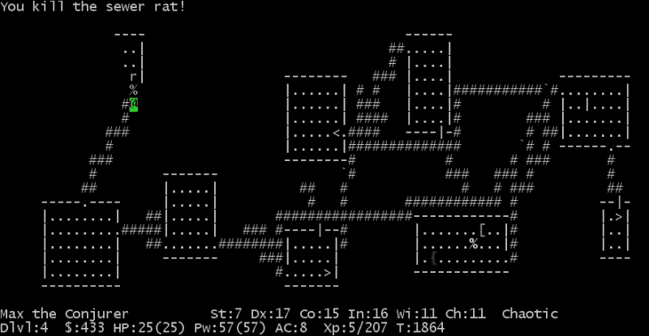

# 第三部分. 第 3 模块

> ***精通 Android 游戏开发***
> 
> *使用 Android SDK 精通游戏开发，开发高度互动和令人惊叹的游戏*

# 第一章. 设置项目

在本章中，我们将描述使用 Android SDK 进行游戏开发是有意义的场景，以及最好使用外部引擎的场景，解释每种情况的优势和劣势。

我们将创建一个简单的项目，我们将在整本书中对其进行改进，直到它成为一个完整游戏。我们将要构建的游戏是一个太空射击游戏。

将做出一些高级决策并解释，例如使用哪种方向以及我们将如何使用活动和片段。

我们将描述游戏引擎的高级架构，研究它与典型应用程序的不同之处，解释为什么存在`UpdateThread`以及它是如何与用户输入交互的，以及为什么它被从`DrawThread`中分离出来；我们将在我们的项目中包含这些元素。

一旦游戏引擎完成，我们将扩展项目以显示暂停对话框，正确处理 Android 返回键，保持与`Activity`生命周期的连贯性，并使其全屏。

最后，我们将总结一些编写游戏代码的最佳实践。

本章将涵盖以下主题：

+   适合游戏的正确工具

+   使用 Android Studio 设置项目

+   游戏架构

+   警告对话框

+   处理返回键

+   处理全屏模式

+   游戏开发者最佳实践

# 适合游戏的正确工具

在我们开始详细讨论使用 Android SDK 制作游戏之前，让我们先退一步，考虑我们为什么要这样做，以及制作在 Android 上运行的游戏的其他替代方案是什么。

人们往往经常重新发明轮子，开发者更是如此，尤其是在视频游戏领域。虽然从头开始创建一个完整的引擎是一个很好的学习经历，但它也花费了很多时间。所以，如果你只是想制作一个游戏，使用现有的引擎可能对你来说更经济高效。

我们正处于视频游戏制作工具的黄金时代。不仅有大量的工具，而且其中大多数都是免费的。这使得选择正确的工具变得更加复杂。

让我们看看几个问题，以帮助我们决定使用哪种工具来满足特定游戏的需求。由于你已经在阅读这本书，我认为多平台不是你优先考虑的事项，而且重用你现有的 Java 和 Android 知识是一个加分项。


## 你想使用 3D 吗？

如果答案是肯定的；我肯定会推荐你使用一个已经存在的引擎。你需要实现一些已知任务来构建甚至最简单的 3D 引擎，例如加载模型、加载和应用纹理、处理变换以及处理相机。除此之外，你还需要编写 OpenGL。所有这些都需要大量的工作。

编写 OpenGL 引擎是重新发明轮子的非常定义。如果你想要学习 3D 引擎的内部结构，这是很好的学习经历，但如果你选择这条路，你将花费几个月的时间才能开始游戏。如果你想直接制作游戏，你最好从一个现有的 3D 引擎开始。

在这条路上，第二个问题是：你更喜欢与代码一起工作，还是更习惯于使用完整的编辑器？对于代码，你可以使用 jPCT-AE 和 libGDX，而在编辑器方面，最常见的选择是 Unity。

## 你想使用物理吗？

对这个问题的肯定回答应该直接指向一个现有的引擎。

物理模拟是一个众所周知且有很多文档的领域，你应该能够实现自己的物理引擎。再次强调，这是一个很好的学习经历，但如果你想直接制作游戏，使用支持物理的现有引擎会方便得多。最常用的物理引擎是 Box2D，它用 C++编写，并已通过 NDK 移植到 Android。

虽然我们将在本书的后面部分讨论碰撞检测，但物理超出了本书的范围。任何比两个球体碰撞更复杂的情况都可能变得难以处理。

一次又一次，这取决于你是否更喜欢与代码一起工作，或者你是否需要一个完整的编辑器。如果你想与代码一起工作，AndEngine 应该是你的首选武器。在编辑器的方面，Corona 和 Unity 是最受欢迎的选择之一。

## 你想使用 Java 吗？

我们所提到的功能丰富的环境都有自己的环境，包括一个特定的 IDE。学习它们需要付出努力，其中一些使用不同的语言（例如 Unity 有自己的环境，并使用 JavaScript 或 C#）。

另一方面，框架更简单。你只需要包含它们，你仍然可以编写 Android 游戏。这是一个有趣的中间地带，你仍然可以重用你的 Android 和 Java 知识，并利用诸如物理或 3D 模型等功能。在本节中，我们可以提到 AndEngine 作为 2D 和物理以及 jPCT-AE 作为 3D 的好选择。

## 使用 Android SDK 构建游戏的优点

使用 Android SDK 构建游戏有几个优点：

+   构建原型更快

+   你对引擎有完全的控制权

+   它的学习曲线较小（你已经知道 Android、Java 和 Android Studio）

+   你的大部分知识可以应用于应用

+   你可以使用 Google Play 服务和其他库进行原生操作

## 使用 Android SDK 构建游戏的缺点

当然，并非一切都很完美。有一些严重的缺点，其中大部分已经提到，例如：

+   代码不可移植到其他平台（特别是 iOS）。

+   性能可能是一个问题。如果游戏达到一定的复杂度，你可能需要使用 OpenGL。

+   它缺少物理引擎；你需要自己编写。

+   OpenGL 的支持仅仅是基本原语；你需要构建一切（或使用一个库）。

## 我想要 Android SDK！

你还在这里吗？恭喜你，你选择了正确的书籍！

如果你想探索其他选项，有关于 Unity、AndEngine 和 libGDX 的书籍可供选择，由 Packt 出版。

现在我们都在同一页面上，让我们开始吧。

# 项目 – YASS（另一个太空射击游戏）

在本书中，我们将构建一个游戏作为每个章节我们将要学习概念的演示。这个游戏将是一个经典的太空射击街机游戏。我们将称之为 YASS – 另一个太空射击游戏。

这意味着对于这种特定类型的游戏，将做出一些决定，但也会讨论其他选项，因为这本书旨在介绍通用的视频游戏开发。

## 活动和片段

我们将创建一个只有一个 `Activity` 的项目，并在必要时添加片段。

在 Android 5.0 Lollipop 之前的版本中，活动之间的转换可以被修改，但只能以非常有限的方式。用户甚至可以在设置中禁用它们。总的来说，这将在从一个 `Activity` 切换到另一个 `Activity` 时使你的游戏看起来很笨拙。如果你需要保存 `Activity` 的状态，以防它被销毁。由于每个 `Activity` 都是一个独立的实例，如果你需要，你需要注意它们之间的通信。

另一方面，当你与片段一起工作时，你永远不会退出 `Activity`，并且你对过渡动画有完全的控制权。除此之外，你仍然有每个部分的代码和布局分离，因此模块化和封装没有受到影响。

最后，当涉及到处理第三方库，如 In-App Billing 或 Google Play 服务时，你必须确保初始化和配置只进行一次，因为这些是在 `Activity` 级别链接的。

### 注意

对于游戏，使用一个 `Activity` 和多个片段会更有效率。

一个好的做法是有一个基础 `Fragment` 用于我们的游戏（`YassBaseFragment`），所有其他片段都将从这个片段继承。这个片段的一个很好的用途是有一个替换 `getActivity` 的方法，它返回我们的特定 `Activity`，但还有其他情况下，有一个公共基础片段会很有用。

## 项目设置

我们将使用 Android Studio 作为 IDE。我们将创建一个 `minSDK` 为 15（冰淇淋三明治 – ICS）的项目。作为一个好的做法，我们不想移动最低 SDK，除非我们正在使用一些之前不可用的功能。通过保持 `minSDK` 低，你使你的游戏尽可能多的设备可用。

我们将从 ICS 使用两个主要功能：`Fragments`、`ValueAnimators`和`ViewPropertyAnimators`。所有这些在 Honeycomb 中都已经可用，但 3.x 被认为只是对 ICS 的一个测试；它并不成熟，并且几乎在所有设备上都被 ICS 所取代。

在不太可能的情况下，如果你想支持旧版本，如 Gingerbread，你可以使用兼容库和 NineOldAndroids 来为使用的功能添加向后兼容性。

### 创建存根项目

让我们继续并导航到**文件** > **新建项目**。我们将使用`YASS`作为**应用程序名称**，`example.com`作为**公司域名**。


我们包括对 Android TV 的支持，因为我们希望能够在大屏幕上运行我们的游戏。这将创建一个额外的模块，我们可以为其编译，但我们不会在最后一章之前接触它。

如前所述，我们将为手机使用**最小 SDK 版本**15，为 Android TV 使用 21，因为这是它们可用的时候。

对于应用程序的**包名**，我们将使用`com.example.yass`。


我们不会使用任何默认向导，因为它们都包括对应用程序来说很棒但对我们游戏无用的动作栏/工具栏。因此，我们将选择空项目选项：


同样，我们不会为电视创建任何 Activity：


一旦项目创建完成，我们将创建一个包含一个`Fragment`的单个`Activity`。这是通过菜单选项**新建** > **Activity** > **带有 Fragment 的空白 Activity**完成的。


我们将自定义`Activity`，如下填写对话框：

+   **Activity 名称**: `YassActivity`

+   **布局名称**: `activity_yass`（一旦我们更改 Activity 名称，它将成为默认值）

+   **Fragment 布局名称**: `fragment_yass`（一旦我们更改 Activity 名称，它将成为默认值）

+   **标题**: `YassActivity`

这将创建以下文件：

+   `YassActivity.java`包含`YassActivity`和`PlaceholderFragment`的代码

+   `activity_main.xml`：一个带有`@+id/container`的`FrameLayout`，它将被用来加载片段

+   `fragment_main.xml`：一个带有文本`Hello World!`的占位符布局

由于我们没有告诉 Android Studio 这个活动将成为我们的启动活动，我们需要编辑`AndroidManifest.xml`来配置它，通过添加适当的 intent 过滤器：

```java
<intent-filter>
  <action android:name="android.intent.action.MAIN" />
  <category android:name="android.intent.category.LAUNCHER" />
</intent-filter>
```

### 清理工作

我们将完全不使用菜单，因此有一些方法和文件我们将不需要，我们可以删除它们。如果你想保留所有这些方法，也可以，但保持一个干净的环境，没有未使用的代码会更好。

因此，我们可以删除`resources`下的`menu`文件夹及其中的文件，这些文件原本是`YassActivity`的菜单。

处理菜单创建和菜单项选择的方法也是无用的，因此我们可以从 `YassActivity` 中移除以下方法：

+   `onCreateOptionsMenu`：当菜单创建时被调用

+   `OnOptionsItemSelected`：当从菜单中选择一个选项时被调用

## 选择方向

决定游戏的方向是一个非常关键的问题。鉴于 Android 手机的多样性，分辨率和宽高比是我们必须处理的一些事情。

游戏传统上是在横屏方向进行的：电脑显示器是横屏模式，当你用游戏机玩游戏时，电视屏幕也是横屏模式。几乎所有便携式游戏机也都是设计成横屏方向的。更重要的是，大多数平板电脑也将横屏视为默认方向。

### 注意

横屏是游戏的传统方向。

YASS 将是一款横屏游戏。我们这样做的主要原因是将来能够将游戏移植到 Android 控制台，包括 Android TV 和 OUYA。这并不意味着竖屏模式不是游戏的有效方向，但对于玩家来说，它是一个不太熟悉的方向。

我们将使用 `sensorLandscape` 而不是仅仅 `landscape`，这样设备就可以旋转 180 度以适应任何朝下的侧面。我们必须更新 `AndroidManifest.xml` 以使其看起来像这样：

```java
<application
  android:icon="@mipmap/ic_launcher"
  android:label="@string/app_name"
  android:theme="@style/AppTheme" >
  <activity
    android:screenOrientation="sensorLandscape"
    android:name=".YassActivity"
    android:label="@string/title_activity_yass" >
    <intent-filter>
      <action android:name="android.intent.action.MAIN" />
      <category android:name="android.intent.category.LAUNCHER" />
    </intent-filter>
  </activity>
</application>
```

如你所知，当 Android 中的 `Activity` 改变方向时，它会被销毁并重新创建，以及其中所有的片段。这意味着，除非你明确保存和恢复信息，否则片段将不会记住之前的状态。

### 注意

`sensorLandscape` 和 `sensorPortrait` 模式在旋转时不会销毁活动。

一些好消息：在使用 `sensorLandscape` 时，旋转不会杀死 Activity，因此不需要额外的工作。这是因为布局完全相同，不需要重新创建任何内容。

如果你计划制作一个可以旋转的游戏，你必须特别注意在方向改变时保存和恢复游戏状态。这本身就是将游戏锁定在特定方向（无论是横屏还是竖屏）的另一个很好的理由。

### 处理宽高比

Android 设备拥有许多不同的宽高比，至少从 4:3 到 16:9。这还不包括像素的数量。

在为多个宽高比设计游戏时，基本上有两种方法。对于每一种方法，我们都为最极端的宽高比进行设计。我们将使用额外的空间来制作“智能信箱”，这意味着我们可以有更多的游戏视图。


设计不同宽高比的不同方法

最常见的选项是将相机置于中心并固定最小尺寸（横屏方向的高度）。这允许在两侧有更多的视图空间，同时确保最小的屏幕将有足够的显示空间。这在 16:9 屏幕上查看 4:3 图像是等效的。

如果游戏设计合理，你也可以固定更大的尺寸。如果屏幕是正方形，这将增加顶部和底部的额外空间。这相当于在 4:3 屏幕上查看 16:9 的图像。

另一种方法是简单地拥有“更多的相机空间”。我们还可以使游戏视图达到一定大小，并使用额外的空间来放置其他控件，如得分、等级等。

如果你将这种方法推向极致，你可以设计一个完全平方的游戏区域，并将额外信息放在“智能信封”中，适用于横屏和竖屏。一个很好的例子是 Candy Crush Saga。这是最灵活的方法，但也是需要最多工作量的方法。

对于我们的游戏，我们将采用“更接近相机空间”的方法，使用固定大小的信封来显示得分和生命值。

对于分辨率和像素密度的差异，我们将为低密度屏幕进行设计。我们将以编程方式读取设备的分辨率并应用一个转换因子。关于这种方法的一些深入细节可以在专门介绍低级绘图、菜单和对话框的章节中找到。

# 游戏架构

游戏的架构和控制流程与应用程序不同。两者似乎都能即时响应用户输入，但应用程序是通过设置监听器并使用方法调用（最常见的是`onClick`方法调用`OnClickListener`）来做到这一点的，而对于实时游戏来说，这种方法是不适用的（尽管对于非实时游戏是适用的）。

一旦游戏开始运行，它必须尽可能快地评估和更新一切。这也是为什么它不能被用户事件中断的原因。这些事件或状态应该被记录下来，然后在游戏对象的更新过程中读取。

游戏引擎应该创建在运行游戏的片段中，因为我们只需要在玩游戏时运行游戏引擎。这有一个优点，那就是我们可以利用我们现有的 Android 知识来创建和处理游戏的其他屏幕。


游戏引擎的简化架构

基本的游戏引擎架构由一个**更新线程**、一个**绘图线程**和一系列属于**游戏引擎**的**游戏对象**组成。

**游戏引擎**是程序其他部分与游戏交互的组件。它的任务也是封装更新和绘图线程的存在，以及处理游戏对象。

一个游戏由既更新又绘制的**游戏对象**组成。这些对象被保存在**游戏引擎**内部。

**更新线程**负责尽可能快地更新游戏对象的状态。它将遍历所有游戏对象，调用更新方法。

UI 也必须不断更新，并且独立于更新线程。它将通过在它们上调用绘图方法来绘制所有游戏对象。

让我们详细分析每个组件。

## GameEngine 和 GameObjects

`GameEngine` 包含了前面提到的三个元素。

`GameObject` 是一个抽象类，我们游戏中的所有游戏对象都必须从这个类扩展。这个接口将它们与 `Update` 和 `Draw` 线程连接起来。

```java
public abstract class GameObject {
  public abstract void startGame();
  public abstract void onUpdate(long elapsedMillis, GameEngine gameEngine);
  public abstract void onDraw();
  public final Runnable mOnAddedRunnable = new Runnable() {
    @Override
    public void run() {
      onAddedToGameUiThread();
    }
  };

  public final Runnable mOnRemovedRunnable = new Runnable() {
    @Override
    public void run() {
      onRemovedFromGameUiThread();
    }
  };

  public void onRemovedFromGameUiThread(){
  }

  public void onAddedToGameUiThread(){
  }
}
```

+   `startGame` 用于在游戏开始之前初始化对象。

+   `onUpdate` 被游戏引擎尽可能快地调用，提供自上次调用以来经过的毫秒数以及 `GameEngine` 本身的引用，供将来使用，例如访问用户输入。

+   `onDraw` 使组件能够渲染自身。我们目前还没有使用任何参数，但稍后我们将传递一个 `Canvas` 来绘制。

+   `onRemovedFromGameUiThread` 包含了当对象从游戏中移除时必须在 `UIThread` 上运行的代码。

+   `onAddedToGameUiThread` 包含了当对象被添加到游戏时必须在 `UIThread` 上运行的代码。

+   两个 `Runnable` 对象用于在 `UIThread` 内部调用 `onRemovedFromGameUiThread` 和 `onAddedToGameUiThread`。

`GameEngine` 将为我们提供启动、停止、暂停和恢复游戏的方法，这样我们就不必担心外部的线程或游戏对象。

游戏引擎由三个项目组成：游戏对象列表、`UpdateThread` 和 `DrawThread`。

```java
private List<GameObject> mGameObjects = new ArrayList<GameObject>();

private UpdateThread mUpdateThread;
private DrawThread mDrawThread;
```

让我们看看引擎处理游戏的不同方法。

### 开始游戏

从 `GameEngine` 开始游戏的代码如下：

```java
public void startGame() {
  // Stop a game if it is running
  stopGame();

  // Setup the game objects
  int numGameObjects = mGameObjects.size();
  for (int i=0; i<numGameObjects; i++) {
    mGameObjects.get(i).startGame();
  }

  // Start the update thread
  mUpdateThread = new UpdateThread(this);
  mUpdateThread.start();

  // Start the drawing thread
  mDrawThread = new DrawThread(this);
  mDrawThread.start();
}
```

首先，我们必须确保没有游戏正在运行，因此我们在开始时调用 `stopGame` 来停止正在进行的游戏。

其次，我们重置与引擎链接的所有游戏对象。在启动线程之前做这件事很重要，这样一切都可以从初始位置开始。

最后，我们创建并启动 `UpdateThread` 和 `DrawThread`。

### 停止游戏

停止游戏甚至更简单。我们只需停止存在的 `Update` 和 `Draw` 线程：

```java
public void stopGame() {
  if (mUpdateThread != null) {
    mUpdateThread.stopGame();
  }
  if (mDrawThread != null) {
    mDrawThread.stopGame();
  }
}
```

我们还有 `pauseGame` 和 `resumeGame` 方法，它们的功能与此类似。我们在这里不包括这些方法的代码，因为它们是冗余的。

### 管理游戏对象

引擎必须管理游戏对象的添加和删除。我们不能直接处理列表，因为它将在 `onUpdate` 和 `onDraw` 期间被大量使用。

```java
public void addGameObject(final GameObject gameObject) {
  if (isRunning()){
    mObjectsToAdd.add(gameObject);
  }
  else {
    mGameObjects.add(gameObject);
  }
  mActivity.runOnUiThread(gameObject.mOnAddedRunnable);
}

public void removeGameObject(final GameObject gameObject) {
  mObjectsToRemove.add(gameObject);
  mActivity.runOnUiThread(gameObject.mOnRemovedRunnable);
}
```

我们使用列表 `mObjectsToAdd` 和 `mObjectsToRemove` 来跟踪必须添加或删除的对象。我们将这两者都作为 `onUpdate` 方法的最后一步执行，除非游戏引擎正在运行，在这种情况下，可以直接添加和删除它们。

我们还在 `UIThread` 上从 `GameObject` 运行相应的 `Runnable` 对象。

要从引擎更新游戏对象，我们只需在它们所有上调用`onUpdate`。一旦更新循环完成，我们就处理必须从`mGameObjects`中移除或添加的对象。这部分是通过使用`synchronized`代码块来完成的，这对于`onDraw`方法也很重要。

```java
public void onUpdate(long elapsedMillis) {
  int numGameObjects = mGameObjects.size();
  for (int i=0; i<numGameObjects; i++) {
    mGameObjects.get(i).onUpdate(elapsedMillis, this);
  }
  synchronized (mGameObjects) {
    while (!mObjectsToRemove.isEmpty()) {
      mGameObjects.remove(mObjectsToRemove.remove(0));
    }
    while (!mObjectsToAdd.isEmpty()) {
       mGameObjects.add(mObjectsToAdd.remove(0));
    }
  }
}
```

对于绘图，我们做的是同样的事情，只不过绘图必须在`UIThread`上完成。因此，我们创建一个`Runnable`对象，并将其传递给活动的`runOnUIThread`方法。

```java
private Runnable mDrawRunnable = new Runnable() {
  @Override
  public void run() {
    synchronized (mGameObjects) {
      int numGameObjects = mGameObjects.size();
      for (int i = 0; i < numGameObjects; i++) {
        mGameObjects.get(i).onDraw();
      }
    }
  }
};

public void onDraw(Canvas canvas) {
  mActivity.runOnUiThread(mDrawRunnable);
}
```

注意，我们使用`mGameObjects`来同步运行方法。我们这样做是为了确保在迭代列表时列表不会被修改。

同样重要的是，只有`onUpdate`的最后一部分需要同步。如果没有对象被添加或移除，线程是独立的。如果我们同步整个`onUpdate`方法，我们将失去将`Update`和`Draw`线程分开的所有优势。

## UpdateThread

`UpdateThread`是一个持续在游戏引擎上运行更新的线程。对于每次对`onUpdate`的调用，它提供自上次执行以来的毫秒数。

更新线程的基本`run`方法如下：

```java
@Override
public void run() {
  long previousTimeMillis;
  long currentTimeMillis;
  long elapsedMillis;
  previousTimeMillis = System.currentTimeMillis();

  while (mGameIsRunning) {
    currentTimeMillis = System.currentTimeMillis();
    elapsedMillis = currentTimeMillis - previousTimeMillis;           
    mGameEngine.onUpdate(elapsedMillis);
    previousTimeMillis = currentTimeMillis;
  }
}
```

线程会持续循环，直到游戏运行结束。在每次迭代中，它将获取当前时间，计算自上次运行以来的已过毫秒数，并在`GameEngine`对象上调用`onUpdate`。

虽然这个第一个版本可行且非常简单易懂，但它只能启动和停止游戏。我们希望能够暂停和恢复它。

要暂停和恢复游戏，我们需要一个变量，我们在循环内部读取它以检查何时暂停执行。我们需要记录已过毫秒数并扣除暂停所花费的时间。一个简单的方法如下：

```java
while (mGameIsRunning) {
  currentTimeMillis = System.currentTimeMillis();
  elapsedMillis = currentTimeMillis - previousTimeMillis;
  if (mPauseGame) {
    while (mPauseGame) {
      try {
        Thread.sleep(20);
      } catch (InterruptedException e) {
        // We stay on the loop
      }
    }
    currentTimeMillis = System.currentTimeMillis();
  }
  mGameEngine.onUpdate(elapsedMillis);
  previousTimeMillis = currentTimeMillis;
}
```

`pauseGame`和`resumeGame`方法的代码只是将变量`mPauseGame`设置为 true 或 false。

如果游戏处于暂停状态，我们将进入一个 while 循环，直到游戏恢复才会退出。为了避免有一个持续运行的空循环，我们可以让线程短暂休眠（20 毫秒）。注意，`Thread.sleep`可能会触发`InterruptedException`。如果发生这种情况，我们只需继续，因为它将在 20 毫秒后再次运行。此外，我们马上就要改进它了。

这种方法可行，但仍然有大量的空闲处理在进行。对于线程来说，有更高效的暂停和恢复机制。我们将使用`wait`/`notify`来改进这一点。

代码可以更新为如下所示：

```java
while (mGameIsRunning) {
  currentTimeMillis = System.currentTimeMillis();
  elapsedMillis = currentTimeMillis - previousTimeMillis;
  if (mPauseGame) {
    while (mPauseGame) {
      try {
        synchronized (mLock) {
          mLock.wait();
        }
      } catch (InterruptedException e) {
        // We stay on the loop
      }
    }
    currentTimeMillis = System.currentTimeMillis();
  }
  mGameEngine.onUpdate(elapsedMillis);
  previousTimeMillis = currentTimeMillis;
}
```

`pauseGame`方法与之前相同，但我们需要更新`resumeGame`，使其位于通知和释放锁的位置：

```java
public void resumeGame() {
  if (mPauseGame == true) {
    mPauseGame = false;
    synchronized (mLock) {
      mLock.notify();
    }
  }
}
```

使用`wait`/`notify`，我们确保线程在空闲时不会做任何工作，并且我们知道一旦我们通知它，它就会被唤醒。重要的是首先将`mPauseGame`设置为`false`，然后唤醒线程，否则主循环可能会再次停止。

最后，要开始和停止游戏，我们只需要改变变量的值：

```java
public void start() {
  mGameIsRunning = true;
  mPauseGame = false;
  super.start();
}

public void stopGame() {
  mGameIsRunning = false;
  resumeGame();
}
```

游戏永远不会以暂停状态开始。要停止游戏，我们只需将`mGameIsRunning`值设置为`false`，`run`方法中的循环就会结束。

在`stopGame`方法中调用`resumeGame`是很重要的。如果我们暂停游戏时调用停止，线程将等待，除非我们恢复游戏，否则不会发生任何事情。如果游戏没有暂停，`resumeGame`内部没有执行任何操作，所以调用它没有关系。

## DrawThread

实现 DrawThread 的方法有几种。它可以以类似更新线程的方式完成，但我们将使用一种不使用`Thread`的更简单的方法。

我们将使用`Timer`和`TimerTask`类以足够高的频率将`onDraw`回调发送到游戏引擎，以实现每秒 30 帧的渲染：

```java
private static int EXPECTED_FPS = 30;
private static final long TIME_BETWEEN_DRAWS = 1000 / EXPECTED_FPS;

public void start() {
  stopGame();
  mTimer = new Timer();
  mTimer.schedule(new TimerTask() {
    @Override
    public void run() {
      mGameEngine.onDraw();
    }
  }, 0, TIME_BETWEEN_DRAWS);
}
```

我们每 33 毫秒调用这个方法。在简单实现中，这个方法将只调用`GameView`中的`invalidate`，这将导致调用`View`的`onDraw`方法。

此实现依赖于 Android UI 的一个特性。为了重新显示视图，Android 内置了一个应急系统，以避免重复的无效化。如果在视图正在绘制时请求无效化，它将被排队。如果有多个无效化请求排队，它们将被丢弃，因为它们不会产生任何效果。

这样，如果视图绘制时间超过`TIME_BETWEEN_DRAWS`，系统将自动回退到每秒更少的帧数。

在本书的后面部分，我们将重新访问这个线程以进行更复杂的实现，但现在让我们保持简单。

停止、暂停和恢复`DrawThread`也很简单：

```java
public void stopGame() {
  if (mTimer != null) {
    mTimer.cancel();
    mTimer.purge();
  }
}

public void pauseGame() {
  stopGame();
}

public void resumeGame() {
  start();
}
```

要停止游戏，我们只需要`cancel`和`purge`计时器。`cancel`方法将取消计时器和所有计划中的任务，而`purge`将从队列中删除所有已取消的任务。

由于我们不需要跟踪任何状态，我们只需将`pauseGame`和`resumeGame`与`stopGame`和启动等效。

注意，如果我们想在 30fps 下有一个平滑的游戏，屏幕上所有项目的绘制必须在不到 33 毫秒内完成。这意味着这些方法的代码通常需要优化。

## 用户输入

正如我们提到的，用户输入将由某个输入控制器处理，然后由需要它们的对象在需要时读取。我们将在下一章详细介绍此类输入控制器。现在，我们只想检查游戏引擎是否按预期工作，并且正确处理启动、停止、暂停和恢复调用。

暂停、恢复和启动与其他用户输入不同，因为它们影响引擎和线程本身的状态，而不是修改游戏对象的状态。因此，我们将使用标准的事件驱动编程来触发这些函数。

# 将一切整合起来

让我们拿起我们的原型项目，添加所有必要的类以拥有一个可工作的游戏引擎，然后修改代码以便我们可以启动、停止、暂停和继续游戏引擎，并显示自游戏开始以来的毫秒数。

我们将把当前的`GameEngine`、`UpdateThread`、`DrawThread`和`GameObject`实现放入`com.example.yass.engine`包中。

接下来，我们将创建另一个名为`com.example.yass.counter`的包，我们将使用该包中的代码来编写此示例。

在`YassActivity`内部，我们有一个名为`PlaceholderFragment`的内部类。我们将将其重命名为`GameFragment`，将其重构为单独的文件，并将其放入`com.example.yass.counter`包下。

我们将添加一个`TextView`来显示毫秒数，以及两个按钮：一个用于启动和停止游戏引擎，另一个用于暂停和继续它。

我们将把它们添加到`fragment_yass_main.xml`布局中，它将看起来像这样：

```java
<LinearLayout 

  android:layout_width="match_parent"
  android:layout_height="match_parent"
  android:orientation="vertical"
  android:padding="@dimen/activity_horizontal_margin"
  android:paddingLeft="@dimen/activity_horizontal_margin"
  tools:context="com.example.yass.counter.PlaceholderFragment">

  <TextView
    android:id="@+id/txt_score"
   android:layout_width="wrap_content"
    android:layout_height="wrap_content"
    android:text="@string/hello_world" />

  <Button
    android:id="@+id/btn_start_stop"
    android:layout_width="wrap_content"
    android:layout_height="wrap_content"
    android:text="@string/start" />

  <Button
    android:id="@+id/btn_play_pause"
    android:layout_width="wrap_content"
    android:layout_height="wrap_content"
    android:text="@string/pause" />
</LinearLayout>
```

对于游戏片段，我们需要在`onViewCreated`内部添加以下代码：

```java
@Override
public void onViewCreated(View view, Bundle savedInstanceState) {
  super.onViewCreated(view, savedInstanceState);
  mGameEngine = new GameEngine(getActivity());
  mGameEngine.addGameObject(
    new ScoreGameObject(view, R.id.txt_score));
  view.findViewById(R.id.btn_start_stop)
    .setOnClickListener(this);
  view.findViewById(R.id.btn_play_pause)
    .setOnClickListener(this);
}
```

一旦创建了视图，我们就创建游戏引擎并添加一个新的`ScoreGameObject`到其中。然后我们将当前片段设置为两个已添加按钮的监听器。

`onClick`的代码非常简单；只需为每个按钮决定调用哪个方法：

```java
@Override
public void onClick(View v) {
  if (v.getId() == R.id.btn_play_pause) {
    playOrPause();
  }
  if (v.getId() == R.id.btn_start_stop) {
    startOrStop();
  }
}
```

决定游戏是否应该暂停或继续就像这样简单：

```java
private void playOrPause() {
  Button button = (Button)
  getView().findViewById(R.id.btn_play_pause);
  if (mGameEngine.isPaused()) {
    mGameEngine.resumeGame();
    button.setText(R.string.pause);
  }
  else {
    mGameEngine.pauseGame();
    button.setText(R.string.resume);
  }
}
```

我们还处理了按钮的名称更改，以确保 UI 的一致性。在代码中，我们使用了`GameEngine`中的`isPaused`方法。只要该对象不为空，该方法就只返回`UpdateThread`对象的状态：

```java
public boolean isPaused() {
  return mUpdateThread != null && mUpdateThread.isGamePaused();
}
```

同样，为了播放/暂停游戏并保持按钮的状态，我们将添加此方法：

```java
private void startOrStop() {
  Button button = (Button)
    getView().findViewById(R.id.btn_start_stop);
  Button playPauseButton = (Button)
    getView().findViewById(R.id.btn_play_pause);
  if (mGameEngine.isRunning()) {
    mGameEngine.stopGame();
    button.setText(R.string.start);
    playPauseButton.setEnabled(false);
  }
  else {
    mGameEngine.startGame();
    button.setText(R.string.stop);
    playPauseButton.setEnabled(true);
    playPauseButton.setText(R.string.pause);
  }
}
```

再次强调，我们需要在`GameEngine`中有一个方法来知道它是否正在运行。就像我们之前做的那样，我们只是镜像`UpdateThread`的状态：

```java
public boolean isRunning() {
  return mUpdateThread != null && mUpdateThread.isGameRunning();
}
```

一旦完成基本连接，我们就可以进入真正有趣的部分：我们正在创建的游戏对象。这个对象展示了我们一直在讨论的`GameObject`类中每个方法的用法：

```java
public class ScoreGameObject extends GameObject {

  private final TextView mText;
  private long mTotalMilis;

  public ScoreGameObject(View view, int viewResId) {
    mText = (TextView) view.findViewById(viewResId);
  }

  @Override
  public void onUpdate(long elapsedMillis, GameEngine gameEngine)
  {
    mTotalMilis += elapsedMillis;
  }

  @Override
  public void startGame() {
    mTotalMilis = 0;
  }

  @Override
  public void onDraw() {
    mText.setText(String.valueOf(mTotalMilis));
  }
}
```

`onUpdate`方法只是不断地将毫秒数添加到总数中。当新游戏开始时，总数会被重置，而`onDraw`则设置文本视图中总毫秒数的值。

如预期的那样，`onUpdate`被调用的次数比`onDraw`多得多。另一方面，`onDraw`是在`UIThread`上执行的，这是我们无法承担`onUpdate`所做的事情。

现在我们可以编译并运行示例，检查计时器是否在启动和停止游戏引擎时开始和停止。我们还可以检查暂停和继续是否按预期工作。

# 继续示例

现在我们将稍微改变一下示例。我们将创建一个暂停对话框，我们可以从中继续或停止游戏。如果用户点击暂停按钮，或者按返回键，将显示此对话框。

最后，我们将添加一个片段，玩家可以从该片段开始游戏，并将游戏片段与菜单分开。

因此，我们将创建 `MainMenuFragment.java` 和 `fragment_main_menu.xml`。布局的内容将非常简单：

```java
<?xml version="1.0" encoding="utf-8"?>
<FrameLayout 
  android:layout_width="match_parent" 
  android:layout_height="match_parent">

  <TextView
    android:layout_gravity="center_horizontal|top"
    style="@android:style/TextAppearance.DeviceDefault.Large"
    android:layout_marginTop="@dimen/activity_vertical_margin"
    android:text="@string/game_title"
    android:layout_width="wrap_content"
    android:layout_height="wrap_content" />

  <Button
    android:id="@+id/btn_start"
    android:layout_width="wrap_content"
    android:layout_height="wrap_content"
    android:layout_gravity="center"
    android:text="@string/start" />

</FrameLayout>
```

这包括屏幕上的应用标题和开始播放的按钮：


在这个片段内部，我们添加了一个监听器到启动按钮，并使其调用 `startGame` 方法。`startGame` 方法的代码同样很简单：

```java
public void startGame() {
  getFragmentManager()
    .beginTransaction()
    .replace(R.id.container, new GameFragment(), TAG_FRAGMENT)
    .addToBackStack(null)
    .commit();
}
```

我们正在使用片段管理器从当前片段过渡到 `GameFragment`。

`beginTransition` 方法创建过渡本身，并且我们可以通过链式方法来配置它。

我们正在用 `R.id.container` id 替换视图内的片段。这将移除旧片段。如果我们使用 `add`，则两个片段都会显示。

然后，我们添加一个没有标签的片段到返回栈，因为我们不需要任何标签。这非常重要，因为它允许系统正确处理返回键。当按下返回键时，片段管理器的返回栈上的所有内容都将弹出。

如果我们不将片段添加到返回栈，当我们在返回键上点击时，默认行为将是关闭应用。当片段在返回栈上时，我们可以依赖系统正确处理片段导航。

最后，我们提交过渡，这样片段就会被替换。

在我们已有的游戏片段内部，我们将移除启动/停止对话框，并修改暂停按钮以显示一个对话框，从该对话框我们可以恢复或退出当前游戏。

我们希望游戏立即开始，因此 `GameFragment` 的 `onViewCreated` 方法现在看起来像这样：

```java
@Override
public void onViewCreated(View view, Bundle savedInstanceState) {
  super.onViewCreated(view, savedInstanceState);
  mGameEngine = new GameEngine(getActivity());
  mGameEngine.addGameObject(
    new ScoreGameObject(view, R.id.txt_score));
  view.findViewById(R.id.btn_play_pause)
    .setOnClickListener(this);
  mGameEngine.startGame();
}
```

我们还将修改 `onClick` 方法，移除启动或停止的旧代码，使其看起来像这样：

```java
@Override
public void onClick(View v) {
  if (v.getId() == R.id.btn_play_pause) {
    pauseGameAndShowPauseDialog();
  }
}
```

这个更简单的版本只关心暂停游戏，并在点击暂停按钮时显示对话框。

目前，我们将使用 `AlertDialog` 框架创建一个默认对话框：

```java
private void pauseGameAndShowPauseDialog() {
  mGameEngine.pauseGame();
  new AlertDialog.Builder(getActivity())
  .setTitle(R.string.pause_dialog_title)
  .setMessage(R.string.pause_dialog_message)
  .setPositiveButton(R.string.resume, 
  new DialogInterface.OnClickListener() {
    @Override
    public void onClick(DialogInterface dialog, int which) {
      dialog.dismiss();
      mGameEngine.resumeGame();
    }
  })
  .setNegativeButton(R.string.stop, 
    new DialogInterface.OnClickListener() {
    @Override
    public void onClick(DialogInterface dialog, int which) {
      dialog.dismiss();
      mGameEngine.stopGame();
      ((MainActivity)getActivity()).navigateBack();
    }
  })
  .create()
  .show();
}
```

正面按钮将恢复游戏，因此它调用游戏引擎中的 `resumeGame`。

负面按钮将退出游戏，因此它调用 `GameEngine` 中的 `stopGame`，然后调用父 `Activity` 中的 `navigateBack`。

`navigateBack` 方法不过是处理活动中的返回键按下：

```java
public void navigateBack() {
  super.onBackPressed();
}
```

由于我们将片段放入导航栈，`MainMenuFragment` 将再次加载，而 `GameFragment` 将被销毁。以下是如何显示 `Pause` 对话框：


## 处理返回键

我们想要做的事情之一是正确处理返回键。这是当它不按预期在游戏中工作时让 Android 用户感到沮丧的事情，因此我们将特别关注这一点。目前有两个地方它没有按预期工作。

### 注意

在 Android 上正确处理返回键非常重要。

+   如果我们使用返回键取消**暂停**对话框，游戏将不会恢复。

+   在游戏片段中，返回键应该暂停游戏。目前，返回键会返回到`GameFragment`。

对于第一个问题，我们需要在对话框中添加一个`OnCancelListener`。这与每次对话框被关闭时都会被调用的`OnDismissListener`不同。`cancel`方法仅在对话框被取消时调用。

此外，`OnDismissListener`是在 API 级别 17 中引入的。由于我们不需要它，所以我们不会担心提高游戏的`minSDK`。

我们使用以下代码更新**暂停**对话框的创建：

```java
new AlertDialog.Builder(getActivity())
  [...]
  .setOnCancelListener(new DialogInterface.OnCancelListener() {
    @Override
    public void onCancel(DialogInterface dialog) {
      mGameEngine.resumeGame();
    }
  })
  .create()
  show();
```

剩下的工作是当游戏过程中按下返回键时暂停游戏。这是需要在片段中处理的事情。实际上，`onBackPressed`是仅对活动可用的方法。我们需要编写代码来扩展它到当前的片段。

我们将利用我们的`YassBaseFragment`，这是我们游戏中所有片段的基类，以添加对`onBackPressed`的支持。我们在这里创建一个`onBackPressed`方法：

```java
public class YassBaseFragment extends Fragment {
  public boolean onBackPressed() {
    return false;
  }
}
```

在`Activity`中，我们更新`onBackClicked`以允许片段在需要时覆盖它：

```java
@Override
public void onBackPressed() {
  final YassFragment fragment = (YassFragment)
    getFragmentManager().findFragmentByTag(TAG_FRAGMENT);
  if (!fragment.onBackPressed()) { 
    super.onBackPressed();
  }
}
```

如果片段没有处理返回键的按下，它将返回`false`。然后，我们只需调用超类方法以允许默认行为。

`TAG_FRAGMENT`非常重要；它允许我们获取我们添加的片段，并且在我们将片段添加到`FragmentTransition`时设置。让我们回顾一下由向导创建的`MainActivity`的`onCreate`方法，并将`TAG_FRAGMENT`添加到初始的`FragmentTransition`：

```java
@Override
protected void onCreate(Bundle savedInstanceState) {
  super.onCreate(savedInstanceState);
  setContentView(R.layout.activity_yass);
  if (savedInstanceState == null) {
    getFragmentManager().beginTransaction()
      .add(R.id.container, new MainMenuFragment(), TAG_FRAGMENT)
      .commit();
  }
}
```

同样重要的是，应用程序的所有片段都必须扩展自`YassBaseFragment`，否则此方法将抛出`ClassCastException`。

在所有部件就绪后，我们现在在`GameFragment`内部覆盖`onBackPressed`方法以显示**暂停**对话框：

```java
@Override
public boolean onBackPressed() {
  if (mGameEngine.isRunning()) {
    pauseGameAndShowPauseDialog();
    return true;
  }
  return false;
}
```

使用这种方式，当我们在`GameFragment`中点击返回时，会显示**暂停**对话框。请注意，我们只有在`GameEngine`正在运行时才会显示暂停对话框。当它没有运行时，我们将返回`false`。Android 的默认行为将被触发，并且必须显示的**暂停**对话框将被取消。

## 尊重生命周期

我们的游戏也应该与活动生命周期保持一致；特别是，当活动暂停时，它应该暂停。这主要有两个原因：

+   如果游戏被置于后台，当它返回时，用户希望它被暂停

+   只要游戏在运行，更新线程将尽可能快地更新，因此会使手机感觉更慢

根据当前实现，这些都不会发生。你可以尝试按一下主页按钮，你会看到设备没有响应。此外，如果你再次使用最近活动按钮将游戏置于前台，你会看到计时器仍在计数。

### 注意

不尊重片段生命周期会导致性能问题和玩家不满。

解决这个问题非常简单，我们只需要保持片段生命周期的连贯性，通过在`GameFragment`中添加以下代码：

```java
@Override
public void onPause() {
  super.onPause();
  if (mGameEngine.isRunning()){
    pauseGameAndShowPauseDialog();
  }
}

@Override
public void onDestroy() {
  super.onDestroy();
  mGameEngine.stopGame();
}
```

通过这种方式，每当片段暂停时，我们暂停游戏并显示对话框，以便玩家可以再次继续。另外，每当片段被销毁时，我们停止游戏引擎。

在暂停之前检查游戏引擎是否正在运行非常重要，因为`onPause`在退出游戏时也会被调用。所以，如果我们忘记这样做，通过暂停对话框退出将导致应用崩溃。

## 尽可能使用屏幕空间

我们正在开发一个游戏。我们希望拥有设备的所有屏幕空间，没有干扰。有两个项目从我们这里拿走了这些：

+   **状态栏**：屏幕顶部的栏，显示时间、电池、WiFi、移动信号和通知。

+   **导航栏**：这是放置“返回”、“主页”和“最近”按钮的栏。它可能根据设备的方向位于不同的位置。


状态栏和导航栏在屏幕上占据相当大的空间

**导航栏**是在冰淇淋三明治上引入的，作为物理按钮的替代品。但即使今天，一些制造商仍然决定使用物理按钮，所以它可能存在也可能不存在。

我们首先可以告诉系统我们想要全屏。有一个名为`SYSTEM_UI_FLAG_FULLSCREEN`的标志，这似乎是我们正在寻找的。

问题在于，这个标志是在 Android 早期版本中引入的，当时没有**导航栏**。当时，它确实意味着全屏，但从冰淇淋三明治开始，它仅仅意味着“移除**状态栏**”。

### 注意

`SYSTEM_UI_FLAG_FULLSCREEN`模式并不是真正的全屏。


全屏仅使状态栏消失。

除了**导航栏**外，还添加了一些处理全屏的方法。这种方法在 KitKat 中得到了回顾。所以，让我们看看我们的选项。

### 在 Android 4.4 之前 – 几乎全屏

在 Android 4.0 中，除了**导航栏**外，还添加了两个新标志来处理**导航栏**，这些标志是现有全屏标志的补充：

+   `SYSTEM_UI_FLAG_HIDE_NAVIGATION`：这告诉系统隐藏**导航栏**

+   `SYSTEM_UI_FLAG_LOW_PROFILE`：这会将设备置于“低配置”模式，将**导航栏**上的图标变暗，并用点替换它们

虽然确实“隐藏导航”标志可以完全隐藏导航栏，但由于这种模式旨在用于非交互式活动，如视频播放，因此一旦你触摸屏幕上的任何地方，导航栏就会重新出现。因此，`SYSTEM_UI_FLAG_HIDE_NAVIGATION`对我们来说并没有太大用处。

使用低轮廓来降低导航栏亮度是一个更合理的解决方案。尽管我们没有获得额外的屏幕空间，但将导航栏上的图标缩小为小点，使得玩家可以更多地专注于内容。这些图标在必要时（基本上，当用户点击导航栏时）会显示出来，并在不需要时立即变暗。

### 注意

隐藏导航栏仅适用于非交互式应用。一旦你触摸屏幕，导航栏就会再次出现。

总的来说，我们只能对仅降低导航栏亮度并去除状态栏感到满意。


低轮廓模式会降低导航栏的亮度，使其不那么显眼。

这是我们需要添加到`MainActivity`中以去除状态栏并将设备置于低轮廓模式的代码：

```java
@Override
public void onWindowFocusChanged(boolean hasFocus) {
  super.onWindowFocusChanged(hasFocus);
  if (hasFocus) {
    View decorView = getWindow().getDecorView();
    decorView.setSystemUiVisibility(View.SYSTEM_UI_FLAG_LAYOUT_STABLE
      | View.SYSTEM_UI_FLAG_LAYOUT_FULLSCREEN
      | View.SYSTEM_UI_FLAG_FULLSCREEN
      | View.SYSTEM_UI_FLAG_LOW_PROFILE);
  }
}
```

我们在主`Activity`中重写了`onWindowFocusChanged`方法。这是处理标志的推荐位置，因为每当窗口焦点改变时都会调用它。当应用恢复焦点时，我们不知道状态栏处于何种状态。因此，确保一切如我们所愿是一个好的做法。

还有两个我们尚未提到的标志。它们是在 API 级别 16 中引入的，旨在处理布局对元素出现和消失的反应。

`SYSTEM_UI_FLAG_LAYOUT_STABLE` 标志意味着布局将是连贯的，独立于显示或隐藏的元素。

`SYSTEM_UI_FLAG_LAYOUT_FULLSCREEN` 标志告诉系统我们的稳定布局将是全屏模式下的布局——没有导航栏。

这意味着如果/当状态栏显示时，布局不会改变，这是好的，否则它看起来就像是一个错误。这也意味着我们需要注意边距，确保没有重要内容被状态栏覆盖。

### 注意

稳定布局仅从 Jelly Bean 版本开始存在（API 级别 16+）。

对于 Ice Cream Sandwich，`SYSTEM_UI_FLAG_LAYOUT_STABLE` 不起作用。但拥有这个版本的设备非常少，状态栏也很少显示，所以这是可以接受的。

真正的全屏模式是在 KitKat 中引入的。

### Android 4.4 及更高版本 – 沉浸模式

在 KiKat 中，引入了一种新的模式：**沉浸模式**。

沉浸模式会完全隐藏状态栏和导航栏。正如其名所示，它旨在提供完全沉浸式的体验，这意味着主要是游戏。即使导航栏再次出现，它也是半透明的，而不是黑色，并叠加在游戏之上。

### 注意

粘性沉浸模式几乎是为游戏专门设计的。

沉浸模式可以使用两种方式：**正常**和**粘性**。它们都是全屏模式，并且当应用第一次进入此模式时，用户会看到一个提示，解释如何退出此模式：


沉浸式非粘性模式会在状态栏和导航栏显示后保持可见，而沉浸式粘性模式会在几秒钟后隐藏它们，返回真实的全屏模式。对于游戏来说，推荐使用粘性沉浸模式。

将应用置于全屏粘性沉浸模式的代码如下：

```java
@Override
public void onWindowFocusChanged(boolean hasFocus) {
  super.onWindowFocusChanged(hasFocus);
  if (hasFocus) {
    View decorView = getWindow().getDecorView();
    decorView.setSystemUiVisibility(View.SYSTEM_UI_FLAG_LAYOUT_STABLE
      | View.SYSTEM_UI_FLAG_LAYOUT_FULLSCREEN
      | View.SYSTEM_UI_FLAG_FULLSCREEN
      | View.SYSTEM_UI_FLAG_LAYOUT_HIDE_NAVIGATION
      | View.SYSTEM_UI_FLAG_HIDE_NAVIGATION
      | View.SYSTEM_UI_FLAG_IMMERSIVE_STICKY);
  }
}
```

在这种情况下，就像之前的情况一样，我们要求使用稳定的布局，并使其看起来像全屏。这次，我们包括一个标志，使稳定的布局成为没有导航栏的布局（`SYSTEM_UI_FLAG_LAYOUT_HIDE_NAVIGATION`）。

我们还添加了隐藏状态栏（全屏）和导航栏（隐藏导航）的标志。最后，我们请求沉浸式粘性模式。结果是真正的全屏游戏：


沉浸模式为我们提供了设备上的所有屏幕空间

使用此配置，即使用户做出手势显示状态栏和导航栏，它们也会以半透明的方式叠加在我们的 UI 之上：


当在粘性沉浸模式下显示栏时，它们会叠加并半透明

不幸的是，粘性模式需要我们添加`SYSTEM_UI_FLAG_HIDE_NAVIGATION`标志来将导航栏置于粘性模式。在 Android 的早期版本中，这有一个非常糟糕的副作用，即触摸屏幕后导航栏会连续出现和消失，因为此标志在没有沉浸模式的情况下意味着不同的东西。

此外，`SYSTEM_UI_FLAG_LOW_PROFILE`标志在沉浸模式可用的版本中没有任何效果。这是有意义的，因为它被认为是沉浸模式的替代品和改进。

### 将全屏结合在一起

由于我们有两种不同的全屏请求模式，KitKat 之前（低配置）和 KitKat 之后（沉浸模式），以及隐藏导航栏的标志不兼容，我们需要根据设备运行的 Android 版本进行不同的配置：

```java
@Override
public void onWindowFocusChanged(boolean hasFocus) {
  super.onWindowFocusChanged(hasFocus);
  if (hasFocus) {
    View decorView = getWindow().getDecorView();
    if (Build.VERSION.SDK_INT < Build.VERSION_CODES.KITKAT) {
      decorView.setSystemUiVisibility(View.SYSTEM_UI_FLAG_LAYOUT_STABLE
        | View.SYSTEM_UI_FLAG_LAYOUT_FULLSCREEN
        | View.SYSTEM_UI_FLAG_FULLSCREEN
        | View.SYSTEM_UI_FLAG_LOW_PROFILE);
    }
    else {
      decorView.setSystemUiVisibility(View.SYSTEM_UI_FLAG_LAYOUT_STABLE
        | View.SYSTEM_UI_FLAG_LAYOUT_FULLSCREEN
        | View.SYSTEM_UI_FLAG_FULLSCREEN
        | View.SYSTEM_UI_FLAG_LAYOUT_HIDE_NAVIGATION
        | View.SYSTEM_UI_FLAG_HIDE_NAVIGATION
        | View.SYSTEM_UI_FLAG_IMMERSIVE_STICKY);
    }
  }
}
```

使用此代码，我们为每个 Android 版本提供了预期的游戏体验；在 KitKat 之前的版本上，导航栏变暗以降低配置，而在较新的设备上则使用全沉浸模式。

# 游戏开发者的良好实践

通常情况下，你应该避免过早优化。这意味着，除非你遇到性能问题，否则不要对你的代码进行优化。

然而，在游戏中，我们有两种方法（`onUpdate`和`onDraw`）的执行时间至关重要。因此，我们将提供一些应该足以使性能保持在合理阈值之下的技巧。

对于其他情况，你的代码可能没问题。如果你发现性能问题，你应该仔细测量以找到瓶颈所在，然后才进行优化。大多数情况下，问题并不在我们认为的地方。过早的优化可能导致代码可读性降低，而改进并不显著。

## 对象池

对象的创建和销毁是一项昂贵的操作，应该限制其使用。在这方面，实时游戏比应用程序更为敏感。

每次创建对象时，垃圾收集器都有机会运行。在 Android 的旧版本中，这意味着一切都会停止 200 毫秒。虽然现在情况不再这么糟糕，但可能仍然会注意到。

### 注意

我们应该尽可能避免对象创建。

我们希望避免在必须尽可能快运行的`onUpdate`方法中执行任何昂贵的操作，因此我们将对象创建和销毁的操作从其中移除。

解决这个问题的一个方法是众所周知的软件模式，称为**对象池**。

在我们开始游戏之前，我们将预先创建我们将需要的对象并将它们放入池中。池可以是像栈或列表这样简单的东西。

而不是创建一个对象，我们将从池中挑选一个并初始化它。如果池为空，这意味着我们低估了对象的数量。所以作为一个较小的恶，必须创建对象的新实例。

而不是销毁一个对象，我们将将其放回池中。

我们必须将对象返回到池中的事实迫使我们思考何时一个对象不再需要，而不是仅仅依赖垃圾收集器为我们完成这项工作。虽然这需要一点努力，但这种思维练习将提高游戏性能和结构。如果你曾经使用过 C++，这对你来说应该很容易。

我们将在代码中使用对象池来处理所有游戏对象；这意味着敌人和子弹基本上。

## 避免在列表中使用增强型循环语法

与对象创建相关，我们应该避免在列表中使用增强型循环语法。虽然 for-each 语法更容易阅读，但它会在运行时创建一个迭代器，这会使执行变慢，并给垃圾收集器运行的机会。

在`GameEngine`的`onUpdate`方法的情况下，我们可以使用类似这样的 for-each 语法来编写它：

```java
public void onUpdate(long elapsedMillis) {    
  for (GameObject gameObject : mGameObjects) {
    gameObject.onUpdate(elapsedMillis, this);
  }
}
```

但这比使用标准的 for 循环语法要慢得多。这就是为什么它看起来是这样的：

```java
public void onUpdate(long elapsedMillis) {
  int numGameObjects = mGameObjects.size();
  for (int i=0; i<numGameObjects; i++) {
    mGameObjects.get(i).onUpdate(elapsedMillis, this);
  }
}
```

在数组的特定情况下，增强的语法在具有**JIT**（即时）编译器的设备上与传统语法一样快——现在所有设备都应该如此——因此，始终使用默认循环语法而不是增强语法没有缺点。

也很重要的是，使用变量来存储大小，而不是在每次迭代时请求它，这引出了下一个技巧。

## 预先创建对象

与在`onUpdate`循环中创建对象的低效性相关，我们应该始终预先创建我们将要使用的对象。

这种做法的一个好例子是创建在`GameObject`内部的`Runnable`对象，以运行`onRemovedFromGameUiThread`和`onAddedToGameUiThread`。

我们可以在游戏引擎中按需创建它们，作为`addGameObject`和`removeGameObject`的一部分，但这将效率低得多。

## 直接访问变量

在尽可能多的场合，我们将使用直接变量访问而不是使用 getter 和 setter。这通常是一个好习惯，因为访问器很昂贵，编译器不会内联它们。

在游戏的情况下，将这种做法扩展到其他类的变量是有意义的。正如我们之前多次提到的，`onUpdate`和`onDraw`的执行时间至关重要；仅仅毫秒级的差异就很重要。这就是为什么当游戏对象中的变量被其他游戏对象访问时，我们会将它们设置为公共的，并直接与它们一起工作。

这对于 Java 开发者来说可能有点反直觉，因为我们习惯于通过 getter 和 setter 来封装一切。在这种情况下，效率比封装更重要。

## 小心处理浮点数

在进行计算的情况下，整数操作的速度大约是浮点操作的两倍。

当整数不够用时，浮点数和双精度数之间的速度没有真正的差异。唯一的区别在于空间，双精度数是两倍大。

此外，即使对于整数，一些处理器有硬件乘法，但没有硬件除法。在这种情况下，整数除法和取模操作是在软件中执行的。总的来说，这是一个过早优化可能对你有害的例子。

## 性能神话——避免使用接口

在引入 JIT 编译器之前的 Android 旧版本中，通过接口访问方法而不是精确类型稍微高效一些。在这些版本中，声明`ArrayList`变量而不是泛型 List 接口来直接访问类是有意义的。

然而，在现代版本的 Android 中，通过接口访问变量和直接访问之间没有区别。因此，为了通用性，我们将使用通用接口而不是类，就像在`GameEngine`中看到的那样：

```java
private List<GameObject> mGameObjects = new ArrayList<GameObject>();
```

# 摘要

在简要介绍了哪种工具最适合制作哪种类型的游戏之后，我们描述了使用裸 Android SDK 制作游戏的优缺点。

我们已经建立了一个项目，并定义了主要活动和其方向。我们创建了一个基本的游戏引擎，将其包含在项目中，并检查它是否按预期工作。

后来，我们通过添加第二个片段和暂停对话框扩展了项目，正确管理了游戏的生命周期，并为不同的 Android 版本定义了全屏的方式。

最后，我们介绍了一些关于优化游戏关键部分代码的技巧。

我们准备好开始处理用户输入了。

# 第二章 管理用户输入

在本章中，我们将学习如何以通用方式处理用户输入，并稍后将其扩展为虚拟摇杆、传感器或外部控制器。

为了获得输入的视觉反馈，我们将在屏幕上放置一艘宇宙飞船并移动它。我们还将让它发射一些子弹。这也有助于您理解游戏对象与游戏引擎之间的交互。

我们将扩展通用的`InputController`类，以使最简单的键盘控制器尽可能易于理解，了解该类如何适应现有架构以及如何在游戏对象内部处理和读取输入。

一旦我们使基本的键盘工作，我们将实现一个虚拟摇杆，这是一种处理用户输入的更好方式。

管理物理控制器对我们正在编写的游戏也很重要，因此我们将了解如何检测它们并处理不同的选项。

最后，我们将简要讨论使用传感器作为控制方式。它们不适合这种类型的游戏，但我们将介绍基础知识，并提供一些链接，如果您想进一步探索。

# `InputController`基类

无论我们想要如何控制游戏，它都可以抽象为一个二维摇杆和一个射击按钮。对于其他游戏，这可能是不同的，但您应该始终能够从用户那里提取基本动作并创建一个处理它们的`InputController`。我们正在构建的`InputController`对任何使用方向控制的游戏都很有用。

### 注意

输入控制器对每种类型的游戏都很具体。

我们将考虑一个归一化的水平和垂直轴作为输入（从-1 到 1）。对于没有范围的控制器，我们将将其设置为最大值。这将允许我们在允许输入类型的情况下，以精确的方式处理用户输入，正如虚拟和真实摇杆以及传感器的情况一样。


手机屏幕的坐标系

就像提醒一样，计算机屏幕上的坐标在左上角为[0,0]，向右和向下为正值。右下角的坐标为**[width, height]**。这与我们习惯的标准坐标系不同，但您记住这一点非常重要。

这就是为什么向左移动是-1，向上移动也是-1 的原因。

我们游戏中所有输入控制器的基类将如下所示：

```java
public class InputController {

  public double mHorizontalFactor;
  public double mVerticalFactor;

  public boolean mIsFiring;

  public void onStart() {
  }

  public void onStop() {
  }

  public void onPause() {
  }

  public void onResume() {
  }
}
```

注意，这是一个具有公共变量的类。这样做是为了避免通过方法读取值。我们已经在上一章中提到过，这是一种性能提升的方法。

这个类的每个实现都将负责使用更新后的值填充这些变量。游戏对象可以在 `onUpdate` 期间读取它们。通过这种方式，我们将游戏对象使用值的动作与读取用户输入的动作分开。

### 注意

`InputController` 将输入的读取与其通过游戏对象的使用隔离开。

`InputController` 是 `GameEngine` 的一部分。我们只是向引擎添加了这个类型的变量并创建了一个设置它的方法：

```java
public InputController mInputController;

public void setInputController(InputController controller) {
  mInputController = controller;
}
```

`onStart`、`onStop`、`onPause` 和 `onResume` 方法是在游戏启动、停止、暂停或恢复时由 `GameEngine` 调用的。在这种情况下，一些输入控制器可能需要执行特殊操作。

最后，我们在 `GameFragment` 中初始化引擎时将输入控制器添加到 `GameEngine` 中：

```java
mGameEngine = new GameEngine(getActivity());
mGameEngine.addGameObject(new ScoreGameObject(view, R.id.txt_score));
view.findViewById(R.id.btn_play_pause).setOnClickListener(this);
mGameEngine.setInputController(new InputController());
mGameEngine.addGameObject(new Player(getView()));
mGameEngine.startGame();
```

目前，我们添加了一个不执行任何操作的输入控制器。我们还添加了一个 `Player` 游戏对象，在详细研究不同的输入控制器之前，我们将先处理这个游戏对象。

注意，我们不再使用之前示例中的 `ScoreGameObject`，并且不应将其添加到游戏引擎中。

## 玩家对象

我们将要构建的 `Player` 游戏对象的第一版将只是初始化其在屏幕中间的坐标。然后，它将根据输入控制器中的信息更新它们，最后，它将在布局上的 `TextView` 中以 [x, y] 的形式显示值。

在此之后，我们将使其显示位于坐标处的宇宙飞船。但到目前为止，我们将专注于 `onUpdate` 的实现。

`Player` 类第一版 `onUpdate` 和 `onDraw` 的代码如下：

```java
@Override
public void onUpdate(long elapsedMillis, GameEngine gameEngine) {
  InputController inputController = gameEngine.inputController;
  mPositionX += mSpeedFactor*inputController.mHorizontalFactor*elapsedMillis;
  if (mPositionX < 0) {
    mPositionX = 0;
  }
  if (mPositionX > mMaxX) {
    mPositionX = mMaxX;
  }
  mPositionY += mSpeedFactor*inputController.mVerticalFactor*elapsedMillis ;
  if (mPositionY < 0) {
    mPositionY = 0;
  }
  if (mPositionY > mMaxY) {
    mPositionY = mMaxY;
  }
}

@Override
public void onDraw() {
  mTextView.setText("["+(int) (mPositionX)+","+(int) (mPositionY)+"]");
}
```

因此，在每次 `onUpdate` 运行中，我们将使用相应的因子（我们从输入控制器中读取）、速度因子和已过毫秒数来增加 `x` 和 `y` 位置。这不过是经典的公式 *距离 = 速度 * 时间*。

代码的其余部分确保 *x* 和 *y* 位置保持在屏幕边界内。

`onDraw` 方法与 `ScoreGameObject` 的方法等效，但它只是在 `TextView` 中设置文本。

现在这段代码中有几个值我们没有初始化。它们如下所示：

+   `mSpeedFactor`：将速度转换为每毫秒像素。

+   `mMaxX`：`x` 的最大值。它将是视图的宽度减去填充。

+   `mMaxY`：`y` 的最大值。它是视图的高度减去填充。

+   `mTextView`：我们设置当前坐标的视图。

所有这些元素都在接收父视图作为参数的 `Player` 对象的构造函数中初始化：

```java
public Player(final View view) {
  // We read the size of the view
  double pixelFactor = view.getHeight() / 400d;
  mSpeedFactor = pixelFactor * 100d / 1000d;
  mMaxX = view.getWidth() - view.getPaddingRight() - view.getPaddingRight();
  mMaxY = view.getHeight() - view.getPaddingTop() - view.getPaddingBottom();

  mTextView = (TextView) view.findViewById(R.id.txt_score);
}
```

我们计算屏幕的像素因子，以 400 个单位的高度为参考。这是一个任意数字，你可以使用对你有意义的任何数字。如果你想象在一个 400 像素高的屏幕上工作，然后让代码将其转换为实际的像素数，这将有所帮助。

这是一个与 dips 类似但不同的概念。虽然 dips 旨在在所有设备上具有相同的物理尺寸，但单位使我们的游戏可缩放。因此，无论分辨率或设备大小如何，游戏中的所有项目都将占据相同数量的屏幕空间。

### 备注

我们将以“单位”定义游戏空间，这样所有设备都有相同的屏幕高度。

我们希望我们的船以每秒 100 个单位的速度移动，所以从底部到顶部穿过屏幕需要 4 秒。由于我们需要以像素每毫秒的速度，我们需要将期望的速度乘以像素因子（像素/单位）并除以 1,000（毫秒/秒）。

下一步是读取父视图的宽度和高度，并在减去填充后使用它们作为最大宽度和高度。

最后，我们获取到我们将用于显示坐标的`TextView`的钩子。

一旦完成初始化，我们仍然有`startGame`方法。在这个方法中，我们将玩家定位在屏幕中间。

```java
@Override
public void startGame() {
  mPositionX = mMaxX / 2;
  mPositionY = mMaxY / 2;
}
```

如果你现在尝试运行示例，你会看到位置保持在[0,0]，这表明出了问题。

问题在于我们在视图创建后立即（在`GameFragment`的`onViewCreated`方法中）读取其宽度和高度。在这个时候，视图尚未被测量。

### 备注

你不能在构造函数期间获取视图的宽度和/或高度，因为此时它尚未被测量。

解决这个问题的方法是在视图被测量后延迟初始化`GameEngine`。最好的方法是使用`ViewTreeObserver`。让我们转到`GameFragment`的`onViewCreated`并更新它：

```java
@Override
public void onViewCreated(View view, Bundle savedInstanceState) {
  super.onViewCreated(view, savedInstanceState);
  view.findViewById(R.id.btn_play_pause).setOnClickListener(this);
  final ViewTreeObserver obs = view.getViewTreeObserver();
  obs.addOnGlobalLayoutListener(new ViewTreeObserver.OnGlobalLayoutListener() {
      @Override
      public void onGlobalLayout() {
        if(Build.VERSION.SDK_INT < Build.VERSION_CODES.JELLY_BEAN) {
          obs.removeGlobalOnLayoutListener(this);
        }
        else {
          obs.removeOnGlobalLayoutListener(this);
        }
        mGameEngine = new GameEngine(getActivity());
        mGameEngine.setInputController(new BasicInputController(getView()));
        mGameEngine.addGameObject(new Player(getView()));
        mGameEngine.startGame();
      }
  });
}
```

我们获取用于布局的刚刚创建的视图的`ViewTreeObserver`，并向其添加一个新的`OnGlobalLayoutListener`。我们将监听器创建为一个匿名内部类。

每当执行全局布局时，此监听器都会被调用。为了避免多次调用并因此初始化多个引擎，我们需要在监听器被调用后立即移除它。

不幸的是，在 Jelly Bean 之前的 Android 版本中，用于移除监听器的函数名中有一个拼写错误，因此我们必须为 Jelly Bean 之前的版本使用一个方法名，而为后续版本使用另一个方法名。

方法内部剩余的代码是引擎初始化，这之前是在`onViewCreated`中直接完成的。我们只是将它移动到了`onGlobalLayout`中。

注意，虽然这些观点尚未被测量，但它们已经被创建并且存在。因此，没有必要将设置暂停按钮`OnClickListener`的代码移动到布局观察者中。

如果我们继续运行这个版本，我们会看到坐标显示的是屏幕中心的像素值。


### 显示宇宙飞船

如果我们至少不展示一艘宇宙飞船，所有这些都不好玩，这样我们才能看到确实有事情发生。

我们将从 OpenGameArt 网站（[`opengameart.org`](http://opengameart.org)）获取游戏图形，该网站包含多个免费（自由）的游戏图形，其中大部分受 Creative Commons 许可协议保护，这意味着你必须给作者致谢。

### 注意

OpenGameArt.org 网站是游戏图形的一个极好资源。

我们将要展示的宇宙飞船是由 Eikesteer 制作的，我们将在整个游戏中使用它们。


我们从 Open Game Art 中挑选的 Eikesteer 制作的宇宙飞船套装

从套装中，我们将使用从右数第三个。我们可以使用像 GIMP 这样的简单编辑器将其提取为新的图像，并将其放置在`drawable-nodpi`目录下。

注意，我们将把所有内容缩放到与我们的 400 个屏幕高度单位一致，因此将图像放入具有密度限定符的 drawable 目录中是没有意义的。这就是为什么我们将使用`drawable-nodpi`。

`drawable-nodpi`目录旨在与任何密度无关，而`drawable`则用于没有限定符的图像。这意味着当我们尝试读取可绘制图像的内建尺寸时，行为会有所不同。当放置在`nodpi`下时，内建尺寸将返回实际尺寸，而从`drawable`读取时将取决于设备。

### 注意

我们将把游戏对象图像放在`drawable-nodpi`文件夹中。

下一步是创建一个`ImageView`来显示我们的宇宙飞船。我们将在`Player`对象的构造函数中完成这项工作：

```java
public Player(final View view) {

  [...]

  // We create an image view and add it to the view
  mShip = new ImageView(view.getContext());
  Drawable shipDrawable = view.getContext().getResources()
    .getDrawable(R.drawable.ship);
  mShip.setLayoutParams(new ViewGroup.LayoutParams(
    (int) (shipDrawable.getIntrinsicWidth() * mPixelFactor),
    (int) (shipDrawable.getIntrinsicHeight() * mPixelFactor)));
  mShip.setImageDrawable(shipDrawable);

  mMaxX -= (shipDrawable.getIntrinsicWidth()*mPixelFactor);
  mMaxY -= (shipDrawable.getIntrinsicHeight()*mPixelFactor);

  ((FrameLayout) view).addView(mShip);
}
```

构造函数的前一部分保持不变。然后我们添加创建`ImageView`并将`Drawable`加载到其中的代码。

首先，我们使用父视图的`Context`创建一个`ImageView`，并将其存储为类变量。

然后，我们从资源中加载飞船的`Drawable`并将其分配给局部变量`shipDrawable`。

我们继续为`ImageView`创建一个`LayoutParams`对象并设置它。由于我们已经有了一个 drawable，我们可以指定它的确切尺寸。为此，我们读取`shipDrawable`的内建宽度和高度，并将其乘以像素因子。

这意味着宇宙飞船的`ImageView`将被缩放到相当于 400 像素高的屏幕。另一种说法是，宇宙飞船的大小与在 400 像素高的屏幕上显示时的大小完全相同。然后，将 drawable 设置为`ImageView`。

我们还必须通过减去飞船的大小来更新*x*和*y*的最大值。这样，它就被放置在中心，不会超出边界。

最后，将`ImageView`添加到父视图中，这预期是一个`FrameLayout`。这个新要求来自于能够将图像放置在任何位置的需求。

这是我们需要更新或我们将得到`ClassCastException`的情况。我们正在更新`fragment_game.xml`布局，使其顶部布局为`FrameLayout`类型。

现在我们正在接触布局，我们还将暂停按钮对齐到右上角，这是大多数游戏暂停按钮的位置：

```java
<FrameLayout 

  android:layout_width="match_parent"
  android:layout_height="match_parent"
  android:orientation="vertical"
  android:paddingTop="@dimen/activity_vertical_margin"
  android:paddingLeft="@dimen/activity_horizontal_margin"
  android:paddingRight="@dimen/activity_horizontal_margin"
  tools:context="com.plattysoft.yass.counter.GameFragment">

  <TextView
    android:layout_gravity="top|left"
    android:id="@+id/txt_score"
    android:layout_width="wrap_content"
    android:layout_height="wrap_content"
    android:text="@string/hello_world" />

  <Button
    android:layout_gravity="top|right"
    android:id="@+id/btn_play_pause"
    android:layout_width="wrap_content"
    android:layout_height="wrap_content"
    android:text="@string/pause" />
</FrameLayout>
```

最后，我们需要更新`onDraw`方法，使其能够显示太空船在正确的位置。为此，我们只需使用`translateX`和`translateY`将`ImageView`平移到屏幕上的预期位置。

这远非最佳，但我们在下一章中会处理绘图。现在，它足以在正确的位置显示图像：

```java
@Override
public void onDraw() {
  mTextView.setText("["+(int) (mPositionX)+","+(int) (mPositionY)+"]");
  mShip.setTranslationX((int) mPositionX);
  mShip.setTranslationY((int) mPositionY);
}
```

如果我们启动游戏，我们可以在屏幕中间看到太空船：


现在我们有了太空船，是时候添加一些子弹了。

### 发射子弹

太空船将发射子弹，这些子弹将向上移动，直到它们超出屏幕。

正如我们在上一章的“游戏开发者良好实践”部分中提到的，我们将使用对象池来管理我们在`Player`类内部创建的子弹：

```java
List<Bullet> mBullets = new ArrayList<Bullet>();

private void initBulletPool() {
  for (int i=0; i<INITIAL_BULLET_POOL_AMOUNT; i++) {
    mBullets.add(new Bullet(mPixelFactor));
  }
}

private Bullet getBullet() {
  if (mBullets.isEmpty()) {
    return null;
  }
  return mBullets.remove(0);
}

private void releaseBullet(Bullet b) {
  mBullets.add(b);
}
```

它初始化我们在屏幕上想要显示的子弹数量。如果你在池中有项目时请求子弹，它将移除一个并返回，但如果列表为空，它将返回 null。你可以将这个数字作为一个限制来影响游戏玩法，或者你可以进行数学计算，使池足够大。

在我们的情况下，由于子弹的速度和射击之间的时间，我们无法发射超过 6 发子弹。

回到池，要释放子弹，我们只需将其放回列表中。

现在，在玩家的`onUpdate`中，我们检查是否应该发射子弹：

```java
@Override
public void onUpdate(long elapsedMillis, GameEngine gameEngine) {
  updatePosition(elapsedMillis, gameEngine.mInputController);
  checkFiring(elapsedMillis, gameEngine);
}

private void checkFiring(long elapsedMillis, GameEngine gameEngine) {
  if (gameEngine.mInputController.mIsFiring
      && mTimeSinceLastFire > TIME_BETWEEN_BULLETS) {
    Bullet b = getBullet();
    if (b == null) {
      return;
    }
    b.init(mPositionX + mShip.getWidth()/2, mPositionY);
    gameEngine.addGameObject(b);
    mTimeSinceLastFire = 0;
  }
  else {
    mTimeSinceLastFire += elapsedMillis;
  }
}
```

我们检查输入控制器是否按下了射击按钮，以及冷却时间是否已过。如果我们想并且可以射击，我们就从池中取一个子弹。

如果没有可用的子弹（对象 b 为 null），我们不做其他任何事情并返回。

一旦我们从池中获取一个`Bullet`，我们使用当前位置对其进行初始化，并将其放置在太空船的中间。然后，我们将其添加到引擎中。最后，我们重置上次射击的时间。

如果我们不能或不想射击，我们只需将经过的毫秒数添加到上次射击的时间。


在前面的图像中，我们可以看到子弹与太空船的相对位置以及为什么将*x*坐标作为太空船的中心可以给子弹提供正确的信息。但我们仍然需要添加一些偏移量。

从此刻起，所有关于子弹移动的逻辑都在`Bullet`对象内部完成。

## 子弹游戏对象

`Bullet`对象也扩展了`GameObject`。同样，就像太空船一样，它也在构造函数中创建了一个`ImageView`并将可绘制的内容加载到其中：

```java
public Bullet(View view, double pixelFactor) {
  Context c = view.getContext();

  mSpeedFactor = pixelFactor * -300d / 1000d;

  mImageView = new ImageView(c);
  Drawable bulletDrawable = c.getResources().getDrawable(R.drawable.bullet);

  mImageHeight = bulletDrawable.getIntrinsicHeight() * pixelFactor;
  mImageWidth = bulletDrawable.getIntrinsicWidth() * pixelFactor;

  mImageView.setLayoutParams(new ViewGroup.LayoutParams(
    (int) (mImageWidth),
    (int) (mImageHeight)));
  mImageView.setImageDrawable(bulletDrawable);

  mImageView.setVisibility(View.GONE);
  ((FrameLayout) view).addView(mImageView);
}
```

与`Player`对象的构造函数相比，唯一的区别是我们将`ImageView`的可见性设置为`GONE`，因为除非正在发射，否则子弹不应该显示。子弹也有一个用于绘制的`mPositionX`和`mPositionY`。

这些相似之处源于这两个游戏对象都是我们所说的**精灵**。精灵是与它关联的图像的`GameObject`，并在屏幕上渲染。

### 注意

精灵是游戏中显示并作为一个单一实体操作的（通常是一个 2D 图像）游戏对象。

在下一章中，我们将提取精灵的公共概念并将它们放入一个基类中。

在构造函数中，我们还设置了子弹的速度为每秒 300 个单位。这是太空船速度的 3 倍。你可以调整速度和子弹之间的时间间隔，但请记住测试在太空船向上移动时连续发射时它们不会重叠。

如果你修改了子弹速度，你可能还需要检查池的大小。最坏的情况是，当太空船位于屏幕底部时，持续发射。

下一个有趣点是初始化。这是通过接收太空船位置的`init`方法来完成的：

```java
public void init(Player parent, double positionX, double positionY) {
  mPositionX = positionX - mImageWidth/2;
  mPositionY = positionY - mImageHeight/2;
  mParent = parent;
}
```

值得注意的是，我们希望将子弹放置在太空船前方一点，并且正确居中。由于成员变量`mPositionX`和`mPositionY`指向图像的左上角，我们必须根据子弹的大小对初始参数应用偏移。

我们只在垂直轴上（*mImageHeight/2*）将子弹定位在太空船外部的一半，以增强它从太空船发射的感觉。我们还在水平轴上居中显示它，这就是为什么我们还要减去*mImageWidth/2*。

上一个章节中的图像也将帮助你可视化这个偏移量。

因为子弹是在`GameEngine`中添加和移除的，所以当它们被添加和移除时，我们需要改变视图的可见性。这需要在`UIThread`上完成。为此，我们使用上一章中创建的回调函数：

```java
@Override
public void onRemovedFromGameUiThread() {
  mImageView.setVisibility(View.GONE);
}

@Override
public void onAddedToGameUiThread() {
  mImageView.setVisibility(View.VISIBLE);
}
```

### 注意

所有对视图的更改都必须在`UIThread`上完成，否则将抛出异常。

由于这些子弹也是精灵，所以`onDraw`方法几乎与玩家的方法相同。我们再次通过动画视图和转换来实现这一点：

```java
@Override
public void onDraw() {
  mImageView.setTranslationX((int) mPositionX);
  mImageView.setTranslationY((int) mPositionY);
}
```

另一方面，`onUpdate`方法略有不同，详细研究它很有趣：

```java
@Override
public void onUpdate(long elapsedMillis, GameEngine gameEngine) {
  mPositionY += mSpeedFactor * elapsedMillis;
  if (mPositionY < -mImageHeight) {
    gameEngine.removeGameObject(this);
    // And return it to the pool
    mParent.releaseBullet(this);
  }
}
```

与我们对玩家所做的一样，我们使用`距离 = 速度 * 时间`公式。但在这个情况下，`InputController`没有任何影响。子弹有一个固定的垂直速度。

我们还检查子弹是否飞出了屏幕。由于我们在屏幕的左上角绘制项目，我们需要确保它完全消失。这就是为什么我们与`mImageHeight`进行比较。

如果子弹飞出，我们就从`GameEngine`中移除它，并通过调用`releaseBullet`将其返回到池中。

这个游戏对象移除是在`GameEngine`的`onUpdate`循环中完成的。如果我们此时修改列表，在执行`GameEngine`中的`onUpdate`时将会得到`ArrayIndexOutOfBoundsException`异常。这就是为什么`removeGameObject`方法将对象放入一个单独的列表中，在调用`onUpdate`之后进行移除。

现在，除非我们可以移动宇宙飞船并射击子弹，否则所有这一切都是无用的。让我们构建最基本的`InputController`。

# 最基本的虚拟键盘

最简单的方法是在屏幕左侧构建一个十字形状的简单键盘，并在其右侧放置一个射击按钮。对于这个布局，我们将在`layout`文件夹下创建一个新文件，命名为`view_keypad.xml`：

```java
<?xml version="1.0" encoding="utf-8"?>
<RelativeLayout 
  android:layout_gravity="bottom"
  android:padding="@dimen/keypad_size"
  android:layout_width="match_parent"
  android:layout_height="wrap_content">

  <Button
    android:id="@+id/keypad_up"
    android:layout_alignParentTop="true"
    android:layout_toRightOf="@+id/keypad_left"
    android:layout_width="@dimen/keypad_size"
    android:layout_height="@dimen/keypad_size" />

  <Button
    android:id="@+id/keypad_down"
    android:layout_below="@+id/keypad_left"
    android:layout_toRightOf="@+id/keypad_left"
    android:layout_width="@dimen/keypad_size"
    android:layout_height="@dimen/keypad_size" />

  <Button
    android:id="@+id/keypad_left"
    android:layout_alignParentLeft="true"
    android:layout_below="@+id/keypad_up"
    android:layout_width="@dimen/keypad_size"
    android:layout_height="@dimen/keypad_size" />

  <Button
    android:id="@+id/keypad_right"
    android:layout_toRightOf="@+id/keypad_up"
    android:layout_below="@+id/keypad_up"
    android:layout_width="@dimen/keypad_size"
    android:layout_height="@dimen/keypad_size" />

  <Button
    android:id="@+id/keypad_fire"
    android:layout_alignParentRight="true"
    android:layout_alignTop="@+id/keypad_left"
    android:layout_width="@dimen/keypad_size"
    android:layout_height="@dimen/keypad_size" />
</RelativeLayout>
```

我们有一个相对布局，覆盖了屏幕的全宽。它有一个`layout_gravity`设置为`bottom`，所以我们确信它会被正确对齐。

我们将四个按钮的垫子排列在一个`RelativeLayout`中。左按钮与布局的左侧对齐，上按钮与布局的顶部对齐。然后，将上下按钮设置为左按钮的右侧。右按钮设置为上按钮的下方和右侧。最后，左按钮设置为上按钮的下方，下按钮正好位于左按钮下方。听起来有点复杂，但图片会更清晰。


在屏幕的另一侧，与父元素对齐，位于左按钮的上方，我们有一个射击按钮。

你可能已经注意到，所有按钮都使用一个名为`keypad_size`的特殊维度。这是一个非常重要的点，不仅是为了使它们看起来都一样，而且对于一般的使用性也很重要。我们将它设置为 42 dp，这是触摸目标的推荐最小尺寸。

### 注意

可触摸项目的最小尺寸应为 42 dp。

随意调整按钮的大小，并亲自观察，你会发现尺寸较小的按钮很难触摸。实际上，对于游戏，我们应该始终使用大尺寸的触摸目标，有时甚至比提供视觉反馈的区域还要大。控制器的触摸区域越大，越好。在这个例子中，射击按钮的触摸区域可以大到屏幕的右半部分。

我们将在这个游戏片段中包含这个布局，这样我们就可以看到它是如何叠加的。由于我们已经将顶部布局更新为`FrameLayout`，我们只需要使用一个`include`标签。

```java
<FrameLayout 

  android:layout_width="match_parent"
  android:layout_height="match_parent"
  android:paddingTop="@dimen/activity_vertical_margin"
  android:paddingLeft="@dimen/activity_horizontal_margin"
  android:paddingRight="@dimen/activity_horizontal_margin"
  tools:context="com.plattysoft.yass.counter.GameFragment">

  <TextView
    android:layout_gravity="top|left"
    android:id="@+id/txt_score"
    android:layout_width="wrap_content"
    android:layout_height="wrap_content"
    android:text="@string/hello_world" />

  <Button
    android:layout_gravity="top|right"
    android:id="@+id/btn_play_pause"
    android:layout_width="wrap_content"
    android:layout_height="wrap_content"
    android:text="@string/pause" />
  <include layout="@layout/view_keypad" />
</FrameLayout>
```

如果我们继续运行它，我们可以看到整体的效果。


现在我们来编写`BasicInputController`的代码来处理按钮。从构造函数开始，代码如下：

```java
public BasicInputController(View view) {
  view.findViewById(R.id.keypad_up).setOnTouchListener(this);
  view.findViewById(R.id.keypad_down).setOnTouchListener(this);
  view.findViewById(R.id.keypad_left).setOnTouchListener(this);
  view.findViewById(R.id.keypad_right).setOnTouchListener(this);
  view.findViewById(R.id.keypad_fire).setOnTouchListener(this);
}
```

我们将游戏控制器设置为所有按钮（上、下、左、右和射击）的触摸监听器：这是很重要的，我们必须使用`OnTouchListener`而不是`OnClickListener`。

`onClick`回调仅在按钮被按下然后释放时触发。在我们的情况下，我们需要知道按钮何时被按下以及何时被释放。在按钮被按下的同时，我们需要移动太空船。这就是为什么我们需要`OnTouchListener`提供的更详细的回调。

`BasicInputController`中`OnTouchListener`方法的具体实现如下：

```java
@Override
public boolean onTouch(View v, MotionEvent event) {
  int action = event.getActionMasked();
  int id = v.getId();
  if (action == MotionEvent.ACTION_DOWN) {
    // User started pressing a key
    if (id == R.id.keypad_up) {
      mVerticalFactor -= 1;
    }
    else if (id == R.id.keypad_down) {
      mVerticalFactor += 1;
    }
    else if (id == R.id.keypad_left) {
      mHorizontalFactor -= 1;
    }
    else if (id == R.id.keypad_right) {
      mHorizontalFactor += 1;
    }
    else if (id == R.id.keypad_fire) {
      mIsFiring = false;
    }
  }
  else if (action == MotionEvent.ACTION_UP) {
    if (id == R.id.keypad_up) {
      mVerticalFactor += 1;
    }
    else if (id == R.id.keypad_down) {
      mVerticalFactor -= 1;
    }
    else if (id == R.id.keypad_left) {
      mHorizontalFactor += 1;
    }
    else if (id == R.id.keypad_right) {
      mHorizontalFactor -= 1;
    }
    else if (id == R.id.keypad_fire) {
      mIsFiring = false;
    }
  }
  return false;
}
```

重要的是要注意，我们调用的是`getActionMasked`而不是`getAction`。在多个触摸指针的情况下，`getAction`包括指针信息，而当请求作为掩码动作时，该信息被移除。这就是为什么推荐处理多点触控的方式是使用`getActionMasked`和`getActionPointer`。否则，你需要使用`OR`操作来检查动作，而不是使用等于，否则在读取上面的指针时不会工作。

### 注意

使用`getActionMasked`和`getPointerIndex`是处理多点触控的推荐方式。

我们有两种情况。当动作是`MotionEvent.ACTION_DOWN`时，这意味着用户已经按下了按钮，因此我们检查被触摸的视图的 ID 并相应地操作。

如果视图是向上或向下，我们向垂直因子加或减 1。同样，如果触摸的按钮是左或右，我们向水平因子加或减 1。

第二部分，处理`MotionEvent.ACTION_UP`动作，将加法或减法反转到相应的因子。

我们是在进行加法和减法，而不是将值设置为 1 或-1，以处理多点触控。例如，如果你首先点击右键，然后点击左键，太空船应该停止，因为你同时按下了两个按钮。一旦你释放其中一个，运动就会恢复。

对于射击按钮，当它按下时，我们将`mIsFiring`设置为`true`，当它抬起时设置为`false`。很简单。

最后，我们返回`false`。这很重要，因为它告诉系统事件没有被我们的监听器消耗，因此监听器的链可以继续。这个监听器链包括按钮自己的点击监听器，它负责将背景图像更改为与按钮状态一致的一个。如果我们返回`true`，则不会更新背景。

### 注意

`OnTouch`实现返回事件是否被此监听器消耗。

就这么简单——我们现在可以运行游戏了。我们会看到太空船在屏幕上移动，并且还发射了一些子弹。最后，YASS 开始看起来像一款游戏。

## 局限性和问题

这样简单的键盘存在一些局限性和问题。除了按钮相当小且难以操作之外，其余问题都源于用户移动触摸指针时的情况。

如果用户将指针移出按钮，Android 版本低于 API 级别 17 将触发`MotionEvent.ACTION_DOWN`类型的事件，但从这个 API 级别开始则不会。如果您想正确处理这种情况，您需要在每次移动或操作时进行检查，并验证它是否移出了原始视图的矩形，以便进行手动取消。但这并不是移动的唯一问题。如果您在一个按钮上点击并移动到相反的按钮，新的点击将不会被检测到，因为它是一个`ACTION_MOVE`而不是`ACTION_DOWN`。

解决这个问题的方法是检查每个事件中每个指针的位置，看它是否在按钮的矩形内，并相应地采取行动。

还有一个问题是无法处理对角线移动。

我们可以尝试解决这个键盘的问题。但由于它本身并不是一个非常优雅的输入控制器，我们将继续前进，创建一个合适的虚拟摇杆`InputController`。

# 创建虚拟摇杆

我们将改进用户输入，我们将通过创建虚拟摇杆来实现这一点。

**虚拟摇杆**测量触摸位置到其中心的距离，并使用这些信息在两个轴上设置值。它表现得像传统的模拟摇杆。

由于它是虚拟的，我们不受限于将其放置在屏幕上的特定位置，因此我们可以将其放置在玩家触摸的任何地方。

然而，我们无法将整个屏幕都用于虚拟摇杆。还需要一个射击按钮。

我们已经体验过小触摸目标带来的挫败感，所以我们将尽可能使射击按钮变大。这意味着我们将使用屏幕的一半空间用于虚拟摇杆，另一半空间用于射击按钮。

我们将要使用的布局将有两个视图填满屏幕，每个视图覆盖一半的宽度。我们将把这个布局命名为`view_vjoystick.xml`：

```java
<?xml version="1.0" encoding="utf-8"?>
<LinearLayout 
  android:orientation="horizontal"
  android:layout_width="match_parent"
  android:layout_height="match_parent">

  <View android:id="@+id/vjoystick_main"
    android:layout_height="match_parent"
    android:layout_width="match_parent"
    android:layout_weight="1"
  />
  <View android:id="@+id/vjoystick_touch"
    android:layout_height="match_parent"
    android:layout_width="match_parent"
    android:layout_weight="1"
  />
</LinearLayout>
```

这个布局有趣的地方在于使用了 Android 的`layout_weight`来将屏幕等分为两部分。如果您想为虚拟摇杆或射击按钮留出更大的空间，可以修改权重值。

我们将创建一个类来处理这个用户的`InputController`。我们将称之为`VirtualJoystickInputController`，并且它显然将扩展`InputController`。

为了处理这个`InputController`的事件，我们将使用两个内部类。每个我们想要监听事件的视图一个：

```java
public VirtualJoystickInputController(View view) {
  view.findViewById(R.id.vjoystick_main)
    .setOnTouchListener(new VJoystickTouchListener());
  view.findViewById(R.id.vjoystick_touch)
    .setOnTouchListener(new VFireButtonTouchListener());

  double pixelFactor = view.getHeight() / 400d;
  mMaxDistance = 50*pixelFactor;
}
```

`mMaxDistance`变量定义了我们认为用户已经达到最大距离的触摸距离。这个值再次是以屏幕单位来衡量的。你可以想象最大距离是虚拟游戏手柄的半径。这个距离越小，摇杆就越敏感。

较小的最大距离将允许快速反应，而较大的距离将允许更好的精度。请随意尝试调整其大小，使其按你的意愿工作。


火箭按钮比虚拟摇杆更容易操作。我们使用与上一个示例相同的逻辑。当事件是按下动作时，将`mIsFiring`设置为`true`，当事件是抬起动作时，将其设置为`false`：

```java
private class VFireButtonTouchListener implements View.OnTouchListener {
  @Override
  public boolean onTouch(View v, MotionEvent event) {
    int action = event.getActionMasked();
    if (action == MotionEvent.ACTION_DOWN) {
      mIsFiring = true;
    }
    else if (action == MotionEvent.ACTION_UP) {
      mIsFiring = false;
    }
    return true;
  }
}
```

虚拟摇杆的监听器更有趣。我们在按下动作执行时记录触摸的位置，当触摸抬起时，我们也重置这些值。但是，只要它移动，我们就根据原始触摸的距离更新`mHorizontalFactor`和`mVerticalFactor`的值：

```java
private class VJoystickTouchListener implements View.OnTouchListener {
  @Override
  public boolean onTouch(View v, MotionEvent event) {
    int action = event.getActionMasked();
    if (action == MotionEvent.ACTION_DOWN) {
      mStartingPositionX = event.getX(0);
      mStartingPositionY = event.getY(0);
    }
    else if (action == MotionEvent.ACTION_UP) {
      mHorizontalFactor = 0;
      mVerticalFactor = 0;
    }
    else if (action == MotionEvent.ACTION_MOVE) {
      // Get the proportion to the max
      mHorizontalFactor = (event.getX(0) - mStartingPositionX) / mMaxDistance;
      if (mHorizontalFactor > 1) {
        mHorizontalFactor = 1;
      }
      else if (mHorizontalFactor < -1) {
        mHorizontalFactor = -1;
      }
      mVerticalFactor = (event.getY(0) - mStartingPositionY) / mMaxDistance;
      if (mVerticalFactor > 1) {
        mVerticalFactor = 1;
      }
      else if (mVerticalFactor < -1) {
        mVerticalFactor = -1;
      }
    }
    return true;
  }
}
```

请注意，我们希望将`mHorizontalFactor`和`mVerticalFactor`保持在-1 和 1 之间；因此，当距离大于`mMaxDistance`时，我们不予以考虑。

最后，是时候将这个新的控制器连接到`GameEngine`了。这相当简单。我们只需更新`fragment_game.xml`的布局，包括将`view_vjoystick.xml`替换为`view_keypad.xml`，然后更新`GameEngine`的初始化：

```java
<FrameLayout 

  android:layout_width="match_parent"
  android:layout_height="match_parent"
  android:orientation="vertical"
  android:paddingTop="@dimen/activity_vertical_margin"
  android:paddingLeft="@dimen/activity_horizontal_margin"
  android:paddingRight="@dimen/activity_horizontal_margin"
  tools:context="com.plattysoft.yass.counter.GameFragment">

  <TextView
    android:layout_gravity="top|left"
    android:id="@+id/txt_score"
    android:layout_width="wrap_content"
    android:layout_height="wrap_content"
    android:text="@string/hello_world" />

  <Button
    android:layout_gravity="top|right"
    android:id="@+id/btn_play_pause"
    android:layout_width="wrap_content"
    android:layout_height="wrap_content"
    android:text="@string/pause" />

  <include layout="@layout/view_vjoystick" />

</FrameLayout>
```

作为提醒，`GameEngine`的初始化是在`GameFragment`的`onViewCreated`中完成的。我们只需要创建适当的`InputController`实例：

```java
mGameEngine = new GameEngine(getActivity());
mGameEngine.setInputController(new 
 VirtualJoystickInputController(get View()));
mGameEngine.addGameObject(new Player(getView()));
mGameEngine.startGame();
```

是时候运行游戏并尝试这个控制器了。

## 一般考虑和改进

与我们之前做的基本键盘相比，这种输入方法是一个巨大的改进。触摸区域与屏幕大小相当，玩家不需要看这个屏幕区域来点击小按钮。它可以在任何地方工作。

该系统可以处理斜向以及水平和垂直移动，以及介于两者之间的任何移动。

玩家不需要从屏幕上移除手指来改变方向。

缺乏视觉反馈，可以通过在玩家使用时将虚拟游戏手柄绘制为两个圆圈来解决。一个大的圆圈将显示虚拟摇杆的范围，而一个较小的圆圈将显示当前的触摸指针。另一方面，你可能不想这样做，因为视觉杂乱的缺乏使得屏幕更干净。

# 物理控制器

是时候尝试一种硬核玩家喜欢的控制器类型了：物理控制器。

有一些设备将控制器作为其硬件的一部分包含在内。一些值得注意的例子是 XPeria Play——这是一款具有滑动游戏手柄的先驱手机——以及 Nvidia Shield，这是这一类中的最新产品。

XPeria Play 是第一个集成了游戏手柄的设备：


Nvidia Shield 是最强大的 Android 游戏设备之一，带有游戏手柄：


另一方面，有许多品牌为智能手机制作游戏控制器，它们在传统玩家中相当受欢迎。所有这些控制器都是蓝牙控制器，可以连接到您的手机或平板电脑。其中一些设计得可以让您的手机适应它，例如 Gametel（另一家先驱）和大多数 MOGA 型号。


配有可调节带子以固定手机的 MOGA 控制器

还有一些使用控制器作为主要输入源的 Android 设备。这里，我们谈论的是像 OUYA 或其他类似电视的设备，如 Amazon FireTV 或 Android TV。


OUYA 是第一个 Android 微型游戏机

这些设备的工作方式与 HID 设备非常相似，无论是以键盘的形式还是基于轴的方向控制（模拟摇杆）。我们处理它们所需要做的只是设置正确的监听器。

一些控制器确实有自己的专有库。我们不会涉及这一点，因为它们非常具体，并且提供了如何集成它们的详细文档。MOGA Pocket（更高级的 MOGA 控制器支持两种模式：专有和 HID）就是这种情况。

### 注意

大多数控制器都以 HID 的形式工作，这是标准的。

我们可以在`Activity`级别或`View`级别为控制器设置监听器。在任何情况下，我们都需要扩展这个类。无法为这些方法添加监听器，它们必须被重写。由于我们已经在扩展`Activity`类，我们将这样做。

### 注意

我们在`Activity`内部监听`KeyEvent`和`MotionEvent`。

我们需要监听两种类型的事件。如下所示：

+   `KeyEvent`：对于所有按钮按下，在一些游戏手柄中，还包括方向十字键

+   `MotionEvent`：与轴上的运动相关的事件：摇杆

我们希望将输入控制器与`Activity`分离，因此我们将创建一个特殊的监听器，它结合了我们需要的两个事件，然后在该监听器上创建`Activity`的代理。

我们需要的接口非常简单，我们将称之为`GamepadControllerListener`：

```java
public interface GamepadControllerListener {

  boolean dispatchGenericMotionEvent(MotionEvent event);

  boolean dispatchKeyEvent(KeyEvent event);
}
```

在`Activity`内部，我们创建了一个设置`GamepadControllerListener`类型监听器的方法。由于我们一次只需要一个监听器，所以方法被设置为而不是添加。要移除监听器，我们只需将其设置为 null：

```java
public void setGamepadControllerListener(GamepadControllerListener listener) {
  mGamepadControllerListener = listener;
}
```

最后，我们必须在我们的`Activity`内部重写`dispatchGenericMotionEvent`和`dispatchKeyEvent`：

```java
@Override
public boolean dispatchGenericMotionEvent(MotionEvent event) {
  if (mGamepadControllerListener != null) {
    if (mGamepadControllerListener.dispatchGenericMotionEvent(event)) {
      return true;
    }
  }
  return super.dispatchGenericMotionEvent(event);
}

@Override
public boolean dispatchKeyEvent (KeyEvent event) {
  if (mGamepadControllerListener != null) {
    if (mGamepadControllerListener.dispatchKeyEvent(event)) {
      return true;
    }
  }
  return super.dispatchKeyEvent(event);
}
```

注意，此方法使用的是返回`true`表示事件已被消耗，返回`false`表示事件未被消耗的约定。在我们的情况下，我们只有在事件被监听器消耗时才返回`true`。在其他情况下，我们将返回结果以委托事件到基类。

在超类中调用相应的方法非常重要，因为在`Activity`类内部进行了大量的处理，我们不希望意外地丢弃这些处理。

在这些组件就绪后，我们可以继续创建我们的`GamepadInputController`，它将扩展`InputController`并实现`GamepadControllerListener`：

```java
public class GamepadInputController
  extends InputController
  implements GamepadControllerListener {

  public GamepadInputController(YassActivity activity) {
    mActivity = activity;
  }

  @Override
  public void onStart() {
    mActivity.setGamepadControllerListener(this);
  }

  @Override
  public void onStop() {
    mActivity.setGamepadControllerListener(null);
  }

  [...]
}
```

尽可能限制对`Activity`的关键事件和运动事件的钩子。这就是为什么我们重写`InputController`的`onStop`和`onStart`方法，只在游戏运行时设置监听器。

有几种可能的控制器布局。一般来说，它们通常有一个十字控制键和/或模拟控制杆。一些设备有几个模拟控制杆，当然还有按钮。总的来说，关于事件和不同游戏手柄如何配置有一些重要的细节：


+   十字控制键可以由按钮组成，也可以是另一个模拟控制杆。如果它有按钮，它将作为具有与 D-Pad 相同常量的`KeyEvent`处理。如果它是一个模拟控制杆，它将使用`AXIS_HAT_X`和`AXIS_HAT_Y`。

+   模拟控制杆通过`MotionEvent`处理，我们可以使用`MotionEvent`的`getAxisValue`方法来读取它们。默认控制杆将使用`AXIS_X`和`AXIS_Y`。

+   我们不会为这个游戏映射第二个模拟控制杆，但它被映射在`AXIS_Z`和`AXIS_RZ`上。

+   按钮被映射为具有每个按钮名称的`KeyEvent`。

## 处理`MotionEvent`

当我们接收到`MotionEvent`时，我们首先需要验证事件是否来自我们应该读取的源。

源是事件的一部分，它是一系列标志的组合。我们感兴趣的是：

+   `SOURCE_GAMEPAD`：表示设备具有如**A**、**B**、**X**或**Y**之类的游戏手柄按钮。

+   `SOURCE_DPAD`：表示设备有一个 D-Pad。

+   `SOURCE_JOYSTICK`：表示设备具有模拟控制杆。

我们应该处理的唯一运动事件是那些设置了控制杆标志的事件。游戏手柄和 D-Pad 源都将作为`KeyEvent`发送。

接收`MotionEvent`的处理方式如下：

```java
@Override
public boolean dispatchGenericMotionEvent(MotionEvent event) {
  int source = event.getSource();

  if ((source & InputDevice.SOURCE_JOYSTICK) != InputDevice.SOURCE_JOYSTICK) {
    return false
  }
  mHorizontalFactor = event.getAxisValue(MotionEvent.AXIS_X);
  mVerticalFactor = event.getAxisValue(MotionEvent.AXIS_Y);

  InputDevice device = event.getDevice();
  MotionRange rangeX = device.getMotionRange(MotionEvent.AXIS_X, source);
  if (Math.abs(mHorizontalFactor) <= rangeX.getFlat()) {
    mHorizontalFactor = event.getAxisValue(MotionEvent.AXIS_HAT_X);
    MotionRange rangeHatX = device.getMotionRange(MotionEvent.AXIS_HAT_X, source);
    if (Math.abs(mHorizontalFactor) <= rangeHatX.getFlat()) {
      mHorizontalFactor = 0;
    }
  }
  MotionRange rangeY = device.getMotionRange(MotionEvent.AXIS_Y, source);
  if (Math.abs(mVerticalFactor) <= rangeY.getFlat()) {
    mVerticalFactor = event.getAxisValue(MotionEvent.AXIS_HAT_Y);
    MotionRange rangeHatY = device.getMotionRange(MotionEvent.AXIS_HAT_Y, source);
    if (Math.abs(mVerticalFactor) <= rangeHatY.getFlat()) {
      mVerticalFactor = 0;
    }
  }
  return true;
}
```

首先，我们检查源。如果不是来自控制杆，我们就直接返回`false`，因为我们不会消耗这个事件。

然后我们读取`MotionEvent.AXIS_X`和`MotionEvent.AXIS_Y`的轴值，并将它们分配给我们的变量。这是为了读取默认控制杆。但我们还没有完成。控制器可能有一个用作模拟控制杆的十字控制键。

为了决定我们是否读取辅助摇杆，我们检查默认摇杆是否有输入。如果没有，我们将辅助摇杆的值分配给我们的变量。

重要的是要注意，大多数模拟摇杆在 0 点并不完全对齐，因此比较 `mHorizontalFactor` 和 `mVerticalFactor` 的值与 0 并不是检测摇杆是否移动的有效方法。

### 注意

模拟摇杆在 0 点并不完全居中。

我们需要做的是读取设备的运动范围平坦值。这比听起来简单得多，因为所有这些信息都是 `MotionEvent` 的一部分。

然后，如果没有来自默认轴的输入，我们将 `AXIS_HAT_X` 和 `AXIS_HAT_Y` 的值分配给我们的变量。我们还检查轴的输入是否高于其平坦值，如果不是，则将其设置为 0。我们必须这样做，否则太空船在没有任何输入的情况下会移动得非常慢。

最后，我们返回 `true` 以指示我们已经消费了该事件。

## 处理键事件

`dispatchKeyEvent` 的实现与我们在屏幕按钮基本控制器上所做的非常相似：

```java
@Override
public boolean dispatchKeyEvent(KeyEvent event) {
  int action = event.getAction();
  int keyCode = event.getKeyCode();
  if (action == MotionEvent.ACTION_DOWN) {
    if (keyCode == KeyEvent.KEYCODE_DPAD_UP) {
      mVerticalFactor -= 1;
      return true;
    }
    else if (keyCode == KeyEvent.KEYCODE_DPAD_DOWN) {
      mVerticalFactor += 1;
      return true;
    }
    else if (keyCode == KeyEvent.KEYCODE_DPAD_LEFT) {
      mHorizontalFactor -= 1;
      return true;
    }
    else if (keyCode == KeyEvent.KEYCODE_DPAD_RIGHT) {
      mHorizontalFactor += 1;
      return true;
    }
    else if (keyCode == KeyEvent.KEYCODE_BUTTON_A) {
      mIsFiring = true;
      return true;
    }
  }
  else if (action == MotionEvent.ACTION_UP) {
    if (keyCode == KeyEvent.KEYCODE_DPAD_UP) {
      mVerticalFactor += 1;
      return true;
    }
    else if (keyCode == KeyEvent.KEYCODE_DPAD_DOWN) {
      mVerticalFactor -= 1;
      return true;
    }
    else if (keyCode == KeyEvent.KEYCODE_DPAD_LEFT) {
      mHorizontalFactor += 1;
      return true;
    }
    else if (keyCode == KeyEvent.KEYCODE_DPAD_RIGHT) {
      mHorizontalFactor -= 1;
      return true;
    }
    else if (keyCode == KeyEvent.KEYCODE_BUTTON_A) {
      mIsFiring = false;
      return true;
    }
    else if (keyCode == KeyEvent.KEYCODE_BUTTON_B) {
      mActivity.onBackPressed();
      return true;
    }
  }
  return false;
}
```

唯一的重大区别是我们将键码与 D-Pad 的常量进行比较，而不是与视图 ID 进行比较。但除此之外，逻辑完全相同。

我们还必须注意将按钮 **B** 映射为返回键。虽然这已经在 Android 的最新版本中完成，但并非总是如此，因此我们需要处理它。为此，我们使用在 `YassActivity` 中已创建的 `onBackPressed` 回调。

此外，在 Android 4.2（API 级别 17）及其之前，系统默认将 `BUTTON_A` 视为 Android 返回键。这就是为什么我们应该始终使用 `BUTTON_A` 作为主要游戏动作的原因。

## 检测游戏手柄

当我们启动游戏时检查控制器是否连接是一种良好的做法。这允许我们在用户开始玩游戏之前显示如何使用控制器的帮助屏幕。我们还应该在游戏运行时检查控制器是否断开连接，以便暂停游戏。

虽然可以通过 `InputDevice` 类检查控制器，但检查控制器变化的功能仅在 API 级别 16 中引入（我们使用 minSDK=15）。

### 注意

检测控制器连接或断开连接的功能仅在 Jelly Bean 中引入。

我们不会提供向后兼容的解决方案来检测控制器的连接和断开。如果您需要这样做，官方文档中有详细的步骤，请参阅[`developer.android.com/training/game-controllers/compatibility.html`](http://developer.android.com/training/game-controllers/compatibility.html)；这些步骤基本上是在输入设备上使用轮询机制并检查列表中的变化。

我们将在`MainMenuFragment`的`onResume`期间检查游戏手柄。当检测到控制器第一次时，我们将显示一个`AlertDialog`，显示如何使用游戏手柄：

```java
@Override
public void onResume() {
  super.onResume();
  if (isGameControllerConnected() && shouldDisplayGamepadHelp()) {
    displayGamepadHelp();
    // Do not show the dialog again
    PreferenceManager.getDefaultSharedPreferences(getActivity())
      .edit()
      .putBoolean(PREF_SHOULD_DISPLAY_GAMEPAD_HELP, false)
      .commit();
  }
}

private boolean shouldDisplayGamepadHelp() {
  return PreferenceManager.getDefaultSharedPreferences(getActivity())
    .getBoolean(PREF_SHOULD_DISPLAY_GAMEPAD_HELP, true);
}
```

我们使用默认的共享首选项来存储是否已经显示了对话框。一旦显示，我们将值设置为 false，因此不再显示。

检查是否有控制器连接的方法如下：

```java
public boolean isGameControllerConnected() {
  int[] deviceIds = InputDevice.getDeviceIds();
  for (int deviceId : deviceIds) {
    InputDevice dev = InputDevice.getDevice(deviceId);
    int sources = dev.getSources();
    if (((sources & InputDevice.SOURCE_GAMEPAD) == InputDevice.SOURCE_GAMEPAD) ||
        ((sources & InputDevice.SOURCE_JOYSTICK) == InputDevice.SOURCE_JOYSTICK)) {
      return true;
    }
  }
  return false;
}
```

我们遍历输入设备，如果其中任何一个的来源是游戏手柄或操纵杆，我们就返回 true。

如果没有找到具有这些来源的设备，我们返回 false。

注意，每个`InputDevice`都有一个名称。这有助于在需要显示不同帮助屏幕的情况下识别特定的游戏手柄，例如 Nvidia Shield。

要检查控制器在游戏过程中是否断开连接，我们需要在`InputManager`上注册一个`InputDeviceListener`并处理事件。我们将使`GameFragment`实现`InputDeviceListener`。

我们在创建`GameEngine`后立即进行注册，并在`onDestroy`中停止游戏后进行注销。你需要添加一些注释以防止 int 在方法不可用的情况下给出错误，或者将其包裹在一个检查版本的`if`块中，就像我们之前做的那样。

然后，当设备断开连接时暂停游戏就很简单了：

```java
@Override
public void onInputDeviceRemoved(int deviceId) {
  if (!mGameEngine.isRunning()) {
    pauseGameAndShowPauseDialog();
  }
}
```

注意，当任何设备断开连接时，这将暂停游戏。一个非控制器的设备断开连接的可能性不大，但我们可以通过检查来源来确保它是一个控制器，就像我们在`isGameControllerConnected`中做的那样。

# 传感器和输入控制器

传感器是智能手机上控制游戏的常见方式。当游戏中的唯一控制是左右（如赛车游戏）时，它们工作得很好。如果你计划同时上下移动，你需要在游戏开始时让玩家进行校准以使其可用。请注意，当你只使用一个轴时，这种校准是不必要的。

此外，上下移动往往会干扰`sensorLandscape`方向。因此，对于 YASS，使用传感器不是一个很好的主意。

### 注意

传感器在某些情况下是很好的控制方式。

你还必须考虑，虽然传感器可以替代方向，但你仍然需要在屏幕上放置动作按钮——在我们的例子中，是射击按钮。

我们不会在 YASS 中使用传感器，但如果你想制作一个使用它们的游戏，我们将介绍基础知识。

你需要为加速度计注册一个监听器，并为磁场注册另一个监听器。你应该只在游戏运行时监听传感器，因此我们将重写生命周期方法以相应地注册和注销传感器：

```java
private void registerListeners() {
  SensorManager sm = (SensorManager)
    mActivity.getSystemService(Activity.SENSOR_SERVICE);
  sm.registerListener(mAccelerometerChangesListener,
    sm.getDefaultSensor(Sensor.TYPE_ACCELEROMETER),
    SensorManager.SENSOR_DELAY_FASTEST);
  sm.registerListener(mMagneticChangesListener,
    sm.getDefaultSensor(Sensor.TYPE_MAGNETIC_FIELD),
    SensorManager.SENSOR_DELAY_FASTEST);
}

private void unregisterListeners() {
  SensorManager sm = (SensorManager)
    mActivity.getSystemService(Activity.SENSOR_SERVICE);
  sm.unregisterListener(mAccelerometerChangesListener);
  sm.unregisterListener(mMagneticChangesListener);
}

@Override
public void onStart() {
  registerListeners();
}
@Override
public void onStop() {
  unregisterListeners();
}
@Override
public void onResume() {
  registerListeners();
}
@Override
public void onPause() {
  unregisterListeners();
}
```

注意，我们使用的是`SensorManager.SENSOR_DELAY_FASTEST`，这意味着传感器会尽可能快和尽可能频繁地提供反馈。这对于实时游戏非常重要。

我们将对象设置为监听器。每个监听器将只复制传感器的值到一个我们将稍后处理的本地数组中。例如，在加速度计的情况下，我们将这样做：

```java
@Override
public void onSensorChanged(SensorEvent event) {
  System.arraycopy(event.values, 0, mLastAccels, 0, 3);
}
```

为了获得最终值，我们必须进行一些计算。因此，我们将添加一个 `onPreUpdate` 方法，该方法将在 `GameEngine` 调用 `onUpdate` 之前被调用。

需要注意的是，有一些特殊情况。它们如下：

+   有些设备缺少磁场传感器。在这种情况下，我们可以使用一个简化版本，使用加速度计的值。Nvidia Shield 和某些版本的 Nook 就是这些设备之一。

+   在所有情况下，传感器都与设备的默认方向相关，可以是横屏或竖屏。在处理值时，我们必须考虑这一点。

总体来说，水平轴的转换可以这样做：

```java
private double getHorizontalAxis() {
  if (SensorManager.getRotationMatrix(mRotationMatrix, null, mLastAccels, mLastMagFields)) {
    if (mRotation == Surface.ROTATION_0) {
      SensorManager.remapCoordinateSystem(mRotationMatrix, SensorManager.AXIS_Y, SensorManager.AXIS_MINUS_X, mRotationMatrix);
      SensorManager.getOrientation(mRotationMatrix, mOrientation);
      return mOrientation[1] * DEGREES_PER_RADIAN;
    }
    else {
      SensorManager.getOrientation(mRotationMatrix, mOrientation);
      return -mOrientation[1] * DEGREES_PER_RADIAN;
    }
  }
  else {
    // Case for devices which do NOT have magnetic sensors
    if (mRotation == Surface.ROTATION_0) {
      return -mLastAccels[0]* 5;
    }
    else {
      return -mLastAccels[1] * -5;
    }
  }
}
```

`getHorizontalAxis` 代码执行以下步骤：

+   使用加速度计和磁传感器的最后数据计算旋转矩阵。

+   如果它返回 true，一切正常。根据设备的旋转，我们决定是否需要重新映射坐标系，然后返回转换为度的方向。

+   如果无法计算（缺少磁场传感器），该方法返回 false。我们必须依赖于使用加速度计值的一个近似。根据设备的旋转，我们应该使用一个或另一个轴。

设备的旋转可以在 `InputController` 的构造函数中通过一行代码读取。

```java
mRotation = yassActivity.getWindowManager().getDefaultDisplay().getRotation();
```

最后，`onPreUpdate` 方法：

```java
@Override
public void onPreUpdate() {
  mHorizontalFactor = getHorizontalAxis()/ MAX_ANGLE;
  if (mHorizontalFactor > 1) {
    mHorizontalFactor = 1;
  }
  else if (mHorizontalFactor < -1) {
    mHorizontalFactor = -1;
  }
  mVerticalFactor = 0;
}
```

`is` 方法只是将读取值（以度为单位）转换为 [-1,1] 范围内的值，使用我们认为是完全倾斜的最大角度。我建议你玩一下这个常数，从 30 度开始。

关于处理传感器的更多信息，你可以查看官方文档 [`developer.android.com/guide/topics/sensors/sensors_overview.html`](http://developer.android.com/guide/topics/sensors/sensors_overview.html)。

# 选择控制模式

游戏通常会让用户选择他们偏好的控制模式，但避免询问不必要的选项，尽可能减少摩擦也是一个好的实践。

YASS 只使用虚拟摇杆和游戏手柄控制。没有必要询问用户他们想要哪一个。两种输入模式都是兼容的，尤其是虚拟摇杆在不使用时不会在屏幕上显示任何内容。我们唯一需要做的是修改 `GameEngine` 以支持一个以上的 `InputController`。

### 注意

我们将同时支持两种输入模式。

同时支持两种输入模式的方法是创建一个 `CompositeInputController`，它使用组合模式来同时拥有 `VirtualJoystickInputController` 和 `GamepadInputController`，并组合两者的输入。

为了同步两个输入控制器读取的数据，我们打算在`InputController`上使用一个名为`onPreUpdate`的方法，这个方法将在`onUpdate`之前被调用。我们将使用它来填充`mHorizontalFactor`、`mVerticalFactor`和`mIsFiring`的值，这些值是从其他控制器读取的。

```java
public void onPreUpdate() {
  mIsFiring = mGamepadInputController.mIsFiring || mVJoystickInputController.mIsFiring;
  mHorizontalFactor = mGamepadInputController.mHorizontalFactor + mVJoystickInputController.mHorizontalFactor;
  mVerticalFactor = mGamepadInputController.mVerticalFactor + mVJoystickInputController.mVerticalFactor;
}
```

现在我们有一个可以用虚拟摇杆和游戏手柄控制的游戏。

# 摘要

我们已经学会了如何以多种方式处理用户的输入，以及如何使它对`GameEngine`透明。

为了从控制器获得适当的视觉反馈，我们创建了一个`Player`游戏对象，它根据`InputController`的值更新其位置。我们还学会了如何在游戏过程中添加和移除游戏对象到`GameEngine`。

我们创建了一个非常基本的键盘，后来演变成了虚拟摇杆。我们还学会了如何处理外部控制器。

到目前为止，我们的游戏有一个在屏幕上移动并发射子弹的宇宙飞船。它可以独立地使用虚拟摇杆或游戏手柄进行控制。

当前实现偶尔会有延迟，而我们刚刚开始在屏幕上绘制对象。是时候修复这个问题了。下一个目标：通过直接在视图中绘制来改进渲染，而不是依赖于在屏幕上定位视图。

# 第三章. 进入绘制线程

在本章中，我们将改进游戏中精灵的渲染。为此，我们将使用一个自定义的`GameView`，它将执行低级绘制。我们将实现两种不同的实现：一种扩展自`View`，另一种扩展自`SurfaceView`。我们将让`DrawThread`成为一个真正的线程，以更好地与这个`GameView`协同工作。

我们将重构项目，创建一个`Sprite`类，该类将用于游戏中所有绘制的项目。我们将在`Canvas`上绘制位图，并了解用于此目的的变换矩阵。

为了继续改进游戏，我们将添加敌人。它们将是一波向我们的宇宙飞船移动的小行星。为此，我们将学习`GameController`的概念以及实现它的不同方法，从静态到程序化关卡生成。

作为渲染技术的一部分，我们将了解遮挡剔除和视差背景，我们将使用这些技术来使游戏看起来更美观。

最后，我们将为引擎添加对层的支持。

# 使用 GameView

到目前为止，我们一直在使用标准视图并将它们转换为渲染游戏的不同元素。虽然这是一种在屏幕上绘制元素的方法，但它远非高效。我们依赖于系统布局来进行绘制。

虽然这种技术在回合制游戏或任何非实时游戏中都很好，但它无法以足够的帧率渲染实时游戏。

### 注意

对于非实时游戏，使用标准视图是可行的。

我们将创建一个自定义的`View`，我们将称之为`GameView`。这个视图将负责绘制精灵。

我们已经在上一章中提到了代码重复的概念，并介绍了精灵（sprite）的概念。现在我们将继续前进，创建一个`Sprite`类，该类将负责在`GameView`内部特定坐标处绘制图像。

在 Android 上，有几种低级绘图方式。它们是：

+   扩展`View`并重写`onDraw`

+   扩展`SurfaceView`并使用`SurfaceHolder`

在这两种情况下，我们都会得到一个`Canvas`，并在其上绘制我们的`GameObjects`。主要区别在于`View`的`onDraw`方法是在`UIThread`上执行的，而`SurfaceView`和`SurfaceHolder`被设计为在单独的线程上执行绘制。

### 注意

在 Android 上，低级绘图始终使用`Canvas`完成。

根据官方文档，使用`SurfaceView`更高效。但是，从 Android 4.0 开始，视图渲染是硬件加速的（而`SurfaceView`不是）。在具有高分辨率屏幕和快速处理器的现代手机上，这并不总是如此。

### 注意

`SurfaceView`不是硬件加速的，可能比普通`View`表现更差。

无论如何，你应该了解它们，并且能够轻松地互换，即使只是为了测试目的。我们将创建一个名为`GameView`的接口，这两个类将实现它，以便它们可以轻松更改。我们将制作的类是：

+   `StandardGameView`：这将扩展自`View`

+   `SurfaceGameView`：这将扩展自`SurfaceView`

## `GameView`接口

`GameView`接口将包含`GameEngine`处理`View`所需的所有方法：

```java
public interface GameView {
  void draw();
  void setGameObjects(List<GameObject> gameObjects);
  // Generic methods from View
  int getWidth();
  int getHeight();
  int getPaddingLeft();
  int getPaddingRight();
  int getPaddingTop();
  int getPaddingBottom();
  Context getContext();
}
```

我们基本上需要两种方法，一种用于触发绘制，另一种将游戏对象列表传递给`GameView`，以便它们可以在那里绘制：

+   `draw`：这将触发`GameView`的绘制

+   `setGameObjects`：这将设置`View`的`GameObjects`列表

其余的方法都在`View`中实现。我们需要声明它们，因为我们正在`GameEngine`中使用它们。

让我们详细探索每种实现方式。

## StandardGameView

`StandardGameView`类扩展自`View`。我们只为`View`提供了基本的构造函数，重写了`onDraw`方法，然后实现了`GameView`中的方法：

```java
public class StandardGameView extends View implements GameView {

  private List<GameObject> mGameObjects;

  public GameView(Context context) {
    super(context);
  }

  public GameView(Context context, AttributeSet attrs) {
    super(context, attrs);
  }

  public GameView(Context context, AttributeSet attrs, int defStyleAttr) {
    super(context, attrs, defStyleAttr);
  }

  @Override
  protected void onDraw(Canvas canvas) {
    super.onDraw(canvas);
    synchronized (mGameObjects) {
      int numObjects = mGameObjects.size();
      for (int i = 0; i < numObjects; i++) {
        mGameObjects.get(i).onDraw(canvas);
      }
    }
  }

  @Override
  public void draw() {
    postInvalidate();
  }

  @Override
  public void setGameObjects(List<GameObject> gameObjects) {
    mGameObjects = gameObjects;
  }
}
```

基本上，`setGameObjects`存储游戏对象的引用。游戏对象的添加和删除在`GameEngine`中完成。当我们绘制视图时，我们遍历游戏对象列表，对它们中的每一个调用`onDraw`，并传递我们正在绘制的`Canvas`对象。

注意，该方法使用`mGameObjects`变量进行同步。这很重要，因为我们提到在第一章中，*设置项目*，列表的内容可以在`onUpdate`期间改变，我们不希望在我们遍历列表时发生这种情况。

另一个重要的点是，`GameObjects` 的列表是 `GameEngine` 中列表的引用，而不是副本，所以每当列表被修改时，最新的值都可以从两个地方访问。这也是为什么需要同步的原因。

### 注意

GameObjects 的列表在 GameEngine 和 GameView 之间共享。

在性能方面，在每次 `onDraw` 执行中都将列表中的所有元素复制到新列表中是没有意义的。

要触发绘制，我们只需调用 `postInvalidate`。记住，使视图无效必须在 `UIThread` 上完成。这就是为什么我们需要调用 `postInvalidate` 的原因。此方法将发布一个将在 `UIThread` 上运行的 `Runnable`，然后使 `View` 无效。

正如我们在前面的章节中提到的，一旦视图被使无效，Android 确保调用 `View` 的 `onDraw` 方法，然后更新 UI。这是使视图无效和 `onDraw` 方法之间的联系，我们在其中绘制游戏对象。

`onDraw` 方法显然是时间敏感的。我们应该避免所有不必要的操作。特别是，如果你在 `onDraw` 中创建对象，lint 会显示警告。这再次重申，是游戏开发者的最佳实践：始终提前创建对象。

### 注意

永远不要在 `onDraw` 中创建对象。

此外，值得记住的是，Android 有一个回退机制来避免绘图过载。如果一个视图已被使无效但尚未重绘，对无效的调用将被忽略（视图已经将要重绘）。

## SurfaceGameView

要实现一个扩展 `SurfaceView` 的 `GameView`，我们需要为 `SurfaceHolder` 定义一个 `Callback`——用于访问 `SurfaceView` 的类——然后，每当我们要绘制时，我们锁定画布，在其上绘制，然后再解锁它，以便它可以由 `SurfaceView` 渲染。

让我们看看 `SurfaceGameView` 的代码：

```java
public class SurfaceGameView extends SurfaceView implements SurfaceHolder.Callback, GameView {

  private List<GameObject> mGameObjects;
  private boolean mReady;

  public SurfaceGameView(Context context) {
    super(context);
    getHolder().addCallback(this);
  }

  public SurfaceGameView(Context context, AttributeSet attrs) {
    super(context, attrs);
    getHolder().addCallback(this);
  }

  public SurfaceGameView(Context c, AttributeSet attrs, int defStyleAttr) {
    super(c, attrs, defStyleAttr);
    getHolder().addCallback(this);
  }

  @Override
  public void surfaceCreated(SurfaceHolder holder) {
    mReady = true;
  }

  @Override
  public void surfaceChanged(SurfaceHolder holder, int format, int width, int height) {

  }

  @Override
  public void surfaceDestroyed(SurfaceHolder holder) {
    mReady = false;
  }

  @Override
  public void setGameObjects(List<GameObject> gameObjects) {
    mGameObjects = gameObjects;
  }

  @Override
  public void draw() {
    if (!mReady) {
      return;
    }
    Canvas canvas = getHolder().lockCanvas();
    if (canvas == null) {
      return;
    }
    canvas.drawRGB(0,0,0);
    synchronized (mGameObjects) {
      int numObjects = mGameObjects.size();
      for (int i = 0; i < numObjects; i++) {
        mGameObjects.get(i).onDraw(canvas);
      }
    }
    getHolder().unlockCanvasAndPost(canvas);
  }
}
```

首先，我们有三个具有不同参数的构造函数，这些参数是 `SurfaceView` 内在的。注意，它们都包括调用将 `Callback` 设置到 `SurfaceHolder`，这也由 `SurfaceGameView` 实现。此回调将通知我们 `SurfaceView` 是否已准备好或何时发生变化。

下一个方法是 `Callback` 接口的实现。这些是在 `SurfaceView` 创建、修改或销毁时被调用的方法。我们存储视图的状态，以便知道它是否已准备好，这样就可以用于绘制。一个 `View` 在创建后直到销毁的任何时间都是可用的。

然后，我们进入实现 `GameView` 的方法。

要设置 `GameObjects`，我们与 `StandardGameView` 完全一样，同样在处理引用时也有相同的含义。

`draw` 方法是事情有点不同。我们必须检查视图是否已准备好。如果是这样，我们锁定 `Canvas` 以便我们可以在其上绘制。

一旦我们有了画布，我们在绘制每一帧之前需要清理它。画布上将有之前的图像。（如果我们不清理它，我们将在下面的屏幕截图中看到渲染伪影。）这种清理是通过使用`drawRGB`用纯色填充画布来完成的。


一旦我们清理了画布，我们就使用与`StandardGameView`相同的绘图，然后遍历游戏对象。

最后，我们解锁画布并发布它。这是我们将`Canvas`返回给`SurfaceView`并发布到`UIThread`的时刻。请注意，所有绘图都是在`UIThread`外完成的。只有当`Canvas`完全渲染后，它才会被返回以进行绘图。

### 注意

`SurfaceView`在`UIThread`外部的`Canvas`上执行绘图。

如前所述，`SurfaceView`应该提供更好的性能。但是，由于它只是软件加速，在现代手机上，在某些情况下，带有硬件加速的标准`View`可能更有效率。`SurfaceView`性能受到影响的一个特定情况是，如果我们将其上的其他视图（如暂停按钮）放在它上面，因为每次表面变化时都会执行完整的 alpha 混合合成。

## 更新 GameEngine

从`GameEngine`的角度来看，使用`GameView`有一些影响。这意味着它必须初始化`GameView`，然后使用通用接口触发绘图。

`GameView`将成为`GameEngine`构造函数的参数。它将被初始化，传递一个游戏对象列表的引用。更新后的`GameEngine`构造函数如下：

```java
public GameEngine (Activity a, GameView gameView) {
  mActivity = a;
  mGameView = gameView;
  mGameView.setGameObjects(mGameObjects);

  mWidth = gameView.getWidth()
    - gameView.getPaddingRight() - gameView.getPaddingRight();
  mHeight = gameView.getHeight()
    - gameView.getPaddingTop() - gameView.getPaddingBottom();

  mPixelFactor = mHeight / 400d;
}
```

从现在起，我们也将计算`pixelFactor`，在`GameEngine`内部。我们将将其存储在一个公共变量中，以便游戏对象可以读取。这有几个优点，例如：

+   如果我们决定更改屏幕的单位数，这将在一个地方完成

+   移除代码重复总是有利于维护

另一方面，`GameEngine`的`onDraw`方法变得极其简单：

```java
public void onDraw() {
  mGameView.draw();
}
```

## 更新游戏布局

当然，我们必须修改`fragment_game.xml`布局以包含`GameView`。我们将借此机会对其进行一些其他修改，例如删除`TextView`并更改布局的填充为暂停按钮的边距。这确保了`GameView`全屏，同时保持按钮边距不变。

重要的是要记住，在`FrameLayout`中，XML 中的顺序指定了项目绘制的顺序（z-index）。我们将把`GameView`放在布局的开头，以确保暂停按钮绘制在其上方。

`fragment_game.xml`的新版本如下：

```java
<FrameLayout 

  android:layout_width="match_parent"
  android:layout_height="match_parent"
  android:orientation="vertical"
  tools:context="com.example.yass.counter.GameFragment">

  <com.example.yass.engine.SurfaceGameView
    android:id="@+id/gameView"
    android:layout_width="match_parent"
    android:layout_height="wrap_content" />

  <Button
    android:layout_gravity="top|right"
    android:id="@+id/btn_play_pause"
    android:layout_marginTop="@dimen/activity_vertical_margin"
    android:layout_marginRight="@dimen/activity_vertical_margin"
    android:layout_width="wrap_content"
    android:layout_height="wrap_content"
    android:text="@string/pause" />

  <include layout="@layout/view_vjoystick" />

</FrameLayout>
```

注意，这是决定我们将要使用 `GameView` 变体的地方。其余的代码将通过 `GameView` 接口访问方法，因此不需要做任何其他更改。从现在起，我们将使用 `SurfaceGameView`，但也可以自由地尝试 `StandardGameView`。

### 注意

布局是设置我们将要使用的 `GameView` 变体的地方。

最后，在 `GameFragment` 中，我们通过添加 `GameView` 参数来更新 `GameEngine` 的创建：

```java
GameView gameView = (GameView) getView().findViewById(R.id.gameView);
mGameEngine = new GameEngine(getActivity(), gameView);
```

现在我们有一个依赖于 `GameView` 进行渲染的 `GameEngine`。我们仍然需要更新 `GameObject` 类以利用它。

在我们到达 `GameObject` 类之前，让我们花点时间改进 `DrawThread`。

# 改进 DrawThread

为了触发绘制，我们使用了一个 `Timer` 和 `TimerTask` 来安排，以便每秒获得 30 帧。虽然这可行，但像 `UpdateThread` 一样运行尽可能多的 `onDraw` 调用会提供更好的性能。

这种方法对于 `SurfaceView` 来说效果很好，因为绘制是在同一线程上完成的。但是，当使用 `StandardGameView` 时，可能会出现一些消息溢出问题，因为它只是调用 `postInvalidate`。为了防止溢出，我们将确保 `onDraw` 调用之间的时间永远不会短于 20 毫秒，这对于 50 帧每秒来说已经足够了。

新 `DrawThread` 的代码与 `UpdateThread` 的代码完全相同，只是在运行方法中处理溢出的部分不同。它看起来像这样：

```java
@Override
public void run() {
  long elapsedMillis;
  long currentTimeMillis;
  long previousTimeMillis = System.currentTimeMillis();

  while (mGameIsRunning) {
    currentTimeMillis = System.currentTimeMillis();
    elapsedMillis = currentTimeMillis - previousTimeMillis;
    if (mPauseGame) {
      while (mPauseGame) {
        try {
          synchronized (mLock) {
            mLock.wait();
          }
        } catch (InterruptedException e) {
          // We stay on the loop
        }
      }
      currentTimeMillis = System.currentTimeMillis();
    }
    if (elapsedMillis < 20) { // This is 50 fps
      try {
        Thread.sleep(20-elapsedMillis);
      } catch (InterruptedException e) {
        // We just continue.
      }
    }
    mGameEngine.onDraw();
    previousTimeMillis = currentTimeMillis;
  }
}
```

如果运行两个调用过于接近，我们将线程置于剩余时间的睡眠状态，直到至少 20 毫秒。

如果发生 `InterruptedException`，我们实际上没有太多要处理的。因此，我们可以继续前进并调用 `GameEngine` 中的 `onDraw`。

# Sprites

我们已经提到了精灵是一个在屏幕特定位置绘制和处理的项目。本质上，我们在游戏中看到的一切都是精灵。有一些例外，例如游戏控制器（不绘制任何内容）和背景（以不同的方式绘制），但我们将稍后在章节中讨论它们。

因此，这是扩展 `GameObject` 类的 `Sprite` 类的代码：

```java
public abstract class Sprite extends GameObject {

  protected double mPositionX;
  protected double mPositionY;

  protected final double mPixelFactor;

  private final Bitmap mBitmap;
  protected final int mImageHeight;
  protected final int mImageWidth;

  private final Matrix mMatrix = new Matrix();

  protected Sprite (GameEngine gameEngine, int drawableRes) {
    Resources r = gameEngine.getContext().getResources();
    Drawable spriteDrawable = r.getDrawable(drawableRes);
    mPixelFactor = gameEngine.mPixelFactor;

    mImageHeight = (int) (spriteDrawable.getIntrinsicHeight()*mPixelFactor);
    mImageWidth = (int) (spriteDrawable.getIntrinsicWidth()*mPixelFactor);

    mBitmap = ((BitmapDrawable) spriteDrawable).getBitmap();
  }

  @Override
  public void onDraw(Canvas canvas) {
    mMatrix.reset();
    mMatrix.postScale((float) mPixelFactor, (float) mPixelFactor);
    mMatrix.postTranslate((float) mPositionX, (float) mPositionY);
    canvas.drawBitmap(mBitmap, mMatrix, null);
  }
}
```

`Sprite` 是一个抽象类，并且完全没有实现 `onUpdate`。Sprite 关注的是在屏幕上显示一个项目，而不是这个项目如何移动。

该类有一系列成员变量。让我们逐一介绍：

+   `mPositionX`, `mPositionY`: 屏幕上 `Sprite` 的位置。与 `Player` 和 `Bullet` 对象使用的相同概念。此位置位于图像的左上角。

+   `mPixelFactor`: 与之前相同的概念。将屏幕单位转换为像素的系数。

+   `mBitmap`: 我们将要绘制的位图。

+   `mImageWidth`，`mImageHeight`：屏幕上绘制的位图的大小。这里设置是为了方便。我们总是可以使用位图和像素因子来计算它，但直接存储以供子类将来使用更快。

+   `mMatrix`：此对象是一个变换矩阵。它用于在画布上渲染位图之前进行缩放、移动和旋转。为了优化目的，它被重用于`onDraw`执行之间，而不是为每次运行创建。

下一段代码是构造函数。我们传递`GameEngine`的引用和一个可绘制资源。在前一章中，我们传递了父`View`，这样我们就可以将其添加到新创建的`ImageView`中。这不再是必要的。我们只需要`Context`和像素因子，这些都可以从`GameEngine`中获取。

构造函数中的代码与我们之前看到的非常相似。它做了几件事情：

+   通过`Context`从资源中加载`Drawable`。

+   获取可绘制对象的固有尺寸，并将其乘以像素因子以存储精灵将用于此特定设备的像素宽度和高度。

+   从`Drawable`获取`Bitmap`并将其存储在类变量中，以便在`onDraw`中使用。

最后，我们有`onDraw`方法，它接收一个`Canvas`。现在这个方法是从`GameView`中调用的。`Canvas`的获取方式与`StandardGameView`和`SurfaceGameView`不同，但在两种情况下绘制逻辑是相同的。

Canvas 作为实际绘图表面的绘图接口。它为我们提供了一套绘图原语，包括位图、文本、线条、矩形、椭圆等。当使用 Canvas 时，绘图实际上是在一个底层的位图上进行的，然后该位图被放置在窗口中。

### 注意

Canvas 充当一个绘图接口，为我们提供基本绘图元素。

要绘制精灵，我们使用`Canvas`类的`drawBitmap`方法。此方法接收一个变换矩阵作为参数。让我们看看我们可以用`Matrix`做什么：

+   `reset`：我们将变换矩阵重置为上次运行的值。这是为了重用上次运行的`Matrix`对象。

+   `postScale`：我们在变换列表的末尾添加一个缩放变换。缩放与`mPixelFactor`相同。

+   `postTranslate`: 这将在变换列表的末尾添加一个翻译变换。这意味着这个变换将在缩放之后执行。我们将项目翻译到位置（`mPositionX`，`mPositionY`）。

目前，这就是我们将对变换矩阵所做的一切。在章节的后面，我们将添加旋转。

### 注意

变换矩阵中动作的顺序非常重要。结果会受到变换顺序的影响。

变换矩阵是转换位图的一个非常强大的工具。在创建矩阵时，关键是要记住顺序非常重要。当我们只使用平移和缩放时，顺序并不重要。但是，当使用旋转时，结果会受到变换顺序的影响。

## 更新飞船和子弹

现在我们有了 `Sprite` 基类，我们必须更新现有的 `Player` 和 `Bullet` 类，以便从它扩展。

`Player` 对象的大部分成员变量现在都是 `Sprite` 的一部分。我们也可以移除旧的 `onDraw` 实现，并依赖于 `Sprite` 中的实现。

最后，我们有新的更简单的构造函数，它们只接收 `GameEngine`。`Player` 类的构造函数如下：

```java
public Player(GameEngine gameEngine) {
  super(gameEngine, R.drawable.ship);
  mSpeedFactor = mPixelFactor * 100d / 1000d;

  mMaxX = gameEngine.mWidth - mImageWidth;
  mMaxY = gameEngine.mHeight - mImageHeight;

  initBulletPool(gameEngine);
}
```

`Bullet` 对象的构造函数如下：

```java
public Bullet(GameEngine gameEngine) {
  super(gameEngine, R.drawable.bullet);
  mSpeedFactor = gameEngine.mPixelFactor * -300d / 1000d;
}

```

总的来说，我们已经将大量代码推送到 `Sprite` 类，这将使新游戏元素的添加更加容易。

在此之前，我们还要在 `GameView` 中添加每秒帧数计数器，以便能够比较 `StandardGameView` 和 `SurfaceGameView` 的性能。

# 添加每秒帧数（fps）计数器

我们已经更新了 `DrawThread` 以在任意帧数每秒运行，适应渲染所需的时间，而不是固定的 30 fps，并且我们正在使用精灵。现在是添加每秒帧数计数器的完美时机。这是一个非常简单的工具，并且也便于检查性能。

我们本可以使用 `TextView`，但有一些很好的理由直接在 `Canvas` 上绘制它：

+   当我们在 `SurfaceView` 上叠加其他视图时，其性能会受到影响

+   这是在 `Canvas` 上绘制其他方法的有趣示例

+   我们可以添加和移除它，而不需要触及布局

我们将创建一个名为 `FPSCounter` 的类，它从 `GameObject` 扩展，如下所示：

```java
public class FPSCounter extends GameObject {
  private final double mPixelFactor;
  private final float mTextWidth;
  private final float mTextHeight;

  private Paint mPaint;
  private long mTotalMillis;
  private int mDraws;
  private float mFps;

  private String mFpsText = "";

  public FPSCounter(GameEngine gameEngine) {
    mPaint = new Paint();
    mPaint.setTextAlign(Paint.Align.CENTER);
    mTextHeight = (float) (25*gameEngine.mPixelFactor);
    mTextWidth = (float) (50*gameEngine.mPixelFactor);
    mPaint.setTextSize(mTextHeight/2);
  }

  @Override
  public void startGame() {
    mTotalMillis = 0;
  }

  @Override
  public void onUpdate(long elapsedMillis, GameEngine gameEngine) {
    mTotalMillis += elapsedMillis;
    if (mTotalMillis > 1000) {
      mFps = mDraws*1000 / mTotalMillis;
      mFpsText = mFps+" fps";
      mTotalMillis = 0;
      mDraws = 0;
    }
  }

  @Override
  public void onDraw(Canvas canvas) {
    mPaint.setColor(Color.BLACK);
    canvas.drawRect(0,(int)(canvas.getHeight()-mTextHeight), mTextWidth, canvas.getHeight(), mPaint);
    mPaint.setColor(Color.WHITE);
    canvas.drawText(mFpsText, mTextWidth/2, (int) (canvas.getHeight()-mTextHeight/2), mPaint);
    mDraws++;
  }
}
```

逻辑相当简单；我们计算 `onDraw` 和 `onUpdate` 的调用次数。每当运行时间超过 1000 毫秒时，我们进行计算，存储结果，并重置这两个变量。

`onDraw` 方法绘制一个黑色正方形，然后在其中居中渲染文本。我们将正方形的大小设置为 50x25 单位，文本大小为正方形高度的一半，因此留有边距。为此，我们还需要使用一个 `Paint` 对象。

`Paint` 类有设置颜色、对齐方式、笔触宽度和类型等方法。由于我们主要绘制位图，我们不会对此进行更详细的说明。

注意，`Paint` 对象是创建一次并重复使用的，就像我们在 `Sprite` 上的 `Matrix` 一样，前提是我们不应该在 `onDraw` 中进行任何对象分配。

# 生成敌人 – `GameController`

现在，我们准备生成一些敌人。为此，我们将引入一个新概念：`GameController`。

`GameController`是一种没有视觉表示（它不是一个精灵）的特殊类型的`GameObject`，其任务是使用`onUpdate`调用控制游戏的演变。

`GameController`最典型的任务之一是管理环境。这包括在必要时使用正确的参数生成敌人。

游戏控制器分为两大类：

+   程序/随机

+   确定性/静态

## 程序/随机

这是一种基于一组参数（或函数）生成级别或敌人的`GameController`，这些参数（或函数）包含某种随机输入。

程序生成的最大优点是，你不必详细创建所有级别，你只需提供参数和算法即可。正确调整它可能很复杂，但一旦调整正确，它可能会在每次玩游戏时提供不同的设置。这提高了可玩性。

一些使用程序游戏控制器的是 Chalk Ball（生存模式）、水果忍者、Eufloria。程序级别生成的最经典例子是类似 Rogue 的游戏，其中地牢的每一层在你进入时都会生成。



Nethack，是第一个使用程序级别生成的游戏之一。

## 确定性/静态

确定性级别的生成用于当级别固定且始终相同的情况下。

这意味着需要关注很多细节，这允许在级别中微调难度。显然，这也需要花费很多时间。

大多数游戏谜题和塔防游戏都是这种类型的例子：愤怒的小鸟、剪绳子、异形、太空猫，等等。

作为一项经验法则，当使用确定性`GameController`时，你希望将级别的定义存储在可以修改而不需要触及代码的文件中。这允许你独立于代码调整级别或添加新的级别集合。你甚至可以创建一个外部编辑器来管理级别。

这些文件格式完全取决于你。我个人推荐使用结构化语言，如 XML 或 JSON。


SpaceCat 级别编辑器中看到的级别

## 混合方法

游戏级别设计不是非黑即白。有许多方法可以定义一个位于程序和确定性控制器之间的`GameController`。

例如，糖果传奇在级别布局确定时采用混合级别生成，但每次玩游戏时掉落的糖果都不同。

这兼顾了两者的优点。它允许你在每次玩游戏时都能调整级别的设计，同时保持其每次的不同。这也需要花费很多时间，因为你必须调整静态设计和算法。

## 我们的方案

对于 YASS 来说，拥有一个确定性的`GameController`没有意义，因此我们将采用程序生成。

我们将使小行星从屏幕顶部落下，角度在 [-30,30] 度的范围内变化。我们将限制它们在 *x* 轴上的位置在屏幕的 50 百分之中央区域。

速度将是恒定的，并且它们将以给定的间隔生成，这也是一个常数。

处理生成 `Asteroids` 的 `GameController` 代码如下：

```java
@Override
public void onUpdate(long elapsedMillis, GameEngine gameEngine) {
  mCurrentMillis += elapsedMillis;
  long waveTimestamp = mEnemiesSpawned*TIME_BETWEEN_ENEMIES;
  if (mCurrentMillis > waveTimestamp) {
    // Spawn a new enemy
    Asteroid a = mAsteroidPool.remove(0);
    a.init(gameEngine);
    gameEngine.addGameObject(a);
    mEnemiesSpawned++;
  }
}

```

我们计算游戏运行的时间，然后计算下一个敌人生成的计时。这是已经创建的敌人数量乘以敌人之间的时间。

如果游戏当前时间大于下一个敌人必须出现的时间，那么我们就生成一个并添加到 `GameEngine` 中。

为了做到这一点，我们从对象池中获取一个 `Asteroid`，就像我们处理子弹一样。我们初始化它并将其添加到 `GameEngine` 中。然后，我们将生成的敌人数量加一。

代码通过 `TIME_BETWEEN_ENEMIES` 指定的毫秒数来分隔生成新的敌人。我们将其设置为 500 毫秒。

我们用于小行星的对象池与用于子弹的几乎相同。我不会再次重复相同的细节。

其余的生成过程都在 `Asteroid` 的 `init` 方法中，如下所示：

```java
public void init(GameEngine gameEngine) {
  // They initialize in a [-30, 30] degrees angle
  double angle = gameEngine.mRandom.nextDouble()*Math.PI/3d-Math.PI/6d;
  mSpeedX = mSpeed * Math.sin(angle);
  mSpeedY = mSpeed * Math.cos(angle);
  // Asteroids initialize in the central 50% of the screen
  mPositionX = gameEngine.mRandom.nextInt(gameEngine.mWidth/2)+gameEngine.mWidth/4;
  // They initialize outside of the screen vertically
  mPositionY = -mImageHeight;
}
```

`cos` 和 `sin` 方法需要将参数转换为弧度，所以我们使用 `Random.getDouble` 获取一个在 [0,1] 范围内的双精度值，将其乘以 PI/3，然后减去 PI/6。这样，我们得到一个在 [-PI/6,PI/6] 范围内的随机值。

我们使用随机角度来获取 `X` 和 `Y` 上的速度分量，使用 `sin` 和 `cos`。

对于起始位置，我们使用相同的技术。我们获取一个在 [0,width/2] 范围内的随机整数，然后加上 width/4，所以最终值在 [width/4,width*3/4] 范围内。


## 关于小行星

最后，我们需要我们的 `Asteroid` 类，它将是一个 `Sprite`。就像我们处理其他图形一样，我们从 OpenGameArt 网站下载了我们的艺术作品。这次我们得到了几个形状和颜色不同的小行星。

小行星的实现与子弹的实现相似，但这次对象在从底部离开屏幕时从 `GameEngine` 中移除，并且它在两个轴上都有速度分量。

`Asteroid` 的代码如下：

```java
public class Asteroid extends Sprite {

  private final GameController mController;

  private final double mSpeed;
  private double mSpeedX;
  private double mSpeedY;

  public Asteroid(GameController gameController, GameEngine gameEngine) {
    super(gameEngine.getContext(), R.drawable.a10000, gameEngine.mPixelFactor);
    mSpeed = 200d*mPixelFactor/1000d;
    mController = gameController;
  }

  @Override
  public void onUpdate(long elapsedMillis, GameEngine gameEngine) {
    mPositionX += mSpeedX * elapsedMillis;
    mPositionY += mSpeedY * elapsedMillis;
    // Check of the sprite goes out of the screen
    if (mPositionY > gameEngine.mHeight) {
      // Return to the pool
      gameEngine.removeGameObject(this);
      mController.returnToPool(this);
    }
  }

  public void init(GameEngine gameEngine) {
    // We already saw that
  }
}
```

多亏了 `Sprite` 基类，这种实现非常简单。我们只需要在构造函数中设置速度，然后使用速度和 `elapsedMillis` 更新两个轴上的位置。

最后，我们检查对象是否超出边界，如果是，则将其从引擎中移除并返回到池中。

现在，我们可以编译并运行，可以看到小行星正朝我们的宇宙飞船飞来。


### 更多关于变换矩阵的内容

你可能已经注意到小行星看起来相当静止。这是因为图像始终如一。我们可以通过一个简单巧妙的方法来改进这一点：给它们添加旋转。

我们需要做的第一件事是更新`Sprite`类，使其能够处理旋转作为变换矩阵配置的一部分：

```java
@Override
public void onDraw(Canvas canvas) {
  mMatrix.reset();
  mMatrix.postScale((float) mPixelFactor, (float) mPixelFactor);
  mMatrix.postTranslate((float) mPositionX, (float) mPositionY);
  mMatrix.postRotate((float) mRotation,
    (float) (mPositionX + mImageWidth/2),
    (float) (mPositionY + mImageHeight/2));
  canvas.drawBitmap(mBitmap, mMatrix, null);
}
```

变换的顺序非常重要。变换是按顺序应用的，旋转确实会变换参考轴。因此，如果我们先旋转 45 度，然后向右平移 40 个单位，由于初始旋转改变了坐标的参考，最终位置将会向下和向左。另一方面，如果我们先平移再旋转，坐标系只有在最后才会受到影响。


这一开始可能不太直观，但它是一个非常强大的工具来描述非线性运动。我们将在第八章*动画框架*中看到更多关于变换的内容。

对于精灵，我们首先进行平移，然后旋转，以精灵在最终位置的中心作为旋转的支点。

### 注意

旋转也会影响对象的参考坐标系。

一旦`Sprite`知道如何处理旋转，我们只需要将小行星的旋转初始化为一个有意义的值，并且对于每个小行星都是不同的。

首先，我们将旋转初始化为一个随机角度，因此每个小行星都有一个不同的值。我们将此行添加到`Asteroid`的`init`方法中：

```java
mRotation = gameEngine.mRandom.nextInt(360);
```

然后，我们将旋转速度与线性速度的角度成比例，因此每个小行星都有一个基于轨迹倾角的旋转速度。这也包含在`init`方法中：

```java
mRotationSpeed = angle*(180d / Math.PI)/250d;
```

我们让小行星每秒进行一次与倾角相等的旋转。

一旦初始化了值，我们还需要在`onUpdate`调用期间更新它们。我们将向`onUpdate`添加以下代码：

```java
mRotation += mRotationSpeed * elapsedMillis;
if (mRotation > 360) {
  mRotation = 0;
}
else if (mRotation < 0) {
  mRotation = 360;
}
```

我们更新旋转并确保它处于有效值范围内[0-360]。

### 注意

变换矩阵的旋转是以度数提供的。

注意，变换矩阵使用的是角度的度数而不是弧度，而我们使用的数学运算符期望的是弧度。始终要检查角度期望的单位。

如果你现在运行游戏，你会注意到这样一个简单的调整如何让游戏看起来更加美观。

# 次要遮挡剔除

次要遮挡剔除是一种在游戏中广泛使用的技术，尤其是在 3D 游戏中。由于绘制非常昂贵并且需要多次进行，因此每个优化都很重要。明显的优化是不绘制那些不会看到的部分（例如被其他东西遮挡）。如果我们只能将屏幕上的每个像素绘制一次，我们就能节省大量的处理时间。

绘制每个像素多次的事实被称为过度绘制。过度绘制高是影响性能的最主要因素之一。

在 3D 的情况下，绘制尤其昂贵，暗影剔除是大多数引擎在某种程度上自动执行的功能。

### 注意

暗影剔除通过不绘制未显示的内容来优化绘制时间。

在我们的情况下，我们可能会绘制一些像素两次，但由于我们只做 2D，绘制的成本并不高，而且这不是我们必须做的。

然而，有一个特殊情况：绘制位于`GameView`之外的精灵。

到目前为止，我们一直是根据需要生成精灵，一旦它们离开`GameView`就删除它们。我们可以在关卡初始化时将它们放置到位，并仅依靠对`onUpdate`的调用使它们出现在屏幕上。这对于场景或静态敌人等元素来说是很常见的。在类似 Rogue 的游戏中，我们会在开始时生成每个地牢关卡，然后生成所有精灵并将它们放置到位。

显然，绘制玩家视野之外的物体是浪费。因此，我们将确保`Sprite`类执行这种类似于暗影剔除的简单优化：

```java
@Override
public void onDraw(Canvas canvas) {
  if (mPositionX > canvas.getWidth()
      || mPositionY > canvas.getHeight()
      || mPositionX < -mImageWidth
      || mPositionY < -mImageHeight) {
    return;
  }
  mMatrix.reset();
  mMatrix.postScale((float) mPixelFactor, (float) mPixelFactor);
  mMatrix.postRotate((float) mRotation,
    (float) mImageWidth/2, (float) mImageHeight/2);
  mMatrix.postTranslate((float) mPositionX, (float) mPositionY);
  canvas.drawBitmap(mBitmap, mMatrix, null);
}
```

我们只需要检查*x*和*y*轴上的位置，看看精灵是否在绘制区域内。记住，我们使用图像的左上角点。这就是为什么我们必须检查负宽度和高度。

这在我们的游戏中不会有任何区别，但它可能对其他类型的游戏至关重要，尤其是那些具有静态内容的游戏。

# 垂直背景

2D 游戏中的另一个典型特征，与`DrawThread`密切相关的是垂直背景。

垂直背景的想法是有一个比前景元素移动速度慢的图像，从而产生深度感。

### 注意

垂直背景用于在 2D 游戏中创建深度错觉。

为了使这种效果更好，我们可以使用不同速度的多个背景图像。这在 2D 滚动游戏中很常见。例如，近处的树木和远处的山脉和云彩。

对于 YASS，我们将使用一个缓慢向下移动的星场作为背景。

我们将使用与精灵相同的单位约定。我们用于背景的图像应该设计成可以平铺的，在我们的情况下是垂直平铺。这意味着图像的末端与起始部分相匹配，因此它们一个接一个地放置并保持连续性。

它还应该设计得比最大的屏幕大。我们可以考虑最高屏幕是那些具有 16:9 宽高比的屏幕。因此，对于 400 像素的高度，这张图片至少应该是 720 像素宽（400 * 16 / 9 = 711.11）。

背景与精灵相当不同，主要是因为图像的大小以及在某些情况下我们可能需要绘制两个图像来覆盖屏幕。

我们将为此创建一个新的`ParallaxBackground`类：

```java
public ParallaxBackground(GameEngine gameEngine, int speed, int drawableResId) {
  Drawable spriteDrawable = gameEngine.getContext().getResources()
    .getDrawable(drawableResId);
  mBitmap = ((BitmapDrawable) spriteDrawable).getBitmap();

  mPixelFactor = gameEngine.mPixelFactor;
  mSpeedY = speed*mPixelFactor/1000d;

  mImageHeight = spriteDrawable.getIntrinsicHeight()*mPixelFactor;
  mImageWidth = spriteDrawable.getIntrinsicWidth()*mPixelFactor;

  mScreenHeight = gameEngine.mHeight;
  mScreenWidth = gameEngine.mWidth;

  mTargetWidth = Math.min(mImageWidth, mScreenWidth);
}
```

构造函数与`Sprite`类似。我们加载位图，计算速度，并存储屏幕和图像在显示大小下的宽度和高度。

我们有一个新的概念：目标宽度。当图像大于屏幕时，我们使用它进行优化，这样我们就不绘制那些将不会被看到的内容。

首先，我们将使用与精灵上使用的相同变换矩阵概念进行简单的实现：

```java
@Override
public void onUpdate(long elapsedMillis, GameEngine gameEngine) {
  mPositionY += mSpeedY * elapsedMillis;
}

@Override
public void onDraw(Canvas canvas) {
  if (mPositionY > 0) {
    mMatrix.reset();
    mMatrix.postScale((float) (mPixelFactor), (float) (mPixelFactor));
    mMatrix.postTranslate(0, (float) (mPositionY - mImageHeight));
    canvas.drawBitmap(mBitmap, mMatrix, null);
  }
  mMatrix.reset();
  mMatrix.postScale((float) (mPixelFactor), (float) (mPixelFactor));
  mMatrix.postTranslate(0, (float) mPositionY);
  canvas.drawBitmap(mBitmap, mMatrix, null);

  if (mPositionY > mScreenHeight) {
    mPositionY -= mImageHeight;
  }
}
```

我们在`y`坐标处绘制图像。当这个坐标大于 0 时，视图顶部将会有空间需要用另一个图像填充。这就是代码的第一部分所做的工作；它再次绘制图像，但将整个图像的高度进行平移，以便它们可以拼接。

在任何情况下，我们都必须在`mPositionY`处绘制背景，这正是第二个块所做的。注意，当位置小于 0 时，我们只需要绘制一个图像。类的逻辑确保`Y`的值永远不会小于`mImageHeight`减去`mScreenHeight`。

一旦`Y`位置超出屏幕，绘制过程的第二部分就不再需要，所以我们减去图像的高度。这样，图像保持相同的位置并平滑滚动，因为绘制过程的第二部分现在等同于第一部分，后者没有进入。


背景可绘制状态的不同。

虽然这段代码可以工作，但它相当低效，因为它做了很多不可见的绘制。

我们可以使用`drawBitmap`的另一个变体在`ParallaxBackground`上实现绘制，该变体接收我们要绘制的图像的矩形以及屏幕上绘制时应显示的矩形。

这个案例的数学计算看起来有些复杂。让我们先看看代码：

```java
private void efficientDraw(Canvas canvas) {
  if (mPositionY < 0) {
    mSrcRect.set(0,
      (int) (-mPositionY/mPixelFactor),
      (int) (mTargetWidth/mPixelFactor),
      (int) ((mScreenHeight - mPositionY)/mPixelFactor));
    mDstRect.set(0,
      0,
      (int) mTargetWidth,
      (int) mScreenHeight);
    canvas.drawBitmap(mBitmap, mSrcRect, mDstRect, null);
  }
  else {
    mSrcRect.set(0,
      0,
      (int) (mTargetWidth/mPixelFactor),
      (int) ((mScreenHeight - mPositionY) / mPixelFactor));
    mDstRect.set(0,
      (int) mPositionY,
      (int) mTargetWidth,
      (int) mScreenHeight);
    canvas.drawBitmap(mBitmap, mSrcRect, mDstRect, null);
    // We need to draw the previous block
    mSrcRect.set(0,
      (int) ((mImageHeight - mPositionY) / mPixelFactor),
      (int) (mTargetWidth/mPixelFactor),
      (int) (mImageHeight/mPixelFactor));
    mDstRect.set(0,
      0,
      (int) mTargetWidth,
      (int) mPositionY);
    canvas.drawBitmap(mBitmap, mSrcRect, mDstRect, null);
  }

  if (mPositionY > mScreenHeight) {
    mPositionY -= mImageHeight;
  }
}
```

处理方式在概念上与之前的算法相同，但现在你必须记住，源矩形具有图像的原始比例，而目标矩形具有`GameView`的比例。除此之外，情况和它们的工作方式都是相同的。

虽然这种绘制在“只绘制所需内容”的标准下更高效，但在某些情况下并不高效。

当我们使用两个矩形`drawBitmap`时，会创建一个新的位图并使用它。然后丢弃这个位图，并为下一次调用`onDraw`创建另一个位图。在另一种实现中，位图不会被修改，因此它们可以保留在内存中，从而节省一些处理时间。

总体而言，性能取决于位图的大小，如果你使用`SurfaceView`或普通`View`，以及设备的硬件性能如何。

### 注意

虽然这种方法效率高，但绘制方式可能并不更快。位图操作和内存分配也是耗时的工作。

要向`GameEngine`添加背景，我们必须记住`GameView`中的绘制顺序是`GameObjects`被添加到`GameEngine`中的顺序，因此我们必须确保我们在其他游戏对象之前将背景添加到开始处。

`GameFragment`内部的`GameEngine`初始化现在应该如下所示：

```java
mGameEngine = new GameEngine(getActivity(), (GameView) getView().findViewById(R.id.gameView));
mGameEngine.setInputController(
  new CompositeInputController(getView(), getYassActivity()));
mGameEngine.addGameObject(
  new ParallaxBackground(mGameEngine, 20, R.drawable.seamless_space_0));
mGameEngine.addGameObject(new GameController(mGameEngine));
mGameEngine.addGameObject(new Player(mGameEngine));
mGameEngine.startGame();
```

我们的游戏开始看起来真的很棒。


## 多重背景

在游戏中添加另一个具有不同速度的`ParallaxBackground`以及一组额外的星星相当简单，这样两者结合就能更好地体现深度感。这就像添加一个具有不同速度和具有透明度的可绘制`ParallaxBackground`对象一样简单。

如果我们这样做，我们将看到性能的显著下降。

这种性能问题是由于像素过度绘制数量造成的。使用第二个背景时，屏幕上的每个点至少被绘制两次（每个背景一次），当涉及精灵时，有些点甚至被绘制三次。透明像素也计入过度绘制。

### 注意

使用两个重叠的视差背景迫使每个像素在每一帧至少绘制两次。

总体来说，性能涉及许多参数。在大多数情况下，`SurfaceGameView`以及高效的背景绘制将给出最佳结果。但是，一旦我们在`GameView`上叠加另一个`View`，性能就会急剧下降。在这种情况下，`StandardGameView`的性能下降较慢。

当我们只使用一个背景时，`GameView`的两个实现或背景渲染方法在性能上没有太大差异。但同样，这取决于用于背景的位图的大小。我建议你亲自实验并查看差异。

虽然两个视差背景的效果很好，并且我们的`GameView`可以以合理的刷新率处理它，但我们将在 YASS 中只使用一个背景。在这种情况下，我们会有这么多的过度绘制，我们将达到使用标准 Android SDK（不使用 OpenGL）所能做到的性能极限。

如果你想要更复杂的背景，你可能需要转向使用 OpenGL 引擎，如 AndEngine，它使用与我们这里相同的概念。

# 层

到目前为止，`GameObject`的绘制顺序是它们被添加到`GameEngine`中的顺序。这至少是不方便的。我们应该改进它。

如同大多数其他绘图系统一样，我们的引擎应该使用层。

每当我们向`GameEngine`添加一个`GameObject`时，我们将传递一个整数来指示我们希望将其添加到的层。我们将 0 视为添加背景的层。将层想象成游戏对象的 z-index。

我们将使用四个层。从前景到背景，我们将显示：

+   `Player`对象：飞船

+   小行星

+   子弹

+   背景


为了添加层支持，我们需要修改`GameEngine`、`StandardGameView`和`SurfaceGameView`类。为了方便，我们还将更新`GameObject`以了解其层。

在顶层，我们将处理层作为游戏对象列表的列表。这是我们将在`GameEngine`中存储并传递给`GameView`实现的数据结构。我们将保留旧的`mGameObject`列表作为遍历所有`GameObjects`的简单方式。

我们在`GameEngine`的构造函数中初始化层。我们将向构造函数添加一个参数，显示我们期望拥有的层数，以便它们可以预先创建：

```java
private List<List<GameObject>> mLayers = new ArrayList<List<GameObject>>();

public GameEngine (Activity a, GameView gameView, int numLayers) {
  [...]
  for (int i=0; i<numLayers; i++) {
    mLayers.add(new ArrayList<GameObject>());
  }
}
```

主要更改发生在`onUpdate`内部：

```java
public void onUpdate(long elapsedMillis) {
  mInputController.onPreUpdate();
  int numObjects = mGameObjects.size();
  for (int i=0; i<numObjects; i++) {
    mGameObjects.get(i).onUpdate(elapsedMillis, this);
  }
  synchronized (mLayers) {
    while (!mObjectsToRemove.isEmpty()) {
      GameObject objectToRemove = mObjectsToRemove.remove(0);
      mGameObjects.remove(objectToRemove);
      mLayers.get(objectToRemove.mLayer).remove(objectToRemove);
    }
    while (!mObjectsToAdd.isEmpty()) {
      GameObject gameObject = mObjectsToAdd.remove(0);
      addToLayerNow(gameObject);
    }
  }
}
```

第一部分与之前相同。它遍历所有的`GameObjects`，调用`onUpdate`。

对于对象的移除，重要的是`GameObject`知道它的层。正因为如此，从层的列表中移除对象只是多一行代码。

在添加`GameObjects`时，了解层也很重要，尤其是当这种添加被延迟到`onUpdate`的末尾时。

有一个新方法叫做`addToLayerNow`。当对象在游戏开始前被添加时也会使用它。我们可以在`GameEngine`的`addGameObject`方法中看到它是如何使用的：

```java
public void addGameObject(final GameObject gameObject, int layer) {
  gameObject.mLayer = layer;
  if (isRunning()){
    mObjectsToAdd.add(gameObject);
  }
  else {
    addToLayerNow(gameObject);
  }
  mActivity.runOnUiThread(gameObject.mOnAddedRunnable);
}
```

注意，当我们添加一个新的`GameObject`时，我们首先做的事情是设置它要添加到的层。

`addToLayerNow`方法处理当我们想要将一个`GameObject`添加到尚未定义的层的情况。如果我们正确定义了预创建的层数，这种情况不应该发生。但这是一个很好的安全措施，尤其是在你不确定将使用多少层时：

```java
private void addToLayerNow (GameObject object) {
  int layer = object.mLayer;
  while (mLayers.size() <= layer) {
    mLayers.add(new ArrayList<GameObject>());
  }
  mLayers.get(layer).add(object);
  mGameObjects.add(object);
}
```

由于`GameObject`知道它需要添加到的层，这使得我们可以在一行代码中将它添加到正确的层。请注意，我们还将`GameObject`添加到所有游戏对象的列表中。

最后，在`GameView`的两个实现中，将游戏对象绘制到画布上的代码必须更改。这是使用层的顺序来提供绘制顺序的地方：

```java
int numLayers = mLayers.size();
for (int i = 0; i < numLayers; i++) {
  List<GameObject> currentLayer = mLayers.get(i);
  int numObjects = currentLayer.size();
  for (int j=0; j<numObjects; j++) {
    currentLayer.get(j).onDraw(canvas);
  }
}
```

注意，在每个层内部，绘制的顺序仍然是添加的顺序。由于我们现在可以将相同类型的项隔离到同一层，这不应该再是令人担忧的事情了。

此外，请注意，由于同步现在使用`mLayers`，`GameViews`和`GameEngine`中的同步对象是相同的。

# 摘要

我们已经学会了如何使用标准的`View`和`SurfaceView`进行低级绘制，我们还创建了一个`Sprite`类来重用屏幕上显示的项的代码。

`DrawThread`已经被更新为一个更高效的版本，我们还添加了一个每秒帧数计数器来检查每个配置的效率。

在旅途中，我们学习了游戏控制器和创建不同级别的不同方法。我们还决定使用程序生成来生成 YASS 彗星，并将其付诸实践。

我们还向引擎添加了对透视背景和层的支持。

总的来说，YASS 开始看起来不错，但我们显然缺少一些东西：子弹击中彗星时没有任何动作，我们的太空船也是如此。

是时候实现碰撞检测了。

# 第四章 碰撞检测

在大多数游戏中，我们需要检测对象何时相互交叉以触发动作；这被称为碰撞检测。我们将使用它来检测子弹击中彗星（以摧毁它）以及玩家被彗星击中（以结束游戏）。这种检测可以是离散的或连续的，并且可以涉及不同类型的形状。我们将使用矩形和圆形形状的离散检测。

如第一章中所述，*设置项目*，我们不会进行任何物理模拟。这是一个完全独立的话题，它足够长，足以成为一本书的主题。

我们还将讨论优化技术，并实现一种称为空间划分的方法，该方法根据对象密度将区域划分为更小的部分。

作为旁注，本章中的所有概念都可以很容易地推广到 3D 碰撞。

# 检测碰撞

检查碰撞有两种主要方法：

+   离散的，或后验

+   连续的，或先验

对于离散方法，我们推进游戏项目的状态，然后检查其中是否有任何项目相交。因为它只在每个步骤的末尾进行评估，所以它是一个离散模拟。因为它是在对象移动之后进行的，所以它被称为后验。它是反应性的。大多数时候我们缺乏确切的接触点；我们只知道在模拟步骤结束时对象发生了碰撞。

另一方面，连续方法在应用运动之前预测碰撞，基于每个对象的参数。它在运动执行之前进行计算。这就是为什么它被称为先验。这种方法提供了确切的接触点，当我们需要精确度时——例如物理模拟——它非常有用。

离散方法通常比连续方法简单一个维度。这使得它更容易理解和实现。它以速度换取精度。

### 注意

离散碰撞检测更快但精度较低。

由于我们不会使用物理引擎，并且我们并不真正关心确切的接触点，我们将使用离散方法。

## 哪些对象可以发生碰撞？

为了能够计算`GameObject`的碰撞，我们需要将一个形状（或身体）与一个`GameObject`关联起来。这种关联需要一些关于屏幕上对象的信息，例如在*x*轴和*y*轴上的位置，以及宽度和高度。

我们将创建一个名为 `ScreenGameObject` 的类，它继承自 `GameObject` 并将包含相关信息。在我们的游戏中，`Sprite` 是唯一一个将继承自 `ScreenGameObject` 的类，但如果你想在屏幕上放置非视觉项目，当玩家穿过它们时触发某些操作，这将是游戏中的常见技术。


GameObject 类层次结构

要与其他对象发生碰撞，你需要屏幕上的位置和大小。`ScreenGameObject` 将提供这些信息。

所有计算碰撞的逻辑都将放置在 `ScreenGameObject` 类内部。类的存根如下：

```java
public abstract class ScreenGameObject extends GameObject {

  protected double mX;
  protected double mY;

  protected int mHeight;
  protected int mWidth;

  public Rect mBoundingRect = new Rect(-1, -1, -1, -1);

  public boolean checkCollision(ScreenGameObject otherObject) {
    return false;
  }

  public void onCollision(GameEngine gameEngine, ScreenGameObject sgo) {
  }
}
```

我们利用这个机会将变量 `width`、`height`、`X` 和 `Y` 重构为更短、更通用的名称。我们将继续在本章中工作与此类。

`checkCollision` 方法是动作发生的地方。此方法将根据我们用于计算碰撞的形状具有不同的实现。

最后，`onCollision` 用于在发生碰撞时触发一个动作。

## 更新 GameEngine

为了运行离散碰撞检测，我们将在 `GameEngine` 的 `onUpdate` 执行期间使用名为 `checkCollisions` 的方法，因此它将在游戏对象更新时运行。我们将在游戏对象更新之后和移除对象的代码之前放置这个方法调用。碰撞是对象被移除的典型原因。

由于只有 `ScreenGameObjects` 可以有碰撞，我们将创建一个包含它们的特殊列表。

```java
private List<ScreenGameObject> mCollisionableObjects;
```

并且我们将在对象被添加到或从 `GameEngine` 中移除时保持其更新，就像我们在上一章中为单独的层所做的那样。

检查碰撞并通知涉及的游戏对象的代码如下。

```java
private void checkCollisions() {
  int numObjects = mCollisionableObjects.size();
  for (int i = 0; i < numObjects; i++) {
    ScreenGameObject objectA = mCollisionableObjects.get(i);
    for (int j = i + 1; j < numObjects; j++) {
      ScreenGameObject objectB = mCollisionableObjects.get(j);
      if (objectA.checkCollision(objectB)) {
        objectA.onCollision(gameEngine, objectB);
        objectB.onCollision(gameEngine, objectA);
      }
    }
  }
}

```

代码就像一个嵌套的 `for` 循环，检查每个 `ScreenGameObject` 与其他所有对象的碰撞。如果检测到碰撞，我们将对涉及的两个屏幕游戏对象执行 `onCollision` 方法，并将它们碰撞的对象作为参数传递。

请记住，此方法具有二次复杂度，而 `onUpdate` 中涉及的所有其他方法都具有线性复杂度。运行碰撞检测是昂贵的。

### 注意

检查碰撞具有二次复杂度 O(n²)。

## 处理碰撞

无论我们使用什么方法来计算碰撞，对于玩家和子弹，我们都要采取相同的行动。让我们为它们覆盖 `onCollision` 方法。

在子弹的情况下，我们必须检查与之碰撞的对象是否是小行星，如果是，则从 `GameEngine` 中移除这两个对象。

```java
public void onCollision(GameEngine gameEngine, ScreenGameObject otherObject) {
  if (otherObject instanceof Asteroid) {
    // Remove both from the game (and return them to their pools)
    removeObject(gameEngine);
    Asteroid a = (Asteroid) otherObject;
    a.removeObject(gameEngine);
  }
}
```

注意，我们是在对象本身上调用一个名为 `removeObject` 的方法。此方法负责将 `GameObject` 从 `GameEngine` 中移除，并将其返回到对象池。

玩家的代码几乎与子弹的代码相同：在遇到小行星的情况下，我们只是移除两个碰撞对象。

值得注意的是，由于我们生成子弹的方式，当它们被添加到场景中时，它们会与`Player`对象发生碰撞，因为我们想让它们看起来是从宇宙飞船中出现的。我们必须忽略这种碰撞。始终检查对象正在与什么发生碰撞是良好的实践。

如果我们想要制作一个有多个生命的游戏，我们应该在那个时刻向`GameEngine`发出信号以停止生成波次，移除一个生命，生成一个新的`Player`对象，然后继续游戏。

让我们看看碰撞实际上是如何计算的。

# 矩形体

我们将要实现检测的第一种方式是通过矩形的交集，这也是最简单的方法。

我们将使用`ScreenGameObject`的边界矩形，并检查它是否与另一个`ScreenGameObject`的边界矩形相交。

每次我们更新精灵的位置时，边界矩形都会改变，由于我们可能需要与其他许多对象进行检查，所以在`onUpdate`之后重新计算它最好。我们将创建一个新的方法`onPostUpdate`并在其中执行此操作。

我们必须向`ScreenGameObject`添加一个新的方法。

```java
public void onPostUpdate(GameEngine gameEngine) {
  mBoundingRect.set(
    (int) mX,
    (int) mY,
    (int) mX + mWidth,
    (int) mY + mHeight);
}
```

如果你需要在其他对象上重写`onPostUpdate`，请记住始终调用超类方法，否则碰撞将表现异常。

然后，在检查碰撞时，我们进行矩形碰撞的检查：

```java
@Override
public boolean checkCollision(ScreenGameObject otherObject) {
  return checkRectangularCollision(otherObject);
}
```

最后，尽管计算矩形的交集是一个非常简单的操作，因为`Rect`类已经为我们提供了一个执行此操作的工具方法，所以我们将使用它。

```java
private boolean checkRectangularCollision(ScreenGameObject other) {
  return Rect.intersects(mBoundingRect, other.mBoundingRect);
}
```

## 添加视觉反馈

当处理碰撞时，真正有帮助的是获得一些关于正在发生什么的视觉反馈。为此，我们将以黄色为背景绘制边界矩形，作为精灵的背景：

```java
@Override
public void onDraw(Canvas canvas) {
  if (mX > canvas.getWidth() || mY > canvas.getHeight()
    || mX < -mWidth || mY < -mHeight) {
    return;
  }
  mPaint.setColor(Color.YELLOW);
  canvas.drawRect(mBoundingRect, mPaint);

  mMatrix.reset();
  [...]
  canvas.drawBitmap(mBitmap, mMatrix, null);
}
```


现在是时候尝试我们的闪亮的碰撞检测方法，看看它的表现如何。剧透：不太好。

## 优缺点

这种碰撞检测有一些优点：

+   实现简单

+   评估速度快

但它也有一些重要的缺陷：

+   如果精灵有填充，碰撞区域太大，不真实。

+   当精灵旋转时，我们没有旋转矩形。

+   碰撞检测非常严格。系统检测到只有透明像素的地方发生碰撞。当角落接触时，这尤其糟糕。

我们可以通过裁剪精灵或为`ScreenGameObject`添加设置边距的可能性来解决第一个问题。

第二个问题可以通过一些简单的数学方法解决，但这会使代码复杂化，而且结果并不比圆形碰撞体更好。这超出了本书的范围，留给读者作为练习。


矩形体在图像上不需要填充，但仍可能产生误报。

不幸的是，最后一个问题是这种方法的固有缺陷，除非我们使用边界多边形或矩形的组合，否则无法解决。

# 圆形身体

我们可以用来检测碰撞的下一类身体是一个圆形。为此，我们将考虑圆的直径是精灵尺寸的最大值。我们必须在`ScreenGameObject`中添加一个名为`mRadius`的成员变量，并将此代码添加到精灵的构造函数中：

```java
mRadius = Math.max(mHeight, mWidth)/2;
```

注意，从`ScreenGameObject`继承的其他元素可能希望以不同的方式初始化半径。

圆形碰撞的计算相当简单：我们只需要测量两个圆心之间的距离，并检查它是否小于半径之和。


对于圆形身体，碰撞可以发生在精灵的矩形之外

由于计算平方根比乘法要耗费更多的时间，我们将使用由勾股定理定义的距离的平方：*距离**²* *= Δx**²* *+ Δy**²*。

检查圆形碰撞的代码如下：

```java
private boolean checkCircularCollision(ScreenGameObject other) {
  double distanceX = (mX + mWidth /2) - (other.mX + other.mWidth /2);
  double distanceY = (mY + mHeight /2) - (other.mY + other.mHeight /2);
  double squareDistance = distanceX*distanceX + distanceY*distanceY;
  double collisionDistance = (mRadius + other.mRadius);
  return squareDistance <= collisionDistance*collisionDistance;
}
```

我们在每个轴上计算距离，然后得到`squareDistance`作为平方的总和。`collisionDistance`是半径的总和，然后我们将其与`collisionDistance`的平方进行比较。

## 添加视觉反馈

就像我们对矩形碰撞检测所做的那样，我们将在游戏过程中为精灵添加一些视觉反馈来显示碰撞区域。在这种情况下，我们只需要画一个圆：

```java
canvas.drawCircle(
  (int) (mX + mWidth / 2), 
  (int) (mY + mHeight / 2), 
  (int) mRadius, 
  mPaint);
```

就这样简单，我们就可以看到游戏中的精灵的碰撞区域。


圆形身体非常适合小行星，但对子弹来说却很糟糕

## 优缺点

这种方法也不是完美的，但它有一些优点：

+   它比矩形更适合大多数精灵

+   它很容易实现

+   它不涉及复杂的计算

但它也有一些问题——最明显的一个问题是，当图像主要是矩形时，碰撞区域太大。我们可以在子弹的例子中清楚地看到这一点。

因此，一些精灵与矩形配合得更好，而另一些则与圆形配合得更好。我们可以为每个`ScreenGameObject`设置不同的身体类型，并相应地计算碰撞。

# 混合碰撞检测

我们已经看到单一形状并不适用于所有情况，因此我们将更新我们的游戏，以便我们可以定义每个`ScreenGameObject`用于碰撞的身体形状。为此，我们将创建一个身体类型的枚举，并在`ScreenGameObject`中有一个变量来存储该信息。

`BodyType`枚举如下：

```java
public enum BodyType {
  None,
  Circular,
  Rectangular
}
```

在精灵的情况下，我们将在构造函数中添加一个参数，指定身体类型。请注意，我们有一个特殊类型称为`None`。这用于不与其他精灵碰撞的精灵。虽然在我们的游戏中还没有这样的精灵，但其他类型的游戏可以有它们——例如，地牢爬行者中的地板砖。

### 注意

我们可能希望有一些不会触发碰撞的精灵。这是通过使用`BodyType.None`来实现的。

我们将为小行星和玩家使用圆形身体，为子弹使用矩形身体。

由于我们有一个可以碰撞的身体列表，如果`ScreenGameObject`具有`BodyType.None`，则我们不会将其添加到列表中；因此，我们不需要检查其碰撞。这段代码位于`GameEngine`的`addToLayerNow`方法中。

```java
if (object instanceof ScreenGameObject) {
  ScreenGameObject sgo = (ScreenGameObject) object;
  if (sgo.mBodyType != BodyType.None) {
    mCollisionableObjects.add(sgo);
  }
}
```

然后我们必须更新`ScreenGameObject`的`checkCollision`方法，以检查两个对象的身体类型，以及我们必须应用哪种方法：

```java
@Override
public boolean checkCollision(ScreenGameObject otherObject) {
  if (mBodyType == BodyType.Circular 
    && otherObject.mBodyType == BodyType.Circular) {
    return checkCircularCollision(otherObject);
  }
  else if (mBodyType == BodyType.Rectangular 
    && otherObject.mBodyType == BodyType.Rectangular) {
    return checkRectangularCollision(otherObject);
  }
  else {
    return checkMixedCollision(otherObject);
  }
}
```

注意，在执行到这一点时，我们知道该对象是一个`ScreenGameObject`，并且它有一个不是`None`的`BodyType`。

如果涉及的两个对象都具有矩形身体，我们使用矩形碰撞检测方法。如果两者都具有圆形身体，我们使用圆形碰撞检测方法。在任何其他情况下，一个是圆形，另一个是矩形，因此我们为此情况有一个新方法：`checkMixedCollision`。

要计算矩形和圆是否碰撞，我们必须检查矩形最接近圆的点是否在圆内（到圆心的距离小于半径）。

如果我们将问题隔离到每个坐标，则矩形最接近圆的点可以很容易地计算出来。


圆和矩形及其最近点的可能相对位置

我们将讨论垂直轴（这更容易区分，因为子弹很高）。水平轴遵循类似的逻辑：

+   我们画一条穿过圆心的水平线。

+   如果那条线与矩形相交，交点就是最近的点。因为我们只考虑垂直轴，所以这个值是圆心的*y*坐标。

+   如果矩形在直线以下，则圆最近的点的*y*坐标是矩形的顶部位置（*y*坐标）。

+   如果矩形在直线以上，则圆最近的点的*y*坐标是矩形的底部位置（*y* + `height`）。

记住，在计算机图形中，[0,0]点位于屏幕的左上角，*y*轴向下为正。

现在算法已经清晰，让我们看看代码：

```java
private boolean checkMixedCollision(ScreenGameObject other) {
  ScreenGameObject circularSprite;
  ScreenGameObject rectangularSprite;
  if (mBodyType == BodyType.Rectangular) {
    circularSprite = this;
    rectangularSprite = other;
  }
  else {
    circularSprite = other;
    rectangularSprite = this;
  }

  double circleCenterX = circularSprite.mX + circularSprite.mWidth /2;
  double positionXToCheck = circleCenterX;
  if (circleCenterX < rectangularSprite.mX) {
    positionXToCheck = rectangularSprite.mX;
  }
  else if (circleCenterX > rectangularSprite.mX + rectangularSprite.mWidth) {
    positionXToCheck = rectangularSprite.mX + rectangularSprite.mWidth;
  }
  double distanceX = circleCenterX - positionXToCheck;

  double circleCenterY = circularSprite.mY + circularSprite.mHeight /2;
  double positionYToCheck = circleCenterY;
  if (circleCenterY < rectangularSprite.mY) {
    positionYToCheck = rectangularSprite.mY;
  }
  else if (circleCenterY > rectangularSprite.mY + rectangularSprite.mHeight) {
    positionYToCheck = rectangularSprite.mY + rectangularSprite.mHeight;
  }
  double distanceY = circleCenterY - positionYToCheck;

  double squareDistance = distanceX*distanceX + distanceY*distanceY;
  if (squareDistance <= circularSprite.mRadius*circularSprite.mRadius) {
    // They are overlapping
    return true;
  }
  return false;
}
```

我们首先确定哪个对象具有圆形身体，哪个具有矩形身体，并将它们设置为局部变量。

然后，我们根据之前描述的逻辑计算最近点的 *x* 和 *y* 坐标。这种组合给我们提供了九种可能的相对位置，您可以在图中看到。

最后，我们计算该点到圆心的平方距离，并检查它是否小于半径的平方。

## 添加视觉反馈

添加视觉反馈再次非常简单。我们只需要运行代码来绘制矩形或圆形，具体取决于精灵体的类型。

```java
mPaint.setColor(Color.YELLOW);
if (mBodyType == BodyType.Circular) {
  canvas.drawCircle(
    (int) (mX + mWidth / 2), 
    (int) (mY + mHeight / 2), 
    (int) mRadius, 
    mPaint);
}
else if (mBodyType == BodyType.Rectangular) {
  canvas.drawRect(mBoundingRect, mPaint);
}
```


## 其他形状选项

通过这种方式，我们已经涵盖了使用简单形状进行碰撞检测的基本选项。为了对游戏有一个良好的感觉，您需要特别注意每个精灵的形状，并看看哪种形状最适合它，也许需要一些修改，比如更小的半径。为此，我建议您保持视觉反馈开启以检查近似值。

还有一种可能性是使用多边形作为形状或多个矩形。这些是提高碰撞检测的合理简单方法，并且实现起来也不太难。我们将探索这一主题的深入细节留给读者，因为它需要微调。

在宇宙飞船的情况下，最好的形状可能是两个矩形的组合，但由于我们对圆形身体感到满意，我们将保持原样。


宇宙飞船的不同形状选项

## 优化

检查碰撞是一个二次复杂度的算法。如果需要检查的对象数量增加，它可能很快就会成为瓶颈。

一种选择是记录对象之间比较的先前状态，然后如果自上次检查以来两个对象都没有改变，就返回旧值，或者使用旧状态作为计算新状态的参数。这对于 3D 游戏特别有用，因为碰撞检测需要更复杂的算法。

另一种优化称为空间划分，它利用了对象的邻近性。这种技术基于这样的想法：对象只能与屏幕上靠近它们的其他元素发生碰撞。很明显，对吧？

为了实现空间划分，我们将使用一种称为 `QuadTree` 的数据结构。

## 空间划分和 QuadTree

`QuadTree` 与二叉树类似，除了每个不是叶子的节点有四个子节点而不是两个。

这表示将空间划分为四个部分，每个部分由一个子节点表示。每个子节点可以有另外四个节点，或者只是一个叶子节点。这种设计使得在需要时可以递归地应用划分。


高密度情况下的递归划分示例。

我们只需要分区空间，如果其中的对象数量太大。这意味着一些具有高密度对象的部分可能被分区多次，而其他部分则不是。

当将此概念应用于 3D 游戏时，数据结构称为`OctTree`，因为当我们有三个维度时，空间被分成八个部分。

填充`QuadTree`的算法相当直接：

+   我们检查空间中有多少对象，如果数量不是太大（我们使用常量`MAX_OBJECTS_TO_CHECK`来表示这一点），我们将像以前一样运行碰撞检测，检查每个对象与另一个对象的碰撞

+   否则，将空间分成四个象限或区域

+   对于每个象限，检查哪些对象在内部（一个对象可能位于多个象限中）

+   对于每个象限，递归应用此相同的算法

每个`QuadTree`都有一个`Rect`成员，指定其区域和要检查的对象列表。

在`GameEngine`内部，我们将用`QuadTree`的根节点替换检查碰撞的对象列表。当对象被添加到或从`GameEngine`中删除时，我们将向或从该节点添加或删除对象，并将`QuadTree`委托以检查碰撞。

在`GameEngine`的构造函数中，我们将设置根节点的区域：

```java
mQuadTreeRoot.setArea(new Rect(0,0,mWidth, mHeight));
```

检查`GameEngine`上的碰撞的代码简化为单行：

```java
private void checkCollisions() {
  mQuadTreeRoot.checkCollisions(this);
}
```

然后，在`QuadTree`内部，检查碰撞的代码如下：

```java
public void checkCollisions(GameEngine gameEngine) {
  int numObjects = mGameObjects.size();
  if (numObjects > MAX_OBJECTS_TO_CHECK && sQuadTreePool.size() >= 4) {
    splitAndCheck(gameEngine);
  }
  else {
    for (int i = 0; i < numObjects; i++) {
      ScreenGameObject objectA = mGameObjects.get(i);
      for (int j = i + 1; j < numObjects; j++) {
        ScreenGameObject objectB = mGameObjects.get(j);
        if (objectA.checkCollision(objectB)) {
          objectA.onCollision(gameEngine, objectB);
          objectB.onCollision(gameEngine, objectA);
        }
      }
    }
  }
}
```

有两种可能性。如果我们有太多的对象，并且池中有超过四个`QuadTree`对象，我们将分割空间并在子节点上检查碰撞。如果不是这样，我们就像以前一样运行碰撞检测方法，遍历列表上的所有对象。

`splitAndCheck`方法看起来是这样的：

```java
private void splitAndCheck(GameEngine gameEngine) {
  for (int i=0 ; i<4; i++) {
    mChildren[i] = sQuadTreePool.remove(0);
  }
  for (int i=0 ; i<4; i++) {
    mChildren[i].setArea(getArea(i));
    mChildren[i].checkObjects(mGameObjects);
    mChildren[i].checkCollisions(gameEngine);
    // Clear and return to the pool
    mChildren[i].mGameObjects.clear();
    sQuadTreePool.add(mChildren[i]);
  }
}
```

我们从池中取出四个`QuadTree`对象，并将它们分配给子数组中的元素。考虑到算法的递归性质，这一点非常重要。

对于每个子节点，我们定义区域，这意味着将当前区域分成四个相等的矩形，检查哪些对象在区域内，然后检查碰撞，这又是递归函数。一旦完成，我们清除子节点并将其返回到池中。

最后一点——`getArea`只是重用`Rect`对象来将其设置为四个象限的值。

```java
private Rect getArea(int area) {
  int startX = mArea.left;
  int startY = mArea.top;
  int width = mArea.width();
  int height = mArea.height();
  switch (area) {
    case 0:
      mTmpRect.set(startX, startY, 
        startX + width / 2, startY + height / 2);
      break;
    case 1:
      mTmpRect.set(startX + width / 2, startY, 
        startX + width, startY + height / 2);
      break;
    case 2:
      mTmpRect.set(startX, startY + height / 2, 
        startX + width / 2, startY + height);
      break;
    case 3:
      mTmpRect.set(startX + width / 2, startY + height / 2, 
        startX + width, startY + height);
      break;
  }
  return mTmpRect;
}
```

为了了解 QuadTrees 的优化水平，让我们想象屏幕上有 100 个对象，并且它们只分布在两个象限中。这就是这种算法提供最佳优化的一种情况。


如果我们不使用`QuadTree`技术，需要评估的碰撞次数是 50,000 次。遍历列表两次给出 n²/2 次碰撞检查。

当我们将空间划分为四个部分时，第一和第四象限的碰撞检查数量为 1.250（50²/2），其他象限没有。我们需要添加 400 个操作，这些操作是查看每个对象位于哪个部分所必需的（四个象限中有 100 个对象）。

对于我们来说，检查一个对象位于哪个象限的复杂度与检查碰撞相似，但对于 3D 中的碰撞，碰撞检查的成本要高得多。

### 重复碰撞

在使用空间划分时，我们应该注意一个特殊情况：一些碰撞可能会被检测两次。

当两个对象位于两个象限的交点时，这两个对象都位于两个象限中；当算法检查碰撞时，在每个象限都会被检测到。在最坏的情况下，当对象位于四个象限的交点时，它会被检测四次。

为了解决这个问题，我们将保留一个已检测到的碰撞列表，并且只有当碰撞之前没有被检测到时才处理碰撞。

`Collision`类非常简单。它只包含两个`ScreenGameObject`实例、一个`equals`方法和一些用于处理其池的静态方法：

```java
public class Collision {
  private static List<Collision> sCollisionPool = new ArrayList<Collision>();

  public static Collision init(ScreenGameObject objectA, ScreenGameObject objectB) {
    if (sCollisionPool.isEmpty()) {
      return new Collision(objectA, objectB);
    }
    Collision c = sCollisionPool.remove(0);
    c.mObjectA = objectA;
    c.mObjectB = objectB;
    return c;
  }

  public static void release(Collision c) {
    c.mObjectA = null;
    c.mObjectB = null;
    sCollisionPool.add(c);
  }

  public ScreenGameObject mObjectA;
  public ScreenGameObject mObjectB;

  public Collision(ScreenGameObject objectA, ScreenGameObject objectB) {
    mObjectA = objectA;
    mObjectB = objectB;
  }

  public boolean equals (Collision c) {
    return (mObjectA == c.mObjectA && mObjectB == c.mObjectB)
      || (mObjectA == c.mObjectB && mObjectB == c.mObjectA);
  }
}
```

我们将检测到的碰撞列表作为参数添加到`checkCollisions`方法中，并确保在再次检查之前在`GameEngine`中清理它。`GameEngine`上的更新版`checkCollisions`如下所示：

```java
private List<Collision> mDetectedCollisions = new ArrayList<Collision>();

private void checkCollisions() {
  // Release the collisions from the previous step
  while (!mDetectedCollisions.isEmpty()) {
    Collision.release(mDetectedCollisions.remove(0));
  }
  mQuadTreeRoot.checkCollisions(this, mDetectedCollisions);
}
```

注意，因为我们使用了一个池，我们不能简单地清除列表；我们需要逐个释放每个元素。

最后，我们验证碰撞之前没有被检测到，在`QuadTree`上检查它。

```java
public void checkCollisions(GameEngine gameEngine, List<Collision> detectedCollisions) {
  int numObjects = mGameObjects.size();
  if (numObjects > MAX_OBJECTS_TO_CHECK && sQuadTreePool.size() >= 4) {
    // Split this area in 4
    splitAndCheck(gameEngine, detectedCollisions);
  }
  else {
    for (int i = 0; i < numObjects; i++) {
      ScreenGameObject objectA = mGameObjects.get(i);
      for (int j = i + 1; j < numObjects; j++) {
        ScreenGameObject objectB = mGameObjects.get(j);
        if (objectA.checkCollision(objectB)) {
          Collision c = Collision.init(objectA, objectB);
          if (!hasBeenDetected(detectedCollisions, c)) {
            detectedCollisions.add(c);
            objectA.onCollision(gameEngine, objectB);
            objectB.onCollision(gameEngine, objectA);
          }
        }
      }
    }
  }
}
```

注意，在整个过程中都需要碰撞列表，并且它必须作为计算状态的一部分传递给递归方法。

# 摘要

现在游戏真的可以玩儿了，我们可以检测子弹是否接触到小行星并摧毁它们；此外，我们还得小心，因为我们的飞船也可能被它们摧毁。

我们学习了如何使用矩形和圆形体进行简单的碰撞检测，并调整每个特定精灵的体。

我们还学习了碰撞检测的一些优化技术，并实现了一个利用空间划分的技术。

我们路线图中的下一步是给游戏增加一些趣味性。你没有注意到小行星缺少一些爆炸效果吗？在下一章中，我们将讨论如何创建用于效果的粒子系统。

# 第五章 粒子系统

粒子系统是一种在视频游戏中广泛使用的技巧，用于模拟其他方法难以渲染的现象。它们典型的应用包括爆炸、烟花、烟雾、火焰、水等等。它们通常是高度混沌的系统。

它们的基座是使用大量称为粒子的微小精灵。它们的行为是参数化的，因此每个粒子都有不同的一组伪随机值。这使得每次使用粒子系统都不同，同时看起来仍然相似。

大多数游戏引擎都包含实现粒子系统的方法。我们的引擎也将拥有这些功能。

我们将基于开源项目 Leonids 编写我们的代码，Leonids 是一个用于在标准 Android UI 中显示粒子系统的库。我们将对其进行适配以供我们的引擎使用。

在解释了粒子系统的基本原理之后，我们将实现一些一次性粒子系统的示例，以模拟爆炸，以及一些连续发射器来模拟小行星的轨迹和宇宙飞船引擎的烟雾。

# 一般概念

我们将按照[`plattysoft.github.io/Leonids/`](http://plattysoft.github.io/Leonids/)上的 Leonids 粒子系统库的方式制作我们的粒子系统。这是一个我制作的免费软件库，用于在标准 Android UI 中使用粒子系统。


Leonids 库的演示可在 Google Play 上找到

因此，Leonids 实现了自己的更新和绘制线程，以及简化的`GameView`。我们已经有所有这些，所以我们将适配代码以满足我们的需求。

我们将在本章中使用的概念是：

+   **粒子**：每个被渲染的精灵

+   **粒子系统**：负责生成、更新和跟踪粒子的实体

+   **初始化器**：一个基于某些参数（在激活之前）为粒子设置值的类

+   **修饰符**：一个基于经过的时间（在激活期间）更新粒子值的类

在我们的游戏中，我们将仅使用少数初始化器和修饰符。如果您需要扩展粒子系统的功能，您可以访问 Leonids 的 GitHub 页面以获取灵感。

让我们深入了解这些概念。

## 粒子

粒子是`Sprites`的子类。每个粒子都是一个小图像，具有几个特定的特性：

+   粒子没有碰撞体

+   它们的运动基于线性和角速度

+   它们有有限的生命周期

虽然从理论上讲，您可以在粒子系统中实现粒子可以碰撞的情况——这对于模拟瀑布等效果很有用——但事实是，除非您还有物理引擎，否则这不会正常工作。为了简单起见，我们将定义我们的粒子具有`BodyType`为`None`。

粒子确实具有线性和角速度，其`onUpdate`方法基于这些变量。每个粒子都有这些值，由粒子系统初始化。

粒子通常修改精灵的一些属性。它们是透明度和缩放。我们目前还没有在精灵上使用它们，所以我们将修改`Sprite`的`onDraw`方法来实现这一点：

```java
float scaleFactor = (float) (mPixelFactor*mScale);
mMatrix.reset();
mMatrix.postScale(scaleFactor, scaleFactor);
mMatrix.postTranslate((float) mX, (float) mY);
mMatrix.postRotate((float) mRotation, 
  (float) (mX + mWidth*mScale / 2), 
  (float) (mY + mHeight*mScale / 2));
mPaint.setAlpha(mAlpha);
canvas.drawBitmap(mBitmap, mMatrix, mPaint);
```

事实上，我们正在使用缩放作为变换矩阵的一部分来根据像素因子缩放精灵。现在，我们还乘以感知的缩放，这样就完成了。

注意，我们还需要将宽度和高度乘以缩放比例，以便将旋转中心放在缩放精灵的中心。

此外，请注意我们在开始时进行缩放。如果我们要在平移之后进行缩放，那么移动也会被缩放，而这不是我们想要的。再次强调，变换的顺序会影响结果。

虽然`scale`是变换矩阵的一部分，但`alpha`是`Paint`的参数。它的值从 0（透明）到 255（不透明）。重要的是你要记得将其初始化为 255，否则我们所有的精灵都将透明。

### 注意

透明度值从 0（透明）到 255（不透明）。

关于存活时间，我们只需要检查粒子在`onUpdate`期间活跃的总时间，以从`GameEngine`中移除它，并在它过期时将其返回到粒子系统。

`Particle`是一个扩展了`Sprite`的类，它有一个`激活`的方法。它根据线性和角速度的值运行其更新：

```java
public class Particle extends Sprite {

  private long mTimeToLive;
  private long mTotalMillis;

  public double mSpeedX;
  public double mSpeedY;

  public double mRotationSpeed;

  protected Particle(
    ParticleSystem particleSystem, 
    GameEngine gameEngine, 
    int drawableRes) {
    super(gameEngine, drawableRes, BodyType.None);
    mParent = particleSystem;
  }

  @Override
  public void removeFromGameEngine(GameEngine gameEngine) {
    super.removeFromGameEngine(gameEngine);
    mParent.returnToPool(this);
  }

  public void activate(
    GameEngine gameEngine, 
    long timeToLive, 
    double x, 
    double y, 
    ArrayList<ParticleModifier> modifiers
    int layer) {
    mTimeToLive = timeToLive;
    mX = x-mWidth/2;
    mY = y-mHeight/2;
    addToGameEngine(gameEngine, layer);
    mModifiers = modifiers;
    mTotalMillis = 0;
  }

  @Override
  public void onUpdate(long elapsedMillis, GameEngine gameEngine) {
    mTotalMillis += elapsedMillis;
    if (mTotalMillis > mTimeToLive) {
      removeFromGameEngine(gameEngine);
    }
    else {
      mX += mSpeedX*elapsedMillis;
      mY += mSpeedY*elapsedMillis;
      mRotation += mRotationSpeed*elapsedMillis/1000d;
      for (int i=0; i<mModifiers.size(); i++) {
        mModifiers.get(i).apply(this, mTotalMillis);
      }
    }
  }
}
```

在构造函数中，我们向父`ParticleSystem`传递一个引用，当我们从游戏引擎中移除粒子时，我们将使用它将粒子返回。我们还向基类构造函数传递`BodyType.None`，这样粒子就不会参与碰撞检测。

当我们激活粒子时，我们执行几个操作：

+   设置存活时间

+   在*x*和*y*轴上初始化位置，并调整图像的宽度和高度

+   将其添加到`GameEngine`的特定层

+   存储在`onUpdate`期间要使用的修饰符列表的引用

+   将总毫秒数设置为 0，以表示该粒子刚刚被激活

值得注意的是，我们保留了对修饰符列表的引用。这个列表在系统中的所有粒子之间共享，并由`ParticleSystem`类管理。

在`onUpdate`期间，我们将经过的毫秒数添加到总时间，并检查`Particle`是否已经过了其存活时间。如果是这样，我们就从`GameEngine`中移除它。否则，我们根据速度（线性和角速度）更新位置和旋转，然后应用所有修饰符。

你可能已经意识到我们正在使用线性和角速度值，但到目前为止，我们还没有设置它们。这是通过`ParticleSystem`的初始化器完成的。这就是为什么这些变量是公开的。

让我们看看处理粒子的系统。

## ParticleSystem

`ParticleSystem`本身是控制粒子发射的部分。它在某些方面类似于`GameController`类。`ParticleSystem`负责初始化、激活和生成粒子。

`ParticleSystem`的一个职责是管理`Particle`对象的池。鉴于粒子系统有大量过期并被重用的粒子，这是使用对象池最重要的案例之一。

### 注意

`ParticleSystem`有一个`Particles`的池。

池在`ParticleSystem`的构造函数中被填充：

```java
public ParticleSystem(
    GameEngine gameEngine,
    int maxParticles,
    int drawableRedId,
    long timeToLive) {
  mRandom = new Random();

  mModifiers = new ArrayList<ParticleModifier>();
  mInitializers = new ArrayList<ParticleInitializer>();

  mTimeToLive = timeToLive;
  mPixelFactor = gameEngine.mPixelFactor;
  for (int i=0; i<maxParticles; i++) {
    mParticlePool.add(new Particle(this, gameEngine, drawableRedId));
  }
}
```

构造函数接收将同时使用的最大粒子数。这是我们用于池大小的值。

关于我们的粒子系统，另一个重要点是所有粒子具有相同的图像。这个图像在构造时传递给`ParticleSystem`。如果你想要不同的图像，你应该为每个粒子使用一个`ParticleSystem`，就像我们在一个示例中所做的那样。

### 注意

`ParticleSystem`中的所有粒子具有相同的图像。

在构造函数中，我们还创建了`ParticleInitializer`和`ParticleModifiers`的列表。初始化器将在激活每个粒子时使用。修饰器列表将被传递给每个粒子，它将在`Particle`的`onUpdate`方法中使用，就像我们已经看到的那样。

这就是在粒子激活期间初始化器是如何被使用的：

```java
private void activateParticle(GameEngine gameEngine) {
  Particle p = mParticlePool.remove(0);        
  for (int i=0; i<mInitializers.size(); i++) {
    mInitializers.get(i).initParticle(p, mRandom);
  }
  p.activate(gameEngine, mTimeToLive, mX, mY, mModifiers, mLayer);
  mActivatedParticles++;
}
```

`ParticleSystem`中的一个重要设计概念是它通过实用方法抽象了初始化器和修饰器，并且每个实用方法都返回`ParticleSystem`对象，这样初始化就可以链式调用，使代码更短，更容易阅读。

让我们详细看看`ParticleInitializers`和`ParticleModifiers`。

## 初始化器

**初始化器**被`ParticleSystem`用来根据参数为粒子设置值。为此，我们将`ParticleInitializer`定义为一个非常简单的接口：

```java
public interface ParticleInitializer {
  void initParticle(Particle p, Random r);
}
```

例如，我们将查看`ParticleSytem`的实用方法来设置粒子的初始旋转：

```java
public ParticleSystem setInitialRotationRange (int minAngle, int maxAngle) {
  mInitializers.add(new RotationInitiazer(minAngle, maxAngle));
  return this;
}
```

当我们为`Particle`设置初始旋转范围时，我们将`RotationInitializer`类型的初始化器添加到`ParticleSystem`中。然后我们返回这个对象，这样方法就可以链式调用了。

我们可以使用的其他配置粒子初始化的方法包括：

+   `setRotationSpeedRange(double minRotationSpeed, double maxRotationSpeed)`

+   `setSpeedRange(double speedMin, double speedMax)`

+   `setSpeedModuleAndAngleRange(double speedMin, double speedMax, int minAngle, int maxAngle)`

+   `setRotationSpeedRange(double minRotationSpeed, double maxRotationSpeed)`

我们不会包含我们将要使用的所有初始化器的代码，因为它们都遵循相同的模式：

+   接收一组参数并定义范围

+   从范围中生成随机值

+   将值设置到`Particle`的适当变量中（这可能涉及多个字段）

### 注意

初始化器从范围内获取随机值并将其设置到`Particle`的变量中。

作为`ParticleInitializer`实现的一个示例，让我们看看`RotationInitializer`的代码：

```java
public class RotationInitiazer implements ParticleInitializer {

  private int mMinAngle;
  private int mMaxAngle;

  public RotationInitiazer(int minAngle, int maxAngle) {
    mMinAngle = minAngle;
    mMaxAngle = maxAngle;
  }

  @Override
  public void initParticle(Particle p, Random r) {
    int value = r.nextInt(mMaxAngle-mMinAngle)+mMinAngle;
    p.mRotation = value;
  }
}
```

足够直接；初始化器将角度的最小值和最大值存储在成员变量中（`mMinAngle`，`mMaxAngle`）。当它初始化一个粒子时，它会在范围内生成一个随机值并将其设置为粒子的旋转变量。

所有初始化器都以相同的方式工作；有些比其他的一些更复杂。例如，`SpeedModuleAndRangeInitializer` 使用三角学将速度从角度和模块转换为坐标：

```java
public class SpeedModuleAndRangeInitializer implements ParticleInitializer {

  private double mSpeedMin;
  private double mSpeedMax;
  private int mMinAngle;
  private int mMaxAngle;

  public SpeedModuleAndRangeInitializer(
      double speedMin, double speedMax, 
      int minAngle, int maxAngle) {
    mSpeedMin = speedMin;
    mSpeedMax = speedMax;
    mMinAngle = minAngle;
    mMaxAngle = maxAngle;
  }

  @Override
  public void initParticle(Particle p, Random r) {
    double speed = r.nextDouble()*(mSpeedMax-mSpeedMin) + mSpeedMin;
    int angle;
    if (mMaxAngle == mMinAngle) {
      angle = mMinAngle;
    }
    else {
      angle = r.nextInt(mMaxAngle - mMinAngle) + mMinAngle;
    }
    double angleInRads = angle*Math.PI/180d;
    p.mSpeedX = speed * Math.cos(angleInRads)/1000d;
    p.mSpeedY = speed * Math.sin(angleInRads)/1000d;
  }
}
```

在这个例子中，我们有两个范围，一个用于速度模块，另一个用于角度。当我们初始化一个粒子时，我们从它们各自的范围内获取每个值，但随后我们需要使用 `sin` 和 `cos` 将它们转换为可以用于 `Particle` 的值，即 `mSpeedX` 和 `mSpeedY`。

在这种情况下，我们正在初始化 `Particle` 的两个变量。再次注意，`Particle` 类的这些字段是公开的，因此我们可以轻松地从此类中修改它们。

## 修饰符

**修饰符** 是一个类似于初始化器的概念，但它们是在粒子激活时应用的。

至于初始化器，我们定义了一个接口，允许它们与 `Particle` 类交互：

```java
public interface ParticleModifier {
  void apply(Particle particle, long milliseconds);
}
```

对于我们来说，修饰符将为所有粒子具有相同的参数，而初始化器将为每个粒子生成一个值。这就是为什么线性和角速度不是由修饰符处理的，而是每个粒子的变量，它们可以——并且很可能会——具有不同的值。

`ParticleModifier` 实例也通过 `ParticleSystem` 的实用方法进行管理，例如设置淡出：

```java
public ParticleSystem setFadeOut(long millisecondsBeforeEnd) {
  mModifiers.add(
    new AlphaModifier(255, 0, mTimeToLive-millisecondsBeforeEnd, mTimeToLive));
  return this;
}
```

此方法创建一个 `AlphaModifier` 来设置淡出（从 alpha 值 255 到 0），基于粒子在系统中的存活时间。

通常，我们可以创建自己的 `ParticleModifier` 实例，并通过调用 `addModifier` 将它们添加到 `ParticleSystem` 中：

```java
public ParticleSystem addModifier(ParticleModifier modifier) {
  mModifiers.add(modifier);
  return this;
}
```

我们将只使用两个修饰符：`AlphaModifier` 用于淡出和 `ScaleModifier`。

让我们来看看 `AlphaModifier` 的代码：

```java
public class AlphaModifier implements ParticleModifier {

  private int mInitialValue;
  private int mFinalValue;
  private long mStartTime;
  private long mEndTime;
  private float mDuration;
  private float mValueIncrement;

  public AlphaModifier(int initialValue, int finalValue, long startMilis, long endMilis) {
    mInitialValue = initialValue;
    mFinalValue = finalValue;
    mStartTime = startMilis;
    mEndTime = endMilis;
    mDuration = mEndTime - mStartTime;
    mValueIncrement = mFinalValue-mInitialValue;
  }

  @Override
  public void apply(Particle particle, long milliseconds) {
    if (milliseconds < mStartTime) {
      particle.mAlpha = mInitialValue;
    }
    else if (milliseconds > mEndTime) {
      particle.mAlpha = mFinalValue;
    }
    else {
      double percentageValue = (miliseconds- mStartTime)*1d/mDuration;
      int newAlphaValue = (int) (mInitialValue + mValueIncrement*percentageValue);
      particle.mAlpha = newAlphaValue;
    }
  }
}
```

注意，我们有一个初始值和一个最终值；如果时间小于起始时间，我们将 alpha 设置为初始值；如果时间大于结束时间，我们将 alpha 设置为最终值。

这允许我们使用相同的类同时进行淡入和淡出。

对于修饰符，重要的是强调 `apply` 方法接收已花费的总毫秒数。这是必需的，因为修饰符对 `Particle` 一无所知。它没有任何状态，因此所有信息都必须作为参数传递给 `apply` 方法。

### 注意

修饰符对所有粒子都是相同的，并且不保存任何状态。

修饰符有一个开始时间和结束时间。当时间在区间之外时，我们将它设置为初始或最终值。当时间在这两个边界之间时，它返回初始值和最终值之间增量的一次线性插值。

要修改此代码以使用其他类型的插值器非常简单。如果你对此好奇，可以查看 GitHub 上 Leonids 的代码，它支持插值器。

`ScaleModifier` 几乎与这个相同，只是值被设置为 `mScale` 而不是 `mAlpha`。

## 组合 GameObjects 和 GameEngine

到目前为止，我们一直在使用的 `GameObjects` 是一个单一实体。从现在开始，我们还将拥有包含其他 `GameObjects` 的 `GameObjects`。特别是，每个对象使用的 `ParticleSystems` 将由它们拥有。

这意味着必须更新将 `GameObjects` 添加到 `GameEngine` 的添加和删除操作。对象将有两个方法来自身添加和删除到 `GameEngine`，并且当我们使用组合对象时可以覆盖此方法来处理它们。

我们的变化将是不再使用 `GameEngine` 的 `addGameObject` 和 `removeGameObject` 方法，而是开始使用新的等效方法，如 `addToGameEngine` 和 `removeFromGameEngine` 在 `GameObject` 上。

这意味着我们应该检查项目的代码，并替换所有出现的地方。这在 `GameController` 的情况下尤为重要，其中小行星被生成，以及 `GameFragment` 内 `GameEngine` 的初始化，当我们添加 `Player` 对象时：

```java
mGameEngine = new GameEngine(getActivity(), gameView, 4);
mGameEngine.setInputController(
  new CompositeInputController(getView(), getYassActivity()));
new ParallaxBackground(mGameEngine, 20, R.drawable.seamless_space_0)
  .addToGameEngine(mGameEngine, 0);
new GameController(mGameEngine).addToGameEngine(mGameEngine, 2);
new Player(mGameEngine).addToGameEngine(mGameEngine, 3);
new FPSCounter(mGameEngine).addToGameEngine(mGameEngine, 2);
```

即使使用旧方法在非组合对象上会产生相同的结果，但最好以相同的方式将所有 `GameObjects` 添加到 `GameEngine` 中，以保持代码的一致性。

`addToGameEngine` 和 `removeFromGameEngine` 的默认实现对于一个非组合 `GameObject` 来说实际上非常简单：

```java
public void addToGameEngine (GameEngine gameEngine, int layer) {
  gameEngine.addGameObject(this, layer);
}

public void removeFromGameEngine (GameEngine gameEngine) {
  gameEngine.removeGameObject(this);
}
```

当我们在组合项上覆盖此方法时，我们必须记得调用超类方法来添加和删除对象。

# 制作好的粒子系统

作为旁注，粒子系统非常强大，但调整和设计它们并不简单。

粒子系统的实现细节非常简单，正如我们所看到的。但制作出看起来逼真且好的粒子系统则是另一回事。

调整它们的关键是玩弄参数，再次再次再次查看它们的外观，直到我们对结果满意为止。

为了尝试阐明调整粒子系统的神秘艺术，我们将做一些例子。你可以自己玩弄粒子和参数，看看小变化能有多大影响。

使用粒子系统的两种方式：一次性发射器和连续发射器。让我们举一些两种方法的例子。

# 一击

在使用一次性发射时，我们将 `ParticleSystem` 中的所有粒子一次性发射出去。

在这种情况下，我们不需要将 `ParticleSystem` 添加到或从 `GameEngine` 中删除，因为 `ParticleSystem` 的 `onUpdate` 方法不需要被调用（它仅用于发射新粒子）。

在使用单次发射时，用我们计划用于射击的相同数量的粒子初始化粒子池是合乎逻辑的。

`ParticleSystem`类的`oneShot`方法如下：

```java
public void oneShot(GameEngine gameEngine, double x, double y,
    int numParticles) {
  mX = x;
  mY = y;
  mIsEmiting = false;
  for (int i=0; !mParticlePool.isEmpty() && i<numParticles; i++) {
    activateParticle(gameEngine);
  }
}
```

我们设置了发射的*x*和*y*坐标，然后设置`isEmitting`为`false`。在更新`isEmitting`时，只有在将`ParticleSystem`添加到`GameEngine`时才是必要的，但我们只是为了安全起见这样做。在这种情况下，将`isEmitting`设置为`false`将使`onUpdate`简单地什么也不做。

一旦设置好参数，我们就从池中获取粒子并`激活`它们。记住，我们在解释`ParticleSystem`类时已经看到了`activate`方法。作为激活的一部分，粒子被添加到`GameEngine`中。

我们将使用这种类型的粒子系统来处理`Asteroids`和`Player`的爆炸。

## 小行星爆炸

对于小行星的爆炸，我们将使用一个有三个小岩石碎片的粒子，这样它看起来就像小行星已经分裂成多个部分。为了强化这种效果，我们将使粒子以任何方向旋转和移动，但不要离得太远。

我们在创建和配置`ParticleSystem`时将其作为`Asteroid`创建的一部分。这将确保每个小行星都有自己的独立粒子池：

```java
public Asteroid(GameController gameController, GameEngine gameEngine) {
  super(gameEngine, R.drawable.a10000, BodyType.Circular);
  mSpeed = 200d*mPixelFactor/1000d;
  mController = gameController;
  mExplisionParticleSystem = new ParticleSystem(gameEngine, EXPLOSION_PARTICLES, R.drawable.particle_asteroid_1, 700)
    .setSpeedRange(15, 40)
    .setFadeOut(300)
    .setInitialRotationRange(0, 360)
    .setRotationSpeedRange(-180, 180);
}

public void explode(GameEngine gameEngine) {
  mExplisionParticleSystem.oneShot(gameEngine, mX + mWidth / 2, mY + mHeight / 2, EXPLOSION_PARTICLES);
}
```

粒子系统的配置执行以下操作：

+   粒子将存活 700 毫秒。

+   它们将以每秒 15 到 40 个单位的速度向所有方向发射。

+   在最后 300 毫秒内，它们将有一个 alpha 修改器，以平滑地淡出。

+   粒子将具有任何初始旋转。请注意，粒子不是对称的；这一点非常重要，可以防止粒子看起来静止。

+   最后，每个粒子都将有一个每秒-180 到 180 度的角速度。

+   `EXPLOSION_PARTICLES`是`Asteroid`的一个常量。我们将其设置为 15。

`explode`方法确实会从小行星的中心触发`oneShot`，这将使所有粒子开始运动。

最后的连接点是触发`explode`方法。这发生在子弹与小行星碰撞或玩家与小行星碰撞时。这是在`Bullet`类内部如何实现的：

```java
@Override
public void onCollision(GameEngine gameEngine, ScreenGameObject otherObject) {
  if (otherObject instanceof Asteroid) {
    removeFromGameEngine(gameEngine);
    Asteroid a = (Asteroid) otherObject;
    a.explode(gameEngine);
    a.removeFromGameEngine(gameEngine);
  }
}
```

就这样。很简单，对吧？由于`ParticleSystem`使用的是`oneShot`，因此不需要添加或从`GameEngine`中移除它。


爆炸粒子和粒子系统的细节。

## 宇宙飞船爆炸

对于`Player`的爆炸，我们将采用不同的方法。我们希望它看起来更加戏剧化。我们将使用比小行星更大的速度值，以产生更加强烈且范围更广的爆炸印象。我们还将使用两种不同颜色而不是一个带有多个碎片的一个粒子。

由于每个`ParticleSystem`都设计用来只持有一种类型的`Particle`（一个图像），因此`Player`类中将有两个`ParticleSystem`实例，它们将在构造函数中初始化：

```java
mExplisionParticleSystem1 = new ParticleSystem(gameEngine,
EXPLOSION_PARTICLES, R.drawable.particle_ship_explosion_1, 600)
  .setSpeedRange(30, 150)
  .setInitialRotationRange(0,360)
  .setFadeOut(200);
mExplisionParticleSystem2 = new ParticleSystem(gameEngine,
EXPLOSION_PARTICLES, R.drawable.particle_ship_explosion_2, 600)
  .setSpeedRange(30, 150)
  .setInitialRotationRange(0,360)
  .setFadeOut(200);
```

在这种情况下，每个粒子都非常小且对称，所以我们不需要旋转速度。由于它们比以前快得多，所以存活时间也短一些，淡出也更尖锐。

在这种情况下，`EXPLOSION_PARTICLES`设置为 20，所以总共有 40 个粒子。

当`Player`对象爆炸（作为`onCollision`的一部分）时，我们在两个`ParticleSystem`实例上触发`oneShot`：

```java
mExplisionParticleSystem1.oneShot(gameEngine, mX + mWidth / 2, mY+mWidth/2, EXPLOSION_PARTICLES);
mExplisionParticleSystem2.oneShot(gameEngine, mX+mWidth/2, mY+mWidth/2, EXPLOSION_PARTICLES);
```

如您所见，如果您现在运行它，爆炸的感觉与用于小行星的完全不同：


# 发射器

使用粒子系统的另一种方法是将其配置为发射器。这意味着在系统活跃时，它每秒发射的粒子数有一个比率。

计算正确的池大小相当简单。它只是一个基于粒子存活时间和你想要的每秒粒子数量的公式。例如，使用每秒 20 个粒子，500 毫秒的存活时间，你只需要一个包含 10 个粒子的池，因为它们在死亡时会被返回到池中。

重要的是要记住，作为发射器的`ParticleSystem`需要被添加到`GameEngine`中，并从其中移除，因为需要`onUpdate`方法来检查更多粒子的生成。`ParticleSystem`的`onUpdate`方法如下所示：

```java
@Override
public void onUpdate(long elapsedMillis, GameEngine gameEngine) {
  if (!mIsEmiting){
    return;
  }
  mTotalMillis += elapsedMillis;
  // We have to make sure that we have to keep emiting
  while ( !mParticlePool.isEmpty() && // We have particles in the pool
    mActivatedParticles < mParticlesPerMillisecond*mTotalMillis) {
    // and we are under the number of particles that should be launched
    // Activate a new particle
    activateParticle(gameEngine);
  }
}
```

代码相当简单。首先我们检查系统是否在发射。如果系统没有在发射，我们不需要更新任何东西，所以我们可以简单地返回。

如果它在发射，我们检查是否需要激活一个粒子。为此，我们比较我们已激活的粒子数量与应该激活的粒子数量（*particlesPerMillisecond*totalMilliseconds*）。我们还需要确保可以从池中获取一个粒子（它不是空的）。

一旦我们知道我们需要生成一个粒子并且有一些粒子可用，我们就进行激活。`activateParticle`方法的最后一行增加了激活粒子的计数器。

注意，激活的粒子数量是发射器激活的总粒子数量，而不是当前活跃粒子的数量。

`ParticleSystem`的发射方法如下所示：

```java
public void emit (int particlesPerSecond) {
  mActivatedParticles = 0;
  mTotalMillis = 0;
  mParticlesPerMillisecond = particlesPerSecond/1000d;
  mIsEmiting = true;
}
```

足够简单；它重置了激活粒子的数量和时间计数器。它还计算每毫秒的粒子率（参数以每秒粒子数传递）并将`mIsEmitting`设置为`true`，这样`onUpdate`方法应该可以工作。

最后，要停止发射，我们只需将`mIsEmitting`设置为`false`：

```java
public void stopEmiting() {
  mIsEmiting = false;
}
```

让我们看看一些发射器的例子。

## 小行星尾迹

如果陨石留下尾迹，它们看起来会酷得多。在`Asteroid`类的构造函数中，我们将在与小行星爆炸相同的地点创建尾迹的`ParticleSystem`：

```java
mTrailParticleSystem = new ParticleSystem(gameEngine, 50, R.drawable.particle_dust, 600)
  .addModifier(new ScaleModifier(1, 2, 200, 600))
  .setFadeOut(200);
```

对于这个尾迹，我们使用一个粒子，即两个小块。为了更好地体现尾迹的感觉，我们添加了一个`ScaleModifier`以及渐隐效果。

我们希望初始化依赖于陨石的价值。为此，我们将在调用陨石的`init`方法期间设置所有初始化器：

```java
public void init(GameEngine gameEngine) {
  […] // Standard initialization
  mTrailParticleSystem.clearInitializers()
    .setInitialRotationRange(0,360)
    .setRotationSpeed(mRotationSpeed * 1000);      
    .setSpeedByComponentsRange(
      -mSpeedY * 100, mSpeedY * 100, 
      mSpeedX * 100, mSpeedX * 100);
}
```

首先，我们清理所有初始化器，然后将其设置为任何旋转。旋转速度将与小行星的旋转速度相同。然后，线性速度将与小行星组件成比例并交换。这将使尾迹垂直于小行星移动。

`ParticleSystem`的发射点需要在每次`onUpdate`运行时更新，以确保从正确的位置发射：

```java
mTrailParticleSystem.setPosition(mX + mWidth / 2, mY + mHeight / 2);
```

由于它是一个发射器，它需要与小行星一起添加到和从`GameEngine`中移除。为此，我们已定义了`addToGameEngine`和`removeFromGameEngine`方法。我们现在将覆盖它们：

```java
@Override
public void addToGameEngine (GameEngine gameEngine, int layer) {
  super.addToGameEngine(gameEngine, layer);
  mTrailParticleSystem.addToGameEngine(gameEngine, mLayer-1);
  mTrailParticleSystem.emit(15);
}

@Override
public void removeFromGameEngine(GameEngine gameEngine) {
  super.removeFromGameEngine(gameEngine);
  mTrailParticleSystem.stopEmiting();
  mTrailParticleSystem.removeFromGameEngine(gameEngine);
}
```

注意，我们将它添加到`GameEngine`中，位于小行星之下的一层，因此粒子系统总是位于它们之后，而不是相反。

通过这种方式，我们已经将所有部件就位，现在我们可以看到我们的陨石看起来有多漂亮：


## 宇宙飞船的引擎

对于最后一个效果，我们将在宇宙飞船上添加一些烟雾。因为它是一个发射器，它需要通过添加和移除它与`GameEngine`中的玩家对象一起遵守`GameObject`生命周期，就像我们为小行星尾迹所做的那样：

```java
@Override
public void removeFromGameEngine(GameEngine gameEngine) {
  super.removeFromGameEngine(gameEngine);
  mEngineFireParticle.removeFromGameEngine(gameEngine);
}

@Override
public void addToGameEngine(GameEngine gameEngine, int layer) {
  super.addToGameEngine(gameEngine, layer);
  mEngineFireParticle.addToGameEngine(gameEngine, mLayer - 1);
  mEngineFireParticle.emit(12);
}
```

在`onUpdate`方法内部，我们必须同步玩家的位置与`ParticleSystem`的发射器，就像我们处理小行星那样：

```java
mEngineFireParticle.setPosition(mX+mWidth/2, mY+mHeight);
```

注意，我们将发射器设置在宇宙飞船的底部而不是中心。这使得烟雾出现在正确的位置。

最后，我们将在`Player`对象的构造函数中创建`ParticleSystem`，与我们已经为爆炸创建的其他两个对象在同一位置：

```java
mEngineFireParticle = new ParticleSystem(gameEngine, 50, R.drawable.particle_smoke, 600)
  .setInitialRotationRange(0, 360)
  .setRotationSpeedRange(-30, 30)
  .setSpeedModuleAndAngleRange(50, 80, 60, 120)
  .setFadeOut(400);
```

这些配置方法我们现在都很熟悉。

我们有整个初始旋转范围[0-360]，旋转速度从每秒-30 度到 30 度。我们还为其他系统设置了更长的渐隐效果，以便使其平滑溶解。

我们还使用`setSpeedModuleAndAngleRange`，它根据角度和模块设置速度。我们希望烟雾在[60-120]度（即 60 度弧线延伸到宇宙飞船底部）的范围内排出，并且速度变化不大。

您现在可以运行它，看看效果如何：


当查看静态图像时，你可以看到每个粒子，但当他们运动时，感觉真的很好。

可选地，你可以在`onUpdate`期间有用户输入时启动这个粒子系统，如果没有则停止它，这将使游戏看起来更加动态，因为烟雾只有在飞船移动时才会出现。

# 概述

我们已经学习了粒子系统的工作原理以及如何将其集成到我们的游戏中。我们将`ParticleSystem`和粒子本身集成到`GameEngine`中。我们还学习了初始化器和修改器以及如何创建新的来扩展系统，如果我们想的话。

然后，我们看到了如何组合一个包含其他`GameObject`实例的`GameObject`。特别是，粒子系统通常属于另一个`GameObject`。为此，`ParticleSystem`连接到`GameObject`的生命周期。我们更新了`GameEngine`，使其更容易添加组合的`GameObjects`。

最后，我们检查了两个一次性声音效果示例和两个发射器示例，涵盖了各种不同的参数。

总的来说，这四个`ParticleSystem`实例使游戏感觉更加生动。让我们继续到最后一步，让游戏感觉生动：声音效果。

# 第六章. 声音效果和音乐

没有声音的游戏感觉不完整。在本章中，我们将探讨在 Android 中播放声音效果和音乐的多种选项，我们将构建一个`SoundManager`类来处理它们，并看看它是如何与`GameEngine`交互的。

对于声音效果，我们将使用`SoundPool`，它专门设计用于通过预先加载到内存中来播放小声音。为了触发声音效果，我们将介绍`GameEvent`的概念，并学习它们是如何通过`GameEngine`传播的。

在背景音乐的情况下，我们将直接使用`MediaPlayer`，因为长曲目与`SoundPool`配合不佳，而`MediaPlayer`是播放所有类型媒体文件的通用解决方案。

最后，我们将添加控件以在主页上启用和禁用声音效果和音乐，并让`SoundManager`负责它们。

# SoundManager

为了管理声音和音乐，我们将有一个名为`SoundManager`的类。这个类将仅在`Application`代码中实例化一次，并且将在`YassActivity`的`onCreate`方法中完成。这样做有几个原因：

+   声音效果确实需要一点时间来加载，因此最好提前加载它们

+   我们可能想在菜单中使用声音和音乐

+   加载声音和音乐需要内存；重复加载是没有意义的

让我们看看我们需要对`YassActivity`进行的修改：

```java
private SoundManager mSoundManager;

@Override
protected void onCreate(Bundle savedInstanceState) {
  super.onCreate(savedInstanceState);
  [...]
  setVolumeControlStream(AudioManager.STREAM_MUSIC);
  mSoundManager = new SoundManager(getApplicationContext());
}

public SoundManager getSoundManager() {
  return mSoundManager;
}
```

我们有一个包含`SoundManager`的字段，我们将在`onCreate`方法中初始化它。我们还提供了它的 getter 方法。

另有一行需要特别提及：

```java
setVolumeControlStream(AudioManager.STREAM_MUSIC);
```

这段代码将应用程序的音量控制流设置为音乐。它告诉操作系统，当我们的应用程序正在运行时按下物理音量键，我们希望它修改音乐音量而不是默认音量。在 Android 上有七种流类型，每种声音类型一种，从系统音量和铃声音量到闹钟和通知。

### 注意

如果在游戏运行时按下音量键，我们应该在 Activity 中调用 `setVolumeControlStream(AudioManager.STREAM_MUSIC)` 来使音量键控制音乐音量。

由于我们将播放声音，这个小的调整非常重要，以便用户可以在游戏过程中控制声音的音量。

`SoundManager` 将使用 Android SDK 中的不同类来处理声音和音乐。它还将提供不同的方法来访问它们。音效和音乐是 `SoundManager` 类中的独立功能，因此我们将分别查看每个功能。

# 音效 FX

音效将用于游戏中的事件，如爆炸、开火等，也可以用于其他情况，如菜单点击和对话框出现。在我们的游戏中，我们将为小行星和宇宙飞船的爆炸以及激光发射添加音效。

我们将开始讨论一些获取游戏音效的方法。如果我们没有音文件，我们无法工作，对吧？

一旦我们放置了声音，我们将更新 `GameEngine` 以提供一种在游戏中发出信号的方式，并且我们将让 `SoundManager` 知道当这些事件中的任何一个发生时。

最后，我们将解释 `SoundPool` 的工作原理以及如何将其包含在我们的 `SoundManager` 中，将游戏事件与音效关联起来。

亲身体验——让我们获取一些音文件。

## 如何创建音效

对于独立开发者来说，有几个地方可以获取音效。之前提到的 `OpenGameArt` 不仅提供图形，还有声音。寻找游戏音效的最佳地方之一是网站 [www.freesound.org](http://www.freesound.org)（以前称为“免费声音项目”）。


用它自己的话来说：Freesound 致力于创建一个巨大的协作数据库，包含在 Creative Commons 许可下发布的音频片段、样本、录音、哔哔声等，允许其重用。Freesound 提供了新的和有趣的方式来访问这些样本，允许用户使用关键词、一种“听起来像”的浏览方式以及更多方式来浏览声音。

### 注意

Freesound.org 是一个在 Creative Commons 许可下的优秀声音数据库。

浏览到所需的声音可能需要一些时间，但这确实是一个非常有用的资源。我们在制作 The Pill Tree 的 Chalk Ball 和 SpaceCat 时使用了它。

对于需要复古风格简单声音的游戏，还有一个有趣的项目：Bfxr ([www.bfxr.net/](http://www.bfxr.net/))

### 注意

Bfxr 是一个简单便捷的工具，用于创建复古风格的音效。

Bfxr 允许你对声音波进行很多操作，但你不需要是专家，因为它还有一些按钮，可以根据某些参数生成新的随机声音。这些按钮用于射击、拾取、加成、击中等等。Bfxr 受到了 as3sfxr 的启发，它也更简单。


bfxr 网页版的 UI

你对使用 bfxr 制作的所有声音拥有完全的权利，因此你可以自由地用于任何目的，无论是商业的还是其他目的。

对于 YASS，我们使用了 bfxr 生成了一些爆炸声和激光声，然后挑选了我们更喜欢的一些。你可以自己制作，这只需要几分钟。

现在我们有了声音，我们需要一个地方将它们放入我们的项目中。我们可以将声音作为原始资源（在`res/raw`下）存储，但将它们放在`assets`文件夹中会更方便，在那里我们可以有一个分层结构，并且对文件命名没有限制。

### 注意

我们将声音文件存储在`assets`文件夹下。

我们必须在项目的`src/main`目录下创建`assets`文件夹。在`assets`文件夹内，我们将创建一个名为`sfx`的文件夹来存放所有的声音文件。

## 游戏事件

正如我们提到的，我们将把声音效果链接到`GameEvents`，所以首先我们需要我们的`GameEngine`支持这样的`GameEvents`。为此，我们创建了一个枚举，其中包含了我们感兴趣的`GameEvents`：

```java
public enum GameEvent {
  AsteroidHit,
  SpaceshipHit,
  LaserFired
}
```

`GameEvents`将以类似于`BroadcastReceiver`或`EventBus`的方式在`GameEngine`中传播。我们在`GameEngine`中创建了一个新的方法`onGameEvent`。当发生`GameEvent`时，将调用此方法。

```java
public void onGameEvent (GameEvent gameEvent) {
  mSoundManager.playSoundForGameEvent(gameEvent);
}
```

当`GameEvent`到达时，我们将它传达给`SoundManager`。只需在这个方法中添加一个遍历`GameObjects`的循环，就可以轻松地让所有`GameObjects`订阅`GameEvents`。

剩下的唯一事情就是在事件发生时触发它们。让我们看看从`Player`对象触发的那些事件：

```java
private void checkFiring(long elapsedMillis, GameEngine gameEngine) {
  if (gameEngine.mInputController.mIsFiring
    && mTimeSinceLastFire > TIME_BETWEEN_BULLETS) {
    [...]
 gameEngine.onGameEvent(GameEvent.LaserFired);
  }
  else {
    mTimeSinceLastFire += elapsedMillis;
  }
}

@Override
public void onCollision(GameEngine gameEngine, ScreenGameObject otherObject) {
  if (otherObject instanceof Asteroid) {
    [...]
 gameEngine.onGameEvent(GameEvent.SpaceshipHit);
  }
}
```

因为`GameEvents`发生在`onUpdate`中，所以我们总是手头有一个`GameEngine`的引用，发送事件就像在正确的位置添加一个方法调用一样简单。现在`Player`对象将`LaserFired`和`SpaceshipHit`事件的通信传递给`GameEngine`。

子弹也会触发一个`GameEvent`。

```java
@Override
public void onCollision(GameEngine gameEngine, ScreenGameObject otherObject) {
  if (otherObject instanceof Asteroid) {
    [...]
 gameEngine.onGameEvent(GameEvent.AsteroidHit);
  }
}
```

现在事件被触发并且达到`SoundManager`时，我们必须在事件到达时实际播放特定的声音。为此，我们需要构建和配置`SoundPool`。

## 使用 SoundPool

`SoundPool`是一个用于以低延迟播放多个短声音文件的实用工具。它预先加载文件，并允许我们同时播放多个文件。`SoundManager`的初始构造函数将看起来像这样：

```java
public SoundManager(Context context) {
  mContext = context;
  loadSounds();
}
```

我们将有一个加载声音的方法。目前这仅使用一次，但稍后，当我们添加一个启用或禁用它们的设置时，声音可以被多次加载和卸载。

由于 Lollipop 上默认构造函数已被弃用，而构建它的新方法相当冗长且不向后兼容；我们需要根据操作系统版本分支代码。

```java
private void createSoundPool() {
  if (Build.VERSION.SDK_INT < Build.VERSION_CODES.LOLLIPOP) {
    mSoundPool = new SoundPool(MAX_STREAMS, AudioManager.STREAM_MUSIC, 0);
  }
  else {
    AudioAttributes audioAttributes = new AudioAttributes.Builder()
      .setUsage(AudioAttributes.USAGE_GAME)
      .setContentType(AudioAttributes.CONTENT_TYPE_MUSIC)
      .build();
    mSoundPool = new SoundPool.Builder()
      .setAudioAttributes(audioAttributes)
      .setMaxStreams(MAX_STREAMS)
      .build();
  }
}
```

构建这两种方式的`SoundPool`接收相同类型的参数，但旧的那个只有一个构造函数，而新的一个使用构建器和`AudioAttributes`。

现在已弃用的构造函数的参数是：

+   **最大流数**：同时播放的最大流数。

+   **流类型**：在`AudioManager`中描述的音频流类型。游戏应使用`STREAM_MUSIC`。

+   **Src 质量**：采样率转换器的质量。它没有效果，所以我们只使用 0。

构建新方法的`SoundPool`用`AudioAttributes`的使用和内容类型替换了流类型，但您也可以使用旧系统类型代替这些参数，如果您愿意，可以将它设置为`AudioManager.STREAM_MUSIC`。

最大流数的参数与之前完全相同。`SoundPool`跟踪活动流的数量。如果超过最大流数，`SoundPool`将自动停止之前播放的一个，首先基于优先级，然后在同一优先级内按年龄排序。

### 注意

`SoundPool`旨在播放小声音文件，具有低延迟播放。

使用`SoundPool`相当简单。当我们把一个文件加载到`SoundPool`中时，它会返回一个声音 ID，我们需要使用这个 ID 来稍后播放声音。

为了存储这些声音 ID，我们将在`SoundManager`内部有一个映射，它以`GameEvent`作为键，以`Integer`作为值的类型。

```java
private HashMap<GameEvent, Integer> mSoundsMap;
```

我们现在创建一个方法，将文件加载到`SoundPool`中并将其与`GameEvent`关联：

```java
private void loadEventSound(Context context, GameEvent event, String filename) {
  try {
    AssetFileDescriptor descriptor = context.getAssets().openFd("sfx/" + filename);
    int soundId = mSoundPool.load(descriptor, 1);
    mSoundsMap.put(event, soundId);
  } catch (IOException e) {
    e.printStackTrace();
  }
}
```

`SoundPool`有几种加载文件的方法，无论它们位于何处。由于我们的声音文件在`assets`中，我们需要使用接收`AssetFileDescriptor`的那个方法。

加载方法也接收优先级作为参数。官方文档表示，这目前没有效果，我们应该为了未来的兼容性使用 1，所以我们这样做。

最后，我们将声音 ID 存储到映射中。

如果我们尝试打开的文件不存在，我们可能会得到一个`IOException`。如果我们播放时遗漏了一些声音，打印堆栈跟踪是有趣的，以检查可能的错误。

是时候看看`loadSounds`了，它有效地结合了我们迄今为止所看到的所有代码：

```java
private void loadSounds() {
  createSoundPool();
  mSoundsMap = new HashMap<GameEvent, Integer>();
  loadEventSound(mContext, GameEvent.AsteroidHit, "Asteroid_explosion_1.wav");
  loadEventSound(mContext, GameEvent.SpaceshipHit, "Spaceship_explosion.wav");
  loadEventSound(mContext, GameEvent.LaserFired, "Laser_shoot.wav");
}
```

足够简单——我们创建`SoundPool`和声音映射。然后我们加载三个声音文件并将它们与`GameEvents`关联。

我们还有一个卸载声音的方法：

```java
private void unloadSounds() {
  mSoundPool.release();
  mSoundPool = null;
  mSoundsMap.clear();
}
```

要卸载声音，我们释放声音池并清除声音映射。

官方文档建议我们释放 `SoundPool` 并将其设置为 null；在加载一组新的声音时，创建一个新的 `SoundPool` 而不是卸载每个声音效果。这就是为什么在 `loadSounds` 的开始处创建一个新的 `SoundPool` 而不是在 `SoundManager` 的构造函数中。

最后，当 `GameEvent` 到达时我们准备播放声音：

```java
public void playSoundForGameEvent(GameEvent event) {
  Integer soundId = mSoundsMap.get(event);
  if (soundId != null) {
    mSoundPool.play(soundId, 1.0f, 1.0f, 0, 0, 1.0f);
  }
}
```

我们从映射中获取声音 ID，如果它不是 null，我们就播放它。这个检查对于使游戏面向未来很重要，当我们将其扩展以支持更多的 `GameEvents` 并且其中一些没有关联声音时。

`SoundPool` 的播放方法参数如下：

+   **左声道音量**：不言而喻。一个介于 0.0 和 1.0 之间的浮点值。

+   **右声道音量**：同样不言而喻。一个介于 0.0 和 1.0 之间的浮点值。

+   **优先级**：0 表示最低优先级；我们所有的声音都将具有相同的优先级。它用于在达到最大流数时选择停止播放的声音。

+   **循环**：-1 的循环值表示无限循环，0 的值表示不循环，其他值表示重复次数。我们不想循环我们的声音，所以我们传递 0。

+   **速率**：1.0 的值表示以原始频率播放。2.0 的值表示以两倍速度播放，0.5 的值表示以半速播放。范围是 0.5 到 2.0。

您可以通过根据事件在屏幕上的位置调整左右声道音量来改善声音的感觉，但我们不会深入探讨这一点，所以我们只使用 1.0 作为左右声道音量。

播放方法将返回一个流 ID，我们可以使用它来暂停或继续播放此声音。由于我们使用的是非常短的声音，它们不循环且不会被中断，所以我们根本不需要存储流 ID。

注意，如果超过最大活动流数，调用 play 可能会导致另一个声音停止播放。

使用这种 `SoundManager` 架构，只需将它们关联到 `GameEvent` 并从产生它的任何 `GameObject` 触发事件，就可以很容易地添加新的声音效果。

# 播放音乐

游戏中包含的另一种声音类型是背景音乐。这些曲目通常比声音效果长，并且循环播放。在某些情况下可能有多个曲目，例如，如果我们想要菜单和关卡的音乐，或者如果我们想要几个具有不同背景音乐曲目的关卡。我们将只处理一个，但很容易将其扩展到多个曲目。

我们将使用 `MediaPlayer` 在游戏中播放背景音乐，并且我们也将通过 `SoundManager` 抽象化它，提供在活动暂停和恢复时暂停和继续播放音乐的方法。

## 获取音乐

就像音效一样，我们需要一些音轨来工作。当涉及到在预算有限的条件下制作游戏时，寻找可以免费使用的音乐的最佳地方之一是 Jamendo.com。那里有许多在 Creative Commons 许可下的专辑，其中一些在用于制作商业产品时价格非常合理，而且大多数只需要署名（也称为向艺术家致谢）。


Jamendo 是 Creative Commons 音乐的绝佳资源

我们将使用 Riccardo Colombo 的一首名为"Something mental"的音轨，它有一个很好的环境音效。我们还将将该音效放置在我们创建在`assets`内部的`sfx`文件夹中。

在 Android 上，MP3 文件通常工作得很好，但 OGG 在不同的设备和硬件能力之间通常会产生更一致和可靠的行为。您可以使用 Audacity（[`audacity.sourceforge.net/`](http://audacity.sourceforge.net/)）等音频编辑器将任何 MP3 转换为 OGG。

## MediaPlayer

`MediaPlayer`的使用非常直观，但它也有一个复杂的生命周期，并且对其使用非常严格。如果使用不当，可能会出现问题。

生命周期由几个状态和方法组成。在某个状态下，只有少数方法可以被调用。因此，必须按照精确的顺序调用方法调用，以从一个状态移动到下一个状态。如果您调用`MediaPlayer`当前状态不允许的方法，它将崩溃并显示一个神秘的错误。此外，没有方法可以知道 MediaPlayer 的当前状态。

### 注意

如果调用`MediaPlayer`当前状态不允许的方法，它将崩溃并显示一个神秘的错误。


但不用担心，我们将以最简单的方式使用它。

我们将要执行以下操作来加载音轨：

1.  创建`MediaPlayer`对象，使其处于**空闲**状态。

1.  设置数据源，使其变为**初始化**状态。

1.  调用`prepare`。这将`MediaPlayer`移动到**准备**状态。

1.  从**准备**状态，我们将调用`start`，使其移动到**开始**状态。

1.  在播放过程中，我们可以`暂停`流，移动到**暂停**状态。然后从**暂停**状态我们可以再次调用`start`以回到**开始**状态。

我们还将有一个方法来卸载音轨，以便音乐可以在任何时候启用或禁用。要卸载音轨，我们只需：

+   **调用停止**。这可以从**开始**或**暂停**状态执行。这个调用将使音乐停止。

+   **调用释放**。这将从任何其他状态移动到**结束**状态。请注意，没有方法可以退出**结束**状态，因此当我们想要再次加载音乐时，我们需要创建一个新的`MediaPlayer`并从头开始。

我们需要最小心处理的情况是在**准备**或**暂停**状态下调用`pause`。该方法在那里是不允许的，并且会将`MediaPlayer`置于非工作状态。然而，如果你遵循这里提供的步骤，你就不必担心这个问题。

让我们看看`SoundManager`中处理背景音乐的方法：

```java
private void loadMusic() {
  try {
    mBgPlayer = new MediaPlayer();
    AssetFileDescriptor afd = mContext.getAssets()
      .openFd("sfx/Riccardo_Colombo_-_11_-_Something_mental.mp3");
    mBgPlayer.setDataSource(
      afd.getFileDescriptor(),
      afd.getStartOffset(),
      afd.getLength());
    mBgPlayer.setLooping(true);
    mBgPlayer.setVolume(DEFAULT_MUSIC_VOLUME, DEFAULT_MUSIC_VOLUME);
    mBgPlayer.prepare();
  }
  catch (IOException e) {
    e.printStackTrace();
  }
}

private void unloadMusic() {
  mBgPlayer.stop();
  mBgPlayer.release();
}

public void pauseBgMusic() {
  mBgPlayer.pause();
}

public void resumeBgMusic() {
  mBgPlayer.start();
}
```

我们还没有涉及的是对`setLooping`和`setVolume`的调用。它们本身相当清晰：`setLooping`根据参数设置媒体播放器为循环或非循环模式；`setVolume`设置`MediaPlayer`实例的左右音量。对于音量，我们使用一个常量`DEFAULT_MUSIC_VOLUME`，将其设置为 0.6，因此音乐的播放音量比音效要小。

在加载音乐时，我们可能会遇到`IOException`，原因与音效相同：如果文件不存在。正如我们之前所做的那样，如果发生这种情况，我们只需记录下来并继续。

当然，我们还需要在初始化`SoundManager`时加载音乐，在调用`loadSounds`之后立即调用`loadMusic`。

```java
public SoundManager(Context context) {
  mContext = context;
  loadSounds();
 loadMusic();
}
```

## 音乐和 Activity 生命周期

在本节中，我们将处理暂停和恢复音乐。为此，我们只需要将`SoundManager`链接到 Activity 生命周期。在下一节中，我们将处理用户更改偏好时按需加载和卸载音乐：

```java
@Override
protected void onPause() {
  super.onPause();
  mSoundManager.pauseBgMusic();
}

@Override
protected void onResume() {
  super.onResume();
  mSoundManager.resumeBgMusic();
}
```

记住，我们在`onCreate`期间创建了`SoundManager`。现在我们添加方法调用，当活动调用`onPause`时暂停音乐，当活动调用`onResume`时恢复音乐。

这允许我们在其他应用进入前台（或游戏被置于后台）时暂停音乐，并在它返回前台时恢复播放。

不要允许用户手动暂停或恢复背景音乐；这可能会使`MediaPlayer`处于不一致的状态。我们不会暂停音乐，而是允许用户禁用音乐，这是一个不同的过程，我们将在下一节中介绍。

# 启用和禁用音乐和音效

现在我们已经让音乐和音效正常工作，但我们遗漏了一个非常重要的点：允许用户禁用它们。如果你在游戏中添加了音效，你需要提供一个禁用它们的方法。很多人喜欢在静音状态下玩游戏。

### 注意

总是为用户提供一种方法来单独禁用音乐和音效。

为了做到这一点，我们将在主屏幕上添加两个按钮（一个用于音乐，一个用于音效）来独立启用和禁用每个选项。这些选项也应该出现在**暂停**对话框中，但我们将留到下一章重新设计对话框时再讨论。

一方面，我们将更新`MainMenuFragment`的布局和代码；另一方面，我们将让`SoundManager`负责这项配置。

为了存储音乐和声音状态，我们将使用 `SharedPreferences`，因为它是存储 Android 上键值持久数据的简单且方便的方式。

## 更新 `MainMenuFragment`

到目前为止，`FrameLayout` 对我们来说已经足够好了。现在我们希望声音和音乐按钮在一边并且放在一起，所以我们需要将其替换为 `RelativeLayout`。

`fragment_main.xml` 的更新版本如下：

```java
<?xml version="1.0" encoding="utf-8"?>
<RelativeLayout 
  android:layout_width="match_parent"
  android:layout_height="match_parent"
  >

  <TextView
    style="@android:style/TextAppearance.DeviceDefault.Large"
    android:layout_marginTop="@dimen/activity_vertical_margin"
    android:text="@string/game_title"
    android:layout_centerHorizontal="true"
    android:layout_width="wrap_content"
    android:layout_height="wrap_content" />

  <Button
    android:id="@+id/btn_start"
    android:layout_centerInParent="true"
    android:layout_width="wrap_content"
    android:layout_height="wrap_content"
    android:text="@string/start" />

  <Button
    android:id="@+id/btn_sound"
    android:layout_margin="@dimen/activity_vertical_margin"
    android:layout_width="wrap_content"
    android:layout_height="wrap_content"
    android:layout_alignParentBottom="true"
    android:layout_alignParentRight="true"
    android:text="@string/sound_on" />

  <Button
    android:id="@+id/btn_music"
    android:layout_width="wrap_content"
    android:layout_height="wrap_content"
    android:layout_alignBottom="@+id/btn_sound"
    android:layout_toLeftOf="@+id/btn_sound"
    android:text="@string/music_on" />
</RelativeLayout>
```

不需要特定的注释。我们只是在右下角添加了 `btn_sound` 和 `btn_music`，并设置了正确的边距，将音乐按钮对齐到声音按钮的底部，并将其放置在其左侧。


代码有点更有趣。我们必须修改 `MainMenuFragment` 来处理新按钮的点击，以及放置正确的文本。为此，我们将修改 `onViewCreated` 和 `onClick` 并添加一个新的方法来放置每个按钮的正确文本。

首先，我们必须在 `onViewCreated` 期间将这些按钮添加为 `MainMenuFragment` 的点击监听器：

```java
@Override
public void onViewCreated(View view, Bundle savedInstanceState) {
  super.onViewCreated(view, savedInstanceState);
  view.findViewById(R.id.btn_start).setOnClickListener(this);
  view.findViewById(R.id.btn_sound).setOnClickListener(this);
  view.findViewById(R.id.btn_music).setOnClickListener(this);
  updateSoundAndMusicButtons();
}
```

然后，我们必须处理点击。为此，我们依赖于在 `SoundManager` 内部创建的方法来切换值。一旦完成，我们更新按钮上的文本。

```java
@Override
public void onClick(View v) {
  if (v.getId() == R.id.btn_start){
    ((YassActivity) getActivity()).startGame();
  }
  else if (v.getId() == R.id.btn_music) {
    SoundManager soundManager = getYassActivity().getSoundManager();
    soundManager.toggleMusicStatus();
    updateSoundAndMusicButtons();
  }
  else if (v.getId() == R.id.btn_sound) {
    SoundManager soundManager = getYassActivity().getSoundManager();
    soundManager.toggleSoundStatus();
    updateSoundAndMusicButtons();
  }
}
```

最后，`updateSoundAndMusicButtons` 方法简单地从 `SoundManager` 读取声音和音乐的状态，并在每个按钮上设置正确的字符串资源。

```java
private void updateSoundAndMusicButtons() {
  SoundManager soundManager = getYassActivity().getSoundManager();
  TextView btnMusic = (TextView) getView().findViewById(R.id.btn_music);
  if (soundManager.getMusicStatus()) {
    btnMusic.setText(R.string.music_on);
  }
  else {
    btnMusic.setText(R.string.music_off);
  }
  TextView btnSounds= (TextView) getView().findViewById(R.id.btn_sound);
  if (soundManager.getSoundStatus()) {
    btnSounds.setText(R.string.sound_on);
  }
  else {
    btnSounds.setText(R.string.sound_off);
  }
}
```

正如我们提到的，所有繁重的工作都是在 `SoundManager` 内部完成的，尤其是在我们尚未实现的方法中：`toggleMusicStatus` 和 `toggleSoundStatus`。

让我们来看看 `SoundManager`。

## 更新 `SoundManager`

我们的 `SoundManager` 负责读取、更改和恢复声音和音乐首选项的值。为此，我们在构造时从 `SharedPreferences` 读取它们，并提供一个方法来更改设置，该方法还负责根据需要加载和卸载声音文件。

```java
private boolean mSoundEnabled;
private boolean mMusicEnabled;

public SoundManager(Context context) {
  SharedPreferences prefs = PreferenceManager.getDefaultSharedPreferences(context);
  mSoundEnabled = prefs.getBoolean(SOUNDS_PREF_KEY, true);
  mMusicEnabled = prefs.getBoolean(MUSIC_PREF_KEY, true);
  mContext = context;
  loadIfNeeded();
}

private void loadIfNeeded () {
  if (mSoundEnabled) {
    loadSounds();
  }
  if (mMusicEnabled) {	
    loadMusic();
  }
}

public boolean getSoundStatus() {
  return mSoundEnabled;
}

public boolean getMusicStatus() {
  return mMusicEnabled;
}
```

通过这个初始化，我们从 `SharedPreferences` 读取值并将它们存储在成员变量 `mSoundEnabled` 和 `mMusicEnabled` 中，这些变量可以在任何时候访问，无需从磁盘读取。一旦读取了值，我们只在没有启用的情况下加载声音和音乐。

我们还提供了访问器方法 `getSoundStatus` 和 `getMusicStatus`，这些方法我们已经在 `MainMenuFragment` 中使用，用于更新按钮上的文本。

要更改每个变量的值，我们必须使用一个方法来处理保存状态以及根据需要加载或卸载所需的文件。让我们看看声音的方法：

```java
public void toggleSoundStatus() {
  mSoundEnabled = !mSoundEnabled;
  if (mSoundEnabled) {
    loadSounds();
  }
  else {
    unloadSounds();
  }
  // Save it to preferences
  PreferenceManager.getDefaultSharedPreferences(mContext).edit()
    .putBoolean(SOUNDS_PREF_KEY, mSoundEnabled)
    .commit();
}
```

该方法将设置的值切换为其逻辑否定。然后根据新值加载或卸载声音。最后，它将更新的值存储在 `SharedPreferences` 上，以确保成员变量和存储的值保持同步。

在音乐的情况下，方法具有完全相同的逻辑，但根据`mMusicEnabled`的值加载和卸载音乐，而偏好键是常量`MUSIC_PREF_KEY`。

```java
public void toggleMusicStatus() {
  mMusicEnabled = !mMusicEnabled;
  if (mMusicEnabled) {
    loadMusic();
    resumeBgMusic();
  }
  else {
    unloadMusic();
  }
  // Save it to preferences
  PreferenceManager.getDefaultSharedPreferences(mContext).edit()
    .putBoolean(MUSIC_PREF_KEY, mMusicEnabled)
    .commit();
}
```

为了完成功能，我们还需要修改`playSoundForGameEvent`以及`pauseBgMusic`和`resumeBgMusic`，以便仅在声音或音乐启用时执行某些操作。这就像在每个相关方法的开头添加一个检查一样简单。

```java
public void playSoundForGameEvent(GameEvent event) {
  if (!mSoundEnabled) {
    return;
  }
  Integer soundId = mSoundsMap.get(event);
  if (soundId != null) {
    mSoundPool.play(soundId, 1.0f, 1.0f, 0, 0, 1.0f);
  }
}

public void pauseBgMusic() {
  if (mMusicEnabled) {
    mBgPlayer.pause();
  }
}

public void resumeBgMusic() {
  if (mMusicEnabled) {
    mBgPlayer.start();
  }
}
```

注意，这个检查非常重要，因为我们尝试访问未初始化的组件时很容易得到`NullPointerExceptions`。

# 禁用系统声音

Android 默认为按钮点击提供声音。如果你想为点击动作使用自己的声音，你还需要禁用系统声音。这几乎是我们每次都会做的事情。幸运的是，这非常容易做到。我们只需修改已经在`res/styles.xml`中定义的应用程序样式，并告诉它我们想要禁用音效：

```java
<style name="AppTheme" parent="Theme.AppCompat.Light.DarkActionBar">
  <item name="android:soundEffectsEnabled">false</item>
</style>
```

# 摘要

我们创建了一个`SoundManager`，它从资源文件夹中加载和卸载音效和音乐轨道，使用 Android 提供的类——`SoundPool`和`MediaPlayer`——并且我们学习了它们各自的最佳使用方法。

为了播放声音，我们在`GameEngine`中添加了一个`GameEvent`消息系统，它可以用于其他目的；这是同步`GameObjects`的常见机制。

对于音乐，我们将暂停和恢复音乐与 Activity 生命周期相关联。

我们还增加了在任何时候独立启用和禁用声音和音乐的可能性，并将状态存储在持久存储中。

到目前为止，`GameEngine`基本上已经完成。在接下来的章节中，我们将关注 Android 提供的工具，以使 UI 更美观、更有吸引力，从而改善游戏的整体外观和感觉。

# 第七章：菜单和对话框

现在游戏已经可以运行了，是时候调整剩余的 UI 界面了。当你开发一个应用时，最佳实践是使用所有标准的 UI 组件。游戏则不同，它们应该有自己的个性。为此，我们将了解如何使用自定义字体、按钮和对话框。

我们首先将使游戏的所有片段都使用自定义字体。然后我们将调整主菜单，通过添加背景和自定义音效和音乐的按钮来使其看起来更美观；我们还将使用在 XML 中可以定义的特殊可绘制类型来自定义启动游戏的按钮。

对于`GameFragment`，我们将留出空间显示分数和生命值，并更新暂停按钮。我们将让游戏负责计分和玩家死亡。为此，我们还将了解如何使用`GameEvents`，不仅用于播放声音，还用于扩展功能，并添加一些事件。

我们还将通过使用状态机让`GameController`承担更多游戏情况的责任。这项技术可以应用于其他情况，如新关卡等。

最后，由于 Android 框架的对话框功能相当有限，我们将看看如何创建用于退出游戏、暂停和游戏结束的自定义对话框。

# 自定义字体

对于应用开发者，Google 一直强制使用系统默认字体，特别是自从 Robotto 引入以来。这就是为什么系统中没有其他字体。然而，`TextView` 可以使用 True Type (`.ttf`) 或 Open Type (`.otf`) 格式的自定义字体。

选择字体时，你有许多选择。有一些网站列出了许多免费使用的字体。因为 YASS 意在成为复古风格的射击游戏，我选择了一个像素艺术风格的字体，名为 Adore64。

我们将字体文件存储在 `assets` 下的一个文件夹中，命名为 `ttf`，就像我们为声音所做的那样。

为了加载 `TextView` 可以使用的格式，我们有 `Typeface` 类。加载字体的过程是昂贵的，所以我们只做一次（在 `onCreate` 中），并将 `Typeface` 变量作为 `Activity` 的成员保留。

### 注意

加载 `Typeface` 是昂贵的；我们应该将其保存在内存中（在 Activity 级别）。

我们需要添加到 `YassActivity` 中以加载字体的代码非常简单：

```java
private Typeface mCustomTypeface;

@Override
protected void onCreate(Bundle savedInstanceState) {
  super.onCreate(savedInstanceState);
  [...]
  mCustomTypeface = Typeface.createFromAsset(getAssets(), "ttf/Adore64.ttf");
}
```

一旦字体加载，我们只需将其应用到层次结构中的所有文本视图。这可以通过递归轻松完成：

```java
public void applyTypeface (View view) {
  if (view instanceof ViewGroup) {
    // Apply recursively to all the children
    ViewGroup viewGroup = (ViewGroup) view;
    for (int i=0; i<viewGroup.getChildCount(); i++) {
      applyTypeface(viewGroup.getChildAt(i));
    }
  }
  else if (view instanceof TextView) {
    TextView tv = (TextView) view;
    tv.setTypeface(mCustomTypeface);
  }
}
```

该方法接收一个 `View`。如果它是 `ViewGroup` 的实例，这意味着它有（或可以有）更多视图作为子视图，所以我们使用相同的方法递归地遍历所有子视图。

如果视图是 `TextView` 的实例，我们只需调用 `setTypeface` 方法，这个方法只存在于 `TextView` 中，然后我们可以继续。

对于任何其他类型的视图，我们不做任何事情。

### 注意

使用递归算法将字体应用到所有视图是很容易做到的。

注意，`instanceof` 检查对象是否遵守给定的类。这意味着从它扩展的类的对象将返回 true。这对于此算法正常工作至关重要，因为所有 `Layout` 类都是 `ViewGroup` 的子类，所有包含文本的视图（即 `Button`）都扩展自 `TextView`。

缺少的链接是，我们在哪里调用这个方法以及使用哪些参数？我们将使用 `YassBaseFragment` 的 `onViewCreated` 方法来完成。

```java
@Override
public void onViewCreated(View view, Bundle savedInstanceState) {
  super.onViewCreated(view, savedInstanceState);
  getYassActivity().applyTypeface(view);
}
```

由于所有片段都将扩展自这个，它们都将自动设置 `Typeface`。

如果我们想在游戏中使用多个字体，代码开始变得复杂，使用库来处理它是个更好的主意。为此，我推荐使用 Calligraphy ([`github.com/chrisjenx/Calligraphy`](https://github.com/chrisjenx/Calligraphy))，它通过 `ContextWrapper` 钩子来加载字体，而不是在之后遍历层次结构，并且还支持 XML 属性来设置特定视图的特定字体。

### 注意

如果你想在 Android 项目中使用多种字体，书法艺术是一个很好的库。

# 与背景一起工作

让游戏看起来不好的是当前我们使用的纯白色背景。虽然我们可以为活动设置背景，但这不是最好的解决方案，因为背景图片被设置为缩放以适应，并且无法更改。当使用背景图片时，它将扩展以覆盖所有视图。

### 注意

属性 `android:background` 将拉伸图片以使其适合视图。

我们不希望背景图片在一个维度上被拉伸。我们希望它在两个轴向上均匀缩放。

使用 9-patch 作为背景图片可以改进这一点，但在这个例子中，我们将只使用一个覆盖整个布局的 `ImageView`，并将 `scaleType` 设置为 `centerCrop`。此参数将图像均匀缩放（保持图像的宽高比），使得图像的两个维度（宽度和高度）都将等于或大于 `View` 的相应维度。

我们将在 `fragment_main_menu.xml` 的开头添加一个 `ImageView`，并设置所需的 `scaleType`：

```java
<?xml version="1.0" encoding="utf-8"?>
<RelativeLayout 
  android:layout_width="match_parent"
  android:layout_height="match_parent" >
  <ImageView
    android:layout_width="match_parent"
    android:layout_height="match_parent"
    android:scaleType="centerCrop"
    android:src="img/seamless_space_0"/>
[…]
</RelativeLayout>
```

仅通过字体和背景，主菜单就已经看起来好多了！


我们可以使用 `GameView` 而不是 `ImageView` 来实现视差背景，我将这个作为练习留给对调整背景更感兴趣的读者。

## XML 可绘制元素的力量

到目前为止，我们使用了图像类型的可绘制元素，但 Android 提供了一个非常完整的框架，允许我们使用其他类型的资源。可绘制资源是一个通用概念，用于可以在屏幕上绘制的图形。你可以在 XML 中定义几种类型的可绘制元素。

我们将描述状态列表和形状可绘制元素，但还有更多。特别是如果你不熟悉 9-patch，你也应该查看它们。

### 注意

你可以在官方文档中了解所有可绘制资源：[`developer.android.com/guide/topics/resources/drawable-resource.html`](http://developer.android.com/guide/topics/resources/drawable-resource.html)。

## 状态列表的可绘制元素

`StateListDrawable` 是在 XML 中定义的一个可绘制对象，它使用几个其他可绘制元素来表示同一图形，具体取决于对象的状态。框架定义了许多状态，但我们将只使用 `pressed`、`focused` 和 `default`（无状态）。还有一个名为 `selected` 的状态，不应与 `focused` 混淆。实际上，`selected` 很少使用。

状态列表由一个根标签为 `<selector>` 的 XML 文件描述。每个图形由一个 `<item>` 元素表示，该元素可以使用各种属性来描述它应该作为可绘制图形使用的状态。

当状态改变时，列表将按顺序检查，并使用第一个匹配当前状态的项。重要的是要记住，这种状态选择不是基于最佳匹配，而是基于第一个匹配。定义状态列表的最佳实践是将最限制性的状态放在前面，并将默认状态作为最后一个项。

### 注意

状态的顺序非常重要。列表中的第一个匹配项将被使用。

我们将使用状态列表可绘制来为音乐和声音按钮。然后我们将有四个状态列表可绘制——音乐开启、音乐关闭、声音开启 & 声音关闭——并且对于每一个，我们将有三种状态：按下、聚焦和正常。

这些视图将不再是按钮，而是 `ImageView`。为了实现这个变化，需要对代码进行一些调整，基本上是在 `updateSoundAndMusicButtons` 中，它现在应该使用可绘制而不是文本。

关于外观和感觉，我们将使用代表状态的颜色的圆形，然后为所有状态使用相同的图标，只需改变颜色。我们还将通过给图像添加边距，使按下状态稍微小一点，以产生被按下的感觉。

我们使用白色表示正常状态，黄色表示按下状态，蓝色表示聚焦状态。


所有用于声音和音乐状态的可绘制组合。

状态可绘制文件应放置在 `res/drawable` 目录中，因为它们只是引用列表，因此它们与密度无关。另一方面，我们应该提供作为状态引用的可绘制文件的密度特定版本。

现在，由于所有这些图标都使用相同的背景，我们可以使用 4 个图标、3 个背景状态和 1 个状态可绘制来配置它，这将作为所有这些的背景。这还将允许我们为其他按钮重用背景。

这是我们将用于背景的状态列表可绘制代码：

```java
<?xml version="1.0" encoding="utf-8"?>
<selector >
  <item
    android:drawable="@drawable/icon_button_bg_pressed"
    android:state_pressed="true"/>
  <item
    android:drawable="@drawable/icon_button_bg_selected"
    android:state_focused="true"/>
  <item
    android:drawable="@drawable/icon_button_bg_normal"/>
</selector>
```

正如我们之前所说的，顺序非常重要。我们希望在按下时显示按下状态；我们不在乎它是否聚焦，所以这是第一个情况。然后我们想显示它是否聚焦。最后，我们有一个默认情况，没有参数，覆盖“其他所有情况”。

背景是通过 GIMP 创建的，基础图标是我们使用图标搜索网站（如 IconFinder [`www.iconfinder.com`](https://www.iconfinder.com)）找到的免费图标。有许多图标搜索网站。尝试几个，看看哪个最适合你。

注意，命名约定是使用状态列表的名称，然后是每个状态的相同名称后跟 pressed、selected 或 normal。

### 状态列表颜色

我们可以使用选择器来定义颜色以及图像。这可以用于按钮中的文本或视图的背景。它与可绘制元素的工作方式相同，但使用 `color` 关键字而不是 `drawable`。定义颜色的文件必须放置在 `res/colors` 目录下。

我们稍后会参考的一个颜色状态列表示例是 `btn_background.xml`。

```java
<?xml version="1.0" encoding="utf-8"?>
<selector >
  <item
    android:color="@color/btn_pressed"
    android:state_pressed="true"/>
  <item
    android:color="@color/btn_focused"
    android:state_selected="true"/>
  <item
    android:color="@color/btn_normal"/>
</selector>

```

当然，我们还需要定义这些颜色。请注意，这些颜色不是状态列表，因此应该在 `res/values` 目录下的文件中定义。我们通常按照惯例将此文件命名为 `colors.xml`，但任何名称都可以。

```java
<?xml version="1.0" encoding="utf-8"?> 
<resources>
  <color name="btn_selected">#39a29c</color>
  <color name="btn_normal">#ffffff</color>
  <color name="btn_pressed">#fdd33f</color>
</resources>
```

### 注意

状态列表颜色 XML 文件放置在 `res/color` 目录下，但正常颜色定义为 `res/values` 目录下的文件中的值。

作为良好的实践，你应该始终将布局的所有变量外部化。这对于颜色、尺寸和字符串都是有效的。

## 形状可绘制元素

形状可绘制元素正如其名所示：在 XML 中定义通用形状的一种方式。我们将使用它们来制作所有的按钮背景。

形状可绘制元素的语法定义如下：

```java
<?xml version="1.0" encoding="utf-8"?>
<shape

  android:shape=["rectangle" | "oval" | "line" | "ring"] >
  <corners
    android:radius="integer"
    android:topLeftRadius="integer"
    android:topRightRadius="integer"
    android:bottomLeftRadius="integer"
    android:bottomRightRadius="integer" />
  <gradient
    android:angle="integer"
    android:centerX="integer"
    android:centerY="integer"
    android:centerColor="integer"
    android:endColor="color"
    android:gradientRadius="integer"
    android:startColor="color"
    android:type=["linear" | "radial" | "sweep"]
    android:useLevel=["true" | "false"] />
  <padding
    android:left="integer"
    android:top="integer"
    android:right="integer"
    android:bottom="integer" />
  <size
    android:width="integer"
    android:height="integer" />
  <solid
    android:color="color" />
  <stroke
    android:width="integer"
    android:color="color"
    android:dashWidth="integer"
    android:dashGap="integer" />
</shape>
```

形状可绘制元素的最高级标签是 `<shape>`，它有一个也命名为 `shape` 的属性，用于定义其类型。可能的值包括：

+   `rectangle`：填充包含视图的矩形。如果没有指定，这是默认形状。

+   `oval`：适合包含视图尺寸的椭圆形。

+   `line`：横跨包含视图宽度的水平线。此形状需要 `<stroke>` 元素来定义线的宽度。

+   `ring`：环形形状。此形状允许正确定义一些其他属性，例如 `innerRadius/innerRadiusRatio`、`thickness/thicknessRatio` 和 `useLevel`。

形状的内容可以是纯色或渐变。为此，我们使用 `<solid>` 或 `<gradient>` 标签。

`<solid>` 标签的参数是 `color`，可以是十六进制值或颜色资源。此颜色资源也可以是状态列表。

可以使用 `<gradient>` 标签代替 `<solid>` 标签，其参数是自解释的。我们不会在我们的游戏中使用它们。

我们可以使用 `<padding>` 标签来定义包含视图元素的填充。它有四个不同的属性——`left`、`top`、`right` 和 `bottom`——可以作为尺寸值或尺寸资源提供。

形状的大小是可选的，可以使用 `<size>` 标签来定义，该标签具有 `height` 和 `width` 属性，可以是尺寸值或资源。

### 注意

形状默认按比例缩放到容器 `View` 的大小，与这里定义的尺寸相对应。当你在 `ImageView` 中使用形状时，你可以通过设置 `android:scaleType` 为 `"center"` 来限制缩放。

形状的边框或轮廓使用 `<stroke>` 标签定义。它接受以下属性：

+   **宽度**：线的厚度，可以是尺寸值或尺寸资源。

+   **颜色**：线的颜色，作为十六进制值或颜色资源。

+   **DashGap/DashWith**：线段之间的距离和每个线段的尺寸，两者都作为尺寸值和尺寸资源。它们需要一起设置。

当使用矩形形状时，我们可以通过使用`<corners>`标签来指定要圆滑的角落；为此，我们可以只使用`radius`，或者我们可以为每个角落指定一个维度：`topLeftRadius`、`topRightRadius`、`bottomLeftRadius`和`bottomRightRadius`。

### 注意

系统要求在 XML 文件中将每个圆角半径初始化为大于 1 的值。否则，没有圆角会被圆滑。为了解决这个问题，你可以通过程序覆盖圆角半径值。

既然我们已经详细了解了语法，让我们创建我们将在游戏中使用的形状。

我们将为圆形按钮创建一个椭圆形形状，并使用一个也是颜色状态列表的颜色来替换当前具有多个形状的可绘制状态列表，因为这会使代码更加紧凑且易于更新。

```java
<?xml version="1.0" encoding="utf-8"?>
<shape 
  android:shape="oval">
  <solid
    android:color="@color/btn_backgound" />
  <padding android:bottom="@dimen/round_button_padding"
    android:left="@dimen/round_button_padding"
    android:right="@dimen/round_button_padding"
    android:top="@dimen/round_button_padding"/>
</shape>
```

我们将形状定义为椭圆形，然后将其设置为具有实心颜色，即我们在上一节中定义的状态列表颜色资源。最后，我们定义了一些来自尺寸资源的内边距。

接下来，我们将为方形按钮定义一个形状（目前它仅用于启动游戏的按钮）：

```java
<?xml version="1.0" encoding="utf-8"?>
<shape 
  android:shape="rectangle">
  <solid
    android:color="@color/btn_backgound" />
  <padding android:bottom="@dimen/square_button_padding"
    android:left="@dimen/square_button_padding"
    android:right="@dimen/square_button_padding"
    android:top="@dimen/square_button_padding"/>
  <stroke android:color="@color/btn_border"
    android:width="@dimen/square_button_border" />
</shape>
```

这个形状是一个带有边框的矩形。边框由`stroke`标签定义。

我们为这个形状使用的所有尺寸都必须定义。我们将它们放入`res/values`下的`dimens.xml`文件中。

```java
<dimen name="square_button_padding">18dp</dimen>
<dimen name="square_button_border">6dp</dimen>
<dimen name="round_button_padding">6dp</dimen>
<dimen name="btn_sound_size">60dp</dimen>
```

我们还在`colors.xml`中为按钮边框和文字颜色添加了几个更多颜色。

```java
<color name="text_color">#FFFFFF</color>
<color name="btn_border">#AAAAAA</color>
```

最后，我们将利用样式来使布局上的代码更整洁。Android 上的样式允许你定义多个 XML 属性并将它们与一个名称关联。然后你可以在任何布局中通过名称引用样式，它将被应用。

样式的目的是在单个位置定义外观和感觉，以便可以轻松更改和/或更新。这个概念与网页的 CSS 类似。

### 注意

样式对于保持布局整洁并将外观和感觉的定义放在一个地方非常有用。

我们将为圆形按钮定义一个样式。这将在`res/values`下的`styles.xml`文件中（而且，文件名可以是任何名称，但最好遵循约定）。

```java
<resources>
  <style name="iconButton" >
    <item name="android:background">@drawable/icon_button_bg</item>
    <item name="android:layout_width">@dimen/btn_round_size</item>
    <item name="android:layout_height">@dimen/btn_round_size</item>
  </style>
</resources>
```

为了完成这一部分，让我们看看包含所有这些更改的`fragment_main_menu.xml`的更新版本：

```java
<?xml version="1.0" encoding="utf-8"?>
<RelativeLayout 
  android:layout_width="match_parent"
  android:layout_height="match_parent"
  >

  <ImageView
    android:layout_width="match_parent"
    android:layout_height="match_parent"
    android:scaleType="centerCrop"
    android:src="img/seamless_space_0"/>

  <TextView
    android:textColor="@color/text_color"
    android:id="@+id/main_title"
    style="@android:style/TextAppearance.DeviceDefault.Large"
    android:layout_marginTop="@dimen/activity_vertical_margin"
    android:text="@string/game_title"
    android:layout_centerHorizontal="true"
    android:layout_width="wrap_content"
    android:layout_height="wrap_content" />

  <TextView
    android:textColor="@color/text_color"
    android:layout_below="@+id/main_title"
    style="@android:style/TextAppearance.DeviceDefault.Medium"
    android:layout_marginTop="@dimen/activity_vertical_margin"
    android:text="@string/game_subtitle"
    android:layout_centerHorizontal="true"
    android:layout_width="wrap_content"
    android:layout_height="wrap_content" />

  <Button
    android:id="@+id/btn_start"
    android:layout_centerInParent="true"
    android:layout_width="wrap_content"
    android:layout_height="wrap_content"
    android:background="@drawable/button_square_bg"
    android:text="@string/start" />

  <ImageView
    android:background="@drawable/button_round_bg"
    android:id="@+id/btn_sound"
    android:layout_margin="@dimen/activity_vertical_margin"
    android:layout_width="@dimen/btn_sound_size"
    android:layout_height="@dimen/btn_sound_size"
    android:src="img/sounds_on_no_bg"
    android:layout_alignParentBottom="true"
    android:layout_alignParentRight="true"/>

  <ImageView
    android:background="@drawable/button_round_bg"
    android:id="@+id/btn_music"
    android:layout_width="@dimen/btn_sound_size"
    android:layout_height="@dimen/btn_sound_size"
    android:layout_alignBottom="@+id/btn_sound"
    android:src="img/music_on_no_bg"
    android:layout_toLeftOf="@+id/btn_sound"/>
</RelativeLayout>
```


# 游戏片段

既然我们已经调整了主菜单，现在是时候开始处理`GameFragment`了。

我们还没有构建的两个基本游戏功能：得分和生命值。我们现在将解决这个问题。首先，我们需要在布局中为它们腾出空间，然后我们必须编写一些代码来实际处理这两个功能。

对于得分和生命值的 UI，我们将使用标准的 Android 组件。我们已经在我们的`GameEngine`中构建了许多功能，但我们不想重新发明轮子。由于 Android 提供了一个很好的方式来定义布局并创建我们熟悉的 UI，不利用它将是浪费的。

### 注意

使用标准的 Android 视图可以为您节省大量时间。

我们将通过在每边添加一列来缩小游戏区域。我们将把新的 UI 元素放在那里，并将它们链接到`GameObjects`以在游戏过程中更新它们。

虽然我们可以在`GameView`上叠加控件而不是使用信封，但请注意，我们正在使用`SurfaceView`，当其他视图叠加在其上时，其性能会急剧下降。我们也认为将游戏区域与控件分开看起来更好。如果您想使用叠加，您应该将`GameView`更改为`StandardGameView`。

现在我们正在使用`fragment_game.xml`，这是一个更新暂停按钮的好时机，使其与为声音和音乐创建的相同样式保持一致。

`fragment_game.xml`的新版本如下：

```java
<FrameLayout 

  android:layout_width="match_parent"
  android:layout_height="match_parent"
  android:background="@color/background"
  tools:context="com.plattysoft.yass.counter.GameFragment">

  <RelativeLayout
    android:layout_width="@dimen/game_menu_width"
    android:layout_height="match_parent">
    <!-- Lives and score go here -->
  </RelativeLayout>

  <FrameLayout
    android:background="@color/game_view_frame"
    android:layout_weight="1"
    android:padding="4dp"
    android:layout_marginLeft="@dimen/game_menu_width"
    android:layout_marginRight="@dimen/game_menu_width"
    android:layout_width="match_parent"
    android:layout_height="match_parent">

    <com.plattysoft.yass.engine.SurfaceGameView
      android:id="@+id/gameView"
      android:layout_weight="1"
      android:layout_width="match_parent"
      android:layout_height="match_parent" />
  </FrameLayout>

  <include layout="@layout/view_vjoystick" />

  <ImageView
    style="@style/iconButton"
    android:layout_gravity="top|right"
    android:id="@+id/btn_play_pause"
    android:layout_marginTop="@dimen/activity_vertical_margin"
    android:layout_marginRight="@dimen/activity_vertical_margin"
    android:src="img/pause" />
</FrameLayout>
```

`GameView`现在位于一个居中且具有每边边距的`FrameLayout`中，边距值对应于列（`R.dimen.game_menu_width`）。`FrameLayout`用于在`GameView`周围显示一个红色边框，以清楚地将游戏区域与其他 UI 部分分开。

边框背景是一个类似于我们已定义的矩形形状的可绘制对象：

```java
<?xml version="1.0" encoding="utf-8"?>
<shape 
  android:shape="rectangle">
  <solid
    android:color="@android:color/transparent" />
  <padding android:bottom="@dimen/game_frame_width"
    android:left="@dimen/game_frame_width"
    android:right="@dimen/game_frame_width"
    android:top="@dimen/game_frame_width"/>
  <stroke android:color="@color/game_view_frame"
    android:width="@dimen/game_frame_width" />
</shape>
```

在左侧，我们有一个`RelativeLayout`，我们将使用它来放置得分和生命值的控件。在这个控件前面，我们有我们之前已经使用的虚拟摇杆，它覆盖了整个屏幕。最后，我们有暂停按钮，它必须保持在前景，否则虚拟摇杆将捕获触摸事件。正如我们之前提到的，暂停按钮现在使用与主菜单中的音乐和声音按钮相同的样式和感觉。


现在我们有了空间，让我们开始添加项目！我们只是会显示得分和生命值，但您可以使用这个空间来显示与游戏相关的任何内容，从最高分到应用内购买按钮。

## 添加得分

让我们实现得分计数器。为此，我们需要定义一种给玩家记分的方法。

我们将使用`TextView`在屏幕上显示得分。为了控制这个`TextView`，我们将创建一个`ScoreGameObject`，它在许多方面与我们在第一章中使用的类似，用于显示`Player`的坐标。

得分将在`ScoreGameObject`类内部计算，并根据游戏事件进行更新。这也意味着`GameEngine`必须将事件传播到游戏对象（到目前为止，它只将事件传播到`SoundEngine`）。

每当玩家击中一个小行星时，我们将给予 50 分，每次小行星逃脱时，我们将扣除 1 分。小行星逃脱是一个新的 `GameEvent`，我们将必须创建并触发它。这两个分数修改值都将设置为常量，作为可读性和易于更改的良好实践。

首先：让我们让 `GameEngine` 将 `GameEvents` 传播给所有当前活动的 `GameObjects`。为此，我们修改 `GameEngine` 的 `onGameEvent` 方法。

```java
public void onGameEvent (GameEvent gameEvent) {
  // We notify all the GameObjects
  int numObjects = mGameObjects.size();
  for (int i=0; i<numObjects; i++) {
    mGameObjects.get(i).onGameEvent(gameEvent);
  }
  // Also the sound manager
  mSoundManager.playSoundForGameEvent(gameEvent);
}
```

注意，这暗示在 `GameObject` 中创建一个名为 `onGameEvent` 的方法，默认情况下该方法为空。

我们将使用一个新的 `GameEvent`，当小行星超出屏幕时触发（`AsteroidMissed`）。我们必须将此值添加到 `GameEvents` 枚举中，并从 `Asteroid` 的 `onUpdate` 方法中触发事件。

```java
@Override
public void onUpdate(long elapsedMillis, GameEngine gameEngine) {
  [...]
  if (mY > gameEngine.mHeight) {
    gameEngine.onGameEvent(GameEvent.AsteroidMissed);
    removeFromGameEngine(gameEngine);
  }
}
```

现在让我们将 `TextView` 添加到我们的 `fragment_game.xml` 的左侧列。我们将有两个新的文本视图：一个带有文本 "`Score:"` (`R.id.score_title`)，另一个带有实际的分数 (`R.id.score_value`)。

```java
<RelativeLayout
  android:layout_width="@dimen/game_menu_width"
  android:layout_height="match_parent">
  <TextView
    android:layout_marginTop="@dimen/activity_vertical_margin"
    android:layout_marginLeft="@dimen/menu_margin"
    android:id="@+id/score_title"
    android:layout_width="wrap_content"
    android:layout_height="wrap_content"
    android:layout_alignParentTop="true"
    android:textColor="@color/text_color"
    android:text="@string/score"/>
  <TextView
    android:id="@+id/score_value"
    android:layout_width="wrap_content"
    android:layout_height="wrap_content"
    android:layout_marginTop="@dimen/menu_margin"
    android:layout_below="@+id/score_title"
    android:layout_alignLeft="@+id/score_title"
    android:textColor="@color/text_color"
    android:text="000000"/>
</RelativeLayout>
```

我们已经准备好了所有东西，现在是时候用 `ScoreGameObject` 类将它们连接起来。这是一个相当简单的类：

```java
public class ScoreGameObject extends GameObject {

  private final TextView mText;
  private int mPoints;
  private boolean mPointsHaveChanged;

  private static final int POINTS_LOSS_PER_ASTEROID_MISSED = 1;
  private static final int POINTS_GAINED_PER_ASTEROID_HIT = 50;

  public ScoreGameObject(View view, int viewResId) {
    mText = (TextView) view.findViewById(viewResId);
  }

  @Override
  public void onUpdate(long elapsedMillis, GameEngine gameEngine) {}

  @Override
  public void startGame() {
    mPoints = 0;
    mText.post(mUpdateTextRunnable);
  }

  @Override
  public void onGameEvent(GameEvent gameEvent) {
    if (gameEvent == GameEvent.AsteroidHit) {
      mPoints += POINTS_GAINED_PER_ASTEROID_HIT;
      mPointsHaveChanged = true;
    }
    else if (gameEvent == GameEvent.AsteroidMissed) {
      if (mPoints > 0) {
        mPoints -= POINTS_LOSS_PER_ASTEROID_MISSED;
      }
      mPointsHaveChanged = true;
    }
  }

  private Runnable mUpdateTextRunnable = new Runnable() {
    @Override
    public void run() {
      String text = String.format("%06d", mPoints);
      mText.setText(text);
    }
  };

  @Override
  public void onDraw(Canvas canvas) {
    if (mPointsHaveChanged) {
      mText.post(mUpdateTextRunnable);
      mPointsHaveChanged = false;
    }
  }
}
```

这个类在游戏开始时将分数设置为 0，然后通过修改玩家的总分数来响应 `GameEvents`。一旦分数值被修改，我们将通过一个布尔变量发出信号，这样我们就可以知道在下次调用 `onDraw` 时需要更新它。这样做是为了防止在 `TextView` 上进行不必要的重绘。

记住，当使用 `StandardGameView` 时，`onDraw` 是在 `UIThread` 上调用的，但在 `SurfaceGameView` 的情况下，它是在 `UpdateThread` 上调用的。由于视图只能在 `UIThread` 上更新，我们使用一个 `Runnable`，该 `Runnable` 被发布到 `UIThread`，然后更新 `TextView` 的值，使其对 `StandardGameView` 和 `SurfaceGameView` 都有效。

### 注意

视图修改必须在 `UIThread` 上进行。

我们使用 `String.format` 来获取一个由 6 位数字组成的数字，如果整数位数不足，则在左侧用 0 填充。这只是为了使分数看起来更美观。

剩下的唯一链接是将这个 `GameObject` 添加到 `GameFragment` 中的 `GameEngine` 初始化中。

```java
new ScoreGameObject(getView(),R.id.score_value).addToGameEngine(mGameEngine, 0);
```

我们现在可以玩游戏了，并最终得分。

## 添加生命值

我们还将在左侧列中添加一个生命值指示器。为此，我们必须对游戏进行大量更新，因为我们目前只有一条生命，游戏在玩家死亡时不会做任何事情。

与分数类似，我们将有一个 `LivesCounter` 对象来处理显示，但在这个情况下，生命值将依赖于 `GameController`。`GameController` 和 `LivesCounter` 之间的同步将通过 `GameEvents` 完成。

另一个需要考虑的是，一旦玩家死亡，波次必须停止。只有当屏幕为空时，我们才能生成一个新的 `Player` 对象，然后在几秒钟后重新开始波次。

为了管理这一点，我们将 `GameController` 设计为一个状态机，并根据 `GameEvents` 在状态之间进行转换。这是游戏控制器中常用的技术。

### 注意

将 `GameController` 设计为状态机是游戏中的常用技术。

我们将首先对 `GameController` 进行修改，然后是 `LivesCounter`。

对于 `GameController` 的状态，我们将创建一个枚举，我们将其称为 `GameControllerState`。

```java
public enum GameControllerState {
  StoppingWave,
  SpawningEnemies,
  PlacingSpaceship,
  Waiting,
  GameOver;
}
```

让我们描述每个状态：

+   `StoppingWave`：这个状态是基于时间的。当 `GameController` 处于这个状态时，不会生成任何小行星。与超时结合使用，它有效地停止了当前波次。从这个状态开始，控制器将根据是否有剩余生命而转换到 `GameOver` 或 `PlacingSpaceship`。

+   `SpawningEnemies`：正常状态。这是之前版本没有状态的行为的等价物。当飞船被摧毁时，它转换到 `StoppingWave`。

+   `PlacingSpaceship`：控制器将一个 `Player` 对象放入游戏中，并发送关于它的 `GameEvent`。这会自动转换到 `Waiting` 状态。

+   `Waiting`：类似于 `StoppingWave`，这个状态也是基于时间的，但它总是转换到 `SpawningEnemies`。这个状态的存在是为了让玩家在新飞船放置到屏幕上后有足够的时间放松。


`GameController` 从 `PlacingSpaceship` 状态开始，获得一条生命并在屏幕上放置一艘飞船。`GameController` 将移动到 `Waiting` 状态，然后移动到 `SpawningEnemies` 状态。

当一个 `SpaceshipHit` 事件到达时，我们进入 `StoppingWave` 状态。一旦屏幕上没有更多的 `Asteroids`，我们检查剩余的生命数量。如果它是 0，那么就是 `GameOver`，否则，我们转到 `PlacingSpaceship`（这会触发一个 `LifeLost` 游戏事件）然后再次移动到 `Waiting` 状态，直到我们可以移动到 `SpawningEnemies`。

让我们看看启动游戏的代码：

```java
@Override
public void startGame(GameEngine gameEngine) {
  mCurrentMillis = 0;
  mEnemiesSpawned = 0;
  mWaitingTime = 0;
  for (int i=0; i<INITIAL_LIFES; i++) {
    gameEngine.onGameEvent(GameEvent.LifeAdded);
  }
  mState = GameControllerState.PlacingSpaceship;
}
```

首先，我们重置所有计数器，然后我们对初始生命数量进行循环，发送游戏事件 `LifeAdded`。这个事件在这个类以及 `LivesCounter` 中被处理。

以这种方式添加生命的主要优点是，我们可以处理除了启动游戏之外的其他方式给出的生命，也就是说，任何额外的生命。我们还有一个初始生命的值在单一位置。

最后，我们移动到之前描述的 `PlacingSpaceship` 状态。

作为一个重要的注意事项：由于我们是从 `PlacingSpaceship` 开始的，我们现在不再需要将玩家对象添加到 `GameEngine` 中，因为我们是从这个类中做的。我们必须从引擎的初始化中删除那段代码。

### 注意

`GameController` 现在负责将 `Player` 添加到游戏中。我们不再需要在 `GameEngine` 创建时手动添加它。

我们也可以在 `StoppingWave` 状态下启动 `GameController`。这样，在生命值被移除并添加之前，我们会有一段时间。尝试一下，看看你更喜欢哪一个。

接下来，让我们看看 `GameController` 的 `onGameEvent` 方法：

```java
@Override
public void onGameEvent(GameEvent gameEvent) {
  if (gameEvent == GameEvent.SpaceshipHit) {
    mState = GameControllerState.StoppingWave;
    mWaitingTime = 0;
  }
  else if (gameEvent == GameEvent.GameOver) {
    mState = GameControllerState.GameOver;
  }
  else if (gameEvent == GameEvent.LifeAdded) {
    mNumLives++;
  }
}
```

这确实会响应 `SpaceshipHit` 事件，通过移动到 `StoppingWave` 状态，并且它也会重置等待时间。该状态将检查是否有剩余的生命值可以使用，如果需要，将触发 `GameOver` 事件。我们将在查看 `onUpdate` 时看到这一点。

该方法通过将自己置于 `GameOver` 状态来响应 `GameOver` 事件。目前，这个事件只由 `GameController` 发送，但为了未来的使用，这样很好。也许我们想要一个非常强大的敌人，它可以一次性结束游戏。

最后，当 `LifeAdded` 到来时，它会增加生命值计数器。同样，这个事件仅在构建此类时发送，但我们可以实现一个额外的生命值机制，然后从其他地方触发它。

真正的核心在于 `onUpdate` 方法中。

```java
@Override
public void onUpdate(long elapsedMillis, GameEngine gameEngine) {
  if (mState == GameControllerState.SpawningEnemies) {
    mCurrentMillis += elapsedMillis;
    long waveTimestamp = mEnemiesSpawned * TIME_BETWEEN_ENEMIES;
    if (mCurrentMillis > waveTimestamp) {
      // Spawn a new enemy
      Asteroid a = mAsteroidPool.remove(0);
      a.init(gameEngine);
      a.addToGameEngine(gameEngine, mLayer);
      mEnemiesSpawned++;
      return;
    }
  }
  else if (mState == GameControllerState.StoppingWave) {
    mWaitingTime += elapsedMillis;
    if (mWaitingTime > STOPPING_WAVE_WAITING_TIME) {
      mState = GameControllerState.PlacingSpaceship;
    }
  }
  else if (mState == GameControllerState.PlacingSpaceship) {
    if (mNumLifes == 0) {
      gameEngine.onGameEvent(GameEvent.GameOver);
    }
    else {
      mNumLives--;
      gameEngine.onGameEvent(GameEvent.LifeLost);
      Player newLife = new Player(gameEngine);
      newLife.addToGameEngine(gameEngine, 2);
      newLife.startGame(gameEngine);
      // We wait to start spawning more enemies
      mState = GameControllerState.Waiting;
      mWaitingTime = 0;
    }
  }
  else if (mState == GameControllerState.Waiting) {
    mWaitingTime += elapsedMillis;
    if (mWaitingTime > WAITING_TIME) {
      mState = GameControllerState.SpawningEnemies;
    }
  }
}
```

你可以看到，我们之前有的代码现在是 `SpawningEnemies` 状态的代码。关于生成小行星没有新的内容。

要停止一个波，我们只需要等待几毫秒。由于没有新的 `小行星` 正在被生成，这个超时时间只需要比 `小行星` 穿过屏幕的时间长即可。我们也可以在它们返回池中时计数，但这种方法总是等待相同的时间，并且对玩家来说感觉更好。

`PlacingSpaceship` 状态只持续一个迭代周期。它要么发送一个 `GameOver` 事件（这将将其移动到 `GameOver` 状态），要么使用一个生命值，这包括：

+   发送 `LifeLost` 事件

+   创建一个 `Player` 对象，初始化它并将其添加到 `GameEngine`

+   转入 `Waiting` 状态并重置等待时间

在这个时候，当 `GameOver` 事件发生时，我们不做任何事情，但我们在本章的第二部分会处理这个问题，通过显示一个游戏结束对话框。

最后，在 `Waiting` 状态下，我们计算毫秒数，就像我们在 `StoppingWave` 中做的那样，然后我们移动到 `SpawningEnemies` 状态。

这就是我们需要的，让 `GameController` 正确处理状态机。现在是时候转向 `LivesCounter` 了。

要在屏幕上显示生命值，我们需要在布局中添加一些视图，并实现处理它们的类。我们希望每个生命值都显示为飞船的图标，位于分数计数器下方左侧。

我们需要将以下代码添加到 `fragment_game.xml` 布局的左侧列：

```java
<RelativeLayout>
  [...]
  <TextView
    android:layout_marginTop="@dimen/activity_vertical_margin"
    android:id="@+id/lives_title"
    android:layout_below="@+id/score_value"
    android:layout_alignLeft="@+id/score_value"
    android:layout_width="wrap_content"
    android:layout_height="wrap_content"
    android:textColor="@color/text_color"
    android:text="@string/lives" />
  <LinearLayout
    android:orientation="horizontal"
    android:id="@+id/lives_value"
    android:layout_marginTop="@dimen/menu_margin"
    android:layout_below="@+id/lives_title"
    android:layout_alignLeft="@+id/lives_title"
    android:layout_width="@dimen/game_menu_width"
    android:layout_height="wrap_content" />
</RelativeLayout>
```

我们有一个显示文本 "`Lives`"` 的 `TextView` 和一个水平方向的 `LinearLayout`，当我们收到相应的 `GameEvents` 时，我们将在其中添加和移除 `ImageViews`。

`LivesCounter` 的代码就像这样简单：

```java
public class LivesCounter extends GameObject {

  private final LinearLayout mLayout;

  public LivesCounter(View view, int viewResId) {
    mLayout = (LinearLayout) view.findViewById(viewResId);
  }

  @Override
  public void startGame(GameEngine gameEngine) {}

  @Override
  public void onUpdate(long elapsedMillis, GameEngine gameEngine) {}

  @Override
  public void onDraw(Canvas canvas) {}

  @Override
  public void onGameEvent(GameEvent gameEvent) {
    if (gameEvent == GameEvent.LifeLost) {
      mLayout.post(mRemoveLifeRunnable);
    }
    else if (gameEvent == GameEvent.LifeAdded) {
      mLayout.post(mAddLifeRunnable);
    }
  }

  private Runnable mRemoveLifeRunnable = new Runnable() {
    @Override
    public void run() {
      // Remove one life from the layout
      mLayout.removeViewAt(mLayout.getChildCount()-1);
    }
  };

  private Runnable mAddLifeRunnable = new Runnable() {
    @Override
    public void run() {
      // Remove one life from the layout
      View spaceship = View.inflate(mLayout.getContext(), R.layout.view_spaceship, mLayout);
    }
  };
}
```

如你所见，这个类并没有考虑到玩家拥有的生命值数量。它只通过向`LinearLayout`添加或移除项目来响应`LifeAdded`和`LifeLost`事件。

我们通过发布一个可运行的 runnable 对象来添加和移除视图，这与`ScoreGameObject`的原因相同：修改视图必须在`UIThread`中完成，而当我们使用`SurfaceGameView`时，`onDraw`确实在`UpdateThread`中运行。

最后一个部分是我们正在填充的布局`view_spaceship.xml`，它只是一个`ImageView`：

```java
<?xml version="1.0" encoding="utf-8"?>
<ImageView 
  android:src="img/ship"
  android:scaleType="fitCenter"
  android:layout_width="@dimen/life_size"
  android:layout_height="@dimen/life_size" />
```

在`dimens.xml`文件中，`life_size`维度被设置为 30dp，因此有足够的空间放置三个飞船。


# 自定义对话框

使我们的 UI 更美观的下一步是停止使用标准的 Android 对话框，而是创建我们自己的自定义对话框。再次强调，这完全是不被鼓励在应用程序中做的事情，但对于游戏来说却非常有意义。

有很多原因说明为什么自定义对话框系统更适合游戏：

+   默认对话框在不同版本的 Android 上看起来会有所不同。事实上，当你在应用程序中使用`AlertDialog`时，这实际上是非常好的，因为它模仿了其他所有应用程序的对话框，但不是游戏的。我们想要一致性。

+   默认对话框使用系统字体。

+   如果你尝试设置自定义背景或自定义内容视图，`AlertDialogs`看起来会很糟糕。同样，你绝对不应该在应用程序中这样做，但在游戏中你肯定想要。

+   标准对话框通过在屏幕上显示通知和系统栏来破坏沉浸式体验。

+   用自定义动画替换`AlertDialog`的动画很困难。

我们将构建一个系统，在屏幕上显示我们的对话框，并在它们后面显示一个灰色半透明的覆盖层。这些对话框将使用由形状可绘制物制成的自定义背景，并使用我们为游戏选定的自定义字体。

最后，对话框本身只是我们放在内容前面的一个布局。

值得注意的是，当我们显示一个对话框而另一个新的对话框试图显示在顶部时，我们需要定义一个策略。在我们的游戏中，旧对话框将保持，新对话框将不会显示，但无论如何，我们将提供一个方法来关闭前一个对话框并显示新的对话框，以防你在游戏中想要这种行为。

我们首先将描述架构（包括对`YassBaseFragment`的修改），然后我们将从制作退出游戏的对话框开始，因为它是最简单的。之后，我们将替换当前的暂停对话框，最后我们将制作一个新的游戏结束对话框。

## BaseCustomDialog

我们将要创建的自定义对话框框架由三个项目组成：

+   `BaseCustomDialog`：所有对话框的基础类

+   `my_overlay_dialog`：所有对话框的父布局

+   基础片段类中的实用函数

大部分工作都是在`BaseCustomDialog`类中完成的，它提供了`setContentView`、`show`和`dismiss`等方法。

`BaseCustomDialog` 类的完整代码如下：

```java
public class BaseCustomDialog implements OnTouchListener {

  private boolean mIsShowing;

  protected final YassActivity mParent;
  private ViewGroup mRootLayout;
  private View mRootView;

  public BaseCustomDialog(YassActivity activity) {
    mParent = activity;
  }

  protected void onViewClicked() {
    // Ignore clicks on this view
  }

  protected void setContentView(int dialogResId) {
    ViewGroup activityRoot = (ViewGroup) mParent.findViewById(android.R.id.content);
    mRootView = LayoutInflater.from(mParent).inflate(dialogResId, activityRoot, false);
    mParent.applyTypeface(mRootView);
  }

  public void show() {
    if (mIsShowing) {
      return;
    }
    mIsShowing = true;

    ViewGroup activityRoot = (ViewGroup) mParent.findViewById(android.R.id.content);
    mRootLayout = (ViewGroup) LayoutInflater.from(mParent).inflate(R.layout.my_overlay_dialog, activityRoot, false);
    activityRoot.addView(mRootLayout);
    mRootLayout.setOnTouchListener(this);
    mRootLayout.addView(mRootView);
  }

  public void dismiss() {
    if (!mIsShowing) {
      return;
    }
    mIsShowing = false;
    hideViews();
  }

  private void hideViews() {
    mRootLayout.removeView(mRootView);
    ViewGroup activityRoot = (ViewGroup) mParent.findViewById(android.R.id.content);
    activityRoot.removeView(mRootLayout);
  }

  protected View findViewById(int id) {
    return mRootView.findViewById(id);
  }

  @Override
  public boolean onTouch(View v, MotionEvent event) {
    // Ignoring touch events on the gray outside
    return true;
  }

  public boolean isShowing() {
    return mIsShowing;
  }
}
```

在构建过程中，我们将主活动的引用存储到成员变量 `mParent` 中，以便稍后使用。

类中还有一些其他的成员变量：

+   `mRootLayout`：这是我们为所有对话框充气的布局，它用作背景。

+   `mRootView`：内容视图的根。这用于显示和隐藏对话框本身。

+   `mIsShowing`：一个变量，用来确定对话框是否正在显示。

在 `setContentView` 期间，我们充气对话框的视图并将其引用存储在 `mRootView` 中，但我们还没有将其添加到任何 `ViewGroup` 中。对于充气，我们使用应用程序的内容视图的参数（`android.R.id.content`）。充气方法的最后一个参数用于确定系统是否应该将视图添加为父视图的子视图。我们传递 `false`，因此视图不会被添加到层次结构中。最后，我们将其应用到自定义字型上。

注意，`setContentView` 通常在构建期间调用，而不是在显示期间；这就是为什么在这个点上视图没有被添加到层次结构中的原因。

为了显示对话框，我们首先检查它是否已经被显示，如果是的话，我们就返回并什么都不做。否则，我们将 `mIsShowing` 设置为 `true` 并继续进行。

为了正确显示对话框，我们充气根布局并将其添加到主要内容中，然后我们将其根视图添加到其中。这使得对话框成为视图层次结构前景中的最前面项。

我们还将该类作为触摸监听器添加到 `mRootLayout`，但它什么都不做。这的目的是过滤掉对话框后面的所有触摸和点击事件。如果我们想让对话框在用户点击其边界之外时消失，我们只需在这个监听器内部添加对 `dismiss` 的调用即可。

最后，`dismiss` 首先检查对话框是否正在显示，如果是的话，它将移除视图层次结构中的视图。

我们还有如 `findViewById` 和 `isShowing` 这样的实用方法。

`mRootLayout` 的布局只是一个灰色的半透明覆盖层，其代码如下：

```java
<?xml version="1.0" encoding="utf-8"?>
<FrameLayout 
  android:background="#aa000000"
  android:layout_width="match_parent"
  android:layout_height="match_parent"/>
```

注意，这已经设计得很容易添加动画到显示和取消对话框的过程（将在下一章中讨论）。这尤其适用于拥有完全灰色的背景，且与内容视图无关的情况。

我们对话框框架的最后一个阶段是在基础片段中提供一些实用方法，以方便使用我们的自定义对话框。

```java
BaseCustomDialog mCurrentDialog;

public void showDialog (BaseCustomDialog newDialog) {
  showDialog(newDialog, false);
}

public void showDialog (BaseCustomDialog newDialog, boolean dismissOtherDialog) {
  if (mCurrentDialog != null && mCurrentDialog.isShowing()) {
    if (dismissOtherDialog) {
      mCurrentDialog.dismiss();
    }
    else {
      return;
    }
  }
  mCurrentDialog = newDialog;
  mCurrentDialog.show();
}

public boolean onBackPressed() {
  if (mCurrentDialog != null && mCurrentDialog.isShowing()) {
    mCurrentDialog.dismiss();
    return true;
  }
  return false;
}
```

我们将通过在片段上调用 `showDialog` 方法来显示对话框。这将存储当前显示的对话框的引用，可以用来确定是否还有其他内容正在显示，并在需要时将其取消。

默认情况下，如果屏幕上已经有一个对话框，我们不会显示对话框，但如果你想在游戏中这样做，`showDialog`有一个版本接受一个布尔参数，如果存在，则关闭其他对话框。

我们还负责处理返回键的按下，并使用它们来关闭显示的对话框，并返回`true`，以指示事件已被片段消耗。

现在我们已经有了所有的基础，让我们为我们的游戏创建一个退出对话框。

## 退出对话框

当在`MainMenuFragment`中按下返回键时，必须显示退出对话框。它将显示一些文本和两个按钮，用于退出或继续游戏。

这是一个简单的对话框，它将帮助我们理解在开始创建更复杂的对话框之前，所有这些部分是如何融入架构中的。

我们将在`layouts`文件夹下创建名为`dialog_game_over.xml`的文件来定义它。我们使用了一种命名约定，即所有对话框布局定义都以“对话框”开头（类似于片段和活动的约定）。

布局如下：

```java
<?xml version="1.0" encoding="utf-8"?>
<RelativeLayout 
  android:layout_gravity="center"
  android:background="@drawable/diablog_bg"
  android:layout_width="@dimen/dialog_width"
  android:layout_height="@dimen/dialog_height">

  <TextView
    android:layout_width="wrap_content"
    android:layout_height="wrap_content"
    android:textColor="@color/text_color"
    android:layout_marginTop="@dimen/activity_vertical_margin"
    android:layout_centerHorizontal="true"
    style="@android:style/TextAppearance.Large"
    android:text="@string/exit_confirm"/>

  <LinearLayout
    android:layout_alignParentBottom="true"
    android:layout_centerHorizontal="true"
    android:layout_marginBottom="@dimen/activity_vertical_margin"
    android:layout_width="wrap_content"
    android:layout_height="wrap_content">
    <ImageView
      style="@style/iconButton"
      android:layout_marginRight="@dimen/btn_sound_size"
      android:id="@+id/btn_resume"
      android:src="img/resume"/>

    <ImageView
      style="@style/iconButton"
      android:id="@+id/btn_exit"
      android:src="img/exit"/>
  </LinearLayout>
</RelativeLayout>
```

这相当简单，但我们还有一些注意事项：

+   按钮将具有`btn_exit`和`btn_resume`的 ID，并使用我们从免费图标集中获得的透明图像。

+   两个按钮都使用了我们在主页面上创建的`iconButton`样式，它设置了圆形状态列表背景图像。

+   为了使按钮居中，我们将它们放置在一个自身在`RelativeLayout`中居中的`LinearLayout`中。这是居中多个按钮的最简单方法。

+   我们使用`dialog_bg`可绘制资源作为背景。它是一个类似于正方形按钮的形状可绘制资源，但颜色不同。

+   对话框的宽度和高度被提取为尺寸。它们将适用于所有对话框。我们将其设置为 400x250dp。

从`BaseCustomDialog`扩展的类同样很简单：

```java
public class QuitDialog extends BaseCustomDialog implements View.OnClickListener {
  private QuitDialogListener mListener;

  public QuitDialog(YassActivity activity) {
    super(activity);
    setContentView(R.layout.dialog_quit);
    findViewById(R.id.btn_exit).setOnClickListener(this);
    findViewById(R.id.btn_resume).setOnClickListener(this);
   }

  public void setListener(QuitDialogListener listener) {
    mListener = listener;
  }

  @Override
  public void onClick(View v) {
    if (v.getId() == R.id.btn_exit) {
      dismiss();
      mListener.exit();
    }
    else if (v.getId() == R.id.btn_resume) {
      dismiss();
    }
  }

  public interface QuitDialogListener {
    void exit();
  }
}
```

在构造函数中，我们设置按钮的监听器，然后在`onClick`方法中，如果点击了继续，则仅关闭对话框；如果点击了退出，则关闭对话框并退出。

这突出了我们将要使用的典型架构。对话框有一个自定义的监听器相关联，并且监听器中有一个方法对应于可以从对话框触发的每个特定操作。

### 注意

每个对话框都将有一个监听器，其中包含针对对话框提供的每个特定选项的方法。

使用接口而不是调用对话框的片段类，我们可以解耦功能，并从其他地方调用对话框。这本身也是一种良好的实践。

现在，`MainFragment`负责显示这个对话框，同时也是实现`QuitDialogListener`的类。让我们看看在片段中我们需要更改的代码来处理对话框：

```java
@Override
public boolean onBackPressed() {
  boolean consumed = super.onBackPressed();
  if (!consumed){
    QuitDialog quitDialog = new QuitDialog(getYassActivity());
    quitDialog.setListener(this);
    showDialog(quitDialog);
  }
  return true;
}

@Override
public void exit() {
  getYassActivity().finish();
}
```

这相当简单。在按返回键的情况下，我们首先检查父片段是否处理了事件（也就是说，如果正在显示对话框）。如果返回 `false`，我们创建一个 `QuitDialog`，设置此片段为监听器，并使用基类的 `showDialog` 方法来显示它。

无论哪种方式，事件都会被这个片段消耗，所以 `onBackPressed` 总是返回 `true`。

由于 `QuitDialogListener` 接口，我们必须实现的方法是 `exit`，这就像获取父 `Activity` 并在其中调用 `finish` 一样简单。


## 暂停对话框

让我们做一些更复杂的事情。我们将用自定义对话框替换现有的暂停对话框，并且我们还将添加按钮来控制声音和音乐。

再次，我们有一些必须组合在一起的部件：

+   对话框的布局

+   一个扩展 `BaseCustomDialog` 的类来处理它

+   对话框中执行的操作的监听器接口

+   在 `GameFragment` 中的代码来处理它

让我们从布局开始。这个布局将有两个按钮组，一个在左下角用于退出和继续，另一个在右下角用于声音和音乐设置。

布局是一个简单的 `RelativeLayout`：

```java
<?xml version="1.0" encoding="utf-8"?>
<RelativeLayout 
  android:layout_gravity="center"
  android:background="@drawable/diablog_bg"
  android:layout_width="@dimen/dialog_width"
  android:layout_height="@dimen/dialog_height">

  <TextView
    android:layout_width="wrap_content"
    android:layout_height="wrap_content"
    android:textColor="@color/text_color"
    android:layout_marginTop="@dimen/activity_vertical_margin"
    android:layout_centerHorizontal="true"
    style="@android:style/TextAppearance.Large"
    android:text="@string/pause"/>

  <ImageView
    style="@style/iconButton"
    android:id="@+id/btn_resume"
    android:layout_margin="@dimen/activity_vertical_margin"
    android:src="img/resume"
    android:layout_alignParentBottom="true"
    android:layout_alignParentLeft="true"/>

  <ImageView
    style="@style/iconButton"
    android:id="@+id/btn_exit"
    android:layout_alignBottom="@+id/btn_resume"
    android:src="img/exit"
    android:layout_toRightOf="@+id/btn_resume"/>

  <ImageView
    style="@style/iconButton"
    android:id="@+id/btn_sound"
    android:layout_margin="@dimen/activity_vertical_margin"
    android:src="img/sounds_on_no_bg"
    android:layout_alignParentBottom="true"
    android:layout_alignParentRight="true"/>

  <ImageView
    style="@style/iconButton"
    android:id="@+id/btn_music"
    android:layout_alignBottom="@+id/btn_sound"
    android:src="img/music_on_no_bg"
    android:layout_toLeftOf="@+id/btn_sound"/>

</RelativeLayout>
```

每个按钮都对齐到另一个按钮或对话框本身的左侧或右侧。鉴于我们已经选择了对话框框架和按钮的尺寸，我们可以确保四个按钮将很好地适应屏幕。我们也确信这个对话框在所有设备上看起来都一样。


**暂停**对话框本身的代码比 `QuitDialog` 的代码要复杂一些，主要是因为它有四个不同的操作；它还需要检查声音和音乐状态来决定使用哪个图像。

让我们深入代码：

```java
public class PauseDialog extends BaseCustomDialog implements View.OnClickListener {
  private PauseDialogListener mListener;

  public PauseDialog(YassActivity activity) {
    super(activity);
    setContentView(R.layout.dialog_pause);
    findViewById(R.id.btn_music).setOnClickListener(this);
    findViewById(R.id.btn_sound).setOnClickListener(this);
    findViewById(R.id.btn_exit).setOnClickListener(this);
    findViewById(R.id.btn_resume).setOnClickListener(this);
    updateSoundAndMusicButtons();
  }

  public void setListener(PauseDialogListener listener) {
    mListener = listener;
  }

  @Override
  public void onClick(View v) {
    if (v.getId() == R.id.btn_sound) {
      mParent.getSoundManager().toggleSoundStatus();
      updateSoundAndMusicButtons();
    }
    else if (v.getId() == R.id.btn_music) {
      mParent.getSoundManager().toggleMusicStatus();
      updateSoundAndMusicButtons();
    }
    else if (v.getId() == R.id.btn_exit) {
      super.dismiss();
      mListener.exitGame();
    }
    else if (v.getId() == R.id.btn_resume) {
      dismiss();
    }
  }

  @Override
  public void dismiss() {
    super.dismiss();
    mListener.resumeGame();
  }

  public void updateSoundAndMusicButtons() {
    [...]
  }

  public interface PauseDialogListener {
    void exitGame();
    void resumeGame();
  }
}
```

结构与之前相同。我们设置每个按钮的类作为点击监听器，并在 `onClick` 中相应地做出反应。我们已经隐藏了 `updateSoundAndMusicButtons` 的代码，因为它与 `MainFragment` 中的代码非常相似。

注意，`PauseDialogListener` 只关心退出和继续游戏。对声音状态的修改是通过 `SoundManager` 直接完成的，它通过父活动访问。

最后的部分是 `GameFragment` 中的修改；这基本上是将旧的 `AlertDialog.Builder` 替换为新的类，因为其他功能已经存在：

```java
@Override
public boolean onBackPressed() {
  if (mGameEngine.isRunning() && !mGameEngine.isPaused()){
    pauseGameAndShowPauseDialog();
    return true;
  }
  return super.onBackPressed();
}

private void pauseGameAndShowPauseDialog() {
  if (mGameEngine.isPaused()) {
    return;
  }
  mGameEngine.pauseGame();
  PauseDialog dialog = new PauseDialog(getYassActivity());
  dialog.setListener(this);
  showDialog(dialog);
}

public void resumeGame() {
  mGameEngine.resumeGame();
}

public void exitGame() {
  mGameEngine.stopGame();
  getYassActivity().navigateBack();
}
```

## 游戏结束对话框

让我们再来一个对话框，即 **游戏结束** 对话框，它将询问我们是在重新开始游戏还是退出到主菜单。为了处理 `GameOverDialog`，我们需要在 `GameFragment` 中添加一些代码来开始新游戏。我们将提取我们已有的代码到一个可以从片段中调用的方法中。

我们还需要从 `GameEngine` 的“某个地方”访问片段，以便在事件发生时显示对话框。我们将通过将片段传递给 `GameController` 来做到这一点。

该对话框本身与 `PauseDialog` 非常相似，所以我们不会在这里包含布局或代码，只包含我们为其定义的接口，我们称之为 `GameOverDialogListener`。

```java
public interface GameOverDialogListener {
  void exitGame();

  void startNewGame();
}
```


让我们从对 `GameFragment` 的修改开始。这个类将实现 `GameOverDialogListener`。

事实上，`GameFragment` 已经有一个名为 `exitGame` 的方法，我们是从 `PauseDialog` 中调用的，所以唯一需要实现的是 `startNewGame`。

为了做到这一点，我们将创建 `GameEngine` 的所有逻辑提取到一个方法中，然后从游戏可以开始的两个地方调用它：

+   当片段创建和测量时调用的 `onGlobalLayout` 方法

+   当在 `GameOver` 对话框中点击 "**再玩一次？**" 按钮时，`startNewGame`。

代码如下：

```java
@Override
public void startNewGame() {
  // Exit the current game
  mGameEngine.stopGame();
  // Start a new one
  prepareAndStartGame();
}

private void prepareAndStartGame() {
  GameView gameView = (GameView) getView().findViewById(R.id.gameView);
  mGameEngine = new GameEngine(getActivity(), gameView, 4);
  mGameEngine.setInputController(new CompositeInputController(getView(), getYassActivity()));
  mGameEngine.setSoundManager(getYassActivity().getSoundManager());
  new ParallaxBackground(mGameEngine, 20, R.drawable.seamless_space_0).addToGameEngine(mGameEngine, 0);
  new GameController(mGameEngine, GameFragment.this).addToGameEngine(mGameEngine, 2);
  new FPSCounter(mGameEngine).addToGameEngine(mGameEngine, 2);
  new ScoreGameObject(getView(), R.id.score_value).addToGameEngine(mGameEngine, 0);
  new LivesCounter(getView(), R.id.lives_value).addToGameEngine(mGameEngine, 0);
  mGameEngine.startGame();
  if (Build.VERSION.SDK_INT >= Build.VERSION_CODES.JELLY_BEAN) {
    InputManager inputManager = (InputManager) getActivity().getSystemService(Context.INPUT_SERVICE);
    inputManager.registerInputDeviceListener(GameFragment.this, null);
  }
}
```

当我们开始游戏时，我们首先必须停止上一个游戏。即使 `GameOverDialog` 在前面，`GameEngine` 也不会暂停或停止。实际上，我们可以看到透视背景在对话框后面移动。这是一个很好的效果，我们希望保持这种效果，但这意味着在开始新游戏之前我们需要停止当前游戏，否则我们将有两个引擎同时运行，这对性能和电池寿命都是灾难性的。

注意，初始化过程中没有创建 `Player`。这是我们在使 `GameController` 管理生命值时移除的，但再次强调这一点是值得的。

另一方面，我们需要能够在 `GameController` 内部显示对话框，因为显示对话框的实用方法是在基础片段中实现的。这就是为什么我们需要向构造函数传递一个参数并将其存储为成员变量的原因。

```java
public GameController(GameEngine gameEngine, GameFragment parent) {
  mParent = parent;
  […]
}

@Override
public void onGameEvent(GameEvent gameEvent) {
  [...]
  else if (gameEvent == GameEvent.GameOver) {
    mState = GameControllerState.GameOver;
    showGameOverDialog();
  }
}

private void showGameOverDialog() {
  mParent.getActivity().runOnUiThread(new Runnable() {
    @Override
    public void run() {
      GameOverDialog quitDialog = new GameOverDialog(mParent);
      quitDialog.setListener(mParent);
      mParent.showDialog(quitDialog);
    }
  });
}
```

作为处理 `GameOver` 事件的一部分，我们创建并显示 `GameOverDialog`。请注意，由于游戏事件在 `UpdateThread` 中到达，而对话框的创建和显示必须在 `UIThread` 上运行，因此我们需要使用 `Runnable` 对象。

## 其他对话框

游戏中还有两个我们尚未处理的对话框。这些对话框是：

+   控制器连接的通知对话框

+   触摸控制信息对话框

这两个对话框只是一个图像，点击它们应该关闭它们，因此既没有复杂的布局，也不需要自定义监听器。

然而，我们将在第十章 "迈向大屏幕" 中处理与控制器连接的对话框，因为我们希望在不同的环境下显示它：在电视上而不是在手机上。

# 为多个屏幕尺寸设计

虽然我们已经通过使用适当的屏幕单位使我们的 `GameView` 在所有屏幕尺寸和纵横比中均匀缩放，但 Android 视图并不这样做；然而，我们可以遵循标准 Android 程序来处理它们。

对于应用程序，建议根据屏幕尺寸调整布局。对于游戏，保持所有屏幕尺寸相同的布局并仅调整某些项目的尺寸和边距是有意义的。

### 注意

游戏应保持所有屏幕尺寸相同的布局。

按照惯例，你应该始终使用`RelativeLayout`来设计你的布局，其中屏幕上的每个项目都是相对于其他项目定位的。这允许布局平滑地适应所有屏幕尺寸。这个概念是响应式设计的核心。

为了在所有屏幕尺寸上正确显示，我们将指定尺寸；这是 Android SDK 的一部分，也是推荐的做法。

### 注意

指定尺寸是应用程序和游戏的最佳实践。

根据屏幕尺寸选择不同的尺寸规范并动态应用资源，这是通过指定资源实现的。注意，自 Android 3.2 以来，使用`normal`、`large`和`xlarge`关键字进行资源指定已被视为过时（尽管这是查看文档时首先看到的内容）。

根据屏幕尺寸，有三种方法来指定资源：

+   **最小宽度**：无论设备是横屏还是竖屏，都取设备的最小宽度。这在需要保证任何尺寸的最小大小时很有用。它不会在屏幕旋转时改变。

+   **可用屏幕宽度**：当前屏幕宽度。注意，当方向改变时，这会发生变化，其他资源，如布局，也可能发生变化。

+   **可用屏幕高度**：与上一个选项互补。

使用这些资源的方法是创建一个带有后缀的`resources`目录，例如`values-sw720dp`或`values-w820dp`。注意，这些后缀是在 dips 中定义的。

+   普通手机的大小在 320x480dp 到 480x800dp 之间，因为它们可以从 3.2 英寸到超过 5 英寸不等。

+   7 英寸平板电脑的起始分辨率大约为 600x960dp。

+   10 英寸平板电脑的典型分辨率至少为 720x1280dp。

我们将根据可用屏幕宽度指定一些尺寸，并将手机、小型平板电脑和大型平板电脑分开。我们将使用`values-w820dp`（由向导已创建）和`values-w1024dp`目录。

让我们看看我们为游戏定义的尺寸：

```java
<resources>
  <dimen name="square_button_padding">18dp</dimen>
  <dimen name="square_button_border">6dp</dimen>
  <dimen name="round_button_padding">6dp</dimen>
  <dimen name="btn_round_size">60dp</dimen>

  <dimen name="menu_margin">8dp</dimen>
  <dimen name="game_frame_width">6dp</dimen>
  <dimen name="game_menu_width">100dp</dimen>

  <dimen name="life_size">30dp</dimen>

  <dimen name="activity_horizontal_margin">16dp</dimen>
  <dimen name="activity_vertical_margin">16dp</dimen>

  <dimen name="dialog_width">400dp</dimen>
  <dimen name="dialog_height">250dp</dimen>
</resources>
```

注意，由于我们的`TextViews`使用的是标准的 Android 样式，我们无法指定文本大小。如果你使用自己的样式来设置文本，建议也指定文本大小。

我们不会修改触摸目标的大小。因此，我们将保持所有尺寸的方形和圆形按钮尺寸。

### 注意

触摸目标的大小不应随着屏幕尺寸的变化而变化。

当我们创建默认项目时，Android Studio 为`w820dp`定义了边距，所以我们也不需要修改这些。

游戏的边距和对话框的大小是我们需要更新的维度。仅此一项，就能让 7 英寸和 10 英寸的平板电脑看起来好得多。

对于手机来说，最糟糕的情况是宽度为 480 dp 的窄屏幕，因为它只给我们留下了 280 dp 的游戏区域。尽管如此，这仍然超过屏幕的 50%，看起来还不错。

另一方面，当游戏的宽高比过于宽时，布局开始看起来很糟糕。因此，对于`w820dp`，我们将使用 150 dp 作为边距，而对于`w1280dp`，我们将使用 200 dp。你可以轻松地在 Android Studio 的预览工具中调整这些值，直到你满意为止。在那些屏幕上，全尺寸也应该更大，因为三个它们的间距也更大。

我们也会在更大的屏幕上使对话框稍微大一些。

总的来说，`values-w820dp`将具有以下`dimens.xml`：

```java
<dimen name="activity_horizontal_margin">64dp</dimen>
<dimen name="menu_margin">12dp</dimen>

<dimen name="game_menu_width">150dp</dimen>
<dimen name="life_size">45dp</dimen>

<dimen name="dialog_width">500dp</dimen>
<dimen name="dialog_height">300dp</dimen>
```

而对于`values-w1080dp`，我们将有这些：

```java
<dimen name="menu_margin">16dp</dimen>

<dimen name="game_menu_width">200dp</dimen>
<dimen name="life_size">60dp</dimen>

<dimen name="dialog_width">600dp</dimen>
<dimen name="dialog_height">400dp</dimen>
```

这种技术允许我们修改 UI 以适应更大的屏幕，而无需触摸布局。


在为 w820dp 合格前后

# 摘要

我们已经学会了如何使用 Android 提供的标准工具、可绘制对象和视图来定制游戏的用户界面。这包括自定义字体、状态列表可绘制对象、形状可绘制对象，尤其是自定义对话框，它们以与我们的游戏外观和感觉相匹配的方式替换了默认对话框。

我们还修改了游戏以包括得分和多个生命值。我们修改了`GameFragment`的 UI 以显示这两个功能。为此，我们扩展了游戏事件系统，使其作为所有`GameObjects`的事件总线工作。

当游戏开始看起来完整时，它有时仍然感觉有点笨拙，这是因为我们没有使用任何动画。在下一章中，我们将学习 Android 提供的不同动画技术，并将它们应用到游戏中。

# 第八章。动画框架

Android 提供了一系列强大的 API 来将动画应用于 UI 元素。本章旨在提供概述，帮助您决定哪种方法最适合您的需求。

在我们开始添加动画之前，我们将对我们的代码进行一些重构，通过在布局完成后在我们的基础片段上创建一个回调，使动画的使用更加容易。

然后，我们将了解如何定义传统的帧动画，这些动画可以在`ImageView`中使用。我们还将了解如何将它们以`AnimatedSprite`的形式纳入我们的`GameEngine`中。

本章的核心是关于动画视图的不同方式。我们将从讨论插值器和它们在 Android 动画框架中的作用开始。然后，我们将了解旧的方法，即视图动画，并使用它来动画化游戏的一些区域，包括如何显示和隐藏我们的自定义对话框。

然后，我们将讨论`ValueAnimator`、`PropertyAnimator`，最后是`ViewPropertyAnimator`，解释它们如何比视图动画更不同、更灵活、更复杂，以及在哪些情况下每个都是首选的。我们还将做一些它们的例子。

最后，我们将使用不同的方法来动画化主屏幕的`TextView`，以便你可以检查它们的差异和相似之处。

# 更新`BaseFragment`

通常情况下，动画（尤其是`ViewPropertyAnimator`）需要在应用之前完成视图的布局。我们已经在`GameFragment`中有一个处理这个问题的方法，所以我们将对其进行泛化，使其成为`BaseFragment`的一部分。

该方法使用`ViewTreeObserver`来检查视图布局何时完成。我们将添加到`BaseFragment`的代码如下：

```java
@Override
public void onViewCreated(View view, Bundle savedInstanceState) {
  super.onViewCreated(view, savedInstanceState);
  getYassActivity().applyTypeface(view);
  final ViewTreeObserver obs = view.getViewTreeObserver();
  obs.addOnGlobalLayoutListener(new ViewTreeObserver.OnGlobalLayoutListener() {
    @Override
    public synchronized void onGlobalLayout() {
      ViewTreeObserver viewTreeObserver = getView().getViewTreeObserver();
      if (viewTreeObserver.isAlive()) {
        if (Build.VERSION.SDK_INT < Build.VERSION_CODES.JELLY_BEAN) {
          viewTreeObserver.removeGlobalOnLayoutListener(this);
        } else {
          viewTreeObserver.removeOnGlobalLayoutListener(this);
        }
        onLayoutCompleted();
      }
    }
  });
}
```

由于我们从`GameFragment`中移除了很多代码，新版本要简单得多：

```java
@Override
public void onViewCreated(View view, Bundle savedInstanceState) {
  super.onViewCreated(view, savedInstanceState);
  view.findViewById(R.id.btn_play_pause).setOnClickListener(this);
}

@Override
protected void onLayoutCompleted() {
  prepareAndStartGame();
}
```

通过这些修改，我们可以在本章后面添加动画时在`MainMenuFragment`中使用`onLayoutCompleted`。

# `AnimationDrawable`

`AnimationDrawable`是你在 Android 中定义逐帧动画的方式。它将可绘制资源描述为一系列其他可绘制资源，这些资源按顺序播放以创建动画。这是最传统的动画：一系列独立图像，依次播放。

我们可以使用`AnimationDrawable`类在代码中定义动画的帧，但使用 XML 会更简单。此文件列出了组成动画的帧及其持续时间。XML 由一个`<animation-list>`类型的根节点和一系列定义帧的`<item>`类型子节点组成，这些节点使用可绘制资源和帧持续时间：

```java
<?xml version="1.0" encoding="utf-8"?>
<animation-list 
  android:oneshot=["true" | "false"] >
  <item
    android:drawable="@[package:]drawable/drawable_resource_name"
    android:duration="integer" />
</animation-list>
```

此 XML 文件属于你的 Android 项目的`res/drawable/`目录，因为它被视为可绘制资源。

### 注意

`AnimationDrawable`资源放置在`drawable`目录中。

让我们通过一个例子来看看。我们将制作一个简单的动画，使我们的宇宙飞船的灯光闪烁。为此，我们将使用四个帧：

+   关闭灯光（正常宇宙飞船）

+   打开左灯

+   关闭灯光（再次）

+   打开右灯

注意，我们可以为不同的帧重用相同的可绘制资源，从而节省一些空间。


我们宇宙飞船动画的四个帧

闪烁灯光的宇宙飞船定义如下：

```java
<?xml version="1.0" encoding="utf-8"?>
<animation-list 
  android:oneshot="false">
  <item android:drawable="@drawable/ship_2" android:duration="600" />
  <item android:drawable="@drawable/ship_1" android:duration="400" />
  <item android:drawable="@drawable/ship_2" android:duration="600" />
  <item android:drawable="@drawable/ship_3" android:duration="400" />
</animation-list>
```

我们让灯光只亮 400 毫秒，然后 600 毫秒没有灯光。然后，我们切换到另一盏灯。

我们已经将`oneShot`设置为`false`。这意味着一旦最后一帧完成，动画将从开始处重复。如果你想要只播放一次的动画，你应该将`oneShot`设置为`true`。

为了测试这个，我们可以在主菜单布局中添加一个`ImageView`，并为其设置`AnimationDrawable`：

```java
<ImageView
  android:id="@+id/ship_animated"
  android:layout_width="50dp"
  android:layout_height="50dp"
  android:layout_centerHorizontal="true"
  android:src="img/ship_animated"
  android:layout_below="@+id/btn_start"
/>
```

如果我们尝试这样做，我们会发现动画无法正常工作。`AnimationDrawable`不会自动播放。此外，需要注意的是，`AnimationDrawable`的`start`方法不能在活动的`onCreate`方法内部调用，因为`AnimationDrawable`尚未完全附加到窗口。我们必须等待窗口完全创建，这将在活动的`onWindowFocusChanged`方法中通知我们。

### 注意

动画可绘制资源不会自动播放，我们必须在代码中启动它们。

然而，动画可以从片段的`onViewCreated`方法启动。由于我们已经有稍后调用的`onLayoutCompleted`方法，我们将使用这个方法以保持一致性：

```java
@Override
protected void onLayoutCompleted() {
  ImageView iv = (ImageView) getView().findViewById(R.id.ship_animated);
  ((AnimationDrawable)iv.getDrawable()).start();
}
```

但这对我们来说还不够：`AnimationDrawable`定义了一个可以用于`ImageView`的逐帧动画。真正有趣的是能够使用相同的 XML 定义来描述动画精灵。为此，我们将创建一个新的类，它从`Sprite`扩展并处理动画。

## 动画精灵

要创建动画精灵，我们需要注意`AnimationDrawable`的细节。由于我们已经有在屏幕上绘制`Sprite`的所有代码，新的`AnimatedSprite`类只需负责计算时间以选择应该绘制的位图。

注意，这仅适用于所有帧都定义为位图的`AnimationDrawable`，我们的`Sprite`基类不支持其他 XML 资源，如形状。

让我们看看`AnimatedSprite`的代码：

```java
public abstract class AnimatedSprite extends Sprite {

  private final AnimationDrawable mAnimationDrawable;
  private int mTotalTime;
  private long mCurrentTime;

  public AnimatedSprite(GameEngine gameEngine, int drawableRes, BodyType bodyType) {
    super(gameEngine, drawableRes, bodyType);
    // Now, the drawable must be an animation drawable
    mAnimationDrawable = (AnimationDrawable) mSpriteDrawable;
    // Calculate the total time of the animation
    mTotalTime = 0;
    for (int i=0; i<mAnimationDrawable.getNumberOfFrames(); i++) {
      mTotalTime += mAnimationDrawable.getDuration(i);
    }
  }

  @Override
  protected Bitmap obtainDefaultBitmap() {
    AnimationDrawable ad = (AnimationDrawable) mSpriteDrawable;
    return ((BitmapDrawable) ad.getFrame(0)).getBitmap();
  }

  @Override
  public void onUpdate(long elapsedMillis, GameEngine gameEngine) {
    mCurrentTime += elapsedMillis;
    if (mCurrentTime > mTotalTime) {
      if (mAnimationDrawable.isOneShot()) {
        return;
      }
      else {
        mCurrentTime = mCurrentTime % mTotalTime;
      }
    }
    long animationElapsedTime = 0;
    for (int i=0; i<mAnimationDrawable.getNumberOfFrames(); i++) {
      animationElapsedTime += mAnimationDrawable.getDuration(i);
      if (animationElapsedTime > mCurrentTime) {
        mBitmap = ((BitmapDrawable) mAnimationDrawable.getFrame(i)).getBitmap();
        break;
      }
    }
  }
}
```

我们创建了一个名为`obtainDefaultBitmap`的新方法，该方法从构造函数中调用。对于普通精灵，此方法仅返回位图。在`AnimatedDrawable`的情况下，我们将其初始化为第一帧。

构造函数具有与普通精灵相同的参数，但如果可绘制资源不是`AnimationDrawable`，则会抛出`ClassCastException`。为了使代码更易于理解，没有包含错误处理。

构造函数中做的另一件事是计算`AnimationDrawable`的总时间，即所有帧的持续时间之和。每次我们运行`onUpdate`时都需要这个值，因此我们应该提前获取它。

在`onUpdate`期间，我们将已过时的毫秒数添加到总时间，然后检查`AnimatedSprite`运行的总时间是否长于动画的总时间。如果是这种情况，我们检查`AnimationDrawable`是否设置为`oneShot`。如果是`oneShot`，我们不做任何事情，因为最后一帧已经设置。如果动画需要重复，我们只需通过应用模运算符使`mCurrentTime`回到间隔内。

一旦我们知道当前时间将在动画时间范围内，我们就遍历帧，检查哪一个是当前帧，并将这个帧中的位图设置到`mImage`成员变量中，这是基类用来在画布上绘制的。

在画布上绘制位图已经由父`Sprite`类完成了。

注意，所有从`AnimatedSprite`扩展的类都必须在重写`onUpdate`时调用 super 方法。否则，更新图像的代码将不会执行。

### 注意

当扩展`AnimatedSprite`时，不要忘记在重写`onUpdate`时调用 super。

现在，让我们为游戏中的飞船添加动画。

我们只需要将`Player`更新为从`AnimatedSprite`扩展，更改传递给构造函数的图像资源，并记得在`onUpdate`中调用 super 方法：

```java
public class Player extends AnimatedSprite {

  public Player(GameEngine gameEngine) {
    super(gameEngine, R.drawable.ship_animated, BodyType.Circular);
    […]
  }

  @Override
  public void onUpdate(long elapsedMillis, GameEngine gameEngine) {
    super.onUpdate(elapsedMillis, gameEngine);
    […]
  }
}
```

我们有一个带有闪烁灯光的飞船！

## 动画化视图

Android 框架提供了两个动画系统：

+   查看动画

+   属性动画

视图动画自 Android 的第一个版本以来就存在了，而属性动画是在 Android 3.0 中引入的。后者是推荐的，因为它更一致，并且提供了更多功能。

视图动画系统只能用来动画化视图。它还受到限制，因为它只暴露了`View`对象的一些方面以进行动画化，例如视图的缩放和旋转，但不是例如背景颜色等。

视图动画系统的另一个缺点是它只修改视图的绘制位置，而不是实际的视图本身。例如，如果你将一个按钮动画化使其在屏幕上移动，按钮的绘制将是正确的，但按钮实际考虑的点击位置并没有改变，这可能会出现问题。

### 注意

View 动画修改的是视图绘制的地方，而不是视图本身。

相反，属性动画系统允许我们动画化任何对象的任何属性（视图和非视图），并且对象本身实际上是被修改的。

然而，视图动画系统更容易使用，并且需要的代码更少。如果视图动画能够完成你需要做的所有事情，就没有必要使用属性动画系统。

### 注意

视图动画更简单。属性动画更高级。

当使用`ViewPropertyAnimation`时，动画只接收一个最终值的参数，因为它是从当前值动画化的。这可能需要一些初始化。

总的来说，了解两个动画系统并应用最适合每个情况的系统是很好的。

不论是哪个系统，在 Android 中实现动画通常比较容易，但调整参数以使动画感觉正确则需要大量的工作。一个感觉不好的动画甚至比没有动画更糟，但一个正确的动画会使游戏感觉更加舒适和流畅。在处理它们时，请准备好投入大量的注意力到细节上。

### 注意

调整动画需要花费很多时间。

按照惯例，动画应该足够长以引起注意（否则，添加它们将是徒劳的），但又不至于让游戏感觉缓慢。这意味着过渡动画的持续时间应该在 300 到 400 毫秒之间。

## XML 与代码

视图动画和属性动画（几乎任何资源）都可以在代码或 XML 中定义。除非你需要只能在运行时获得的一些值，否则最好使用 XML，因为所有文件都是外部于代码的，并且可以修改动画而无需触摸 Java 源代码。

将动画定义为资源也允许我们在代码的不同地方使用它们，并且可以确信任何动画的变化都会影响它被使用的地方。如果我们用代码定义动画，我们就必须检查动画构建的每个地方，或者依赖于实用类，这并不容易处理。

在一个中间地带，你可以使用 XML 定义动画，然后通过代码读取并修改一些参数。这种方法相当强大；它让我们在保持大多数定义在代码之外的同时控制动画。

## 插值器

动画系统在开始时间和结束时间之间播放动画。动画的每一帧都在开始和结束之间的特定时间显示。默认情况下，它遵循线性函数，但这可以改变。在游戏中，这种技术通常被称为**缓动**，但在 Android 中它被称为**插值**。让我们看看它是如何工作的。

### 注意

在通用游戏术语中，插值器相当于缓动动画。

动画使用时间索引来计算值。这个时间索引基本上是一个归一化时间，一个介于 0.0 和 1.0 之间的值。

在最简单的情况下，时间索引的值用于计算对象的转换。在转换的情况下，0.0 对应于起始位置，1.0 对应于结束位置，0.5 对应于起始和结束之间的一半。这正是线性插值器所做的事情。

通常，我们可以通过使用数学函数将时间索引转换成另一个值。这正是插值器所做的事情。

时间插值器本质上是一个函数，它接受一个介于 0.0 和 1.0 之间的值，并将其转换成另一个用于计算动画作为时间索引的值。

Android 提供了一套默认的插值器，涵盖了基本配置，应该足够用于大多数情况。如果你需要非常特殊的东西，你可以创建自己的插值器，只需要实现一个单方法接口。

我们不会进入数学函数的细节，而只是概述它们的外观。Android 中定义的插值器有：

+   **线性**：一个简单的线性函数。

+   **循环**：动画使用时间索引 1 作为完整圆周的正弦曲线。

+   **弹跳**: 当动画到达末端时，会弹跳几次。

+   **减速**: 动画在结束时减速。

+   **加速**: 动画在末端会变得更快。

+   **加速减速**: 动画在开始时加速，在结束时减速。

+   **超调**: 动画超过终点后返回。

+   **预期**: 在开始之前，动画会返回以获得一个脉冲。这与超调相反。

+   **预期超调**: 这结合了超调和预期。


Android 的不同插值器

为了遵循 Material Design 指南的动画，API 级别 21 添加了一些额外的插值器。对于游戏，我们并不真的需要它们。我们想要有趣、好看的动画；我们并不关心它们是否看起来真实，这是 Material Design 的核心特征。

插值器是一个常见概念，可以应用于我们将要处理的动画的所有方式。

# 视图动画

在 Android 中，动画视图的原始和简单方式是使用视图动画。这可以通过从 XML 加载或程序化创建一个`Animation`对象，然后将其应用于视图。它们相对容易设置，并且提供了足够的功能来满足大多数需求。

关于视图动画有一些重要的细节。它们如下：

+   当我们动画化一个视图时，视图的所有子视图也会受到影响。

+   无论你的动画如何移动或调整大小，动画视图的边界将不会自动调整以适应它。即便如此，动画仍然会超出其视图边界并不会被裁剪。然而，如果动画超出父视图的边界，将会发生裁剪。这可以通过在父视图中设置`clipChildren`为`false`来修复。

+   动画完成后，视图将返回到其原始状态。如果你计划使用此类动画来显示或隐藏视图，你必须确保在动画开始之前和动画结束后将其可见性设置为所需状态。这可以通过使用监听器轻松实现。

+   视图的边界在动画过程中不会改变。这意味着无论视图绘制在何处，触摸区域都是相同的。这是我们想要使用属性动画而不是视图动画的最相关原因之一。

定义动画的文件必须放置在`res/animation`文件夹下，其定义如下：

```java
<?xml version="1.0" encoding="utf-8"?>
<set 
  android:interpolator="@[package:]anim/interpolator_resource"
  android:shareInterpolator=["true" | "false"] >
  <alpha
    android:fromAlpha="float"
    android:toAlpha="float" />
  <scale
    android:fromXScale="float"
    android:toXScale="float"
    android:fromYScale="float"
    android:toYScale="float"
    android:pivotX="float"
    android:pivotY="float" />
  <translate
    android:fromXDelta="float"
    android:toXDelta="float"
    android:fromYDelta="float"
    android:toYDelta="float" />
  <rotate
    android:fromDegrees="float"
    android:toDegrees="float"
    android:pivotX="float"
    android:pivotY="float" />
  <set>
    ...
  </set>
</set>
```

格式中定义的一些属性是位置。它们可以以三种不同的方式定义：

+   相对于默认位置的像素（例如 50）

+   相对于视图本身的百分比（例如 50%）

+   相对于父视图的百分比（例如 50%p）

不建议使用像素，相对于视图或父视图的百分比通常是更好的选择。

集合不过是一种将其他属性分组的方式。大多数时候，你只会使用一个，但它们可以嵌套以定义更复杂的动画。

该集合可以有一个插值器，如果将`shareInterpolator`属性设置为 true，则将应用于所有子元素。这允许所有动画流畅地一起流动。这通常是使用它的方式，但每个组件也可以有自己的插值器。

这些概念与我们之前在`DrawThread`上使用变换矩阵时使用的概念几乎相同。我们可以缩放、平移、旋转和修改透明度。

透明度是最简单的一个；它只有初始和最终值。

缩放接收两个轴上的初始和最终缩放值以及旋转中心点。这个旋转中心点是应用缩放的位置。它通常以百分比的形式提供。最常见的配置是将 50%放在两个轴上，这样它就从视图的中心开始生长。但其他配置也可以很好地工作，比如两个轴上都是 0%，这将使它从左上角开始生长。

平移接收两个轴上的原点和目标点的增量。它们也是位置，可以用相对于父视图的百分比来定义。

旋转接收从和到度数以及应用旋转的旋转中心点。请注意，这允许您从相对于父视图的位置或甚至视图本身之外的位置旋转视图，这可能很有用。

有一些属性是所有标签共有的。它们如下：

+   `startOffset`：允许我们定义一个偏移量，这样动画就不会立即开始。

+   `duration`：定义动画将持续多长时间。

+   `repeatCount`：允许我们使动画重复，无论是无限重复还是特定次数。

+   `repeatMode`：仅在重复时使用。它允许我们反转动画而不是从开始重复。

+   `interpolator`：要使用的插值器（如果`shareInterpolator`设置为 false）。

已知问题是在 XML 中为集合定义时`repeatCount`不起作用，尽管它对单个动画有效。然而，您可以在加载动画后通过代码设置`repeatCount`，这也有效。

### 注意

当在 XML 中为集合定义时，`repeatCount`将不起作用。

重复动画与`startOffset`的交互方式可能不太直观。偏移量被视为动画的一部分，因此它会被重复。我们将在本章后面看到这个例子。

同样，正如变换矩阵发生的情况一样，动画中定义的顺序非常重要。首先平移然后旋转的结果与首先旋转然后平移的结果不同。现在应该对每个人都很清楚。

## 动画对话框

我们将使用视图动画来动画化游戏中的对话框的显示和隐藏。

尽管我们未使用平台默认的动画效果来处理对话框，但建议在我们的游戏中保持一致性，并确保所有对话框都使用相同的动画。这就是为什么更改需要在单一位置进行，以确保所有对话框都使用相同的动画。

让我们看看我们需要对`BaseCustomDialog`进行哪些修改以添加动画：

```java
public void show() {
  if (mIsShowing) {
    return;
  }
  mIsHiding = true;
  [...]
  startShowAnimation();
}

private void startShowAnimation() {
  Animation dialogIn = AnimationUtils.loadAnimation(mParent, R.animator.dialog_in);
  mRootView.startAnimation(dialogIn);
}

public void dismiss() {
  if (!mIsShowing) {
    return;
  }

  if (mIsHiding) {
    return;
  }
  mIsHiding = true;
  startHideAnimation();
}

private void startHideAnimation() {
  Animation dialogOut = AnimationUtils.loadAnimation(mParent, R.animator.dialog_out);
  dialogOut.setAnimationListener(this);
  mRootView.startAnimation(dialogOut);
}

@Override
public void onAnimationEnd(Animation paramAnimation) {
  hideViews();
  mIsShowing = false;
  onDismissed();
}

protected void onDismissed() {
}
```

我们有一个`startShowAnimation`方法，它在`show`方法结束时被调用，还有一个`startHideAnimation`方法，它在`dismiss`方法结束时被调用。

这两个方法都很简单；它们使用`AnimationUtils`加载一个`Animation`，然后使用`startAnimation`方法将其应用到`mRootView`上。

然而，有一些细节需要注释说明：

+   我们在动画开始前将视图添加到内容中，并在动画完成后移除它们，因此不需要更改它们的可见性。在其他情况下（当视图在动画完成后仍然保留在层次结构中时），你可能需要在`AnimationListener`中更新视图的可见性。

+   `BaseCustomDialog`实现了`AnimationListener`接口，我们使用它来检测隐藏动画何时完成，以便在那个时刻移除视图。

+   我们有一个名为`onDismissed`的新方法。这个方法在动画结束后被调用。到目前为止，对话框的关闭是一个瞬间操作。现在情况不再是这样了。在关闭对话框时执行的操作应该移动到`onDismiss`。

+   我们使用两个变量来确定对话框的状态：`mIsShowing`和`mIsHiding`。从显示动画开始到关闭动画完成，对话框被认为是显示状态。然而，我们不应该关闭一个已经正在关闭的对话框，因此需要`mIsHiding`来防止这种情况发生。

动画本身是在 XML 中定义的，因此它们与对话框是否动画化无关。我们将查看几个对话框动画，以更深入地了解框架及其可能性。我们将使用成对的互补动画：

+   从中心放大 / 向中心缩小

+   从顶部进入 / 从顶部退出

要使对话框从中心放大和缩小，我们只需使用缩放即可。

从中心放大的代码如下：

```java
<?xml version="1.0" encoding="UTF-8"?>
<set 
  android:interpolator="@android:anim/decelerate_interpolator"
  >
  <scale
    android:fromXScale="0.5"
    android:toXScale="1.0"
    android:fromYScale="0.5"
    android:toYScale="1.0"
    android:pivotX="50%"
    android:pivotY="50%"          
    android:duration="400"
  />
</set>
```

向中心缩小的定义如下：

```java
<?xml version="1.0" encoding="UTF-8"?>
<set 
  android:interpolator="@android:anim/accelerate_interpolator">
  <scale
    android:fromXScale="1.0"
    android:toXScale="0.5"
    android:fromYScale="1.0"
    android:toYScale="0.5"
    android:pivotX="50%"
    android:pivotY="50%"
    android:duration="400"
  />
</set>
```

正如你所见，两种动画都很相似，但`from`和`to`的参数是相反的。

注意，我们从一个缩放值为 0.5 开始，而不是 0。较小的尺寸动画实际上并不明显，这主要是因为减速插值器，但如果你想的话，可以将其设置为 0。

我们也将旋转中心点设置为两个轴上的 50%。这就是它从中心缩放的原因。

一个有趣的变体是只在单一轴上应用缩放。这感觉就像视图是从屏幕中间展开的。这留作读者的练习。

另一对动画使用平移而不是缩放。我们将使对话框从顶部进入和退出，但更改代码使其使用屏幕的任何一边非常容易。

这是动画从顶部进入的定义：

```java
<?xml version="1.0" encoding="utf-8"?>
<set 
  android:interpolator="@android:anim/overshoot_interpolator">
  <translate
    android:fromYDelta="-100%p"
    android:toYDelta="0%p"
    android:duration="500" />
</set>
```

这是通过顶部退出的代码：

```java
<?xml version="1.0" encoding="utf-8"?>
<set  
    android:interpolator="@android:anim/anticipate_interpolator">
  <translate
    android:fromYDelta="0%p"
    android:toYDelta="-100%p"
    android:duration="500" />
</set>
```

注意，*y*增量是相对于父视图的百分比。进入动画从顶部开始，位于父视图大小的-100%（整个屏幕向上）。对于退出动画，我们只需反转增量。

最后，关于这些动画，还有一个重要的决定要做，那就是选择使用哪种插值器。最常用的配置有：

+   两个都是线性：简单，但有点无聊

+   减速显示/加速隐藏：这比线性更平滑，给人一种更专业的效果

+   超出显示/隐藏以预测：由于视图会超出结束位置然后返回，这使得动画感觉更加有趣

您可以使用动画和插值器的任何组合，或创建自己的外观和感觉。修改代码并尝试，直到您对结果满意。只需更改插值器，动画感觉就不同了。

### 在对话框中延迟动作到`onDismissed`

由于动画需要一些时间，当用户点击按钮时在对话框上执行的动作应延迟到动画完成。

要做到这一点，我们将存储被点击视图的 ID，然后在`onDismissed`方法中检查它以触发相应的操作。这是我们必须对每个对话框进行的更改。

让我们先看看我们需要对`GameOverDialog`进行的更改：

```java
@Override
public void onClick(View v) {
  mSelectedId = v.getId();
  dismiss();
}

@Override
protected void onDismissed() {
  if (mSelectedId == R.id.btn_exit) {
    mListener.exitGame();
  }
  else if (mSelectedId == R.id.btn_resume) {
    mListener.startNewGame();
  }
}
```

简单吗？代码几乎和以前一样，但已从`onClick`移动到`onDismiss`，因此它会在稍后执行。

接下来，`PauseDialog`类似：

```java
@Override
public void onClick(View v) {
  [...]
  else if (v.getId() == R.id.btn_exit) {
    mSelectedId = v.getId();
    super.dismiss();
  }
  else if (v.getId() == R.id.btn_resume) {
    mSelectedId = v.getId();
    super.dismiss();
  }
}

@Override
protected void onDismissed () {
  if (mSelectedId == R.id.btn_exit) {
    mListener.exitGame();
  }
  else if (mSelectedId == R.id.btn_resume) {
    mListener.resumeGame();
  }
}

@Override
public void dismiss() {
  super.dismiss();
  mSelectedId = R.id.btn_resume;
}
```

这个案例稍微复杂一些，因为有一些按钮仍然会启动某些动作（音乐和声音），但不会关闭对话框。我们还添加了一个默认选中动作（在这种情况下是恢复），以便在用户关闭对话框时使用。

注意，`onClick`中的两个动作都明确调用`super.dismiss()`方法，以避免被默认动作覆盖。

最后，对于`QuitDialog`，我们又有同样的想法：

```java
@Override
public void onClick(View v) {
  mSelectedId = v.getId();
  dismiss();
}

@Override
protected void onDismissed() {
  if (mSelectedId == R.id.btn_exit) {
    mListener.exit();
  }
}
```

就这样。对话框已经动画化，动作在对话框关闭后执行。

## 跳动的按钮

让我们再添加一个使用动画视图的动画。我们将动画化按钮以启动游戏，使其在两个轴向上循环增长和缩小，模拟按钮的跳动。想法是它是一个“想要被点击”的按钮。

为了做到这一点，我们将使用组合动画。动画将在 X 和 Y 轴上缩放按钮，但动画将不同。X 将在动画的整个持续时间内增长，而 Y 只在第二部分增长。然后我们使动画以反向模式无限重复。

在 XML 中动画的代码如下：

```java
<?xml version="1.0" encoding="utf-8"?>
<set 
  android:interpolator="@android:anim/accelerate_decelerate_interpolator">
  <scale
    android:fromXScale="1.0"
    android:toXScale="1.2"
    android:fromYScale="1.0"
    android:toYScale="1.0"
    android:pivotX="50%"
    android:pivotY="50%"
    android:duration="800"
    android:repeatMode="reverse"
    android:repeatCount="infinite"
  />
  <scale
    android:fromXScale="1.0"
    android:toXScale="1.0"
    android:fromYScale="1.0"
    android:toYScale="1.1"
    android:pivotX="50%"
    android:pivotY="50%"
    android:startOffset="300"
    android:duration="500"
    android:repeatMode="reverse"
    android:repeatCount="infinite"
  />
</set>
```

如我们之前提到的，`repeatCount` 属性对 `<set>` 标签不起作用。我们可以在代码中实现它，但只需将其添加到每个动画中会更简单，因为我们只有两个。这就是为什么 `repeatCount` 和 `repeatMode` 都设置在 `<scale>` 标签上。

注意，`infinite` 关键字被接受为 `repeatCount`。我们不需要为此使用尴尬的常量。

重复与 `startOffset` 的交互有时是反直觉的。`startOffset` 的值将应用于每个迭代。在这个特定的情况下，这种行为很有用，因为我们希望动画在 *y* 轴上的开始时间晚于在 *x* 轴上的开始时间。但如果我们想要创建一个具有延迟开始的重复动画，它可能不会按预期工作。

### 注意

`startOffset` 是动画的一部分，它将被包含在每次重复中。

对于具有延迟开始的重复动画，最佳解决方案是使用不同的方法来添加初始延迟。Android 提供了 `Timer`/`TimerTask` 以及延迟发布 `Runnable` 的可能性，用于此目的。

将动画设置到视图中非常简单，只需在 `MainMenuFragment` 中写几行代码；一行用于加载 `Animation`，另一行用于启动它：

```java
@Override
public void onViewCreated(View view, Bundle savedInstanceState) {
  super.onViewCreated(view, savedInstanceState);
  […]
  Animation pulseAnimation = AnimationUtils.loadAnimation(getActivity(), R.animator.button_pulse);
  view.findViewById(R.id.btn_start).startAnimation(pulseAnimation);
}
```

随意调整参数，甚至让两个组件有不同的时间，这样它们可以相互抵消。示例中我们选择的值是为了让它非常明显；你可以通过使用更小的最终比例和/或更长的周期来让它更微妙，我推荐这样做。

# 属性动画

管理安卓中动画的第二种方式是在 Android 3.0（API 级别 11）中引入的。它设计得非常通用，因此可以处理任何对象的任何属性上的动画。该系统是可扩展的，并允许你动画化自定义类型的属性。

使用属性动画有很多种方法。最简单的一种是使用 `ValueAnimator`。这就像定义一个从某个值到另一个值的动画，有一个持续时间，可选的插值器。然后你添加一个监听器，每次有新值时都会被调用，最后你开始动画。

此代码将创建一个 `ValueAnimator`，在 1,000 毫秒内将浮点数从 0 动画到 42：

```java
ValueAnimator animation = ValueAnimator.ofFloat(0f, 42f);
animation.setDuration(1000);
animation.addUpdateListener(new ValueAnimator.AnimatorUpdateListener() {
  @Override
  public void onAnimationUpdate(ValueAnimator animation) {
    Float currentValue = (Float) animation.getAnimatedValue();
    // Do something with the value
  }
});
animation.start();
```

值动画本身并不修改值，但你可以在监听器的 `onAnimationUpdate` 方法中对动画值进行控制。

我们在 YASS 中不会使用任何 `ValueAnimator`，但它们对于其他类型的游戏非常有用。我们可以在需要变量从一值平滑过渡到下一值时使用它们。一些情况下，值动画对游戏很有趣，例如：

+   在完成一个等级后添加加分

+   在完成一个任务/击败对手后添加经验值

+   在受到打击后减少 HP 点数/在恢复药水后增加

通常，值动画器可以在我们想要平滑动画化任何值的时候使用。你甚至可以使用自定义进度条来显示值，并在`ValueAnimator`的回调中更新它。

如果你想让 Android 直接修改对象中属性的值，可以使用`PropertyAnimator`而不是`ValueAnimator`。对于视图的特定情况，我们有一个名为`ViewPropertyAnimator`的特殊类，它比`PropertyAnimator`更容易使用和阅读，并且专门设计用于动画化视图。

## ViewPropertyAnimator

这种动画技术提供了一种简单的方法，通过单个底层的`Animator`对象并行动画化视图的多个属性。它还会修改视图属性的真正值。

使用`ViewPropertyAnimator`的一个缺点是它更有限。我们只能动画化视图的基本属性（位置、缩放、透明度和旋转），而使用`PropertyAnimation`我们可以动画化几乎任何东西。

预先提一下，这种动画技术只需要动画的最终值。它的目的是从视图的当前值开始动画。这意味着有时你可能需要将视图初始化到初始位置。

因为这种动画是通过修改视图的值来工作的，一旦动画完成，动画视图将保持在它们最终状态。这使得它们对于类似拼图或棋盘游戏非常有用。

### 注意

使用`ViewPropertyAnimator`动画化的视图在动画结束后将保持在最终位置。

`ViewPropertyAnimator`使用两个概念来获取视图绘制的坐标：位置和转换。你可以动画化位置或转换。如果你只使用其中一个，那么差别不大。只需记住，`translateX`将以视图的当前位置为原点（也称为[0,0]），视图将在其位置和转换的矢量和中绘制。

### 移动飞船

为了看到`ViewPropertyAnimator`的力量，我们将在主菜单中添加另一个动画。我们将使用之前用来显示逐帧动画的宇宙飞船，然后让它随机地在屏幕上移动。

我认为这种动画太多了，使得主菜单显得过于拥挤，所以我建议在最终游戏中移除它，但无论如何，它都是一个很好的框架工作示例。

因为每个动画都是从视图的先前位置开始的，所以最终效果是老框架无法实现的。

让我们看看代码：

```java
@Override
protected void onLayoutCompleted() {
  [...]
  animateShip();
}

private void animateShip() {
  View iv = getView().findViewById(R.id.ship_animated);
  // Get a random position on the screen
  Random r = new Random();
  int targetX = r.nextInt(getView().getWidth());
  int targetY = r.nextInt(getView().getHeight());
  // Animate
  iv.animate()
    .x(targetX)
    .y(targetY)
    .setDuration(500)
    .setInterpolator(new AccelerateDecelerateInterpolator())
    .setListener(new Animator.AnimatorListener() {
      @Override
      public void onAnimationEnd(Animator animation) {
        animateShip();
      }

      @Override
      public void onAnimationStart(Animator animation) {}

      @Override
      public void onAnimationCancel(Animator animation) {}

      @Override
      public void onAnimationRepeat(Animator animation) {}
    });
}
```

当布局完成时，我们调用一次`animateShip`，然后每次动画完成后都会再次调用它。

为了动画化飞船，我们获取要动画化的视图，然后使用`Random`和片段根视图的尺寸在屏幕上选择一个随机位置。

我们在视图中调用`animate`。这返回一个`ViewPropertyAnimator`类型的对象。我们可以使用这个对象上的不同方法来配置动画，并且每个方法都会返回这个对象，因此它们可以非常容易地链式调用，易于阅读的代码。

我们通过设置目标*x*和*y*位置（我们根本不触碰平移），选择持续时间，并设置`AccelerateDecelerateInterpolator`类型的插值器来配置动画。我们还设置了一个监听器，这样我们就可以在动画结束时得到通知，并可以调用`animateShip`来创建另一个动画。注意，`AnimationListener`是一个接口，即使我们不使用它，我们也必须实现它的所有方法。

最后，我们可以调用`start`来立即开始动画，但这不是必需的。

我们总是使用相同的动画持续时间，所以有时船只的移动速度会比其他船只快得多。我们可以通过使用起点和终点之间的距离来计算动画的持续时间，使其保持恒定速度。

重要的是要检查`ImageView`在布局中的位置，因为 z-index 是由顺序提供的。我建议你将船只直接放置在背景图像之后，这样它就会在标题和按钮后面。

## 动画主菜单

为了完成这一章，我们将对游戏标题和副标题进行动画处理。为了比较 Android 提供的不同动画可能性，我们将以三种不同的方式创建每个动画：XML 中的视图动画、代码中的`ViewPropertyAnimation`以及 XML 中的对象动画器。

首先，我们将对主标题进行动画处理，使其从屏幕左侧进入并到达其正常位置的中心。我们将使用弹跳插值器使其看起来更有趣。

作为良好的实践，我们将动画的开始偏移和持续时间作为整数外部化，使用名为`integers.xml`的文件，位于`res/values`文件夹下：

```java
<integer name="tittle_start_offset">400</integer>
<integer name="tittle_duration">1600</integer>
```

动画不会立即开始，以给玩家一些时间真正注意到屏幕。我们有一个很长的持续时间，因为否则弹跳插值器看起来不好。

使用 XML 中的视图动画的第一版定义如下：

```java
<?xml version="1.0" encoding="utf-8"?>
<set 
  android:interpolator="@android:anim/bounce_interpolator">
  <translate
    android:startOffset="@integer/tittle_start_offset"
    android:fromXDelta="-100%p"
    android:toXDelta="0%p"
    android:repeatCount="0"
    android:duration="@integer/tittle_duration" />
</set>
```

我们使用与父视图相关的百分比作为原始 delta 值，将视图完全移出屏幕。-100%p 意味着父视图宽度的 100%在左侧。

加载动画并开始它的代码应该放在`onLayoutCompleted`内部，并且非常简单：

```java
Animation titleAnimation = AnimationUtils.loadAnimation(getActivity(), R.animator.title_enter);
title.startAnimation(titleAnimation);
```

注意，一旦我们调用`startAnimation`，动画就被认为是开始了。这意味着在开始偏移期间，平移也是动画化的，并设置为动画的初始值。

### 注意

对于视图动画器来说，开始偏移被认为是动画的一部分，其值在动画等待开始时设置为初始值。

让我们比较这个定义与代码中`ViewPropertyAnimator`的定义：

```java
View title = getView().findViewById(R.id.main_title);
title.setTranslationX(-getView().getWidth());

int duration = getResources().getInteger(R.integer.tittle_duration);
int startOffset = getResources().getInteger(R.integer.subtitle_start_offset);

title.animate()
  .translationX(0)
  .setStartDelay(startOffset)
  .setDuration(duration)
  .setInterpolator(new BounceInterpolator())
  .start();
```

由于持续时间和偏移量定义为整数，我们需要在运行动画之前获取它们。

由于视图最初放置的位置是我们希望它结束的位置，我们将对平移进行动画处理，并保持位置不变。

注意，由于`ViewPropertyAnimator`只接收最终值作为参数，我们需要将其设置为屏幕外的默认初始位置。为此，我们使用视图的`setTranslationX`方法。通过这样做，平移的最终值为 0。

最后，我们设置插值器并调用`start`。结果是与之前的方法相同，但如您所见，在程序中有一些显著的不同。

第三种方法是在 XML 中将相同的动画定义为对象动画器，然后加载并在代码中使用它。XML 定义如下：

```java
<set 
  android:interpolator="@android:anim/bounce_interpolator">
  <objectAnimator
    android:interpolator="@android:anim/bounce_interpolator"
    android:propertyName="translationX"
    android:valueTo="0"
    android:startOffset="@integer/tittle_start_offset"
    android:duration="@integer/tittle_duration" />
</set>
```

`<objectAnimator>`标签本身是通用的，并使用`propertyName`作为通过反射修改的属性的名称。

一旦动画被定义，我们必须加载并启动它：

```java
title.setTranslationX(-title.getX()-title.getWidth());

AnimatorSet set = (AnimatorSet) AnimatorInflater.loadAnimator(getActivity(), R.animator.title_enter_property);
set.setTarget(title);
set.start();
```

如前一个示例所示，我们需要对平移进行初始化。虽然我们可以在 XML 中设置`valueFrom`，但在定义 XML 时我们不知道屏幕的大小，我们也不能使用引用父视图的值，因此我们必须在代码中初始化它。

总的来说，这三种版本在概念上执行相同的动画，但它们的定义方式略有不同。

让我们看看另一个例子。对于字幕，我们将对 alpha 进行动画处理，使其在标题动画完成后出现。为了使这个动画在之前的动画之后运行，我们可以使用启动延迟，或者我们可以设置一个监听器到之前的动画，并在这个动画完成后启动它。

使用监听器更精确，但添加延迟要简单得多，所以我们将选择这种方法。就像我们为标题动画所做的那样，我们将定义一些用于持续时间和启动偏移的整数，在这种情况下，它是标题动画的持续时间和启动偏移量的总和：

```java
<integer name="subtitle_start_offset">2000</integer>
<integer name="subtitle_duration">600</integer>
```

使用视图动画执行此操作的 XML 如下所示：

```java
<set >
  <alpha android:fromAlpha="0.0"
    android:toAlpha="1.0"
    android:startOffset="@integer/subtitle_start_offset"
    android:duration="@integer/subtitle_duration"/>
</set>
```

运行它的代码也与之前看到的标题动画的代码非常相似：

```java
Animation subtitleAnimation = AnimationUtils.loadAnimation(context, R.animator.subtitle_enter);
subtitle.startAnimation(subtitleAnimation);
```

再次强调，由于`startOffset`被视为动画的一部分，这非常方便，因为它允许我们在不接触视图的情况下将 alpha 设置为 0，持续前 2,000 毫秒。

让我们将其与`ViewPropertyAnimation`进行比较：

```java
View subtitle = getView().findViewById(R.id.main_subtitle);
subtitle.setAlpha(0);

int subtitleDuration = getResources().getInteger(R.integer.subtitle_duration);
int subtitleStartOffset = getResources().getInteger(R.integer.subtitle_start_offset);

subtitle.animate()
  .alpha(1)
  .setDuration(subtitleDuration)
  .setStartDelay(subtitleStartOffset)
  .setInterpolator(new DecelerateInterpolator())
  .start();
```

同样，与上一个例子非常相似，我们需要在视图中初始化 alpha 的值。我们还需要加载整数值以在配置中使用它们。

最后，相同的动画在 XML 中定义为`PropertyAnimation`：

```java
<set >
<objectAnimator
  android:interpolator="@android:anim/decelerate_interpolator"
  android:propertyName="alpha" 
  android:valueFrom="0"
  android:valueTo="1"
  android:startOffset="@integer/subtitle_start_offset"
  android:duration="@integer/subtitle_duration" />
</set>
```

然后，它被加载并分配给字幕视图：

```java
subtitle.setAlpha(0);
AnimatorSet set = (AnimatorSet) AnimatorInflater.loadAnimator(context, R.animator.fade_in_property);
set.setTarget(subtitle);
set.start();
```

在这种情况下，我们还需要预先设置 alpha 值为 0，因为对于`PropertyAnimator`来说，起始偏移量不被视为动画的一部分。如果我们不设置它，它将保持为 1，直到动画开始运行。

通常来说，没有一劳永逸的解决方案，每种类型的动画更适合不同的场景。当使用简单的视觉效果使游戏看起来更美观时，视图动画器通常就足够了，而且也更容易设置。如果视图将要交互，并且你使用动画来转换游戏元素，那么`PropertyAnimation`（或其任何变体）是唯一的选择。

# 摘要

我们学习了如何进行逐帧动画，以及如何使用 Android 提供的两种不同的框架来动画化视图：视图动画和`PropertyAnimation`。

我们研究了它们之间的差异和局限性，并学会了何时使用哪一个。

我们已经对对话框和主菜单进行了动画处理。对于标题，我们看到了如何通过不同的方法达到相同的效果。

总的来说，游戏看起来更加流畅，因为现在很多内容都进行了动画处理。

我们可以说游戏已经完成，但我们还会添加一些新功能来使其更有趣。谷歌为我们提供了一个 API 来管理成就和排行榜。这两个功能都是 Google Play 服务的一部分，这就是我们接下来要做的！

# 第九章：集成 Google Play Services

谷歌提供 Google Play Services 作为在应用中使用特殊功能的方式。作为游戏服务子集，这是最吸引我们的一部分。请注意，Google Play Services 作为独立于操作系统的应用程序进行更新。这让我们可以假设大多数玩家都将安装最新的 Google Play Services 版本。

由于这个原因，越来越多的功能正从 Android SDK 迁移到 Play Services。

Play Services 不仅提供游戏服务，还有一个专门针对游戏的独立部分，即**Google Play Game Services**（**GPGS**）。这些功能包括成就、排行榜、任务、保存游戏、礼物，甚至多人游戏支持。

GPGS 还附带一个名为“Play Games”的独立应用程序，它向用户展示他们正在玩的游戏、最新的成就以及他们的朋友正在玩的游戏。这是一种非常有趣的方式来推广你的游戏。

即使作为一个独立的功能，成就和排行榜是现在大多数游戏都会使用的两个概念，所以为什么还要自己制作定制的呢，当你可以依赖谷歌提供的那些呢？

GPGS 可以在许多平台上使用：Android、iOS 和网页等。它在 Android 上使用得更多，因为它被包含在谷歌应用的一部分中。

在线有大量的分步指南文档，但这些细节散布在不同的地方。我们将它们汇总在这里，并为您提供官方文档的链接以获取更详细的信息。

对于本章，你应拥有一个开发者账户并能够访问 Google Play 开发者控制台。了解签名和发布应用的流程也是明智的。如果你不熟悉，官方文档在[`developer.android.com/distribute/googleplay/start.html`](http://developer.android.com/distribute/googleplay/start.html)有非常详细的说明。

GPGS 有两个方面：开发者控制台和代码。在讨论不同功能时，我们将交替使用这两个方面。

# 设置开发者控制台

现在我们正接近发布状态，我们必须开始使用开发者控制台。

我们需要做的第一件事是进入控制台的**游戏服务**部分来创建和配置一个新的游戏。在左侧菜单中，有一个标记为**游戏服务**的选项。这就是你需要点击的地方。一旦进入**游戏服务**部分，点击**添加新游戏**：


这将带我们到设置对话框。如果你在游戏中使用其他 Google 服务，如**Google Maps**或**Google Cloud Messaging**（**GCM**），你应该选择第二个选项并继续。否则，你只需填写**我在游戏中还没有使用任何 Google API**的字段并继续。如果你不知道你是否已经使用它们，你很可能没有。


现在，是时候将一个游戏链接到它了。我建议你先发布你的游戏作为 alpha 版本。这将让你在开始输入包名时从列表中选择它。

### 注意

在将其添加到游戏服务之前发布游戏到 alpha 通道会使配置变得容易得多。

如果你对你应用的签名和发布不熟悉，请查看官方文档[`developer.android.com/tools/publishing/app-signing.html`](http://developer.android.com/tools/publishing/app-signing.html)。

最后，当我们链接第一个应用时，我们只需要进行两个步骤。我们需要授权它并提供品牌信息。授权将生成一个 OAuth 密钥——我们不需要使用它，因为它需要用于其他平台——以及一个游戏 ID。这个 ID 对所有链接的应用都是唯一的，我们将需要它来登录。但现在没有必要写下它，它可以在控制台中随时轻松找到。

### 注意

授权应用将生成游戏 ID，这个 ID 对所有链接的应用都是唯一的。

注意，我们添加的应用已配置为使用发布密钥。如果你继续并尝试登录集成，你会得到一个错误，告诉你应用是用错误的证书签名的：


你有两种方法来处理这个限制：

+   总是创建发布构建以测试 GPGS 集成

+   将你的调试签名游戏作为链接应用添加

我建议你将调试签名应用作为链接应用添加。为此，我们只需要链接另一个应用，并使用调试密钥的 SHA1 指纹进行配置。要获取它，我们必须打开终端并运行 keytool 实用程序：

```java
keytool -exportcert -alias androiddebugkey -keystore <path-to-debug-keystore> -list -v
```

注意，在 Windows 中，调试`keystore`位于`C:\Users\<USERNAME>\.android\debug.keystore`。在 Mac 和 Linux 上，调试`keystore`通常位于`~/.android/debug.keystore`。


在游戏服务控制台中链接调试应用的对话框

现在，我们已经配置了游戏。我们可以在控制台中继续创建成就和排行榜，但我们将把它放在一边，确保我们能够登录并连接到 GPGS。

在游戏未发布时，只有测试者可以登录到 GPGS。你可以使链接应用的 alpha 和/或 beta 测试者成为游戏服务的测试者，你也可以手动添加电子邮件地址。你可以在测试选项卡中修改这些。

### 注意

只有测试账户可以访问未发布的游戏。

开发者控制台所有者的电子邮件已预先填充为测试者。以防你登录时出现问题，请再次检查测试者列表。

未发布的游戏服务不会出现在 Play 服务应用的源中，但可以进行测试和修改。这就是为什么在游戏本身准备好并同时发布游戏和游戏服务之前，将其保持在草案模式是一个好主意。

# 设置代码

我们需要做的第一件事是将 Google Play 服务库添加到我们的项目中。在创建项目时，向导应该已经完成了这项工作，但我建议你现在再次检查。

需要将库添加到主模块的`build.gradle`文件中。请注意，Android Studio 项目包含一个顶级`build.gradle`和每个模块的模块级`build.gradle`。我们将修改位于`mobile`模块下的那个。

确保在依赖项下列出了 play 服务库：

```java
apply plugin: 'com.android.application'

dependencies {
  compile 'com.android.support:appcompat-v7:22.1.1'
  compile 'com.google.android.gms:play-services:7.3.0'
}
```

在撰写本文时，最新版本是 7.3.0。基本功能没有太大变化，并且不太可能改变。你可以强制 Gradle 使用库的特定版本，但通常我建议你使用最新版本。

一旦添加，保存更改并点击**同步项目与 Gradle 文件**。

为了能够连接到 GPGS，我们需要让游戏知道游戏 ID。这是通过`AndroidManifest.xml`中的`<meta-data>`标签完成的。你可以在这里硬编码值，但强烈建议你将其设置为 Android 项目中的资源。

我们将在 `res/values` 目录下创建一个新文件，命名为 `play_services.xml`。在这个文件中，我们将放置游戏 ID，但稍后我们也将把成就和排行榜 ID 放进去。使用单独的文件来存储这些值是推荐的，因为它们是常数，不需要翻译：

```java
<application>
  <meta-data android:name="com.google.android.gms.games.APP_ID" android:value="@string/app_id" />
  <meta-data android:name="com.google.android.gms.version" android:value="@integer/google_play_services_version"/>
  [...]
</application>
```

添加此元数据非常重要。如果您忘记更新 `AndroidManifest.xml`，当您尝试登录 Google Play 服务时，应用将会崩溃。请注意，gms 版本的整数在库中定义，我们不需要将其添加到我们的文件中。

### 注意

如果您忘记将游戏 ID 添加到字符串中，应用将会崩溃。

现在，是时候进行登录了。这个过程相当繁琐，需要许多检查，因此 Google 发布了一个名为 BaseGameUtils 的开源项目，这使得它更容易实现。不幸的是，这个项目不是 play services 库的一部分，甚至不能作为一个库提供。因此，我们必须从 GitHub（无论是检出还是下载 ZIP 文件）获取它。

### 注意

BaseGameUtils 将我们从与 Play Services 的连接复杂性中抽象出来。

更为麻烦的是，BaseGameUtils 不能作为独立下载，必须与另一个项目一起下载。这个重要的代码片段不是官方库的一部分，这使得设置起来相当繁琐。为什么它会这样做，我自己都不理解。

包含 BaseGameUtils 的项目被称为 `android-basic-samples`，可以从 [`github.com/playgameservices/android-basic-samples`](https://github.com/playgameservices/android-basic-samples) 下载。

### 注意

添加 BaseGameUtils 并不像我们希望的那样简单。

一旦下载了 `android-basic-samples`，请在 Android Studio 中打开您的游戏项目。点击 **文件** > **导入模块**，并导航到您下载 `android-basic-samples` 的目录。在 `BasicSamples/libraries` 目录中选择 `BaseGameUtils` 模块，然后点击 **确定**。

最后，更新 `build.gradle` 文件中 `mobile` 模块的依赖项，并再次同步 gradle：

```java
dependencies {
  compile project(':BaseGameUtils')
  [...]
}
```

在完成所有这些设置项目的步骤后，我们终于准备好开始登录了。

我们将使我们的主要 `Activity` 继承自 `BaseGamesActivity`，该类负责处理所有连接的交互，并使用 Google Play 服务进行登录。

另一个细节：到目前为止，我们使用 `Activity` 而不是 `FragmentActivity` 作为 `YassActivity`（`BaseGameActivity` 继承自 `FragmentActivity`）的基类，这个更改将会影响我们在调用 `navigateBack` 时的对话框行为。我们可以更改 `BaseGameActivity` 的基类或修改 `navigateBack` 以在片段导航层次结构上执行弹出。我推荐第二种方法：

```java
public void navigateBack() {
  // Do a pop on the navigation history
  getFragmentManager().popBackStack();
}
```

这个实用类被设计用于与单活动游戏一起工作。它可以在多个活动中使用，但这并不简单。这也是将游戏保持在单个活动中的另一个好理由。

### 备注

BaseGameUtils 是设计用于单活动游戏的。

`BaseGameActivity` 的默认行为是在每次 `Activity` 启动时尝试登录。如果用户同意登录，登录将自动发生。但如果用户拒绝这样做，他们将被多次询问。

我个人觉得这很侵扰且令人烦恼，我建议你只提示登录一次 Google Play 服务（并且再次，如果用户注销）。我们始终可以在应用中提供一个登录入口。

这很容易更改。默认尝试次数设置为 3，这是 `GameHelper` 代码的一部分：

```java
// Should we start the flow to sign the user in automatically on startup? If
// so, up to
// how many times in the life of the application?
static final int DEFAULT_MAX_SIGN_IN_ATTEMPTS = 3;
int mMaxAutoSignInAttempts = DEFAULT_MAX_SIGN_IN_ATTEMPTS;
```

因此，我们只需在我们的活动中进行配置，在 `onCreate` 期间添加一行代码来更改默认行为，以实现我们想要的行为：只需尝试一次：

```java
getGameHelper().setMaxAutoSignInAttempts(1);
```

最后，有两种方法我们可以覆盖以在用户成功登录和出现问题时执行：`onSignInSucceeded` 和 `onSignInFailed`。我们将在本章末尾更新主菜单时使用它们。

进一步使用 GPGS 应通过 `GameHelper` 和/或 `GoogleApiClient` 进行，后者是 `GameHelper` 的一部分。我们可以使用 `BaseGameActivity` 的 `getGameHelper` 方法来获取 `GameHelper` 的引用。

现在用户可以登录 Google Play 服务，我们可以继续处理成就和排行榜。让我们回到开发者控制台。

# 成就

我们首先将在开发者控制台中定义几个成就，然后看看如何在游戏中解锁它们。请注意，要发布任何带有 GPGS 的游戏，您至少需要定义五个成就。没有其他功能是强制性的，但成就是。

### 备注

我们至少需要定义五个成就才能发布带有 Google Play Game 服务的游戏。

如果你想在没有任何成就的游戏中使用 GPGS，我建议你添加五个虚拟的秘密成就并让它们保持原样。

要添加一个成就，我们只需导航到左侧的 **成就** 选项卡并点击 **添加成就**：


添加新成就的菜单有几个字段，大部分都是自我解释的。它们如下：

+   **名称**：将要显示的名称（可以本地化为不同的语言）。

+   **描述**：将要显示的成就描述（也可以本地化为不同的语言）。

+   **图标**：成就的图标，作为 512x512 像素的 PNG 图像。这将被用于在列表中显示成就，并在解锁时生成锁定图像和在游戏中的弹出窗口。

+   **逐步成就**：如果成就需要完成一系列步骤，则称为逐步成就，可以用进度条显示。我们将有一个逐步成就来展示这一点。

+   **初始状态**：**显示**/**隐藏**取决于我们是否希望显示成就。当成就显示时，名称和描述是可见的，玩家知道他们需要做什么来解锁它。另一方面，隐藏成就是一个秘密，当解锁时可能会带来有趣的惊喜。我们将有两个秘密成就。

+   **积分**：GPGS 允许每个游戏有 1000 积分用于解锁成就。这些积分将在 Google Play 游戏玩家的个人资料中转换为经验值。这可以用来突出某些成就比其他成就更难，因此可以获得更大的奖励。一旦发布，就不能更改这些积分，所以如果你计划未来有更多的成就，请提前规划积分。

+   **列表顺序**：成就的顺序是显示的。并不总是遵循这个顺序，因为在 Play Games 应用中，解锁的成就会在锁定成就之前显示。重新排列它们仍然很有用。

    在开发者控制台中添加成就的对话框

如我们之前决定的，我们的游戏将有五个成就，它们如下：

+   **高分**：在一局游戏中获得超过 100,000 分。这是在游戏中获得的。

+   **小行星杀手**：摧毁 100 颗小行星。这将跨不同游戏计算，是一个逐步成就。

+   **幸存者**：存活 60 秒。

+   **目标达成**：一个隐藏成就。连续击中 20 颗小行星，不得有失误。这是为了奖励那些只在应该射击时射击的玩家。

+   **目标丢失**：这是一个有趣的成就，当你连续 10 次射击失误时获得。它也是隐藏的，否则解锁会太容易。

因此，我们为它们创建了一些图片，并将它们添加到控制台中。


配置了所有成就的开发者控制台

每个成就都有一个字符串 ID。我们需要这些 ID 来在我们的游戏中解锁成就，但谷歌已经为我们简化了这一过程。我们在底部有一个名为**获取资源**的链接，它会弹出一个对话框，显示我们需要的字符串资源。我们可以直接从那里复制它们，并将它们粘贴到我们已创建的`play_services.xml`文件中。


## 架构

对于我们的游戏，鉴于我们只有五个成就，我们将直接将成就的代码添加到`ScoreObject`中。这将减少你的阅读代码量，我们可以专注于如何实现。然而，对于真正的生产代码，我建议你为成就定义一个专门的架构。

推荐的架构是有一个`AchievementsManager`类，在游戏开始时加载所有成就并将它们存储在三个列表中：

+   所有成就

+   已锁定成就

+   已解锁成就

然后，我们有一个`Achievement`基类，它有一个抽象的`check`方法，我们为每个实例实现它：

```java
public boolean check (GameEngine gameEngine, GameEvent gameEvent) 
{
}
```

这个基类负责从本地存储（我推荐使用`SharedPreferences`）加载成就状态，并根据`check`的结果进行修改。

成就检查是在`AchievementManager`级别通过`checkLockedAchievements`方法完成的，该方法遍历可以解锁的成就列表。这个方法应该作为`GameEngine`的`onEventReceived`方法的一部分被调用。

这种架构允许你在特定的地方检查尚未解锁的成就，以及游戏中包含的所有成就。

在我们这个例子中，因为我们把分数保存在`ScoreGameObject`中，所以我们将把所有成就的代码添加到那里。

注意，让`GameEngine`负责分数，并使其成为其他对象可以读取的变量，也是推荐的设计模式之一，但将其作为`ScoreGameObject`的一部分来实现更为简单。

## 解锁成就

为了处理成就，我们需要访问`GoogleApiClient`类的对象。我们可以在`ScoreGameObject`的构造函数中获取对其的引用：

```java
private final GoogleApiClient mApiClient;

public ScoreGameObject(YassBaseFragment parent, View view, int viewResId) {
  […]
  mApiClient = parent.getYassActivity().getGameHelper().getApiClient();
}
```

父级`Fragment`引用了`Activity`，`Activity`又引用了`GameHelper`，而`GameHelper`则引用了`GoogleApiClient`。

解锁一个成就只需要一行代码，但在尝试解锁成就之前，我们还需要检查用户是否连接到 Google Play 服务。这是必要的，因为如果用户未签名，则会抛出异常，导致游戏崩溃。

### 注意

解锁一个成就只需要一行代码。

但这个检查还不够。在边缘情况下，当用户手动从 Google Play 服务中注销（这可以在成就屏幕中完成）时，连接不会关闭，也没有办法知道他或她是否已经注销。

我们将创建一个实用方法来解锁成就，这个方法会执行所有检查，并将解锁方法包装在一个`try/catch`块中，如果抛出异常，则使 API 客户端断开连接：

```java
private void unlockSafe(int resId) {
  if (mApiClient.isConnecting() || mApiClient.isConnected()) {
    try {
      Games.Achievements.unlock(mApiClient, getString(resId));
    } catch (Exception e) {
      mApiClient.disconnect();
    }
  }
}
```

即使进行了所有检查，代码仍然非常简单。

让我们专注于为游戏定义的特定成就。尽管它们非常具体，但跟踪游戏事件和变量以及检查解锁成就的方法本身是通用的，并且作为一个真实世界的例子，展示了如何处理成就。

我们设计的成就要求我们统计一些游戏事件以及运行时间。对于最后两个成就，我们需要为子弹未击中的情况创建一个新的`GameEvent`，这是我们之前尚未创建的。触发这个新`GameEvent`的`Bullet`对象中的代码如下：

```java
@Override
public void onUpdate(long elapsedMillis, GameEngine gameEngine) {
  mY += mSpeedFactor * elapsedMillis;
  if (mY < -mHeight) {
    removeFromGameEngine(gameEngine);
    gameEngine.onGameEvent(GameEvent.BulletMissed);
  }
}
```

现在，让我们在`ScoreGameObject`内部工作。我们将有一个方法，每次击中小行星时检查成就。当发生该事件时，可以解锁三个成就：

+   **高分**，因为击中小行星会给我们加分

+   **目标已锁定**，因为它需要连续击中小行星

+   **小行星杀手**，因为它统计了被摧毁的小行星总数

代码如下：

```java
private void checkAsteroidHitRelatedAchievements() {
  if (mPoints > 100000) {
    // Unlock achievement
    unlockSafe(R.string.achievement_big_score);
  }
  if (mConsecutiveHits >= 20) {
    unlockSafe(R.string.achievement_target_acquired);
  }
  // Increment achievement of asteroids hit
  if (mApiClient.isConnecting() || mApiClient.isConnected()) {
    try {
      Games.Achievements.increment(mApiClient, getString(R.string.achievement_asteroid_killer), 1);
    } catch (Exception e) {
      mApiClient.disconnect();
    }
  }
}
```

我们检查总分数和连续击中次数来解锁相应的成就。

“小行星杀手”成就是一个有点不同的情况，因为它是一个增量成就。这类成就没有`unlock`方法，而是有一个`increment`方法。每次我们增加值，成就的进度就会更新。一旦进度达到 100%，它就会自动解锁。

### 备注

增量成就自动解锁，我们只需增加它们的值。

这使得增量成就比跟踪本地进度更容易使用。但我们需要像为`unlockSafe`所做的那样进行所有检查。

我们正在使用一个名为`mConsecutiveHits`的变量，我们尚未初始化它。这是在`onGameEvent`中完成的，这是检查其他隐藏成就目标丢失的地方。这里也进行了一些“幸存者”成就的初始化：

```java
public void onGameEvent(GameEvent gameEvent) {
  if (gameEvent == GameEvent.AsteroidHit) {
    mPoints += POINTS_GAINED_PER_ASTEROID_HIT;
    mPointsHaveChanged = true;
    mConsecutiveMisses = 0;
    mConsecutiveHits++;
    checkAsteroidHitRelatedAchievements();
  }
  else if (gameEvent == GameEvent.BulletMissed) {
    mConsecutiveMisses++;
    mConsecutiveHits = 0;
    if (mConsecutiveMisses >= 20) {
      unlockSafe(R.string.achievement_target_lost);
    }
  }
  else if (gameEvent == GameEvent.SpaceshipHit) {
    mTimeWithoutDie = 0;
  }
  […]
}
```

每次我们击中一颗小行星，我们都会增加连续击中小行星的次数并重置连续未击中的次数。同样，每次我们错过一枪，我们都会增加连续未击中的次数并重置连续击中的次数。

作为一条旁注，每次太空船被摧毁时，我们都会重置时间而不死亡，这被用于“幸存者”模式，但这并不是唯一需要更新无死亡时间的情况。我们在游戏开始时也要重置它，并在`onUpdate`内部通过仅添加已过去的时间毫秒来修改它：

```java
@Override
public void startGame(GameEngine gameEngine) {
  mTimeWithoutDie = 0;
  […]
}

@Override
public void onUpdate(long elapsedMillis, GameEngine gameEngine) {
  mTimeWithoutDie += elapsedMillis;
  if (mTimeWithoutDie > 60000) {
    unlockSafe(R.string.achievement_survivor);
  }
}
```

因此，一旦游戏自开始以来运行了 60,000 毫秒，或者自太空船被摧毁以来，我们就解锁“幸存者”成就。

通过这样，我们就有了解锁游戏为我们创建的成就所需的全部代码。让我们以对系统和开发者控制台的一些评论来结束这一部分：

+   作为一条经验法则，你可以在发布到生产之前编辑成就的大部分细节。

+   一旦你的成就被发布，就不能删除。你只能在预发布状态下删除成就。成就屏幕底部有一个标有删除的按钮用于此操作。

+   您还可以在成就处于草稿状态时重置成就进度。这个重置会一次性对所有玩家生效。在成就屏幕底部有一个标记为**重置成就进度**的按钮用于此操作。

还要注意，`GameBaseActivity`做了很多日志记录。所以，如果您的设备连接到您的计算机，并且您运行的是调试版本，您可能会看到它有时会卡顿。这种情况不会在发布版本中发生，因为日志已经被移除。

# 排行榜

由于 YASS 只有一个游戏模式和游戏中的一个分数，因此只在一个 Google Play Game Services 上有一个排行榜是有意义的。排行榜在开发者控制台的游戏服务区域内的自己的标签中管理。

与成就不同，您不需要有任何排行榜就可以发布您的游戏。

如果您的游戏有不同的难度级别，您可以为每个难度级别创建一个排行榜。如果游戏有几个衡量玩家进度的值，您也可以为每个值创建一个排行榜。


在 Play Games 控制台管理排行榜

排行榜可以在**排行榜**标签中创建和管理。当我们点击添加排行榜时，会看到一个表单，其中包含几个需要填写字段。它们如下：

+   **名称**: 排行榜的显示名称，可以是本地化的。我们将简单地称其为`High Scores`。

+   **分数格式化**: 这可以是**数值**、**货币**或**时间**。我们将为 YASS 使用**数值**。

+   **图标**: 一个 512x512 像素的图标，用于识别排行榜。

+   **排序**: **数值越大越好** / **数值越小越好**。我们将使用**数值越大越好**，但其他分数类型可能像赛车游戏一样是**数值越小越好**。

+   **启用篡改保护**: 这会自动过滤掉可疑的分数。您应该保持这个选项开启。

+   **限制**: 如果您想限制在排行榜上显示的分数范围，您可以在这里进行设置。我们不会使用这个功能。

+   **列表顺序**: 排行榜的顺序。由于我们只有一个，对我们来说并不重要。

    在 Play Games 控制台设置排行榜

现在我们已经定义了排行榜，是时候在游戏中使用它了。就像成就一样，我们有一个链接，可以获取游戏中所有资源的 XML。因此，我们继续获取排行榜的 ID，并将其添加到`play_services.xml`文件中定义的字符串中。

我们必须在游戏结束时提交分数（即`GameOver`事件），也当用户通过暂停按钮退出游戏时。为了统一，我们将创建一个新的`GameEvent`，称为`GameFinished`，它在`GameOver`事件之后和用户退出游戏后触发。

我们将更新`GameEngine`的`stopGame`方法，该方法在两种情况下都会被调用以触发事件：

```java
public void stopGame() {
  if (mUpdateThread != null) {
    synchronized (mLayers) {
      onGameEvent(GameEvent.GameFinished);
    }
    mUpdateThread.stopGame();
    mUpdateThread = null;
  }
  […]
}
```

在发送事件后，我们必须将`updateThread`设置为 null，以防止此代码被运行两次。否则，我们可能会发送每个分数多次。

同样，对于成就，提交分数非常简单，只需一行代码。但我们也需要检查`GoogleApiClient`是否已连接，并且当抛出异常时，我们仍然会遇到相同的边缘情况。因此，我们需要将其包裹在`try`/`catch`块中。

为了保持一切都在同一个地方，我们将这段代码放在`ScoreGameObject`内部：

```java
@Override
public void onGameEvent(GameEvent gameEvent) {
  […]
  else if (gameEvent == GameEvent.GameFinished) {
    // Submit the score
    if (mApiClient.isConnecting() || mApiClient.isConnected()) {
      try {
        Games.Leaderboards.submitScore(mApiClient, getLeaderboardId(), mPoints);
      }
      catch (Exception e){
        mApiClient.disconnect();
      }
    }
  }
}

private String getLeaderboardId() {
  return mParent.getString(R.string.leaderboard_high_scores);
}
```

这非常直接。现在 GPGS 正在接收我们的分数，并负责创建每日、每周和所有时间排行榜的分数时间戳。它还使用你的 Google+圈子来显示你朋友的社会分数。所有这些都会自动为你完成。

最后缺少的部分是让玩家可以从主菜单打开排行榜和成就 UI，如果他们未登录，还可以触发登录。

# 打开 Play Games UI

为了完成成就和排行榜的集成，我们将在主菜单中添加按钮，以打开 GPGS 提供的原生 UI。

为了实现这一点，我们将在屏幕左下角放置两个按钮，与音乐和声音按钮相对。我们还将检查我们是否已连接；如果没有，我们将显示一个单独的登录按钮。

对于这些按钮，我们将使用 GPGS 的官方图像，这些图像可供开发者使用。请注意，在使用图标时，必须遵循品牌指南，并且它们必须以原始形式显示，不得修改。这也为支持 Play Games 的所有游戏提供了一致的外观和感觉。

由于我们已经看到了很多布局，我们不会包括另一个几乎与现有布局相同的布局。


带有查看成就和排行榜按钮的主菜单。

为了处理这些新按钮，我们将像往常一样，将`MainMenuFragment`设置为视图的`OnClickListener`。我们在与其它按钮相同的地方这样做，即在`onViewCreated`内部：

```java
@Override
public void onViewCreated(View view, Bundle savedInstanceState) {
  super.onViewCreated(view, savedInstanceState);
  [...]
  view.findViewById(R.id.btn_achievements).setOnClickListener(this);
  view.findViewById(R.id.btn_leaderboards).setOnClickListener(this);
  view.findViewById(R.id.btn_sign_in).setOnClickListener(this);
}
```

正如成就和排行榜所发生的那样，工作是通过接收`GoogleApiClient`对象的静态方法完成的。我们可以从`BaseGameActivity`中的`GameHelper`获取这个对象，如下所示：

```java
GoogleApiClient apiClient = getYassActivity().getGameHelper().getApiClient();
```

要打开原生 UI，我们必须获取一个`Intent`，然后使用它启动一个`Activity`。使用`startActivityForResult`非常重要，因为一些数据需要在它们之间来回传递。

要打开成就 UI，代码如下：

```java
Intent achievementsIntent = Games.Achievements.getAchievementsIntent(apiClient);
startActivityForResult(achievementsIntent, REQUEST_ACHIEVEMENTS);
```


这将直接生效。它会自动将解锁成就的图标变灰，为正在进行的成就添加计数器和进度条，并为隐藏的成就添加一个锁。

同样，要打开排行榜 UI，我们从`Games.Leaderboards`类获取一个意图：

```java
Intent leaderboardsIntent = Games.Leaderboards.getLeaderboardIntent(
  apiClient,
  getString(R.string.leaderboard_high_scores));
startActivityForResult(leaderboardsIntent, REQUEST_LEADERBOARDS);
```

在这种情况下，我们请求一个特定的排行榜，因为我们只有一个。我们可以使用`getLeaderboardsIntent`代替，这将打开所有排行榜的 Play Games UI。

### 注意

我们可以有一个意图来打开排行榜列表或特定的一个。

需要完成的事情是在用户未连接时替换登录按钮。为此，我们将创建一个读取状态并相应地显示和隐藏视图的方法：

```java
private void updatePlayButtons() {
  GameHelper gameHelper = getYassActivity().getGameHelper();
  if (gameHelper.isConnecting() || gameHelper.isSignedIn()) {
    getView().findViewById(R.id.btn_achievements).setVisibility(View.VISIBLE);
    getView().findViewById(R.id.btn_leaderboards).setVisibility(View.VISIBLE);
    getView().findViewById(R.id.btn_sign_in).setVisibility(View.GONE);
  }
  else {
    getView().findViewById(R.id.btn_achievements).setVisibility(View.GONE);
    getView().findViewById(R.id.btn_leaderboards).setVisibility(View.GONE);
    getView().findViewById(R.id.btn_sign_in).setVisibility(View.VISIBLE);
  }
}
```

此方法根据状态决定是否删除或显示视图。我们将在重要的状态更改方法中调用它：

+   `onLayoutCompleted`：我们第一次打开游戏以初始化 UI 时。

+   `onSignInSucceeded`：当用户成功登录到 GPGS 时。

+   `onSignInFailed`：当我们自动登录且没有连接时可以触发。处理它很重要。

+   `onActivityResult`：当我们从游戏 UI 返回时，如果用户已经注销。

但没有事情像看起来那么简单。事实上，当用户注销且未退出游戏时，`GoogleApiClient`保持连接打开。因此，`GameHelper`中的`isSignedIn`的值仍然返回 true。这是我们一直在本章中讨论的边缘情况。

由于这个边缘情况，UI 显示成就和排行榜按钮时应该显示登录按钮。

### 注意

当用户从 Play Games 注销时，`GoogleApiClient`保持连接打开。这可能导致困惑。

不幸的是，这已被 Google 标记为预期的工作。原因是连接仍然活跃，并且我们有责任在`onActivityResult`方法中解析结果以确定新状态。但这并不方便。

由于这是一个罕见的情况，我们将采取最简单的解决方案，即在`try/catch`块中包裹它，并在用户未登录时点击排行榜或成就时让用户登录。这是我们处理成就按钮点击的代码，但排行榜的代码是等效的：

```java
else if (v.getId() == R.id.btn_achievements) {
  try {
    GoogleApiClient apiClient = getYassActivity().getGameHelper().getApiClient();
    Intent achievementsIntent = Games.Achievements.getAchievementsIntent(apiClient);
    startActivityForResult(achievementsIntent, REQUEST_ACHIEVEMENTS);
  }
  catch (Exception e) {
    GameHelper gameHelper = getYassActivity().getGameHelper();
    gameHelper.disconnect();
    gameHelper.beginUserInitiatedSignIn();
  }
}
```

基本上，我们有打开成就活动的旧代码，但我们将其包裹在`try`/`catch`块中。如果抛出异常，我们将断开游戏助手并使用`beginUserInitiatedSignIn`方法开始新的登录。

在我们再次尝试登录之前，非常重要地断开`gameHelper`。否则，登录将不会工作。

### 注意

在我们使用`GameHelper`中的方法登录之前，我们必须从 GPGS 断开连接。

最后，当用户点击登录按钮时，这仅仅触发使用`GameHelper`中的`beginUserInitiatedSignIn`方法进行登录：

```java
if (v.getId() == R.id.btn_sign_in) {
  getYassActivity().getGameHelper().beginUserInitiatedSignIn();
}
```

一旦您发布了游戏和游戏服务，成就和排行榜不会立即出现在 Google Play 的游戏描述中。需要“相当数量的用户”使用它们。您没有做错什么，您只需要等待。

# Google Play 服务的其他功能

Google Play 游戏服务为游戏开发者提供了比成就和排行榜更多的功能。它们中的任何一个都不太适合我们正在构建的游戏，但了解它们的存在是有用的，以防万一您的游戏需要它们。通过使用它们而不是重新发明轮子，您可以节省大量的时间和精力。

Google Play 游戏服务的其他功能包括：

+   **事件和任务**：这些功能允许您监控游戏使用情况和进度。此外，它们还增加了创建有时间限制的事件并为玩家提供奖励的可能性。

+   **礼物**：正如其名，您可以给其他玩家发送礼物或请求别人给您发送礼物。是的，这是在几年前流行起来的非常机械的 Facebook 游戏中看到的。

+   **保存的游戏**：保存游戏的标准概念。如果您的游戏具有基于用户行为的进度或可以解锁内容，您可能希望使用此功能。由于它保存在云端，因此保存的游戏可以在多个设备上访问。

+   **回合制和实时多人游戏**：Google Play 游戏服务提供了一个 API，允许您实现回合制和实时多人游戏功能，而无需编写任何服务器代码。

如果您的游戏是多人游戏并且具有在线经济，可能值得自己建立服务器，并且只在服务器上授予虚拟货币以防止作弊。否则，破解礼物/奖励系统相对容易，一个人就可以破坏整个游戏经济。

然而，如果没有在线游戏经济，礼物和任务的好处可能比有人可以破解它们的事实更重要。

让我们逐一查看这些功能。

## 事件

事件的 API 为我们提供了一种定义和收集游戏度量指标并将其上传到 Google Play 游戏服务的方法。

这与我们已经在游戏中使用的`GameEvents`非常相似。事件应该是我们游戏游戏事件的一个子集。我们拥有的许多游戏事件都是作为对象之间的信号或同步机制在内部使用的。这些事件在引擎外部并不真正相关，但其他事件可能相关。那些是我们应该发送给 GPGS 的事件。

要从游戏中发送事件到 GPGS，我们必须首先在开发者控制台中创建它。

要创建一个事件，我们必须进入开发者控制台中的**事件**选项卡，点击**添加新事件**，并填写以下字段：

+   **名称**：事件的简短名称。名称最多可以有 100 个字符。此值可以进行本地化。

+   **描述**：事件的更详细描述。描述最多可以有 500 个字符。此值也可以进行本地化。

+   **图标**：事件的图标，标准大小为 512x512 px。

+   **可见性**：与成就一样，这可以是显示或隐藏。

+   **格式**：与排行榜一样，这可以是**数值**、**货币**或**时间**。

+   **事件类型**：这用于标记创建或消耗高级货币的事件。这可以是**高级货币消耗**、**高级货币来源**或**无**。

在游戏中，事件的工作方式几乎与增量成就相同。您可以使用以下代码行增加事件计数器：

```java
Games.Events.increment(mGoogleApiClient, myEventId, 1);
```

只要事件没有被任务使用，您就可以删除处于草稿状态或已发布的事件。您还可以像处理成就一样重置您的事件测试者的玩家进度数据。

虽然事件可以用作分析系统，但它们真正的实用性在于与任务结合使用时。

## 任务

任务是一个挑战，要求玩家在特定时间段内完成事件多次以获得奖励。

因为任务与事件相关联，要使用任务，您至少需要创建一个事件。

您可以从开发者控制台中的任务选项卡创建任务。任务有以下字段需要填写：

+   **名称**：任务的简称。这可以最多包含 100 个字符，并且可以进行本地化。

+   **描述**：任务的较长描述。您的任务描述应让玩家知道他们需要做什么来完成任务。描述可以最多包含 500 个字符。前 150 个字符将在 Google Play Games 应用程序中显示的卡片等上对玩家可见。

+   **图标**：一个将与任务关联的方形图标。

+   **横幅**：一个用于推广任务的矩形图像。

+   **完成标准**：这是任务本身的配置。它由一个事件和事件必须发生的次数组成。

+   **时间表**：任务的开始和结束日期和时间。GPGS 使用您的本地时区，但以 UTC 存储值。玩家将看到这些值以他们的本地时区显示。您可以选择复选框以在任务即将结束时通知用户。

+   **奖励数据**：这针对每个游戏都是特定的。它可以是指定奖励的 JSON 对象。当任务完成时，这将被发送到客户端。

一旦在开发者控制台中配置完毕，您可以对任务执行以下两项操作：

+   显示任务列表

+   处理任务完成

要获取任务列表，我们通常通过静态方法启动一个提供给我们意图的活动：

```java
Intent questsIntent = Games.Quests.getQuestsIntent(mGoogleApiClient,
   Quests.SELECT_ALL_QUESTS);
startActivityForResult(questsIntent, QUESTS_INTENT);
```

当任务完成时，我们只需注册一个监听器即可收到通知：

```java
Games.Quests.registerQuestUpdateListener(mGoogleApiClient, this);
```

一旦我们设置了监听器，一旦任务完成，`onQuestCompleted` 方法将被调用一次。在完成奖励的处理后，游戏应调用 `claim` 以通知 Play Game 服务玩家已领取奖励。

以下代码片段显示了您可能如何覆盖 `onQuestCompleted` 回调：

```java
@Override
public void onQuestCompleted(Quest quest) {
  // Claim the quest reward.
  Games.Quests.claim(mGoogleApiClient, quest.getQuestId(),
    quest.getCurrentMilestone().getMilestoneId());
  // Process the RewardData to provision a specific reward.
  String reward = new
    String(quest.getCurrentMilestone().getCompletionRewardData(),
    Charset.forName("UTF-8"));
}
```

奖励本身由客户端定义。正如我们之前提到的，这将使游戏变得非常容易破解并获得奖励。但通常，避免编写自己的服务器所带来的麻烦是值得的。

## 礼物

GPGS 的礼物功能允许我们向其他玩家发送礼物，并请求他们向我们发送礼物。这是为了使游戏玩法更具协作性，并提高游戏的社会性。

关于其他 GPGS 功能，我们提供了由库提供的内置 UI，可以用于。在这种情况下，用于向和从他们的 Google+圈子中的朋友发送和请求游戏内物品和资源的礼物。请求系统可以利用通知。

玩家可以使用 Google Play 游戏服务中的游戏礼物功能发送两种类型的请求：

+   一个愿望请求，用于向他们的朋友请求游戏内物品或某种形式的帮助

+   一个礼物请求，用于向他们的朋友发送游戏内物品或某种形式的帮助

玩家可以从默认的请求发送 UI 中指定一个或多个目标请求接收者。礼物或愿望可以被接收者接受（消费）或取消。

要详细了解礼物 API，您可以访问[`developers.google.com/games/services/android/giftRequests`](https://developers.google.com/games/services/android/giftRequests)。

再次强调，关于任务奖励，这是完全由客户端完成的，这使得游戏容易受到盗版的影响。

## 保存游戏

保存游戏服务提供云游戏保存槽位。您的游戏可以检索保存的游戏数据，以便让回归玩家可以从任何设备继续他们在上次保存点停止的游戏。

此服务使玩家能够在多个设备之间同步游戏数据成为可能。例如，如果您有一个在 Android 上运行的游戏，您可以使用保存游戏服务允许玩家在他们的 Android 手机上开始游戏，然后在没有丢失任何进度的情况下在平板电脑上继续玩游戏。此服务还可以用于确保即使玩家的设备丢失、损坏、更换为新款或游戏重新安装，玩家的游戏玩法也能从上次停止的地方继续。

保存游戏服务不了解游戏内部结构，因此它提供了一个字段，该字段是一个非结构化的二进制 blob，您可以在其中读取和写入游戏数据。一个游戏可以为单个玩家写入任意数量的保存游戏，受用户配额限制，因此没有硬性要求限制玩家只能有一个保存文件。

### 注意

保存游戏是以非结构化的二进制 blob 形式进行的。

保存游戏的 API 还接收一些元数据，这些数据由 Google Play 游戏用于填充 UI 并在 Google Play 游戏应用中显示有用信息（例如，最后更新时间戳）。

保存的游戏有几个入口点和操作，包括如何处理保存游戏中的冲突。要了解更多信息，请查看官方文档[`developers.google.com/games/services/android/savedgames`](https://developers.google.com/games/services/android/savedgames)。

## 多人游戏

如果您要实现多人游戏，GPGS 可以为您节省大量工作。您可能或可能不会将其用于最终产品，但它将消除在游戏概念得到验证之前考虑服务器端的需求。

您可以使用 GPGS 来开发回合制和实时多人游戏。尽管每个都是完全不同的，并使用不同的 API，但总有一个初始步骤，即设置游戏并选择或邀请对手。

在回合制多人游戏中，一个共享状态在玩家之间传递，只有拥有回合的玩家才有权修改它。玩家根据游戏确定的播放顺序异步轮流进行。

玩家通过 API 调用明确完成一个回合。然后，将游戏状态连同回合一起传递给其他玩家。

有许多情况：选择对手、创建比赛、离开比赛、取消等等。官方文档[`developers.google.com/games/services/android/turnbasedMultiplayer`](https://developers.google.com/games/services/android/turnbasedMultiplayer)非常详尽，如果您计划使用此功能，应该阅读它。

在实时多人游戏中，没有回合的概念。相反，服务器使用房间的概念：这是一个虚拟结构，它使得多个玩家在同一游戏会话中能够进行网络通信，并允许玩家直接向彼此发送数据，这是游戏服务器的常见概念。

### 注意

实时多人服务基于房间的概念。

实时多人游戏的 API 使我们能够轻松地：

+   管理网络连接以创建和维护实时多人房间

+   提供一个玩家选择用户界面，邀请玩家加入房间，寻找随机玩家进行自动匹配，或者两者的组合

+   在游戏运行时，将参与者和房间状态信息存储在 Play Game 服务的服务器上

+   向玩家发送房间邀请和更新

要查看实时游戏的完整文档，请访问官方网站[`developers.google.com/games/services/android/realtimeMultiplayer`](https://developers.google.com/games/services/android/realtimeMultiplayer)。

# 摘要

我们已经将 Google Play 服务添加到 YASS 中，包括在开发者控制台中设置游戏，并将所需的库添加到项目中。

然后，我们定义了一套成就，并添加了解锁它们的代码。我们使用了普通、递增和隐藏的成就类型来展示可用的不同选项。

我们还配置了排行榜，并提交了分数，无论是游戏完成时还是通过暂停对话框退出时。

最后，我们在主菜单中添加了链接到本地 UI 的排行榜和成就。

我们还介绍了事件、任务和礼物等概念，以及 Google Play 游戏服务提供的保存游戏和多人游戏功能。

游戏现在可以发布了。在下一章中，我们将看到如何让它运行在 Android TV 上。

# 第十章。迈向大屏幕

我们有一个在手机和平板电脑上运行良好的游戏。那么 Android TV 呢？

我相信 Android TV 在不久的将来有可能成为一个大型游戏平台。尽管其他系统尝试将 Android 游戏带到大屏幕上——即 OUYA、GameStick 和 Amazon FireTV——但有一个主要区别：Android TV 不是设计成可以插入电视的盒子，而是 SmartTV 中的操作系统。

这会带来很大的不同，因为人们会默认拥有它。我之前对 OUYA 持怀疑态度，直到我尝试了它。那是一次美妙的体验，但如果我不是 Android 游戏开发者，我可能就不会尝试它。Android TV 可以打破这个障碍。

此外，为 Android TV 添加支持相当简单，这可能让你能够触及更广泛的用户群体，所以，为什么不试试呢？

电视与手机不同，它们更大，没有触摸屏。它们通常从更远的距离观看。正因为如此，Android TV 有一个不同的用户界面，并且对应用程序在电视上运行有一些额外的要求。

将游戏移植到 Android TV 时的主要要求是支持横屏方向，并且可以使用控制器。我们已经做到了这一点。如果你的游戏不支持横屏或未设计为与游戏手柄一起使用，那么移植到 Android TV 将需要更多的工作，可能不是你时间的最佳投资；然而，如果你有横屏和控制器支持，那就去做吧！

# 项目配置

向项目中添加 Android TV 有两种不同的方法。它们在概念上是不同的，但你需要为这两种方法编写的代码几乎相同，尽管在不同的地方。根据你项目的特点，你可能更喜欢其中的一种。这些选项是：

+   为 Android TV 构建单独的 APK

+   使用相同的 APK 为手机、平板电脑和电视使用

Android Studio 的默认选项是创建一个适用于 Android TV 的构建变体。我们在使用向导设置项目并添加 TV 支持时，它就是这样做的。这就是为什么我们有`mobile`和`tv`目录。主要项目是`mobile`，而`tv`被配置为构建变体或“口味”。

Flavors 是构建不同 APK 的强大方式，允许我们修改代码或资源的一部分。当你必须在不同市场发布同一款游戏时，这尤其有用。另一方面，如果你有一个单个 APK，它必须能够自行适应不同的配置。

每种方法都有其优缺点。

你可能想要为 Android TV 创建一个单独的 APK 的原因包括：

+   为移动版本使用较低的目标 API（Android TV 需要目标 SDK 21 – Lollipop）

+   为电视使用更高分辨率的资源，而不将其包含在移动包中

+   为移动/电视提供分离的特殊功能

另一方面，拥有单个 APK 的主要优势包括：

+   更容易发布（只需上传一个文件）

+   更容易维护

由于我们不会为 Android TV 内置任何特殊功能，我们将采用单 APK 方法。请注意，如果你想要创建构建变体，修改几乎相同，但需要在`tv`目录中进行。

### 注意

在 Android TV 上发布需要目标 SDK 21。

官方文档建议我们包含`Leanback`库，该库需要`minSDK`版本 17。由于我们不是在构建一个应用，而是一个游戏，并且该库是关于 UI 的，我们可以忽略它并将`minSDK`保持为 15。

# Android TV 的测试

有几种方法可以测试 Android TV 的构建。最明显且最简单的方法是使用模拟器。

Android TV 的模拟器——就像手机一样——是运行与真实设备完全相同操作系统版本的虚拟机。因此，它们非常可靠，但同时也相当慢。

当然，理想情况下，你应该能够在真实设备上测试你的游戏。在撰写本文时，有几款宣布搭载 Android TV 的智能电视，但最好的测试设备是 ADT-1（开发者套件）和 Nexus Player。

然而，ADT-1 供应短缺，难以获得。另一方面，Nexus Player 则相对便宜。

然而，除非你需要测试游戏玩法，否则导航可以通过模拟器轻松测试。

### 注意

除非你需要测试游戏玩法，否则模拟器应该足以测试游戏。

注意，模拟器不包括 Google Play 服务，但真实设备将包含它们。

我还注意到 ADT-1 的主题与模拟器略有不同，并且启动按钮上的文字颜色也不同。这不是什么大问题，也容易修复。

# 声明 TV Activity

Android TV 使用 Leanback 界面，该界面是为由遥控器控制的超大屏幕设计的。这个 UI 以与手机不同的方式显示应用和游戏。启动器也有所不同。正因为如此，应用和游戏需要声明一个具有特定 intent filter 的 Activity，以便 Leanback 启动器能够找到它们并使它们对用户可用。

此 intent filter 将声明应用可在 Leanback 界面上启动。

进行操作的最简单方法是创建一个新的 `Activity`，它扩展自我们的正常活动，并在必要时覆盖一些方法以适应电视界面。目前，我们将创建 `YassTvActivity`，它只是扩展 `YassActivity`：

```java
public class YassTvActivity extends YassActivity {
}
```

然后，我们将使用适当的 intent 过滤器在 `AndroidManifest.xml` 中声明它：

```java
<activity
  android:name=".YassTvActivity"
  android:label="@string/app_name"
  >
  <intent-filter>
    <action android:name="android.intent.action.MAIN" />
    <category android:name="android.intent.category.LEANBACK_LAUNCHER" />
  </intent-filter>
</activity>
```

如您所见，intent 过滤器几乎与正常启动活动的相同，只是类别有不同的名称（`LEANBACK_LAUNCHER` 而不是 `LAUNCHER`）。

注意，在 Android 上，您不能在清单中声明同一活动两次，但可以为同一活动声明多个 intent 过滤器。您可以使用相同的活动为移动和电视使用，如下所示：

```java
<activity
  android:screenOrientation="sensorLandscape"
  android:name=".YassActivity"
  android:hardwareAccelerated="false"
  android:label="@string/title_activity_main" >
  <intent-filter>
    <action android:name="android.intent.action.MAIN" />
    <category android:name="android.intent.category.LAUNCHER" />
  </intent-filter>
  <intent-filter>
    <action android:name="android.intent.action.MAIN" />
    <category android:name="android.intent.category.LEANBACK_LAUNCHER" />
  </intent-filter>
</activity>
```

我们将使用一个独立的活动来允许对代码进行细微调整，但考虑到可能需要具有两个 intent 过滤器的相同活动，尽管我建议只有在你确定你不需要覆盖任何内容的情况下才使用它。

无法为电视定义限定符，这是 Android 团队有意为之，以强制响应式布局设计。唯一知道我们正在电视上运行的方法是程序性地检查 Leanback 功能或使用特定的电视活动并覆盖其上的某些方法。

# 提供主屏幕横幅

Android TV 应用必须在清单中声明横幅。这是移动应用不存在的要求之一。

横幅由 Leanback UI 用于在应用程序和游戏之间导航。它具有与图标不同的宽高比。特别是，横幅是一个 320x180 像素的图片，我们必须将其放在 `drawable-xhdpi` 目录下。


横幅是一个 320x180 像素的图片

这张图片对电视的重要性就像图标对移动设备的重要性一样，它是电视上游戏的入口点。虽然我们——作为开发者——可以在不提供横幅的情况下安装和运行电视上的应用程序，但没有横幅，从 Leanback UI 启动应用程序就没有简单的入口点。

要定义要使用的横幅图片，我们需要将其添加到 `AndroidManifest.xml` 中 `<application>` 标签的属性之一。

```java
<application
  […]
  android:banner="@drawable/banner_small" >
```

这个属性是在 Lollipop 中引入的，这也是我们需要使用目标 SDK 21 编译以便能够发布到 Android TV 的原因之一。


我们在模拟器 Leanback UI 中的游戏

# 声明为游戏

如您在之前的屏幕截图中所见，Leanback UI 将应用程序与游戏分开，我们的游戏列在应用程序中。我们正在开发一个游戏，并希望被归类为游戏。

这是 `<application>` 标签的另一个属性，它也是在 Lollipop 中为 Android TV 引入的；我们可以声明应用程序为游戏。

```java
<application
  […]
  android:isGame="true">
```

这将在 **游戏** 类别中显示横幅。


YASS 在 ADT-1 上的游戏类别中列出

## 声明 Leanback 支持

为了让 Google Play 在从 Android TV 搜索时列出我们的游戏，我们需要明确声明我们支持 Leanback UI。为此，我们必须声明我们使用 Leanback 功能：

```java
<uses-feature android:name="android.software.leanback"
  android:required="false" />
```

注意，我们声明我们使用它，但我们将其标记为非必需。这很重要，因为否则游戏将不会出现在没有 Leanback 功能的设备上。如果我们有两个单独的 APK，我们应该仅在 TV 构建变体上标记此功能为必需。

声明`uses-feature`意味着你的应用使用了它。将其标记为非必需意味着它可以不使用它，但如果存在，它将使用它。

### 注意

声明`uses-feature`意味着你的应用使用了它。将其标记为非必需意味着它可以不使用它。

如果你为移动和电视使用单独的 APK，你应该仅在 TV 构建变体上声明`uses-feature`，在移动版本上不做任何操作。通过这样做，TV APK 将仅出现在具有 Leanback UI 的设备上，而移动 APK 将仅出现在没有 Leanback 支持的设备上。

Leanback 功能的默认状态是不必需的。

## 声明触摸屏能力为非必需

由于`uses-feature`系统的工作方式，我们需要修复请求的功能，以便我们的游戏可以在 Android TV 上可用。本质上这意味着我们不能请求电视没有的功能，否则游戏将不会显示为对该设备可用。

这看起来并不简单，因为有些功能会自动包含，而无需做任何事情。

由于 Android 的特性，触摸屏能力默认是必需的，但如果我们不将其标记为非必需，游戏将不会在 Google Play 上列出，因为该设备没有触摸屏。

### 注意

在 Android 应用中，触摸屏功能默认是必需的。

这实际上很容易解决，我们只需要在`AndroidManifest.xml`中将触摸屏能力声明为非必需。

```java
<uses-feature android:name="android.hardware.touchscreen"
  android:required="false" />
```

注意，这也意味着游戏应该在没有触摸屏的情况下完全可用。为此，我们在本章后面有一个专门关于使用控制器处理菜单的特殊部分。

Android TV 上还有其他不可用的功能，如果你使用它们，必须确保将它们标记为非必需（并在它们不可用时处理这些情况）。这些功能包括：

+   触摸屏：`android.hardware.touchscreen`

+   触摸屏模拟器：`android.hardware.faketouch`

+   电信：`android.hardware.telephony`

+   相机：`android.hardware.camera`

+   蓝牙：`android.hardware.bluetooth`

+   近场通信（NFC）：`android.hardware.nfc`

+   GPS：`android.hardware.location.gps`

+   麦克风：`android.hardware.microphone`

+   传感器：`android.hardware.sensor`

对于游戏来说，触摸屏和传感器可能令人担忧，但有些游戏将位置和/或摄像头作为游戏不可或缺的一部分。当将游戏带到电视上时，这可能会成为决定性的因素。

### 注意

如果你的游戏依赖于 GPS 或摄像头，可能不适合在电视上运行。

此外，一些`uses-permission`声明隐含了对硬件功能的要求。隐含需要功能的权限是：

+   `RECORD_AUDIO`需要使用`android.hardware.microphone`。

+   `CAMERA`需要：

    +   `android.hardware.camera`

    +   `android.hardware.camera.autofocus`

+   `ACCESS_COARSE_LOCATION`需要：

    +   `android.hardware.location`

    +   `android.hardware.location.network`

+   `ACCESS_FINE_LOCATION`需要：

    +   `android.hardware.location`

    +   `android.hardware.location.gps`

如果你使用这些权限中的任何一项，你应该确保将适当的功能标记为非必需，并在不存在时相应地操作。

要检测一个功能是否存在，以便在运行时启用或禁用游戏的一些部分，你可以使用`PackageManager`的`hasSystemFeature`方法。如下所示：

```java
getPackageManager().hasSystemFeature("android.hardware.touchscreen")
```

注意，`getPackageManager`在`Context`级别可用，因此你可以从`Activity`中访问它。

# 检查清单文件

一旦我们将 TV 的活动添加到 Leanback 启动器中，确保请求了 Leanback 和触摸屏功能但不是必需的，配置了横幅，并将其标记为游戏，我们就完成了对`AndroidManifest.xml`的修改。

更新后的清单文件如下所示：

```java
<?xml version="1.0" encoding="utf-8"?>
<manifest 
  package="com.plattysoft.yass" >

  <application
    android:icon="@mipmap/ic_launcher"
    android:label="@string/app_name"
    android:isGame="true"
    android:banner="@drawable/banner_small"
    android:theme="@style/AppTheme" >

    <uses-feature android:name="android.software.leanback"
      android:required="false" />

    <uses-feature android:name="android.hardware.touchscreen"
      android:required="false" />

    <meta-data android:name="com.google.android.gms.games.APP_ID"
      android:value="@string/app_id" />
    <meta-data android:name="com.google.android.gms.version"
      android:value="@integer/google_play_services_version"/>

    <activity
      android:screenOrientation="sensorLandscape"
      android:name=".YassActivity"
      android:hardwareAccelerated="false"
      android:label="@string/title_activity_main" >
      <intent-filter>
        <action android:name="android.intent.action.MAIN" />
        <category android:name="android.intent.category.LAUNCHER" />
      </intent-filter>
    </activity>

    <activity
      android:name=".YassTvActivity"
      android:label="@string/app_name" >
      <intent-filter>
        <action android:name="android.intent.action.MAIN" />
        <category android:name="android.intent.category.LEANBACK_LAUNCHER" />
      </intent-filter>
    </activity>
  </application>
</manifest>
```

# 显示控制器说明

一个应用要获得 Android TV 的批准的特殊要求之一是提供一个对话框，指示控制器是如何映射的。为此，谷歌为我们提供了一个模板，我们可以使用，它可在网上找到：([`developer.android.com/training/tv/games/index.html`](http://developer.android.com/training/tv/games/index.html))。


控制器映射模板

我们已经有一个在控制器连接时显示的对话框，但我们从未将其更新为只是一个`AlertDialog`。现在是时候将其改为自定义对话框了。

对于手机，逻辑是在主菜单第一次加载并连接控制器时显示对话框。对于 Android TV，我们希望有不同的行为：我们希望在每次游戏打开时都显示对话框。

要做到这一点，我们将覆盖`MainMenuFragment`上的`showControllerHelp`方法，使用一个带有修改后的模板图像以包含我们游戏控制的自定义对话框。

至于我们已创建的其他自定义对话框，我们必须创建一个布局和一个类。布局非常简单，只是一个图像：

```java
<?xml version="1.0" encoding="utf-8"?>
<RelativeLayout 
  android:layout_gravity="center"
  android:background="@drawable/dialog_bg"
  android:layout_width="@dimen/dialog_width"
  android:layout_height="@dimen/dialog_height">

  <ImageView
    android:id="@+id/controller_help_image"
    android:layout_width="wrap_content"
    android:layout_height="wrap_content"
    android:layout_centerInParent="true"
    android:src="img/controller_help"/>

</RelativeLayout>
```

由于`BaseCustomDialog`的存在，这个类也非常简单：

```java
public class ControllerHelpDialog extends BaseCustomDialog implements View.OnClickListener {
  public ControllerHelpDialog(YassActivity a) {
    super(a);
    setContentView(R.layout.dialog_controller_help);
    findViewById(R.id.controller_help_image).setOnClickListener(this);
  }

  @Override
  public void onClick(View v) {
    dismiss();
  }
}
```

我们正在设置布局，然后处理图像的点击作为关闭。当使用控制器时，对话框只有在使用键*B*或返回键时才会关闭；我们将在本章后面处理对话框的正确键处理，并使其在点击*A*按钮时也关闭。

最后，我们需要对`MainMenuFragment`进行一些修改，以便显示这个新创建的对话框，并修改何时显示它的逻辑：

```java
private void displayGamepadHelp() {
  showDialog(new ControllerHelpDialog(getYassActivity()));
}

private boolean shouldDisplayGamepadHelp() {
  PackageManager pm = getYassActivity().getPackageManager();
  boolean isLeanback = pm.hasSystemFeature("android.software.leanback");
  if (isLeanback) {
    boolean shownAlready = YassActivity.sGamepadHelpShown;
    YassActivity.sGamepadHelpShown = true;
    return !shownAlready;
  }
  if (isGameControllerConnected()) {
    return PreferenceManager.getDefaultSharedPreferences(getActivity())
      .getBoolean(PREF_SHOULD_DISPLAY_GAMEPAD_HELP, true);
  }
  return false;
}
```

在`shouldDisplayGamePadHelp`方法中，我们将检查是否使用 Leanback 功能来了解我们是否在电视上。

如果 Leanback 功能不存在，我们将使用之前的相同代码：如果控制器已连接且之前未显示过对话框，则显示对话框。

如前所述，我们将保留为手机设计的逻辑，但对于电视，我们始终会显示对话框。

在 Android TV 的情况下，我们希望在应用程序打开时显示它。由于`shouldDisplayGamepadHelp`在片段的`onResume`方法中执行，我们将把已经显示的事实存储在一个静态变量中，这样在游戏结束后返回片段时，对话框就不会再次显示。然后，如果对话框尚未显示，我们返回 true。


如果你计划支持其他控制器或游戏机，如 MOGA、OUYA 或 Nvidia Shield，你应该为每个控制器提供不同的图像，并通过使用设备描述符检测哪个控制器已连接。在 OUYA 的特定情况下，由于它是一个不同的市场，你可以有一个带有特殊图形的另一个构建变体。

## 处理过扫描

由于电视标准的发展和始终向观众展示全屏画面的需求，电视布局有一些特殊要求。因此，电视设备可能会裁剪应用程序布局的外边缘，以确保整个显示区域被填满。这种行为通常被称为**过扫描**。

为了避免由于过扫描而裁剪屏幕元素，建议在布局的所有边上添加 10%的边距。当谈到 dips 时，这相当于左侧和右侧边缘的 48dp 边距，以及顶部和底部边缘的 27dp 边距。

虽然我们可以在所有设备上直接在布局中添加该填充，但我们将为 Android TV 创建特殊的布局，作为一个实际示例，展示如何操作。如前所述，没有为电视设置资源限定符；我们必须依赖于 Leanback 功能是否存在。

我们已经有一个在 Leanback 界面启动的特殊活动。我们还将为电视创建特殊片段，唯一的区别将是布局。为了将这两部分结合起来，我们将覆盖创建片段的方法，并在电视活动中替换它们。

这意味着我们需要首先将片段的创建提取到一个我们可以覆盖的方法中。对于`GameFragment`来说，这是在开始游戏时创建的，但对于`MainMenuFragment`来说则不是。该片段仅在活动的`onCreate`期间创建，因此我们将通过提取`MainMenuFragment`的创建到一个新方法中来重构代码。

```java
@Override
protected void onCreate(Bundle savedInstanceState) {
  super.onCreate(savedInstanceState);
  setContentView(R.layout.activity_yass);
  if (savedInstanceState == null) {
    getFragmentManager().beginTransaction()
      .add(R.id.container, createMenuFragment(), TAG_FRAGMENT)
      .commit();
  }
  [...]
}

protected Fragment createMenuFragment() {
  return new MainMenuFragment();
}

public void startGame() {
  navigateToFragment(new GameFragment());
}
```

要将边距添加到游戏本身，我们将创建一个名为`fragment_game_tv.xml`的文件，作为`GameTvFragment`的布局，以下是其声明：

```java
<?xml version="1.0" encoding="utf-8"?>
<FrameLayout 
  android:layout_width="match_parent"
  android:layout_gravity="center"
  android:paddingTop="27dp"
  android:paddingLeft="48dp"
  android:paddingRight="48dp"
  android:paddingBottom="27dp"
  android:background="@color/background"
  android:layout_height="match_parent">

  <include layout="@layout/fragment_game" />

</FrameLayout>
```

我们只是在顶级放置一个`FrameLayout`，并添加必要的填充来处理过扫描，然后包含通常用于游戏的布局。

注意，我们使用填充而不是边距，因为我们希望背景成为`FrameLayout`的子项，以便填充布局的其余部分。

在代码方面，`GameTvFragment`的类也很简单：

```java
public class GameTvFragment extends GameFragment {
  @Override
  public View onCreateView(LayoutInflater inflater, ViewGroup container, Bundle savedInstanceState) {
    return inflater.inflate(R.layout.fragment_game_tv, container, false);
  }
}
```

我们扩展`GameFragment`并重写`onCreateView`方法以使用我们刚刚创建的替代布局。由于正常布局已被导入，所有视图都保留了它们的 ID，对于`GameTvFragment`来说，不需要做其他任何事情。


带有额外填充以处理电视上过扫描的 GameFragment

由于布局中有一个`ImageView`作为背景图像，主菜单的情况稍微复杂一些。我们有两个可能的解决方案：

+   如前所述导入布局，并将背景图像的可见性设置为`GONE`

+   将所有通用布局提取到新文件中，并在移动设备和电视布局中导入它。

最后一个选项更容易阅读和维护，所以我们将以这种方式进行。

我们将所有布局信息移动到一个名为`fragment_main_menu_common.xml`的新文件中，这基本上是除了背景图像之外的所有布局，背景图像将放在其他每个布局中。

然后，我们为不同的布局创建了两个文件；用于移动设备的布局看起来像这样：

```java
<?xml version="1.0" encoding="utf-8"?>
<FrameLayout 
  android:layout_width="match_parent"
  android:layout_height="match_parent" >
  <ImageView
    android:id="@+id/main_menu_bg"
    android:layout_width="match_parent"
    android:layout_height="match_parent"
    android:scaleType="centerCrop"
    android:src="img/seamless_space_0"/>

  <include layout="@layout/fragment_main_menu_common" />
</FrameLayout>
```

简单到极致——我们用`FrameLayout`替换了顶级视图，添加了背景，并包含了通用元素。

Android TV 的布局基本上是相同的，但我们给导入的布局添加了边距：

```java
<?xml version="1.0" encoding="utf-8"?>
<FrameLayout 
  android:layout_width="match_parent"
  android:layout_gravity="center"
  android:layout_height="match_parent">
  <ImageView
    android:layout_width="match_parent"
    android:layout_height="match_parent"
    android:scaleType="centerCrop"
    android:src="img/seamless_space_0"/>

  <include layout="@layout/fragment_main_menu_common"
    android:layout_width="match_parent"
    android:layout_height="match_parent"
    android:layout_marginTop="27dp"
    android:layout_marginLeft="48dp"
    android:layout_marginRight="48dp"
    android:layout_marginBottom="27dp"/>
</FrameLayout>
```

注意，为了使边距与`include`标签一起工作，你还需要设置`width`和`height`，但幸运的是，Android Studio 会给我们一个警告。

进入代码，我们将在 TV 片段上实现不同的布局替换方式。我们将提取布局资源 ID 到一个可以被扩展类覆盖的方法中。我们将像这样对`MainMenuFragment`做这件事。这种技术在你想要你的片段在`onCreateView`期间做些工作时特别有用。

`MainMenuFragment`上的代码将稍作修改，以将布局资源提取到方法中：

```java
@Override
public final View onCreateView(LayoutInflater inflater, ViewGroup container,
  Bundle savedInstanceState) {
  return inflater.inflate(getLayoutResId(), container, false);
}

protected int getLayoutResId() {
  return R.layout.fragment_main_menu;
}
```

由于我们提取布局是因为我们不希望覆盖`onCreateView`，所以我们也将它声明为 final。

现在，`MainMenuTvFragment`类就像这样：

```java
public class MainMenuTvFragment extends MainMenuFragment {
  @Override
  protected int getLayoutResId() {
    return R.layout.fragment_main_menu_tv;
  }
}
```


应用过扫描边距的主菜单前后对比

最后，我们必须覆盖`YassTvActivity`中创建片段的特定方法。最后，我们在这个类中添加了一些代码：

```java
public class YassTvActivity extends YassActivity {

  public void startGame() {
    // Navigate the the game fragment, which makes the start automatically
    navigateToFragment( new GameTvFragment());
  }

  protected Fragment createMenuFragment() {
    return new MainMenuTvFragment();
  }
}
```

现在我们已经展示了如何以几种不同的方式解决过度扫描的问题，让我们继续到最后一个方面：使用控制器导航游戏。

## 基于控制器的导航

对于 Android TV 来说，最复杂的要求是游戏的所有选项都必须使用控制器可访问。如果您计划在控制台发布，您应该提前考虑，不要制作过于复杂的菜单或对话框。

### 注意

对于 Android TV，游戏中的所有选项都必须使用游戏手柄可访问。

这就是使用原生 Android UI 的好处。Android 框架自动处理布局元素之间的方向导航，所以原则上你不需要做任何额外的工作。然而，你仍然应该使用控制器测试导航，看看是否有任何导航问题。

用户还可以使用键盘上的箭头键（行为与使用 D-Pad 或轨迹球导航时相同）来导航您的应用程序。Android 根据屏幕上视图的布局提供了一个最佳猜测，关于在给定方向上哪个视图应该被给予焦点。然而，有时 Android 可能会猜错。

如果系统在导航时没有将焦点传递到我们想要的视图，我们可以通过指定以下属性来覆盖它，以确定哪个视图应该接收焦点：

+   `android:nextFocusUp`

+   `android:nextFocusDown`

+   `android:nextFocusLeft`

+   `android:nextFocusRight`

一般而言，你应该始终让`A`按钮提供正面操作，让`B`按钮提供返回操作。一些控制器（如 ADT-1 上的控制器）提供专门的返回和主页按钮，它们也应该这样工作。所有这些都已经由 Android 为你处理。

### 注意

`A`按钮始终应该是正面操作，而`B`按钮应作为取消/返回操作。

在我们的案例中，YASS 存在一些问题，我们必须解决这些问题以提供完整的导航。这些问题很有趣，因为它们也是常见的陷阱。

如果我们现在运行游戏，我们可以看到主菜单上唯一可聚焦的控制是开始按钮。无法导航到任何其他视图。这是 Android 框架的一个不明显特性：`ImageView`默认不可聚焦。

### 注意

`ImageView`默认不可聚焦。

幸运的是，我们已经为圆形按钮定义了一种样式。我们可以在样式中将`focusable`设置为 true，它将应用于应用程序中的所有圆形按钮：

```java
<style name="iconButton" >
  <item name="android:background">@drawable/icon_button_bg</item>
  <item name="android:layout_width">@dimen/btn_round_size</item>
  <item name="android:layout_height">@dimen/btn_round_size</item>
  <item name="android:padding">@dimen/round_button_padding</item>
  <item name="android:focusable">true</item>
</style>
```

我们也可以使用`ImageButton`代替`ImageView`，因为`ImageView`默认是可聚焦的，但我认为使`ImageView`可聚焦更清晰。

现在我们可以使用控制器在菜单中导航，并且可以看到 Android 提供的默认导航是好的。下一步是检查对话框。

当我们与对话框交互时，会有一些副作用。由于它们不是标准的 Android 对话框，焦点可以移出对话框。此外，`GameFragment`使用一个游戏输入控制器，该控制器负责处理所有事件。我们需要做一些修复。

## 对话框和控制器

我们将逐个解决这些问题。第一个问题是焦点可以移动到对话框外的视图。

这可以通过打开游戏，在控制器帮助对话框存在时，将焦点移动到背景按钮上来轻松复制。同样的问题也存在于退出对话框中。在这两种情况下，我们可以以对话框在顶部的方式开始游戏，这是不正确的。

对于触摸，我们通过充当点击屏幕的背景视图来解决，该视图获取所有点击事件，并不让事件传递到其后的其他视图。然而，对于控制器导航，我们需要其他东西。

有几种方法可以解决这个问题。一种是在布局上重写导航；另一种是在显示对话框时忽略片段的`onClick`事件。我们选择另一种方法：将按键事件传递给对话框并在那里过滤它们。

这种方法也解决了第二个问题：在游戏中，输入控制器收集并消耗控制器按键。

由于所有的`KeyEvent`和`MotionEvent`处理都是在活动级别完成的，我们将进行一些重构，并将显示对话框的逻辑从片段移动到活动。

我们将把`showDialog`方法和变量`mCurrentDialog`从`YassBaseFragment`移动到`YassActivity`。

在基本片段中，我们只需用以下代码替换`showDialog`方法的代码：

```java
public void showDialog (BaseCustomDialog newDialog, boolean dismissOtherDialog) {
  getYassActivity().showDialog(newDialog, dismissOtherDialog);
}
```

下一步是对`YassActivity`的`dispatchKeyEvent`和`dispatchGenericMotionEvent`方法进行重构，使对话框优先于输入控制器。

`dispatchKeyEvent`的更新版本如下：

```java
@Override
public boolean dispatchKeyEvent (KeyEvent event) {
  if (mCurrentDialog != null && mCurrentDialog.isShowing()) {
    if (mCurrentDialog.dispatchKeyEvent(event)) {
      return true;
    }
  }
  else if (mGamepadControllerListener != null) {
    if (mGamepadControllerListener.dispatchKeyEvent(event)) {
      return true;
    }
  }
  return super.dispatchKeyEvent(event);
}
```

如果当前对话框不为空且正在显示，我们将在其上调用一个也称为`dispatchKeyEvent`的方法。如果按键事件被消耗（方法返回 true），则返回 true。

类似地，如果没有显示对话框，我们也会对游戏手柄控制器监听器进行同样的处理。如果事件被游戏手柄控制器消耗，我们也会返回 true。

最后，如果事件尚未被消耗，我们调用超类方法，这将正常处理事件。这包括在视图之间移动焦点。

同样，我们也会修改`dispatchGenericMotionEvent`。尽管我们不会在我们的对话框上重写任何这些事件，但如果您计划使用方向键自定义导航，您也必须注意模拟摇杆，并且您将需要这个方法来做到这一点：

```java
@Override
public boolean dispatchGenericMotionEvent(MotionEvent event) {
  if (mCurrentDialog != null && mCurrentDialog.isShowing()) {
    if (mCurrentDialog.dispatchGenericMotionEvent(event)) {
      return true;
    }
  }
  else if (mGamepadControllerListener != null) {
    if (mGamepadControllerListener.dispatchGenericMotionEvent(event)) {
      return true;
    }
  }
  return super.dispatchGenericMotionEvent(event);
}
```

最后，我们必须更新返回键的处理：

```java
@Override
public void onBackPressed() {
  if (mCurrentDialog != null && mCurrentDialog.isShowing()) {
    mCurrentDialog.dismiss();
    return;
  }
  final YassBaseFragment fragment = (YassBaseFragment) getFragmentManager().findFragmentByTag(TAG_FRAGMENT);
  if (fragment == null || !fragment.onBackPressed()) {
    super.onBackPressed();
  }
}
```

如果我们在显示对话框，我们只需将其关闭。否则，我们保留之前的代码：我们要求当前片段处理返回键的按下，如果事件没有被消耗，我们将其传递给父类。

注意，将返回键事件传递给当前片段是很重要的。在我们的游戏中，当在`GameFragment`中按下返回键时，意味着我们想要暂停游戏。

为了完成这个，我们必须让对话框处理按键。`BaseCustomDialog`的默认实现是只返回 false，意味着事件没有被消耗：

```java
public boolean dispatchKeyEvent(KeyEvent event) {
  return false;
}

public boolean dispatchGenericMotionEvent(MotionEvent event) {
  return false;
}
```

我们将进行一个非常简单的处理，其中我们只处理当对话框上的某个按钮被选中时的 OK 点击，但你也可以通过更复杂的方式来防止焦点移动到对话框外的视图。

对于`ControllerHelpDialog`，我们将在按下**OK**按钮时将其关闭，无论哪个视图处于焦点：

```java
public boolean dispatchKeyEvent(KeyEvent event) {
  if (event.getKeyCode() == KeyEvent.KEYCODE_BUTTON_A ||
      event.getKeyCode() == KeyEvent.KEYCODE_ENTER ||
      event.getKeyCode() == KeyEvent.KEYCODE_DPAD_CENTER) {
    dismiss();
    return true;
  }
  return false;
}
```

注意，从控制器的角度来看，**A**按钮是**OK**按钮，但某些控制器也有 D-Pad 中心按钮，有时还有*Enter*键，所以我们接受任何这些按键事件作为**OK**。

在退出对话框的情况下，代码略有不同：

```java
public boolean dispatchKeyEvent(KeyEvent event) {
  if (event.getKeyCode() == KeyEvent.KEYCODE_BUTTON_A ||
      event.getKeyCode() == KeyEvent.KEYCODE_ENTER ||
      event.getKeyCode() == KeyEvent.KEYCODE_DPAD_CENTER) {
    if (findViewById(R.id.btn_resume).isFocused() ||
        findViewById(R.id.btn_exit).isFocused()) {
      // Return false, so a proper click is sent
      return false;
    }
    return true;
  }
  return false;
}
```

在这个对话框中，每当收到 OK 事件时，我们检查是否有我们的按钮被聚焦。如果是这样，我们返回 false，意味着我们让上层处理它。这将把事件传递给活动，然后进行处理并返回点击。

如果我们的任何操作都没有被聚焦，我们返回 true，意味着我们正在消耗事件，不应该对它做任何其他处理。

在任何其他情况下，我们返回 false（再次，不消耗事件）以让活动正常处理按键事件。

最后，在`GameFragment`中显示的暂停和游戏结束对话框的情况下，我们不需要做任何事情，因为那个 UI 上唯一可聚焦的项目就是暂停按钮。

我们将要做的就是将暂停按钮设置为不可聚焦，然后让系统处理按键：

```java
<ImageView
  style="@style/iconButton"
  android:focusable="false"
  android:layout_gravity="top|right"
  android:id="@+id/btn_play_pause"
  android:layout_marginTop="@dimen/menu_margin"
  android:layout_marginRight="@dimen/menu_margin"
  android:src="img/pause" />
```

注意，虽然`ImageView`默认情况下不可聚焦，但我们已经在样式级别设置了该属性，并且我们可以在布局定义中覆盖样式的值。

经过所有这些更改，我们游戏的 UI 都可以用游戏手柄使用，我们终于准备好在 Android TV 上发布了。

# 超出这本书的范围

我们做到了！我们从头开始使用 Android SDK 构建了一个游戏。我们构建了一个具有单独的`UpdateThread`和`DrawThread`的游戏引擎，我们有可以移动的精灵，我们处理了触摸和游戏手柄控制器，并添加了碰撞检测、声音，甚至粒子。

我们还使用了 Android 框架的组件来构建我们的菜单和对话框，并利用动画工具使其更加动态。

YASS 还使用了 Google Play 游戏服务的成就和排行榜，现在它也准备好在 Android TV 上玩了。

到目前为止，有一些事情可以做以改进游戏，这也可以作为一个好的练习，帮助你前进，如果你愿意的话。一些想法包括：

+   生成多个难度递增的波

+   包含更大的小行星，当被击中时会破碎成更小的部分

+   添加船只选择：提供具有不同特性（速度、火率等）的几艘船

+   实现像护盾或改进的激光这样的增强功能

虽然这本书主要关注游戏开发，但制作游戏的其他方面也被忽视，但同样非常重要。其中最相关的是游戏设计和盈利模式。

### 注意

游戏设计和盈利模式是制作游戏的关键方面。

**游戏设计**是一个独立于平台和代码的学科，它需要对游戏本身进行高级考虑。游戏设计是关于制作一个有趣并能吸引用户的游戏。有许多书籍专门讨论这个概念，但这本书的范围不包括这个内容。

**盈利模式**现在也是一个很大的话题。如果你只是想为了乐趣发布一款游戏，你不需要担心这个问题，但如果你打算从中赚钱，那么这是一个需要评估的问题。

游戏盈利的主要选项有：

+   **高级版**：将其制作成付费游戏

+   **广告**：通过向用户展示广告来盈利游戏，无论是横幅还是插页式广告

+   **应用内购买**：为用户提供在游戏内购买物品的机会

制作付费游戏的优点是它构建起来要简单得多，而且会给你带来更少的麻烦。

一些在移动设备上表现良好的高级游戏示例包括纪念碑谷、三和房间（1 和 2）。

免费游戏的优点，无论是带广告还是应用内购买，是安装门槛是最低的。如果有人对游戏感兴趣，安装它是免费的。为游戏付费需要做出有意识的决策，很多人会选择放弃，无论价格如何。

如果你打算走免费游玩的道路，要做好担心玩家留存和转换的准备。你将熟悉 DAU、MAU、ARPU 和 ARPPU 等术语，仅举几个例子。

一些成功的免费游戏，具有不同的盈利模式，例如糖果传奇、部落冲突和愤怒的小鸟。

大多数研究都会告诉你，人们通过应用内购买比付费应用赚更多的钱。虽然这是真的，但要创建一个盈利良好的免费游玩游戏需要时间和精力来调整它；设计吸引人的应用内购买也是如此。

根据我的经验，为免费游玩游戏设计良好的盈利模式需要的时间和制作游戏本身的时间差不多。如果你没有仔细设计，你可能会得到非常低的转换率，这会导致收入很少或没有收入。

根据经验法则，不要在感觉不合适的情况下推动游戏中的盈利模式，并投入精力使游戏变得有趣。

# 摘要

我们已经为 Android TV 准备好了游戏。我们更新了清单文件，以提供一个从 Leanback 界面启动的活动以及一个在 UI 上显示的横幅，并将其标记为游戏。我们还审查了权限，以确保游戏可以在 Android TV 的 Google Play 上可用，主要标记了触摸屏能力和 Leanback，如请求但非必需。

从代码的角度来看，我们在电视上运行时为所有屏幕添加了一些额外的填充，以确保重要内容不会被过扫描裁剪掉，并且我们调整了对话框上的代码，使其与控制器配合得很好。

最后，我们提到了一些关于如何进一步改进游戏的提示，并简要讨论了游戏设计和盈利模式。

是时候开始制作你自己的游戏了。祝你好运，玩得开心！

# 附录 A. Android 版本 API 级别

下表显示了不同 Android 平台版本的 API 级别，以及版本代码：

| 平台版本 | API 级别 | 版本代码 |
| --- | --- | --- |
| Android 5.1 | 22 | `LOLLIPOP_MR1` |
| Android 5.0 | 21 | `LOLLIPOP` |
| Android 4.4W | 20 | `KITKAT_WATCH` |
| Android 4.4 | 19 | `KITKAT` |
| Android 4.3 | 18 | `JELLY_BEAN_MR2` |
| Android 4.2, 4.2.2 | 17 | `JELLY_BEAN_MR1` |
| Android 4.1, 4.1.1 | 16 | `JELLY_BEAN` |
| Android 4.0.3, 4.0.4 | 15 | `ICE_CREAM_SANDWICH_MR1` |
| Android 4.0, 4.0.1, 4.0.2 | 14 | `ICE_CREAM_SANDWICH` |
| Android 3.2 | 13 | `HONEYCOMB_MR2` |
| Android 3.1.x | 12 | `HONEYCOMB_MR1` |
| Android 3.0.x | 11 | `HONEYCOMB` |
| Android 2.3.4Android 2.3.3 | 10 | `GINGERBREAD_MR1` |
| Android 2.3.2Android 2.3.1Android 2.3 | 9 | `GINGERBREAD` |
| Android 2.2.x | 8 | `FROYO` |
| Android 2.1.x | 7 | `ECLAIR_MR1` |
| Android 2.0.1 | 6 | `ECLAIR_0_1` |
| Android 2.0 | 5 | `ECLAIR` |
| Android 1.6 | 4 | `DONUT` |
| Android 1.5 | 3 | `CUPCAKE` |
| Android 1.1 | 2 | `BASE_1_1` |
| Android 1.0 | 1 | `BASE` |
