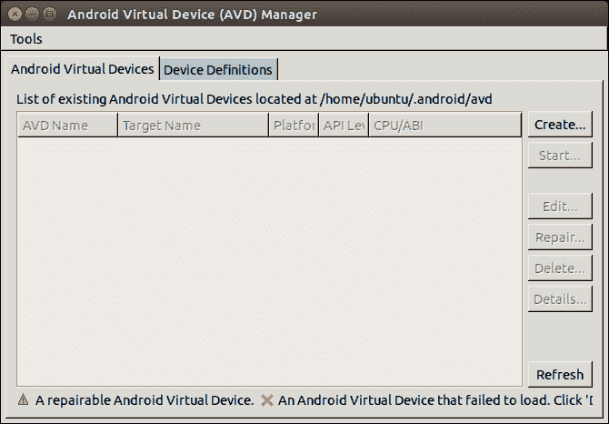
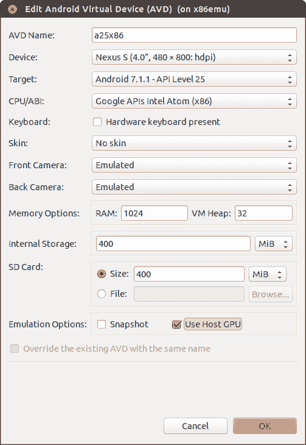
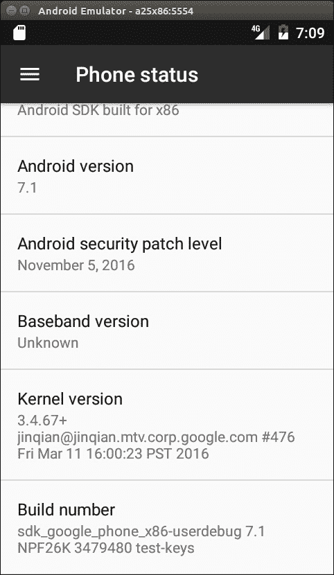
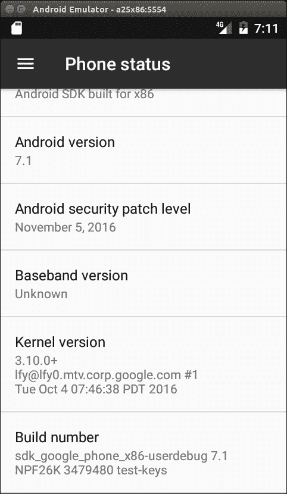
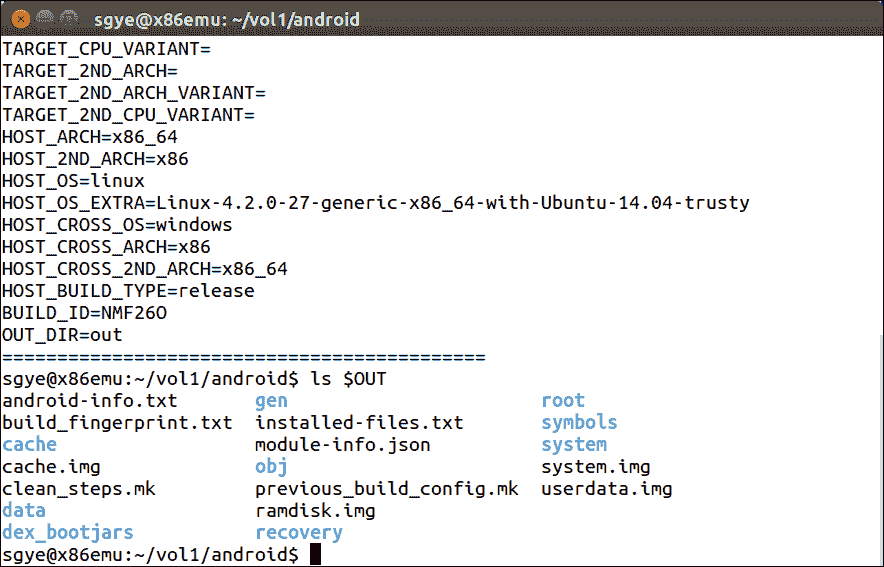
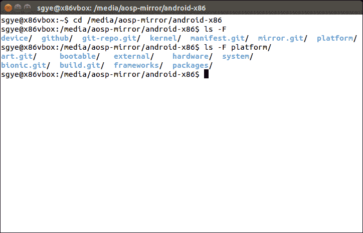

# 设置开发环境

在上一章介绍系统编程之后，我们需要首先设置一个开发环境，然后我们才能继续前进。在我们探索本书中各种 Android 系统编程主题的同时，我们需要了解如何构建和测试 **Android 开源项目（AOSP**）。在本章中，我们将涵盖以下主题：

+   安装 Android SDK 和设置 Android 虚拟设备

+   设置 AOSP 构建环境和构建测试镜像

+   创建自己的源代码仓库镜像

# Android 版本总结

由于我们将使用 Android 模拟器作为虚拟硬件平台之一，因此在这本书中我们需要使用特定的 Android 版本。在撰写本书时，最新的 Android 版本是 Android 7（牛轧糖）。本书将使用 Android 7。我开始这本书的工作时使用的是 Android 6，因此 Android 6 的源代码也存放在我的 GitHub 仓库中，网址为 [`github.com/shugaoye`](https://github.com/shugaoye)。

从第一个版本到 Android 7，开发环境和 AOSP 源代码都发生了很大变化。在我们讨论开发环境设置之前，我们将简要回顾各种 Android 版本。

要设置 AOSP 构建环境，有两件事需要特别注意：主机环境和 Java SDK。尽管推荐的宿主环境是运行在英特尔架构上的 Ubuntu，但硬件架构和 Ubuntu 版本从发布到发布都有所变化。你可以始终参考以下 Google 的 URL 获取最新的 AOSP 构建环境设置：

[`source.android.com/source/index.html`](https://source.android.com/source/index.html)

对于 Gingerbread（2.3.x）及以上版本，需要 64 位构建环境。对于较旧版本，构建环境是 32 位系统。

使用的 Ubuntu 版本范围从 Ubuntu 10.04 到 14.04，但对于每个版本都有一个推荐的 Ubuntu 版本。如果是新的设置，建议使用推荐的 Ubuntu 版本来使工作更简单。然而，这里没有硬性要求。你应该能够使用比推荐版本更高的任何 Ubuntu 版本。也有很多关于如何使用不同的 Linux 发行版（如 RedHat 或 Debain）设置 AOSP 构建的文章。

在 Lollipop 及以上版本中，使用 OpenJDK 替代了 Oracle JDK，用于构建 AOSP。

以下表格总结了直到 Nougat 的所有 Android 发布、所需主机和 JDK 环境；你可以参考它以获取详细信息。

**AOSP 发布**：

| **昵称** | **AOSP** | **SDK API 级别** | **主机** | **JDK** | **操作系统/Ubuntu** | **Goldfish** | **Ranchu** |
| --- | --- | --- | --- | --- | --- | --- | --- |
| Cupcake | 1.5 | 3 | x86 | Oracle JDK 5 | 10.04 | x |  |
| Donut | 1.6 | 4 | x86 | Oracle JDK 5 | 10.04 | x |  |
| Eclair | 2.0/2.1 | 5 | x86 | Oracle JDK 5 | 10.04 | x |  |
| 甜点 | 2.0.1 | 6 | x86 | Oracle JDK 5 | 10.04 | x |  |
| 甜点 | 2.1 | 7 | x86 | Oracle JDK 5 | 10.04 | x |  |
| 甜甜圈 | 2.2 | 8 | x86 | Oracle JDK 5 | 10.04 | x |  |
| 甜点 | 2.3.1 | 9 | x64 | Oracle JDK 6 | 12.04 | x |  |
| 姜饼 | 2.3.3 | 10 | x64 | Oracle JDK 6 | 12.04 | x |  |
| 蜂巢 | 3.0 | 11 | x64 | Oracle JDK 6 | 12.04 | x |  |
| 蜂巢 | 3.1 | 12 | x64 | Oracle JDK 6 | 12.04 | x |  |
| 蜂巢 | 3.2 | 13 | x64 | Oracle JDK 6 | 12.04 | x |  |
| 冰淇淋三明治 | 4.0 | 14 | x64 | Oracle JDK 6 | 12.04 | x |  |
| 冰淇淋三明治 | 4.0.3 | 15 | x64 | Oracle JDK 6 | 12.04 | x |  |
| 姜饼 | 4.1.2 | 16 | x64 | Oracle JDK 6 | 12.04 | x |  |
| 姜饼 | 4.2.2 | 17 | x64 | Oracle JDK 6 | 12.04 | x |  |
| 姜饼 | 4.3.1 | 18 | x64 | Oracle JDK 6 | 12.04 | x |  |
| 棉花糖 | 4.4.2 | 19 | x64 | Oracle JDK 6 | 12.04 | x | x |
| 棉花糖 | 4.4W.2 | 20 | x64 | Oracle JDK 6 | 12.04 | x | x |
| 棉花糖 | 5.0.1 | 21 | x64 | Open JDK 7 | 12.04 | x | x |
| 棉花糖 | 5.1.1 | 22 | x64 | Open JDK 7 | 12.04 | x | x |
| 棉花糖 | 6.0 | 23 | x64 | Open JDK 7 | 14.04 | x | x |
| 棉花糖 | 7.0.x | 24 | x64 | Open JDK 8 | 14.04 | x | x |
| 棉花糖 | 7.1.1 | 25 | x64 | Open JDK 8 | 14.04 | x | x |

从前面的表格中，你可以看到 ranchu 模拟器支持 KitKat 和其他系统。如果你在 Android SDK 上安装并下载 KitKat 或其他系统的系统镜像，你应该能够找到两个内核文件，`kernel-qemu`和`kernel-ranchu`。

Nougat 版本中有两个 API 级别。Android 7.0.0 和 7.1.0 是 API 级别 24。Android 7.1.1 和 7.1.2 是 API 级别 25。本书中的所有源代码都支持到 API 级别 25。

原始 Android 模拟器的代号是 goldfish。它基于较老版本的 QEMU。2016 年基于 QEMU 2.x 发布了一个新的 Android 模拟器版本。这个新模拟器的代号是 ranchu。它支持 KitKat 和其他系统。

# 安装 Android SDK 并设置 Android 虚拟设备

理想情况下，如果你有一个 AOSP 构建环境，你可以从头开始构建包括 Android SDK 在内的所有内容。然而，拥有一个 Android SDK 安装包来帮助创建虚拟设备或运行模拟器镜像要方便得多。

你可以从以下网站始终下载最新的 Android SDK：

[`developer.android.com/index.html`](https://developer.android.com/index.html)

本书使用的宿主环境是 Ubuntu 14.04。下载适用于 Linux 的 Android SDK 并将其解压缩到你的`Home`目录下的一个文件夹中。

Android SDK 中的工具自 API 级别 25 以来已经发生了变化。你可以使用较旧的 Android SDK 或最新的 Android SDK，因此我在这里提供了两种情况的说明。

# 在较旧版本的 SDK 中创建 AVD

对于较旧的 SDK 版本，例如 `android-sdk_r24.4.1-linux.tgz`，它包含所有必要的组件，我们可以在解压缩后使用它。解压缩后，我们可以找到以下内容：

```kt
$ ls android-sdk-linux
add-ons      platforms       SDK Readme.txt  temp
build-tools  platform-tools  system-images   tools

```

你可以将 `platform-tools` 和 `tools` 目录添加到你的 `PATH` 环境变量中。

在本书中，我们将使用基于 API 级别 25 的虚拟设备来测试我们的镜像。

要创建虚拟设备，我们可以使用以下命令启动 **Android 虚拟设备**（**AVD**）管理器，如下面的截图所示：

```kt
$ android avd  

```



AVD 管理器

在 AVD 管理器中单击“创建...”按钮，创建一个名为 `a25x86` 的新虚拟设备，配置如下，如下面的截图所示：

+   Android 7.1.1 - API 级别 25

+   1024 MB RAM

+   400 MB SD 卡

+   400 MB 内部存储

+   显示尺寸为 480 x 800：hdpi



Android 虚拟设备 a25x86

# 在最新版本的 SDK 中创建 AVD

对于较新版本，只有 SDK 命令行工具可供下载。例如，如果你下载了 r25 的命令行工具，如 `tools_r25.2.3-linux.zip`，你只能找到 `tools` 文件夹。在这种情况下，你需要使用 Android SDK 管理器在 `tools/bin/sdkmanager` 中下载其余的 SDK 组件。要下载其余的 SDK 组件，你可以使用以下命令：

```kt
$ sdkmanager --update

```

如果你使用的是最新版本的 Android SDK，如果你遵循前面的说明，你可能会得到以下错误消息：

```kt
$ android avd
*********************************************************************
The "android" command is deprecated.
For manual SDK, AVD, and project management, please use Android Studio.
For command-line tools, use tools/bin/sdkmanager and tools/bin/avdmanager
*********************************************************************
Invalid or unsupported command "avd"

Supported commands are:
android list target
android list avd
android list device
android create avd
android move avd
android delete avd
android list sdk
android update sdk

```

在这种情况下，你可以使用以下命令创建 AVD。

```kt
$ avdmanager create avd -n a25x86 --tag google_apis -k 'system-images;android-25;google_apis;x86'
Auto-selecting single ABI x86
Do you wish to create a custom hardware profile? [no]

```

# 测试 goldfish 模拟器

在 Android 7 中，ranchu 和 goldfish 模拟器都受到支持。让我们首先测试 goldfish 模拟器。我们可以使用以下命令在 goldfish 模拟器中运行此虚拟设备：

```kt
$ emulator @a25x86 -verbose -show-kernel -shell -engine classic
emulator:Found AVD name 'a25x86'
emulator:Found AVD target architecture: x86
emulator:Looking for emulator-x86 to emulate 'x86' CPU
...
 kernel.path = /home/roger/android-sdk-linux/system-images/android-  
  25/default/x86/kernel-qemu
...  

```

要监控虚拟设备的状态，我们可以使用以下 Android 模拟器选项：

+   `-verbose`: 显示模拟器调试信息。

+   `-show-kernel`: 显示内核调试信息。

+   `-shell`: 使用 `stdio` 作为命令行提示符。

+   `-engine`: 选择模拟器引擎。选项可以是 `auto`、`classic` 或 `qemu2`。`classic` 选项是使用 goldfish 模拟器，而 `qemu2` 选项是使用 ranchu 模拟器。如果选项是 `auto` 或没有 `engine` 选项，系统将检查环境并尝试首先启动 ranchu。如果失败，将回退到 goldfish。

从前面的日志中，我们可以看到 goldfish 模拟器使用的是 `kernel-qemu` 内核文件。

ranchu 和 goldfish 模拟器都是在 QEMU 的基础上开发的，但它们使用不同的内核和 QEMU 版本。我们可以使用以下模拟器命令验证 goldfish 或 ranchu 使用的 QEMU 版本。

要验证 goldfish 使用的 QEMU 版本，我们可以运行以下命令：

```kt
$ emulator -engine classic -qemu -version
QEMU PC emulator version 0.10.50 Android, Copyright (c) 2003-2008 Fabrice Bellard  

```

从前面的输出中，我们可以看到 goldfish 模拟器使用的是 QEMU 版本 0.10.50。

对于最新的模拟器版本，似乎在处理经典引擎方面存在一个错误。当你执行前面的命令时，可能会得到以下错误信息：

```kt
$ emulator -engine classic -qemu -version
emulator: ERROR: android_qemud_get_serial_line: can't create charpipe to serial port  

```

模拟器命令是 QEMU 的包装器。任何 `-qemu` 之后的所有命令行选项都直接作为 QEMU 的命令行传递给 QEMU。

要找出模拟器版本，我们可以使用以下命令：

`**$ emulator -version**` 以下命令将显示 QEMU 版本：

`**$ emulator -qemu -version**`

在 Android 设备成功启动后，从 Android UI，我们可以进入设置 -> 关于手机，并查看以下截图所示的屏幕：



goldfish 的 Android 内核版本

请注意关于“关于手机”屏幕上的以下信息：

+   Android 版本：7.1

+   内核版本：3.4.67

+   构建号：`sdk_google_phone_x86-userdebug 7.1 NPF26K 3479480 test-keys`

如前所述的信息所示，内核版本是 `3.4.67`，文件系统构建号是 `sdk_google_phone_x86-userdebug 7.1 NPF26K 3479480 test-keys`，针对金鱼模拟器。在下一节中，我们可以看到 ranchu 模拟器使用不同的内核版本，尽管这两个模拟器共享相同的文件系统。

Android 系统构建包括两部分：AOSP 系统和一个兼容 Android 的 Linux 内核。AOSP 系统的构建结果包括 Android 系统的所有镜像文件，除了内核镜像。它们是分别构建的，并且也处于不同的许可之下。AOSP 的首选许可协议是 Apache 软件许可协议，而 Linux 内核则处于 GPLv2 许可协议之下。请注意这一差异。这也意味着 AOSP 构建不包括内核构建。我们必须单独构建内核。我们还可以使用与金鱼和 ranchu 模拟器测试中相同的文件系统使用不同的内核镜像。

当我们谈论 Android 版本时，我们必须查看内核版本和文件系统构建号的详细信息。

# 测试 ranchu 模拟器

我们也可以使用相同的虚拟设备测试 ranchu 模拟器。我们可以使用不带 `-engine` 选项或带有 `-engine qemu2` 选项的类似命令来启动 ranchu 模拟器：

```kt
$ emulator @a25x86 -verbose -show-kernel -shell
emulator:Found AVD name 'a25x86'
emulator:Found AVD target architecture: x86
emulator:  Found directory: /home/roger/android-sdk-linux/system-images/android-25/default/x86/

emulator:Probing for /home/roger/android-sdk-linux/system-images/android-25/default/x86//kernel-ranchu: file exists
emulator:Auto-config: -engine qemu2 (based on configuration)
emulator:Found target-specific 64-bit emulator binary: /home/roger/android-sdk-linux/tools/qemu/linux-x86_64/qemu-system-i386
...  

```

从前面的日志中，我们可以看到在 ranchu 模拟器中使用内核文件 `kernel-ranchu`。

我们还可以使用以下命令验证 ranchu 模拟器使用的 QEMU 版本：

```kt
$ emulator -qemu -version
QEMU emulator version 2.2.0 , Copyright (c) 2003-2008 Fabrice Bellard  

```

我们可以看到 ranchu 使用了一个支持许多新特性的较新版本的 QEMU，我们将在本书的后续章节中讨论这些特性。

再次，让我们回顾一下设置中的版本信息，就像我们为金鱼模拟器所做的那样；参见图下所示：



ranchu 的 Android 内核版本

我们可以看到 ranchu 模拟器使用的是内核版本 3.10.0，这与金鱼模拟器不同。文件系统构建与金鱼模拟器相同。

# AOSP 构建环境和 Android 模拟器构建

为了创建我们自己的 Android 系统，我们必须设置 AOSP 构建环境并构建用于 Android 模拟器的 AOSP 目标。由于 Android 正在快速发展，构建过程和环境设置可能会随时发生变化。您始终可以参考谷歌的网站以获取最新信息，[`source.android.com/source/building.html`](https://source.android.com/source/building.html)。

虽然谷歌网站和其他资源可以提供关于 AOSP 构建的一般指南和程序，但在本节中，我们将具体探讨如何为 API 级别 25 的 Android 模拟器镜像构建 AOSP。

# AOSP 构建环境

由于我们想要为 API 级别 25 设置构建环境，您可以参考 AOSP 发布表以获取主机和 JDK 的基本要求。建议使用 64 位的 Ubuntu 14.04 主机和 Open JDK 8。对于硬件要求，您可能需要一个至少拥有 8 GB RAM 和 500 GB 硬盘空间的强大计算机。

# 安装所需的软件包

我们使用 64 位的 Ubuntu 14.04 版本作为我们的宿主操作系统。在安装 Ubuntu 14.04 之后，您必须做的第一件事是按照以下方式安装所有必要的软件包。如果您使用的是不同的 Linux 发行版，您可以参考谷歌的网站或在网上搜索相关的设置程序。让我们执行以下命令来安装 Ubuntu 14.04 的所有必要软件包：

```kt
$ sudo apt-get install git-core gnupg flex bison gperf build-essential\ 
 zip curl zlib1g-dev gcc-multilib g++-multilib libc6-dev-i386\ 
 lib32ncurses5-dev x11proto-core-dev libx11-dev lib32z-dev ccache\ 
 libgl1-mesa-dev libxml2-utils xsltproc unzip  

```

# 安装 Open JDK 7 和 8

我们将安装 Open JDK 7 和 8，这样我们就可以在我们的构建环境中构建 Android 6 和 7。

要构建 Android API 级别 23，我们需要安装 OpenJDK 7。我们可以从 Linux 控制台执行以下命令来安装 OpenJDK 7：

```kt
$ sudo apt-get update
$ sudo apt-get install openjdk-7-jdk  

```

对于 Android 7，我们需要使用 OpenJDK 8 来构建。目前还没有适用于 Ubuntu 14.04 的受支持的 OpenJDK 8 软件包，但 Ubuntu 15.04 的 OpenJDK 8 软件包已经成功用于 Ubuntu 14.04。我们需要按照以下说明在 Ubuntu 14.04 上安装 OpenJDK 8。

从[archive.ubuntu.com](http://archive.ubuntu.com)下载 64 位架构的`.deb`软件包：

```kt
openjdk-8-jre-headless_8u45-b14-1_amd64.deb with SHA256 0f5aba8db39088283b51e00054813063173a4d8809f70033976f83e214ab56c0
openjdk-8-jre_8u45-b14-1_amd64.deb with SHA256 9ef76c4562d39432b69baf6c18f199707c5c56a5b4566847df908b7d74e15849
openjdk-8-jdk_8u45-b14-1_amd64.deb with SHA256 6e47215cf6205aa829e6a0a64985075bd29d1f428a4006a80c9db371c2fc3c4c

```

可选地，确认下载文件的校验和与每个先前包中列出的 SHA256 字符串相匹配。

例如，使用*sha256sum*工具：

```kt
$ sha256sum {downloaded.deb file}  

```

安装软件包：

```kt
$ sudo apt-get update  

```

对您下载的每个`.deb`文件运行`dpkg`。由于缺少依赖项，可能会产生错误：

```kt
$ sudo dpkg -i {downloaded.deb file}  

```

为了修复缺少的依赖项：

```kt
$ sudo apt-get -f install  

```

在安装了 OpenJDK 7 和 8 之后，我们可以通过运行以下命令来更新默认的 Java 版本：

```kt
$ sudo update-alternatives --config java
$ sudo update-alternatives --config javac  

```

我们现在已经准备好了构建环境。您可能想要参考谷歌的网站来设置其他事项。例如，我们可能想要使用缓存来加速构建或设置一个独立的输出目录，不在 AOSP 树中。

# 下载 AOSP 源代码

一旦我们准备好了构建环境，我们需要获取 AOSP 源代码。再次，请参考谷歌的网站或互联网以获取更多信息。

您需要从[source.android.com](https://source.android.com/)下载 Android 7 源代码。

# 安装 repo

AOSP 由大量的 Git 仓库组成，我们必须使用 repo 工具来管理这些 Git 仓库。要下载和安装 repo，我们可以使用以下命令：

```kt
$ mkdir ~/bin
$ PATH=~/bin:$PATH
$ curl https://storage.googleapis.com/git-repo-downloads/repo > ~/bin/repo
$ chmod a+x ~/bin/repo  

```

# 初始化 repo 客户端并下载 AOSP 源代码树

在我们有了 repo 工具之后，我们可以执行以下命令来初始化 repo 并下载 AOSP 源代码树：

```kt
$ repo init -u https://android.googlesource.com/platform/manifest -b android-7.1.1_r4
$ repo sync  

```

注意这里的 AOSP 标签`android-7.1.1_r4`。这是我们全书使用的 AOSP 源代码版本。

获取 AOSP 源代码树需要相当长的时间。在获取源代码树后，让我们看看顶级文件夹：

```kt
$ ls -F
abi/      cts/         docs/       libcore/         packages/  tools/
art/      dalvik/      external/   libnativehelper/ pdk/
bionic    developers   filelist    Makefile         prebuilts
bootable  development  frameworks  ndk              sdk
build     device       hardware    out              system  

```

我不会在这里详细探讨源代码树；我们将在第三章中介绍，*发现内核、HAL 和虚拟硬件*。

# 构建 AOSP Android 模拟器镜像

在本书中，我们将使用基于 x86 的模拟器。基于 x86 的模拟器可以在主机上使用虚拟化技术，因此它比 ARM 模拟器快得多。我们首先想要构建的是包含 AOSP 源代码的那个。要从 AOSP 顶级文件夹执行以下命令来创建 Android 模拟器构建：

```kt
$ . build/envsetup.sh 
including device/generic/mini-emulator-arm64/vendorsetup.sh
including device/generic/mini-emulator-armv7-a-neon/vendorsetup.sh
including device/generic/mini-emulator-mips/vendorsetup.sh
including device/generic/mini-emulator-x86_64/vendorsetup.sh
including device/generic/mini-emulator-x86/vendorsetup.sh
including sdk/bash_completion/adb.bash
$ lunch

You're building on Linux

Lunch menu... pick a combo:
 1\. aosp_arm-eng
 2\. aosp_arm64-eng
 3\. aosp_mips-eng
 4\. aosp_mips64-eng
 5\. aosp_x86-eng
 6\. aosp_x86_64-eng
 7\. mini_emulator_arm64-userdebug
 8\. m_e_arm-userdebug
 9\. mini_emulator_mips-userdebug
 10\. mini_emulator_x86_64-userdebug
 11\. mini_emulator_x86-userdebug

Which would you like? [aosp_arm-eng] 5

============================================
PLATFORM_VERSION_CODENAME=REL
PLATFORM_VERSION=7.1.1
TARGET_PRODUCT=aosp_x86
TARGET_BUILD_VARIANT=eng
TARGET_BUILD_TYPE=release
TARGET_BUILD_APPS=
TARGET_ARCH=x86
TARGET_ARCH_VARIANT=x86
TARGET_CPU_VARIANT=
TARGET_2ND_ARCH=
TARGET_2ND_ARCH_VARIANT=
TARGET_2ND_CPU_VARIANT=
HOST_ARCH=x86_64
HOST_2ND_ARCH=x86
HOST_OS=linux
HOST_OS_EXTRA=Linux-4.2.0-27-generic-x86_64-with-Ubuntu-14.04-trusty
HOST_CROSS_OS=windows
HOST_CROSS_ARCH=x86
HOST_CROSS_2ND_ARCH=x86_64
HOST_BUILD_TYPE=release
BUILD_ID=NMF26O
OUT_DIR=out
============================================  

```

我们首先使用启动脚本`envsetup.sh`设置环境变量。之后，我们执行`lunch`命令来选择构建目标。要为 Android-x86 模拟器构建，我们可以选择目标`aosp_x86-eng`，这将构建适用于 x86 的 Android 模拟器版本。要了解更多关于脚本文件`envsetup.sh`和命令`lunch`的信息，请参考谷歌网站[`source.android.com`](https://source.android.com)。

在执行以下`make`命令后，实际构建开始：

```kt
$ make -j4
============================================
PLATFORM_VERSION_CODENAME=REL
PLATFORM_VERSION=7.1.1
TARGET_PRODUCT=aosp_x86
TARGET_BUILD_VARIANT=eng
TARGET_BUILD_TYPE=release
TARGET_BUILD_APPS=
TARGET_ARCH=x86
TARGET_ARCH_VARIANT=x86
TARGET_CPU_VARIANT=
TARGET_2ND_ARCH=
TARGET_2ND_ARCH_VARIANT=
TARGET_2ND_CPU_VARIANT=
HOST_ARCH=x86_64
HOST_OS=linux
HOST_OS_EXTRA=Linux-4.2.0-27-generic-x86_64-with-Ubuntu-14.04-trusty
HOST_BUILD_TYPE=release
BUILD_ID=MOB30M
OUT_DIR=out
============================================
including ./abi/cpp/Android.mk ...
including ./art/Android.mk ...
...
make_ext4fs -S out/target/product/generic_x86/root/file_contexts -l 576716800 -a system out/target/product/generic_x86/obj/PACKAGING/systemimage_intermediates/system.img out/target/product/generic_x86/system
+ make_ext4fs -S out/target/product/generic_x86/root/file_contexts -l 576716800 -a system out/target/product/generic_x86/obj/PACKAGING/systemimage_intermediates/system.img out/target/product/generic_x86/system
Creating filesystem with parameters:
 Size: 576716800
 Block size: 4096
 Blocks per group: 32768
 Inodes per group: 7040
 Inode size: 256
 Journal blocks: 2200
 Label: 
 Blocks: 140800
 Block groups: 5
 Reserved block group size: 39
Created filesystem with 1277/35200 inodes and 82235/140800 blocks
+ '[' 0 -ne 0 ']'
Install system fs image: out/target/product/generic_x86/system.img
out/target/product/generic_x86/system.img+ maxsize=588791808 blocksize=2112   
    total=576716800 reserve=5947392

```

整个构建时间取决于您的硬件配置。即使在高端的 Intel Core i7 处理器上，也可能需要大约 40 分钟。选项`-j4`将启动使用四个处理器核心的并行构建。您可以根据您的计算机硬件选择数字。

# 测试 AOSP 镜像

构建完成后，我们可以在输出文件夹中找到所有镜像，如下面的截图所示：



generic_x86 的构建输出

AOSP 构建输出存储在`$AOSP/out`文件夹下。此文件夹包括目标和主机的构建结果。不同设备的构建结果分别存储在`$AOSP/out/target/product/{设备名称}`下。在我们的例子中，是`$AOSP/out/target/product/generic_x86`。

`system.img`、`userdata.img`和`ramdisk.img`这些镜像文件对于运行模拟器是必要的，但如您所见，这里没有内核镜像。我们将在本书的后面部分讨论内核构建。目前，我们将使用 Android SDK 中的内核镜像来测试我们的 AOSP 构建。

要使用我们的 AOSP 镜像进行测试，我们可以创建以下脚本：

```kt
#!/bin/sh 

emulator @a25x86 -verbose -show-kernel -system $OUT/system.img -ramdisk $OUT/ramdisk.img -initdata $OUT/userdata.img 

```

我们可以将这个脚本 `test_aosp.sh` 放在 `$HOME/bin` 文件夹中。通常，我们可以将 `$HOME/bin` 添加到可执行搜索 `path` 变量中，这样我们就可以在命令行中如下运行这个脚本 `test_aosp.sh`：

```kt
$ test_aosp.sh  

```

如果你使用 Android 6 或更早的版本测试你的 AOSP 构建，你需要使用经典引擎而不是 ranchu。ranchu 构建在 Android 6 AOSP 构建中有一个问题，但在 Android 7 构建中这个问题已经被修复。为了在 6.0.1 AOSP 构建中支持 ranchu，我们必须更改清单以包含最新的模拟器设备。Android SDK 发布版没有这个问题。谷歌内部修复了这个问题，但直到 Android 7 才发布修复。

在模拟器启动后，我们可以检查版本信息，就像之前做的那样。在下面的屏幕截图中，我们可以看到 AOSP 图像中的版本信息：


AOSP 图像的 Android 版本

如我们所见，使用了内核版本 3.10.0；这是因为我们使用了 ranchu 模拟器。让我们将信息与之前测试的 SDK 图像进行比较。从下面的表格中，我们可以看到模型号是 IA 模拟器上的 AOSP 而不是 sdk。SDK 的 Android 版本是 7.1，而 AOSP 的版本是 7.1.1。AOSP 图像的构建号是构建目标 `aosp_x86-eng`，这是我们之前选择的，这也包括了构建的日期和时间。

**SDK 和 AOSP 版本**：

|  | **SDK (goldfish)** | **SDK (ranchu)** | **AOSP** |
| --- | --- | --- | --- |
| 模型 | sdk | sdk | IA 模拟器上的 AOSP |
| Android 版本 | 7.1 | 7.1 | 7.1.1 |
| 内核版本 | 3.4.67 | 3.10.0 | 3.10.0 |
| 构建号 | sdk_google_phone_x86-userdebug 7.1 NPF26K 3479480 test-keys | sdk_google_phone_x86-userdebug 7.1 NPF26K 3479480 test-keys | aosp_x86-eng 7.1.1 NMF26O eng.sgye 20170126.183237 test-keys |

# 创建自己的仓库镜像

下载 AOSP 源代码通常需要非常长的时间。在你下载了 AOSP 源代码之后，实际上你已经从远程仓库下载了 AOSP 源代码的特定版本。在你的开发工作中，你可能需要测试不同的配置或版本。切换到不同的版本或创建 AOSP 源代码的新副本是一个非常耗时的工作。

在这本书中，我们将使用 AOSP 源代码作为我们开发的基线。为了重用一些不包括在 AOSP 中的现有开源项目，我们不得不不时修改 repo 清单。这涉及到更改 repo 配置。为了更有效地工作，我们可以使用本地镜像。创建本地镜像可以节省大量时间，而不是从远程仓库下载所有配置更改的源代码。从一个远程仓库更改配置可能需要数小时，但使用本地仓库只需要几分钟。

当我们处理开源项目时，托管项目的服务器可能会不时更改。拥有自己的镜像总是很好的，这样我们就不会过于依赖远程仓库。即使远程服务器在一段时间内不可用，我们仍然可以继续工作。这正是我在尝试将 Android-x86 项目集成到本书的后期部分时遇到的问题。

我将在本节中解释如何创建 AOSP、Android-x86 和 GitHub 的混合本地镜像。

# Repo 和 manifest

要创建和管理仓库镜像，我们需要更深入地了解 `repo` 命令和 `repo` 管理的目录结构。`repo` 命令处理 XML 文件 manifest，并将所有内容存储在名为 `.repo` 的文件夹中。

在我们像上一节那样运行 `repo init` 命令之后，当前文件夹下会创建一个 `.repo` 文件夹。如果我们查看 `.repo` 文件夹，我们可以看到以下内容：

```kt
$ ls -F .repo
manifests/  manifests.git/  manifest.xml@  repo/  

```

创建了三个文件夹和一个符号链接。以下是每个的解释：

+   `manifests`：这是 manifest 本身 Git 仓库的工作副本。

+   `manifests.git`：这是 manifest 的 Git 仓库。manifest 本身使用 Git 进行版本控制。

+   `manifest.xml`：这是到文件 `.repo/manifests/default.xml` 的符号链接。这是 `repo` 使用的配置文件。我们稍后会详细了解。

+   `repo`：repo 工具本身是用 Python 语言编写的。Python 脚本存储在这个文件夹中。

在我们运行 `repo init` 命令初始化 repo 数据结构之后，我们可以运行 `repo sync` 命令来检索工作副本。如果我们再次查看 `.repo` 文件夹，在 `repo sync` 命令之后，我们可以看到创建了两个与项目相关的文件夹：

```kt
$ ls -F .repo
manifests/      manifest.xml@  project-objects/  repo/
manifests.git/  project.list   projects/  

```

以下是对新创建的文件和文件夹的解释：

+   `project.list`：这是所有下载项目的列表。

+   `project-objects`：这是远程仓库的副本。

+   `projects`：这是与工作副本匹配的仓库层次结构。在仓库复制到本地后，路径可能会重新排列。这个文件夹中的内容是 `project-objects` 中项的符号链接。

`.repo` 文件夹中最重要的文件是 `.repo/manifests/default.xml` 或其符号链接 `manifest.xml`。该文件的详细规范可以在 `.repo` 文件夹下的 `.repo/repo/docs/manifest-format.txt` 文档中找到。我们不会深入细节，但让我们看看最常用的元素。

```kt
<?xml version="1.0" encoding="UTF-8"?> 
<manifest> 

  <remote  name="aosp" 
           fetch=".." /> 
  <default revision="refs/tags/android-7.1.1_r4" 
           remote="aosp" 
           sync-j="4" /> 

  <project path="build" name="platform/build" groups="pdk" > 
    <copyfile src="img/root.mk" dest="Makefile" /> 
  </project> 
  <project path="abi/cpp" name="platform/abi/cpp" groups="pdk" /> 
  <project path="art" name="platform/art" groups="pdk" /> 
  <project path="bionic" name="platform/bionic" groups="pdk" /> 
... 
</manifest> 

```

在前面的代码片段中，我们可以看到在 manifest 中有三个 XML 元素：

+   `remote`：`remote` 元素提供了远程仓库的详细信息。我们可以给它起一个名字，例如 `aosp`。远程仓库的 URL 可以在 `fetch` 字段中指定。它可以是相对路径或完整路径。

+   `default`: 清单中可以指定多个`remote`元素。`default`元素定义了哪个`remote`是默认的。

+   `project`: 每个`project`元素定义了一个 Git 仓库。`path`字段提供下载后的本地路径，`name`字段提供 Git 仓库的远程路径，`revision`字段提供我们想要获取的分支，`remote`字段告诉我们我们使用哪个远程服务器来获取 Git 仓库。

清单中还可以使用其他 XML 元素。你可以通过查看前面的规范来了解它们是什么。

# 使用本地镜像进行 AOSP

如果你参考谷歌网站上的关于下载源的文章，你可以找到一个名为*使用本地镜像*的部分。它揭示，如果你需要两个不同的 AOSP 构建环境配置，两个客户端的下载大小将大于整个仓库镜像的大小。设置镜像非常简单，如下所示：

```kt
$ mkdir -p /usr/local/mirror/aosp
$ cd /usr/local/mirror/aosp
$ repo init -u https://android.googlesource.com/mirror/manifest --mirror
$ repo sync  

```

从前面的命令中，我们可以看到我们实际上使用不同的清单来创建镜像。如果我们查看镜像清单的内容，我们可以看到以下 XML 代码：

```kt
<?xml version="1.0" encoding="UTF-8"?> 
<manifest> 
  <remote  name="aosp" 
           fetch=".." /> 
  <default revision="master" 
           remote="aosp" 
           sync-j="4" /> 
  <project name="accessories/manifest" /> 
  <project name="brillo/manifest" /> 
... 
</manifest> 

```

我们可以看到，对于所有项目，每个项目项中只有项目名称，没有其他信息。这是因为我们实际上将每个 Git 仓库复制到本地作为一个裸 Git 仓库。我们不会检出工作副本，所以我们不需要担心版本。

如果我们查看清单以检出工作副本，我们将看到以下内容：

```kt
<?xml version="1.0" encoding="UTF-8"?> 
<manifest> 

  <remote  name="aosp" 
           fetch=".." /> 
  <default revision="refs/tags/android-6.0.1_r61" 
           remote="aosp" 
           sync-j="4" /> 

  <project path="build" name="platform/build" groups="pdk" > 
    <copyfile src="img/root.mk" dest="Makefile" /> 
  </project> 
  <project path="abi/cpp" name="platform/abi/cpp" groups="pdk" /> 
  <project path="art" name="platform/art" groups="pdk" /> 
... 
</manifest> 

```

它包含的项比创建镜像的项更多。`name`字段指定远程仓库的路径，`path`字段指定下载到本地的本地路径。我们还需要指定我们想要检索的`revision`。

在我们有一个镜像之后，我们可以按照以下方式从该镜像检出 AOSP 源的一个副本：

```kt
$ mkdir -p $HOME/aosp/master
$ cd $HOME/aosp/master
$ repo init -u /usr/local/mirror/aosp/platform/manifest.git
$ repo sync  

```

如果需要，你可以从本地镜像检出多个副本。无论你是检出多个副本还是切换到不同的版本，与从远程仓库检出相比，你可以节省很多时间。

当你在系统级项目上工作时，你可能需要 AOSP 源之外的某些项目。例如，在这本书中，我们使用了来自 CyanogenMod、Android-x86 以及我在 GitHub 上的多个项目。在这种情况下，我们实际上可以创建自己的清单，将我们从本地镜像中需要的所有项目混合在一起。我们的本地镜像将成为公共镜像的超集。我们可以不时地在本地仓库中创建分支和标签，但我们只推送我们想要发布到公共仓库的基线。这正是谷歌开发团队在他们私有仓库中所做的。

# 创建自己的 GitHub 镜像

本书所使用的所有源代码都存储在 GitHub 上。我们还使用了 GitHub 上其他项目的源代码，因为许多开源项目托管在 GitHub 上，例如 CyanogenMod、OmniROM、Team Win Recovery 等等。我们可以为我们在本地存储中使用的所有项目创建镜像，这样我们就可以提交任何更改并创建自己的基线。如果你想要更改不属于你自己的任何项目，你可以使用 GitHub 的 Fork 功能创建自己的副本。

要为 GitHub 创建自己的清单，你可以在 GitHub 中创建一个仓库，命名为`mirror`，然后添加一个名为`default.xml`的 XML 文件，如下所示：

```kt
<?xml version="1.0" encoding="UTF-8"?> 
<manifest> 

  <remote  name="cm" 
           fetch="git://github.com/CyanogenMod" 
           review="review.cyanogenmod.org" 
           revision="refs/heads/cm-13.0" /> 

  <remote  name="twrp" 
           fetch="git://github.com/TeamWin" 
           revision="master" /> 

  <remote  name="omnirom" 
           fetch="https://github.com/omnirom" /> 

  <remote  name="github" 
           fetch=".." /> 
  <default revision="master" 
           remote="github" 
           sync-j="4" /> 

  <!-- configuration of github repositories v1.0 --> 
  <project name="manifests" /> 
  <project name="manifest" /> 
  <project name="mirror" /> 
  <project name="local_manifests" /> 
... 
  <!-- CyanogenMod --> 
  <project name="android_bootable_recovery" remote="cm" /> 
  <project name="android_external_busybox" remote="cm" /> 
  <project name="android" remote="cm" /> 

  <!-- Team Win Recovery Project --> 
  <project name="Team-Win-Recovery-Project" remote="twrp" /> 
  <project name="android_device_emulator_twrp" remote="twrp" /> 
  <project name="android_device_emulator_twrpx86" remote="twrp" /> 
  <project name="android_device_emulator_twrpx8664" remote="twrp" /> 

  <!-- omnirom --> 
  <project path="external/lz4" name="android_external_lz4" remote="omnirom" 
  revision="android-6.0" groups="pdk-cw-fs,pdk-fs" /> 

  <!-- from original Android repositories --> 
... 
</manifest> 

```

从前面的`default.xml`中，我们可以看到，我们实际上使用单个 XML 文件从 CyanogenMod、TWRP、OmniROM 以及我们自己的 GitHub 仓库获取了多个项目。我们将它们全部放在一起，形成我们自己的 GitHub 本地镜像。

要创建本地镜像，我们可以使用以下命令：

```kt
$ mkdir -p /media/aosp-mirror/github
$ cd /media/aosp-mirror/github
$ repo init -u https://github.com/shugaoye/mirror.git --mirror
$ repo sync  

```

在我们创建了本地镜像之后，我们可以通过以下屏幕检查我们下载了什么：


本地镜像的内容

从前面的截图，我们可以看到，我们在`default.xml`中指定的所有 Git 仓库都被复制到了我们的本地存储中。我在这本书中使用的本地镜像清单文件可以在以下链接找到：[`github.com/shugaoye/mirror`](https://github.com/shugaoye/mirror)。

# 在 GitHub 之外获取 Git 仓库

如前例所示，我们为 GitHub 镜像创建了我们的清单仓库。之后，我们使用它来初始化我们的镜像仓库。然后我们使用`repo sync`命令从 GitHub 获取所有 Git 仓库到我们的本地镜像。

那些我们没有写权限的仓库怎么办？在这本书中，我们使用了来自 Android-x86 的大量项目。然而，我们没有 Android-x86 仓库的写权限。Android-x86 项目也没有可用的镜像清单。

我们实际上可以从原始的 Android-x86 清单文件创建一个镜像清单文件。我们可以参考以下链接中的文档来获取 Android-x86 的源代码：

[`www.android-x86.org/getsourcecode`](http://www.android-x86.org/getsourcecode)

前面的文档提到，我们可以使用以下命令初始化并同步来自 Android-x86 仓库的 repo：

```kt
$ mkdir android-x86
$ cd android-x86
$ repo init -u git://git.osdn.net/gitroot/android-x86/manifest -b $branch
$ repo sync  

```

我们可以将前面的 Android-x86 清单仓库克隆到一个文件夹中，并对其进行分析：

```kt
$ git clone git://git.osdn.net/gitroot/android-x86/manifest -b marshmallow-x86
$ ls
cm.xml  default.xml  

```

在我们克隆它之后，我们可以找到前面的两个文件。`default.xml`用于初始化 Android-x86 仓库，而`cm.xml`用于初始化 CyanogenMod 构建的 Android-x86。

如果我们查看`default.xml`的内容，我们可以看到以下代码片段：

```kt
<?xml version="1.0" encoding="UTF-8"?> 
<manifest> 

  <remote  name="aosp" 
           fetch="https://android.googlesource.com/" /> 
  <remote  name="x86" 
           fetch="." /> 
  <default revision="refs/tags/android-6.0.1_r61" 
           remote="aosp" 
           sync-c="true" 
           sync-j="4" /> 

  <!-- from x86 port repositories --> 
  <project path="build" name="platform/build" groups="pdk" remote="x86" 
  revision="marshmallow-x86" > 
    <copyfile src="img/root.mk" dest="Makefile" /> 
  </project> 
  <project path="kernel" name="kernel/common" remote="x86" 
  revision="kernel-4.4" /> 
  <project path="art" name="platform/art" groups="pdk" remote="x86" 
  revision="marshmallow-x86" /> 
... 
  <!-- from original Android repositories --> 
  <project path="abi/cpp" name="platform/abi/cpp" groups="pdk" /> 
  <project path="bootable/recovery" name="platform/bootable/recovery" 
  groups="pdk" /> 
... 
</manifest> 

```

我们可以看到，Android-x86 的清单文件包括两部分。第一部分是 Android-x86 自身的仓库，其余的是原始的 AOSP 仓库。

我们可以检索第一部分并为 Android-x86 创建一个镜像清单。我们应该把这个文件放在哪里？我们可以把它放在我们 GitHub 上同一个镜像清单仓库的一个分支中。

在我们的 GitHub 镜像仓库的工作副本中，我们可以创建一个名为 `android-x86` 的分支。我们可以用 Android-x86 清单中的第一部分替换我们 GitHub 镜像中的 `default.xml`，如下所示：

```kt
<?xml version="1.0" encoding="UTF-8"?> 
<manifest> 

  <remote  name="github" 
           fetch=".." /> 

  <remote  name="x86" 
           fetch=" git://git.osdn.net/gitroot/android-x86/" /> 

  <default revision="android-x86" 
           remote="github" 
           sync-j="4" /> 

  <!-- from x86 port repositories --> 
  <project name="manifest" remote="x86" /> 
  <project name="platform/build" remote="x86" /> 
  <project name="kernel/common" remote="x86" /> 
  <project name="platform/art" remote="x86" /> 
... 
  <project name="platform/system/extras" remote="x86" /> 
  <project name="platform/system/vold" remote="x86" /> 

</manifest> 

```

如前所述的列表所示，我们移除了诸如 `path` 或 `groups` 等不必要的字段。有了这个 Android-x86 镜像的清单，我们现在可以创建一个 Android-x86 的本地镜像，如下所示：

```kt
$ mkdir -p /media/aosp-mirror/android-x86
$ cd /media/aosp-mirror/android-x86
$ repo init -u https://github.com/shugaoye/mirror.git -b android_x86 --mirror
$ repo sync  

```

在我们下载所有 Git 仓库之后，我们可以看到以下内容：



android-x86 的本地镜像

# 为客户端下载创建自己的清单

现在有了所有本地镜像，我们可以创建自己的清单来检出我们的源代码。我们可以在我们的 GitHub 上的一个名为 `manifests` 的新仓库中放置它。在这个仓库中，我们可以创建一个 XML 文件，`default.xml`，如下所示：

```kt
<?xml version="1.0" encoding="UTF-8"?> 
<manifest> 

  <remote  name="github" 
           fetch="." /> 

  <remote  name="aosp" 
           fetch="../android" /> 

  <remote  name="x86" 
           fetch="../android-x86" /> 

  <default revision="refs/tags/android-7.1.1_r4" 
           remote="aosp" 
           sync-c="true" 
           sync-j="4" /> 

  <!-- android-x86 --> 
  <project path="bootable/newinstaller"  
  name="platform/bootable/newinstaller" 
  remote="x86" revision="nougat-x86" /> 
... 
  <!-- GitHub --> 
  <project path="external/busybox" name="android_external_busybox" 
  remote="github" revision="cm-14.0" /> 
... 
  <!-- TWRP, use the below repositories for TWRP build --> 
  <project path="bootable/recovery" name="Team-Win-Recovery-Project" 
  remote="github" groups="pdk"  revision="android-7.0" /> 
... 
  <!-- AOSP --> 
  <project path="build" name="platform/build" groups="pdk" > 
    <copyfile src="img/root.mk" dest="Makefile" /> 
  </project> 
  <project path="abi/cpp" name="platform/abi/cpp" groups="pdk" /> 
... 
  <project path="tools/swt" name="platform/tools/swt"  
  groups="notdefault,tools" /> 
  <project path="tools/tradefederation" 
  name="platform/tools/tradefederation" 
  groups="notdefault,tradefed" /> 

</manifest> 

```

在前面的列表中，这是一个基于 AOSP 发布的 `android-7.1.1_r4` 清单修改后的清单。在这个文件中，我们将来自 AOSP、Android-x86、TWRP 和我们自己的 GitHub 项目的多个项目合并到了一起。通常，我们必须使用 `local_manifests` 来将所有非 AOSP 项目检索到我们的本地副本。这种方法通常需要非常长的时间，并且很难为我们自己的配置创建基线。

`local_manifests` 文件可以用来临时覆盖清单文件的配置。你可以参考《Android 嵌入式编程》的附录 B 来了解更多细节。

使用本地镜像和我们的自己的清单，我们可以找到一种干净的方式来完成这个任务。当你有一个 AOSP 的副本和一个 Android-x86 的副本时，你的存储中会有很多重复的项目，因为 Android-x86 的清单包括了来自 AOSP 的许多原始项目。使用前面的设置，你的本地镜像中没有重复的项目。

要检出工作副本，我们可以使用以下命令：

```kt
$ mkdir -p $HOME/aosp/android
$ cd $HOME/aosp/android
$ repo init -u /usr/local/mirror/github/manifests.git
$ repo sync  

```

如果我们要检查 Android-x86 的构建版本，现在它将是一个不同的配置，而不是一个完全不同的仓库：

```kt
$ cd $HOME/aosp/android
$ repo init -u /usr/local/mirror/github/manifests.git -b nougat-x86
$ repo sync  

```

由于我们有自己的本地镜像，我们可以在清单中使用 `sync-c="true"` 选项，就像前一个列表中看到的那样。使用这个选项，`repo` 命令将只在我们的工作副本中检出我们需要的版本，而不是创建包含所有修订版本的 Git 仓库。这可以为工作副本节省大量的空间。然而，如果没有本地镜像，这并不推荐，因为当你切换到不同版本时，这将会花费更长的时间。

你可以在我的 GitHub [`github.com/shugaoye/manifests`](https://github.com/shugaoye/manifests) 上找到用于检出工作副本的清单。

我们将使用这个方法来管理本书中所有不同的构建配置。

我在这里介绍了两种清单文件：

+   要创建本地镜像，您可以参考位于[`github.com/shugaoye/mirror`](https://github.com/shugaoye/mirror)的清单文件。

+   检查工作副本，您可以参考位于[`github.com/shugaoye/manifests`](https://github.com/shugaoye/manifests)的清单文件。

# 摘要

在本章中，我们为 SDK 和 AOSP 设置了环境。我们为 AOSP 构建了 Android 模拟器镜像。我们还测试并比较了 Android SDK 和 AOSP 中的 Android 镜像。在我们继续探索如何创建自己的 Android 系统之前，所有这些步骤都是必要的。我们还花了一些时间讨论如何设置自己的 repo 镜像。这个技巧可以在我们开始从多个开源项目创建项目时帮助我们。在下一章中，我们将开始探索 Android 的架构。我们将深入研究与 Android 系统的移植和定制相关的层级的细节。
