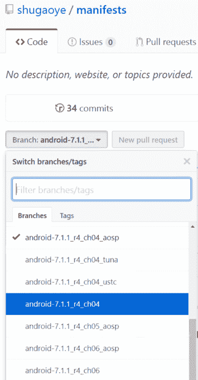
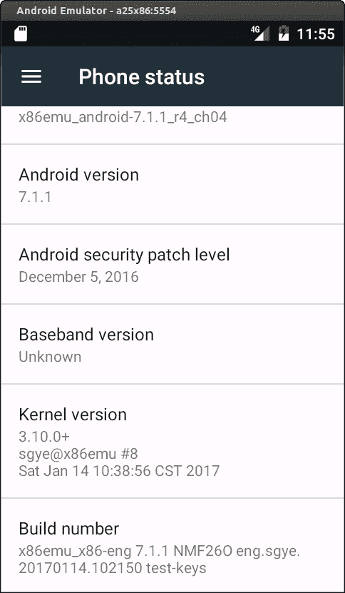
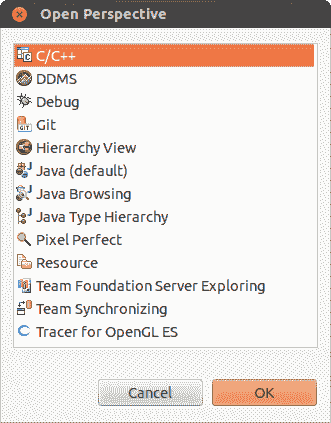
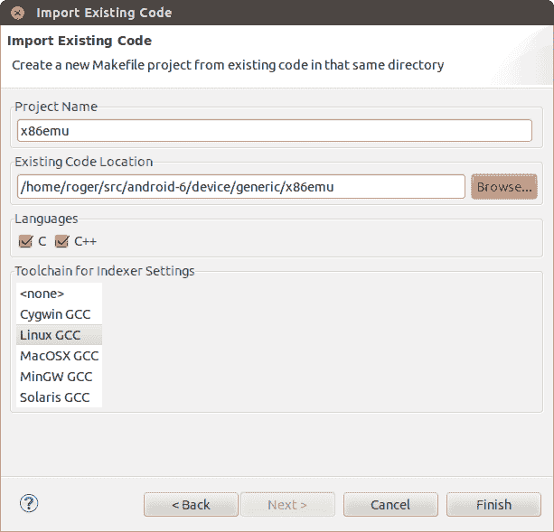
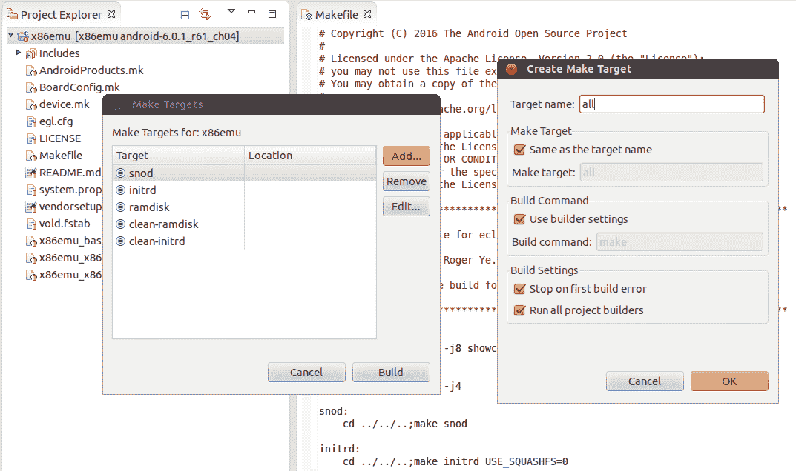

# 第四章：自定义 Android 模拟器

在上一章中，我们花了一些时间探索 Android 系统架构的细节。凭借我们对内核、HAL 和系统服务的了解，我们可以开始自己定制 Android 系统。在本章中，我们将涵盖以下主题：

+   为什么要自定义 Android 模拟器？

+   创建新的 x86emu 设备

+   构建和测试新的 x86emu 设备

# 为什么要自定义 Android 模拟器

你可能想知道为什么我们想要自定义 Android 模拟器。谷歌已经在 Android SDK 中提供了它，我们无需任何额外努力就可以使用它。然而，作为一名开发者，你可能会发现它可能不足以满足你的期望。例如，在最新的 Android Studio 或 SDK 版本中，推荐开发者使用英特尔 x86 模拟器，因为它比 ARM 版本快得多。使用英特尔 x86 模拟器的一个问题是，许多带有原生代码的 Android 应用程序无法正常运行，因为这些应用程序没有内置 x86 原生库。

为了解决这个问题，我们可以将英特尔（Intel）的 Houdini 库集成到模拟器中。有了 Houdini 库，我们可以在英特尔 x86 平台上执行 ARM 原生代码。对于 Android 模拟器，另一个常见的请求是它不包括**谷歌移动服务**（**GMS**）。许多开发者假设设备上应该有 GMS 可用，因此开发应用程序。在接下来的几章中，我们将学习如何创建 x86emu 设备以自定义 Android 模拟器，这样我们就可以集成 Houdini 或启用 Wi-Fi 等附加硬件接口等组件。掌握了如何创建 x86emu 设备的知识，你可以创建自己的 Android 模拟器以满足你的需求。

我们总是尽量避免直接更改过多的 AOSP 代码。这是因为我们更改得越多，将其移植到最新版本的 Android 就越困难。谷歌不时地发布新的 Android 代码。有时，由于架构变化，新版本可能难以合并。

从本章到第七章，“在 Android 模拟器上启用 Wi-Fi”，我们将介绍一种通过最小更改 AOSP 源代码来定制现有设备的方法。从第八章，“在 VirtualBox 上创建自己的设备”到第十一章，“启用 VirtualBox 特定的硬件接口”，我们将讨论移植到新平台，我们必须直接更改 AOSP 代码。即使在那种情况下，我们仍然需要计划和考虑将合并努力到新的 Android 版本中。

# 理解构建层

AOSP 构建系统包括构建设备的抽象层。在理解这些层的理念之后，这将有助于我们理解设备各种 Makefile 之间的关系。在开始创建新设备时，总是好的参考以下 URL 的原始 Google 文档：[`source.android.com/source/add-device.html`](http://source.android.com/source/add-device.html)。

在本节中，我们将把之前 Google 文档中的信息应用到我们将要工作的特定 Android 模拟器虚拟硬件上。这样，我们可以根据之前 Google 文档中的通用指导创建所有设备特定的 Makefile。在整个从通用到具体的过程中，我们可以将面向对象概念中的继承应用到 Makefile 系统中。

设备构建系统中有三个层，**产品**、**板/设备**和**架构**。这些层可以被视为衡量产品特性的不同维度。每个层与其上面的层之间有一个一对多的关系，这在面向对象术语中类似于继承或组合关系。例如，一种硬件架构可以有多个板，每个板可以有多个产品。我们将在本章后面创建新设备时看到这种方法是如何工作的。

下表是 AOSP 构建系统中使用的层列表。我是通过修改 Google 文档中的表格并添加针对我们将要工作的 x86emu 设备的特定注释来创建这个表格的。

| **层** | **描述** |
| --- | --- |
| 产品 | 产品层定义了发货产品的功能规范，例如要构建的模块、支持的地区以及各种地区的配置。换句话说，这是整体产品的名称。产品特定的变量在**产品定义 Makefile**中定义。一个产品可以继承自其他产品定义，这简化了维护。一个常见的方法是创建一个包含适用于所有产品的功能的基产品，然后基于该基产品创建产品变体。在本章中，我们继承自 AOSP 中 Android 模拟器的通用设备，以创建我们的 x86emu 设备。对于 x86emu 设备，我们还可以创建两个产品，它们仅通过其架构变体不同（我们可以为 x86 或 x86_64 有不同的构建）。 |
| 板/设备 | 板/设备层代表了设备上的物理塑料层（即，设备的设计）。例如，北美设备可能包括 QWERTY 键盘，而在法国销售的设备可能包括 AZERTY 键盘。这一层还代表了产品的裸机原理图。这包括板上的外围设备和它们的配置。在 x86emu 设备中，我们需要定义文件系统的尺寸、图形硬件和摄像头等。在第七章启用 Android 模拟器的 Wi-Fi 中，我们希望在模拟器中支持 Wi-Fi。我们需要在板配置文件中指定它。 |
| 架构 | 架构层描述了板上的处理器配置和**应用二进制接口**（**ABI**）。 |

# 构建变体

当为特定产品构建时，通常对最终发布构建进行一些小的变化是有用的。通过使用不同的构建变体，可以帮助产品开发周期中的不同各方。到目前为止，AOSP 主要有三种构建变体。**工程构建**是默认的，适合开发工作。在这种类型的构建中，产品安全策略没有完全执行，并且调试机制被打开。工程师使用工程构建测试和修复问题很容易。

第二种口味是**用户构建**，用于最终发布。所有调试机制都被关闭，产品安全策略被完全执行。第三种口味是**用户调试**，位于工程构建和用户构建之间。这种类型的构建可用于现场测试，这也被最终用户使用。

AOSP 构建中的所有组件都称为**模块**。在模块定义中，模块可以使用`LOCAL_MODULE_TAGS`指定标签，可以是`optional`（默认）、`debug`或`eng`的值之一或多个。通过标签，我们可以定义模块的用途。例如，所有调试工具都只包含在工程构建中。

如果一个模块没有指定标签（通过`LOCAL_MODULE_TAGS`），其标签默认为`optional`。一个`optional`模块只有在产品配置需要`PRODUCT_PACKAGES`时才会安装。我们通常在设备的 Makefile 中使用`PRODUCT_PACKAGES`变量来指定产品需要的包。这样，我们可以轻松定义只适用于特定构建的模块。

以下表格显示了在先前的 Google URL 中记录的 AOSP 定义的构建变体：

| **构建变体** | **描述** |
| --- | --- |

| `eng` | 这是默认口味：

+   安装带有标签`eng`和/或`debug`的模块

+   根据产品定义文件安装模块，以及带有标签的模块

+   `ro.secure=0`

+   `ro.debuggable=1`

+   `ro.kernel.android.checkjni=1`

+   默认启用`adb`

|

| `user` | 这是打算作为最终发布的口味：

+   安装标记为`user`的模块

+   根据产品定义文件安装模块，除了标记的模块。

+   `ro.secure=1`

+   `ro.debuggable=0`

+   默认禁用`adb`

|

| `userdebug` | 与`user`相同，除了：

+   也安装了标记为`debug`的模块

+   `ro.debuggable=1`

+   默认启用`adb`

|

# 创建一个新的 x86emu 设备

为了自定义 Android 模拟器，我们需要基于 Android 模拟器创建一个新设备，并在该新设备上进行定制。我们将从这个原始 AOSP 源代码开始工作。

# 从 AOSP 检出

如我之前所述，我会尽量避免对 AOSP 源代码进行不必要的修改。在本章中，为了设置构建环境，你可以检出 AOSP 源代码的`android-7.1.1_r4`版本，并将内核和 x86emu 源代码克隆到 AOSP 源代码树中，如下所示：

```kt
$ mkdir android-x86emu
$ cd android-x86emu
$ repo init -u https://android.googlesource.com/platform/manifest -b android-7.1.1_r4
$ repo sync
$ git clone https://github.com/shugaoye/goldfish.git -b android-7.1.1_r4_x86emu_ch04_r1 kernel
$ cd device/generic
$ git clone https://github.com/shugaoye/x86emu.git -b android-7.1.1_r4_x86emu_ch04_r1  

```

现在我们已经逐步检索了源代码。项目 x86emu 是我们本章创建的新设备，可以用于在接下来的几章中定制 Android 模拟器。goldfish 项目是我从 AOSP goldfish 内核分叉的内核：[`android.googlesource.com/kernel/goldfish/`](https://android.googlesource.com/kernel/goldfish/)。

`android-7.1.1_r4_x86emu_ch04_r1`标签是本章源代码发布的基线。本书中创建或更改的所有源代码都使用命名约定`{Android 版本}_{项目}_{章节号}_{发布号}`作为基线。以下是此命名约定的说明：

+   `Android version`是原始 AOSP 版本号

+   `project`可以是 x86emu 或 x86vbox

+   `chapter number`是我们为源代码创建基线所用的章节号

+   使用`release number`来表示发布次数

这些可以在本章的简单配置中工作。当我们使用来自多个来源的源代码时（如本书后面的章节中所述），这种方法就不够好了。我们将使用我们自己的清单文件来管理本书中的源代码。

# 从本地镜像检出

要使用我们自己的清单文件，我们可以使用本地镜像或远程仓库。如果我们使用本地镜像，我们必须稍微修改`android-7.1.1_r4`的`manifest.xml`以创建我们自己的。我们将`.repo/manifest.xml`复制到我们的`manifests/default.xml`并做出以下更改：

```kt
<?xml version="1.0" encoding="UTF-8"?> 
<manifest> 

 <remote  name="github" fetch="." /> 
  <remote  name="aosp" 
         fetch="../android" /> 
  <default revision="refs/tags/android-7.1.1_r4" 
           remote="aosp" 
           sync-j="4" /> 

 <!-- github/shugaoye --> <project path="kernel" name="goldfish"   
  remote="github" revision="refs/tags/
  android-7.1.1_r4_x86emu_ch04_r1" /> <project path="device/generic/x86emu" name="x86emu" remote="github"   
  revision="refs/tags/android-7.1.1_r4_x86emu_ch04_r1" /> <!-- AOSP --> 
  <project path="build" name="platform/build" groups="pdk" > 
    <copyfile src="img/root.mk" dest="Makefile" /> 
  </project> 
  <project path="abi/cpp" name="platform/abi/cpp" groups="pdk" /> 
... 
</manifest> 

```

此清单文件假设我们的本地镜像具有以下目录结构：

```kt
$ ls -F
android/  android-x86/  github/  

```

AOSP 镜像创建在`android`文件夹下。GitHub 镜像创建在`github`文件夹下。稍后我们还需要使用 android-x86 源代码。我们可以将其放在`android-x86`文件夹下。我们的清单文件存储在`github/manifests`中，前面的清单文件是`github/manifests/default.xml`。在此文件中，我们添加了额外的行以从 GitHub 检索 Android 内核和 x86emu 设备。

使用此清单，我们可以使用以下命令获取源代码：

```kt
$ mkdir android-x86emu
$ cd android-x86emu
$ repo init -u {your mirror URL}/github/manifests.git -b **android-7.1.1_r4_****ch04**
$ repo sync  

```

我们也可以直接使用我们自己的清单文件从远程仓库检索所有源代码。为此，我们需要稍微更改清单文件如下：

```kt
<?xml version="1.0" encoding="UTF-8"?> 
<manifest> 

  <remote  name="github" 
           fetch="." /> 

 <remote  name="aosp" 
 fetch="https://android.googlesource.com/" /> 
  <default revision="refs/tags/android-7.1.1_r4" 
           remote="aosp" 
           sync-c="true" 
           sync-j="1" /> 

  <!-- github/shugaoye --> 
  <project path="kernel" name="goldfish" remote="github" 
   revision="refs/tags/android-7.1.1_r4_x86emu_ch04_r1" /> 
  <project path="device/generic/x86emu" name="x86emu" remote="github" 
   revision="refs/tags/android-7.1.1_r4_x86emu_ch04_r1" /> 

  <!-- aosp --> 
  <project path="build" name="platform/build" groups="pdk,tradefed" > 
    <copyfile src="img/root.mk" dest="Makefile" /> 
  </project> 
... 

```

如你所见，我们更改了远程 `aosp` 的 URL，在本版本清单文件中使用绝对路径。要使用此修订版检出源代码，我们可以运行以下命令：

```kt
$ mkdir android-x86emu
$ cd android-x86emu
$ repo init -u https://github.com/shugaoye/manifests -b **android-7.1.1_r4_ch04_****aosp**
$ repo sync  

```

由于本书涉及多个仓库，我强烈建议你使用本地镜像。这可以使构建和调试过程更加高效。

也可以使用 `local_manifests` 来设置你的工作空间。你可以参考书中附录 B，*使用 Repo 本书中的 Repo*，在《Android 嵌入式编程》一书中。一个示例文件可以在[`github.com/shugaoye/build/blob/master/local_manifest.xml`](https://github.com/shugaoye/build/blob/master/local_manifest.xml)找到。

在这本书中，我使用分支来管理清单文件的不同版本源代码。为了创建章节中源代码的基线，我使用以下命名约定：

`{Android 版本}_{章节编号}_{远程（可选）}`

+   `Android 版本` 是原始 AOSP 版本号

+   `章节编号` 是我们为源代码创建基线的章节

+   `remote` 用于指示如何从远程仓库检出源代码

例如，从以下截图，我们可以看到分支 `android-7.1.1_r4_ch04` 用于从本地镜像检出第四章的源代码。分支 `android-7.1.1_r4_ch04_aosp` 用于从远程仓库检出第四章的源代码。由于我身处中国，我并不总是能访问 AOSP 源代码。我为第四章创建了修订版（`android-7.1.1_r4_ch04_tuna` 和 `android-7.1.1_r4_ch04_ustc`），以便从中国的 AOSP 镜像和 GitHub 检出源代码。你可以根据需要更改清单文件。



# 创建 x86emu 设备

在我们检出源代码后，我们可以查看如何在 `$AOSP/device` 文件夹中创建一个新的 x86emu 设备。`device` 文件夹中的层次结构是 `vendor-name/device-name` 格式。例如，三星的 Nexus S 可以在 `samsung/crespo` 文件夹中找到。Nexus S 的设备名称是 `crespo`。我们可以在一个公共文件夹 `generic` 下创建我们的设备，如下所示。我们设备的文件夹名称为 `generic*/*x86emu`：

```kt
$ cd device/generic 
$ mkdir x86emu 

```

这是本章中我们创建的项目，你可以在[`github.com/shugaoye/x86emu.git`](https://github.com/shugaoye/x86emu.git)找到源代码。

我们将在该文件夹中创建一个 Makefiles 列表来构建设备。参考上一节的构建层。以下是需要包含在设备骨架中的 Makefiles 列表：

+   `AndroidProducts.mk`：这是一个 Makefile，用于描述可以为该设备构建的各种产品

+   `BoardConfig.mk`：这是硬件板卡的板配置 Makefile。

+   `device.mk`：这是用于声明设备所需文件和模块的设备 Makefile。

+   `vendorsetup.sh`：这是一个可以用来将您的产品（一个 "lunch 组合"）以及通过破折号分隔的构建变体添加到构建中的 shell 脚本。

+   `{Product Makefile}.mk`：这是产品定义 Makefile，它用于根据设备创建特定的产品。

现在，我们可以根据前面的列表逐个创建我们设备的 Makefile。

# AndroidProducts.mk

我们将所有产品定义 Makefile 包含在这个文件中。AOSP 构建系统将开始使用此文件搜索所有产品定义。以下为 `AndroidProducts.mk` 的内容：

```kt
PRODUCT_MAKEFILES := \ 
    $(LOCAL_DIR)/x86emu_x86.mk \  
    $(LOCAL_DIR)/x86emu_x86_64.mk \  

```

如我们所见，我们为 x86 和 x86_64 构建定义了两个产品变体。

`x86emu_x86.mk` 和 `x86emu_x86_64.mk` 都非常相似。它们为 32 位和 64 位定义了相同的产品定义变量集。

下表比较了 32 位和 64 位构建的产品定义 Makefile：

| `x86emu_x86.mk` | `x86emu_x86_64.mk` |
| --- | --- |

|

```kt
$(call inherit-product, device/generic/x86emu/device.mk)
$(call inherit-product, $(SRC_TARGET_DIR)/product/full.mk)
# Overrides
PRODUCT_BRAND := x86emu_x86
PRODUCT_NAME := x86emu_x86
PRODUCT_DEVICE = x86emu
PRODUCT_MODEL := x86emu_x86_ch4
TARGET_ARCH := x86
TARGET_KERNEL_CONFIG := i386_ranchu_defconfig
$(call inherit-product, $(LOCAL_PATH)/x86emu_base.mk)

```

|

```kt
$(call inherit-product, device/generic/x86emu/device.mk)
$(call inherit-product, $(SRC_TARGET_DIR)/product/full_x86_64.mk)
# Overrides
PRODUCT_BRAND := x86emu_x86_64
PRODUCT_NAME := x86emu_x86_64
PRODUCT_DEVICE = x86emu
PRODUCT_MODEL := x86emu_x86_64_ch4
TARGET_SUPPORTS_32_BIT_APPS := true
TARGET_SUPPORTS_64_BIT_APPS := true
TARGET_ARCH := x86_64
TARGET_KERNEL_CONFIG := x86_64_ranchu_defconfig
$(call inherit-product, $(LOCAL_PATH)/x86emu_base.mk)

```

|

您可能会注意到，我们在开头首先继承了 32 位和 64 位的通用产品定义文件：

```kt
$(call inherit-product, $(SRC_TARGET_DIR)/product/full.mk) 

```

以及：

```kt
$(call inherit-product, $(SRC_TARGET_DIR)/product/full_x86_64.mk) 

```

AOSP 构建系统定义了许多通用产品定义。您可以在 `$AOSP/build/target/product` 找到它们：

```kt
$ ls build/target/product
AndroidProducts.mk      full_base.mk             sdk_base.mk
aosp_arm64.mk           full_base_telephony.mk   sdk_mips.mk
aosp_arm.mk             full_mips64.mk           sdk.mk
aosp_base.mk            full_mips.mk             sdk_phone_arm64.mk
aosp_base_telephony.mk  full.mk                  sdk_phone_armv7.mk
aosp_mips64.mk          full_x86_64.mk           sdk_phone_mips64.mk
aosp_mips.mk            full_x86.mk              sdk_phone_mips.mk
aosp_x86_64.mk          generic_armv5.mk         sdk_phone_x86_64.mk
aosp_x86.mk             generic_mips.mk          sdk_phone_x86.mk
base.mk                 generic.mk               sdk_x86_64.mk
core_64_bit.mk          generic_no_telephony.mk  sdk_x86.mk
core_base.mk            generic_x86.mk           security
core_minimal.mk         languages_full.mk        telephony.mk
core.mk                 languages_small.mk       vboot.mk
core_tiny.mk            locales_full.mk          verity.mk
embedded.mk             runtime_libart.mk
emulator.mk             sdk_arm64.mk  

```

之后，定义了一系列具有不同值的 product 定义变量 `PRODUCT_BRAND`、`PRODUCT_NAME`、`PRODUCT_DEVICE` 和 `PRODUCT_MODEL`。`TARGET_ARCH` 和 `TARGET_KERNEL_CONFIG` 也分别针对 32 位和 64 位进行定义。请注意 `PRODUCT_MODEL`。由于我们将在每个章节中更改 Makefile，在这本书中我们使用 `PRODUCT_MODEL` 来表示每个章节的构建。在本章中，我们将 `PRODUCT_MODEL` 定义为 `x86emu_x86_ch4` 以表示本章的构建。在文件末尾，我们还包含了一个通用的 `Makefile x86emu_base.mk`，用于 32 位和 64 位产品。此文件包括内核构建的额外配置：

```kt
TARGET_KERNEL_SOURCE := kernel 

PRODUCT_OUT ?= out/target/product/x86emu 

include $(TARGET_KERNEL_SOURCE)/AndroidKernel.mk 

# define build targets for kernel 
.PHONY: $(TARGET_PREBUILT_KERNEL) 

LOCAL_KERNEL := $(TARGET_PREBUILT_KERNEL) 

PRODUCT_COPY_FILES += \ 
     $(LOCAL_KERNEL):kernel \ 

```

内核构建通常不包括在 AOSP 构建中。您必须根据 Google 的说明单独构建它们。在这本书中，我们将内核构建集成到我们自己的 Makefile 中。`AndroidKernel.mk` Makefile 是基于高通内核源码的 Makefile 创建的，该源码位于 [`android.googlesource.com/kernel/msm/`](https://android.googlesource.com/kernel/msm/)。

在前面的 Makefile 中使用了许多产品定义变量。让我们回顾一下我们在这里使用的产品定义变量。请参阅 Google 文档以获取完整列表：

+   `PRODUCT_BRAND`：这是软件定制的品牌。我们将其定义为我们的设备名称。

+   `PRODUCT_NAME`：这是我们赋予设备的名称。在这本书中，我们将其设置为 `x86emu_x86`。它也是我们可以在 lunch 组合中选择的名称前缀，例如 `x86emu_x86-eng`。后缀是构建变体。

+   `PRODUCT_DEVICE`：实际产品的名称。`TARGET_DEVICE` 从这个变量派生。这也是构建系统用来定位 `BoardConfig.mk` 的板名。对于我们的设备，它是 x86emu，也是我们设备在 `$AOSP/device/generic/x86emu` 目录的名称。

+   `PRODUCT_MODEL`：这是我们在设置中的“型号”中可以看到的名称。如我之前所述，我们使用这个变量来区分本书中每个章节的构建。

+   `PRODUCT_OUT`：这是构建结果的输出文件夹。它与环境变量 `$OUT` 相同。

+   `PRODUCT_COPY_FILES`：这是我们希望复制到目标文件系统中的特定文件列表。单词列表看起来像 `source_path:destination_path`。在构建过程中，位于源路径的文件应该被复制到目标路径。

# BoardConfig.mk

`BoardConfig.mk` 定义了板级特定配置。我们在该文件中定义 CPU/ABI、目标架构、OpenGLES 配置等。我们还在该文件中定义了镜像文件的大小、格式等：

```kt
TARGET_NO_BOOTLOADER := true 
TARGET_NO_KERNEL := true 
TARGET_CPU_ABI := x86 
TARGET_ARCH := x86 
TARGET_ARCH_VARIANT := x86 
TARGET_PRELINK_MODULE := false 

# The IA emulator (qemu) uses the Goldfish devices 
HAVE_HTC_AUDIO_DRIVER := true 
BOARD_USES_GENERIC_AUDIO := true 

# no hardware camera 
USE_CAMERA_STUB := true 

# customize the malloced address to be 16-byte aligned 
BOARD_MALLOC_ALIGNMENT := 16 

# Enable dex-preoptimization to speed up the first boot sequence 
# of an SDK AVD. Note that this operation only works on Linux for now 
ifeq ($(HOST_OS),linux) 
WITH_DEXPREOPT := true 
endif 

# Build OpenGLES emulation host and guest libraries 
BUILD_EMULATOR_OPENGL := true 

# Build and enable the OpenGL ES View renderer. When running on the emulator, 
# the GLES renderer disables itself if host GL acceleration isn't available. 
USE_OPENGL_RENDERER := true 

TARGET_USERIMAGES_USE_EXT4 := true 
BOARD_SYSTEMIMAGE_PARTITION_SIZE := 1342177280 
BOARD_USERDATAIMAGE_PARTITION_SIZE := 576716800 
BOARD_CACHEIMAGE_PARTITION_SIZE := 69206016 
BOARD_CACHEIMAGE_FILE_SYSTEM_TYPE := ext4 
BOARD_FLASH_BLOCK_SIZE := 512 
TARGET_USERIMAGES_SPARSE_EXT_DISABLED := true 

BOARD_SEPOLICY_DIRS += \ 
        build/target/board/generic/sepolicy \ 
        build/target/board/generic_x86/sepolicy 

```

此文件是从预定义的 AOSP 板配置 `$AOSP/build/target/board/generic_x86/BoardConfig.mk` 复制过来的，并做了少量修改。

我们也可以直接使用系统定义的板级配置，并覆盖预定义变量，如下所示：

```kt
include $(SRC_TARGET_DIR)/board/generic_x86/BoardConfig.mk 

# 
# Overwrite predefined variables. 
# 

TARGET_USERIMAGES_USE_EXT4 := true 
BOARD_SYSTEMIMAGE_PARTITION_SIZE := 1610612736 
BOARD_USERDATAIMAGE_PARTITION_SIZE := 576716800 
BOARD_CACHEIMAGE_PARTITION_SIZE := 69206016 
BOARD_CACHEIMAGE_FILE_SYSTEM_TYPE := ext4 
BOARD_FLASH_BLOCK_SIZE := 512 
TARGET_USERIMAGES_SPARSE_EXT_DISABLED := true 

BOARD_KERNEL_CMDLINE += androidboot.selinux=permissive 

```

如果我们查看 `$AOSP/build/target/board/generic_x86` 文件夹，它包含了一些其他文件：

```kt
$ ls -F
BoardConfig.mk  device.mk  README.txt  sepolicy/  system.prop  

```

我们还需要将 `system.prop` 复制到我们的 `device` 文件夹中，因为这个文件定义了模拟器的 **Radio Interface Layer** （RIL）配置，如下所示：

```kt
rild.libpath=/system/lib/libreference-ril.so 
rild.libargs=-d /dev/ttyS0 

```

没有这个，您会发现数据连接在构建中无法正常工作。

# device.mk

您可能会注意到 `generic_x86` 文件夹中有一个 `device.mk` 文件。是的，我们可以直接重用该文件。以下是我们 `device.mk` 文件的内容：

```kt
$(call inherit-product, $(SRC_TARGET_DIR)/board/generic_x86/device.mk) 

```

如我们所见，在我们的 `device.mk` 文件中，我们只是简单地从 `generic_x86` 设备继承了通用的 `device.mk`。

我们可以查看 `generic_x86` 设备的 `device.mk` 文件如下：

```kt
PRODUCT_PROPERTY_OVERRIDES := \ 
    ro.ril.hsxpa=1 \ 
    ro.ril.gprsclass=10 \  
    ro.adb.qemud=1 

PRODUCT_COPY_FILES := \ 
device/generic/goldfish/data/etc/apns-conf.xml:system/etc/
apns-conf.xml \  
device/generic/goldfish/camera/media_profiles.xml:system/etc/
media_profiles.xml \  
frameworks/av/media/libstagefright/data/media_codecs_google_audio.xml:system/etc/media_codecs_google_audio.xml \  
frameworks/av/media/libstagefright/data/media_codecs_google_telephony.xml:system/etc/media_codecs_google_telephony.xml \ 
frameworks/av/media/libstagefright/data/media_codecs_google_video.xml:system/etc/media_codecs_google_video.xml \  
device/generic/goldfish/camera/media_codecs.xml:system/etc/media_codecs.xml 

PRODUCT_PACKAGES := \ 
    audio.primary.goldfish \ 
    vibrator.goldfish 

```

在之前的 `device.mk` 文件中，针对 `generic_x86` 设备，它覆盖了一些属性并将配置文件复制到 `system` 文件夹。它还包括 goldfish 设备的 HAL 层。

现在，我们可以使用以下命令将我们的设备构建添加到构建系统中：

```kt
$ add_lunch_combo <product_name>-<build_variant> 
$ lunch <product_name>-<build_variant> 

```

例如：

```kt
$ add_lunch_combo x86emu_x86-eng 
$ lunch x86emu_x86-eng 

```

要自动将其添加到构建系统中，我们可以添加一个脚本 `vendorsetup.sh`。在这个脚本中，我们可以为 `x86emu_x86` 创建所有构建变体：

```kt
for i in eng userdebug user; do 
        add_lunch_combo x86emu_x86-${i} 
done 

```

注意，本书中没有测试 x86emu 设备的 64 位构建。如果您想测试 64 位构建，您必须自行进行必要的更改。

在本节中，除了之前解释的产品级变量之外，还有针对目标设备和板级变量的变量。以下是在 `BoardConfig.mk`、`device.mk` 或产品定义 Makefiles 中定义的目标设备变量列表：

+   `TARGET_ARCH`: 这是指设备的架构。它通常是诸如 `arm`、`x86` 等之类的某种东西。

+   `TARGET_USERIMAGES_USE_EXT4`: 为了在 ext4 格式下构建文件系统，这个变量需要设置为 `true`。在 Android 4.4 之前的旧版本 Android 中，文件系统可以构建为 yaffs2 等其他格式。

+   `TARGET_KERNEL_SOURCE`: 这是内核源代码的路径。在我们的案例中，内核源代码可以在 `$AOSP/kernel` 找到。

+   `TARGET_KERNEL_CONFIG`: 我们用来构建内核源代码的内核配置文件。

以下是我们在本章中使用的一组板级变量列表：

+   `BOARD_SYSTEMIMAGE_PARTITION_SIZE`: 系统镜像文件系统分区的大小（`system.img`）

+   `BOARD_USERDATAIMAGE_PARTITION_SIZE`: 用户数据文件系统分区的大小（`userdata.img`）

+   `BOARD_CACHEIMAGE_FILE_SYSTEM_TYPE`: 缓存分区的文件系统格式

+   `BOARD_FLASH_BLOCK_SIZE`: 闪存设备的块大小

# 构建和测试 x86emu

一旦我们有了源代码，我们就可以在本节中开始构建和测试我们的 x86emu 设备。

# 构建 x86emu

在我们开始构建 x86emu 之前，让我们先快速了解一下 Android 构建系统。与其他基于 make 的构建系统相比，Android 构建系统不依赖于递归的 Makefiles。Android Makefiles 以 `.mk` 扩展名结尾；特定源目录的主要 Makefile 被命名为 `Android.mk`。构建系统从各个文件夹导入所有 `Android.mk` 以创建一个大的 Makefile 来启动构建，正如我们可以在以下代码片段中看到的那样：

```kt
$ make -j4 
============================================ 
PLATFORM_VERSION_CODENAME=REL 
PLATFORM_VERSION=7.1.1 
TARGET_PRODUCT=x86emu 
TARGET_BUILD_VARIANT=eng 
TARGET_BUILD_TYPE=release 
TARGET_BUILD_APPS= 
... 
HOST_BUILD_TYPE=release 
BUILD_ID=MOB30Z 
OUT_DIR=out 
============================================ 
including ./abi/cpp/Android.mk ... 
including ./art/Android.mk ... 
including ./bionic/Android.mk ... 
... 

```

在我们开始构建之前，我们必须首先设置构建环境。Android 构建系统提供了一个 `build/envsetup.sh` 脚本来设置构建环境。我们可以通过运行以下命令来设置构建环境：

```kt
$ source build/envsetup.sh  

```

之后，我们需要指定我们想要构建的目标。在 Android 构建系统的术语中，这被称为 lunch-combo。我们可以直接指定一个 lunch-combo：

```kt
$ lunch x86emu_x86-eng  

```

或者从菜单中选择它：

```kt
$ lunch

You're building on Linux

Lunch menu... pick a combo:
 1\. aosp_arm-eng
 2\. aosp_arm64-eng
 3\. aosp_mips-eng
 4\. aosp_mips64-eng
 5\. aosp_x86-eng
 6\. aosp_x86_64-eng
 7\. x86emu_x86-eng
 8\. x86emu_x86-userdebug
 9\. x86emu_x86-user

Which would you like? [aosp_arm-eng] 7

============================================
PLATFORM_VERSION_CODENAME=REL
PLATFORM_VERSION=7.1.1
TARGET_PRODUCT=x86emu_x86
TARGET_BUILD_VARIANT=eng
TARGET_BUILD_TYPE=release
TARGET_BUILD_APPS=
TARGET_ARCH=x86
TARGET_ARCH_VARIANT=x86
TARGET_CPU_VARIANT=
TARGET_2ND_ARCH=
TARGET_2ND_ARCH_VARIANT=
TARGET_2ND_CPU_VARIANT=
HOST_ARCH=x86_64
HOST_2ND_ARCH=x86
HOST_OS=linux
HOST_OS_EXTRA=Linux-4.2.0-27-generic-x86_64-with-Ubuntu-14.04-trusty
HOST_CROSS_OS=windows
HOST_CROSS_ARCH=x86
HOST_CROSS_2ND_ARCH=x86_64
HOST_BUILD_TYPE=release
BUILD_ID=NMF26O
OUT_DIR=out
============================================  

```

我们在第二章中学习了这一点，*设置开发环境*，当时我们构建了 Android 模拟器镜像。你可能注意到这里菜单项的差异在于，菜单包括了我们在本章中添加的设备配置。

我们在这里选择的 lunch-combo 是 `x86emu_x86-eng`。现在我们可以使用以下命令开始构建目标：

```kt
$ make -j4  

```

或者：

```kt
$ m -j4  

```

`-j4` 选项用于指定并发 make 会话的数量。它与你的系统上的 CPU 核心数相关，例如，在一个更强大的硬件平台上，你可能选择 `-j8`。在执行 `source build/envsetup.sh` 后，`m` 命令是可用的。它等同于 `croot; make -j4`。

如果你想在构建中看到实际的命令，你可以在命令行上使用 `showcommands` 选项：

```kt
$ make -j4 showcommands  

```

您可以使用其他常用的构建目标。以下是一些您可以在构建中参考的目标列表：

+   `make sdk`: 构建 SDK 中的工具（如 `adb`、`fastboot` 等）。

+   `make snod`: 从当前软件二进制文件构建系统镜像。

+   `make all`: 构建所有内容，无论是否包含在产品定义中。

+   `make clean`: 删除所有构建文件（为新构建做准备）。它与 `rm -rf out/<configuration>/` 相同。

+   `make modules`: 显示可以构建的子模块列表（所有 `LOCAL_MODULE` 定义列表）。

+   `make <local_module>`: 构建特定模块（请注意，这与目录名不同。这是`Android.mk`文件中的`LOCAL_MODULE`定义）。

+   `make clean-<local_module>`: 清理特定模块。

+   `make bootimage TARGET_PREBUILT_KERNEL=/path/to/bzImage`: 使用自定义 `bzImage` 创建新的引导镜像。

+   `make recoveryimage`: 在 `bootable/recovery/` 中构建恢复。

除了构建目标之外，还有一些辅助宏和函数在您源码 `envsetup.sh` 时被安装。您可以通过使用 `hmm` 命令来找出它们：

```kt
$ hmm
Invoke ". build/envsetup.sh" from your shell to add the following functions to your environment:
- lunch:   lunch <product_name>-<build_variant>
- tapas:   tapas [<App1> <App2> ...] [arm|x86|mips|armv5|arm64|x86_64|mips64] [eng|userdebug|user]
- croot:   Changes directory to the top of the tree.
- m:       Makes from the top of the tree.
- mm:      Builds all of the modules in the current directory, but not their dependencies.
- mmm:     Builds all of the modules in the supplied directories, but not their dependencies.
 To limit the modules being built use the syntax: mmm dir/:target1,target2.
- mma:     Builds all of the modules in the current directory, and their dependencies.
- mmma:    Builds all of the modules in the supplied directories, and their dependencies.
- cgrep:   Greps on all local C/C++ files.
- ggrep:   Greps on all local Gradle files.
- jgrep:   Greps on all local Java files.
- resgrep: Greps on all local res/*.xml files.
- mangrep: Greps on all local AndroidManifest.xml files.
- sepgrep: Greps on all local sepolicy files.
- sgrep:   Greps on all local source files.
- godir:   Go to the directory containing a file.

Environemnt options:
- SANITIZE_HOST: Set to 'true' to use ASAN for all host modules. Note that
 ASAN_OPTIONS=detect_leaks=0 will be set by default until 
 the build is leak-check clean.

Look at the source to view more functions. The complete list is:
addcompletions add_lunch_combo cgrep check_product check_variant choosecombo chooseproduct choosetype choosevariant core coredump_enable coredump_setup cproj croot findmakefile get_abs_build_var getbugreports get_build_var getdriver getlastscreenshot get_make_command getprebuilt getscreenshotpath getsdcardpath gettargetarch gettop ggrep godir hmm is isviewserverstarted jgrep key_back key_home key_menu lunch _lunch m make mangrep mgrep mm mma mmm mmma pez pid printconfig print_lunch_menu qpid rcgrep resgrep runhat runtest sepgrep set_java_home setpaths set_sequence_number set_stuff_for_environment settitle sgrep smoketest stacks startviewserver stopviewserver systemstack tapas tracedmdump treegrep  

```

在我们成功构建目标之后，我们可以在我们的案例中找到图像在 `out/target/product/x86emu`。我们还可以使用环境变量 `$OUT` 如下列出构建输出：

```kt
$ ls -F $OUT
Android-info.txt  dex_bootjars/             ramdisk.img           symbols/
boot.img          gen/                      ramdisk-recovery.img  system/
cache/            installed-files.txt       recovery/             system.img
cache.img         kernel                    recovery.id           userdata.img
clean_steps.mk    obj/                      recovery.img
data/             previous_build_config.mk  root/  

```

# 测试 x86emu

要测试 x86emu，我们可以使用在 第二章 “设置开发环境”中创建的 AVD `a25x86`。要使用我们自己的系统镜像，我们可以创建一个 shell 脚本 `~/bin/test-ch04.sh`，如下所示：

```kt
#!/bin/sh 

emulator @a25x86 -verbose -show-kernel -shell -selinux disabled -system ${OUT}/system.img -ramdisk ${OUT}/ramdisk.img -initdata ${OUT}/userdata.img -kernel ${OUT}/kernel 

```

您可以从前面的 shell 脚本中看到，用于启动 AVD `a25x86` 的 x86emu 图像。您需要设置您的 Android SDK 路径，以便您可以从 Android SDK 使用模拟器：

```kt
$ test-ch04.sh  

```

在您启动模拟器后，您可以转到设置 | 关于手机来检查构建信息，如下面的截图所示：



x86emu 构建信息

我们可以从“关于手机”中看到模型是 x86emu_android-7.1.1_r4_ch04，这是我们指定在产品定义 Makefile `x86emu_x86.mk` 中的。内核版本是 3.10.0，构建号是构建目标 x86emu_x86-eng。

如果您想测试本章中的图像而不设置自己的构建，您可以从 SourceForge 下载图像，网址为 [`sourceforge.net/projects/Android-system-programming/files/android-7/ch04/`](https://sourceforge.net/projects/Android-system-programming/files/android-7/ch04/)。

# 集成到 Eclipse

您可以使用**集成开发环境**（**IDE**）进行开发工作。可以将 AOSP 构建环境和选定的项目集成到您喜欢的 IDE 中。这里，我将使用 Eclipse 作为示例来解释如何在 Eclipse 中集成我们的项目和 AOSP 构建环境。请注意，由于 AOSP 只能在 Linux 环境中构建，因此这只能适用于 Linux。

尽管 Android Studio 是 Android 应用程序开发的默认 IDE，但我更喜欢 Eclipse 用于 Android 系统编程。使用 Eclipse，我们可以构建本地和 Java 应用程序。我们还可以在 Eclipse 项目中集成 AOSP 构建。

要设置 Eclipse 环境，您可以使用带有 ADT 插件的最新 Eclipse 或从 Google 下载旧的 ADT 套件。

对于 Linux x86 或 x86_64：

+   [`dl.google.com/Android/adt/adt-bundle-linux-x86_64-20140702.zip`](http://dl.google.com/Android/adt/adt-bundle-linux-x86_64-20140702.zip)

+   [`dl.google.com/Android/adt/adt-bundle-linux-x86-20140702.zip`](http://dl.google.com/Android/adt/adt-bundle-linux-x86-20140702.zip)

要使用 Eclipse，我们需要为我们的 x86emu 设备构建创建一个 Makefile，如下所示：

```kt
all: 
   cd ../../..;make -j8 showcommands 2>&1 | tee x86emu-`date +%Y%m%d`.txt 

x86emu: 
   cd ../../..;make -j4 

snod: 
   cd ../../..;make snod 

initrd: 
   cd ../../..;make initrd USE_SQUASHFS=0 

ramdisk: 
   cd ../../..;make -j4 

clean-ramdisk: 
   rm ${OUT}/ramdisk.img 
   rm -rf ${OUT}/root 

clean-initrd: 
   rm ${OUT}/initrd.img 
   rm -rf ${OUT}/installer 

```

我们需要定义一些可以在 Eclipse 中使用的构建目标。让我们看看如何将 x86emu 设备构建导入到 Eclipse 项目中。我们将使用 ADT 套件中的 Eclipse 来解释这个过程。为了将 AOSP 构建与 Eclipse 集成，我们必须在 AOSP 构建环境中启动 Eclipse。让我们按照以下步骤启动 Eclipse：

```kt
$ source build/envsetup.sh
$ lunch x86emu_x86-eng
${SDK_ROOT}/eclipse/eclipse  

```

在我们安装了 ADT 套件后，我们可以在 SDK 安装路径下的上一个目录中找到 Eclipse。在启动 Eclipse 后，选择 C/C++ 视图，如下所示：



选择 C/C++ 视图

我们可以通过选择“文件 | 导入... | 将现有代码作为 Makefile 项目导入”，将 x86emu 目录作为现有 Makefile 项目导入到 Eclipse 中，如下所示：


将现有代码作为 Makefile 项目导入

点击“下一步”，导航到 `$AOSP/device/generic/x86emu` 文件夹以导入源代码，如下所示：



导入现有代码

一旦我们导入项目，我们应该能够在项目资源管理器中看到 `x86emu` 文件夹下的所有文件都显示在右侧，正如我们在以下屏幕截图中所见。然后我们可以点击鼠标右键以查看项目的菜单列表，并选择“Make Targets | Create... | Create Make Target”。我们可以在目标名称字段中添加我们在 Makefile 中定义的构建目标。如果我们定义默认的构建目标 `all`，Eclipse 中的默认构建将触发我们的 `Makefile` 中的构建目标 `all`。这是我们为构建目标 `all` 定义的：

```kt
all: 
   cd ../../..;make -j8 showcommands 2>&1 | tee x86emu-`date +%Y%m%d`.txt 

```

我们在这里做的是在 AOSP 根目录启动 AOSP 构建。我们还使用命名约定 `x86emu-{$DATE}.txt` 为构建生成一个日志文件，构建完成后，您可以在 AOSP 根目录中找到这个日志文件。



在 Eclipse 中创建 Make Target

在我们创建所有构建目标后，我们可以通过选择“项目 | 构建所有”或使用快捷键 *Ctrl* + *B* 来启动构建，从 Eclipse 中构建 AOSP。

# 摘要

在本章中，我们学习了如何基于为 Intel x86 架构构建的 Android 模拟器创建一个新设备。我们解释了 AOSP 构建系统中的不同构建层以及这些构建层如何与设备的 Makefiles 关联。之后，我们构建并测试了新的 x86emu 设备。最后，为了提高开发工作的效率，我们将 AOSP 构建集成到了 Eclipse 中。在下一章中，我们将扩展 Android 模拟器以支持使用 x86emu 设备进行 ARM 二进制翻译。
