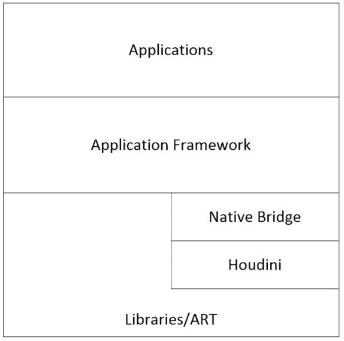
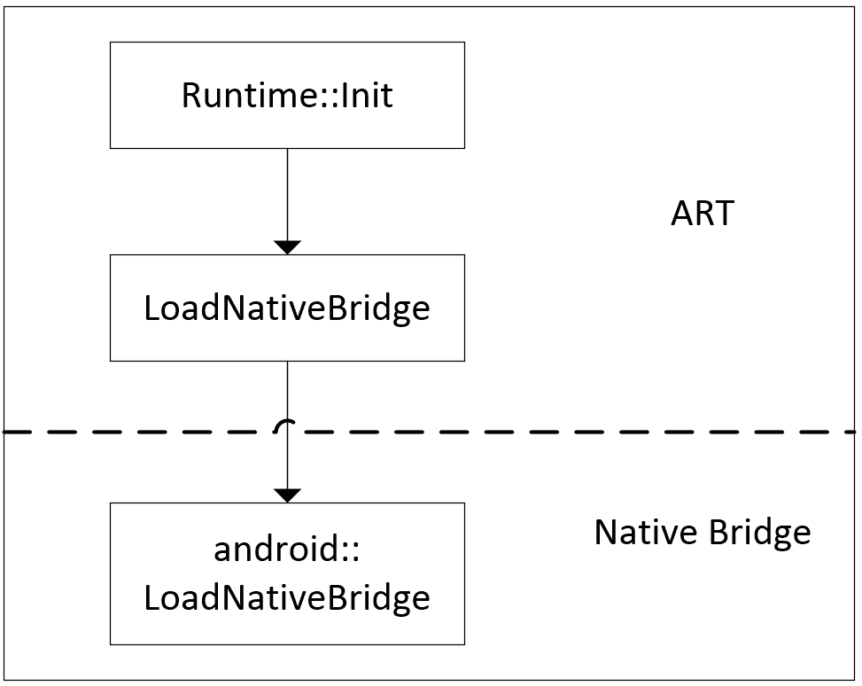
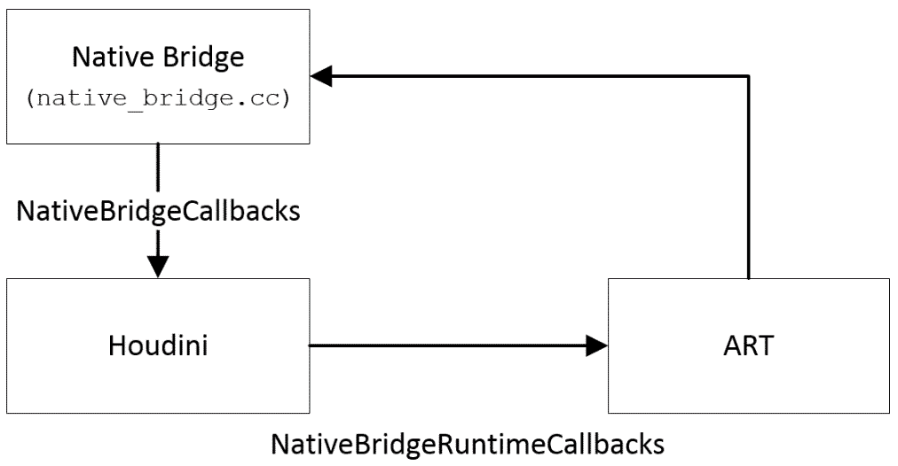
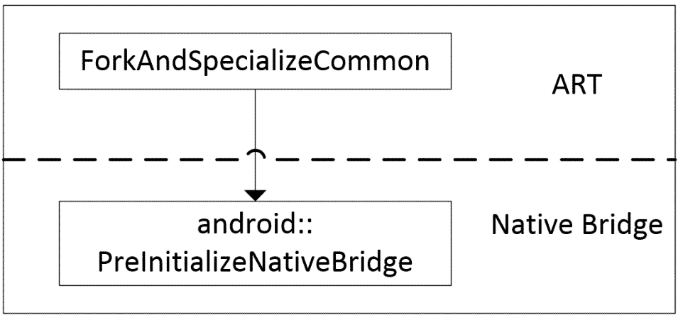
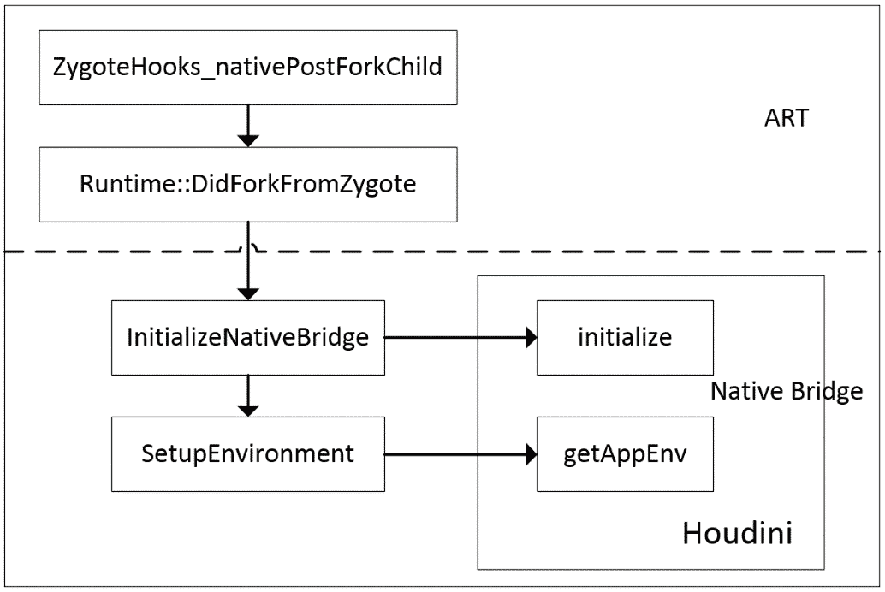
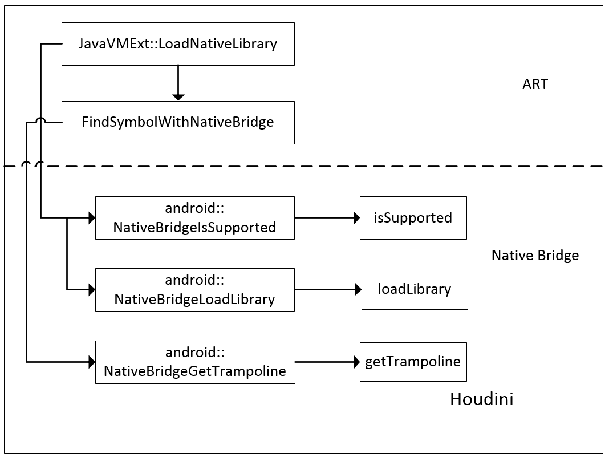
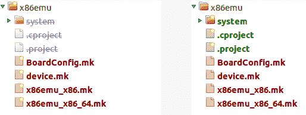

# 第五章：启用 ARM 翻译器和介绍原生桥接

我们在上一章中创建了一个新的 x86emu 设备。这是进一步定制和扩展的基础。正如我们所知，如果应用程序包含原生库，则无法在不同的处理器架构上运行。大多数 Android 应用程序是为 ARM 平台构建的。我们通常在 Intel x86 平台上运行这些带有 ARM 原生库的应用程序时遇到问题。然而，从 Android 5 及以上版本开始，Google 为此情况提供了一个名为 **原生桥接** 的解决方案。在本章中，我们将深入研究原生桥接和 Intel Houdini 的实现，以扩展 x86emu 以支持 ARM 原生应用程序。在本章中，我们将涵盖以下主题：

+   介绍原生桥接

+   将 Houdini 库集成到 x86emu 设备中

+   使用 Houdini 集成构建和测试图像

# 介绍原生桥接

在 Android 架构中，原生桥接作为 Android Runtime（**ART**）的一部分实现。它用于支持在不同的处理器架构上运行原生库，以便具有原生库的应用程序可以在更广泛的设备上运行。名为 Houdini 的 Intel ARM 翻译器是原生桥接的一个用例。在 ART 中，原生桥接的初始化有两个阶段：

1.  在第一阶段，原生桥接作为 ART 初始化过程的一部分加载到系统中。这对于所有应用程序都是常见的。

1.  在第二阶段，当启动具有原生库的应用程序时，它将从 Zygote 中 fork。此时，原生桥接将被初始化并准备好供应用程序使用。这是一个针对单个应用程序的特定过程。例如，如果没有使用原生库，则不会为此应用程序初始化原生桥接。

**Zygote** Android 在其核心有一个名为 Zygote 的进程，它在 init 时启动。此进程是一个“预热”进程，这意味着它是一个已经初始化并且所有核心库都已链接的进程。当你启动一个应用程序时，Zygote 将被 fork 以创建新的进程。真正的加速是通过*不*复制共享库来实现的。只有当新进程尝试修改它时，此内存才会被复制。这意味着所有核心库都可以存在于一个地方，因为它们是只读的。

当应用程序开始从不同的处理器架构加载原生库时，原生桥接将帮助解决此库的加载。例如，当我们加载 ARM 库在 Intel 的 x86 架构上时，原生桥接将使用 Houdini 在 Intel x86 环境中加载和执行此 ARM 库。



原生桥接在 Android 架构中

Native Bridge 作为 Android 系统库的一部分构建为一个`libnativebridge.so`共享库，如图所示。实现可以在`$AOSP/system/core/libnativebridge`中找到。在 Native Bridge 实现中，它在`native_bridge.cc`中定义了五个状态，如下所示：

```kt
enum class NativeBridgeState { 
  kNotSetup,               // Initial state. 
  kOpened,                 // After successful dlopen. 
  kPreInitialized,         // After successful pre-initialization. 
  kInitialized,            // After successful initialization. 
  kClosed                  // Closed or errors. 
}; 

```

当 Android 系统刚刚启动时，Native Bridge 处于`kNotSetup`状态。在 ART 的初始化过程中，它将被加载到系统中，阶段变为`kOpened`。

这两个状态是 Native Bridge 初始化的第一阶段。当用户启动带有本地库的应用程序时，系统将从 Zygote 中 fork 一个新的进程。此时，系统将为 Native Bridge 做一些预初始化工作，我们将在本章后面看到这一点。此时状态变为`kPreInitialized`。从 Zygote fork 进程后，Native Bridge 作为进程创建的一部分被初始化，其状态变为`kInitialized`。`kClosed`状态通常不使用，除非出现错误并且关闭 Native Bridge。这三个状态属于 Native Bridge 初始化的第二阶段。

在了解了 Android 系统架构中关于 Native Bridge 的概述之后，我们将不得不深入了解运行时使用的 Native Bridge 的每个阶段的细节。

# 将 Native Bridge 作为 ART 初始化的一部分设置起来

首先，让我们看看 Native Bridge 如何在系统中加载。Native Bridge 作为 ART 初始化的一部分被加载。如图所示，它包括从**ART**到**Native Bridge**实现的函数调用。在这个阶段结束时，**Native Bridge**的状态将被设置为`kOpened`。



加载 Native Bridge

当系统初始化 ART 时，会调用`Runtime::Init`函数。在`Runtime::Init`内部，会调用`LoadNativeBridge`函数来加载 Native Bridge 共享库。我们可以在下面的代码片段中看到这一点：

```kt
bool Runtime::Init(const RuntimeOptions& raw_options, bool ignore_unrecognized) { 
  ATRACE_BEGIN("Runtime::Init"); 
  CHECK_EQ(sysconf(_SC_PAGE_SIZE), kPageSize); 
  ... 
    std::string native_bridge_file_name = 
    runtime_options.ReleaseOrDefault(Opt::NativeBridge); 
    is_native_bridge_loaded_ = 
    LoadNativeBridge(native_bridge_file_name);  
   ... 
} 

```

这个`LoadNativeBridge`函数是 ART 的一部分，它在`native_bridge_art_interface.cc`文件中实现，如图所示。这个函数简单地调用在`android`命名空间中的另一个函数`android::LoadNativeBridge`，而它本身在`art`命名空间中。`android`命名空间中的函数是 Native Bridge 实现的一部分，如图所示，我们将在本章后面看到更多关于这一点。我们可以在下面的代码片段中看到`LoadNativeBridge`的实现：

```kt
static android::NativeBridgeRuntimeCallbacks native_bridge_art_callbacks_ { 
  GetMethodShorty, GetNativeMethodCount, GetNativeMethods 
}; 

bool LoadNativeBridge(std::string& native_bridge_library_filename) { 
  VLOG(startup) << "Runtime::Setup native bridge library: " 
      << (native_bridge_library_filename.empty() ? "(empty)" : 
      native_bridge_library_filename); 
  return android::LoadNativeBridge(native_bridge_library_filename.c_str(), 
                                   &native_bridge_art_callbacks_); 
} 

```

`android`命名空间中的`android::LoadNativeBridge`函数与`art`命名空间中的`art:LoadNativeBridge`函数相比，有一个额外的`native_bridge_art_callbacks`参数。这个参数的类型是`struct NativeBridgeRuntimeCallbacks`的指针，它在`native_bridge.h`中定义。在`struct NativeBridgeRuntimeCallbacks`中，它定义了以下三个回调方法：

```kt
// Runtime interfaces to native bridge. 
struct NativeBridgeRuntimeCallbacks { 
  // Get shorty of a Java method. The shorty is supposed to be   
  persistent in 
  // memory. 
  // 
  // Parameters: 
  //   env [IN] pointer to JNIenv. 
  //   mid [IN] Java methodID. 
  // Returns: 
  //   short descriptor for method. 
  const char* (*getMethodShorty)(JNIEnv* env, jmethodID mid); 

  // Get number of native methods for specified class. 
  // 
  // Parameters: 
  //   env [IN] pointer to JNIenv. 
  //   clazz [IN] Java class object. 
  // Returns: 
  //   number of native methods. 
  uint32_t (*getNativeMethodCount)(JNIEnv* env, jclass clazz); 

  // Get at most 'method_count' native methods for specified class 
  'clazz'. 
  // Results are outputed 
  // via 'methods' [OUT]. The signature pointer in JNINativeMethod is 
  reused 
  // as the method shorty. 
  // 
  // Parameters: 
  //   env [IN] pointer to JNIenv. 
  //   clazz [IN] Java class object. 
  //   methods [OUT] array of method with the name, shorty, and fnPtr. 
  //   method_count [IN] max number of elements in methods. 
  // Returns: 
  //   number of method it actually wrote to methods. 
  uint32_t (*getNativeMethods)(JNIEnv* env, jclass clazz, 
  JNINativeMethod* methods, uint32_t method_count); 
}; 

```

这些作为 ART 一部分的三个回调函数在`native_bridge_art_interface.cc`文件中实现。这些回调函数为原生方法调用 JNI 原生函数提供了一种方式。我们将在稍后看到这种回调数据结构是如何传递给实际的 Native Bridge 实现的。在我们的例子中，实际的实现是 Houdini 库。

`native_bridge.h`文件定义了另一个回调函数数据结构，`NativeBridgeCallbacks`，它用作其实际实现的 Native Bridge 接口。在我们的例子中，这个实现是 Houdini 库。Houdini 库需要实现这些回调函数并将指针传递给 Native Bridge，以便 ART 可以使用它们。以下图显示了这两组回调函数之间的关系：



ART、Native Bridge 和 Houdini

在前面的图中，我们可以看到**ART**调用**Native Bridge**函数来加载和初始化**Native Bridge**模块。**Native Bridge**模块调用由**Houdini**注册的回调函数来处理所有 ARM 原生二进制翻译。在**Native Bridge**初始化期间，**NativeBridgeRuntimeCallbacks**传递给**Houdini**库，以便**Houdini**库中的方法可以调用 JNI 原生函数。

现在我们来看看`android::LoadNativeBridge`的实现：

```kt
bool LoadNativeBridge(const char* nb_library_filename, 
          const NativeBridgeRuntimeCallbacks* runtime_cbs) { 

  if (state != NativeBridgeState::kNotSetup) { 
    // Setup has been called before. Ignore this call. 
    if (nb_library_filename != nullptr) { 
         ALOGW("Called LoadNativeBridge for an already set up native  
           bridge. State is %s.", GetNativeBridgeStateString(state)); 
    } 
    had_error = true; 
    return false; 
  } 

  if (nb_library_filename == nullptr || *nb_library_filename == 0) 
  { 
    CloseNativeBridge(false); 
    return false; 
  } else { 
    if (!NativeBridgeNameAcceptable(nb_library_filename)) { 
      CloseNativeBridge(true); 
    } else { 
      // Try to open the library. 
      void* handle = dlopen(nb_library_filename, RTLD_LAZY); 
      if (handle != nullptr) { 
        callbacks = 
            reinterpret_cast<NativeBridgeCallbacks*>(dlsym(handle, 
            kNativeBridgeInterfaceSymbol)); 
        if (callbacks != nullptr) { 
          if (VersionCheck(callbacks)) { 
            // Store the handle for later. 
            native_bridge_handle = handle; 
          } else { 
            callbacks = nullptr; 
            dlclose(handle); 
            ALOGW("Unsupported native bridge interface."); 
          } 
        } else { 
          dlclose(handle); 
        } 
      } 

      if (callbacks == nullptr) { 
        CloseNativeBridge(true); 
      } else { 
        runtime_callbacks = runtime_cbs; 
        state = NativeBridgeState::kOpened; 
      } 
    } 
    return state == NativeBridgeState::kOpened; 
  } 
} 

```

从前面的代码片段中我们可以看到，`android::LoadNativeBridge`首先检查状态。它应该处于`kNotSetup`状态。否则，它将报告错误并返回。

为了方便起见，在接下来的几段中，我们将把 Android 命名空间中的函数称为`LoadNativeBridge`，而不是`android::LoadNativeBridge`。将要讨论的文件可以在以下位置找到：

`$AOSP/art/runtime/runtime.c`

`$AOSP/art/runtime/native_bridge_art_interface.c`

`$AOSP/system/core/libnativebridge/native_bridge.cc`

之后，它将检查第一个参数是否为`NULL`以及文件名是否可以使用。如果一切正常，它将通过`dlopen`使用文件名`nb_library_filename`打开库。

那么`nb_library_filename`文件名的内容是什么呢？从`Runtime::Init`函数中我们可以看到，`LoadNativeBridge`的第一个参数使用`Opt::NativeBridge`属性初始化：

```kt
std::string native_bridge_file_name = runtime_options.ReleaseOrDefault(Opt::NativeBridge); 

```

这个属性是从默认属性`ro.dalvik.vm.native.bridge`初始化的，该属性定义在 Android 系统的`default.prop`文件中。这是在`AndroidRuntime::startVm`函数中完成的，如以下片段所示。此函数定义在`$AOSP/frameworks/base/core/jni/AndroidRuntime.cpp`文件中：

```kt
int AndroidRuntime::startVm(JavaVM** pJavaVM, JNIEnv** pEnv, bool zygote) 
{ 
... 
    // Native bridge library. "0" means that native bridge is disabled. 
    property_get("ro.dalvik.vm.native.bridge", propBuf, ""); 
    if (propBuf[0] == '\0') { 
        ALOGW("ro.dalvik.vm.native.bridge is not expected to be 
          empty"); 
    } else if (strcmp(propBuf, "0") != 0) { 
        snprintf(nativeBridgeLibrary, sizeof("-XX:NativeBridge=") + 
        PROPERTY_VALUE_MAX, "-XX:NativeBridge=%s", propBuf); 
        addOption(nativeBridgeLibrary); 
    } 
... 
} 

```

当启用原生桥接时，`ro.dalvik.vm.native.bridge` 属性通常包含一个共享库文件名。在我们的例子中，对于英特尔设备是 `libhoudini.so`，对于 Android-x86 是 `libnb.so`。如果禁用原生桥接，其值是 0。一旦库加载成功，它将使用 `kNativeBridgeInterfaceSymbol` 符号来获取内存位置，并将位置转换为 `NativeBridgeCallbacks` 的指针。这意味着 Houdini 库提供了一个 `NativeBridgeCallbacks` 的实现。让我们看看 `NativeBridgeCallbacks` 中都有什么：

```kt
struct NativeBridgeCallbacks { 
  uint32_t version; 
  bool (*initialize)(const NativeBridgeRuntimeCallbacks*   
       runtime_cbs, const char* private_dir, const char*  
       instruction_set); 
  void* (*loadLibrary)(const char* libpath, int flag); 
  void* (*getTrampoline)(void* handle, const char* name, const  
        char* shorty, uint32_t len); 
  bool (*isSupported)(const char* libpath); 
  const struct NativeBridgeRuntimeValues* (*getAppEnv)(const char*  
       instruction_set); 
  bool (*isCompatibleWith)(uint32_t bridge_version); 
  NativeBridgeSignalHandlerFn (*getSignalHandler)(int signal); 
}; 

```

从前面的代码片段中，我们可以看到 `NativeBridgeCallbacks` 包含一个变量和七个回调函数：

+   `version`：这是接口的版本号。到目前为止，有两个版本。版本 1 定义了前五个回调函数，版本 2 增加了另外两个新函数，我们很快就会看到。

+   `initialize`：这个函数初始化 Native Bridge 的一个实例。Native Bridge 的内部实现必须确保多线程安全，并且 Native Bridge 只初始化一次。

+   `loadLibrary`：这个函数加载 Native Bridge 支持的共享库。

+   `getTrampoline`：这个函数获取指定原生方法的 Native Bridge 跳转函数。

+   `isSupported`：这个函数检查 Native Bridge 的实例是否有效，以及它是否为 Native Bridge 支持的 ABI。

在版本 2 中，增加了以下两个函数：

+   `isCompatibleWith`：这个函数检查桥接是否与给定的库版本兼容。桥接可能决定不向前或向后兼容，此时 `libnativebridge` 将停止使用它。

+   `getSignalHandler`：一个回调函数，用于检索指定信号的 Native Bridge 信号处理器。运行时会确保在运行时自己的处理器之后、所有链式处理器之前调用信号处理器。原生桥接不应尝试自行安装处理器，因为这可能导致循环。

现在我们已经完成了 Native Bridge 初始化的第一阶段。从前面的列表中我们可以看到，Native Bridge 在 ART 启动时加载。在这个阶段，初始化不是进程特定的。库名在 `ro.dalvik.vm.native.bridge` 属性中定义。在我们的例子中，ART 通过在 `libnativebridge.so` 中定义的 `LoadNativeBridge` 函数加载 `libhoudini.so` 库。一旦 Native Bridge 加载成功，状态设置为 `kOpened`。

# 预初始化 Native Bridge

在 Native Bridge 初始化的第二阶段，它变得与进程相关。Android 应用可以通过 Native Bridge 在不同于当前设备处理器架构的情况下加载本地库。其他两个状态，`kPreInitialized` 和 `kInitialized`，与 Android 应用程序的创建有关，因为我们知道在 Android 中所有应用程序都是从 Zygote 分叉出来的。让我们首先看看 Native Bridge 的预初始化，如下面的图所示：



Native Bridge 的预初始化

在创建应用程序的过程中，会调用 `ForkAndSpecializeCommon` 函数。Native Bridge 的预初始化就在这个函数中完成。这个函数定义在 `$AOSP/frameworks/base/core/jni/com_android_internal_os_Zygote.cpp` 文件中：

```kt
static pid_t ForkAndSpecializeCommon(JNIEnv* env, uid_t uid, gid_t 
    gid, jintArray javaGids, jint debug_flags, jobjectArray 
    javaRlimits, jlong permittedCapabilities, jlong 
    effectiveCapabilities, jint mount_external, jstring 
    java_se_info, jstring java_se_name, bool is_system_server,  
    jintArray fdsToClose, jstring instructionSet, jstring dataDir) { 
      SetSigChldHandler(); 

#ifdef ENABLE_SCHED_BOOST 
  SetForkLoad(true); 
#endif 
... 
  pid_t pid = fork(); 

  if (pid == 0) { 
    // The child process. 
... 
    bool use_native_bridge = !is_system_server && (instructionSet != 
    NULL) && android::NativeBridgeAvailable(); 
    if (use_native_bridge) { 
      ScopedUtfChars isa_string(env, instructionSet); 
      use_native_bridge = 
      android::NeedsNativeBridge(isa_string.c_str()); 
    } 
    if (use_native_bridge && dataDir == NULL) { 
      use_native_bridge = false; 
      ALOGW("Native bridge will not be used because dataDir == NULL."); 
    } 

    if (!MountEmulatedStorage(uid, mount_external, use_native_bridge)) { 
      ALOGW("Failed to mount emulated storage: %s", strerror(errno)); 
      if (errno == ENOTCONN || errno == EROFS) { 
      } else { 
        RuntimeAbort(env, __LINE__, "Cannot continue without emulated 
        storage"); 
      } 
    } 

    if (!is_system_server) { 
        int rc = createProcessGroup(uid, getpid()); 
        if (rc != 0) { 
            if (rc == -EROFS) { 
                ALOGW("createProcessGroup failed, kernel missing 
                CONFIG_CGROUP_CPUACCT?"); 
            } else { 
                ALOGE("createProcessGroup(%d, %d) failed: %s", uid, 
                pid, strerror(-rc)); 
            } 
        } 
    } 

    SetGids(env, javaGids); 

    SetRLimits(env, javaRlimits); 

    if (use_native_bridge) { 
      ScopedUtfChars isa_string(env, instructionSet); 
      ScopedUtfChars data_dir(env, dataDir); 
      android::PreInitializeNativeBridge(data_dir.c_str(), 
      isa_string.c_str()); 
    } 
... 
    env->CallStaticVoidMethod(gZygoteClass, 
           gCallPostForkChildHooks,  
           debug_flags, is_system_server ? NULL : instructionSet);  
... 
  } else if (pid > 0) { 
    // the parent process 

#ifdef ENABLE_SCHED_BOOST 
    // unset scheduler knob 
    SetForkLoad(false); 
#endif 

  } 
  return pid; 
} 

```

在这个 `ForkAndSpecializeCommon` 函数中，它检查当前进程是否不是 SystemServer 进程，以及 Native Bridge 是否准备好使用。之后，它调用 `NeedsNativeBridge` 函数来检查当前进程是否需要使用 Native Bridge：

```kt
bool NeedsNativeBridge(const char* instruction_set) { 
  if (instruction_set == nullptr) { 
    ALOGE("Null instruction set in NeedsNativeBridge."); 
    return false; 
  } 
  return strncmp(instruction_set, kRuntimeISA,  
               strlen(kRuntimeISA) + 1) != 0; 
} 

```

`NeedsNativeBridge` 函数将 `instruction_set` 与当前 Android 平台的指令集进行比较。如果这两个指令集不同，那么我们需要使用 Native Bridge；否则，我们不需要。`NeedsNativeBridge` 函数在 `native_bridge.cc` 文件中实现。

如果应用程序需要 Native Bridge，那么 `PreInitializeNativeBridge` 函数将被调用，该函数也实现于 `native_bridge.cc`，并带有两个参数，`app_data_dir_in` 和 `instruction_set`：

```kt
bool PreInitializeNativeBridge(const char* app_data_dir_in,  
     const char* instruction_set) { 
  if (state != NativeBridgeState::kOpened) { 
    ALOGE("Invalid state: native bridge is expected to be opened."); 
    CloseNativeBridge(true); 
    return false; 
  } 

  if (app_data_dir_in == nullptr) { 
    ALOGE("Application private directory cannot be null."); 
    CloseNativeBridge(true); 
    return false; 
  } 

  const size_t len = strlen(app_data_dir_in) +  
                    strlen(kCodeCacheDir) + 2; // '\0' + '/' 
  app_code_cache_dir = new char[len]; 
  snprintf(app_code_cache_dir, len, "%s/%s", app_data_dir_in,  
  kCodeCacheDir); 

 state = NativeBridgeState::kPreInitialized; 

#ifndef __APPLE__ 
  if (instruction_set == nullptr) { 
    return true; 
  } 
  size_t isa_len = strlen(instruction_set); 
  if (isa_len > 10) { 
    ALOGW("Instruction set %s is malformed, must be less than or equal 
    to 10 characters.", instruction_set); 
    return true; 
  } 

  char cpuinfo_path[1024]; 

#if defined(__ANDROID__) 
  snprintf(cpuinfo_path, sizeof(cpuinfo_path), "/system/lib" 
#ifdef __LP64__ 
      "64" 
#endif  // __LP64__ 
      "/%s/cpuinfo", instruction_set); 
#else   // !__ANDROID__ 
  snprintf(cpuinfo_path, sizeof(cpuinfo_path), "./cpuinfo"); 
#endif 

  // Bind-mount. 
  if (TEMP_FAILURE_RETRY(mount(cpuinfo_path, 
                               "/proc/cpuinfo", 
                               nullptr, 
                               MS_BIND, 
                               nullptr)) == -1) { 
    ALOGW("Failed to bind-mount %s as /proc/cpuinfo: %s", cpuinfo_path, 
    strerror(errno)); 
  } 
#else  // __APPLE__ 
  UNUSED(instruction_set); 
  ALOGW("Mac OS does not support bind-mounting. Host simulation of 
  native bridge impossible."); 
#endif 

  return true; 
} 

```

从前面的代码片段中，我们可以看到它会检查状态是否为 `kOpened`。然后 `PreInitializeNativeBridge` 将执行两件事。首先，它使用第一个参数 `app_data_dir_in` 在应用程序的 `data` 文件夹中为 Native Bridge 创建一个代码缓存目录。接下来，它使用第二个参数 `instruction_set` 来查找 `/system/lib/<isa>/cpuinfo` 路径，并将其绑定挂载到 `/proc/cpuinfo`。如果设备上可用 Houdini，你可以在 `system` 文件夹中找到 `/system/lib/arm/cpuinfo` 文件。一旦完成前面的两项任务，Native Bridge 的状态将被设置为 `kPreInitialized`。

# 初始化 Native Bridge

状态变为 `kPreInitialized` 后，新的 Android 应用程序将在 `ForkAndSpecializeCommon` 函数中继续创建。在这个函数的末尾，它通过一个全局变量 `gCallPostForkChildHooks` 调用一个已注册的 `callPostForkChildHooks` 函数。调用栈最终会进入 `ZygoteHooks_nativePostForkChild` 函数，这是 `postForkChild` Java 方法的 JNI 实现。`postForkChild` 函数在每次分叉后由 Zygote 在子进程中调用。以下表格是对调用栈的总结：

| **函数** | **类** | **语言** |
| --- | --- | --- |
| `ForkAndSpecializeCommon` |  | C++ |
| `gCallPostForkChildHooks` |  | C++ |
| `callPostForkChildHooks` | Zygote | Java |
| `postForkChild` | ZygoteHooks | Java |
| `ZygoteHooks_nativePostForkChild` | JNI (postForkChild) | C++ |

`ZygoteHooks_nativePostForkChild` 函数在 `$AOSP/ art/runtime/native/dalvik_system_ZygotHooks.cc` 文件中实现。`DidForkFromZygote` 函数在 `$AOSP/art/runtime/runtime.cc` 文件中实现。

以下图表是涉及 Native Bridge 初始化第二阶段函数的总结。请注意，我们现在处于子进程中。我们可以看到，**ART** 中的 **Runtime::DidForkFromZygote** 函数将调用以下 Native Bridge 接口函数：**InitializeNativeBridge** 和 **SetupEnvironment**。Native Bridge 接口函数最终将调用 Houdini 库中注册的回调函数。



Native Bridge 的初始化

让我们看看 `postForkChild` 的 JNI 实现：

```kt
static void ZygoteHooks_nativePostForkChild(JNIEnv* env,  
    jclass, jlong token, jint debug_flags,  
    jstring instruction_set) { 
... 
  if (instruction_set != nullptr) { 
    ScopedUtfChars isa_string(env, instruction_set); 
    InstructionSet isa = 
    GetInstructionSetFromString(isa_string.c_str()); 
    Runtime::NativeBridgeAction action = 
    Runtime::NativeBridgeAction::kUnload; 
    if (isa != kNone && isa != kRuntimeISA) { 
      action = Runtime::NativeBridgeAction::kInitialize; 
    } 
    Runtime::Current()->DidForkFromZygote(env, action, 
    isa_string.c_str()); 
  } else { 
    Runtime::Current()->DidForkFromZygote(env, 
    Runtime::NativeBridgeAction::kUnload, nullptr); 
  } 
} 

```

在这里，它再次检查指令集以决定我们是否需要为应用程序使用 Native Bridge。然后它调用 `Runtime::DidForkFromZygote` 函数以在新进程中初始化 Native Bridge：

```kt
void Runtime::DidForkFromZygote(JNIEnv* env,  
    NativeBridgeAction action, const char* isa) { 
  is_zygote_ = false; 

  if (is_native_bridge_loaded_) { 
    switch (action) { 
      case NativeBridgeAction::kUnload: 
        UnloadNativeBridge(); 
        is_native_bridge_loaded_ = false; 
        break; 

      case NativeBridgeAction::kInitialize: 
 InitializeNativeBridge(env, isa); 
        break; 
    } 
  } 
... 
} 

```

正如我们所见，`Runtime::DidForkFromZygote` 根据操作调用 `InitializeNativeBridge`。现在让我们深入了解 `InitializeNativeBridge` 函数，该函数在 `native_bridge.cc` 中实现：

```kt
bool InitializeNativeBridge(JNIEnv* env,  
    const char* instruction_set) { 

  if (state == NativeBridgeState::kPreInitialized) { 
    // Check for code cache: if it doesn't exist try to create it. 
    struct stat st; 
    if (stat(app_code_cache_dir, &st) == -1) { 
      if (errno == ENOENT) { 
        if (mkdir(app_code_cache_dir, S_IRWXU | S_IRWXG | S_IXOTH) 
        == -1) { 
          ALOGW("Cannot create code cache directory %s: %s.", 
          app_code_cache_dir, strerror(errno)); 
          ReleaseAppCodeCacheDir(); 
        } 
      } else { 
        ALOGW("Cannot stat code cache directory %s: %s.", 
        app_code_cache_dir, strerror(errno)); 
        ReleaseAppCodeCacheDir(); 
      } 
    } else if (!S_ISDIR(st.st_mode)) { 
      ALOGW("Code cache is not a directory %s.", app_code_cache_dir); 
      ReleaseAppCodeCacheDir(); 
    } 

    if (state == NativeBridgeState::kPreInitialized) { 
      if (callbacks->initialize(runtime_callbacks, app_code_cache_dir, 
      instruction_set)) { 
        SetupEnvironment(callbacks, env, instruction_set); 
        state = NativeBridgeState::kInitialized; 
        ReleaseAppCodeCacheDir(); 
      } else { 
        // Unload the library. 
        dlclose(native_bridge_handle); 
        CloseNativeBridge(true); 
      } 
    } 
  } else { 
    CloseNativeBridge(true); 
  } 

  return state == NativeBridgeState::kInitialized; 
} 

```

在 `InitializeNativeBridge` 函数中，它首先创建代码缓存的文件夹。然后，它调用由我们案例中的 Houdini 库实现的 `initialize` 函数。

在英特尔设备上，共享库是 `libhoudini.so`。如果您在英特尔设备上运行 Android-x86，共享库是 `libnb.so`。我们将在本章后面讨论 `libnb.so`。

之后，它会在 `native_bridge.cc` 中调用另一个 `SetupEnvironment` 函数，为当前应用程序中的 Native Bridge 设置环境。最后，它将状态设置为 `kInitialized`。现在 Native Bridge 已准备好供当前应用程序使用。

# 加载本地库

一旦 Native Bridge 准备好使用，我们可以看看当应用程序在不同的处理器架构中加载本地库时会发生什么。

我们知道，如果我们在一个共享库中实现原生方法，我们需要实现一个 `JNI_OnLoad` 入口点，用于注册原生方法。Java 代码需要调用 `System.load` 或 `System.loadLibrary` 来加载这个共享库。在以下表中，这是从 `System.loadLibrary` 到 `JNI_OnLoad` 的调用栈：

| **函数** | **类** | **语言** |
| --- | --- | --- |
| `System.loadLibrary` | Runtime | Java |
| `doLoad` | Runtime | Java |
| `nativeLoad` | Runtime | JNI |
| `Runtime_nativeLoad` | Runtime | C++ |
| `LoadNativeLibrary` | JavaVMExt | C++ |
| `JNI_OnLoad` |  | C++ |

让我们深入了解`JavaVMExt::LoadNativeLibrary`的细节。此函数定义在`$AOSP/art/runtime/jni_internal.cc`中。以下图是`JavaVMExt::LoadNativeLibrary`与 Native Bridge 相关部分：



加载本地库

当 Android 应用程序加载本地库时，会调用此函数。通常，我们在这里指的是相同处理器架构下的本地库。通过 Native Bridge，我们也可以使用此函数加载支持的不同处理器架构的本地库：

```kt
bool JavaVMExt::LoadNativeLibrary(JNIEnv* env,  
    const std::string& path, jobject class_loader,  
    std::string* error_msg) { 
... 
  const char* path_str = path.empty() ? nullptr : path.c_str(); 
  void* handle = dlopen(path_str, RTLD_NOW); 
  bool needs_native_bridge = false; 
  if (handle == nullptr) { 
    if (android::NativeBridgeIsSupported(path_str)) { 
      handle = android::NativeBridgeLoadLibrary(path_str, RTLD_NOW); 
      needs_native_bridge = true; 
    } 
  } 
... 
  bool was_successful = false; 
  void* sym; 
  if (needs_native_bridge) { 
    library->SetNeedsNativeBridge(); 
 sym = library->FindSymbolWithNativeBridge("JNI_OnLoad", nullptr); 
  } else { 
    sym = dlsym(handle, "JNI_OnLoad"); 
  } 
... 
    typedef int (*JNI_OnLoadFn)(JavaVM*, void*); 
    JNI_OnLoadFn jni_on_load = reinterpret_cast<JNI_OnLoadFn>(sym); 
 int version = (*jni_on_load)(this, nullptr);  
... 
} 

```

`LoadNativeLibrary`函数首先调用`dlopen`来加载共享库。如果它是在不同处理器架构上的共享库，例如在 Intel x86 平台上的 ARM 库，`dlopen`调用应该失败。在这种情况下，它将尝试使用 Native Bridge 而不是返回错误来重新加载库。

要使用 Native Bridge，它首先调用`NativeBridgeIsSupported`函数来检查 Native Bridge 是否受支持。`NativeBridgeIsSupported`函数调用 Houdini 回调函数`isSupported`来检查给定的共享库是否可以通过 Native Bridge 支持：

```kt
bool NativeBridgeIsSupported(const char* libpath) { 
  if (NativeBridgeInitialized()) { 
    return callbacks->isSupported(libpath); 
  } 
  return false; 
} 

```

如果库可以通过 Native Bridge 支持，`LoadNativeLibrary`将调用另一个 Native Bridge 函数，`android::NativeBridgeLoadLibrary`来加载库：

```kt
void* NativeBridgeLoadLibrary(const char* libpath, int flag) { 
  if (NativeBridgeInitialized()) { 
    return callbacks->loadLibrary(libpath, flag); 
  } 
  return nullptr; 
} 

```

Native Bridge 的`NativeBridgeLoadLibrary`函数将调用 Houdini 回调函数`loadLibrary`来加载库。本地库加载成功后，库中的`JNI_OnLoad`入口点将被找到，系统将调用它来注册本地库注册的本地方法。对于正常的本地库，系统函数`dlsym`用于获取`JNI_OnLoad`方法，但`FindSymbolWithNativeBridge`函数用于从 Houdini 库中获取`JNI_OnLoad`：

```kt
void* FindSymbolWithNativeBridge(const std::string& symbol_name, 
const char* shorty) { 
    CHECK(NeedsNativeBridge()); 

    uint32_t len = 0; 
    return android::NativeBridgeGetTrampoline(handle_,  
    symbol_name.c_str(), shorty, len); 
} 

```

`FindSymbolWithNativeBridge`调用`NativeBridgeGetTrampoline` Native Bridge 函数，而`NativeBridgeGetTrampoline`调用`getTrampoline` Houdini 回调函数来完成实际工作：

```kt
void* NativeBridgeGetTrampoline(void* handle, const char* name, 
const char* shorty, uint32_t len) { 
  if (NativeBridgeInitialized()) { 
    return callbacks->getTrampoline(handle, name, shorty, len); 
  } 
  return nullptr; 
} 

```

从前面的分析中，我们可以看出 Houdini 使用的 ARM 翻译库在 Android 中通过 Native Bridge 支持 ARM 二进制翻译。Houdini 库与系统之间的接口是两套回调函数。在`NativeBridgeCallbacks`中定义的回调函数被系统用来对 ARM 本地库进行函数调用，而定义在`NativeBridgeRuntimeCallbacks`中的回调函数可以被 Houdini 库中的函数用来调用系统中的 JNI 函数。

# 将 Houdini 集成到 x86emu 设备中

本章的目标是在 Android 模拟器中支持 Houdini ARM 二进制翻译。在了解 Native Bridge 的内部原理之后，它是 Houdini 库的基础，我们可以着手为我们的 x86emu 设备提供 Houdini 支持。

由于 Houdini 库是英特尔专有库，因此它不可公开获取。对于那些想要将 Houdini 添加到新设备（如不受英特尔支持的 Android 模拟器）的人，唯一可能的方法是从受支持的设备复制 Houdini 库并将其添加到不受支持的设备。

幸运的是，开源项目 Android-x86 为任何英特尔设备提供了对 Houdini 的基本支持，我们可以将其作为本书的参考。在本章中，我们将基于 Android-x86 项目将 Houdini 添加到 Android 模拟器。

# 修改 x86emu 构建配置

在新设备上支持 Houdini 的基本步骤是：

+   根据我们在 第四章，*自定义 Android 模拟器* 中 *为什么要自定义 Android 模拟器？* 部分讨论的内容，更改设备配置

+   将适合版本的 Houdini 库复制到 `system` 文件夹

要处理前两个步骤，我们首先从修改 x86emu 设备配置开始。我们将为此使用 第四章，*自定义 Android 模拟器* 中的源代码作为基准，并在其基础上进行修改。这也是本书大多数章节中我们将采用的方法。我们将根据每个主题最简单的代码库进行独立修改。我的意思是，第四章，*自定义 Android 模拟器* 中 x86emu 的源代码是这个设备的最简单代码库。

既然我们已经有了一份 x86emu 的 AOSP 源代码的工作副本，我们可以在一个新分支中为本章进行修改：

```kt
$ cd device/generic/x86emu
$ git checkout android-7.1.1_r4_x86emu_ch04_r1
$ git branch android-7.1.1_r4_ch05
$ git checkout android-7.1.1_r4_ch05  

```

我为每个章节创建了一个标签，我们可以将其作为新开发的起点。`android-7.1.1_r4_x86emu_ch04_r1` 标签是 第四章，*自定义 Android 模拟器* 的基准。从前面的命令中，我们创建了一个新的分支，`android-7.1.1_r4_ch05`，用于本章的开发工作。我没有将开发分支推送到 GitHub，但我将所有标签推送到 GitHub。在我们完成本章的所有更改后，我们将为这一章创建一个新的标签，`android-7.1.1_r4_x86emu_ch05_r1`。

在我们完成所有修改后，我们还需要更新清单文件，以便我们可以有一个清单来下载本章的代码。我不用标签，而是用分支来管理清单。本章清单的分支是 `android-7.1.1_r4_ch05_aosp`。我们可以使用以下命令下载以下内容的源代码：

```kt
$ repo init -u https://github.com/shugaoye/manifests -b android-7.1.1_r4_ch05_aosp
$ repo sync

```

如果你已按照我们在 第二章，*设置开发环境* 中讨论的方式设置了本地镜像，你可以按照以下方式检出源代码：

```kt
$ repo init -u {your local mirror}/github/manifests.git -b android-7.1.1_r4_ch05
$ repo sync  

```

你需要为你的本地镜像创建一个 `android-7.1.1_r4_ch05` 分支，它引用了 `android-7.1.1_r4_ch05_aosp` 分支。

使用前面的清单创建源代码的工作副本后，我们可以查看 `.repo/manifest.xml` 文件：

```kt
<?xml version="1.0" encoding="UTF-8"?> 
<manifest> 

  <remote  name="github" 
           fetch="." /> 

  <remote  name="aosp" 
           fetch="https://android.googlesource.com/" /> 
  <default revision="refs/tags/android-7.1.1_r4" 
           remote="aosp" 
           sync-c="true" 
           sync-j="1" /> 

  <!-- github/shugaoye --> 
  <project path="kernel" name="goldfish" remote="github"   
  revision="refs/tags/android-7.1.1_r4_x86emu_ch05_r1" /> 
  <project path="device/generic/common" name="device_generic_common" 
   groups="pdk" 
  remote="github" revision="refs/tags/android-7.1.1_r4_x86emu_ch05_r1" /> 
  <project path="device/generic/goldfish" 
  name="device_generic_goldfish" 
  remote="github" groups="pdk" revision="refs/tags/android- 
  7.1.1_r4_x86emu_ch05_r1" /> 
  <project path="device/generic/x86emu" name="x86emu" remote="github" 
  revision="refs/tags/android-7.1.1_r4_x86emu_ch05_r1" /> 

  <!-- aosp --> 
  <project path="build" name="platform/build" groups="pdk,tradefed" > 
    <copyfile src="img/root.mk" dest="Makefile" /> 
... 
</manifest> 

```

在前面的清单文件中，我们使用 `android-7.1.1_r4_x86emu_ch05_r1` 标签标记所有不在 AOSP 项目中的项目。`device/generic/common` 项目是从 Android-x86 复制的，而 `device/generic/goldfish` 项目是从 AOSP 复制的。除了 `kernel` 和 `device/generic/x86emu`，这些是我们本章需要更改的两个项目。

# 扩展 x86emu 设备

一旦我们对源代码配置的所有更改都完成了，我们现在就可以开始扩展 x86emu 设备以支持 Houdini。我们需要做出哪些更改？由于我在解释之前已经做了所有更改，让我们使用一个工具来比较 第四章 中 *自定义 Android 模拟器* 和本章代码的源代码之间的差异。



支持 Houdini 的更改

如前一个截图所示，我们添加了一个 `system` 文件夹，并修改了四个 Makefile。我们可以忽略 `x86emu_x86_64.mk` Makefile，因为我们不会在本书中讨论 64 位构建。`x86emu_x86_64.mk` 的更改与 `x86emu_x86.mk` 的更改类似，所以我们省去了重复讨论类似内容的麻烦。你自己启用 x86emu 的 64 位构建不会是一个很大的工作量。其他两个文件，`.cproject` 和 `.project`，是由于 Eclipse 集成而生成的，我们也可以忽略它们。让我们逐一查看 `BoardConfig.mk`、`x86emu_x86.mk` 和 `device.mk`。

# 对 BoardConfig.mk 的更改

在板配置文件中，我们需要将 ARM 指令集添加到 CPU ABI 列表中，以便程序可以检测对 ARM 指令集的支持，如下所示：

```kt
... 
# houdini 
# Native Bridge ABI List 
NATIVE_BRIDGE_ABI_LIST_32_BIT := armeabi-v7a armeabi 
NATIVE_BRIDGE_ABI_LIST_64_BIT := arm64-v8a 
TARGET_CPU_ABI_LIST_32_BIT := $(TARGET_CPU_ABI) $(TARGET_CPU_ABI2) $(NATIVE_BRIDGE_ABI_LIST_32_BIT) 
TARGET_CPU_ABI_LIST := $(TARGET_CPU_ABI_LIST_32_BIT) 

BUILD_ARM_FOR_X86 := $(WITH_NATIVE_BRIDGE) 
... 

```

你可能已经注意到了 `BUILD_ARM_FOR_X86` 宏。这个宏被 Android-x86 Houdini 支持使用，我们将在稍后讨论它。

# 对 x86emu_x86.mk 的更改

在产品定义的 Makefile 中，`x86emu_x86.mk`，我们将 `persist.sys.nativebridge` 属性设置为 `1`。然后我们将 `$AOSP/device/generic/x86emu/system` 文件夹下的所有文件复制到 `$OUT/system` 映像中。`$AOSP/device/generic/x86emu/system/lib/arm` 文件夹下的所有文件都是 Houdini 库的副本：

```kt
... 
PRODUCT_PROPERTY_OVERRIDES := \ 
    persist.sys.nativebridge=1 \ 

NB_PATH := $(LOCAL_PATH) 
NB_LIB_PATH := system/lib 
NB_ARM_PATH := $(NB_LIB_PATH)/arm 
NB_NBLIB_PATH := $(NB_ARM_PATH)/nb 
NB_BIN_PATH := system/bin 

PRODUCT_COPY_FILES += $(foreach LIB, $(filter-out nb liblog_legacy.so libbinder_legacy.so,\  
      $(notdir $(wildcard $(NB_PATH)/$(NB_ARM_PATH)/*))), $(NB_PATH)/$(NB_ARM_PATH)/$(LIB):$(NB_ARM_PATH)/$(LIB):intel) 
PRODUCT_COPY_FILES += $(foreach NB, $(filter-out libbinder_legacy.so, $(notdir $(wildcard $(NB_PATH)/$(NB_NBLIB_PATH)/*))),\  
      $(NB_PATH)/$(NB_NBLIB_PATH)/$(NB):$(NB_NBLIB_PATH)/$(NB):intel) 
... 

```

# 对 device.mk 的更改

在设备 Makefile `device.mk` 中，我们只添加了一行来包含另一个 Makefile，`nativebridge.mk`，在 `device/generic/common/nativebridge` 目录下。正如我们在源配置章节中讨论的那样，我们使用 Android-x86 的版本来支持 Houdini 集成。我们将在下一节分析 `nativebridge.mk` Makefile：

```kt
... 
# Get native bridge settings 
$(call inherit-product-if-exists,device/generic/common/nativebridge/nativebridge.mk) 
... 

```

# 使用 Android-x86 实现

由于我们使用 Android-x86 项目的 Houdini 支持，我们可以看到我们只需要对 x86emu Makefile 进行非常小的修改。

现在让我们看看 Android-x86 中的 `nativebridge.mk`：

```kt
# Enable native bridge 
WITH_NATIVE_BRIDGE := true 

# Native Bridge ABI List 
NATIVE_BRIDGE_ABI_LIST_32_BIT := armeabi-v7a armeabi 
NATIVE_BRIDGE_ABI_LIST_64_BIT := arm64-v8a 

LOCAL_SRC_FILES := bin/enable_nativebridge 

PRODUCT_COPY_FILES := $(foreach f,$(LOCAL_SRC_FILES),$(LOCAL_PATH)/$(f):system/$(f)) 

PRODUCT_PROPERTY_OVERRIDES := \ 
    ro.dalvik.vm.isa.arm=x86 \ 
    ro.enable.native.bridge.exec=1 \  

ifeq ($(TARGET_SUPPORTS_64_BIT_APPS),true) 
PRODUCT_PROPERTY_OVERRIDES += \ 
    ro.dalvik.vm.isa.arm64=x86_64 \ 
    ro.enable.native.bridge.exec64=1 
endif 

PRODUCT_DEFAULT_PROPERTY_OVERRIDES := ro.dalvik.vm.native.bridge=libnb.so 

PRODUCT_PACKAGES := libnb 

$(call inherit-product-if-exists,vendor/intel/houdini/houdini.mk) 

```

`nativebridge.mk` 首先将 `enable_nativebridge` 脚本复制到 `system` 文件夹。之后，它设置 `ro.dalvik.vm.isa.arm` 和 `ro.enable.native.bridge.exec` 属性。这两个属性将被添加到系统镜像中的 `system/build.prop` 文件中。它还设置了默认属性 `ro.dalvik.vm.native.bridge` 为 `libnb.so`。此属性由 ART 用于查找 Houdini 库。Android-x86 使用 `libnb.so` 库而不是所有支持英特尔设备都使用的 `libhoudini.so`。`libnb.so` 库是 `libhoudini.so` 的包装器。由于我们使用 `libnb.so` 作为 ARM 二进制翻译库，我们需要将此包添加到构建中。

# 分析 libnb.so

由于 `libnb.so` 库是 Android-x86 中 Native Bridge 支持的关键起点，我们现在将深入探讨其细节。构建 `libnb.so` 的 Makefile 可以在 `device/generic/common/nativebridge/Android.mk` 中找到。`libnb.so` 的源代码仅包含一个文件，即 `libnb.cpp`，如下所示：

```kt
#define LOG_TAG "libnb" 

#include <dlfcn.h> 
#include <cutils/log.h> 
#include <cutils/properties.h> 
#include "nativebridge/native_bridge.h" 

namespace android { 

static void *native_handle = nullptr; 

static NativeBridgeCallbacks *get_callbacks() 
{ 
    static NativeBridgeCallbacks *callbacks = nullptr; 

    if (!callbacks) { 
        const char *libnb = "/system/" 
        #ifdef __LP64__ 
                "lib64/arm64/" 
        #else 
                "lib/arm/" 
        #endif 
                "libhoudini.so"; 
        if (!native_handle) { 
            native_handle = dlopen(libnb, RTLD_LAZY); 
            if (!native_handle) { 
                ALOGE("Unable to open %s", libnb); 
                return nullptr; 
            } 
        } 
        callbacks = reinterpret_cast<NativeBridgeCallbacks *> 
        (dlsym(native_handle, "NativeBridgeItf")); 
    } 
    return callbacks; 
} 

// NativeBridgeCallbacks implementations 
static bool native_bridge2_initialize(const    
  NativeBridgeRuntimeCallbacks *art_cbs, const char  
  *app_code_cache_dir, const char *isa) 
{ 
    ALOGV("enter native_bridge2_initialize %s %s", 
    app_code_cache_dir, isa); 
    if (property_get_bool("persist.sys.nativebridge", 0)) { 
        if (NativeBridgeCallbacks *cb = get_callbacks()) { 
return cb->initialize(art_cbs, app_code_cache_dir, isa); 
        } 
    } else { 
        ALOGW("Native bridge is disabled"); 
    } 
    return false; 
} 

static void *native_bridge2_loadLibrary(const char *libpath, int flag) 
{ 
    ALOGV("enter native_bridge2_loadLibrary %s", libpath); 
    NativeBridgeCallbacks *cb = get_callbacks(); 
 return cb ? cb->loadLibrary(libpath, flag) : nullptr; 
} 

static void *native_bridge2_getTrampoline(void *handle,  
  const char *name, const char* shorty, uint32_t len) 
{ 
    ALOGV("enter native_bridge2_getTrampoline %s", name); 
    NativeBridgeCallbacks *cb = get_callbacks(); 
    return cb ? cb->getTrampoline(handle, name, shorty, len) 
    : nullptr; 
} 

static bool native_bridge2_isSupported(const char *libpath) 
{ 
    ALOGV("enter native_bridge2_isSupported %s", libpath); 
    NativeBridgeCallbacks *cb = get_callbacks(); 
    return cb ? cb->isSupported(libpath) : false; 
} 

static const struct NativeBridgeRuntimeValues *native_bridge2_getAppEnv(const char *abi) 
{ 
    ALOGV("enter native_bridge2_getAppEnv %s", abi); 
    NativeBridgeCallbacks *cb = get_callbacks(); 
    return cb ? cb->getAppEnv(abi) : nullptr; 
} 

static bool native_bridge2_is_compatible_compatible_with(uint32_t version) 
{ 
    // For testing, allow 1 and 2, but disallow 3+. 
    return version <= 2; 
} 

static NativeBridgeSignalHandlerFn native_bridge2_get_signal_handler(int signal) 
{ 
    ALOGV("enter native_bridge2_getAppEnv %d", signal); 
    NativeBridgeCallbacks *cb = get_callbacks(); 
    return cb ? cb->getSignalHandler(signal) : nullptr; 
} 

static void __attribute__ ((destructor)) on_dlclose() 
{ 
    if (native_handle) { 
        dlclose(native_handle); 
        native_handle = nullptr; 
    } 
} 

extern "C" { 

NativeBridgeCallbacks NativeBridgeItf = { 
    version: 2, 
    initialize: &native_bridge2_initialize, 
    loadLibrary: &native_bridge2_loadLibrary, 
    getTrampoline: &native_bridge2_getTrampoline, 
    isSupported: &native_bridge2_isSupported, 
    getAppEnv: &native_bridge2_getAppEnv, 
    isCompatibleWith: &native_bridge2_is_compatible_compatible_with, 
    getSignalHandler: &native_bridge2_get_signal_handler, 
}; 

} // extern "C" 
} // namespace android 

```

在 `libnb.cpp` 中，我们可以看到它加载了 `libhoudini.so` 库，这是英特尔提供的原始 Houdini 库，并且它只做了两个修改。在初始化之前，它检查 `persist.sys.nativebridge` 属性。其余的代码提供了一个 `NativeBridgeCallbacks` 的包装器，包装器函数直接调用 Houdini 库中的函数。

# 使用 binfmt_misc

到目前为止，我们所讨论的是如何在英特尔 x86 架构中加载 ARM 共享库。Houdini 还可以支持在英特尔设备上运行独立的 ARM 应用程序。为此，它使用了一种称为 `binfmt_misc` 的机制。`binfmt_misc` 是 Linux 内核的一种功能，允许识别任意可执行文件格式并将其传递给某些用户空间应用程序，例如模拟器和虚拟机。

根据 Linux 内核文档，此内核功能允许您通过在 shell 中简单地键入程序名称来调用几乎每个程序。例如，这包括编译的 Java (TM)、Python 或 Emacs。为了实现这一点，您必须告诉 `binfmt_misc` 应该使用哪个解释器调用哪个二进制文件。`binfmt_misc` 通过匹配您提供的魔字节序列（屏蔽指定的位）与文件开头的某些字节来识别二进制类型。`binfmt_misc` 还可以识别文件扩展名，如 `.com` 或 `.exe`。

要使用此方法，首先我们必须挂载 `binfmt_misc`：

```kt
$ mount binfmt_misc -t binfmt_misc /proc/sys/fs/binfmt_misc  

```

要注册新的二进制类型，我们必须设置一个看起来如下所示的字符串：

```kt
:name:type:offset:magic:mask:interpreter:flags  

```

然后我们需要将其添加到 `/proc/sys/fs/binfmt_misc/register`。

下面是这些字段的意义：

+   `name` 是一个标识符字符串。在 `/proc/sys/fs/binfmt_misc` 目录下将创建一个以该名称命名的新 `/proc` 文件。

+   `type` 是识别类型。它给出 `M` 表示 magic 和 `E` 表示扩展。

+   `offset` 是文件中 magic/mask 的偏移量，按字节计算。如果你省略它（即，你写入 `:name:type::magic...`），则默认为 0。

+   `magic` 是 `binfmt_misc` 匹配的字节序列。magic 字符串可能包含十六进制编码的字符，如 `\x0a` 或 `\xA4`。在 shell 环境中，你应该写 `\\x0a` 以防止 shell 吃掉你的 `\`。如果你选择了匹配的文件名扩展名，这是要识别的扩展名（不带 `.`，不允许 `\x0a` 特殊字符）。扩展名匹配是区分大小写的。

+   `mask` 是一个（可选，默认为所有 `0xff`）掩码。你可以通过提供一个类似于 magic 的字符串来屏蔽匹配的一些位。

+   `interpreter` 是应该用二进制文件作为第一个参数调用的程序（指定完整路径）。

+   `flags` 是一个可选字段，它控制解释器调用的几个方面。它是一个大写字母的字符串，每个字母控制一个特定的方面。

在 `nativebridge.mk` 中，它将 `enable_nativebridge` 脚本复制到 `system` 文件夹。此文件用于在 Android-x86 中启用 Houdini。在 Android-x86 中，Houdini 默认未启用。这可以通过在 Android-x86 设置应用中的选项随时打开。当然，这不在 AOSP 源代码中得到支持。当你打开 Android-x86 中的 Houdini 时，它会调用 `enable_nativebridge` 脚本。此脚本执行两件事：

1.  它从第三方项目仓库下载 Houdini 到本地仓库，并将其安装到 `/system/lib/arm` 系统目录中。它还设置 `persist.sys.nativebridge` 属性为 `1`。

1.  在此脚本的第二部分，它会在 `/proc` 目录中创建 `binfmt_misc` 文件。

我们不会直接使用 `enable_nativebridge` 脚本，但希望在系统启动时运行 `enable_nativebridge` 的第二部分。通过第二部分，Houdini 在 Android 模拟器中默认启用。这可以通过将 `enable_nativebridge` 的第二部分添加到 `device/generic/goldfish/init.goldfish.sh` 来完成。以下是我们添加到 `init.goldfish.sh` 结尾的代码片段。这是在系统启动时用于设置 Android 模拟器环境的脚本：

```kt
... 
# 
# Houdini integration (Native Bridge) 
# 
houdini_bin=0 
dest_dir=/system/lib$1/arm$1 
binfmt_misc_dir=/proc/sys/fs/binfmt_misc 

# if you don't see the files 'register' and 'status' in /proc/sys/fs/binfmt_misc 
# then run the following command: 
# mount -t binfmt_misc none /proc/sys/fs/binfmt_misc 

# this is to add the supported binary formats via binfmt_misc 

if [ ! -e $binfmt_misc_dir/register ]; then 
   mount -t binfmt_misc none $binfmt_misc_dir 
fi 

cd $binfmt_misc_dir 
if [ -e register ]; then 
   # register Houdini for arm binaries 
   if [ -z "$1" ]; then 
         echo ':arm_exe:M::\\x7f\\x45\\x4c\\x46\\x01\\x01\\x01\\x00\\x00\\x00\\x00\\x00\\x00\\x00\\x00\\x00\\x02\\x00\\x28::'"$dest_dir/houdini:P" > register 
         echo ':arm_dyn:M::\\x7f\\x45\\x4c\\x46\\x01\\x01\\x01\\x00\\x00\\x00\\x00\\x00\\x00\\x00\\x00\\x00\\x03\\x00\\x28::'"$dest_dir/houdini:P" > register 
   else 
         echo ':arm64_exe:M::\\x7f\\x45\\x4c\\x46\\x02\\x01\\x01\\x00\\x00\\x00\\x00\\x00\\x00\\x00\\x00\\x00\\x02\\x00\\xb7::'"$dest_dir/houdini64:P" > register 
         echo ':arm64_dyn:M::\\x7f\\x45\\x4c\\x46\\x02\\x01\\x01\\x00\\x00\\x00\\x00\\x00\\x00\\x00\\x00\\x00\\x03\\x00\\xb7::'"$dest_dir/houdini64:P" > register 
   fi 
   if [ -e arm${1}_exe ]; then 
         houdini_bin=1 
   fi 
else 
   log -pe -thoudini "No binfmt_misc support" 
fi 

if [ $houdini_bin -eq 0 ]; then 
   log -pe -thoudini "houdini$1 enabling failed!" 
else 
   log -pi -thoudini "houdini$1 enabled" 
fi 

[ "$(getprop ro.zygote)" = "zygote64_32" -a -z "$1" ] && exec $0 64 

```

在我们重新构建镜像并启动模拟器后，我们可以使用以下命令验证更改：

```kt
$ adb shell
root@x86emu:/ # ls /proc/sys/fs/binfmt_misc/ 
arm_dyn
arm_exe
register
status  

```

我们可以看到我们注册了两个 `binfmt_misc` 类型：`arm_dyn` 和 `arm_exe`。`/proc` 文件 `arm_dyn` 用于加载共享库，而 `arm_exe` 用于加载 ARM 可执行文件：

```kt
root@x86emu:/ # cat /proc/sys/fs/binfmt_misc/arm_exe 
enabled
interpreter /system/lib/arm/houdini
flags: P
offset 0
magic 7f454c46010101000000000000000000020028  

```

如果我们查看 `arm_exe` 的内容，从前面的输出中我们可以看到，`/system/lib/arm/houdini` 解释器用于解释 ARM 二进制文件。

# 构建和测试

我们已经对代码进行了所有更改，以启用 Houdini。我们可以使用以下命令构建系统镜像：

```kt
$ source build/envsetup.sh
$ lunch x86emu_x86-eng
$ m -j4  

```

在我们构建系统镜像之后，我们可以对其进行测试。当然，我们可以使用任何可以在 ARM 架构上运行的 Android 应用程序来测试镜像。然而，为了获取有关测试目标的详细信息，我们将使用两个单元测试应用程序来验证本章中的工作。第一个是一个独立的 ARM 应用程序，可以从命令行运行。第二个是一个仅针对 ARM 的 JNI 共享库的 Android 应用程序。本章中的 Android 模拟器镜像和测试二进制文件可以从 [`sourceforge.net/projects/android-system-programming/files/android-7/ch05/ch05.zip/download`](https://sourceforge.net/projects/android-system-programming/files/android-7/ch05/ch05.zip/download) 下载。

这两个测试应用程序的源代码托管在 GitHub 上。您可以从 [`github.com/shugaoye/asp-sample/tree/master/ch05`](https://github.com/shugaoye/asp-sample/tree/master/ch05) 获取源代码。

要构建测试应用程序，您需要同时拥有 Android SDK 和 NDK，这样您就可以构建 Android 应用程序和本地应用程序。

# 测试命令行应用程序

在您克隆了测试应用程序的先前 Git 仓库之后，您可以构建和测试它们。让我们首先测试命令行应用程序。这是一个非常简单的“hello world”应用程序，它将一行消息打印到标准输出，如下所示：

```kt
#include <stdio.h> 

void main() 
{ 
    printf("This is built using NDK r12.n"); 
} 

```

您可以在模拟器中按照以下方式构建和测试它：

```kt
$ cd ch05/test1
$ ./build.sh 
[armeabi-v7a] Install : ch05_test => libs/armeabi-v7a/ch05_test
$ file libs/armeabi-v7a/ch05_test
libs/armeabi-v7a/ch05_test: ELF 32-bit LSB  shared object, ARM, EABI5 version 1 (SYSV), dynamically linked (uses shared libs), BuildID[sha1]=b3cf0ae12c0d5b192053dc40c31f665196145039, stripped
$ adb push libs/armeabi-v7a/ch05_test /data/local/tmp
[100%] /data/local/tmp/ch05_test
$ adb shell
root@x86emu:/ # cd /data/local/tmp
127|root@x86emu:/data/local/tmp # ./ch05_test
This is built using NDK r12.  

```

在构建完成后，您可以使用 `file` 命令检查文件格式。您可以看到输出是一个 32 位的 ARM ELF 文件。您可以使用 `adb` 将此二进制文件推送到模拟器并运行它。您将看到它可以将输出消息正确地打印到标准输出。

# 测试 Android JNI 应用程序

接下来，让我们测试带有 ARM JNI 库的 Android 应用程序。

JNI 库位于 `ch05/test2/jni`。支持的处理器架构在 `Application.mk` 中定义如下：

```kt
# Build both ARMv5TE and ARMv7-A and x86 machine code. 
# armeabi armeabi-v7a  
APP_ABI := armeabi armeabi-v7a 
APP_PLATFORM := android-23 

```

我们可以看到我们为 `armeabi` 和 `armeabi-v7a` 构建了 JNI 库。让我们首先使用 NDK 构建 JNI 库：

```kt
$ cd ch05/test2/jni
$ ./build.sh
[armeabi] Install : libHelloJNI.so => libs/armeabi/libHelloJNI.so
[armeabi-v7a] Install: libHelloJNI.so => libs/armeabi-v7a/libHelloJNI.so  

```

在我们构建 JNI 库之后，我们可以将 Android 源代码导入到 Eclipse 或 Android Studio 中来构建应用程序本身。我们不会解释导入和构建 Android 应用程序的详细步骤。您可以通过阅读关于如何开发 Android 应用程序和如何开发 JNI 库的书籍来了解更多信息。我们在这里想要调查的是测试结果。在我们获得 APK 文件后，我们可以在模拟器中安装并运行它。同时，我们可以使用 logcat 捕获调试日志。以下是我环境的日志：

```kt
... 
10-02 00:44:57.871: I/ActivityManager(1527): START u0 {act=android.intent.action.MAIN cat=[android.intent.category.LAUNCHER] flg=0x10200000 cmp=fr.myrddin.hellojni/.HelloJNIActivity (has extras)} from uid 10008 on display 0 
10-02 00:44:57.900: I/ActivityManager(1527): Start proc 2652:fr.myrddin.hellojni/u0a53 for activity fr.myrddin.hellojni/.HelloJNIActivity 
10-02 00:44:57.902: I/art(2652): Late-enabling JIT 
10-02 00:44:57.903: D/houdini(2652): [2652] Initialize library(version: 6.1.1a_x.48413 RELEASE)... successfully. 
10-02 00:44:57.907: W/art(2652): Unexpected CPU variant for X86 using defaults: x86 
10-02 00:44:57.907: I/art(2652): JIT created with code_cache_capacity=2MB compile_threshold=1000 
10-02 00:44:58.546: W/art(1527): Long monitor contention event with owner method=int com.android.server.wm.WindowManagerService.relayoutWindow(com.android.server.wm.Session, android.view.IWindow, int, android.view.WindowManager$LayoutParams, int, int, int, int, android.graphics.Rect, android.graphics.Rect, android.graphics.Rect, android.graphics.Rect, android.graphics.Rect, android.graphics.Rect, android.content.res.Configuration, android.view.Surface) from WindowManagerService.java:3104 waiters=0 for 632ms 
10-02 00:44:58.580: W/dex2oat(2667): Unexpected CPU variant for X86 using defaults: x86 
10-02 00:44:58.581: W/dex2oat(2667): Mismatch between dex2oat instruction set features (ISA: X86 Feature string: smp,-ssse3,-sse4.1,-sse4.2,-avx,-avx2) and those of dex2oat executable (ISA: X86 Feature string: smp,ssse3,-sse4.1,-sse4.2,-avx,-avx2) for the command line: 
10-02 00:44:58.581: W/dex2oat(2667): /system/bin/dex2oat --runtime-arg -classpath --runtime-arg  --compiler-filter=interpret-only --instruction-set=x86 --instruction-set-features=smp,ssse3,-sse4.1,-sse4.2,-avx,-avx2 --runtime-arg -Xrelocate --boot-image=/system/framework/boot.art --runtime-arg -Xms64m --runtime-arg -Xmx512m --compiler-filter=verify-at-runtime --instruction-set-variant=x86 --instruction-set-features=default --dex-file=/data/app/fr.myrddin.hellojni-1/base.apk --oat-file=/data/dalvik-cache/x86/data@app@fr.myrddin.hellojni-1@base.apk@classes.dex 
10-02 00:44:58.581: E/dex2oat(2667): Failed to create oat file: /data/dalvik-cache/x86/data@app@fr.myrddin.hellojni-1@base.apk@classes.dex: Permission denied 
10-02 00:44:58.581: I/dex2oat(2667): dex2oat took 774.330us (threads: 2)  
10-02 00:44:58.582: W/art(2652): Failed execv(/system/bin/dex2oat --runtime-arg -classpath --runtime-arg  --compiler-filter=interpret-only --instruction-set=x86 --instruction-set-features=smp,ssse3,-sse4.1,-sse4.2,-avx,-avx2 --runtime-arg -Xrelocate --boot-image=/system/framework/boot.art --runtime-arg -Xms64m --runtime-arg -Xmx512m --compiler-filter=verify-at-runtime --instruction-set-variant=x86 --instruction-set-features=default --dex-file=/data/app/fr.myrddin.hellojni-1/base.apk --oat-file=/data/dalvik-cache/x86/data@app@fr.myrddin.hellojni-1@base.apk@classes.dex) because non-0 exit status 
10-02 00:44:58.603: D/houdini(2652): [2652] Added shared library /data/app/fr.myrddin.hellojni-1/lib/arm/libHelloJNI.so for ClassLoader by Native Bridge. 
10-02 00:44:58.603: E/JNI(2652): Number : 4  
... 
10-02 00:44:59.906: I/ActivityManager(1527): Displayed fr.myrddin.hellojni/.HelloJNIActivity: +2s9ms  
... 

```

从前面的日志消息中我们可以看到 Houdini 已成功初始化，并且 `libHelloJNI.so` JNI 库已被 Native Bridge 加载。

# 摘要

在本章中，我们首先介绍了 Android 架构中的 Native Bridge，以便我们了解其工作原理。基于我们对 Native Bridge 的理解，我们扩展了 x86emu 设备以支持 Houdini。我们修改了 x86emu 设备的 Makefiles，并且还利用了开源项目 Android-x86 来节省集成工作。在我们将 Houdini 集成到 x86emu 之后，我们测试了两种 Houdini 的使用场景：

+   一个独立的命令行应用程序

+   一个使用 JNI 构建的本地共享库的 Android 应用程序

在下一章中，我们将探讨更多关于 x86emu 启动过程的内容，并且我们将学习如何使用定制的 ramdisk 图像来调试启动过程。
