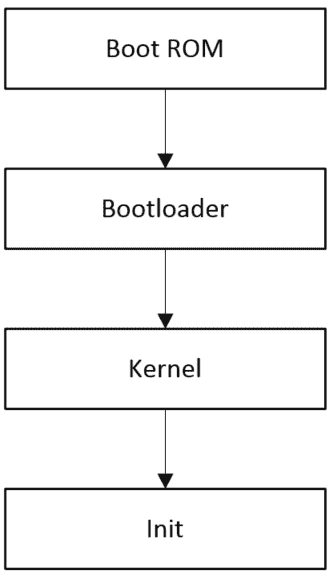
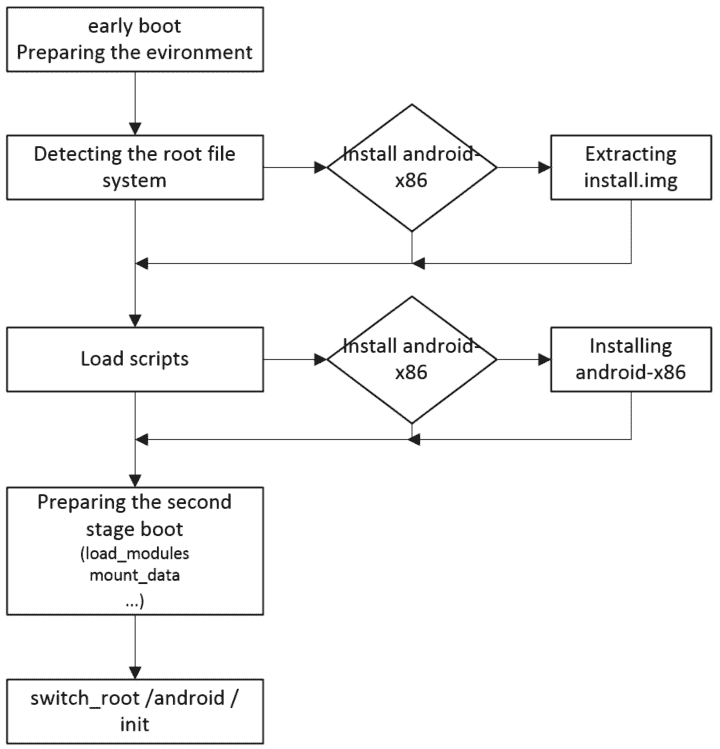
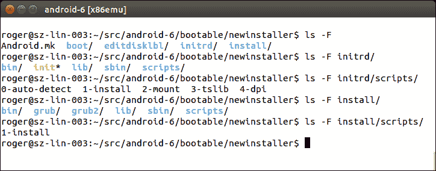
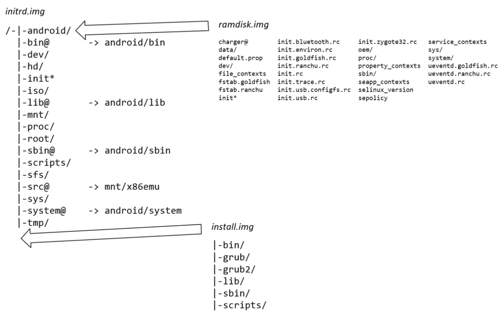
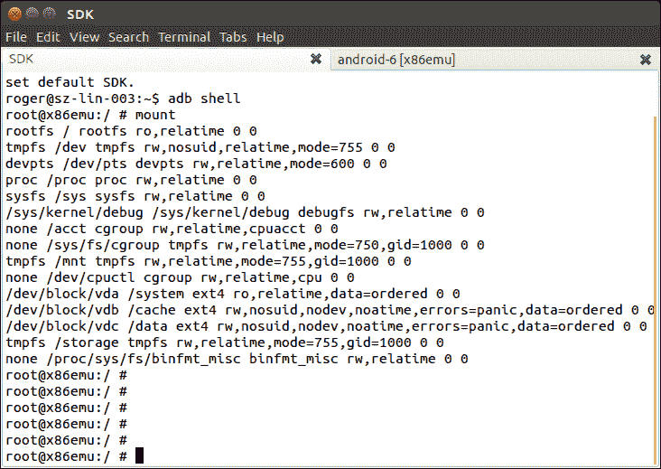
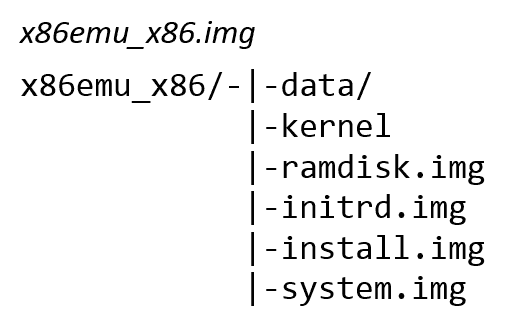
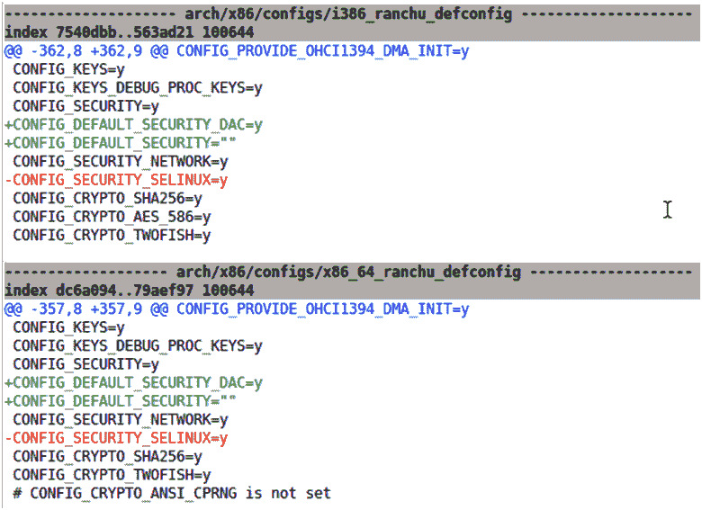
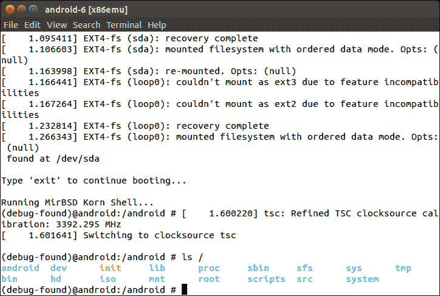

# 第六章：使用自定义 ramdisk 调试启动过程

在上一章中，我们学习了如何在安卓模拟器中使用自己的 x86emu 设备启用 Houdini。有了这个，我们可以在接下来的几章中继续进行更具挑战性的任务。大多数设备或系统级别的定制都将涉及对安卓系统启动顺序的更改。在本章中，我们将分析安卓系统启动顺序，并学习与启动顺序的定制和调试相关的知识。在本章中，我们将涵盖以下主题：

+   安卓启动过程分析

+   Android-x86 的启动过程

+   为 Android-x86 的`initrd.img`创建文件系统

我们将从分析正常的安卓启动过程开始。之后，我们将介绍 Android-x86 的双阶段启动。我们将为安卓模拟器构建一个文件系统，它可以与 Android-x86 的`initrd.img`一起工作。这种方法提供了一种灵活的方式来帮助调试启动过程。

# 分析安卓启动过程

安卓系统的启动顺序与其他从处理器内部的 Boot ROM 开始的嵌入式 Linux 系统类似。Boot ROM 将找到引导加载程序。引导加载程序将加载内核和 ramdisk 镜像。内核使用 ramdisk 作为根文件系统。在桌面 Linux 环境中，一旦内核初始化了基本设备，它将在硬盘等物理存储上重新挂载根文件系统。在安卓中，各种分区（系统、数据、缓存等）将挂载到内存中的根文件系统，而不是存储设备。内核将在 ramdisk 中调用**init**进程以启动系统的其余部分，如图所示：



# 引导加载程序和内核

如我们所见，当我们构建自己的设备时，我们无法避免引导加载程序。然而，我们不会在这个主题上花费太多时间，因为引导加载程序不是本书的重点。在安卓模拟器中，不需要有引导加载程序，因为模拟器内部已经构建了一个最小化的引导加载程序。

QEMU 中的一个非常小的引导加载程序来启动 Linux 如果您对 QEMU 中的小引导加载程序感兴趣，可以参考位于`$AOSP/external/qemu/hw/arm/boot.c`的 AOSP 源代码。

由于引导加载程序是硬件平台特定的，因此 QEMU 中的引导加载程序实现对于不同的硬件架构（如 ARM、x86 或 MIPS）是不同的。我之所以提到 ARM 实现，是因为它是最干净且最容易理解的。

您可以参考由我撰写并由 Addison-Wesley Professional 出版的《嵌入式编程与安卓》一书，以了解更多关于安卓模拟器引导加载程序的信息。

对于我们将从第八章的*在 VirtualBox 上创建自己的设备*到第十一章的*启用 VirtualBox 特定硬件接口*使用的虚拟硬件，我们将使用网络引导来解决引导加载程序问题。

Linux 内核是支持各种硬件设备的关键元素之一。我们将在本书中讨论 Linux 内核的定制和配置。在本章中，我们将重点关注 init 进程，并了解它在 Android 系统中的工作方式。

# 分析 init 进程和 ramdisk

init 进程的实现可以在`$AOSP/system/core/init`目录中找到。如果我们查看`init.cpp`中的`main`函数，它包括`ueventd`和`watchdogd`的代码，如下面的代码片段所示：

```java
int main(int argc, char** argv) { 
    if (!strcmp(basename(argv[0]), "ueventd")) { 
        return ueventd_main(argc, argv); 
    } 

    if (!strcmp(basename(argv[0]), "watchdogd")) { 
        return watchdogd_main(argc, argv); 
    } 
    ... 

```

我们不会讨论`ueventd`和`watchdogd`，因为它们与我们的主题无关。我们将专注于`init.cpp`的主线代码。init 的主线代码实现了以下逻辑：

1.  环境准备，例如创建系统文件夹、设置标准 I/O、初始化日志系统等。环境设置还包括 SELinux 设置和加载 SELinux 策略。

1.  解析 init 脚本`init.rc`、`init.${ro.hardware}.rc`等。将 init 脚本中的项目添加到`action_list`和`service_list`中的动作或服务。

1.  在`action_list`中执行`early-init`动作。

1.  在`action_list`中执行`init`动作。

1.  在`action_list`中执行`late-init`动作。

1.  进入一个无限循环以执行以下任务：

1.  在`action_queue`中执行动作。

1.  在`service_list`中重启标记为`SVC_RESTARTING`的服务。

1.  提供属性服务，处理`/dev/keychord`事件。

1.  监控系统属性变化、信号和键盘事件。

init 脚本存储在 ramdisk 中，并在引导过程中由引导加载程序加载到内存中。如果我们查看 x86emu 的`ramdisk.img`内容，我们将看到以下文件：


init 脚本定义了两种类型的元素：**动作**和**服务**。init 进程解析所有脚本并根据元素的类型运行任务。

# 动作

动作语法如下：

```java
on <trigger> 
    <command> 
    <command> 
    <command> 
    ... 

```

动作以关键字`on`开头，后跟一个触发器。动作左对齐，后续的命令缩进，如前文所示片段。

例如，我们使用`fstab.goldfish`在触发`fs`时挂载所有模拟器的分区：

```java
on fs 
        mount_all /fstab.goldfish 

```

**触发器**是用于匹配某些类型事件的字符串，并且它们用于触发动作的发生。有两种类型的动作触发器：**预定义触发器**和**属性值变化激活的触发器**。

预定义触发器可以是`early-init`、`init`、`early-fs`、`fs`、`post-fs`、`early-boot`或`boot`，如 init 脚本中定义的那样。

属性值触发器具有以下形式：

```java
<name>=<value> 

```

当`<name>`属性设置为特定值`<value>`时，这种形式的触发器会发生。

例如，当`sys.init_log_level`属性更改时，我们需要按照以下方式重置日志级别：

```java
on property:sys.init_log_level=* 
    loglevel ${sys.init_log_level} 

```

初始化脚本中的命令重新组装了 shell 命令，并添加了 init 特定的命令。

# 服务

服务是 init 启动的程序，并在它们退出时（可选地）重新启动。服务的形式如下：

```java
service <name> <pathname> [ <argument> ]* 
   <option> 
   <option> 
   ... 

```

服务将以`<name>`的形式被 init 所知。指向`<pathname>`的实际二进制文件名将不会被识别。

选项是服务的修饰符。它们影响 init 如何以及何时运行服务。我们可以使用以下 goldfish 特定的服务作为例子：

```java
service goldfish-setup /system/etc/init.goldfish.sh 
    user root 
    group root 
    oneshot 

```

服务的名称是`goldfish-setup`，它以 root 用户身份运行`init.goldfish.sh`脚本。`oneshot`选项意味着当它退出时，此服务不会重新启动。

完整的`init`命令和`service`选项列表可以在以下文件中找到：

`$AOSP/system/core/init/readme.txt`

# 设备特定的动作和服务

系统生成的初始化脚本的源代码位于`$AOSP/system/core/rootdir`文件夹中。它们在构建过程中被复制到`$OUT/root`。

初始化进程首先解析`init.rc`脚本。所有其他脚本都由`init.rc`导入，然后由初始化进程解析。如果我们查看以下`init.rc`代码片段，我们可以看到有几个脚本是由`init.rc`导入的：

```java
# Copyright (C) 2012 The Android Open Source Project 
# 
# IMPORTANT: Do not create world writable files or directories. 
# This is a common source of Android security bugs. 
# 

import /init.environ.rc 
import /init.usb.rc 
import /init.${ro.hardware}.rc 
import /init.usb.configfs.rc 
import /init.${ro.zygote}.rc 
import /init.trace.rc 

on early-init 
... 

```

`init.${ro.hardware}.rc`脚本是可以用来为设备特定更改进行定制的脚本。`ro.hardware`属性在运行时传递给 init，以便 init 可以加载适合设备的正确版本。我们应该尽量避免更改其他 init 脚本，并将设备特定的更改仅保留在`init.${ro.hardware}.rc`中。

如果我们具体查看 goldfish 或 ranchu 设备，它们分别有`init.goldfish.rc`和`init.ranchu.rc`脚本。这两个脚本都是 goldfish 设备的一部分，可以在`$AOSP/device/generic/goldfish`中找到，如下面的代码片段所示。它们在构建过程中被复制到`$OUT/root`。

```java
$ ls device/generic/goldfish
audio           fstab.ranchu      libqemu  qemu-props
camera          gps               lights   sensors
data            init.goldfish.rc  opengl   ueventd.goldfish.rc
fingerprint     init.goldfish.sh  power    ueventd.ranchu.rc
fstab.goldfish  init.ranchu.rc    qemud    vibrator  

```

在`init.goldfish.rc`或`init.ranchu.rc`内部，定义了一个`goldfish-setup`服务，如下所示：

```java
service goldfish-setup /system/etc/init.goldfish.sh 
    user root 
    group root 
    oneshot 

```

在上一章中，我们在`init.goldfish.sh`脚本中添加了 Houdini 初始化，这就是 Houdini 在启动过程中初始化的方式。

在 Android 模拟器中，硬件名称是通过内核命令行传递的。当你以`-verbose`和`-show-kernel`选项启动模拟器时，你将在控制台看到以下命令行参数：

```java
...
emulator: argv[08] = "-append"
emulator: argv[09] = "qemu=1 clocksource=pit androidboot.console=ttyGF2 android.checkjni=1 console=ttyS0,38400 **androidboot.hardware=ranchu** qemu.gles=1 android.qemud=1"
...  

```

这些参数作为内核命令行参数传递给内核，然后由 init 用来决定硬件名称。由于我们无法在模拟器中更改内核参数，因此我们无法在我们的设备中使用自己的脚本，如`init.x86emu.rc`。如果我们想自定义启动顺序，我们应该更改`$AOSP/device/generic/goldfish`中的代码，这正是我们在上一章所做的事情。

定制启动序列的理想方法是将所有定制内容放在我们自己的 `device` 文件夹下，例如 `$AOSP/device/generic/x86emu`。在这种情况下，我们可以非常容易地升级到新的 Android 版本。我们更改的 AOSP 代码越通用，迁移到新 Android 版本就越困难。

如果我们能控制引导加载程序，我们就可以通过引导加载程序传递自己的内核参数。我们将在第八章 *在 VirtualBox 上创建自己的设备* 中看到这一点，直到第十一章 *启用 VirtualBox 特定硬件接口*。

如果你真的需要更改 `init.rc` 以完全定制启动序列，你可以在你的 `BoardConfig.mk` 中定义 `TARGET_PROVIDES_INIT_RC := true` 变量。有了这个定义，你就可以将 `init.rc` 复制到你的 `device` 文件夹中，并为你自己的设备进行更改。

# 源代码和清单文件更改

现在我们已经介绍了 Android 启动过程，接下来我们将把 Android-x86 项目的双阶段启动过程应用到 Android 模拟器中。在讨论双阶段启动过程之前，让我们先看看 AOSP 源代码和清单文件的变化。

如果我们查看我们将用于本章的以下清单文件，我们可以看到我们只更改了 `kernel`、`x86emu` 设备和来自 Android-x86 项目的 `newinstaller`：

```java
<?xml version="1.0" encoding="UTF-8"?> 
<manifest> 

  <remote  name="github" 
           revision="refs/tags/android-7.1.1_r4_x86emu_ch06_r1" 
           fetch="." /> 

  <remote  name="aosp" 
           fetch="https://android.googlesource.com/" /> 
  <default revision="refs/tags/android-7.1.1_r4" 
           remote="aosp" 
           sync-c="true" 
           sync-j="1" /> 

  <!-- github/shugaoye --> 
 <project path="kernel" name="goldfish" remote="github" /> <project path="device/generic/x86emu" name="x86emu" 
  remote="github" /> <project path="bootable/newinstaller"  
  name="platform_bootable_newinstaller" remote="github" /> 

  <!-- aosp --> 
  <project path="build" name="platform/build" groups="pdk,tradefed" > 
    <copyfile src="img/root.mk" dest="Makefile" /> 
  </project> 
... 
</manifest> 

```

使用 `newinstaller` 项目，我们将构建另一个 ramdisk 映像，`initrd.img`，它将在双阶段启动过程中使用。

使用 Git 标签 `android-7.1.1_r4_x86emu_ch06_r1` 作为本章源代码更改的基准。

# Android-x86 启动过程

在 第一章 *Android 系统编程简介* 中，我们介绍了 Android-x86 项目，这是一个开源项目，为英特尔设备提供 Android **板级支持包**（**BSP**）。它使用类似于微软 Windows 或桌面 Linux 分发的通用媒体来启动各种英特尔设备。

为了实现使用一种介质启动所有设备的目标，它将启动序列分为两个阶段。第一阶段是启动一个最小的嵌入式 Linux 环境，以启用硬件设备。在第二阶段，它通过 `chroot` 或 `switch_root` 切换到 Android 系统。启动过程的第二阶段与我们之前讨论的相同。让我们详细看看 Android-x86 的启动过程的第一阶段。我们将在本章中重用它来模拟 Android 模拟器。这种方法可以帮助简化启动过程，同时也有助于我们调试启动过程。

# 使用 initrd.img 的第一阶段启动

Android-x86 的启动过程第一阶段使用特定的 ramdisk `initrd.img`。源代码可以在 `$AOSP/bootable/newinstaller` 找到。该项目是从 Android-x86 项目复制的。因为它托管在 GitHub 上，我可以对其进行自己的修改：

```java
$ ls -1 -F
Android.mk
boot/
editdisklbl/
initrd/
install/ 

```

如果我们查看 `newinstaller` 文件夹中的内容，我们可以看到前面的文件夹和文件。以下是对 `newinstaller` 内容的解释：

+   `boot`: 这是安装媒体的引导加载程序。Android-x86 的镜像可以构建成不同的格式（ISO、UEFI 等）

+   `editdisklbl`: 用于编辑系统镜像分区的宿主工具

+   `initrd`: 第一阶段引导的 ramdisk

+   `install` : Android-x86 的安装程序

+   `Android.mk` : `newinstaller` 的 Android Makefile

如果我们构建 `newinstaller`，它可以生成几种不同的镜像格式，如 ISO、USB 或 UEFI。在设置好环境并选择构建目标后，可以运行以下命令来构建指定的镜像：

```java
$ make iso_img/usb_img/efi_img  

```

除了安装镜像，它还会生成另外两个镜像，`initrd.img` 和 `install.img`：

+   `initrd.img` : 第一阶段引导的 ramdisk 镜像

+   `install.img` : 包含 Android-x86 安装程序的镜像

我们将详细了解 `initrd.img` 和 `install.img`，以了解 Android-x86 中第一阶段引导的工作原理。

# 在 `initrd.img` 内

如果我们查看 `initrd` 文件夹，我们可以看到以下内容：

```java
$ cd bootable/newinstaller/initrd 
$ ls -1F 
bin/ 
init* 
lib/ 
sbin/ 
scripts/ 

```

`initrd.img` 的内容由基于 busybox 的最小 Linux 环境组成。我们可以在 `bin/busybox` 中找到 busybox，以及 busybox 所需的共享库在 `lib/` 中。`initrd` 文件夹内有一个可执行的 `init` 文件和一些文件夹。我们知道，init 进程是系统启动时内核调用的第一个进程。Android-x86 提供了一个单独的 init 进程来在 `initrd.img` 内启动系统。这个版本的 init 实际上是一个 shell 脚本而不是二进制可执行文件：



这个 shell 脚本将执行前面图示中的任务：

1.  当内核调用脚本时，它首先准备环境。这包括控制台 tty 设置、调试日志的初始化和调试级别。

1.  环境准备就绪后，它将尝试在存储设备上找到现有的 Android 系统或安装媒体。在这一步，必须找到 `ramdisk.img`，否则将返回错误。

1.  一旦找到 Android 系统或安装媒体，它将 `ramdisk.img` 提取到工作文件夹 `/android`。如果设置了 `INSTALL` 变量，它还将 `install.img` 提取到文件系统根目录。工作文件夹 `/android` 用作 Android 系统的根目录，而当前根目录是 `initrd.img` 的镜像。

1.  现在，它将加载所有额外的脚本以准备下一步。如果环境变量 `INSTALL` 设置为 `1`，它将调用安装脚本将 Android-x86 安装到硬盘等存储设备。

1.  在切换到 Android 系统之前，它将加载所有设备的内核模块，挂载数据和 SD 卡分区，设置触摸屏和显示 DPI 等。

1.  一切准备就绪后，它将使用 `/android` 作为新的根目录切换到 Android 系统，并在新的根目录下调用 `/init`。从这一点开始，Android 系统将被启动。

让我们看看脚本中的一些重要代码片段，以真正了解其感觉：

```java
#!/bin/busybox sh 
# 
# By Chih-Wei Huang <cwhuang@linux.org.tw> 
# and Thorsten Glaser <tg@mirbsd.org> 
# 
# Last updated 2015/10/23 
# 
# License: GNU Public License 
# We explicitely grant the right to use the scripts 
# with Android-x86 project. 
# 

PATH=/sbin:/bin:/system/bin:/system/xbin; export PATH 
... 
echo -n Detecting Android-x86... 
... 
while :; do 
   for device in ${ROOT:-/dev/[hmsv][dmr][0-9a-z]*}; do 
 check_root $device && break 2 
         mountpoint -q /mnt && umount /mnt 
   done 
   sleep 1 
   echo -n . 
done 
... 

```

在前面的代码片段中，我们可以看到它通过无限循环调用 shell 函数 `check_root` 来寻找 Android 系统的根。如果它找不到根文件系统，它将卡在这个循环中。

在下面的 `check_root` 函数中，环境变量 `SRC` 从内核命令行传递，并指定文件系统根路径。它将检查在这个路径中是否可以找到 `ramdisk.img`。如果在这个路径中找到了 `ramdisk.img`，它将被提取到 `/android` 路径，即当前目录，否则；它将返回错误：

```java
... 
check_root() 
{ 
... 
   if [ -n "$iso" -a -e /mnt/$iso ]; then 
         mount --move /mnt /iso 
         mkdir /mnt/iso 
         mount -o loop /iso/$iso /mnt/iso 
         SRC=iso 
 elif [ ! -e /mnt/$SRC/ramdisk.img ]; then return 1 fi zcat /mnt/$SRC/ramdisk.img | cpio -id > /dev/null 
... 

```

在检测到根文件系统后，它将检查环境变量 `INSTALL`。这个 `INSTALL` 变量也是从内核命令行传递的。如果设置了 `INSTALL`，它将提取 `install.img` 到当前根目录。这将覆盖 `initrd.img` 中的某些文件，我们将在稍后详细讨论这一点：

```java
... 
if [ -n "$INSTALL" ]; then 
 zcat /src/install.img | ( cd /; cpio -iud > /dev/null ) 
fi 
... 

```

然后，它将从 `/scripts` 或 `/src/scripts` 文件夹加载所有其他 shell 脚本：

```java
... 
# load scripts 
for s in `ls /scripts/* /src/scripts/*`; do 
   test -e "$s" && source $s 
done 
... 

```

一旦所有 shell 脚本都加载到内存中，它将再次检查 `INSTALL` 变量，以查看是否应该执行安装脚本：

```java
... 
[ -n "$INSTALL" ] && do_install 

load_modules 
mount_data 
mount_sdcard 
setup_tslib 
setup_dpi 
post_detect 
... 
exec ${SWITCH:-switch_root} /android /init 

# avoid kernel panic 
while :; do 
   echo 
   echo '      Android-x86 console shell. Use only in emergencies.' 
   echo 
   debug_shell fatal-err 
done 

```

无论是否执行安装脚本，它都会为 Android 系统的启动准备环境。它将加载内核模块，挂载数据/SD 卡分区，并设置所有其他环境相关要求。最后，它将执行 `switch_root` 或 `chroot` 以切换到 Android 系统。从这一点开始，Android 系统将被启动。

`switch_root` 和 `chroot` 之间的主要区别在于，**switch_root** 的目的是将整个系统切换到新的根目录，并移除对旧目录的依赖，这样你就可以卸载原始根目录并继续使用，就像它从未被使用过一样。

**chroot** 的目的是应用于单个进程的生命周期，其余的系统继续在旧的根目录中运行，当 chrooted 进程退出时，系统保持不变。

在 Android-x86 中，`switch_root` 用于发布模式，而 `chroot` 用于调试模式。

# 在 `install.img` 内部

我们已经分析了 Android-x86 的大部分第一阶段启动过程。我们还想进行更多分析的是`install.img`在第一阶段启动过程中的工作方式。

如果设置了`INSTALL`环境变量，`install.img`将被提取。这将覆盖`initrd.img`中的一些内容。现在让我们看看这个。如果我们列出`initrd`和`install`两个目录的内容，我们可以看到以下截图中的`bin/`、`lib/`、`sbin/`和`scripts/`在两个镜像中都存在重复：



在`bin/`、`sbin/`和`lib/`文件夹中，有诸如`cfdisk`、`cgdisk`、`mkntfs`、`grub`等工具。这些工具用于分区硬盘、格式化额外的文件系统等。

`scripts/`文件夹包括安装脚本，我们将查看`scripts/`以探索 Android-x86 安装的工作原理。

如果我们查看`initrd`和`install`文件夹中的脚本文件，我们会发现两者都包含一个`1-install`脚本。`initrd.img`在第一阶段引导时用作根文件系统。如果设置了`INSTALL`变量，`install.img`也将被提取到根目录。在这种情况下，`install`文件夹中的脚本将覆盖`initrd`文件夹中的脚本。我们可以从以下图中看到`initrd.img`、`ramdisk.img`和`install.img`是如何集成以形成第一阶段和第二阶段文件系统的：



如果我们查看`initrd/scripts`文件夹下的`1-install`，我们将看到以下 shell 脚本函数：

```java
do_install() 
{ 
   error -e 'n  Android-x86 installer is not available.\n  
   Press RETURN to run live version.\n' 
   read 
   cd /android 
} 

```

它实现了一个`do_install`函数，该函数将返回错误信息。如果此脚本没有被`install.img`中的脚本覆盖，这意味着安装程序不可用。如果提取了`install.img`，则将调用真正的`do_install`函数以启动安装：

```java
do_install() 
{ 
  until install_hd; do 
    if [ $retval -eq 255 ]; then 
      dialog --title ' Error! ' --yes-label Retry --no-label Reboot  
      --yesno 'nInstallation failed! Please check if you have enough 
      free disk space to install Android-x86.' 8 51 
       [ $? -eq 1 ] && rebooting 
    fi 
  done 

  [ -n "$VESA" ] || runit="Run Android-x86" 
... 
} 

```

`do_install`函数将调用另一个函数`install_hd`，而`install_hd`将调用`install_to`函数以执行实际安装。`install_to`函数接受一个参数，即安装的目标设备。它将执行以下安装任务：

+   它将首先格式化目标设备，然后将设备挂载到`/hd`文件夹。

+   它将安装 GRUB 作为引导加载程序。

+   它将在`/hd`文件夹中使用`android-$VER`命名约定创建一个文件夹，作为目标安装文件夹。例如，由于我们的设备是 x86emu，安装目标将是`/hd/android-x86emu`。

+   它将使用`cpio`命令将文件从安装介质复制到安装目标。这些文件包括`kernel`、`initrd.img`、`ramdisk.img`以及来自 AOSP 构建的`system`文件夹下的所有内容。它取决于配置；它可能复制`system.sfs`或`system.img`镜像文件，或者它可能直接将`system`文件夹中的所有内容复制到`/hd/android-$VER/system`。

在接下来的章节中，我们需要重复安装过程以创建一个可用于 Android-x86 双阶段引导序列的文件系统。

# 使用 initrd.img 构建 x86emu

在我们对 Android-x86 的 `initrd.img` 进行了所有分析之后，我们现在可以为 Android 模拟器构建一个类似的镜像。请注意，这只能在 ranchu 上工作，而不能在 goldfish 上工作。goldfish 模拟器使用较旧的 QEMU 版本，并且不支持模拟器的附加存储设备。为了支持从 `initrd.img` 启动，我们必须更改文件系统的布局。在 AOSP 中更改原始文件系统镜像并不是一个好的选择。我们将创建另一个用于与 `initrd.img` 启动的文件镜像。

在 ranchu 模拟器中，镜像被模拟为 virtio 块设备。在我们启动模拟器后，我们可以检查挂载点，如下面的屏幕截图所示。我们可以看到 `system.img` 被挂载为 `/dev/block/vda`，`userdata.img` 为 `/dev/block/vdb`，而 `cache.img` 为 `/dev/block/vdc`：



ranchu 镜像模拟为 virtio 块设备

在 ranchu 模拟器中，所有分区都使用 `fstab.ranchu` 文件挂载，如下面的代码片段所示：

```java
... 
/dev/block/vda  /system  ext4      ro                 wait 
/dev/block/vdb  /cache   ext4      noatime,nosuid,nodev,nomblk_io_submit,errors=panic    wait 
/dev/block/vdc  /data    ext4      noatime,nosuid,nodev,nomblk_io_submit,errors=panic    wait 
... 

```

使用 ranchu 模拟器，我们可以轻松地通过 `-hda` QEMU 选项添加另一个存储设备。使用此选项，我们可以看到在模拟器启动后，一个新的块设备 `/dev/block/sda` 可用。我们将在稍后详细讨论这个问题。在我们能够测试这个想法之前，我们需要首先创建磁盘镜像。

# 创建文件系统镜像

我们可以创建磁盘镜像的方法有很多。QEMU 支持许多磁盘镜像格式。如果您想查找 QEMU 可以支持哪些图像格式的详细信息，可以使用以下 Linux 命令进行查看：

```java
$ man qemu-img  

```

支持的图像格式有：

+   **raw**：这种简单的磁盘镜像格式具有简单且易于导出到所有其他模拟器的优势。

+   **qcow2**：这是 QEMU 镜像格式，是最通用的格式。它是一种压缩镜像格式，因此具有更小的镜像大小，并且可以支持快照。

+   **qcow**：这是旧的 QEMU 镜像格式。

+   **cow**：这是 User Mode Linux Copy-On-Write 镜像格式。

+   **vdi**：这是与 VirtualBox 1.1 兼容的镜像格式。

+   **vmdk**：这是 VMware 3 和 4 兼容的镜像格式。

+   **vpc**：这是与 VirtualPC 兼容的镜像格式（VHD）。

+   **cloop**：这是 Linux 压缩循环镜像，仅适用于直接重用现有的压缩 CD-ROM 镜像，例如 Knoppix CD-ROM。

我们将使用 qcow2 文件格式来测试 Android 模拟器的 `initrd.img`。为了创建 qcow2 格式的文件镜像，我们需要在 `bootable/newinstaller` 的 `Android.mk` Makefile 中添加以下代码：

```java
... 
initrd:  $(BUILT_IMG) 

X86EMU_EXTRA_SIZE := 100000000 
X86EMU_DISK_SIZE := $(shell echo ${BOARD_SYSTEMIMAGE_PARTITION_SIZE}+${X86EMU_EXTRA_SIZE} | bc) 
X86EMU_TMP := x86emu_tmp 

qcow2_img: $(BUILT_IMG) 
  mkdir -p $(PRODUCT_OUT)/${X86EMU_TMP}/${TARGET_PRODUCT} 
  cd $(PRODUCT_OUT)/${X86EMU_TMP}/${TARGET_PRODUCT}; mkdir data 
  mv $(PRODUCT_OUT)/initrd.img $(PRODUCT_OUT)/${X86EMU_TMP}/${TARGET_PRODUCT} 
  mv $(PRODUCT_OUT)/install.img $(PRODUCT_OUT)/${X86EMU_TMP}/${TARGET_PRODUCT} 
  mv $(PRODUCT_OUT)/ramdisk.img $(PRODUCT_OUT)/${X86EMU_TMP}/${TARGET_PRODUCT} 
  mv $(PRODUCT_OUT)/system.img $(PRODUCT_OUT)/${X86EMU_TMP}/${TARGET_PRODUCT} 
  make_ext4fs -T -1 -l $(X86EMU_DISK_SIZE) $(PRODUCT_OUT)/${TARGET_PRODUCT}.img $(PRODUCT_OUT)/${X86EMU_TMP}  
  mv $(PRODUCT_OUT)/${X86EMU_TMP}/${TARGET_PRODUCT}/*.img $(PRODUCT_OUT)/ 
  qemu-img convert -c -f raw -O qcow2 $(PRODUCT_OUT)/${TARGET_PRODUCT}.img $(PRODUCT_OUT)/${TARGET_PRODUCT}-qcow2.img 
  cd $(PRODUCT_OUT); qemu-img create -f qcow2 -b 
  ./${TARGET_PRODUCT}-qcow2.img ./${TARGET_PRODUCT}.img 
... 

```

在前面的 Makefile 中，我们必须做的第一件事是创建一个目录布局，该布局可以被 `initrd.img` 使用，如下面的代码片段所示：



x86emu_x86.img 的目录布局

我们创建一个 `data` 文件夹作为数据存储使用。然后，我们将 AOSP 输出文件夹中的现有镜像文件移动到 `$OUT/x86emu_tmp/x86emu_x86` 目录，以创建前面的目录结构。这些文件镜像将在文件镜像生成后移回。

一旦我们有了正确的目录结构，我们就可以使用 `make_ext4fs` 命令创建具有以下选项的原始文件系统镜像：

```java
make_ext4fs -T {timestamp} -l {size of file system} {image file name} {source directory} {target out directory}  

```

文件系统的尺寸是 `BOARD_SYSTEMIMAGE_PARTITION_SIZE`；此外，`X86EMU_EXTRA_SIZE`。`BOARD_SYSTEMIMAGE_PARTITION_SIZE` 定义在系统镜像大小的板级配置文件中。`X86EMU_EXTRA_SIZE` 是用于 ramdisk 和内核镜像的空间。

下一步是使用 `qemu-img` 命令将原始文件镜像转换为 qcow2 格式。原始和 qcow2 格式的镜像都可以由模拟器使用，但原始文件镜像比 qcow2 镜像大得多。

由于 qcow2 镜像支持快照功能，我们也可以根据 qcow2 镜像（`x86emu_x86-qcow2.img`）生成快照镜像（`x86emu_x86.img`）。如果我们使用快照镜像，我们可以在任何时候恢复到原始的 qcow2 镜像。可以使用以下命令创建快照镜像：

```java
$ cd $OUT
$ qemu-img create -f qcow2 -b ./x86emu_x86-qcow2.img ./x86emu_x86.img  

```

镜像生成后，我们可以使用以下 `qemu-img` 命令检查它：

```java
$ qemu-img info x86emu_x86.img
image: x86emu_x86.img
file format: qcow2
virtual size: 1.3G (1442177024 bytes)
disk size: 196K
cluster_size: 65536
backing file: ./x86emu_x86-qcow2.img
Format specific information:
 compat: 1.1
 lazy refcounts: false 

```

我们可以看到 `x86emu_x86.img` 镜像是 `x86emu_x86-qcow2.img` 的快照镜像。

在我们刚刚创建的镜像中，没有创建分区。当我们将其挂载到 Android 模拟器中时，它将显示为 `/dev/sda` 或 `/dev/block/sda` 设备。如果我们想为镜像文件创建分区，我们需要使用 `edit_mbr` 工具来完成。您可以自行探索这个选项。使用多个分区，我们可以将系统、数据和缓存放入不同的分区，这更接近大多数移动设备的磁盘布局。

# 内核更改

从 Android 4.4 开始，SELinux 默认启用。当我们更改 Android 中的文件系统时，我们还需要注意 SELinux 设置。这将使配置比我们预期的更复杂。如果您对此感兴趣，您可以为此情况配置 SELinux，并完成您的作业。

在这本书中，我们将默认禁用 SELinux，以便我们可以专注于我们的主题。要禁用 SELinux，我们必须对内核配置文件进行一些更改。您可以使用以下 `git` 命令检查更改：

```java
$ cd $AOSP/kernel
$ git branch
* android-x86emu-3.10
$ gitk  

```

我们可以使用 `gitk` 查看在 `android-x86emu-3.10` 分支中的更改，如下所示截图。我们可以看到我们设置了默认的安全策略为 DAC，并移除了 SELinux 设置，`CONFIG_SECURITY_SELINUX=y`：



在 ranchu 内核中禁用 SELinux

# 在 Android 模拟器上启动磁盘镜像

一旦我们完成了所有更改，我们可以使用以下命令构建 qcow2 镜像：

```java
$ make qcow2_img USE_SQUASHFS=0
...
make_ext4fs -T -1 -S out/target/product/x86emu/root/file_contexts -L 
system -l 1342177280 -a system out/target/product/x86emu/obj/PACKAGING/systemimage_intermediates/system.img out/target/product/x86emu/system out/target/product/x86emu/system
Creating filesystem with parameters:
 Size: 1342177280
 Block size: 4096
 Blocks per group: 32768
 Inodes per group: 8192
 Inode size: 256
 Journal blocks: 5120
 Label: system
 Blocks: 327680
 Block groups: 10
 Reserved block group size: 79
Created filesystem with 2122/81920 inodes and 178910/327680 blocks
Install system fs image: out/target/product/x86emu/system.img  

```

如前述命令行输出所示，`system.img`将按常规构建。之后，将创建 ramdisk 镜像`initrd.img`，如下所示。请注意`VER`环境变量。我们将脚本更改为将其设置为`x86emu`。Android-x86 中的原始版本是当前日期，例如 2016-11-11：

```java
VER ?= $(shell date +"%F") 

```

此变量用作安装文件夹名称的一部分。让我们继续审查构建日志：

```java
out/target/product/x86emu/system.img+ maxsize=1370278272 blocksize=2112 total=1342177280 reserve=13842048
rm -rf out/target/product/x86emu/installer
out/host/linux-x86/bin/acp -pr bootable/newinstaller/initrd out/target/product/x86emu/installer
ln -s /bin/ld-linux.so.2 out/target/product/x86emu/installer/lib
mkdir -p out/target/product/x86emu/installer/android out/target/product/x86emu/installer/iso out/target/product/x86emu/installer/mnt out/target/product/x86emu/installer/proc out/target/product/x86emu/installer/sys out/target/product/x86emu/installer/tmp out/target/product/x86emu/installer/sfs out/target/product/x86emu/installer/hd
echo "VER=x86emu" > out/target/product/x86emu/installer/scripts/00-ver
out/host/linux-x86/bin/mkbootfs out/target/product/x86emu/installer | gzip -9 > out/target/product/x86emu/initrd.img  

```

在创建 ramdisk `initrd.img`之后，将根据我们在`Android.mk`文件中为`bootable/newinstaller`添加的内容创建原始和 qcow2 文件镜像：

```java
mkdir -p out/target/product/x86emu/x86emu_tmp/x86emu_x86
cd out/target/product/x86emu/x86emu_tmp/x86emu_x86; mkdir data
mv out/target/product/x86emu/initrd.img out/target/product/x86emu/x86emu_tmp/x86emu_x86
mv out/target/product/x86emu/install.img out/target/product/x86emu/x86emu_tmp/x86emu_x86
mv out/target/product/x86emu/ramdisk.img out/target/product/x86emu/x86emu_tmp/x86emu_x86
mv out/target/product/x86emu/system.img out/target/product/x86emu/x86emu_tmp/x86emu_x86
make_ext4fs -T -1 -l 1442177280 out/target/product/x86emu/x86emu_x86.img out/target/product/x86emu/x86emu_tmp out/target/product/x86emu/x86emu_tmp
Creating filesystem with parameters:
 Size: 1442177024
 Block size: 4096
 Blocks per group: 32768
 Inodes per group: 8016
 Inode size: 256
 Journal blocks: 5501
 Label: 
 Blocks: 352094
 Block groups: 11
 Reserved block group size: 87
Created filesystem with 17/88176 inodes and 340722/352094 blocks
mv out/target/product/x86emu/x86emu_tmp/x86emu_x86/*.img out/target/product/x86emu/
qemu-img convert -c -f raw -O qcow2 out/target/product/x86emu/x86emu_x86.img out/target/product/x86emu/x86emu_x86-qcow2.img
cd out/target/product/x86emu; qemu-img create -f qcow2 -b ./x86emu_x86-qcow2.img ./x86emu_x86.img
Formatting './x86emu_x86.img', fmt=qcow2 size=1442177024 backing_file='./x86emu_x86-qcow2.img' encryption=off cluster_size=65536 lazy_refcounts=off  

```

我们现在有`x86emu_x86-qcow2.img` qcow2 镜像和`x86emu_x86.img`快照镜像。为了测试这些镜像，我们可以使用一个 shell 脚本来帮助我们。这个 shell 脚本可以从以下 GitHub URL 下载：

[`github.com/shugaoye/asp-sample/blob/master/scripts/test-initrd.sh`](https://github.com/shugaoye/asp-sample/blob/master/scripts/test-initrd.sh)

要运行此脚本，您应该首先设置您的 SDK 环境，这样我们就可以在`$PATH`环境变量中找到模拟器：

```java
#!/bin/sh 

if [ -z "$1" ]; then 
  EMULATOR1=emulator 
else 
  EMULATOR1="/opt/VirtualGL/bin/vglrun emulator" 
fi 

if [ -z "$OUT" ]; then 
  IMG_ROOT=. 
else 
  IMG_ROOT=$OUT 
fi 

$EMULATOR1 @a23x86 -verbose -show-kernel -shell -system $IMG_ROOT/system.img -ramdisk $IMG_ROOT/initrd.img -initdata $IMG_ROOT/userdata.img -kernel $IMG_ROOT/kernel -qemu -append "qemu=1 clocksource=pit android.checkjni=1 DEBUG=2 console=ttyS0,11520 androidboot.hardware=ranchu qemu.gles=1 android.qemud=1 root=/dev/sda SRC=x86emu_x86" -hda $IMG_ROOT/x86emu_x86.img 

```

要启动此脚本，您可以直接使用 AOSP 构建结果，或者您可以从以下 SourceForge URL 下载镜像：

[`sourceforge.net/projects/android-system-programming/files/android-7/ch06/ch06.zip/download`](https://sourceforge.net/projects/android-system-programming/files/android-7/ch06/ch06.zip/download)

如果您使用 AOSP 构建结果，脚本将使用`$OUT`环境变量来查找镜像。如果`$OUT`环境变量未设置，它将假定镜像存储在当前目录中。

要在远程*X*窗口会话中运行 Android 模拟器，我们需要使用 VirtualGL 来支持 OpenGL ES。无论使用哪个命令行参数，脚本都会使用 VirtualGL 启动模拟器。如果你使用带有本地*X*窗口会话的 Linux 机器，你不需要这样做。

要使用`initrd.img`作为 ramdisk，我们可以看到在模拟器命令行中我们指定了`initrd.img`在`-ramdisk`选项中。接下来我们需要注意的点是 QEMU 选项。我们可以在`-qemu` Android 模拟器选项之后指定 QEMU 选项。我们使用两个 QEMU 选项，`-append`和`-hda`。使用`-hda`选项，我们可以将`x86emu_x86-qcow2.img`镜像或`x86emu_x86.img`快照镜像作为模拟器的另一个硬盘。使用`-append`选项，我们可以提供我们想要传递给 ranchu 内核的内核参数。所有其他内核参数与模拟器提供的相同，除了以下参数：

+   `DEBUG=2`：此选项将调试级别设置为`2`，这样我们就可以在启动时获取调试控制台

+   `root=/dev/sda`：此选项指定根设备为`/dev/sda`，这是我们作为 QEMU 选项提供的`x86emu_x86-qcow2.img`镜像或`x86emu_x86.img`快照镜像

+   `SRC=x86emu_x86`：此选项定义了 init 可以在根设备上使用的文件夹名称，以查找所有镜像

您可以从命令行启动脚本，您将看到以下屏幕输出：

```java
$ test-initrd.sh
...
(debug-found)@android:/android # mount
rootfs on / type rootfs (rw)
proc on /proc type proc (rw,relatime)
sys on /sys type sysfs (rw,relatime)
tmpfs on /android type tmpfs (rw,relatime)
/dev/block/sda on /mnt type ext4 (rw,relatime,data=ordered)
/dev/loop0 on /android/system type ext4 (rw,relatime,data=ordered)
(debug-found)@android:/android # losetup -a 
/dev/loop0: 0 /mnt/x86emu_x86/system.img  

```

在命令行日志和下面的屏幕截图中，你可以看到 `/dev/sda` 根设备已被找到并挂载到 `/mnt`。Android 系统镜像被挂载为循环设备到 `/dev/loop0`：



initrd.img 的调试控制台

退出 shell 控制台后，Android 系统将像往常一样启动。使用这种方法，您可以在需要调试任何问题时获得调试控制台。您还可以即时更改任何 Android 启动脚本，而无需重新构建新镜像进行测试。这种设置中的所有灵活性都将极大地帮助调试启动过程。

# 摘要

在本章中，我们学习了 Android 系统的启动过程。之后，我们深入探讨了 Android-x86 的启动过程。我们发现了一种新的启动系统的方法，首先将系统启动到最小 Linux 环境，然后使用该环境启动 Android 系统。在这个过程中，我们可以通过获取 shell 控制台来获得控制权，以便在特定点检查系统。为了支持这种启动方式，我们学习了如何构建可以与 `initrd.img` 一起使用的系统镜像。

在下一章中，我们将继续探讨如何通过添加 Wi-Fi 连接来自定义 Android 模拟器。
