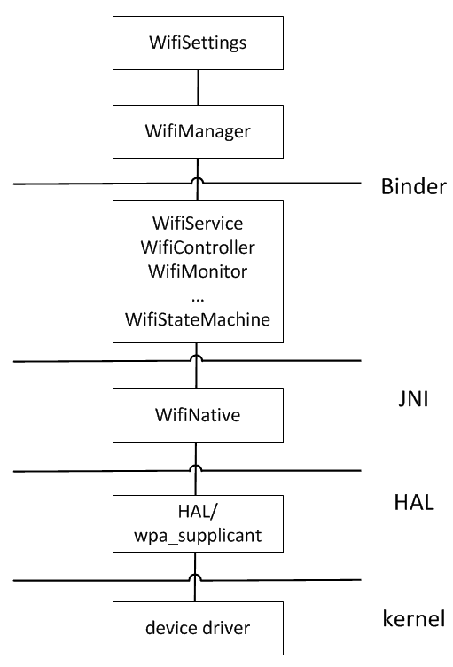
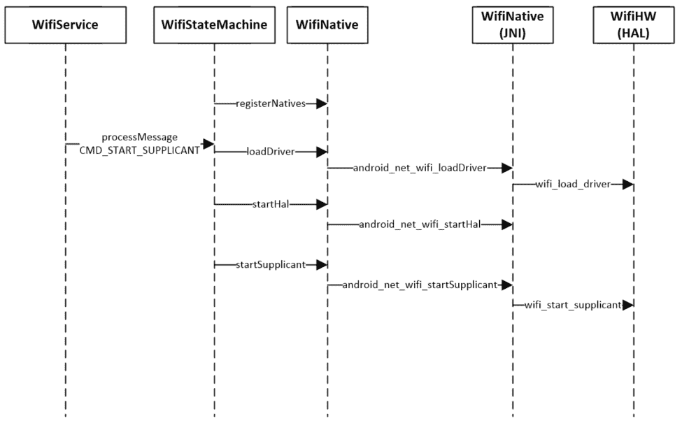
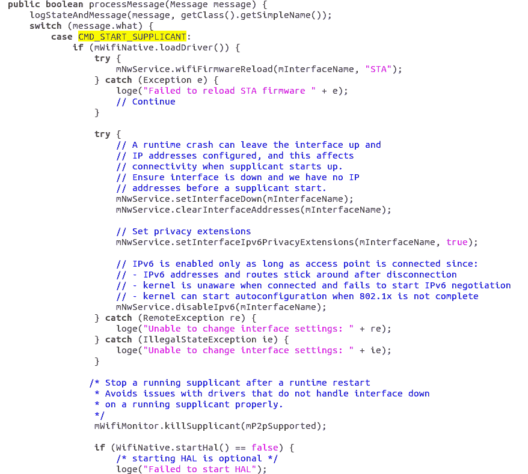
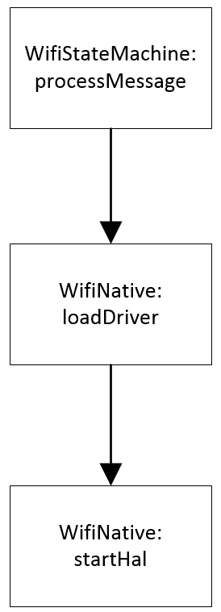
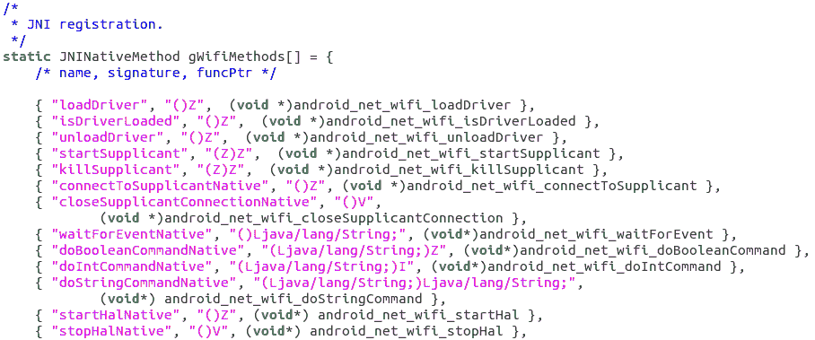
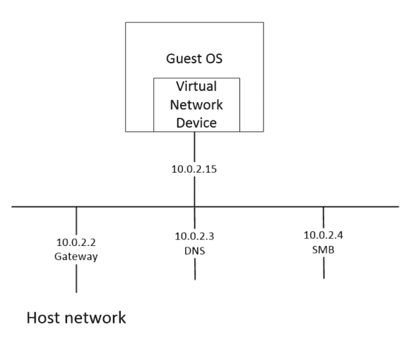
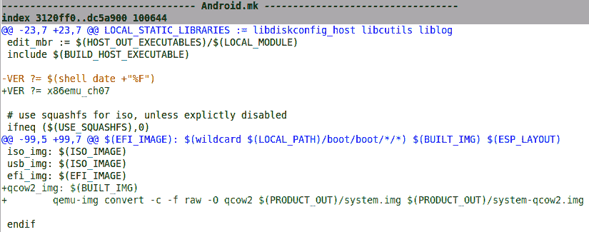
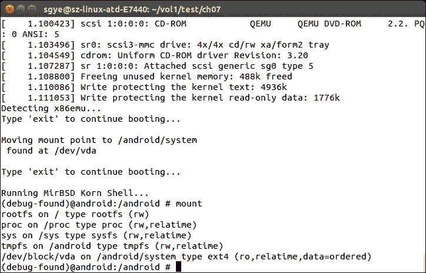
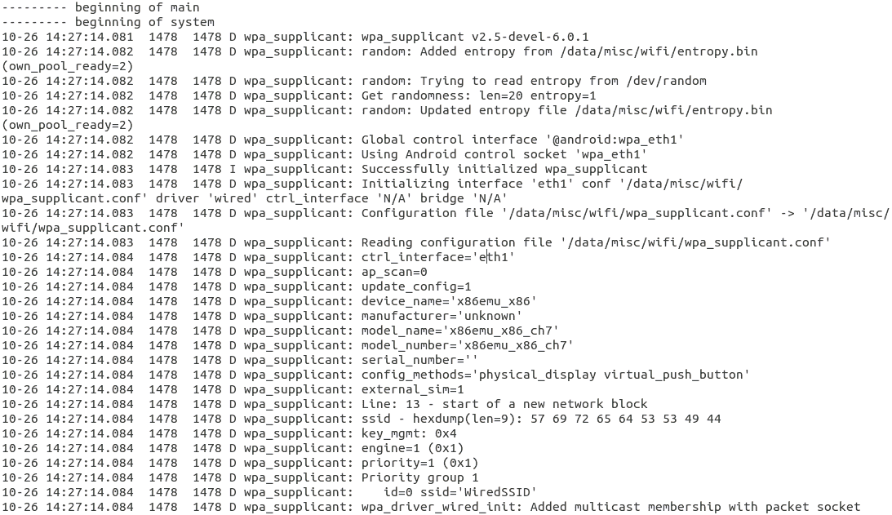
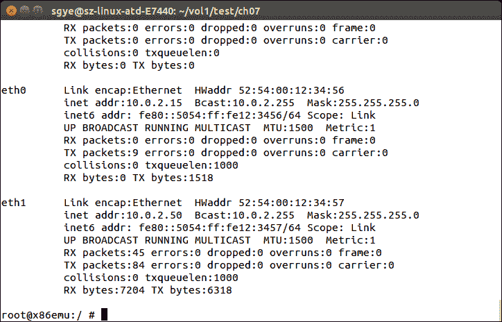

# 第七章：在 Android 模拟器上启用 Wi-Fi

在过去的三章中，我们探讨了自定义和扩展 Android 模拟器的方法。在本章中，我们将继续探讨这个主题，以在 Android 模拟器中添加 Wi-Fi 支持。如果你是使用 Android 模拟器的开发者，你可能注意到 Android 模拟器中只有数据连接。一些应用程序可能知道连接类型，并根据连接类型表现出不同的行为。在这种情况下，你不能使用模拟器来测试你的应用程序。在本章中，我们将涵盖以下主题：

+   介绍 Android 中的 Wi-Fi 架构

+   扩展 x86emu 设备以支持 Wi-Fi 连接

+   在 x86emu 设备上测试 Wi-Fi 连接

本章的主题处于高级水平。我们将在本章的开始分析 Wi-Fi 源代码，以帮助理解 Wi-Fi 架构。我建议你打开源代码编辑器并定位讨论中的函数。这是理解本章源代码分析部分的一种非常有效的方法。

# Android 上的 Wi-Fi

在第三章“发现内核、HAL 和虚拟硬件”中，我们讨论了与 Android 系统相关的端口层，我们以 goldfish lights 为例来描述从应用程序到 HAL 访问硬件的调用序列。在本章中，我们将采用类似的方法来探索 Android 的 Wi-Fi 架构。基于我们对 Wi-Fi 架构的理解，我们将在本章的后面部分将 Wi-Fi 添加到模拟器中。

# Wi-Fi 架构

如我们从前面的章节所知，Android 应用程序使用管理器来访问系统服务。管理器将使用各种系统服务来访问**硬件抽象层**（**HAL**）。Wi-Fi 架构也遵循相同的方法，让应用程序访问 Wi-Fi 硬件。



Android Wi-Fi 架构

如我们从前面显示 Android 系统中 Wi-Fi 层的图所示，**WifiSettings**是默认 AOSP 构建中用于控制 Wi-Fi 连接的应用程序。**WifiSettings**使用**WifiManager**来获取访问 Wi-Fi 服务。

**WifiManager**提供以下功能：

+   提供配置网络的列表--可以修改单个条目的属性。

+   监控当前活动的 Wi-Fi 网络（如果有）。可以建立或断开连接，并查询网络状态的动态信息。

+   提供接入点扫描的结果，包含足够的信息来决定连接哪个接入点。

+   定义在 Wi-Fi 状态发生任何变化时广播的各种 intent 动作的名称。

当`WifiManager`被创建时，它获得`IWifiManager`的接口，如下面的代码片段所示。该接口通过 binder 机制由`WifiService`实现：

```kt
public WifiManager(Context context, IWifiManager service, Looper looper) { 
    mContext = context; 
    mService = service; 
    mLooper = looper; 
    mTargetSdkVersion = context.getApplicationInfo().targetSdkVersion; 
} 

```

`WifiManager` 定义在 `$AOSP/frameworks/base/wifi/java/android/net/wifi/WifiManager.java` 文件中。

在 `WifiService` 的实现中，它使用 `WifiStateMachine` 来管理 Wi-Fi 状态：

```kt
public final class WifiServiceImpl extends IWifiManager.Stub { 
    private static final String TAG = "WifiService"; 
    private static final boolean DBG = true; 
    private static final boolean VDBG = false; 

    final WifiStateMachine mWifiStateMachine; 
      private final Context mContext; 
... 

```

`WifiServiceImpl` 定义在 `$AOSP/frameworks/opt/net/wifi/service/java/com/android/server/wifi/WifiServiceImpl.java` 文件中。

我们可以通过以下序列图查看 Wi-Fi HAL 的初始化过程：

在 [`xref.opersys.com/`](http://xref.opersys.com/) 有一个非常好的 Android 源代码交叉引用工具。

您可以使用这个交叉引用工具搜索函数定义并定位源代码位置。



Android Wi-Fi 初始化的序列图

`WifiStateMachine` 处理来自 `WifiManager` 的请求。当系统通过发送 `CMD_START_SUPPLICANT` 命令初始化 Wi-Fi 时，`WifiStateMachine` 将调用其 `processMessage` 方法来处理此请求，如下所示：



`processMessage` 方法通过 `WifiNative` 调用原生方法来加载 Wi-Fi 驱动程序（`loadDriver`）并启动 Wi-Fi HAL（`startHAL`）。

请注意函数调用 `mWifiNative.loadDriver` 和 `WifiNative.startHal`，如下所示的流程图所示：



**WifiNative** 的实现包括 Java 部分 和 原生部分。Java 实现可以在 `$AOSP/frameworks/opt/net/wifi/service/java/com/android/server/wifi/WifiNative.java` 文件中找到。

原生实现可以在 `$AOSP/frameworks/opt/net/wifi/service/jni/com_android_server_wifi_WifiNative.cpp` 文件中找到。

当创建 `WifiNative` 类的实例时，它首先加载 Wi-Fi 服务共享库，并调用 `registerNatives` 函数来注册所有原生函数，如下所示：

```kt
public class WifiNative { 
... 
    static { 
        /* Native functions are defined in libwifi-service.so */ 
        System.loadLibrary("wifi-service"); 
        registerNatives(); 
    } 

    private static native int registerNatives(); 

    public native static boolean loadDriver(); 
... 

```

`registerNatives` 的原生实现如下所示。它通过一个 `gWifiMethods` 全局变量来注册原生函数：

```kt
/* User to register native functions */ 
extern "C" 
jint Java_com_android_server_wifi_WifiNative_registerNatives(JNIEnv* env, jclass clazz) { 
    return AndroidRuntime::registerNativeMethods(env, 
            "com/android/server/wifi/WifiNative", gWifiMethods,  
            NELEM(gWifiMethods)); 
} 

```

在此函数中，它调用另一个框架函数 `registerNativeMethods` 来在 Java 层注册原生方法，以便 Java 层可以调用 `WifiNative` 中实现的功能。如果您在 Android NDK 编程方面工作过，您可能知道 `registerNativeMethods` 函数。我们可以在以下片段中查看 `gWifiMethods` 全局变量。`gWifiMethods` 全局变量包含在 `WifiNative` 中实现的原生函数列表，这些函数应作为 `WifiNative` 类的 Java 原生方法导出。我们可以看到 `loadDriver` 和 `startHalNative` 在列表中：



`loadDriver` 方法在 `android_net_wifi_loadDriver` 函数中实现，如下所示：

```kt
static jboolean android_net_wifi_loadDriver(JNIEnv* env, jobject) 
{ 
    return (::wifi_load_driver() == 0); 
} 

```

它调用一个 `wifi_load_driver` 函数，这是 Wi-Fi HAL 的一部分，位于 `$AOSP/hardware/libhardware_legacy/wifi/wifi.c`。

```kt
int wifi_load_driver() 
{ 
    char driver_status[PROPERTY_VALUE_MAX]; 
    #ifdef WIFI_DRIVER_MODULE_PATH 
    FILE *proc; 
    char line[sizeof(DRIVER_MODULE_TAG)+10]; 
    #endif 

    if (!property_get(DRIVER_PROP_NAME, driver_status, NULL) 
    || strcmp(driver_status, "ok") != 0) { 
        return 0;  /* driver not loaded */ 
    } 
    #ifdef WIFI_DRIVER_MODULE_PATH 
    /* 
     * If the property says the driver is loaded, check to 
     * make sure that the property setting isn't just left 
     * over from a previous manual shutdown or a runtime 
     * crash. 
     */ 
    if ((proc = fopen(MODULE_FILE, "r")) == NULL) { 
        ALOGW("Could not open %s: %s", MODULE_FILE, strerror(errno)); 
        property_set(DRIVER_PROP_NAME, "unloaded"); 
        return 0; 
    } 
    while ((fgets(line, sizeof(line), proc)) != NULL) { 
        if (strncmp(line, DRIVER_MODULE_TAG, strlen(DRIVER_MODULE_TAG)) 
        == 0) 
        { 
            fclose(proc); 
            return 1; 
        } 
    } 
    fclose(proc); 
    property_set(DRIVER_PROP_NAME, "unloaded"); 
    return 0; 
    #else 
    return 1;  
    #endif  
} 

```

如果需要使用特定的 Wi-Fi 驱动程序，需要定义`WIFI_DRIVER_MODULE_PATH`宏来指定驱动模块的路径。驱动程序加载成功后，会设置`wlan.driver.status`属性为`ok`。

现在我们将探讨另一种方法，`startHalNative`。它在`android_net_wifi_startHal`函数中实现：

```kt
static jboolean android_net_wifi_startHal(JNIEnv* env, jclass cls) { 
    JNIHelper helper(env); 
    wifi_handle halHandle = getWifiHandle(helper, cls); 
    if (halHandle == NULL) { 
        if(init_wifi_hal_func_table(&hal_fn) != 0 ) { 
            ALOGD("Can not initialize the basic function pointer 
            table"); 
            return false; 
        } 

        wifi_error res = init_wifi_vendor_hal_func_table(&hal_fn); 
        if (res != WIFI_SUCCESS) { 
            ALOGD("Can not initialize the vendor function pointer 
            table"); 
            return false; 
        } 

        int ret = set_iface_flags("wlan0", 1); 
        if(ret != 0) { 
            return false; 
        } 

        res = hal_fn.wifi_initialize(&halHandle); 
        if (res == WIFI_SUCCESS) { 
            helper.setStaticLongField(cls, WifiHandleVarName, 
            (jlong)halHandle); 
            ALOGD("Did set static halHandle = %p", halHandle); 
        } 
        env->GetJavaVM(&mVM); 
        mCls = (jclass) env->NewGlobalRef(cls); 
        ALOGD("halHandle = %p, mVM = %p, mCls = %p", halHandle, mVM, 
        mCls); 
        return res == WIFI_SUCCESS; 
    } else { 
        return (set_iface_flags("wlan0", 1) == 0); 
    } 
} 

```

Wi-Fi 芯片供应商通常提供两个组件：Wi-Fi 实现。第一个是我们讨论过的内核驱动程序，第二个是供应商 HAL 库。`startHalNative`函数用于将供应商实现的函数钩接到预定义的函数列表中。正如我们可以在前面的代码片段中看到的那样，调用`init_wifi_hal_func_table`函数来初始化`hal_fn`中的函数列表。之后，调用`init_wifi_vendor_hal_func_table`函数来初始化`hal_fn`中的函数指针。如果此操作成功，它将调用供应商初始化函数`hal_fn.wifi_initialize`。

# QEMU 网络和 Android 中的 wpa_supplicant

在 HAL 中，使用`wpa_supplicant`来支持设备与接入点之间的认证。它作为 Android 系统中的本地守护进程启动。上层控制请求被发送到`wpa_supplicant`，`wpa_supplicant`处理设备驱动程序和内核网络系统以提供网络连接。

由于 Android 模拟器使用 QEMU，网络系统由 QEMU 网络系统提供。QEMU 提供多个网络后端，包括 TAP、VDE、套接字和 SLIRP。Android 模拟器使用用户网络（SLIRP），这是 QEMU 的默认网络后端。由于 SLIRP 是 TCP/IP 网络堆栈的软件实现，它不需要 root 权限来支持网络功能。作为一个软件实现，它有以下限制：

+   有很多开销，因此性能较差

+   通常情况下，ICMP 流量无法正常工作，因此您无法在虚拟机内部使用 ping 命令。

+   在 Linux 主机上，如果初始设置是由 root 完成的，则 ping 命令可以在虚拟机内部工作。

+   虚拟机无法直接从主机或外部网络访问。

下图是 Android 模拟器中 SLIRP 网络的一个典型示例：



QEMU SLIRP 网络

在前面的图中，客户端的 IP 地址为**10.0.2.15**，网关的 IP 地址为**10.0.2.2**。默认 DNS IP 地址为**10.0.2.3**。它可能支持 SMB，这是可选的。如果您启动 Android 模拟器，默认网络接口为`eth0`，IP 地址为**10.0.2.15**。这通常用于模拟蜂窝数据连接。要模拟 Wi-Fi 连接，我们可以使用以下 QEMU 选项添加一个额外的网络接口`eth1`：

```kt
-netdev user,id=mynet1,net=10.0.2.0/24,dhcpstart=10.0.2.50 -device virtio-net,netdev=mynet1 

```

使用 `-device` QEMU 选项，我们添加了一个新的网络设备 `mynet1`，它使用 virtio 网络硬件。QEMU 可以模拟许多现有的网络硬件类型，我们在这章中选择 virtio 网络硬件。如果您喜欢，您也可以选择其他选项。

使用 `-netdev` QEMU 选项，我们通过提供 IP 地址范围和 DHCP 协议的起始地址来指定此网络设备的属性。

注意，前面的选项只能与 ranchu 一起使用，而不能与 goldfish 一起使用。要使用前面的 QEMU 选项启动 Android 模拟器，我们可以运行以下命令：

```kt
$ emulator @a25x86 -qemu -netdev user,id=mynet1,net=10.0.2.0/24,dhcpstart=10.0.2.50 -device virtio-net,netdev=mynet1  

```

# 在模拟器中添加 Wi-Fi

随着 Android 中 Wi-Fi 架构的引入，我们现在可以扩展模拟器以支持 Wi-Fi。要在模拟器中添加 Wi-Fi，我们需要为模拟器构建 `wpa_supplicant` 并为 `eth1` 网络接口选择正确的设备驱动程序。

# 在 BoardConfig.mk 中启用 wpa_supplicant

在默认的模拟器构建中，`wpa_supplicant` 不会被构建。要为模拟器启用 `wpa_supplicant` 的构建，我们可以在我们的 `BoardConfig.mk` 中添加以下行：

```kt
BOARD_WPA_SUPPLICANT_DRIVER := WIRED 
WPA_SUPPLICANT_VERSION      := VER_0_8_X VER_2_1_DEVEL 
BOARD_WLAN_DEVICE           := eth1 

```

当 `BOARD_WPA_SUPPLICANT_DRIVER` 被定义时，`external/wpa_supplicant_8/wpa_supplicant/Android.mk` 中的以下配置将被更改为 true：

```kt
ifneq ($(BOARD_WPA_SUPPLICANT_DRIVER),) 
  CONFIG_DRIVER_$(BOARD_WPA_SUPPLICANT_DRIVER) := y 
endif 

```

`BOARD_WPA_SUPPLICANT_DRIVER` 的值表示应该构建哪个驱动程序。由于我们使用有线以太网连接来模拟 Wi-Fi，我们将选择 *有线* 驱动程序，它可以在 `external/wpa_supplicant_8/src/drivers/driver_wired.c` 中找到。

我们还定义了要使用的 `wpa_supplicant` 版本和有线以太网接口。

# 提供适当的 wpa_supplicant 配置

要使 `wpa_supplicant` 正确工作，我们需要准备一个具有正确权限的 `wpa_supplicant.conf` 配置文件。Wi-Fi 相关的配置文件存储在 `/data/misc/wifi/` 目录中。此目录属于 `wifi` 用户，也是 `wpa_supplicant` 运行的用户。

`eth1` 有线连接的 `wpa_supplicant.conf` 配置文件可以在以下片段中找到：

```kt
ctrl_interface=eth1 
ap_scan=2 
update_config=1 
device_name=x86emu 
manufacturer=unknown 
serial_number= 
device_type=10-0050F204-5 
config_methods=physical_display virtual_push_button 
external_sim=1 

network={ 
   ssid="WiredSSID" 
   key_mgmt=NONE 
   engine=1 
   priority=1 
} 

```

在此配置文件中，我们定义了要使用的网络 SSID 和建立连接的认证方法。由于这是一个预定义的有线连接，我们将认证方法设置为 `key_mgmt=NONE`，这意味着在这种情况下我们不需要使用任何认证方法。

要将 `wpa_supplicant.conf` 以正确的权限复制到 `/data/misc/wifi/` 目录，我们需要按以下方式更改 `device.mk`：

```kt
# Wi-Fi support 
PRODUCT_PROPERTY_OVERRIDES := \ 
    wifi.interface=eth1 

PRODUCT_PACKAGES += \ 
    libwpa_client \ 
    hostapd \ 
    dhcpcd.conf \ 
    wlutil \ 
    wpa_supplicant \ 
    wpa_supplicant.conf 

# These are the hardware-specific features 
PRODUCT_COPY_FILES += \    frameworks/native/data/etc/android.hardware.wifi.xml:system/etc/ 
permissions/android.hardware.wifi.xml 

# For android_filesystem_config.h 
PRODUCT_PACKAGES += \ 
   fs_config_files 

PRODUCT_COPY_FILES += \    device/generic/x86emu/wpa_supplicant.conf:data/misc/wifi/
wpa_supplicant.conf \  

```

在 `device.mk` 中，我们定义 `wifi.interface` 为 `eth1`，正如我们之前讨论的那样。之后，我们将所有 Wi-Fi 相关模块添加到 `PRODUCT_PACKAGES` 中，以便它们可以被添加到系统镜像中。我们将 `wpa_supplicant.conf` 配置文件复制到 `/data/misc/wifi` 目录，以便 `wpa_supplicant` 可以以读写权限访问它。此文件属于 `wifi` 用户，权限为 `0555`。

从 Android 6 版本开始，系统对供应商文件的权限定义在 `device` 文件夹下的 `android_filesystem_config.h` 文件中。`PRODUCT_PACKAGES` 必须包含 `fs_config_dirs` 和/或 `fs_config_files`，以便将它们分别安装到 `/system/etc/fs_config_dirs` 和 `/system/etc/fs_config_files`。生成的 `fs_config_dirs` 和 `fs_config_files` 文件用于设置运行时权限。我们可以在以下代码片段中看到定义在 `android_filesystem_config.h` 中的所有者和权限：

```kt
#include <private/android_filesystem_config.h> 

#define NO_ANDROID_FILESYSTEM_CONFIG_DEVICE_DIRS 
/* static const struct fs_path_config android_device_dirs[] = { }; */ 

/* Rules for files. 
** These rules are applied based on "first match", so they 
** should start with the most specific path and work their 
** way up to the root. Prefixes ending in * denotes wildcard 
** and will allow partial matches. 
*/ 
static const struct fs_path_config android_device_files[] = { 
    { 00555, AID_WIFI, AID_WIFI, 0, "data/misc/wifi/wpa_supplicant.conf" }, 
#ifdef NO_ANDROID_FILESYSTEM_CONFIG_DEVICE_DIRS 
    { 00000, AID_ROOT, AID_ROOT, 0, "system/etc/fs_config_dirs" }, 
#endif 
}; 

```

`device.mk` 的最后一个更改与设置用户界面有关。在模拟器构建中，Wi-Fi 设置用户界面不可用。要启用 Wi-Fi 设置，我们需要将 `android.hardware.wifi.xml` 添加到 `system/etc/permissions` 文件夹。

# 在初始化脚本中创建服务

要初始化网络接口 `eth1` 并启动 `wpa_supplicant`，我们需要在初始化脚本中定义相关服务。

# 初始化网络接口 eth1

要初始化 `eth1`，我们可以参考模拟器中 `eth0` 的初始化过程。网络接口 `eth0` 在 `system/etc/init.goldfish.sh` 脚本中初始化，如下所示：

```kt
#!/system/bin/sh 

# Setup networking when boot starts 
ifconfig eth0 10.0.2.15 netmask 255.255.255.0 up 
route add default gw 10.0.2.2 dev eth0 
... 

```

如我们所见，固定 IP 地址 `10.0.2.15` 被分配给了 `eth0` 接口。我们可以添加以下命令来初始化接口 `eth1`：

```kt
ifconfig eth1 up 
dhcpcd -d eth1 

```

在前面的命令中，我们首先使用 `ifconfig` 命令启用接口 `eth1`。然后，我们不是使用固定 IP 地址，而是使用 DHCP 客户端为 `eth1` 获取 IP 地址。

如我们在第六章使用自定义 ramdisk 调试启动过程中讨论的那样，init 进程将在系统启动时处理 `init.rc` 脚本。`init.rc` 脚本将包括一个特定于硬件的 init 脚本，`init.${ro.hardware}.rc`。在我们的案例中，`ro.hardware` 是 `ranchu`，因此特定于硬件的 init 脚本是 `init.ranchu.rc`。

在 `init.ranchu.rc` 初始化脚本中，定义了一个服务，如下面的代码片段所示，用于运行 `init.goldfish.sh` 脚本：

```kt
... 
service goldfish-setup /system/etc/init.goldfish.sh 
    user root 
    group root 
    oneshot  
... 

```

这就是在模拟器中完成 goldfish- 或 ranchu- 相关设置过程的方式。

# 启动 wpa_supplicant

我们可以在 `init.ranchu.rc` 脚本中添加一个服务来启动 `wpa_supplicant`。以下是我们添加到 `init.ranchu.rc` 脚本中的服务：

```kt
service wpa_supplicant /system/bin/wpa_supplicant -ieth1 -Dwired -c/data/misc/wifi/wpa_supplicant.conf -e/data/misc/wifi/entropy.bin -g@android:wpa_eth1 
    class main 
    socket wpa_eth1 dgram 660 wifi wifi 
    disabled 
    oneshot 

```

此服务用于使用 DHCP 客户端启动或重启 `eth1` 接口。对于 `wpa_supplicant` 服务，我们使用以下选项启动它：

+   `-i`: 使用网络接口 `eth1` 进行 Wi-Fi

+   `-D`: 在接口 `eth1` 上使用有线驱动程序进行 Wi-Fi

+   `-c`: 使用位于 `/data/misc/wifi/wpa_supplicant.conf` 的配置文件

+   `-e`: 定义熵文件的路径

+   `-g`: 将全局 `ctrl_interface` 定义为 `@android:wpa_eth1`

如果我们参考本章前面提到的 Wi-Fi 初始化的时序图，可以使用以下步骤解释 `wpa_supplicant` 的启动序列：

1.  `WifiStateMachine` 处理 `CMD_START_SUPPLICANT` 命令。

1.  `WifiStateMachine` 调用 `WifiNative` 的 `startSupplicant` 方法。

1.  `startSupplicant` 方法是一个作为 `android_net_wifi_startSupplicant` 原生函数实现的本地方法。这个原生函数调用在 Wi-Fi HAL `wifi.c` 中定义的 `wifi_start_supplicant` 函数。

`wifi_start_supplicant` 函数通过设置 `ctl.start` 系统属性来启动 `wpa_supplicant`。`ctl.start` 和 `ctl.stop` 是由属性服务实现的两个系统属性，可以用来启动或停止在 init 脚本中定义的服务：

```kt
int wifi_start_supplicant(int p2p_supported) 
{ 
    char supp_status[PROPERTY_VALUE_MAX] = {'\0'};  
    ... 
    property_get("wlan.interface", primary_iface, WIFI_TEST_INTERFACE); 

    property_set("ctl.start", supplicant_name); 
    sched_yield(); 
    ... 
} 

```

# 构建源代码

我们现在已经完成了所有支持在模拟器中运行 Wi-Fi 所需的更改。让我们构建这一章的 AOSP 源代码，以便我们可以测试 Wi-Fi 连接。

# 获取源代码

正如我们在前面的章节中所做的那样，我们将查看这一章中我们更改的项目。我们可以从这一章的清单文件中检查：

```kt
<?xml version="1.0" encoding="UTF-8"?> 
<manifest> 

  <remote  name="github" 
           revision="refs/tags/android-7.1.1_r4_x86emu_ch07_r2" 
           fetch="." /> 

  <remote  name="aosp" 
           fetch="https://android.googlesource.com/" /> 
  <default revision="refs/tags/android-7.1.1_r4" 
           remote="aosp" 
           sync-c="true" 
           sync-j="1" /> 

  <!-- github/shugaoye --> 
  <project path="kernel" name="goldfish" remote="github" /> 
  <project path="device/generic/x86emu" name="x86emu" remote="github" /> 
  <project path="bootable/newinstaller"   
  name="platform_bootable_newinstaller"  
   remote="github" /> 
  <project path="device/generic/goldfish" 
  name="device_generic_goldfish" 
   remote="github" groups="pdk" /> 

  <!-- aosp --> 
  <project path="build" name="platform/build" groups="pdk,tradefed" > 
    <copyfile src="img/root.mk" dest="Makefile" /> 
  </project> 

  ... 
</manifest> 

```

上述代码是位于 `https://github.com/shugaoye/manifests/blob/android-7.1.1_r4_ch07_aosp/default.xml` 的 `default.xml` 文件。

我们可以看到，我们为这一章有一个 `android-7.1.1_r4_x86emu_ch07_r2` 标签。在这一章中，我们有我们自己的项目，`kernel`、`x86emu`、`newinstaller` 和 `goldfish`。我们将使用此清单来下载或更新这一章的源代码：

```kt
$ repo init https://github.com/shugaoye/manifests -b android-7.1.1_r4_x86emu_ch07_r2
$ repo sync  

```

在我们获得这一章的源代码后，我们可以设置环境和构建系统，如下所示：

```kt
$ . build/envsetup.sh
$ lunch x86emu_x86-eng
$ make -j4  

```

# 启用使用 initrd.img 的启动

正如我们在 第六章 中所学的，*使用自定义 ramdisk 调试启动过程*，我们可以分两个阶段启动模拟器。这对于调试 init 进程和解决系统级别的问题非常有帮助。在 第六章 中，*使用自定义 ramdisk 调试启动过程*，我们创建了一个单独的磁盘镜像 `x86emu_x86.img`，以存储所有必要的文件镜像以支持类似于 Android-x86 的第一阶段启动。`x86emu_x86.img` 镜像在系统中显示为 `/dev/sda`，并包含所有镜像：`system.img`、`install.img`、`initrd.img`、`ramdisk.img`、`kernel` 等。

在这一章中，我们将进一步修改 Android-x86 的 `newinstaller` 以支持两阶段启动，仅使用 `system.img` 而不是创建单独的镜像。我们将使用第一阶段启动来帮助我们在本章后面调试 Wi-Fi 初始化。

在启动的第一阶段，`initrd.img` 中的 init 脚本将挂载系统镜像并将 `ramdisk.img` 提取到内存中的文件系统。由于我们将直接使用 `system.img`，我们需要将 `ramdisk.img` 放入 `system.img` 中。我们使用 x86emu 设备中的 `Makefile` 来完成这项工作，而不是更改 AOSP 源代码。以下是我们添加到 `device/generic/x86emu/Makefile` 中的构建目标：

```kt
qcow2_img: 
   mkdir -p ${OUT}/system/x86emu_ch07 
   cp ${OUT}/ramdisk.img ${OUT}/system/x86emu_ch07 
   cd ../../..;make qcow2_img USE_SQUASHFS=0 

```

在 `qcow2_img` 构建目标中，我们在系统镜像中创建一个 `x86emu_ch07` 文件夹，并将 `ramdisk.img` 复制到该文件夹。之后，我们以 QCOW2 格式构建系统镜像。

要在 QCOW2 格式下构建系统镜像，我们需要更改 `bootable/newinstaller` 文件夹中的 `Android.mk`：



在 `bootable/newinstaller/Android.mk` 中的 diff

从前面的 diff 工具输出中，我们可以看到我们将 `VER` 变量更改为 `x86emu_ch07`。`initrd.img` 的 init 脚本使用此变量来查找镜像文件夹。第二次更改是添加一个构建目标，使用 `qemu-img` 工具生成 `QCOW2` 镜像。

最后，我们需要将 `initrd.img` 中的 init 脚本更改为以下内容，以从 `system.img` 内提取 `ramdisk.img`：

```kt
... 
check_root() 
{ 
   if [ "`dirname $1`" = "/dev" ]; then 
         [ -e $1 ] || return 1 
         blk=`basename $1` 
         [ ! -e /dev/block/$blk ] && ln $1 /dev/block 
         dev=/dev/block/$blk 
   else 
         dev=$1 
   fi 
   try_mount ro $dev /mnt || return 1 
   if [ -n "$iso" -a -e /mnt/$iso ]; then 
         mount --move /mnt /iso 
         mkdir /mnt/iso 
         mount -o loop /iso/$iso /mnt/iso 
         SRC=iso 
   elif [ ! -e /mnt/$SRC/ramdisk.img ]; then 
         return 1 
   fi 
   zcat /mnt/$SRC/ramdisk.img | cpio -id > /dev/null 
   if [ -e /mnt/$SRC/system.sfs ]; then 
         mount -o loop /mnt/$SRC/system.sfs /sfs 
         mount -o loop /sfs/system.img system 
   elif [ -e /mnt/$SRC/system.img ]; then 
         remount_rw 
         mount -o loop /mnt/$SRC/system.img system 
   elif [ -d /mnt/$SRC/system ]; then 
         remount_rw 
         mount --bind /mnt/$SRC/system system 
   else 
 echo Moving mount point to /android/system mount --move /mnt /android/system 
   fi 
   mkdir mnt 
   echo " found at $1" 
   rm /sbin/mke2fs 
   hash -r 
} 
... 
echo -n Detecting x86emu... export DEBUG=2 export SRC=x86emu_ch07 
... 

```

原始脚本将尝试在 `SQUASH` 格式（`system.sfs`）或普通镜像（`system.img`）中查找系统镜像。如果找不到任何系统镜像，它将尝试将 `system/` 文件夹作为系统镜像。之后，它将挂载镜像文件或文件夹到 `/android/system`。在我们的情况下，系统镜像已经挂载在 `/mnt`，所以我们只需将挂载点从 `/mnt` 移动到 `/android/system`。

对 init 脚本的第二次更改是定义 `DEBUG` 和 `SRC` 环境变量。这两个变量是从 第六章 的内核命令行传递的，*使用自定义 ramdisk 调试启动过程*。在这里，我们在脚本内部定义它们，所以我们不需要担心测试脚本中的内核命令行。

一旦我们完成所有这些更改，我们可以按照以下方式构建 `initrd.img` 和系统镜像：

```kt
$ cd device/generic/x86emu
$ make qcow2_img
...
Created filesystem with 1976/81920 inodes and 158476/327680 blocks
Install system fs image: out/target/product/x86emu/system.img
out/target/product/x86emu/system.img+ maxsize=1370278272 blocksize=2112 total=1342177280 reserve=13842048
rm -rf out/target/product/x86emu/installer
out/host/linux-x86/bin/acp -pr bootable/newinstaller/initrd out/target/product/x86emu/installer
ln -s /bin/ld-linux.so.2 out/target/product/x86emu/installer/lib
mkdir -p out/target/product/x86emu/installer/android out/target/product/x86emu/installer/iso out/target/product/x86emu/installer/mnt out/target/product/x86emu/installer/proc out/target/product/x86emu/installer/sys out/target/product/x86emu/installer/tmp out/target/product/x86emu/installer/sfs out/target/product/x86emu/installer/hd
echo "VER=x86emu_ch07" > out/target/product/x86emu/installer/scripts/00-ver
out/host/linux-x86/bin/mkbootfs out/target/product/x86emu/installer | gzip -9 > out/target/product/x86emu/initrd.img
qemu-img convert -c -f raw -O qcow2 out/target/product/x86emu/system.img out/target/product/x86emu/system-qcow2.img
make[1]: Leaving directory `/home/roger/src/android-6'

#### make completed successfully (03:30 (mm:ss)) ####

```

我们可以从前面的输出中看到，`initrd.img` 已创建，`system-qcow2.img` 是从 `system.img` 生成的。

# 在模拟器上测试 Wi-Fi

我们现在已经准备好了测试过程中所需的全部镜像。本章的预构建测试镜像可以从以下 URL 下载：

[`sourceforge.net/projects/android-system-programming/files/android-7/ch07/ch07.zip/download`](https://sourceforge.net/projects/android-system-programming/files/android-7/ch07/ch07.zip/download)

# 使用 initrd.img 启动 Android 模拟器

我们可以执行以下命令，首先使用 `initrd.img` 启动系统：

```kt
$ cd $OUT 
$ emulator @a25x86 -ranchu -verbose -show-kernel -system ./system-qcow2.img -ramdisk ./initrd.img -initdata ./userdata-qcow2.img -kernel ./kernel -qemu -netdev user,id=mynet1,net=10.0.2.0/24,dhcpstart=10.0.2.50 -device virtio-net,netdev=mynet1 

```

在前面的命令中，我们使用 QCOW2 格式的镜像来存储系统和用户数据，因为它们比普通文件镜像小得多。我们使用 `initrd.img` 作为 ramdisk，这样我们就可以在启动的第一阶段调试配置。我们也可以将此脚本更改为直接使用 `ramdisk.img`。在这种情况下，这是模拟器的正常启动过程。

一旦我们使用 `initrd.img` 启动模拟器，我们就可以进入调试控制台，在那里我们可以在继续前进之前检查配置并做出必要的更改。



从输出中，我们可以看到设备上的系统镜像 `/dev/block/vda` 已挂载到 `/android/system`。此时，我们有机会在启动它们之前检查和更改任何启动脚本。例如，我们可以在启动 Android 系统之前，通过 `-dd` 选项编辑 `init.ranchu.rc` 来提高 `wpa_supplicant` 的调试级别。

# 使用 ramdisk.img 启动 Android 模拟器

要使用 `ramdisk.img` 启动系统，我们可以执行以下命令：

```kt
$ cd $OUT
$ emulator @a25x86 -ranchu -verbose -show-kernel -system ./system-qcow2.img **-ramdisk ./ramdisk.img** -initdata ./userdata-qcow2.img -kernel ./kernel -qemu -netdev user,id=mynet1,net=10.0.2.0/24,dhcpstart=10.0.2.50 -device virtio-net,netdev=mynet1

```

# 调试 Wi-Fi 启动过程

系统启动后，我们可以使用 logcat 检查 `wpa_supplicant` 的调试信息，如下所示：

```kt
$ adb logcat -s "wpa_supplicant"  

```



我们可以看到 `wpa_supplicant` 成功启动，使用以太网 `eth1` 和全局控制套接字 `wpa_eth1`。此全局控制套接字在 `init.ranchu.rc` 中指定，作为 `wpa_supplicant` 服务的一部分，如下所示：

```kt
service wpa_supplicant /system/bin/wpa_supplicant -ieth1 -Dwired -c/data/misc/wifi/wpa_supplicant.conf -e/data/misc/wifi/entropy.bin -g@android:wpa_eth1 -dd 
    class main 
    socket wpa_eth1 dgram 660 wifi wifi 
    disabled 
    oneshot 

```

我们还可以使用以下片段中的 `ifconfig` 命令检查网络状态。我们可以看到 `eth0` 被分配了一个固定的 IP 地址，`10.0.2.15`，而 `eth1` 通过 DHCP 被分配了 IP 地址 `10.0.2.50`：



系统启动后，我们可以进入设置 | Wi-Fi，我们会看到以下屏幕。接入点 SSID 是 WiredSSID，我们可以像预期的那样打开或关闭 Wi-Fi：


# 摘要

在本章中，我们介绍了 Android 中的 Wi-Fi 架构，并对 Wi-Fi 初始化过程进行了分析。基于此，我们修改了我们的 x86emu 设备，通过有线以太网接口 `eth1` 支持模拟 Wi-Fi。我们利用 QEMU 的高级功能为 ranchu 模拟器添加了第二个网络接口。在所有这些对 x86emu 的修改完成后，我们构建并测试了镜像。为了帮助调试，我们重新使用了从第六章，“使用自定义 ramdisk 调试启动过程”中学到的技术，使用 `initrd.img` 启动系统，以便在 Android 系统启动之前获得调试控制台。

通过从第四章，“自定义 Android 模拟器”到第七章，“在 Android 模拟器上启用 Wi-Fi”的知识，我们学习了如何基于现有设备创建新设备。我们还学习了如何自定义和扩展设备以支持新功能。从下一章到第十一章，“启用 VirtualBox 特定硬件接口”，我们将接受一个新的挑战，支持 AOSP 不支持的新的平台。我们将创建并构建一个新的 x86vbox 设备，以探索 Android 系统编程领域的更多高级主题。
