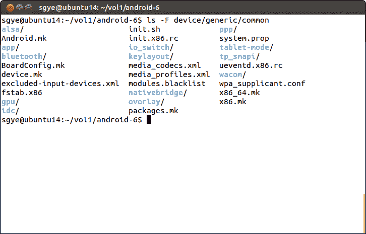
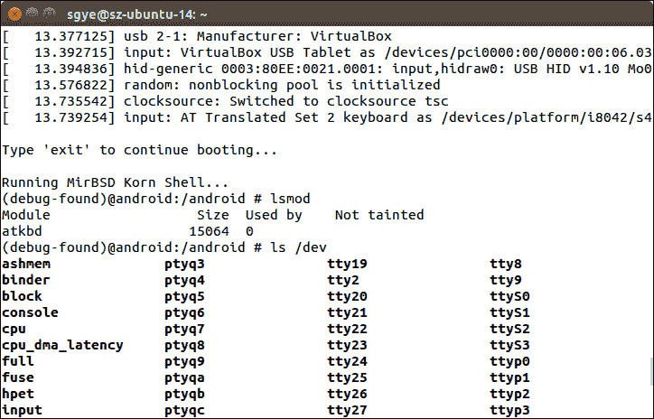
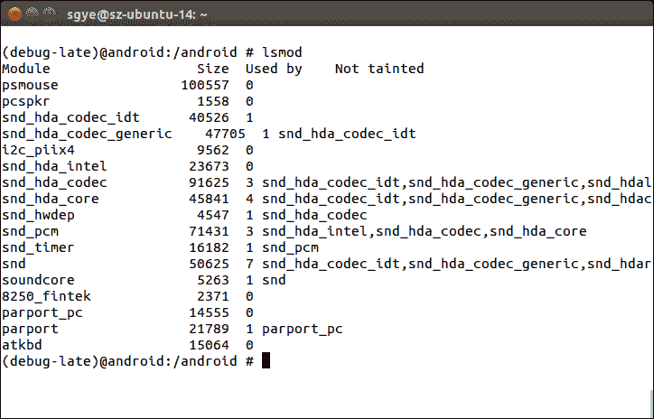

# 第八章：在 VirtualBox 上创建您的设备

我们已经学习了如何使用 x86emu 定制和增强现有设备以支持新功能。x86emu 设备是在以下 Android 模拟器之上创建的设备：goldfish 和 ranchu。从本章到第十一章[启用 VirtualBox 特定硬件接口]，我们将转向一个高级主题：移植 Android 系统。对于 AOSP 不支持的平台，我们能做什么？

在本章中，我们将转向一个新的设备，x86vbox。我们将创建这个新的 x86vbox 设备，以便在 VirtualBox 上运行它。由于 VirtualBox 是 AOSP 直接不支持的虚拟硬件，我们必须自己创建 HAL 层。自己创建 HAL 层并不意味着我们必须从头开始创建一切。正如我之前提到的，移植和定制是集成的艺术。我们可以从其他开源项目中集成我们需要的设备驱动程序。在本章中，我们将涵盖以下主题：

+   分析 Android-x86 项目的 HAL 并使用 Android-x86 HAL 为 x86vbox 设备

+   基于 Android-x86 HAL 分析创建 x86vbox 设备

+   分析 x86vbox 的启动过程

# x86vbox 的 HAL

在我们创建新的 x86vbox 设备之前，我们需要解决一个关键问题：创建 x86vbox 的 HAL。这意味着我们需要支持在 VirtualBox 上出现的硬件设备。正如我们之前所说的，Android-x86 项目是一个旨在为任何基于 x86 的计算设备提供**板级支持包**（**BSP**）的项目。尽管 VirtualBox 是一个虚拟化的 x86 硬件环境，我们仍然可以使用 Android-x86 项目的一部分来支持它。在下面的表中，我们可以看到我们从 Android-x86 中重用的项目列表。我们需要在构建中包含以下三个项目类别：

+   **Linux 内核**：Android-x86 提供了一个可以与 Android 配合使用的内核，用于 Intel x86 架构。

+   **针对 Intel x86 架构的 HAL**：Android-x86 在大多数你可以在 PC 上找到的设备上包含了 HAL 支持。

+   **Android 系统项目和框架项目**：Android-x86 将`system/`和`frameworks/`目录下的某些项目进行了更改，以满足 x86 架构特定的要求。例如，`system/core`下的`init`和`init.rc`已经被更改以与 Android-x86 的双阶段启动相兼容。

在下面的表中，我们还可以从另一个维度查看项目：

+   Android-x86 更改的 AOSP 项目。

+   仅支持 Android-x86 的项目。

+   仅支持 x86vbox 的项目。

在本章和随后的章节中，我们将创建 x86vbox 设备，并对以下一些项目进行更改，以便在 VirtualBox 上运行 x86vbox。

在下面的表中，我们还列出了来自 AOSP、Android-x86 和 x86vbox 的所有内核和 HAL 相关项目。由它们创建或更改的项目用**X**标记：

| **项目** | **AOSP** | **Android-x86** | **x86vbox** | **HAL 模块** |
| --- | --- | --- | --- | --- |
| `kernel` | X | X | X |  |
| `device/generic/x86vbox` |  |  | X |  |
| `bionic` | X | X |  |  |
| `bootable/newinstaller` |  | X | X |  |
| `device/generic/common` | X | X | X |  |
| `device/generic/firmware` |  | X |  |  |
| `external/alsa-lib` |  | X |  |  |
| `external/alsa-utils` |  | X |  |  |
| `external/bluetooth/bluez` |  | X |  | `bluetooth.default` `audio.a2dp.default` |
| `external/bluetooth/glib` |  | X |  |  |
| `external/bluetooth/sbc` |  | X |  |  |
| `external/busybox` |  | X |  |  |
| `external/drm_gralloc` | X | X |  | `gralloc.drm` |
| `external/drm_hwcomposer` | X | X |  | `hwcomposer.drm` |
| `external/e2fsprogs` | X | X |  |  |
| `external/ffmpeg` |  | X |  |  |
| `external/libdrm` | X | X |  |  |
| `external/libpciaccess` |  | X |  |  |
| `external/libtruezip` |  | X |  |  |
| `external/llvm` | X | X |  |  |
| `external/mesa` |  | X |  |  |
| `external/s2tc` |  | X |  |  |
| `external/stagefright-plugins` |  | X |  |  |
| `external/v86d` |  | X |  |  |
| `frameworks/av` | X | X |  |  |
| `frameworks/base` | X | X | X |  |
| `frameworks/native` | X | X |  |  |
| `hardware/broadcom/wlan` | X | X |  |  |
| `hardware/gps` |  | X |  | `gps.default` `gps.huawei` |
| `hardware/intel/audio_media` | X | X |  | `audio.primary.hdmi` |
| `hardware/intel/libsensors` |  | X |  | `sensors.hsb` |
| `hardware/libaudio` |  | X |  | `audio.primary.x86` |
| `hardware/libcamera` |  | X |  | `camera.x86` |
| `hardware/libhardware` | X | X |  | `libhardware` |
| `hardware/libhardware_legacy` | X | X |  | `audio_policy.default` |
| `hardware/liblights` |  | X |  | `lights.default` |

| `hardware/libsensors` |  | X |  | `sensors.hdaps` `sensors.iio`

`sensors.kbd`

`sensors.s103t`

`sensors.w500` |

| `hardware/ril` | X | X |  |  |
| --- | --- | --- | --- | --- |
| `hardware/x86power` |  | X |  | `power.x86` |
| `system/core` | X | X |  |  |

# x86vbox 的清单

根据 preceding 表格的分析，我们可以为 x86vbox 创建清单文件。从前面的表格中，我们可以看到我们重用了来自 Android-x86 的 39 个项目来形成 VirtualBox 的 HAL。在这 39 个项目中，有 16 个来自 AOSP，并由 Android-x86 进行了修改。为了在 VirtualBox 上运行我们的 x86vbox 设备，我们需要在 `device/generic/x86vbox` 创建设备 x86vbox。我们还需要更改四个项目：`kernel`、`bootable/newinstaller`、`device/generic/common` 和 `frameworks/base`。

在 x86vbox 的清单中，我们将包括前面提到的项目，用于 x86 内核、HAL，并且修改了 `system/` 以及 `frameworks/`：

```java
<?xml version="1.0" encoding="UTF-8"?> 
<manifest> 

  <remote  name="github" 
           revision="refs/tags/android-7.1.1_r4_x86vbox_ch08_r1" 
           fetch="." /> 

  <remote  name="aosp" 
           fetch="https://android.googlesource.com/" /> 
  <default revision="refs/tags/android-7.1.1_r4" 
           remote="aosp" 
           sync-c="true" 
           sync-j="1" /> 

  <!-- github/android-7.1.1_r4_ch08 --> 
  <project path="kernel" name="goldfish" remote="github" /> 
  <project path="bootable/newinstaller"   
  name="platform_bootable_newinstaller" 
  remote="github" /> 
  <project path="device/generic/common" name="device_generic_common" 
  groups="pdk" 
  remote="github" /> 
  <project path="device/generic/x86vbox" name="x86vbox" 
  remote="github" /> 
  <project path="bootable/recovery" name="android_bootable_recovery" 
  remote="github" groups="pdk" /> 

  <project path="frameworks/base" name="platform_frameworks_base" 
  groups="pdk-cw-fs,pdk-fs" remote="github" /> 

  <project path="bionic" name="platform_bionic" groups="pdk" 
  remote="github" /> 
  <project path="device/generic/firmware" 
  name="device_generic_firmware" 
  remote="github" /> 
  <project path="external/alsa-lib" name="platform_external_alsa-lib" 
  remote="github" /> 
  <project path="external/alsa-utils" 
  name="platform_external_alsa-utils" 
  remote="github" /> 
  <project path="external/bluetooth/bluez" 
  name="platform_external_bluetooth_bluez" remote="github" /> 
  <project path="external/bluetooth/glib" 
  name="platform_external_bluetooth_glib" 
  remote="github" /> 
  <project path="external/bluetooth/sbc" 
  name="platform_external_bluetooth_sbc" 
  remote="github" /> 
  <project path="external/busybox" name="platform_external_busybox" 
  remote="github" /> 
  <project path="external/drm_gralloc" 
  name="platform_external_drm_gralloc" 
  groups="drm_gralloc" remote="github" /> 
  <project path="external/drm_hwcomposer" 
  name="platform_external_drm_hwcomposer" 
  groups="drm_hwcomposer" remote="github" /> 
  <project path="external/e2fsprogs" name="platform_external_e2fsprogs" 
  groups="pdk" remote="github" /> 
  <project path="external/ffmpeg" name="platform_external_ffmpeg" 
  remote="github" /> 
  <project path="external/libdrm" name="platform_external_libdrm" 
  groups="pdk" 
  remote="github" /> 
  <project path="external/libtruezip" 
  name="platform_external_libtruezip" 
  remote="github" /> 
  <project path="external/llvm" name="platform_external_llvm" 
  groups="pdk" 
  remote="github" /> 
  <project path="external/mesa" name="platform_external_mesa" 
  remote="github" /> 
  <project path="external/s2tc" name="platform_external_s2tc" 
  remote="github" /> 
  <project path="external/stagefright-plugins" 
  name="platform_external_stagefright-plugins" remote="github" /> 
  <project path="external/v86d" name="platform_external_v86d" 
  remote="github" /> 
  <project path="frameworks/av" name="platform_frameworks_av" 
  groups="pdk" 
  remote="github" /> 
  <project path="frameworks/native" name="platform_frameworks_native" 
  groups="pdk" remote="github" /> 
  <project path="hardware/broadcom/wlan" 
  name="platform_hardware_broadcom_wlan" 
  groups="pdk,broadcom_wlan" remote="github" /> 
  <project path="hardware/gps" name="platform_hardware_gps" 
  remote="github" /> 
  <project path="hardware/intel/audio_media" 
  name="platform_hardware_intel_audio_media" groups="intel" 
  remote="github" /> 
  <project path="hardware/intel/libsensors" 
  name="platform_hardware_intel_libsensors" remote="github" /> 
  <project path="hardware/libaudio" name="platform_hardware_libaudio" 
  remote="github" /> 
  <project path="hardware/libcamera" name="platform_hardware_libcamera" 
  remote="github" /> 
  <project path="hardware/libhardware" 
  name="platform_hardware_libhardware" 
  groups="pdk" remote="github" /> 
  <project path="hardware/libhardware_legacy" 
  name="platform_hardware_libhardware_legacy" groups="pdk" 
  remote="github" /> 
  <project path="hardware/liblights" name="platform_hardware_liblights" 
  remote="github" /> 
  <project path="hardware/libsensors" 
  name="platform_hardware_libsensors" 
  remote="github" /> 
  <project path="hardware/ril" name="platform_hardware_ril" 
  groups="pdk" 
  remote="github" /> 
  <project path="hardware/x86power" name="platform_hardware_x86power" 
  remote="github" /> 
  <project path="system/core" name="platform_system_core" groups="pdk" 
  remote="github" /> 

  <!-- aosp --> 
  <project path="build" name="platform/build" groups="pdk,tradefed" > 
    <copyfile src="img/root.mk" dest="Makefile" /> 
  </project> 

... 
</manifest> 

```

我们可以看到，x86vbox 的清单包含两部分。第一部分包括 x86 内核、x86vbox HAL 以及所有位于 GitHub 上的修改过的 AOSP 项目。第二部分包括原始的 AOSP 项目。第二部分的所有项目都没有被 Android-x86 或 x86vbox 修改过。第一部分的大多数项目只被 Android-x86 修改过，所以我们也不必对这些项目做任何事情。

在清单的第一部分中，`external/`或`hardware/`目录下的所有项目都与 x86 HAL 相关。你可能对唯一的 AOSP 项目**bionic**有疑问。你可能想知道为什么 Android-x86 会修改它，因为它是 Android 的 C 库。你可能知道系统调用是在 Linux 系统的 C 库中实现的。原始的 bionic 缺少两个系统调用`ioperm`和`iopl`，而它们是`external/v86d`项目所需要的，该项目是`vesafb`帧缓冲驱动器的用户空间守护进程。

所有的前述分析帮助我们明确了工作范围。正如我们所见，工作范围并不像我们最初想象的那么大。现在有很多开源项目可供使用。如果我们尽可能多地重用它们，通常可以大幅减少工作量。

GitHub 上的所有 Android-x86 项目都是从 Android-x86 镜像分叉的，这样我们就可以修改它们。

# 创建新的 x86vbox 设备

一旦我们有了 VirtualBox 的 HAL，我们现在可以创建一个名为 x86vbox 的新设备。如果我们回顾一下在第四章中创建 x86emu 设备的过程，*自定义 Android 模拟器*，我们知道我们需要为新设备准备一个板/设备配置 Makefile 和一个产品定义 Makefile。我们也可以通过继承现有设备来创建一个新设备。如果我们查看前面的 x86 HAL 表格，我们可以看到一个共同的 x86 设备项目，`device/common`，可以在 Android-x86 中找到。我们将通过继承这个共同的 x86 设备来创建我们的新设备 x86vbox。本章中创建的 x86vbox 是一个 32 位 x86 设备。你可以按照相同的说明自己创建一个 x86_64 设备。

正如我们在第四章中所述，*自定义 Android 模拟器*，我们创建了一个`AndroidProducts.mk` Makefile 来包含 x86vbox 的产品定义 Makefile，如下所示：

```java
PRODUCT_MAKEFILES := \ 
    $(LOCAL_DIR)/x86vbox.mk 

```

# x86vbox 的产品定义 Makefile

如我们所知，AOSP 构建系统会查找`AndroidProducts.mk`以找到特定设备的产品定义 Makefile。让我们回顾一下产品定义 Makefile `x86vbox.mk`，如下所示：

```java
# includes the base of Android-x86 platform 
$(call inherit-product,device/generic/common/x86.mk) 

# Overrides 
PRODUCT_NAME := x86vbox 
PRODUCT_BRAND := Android-x86 
PRODUCT_DEVICE := x86vbox 
PRODUCT_MODEL := x86vbox_ch8 

TARGET_KERNEL_SOURCE := kernel 
TARGET_KERNEL_CONFIG := android-x86_defconfig 
TARGET_ARCH := x86 

PRODUCT_OUT ?= out/target/product/$(PRODUCT_DEVICE) 

include $(TARGET_KERNEL_SOURCE)/AndroidKernel.mk 

# define build targets for kernel 
.PHONY: $(TARGET_PREBUILT_KERNEL) 

LOCAL_KERNEL := $(TARGET_PREBUILT_KERNEL) 

PRODUCT_COPY_FILES += \ 
    $(LOCAL_KERNEL):kernel \ 

```

如我们所见，产品定义 Makefile 非常简单。它执行以下操作：

+   它包含了通用的 x86 产品定义 Makefile，`device/generic/common/x86.mk`

+   它定义了产品定义变量，例如`PRODUCT_NAME`、`PRODUCT_BRAND`、`PRODUCT_DEVICE`、`PRODUCT_MODEL`等

+   它指定了如何为 x86vbox 构建内核。

它看起来甚至比我们在第四章中创建的*x86emu 的 Android 模拟器*的定制版本还要简单。继承的`x86.mk` Makefile 做了大部分实际工作，我们将在稍后进行更深入的分析。

# x86vbox 的板级配置

我们将为 x86vbox 创建的另一个 Makefile 是板级配置 Makefile `BoardConfig.mk`，如下所示：

```java
TARGET_NO_BOOTLOADER := true 

TARGET_ARCH := x86 
TARGET_CPU_ABI := x86 

TARGET_CPU_ABI_LIST_32_BIT := $(TARGET_CPU_ABI) $(TARGET_CPU_ABI2) $(NATIVE_BRIDGE_ABI_LIST_32_BIT) 
TARGET_CPU_ABI_LIST := $(TARGET_CPU_ABI_LIST_32_BIT) 

TARGET_USERIMAGES_USE_EXT4 := true 
BOARD_SYSTEMIMAGE_PARTITION_SIZE := 1153433600 
BOARD_USERDATAIMAGE_PARTITION_SIZE := 419430400 
BOARD_CACHEIMAGE_PARTITION_SIZE := 69206016 
BOARD_CACHEIMAGE_FILE_SYSTEM_TYPE := ext4 
BOARD_FLASH_BLOCK_SIZE := 512 
TARGET_USERIMAGES_SPARSE_EXT_DISABLED := true 

BOARD_SEPOLICY_DIRS += build/target/board/generic/sepolicy 
BOARD_SEPOLICY_DIRS += build/target/board/generic_x86/sepolicy 

include device/generic/common/BoardConfig.mk 

```

它看起来也很简单。它定义了目标架构的特定变量`TARGET_ARCH`、`TARGET_CPU_ABI`、`TARGET_CPU_ABI_LIST_32_BIT`和`TARGET_CPU_ABI_LIST`。然后它定义了系统映像文件的参数。最后，它包含了通用的板级配置 Makefile `device/generic/common/BoardConfig.mk`，我们稍后会查看这个文件。

# 常见的 x86 设备

在 Android-x86 项目中，它定义了一个通用的 x86 设备，以便每个人都可以基于它创建特定的 x86 设备。继承的设备可以是 32 位或 64 位的 x86 设备。

我们可以先查看`device/generic/common`的内容，如下所示：



我们可以看到有很多文件和目录。我们将首先从`BoardConfig.mk`和`x86.mk` Makefile 开始分析。

在`BoardConfig.mk`中，构建系统所需的变量定义如下：

```java
TARGET_BOARD_PLATFORM := android-x86 

# Some framework code requires this to enable BT 
BOARD_HAVE_BLUETOOTH := true 

BOARD_USE_LEGACY_UI := true 

# BOARD_SYSTEMIMAGE_PARTITION_SIZE = $(if $(MKSQUASHFS),0,1610612736) 

# customize the malloced address to be 16-byte aligned 
BOARD_MALLOC_ALIGNMENT := 16 

# Enable dex-preoptimization to speed up the first boot sequence 
# of an SDK AVD. Note that this operation only works on Linux for now 
ifeq ($(HOST_OS),linux) 
WITH_DEXPREOPT := true 
WITH_DEXPREOPT_PIC := true 
endif 

# the following variables could be overridden 
TARGET_PRELINK_MODULE := false 
TARGET_NO_KERNEL ?= false 
TARGET_NO_RECOVERY ?= true 
TARGET_EXTRA_KERNEL_MODULES := tp_smapi 
ifneq ($(filter efi_img,$(MAKECMDGOALS)),) 
TARGET_KERNEL_ARCH ?= x86_64 
endif 
TARGET_USES_64_BIT_BINDER := $(if $(filter x86_64,$(TARGET_ARCH) $(TARGET_KERNEL_ARCH)),true) 

BOARD_USES_GENERIC_AUDIO ?= false 
BOARD_USES_ALSA_AUDIO ?= true 
... 

```

这是一个长长的列表。它定义了音频、Wi-Fi、GPU 和蓝牙相关特性。它也是一个禁用的模拟器相关构建。

现在，让我们看看`x86.mk`：

```java
PRODUCT_PROPERTY_OVERRIDES := \ 
    ro.com.android.dateformat=MM-dd-yyyy \ 

$(call inherit-product,$(LOCAL_PATH)/device.mk) 
$(call inherit-product,$(LOCAL_PATH)/packages.mk) 

# Get a list of languages. 
$(call inherit-product,$(SRC_TARGET_DIR)/product/locales_full.mk) 

# Get everything else from the parent package 
$(call inherit-product,$(SRC_TARGET_DIR)/product/full.mk) 

```

在`x86.mk`中，它从 AOSP 构建系统中包含了两个通用 Makefile，`full.mk`和`locales_full.mk`。如果我们回想一下 x86emu 的设备定义 Makefile，它也从构建系统中包含了这两个 Makefile。

`x86.mk`还导入了另外两个本地 Makefile，`device.mk`和`packages.mk`。在`packages.mk`中，HAL 模块包定义如下：

```java
PRODUCT_PACKAGES := \ 
    camera.x86 \ 
    com.android.future.usb.accessory \ 
    drmserver \ 
    gps.default \ 
    gps.huawei \ 
    hwcomposer.x86 \ 
    io_switch \ 
    libGLES_android \ 
    libhuaweigeneric-ril \ 
    lights.default \ 
    power.x86 \ 
    powerbtnd \ 
    sensors.hsb \ 
    tablet-mode \ 
    v86d \ 
    wacom-input \ 

PRODUCT_PACKAGES += \ 
    libwpa_client \ 
    hostapd \ 
    wpa_supplicant \ 
    wpa_supplicant.conf \ 

```

这并不是包的完整列表。在`device.mk`中，还有更多组件被添加到`PRODUCT_PACKAGES`中，如下所示：

```java
PRODUCT_DIR := $(dir $(lastword $(filter-out device/common/%,$(filter device/%,$(ALL_PRODUCTS))))) 

PRODUCT_PROPERTY_OVERRIDES := \ 
    ro.ril.hsxpa=1 \ 
    ro.ril.gprsclass=10 \ 
    keyguard.no_require_sim=true \ 
    ro.com.android.dataroaming=true 

PRODUCT_DEFAULT_PROPERTY_OVERRIDES := \ 
    ro.arch=x86 \ 
    persist.rtc_local_time=1 \ 

PRODUCT_COPY_FILES := \... 
PRODUCT_TAGS += dalvik.gc.type-precise 

PRODUCT_CHARACTERISTICS := tablet 

PRODUCT_AAPT_CONFIG := normal large xlarge mdpi hdpi 
PRODUCT_AAPT_PREF_CONFIG := mdpi 

DEVICE_PACKAGE_OVERLAYS := $(LOCAL_PATH)/overlay 

# Get the firmwares 
$(call inherit-product,device/generic/firmware/firmware.mk) 

# Get the touchscreen calibration tool 
$(call inherit-product-if-exists,external/tslib/tslib.mk) 

# Get the alsa files 
$(call inherit-product-if-exists,hardware/libaudio/alsa.mk) 

# Get GPS configuration 
$(call inherit-product-if-exists,device/common/gps/gps_as.mk) 

# Get the hardware acceleration libraries 
$(call inherit-product-if-exists,$(LOCAL_PATH)/gpu/gpu_mesa.mk) 

# Get the sensors hals 
$(call inherit-product-if-exists,hardware/libsensors/sensors.mk) 

# Get tablet dalvik parameters 
$(call inherit-product,frameworks/native/build/tablet-10in-xhdpi-2048-dalvik-heap.mk) 

# Get GMS 
$(call inherit-product-if-exists,vendor/google/products/gms.mk) 

# Get native bridge settings 
$(call inherit-product-if-exists,$(LOCAL_PATH)/nativebridge/nativebridge.mk) 

```

在`device.mk`中，它定义了 x86 设备的属性，并随后列出了要复制的文件列表。最后，它包括各种组件的单独 Makefile，例如固件、触摸屏校准工具、音频、GPS、传感器和本地桥接器等。你可以自己分别在每个相应的文件夹中找到并调查它们。在本章中，我们只概述了如何创建 x86vbox 设备。我们将在后面的章节中深入探讨一些硬件接口的细节。

# 获取源代码和构建 x86vbox 设备

要构建 x86vbox 设备，我们可以使用以下命令从 GitHub 和 AOSP 获取源代码：

```java
$ repo init https://github.com/shugaoye/manifests -b android-7.1.1_r4_ch08_aosp
$ repo sync  

```

使用`android-7.1.1_r4_ch08_aosp`标签作为本章更改的基线。

在我们获取本章的源代码后，我们可以设置环境和构建系统，如下所示：

```java
$ source build/envsetup.sh
$ lunch x86vbox-eng
$ make -j4 

```

# 启动过程和设备初始化

由于我们使用 Android-x86 内核和 HAL 为 x86vbox，我们将进一步分析本节中 x86vbox 的启动过程。通过分析，我们可以了解 Android-x86 是如何使用一个代码库支持多个设备的。你可以回顾我们在第六章，*使用自定义 ramdisk 调试启动过程*中讨论的两个阶段启动过程。现在，我们将在此基础上进行更详细的分析。

Android-x86 的内核与我们第六章，*使用自定义 ramdisk 调试启动过程*中用于模拟器的内核不同。Android-x86 内核并不知道它需要支持哪些硬件接口，因此它尽可能多地构建与它相关的设备驱动程序。另一方面，goldfish 内核知道它需要支持哪些硬件。这种差异意味着它们是以两种不同的方式构建的。goldfish 内核包含了内核内部支持的所有设备，因此它根本不使用内核模块。然而，对于 Android-x86 内核来说，这样做是不可能的，因为这会使内核的大小变得过大。Android-x86 的内核广泛使用内核模块。

我们在本章中将重点分析设备节点是如何在启动过程中创建的，以及内核模块是如何加载的。由于 Android-x86 的启动分为两个阶段，设备初始化也被分为两个阶段。

# Android 启动前的设备初始化

启动过程将从嵌入式 Linux 环境作为第一阶段开始。大多数设备将在这一阶段进行初始化。好事是，Android-x86 可以通过定义的环境变量进入一个带有调试控制台的控制台环境。在这个控制台中，我们可以检查系统状态，以确定我们是否拥有我们想要创建的正确配置。默认的 init 脚本包含两个调试检查点。第一个检查点是在根设备挂载之后。第二个检查点是在所有驱动程序加载之后。当然，你可以通过更改 init 脚本来设置尽可能多的检查点。

以下是我们进入第一个检查点之前想要查看的 init 脚本的一部分：

```java
PATH=/sbin:/bin:/system/bin:/system/xbin; export PATH 
... 
# early boot 
if test x"$HAS_CTTY" != x"Yes"; then 
    # initialise /proc and /sys 
    busybox mount -t proc proc /proc 
    busybox mount -t sysfs sys /sys 
    # let busybox install all applets as symlinks 
    busybox --install -s 
    # spawn shells on tty 2 and 3 if debug or installer 
    if test -n "$DEBUG" || test -n "$INSTALL"; then 
        # ensure they can open a controlling tty 
        mknod /dev/tty c 5 0 
        # create device nodes then spawn on them 
        mknod /dev/tty2 c 4 2 && openvt 
        mknod /dev/tty3 c 4 3 && openvt 
    fi 
    if test -z "$DEBUG" || test -n "$INSTALL"; then 
        echo 0 0 0 0 > /proc/sys/kernel/printk 
    fi 
    # initialise /dev (first time) 
    mkdir -p /dev/block 
    echo /sbin/mdev > /proc/sys/kernel/hotplug 
    mdev -s 
    # re-run this script with a controlling tty 
    exec env HAS_CTTY=Yes setsid cttyhack /bin/sh "$0" "$@" 
fi 
... 

```

在早期启动阶段，init 脚本使用内核挂载`/proc`和`/sys`文件系统。之后，它设置`busybox`的符号链接，以便我们可以使用所有`busybox`命令。然后，它将`/sbin/mdev`设置为热插拔的处理程序。`mdev`命令是`udev`的最小实现。`mdev`可以在内核检测到新设备时动态管理`/dev`下的设备节点。`mdev`是`busybox`的一部分，因此我们需要首先创建所有`busybox`符号链接。它还需要`/proc`和`/sys`文件系统。设置热插拔后，脚本运行`mdev -s`命令以找到内核当前检测到的所有设备。此时，`/dev`下的所有设备节点都已创建。

udev 和**mdev** **udev**是 Linux 内核的设备管理器。作为 devfsd 和 hotplug 的后继者，udev 主要管理`/dev`目录下的设备节点。同时，udev 还处理在硬件设备添加到系统或从系统中移除时产生的所有用户空间事件，包括某些**设备**所需的固件加载。

**mdev**是`busybox`中 udev 的最小实现。它用于嵌入式系统以替换 udev。mdev 在 udev 中缺少一些功能，例如设备驱动程序加载的完整实现等。我们可以看到，Android-x86 在第一次启动阶段使用 mdev。

让我们看看这个阶段的内核模块和设备节点：



内核模块和设备节点

如前一个截图所示，所有设备节点都创建在`/dev`下。然而，此时只加载了一个内核模块。我们现在处于第一个检查点。

让我们继续前进，看看在达到下一个检查点之前的脚本中会发生什么。要退出第一个检查点，我们需要运行`exit`命令以继续执行脚本。

```java
(debug-found)@android:/android # exit  

```

在退出第一个检查点后，它将继续执行以下脚本：

```java
... 
[ -n "$INSTALL" ] && do_install 

load_modules 
mount_data 
mount_sdcard 
setup_tslib 
setup_dpi 
post_detect 

if [ 0$DEBUG -gt 1 ]; then 
    echo -e "\nUse Alt-F1/F2/F3 to switch between virtual consoles" 
    echo -e "Type 'exit' to enter Android...\n" 

    debug_shell debug-late 
fi 

... 

```

我们可以看到，在进入下一个检查点之前，init 脚本执行以下任务：

1.  加载内核模块。

1.  挂载数据分区。

1.  挂载 SD 卡。

1.  设置触摸屏校准工具。

1.  设置屏幕 DPI。

1.  执行任何其他启动后的检测。

您可以自行学习任务 2 到 6 的脚本，因为它们非常直接且易于理解。我们在这里想更详细地看看第一个任务：

```java
auto_detect() 
{ 
    tmp=/tmp/dev2mod 
    echo 'dev2mod() { while read dev; do case $dev in' > $tmp 
    sort -r /lib/modules/`uname -r`/modules.alias | \ 
        sed -n 's/^alias  *\([^ ]*\)  *\(.*\)/\1)busybox modprobe 
        \2;;/p' >> $tmp 
    echo 'esac; done; }' >> $tmp 
    sed -i '/brcmfmac/d' $tmp 
    source $tmp 
    cat /sys/bus/*/devices/*/uevent | grep MODALIAS | sed 
    's/^MODALIAS=//' 
    | sort -u | dev2mod 
    cat /sys/devices/virtual/wmi/*/modalias | dev2mod 
} 

load_modules() 
{ 
    if [ -z "$FOUND" ]; then 
        auto_detect 
    fi 

    # 3G modules 
    for m in $EXTMOD; do 
        busybox modprobe $m 
    done 
} 

```

`load_modules`脚本函数在前面代码片段所示的脚本文件`0-auto-detect`中实现。它调用另一个函数`auto-detect`来完成实际工作。这个函数并不容易理解。现在让我们解释一下它做了什么。这个函数的目的是动态创建一个名为`dev2mod`的 shell 命令。这个`dev2mod`函数的作用是接受模块别名作为参数，并根据模块别名加载相应的驱动模块。在创建`dev2mod`命令后，`auto_detect`将使用在`/sys/bus`文件夹下由内核找到的设备调用此函数。

Android-x86 内核的所有内核模块都可以在`/lib/modules/4.x.x-android-x86/modules.alias`文件中找到。此文件被处理，以便在每行的末尾添加`modprobe`命令，以便可以使用模块别名作为参数加载内核模块。临时脚本文件位于`/tmp/dev2mod`，如下所示代码片段：

```java
# cat /tmp/dev2mod
dev2mod() { while read dev; do case $dev in 
xts)busybox modprobe xts;; 
xtea)busybox modprobe tea;; 
xeta)busybox modprobe tea;; 
xcbc)busybox modprobe xcbc;; 
wp512)busybox modprobe wp512;; 
wp384)busybox modprobe wp512;; 
wp256)busybox modprobe wp512;; 
...
acpi*:80860ABC:*)busybox modprobe intel_lpss_acpi;; 
acpi*:80860AAC:*)busybox modprobe intel_lpss_acpi;; 
acpi*:193C9890:*)busybox modprobe snd_soc_max98090;; 
acpi*:10EC5670:*)busybox modprobe snd_soc_rt5670;; 
acpi*:10EC5650:*)busybox modprobe snd_soc_rt5645;; 
acpi*:10EC5645:*)busybox modprobe snd_soc_rt5645;; 
acpi*:10EC5642:*)busybox modprobe snd_soc_rt5640;; 
acpi*:10EC5640:*)busybox modprobe snd_soc_rt5640;; 
acpi)busybox modprobe acpi_cpufreq;; 
esac; done; }   

```

在将`/sys`文件系统中的设备传递给`dev2mod`函数之前，我们可以查看在我的系统上输出看起来如下：

```java
# cat /sys/bus/*/devices/*/uevent | grep MODALIAS | sed 's/^MODALIAS=//' 
| sort -u
acpi:ACPI0003: 
acpi:APP0001:SMC-NAPA: 
acpi:LNXCPU: 
acpi:LNXPWRBN: 
acpi:LNXSLPBN: 
acpi:LNXSYBUS: 
acpi:LNXSYSTM: 
acpi:LNXVIDEO: 
acpi:PNP0000: 
acpi:PNP0100: 
acpi:PNP0103:PNP0C01: 
acpi:PNP0200: 
acpi:PNP0303: 
acpi:PNP0400: 
acpi:PNP0501: 
acpi:PNP0700: 
acpi:PNP0A03: 
acpi:PNP0B00: 
acpi:PNP0C02: 
acpi:PNP0C0A: 
acpi:PNP0C0F: 
acpi:PNP0F03: 
acpi:PNP8390: 
cpu:type:x86,ven0000fam0006mod003A:feature:,0000,0001,0002,0003,0004,0005,0006,0
hdaudio:v83847680r00103401a01 
hid:b0003g0001v000080EEp00000021 
pci:v0000106Bd0000003Fsv00000000sd00000000bc0Csc03i10 
pci:v00001AF4d00001000sv00001AF4sd00000001bc02sc00i00 
pci:v00008086d00001237sv00000000sd00000000bc06sc00i00 
pci:v00008086d0000265Csv00000000sd00000000bc0Csc03i20 
pci:v00008086d00002668sv00008384sd00007680bc04sc03i00 
pci:v00008086d00007000sv00000000sd00000000bc06sc01i00 
pci:v00008086d00007111sv00000000sd00000000bc01sc01i8A 
pci:v00008086d00007113sv00000000sd00000000bc06sc80i00 
pci:v000080EEd0000BEEFsv00000000sd00000000bc03sc00i00 
pci:v000080EEd0000CAFEsv00000000sd00000000bc08sc80i00 
platform:alarmtimer 
platform:goldfish_pdev_bus
platform:i8042 
platform:microcode 
platform:pcspkr 
platform:platform-framebuffer 
platform:reg-dummy 
platform:rtc_cmos 
platform:serial8250 
scsi:t-0x00 
scsi:t-0x05 
serio:ty01pr00id00ex00 
serio:ty06pr00id00ex00 
usb:v1D6Bp0001d0404dc09dsc00dp00ic09isc00ip00in00 
usb:v1D6Bp0002d0404dc09dsc00dp00ic09isc00ip00in00 
usb:v80EEp0021d0100dc00dsc00dp00ic03isc00ip00in00 
virtio:d00000001v00001AF4

```

如前所述输出所示，它包括了内核找到的所有模块别名。模块别名的先前输出将通过管道传递给 shell 脚本函数`dev2mod`。`dev2mod`函数将加载内核找到的所有相应模块。

在执行`load_modules`之后，我们进入第二个检查点，现在我们可以查看系统状态：



内核模块加载

从前述截图我们可以看到，现在系统中加载了许多内核模块。从内核模块名称中，我们可以看到音频、鼠标和键盘驱动程序已被加载。这就是 Android-x86 init 脚本在`initrd.img`中自动加载设备驱动程序的方式。在 init 脚本末尾，它将根据环境变量`DEBUG`的设置调用`chroot`或`switch_root`。在任一情况下，根文件系统将更改为 Android 的`ramdisk.img`，并启动 Android init 进程，如下所示：

```java
... 
[ -n "$DEBUG" ] && SWITCH=${SWITCH:-chroot} 

# We must disable mdev before switching to Android 
# since it conflicts with Android's init 
echo > /proc/sys/kernel/hotplug 

exec ${SWITCH:-switch_root} /android /init 
... 

```

Android init 进程将为这些内核无法自动检测到的设备执行硬件初始化。init 进程还将初始化 Android-x86 的 HAL。

# Android 启动时的 HAL 初始化

让我们更详细地探讨一下内核无法自动检测到的设备的硬件初始化，以及 Android-x86 HAL 的初始化，本节将进行介绍。尚未初始化的一个外围设备是 Android 图形用户界面的帧缓冲区。我们将以此为例，解释 Android 的`ramdisk.img`中 init 进程是如何初始化硬件的。

如果我们回顾第六章 调试启动过程使用自定义的 ramdisk 中对 init 进程的分析，init 进程将执行 `init.rc` 脚本，这是适用于所有 Android 设备的通用脚本。在 `init.rc` 脚本中，它将导入特定设备的脚本 `init.${ro.hardware}.rc`。在我们的案例中，这个脚本是在目标设备上的 `init.x86vbox.rc`。`ro.hardware` 属性根据内核命令行参数 `androidboot.hardware` 设置，我们将其设置为 `x86vbox`。`init.x86vbox.rc` 的源代码可以在 `device/generic/common/init.x86.rc` 中找到。它通过 `device.mk` 中的以下行复制到目标输出。请注意，脚本名称在复制后已更改：

```java
... 
PRODUCT_COPY_FILES := \ 
    $(if $(wildcard $(PRODUCT_DIR)init.rc),$(PRODUCT_DIR)init.rc:root/init.rc) \ 
    $(if $(wildcard $(PRODUCT_DIR)init.sh),$(PRODUCT_DIR),$(LOCAL_PATH)/)init.sh:system/etc/init.sh \  
... 
    $(if $(wildcard $(PRODUCT_DIR)init.$(TARGET_PRODUCT).rc),$(PRODUCT_DIR)init.$(TARGET_PRODUCT).rc,$(LOCAL_PATH)/init.x86.rc):root/init.$(TARGET_PRODUCT).rc \ 
    $(if $(wildcard $(PRODUCT_DIR)ueventd.$(TARGET_PRODUCT).rc),$(PRODUCT_DIR)ueventd.$(TARGET_PRODUCT).rc,$(LOCAL_PATH)/ueventd.x86.rc):root/ueventd.$(TARGET_PRODUCT).rc \ 
... 

```

从前述代码片段中我们还可以看到，shell 脚本 `init.sh` 也被复制到了系统镜像的 `/system/etc/init.sh` 路径下。这是在 `init.x86vbox.rc` 中用于加载设备驱动程序和初始化 HAL 的脚本。

在 `init.x86vbox.rc` 文件中，一个动作触发器被定义为如下：

```java
on post-fs 
    exec -- /system/bin/logwrapper /system/bin/sh /system/etc/init.sh 

```

在预定义的触发器 `post-fs` 中，`init.sh` 脚本将作为初始化过程的一部分执行。以下为 `init.sh` 的代码片段：

```java
... 
PATH=/sbin:/system/bin:/system/xbin 

DMIPATH=/sys/class/dmi/id 
BOARD=$(cat $DMIPATH/board_name) 
PRODUCT=$(cat $DMIPATH/product_name) 

# import cmdline variables 
for c in `cat /proc/cmdline`; do 
    case $c in 
        BOOT_IMAGE=*|iso-scan/*|*.*=*) 
            ;; 
        *=*) 
            eval $c 
            if [ -z "$1" ]; then 
                case $c in 
                    HWACCEL=*) 
                        set_property debug.egl.hw $HWACCEL 
                        ;; 
                    DEBUG=*) 
                        [ -n "$DEBUG" ] && set_property debug.logcat 1 
                        ;; 
                esac 
            fi 
            ;; 
    esac 
done 

[ -n "$DEBUG" ] && set -x || exec &> /dev/null 

# import the vendor specific script 
hw_sh=/vendor/etc/init.sh 
[ -e $hw_sh ] && source $hw_sh 

case "$1" in 
    netconsole) 
        [ -n "$DEBUG" ] && do_netconsole 
        ;; 
    bootcomplete) 
        do_bootcomplete 
        ;; 
    hci) 
        do_hci 
        ;; 
    init|"") 
        do_init 
        ;; 
esac 

return 0 

```

如前述代码片段所示，`init.sh` 脚本首先处理内核命令行。之后，它遇到一个多选择语句。根据传递给它的第一个参数执行一个函数。这个参数用于让 `do_init` 函数初始化特定的 HAL 模块。在第一个参数的情况下，它是 `init` 或没有参数，将执行 `do_init` 函数。在这种情况下，所有 HAL 模块都将被初始化，这是我们目前想要调查的情况。我们可以如下查看 `do_init` 函数做了什么：

```java
function do_init() 
{ 
    init_misc 
    init_hal_audio 
    init_hal_bluetooth 
    init_hal_camera 
    init_hal_gps 
    init_hal_gralloc 
    init_hal_hwcomposer 
    init_hal_lights 
    init_hal_power 
    init_hal_sensors 
    init_tscal 
    init_ril 
    post_init 
} 

```

`do_init` 函数将逐个调用各个 HAL 模块初始化函数。我们在这里不会查看所有这些函数。我们将看看在 `init_hal_gralloc` 函数中如何初始化帧缓冲区设备。这是我们将在第十章 *启用图形* 中更深入调查的内容，因为图形支持在移植过程中是最重要的任务之一：

```java
function init_uvesafb() 
{ 
    case "$PRODUCT" in 
        ET2002*) 
            UVESA_MODE=${UVESA_MODE:-1600x900} 
            ;; 
        *) 
            ;; 
    esac 

    [ "$HWACCEL" = "0" ] && bpp=16 || bpp=32 
    modprobe uvesafb mode_option=${UVESA_MODE:-1024x768}-$bpp 
    ${UVESA_OPTION:-mtrr=3 scroll=redraw} 
} 

function init_hal_gralloc() 
{ 
    case "$(cat /proc/fb | head -1)" in 
        *virtiodrmfb) 
        # set_property ro.hardware.hwcomposer drm 
            ;& 
        0*inteldrmfb|0*radeondrmfb|0*nouveaufb|0*svgadrmfb) 
            set_property ro.hardware.gralloc drm 
            set_drm_mode 
            ;; 
        "") 
            init_uvesafb 
            ;& 
        0*) 
            ;; 
    esac 

    [ -n "$DEBUG" ] && set_property debug.egl.trace error 
} 

```

在 `init_hal_gralloc` 函数中，它将根据 `/proc/fb` 的内容执行相应的任务。从 `/proc/fb`，它可以检测设备上图形硬件的类型。如果无法检测到图形硬件的类型，它将使用通用的 VESA 帧缓冲区（uvesafb），在我们的案例中用于 VirtualBox。它将调用另一个 shell 函数 `init_uvesafb` 来加载 VESA 帧缓冲区驱动程序。uvesafb 驱动程序将启动一个用户空间守护进程 `v86d` 来执行 x86 BIOS 代码。代码在受控环境中执行，并通过 netlink 接口将结果传回内核。这就是在我们的环境中初始化图形驱动程序的方式。

# 摘要

在本章中，我们分析了 Android-x86 HAL 并将其集成到 x86vbox 中，以便我们能够在接下来的几章中启动 x86vbox。我们还分析了 Android-x86 的启动过程。在启动过程的第一个阶段，我们使用了调试控制台来分析内核模块加载过程。在我们实际上在 VirtualBox 上启动 x86vbox 之前，一个尚未解决的问题是我们应该使用哪个引导加载程序。与模拟器不同，它不需要引导加载程序，因为模拟器使用内置的迷你引导加载程序来加载内核和 ramdisk。VirtualBox 非常类似于真实硬件。如果没有合适的引导加载程序，我们将无法启动操作系统。

在下一章中，我们将讨论这个问题，并解释我们如何使用 VirtualBox 支持的 PXE 引导来解决它。
