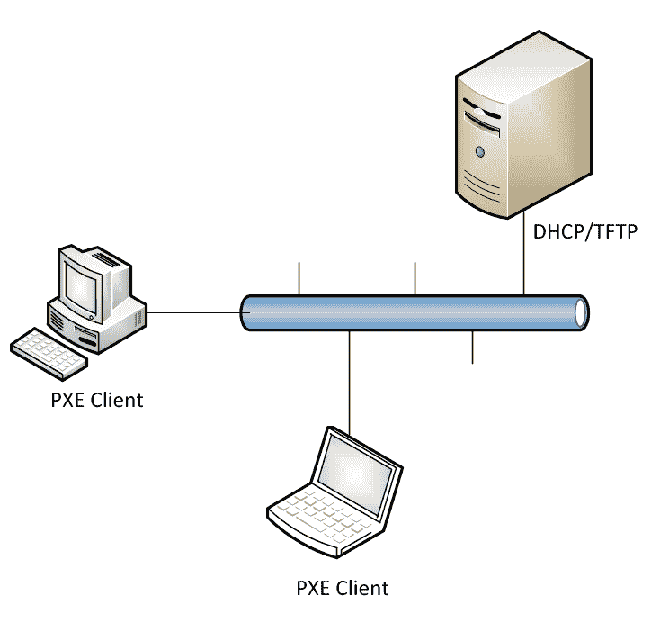
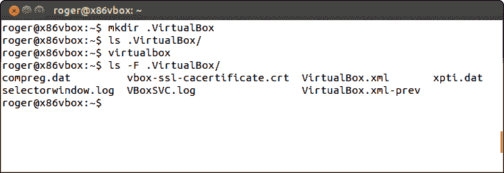
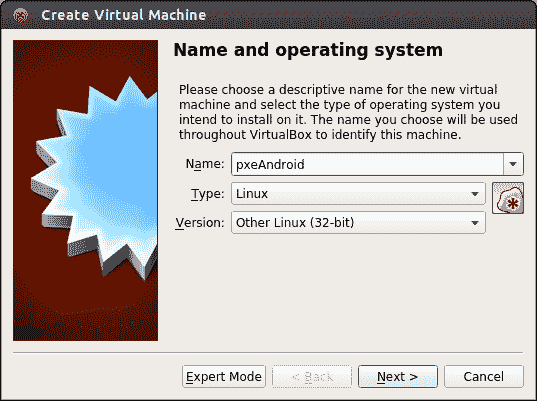
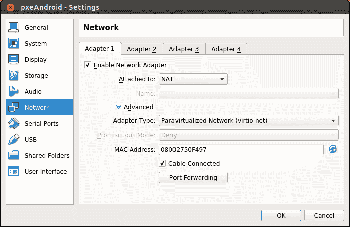
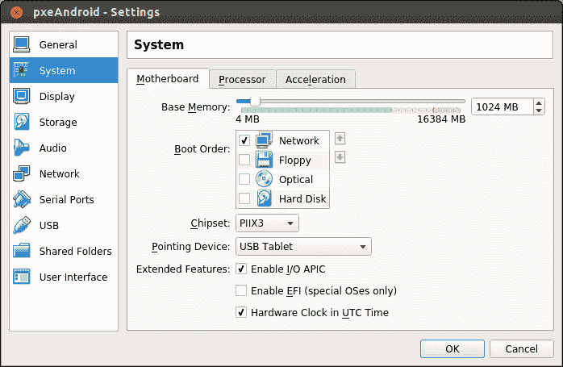
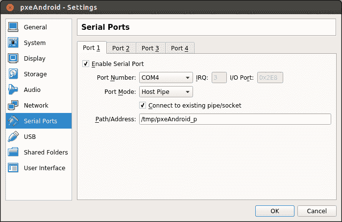
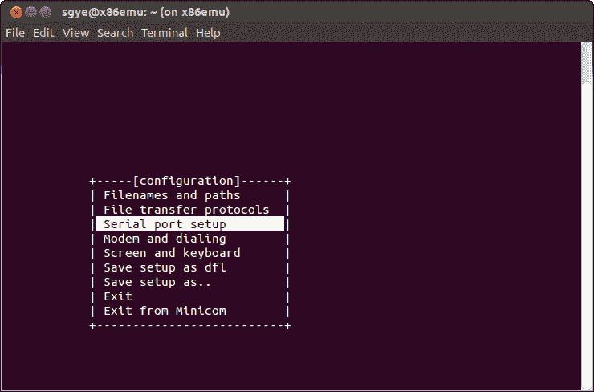
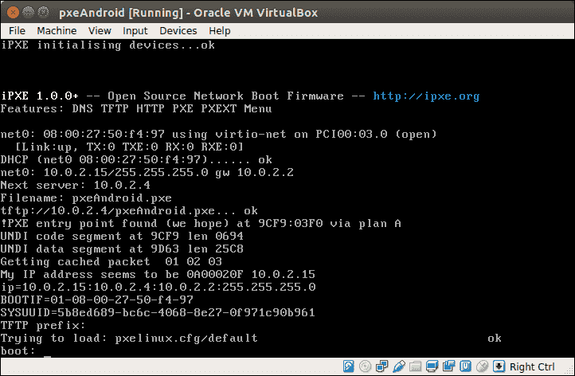
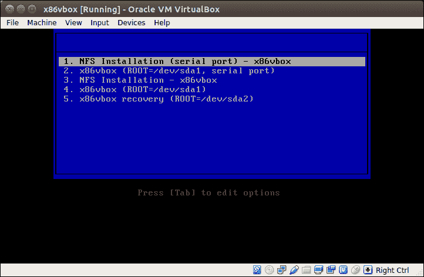
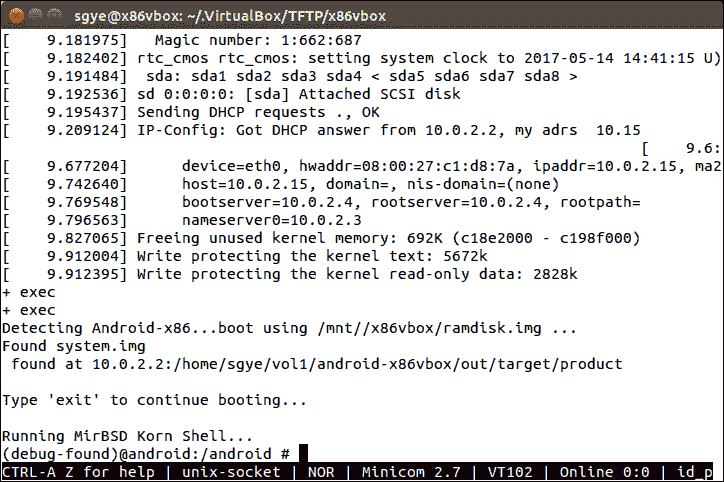

# 第九章：使用 PXE/NFS 引导 x86vbox

在上一章中，我们创建了 x86vbox 设备，并且我们能够在我们的环境中构建它。在这一章中，我们将开始调试 x86vbox 的引导过程。在引导过程中我们遇到的第一件事是引导加载程序问题。我们可以使用与 Android-x86 相同的 GRUB 引导加载程序。使用 GRUB，我们仍然会遇到如何在存储介质上配置和安装它的问题。如果我们这样做，我们需要花时间讨论与引导加载程序相关的话题。

使用 VirtualBox 作为虚拟硬件平台，我们有一个更简单的解决方案。我们可以使用内置的 PXE 引导机制来避免引导加载程序问题。从调试的角度来看，PXE 引导可以使整个引导过程对我们更加透明。使用 PXE 引导，我们可以将引导加载程序的安装移出画面，这样我们就可以专注于调试 Android 系统本身。在本章中，我们将涵盖以下主题：

+   设置 PXE 引导环境

+   配置 VirtualBox 从 PXE 引导

+   使用 NFS 设置根文件系统

# 设置 PXE 引导环境

什么是 PXE？**PXE** 代表 **预引导执行环境**。为了构建 Linux 环境，我们需要找到一种方法将内核和 ramdisk 装载到系统内存中。这是大多数 Linux 引导加载程序执行的主要任务之一。引导加载程序通常从某种存储设备中获取内核和 ramdisk，例如闪存存储、硬盘、USB 等。它也可以从网络连接中获取。PXE 是一种可以启动具有 LAN 连接和 PXE 兼容 **网络接口控制器**（**NIC**）的设备的方法。

如下图中所示，PXE 使用 DHCP 和 TFTP 协议来完成引导过程。在最简单的环境中，PXE 服务器被设置为 DHCP 和 TFTP 服务器。NIC 客户端从 DHCP 服务器获取 IP 地址，并使用 TFTP 协议获取内核和 ramdisk 映像以启动引导过程：



PXE 引导环境

在本节中，我们将学习如何为 VirtualBox virtio 网络适配器准备一个 PXE 兼容的 ROM，以便我们可以使用这个 ROM 通过 PXE 引导系统。我们还将学习如何设置 PXE 服务器，这是 PXE 设置中的关键元素。在 VirtualBox 中，它包括一个内置的 PXE 服务器。我们将使用这个内置的 PXE 服务器来引导 Android 系统。

# 准备 PXE 引导 ROM

尽管 VirtualBox 支持 PXE 引导，但不同网络适配器上的设置并不一致。在引导过程中，您可能会收到诸如`PXE-E3C - TFTP 错误 - 访问违规`之类的错误消息。这是因为 PXE 引导依赖于 LAN 引导 ROM。当您选择不同的网络适配器时，您可能会得到不同的测试结果。为了获得一致的测试结果，您可以使用来自 Etherboot/gPXE 项目的 LAN 引导 ROM。gPXE 是一个开源（GPL）网络引导程序。它提供了对专有 PXE ROM 的直接替换，具有许多额外功能，如 DNS、HTTP、iSCSI 等。在 gPXE 项目网站上有一个页面，介绍了如何为 VirtualBox 设置 LAN 引导 ROM：

[`www.etherboot.org/wiki/romburning/vbox`](http://www.etherboot.org/wiki/romburning/vbox)

以下表格列出了 VirtualBox 支持的网络适配器：

| **VirtualBox 适配器** | **PCI 厂商 ID** | **PCI 设备 ID** | **制造商名称** | **设备名称** |
| --- | --- | --- | --- | --- |
| Am79C970A | 1022h | 2000h | AMD | PCnet-PCI II (AM79C970A) |
| Am79C973 | 1022h | 2000h | AMD | PCnet-PCI III (AM79C973) |
| 82540EM | 8086h | 100Eh | Intel | Intel PRO/1000 MT Desktop (82540EM) |
| 82543GC | 8086h | 1004h | Intel | Intel PRO/1000 T Server (82543GC) |
| 82545EM | 8086h | 100Fh | Intel | Intel PRO/1000 MT Server (82545EM) |
| virtio | 1AF4h | 1000h |  | 虚拟化网络（virtio-net） |

由于在大多数情况下虚拟化网络具有更好的性能，我们将探讨如何使用 virtio-net 网络适配器支持 PXE 引导。

# 下载和构建 LAN 引导 ROM

网络上可能有可用的 LAN 引导 ROM 二进制镜像，但它们在 gPXE 项目中并未提供。我们必须根据 gPXE 项目网站上的说明从源代码构建。

让我们使用以下命令下载和构建源代码：

```java
$ git clone git://git.etherboot.org/scm/gpxe.git
$ cd gpxe/src
$ make bin/1af41000.rom  # for virtio 1af4:1000  

```

# 修复 ROM 镜像

在 ROM 镜像可以使用之前，由于 VirtualBox 对 ROM 镜像大小有以下要求，因此必须更新 ROM 镜像：

+   大小必须是 4K 对齐的（即 4,096 的倍数）

+   大小不能超过 64K

首先检查镜像大小，确保它不超过 65,536 字节（64K）：

```java
$ ls -l bin/1af41000.rom | awk '{print $5}'
62464  

```

我们可以看到它小于 64K。现在我们必须将镜像文件填充到 4K 边界。我们可以使用以下命令来完成此操作：

```java
$ python
>>> 65536 - 62464             # Calculate padding size
3072
>>> f = open('bin/1af41000.rom', 'a')
>>> f.write('\0' * 3072)      # Pad with zeroes
>>> f.close()  

```

我们再次检查镜像文件大小：

```java
$ ls -l bin/1af41000.rom | awk '{print $5}'
65536  

```

如我们所见，文件大小现在是 64K。为了方便，我将在以下链接上传此文件，您可以下载它：

[`sourceforge.net/projects/android-system-programming/files/android-7/ch14/1af41000.rom/download`](https://sourceforge.net/projects/android-system-programming/files/android-7/ch14/1af41000.rom/download)

# 配置虚拟机使用 LAN 引导 ROM

基于用户的 VirtualBox 配置可以存储在`$HOME/.VirtualBox`文件夹中，我们需要使用此文件夹来配置内置的 PXE 服务器。

此文件夹默认不会创建，因此我们需要首先创建它：

```java
$ mkdir .VirtualBox  

```

在我们创建这个文件夹后，我们可以启动 VirtualBox 并退出。然后，让我们再次查看 `$HOME/.VirtualBox` 文件夹的内容，如下面的截图所示：



从前面的截图，我们可以看到在运行 VirtualBox 之前，这个文件夹的内容是空的。在执行 VirtualBox 并退出后，这个文件夹中会创建一系列由 VirtualBox 生成的文件。

现在，我们可以更改配置以使用我们刚刚创建的 LAN 启动 ROM。要使用此 LAN 启动 ROM，我们可以使用 `VBoxManage` 命令更新 VirtualBox 设置。我们使用以下命令设置 `LanBootRom` 路径：

```java
$ VBoxManage setextradata global VBoxInternal/Devices/pcbios/0/Config/LanBootRom $HOME/.VirtualBox/1af41000.rom  

```

我们将 LAN 启动 ROM 复制到了 `$HOME/.VirtualBox/1af41000.rom`。在这里我们使用 `global`，然后所有虚拟机都将使用 gPXE LAN 启动 ROM。我们可以将 `global` 改为特定的虚拟机名称。在这种情况下，gPXE LAN 启动 ROM 将仅由该虚拟机使用。

设置好配置后，让我们看看 `$HOME/.VirtualBox/VirtualBox.xml` 配置文件：

```java
<?xml version="1.0"?> 
<!-- 
** DO NOT EDIT THIS FILE. 
** If you make changes to this file while any VirtualBox related application 
** is running, your changes will be overwritten later, without taking effect. 
** Use VBoxManage or the VirtualBox Manager GUI to make changes. 
--> 
<VirtualBox  version="1.12-linux"> 
  <Global> 
    <ExtraData> 
      <ExtraDataItem name="GUI/DetailsPageBoxes" 
      value="general,system,preview,display,storage,audio,
      network,usb,sharedFolders,description"/> 
      <ExtraDataItem name="GUI/LastWindowPosition" 
      value="475,240,770,550"/> 
      <ExtraDataItem name="GUI/SplitterSizes" value="255,511"/> 
      <ExtraDataItem name="GUI/UpdateCheckCount" value="2"/> 
      <ExtraDataItem name="GUI/UpdateDate" value="1 d, 2017-05-15, 
      stable, 5.1.2"/> 
<ExtraDataItem 
 name="VBoxInternal/Deices/pcbios/o/Config/LanBootRom"
 value="/home/roger/.VirtualBox/1af41000.rom"/> 
    </ExtraData> 
... 

```

如我们所见，`VBoxInternal/Deices/pcbios/o/Config/LanBootRom` 配置设置在这个配置文件中。

要删除前面的配置，我们只需将路径值重置如下。`$VM_NAME` 参数可以是 `global` 或虚拟机名称：

```java
$ VBoxManage setextradata $VM_NAME VBoxInternal/Devices/pcbios/0/Config/LanBootRom

```

您也可以使用以下命令检查当前配置：

```java
$ VBoxManage getextradata $VM_NAME VBoxInternal/Devices/pcbios/0/Config/LanBootRom
Value: /home/roger/.VirtualBox/1af41000.rom  

```

# 设置 PXE 启动环境

在安装了适当的 PXE ROM 之后，我们现在可以设置 PXE 服务器了。在我们设置 PXE 服务器之前，我们需要考虑网络连接。在 VirtualBox 中，虚拟机可以通过三种方式连接到网络：

+   **桥接网络**：这连接到与主机相同的物理网络。看起来虚拟机连接到与主机相同的 LAN 连接。

+   **仅主机网络**：这连接到仅由虚拟机和主机可见的虚拟网络。在这个配置中，虚拟机无法连接到外部网络，例如互联网。

+   **NAT 网络**：这个连接通过 NAT 连接到主机网络。这是最常见的选项。在这个配置中，虚拟机可以访问外部网络，但外部网络无法直接连接到虚拟机。例如，如果您在虚拟机上设置 FTP 服务，主机局域网中的计算机无法访问此 FTP 服务。如果您想发布此服务，您必须使用端口转发设置来完成此操作。

在理解了这些概念之后，如果您想使用专用机器作为 PXE 服务器，您可以在环境中使用桥接网络。但是，您必须非常小心使用这种设置。这通常由您组织的 IT 部门完成，因为您不能在局域网中设置 DHCP 服务器而不影响其他人。我们这里不会使用这个选项。

仅主机网络实际上是这种情况下的一个好选择，因为这种网络是一种隔离的网络配置。网络连接仅存在于主机和虚拟机之间。可以使用仅主机网络来设置 PXE 服务器，但我们在设置中不会使用此选项。

在 VirtualBox 中，NAT 网络支持 PXE 启动。使用此选项，我们不需要自己设置单独的 PXE 服务器。本书中将使用此内置 PXE 服务器。从本章到第十四章 自定义和调试恢复 的测试环境将使用此设置。

# 配置和测试 PXE 启动

我们可以创建一个虚拟机实例来测试环境。我们将以 Ubuntu 14.04 环境为例进行演示。相同的设置也可以复制到 Windows 或 OS X 环境。

# 设置虚拟机

让我们在 VirtualBox 中首先创建一个名为 pxeAndroid 的虚拟机。启动 VirtualBox 后，我们可以点击新建按钮来创建一个新的虚拟机，如下面的截图所示：



我们称之为 pxeAndroid，并选择 Linux 作为虚拟机的类型。我们可以直接按照向导创建具有合适配置的虚拟机。虚拟机创建完成后，我们需要对设置进行一些修改。

需要更改的第一件事是网络配置。我们需要将网络适配器设置为 NAT 网络。我们可以先点击虚拟机的名称，pxeAndroid，然后点击设置按钮来更改设置。在左侧选择“网络”选项，如下面的截图所示：



我们选择适配器 1，NAT 网络的默认适配器。由于我们将使用我们刚刚构建的 PXE ROM，我们需要将适配器类型更改为虚拟化网络（virtio-net）。NAT 网络可以连接到外部网络。它支持端口转发，这样我们就可以访问虚拟机中的某些服务。我们需要设置的是 ADB 服务。我们需要使用 ADB 来调试 x86vbox 设备。我们可以按照以下方式设置 ADB 的端口转发：


接下来，我们可以点击“系统”选项来指定默认的启动顺序是从网络接口启动，如下面的截图所示：



# 使用 VirtualBox 内部 PXE 启动与 NAT

一旦我们设置了虚拟机，我们就可以使用 VirtualBox 内置的 PXE 服务器通过 NAT 网络进行 PXE 启动。要使用内置 PXE 服务器，我们需要按照以下步骤进行设置：

1.  创建一个 `$HOME/.VirtualBox/TFTP` 文件夹。Linux 上的内置 `TFTP` 根目录位于 `$HOME/.VirtualBox/TFTP`，Windows 上的 `%USERPROFILE%\.VirtualBox\TFTP`。

1.  通常，对于 PXE 引导，默认引导映像名称是`pxelinux.0`，但对于 VirtualBox 内置的 PXE，它是`vmname.pxe`。例如，如果我们使用`pxeAndroid`作为虚拟机名称，我们必须在`TFTP`根目录下复制`pxelinux.0`并将其命名为`pxeAndroid.pxe`。

# 配置 pxelinux.cfg

在我们能够测试刚刚设置的虚拟机之前，我们需要在配置文件中指定它，以便让 PXE 引导知道在哪里找到内核和 ramdisk 映像。

PXE 引导过程大致如下：

1.  当 pxeAndroid 虚拟机开机时，客户端将通过 DHCP 获取 IP 地址。

1.  找到 DHCP 配置后，配置包括标准信息，如 IP 地址、子网掩码、网关和 DNS 等。此外，它还提供了 TFTP 服务器的位置和引导映像的文件名。引导映像的名称通常是`pxelinux.0`。对于内置 PXE 引导环境，引导映像的名称是`vmname.pxe`，其中`vmname`应该是虚拟机的名称。例如，对于我们的虚拟机，它是`pxeAndroid.pxe`。

1.  客户端联系 TFTP 服务器以获取引导映像。引导映像应放在`TFTP`根目录下，在我们的例子中是`$HOME/.VirtualBox/TFTP`。

1.  TFTP 服务器发送引导映像（`pxelinux.0`或`vmname.pxe`），客户端执行它。

1.  默认情况下，引导映像在 TFTP 服务器上的`pxelinux.cfg`目录中搜索引导配置文件。

1.  客户端下载它需要的所有文件（内核、ramdisk、根文件系统等），然后加载它们。

1.  `pxeAndroid`目标机器重新启动。

在第 5 步中，引导映像按照以下步骤搜索引导配置文件：

1.  首先，它搜索根据表示为带短划线分隔的小写十六进制数字的 MAC 地址命名的引导配置文件。例如，对于 MAC 地址 08:00:27:90:99:7B，它搜索文件`08-00-27-90-99-7b`。

1.  然后，它使用大写十六进制数字中的机器（正在引导的机器）的 IP 地址来搜索配置文件。例如，对于 IP 地址 192.168.56.100，它搜索`C0A83864`文件。

1.  如果找不到该文件，它将从末尾删除一个十六进制数字并再次尝试。然而，如果搜索仍然不成功，它最终会寻找一个名为`default`（小写）的文件。

例如，如果引导文件名为`$HOME/.VirtualBox/TFTP/pxeAndroid.pxe`，以太网 MAC 地址为 08:00:27:90:99:7B，IP 地址为 192.168.56.100，引导映像将按照以下顺序搜索文件名：

```java
$HOME/.VirtualBox/TFTP/pxelinux.cfg/08-00-27-90-99-7b
$HOME/.VirtualBox/TFTP/pxelinux.cfg/C0A83864
$HOME/.VirtualBox/TFTP/pxelinux.cfg/C0A8386
$HOME/.VirtualBox/TFTP/pxelinux.cfg/C0A838
$HOME/.VirtualBox/TFTP/pxelinux.cfg/C0A83
$HOME/.VirtualBox/TFTP/pxelinux.cfg/C0A8
$HOME/.VirtualBox/TFTP/pxelinux.cfg/C0A
$HOME/.VirtualBox/TFTP/pxelinux.cfg/C0
$HOME/.VirtualBox/TFTP/pxelinux.cfg/C
$HOME/.VirtualBox/TFTP/pxelinux.cfg/default  

```

`pxelinux.0`引导映像是 Syslinux 开源项目的一部分。我们可以使用以下命令从 Syslinux 项目获取引导映像和菜单用户界面：

```java
$ sudo apt-get install syslinux  

```

安装 Syslinux 后，`pxelinux.0`可以按照以下方式复制到`TFTP`根目录：

```java
$ cp /usr/lib/syslinux/pxelinux.0 $HOME/.VirtualBox/TFTP/pxelinux.0  

```

为了有一个更好的用户界面，我们还可以将`menu.c32`复制到`TFTP`文件夹中：

```java
$ cp /usr/lib/syslinux/menu.c32 $HOME/.VirtualBox/TFTP/menu.c32  

```

# pxelinux.cfg/default

现在，我们将查看如何配置启动配置文件`$HOME/.VirtualBox/TFTP/pxelinux.cfg/default`。在我们的设置中，它看起来像以下代码片段：

```java
prompt 1 
default menu.c32 
timeout 100 

label 1\. NFS Installation (serial port) - x86vbox 
menu x86vbox_install_serial 
kernel x86vbox/kernel 
append ip=dhcp console=ttyS3,115200 initrd=x86vbox/initrd.img root=/dev/nfs rw androidboot.hardware=x86vbox INSTALL=1 DEBUG=2 SRC=/x86vbox ROOT=10.0.2.2:/home/sgye/vol1/android-x86vbox/out/target/product qemu=1 qemu.gles=0 

label 2\. x86vbox (ROOT=/dev/sda1, serial port) 
menu x86vbox_sda1 
kernel x86vbox/kernel 
append ip=dhcp console=ttyS3,115200 initrd=x86vbox/initrd.img androidboot.hardware=x86vbox DEBUG=2 SRC=/android-x86vbox ROOT=/dev/sda1 
... 

```

之前提到的文件可以从[`github.com/shugaoye/asp-sample/blob/master/ch09/pxelinux.cfg/default`](https://github.com/shugaoye/asp-sample/blob/master/ch09/pxelinux.cfg/default)下载。

您可以从上述 GitHub URL 复制它，并且需要将 NFS 共享文件夹更改为您自己的`ROOT=10.0.2.2:/{您的 NFS 共享文件夹}`。

启动配置文件中的语法可以在 Syslinux 项目的以下 URL 中找到：

[`www.syslinux.org/wiki/index.php?title=SYSLINUX`](http://www.syslinux.org/wiki/index.php?title=SYSLINUX)

在本章中我们使用的配置文件中，我们可以看到以下命令和选项：

+   `prompt`：它将让引导加载程序知道是否会显示 LILO 风格的*boot:*提示。使用此命令行提示，您可以直接输入选项。所有启动选项都由`label`命令定义。

+   `default`：定义默认启动选项。

+   `timeout`：如果有多个`label`条目可用，此指令表示在启动提示符处暂停多长时间直到自动启动，单位为 1/10 秒。按下任何键时取消超时，假设用户将完成命令行。超时设置为 0 将完全禁用超时。默认值为 0。

+   `label`：一个描述内核和选项的易读字符串。默认标签是`linux`，但您可以使用`DEFAULT`关键字更改它。

+   `kernel`：引导映像将启动的内核文件。

+   `append`：在引导过程中可以传递给内核的内核命令行。

在之前的配置文件中，我们展示了两个启动选项。在第一个选项中，我们可以使用 NFS 根文件系统启动到最小 Linux 环境。我们可以从该环境安装 x86vbox 镜像到硬盘。在第二个选项中，我们可以从`/dev/sda1`磁盘分区启动 x86vbox。我们将在稍后详细探讨这些选项。

# 设置调试用的串行端口

我们想要使用 PXE 和 NFS 启动 Android 的原因是因为我们想要使用一个非常简单的引导加载程序，并找到一种更容易调试系统的方法。为了查看调试日志，我们想要将视频控制台的调试输出重定向到串行端口，以便我们可以将图形用户界面与调试输出分开。为了达到我们的目标，我们需要做两件事。

Linux 内核调试消息可以通过内核命令行参数重定向到特定通道。我们在 PXE 引导配置中使用`console=ttyS3,115200`选项指定此选项。这在`pxelinux.cfg/default`中定义如下：

```java
label 1\. NFS Installation (serial port) - x86vbox 
menu x86vbox_install_serial 
kernel x86vbox/kernel 
append ip=dhcp console=ttyS3,115200 initrd=x86vbox/initrd.img root=/dev/nfs rw androidboot.hardware=x86vbox INSTALL=1 DEBUG=2 SRC=/x86vbox ROOT=10.0.2.2:/home/sgye/vol1/android-x86vbox/out/target/product qemu=1 qemu.gles=0 

```

我们将在本章后面解释 `append` 选项中关于内核参数的详细信息。接下来，我们需要创建一个可以连接到的虚拟串行端口。我们可以在虚拟机设置页面中配置此端口，如图所示：



我们使用主机管道来模拟虚拟串行端口。我们可以将路径设置为类似 `/tmp/pxeAndroid_p` 的内容。

`COMx` 到 `/dev/ttySx` 的映射如下：

```java
/dev/ttyS0 - COM1 
/dev/ttyS1 - COM2 
/dev/ttyS2 - COM3 
/dev/ttyS3 - COM4 

```

要连接到主机管道，我们可以使用 `minicom` 这样的工具。如果您还没有安装 `minicom`，可以按照以下步骤安装和配置 `minicom`：

```java
$ sudo apt-get install minicom  

```

要设置 `minicom`，我们可以使用以下命令：

```java
$ sudo minicom -s  

```

在 `minicom` 启动后，选择串行端口设置，并将串行设备设置为 unix#/tmp/pxeAndroid_p。完成此操作后，选择将设置保存为默认并从 Minicom 中退出，如图所示。现在我们可以使用 `minicom` 连接到虚拟串行端口。



在我们对 x86vbox 配置进行了所有更改后，我们可以开启虚拟机并对其进行测试。我们应该能够看到以下引导屏幕：



从前面的屏幕截图我们可以看到，虚拟机加载了 `pxelinux.cfg/default` 文件，并等待引导提示。现在我们可以从 PXE ROM 引导了。

# NFS 文件系统

我们在 第八章 中创建了 x86vbox 设备，*在 VirtualBox 中创建自己的设备*，并且我们能够构建它。然而，我们没有讨论如何引导镜像。这里的问题是构建输出的标准 AOSP 镜像不能直接由 VirtualBox 使用。例如，`system.img` 可以由模拟器使用，但不能由 VirtualBox 使用。VirtualBox 可以使用标准虚拟磁盘镜像，格式为 VDI、VHD 或 VMDK，但不能使用像 `system.img` 这样的原始磁盘镜像。

在 Android-x86 构建中，输出是安装镜像，例如 ISO 或 USB 磁盘镜像格式。使用安装镜像，它可以烧录到 CDROM 和 USB 驱动器上。然后，我们可以从 CDROM 或 USB 引导 VirtualBox 来安装系统，就像我们在 PC 上安装 Windows 一样。当我们调试系统时，使用这种方法既繁琐又低效。作为开发者，我们希望有一个简单快捷的方法，这样我们就可以在构建系统后立即开始调试。

我们在这里将使用的方法是使用 NFS 文件系统来引导系统。关键点是，我们将直接将 AOSP 构建输出的输出文件夹视为根文件系统，这样我们就可以用它来引导系统而无需任何额外的工作。

如果您是嵌入式系统开发者，您可能已经在工作中使用过这种方法。当我们对嵌入式 Linux 系统的初始调试阶段进行工作时，我们经常使用 NFS 文件系统作为根文件系统。使用这种方法，我们可以在每次构建后避免将镜像刷入闪存存储。

# 准备内核

要支持 NFS 引导，我们需要一个具有 NFS 文件系统支持的 Linux 内核。Android 的默认 Linux 内核没有 NFS 引导支持。为了引导 Android 并将 NFS 目录作为根文件系统挂载，我们必须重新编译 Linux 内核，并启用以下选项：

```java
CONFIG_IP_PNP=y 
CONFIG_IP_PNP_DHCP=y 
CONFIG_IP_PNP_BOOTP=y 
CONFIG_IP_PNP_RARP=y 
CONFIG_USB_USBNET=y 
CONFIG_USB_NET_SMSC95XX=y 
CONFIG_USB=y 
CONFIG_USB_SUPPORT=y 
CONFIG_USB_ARCH_HAS_EHCI=y 
CONFIG_NETWORK_FILESYSTEMS=y 
CONFIG_NFS_FS=y 
CONFIG_NFS_V3=y 
CONFIG_NFS_V3_ACL=y 
CONFIG_ROOT_NFS=y 

```

我们可以使用`menuconfig`来更改内核配置或复制带有 NFS 支持的配置文件。

要使用`menuconfig`配置内核构建，我们可以使用以下命令：

```java
$ source build/envsetup.sh
$ lunch x86vbox-eng
$ make -C kernel O=$OUT/obj/kernel ARCH=x86 menuconfig

```

我们还可以使用我在 GitHub 上启用了 NFS 的配置文件。我们可以如下观察此配置文件与 Android-x86 默认内核配置文件的差异：

```java
$ diff kernel/arch/x86/configs/android-x86_defconfig ~/src/android-x86_nfs_defconfig
216a217
> # CONFIG_SYSTEM_TRUSTED_KEYRING is not set
1083a1085
> CONFIG_DNS_RESOLVER=y
1836c1838
< CONFIG_VIRTIO_NET=m
---
> CONFIG_VIRTIO_NET=y
1959c1961
< CONFIG_E1000=m
---
> CONFIG_E1000=y
5816a5819
> # CONFIG_ECRYPT_FS is not set
5854,5856c5857,5859
< CONFIG_NFS_FS=m
< CONFIG_NFS_V2=m
< CONFIG_NFS_V3=m
---
> CONFIG_NFS_FS=y
> CONFIG_NFS_V2=y
> CONFIG_NFS_V3=y
5858c5861
< # CONFIG_NFS_V4 is not set
---
> CONFIG_NFS_V4=y
5859a5863,5872
> CONFIG_NFS_V4_1=y
> CONFIG_NFS_V4_2=y
> CONFIG_PNFS_FILE_LAYOUT=y
> CONFIG_PNFS_BLOCK=y
> CONFIG_NFS_V4_1_IMPLEMENTATION_ID_DOMAIN="kernel.org"
> # CONFIG_NFS_V4_1_MIGRATION is not set
> CONFIG_NFS_V4_SECURITY_LABEL=y
> CONFIG_ROOT_NFS=y
> # CONFIG_NFS_USE_LEGACY_DNS is not set
> CONFIG_NFS_USE_KERNEL_DNS=y
5861,5862c5874,5875
< CONFIG_GRACE_PERIOD=m
< CONFIG_LOCKD=m
---
> CONFIG_GRACE_PERIOD=y
> CONFIG_LOCKD=y
5865c5878,5880
< CONFIG_SUNRPC=m
---
> CONFIG_SUNRPC=y
> CONFIG_SUNRPC_GSS=y
> CONFIG_SUNRPC_BACKCHANNEL=y
5870a5886
> # CONFIG_CIFS_UPCALL is not set
5873a5890
> # CONFIG_CIFS_DFS_UPCALL is not set
6132c6149,6153
< # CONFIG_KEYS is not set
---
> CONFIG_KEYS=y
> # CONFIG_PERSISTENT_KEYRINGS is not set
> # CONFIG_BIG_KEYS is not set
> # CONFIG_ENCRYPTED_KEYS is not set
> # CONFIG_KEYS_DEBUG_PROC_KEYS is not set
6142a6164
> # CONFIG_INTEGRITY_SIGNATURE is not set
6270a6293
> # CONFIG_ASYMMETRIC_KEY_TYPE is not set
6339a6363
> CONFIG_ASSOCIATIVE_ARRAY=y
6352a6377
> CONFIG_OID_REGISTRY=y  

```

我们可以复制此配置文件并使用它来构建 Linux 内核。以下命令仅显示如何单独构建内核。如果您通过检查本章的源代码构建 x86vbox，则无需执行此操作。这包含在 x86vbox 设备的 Makefiles 中：

```java
$ repo init https://github.com/shugaoye/manifests -b android-7.1.1_r4_x86vbox_ch08_r1
$ repo sync
$ source build/envsetup.sh
$ lunch x86vbox-eng
$ make -C kernel O=$OUT/obj/kernel ARCH=x86  

```

构建完成后，我们可以将内核和 ramdisk 文件复制到`TFTP`根目录`$HOME/.VirtualBox/TFTP/x86vbox`。

# 设置 NFS 服务器

当我们有一个具有 NFS 功能的内核时，我们需要在我们的开发主机上设置 NFS 服务器，以便我们可以挂载 NFS 服务器导出的 NFS 文件夹。我们可以使用以下命令检查 NFS 服务器是否已经安装：

```java
$ dpkg -l | grep nfs  

```

如果 NFS 服务器未安装，我们可以使用以下命令安装它：

```java
$ sudo apt-get install nfs-kernel-server  

```

一旦我们有一个 NFS 服务器准备就绪，我们需要通过 NFS 导出我们的根文件系统。我们将使用之前提到的 AOSP 构建输出文件夹。我们可以在`/etc/exports`配置文件中添加以下行：

```java
$AOSP/out/target/product/ *(rw,sync,insecure,no_subtree_check,async) 

```

之后，我们执行以下命令来导出`$AOSP/out/target/product`文件夹。您需要用您设置中的绝对路径替换`$AOSP`：

```java
$ sudo exportfs -a  

```

# 配置 PXE 引导菜单

当我们有一个真实的引导加载程序，如 PXE 引导 ROM 时，我们有一种支持引导路径的方式，就像真正的 Android 设备一样。正如我们所知，Android 设备可以启动到三种不同的模式--引导加载程序模式、恢复模式和正常启动。

使用 PXE 引导 ROM，我们可以轻松支持相同和更多的功能。通过配置`pxelinux.cfg/default`文件，我们可以允许 x86vbox 在不同的路径上启动。我们将在这里配置多个引导路径。

# 启动到 NFS 安装

由于我们不能使用 AOSP 镜像文件直接启动 x86vbox，我们需要将 AOSP 镜像安装到 VirtualBox 硬盘上。这与 Android-x86 非常相似。在 Android-x86 中，我们需要使用 CDROM 或 USB 闪存驱动器来安装系统，以便在安装后启动 Android。而不是使用安装的 CDROM 或 USB 镜像，我们可以直接从 NFS 路径安装系统。如果我们设置 NFS 路径为`$AOSP/out/target/product`路径，我们可以在构建完成后立即安装系统。

我们可以将系统引导到安装模式，这样我们就可以使用我们之前讨论的 Android-x86 安装脚本将 x86vbox 镜像安装到虚拟硬盘：

```java
label 1\. NFS Installation (serial port) - x86vbox 
menu x86vbox_install_serial 
kernel x86vbox/kernel 
append ip=dhcp console=ttyS3,115200 initrd=x86vbox/initrd.img root=/dev/nfs rw androidboot.hardware=x86vbox INSTALL=1 DEBUG=2 SRC=/x86vbox ROOT=10.0.2.2:$AOSP/out/target/product 

```

在前面的配置中，我们使用`TFTP`文件夹中的 NFS 兼容内核，例如`$HOME/.VirtualBox/TFTP/x86vbox/kernel`。`initrd.img` ramdisk 镜像也存储在同一个文件夹中。`TFTP`文件夹下的这两个文件实际上可以是指向 AOSP 输出的符号链接。在这种情况下，我们不需要在构建后复制它们，如下面的截图所示：


我们使用以下三种选项来配置 NFS 引导：

+   `ip=dhcp`：使用 DHCP 从 DHCP 服务器获取 IP 地址。DHCP 服务器可以是 VirtualBox 的内置 DHCP 服务器或外部 DHCP 服务器。

+   `root=/dev/nfs`：使用 NFS 引导。

+   `ROOT=10.0.2.2:$AOSP/out/target/product`：根是开发主机上的 AOSP 输出文件夹。如果我们使用内置 PXE，IP 地址`10.0.2.2`是 NAT 网络中的默认主机 IP 地址。它可以通过 VirtualBox 配置进行更改。在你的配置中，你需要将`$AOSP`替换为一个绝对路径。

我们想监控调试输出，因此将控制台设置为之前配置的虚拟串行端口`console=ttyS3,115200`。我们可以使用`minicom`通过主机管道连接到它。

我们通过使用 Android-x86 init 脚本和安装脚本设置了三个内核参数：

+   `INSTALL=1`：告诉 init 脚本我们想要安装系统

+   `DEBUG=2`：这将使我们能够在引导过程中进入调试控制台

+   `SRC=/x86vbox`：这是根文件系统的目录

最后，`androidboot.hardware=x86vbox`选项被传递给 Android init 进程，以告诉它运行哪个 init 脚本。在这种情况下，设备 init 脚本`init.x86vbox.rc`将按照我们在上一章中讨论的方式执行。

在我们的 PXE 引导菜单中，我们可以添加另一个配置，以便在没有`console=ttyS3,115200`选项的情况下进行安装。在这种情况下，所有调试输出将打印到屏幕上，这是默认的标准输出。

要找出硬盘上安装了什么，你可以参考第六章，*使用自定义 ramdisk 调试引导过程*。硬盘上的文件系统布局与`x86emu_x86.img`的目录布局相似。

# 从硬盘引导

在使用之前的配置安装系统后，我们可以选择另一个选项，如下所示，从硬盘引导系统：

```java
label 2\. x86vbox (ROOT=/dev/sda1, serial port) 
menu x86vbox_sda1_S3 
kernel x86vbox/kernel 
append ip=dhcp console=ttyS3,115200 initrd=x86vbox/initrd.img androidboot.hardware=x86vbox DEBUG=2 SRC=/android-x86vbox ROOT=/dev/sda1 

```

在前面的配置中，我们使用`/dev/sda1`设备作为根，并且没有`INSTALL=1`选项。使用此配置，虚拟机将从硬盘`/dev/sda1`引导到 Android 系统，并且调试输出将打印到虚拟串行端口。

我们可以使用另一个类似的配置，将调试输出打印到屏幕。

# 进入恢复模式

使用 PXE 引导菜单，我们还可以配置系统引导到恢复。我们可以使用以下配置：

```java
label 5\. x86vbox recovery (ROOT=/dev/sda2) 
menu x86vbox_recovery 
kernel x86vbox/kernel 
append ip=dhcp console=ttyS3,115200 initrd=x86vbox/ramdisk-recovery.img androidboot.hardware=x86vbox DEBUG=2 SRC=/android-x86vbox ROOT=/dev/sda2 

```

当我们探索恢复编程时，我们将在第十二章“介绍恢复”到第十四章“定制和调试恢复”中使用与此类似的配置。这里的区别在于我们使用恢复 ramdisk 而不是`initrd.img`。由于恢复是一个自包含的环境，我们还可以将`ROOT`变量设置为其他分区。

注意，`x86vbox recovery`配置在本章中无法进行测试。我们将在第十二章“介绍恢复”到第十四章“定制和调试恢复”中测试此配置。

在完成所有前面的设置后，我们可以启动到 PXE 引导菜单，如下面的截图所示：



我们可以从前面的 PXE 引导菜单中选择第一个选项来引导到调试控制台，如下所示：



从前面的调试输出中，我们可以看到虚拟机从 DHCP 服务器`10.0.2.2`获得了 IP 地址`10.0.2.15`。NFS 根文件系统位于 IP 地址`10.0.2.2`，即开发主机。在默认的 VirtualBox NAT 网络设置中，DHCP 服务器或主机的 IP 地址为`10.0.2.2`。内置 TFTP 服务器的 IP 地址为`10.0.2.4`。DNS 服务器 IP 地址为`10.0.2.3`。

使用 NFS 文件系统从`$OUT/system`目录启动 Android 系统是可能的。然而，我们需要对`netd`进行修改以禁用刷新路由规则。这些修改可以在以下文件中的`flushRules`函数中完成：

`$AOSP/system/netd/server/RouteController.cpp`

如果不进行此更改，则在刷新路由规则后，网络连接将被重置。然而，我们仍然可以使用 NFS 引导执行第一阶段引导或安装系统到硬盘。

# 摘要

在本章中，我们学习了一种使用 PXE 引导和 NFS 根文件系统的组合进行调试的方法。这在嵌入式 Linux 开发领域是一种常见做法。我们尝试为 Android 系统开发使用类似的设置。正如我们所看到的，这种设置可以使开发和调试过程更加高效。我们可以使用这个设置来移除引导加载程序的依赖。我们还可以减少将构建镜像刷入或配置到设备上的时间。

我写了一篇文章来讨论使用在主机-only 网络环境中运行的外部 DHCP/TFTP 服务器进行 PXE/NFS 设置的更高级案例。如果您对这个主题感兴趣，您可以在以下 URL 中阅读它：

[`www.packtpub.com/books/content/booting-android-system-using-pxenfs`](https://www.packtpub.com/books/content/booting-android-system-using-pxenfs)

在下一章中，我们将继续我们的旅程，探讨 x86vbox 的启动过程。我们将探索和学习如何启用 VirtualBox 上的图形系统，以便最终为 x86vbox 设备启动 Android 系统。
