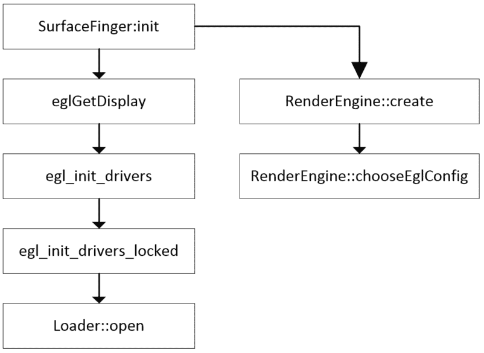
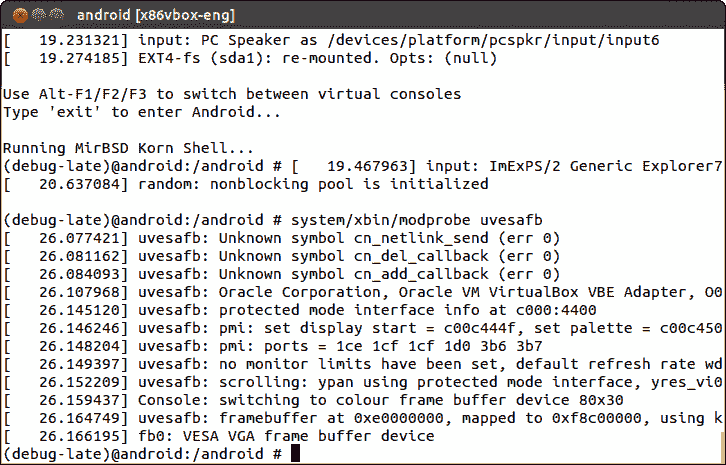
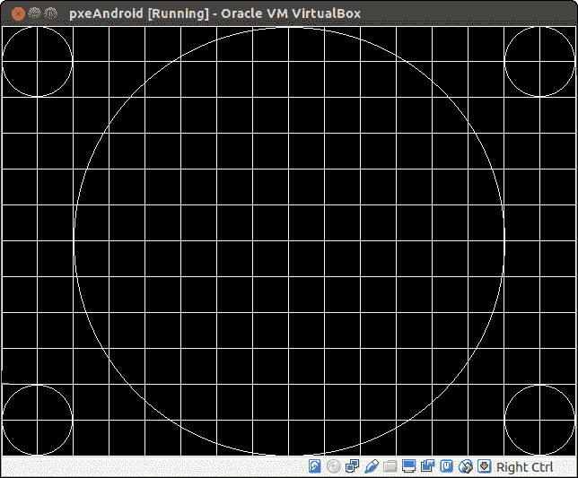
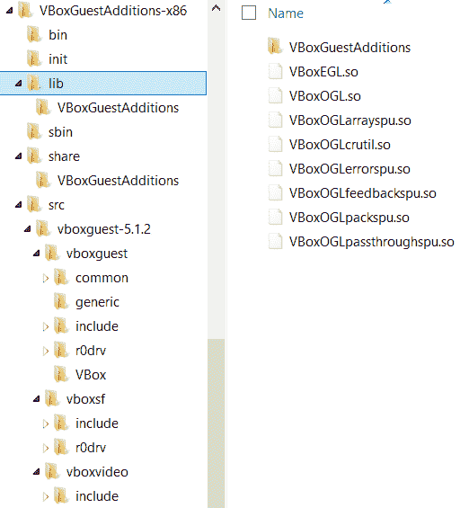
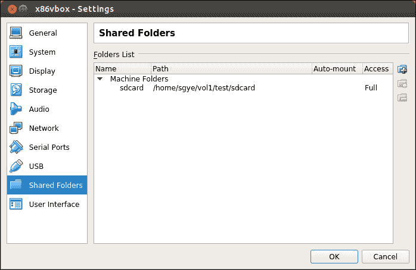

# 第十一章：启用 VirtualBox 特定硬件接口

在上一章中，我们对 Android Gralloc HAL 模块进行了深入分析。我们分析了默认的 Gralloc 模块和 Android 模拟器的硬件 GPU 仿真 Gralloc HAL。我们还没有时间走完与图形系统相关的启动过程。在本章中，我们将走完图形系统的启动过程，并探索 VirtualBox 特定的硬件驱动程序。在本章结束时，我们将在 VirtualBox 上拥有一个相对完整的系统。本章我们将涵盖以下主题：

+   OpenGL ES 和图形硬件初始化

+   VirtualBox Guest Additions 的集成

# OpenGL ES 和图形硬件初始化

在 Android 系统中，图形系统的初始化是由 SurfaceFlinger 完成的。除了我们在第十章中讨论的 Gralloc HAL 之外，*启用图形*是图形系统初始化的另一个重要部分，即加载 OpenGL ES 库。在我们的 VirtualBox 实现中，我们使用了 Android-x86 的大部分 HAL 模块。图形系统支持包括以下组件：

+   Gralloc HAL

+   Mesa 库用于 OpenGL ES

+   uvesafb 帧缓冲区驱动程序或 VirtualBox 视频驱动程序

我们在上章中讨论了 Gralloc HAL。在本章中，我们将探讨 OpenGL ES 库和 uvesafb 帧缓冲区驱动程序的加载。在介绍图形系统初始化时，我们将使用默认的 uvesafb 帧缓冲区驱动程序。在后面讨论 VirtualBox Guest Additions 的集成时，我们还将介绍如何从 VirtualBox 中使用本地图形驱动程序。

# 加载 OpenGL ES 库

**OpenGL ES**代表**OpenGL 嵌入式系统**，它是 Khronos 的 OpenGL 的一个子集。EGL 是 OpenGL ES 和底层本地平台之间的接口。EGL 的 API 应该是平台无关的，但 EGL API 的实现不是。

Android 中 OpenGL ES 的实现包括 Java API 和本地实现。这两部分可以在以下位置找到：

+   Java API：`$AOSP/frameworks/base/opengl`

+   OpenGL ES 本地：`$AOSP/frameworks/native/opengl`

这两部分 OpenGL 实现依赖于供应商实现来提供 OpenGL ES API 的完整功能。在系统启动过程中，系统将搜索`/system/lib/egl`或`/vendor/lib/egl`路径以找到供应商的 OpenGL 库。

OpenGL ES 供应商库应遵循以下命名约定。如果供应商库是一个单独的库，它应使用`libGLES_*.so`的名称。在我们的例子中，VirtualBox 的 OpenGL ES 库是`libGLES_mesa.so`，它作为一个单独的库提供。

如果供应商库作为单独的库提供，它们必须类似于以下内容：

+   `/system/lib/egl/libEGL_*.so`

+   `/system/lib/egl/libGLESv1_CM_*.so`

+   `/system/lib/egl/libGLESv2_*.so`

这适用于 Android 模拟器的硬件仿真库。我们可以找到以下 Android 模拟器的库：

+   `/system/lib/egl/libEGL_emulation.so`

+   `/system/lib/egl/libGLESv1_CM_emulation.so`

+   `/system/lib/egl/libGLESv2_emulation.so`

供应商库在 `SurfaceFlinger` 初始化期间加载。在我们深入探讨启动过程之前，让我们先看看调试日志中的消息。

我已经从下面的日志中移除了时间戳，以便我们有一个更好的格式：

```kt
I SurfaceFlinger: SurfaceFlinger is starting 
I SurfaceFlinger: SurfaceFlinger's main thread ready to run. Initializing graphics H/W... 
D libEGL  : loaded /system/lib/egl/libGLES_mesa.so 
W linker  : /system/lib/libglapi.so has text relocations. This is wasting memory and prevents security hardening. Please fix. 
I HAL     : loaded HAL id=gralloc path=/system/lib/hw/gralloc.default.so hmi=0x5 handle=0xb7145664 
I EGL-DRI2: found extension DRI_Core version 1 
I EGL-DRI2: found extension DRI_SWRast version 5 
I EGL-DRI2: found extension DRI_TexBuffer version 2 
I EGL-DRI2: found extension DRI_IMAGE version 11 
I HAL     : loaded HAL id=gralloc path=/system/lib/hw/gralloc.default.so hmi=0x0 handle=0xb7145664 
I powerbtn: open event0(Power Button) ok fd=4 
W gralloc : page flipping not supported (yres_virtual=768, requested=1536) 
I gralloc : using (fd=12) 
I gralloc : id           = VESA VGA 
I gralloc : xres         = 1024 px 
I gralloc : yres         = 768 px 
I gralloc : xres_virtual = 1024 px 
I gralloc : yres_virtual = 768 px 
I gralloc : bpp          = 32 
I gralloc : r            = 16:8 
I gralloc : g            =  8:8 
I gralloc : b            =  0:8 
I gralloc : a            = 24:8 
I gralloc : stride       = 4096 
I gralloc : fbSize       = 12582912 
I gralloc : width        = 163 mm (159.568100 dpi) 
I gralloc : height       = 122 mm (159.895081 dpi) 
I gralloc : refresh rate = 65.46 Hz 
E SurfaceFlinger: hwcomposer module not found 

```

如我们所见，当 `SurfaceFlinger` 的主线程准备运行时，它会在 x86vbox 设备启动期间加载 `/system/lib/egl/libGLES_mesa.so` 库。之后，它加载并初始化 `gralloc.default.so` Gralloc 模块：

```kt
I SurfaceFlinger: EGL information: 
I SurfaceFlinger: vendor    : Android 
I SurfaceFlinger: version   : 1.4 Android META-EGL 
I SurfaceFlinger: extensions: EGL_KHR_get_all_proc_addresses EGL_ANDROID_presentation_time EGL_KHR_swap_buffers_with_damage EGL_KHR_image_base EGL_KHR_gl_texture_2D_image EGL_KHR_gl_texture_3D_image EGL_KHR_gl_texture_cubemap_image EGL_KHR_gl_renderbuffer_image EGL_KHR_reusable_sync EGL_KHR_fence_sync EGL_KHR_create_context EGL_KHR_surfaceless_context EGL_ANDROID_image_native_buffer EGL_KHR_wait_sync EGL_ANDROID_recordable  
I SurfaceFlinger: Client API: OpenGL_ES 
I SurfaceFlinger: EGLSurface: 8-8-8-8, config=0xb46a3800 

```

接下来，`SurfaceFlinger` 初始化 EGL 库，正如前面的日志消息所示。我们环境中的 EGL 版本是 1.4：

```kt
I SurfaceFlinger: OpenGL ES informations: 
I SurfaceFlinger: vendor    : VMware, Inc. 
I SurfaceFlinger: renderer  : Gallium 0.4 on llvmpipe (LLVM 3.7, 256 bits) 
I SurfaceFlinger: version   : OpenGL ES 3.0 Mesa 12.0.1 (git-c3bb2e3) 
I SurfaceFlinger: extensions: GL_EXT_blend_minmax GL_EXT_multi_draw_arrays GL_EXT_texture_compression_dxt1 GL_EXT_texture_format_BGRA8888 GL_OES_compressed_ETC1_RGB8_texture GL_OES_depth24 GL_OES_element_index_uint GL_OES_fbo_render_mipmap GL_OES_mapbuffer GL_OES_rgb8_rgba8 GL_OES_standard_derivatives GL_OES_stencil8 GL_OES_texture_3D GL_OES_texture_float GL_OES_texture_float_linear GL_OES_texture_half_float GL_OES_texture_half_float_linear GL_OES_texture_npot GL_EXT_texture_sRGB_decode GL_OES_EGL_image GL_OES_depth_texture GL_OES_packed_depth_stencil GL_EXT_texture_type_2_10_10_10_REV GL_OES_get_program_binary GL_APPLE_texture_max_level GL_EXT_discard_framebuffer GL_EXT_read_format_bgra GL_NV_fbo_color_attachments GL_OES_EGL_image_external GL_OES_EGL_sync GL_OES_vertex_array_object GL_ANGLE_texture_compression_dxt3 GL_ANGLE_texture_compression_dxt5 GL_EXT_texture_rg GL_EXT_unpack_subimage GL_NV_draw_buffers GL_NV_read_buffer GL_NV_read_depth GL_NV_read_depth_stencil GL_NV_read_stencil GL_EXT_draw_buffers GL_EXT_map_buffer_ra 
I SurfaceFlinger: GL_MAX_TEXTURE_SIZE = 8192 
I SurfaceFlinger: GL_MAX_VIEWPORT_DIMS = 8192 
D SurfaceFlinger: Open /dev/tty0 OK 
I HAL     : loaded HAL id=gralloc path=/system/lib/hw/gralloc.default.so hmi=0xb769a108 handle=0xb7145664 
I HAL     : loaded HAL id=gralloc path=/system/lib/hw/gralloc.default.so hmi=0xb769a108 handle=0xb7145664 
D SurfaceFlinger: Set power mode=2, type=0 flinger=0xb70e2000 
D SurfaceFlinger: shader cache generated - 24 shaders in 25.081509 ms 

```

在 EGL 初始化之后，OpenGL ES 库被初始化，正如我们从前面的日志消息中可以看到的。我们可以看到 Mesa 库支持 OpenGL ES 3.0。渲染引擎是一个使用 Gallium 和 `llvmpipe` 的软件实现。

每个图形硬件供应商通常都有自己的 OpenGL 实现。Mesa 是 OpenGL 的开源实现。Mesa 为 OpenGL 提供了多个后端支持。它可以根据硬件 GPU 支持硬件和软件实现。如果您没有硬件 GPU，Mesa 有三个基于 CPU 的实现：swrast、softpipe 和 llvmpipe。我们在 x86vbox 中使用的是 llvmpipe。Mesa 驱动实现有两种架构。Gallium 是 Mesa 驱动实现的新架构。

# 分析加载过程

在我们对 x86vbox 中 OpenGL ES 实现进行一般介绍（重用自 Android-x86）之后，我们将分析源代码，以获得更深入的理解。由于图形系统和 OpenGL ES 的详细实现非常庞大，我们无法在一个章节中涵盖它们。在我们的分析中，我们将专注于图形系统的加载过程和 OpenGL ES 库。

再次，当我们遍历源代码时，您可能会感到沮丧。帮助您最好的方法是，在阅读本章内容的同时打开您的源代码编辑器。如果您手头没有 AOSP 源代码，您始终可以参考以下网站：

[`xref.opersys.com/`](http://xref.opersys.com/)

您只需搜索本章中讨论的函数名，即可定位源代码。

从前面的调试日志中，我们将从看到第一个与图形系统和 `SurfaceFlinger` 相关的调试信息的位置开始，如下所示：

```kt
I SurfaceFlinger: SurfaceFlinger is starting 
I SurfaceFlinger: SurfaceFlinger's main thread ready to run. Initializing graphics H/W... 

```

第一条信息是由 `SurfaceFlinger` 的构造函数打印的，第二条信息是从 `SurfaceFlinger` 的 `init` 方法打印出来的。

`SurfaceFlinger` 的源代码可以在以下位置找到：`$AOSP/frameworks/native/services/surfaceflinger/SurfaceFlinger.cpp`。

我们将从**SurfaceFlinger:init**开始分析，根据以下图中所示的流程：



OpenGL ES 库的加载

在`SurfaceFlinger:init`中，如以下代码片段所示，它首先调用 EGL 函数`eglGetDisplay`。之后，它尝试创建一个硬件合成器实例。使用显示实例`mEGLDisplay`和硬件合成器`mHwc`，它使用底层的 OpenGL ES 实现创建了一个渲染引擎：

```kt
void SurfaceFlinger::init() { 
    ALOGI(  "SurfaceFlinger's main thread ready to run. " 
            "Initializing graphics H/W..."); 

    Mutex::Autolock _l(mStateLock); 

    // initialize EGL for the default display 
    mEGLDisplay = eglGetDisplay(EGL_DEFAULT_DISPLAY); 
    eglInitialize(mEGLDisplay, NULL, NULL); 

    ... 

    // Initialize the H/W composer object.  There may or may not  
    // be an actual hardware composer underneath. 
    mHwc = new HWComposer(this, 
            *static_cast<HWComposer::EventHandler *>(this)); 

    // get a RenderEngine for the given display / config 
    mRenderEngine = RenderEngine::create(mEGLDisplay, mHwc-
    >getVisualID()); 

    // retrieve the EGL context that was selected/created 
    mEGLContext = mRenderEngine->getEGLContext(); 

```

让我们先分析 EGL 函数`eglGetDisplay`。`eglGetDisplay`函数在`frameworks/native/opengl/libs/EGL/eglApi.cpp`文件中实现，如下面的代码片段所示：

```kt
EGLDisplay eglGetDisplay(EGLNativeDisplayType display) 
{ 
    clearError(); 

    uintptr_t index = reinterpret_cast<uintptr_t>(display); 
    if (index >= NUM_DISPLAYS) { 
        return setError(EGL_BAD_PARAMETER, EGL_NO_DISPLAY); 
    } 

    if (egl_init_drivers() == EGL_FALSE) { 
        return setError(EGL_BAD_PARAMETER, EGL_NO_DISPLAY); 
    } 

    EGLDisplay dpy = egl_display_t::getFromNativeDisplay(display); 
    return dpy; 
} 

```

在`eglGetDisplay`函数中，它首先检查要初始化的显示索引。在当前的 Android 代码中，`EGL_DEFAULT_DISPLAY`参数为 0，`NUM_DISPLAYS`的定义为 1。这意味着当前 Android 实现只能支持一个显示。这里是什么意思呢？例如，如果你有一台笔记本电脑，你可以将其连接到投影仪。在这种情况下，你可以同时拥有两个显示。现在一些新电脑甚至可以同时连接三个显示。在检查显示数量后，它调用`egl_init_drivers`函数来加载 OpenGL ES 库：

```kt
static EGLBoolean egl_init_drivers_locked() { 
    if (sEarlyInitState) { 
        // initialized by static ctor. should be set here. 
        return EGL_FALSE; 
    } 

    // get our driver loader 
    Loader& loader(Loader::getInstance()); 

    // dynamically load our EGL implementation 
    egl_connection_t* cnx = &gEGLImpl; 
    if (cnx->dso == 0) { 
        cnx->hooks[egl_connection_t::GLESv1_INDEX] = 
                &gHooks[egl_connection_t::GLESv1_INDEX]; 
        cnx->hooks[egl_connection_t::GLESv2_INDEX] = 
                &gHooks[egl_connection_t::GLESv2_INDEX]; 
        cnx->dso = loader.open(cnx); 
    } 

    return cnx->dso ? EGL_TRUE : EGL_FALSE; 
} 

static pthread_mutex_t sInitDriverMutex = PTHREAD_MUTEX_INITIALIZER; 

EGLBoolean egl_init_drivers() { 
    EGLBoolean res; 
    pthread_mutex_lock(&sInitDriverMutex); 
    res = egl_init_drivers_locked(); 
    pthread_mutex_unlock(&sInitDriverMutex); 
    return res; 
} 

```

`egl_init_drivers`函数获取一个互斥锁并调用另一个函数`egl_init_drivers_locked`来加载 OpenGL ES 库。在`egl_init_drivers_locked`函数中，它获取一个`Loader`类的实例，该类使用**单例模式**定义。之后，它初始化全局变量`gEGLImpl`，该变量定义为`egl_connection_t`数据结构：

```kt
struct egl_connection_t { 
    enum { 
        GLESv1_INDEX = 0, 
        GLESv2_INDEX = 1 
    }; 

    inline egl_connection_t() : dso(0) { } 
    void *              dso; 
    gl_hooks_t *        hooks[2]; 
    EGLint              major; 
    EGLint              minor; 
    egl_t               egl; 

    void*               libEgl; 
    void*               libGles1; 
    void*               libGles2; 
}; 

```

在`egl_connection_t`数据结构中，它定义了以下字段：

+   `dso`: 这是一个指向`driver_t`数据结构的指针，该数据结构在`Loader`类内部定义。这个`driver_t`数据结构存储了`Loader`类加载后的 OpenGL ES 库的句柄。

+   `hooks`: 这是一个指向`gl_hooks_t`数据结构指针的数组。`gl_hooks_t`数据结构用于定义 OpenGL ES API 的所有函数指针。在 OpenGL ES 库加载后，库中的 OpenGL ES 函数将被初始化并分配给`hooks`字段。在`enum { GLESv1_INDEX , GLESv2_INDEX }`中定义了两个 OpenGL ES 版本。`hooks[GLESv1_INDEX]`用于存储 OpenGL ES 1 API，并指向全局变量`gHooks[GLESv1_INDEX]`。对于`GLESv2_INDEX`也是同样的情况。OpenGL ES API 的列表可以在以下文件中找到：`$AOSP/frameworks/native/opengl/libs/entries.in`

+   `major`和`minor`: 这两个用于存储 EGL 版本。

+   `egl`: 这被定义为`egl_t`，用于存储 EGL API。EGL API 的列表可以在以下文件中找到：`$AOSP/frameworks/native/opengl/libs/EGL/egl_entries.in`

+   `libEgl`、`libGles1`和`libGles2`：这些都是 OpenGL ES 包装库的句柄。我们稍后将看到这些库的初始化。

在`cnx`数据结构初始化后，它调用`loader.open`函数来加载库。让我们看看`loader.open`函数：

```kt
void* Loader::open(egl_connection_t* cnx) 
{ 
    void* dso; 
    driver_t* hnd = 0; 

    dso = load_driver("GLES", cnx, EGL | GLESv1_CM | GLESv2); 
    if (dso) { 
        hnd = new driver_t(dso); 
    } else { 
        // Always load EGL first 
        dso = load_driver("EGL", cnx, EGL); 
        if (dso) { 
            hnd = new driver_t(dso); 
            hnd->set( load_driver("GLESv1_CM", cnx, GLESv1_CM), 
            GLESv1_CM ); 
            hnd->set( load_driver("GLESv2",    cnx, GLESv2),    GLESv2 ); 
        } 
    } 

    LOG_ALWAYS_FATAL_IF(!hnd, "couldn't find an OpenGL ES 
    implementation"); 

#if defined(__LP64__) 
    cnx->libEgl   = load_wrapper("/system/lib64/libEGL.so"); 
    cnx->libGles2 = load_wrapper("/system/lib64/libGLESv2.so"); 
    cnx->libGles1 = load_wrapper("/system/lib64/libGLESv1_CM.so"); 
#else 
    cnx->libEgl   = load_wrapper("/system/lib/libEGL.so"); 
    cnx->libGles2 = load_wrapper("/system/lib/libGLESv2.so"); 
    cnx->libGles1 = load_wrapper("/system/lib/libGLESv1_CM.so"); 
#endif 
    LOG_ALWAYS_FATAL_IF(!cnx->libEgl, 
            "couldn't load system EGL wrapper libraries"); 

    LOG_ALWAYS_FATAL_IF(!cnx->libGles2 || !cnx->libGles1, 
            "couldn't load system OpenGL ES wrapper libraries"); 

    return (void*)hnd; 
} 

```

在`Loader::open`中，它首先尝试加载单个 OpenGL ES 库。如果失败，它将逐个尝试加载分离的库。如果库加载成功，它将把句柄存储到`driver_t`数据结构中。我们之前在讨论`egl_connection_t`数据结构中的`dso`字段时解释了`driver_t`。实际的加载过程是在`load_driver`函数中完成的，我们很快就会看到它。在 OpenGL ES 库加载后，它还尝试使用`load_wrapper`函数加载包装库。`load_wrapper`函数只是调用`dlopen`系统调用并返回句柄，所以我们不需要调查它。

# 加载驱动程序

让我们分析`load_driver`函数，这是找到和加载 OpenGL ES 用户空间驱动程序的函数：

```kt
void *Loader::load_driver(const char* kind, 
        egl_connection_t* cnx, uint32_t mask) 
{ 
    class MatchFile { 
    public: 
        static String8 find(const char* kind) { 
    ... 
    }; 

    String8 absolutePath = MatchFile::find(kind); 
    if (absolutePath.isEmpty()) { 
        // this happens often, we don't want to log an error 
        return 0; 
    } 
    const char* const driver_absolute_path = absolutePath.string(); 

    void* dso = dlopen(driver_absolute_path, RTLD_NOW | RTLD_LOCAL); 
    if (dso == 0) { 
        const char* err = dlerror(); 
        ALOGE("load_driver(%s): %s", driver_absolute_path, err?
        err:"unknown"); 
        return 0; 
    } 

    ALOGD("loaded %s", driver_absolute_path); 

    if (mask & EGL) { 
        getProcAddress = (getProcAddressType)dlsym(dso, 
        "eglGetProcAddress"); 

        ALOGE_IF(!getProcAddress, 
                "can't find eglGetProcAddress() in %s", 
                driver_absolute_path); 

        egl_t* egl = &cnx->egl; 
        __eglMustCastToProperFunctionPointerType* curr = 
            (__eglMustCastToProperFunctionPointerType*)egl; 
        char const * const * api = egl_names; 
        while (*api) { 
            char const * name = *api; 
            __eglMustCastToProperFunctionPointerType f = 
                (__eglMustCastToProperFunctionPointerType)dlsym(dso, 
                name); 
            if (f == NULL) { 
                // couldn't find the entry-point, use 
                // eglGetProcAddress() 

                f = getProcAddress(name); 
                if (f == NULL) { 
                    f = (__eglMustCastToProperFunctionPointerType)0; 
                } 
            } 
            *curr++ = f; 
            api++; 
        } 
    } 

    if (mask & GLESv1_CM) { 
        init_api(dso, gl_names, 
            (__eglMustCastToProperFunctionPointerType*) 
                &cnx->hooks[egl_connection_t::GLESv1_INDEX]->gl, 
               getProcAddress); 
    } 

    if (mask & GLESv2) { 
      init_api(dso, gl_names, 
            (__eglMustCastToProperFunctionPointerType*) 
                &cnx->hooks[egl_connection_t::GLESv2_INDEX]->gl, 
            getProcAddress); 
    } 

    return dso; 
} 

```

在`load_driver`函数中，它定义了一个`MatchFile`内部类。它使用`MatchFile::find`方法来查找库的路径。`load_driver`函数有三个参数：`kind`、`cnx`和`mask`。根据库的类型，参数`kind`可以是`GLES`、`EGL`、`GLESv1_CM`或`GLESv2`。一旦它获取到库的绝对路径，它就调用`dlopen`系统函数来打开共享库。`mask`参数是`kind`参数的位图。使用`mask`参数，它可以根据库的类型初始化`cnx`参数。正如我们之前提到的，`cnx`参数，它是一个`egl_connection_t`实例，有一个`egl`字段来存储所有 EGL 函数指针。它还有一个字段，`hooks[GLESv1_INDEX]/hooks[GLESv2_INDEX]`，用于存储所有 OpenGL ES 函数。

如果库类型是 EGL，它首先通过调用`dlsym`系统函数来获取`eglGetProcAddress`函数的地址。之后，它将遍历在`egl_names`全局变量中定义的所有函数名称，以找出地址并将它们存储在`cnx->egl`中。在这个过程中，它首先尝试使用`dlsym`系统函数获取地址。如果`dlsym`调用失败，它将再次尝试使用`eglGetProcAddress`函数。

如果库类型是`GLESv1_CM`或`GLESv2`，它将调用另一个函数`init_api`来初始化所有 OpenGL ES 函数指针。在`init_api`函数中，它将遍历在`gl_names`全局变量中定义的所有函数名称，以找出地址并将它们存储在`cnx->hooks[egl_connection_t::GLESv?_INDEX]->gl`中。

现在我们已经完成了 OpenGL ES 用户空间驱动程序的初始化，我们可以使用`egl_connection_t`数据结构来访问所有 OpenGL ES 供应商 API。

# 创建渲染引擎

在加载 OpenGL ES 供应商库之后，`SurfaceFlinger:init`将创建渲染引擎：

```kt
mRenderEngine = RenderEngine::create(mEGLDisplay, mHwc->getVisualID()); 

```

在`RenderEngine::create`内部，它将调用`RenderEngine::chooseEglConfig`，这将打印出 EGL 的调试信息：

```kt
EGLConfig RenderEngine::chooseEglConfig(EGLDisplay display, int format) { 
    status_t err; 
    EGLConfig config; 

    // First try to get an ES2 config 
    err = selectEGLConfig(display, format, EGL_OPENGL_ES2_BIT, 
    &config); 
    ... 
    eglGetConfigAttrib(display, config, EGL_ALPHA_SIZE, &a); 
    ALOGI("EGL information:"); 
    ALOGI("vendor    : %s", eglQueryString(display, EGL_VENDOR)); 
    ALOGI("version   : %s", eglQueryString(display, EGL_VERSION)); 
    ALOGI("extensions: %s", eglQueryString(display, EGL_EXTENSIONS)); 
    ALOGI("Client API: %s", eglQueryString(display, 
    EGL_CLIENT_APIS)?:"Not 
    Supported"); 
    ALOGI("EGLSurface: %d-%d-%d-%d, config=%p", r, g, b, a, config); 

    return config; 
} 

```

在`RenderEngine::create`的末尾，它将打印出以下 OpenGL ES 初始化信息：

```kt
RenderEngine* RenderEngine::create(EGLDisplay display, int hwcFormat) { 
    EGLConfig config = EGL_NO_CONFIG; 
    if (!findExtension( 
            eglQueryStringImplementationANDROID(display,  
            EGL_EXTENSIONS), 
            "EGL_ANDROIDX_no_config_context")) { 
        config = chooseEglConfig(display, hwcFormat); 
    } 

    ... 

    engine->setEGLHandles(config, ctxt); 

    ALOGI("OpenGL ES informations:"); 
    ALOGI("vendor    : %s", extensions.getVendor()); 
    ALOGI("renderer  : %s", extensions.getRenderer()); 
    ALOGI("version   : %s", extensions.getVersion()); 
    ALOGI("extensions: %s", extensions.getExtension()); 
    ALOGI("GL_MAX_TEXTURE_SIZE = %zu", engine->getMaxTextureSize()); 
    ALOGI("GL_MAX_VIEWPORT_DIMS = %zu", engine->getMaxViewportDims()); 

    eglMakeCurrent(display, EGL_NO_SURFACE, EGL_NO_SURFACE, 
    EGL_NO_CONTEXT); 
    eglDestroySurface(display, dummy); 

    return engine; 
} 

```

# uvesafb 帧缓冲区驱动程序

帧缓冲区驱动程序是我们需要支持的 x86vbox 图形系统的第三个组件。由于您可能在不同的英特尔设备上运行 VirtualBox，它们可能使用不同的图形硬件，例如 Nvidia、AMD 或英特尔。为了在虚拟化环境中获得最佳性能，您可能想探索各种 GPU 虚拟化技术，如 GPU 直通、GPU 共享、GPU 软件仿真等。为了有一个简单的解决方案，我们使用了 Android-x86 的默认解决方案，即 uvesafb 帧缓冲区驱动程序。

# 什么是 uvesafb？

uvesafb 是一个与 VESA 2.0 兼容的图形卡一起工作的用户空间 VESA 帧缓冲区驱动程序。VESA BIOS 扩展通过 BIOS 接口提供了 VESA 标准的主要功能。在 Linux 上，uvesafb 需要一个名为`v86d`的用户空间守护进程作为需要执行 x86 BIOS 代码的内核驱动程序的后端。由于 BIOS 代码只能在受控环境中执行，因此`v86d`执行的代码可以在完全软件模拟的环境或由 CPU 支持的虚拟化环境中运行。Android-x86 项目已经将`v86d`移植到 Android。它可以在`$AOSP/external/v86d`找到。由于`v86d`项目需要额外的系统调用，如`ioperm`和`iopl`，Android-x86 项目将 bionic 库更改为支持这些系统调用。

您可以参考以下内核文档以了解更多关于 uvesafb 的信息：

[`www.kernel.org/doc/Documentation/fb/uvesafb.txt`](https://www.kernel.org/doc/Documentation/fb/uvesafb.txt)

# 测试 uvesafb 帧缓冲区驱动程序

在我们尝试了解 uvesafb 在我们环境中是如何加载之前，我们可以使用两个帧缓冲区测试工具`fbset`和`fbtest`来测试它。

正如我们所知，我们可以使用 Android-x86 的二级引导从第九章，“使用 PXE/NFS 引导 x86vbox”进行两阶段引导进入调试控制台。我们可以在调试控制台中用`fbset`和`fbtest`测试 uvesafb。

`fbset`是一个显示或更改帧缓冲区设备设置的系统工具。您可以通过查看 Linux 命令的帮助页面来了解如何使用`fbset`。在我们的环境中，我们在第一阶段引导中使用`busybox`，在 Android 环境中使用`toybox`或`toolbox`。由于`fbset`由`busybox`支持，因此我们可以通过`busybox`在第一阶段或第二阶段引导中使用它。

`fbtest`是一个帧缓冲区测试程序，可以在[`git.kernel.org/pub/scm/linux/kernel/git/geert/fbtest.git`](https://git.kernel.org/pub/scm/linux/kernel/git/geert/fbtest.git)找到。

我从内核 Git 仓库克隆了它，并将其移植到 Android 环境中。Android 的源代码可以通过以下链接在 GitHub 上找到：

[`github.com/shugaoye/fbtest`](https://github.com/shugaoye/fbtest)

要构建`fbtest`，我们可以从 GitHub 获取它，并在 AOSP 构建环境中构建：

```kt
$ cd {your AOSP root folder}
$ source build/envsetup.sh
$ lunch x86vbox-eng  

```

在我们设置好 AOSP 构建环境后，我们可以使用以下命令检出并构建`fbtest`源代码：

```kt
$ cd $HOME
$ git clone https://github.com/shugaoye/fbtest
$ cd fbtest
$ git checkout -b android-x86 remotes/origin/android-x86
$ make  

```

注意，我已经修改了 Makefile，并且它依赖于 AOSP 环境变量`$OUT`，如下所示：

```kt
# Paths and settings 
TARGET_PRODUCT = x86vbox 
ANDROID_ROOT   = $(OUT)/../../../.. 
BIONIC_LIBC    = $(ANDROID_ROOT)/bionic/libc 
PRODUCT_OUT    = $(ANDROID_ROOT)/out/target/product/$(TARGET_PRODUCT) 
CROSS_COMPILE  = \ 
    $(ANDROID_ROOT)/prebuilts/gcc/linux-x86/x86/x86_64-linux-android-  
    4.9/bin/x86_64-linux-android- 

ARCH_NAME = x86 

# Tool names 
AS            = $(CROSS_COMPILE)as 
AR            = $(CROSS_COMPILE)ar 
... 

```

如果我们查看前面的`fbtest/Rules.make` Makefile，我们使用`$OUT`环境变量来找到正确的 AOSP 构建环境。之后，我们可以使用预构建的工具链和`bionic`库来构建`fbtest`。

在我们构建`fbtest`后，我们可以将其复制到`$OUT/system/bin`文件夹，这样我们就可以在测试环境中稍后使用它。正如我们从第九章，“使用 PXE/NFS 引导 x86vbox”中记得的那样，我们可以使用 PXE/NFS 在第一阶段引导时引导到调试控制台。在这种情况下，我们可以更改并测试`fbtest`而不需要重新引导 x86vbox，因为我们可以从 x86vbox 通过 NFS 访问构建结果。

让我们在第一阶段引导时引导 x86vbox 到调试控制台，并执行测试。正如我们回忆的那样，我们在第一阶段引导的调试控制台中有一个最小嵌入式 Linux 环境。在这个环境中我们有内置的`busybox`。在我们测试帧缓冲设备之前，我们必须手动加载`uvesafb`模块，如下面的截图所示：



我们使用以下命令加载`uvesafb`模块：

```kt
(debug-late)@android: /android # system/xbin/modprobe uvesafb  

```

从调试输出中，我们可以看到底层图形硬件是`Oracle VM VirtualBox VBE Adapter`。

在加载`uvesafb`模块后，我们可以找到`/dev/fb0`设备。我们可以使用`fbset`来更改帧缓冲设备设置。例如，我们可以根据需要切换到不同的支持分辨率。让我们运行`fbset`命令看看会发生什么。如果我们不带任何参数运行`fbset`，我们可以看到以下输出：

```kt
(debug-late)@android:/android # fbset 

mode "640x480-60" 
 # D: 23.845 MHz, H: 29.844 kHz, V: 60.048 Hz 
 geometry 640 480 640 9830 16 
 timings 41937 80 16 13 1 63 3 
 accel false 
 rgba 5/11,6/5,5/0,0/0 
endmode  

```

如果不带任何参数运行`fbset`，它只会打印出帧缓冲设备的当前设置。正如我们从输出中可以看到的，如果我们不带任何参数加载`uvesafb`，默认分辨率为 640 x 480，16 位颜色。

我们可以用分辨率的名称尝试更改分辨率，如下所示：

```kt
(debug-late)@android:/android # fbset vga 
fbset: /etc/fb.modes: No such file or directory 
fbset: unknown video mode 'vga'   

```

我们得到了一个错误信息，告诉我们分辨率在`/etc/fb.modes`文件中未定义。我们需要创建此文件来更改分辨率。我们可以在`/etc/fb.modes`中添加以下分辨率，如下所示：

```kt
mode "640x480-60" 
        # D: 23.845 MHz, H: 29.844 kHz, V: 60.048 Hz  
        geometry 640 480 640 9830 16  
        timings 41937 80 16 13 1 63 3  
        accel false  
        rgba 5/11,6/5,5/0,0/0  
endmode 

mode "1024x768-60"  
        # D: 64.033 MHz, H: 47.714 kHz, V: 60.018 Hz  
        geometry 1024 768 1024 768 32  
        timings 15617 159 52 23 1 107 3  
        accel false  
        rgba 8/16,8/8,8/0,8/24  
endmode  

```

现在我们可以测试分辨率更改。如果我们运行以下命令，我们可以切换到具有真彩色的更高分辨率：

```kt
(debug-late)@android:/android # fbset 1024x768-60  

```

在我们加载帧缓冲驱动程序并测试配置更改后，我们可以通过在屏幕上绘制一些东西来测试帧缓冲。使用我们在本节中构建的 `fbtest` 命令，我们可以运行一系列帧缓冲测试用例。首先，让我们找出 `fbtest` 可以运行多少个测试用例：

```kt
(debug-late)@android:/android # fbtest -f /dev/fb0 -l
Listing all tests 
test001: Draw a 16x12 checkerboard pattern 
test002: Draw a grid and some circles 
test003: Draw the 16 Linux console colors 
test004: Show the penguins 
test005: Draw the default color palette 
test006: Draw grayscale bands 
test007: DirectColor test 
test008: Draw the UV color space 
test009: Show the penguins using copy_rect 
test010: Hello world 
test011: Panning test 
test012: Filling squares   

```

如果我们在 `fbtest` 中使用 `-l` 选项，它将打印出可用的测试用例列表。我们可以看到我们有 12 个测试用例：

```kt
(debug-late)@android:/android # fbtest -f /dev/fb0 test002  

```

例如，我们可以运行测试用例 002，我们将看到以下屏幕。您可以自由地测试任何前面的测试用例。



# 在 x86vbox 中初始化 uvesafb

在 x86vbox 中初始化 `uvesafb` 是在启动脚本 `init.sh` 中完成的。如果我们回顾第八章创建您的虚拟机设备中关于 HAL 初始化的讨论，我们可以看到 `init.sh` 中的以下代码。我们在第八章创建您的虚拟机设备中简要讨论了图形 HAL 的初始化，现在我们可以深入了解细节：

```kt
function init_uvesafb() 
{ 
    case "$PRODUCT" in 
        ET2002*) 
            UVESA_MODE=${UVESA_MODE:-1600x900} 
            ;; 
        *) 
            ;; 
    esac 

    [ "$HWACCEL" = "0" ] && bpp=16 || bpp=32 
    modprobe uvesafb mode_option=${UVESA_MODE:-1024x768}-$bpp ${UVESA_OPTION:-    
    mtrr=3 scroll=redraw} 
} 

function init_hal_gralloc() 
{ 
    case "$(cat /proc/fb | head -1)" in 
        *virtiodrmfb) 
#            set_property ro.hardware.hwcomposer drm 
            ;& 
        0*inteldrmfb|0*radeondrmfb|0*nouveaufb|0*svgadrmfb) 
            set_property ro.hardware.gralloc drm 
            set_drm_mode 
            ;; 
        "") 
            init_uvesafb 
            ;& 
        0*) 
            ;; 
    esac 

    [ -n "$DEBUG" ] && set_property debug.egl.trace error 
} 

```

在我们当前的设置中，让我们看看 `/proc/fb` 的内容。我们可以从调试控制台或 adb 控制台来检查这一点。在帧缓冲设备初始化之前，`/proc/fb` 的内容是空的。在我们的情况下，它是空的，因为没有帧缓冲设备可用，直到执行 `init.sh` 脚本。如果输出为空，`init.sh` 脚本将调用 `init_uvesafb` 函数来初始化 `uvesafb`。在帧缓冲设备初始化后，我们可以看到 `/proc/fb` 的内容如下：

```kt
root@x86vbox:/ # cat /proc/fb 
0 VESA VGA  

```

如果在调用 `init.sh` 之前有帧缓冲设备可用，`init_hal_gralloc` 将为 DRM 驱动程序设置 `ro.hardware.gralloc` 系统属性。对于 `init_hal_gralloc` 无法处理的设备，它将不执行任何操作。

在 `init_uvesafb` 中，加载 `uvesafb` 的实际命令可以扩展到以下之一：

```kt
# modprobe uvesafb mode_option=1024x768-32 mtrr=3 scroll=redraw  

```

`uvesafb` 的选项有：

+   `mtrr:n`: 为帧缓冲设置内存类型范围寄存器，其中 `n` 可以是：

    +   `0`: 禁用（相当于 `nomtrr` 选项）

    +   `3`: 写合并（默认）

内存类型范围寄存器是英特尔处理器中一组处理器补充功能控制寄存器。写合并允许将总线写传输组合成更大的传输，然后再在总线上爆发。这可以帮助提高图形性能。

+   `redraw`: 通过重新绘制受影响的屏幕部分来滚动。

+   `mode_option`: 设置分辨率到一个支持的值。

在加载 `uvesafb` 之后，我们可以使用以下命令找到所有支持的分辨率：

```kt
# cat /sys/bus/platform/drivers/uvesafb/uvesafb.0/vbe_modes
640x400-8, 0x0100 
640x480-8, 0x0101 
800x600-8, 0x0103 
1024x768-8, 0x0105 
1280x1024-8, 0x0107 
320x200-15, 0x010d 
320x200-16, 0x010e 
320x200-24, 0x010f 
640x480-15, 0x0110 
640x480-16, 0x0111 
640x480-24, 0x0112 
800x600-15, 0x0113 
800x600-16, 0x0114 
800x600-24, 0x0115 
1024x768-15, 0x0116 
1024x768-16, 0x0117 
1024x768-24, 0x0118 
1280x1024-15, 0x0119 
1280x1024-16, 0x011a 
1280x1024-24, 0x011b 
320x200-32, 0x0140 
640x400-32, 0x0141 
640x480-32, 0x0142 
800x600-32, 0x0143 
1024x768-32, 0x0144 
1280x1024-32, 0x0145 
320x200-8, 0x0146 
1600x1200-32, 0x0147 
1152x864-8, 0x0148 
1152x864-15, 0x0149 
1152x864-16, 0x014a 
1152x864-24, 0x014b 
1152x864-32, 0x014c  

```

# 集成 VirtualBox Guest Additions

到目前为止，我们可以启动 x86vbox 到 Android。我们可以进一步做的是将 VirtualBox Guest Additions 集成到 x86vbox 中。

VirtualBox 是一个虚拟化环境。我们可以在 VirtualBox 中安装一个虚拟操作系统，就像它真的存在一样。然而，以这种方式工作有一些限制。在主机环境中运行虚拟操作系统时，你可能期望的不仅仅是硬件虚拟化。例如，当你在不同主机和虚拟系统之间移动鼠标光标时，你可能发现鼠标光标表现不佳。你可能希望轻松地在主机和虚拟机之间共享数据，例如共享剪贴板、共享文件夹等。为了满足这些需求，主机和虚拟机需要相互了解并有一种相互交流的方式。在 VirtualBox 架构中，有一个称为 **主机-虚拟机通信管理器**（**HGCM**）的组件。在主机端，VirtualBox 实现了一个名为 HGCM 服务的功能，可以响应虚拟机的请求。在虚拟机端，有几个来自 VirtualBox 的内核驱动程序，可以用来与主机通信。

VirtualBox 为主机和虚拟机集成提供的附加功能通常包含在一个名为 **VirtualBox 扩展包**（**VirtualBox Extension Pack**）的包中。在 VirtualBox 扩展包中，它包括主机端和虚拟机端所需的所有文件。VirtualBox 扩展包可以从 [`www.virtualbox.org/wiki/Downloads`](https://www.virtualbox.org/wiki/Downloads) 下载。

对于虚拟机端，有一个包含设备驱动程序二进制工具和源代码的单独分发包，称为 VirtualBox 虚拟机增强功能。有针对 Windows、Linux 和 OS X 的单独 VirtualBox 虚拟机增强功能。没有针对 Android 的虚拟机增强功能。然而，由于 Android 使用 Linux 内核，我们可以使用 Linux 的源代码构建 Android 的内核驱动程序。安装 VirtualBox 扩展包后，我们可以找到一个名为 `VBoxGuestAdditions.iso` 的镜像文件，如下所示：

```kt
$ cd /usr/share/virtualbox
$ ls
nls                    src                     VBoxSysInfo.sh
rdesktop-vrdp-keymaps  VBoxCreateUSBNode.sh
rdesktop-vrdp.tar.gz   **VBoxGuestAdditions.iso**  

```

我们可以提取这个镜像文件，并在 VirtualBox 虚拟机增强功能中找到以下文件：

```kt
$ ls
deffiles    routines.sh      vboxadd-x11                       x86
installer   vboxadd          **VBoxGuestAdditions-amd64.tar.bz2**
install.sh  vboxadd-service  **VBoxGuestAdditions-x86.tar.bz2**  

```

有两个压缩文件：`VBoxGuestAdditions-amd64.tar.bz2` 和 `VBoxGuestAdditions-x86.tar.bz2`。如以下截图所示，这是为 Intel x86 Linux 虚拟机提供的虚拟机增强功能的文件夹和文件列表：



VirtualBox 虚拟机增强功能

在虚拟机增强功能中有三个驱动程序的源代码可用：`vboxguest`、`vboxsf` 和 `vboxvideo`：

+   `vboxguest`: 这个模块为虚拟操作系统提供与主机通信的基本服务。

+   `vboxsf`: 这个模块是一个内核驱动程序，用于在主机和虚拟机之间共享文件的能力。

+   `vboxvideo`: 这个模块是针对虚拟机的视频驱动程序。通过这个驱动程序，我们可以通过主机使用图形硬件加速。

我们将构建并将这三个驱动程序集成到 x86vbox 中。

# 构建 VirtualBox 虚拟机增强功能

Guest Additions 中的驱动程序的唯一依赖项是内核源代码。为 Android 构建驱动程序非常简单。要构建 Guest Additions，你可以从你的 VirtualBox 安装中获取源代码，或者你可以从我的 GitHub 上获取一个版本，如下所示：

```kt
$ source build/envsetup.sh
$ lunch x86vbox-eng
$ cd $HOME
$ git clone https://github.com/shugaoye/vboxguest-linux-modules
$ cd vboxguest-linux-modules
$ make BUILD_TARGET_ARCH=x86 KERN_DIR=$OUT/obj/KERNEL_OBJ  

```

在我们成功构建驱动程序后，我们可以按照以下方式找到驱动模块：

```kt
$ ls
build_in_tmp  Makefile   vboxguest.ko  vboxsf.ko  vboxvideo.ko
LICENSE       vboxguest  vboxsf        vboxvideo  

```

我们可以在我们的 `x86vbox` 设备文件夹下的 `vbox` 文件夹中存储内核模块，因此我们可以在构建过程中将它们复制到文件系统中：

```kt
$ croot
$ cd device/generic/x86vbox
$ ls vbox
vboxguest.ko  vboxsf.ko  vboxvideo.ko  

```

在我们获得 Guest Additions 的可加载模块后，我们可以将它们添加到我们的 x86vbox 设备 Makefile `x86vbox.mk` 中，如下所示：

```kt
... 
PRODUCT_COPY_FILES += \ 
    device/generic/x86vbox/vbox/vboxguest.ko:system/vendor/vbox/vboxguest.ko \ 
    device/generic/x86vbox/vbox/vboxsf.ko:system/vendor/vbox/vboxsf.ko \ 
    device/generic/x86vbox/vbox/vboxvideo.ko:system/vendor/vbox/vboxvideo.ko \ 
... 

```

这三个模块将被复制到系统镜像中的 `/system/vendor/vbox` 文件夹。

# 集成 vboxsf

使用可加载模块 `vboxsf.ko`，我们能够在 Android 系统运行时在主机和虚拟机之间交换文件。要创建主机和虚拟机之间的共享文件夹，我们需要首先加载 `vboxsf.ko` 模块。

要使用 `vboxsf.ko`，我们需要一个名为 `mount.vboxsf` 的工具，它可以用来将主机文件系统上的共享文件夹挂载到 Android 文件系统。这个 `mount.vboxsf` 工具是 VirtualBox Guest Additions 提供的实用工具之一。我们将其放在我们的 x86vbox 设备文件夹中，如下所示：

```kt
$ ls mount.vboxsf/ 
Android.mk  mount.vboxsf.c  vbsfmount.h 

```

它包括一个 C 文件和一个头文件。我们创建了以下 Android Makefile 来构建它：

```kt
LOCAL_PATH:= $(call my-dir) 
include $(CLEAR_VARS) 

LOCAL_SRC_FILES:= mount.vboxsf.c 

LOCAL_CFLAGS:=-O2 -g 
#LOCAL_CFLAGS+=-DLINUX 

LOCAL_MODULE:=mount.vboxsf 
LOCAL_MODULE_TAGS := optional 

include $(BUILD_EXECUTABLE) 

```

为了将其包含在系统镜像中，我们还需要将其添加到 `x86vbox.mk` Makefile 中，如下所示：

```kt
... 
PRODUCT_PACKAGES += \ 
    mount.vboxsf \ 
... 

```

为了在系统启动时加载 `vboxsf.ko`，我们需要将 `vboxsf.ko` 的加载添加到 `initrd.img` 中的启动脚本。如果我们回想一下 第六章，*使用自定义 Ramdisk 调试启动过程*，我们讨论了 `initrd.img` 中的 init 脚本。shell 脚本函数 `load_modules` 被调用以在第一阶段启动时加载大部分设备驱动程序。我们可以更改此脚本以加载 VirtualBox 设备驱动程序，如下所示：

```kt
load_modules() 
{ 
   if [ -z "$FOUND" ]; then 
         auto_detect 
   fi 

   # 3G modules 
   for m in $EXTMOD; do 
         busybox modprobe $m 
   done 

    if [ -n "$VBOX_GUEST_ADDITIONS" ]; then 
         echo "Loading VBOX_GUEST_ADDITIONS ..." 
         insmod /android/system/vendor/vbox/vboxguest.ko 
         insmod /android/system/vendor/vbox/vboxsf.ko 
         if [ ! -e /android$SDCARD ]; then 
               mkdir /android$SDCARD 
               /android/system/bin/mount.vboxsf sdcard /android$SDCARD 
         fi 
   fi 
} 

```

我们定义了一个 `VBOX_GUEST_ADDITIONS` 内核参数，它可以用来启用加载 VirtualBox 特定设备驱动程序。如果定义了这个内核参数，我们将加载两个可加载模块，`vboxguest.ko` 和 `vboxsf.ko`。另一个内核参数 `SDCARD` 也被定义，这样我们就可以将共享文件夹挂载为外部 SD 卡存储。`SDCARD` 内核参数被 shell 脚本函数 `mount_sdcard` 使用。

要在内核命令行上定义这两个内核参数，我们需要更改 `$HOME/.VirtualBox/TFTP/pxelinux.cfg/default` 下的 PXE 启动脚本，如下所示：

```kt
label 1\. x86vbox (2 stages boot) 
menu x86vbox_initrd 
kernel x86vbox/kernel 
append ip=dhcp console=ttyS3,115200 androidboot.selinux=permissive buildvariant=eng initrd=x86vbox/initrd.img androidboot.hardware=x86vbox DEBUG=2 SRC=/android-x86vbox ROOT=/dev/sda1 VBOX_GUEST_ADDITIONS=1 SDCARD=vendor DATA=sda2 X86VBOX=1 

```

注意两个变量 `SDCARD` 和 `VBOX_GUEST_ADDITIONS`。它们是我们添加的两个新内核参数，用于支持加载 VirtualBox 设备驱动程序。为了挂载共享文件夹，我们在脚本中添加以下命令：

```kt
/android/system/bin/mount.vboxsf sdcard /android$SDCARD 

```

`mount.vboxsf`的第一个参数是我们定义在 VirtualBox 设置中的共享文件夹，如下面的截图所示：



通过所有与共享文件夹相关的更改，我们可以有一个可以用来在主机和客户机之间轻松共享数据的方法。

# 集成 vboxvideo

在 VirtualBox 的 Guest Additions 中，还有一个可以在 Android 上使用的设备驱动程序，即`vboxvideo.ko`。这是一个视频硬件的设备驱动程序。与本章中刚刚讨论的 uvesafb 相比，它提供了一个功能更强大的视频驱动程序。

uvesafb 是基于 VESA 2.0 标准的标准帧缓冲驱动程序，它不支持在 VirtualBox 上的硬件加速。`vboxvideo.ko`是一个支持硬件加速的基于 DRM/DRI 的视频驱动程序。

**直接渲染基础设施**（**DRI**）是 Linux 平台上 X Window 系统的新架构，允许*X*客户端直接与图形硬件通信。**直接渲染管理器**（**DRM**）是 DRI 架构的内核部分。

Android-x86 项目是第一个将 Mesa/DRM 引入 Android 平台的开源项目。这是一个针对支持的图形硬件的开源 OpenGL ES 实现。通过以下组件，我们应该能够支持 Android 上的 OpenGL ES 的硬件加速：

+   `external_libdrm`

+   `external_mesa`

+   `external_drm_gralloc`

我们在 VirtualBox 上已经有了`vboxvideo`的 DRM 驱动程序，但相关的实现仍需要添加到`external_mesa`和`external_drm_gralloc`中，以支持使用主机 GPU 的 OpenGL ES。

在`external_mesa`和`external_drm_gralloc`中没有针对 VirtualBox 的特定实现，我们只能使用 Mesa 的相同基于软件的实现来支持 OpenGL ES 和默认的 Gralloc 模块`gralloc.default.so`。这就是为什么大多数基于 VirtualBox 的模拟器解决方案，如 Genymotion、Andy 或 AMI DuOS，仍然在使用硬件 GPU 模拟，这与我们在第十章“启用图形”部分中讨论的*硬件 GLES 模拟概述*中的类似。

要加载`vboxvideo.ko`，我们需要在`load_modules`中添加以下这三行：

```kt
   if [ -n "$VBOX_VIDEO_DRIVER" ]; then 
       modprobe ttm 
       modprobe drm_kms_helper 
       insmod /android/system/vendor/vbox/vboxvideo.ko 
   fi 

```

`ttm`和`drm_kms_helper`内核模块是`vboxvideo.ko`所需的两个内核模块。我们还使用`VBOX_VIDEO_DRIVER`内核参数来配置`vboxvideo.ko`的加载。使用这个内核参数，我们可以在 uvesafb 帧缓冲和 VirtualBox 帧缓冲之间切换。系统启动后，我们可以看到以下日志消息。我们可以看到`vboxvideo`已成功加载：

```kt
[   25.240357] vboxguest: misc device minor 53, IRQ 20, I/O port d040, MMIO at) 
[   25.261044] [drm] Initialized drm 1.1.0 20060810                             
[   25.290777] [drm] VRAM 08000000                                              
[   25.309754] [TTM] Zone  kernel: Available graphics memory: 440884 kiB        
[   25.337733] [TTM] Zone highmem: Available graphics memory: 1034776 kiB       
[   25.349078] [TTM] Initializing pool allocator                                
[   25.349735] fbcon: vboxdrmfb (fb0) is primary device                         
[   25.360984] Console: switching to colour frame buffer device 100x37          
[   25.380299] vboxvideo 0000:00:02.0: fb0: vboxdrmfb frame buffer device       
[   25.388745] [drm] Initialized vboxvideo 1.0.0 20130823 for 0000:00:02.0 on m0 

```

从日志消息中，我们可以看到`vboxvideo`创建了一个`vboxdrmfb`帧缓冲设备。我们可以使用`fbset`来检查帧缓冲设置，就像我们之前做的那样。我们可以看到，对于`vboxdrmfb`，硬件加速被设置为 true：

```kt
(debug-late)@android:/android # fbset 

mode "800x600-0" 
 # D: 0.000 MHz, H: 0.000 kHz, V: 0.000 Hz 
 geometry 800 600 800 600 32
 timings 0 0 0 0 0 0 0
 accel true
 rgba 8/16,8/8,8/0,0/0
endmode  

```

我们也可以检查 `/proc/fb` 的输出。由于输出是 `0 vboxdrmfb`，`init.sh` 中的 `init_hal_gralloc` 脚本函数不会加载 `uvesafb`：

```kt
(debug-late)@android:/android # cat /proc/fb 
0 vboxdrmfb                                        

```

使用这种设置，我们可以使用 `vboxvideo` 驱动程序而不是 `uvesafb` 来启动 x86vbox。正如我提到的，在我们能够充分利用 `vboxvideo` 的所有潜在功能之前，还有很多工作要做。

# 使用 VirtualBox Guest Additions 构建和测试镜像

要构建和测试本章中的镜像，我们可以使用 `repo` 工具检索本章中的源代码，如下所示：

我们可以使用以下命令从 GitHub 和 AOSP 获取源代码：

```kt
$ repo init https://github.com/shugaoye/manifests -b android-7.1.1_r4_ch11_aosp
$ repo sync  

```

在我们获取本章的源代码后，我们可以设置环境和构建系统，如下所示：

```kt
$ source build/envsetup.sh
$ lunch x86vbox-eng
$ make -j4 

```

要构建 `initrd.img`，我们可以运行以下命令：

```kt
$ make initrd USE_SQUASHFS=0  

```

# 摘要

在本章中，我们学习了图形系统的启动过程。这包括 OpenGL ES 库、Gralloc 模块和设备驱动程序。我们在上一章中讨论了 Gralloc 模块。在本章中，我们分析了另外两个组件，即 OpenGL ES 库和帧缓冲区驱动程序。在掌握所有这些知识的基础上，我们将来自 VirtualBox Guest Additions 的驱动程序集成到了 x86vbox 设备中。在下一章中，我们将开始另一个项目，以探索 Android 系统中恢复功能的工作原理。
