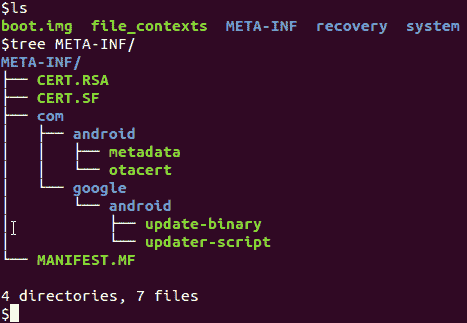
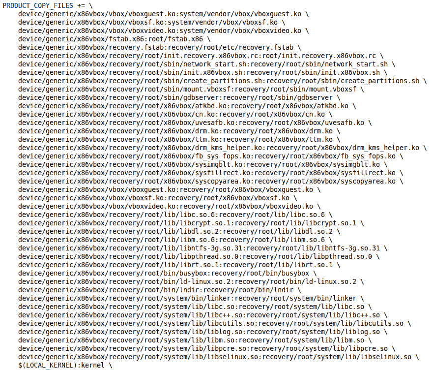
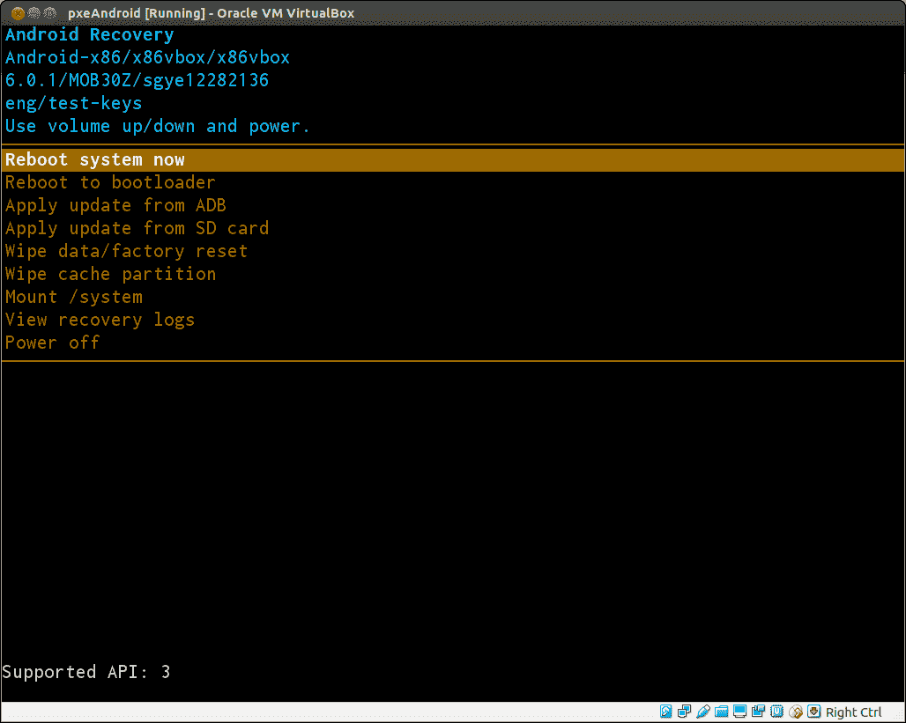

# 第十三章：创建 OTA 包

在上一章中，我们分析了恢复的内部结构，并学习了它是如何工作的。正如我们所见，恢复的主要功能之一是支持 OTA 更新。在本章中，我们将研究 OTA 包，并研究 OTA 包更新的过程。我们将涵盖以下主题：

+   我们将查看 OTA 包内部的内容。我们将研究`updater`和`updater-script`的内部结构。

+   我们将学习如何构建 OTA 包的过程。

+   最后，我们需要改进恢复以从 Android 系统中移除依赖。

# OTA 包内部有什么

在我们开始构建 OTA 包之前，让我们看看 OTA 包内部的内容。OTA 包可以用来将系统更新到新版本。新版本可以是主要版本或次要版本。例如，它可能是对现有 Android 版本的小幅更新，以修复关键问题或安全漏洞。它也可能是从 Android 6 到 Android 7 的主要更新。让我们看看本章将要创建的 OTA 包的内容，以了解 OTA 包内部有什么。本章将要创建的 OTA 包是我们整个 ROM 的 OTA 更新包。我们可以使用恢复来将 OTA 包刷入我们的 VirtualBox 设备。这是将我们构建的系统镜像安装到虚拟设备上的另一种方法。

让我们看看本章将要构建的 OTA 包的内容。OTA 包本身是一个 ZIP 文件。在我们解压 ZIP 文件后，我们可以列出 ZIP 文件的内容如下：

```kt
$ ls -F
boot.img*  file_contexts*  META-INF/  recovery/  system/  

```

我们可以看到它包括两个文件和三个文件夹。在我们使用恢复刷写这个更新包后，它将更新`/boot`分区和`/system`分区：

+   `boot.img`: 这是`/boot`分区的镜像，其中包含内核和 ramdisk。

+   `file_contexts`: 此文件用于根据 SELinux 策略为文件分配标签。SELinux 在最新的 Android 系统中默认启用。在恢复更新系统分区后，它必须使用此文件应用标签。

+   `META-INF`: 这个文件夹包含 OTA 包、更新程序和更新脚本的签名。我们将在稍后查看这个文件夹的详细信息。

+   `recovery`: 这个文件夹包含一个`install-recovery.sh`shell 脚本和一个`recovery-from-boot.p`补丁文件。

+   `system`: 这是恢复将要更新到`/system`分区的`system`文件夹。

OTA 包通常用于更新`/boot`和`/system`分区。它不会更新自身。`/recovery`分区的更新在正常的启动过程中进行。在启动过程中，init 将通过以下`flash_recovery`服务在`init.rc`脚本中执行`install-recovery.sh`：

```kt
service flash_recovery /system/bin/install-recovery.sh 
    class main 
    oneshot 

```

`install-recovery.sh`脚本使用`recovery-from-boot.p`补丁文件安装恢复，如下所示：

```kt
#!/system/bin/sh 
if ! applypatch -c EMMC:/dev/block/sda7:7757824:853301871de495db2b8c93f7a37779b9eeccb169; then 
  applypatch -b /system/etc/recovery-resource.dat EMMC:/dev/block/sda8:6877184:2f58cc1a4035176c8fefc19be70c00e625acc16b EMMC:/dev/block/sda7 853301871de495db2b8c93f7a37779b9eeccb169 7757824 2f58cc1a4035176c8fefc19be70c00e625acc16b:/system/recovery-from-boot.p && log -t recovery "Installing new recovery image: succeeded" || log -t recovery "Installing new recovery image: failed" 
else 
  log -t recovery "Recovery image already installed" 
fi 

```

在我们的环境设置中，`/recovery`分区位于`/dev/block/sda7`分区。此脚本将检查`/dev/block/sha7`分区的`sha1`哈希值。如果`sha1`哈希值不同，它将更新`/recovery`分区。

现在，让我们看看下面的截图所示的`META-INF`文件夹：



如我们所见，更新包、更新器和更新脚本的签名包含在`META-INF`文件夹中。在恢复应用更新之前，它将验证`META-INF`文件夹中的包签名与`/system/etc/security/otacerts.zip`中的受信任证书。

更新器位于`META-INF/com/google/android/update-binary`的可执行文件。它解释`META-INF/com/google/android/updater-script`文件中的脚本。该脚本是用一种可扩展的脚本语言（edify）编写的，支持典型更新相关任务的命令。

由于更新器和更新脚本是在 OTA 包中支持 OTA 更新的关键组件，我们将深入了解它们的细节。

# 更新器

更新器是 AOSP 源树中针对目标设备的单个可执行文件。它可以在`$AOSP/bootable/recovery/updater`文件夹中找到。让我们看看`updater.cpp`文件中的主函数。由于`main`函数比较长，我们将分几个段落来看：

```kt
#include <stdio.h> 
#include <unistd.h> 
#include <stdlib.h> 
#include <string.h> 

#include "edify/expr.h" 
#include "updater.h" 
#include "install.h" 
#include "blockimg.h" 
#include "minzip/Zip.h" 
#include "minzip/SysUtil.h" 

#include "register.inc" 

#define SCRIPT_NAME "META-INF/com/google/android/updater-script" 

extern bool have_eio_error; 

struct selabel_handle *sehandle; 

int main(int argc, char** argv) { 
    setbuf(stdout, NULL); 
    setbuf(stderr, NULL); 

    if (argc != 4 && argc != 5) { 
        printf("unexpected number of arguments (%d)\n", argc); 
        return 1; 
    } 

    char* version = argv[1]; 
    if ((version[0] != '1' && version[0] != '2' && version[0] != '3')  
    || 
        version[1] != '\0') { 
        // We support version 1, 2, or 3\. 
        printf("wrong updater binary API; expected 1, 2, or 3; " 
                        "got %s\n", 
                argv[1]); 
        return 2; 
    } 

```

更新器有四个参数。它首先会检查是否传入了四个参数。从代码中我们可以看到，这四个参数是：

+   第一个参数是可执行文件名，在这里是`update-binary`

+   第二个参数是更新器版本

+   第三个参数是可以用来与恢复进行通信的管道

+   第四个参数是 OTA 包的路径

在继续之前，它将检查更新器版本：

```kt
// Set up the pipe for sending commands back to the parent process. 

int fd = atoi(argv[2]); 
FILE* cmd_pipe = fdopen(fd, "wb"); 
setlinebuf(cmd_pipe); 

// Extract the script from the package. 

const char* package_filename = argv[3]; 
MemMapping map; 
if (sysMapFile(package_filename, &map) != 0) { 
    printf("failed to map package %s\n", argv[3]); 
    return 3; 
} 
ZipArchive za; 
int err; 
err = mzOpenZipArchive(map.addr, map.length, &za); 
if (err != 0) { 
    printf("failed to open package %s: %s\n", 
           argv[3], strerror(err)); 
    return 3; 
} 
ota_io_init(&za); 

const ZipEntry* script_entry = mzFindZipEntry(&za, SCRIPT_NAME); 
if (script_entry == NULL) { 
    printf("failed to find %s in %s\n", SCRIPT_NAME, package_filename); 
    return 4; 
} 

char* script = reinterpret_cast<char*>(malloc(script_entry->uncompLen+1)); 
if (!mzReadZipEntry(&za, script_entry, script, script_entry->uncompLen)) { 
    printf("failed to read script from package\n"); 
    return 5; 
} 
script[script_entry->uncompLen] = '\0';     

```

下一步是打开管道以建立与恢复的通信通道。然后它从 OTA 包中提取`updater-script`以准备执行脚本：

```kt
// Configure edify's functions. 

RegisterBuiltins(); 
RegisterInstallFunctions(); 
RegisterBlockImageFunctions(); 
RegisterDeviceExtensions(); 
FinishRegistration(); 

// Parse the script. 

Expr* root; 
int error_count = 0; 
int error = parse_string(script, &root, &error_count); 
if (error != 0 || error_count > 0) { 
    printf("%d parse errors\n", error_count); 
    return 6; 
} 

struct selinux_opt seopts[] = { 
  { SELABEL_OPT_PATH, "/file_contexts" } 
}; 

sehandle = selabel_open(SELABEL_CTX_FILE, seopts, 1); 

if (!sehandle) { 
    fprintf(cmd_pipe, "ui_print Warning: No file_contexts\n"); 
} 

// Evaluate the parsed script. 

UpdaterInfo updater_info; 
updater_info.cmd_pipe = cmd_pipe; 
updater_info.package_zip = &za; 
updater_info.version = atoi(version); 
updater_info.package_zip_addr = map.addr; 
updater_info.package_zip_len = map.length; 

State state; 
state.cookie = &updater_info; 
state.script = script; 
state.errmsg = NULL; 

if (argc == 5) { 
    if (strcmp(argv[4], "retry") == 0) { 
        state.is_retry = true; 
    } else { 
        printf("unexpected argument: %s", argv[4]); 
    } 
} 

char* result = Evaluate(&state, root); 

if (have_eio_error) { 
    fprintf(cmd_pipe, "retry_update\n"); 
} 

if (result == NULL) { 
    if (state.errmsg == NULL) { 
        printf("script aborted (no error message)\n"); 
        fprintf(cmd_pipe, "ui_print script aborted (no error 
        message)\n"); 
    } else { 
        printf("script aborted: %s\n", state.errmsg); 
        char* line = strtok(state.errmsg, "\n"); 
        while (line) { 
            if (*line == 'E') { 
              if (sscanf(line, "E%u: ", &state.error_code) != 1) { 
               printf("Failed to parse error code: [%s]\n", line); 
               } 
            } 
            fprintf(cmd_pipe, "ui_print %s\n", line); 
            line = strtok(NULL, "\n"); 
        } 
        fprintf(cmd_pipe, "ui_print\n"); 
    } 

    if (state.error_code != kNoError) { 
        fprintf(cmd_pipe, "log error: %d\n", state.error_code); 
        if (state.cause_code != kNoCause) { 
            fprintf(cmd_pipe, "log cause: %d\n", state.cause_code); 
        } 
    } 

    free(state.errmsg); 
    return 7; 
} else { 
    fprintf(cmd_pipe, "ui_print script succeeded: result was [%s]\n", 
    result); 
    free(result); 
} 

if (updater_info.package_zip) { 
    mzCloseZipArchive(updater_info.package_zip); 
} 
sysReleaseMap(&map); 
free(script); 

return 0; 
} 

```

在开始执行更新脚本之前，它需要注册函数以解释更新脚本内部的 edify 语言。从前面的代码中我们可以看到，这些函数包括以下四个类别：

+   内置函数以支持 edify 语言语法。这些函数在`bootable/recovery/edify/expr.cpp`中实现。

+   与包安装相关的函数。这些函数在`bootable/recovery/updater/install.cpp`中实现。

+   处理基于块 OTA 包的函数。在 Android 4.4 及更早版本中，使用基于文件的 OTA 更新。在 Android 5.0 及以后版本中，使用基于块的 OTA 更新。有关文件与块 OTA 的比较，请参阅以下 URL：

    [`source.android.com/devices/tech/ota/block.html`](https://source.android.com/devices/tech/ota/block.html)

    基于块的函数在`bootable/recovery/updater/blockimg.cpp`中实现。

+   开发者可以扩展恢复和更新器以提供特定设备的 OTA 扩展。

在注册所有函数后，它调用 `parse_string` 函数来解析脚本。最后，它调用 `Evaluate` 函数来执行脚本。

# 更新器脚本

在我们探索更新器的实现之后，我们将在本节中查看更新器脚本。更新器脚本是在目标设备上执行更新操作的那个脚本。更新器脚本是用一种简单的脚本语言 edify 编写的。edify 脚本是一系列表达式，每行一个表达式。它支持以下运算符：

+   比较运算符，例如 `==`（字符串相等）和 `!=`（字符串不等）

+   逻辑运算符，例如 `||`（逻辑或）、`&&`（逻辑与）和 `!`（逻辑非）

+   连接运算符 `+`

唯一的保留关键字是条件关键字 `if`、`then`、`else` 和 `endif`。

edify 中的所有值都是字符串。在布尔上下文中，空字符串为 `false`，所有其他字符串为 `true`。

您可以参考以下 URL 了解 edify 语法的更多信息：

[`source.android.com/devices/tech/ota/inside_packages`](https://source.android.com/devices/tech/ota/inside_packages)

# Edify 函数

edify 语言的主体功能以 edify 函数的形式实现，而 edify 函数则注册在先前的更新器源代码中。为了支持 OTA 更新，edify 函数包括内置函数、安装函数、块镜像函数和设备扩展。我们将在接下来的几节中查看每个类别。

# 内置函数

内置函数用于支持 edify 语言语法。内置函数通过 `RegisterBuiltins` 注册。我们可以查看以下源代码：

```kt
void RegisterBuiltins() { 
    RegisterFunction("ifelse", IfElseFn); 
    RegisterFunction("abort", AbortFn); 
    RegisterFunction("assert", AssertFn); 
    RegisterFunction("concat", ConcatFn); 
    RegisterFunction("is_substring", SubstringFn); 
    RegisterFunction("stdout", StdoutFn); 
    RegisterFunction("sleep", SleepFn); 

    RegisterFunction("less_than_int", LessThanIntFn); 
    RegisterFunction("greater_than_int", GreaterThanIntFn); 
} 

```

`RegisterBuiltins` 函数注册以下内置函数：

+   `ifelse(cond, e1[, e2])`: 评估 `cond`，如果为 true，则评估并返回 `e1` 的值，否则评估并返回 `e2`（如果存在）。

+   `abort([msg])`: 立即终止脚本的执行，可选的 `msg` 参数。如果用户已开启文本显示，`msg` 将出现在恢复日志和屏幕上。

+   `assert(expr[, expr, ...])`: 依次评估每个 `expr`。如果其中任何一个为 false，则立即终止执行并显示消息 `assert failed`。

+   `concat(expr[, expr, ...])`: 评估每个表达式并将它们连接起来。

+   `is_substring(substring, string)`: 如果可以找到子字符串，则返回 true。

+   `stdout(expr[, expr, ...])`: 评估每个表达式并将它们的值输出到 `stdout`。这在调试中非常有用。

+   `sleep(secs)`: 等待 `secs` 秒。

+   `less_than_int(a, b)`: 如果且仅当 `a`（解释为整数）小于 `b`（解释为整数）时返回 true。

+   `greater_than_int(a, b)`: 如果且仅当 `a`（解释为整数）大于 `b`（解释为整数）时返回 true。

# 安装函数

与安装相关的函数通过 `RegisterInstallFunctions` 注册。以下是其源代码：

```kt
void RegisterInstallFunctions() { 
    RegisterFunction("mount", MountFn); 
    RegisterFunction("is_mounted", IsMountedFn); 
    RegisterFunction("unmount", UnmountFn); 
    RegisterFunction("format", FormatFn); 
    RegisterFunction("show_progress", ShowProgressFn); 
    RegisterFunction("set_progress", SetProgressFn); 
    RegisterFunction("delete", DeleteFn); 
    RegisterFunction("delete_recursive", DeleteFn); 
    RegisterFunction("package_extract_dir", PackageExtractDirFn); 
    RegisterFunction("package_extract_file", PackageExtractFileFn); 
    RegisterFunction("symlink", SymlinkFn); 
    RegisterFunction("set_metadata", SetMetadataFn); 
    RegisterFunction("set_metadata_recursive", SetMetadataFn); 
    RegisterFunction("getprop", GetPropFn); 
    RegisterFunction("file_getprop", FileGetPropFn); 
    RegisterFunction("write_raw_image", WriteRawImageFn); 
    RegisterFunction("apply_patch", ApplyPatchFn); 
    RegisterFunction("apply_patch_check", ApplyPatchCheckFn); 
    RegisterFunction("apply_patch_space", ApplyPatchSpaceFn); 
    RegisterFunction("wipe_block_device", WipeBlockDeviceFn); 
    RegisterFunction("read_file", ReadFileFn); 
    RegisterFunction("sha1_check", Sha1CheckFn); 
    RegisterFunction("rename", RenameFn); 
    RegisterFunction("wipe_cache", WipeCacheFn); 
    RegisterFunction("ui_print", UIPrintFn); 
    RegisterFunction("run_program", RunProgramFn); 
    RegisterFunction("reboot_now", RebootNowFn); 
    RegisterFunction("get_stage", GetStageFn); 
    RegisterFunction("set_stage", SetStageFn); 
    RegisterFunction("enable_reboot", EnableRebootFn); 
    RegisterFunction("tune2fs", Tune2FsFn); 
} 

```

如我们所见，大多数函数都注册在这里；我们现在将查看它们：

+   `mount(fs_type, partition_type, name, mount_point)`: 此函数在 `mount_point` 处挂载 `fs_type` 文件系统。`partition_type` 参数必须是 MTD 或 EMMC 之一。`name` 参数是分区名称（系统、userdata 或 cache 等）。恢复默认不挂载任何文件系统，更新脚本必须挂载它需要修改的任何分区。

+   `is_mounted(mount_point)`: 如果在 `mount_point` 处挂载了文件系统，则返回 true。

+   `unmount(mount_point)`: 卸载在 `mount_point` 处挂载的文件系统。

+   `format(fs_type, partition_type, location, fs_size, mount_point)`: 此函数格式化给定的分区。`fs_type` 参数可以是 yaffs2、ext4 或 f2fs。`partition_type` 参数可以是 MTD 或 EMMC。`location` 参数是分区或设备的名称。`fs_size` 参数是文件系统大小，`mount_point` 是挂载点名称。

+   `show_progress(frac, secs)`: 在 `secs` 秒内将进度条向前推进到其长度的 `frac` 部分。`secs` 参数可以是零，在这种情况下，进度条不会自动前进，而是通过以下定义的 `set_progress` 函数使用：

    +   `set_progress(frac)`: 此函数设置进度条在最近一次 `show_progress` 调用定义的块中的位置。

+   `delete([filename, ...])`: 删除列出的所有文件名。返回成功删除的文件数量。

+   `delete_recursive([dirname, ...])`: 递归删除 `dirname` 及其所有内容。返回成功删除的目录数量。

+   `package_extract_dir(package_dir, dest_dir)`: 从 `package_dir` 下的包中提取所有文件，并将它们写入 `dest_dir` 下的相应树中。任何现有文件都将被覆盖。

+   `package_extract_file(package_file[, dest_file])`: 从 `update` 包中提取单个 `package_file` 并将其写入 `dest_file`，如果需要则覆盖现有文件。

+   `symlink(target[, source, ...])`: 将所有源创建为指向目标的符号链接。

+   `set_metadata(filename, key1, value1[, key2, value2, ...])`: 将给定文件名的键设置为值。

+   `set_metadata_recursive(dirname, key1, value1[, key2, value2, ...])`: 递归地将给定 `dirname` 及其所有子目录的键设置为值。

+   `getprop(key)`: 返回系统属性键的值（如果没有定义，则返回空字符串）。

+   `file_getprop(filename, key)`: 读取给定的文件名，将其解释为属性文件（例如，`/system/build.prop`），并返回给定键的值，如果键不存在，则返回空字符串。

+   `write_raw_image(filename_or_blob, partition)`: 将 `filename_or_blob` 中的镜像写入 MTD 分区。

+   `apply_patch(src_file, tgt_file, tgt_sha1, tgt_size, patch1_sha1, patch1_blob, [...])`: 将二进制补丁应用到 `src_file` 上以生成 `tgt_file`。

+   `apply_patch_check(filename, sha1[, sha1, ...])`: 如果 `filename` 的内容或缓存分区中的临时副本（如果存在）的 SHA1 校验和等于给定的 `sha1` 值之一，则返回 true。

+   `apply_patch_space(bytes)`: 如果至少有 bytes 的临时空间可用于应用二进制补丁，则返回 true。

+   `wipe_block_device(block_dev, len)`: 清除给定块设备 `block_dev` 的 `len` 字节。

+   `read_file(filename)`: 读取 `filename` 并将其内容作为二进制块返回。

+   `sha1_check(blob[, sha1])`: `blob` 参数是 `read_file` 返回的类型或 `package_extract_file` 的一参数形式。如果没有 `sha1` 参数，此函数返回 blob 的 SHA1 哈希。如果有一个或多个 `sha1` 参数，此函数返回等于其中一个参数的 SHA1 哈希，如果不等于任何一个参数，则返回空字符串。

+   `rename(src_filename, tgt_filename)`: 将 `src_filename` 重命名为 `tgt_filename`。

+   `wipe_cache()`: 在成功安装结束时清除缓存分区。

+   `ui_print([text, ...])`: 连接所有文本参数并将结果打印到 UI。

+   `run_program(path[, arg, ...])`: 使用参数 `arg` 执行 `path` 上的二进制文件。返回程序的退出状态。

+   `reboot_now(name[, arg, ...])`: 立即重启设备。`name` 参数是传递给 Android 重启属性的分区名称。

+   `get_stage(name)`: 此函数返回由 `set_stage` 函数保存的值。`name` 参数是 `/misc` 分区的块设备。

+   `set_stage(name, stage)`: 这个函数存储一个字符串值，以便未来的恢复调用可以访问。`name` 参数是 `/misc` 分区的块设备。`stage` 是要存储的字符串。

+   `enable_reboot()`: 通过管道发送 `enable_reboot` 命令到恢复。

+   `tune2fs(arg, ...)`: 在 ext2/ext3 文件系统上更改文件系统参数。

# 块图像函数

在 Android 5.0 或更高版本中，可以使用基于块的 OTA 包。基于块的 OTA 包将整个分区视为单个文件，并在块级别进行更新。基于块的 OTA 包的函数通过 `RegisterBlockImageFunctions` 函数注册：

```kt
void RegisterBlockImageFunctions() { 
    RegisterFunction("block_image_verify", BlockImageVerifyFn); 
    RegisterFunction("block_image_update", BlockImageUpdateFn); 
    RegisterFunction("range_sha1", RangeSha1Fn); 
} 

```

基于块的更新实现包括三个函数：

+   `block_image_verify(partition, transfer_list, new, patch)`: `partition` 参数是更新将进行的设备。通常，它是 `/system` 分区。`transfer_list` 参数是一个包含在 `target` 分区上从一个地方传输到另一个地方的命令的文本文件。此命令仅执行干运行，不写入，以测试更新是否可以继续。

+   `block_image_update(partition, transfer_list, new, patch)`: 此函数与 `block_image_verify` 相同，但它执行实际更新。

+   `range_sha1(partition, range)`: 这个函数检查指定范围内的分区的 SHA1 哈希值。

# 设备扩展

作为 Android 系统开发者，我们可以扩展 edify 语言以满足我们设备的特定需求。要使用我们自己的函数扩展 edify 语言，我们可以使用以下函数调用注册我们的函数：

```kt
RegisterDeviceExtensions();  

```

我们将在下一章解释如何扩展 edify 语言。

# 准备 x86vbox 的 OTA 包

到目前为止，我们已经了解了 OTA 包内的更新器和更新器脚本。现在我们可以为我们的 x86vbox 设备构建 OTA 包了。要构建 OTA 包，我们可以使用以下命令：

```kt
$ mkdir -p dist_output
$ make dist DIST_DIR=dist_output  

```

Android 5 及以上版本默认构建的 OTA 包是构建基于块的 OTA 包，但我们在为 x86vbox 构建基于块的 OTA 包时会遇到错误。在我们的环境中，还需要进行很多配置才能支持基于块的 OTA 包。所有第三方恢复包也无法使用基于块的更新包。

为了避免这个错误，我们需要将以下`build/core/Makefile`文件更改为移除`--block`选项：

```kt
$(INTERNAL_OTA_PACKAGE_TARGET): $(BUILT_TARGET_FILES_PACKAGE) $(DISTTOOLS) 
        @echo "Package OTA: $@" 
        $(hide) PATH=$(foreach 
        p,$(INTERNAL_USERIMAGES_BINARY_PATHS),$(p):)$$PATH 
        MKBOOTIMG=$(MKBOOTIMG) \ 
           ./build/tools/releasetools/ota_from_target_files -v \ 
 --block \ 
           -p $(HOST_OUT) \ 
           -k $(KEY_CERT_PAIR) \ 
           $(if $(OEM_OTA_CONFIG), -o $(OEM_OTA_CONFIG)) \ 
           $(BUILT_TARGET_FILES_PACKAGE) $@ 

```

构建完成后，我们可以按照以下方式检查 OTA 包：

```kt
$ ls dist_output/**-ota-*.zip
dist_output/x86vbox-ota-eng.sgye.zip  

```

让我们看看我们刚刚构建的 OTA 包内的更新器脚本：

```kt
(!less_than_int(1482376066, getprop("ro.build.date.utc"))) || abort("Can't install this package (Thu Dec 22 11:07:46 CST 2016) over newer build (" + getprop("ro.build.date") + ")."); 
getprop("ro.product.device") == "x86vbox" || abort("This package is for \"x86vbox\" devices; this is a \"" + getprop("ro.product.device") + "\"."); 
ui_print("Target: Android-x86/x86vbox/x86vbox:7.1.1/MOB30Z/roger12221103:eng/test-keys"); 
show_progress(0.750000, 0); 
format("ext4", "EMMC", "/dev/block/sda1", "0", "/system"); 
mount("ext4", "EMMC", "/dev/block/sda1", "/system", "max_batch_time=0,commit=1,data=ordered,barrier=1,errors=panic,nodelalloc"); 
package_extract_dir("system", "/system"); 
symlink("../../gm200/acr/bl.bin", "/system/lib/firmware/nvidia/gm204/acr/bl.bin", 
        "/system/lib/firmware/nvidia/gm206/acr/bl.bin"); 
... 
symlink("wl127x-nvs.bin", "/system/lib/firmware/ti-connectivity/wl1271-nvs.bin", 
        "/system/lib/firmware/ti-connectivity/wl12xx-nvs.bin"); 
set_metadata_recursive("/system", "uid", 0, "gid", 0, "dmode", 0755, "fmode", 0644, "capabilities", 0x0, "selabel", "u:object_r:system_file:s0"); 
set_metadata_recursive("/system/bin", "uid", 0, "gid", 2000, "dmode", 0755, "fmode", 0755, "capabilities", 0x0, "selabel", "u:object_r:system_file:s0"); 
set_metadata("/system/bin/app_process32", "uid", 0, "gid", 2000, "mode", 0755, "capabilities", 0x0, "selabel", "u:object_r:zygote_exec:s0"); 
... 
set_metadata("/system/xbin/su", "uid", 0, "gid", 2000, "mode", 04751, "capabilities", 0x0, "selabel", "u:object_r:su_exec:s0"); 
show_progress(0.050000, 5); 
package_extract_file("boot.img", "/dev/block/sda8"); 
show_progress(0.200000, 10); 
unmount("/system"); 

```

在更新器脚本中，它首先检查当前系统的构建信息。如果当前系统比 OTA 包新，则不会更新系统。之后，它还会检查运行系统的设备名称和 OTA 包，两者应该匹配。否则，我们可能会使用错误的 OTA 包来更新系统。

在完成所有验证工作后，脚本将格式化`/system`分区，并从 OTA 包中创建一个新的`system`文件夹。一旦系统文件安装完成，脚本将创建所有必要的软链接，并应用 SELinux 属性。

最后，它将使用新的内核和 ramdisk 更新`/boot`分区。

一旦我们为 x86vbox 设备构建了 OTA 包，并在第十二章“介绍恢复”中构建了恢复，我们就可以更新我们的系统到 OTA 包。我们应该能够使用这个 OTA 包来更新系统，但此时系统可能无法启动。在我们能够进行更多操作之前，我们有两个问题需要解决。

回顾我们为 x86vbox 构建恢复的过程，我们尽可能重用了从第八章“在 VirtualBox 上创建您的设备”到第十一章“启用 VirtualBox 特定硬件接口”中开发的源代码。这意味着我们在第十二章“介绍恢复”中构建的恢复中继承了以下功能：

+   从两个阶段的启动继承的第一个问题是，我们使用 Android `system` 文件夹中的组件来启动恢复。理想情况下，恢复不应该依赖于其他任何东西。它应该是一个自包含的系统。例如，即使系统镜像损坏，恢复也应该能够正常工作。我们可以使用恢复来修复系统。

+   我们使用 Android-x86 项目的两个阶段启动过程。正如我们从前几章中看到的那样，两个阶段启动的系统磁盘布局与标准 Android 系统不同。我们使用 OTA 包创建的系统是标准的 Android 系统磁盘布局。我们只能在 OTA 更新后使用标准的启动过程来启动系统。这意味着我们必须使用 `ramdisk.img` 而不是 `initrd.img` 来启动系统。

# 移除对 /system 的依赖

对 Android `/system` 文件夹的依赖包括两部分：

+   所有设备驱动程序的内核模块都位于：`$OUT/system/lib/modules/4.x.x-android-x86`。

+   在恢复启动过程中，我们需要运行一些基本的 Linux 命令。例如，我们使用以下命令进行硬件初始化：

    `on init exec -- /system/bin/logwrapper /system/bin/sh /system/etc/init.sh`

让我们在接下来的几节中逐一讨论前两点。

# 恢复中的硬件初始化

为了加载恢复所需的最低限度的设备驱动程序，我们必须更改 Android 系统启动的 shell 脚本执行。这是一个从一般到具体的定制过程，这与 Android-x86 项目的目标不同。在 Android-x86 项目中，所有可能的设备驱动程序都是可用的，而在这里我们只应该包含恢复所需的 VirtualBox 驱动程序。正如我们在介绍两个阶段启动时看到的那样，所有可能的设备驱动程序都在 `$OUT/system/lib/modules/4.x.x-android-x86` 文件夹中编译并可用。

内核模块将根据内核动态找到的硬件加载到系统中。在我们的例子中，我们将移除动态加载过程，只保留恢复启动所必需的最小内核模块。让我们看看 x86vbox 的原始启动脚本：

```kt
on init 
    exec -- /system/bin/logwrapper /system/bin/sh /system/etc/init.sh 

```

在启动过程中，`init` 进程将运行前面的命令行来执行 `/system/etc/init.sh` 脚本。`/system/bin/logwrapper` 和 `/system/bin/sh` 命令都是 Android 系统中 `/system/bin` 文件夹的一部分。它们在恢复模式下不可用，因为恢复启动后没有挂载 `/system` 分区。

为了解决这个问题，我们将使用 `initrd.img` 中的 `busybox` 二进制文件在恢复环境中提供一个最小的环境来执行 Linux shell 命令。我们也不能执行 `/system/etc/init.sh` 脚本，因为它存储在 `/system/etc` 文件夹中，这个文件夹在恢复模式下也不可用。我们将通过在恢复环境中的 `/sbin` 下创建另一个脚本 `init.x86vbox.sh` 来替换它。

我们将`init.recovery.x86vbox.rc`更改为以下内容以移除对`/system`的依赖：

```kt
on early-init 
    # for /bin/busybox 
    symlink /bin/ld-linux.so.2 /lib/ld-linux.so.2 
    symlink /bin/busybox /bin/sh 

on init 
    mkdir /vendor 
    exec -- /bin/sh /sbin/init.x86vbox.sh 

service network_start /sbin/network_start.sh 
    user root 
    seclabel u:r:recovery:s0 
    oneshot 

service console /bin/sh 
    class core 
    console 
    group shell log 
    seclabel u:r:shell:s0 

on property:ro.debuggable=1 
    start console 

```

在`early-init`阶段，我们创建软链接以使`/bin/sh`可用。我们将`/system/bin/sh`替换为位于恢复 ramdisk 中的`/bin/sh`。

在`init.x86vbox.sh`脚本中，我们加载恢复所需的设备驱动程序如下：

```kt
#!/bin/busybox sh  

echo -n "Initializing x86vbox hardware ..." 
PATH=/bin:/sbin:/bin; export PATH 

cd /bin;busybox --install -s 

cd /x86vbox 
insmod atkbd.ko 
insmod cn.ko 
insmod vboxguest.ko 
insmod vboxsf.ko 
insmod uvesafb.ko mode_option=${UVESA_MODE:-1024x768}-32 

/sbin/mount.vboxsf sdcard /vendor 

```

如我们所见，在 shell 脚本`init.x86vbox.sh`中，我们首先创建了`busybox`的所有软链接。然后，我们加载了所有必要的设备驱动程序。我们还挂载了 VirtualBox 在`/vendor`文件夹下的共享文件夹，以便我们可以在主机和客户机之间交换数据。我们将在下一章中使用此文件夹。

# 恢复时的最小执行环境

如我们从两个脚本中可以看出，`init.recovery.x86vbox.rc`和`init.x86vbox.sh`，我们需要执行一些 Linux 命令，以便我们可以在启动过程中执行我们的任务。

我们需要在`ramdisk-recovery.img`中包含所有这些 Linux 命令，以便它们在恢复时可用。然而，问题并不像我们迄今为止所认为的那么简单。大多数命令在 AOSP 构建输出中是动态链接的，而不是静态链接的。

在我们的情况下，我们需要在`ramdisk-recovery.img`中包含两套共享库。Android-x86 中的`initrd.img`中的`busybox`二进制文件是从 AOSP 树中预构建的，因此它们有自己的依赖关系。如果我们转到`newinstaller`文件夹`bootable/newinstaller/initrd`，我们可以看到可执行文件和共享库的列表：

```kt
$ ls -1 lib
libcrypt.so.1
libc.so.6
libdl.so.2
libm.so.6
libntfs-3g.so.31
libpthread.so.0
librt.so.1
$ ls -1 bin
busybox
ld-linux.so.2
lndir  

```

除了`busybox`二进制文件外，还有八个共享库，如前所述的片段所示。

除了`busybox`外，我们还有一些作为 AOSP 源树一部分构建的可执行文件。它们有一组不同的共享库，这些库也需要包含在`ramdisk-recovery.img`中。例如，显示`uvesafb`驱动程序需要一个用户空间守护进程`/sbin/v86d`，它是作为 AOSP 树的一部分构建的。如果没有一组共享库，它将无法正常工作。为了使我们能够运行这些可执行文件，我们需要在`ramdisk-recovery.img`中包含以下共享库：

```kt
$ ls -1 recovery/root/system/lib
libc.so
libc++.so
libcutils.so
libext2_uuid.so
liblog.so
libm.so
libpcre.so
libselinux.so 

```

你可能想知道如何找到共享库的依赖关系。我们可以通过以下命令获取链接信息的一种方法：

```kt
$ readelf -d $OUT/recovery/root/sbin/v86d

Dynamic section at offset 0x3e68 contains 29 entries:
 Tag        Type                         Name/Value
 0x00000003 (PLTGOT)                     0x4f7c
0x00000002 (PLTRELSZ)                   240 (bytes)
0x00000017 (JMPREL)                     0x5b0
0x00000014 (PLTREL)                     REL
0x00000011 (REL)                        0x5a8
0x00000012 (RELSZ)                      8 (bytes)
0x00000013 (RELENT)                     8 (bytes)
0x00000015 (DEBUG)                      0x0
0x00000006 (SYMTAB)                     0x1a0
0x0000000b (SYMENT)                     16 (bytes)
0x00000005 (STRTAB)                     0x3d0
0x0000000a (STRSZ)                      324 (bytes)
0x6ffffef5 (GNU_HASH)                   0x514
0x00000001 (NEEDED)                     Shared library: [libc++.so]
0x00000001 (NEEDED)                     Shared library: [libdl.so]
0x00000001 (NEEDED)                     Shared library: [libc.so]
0x00000001 (NEEDED)                     Shared library: [libm.so]
0x00000020 (PREINIT_ARRAY)              0x4e50
0x00000021 (PREINIT_ARRAYSZ)            0x8
0x00000019 (INIT_ARRAY)                 0x4e58
0x0000001b (INIT_ARRAYSZ)               8 (bytes)
0x0000001a (FINI_ARRAY)                 0x4e60
0x0000001c (FINI_ARRAYSZ)               8 (bytes)
0x0000001e (FLAGS)                      BIND_NOW
0x6ffffffb (FLAGS_1)                    Flags: NOW
0x6ffffff0 (VERSYM)                     0x540
0x6ffffffe (VERNEED)                    0x588
0x6fffffff (VERNEEDNUM)                 1
0x00000000 (NULL)                       0x0 

```

如前所述的输出所示，我们可以使用`readelf`命令找到`/sbin/v86d`所需的共享库。我们还需要通过恢复环境中的测试来验证依赖关系，我们将在下一章中进一步讨论。

为了将所有讨论过的内核模块和共享库包含在`ramdisk-recovery.img`中，我们更改了`x86vbox.mk`的一部分，如下所示：



# 构建和测试

在本章完成所有分析后，我们现在可以构建和测试我们的代码了。

如常，我们为每一章都准备了一个清单文件。我们根据第十二章，“介绍恢复”的源代码对这一章进行了修改。以下是我们在这一章中更改的项目：

```kt
<?xml version="1.0" encoding="UTF-8"?> 
<manifest> 

  <remote  name="github" 
           revision="refs/tags/android-7.1.1_r4_x86vbox_ch13_r1" 
           fetch="." /> 

  <remote  name="aosp" 
           fetch="https://android.googlesource.com/" /> 
  <default revision="refs/tags/android-7.1.1_r4" 
           remote="aosp" 
           sync-c="true" 
           sync-j="1" /> 

  <!-- github/android-7.1.1_r4_ch13 --> 
  <project path="kernel" name="goldfish" remote="github" /> 
  <project path="bootable/newinstaller"  
  name="platform_bootable_newinstaller" remote="github" /> 
  <project path="device/generic/common" name="device_generic_common"  
  groups="pdk" remote="github" /> 
  <project path="device/generic/x86vbox" name="x86vbox" remote="github" 
  /> 
  <project path="bootable/recovery" name="android_bootable_recovery" 
  remote="github" groups="pdk" /> 
...  

```

我们可以看到我们需要更改四个项目：`recovery`、`newinstaller`、`common`和`x86vbox`。我们有一个`android-7.1.1_r4_x86vbox_ch13_r1`标签作为本章源代码的基线。

要从 GitHub 和 AOSP 直接获取源代码，可以使用以下命令：

```kt
$ repo init -u https://github.com/shugaoye/manifests -b android-7.1.1_r4_ch13_aosp
$ repo sync  

```

源代码准备就绪后，我们可以设置环境并按照以下步骤构建系统：

```kt
$ . build/envsetup.sh
$ lunch x86vbox-eng
$ make -j4  

```

要构建`initrd.img`，我们可以运行以下命令：

```kt
$ make initrd USE_SQUASHFS=0  

```

要为 x86vbox 设备构建 OTA 包，我们可以运行以下命令：

```kt
$ mkdir -p dist_output
$ make dist DIST_DIR=dist_output  

```

要在 VirtualBox 中测试 AOSP 镜像，我们需要使用我们在第九章，“使用 PXE/NFS 启动 x86vbox”中介绍过的 PXE 引导和 NFS。

构建完成后，我们可以在 PXE 引导配置文件`$HOME/.VirtualBox/TFTP/pxelinux.cfg/default`中添加一个条目，如下以测试恢复：

```kt
label 3\. Recovery - x86vbox
menu x86vbox_ramdisk_recovery
kernel x86vbox/kernel
append ip=dhcp console=ttyS3,115200 initrd=x86vbox/ramdisk-recovery.img androidboot.hardware=x86vbox  

```

恢复启动后，我们可以在 x86vbox 设备上看到以下恢复屏幕：



x86vbox 的恢复用户界面在任何 Android 设备上看起来都一样。

在你下载源代码并自行构建所有内容之前，你也可以下载并测试本章中提供的预构建镜像，链接为[`sourceforge.net/projects/android-system-programming/files/android-7/ch13/ch13.zip/download`](https://sourceforge.net/projects/android-system-programming/files/android-7/ch13/ch13.zip/download)。

# 摘要

在这一章中，我们学习了更新器的流程，它是实际执行 OTA 更新工作的工具。更新器解释 OTA 包内的更新脚本以执行更新。我们不必自己创建更新脚本。它是在构建过程中自动创建的。你可能在这里有一些疑问，因为你可能使用了一些开源开发者或 ROM 开发者创建的恢复包。你甚至可能使用 LineageOS/CyanogenMod 或 TWRP 分发的恢复。它们与我们本章讨论的主题有何关联？这些是我们将在下一章中讨论的主题。
