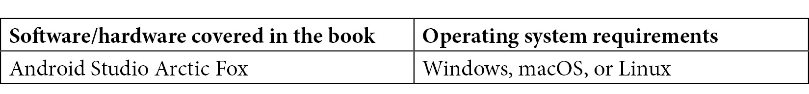

# 前言

Jetpack Compose 是 Android 的新框架，用于构建快速、美观且可靠的本地用户界面。它通过声明式方法简化并显著加速了 Android 的 UI 开发。这本书将帮助开发者亲身体验 Jetpack Compose，并采用现代方式构建 Android 应用。本书不是 Android 开发的入门指南，但它将建立在您对 Android 应用开发方式的理解之上。

配备了动手教程和项目，这本易于遵循的指南将帮助您掌握 Jetpack Compose 的基础知识，如状态提升、单向数据流和组合优于继承，并帮助您使用 Compose 构建自己的 Android 应用。您还将涵盖测试、动画以及与现有 Android UI 工具包的互操作性等概念。

在本书结束时，您将能够使用 Jetpack Compose 编写自己的 Android 应用。

# 本书面向的对象

这本书适合任何希望了解新 Jetpack Compose 框架基础和原生开发优势的移动应用开发者。对 Android 应用开发有扎实的理解，以及一些 Kotlin 编程语言的知识，将会很有帮助。掌握这本书中涵盖的概念需要基本的编程知识。

# 本书涵盖的内容

*第一章*，*构建您的第一个 Compose 应用*，展示了如何构建您的第一个 Compose 应用。同时，还介绍了重要的关键概念，如可组合函数和预览的使用。为了尽早取得成功，我们将在深入细节之前构建、预览并运行可组合函数。

*第二章*，*理解声明式范式*，解释了之前是如何做到的，以及*旧*方法存在的问题。此外，您还将了解可组合函数与视图的不同之处，以及为什么这既重要又有益。

*第三章*，*探索 Compose 的关键原则*，介绍了 Jetpack Compose 所依赖的关键原则。这些知识对于编写表现良好的 Compose 应用至关重要。

*第四章*，*布局 UI 元素*，向您介绍了一些现有的布局。它还展示了如何实现自定义布局。如果内置布局无法提供所需的 UI 元素在屏幕上的分布，这些布局就是必需的。

*第五章*，*管理您的可组合函数的状态*，探讨了 Jetpack Compose 如何使用状态。状态是可能随时间变化的应用数据。可组合函数显示和修改状态。Jetpack Compose 基于一组关于如何使用状态的原则。本章将向您介绍这些原则。

*第六章*，*整合碎片*，回顾了之前学到的概念，并将它们整合到一个应用中。在真实代码中看到概念有助于理解它们，并使您在自己的程序中重用它们变得更加容易。

*第七章*，*技巧、窍门和最佳实践*，在使用 Compose 时提供了最佳实践。这些将包括诸如持久化和检索状态以及使用所谓的副作用等主题。本章还展示了要避免的事情，例如在可组合函数内部进行重量级计算。

*第八章*，*使用动画*，介绍了所有相关的 API。动画和过渡使应用更加出色。Jetpack Compose 在添加动画效果方面极大地简化了旧视图方法的过程。

*第九章*，*探索互操作性 API*，讨论了在单个应用中结合声明性和命令式方法的策略，并提供了将现有 UI 无缝更新到 Jetpack Compose 的迁移策略。

*第十章*，*测试和调试 Compose 应用*，介绍了 Compose 应用的基本测试场景。测试 Compose 应用的用户界面与测试基于视图的 UI 不同。Compose 使用更声明性的方法进行测试。

*第十一章*，*结论与下一步行动*，总结了本书，并指导你尝试下一步的内容。此外，本章还试图猜测 Jetpack Compose 的未来，并探讨邻近平台以及如何从你对它们的了解中受益。

# 要充分利用本书

您至少需要 Android Studio Arctic Fox 或更高版本。要运行示例应用，您还需要配置 Android 模拟器或真实设备。Jetpack Compose 适用于 API 级别 21 或更高的平台。



**如果您正在使用本书的数字版，我们建议您亲自输入代码或从本书的 GitHub 仓库（下一节中有一个链接）获取代码。这样做将帮助您避免与代码复制和粘贴相关的任何潜在错误。**

# 下载示例代码文件

您可以从 GitHub 下载本书的示例代码文件[`github.com/PacktPublishing/Android-UI-Development-with-Jetpack-Compose`](https://github.com/PacktPublishing/Android-UI-Development-with-Jetpack-Compose)。如果代码有更新，它将在 GitHub 仓库中更新。

我们还有其他来自我们丰富的书籍和视频目录的代码包，可在[`github.com/PacktPublishing/`](https://github.com/PacktPublishing/)找到。查看它们！

# 下载彩色图片

我们还提供了一份包含本书中使用的截图和图表彩色图像的 PDF 文件。您可以从这里下载：[`static.packt-cdn.com/downloads/9781801812160_ColorImages.pdf`](https://static.packt-cdn.com/downloads/9781801812160_ColorImages.pdf)。

# 使用的约定

在本书中使用了多种文本约定。

`文本中的代码`：表示文本中的代码单词、数据库表名、文件夹名、文件名、文件扩展名、路径名、虚拟 URL、用户输入和 Twitter 昵称。以下是一个示例：“如果您已经克隆或下载了本书的仓库，其项目文件夹位于`chapter_01`内部。”

代码块设置如下：

```kt
@Composable 
fun Greeting(name: String) { 
  Text( 
    text = stringResource(id = R.string.hello, name), 
    textAlign = TextAlign.Center, 
    style = MaterialTheme.typography.subtitle1 
  ) 
}
```

当我们希望您注意代码块中的特定部分时，相关的行或项目将以粗体显示：

```kt
TextField( 
  value = name.value, 
  onValueChange = { 
    name.value = it 
  },
```

**粗体**：表示新术语、重要单词或您在屏幕上看到的单词。例如，菜单或对话框中的单词以粗体显示。以下是一个示例：“在您输入姓名并点击**完成**按钮后，您将看到问候信息。”

小贴士或重要注意事项

看起来是这样的。

# 联系我们

我们始终欢迎读者的反馈。

**一般反馈**：如果您对本书的任何方面有疑问，请通过电子邮件发送至 customercare@packtpub.com，并在邮件主题中提及书名。

**勘误**：尽管我们已经尽一切努力确保内容的准确性，但错误仍然可能发生。如果您在这本书中发现了错误，我们将非常感激您向我们报告。请访问[www.packtpub.com/support/errata](http://www.packtpub.com/support/errata)并填写表格。

**盗版**：如果您在互联网上发现我们作品的任何形式的非法副本，我们将非常感激您提供位置地址或网站名称。请通过 copyright@packt.com 与我们联系，并提供材料的链接。

**如果您有兴趣成为作者**：如果您在某个领域有专业知识，并且您有兴趣撰写或为本书做出贡献，请访问[authors.packtpub.com](http://authors.packtpub.com)。

# 分享您的想法

读完*使用 Jetpack Compose 进行 Android UI 开发*后，我们非常乐意听到您的想法！请选择 https://www.amazon.in/review/create-review/error?asin=1801812160 为这本书并分享您的反馈。

您的评审对我们和科技社区非常重要，并将帮助我们确保我们提供高质量的内容。
