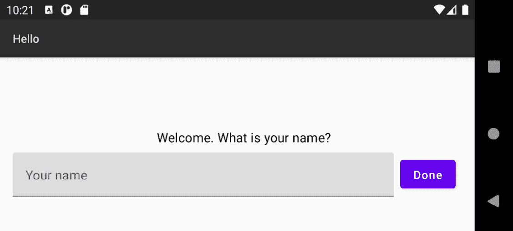
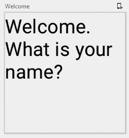
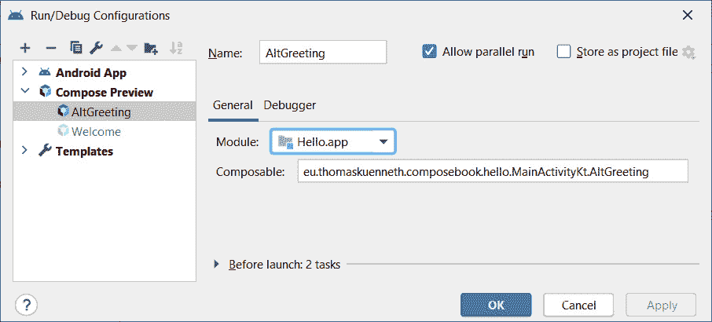

# 第一章：构建你的第一个 Compose 应用

当安卓系统在 10 多年前推出时，它迅速在开发者中获得了人气，因为它编写应用极其简单。你只需在 XML 文件中定义用户界面（UI）并将其连接到你的*activity*即可。这工作得非常完美，因为应用体积小，开发者只需要支持少数几款设备。

自那以后，发生了许多变化。

每当新的平台版本推出时，安卓都会获得新的功能。经过多年，设备制造商推出了数千款具有不同屏幕尺寸、像素密度和形态的设备。虽然谷歌尽力保持安卓*视图*系统的可理解性，但应用的复杂性显著增加；基本任务，如实现滚动列表或动画，需要大量的模板代码。

结果表明，这些问题并不仅限于安卓。其他平台和操作系统也面临着这些问题。大多数问题源于 UI 工具包过去的工作方式；它们遵循所谓的**命令式方法**（我将在*第二章*，*理解声明式范式*中解释）。解决方案是一个范式转变。Web 框架 React 是第一个普及声明式方法的应用。其他平台和框架（例如 Flutter 和 SwiftUI）随后效仿。

**Jetpack Compose**是谷歌为安卓提供的声明式 UI 框架。它极大地简化了 UI 的创建。在阅读完这本书后，你一定会同意使用 Jetpack Compose 既简单又有趣。但在我们深入之前，请注意 Jetpack Compose 仅支持 Kotlin。这意味着你所有的 Compose 代码都必须用 Kotlin 编写。为了跟随这本书，你应该对 Kotlin 语法和函数式编程模型有基本的了解。如果你想要了解更多关于这些主题的内容，请参考本章末尾的*进一步阅读*部分。

本章涵盖了三个主要主题：

+   向可组合函数问好

+   使用预览功能

+   运行 Compose 应用

我将解释如何使用 Jetpack Compose 构建一个简单的 UI。接下来，你将学习如何在 Android Studio 中使用**预览**功能以及如何运行一个 Compose 应用。在本章结束时，你将基本了解可组合函数的工作方式、它们如何集成到你的应用中以及你的项目必须如何配置才能使用 Jetpack Compose。

# 技术要求

本章的所有代码文件都可以在 GitHub 上找到，网址为 [`github.com/PacktPublishing/Android-UI-Development-with-Jetpack-Compose/tree/main/chapter_01`](https://github.com/PacktPublishing/Android-UI-Development-with-Jetpack-Compose/tree/main/chapter_01)。请下载压缩版本或克隆存储库到您计算机上的任意位置。项目至少需要 Android Studio Arctic Fox。您可以在 [`developer.android.com/studio`](https://developer.android.com/studio) 下载最新版本。请按照 [`developer.android.com/studio/install`](https://developer.android.com/studio/install) 上的详细安装说明进行操作。

要打开本书的项目，启动 Android Studio，在“欢迎使用 Android Studio”窗口右上角点击**打开**按钮，并在文件夹选择对话框中选择项目的基目录。请确保不要打开存储库的基目录，因为 Android Studio 不会识别项目。相反，您必须选择包含您想要工作的项目的目录。

要运行示例应用程序，您需要一个真实设备或 Android 模拟器。请确保在真实设备上启用了开发者选项和 USB 调试，并且设备通过 USB 或 WLAN 连接到您的开发机器。请按照 [`developer.android.com/studio/debug/dev-options`](https://developer.android.com/studio/debug/dev-options) 上的说明操作。您还可以设置 Android 模拟器。您可以在 [`developer.android.com/studio/run/emulator`](https://developer.android.com/studio/run/emulator) 找到详细说明。

# 向可组合函数问好

如您很快就会看到的，可组合函数是 Compose 应用程序的基本构建块；这些元素构成了用户界面。

要初步了解它们，我将带您浏览一个名为 `chapter_01` 的简单应用程序。否则，请现在就这样做。要跟随本节内容，请在 Android Studio 中打开项目并打开 `MainActivity.kt`。我们的第一个 Compose 应用程序的使用场景非常简单。在您输入您的名字并点击**完成**按钮后，您将看到一个问候信息：



图 1.1 – Hello 应用程序

从概念上讲，应用程序由以下内容组成：

+   欢迎文本

+   一行包含 `EditText` 等效元素和按钮

+   一条问候信息

让我们看看如何创建应用程序。

## 显示欢迎文本

让我们从欢迎文本开始，这是我们的第一个可组合函数：

```kt
@Composable
fun Welcome() {
  Text(
    text = stringResource(id = R.string.welcome),
    style = MaterialTheme.typography.subtitle1
  )
}
```

可组合函数可以通过 `@Composable` 注解轻松识别。它们不需要有特定的返回类型，而是发出 UI 元素。这通常是通过调用其他可组合函数（为了简洁起见，我有时会省略“函数”一词）来完成的。第三章，*探索 Compose 的关键原则*，将更详细地介绍这一点。

在这个例子中，`Welcome()` 调用一个文本。`Text()` 是一个内置的可组合函数，属于 `androidx.compose.material` 包。

要仅通过其名称调用 `Text()`，您需要导入它：

```kt
import androidx.compose.material.Text
```

请注意，您可以使用 `*` 通配符来保存 `import` 行。

要使用 `Text()` 和其他 Material Design 元素，您的 `build.gradle` 文件必须包含对 `androidx.compose.material:material` 的实现依赖项。

回顾欢迎文本代码，`Welcome()` 中的 `Text()` 可组合函数通过两个参数 `text` 和 `style` 进行配置。

第一个，`text`，指定将显示什么文本。`R.string` 可能看起来很熟悉；它指的是 `strings.xml` 文件中的定义。就像在基于视图的应用程序中一样，您在那里为 UI 元素定义文本。`stringResource()` 是一个预定义的可组合函数。它属于 `androidx.compose.ui.res` 包。

`style` 参数修改文本的视觉外观。在这种情况下，输出将看起来像副标题。我将在 *第六章*，*将部件组合在一起* 中向您展示如何创建自己的主题。

下一个可组合函数看起来相当相似。你能找到它们之间的区别吗？

```kt
@Composable
fun Greeting(name: String) {
  Text(
    text = stringResource(id = R.string.hello, name),
    textAlign = TextAlign.Center,
    style = MaterialTheme.typography.subtitle1
  )
}
```

在这里，`stringResource()` 接收一个额外的参数。这对于用实际文本替换占位符非常方便。字符串在 `strings.xml` 中定义，如下所示：

```kt
<string name="hello">Hello, %1$s.\nNice to meet you.</string>
```

`textAlign` 参数指定文本如何水平定位。在这里，每一行都是居中的。

## 使用行、文本字段和按钮

接下来，让我们转向文本输入字段（`Row()`，它属于 `androidx.compose.foundation.layout` 包。就像所有可组合函数一样，`Row()` 可以在括号内接收一个逗号分隔的参数列表，其子项放在花括号内：

```kt
@Composable
fun TextAndButton(name: MutableState<String>, 
                  nameEntered: MutableState<Boolean>) {
  Row(modifier = Modifier.padding(top = 8.dp)) {
    ...
  }
}
```

`TextAndButton()` 需要两个参数，`name` 和 `nameEntered`。您将在 *显示问候消息* 部分看到它们是如何使用的。现在，请忽略它们的 `MutableState` 类型。

`Row()` 接收一个名为 `modifier` 的参数。修饰符是 Jetpack Compose 中影响可组合函数外观和行为的关键技术。我将在 *第三章*，*探索 Compose 的关键原则* 中更详细地解释它们。

`padding(top = 8.dp)` 表示该行在其顶部将有一个八密度无关像素（`.dp`）的填充，从而使其与上面的欢迎信息隔开。

现在，我们将查看文本输入字段，它允许用户输入一个名字：

```kt
TextField(
  value = name.value,
  onValueChange = {
    name.value = it
  },
  placeholder = {
    Text(text = stringResource(id = R.string.hint))
  },
  modifier = Modifier
    .alignByBaseline()
    .weight(1.0F),
  singleLine = true,
  keyboardOptions = KeyboardOptions(
    autoCorrect = false,
    capitalization = KeyboardCapitalization.Words,
  ),
  keyboardActions = KeyboardActions(onAny = {
    nameEntered.value = true
  })
)
```

`TextField()` 属于 `androidx.compose.material` 包。该可组合函数可以接收相当多的参数；尽管大多数是可选的。请注意，前面的代码片段同时使用了 `name` 和 `nameEntered` 参数，这些参数传递给了 `TextAndButton()`。它们的类型是 `MutableState`。`MutableState` 对象携带可变值，您可以通过 `name.value` 或 `nameEntered.value` 访问它们。

`TextField()` 可组合组件的 `value` 参数接收文本输入字段的当前值，例如，已经输入的文字。当文本发生变化时（如果用户输入或删除了某些内容），会调用 `onValueChange`。但为什么两个地方都使用了 `name.value`？我将在 *显示问候消息* 部分回答这个问题。

重组

某些类型会触发所谓的重组。现在，你可以将这想象成重新绘制一个相关的可组合组件。`MutableState` 就是这样一种类型。如果我们改变它的值，`TextField()` 可组合组件就会被重新绘制或重绘。请注意，这两个术语并不完全准确。我们将在 *第三章* 中介绍重组，*探索 Compose 的关键原则*。

让我们简要地看看剩余的代码。使用 `alignByBaseline()`，我们可以很好地对齐特定 `Row()` 中的其他可组合函数的基线。`placeholder` 包含用户输入内容之前的文本。`singleLine` 控制用户是否可以输入多行文本。最后，`keyboardOptions` 和 `keyboardActions` 描述了屏幕键盘的行为。例如，某些操作会将 `nameEntered.value` 设置为 `true`。我很快就会向你展示我们为什么要这样做。

然而，我们首先需要看看 `Button()` 可组合组件。它也属于 `androidx.compose.material` 包：

```kt
Button(modifier = Modifier
  .alignByBaseline()
  .padding(8.dp),
  onClick = {
    nameEntered.value = true
  }) {
  Text(text = stringResource(id = R.string.done))
}
```

一些东西看起来可能已经熟悉了。例如，我们调用 `alignByBaseline()` 来对齐按钮的基线与文本输入字段，并使用 `padding()` 在按钮的四周应用八个密度无关像素的填充。现在，`onClick()` 指定了按钮被点击时要执行的操作。在这里，我们也设置了 `nameEntered.value` 为 `true`。下一个可组合函数 `Hello()` 最终会向你展示为什么要这样做。

## 显示问候消息

`Hello()` 发射 `Box()`，它（根据 `nameEntered.value`）包含 `Greeting()` 或一个包含 `Welcome()` 和 `TextAndButton()` 的 `Column()` 可组合组件。`Column()` 可组合组件与 `Row()` 很相似，但垂直排列其兄弟组件。像后者和 `Box()` 一样，它属于 `androidx.compose.foundation.layout` 包。`Box()` 可以包含一个或多个子组件。它们根据 `contentAlignment` 参数在盒内定位。我们将在 *第四章* 的 *组合基本构建块* 部分更详细地探讨这一点，*布局 UI 元素*：

```kt
@Composable
fun Hello() {
  val name = remember { mutableStateOf("") }
  val nameEntered = remember { mutableStateOf(false) }
  Box(
    modifier = Modifier
      .fillMaxSize()
      .padding(16.dp),
    contentAlignment = Alignment.Center
  ) {
    if (nameEntered.value) {
      Greeting(name.value)
    } else {
      Column(horizontalAlignment =
             Alignment.CenterHorizontally) {
        Welcome()
        TextAndButton(name, nameEntered)
      }
    }
  }
}
```

你注意到 `remember` 和 `mutableStateOf` 吗？它们对于创建和维护状态都非常重要。一般来说，应用中的状态指的是随时间可能发生变化的值。虽然这也适用于领域数据（例如，网络服务调用的结果），但状态通常指的是由 UI 元素显示或使用的某些内容。如果一个可组合函数（或依赖于）状态，当该状态发生变化时，它将重新组合（目前，重新绘制或重新绘制）。为了理解这意味着什么，请回忆这个可组合组件：

```kt
@Composable
fun Welcome() {
    Text(
        text = stringResource(id = R.string.welcome),
        style = MaterialTheme.typography.subtitle1
    )
}
```

`Welcome()` 被称为无状态；所有可能触发重新组合的值在目前都保持不变。另一方面，`Hello()` 是有状态的，因为它使用了 `name` 和 `nameEntered` 变量。这些变量会随时间变化。如果你查看 `Hello()` 的源代码，这可能并不明显。请记住，`name` 和 `nameEntered` 都被传递给了 `TextAndButton()` 并在那里进行了修改。

你还记得在上一节中我承诺解释为什么在两个地方使用了 `name.value`，提供要显示的文本并在用户输入某些内容后接收变化吗？这是一个常见的模式，通常与状态一起使用；`Hello()` 通过调用 `mutableStateOf()` 和 `remember` 来创建和记住状态，并将状态传递给另一个可组合组件（`TextAndButton()`），这被称为**状态提升**。你将在*第五章*中了解更多关于*管理你的可组合函数的状态*。

到目前为止，你已经看到了很多可组合函数的源代码，但还没有看到它们的输出。Android Studio 有一个非常重要的功能，称为**Compose 预览**。它允许你在不运行应用的情况下查看可组合函数。在下一节中，我将向你展示如何使用这个功能。

# 使用预览

Android Studio 代码编辑器的右上角有三个按钮，**代码**、**分割**和**设计**（*图 1.2*）：


图 1.2 – Compose 预览（分割模式）

它们会在以下不同的显示模式之间切换：

+   仅代码

+   代码和预览

+   仅预览

要使用 Compose 预览，你的可组合函数必须包含一个额外的注解，`@Preview`，它属于 `androidx.compose.ui.tooling.preview` 包。这需要在你的 `build.gradle` 文件中实现依赖 `androidx.compose.ui:ui-tooling-preview`。

不幸的是，如果你尝试将 `@Preview` 添加到 `Greeting()` 中，你会看到一个类似这样的错误信息：

```kt
Composable functions with non-default parameters are not supported in Preview unless they are annotated with @PreviewParameter.
```

那么，你如何预览接受参数的可组合组件呢？

## 预览参数

最明显的解决方案是一个包装可组合组件：

```kt
@Composable
@Preview
fun GreetingWrapper() {
  Greeting("Jetpack Compose")
}
```

这意味着您编写了另一个不接收任何参数但调用现有函数并提供所需参数（在我的例子中是文本）的复合函数。根据您的源文件中包含的复合函数数量，您可能需要创建相当多的样板代码。这些包装器除了启用预览外，没有增加任何价值。

幸运的是，还有其他选项。例如，您可以为您的复合函数添加默认值：

```kt
@Composable
fun AltGreeting(name: String = "Jetpack Compose") {
```

虽然这样做看起来不那么复杂，但它改变了调用复合函数的方式（即，不传递参数）。如果您最初没有定义默认值的原因，这可能不是您想要的。

使用 `@PreviewParameter`，您可以传递仅影响预览的值。不幸的是，这有点冗长，因为您需要编写一个新的类：

```kt
class HelloProvider : PreviewParameterProvider<String> {
  override val values: Sequence<String>
    get() = listOf("PreviewParameterProvider").asSequence()
}
```

该类必须扩展 `androidx.compose.ui.tooling.preview.PreviewParameterProvider`，因为它将为预览提供参数。现在，您可以使用 `@PreviewParameter` 注解复合函数的参数并传递您的新类：

```kt
@Composable
@Preview
fun AltGreeting2(@PreviewParameter(HelloProvider::class)
        name: String) {
```

从某种意义上说，您也在创建样板代码。因此，您最终选择哪种方法取决于个人喜好。`@Preview` 注解可以接收相当多的参数。它们修改预览的视觉外观。让我们探索其中的一些。

## 配置预览

您可以使用 `backgroundColor =` 为预览设置背景颜色。该值是 `Long` 类型，表示 ARGB 颜色。请确保也将 `showBackground` 设置为 `true`。以下代码片段将生成纯红色背景：

```kt
@Preview(showBackground = true, backgroundColor =
         0xffff0000)
```

默认情况下，预览维度是自动选择的。如果您想显式设置它们，可以传递 `heightDp` 和 `widthDp`：

```kt
@Composable
@Preview(widthDp = 100, heightDp = 100)
fun Welcome() {
  Text(
    text = stringResource(id = R.string.welcome),
    style = MaterialTheme.typography.subtitle1
  )
}
```

*图 1.3* 展示了结果。两个值都被解释为密度无关像素，因此您不需要像在复合函数内部那样添加 `.dp`。



图 1.3 – 设置预览的宽度和高度

要测试不同的用户区域设置，您可以添加 `locale` 参数。例如，如果您的应用在 `values-de-rDE` 中包含德语字符串，您可以通过添加以下内容来使用它们：

```kt
@Preview(locale = "de-rDE")
```

字符串匹配 `values-` 后的目录名。请记住，如果您在翻译编辑器中添加语言，Android Studio 会创建该目录。

如果您想显示状态栏和操作栏，您可以使用 `showSystemUi` 来实现这一点：

```kt
@Preview(showSystemUi = true)
```

要了解您的复合函数对不同形态因子、宽高比和像素密度的反应，您可以使用 `device` 参数。它接受一个字符串。传递 `Devices` 中的其中一个值，例如，`Devices.PIXEL_C` 或 `Devices.AUTOMOTIVE_1024p`。

在本节中，您已经看到了如何配置预览。接下来，我将向您介绍预览组。如果您的源代码文件包含多个您想要预览的复合函数，它们将非常有用。

## 预览分组

Android Studio 以源代码中出现的顺序显示带有 `@Preview` 注解的可组合函数。您可以选择 **垂直布局** 和 **网格布局**（*图 1.4*）：


图 1.4 – 在垂直布局和网格布局之间切换

根据您的可组合函数数量，预览窗格可能会在某些时候显得拥挤。如果是这种情况，只需通过添加 `group` 参数将您的可组合函数放入不同的组中：

```kt
@Preview(group = "my-group-1")
```

您可以显示所有可组合函数或仅显示属于特定组的那些函数（*图 1.5*）：


图 1.5 – 在组之间切换

到目前为止，我已经向您展示了可组合函数的源代码看起来是什么样子，以及您如何在 Android Studio 中预览它们。在下一节中，我们将在一个 Android 模拟器或真实设备上执行一个可组合函数，您将学习如何将可组合函数连接到应用程序的其他部分。但在那之前，这里有一个小贴士：

将预览导出为图片

如果您用鼠标右键单击 Compose 预览，您将看到一个小的弹出菜单。选择 **复制图像** 将预览的位图放入系统剪贴板。大多数图形应用程序允许您将其粘贴到新文档中。

# 运行 Compose 应用程序

如果您想查看可组合函数在 Android 模拟器或真实设备上的外观和感觉，您有两个选择：

+   部署可组合函数

+   运行应用程序

如果您想专注于特定的可组合函数而不是整个应用程序，第一个选项很有用。此外，部署一个可组合函数所需的时间可能比部署一个完整的应用程序短得多（取决于应用程序的大小）。所以，让我们从这个开始。

## 部署可组合函数

要将可组合函数部署到真实设备或 Android 模拟器，请单击右上角的小图像 **部署预览** 按钮（*图 1.6*）：


图 1.6 – 部署可组合函数

这将自动创建新的启动配置（*图 1.7*）：



图 1.7 – 表示 Compose 预览的启动配置

您可以在 **运行/调试配置** 对话框中修改或删除 Compose 预览配置。要访问它们，请打开 **Compose 预览** 节点。然后，例如，您可以更改其名称或通过取消选中 **允许并行运行** 来阻止并行运行。

本章的目标是在真实设备或 Android 模拟器上部署和运行你的第一个 Compose 应用。你几乎就完成了；在下一节中，我将向你展示如何将组合函数嵌入到活动中，这是先决条件。你最终将在 *按下播放按钮* 部分运行该应用。

## 在活动中使用组合函数

**活动** 自从第一个平台版本以来一直是 Android 应用的基本构建块之一。几乎每个应用至少有一个活动。它们在清单文件中配置。要从主屏幕启动活动，相应的条目看起来像这样：

```kt
...
<activity
  android:name=".MainActivity"
  android:exported="true"
  android:label="@string/app_name">
  <intent-filter>
    <action android:name="android.intent.action.MAIN" />
    <category
     android:name="android.intent.category.LAUNCHER" />
  </intent-filter>
</activity>
...
```

这对 Compose 应用仍然成立。一个希望显示组合函数的活动设置起来就像一个填充传统布局文件的活动一样。但它的源代码是什么样的呢？`Hello` 应用程序的主活动被命名为 `MainActivity`，如下一个代码块所示：

```kt
class MainActivity : ComponentActivity() {
  override fun onCreate(savedInstanceState: Bundle?) {
    super.onCreate(savedInstanceState)
    setContent {
      Hello()
    }
  }
}
```

如你所见，它非常简短。UI（`Hello()` 组合函数）是通过调用一个名为 `setContent` 的函数来显示的，这是一个扩展函数，属于 `androidx.activity.ComponentActivity` 并属于 `androidx.activity.compose` 包。

要渲染组合，你的活动必须扩展 `ComponentActivity` 或具有 `ComponentActivity` 作为其直接或间接祖先的另一个类。这是 `androidx.fragment.app.FragmentActivity` 和 `androidx.appcompat.app.AppCompatActivity` 的情况。

这是一个重要的区别；虽然 Compose 应用调用 `setContent()`，基于视图的应用调用 `setContentView()` 并传递布局的 ID（例如 `R.layout.activity_main`）或根视图本身（这通常是通过某种绑定机制获得的）。让我们看看旧机制是如何工作的。以下代码片段取自我的一个开源应用（你可以在 GitHub 上找到它 [`github.com/MATHEMA-GmbH/TKWeek`](https://github.com/MATHEMA-GmbH/TKWeek)，但本书将不再进一步讨论）：

```kt
class TKWeekActivity : TKWeekBaseActivity() {
  private var backing: TkweekBinding? = null
  private val binding get() = backing!!
  override fun onCreate(savedInstanceState: Bundle?) {
    super.onCreate(savedInstanceState)
    backing = TkweekBinding.inflate(layoutInflater, null,
              false)
    setContentView(binding.root)
    ...
```

如果你比较这两种方法，一个显著的区别是，在使用 Jetpack Compose 时，不需要维护 UI 组件树或其单个元素的引用。我将在 *第二章*，“理解声明式范式”中解释为什么这会导致易于维护且错误率较低的代码。

现在让我们回到 `setContent()`。它接收两个参数，一个 `parent`（可以是 `null`）和 `content`（UI）。`parent` 是 `androidx.compose.runtime.CompositionContext` 的一个实例。它用于在逻辑上将两个组合连接起来。这是一个高级主题，我将在 *第三章*，“探索 Compose 的关键原则”中进行讨论。

重要提示

您有没有注意到 `MainActivity` 不包含任何可组合函数？它们不需要成为类的一部分。实际上，您应该尽可能地将它们实现为顶级函数。Jetpack Compose 提供了访问 `android.content.Context` 的替代方法。您已经看到了 `stringResource()` 可组合函数，它是 `getString()` 的替代品。

现在，您已经看到了如何在活动中嵌入可组合函数，是时候看看基于 Jetpack Compose 的项目的结构了。虽然如果您使用项目向导创建 Compose 应用程序，Android Studio 会为您设置一切，但了解底层涉及哪些文件是很重要的。

## 查看底层

Jetpack Compose 严重依赖于 Kotlin。这意味着您的应用程序项目必须配置为使用 Kotlin。但这并不意味着您不能完全使用 Java。实际上，只要您的可组合函数是用 Kotlin 编写的，您就可以轻松地在项目中混合使用 Kotlin 和 Java。您还可以结合传统视图和可组合项。我将在 *第九章* 中讨论此主题，*探索互操作性 API*。

首先，请确保在项目级别的 build.gradle 文件中配置与您的 Android Studio 版本相对应的 Android Gradle 插件：

```kt
buildscript {
  ...
  dependencies {
    classpath "com.android.tools.build:gradle:7.0.4"
    classpath "org.jetbrains.kotlin:kotlin-gradle-               plugin:1.5.31"
    ...
  }
}
```

以下代码片段属于模块级别的 build.gradle 文件：

```kt
plugins {
    id 'com.android.application'
    id 'kotlin-android'
}
```

接下来，请确保您的应用程序的最小 API 级别设置为 21 或更高，并且已启用 Jetpack Compose。以下代码片段还设置了 Kotlin 编译器插件的版本：

```kt
android {
  defaultConfig {
    ...
    minSdkVersion 21
  }
  buildFeatures {
    compose true
  }
  ...
  compileOptions {
    sourceCompatibility JavaVersion.VERSION_11
    targetCompatibility JavaVersion.VERSION_11
  }
  kotlinOptions {
    jvmTarget = "11"
  }
  composeOptions {
    kotlinCompilerExtensionVersion compose_version
  }
}
```

最后，声明依赖项。以下代码片段是一个很好的起点。根据您的应用程序使用的包，您可能需要额外的依赖项：

```kt
dependencies {
    implementation 'androidx.core:core-ktx:1.7.0'
    implementation 'androidx.appcompat:appcompat:1.4.0'
    Implementation
      "androidx.compose.ui:ui:$compose_version"
    implementation
      "androidx.compose.material:material:$compose_version"
    implementation
      "androidx.compose.ui:ui-tooling-
       preview:$compose_version"
    implementation
      'androidx.lifecycle:lifecycle-runtime-ktx:2.4.0'
    implementation
      'androidx.activity:activity-compose:1.4.0'
    debugImplementation
      "androidx.compose.ui:ui-tooling:$compose_version"
}
```

一旦您配置了项目，构建和运行 Compose 应用程序的工作方式就像传统的基于视图的应用程序一样。

## 按下播放按钮

要运行您的 Compose 应用程序，请选择您的目标设备，确保已选中 **app** 模块，然后按下绿色的 *播放* 按钮 (*图 1.8*)：

![图 1.8 – 启动应用程序的 Android Studio 工具栏元素]

![img/B17505_01_08.jpg]

图 1.8 – 启动应用程序的 Android Studio 工具栏元素

恭喜！做得好。您现在已经启动了您的第一个 Compose 应用程序，并且已经取得了相当大的成就。让我们回顾一下。

# 摘要

在本章中，我们学习了如何编写我们的第一个可组合项：带有 `@Composable` 注解的 Kotlin 函数。可组合函数是基于 Jetpack Compose 的 UI 的核心构建块。您将现有的库可组合项与您自己的组合在一起，以创建美观的应用程序屏幕。要查看预览，我们可以添加 `@Preview` 注解。要在项目中使用 Jetpack Compose，两个 `build.gradle` 文件都必须相应地配置。

在*第二章*《理解声明式范式》中，我们将更深入地探讨 Jetpack Compose 的声明式方法和传统 UI 框架（如 Android 的基于视图的组件库）的命令式本质之间的区别。

# 进一步阅读

本书假设您对 Kotlin 的语法和 Android 开发有基本的了解。如果您想了解更多关于这方面的内容，我建议查看*《Kotlin 编程入门》*，作者*约翰·霍顿*，*Packt Publishing*出版社，*2019 年*，*ISBN 9781789615401*。
