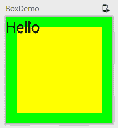

# 第二章：理解声明式范式

Jetpack Compose 标志着 Android UI 开发的根本性转变。虽然传统的基于视图的方法以组件和类为中心，但新的框架遵循声明式方法。

在第一章中，*构建您的第一个 Compose 应用*，我向你介绍了可组合函数，它是基于 Compose 的 UI 的基本构建块。在本章中，我们将简要回顾如何使用传统的类和技术实现 Android UI。你将了解这种方法的一些问题，以及如何通过声明式框架克服这些问题。

本章的主要部分如下：

+   查看 Android 视图系统

+   从组件到可组合函数

+   检查架构概念

我们将从查看我的第二个示例应用*Hello View*开始。它是第一章中*构建您的第一个 Compose 应用*的*Hello*应用的重新实现。*Hello View*使用视图、XML **布局文件**和**视图绑定**。

接下来，我们将介绍**组件**的关键方面，它们是基于视图世界的 UI 构建块。你将了解可组合函数的相似之处和不同之处，我们将找出可组合函数如何克服以组件为中心的框架的一些局限性。

最后，我们将探讨 Android 框架的不同层次以及它们与构建 UI 的关系。到本章结束时，你将收集到足够的背景信息来探索 Jetpack Compose 的关键原则，这是下一章的主题。

# 技术要求

请参阅第一章中的*技术要求*部分，*构建您的第一个 Compose 应用*，了解如何安装和设置 Android Studio 以及如何获取示例应用。本章的所有代码文件都可以在 GitHub 上找到：[`github.com/PacktPublishing/Android-UI-Development-with-Jetpack-Compose/tree/main/chapter_02`](https://github.com/PacktPublishing/Android-UI-Development-with-Jetpack-Compose/tree/main/chapter_02)。

# 查看 Android 视图系统

传统构建 Android UI 的方法是定义组件树并在运行时修改它们。虽然这可以完全通过编程实现，但首选的方法是创建布局文件。它们使用 XML 标签和属性来定义哪些 UI 元素应该显示在屏幕上。让我们看一下：

```kt
<?xml version="1.0" encoding="utf-8"?>
<androidx.constraintlayout.widget.ConstraintLayout

  android:layout_width="match_parent"
  android:layout_height="match_parent">
  <TextView
    android:id="@+id/message"
    style="@style/TextAppearance.AppCompat.Medium"
    android:layout_width="wrap_content"
    android:layout_height="wrap_content"
    android:textAlignment="center"
    app:layout_constraintBottom_toBottomOf="parent"
    app:layout_constraintBottom_toTopOf="@id/name"
    app:layout_constraintEnd_toEndOf="parent"
    app:layout_constraintHorizontal_bias="0.5"
    app:layout_constraintStart_toStartOf="parent"
    app:layout_constraintTop_toTopOf="parent"
    app:layout_constraintVertical_bias="0.5"
    app:layout_constraintVertical_chainStyle="packed" />
  ...
</androidx.constraintlayout.widget.ConstraintLayout>
```

布局文件定义了一个层次结构（一棵树）。在前面的 XML 片段中，根节点（`ConstraintLayout`）只包含一个子节点（`TextView`）。*Hello View*的完整 XML 文件还有两个额外的子节点，一个`EditText`组件和一个`Button`组件。现实世界的应用布局文件可以非常嵌套，包含数十个子节点。

一般而言，`...Layout` 元素负责调整其子元素的大小和位置。虽然它们可能有视觉表示（例如，背景颜色或边框），但它们通常不与用户交互。`ScrollView` 是这个规则的例外之一。所有其他（非 `...Layout`）元素，如按钮、复选框和可编辑文本字段不仅允许用户交互——这是它们的目的。

布局和非布局元素统称为组件。我们将在 *从组件到可组合函数的迁移* 部分回到这个术语。但在那之前，让我们看看布局文件在应用中的使用方式。

## 布局文件展开

活动（Activities）是 Android 应用程序的核心构建块之一。它们实现了一个相当复杂的生命周期，这反映在我们可以重写的几个方法中。

通常，`onCreate()` 方法用于准备应用并通过调用 `setContentView()` 来显示 UI。此方法可以接收一个表示布局文件的 ID，例如，`R.layout.main`。因此，你必须定义指向你希望访问的 UI 元素的变量。这看起来可能如下所示：

```kt
private lateinit var doneButton: Button
...
val doneButton = findViewById(R.id.done)
```

结果表明，这在大应用中扩展性不好。有两个重要的问题需要记住：

+   如果在变量初始化之前访问它，你可能会在运行时遇到崩溃。

+   如果你有很多组件，代码会很快变得冗长。

有时，你可以通过使用局部变量来防止第一个问题，如下所示：

```kt
val doneButton = findViewById<Button>(R.id.done)
```

这样，你可以在声明后立即访问 UI 元素。但变量只存在于它被定义的作用域内——一个块或一个函数。这可能会带来问题，因为你经常需要在 `onCreate()` 之外修改组件。这是因为在一个基于组件的世界中，你通过修改组件的属性来修改 UI。结果发现，通常需要对应用的不同部分进行相同的更改集，为了避免代码重复，它们被重构为需要知道要更改的组件的方法。

为了解决第二个问题——即，让开发者免于保持组件引用的任务——谷歌引入了视图绑定。它属于 Jetpack，并在 Android Studio 3.6 中首次亮相。让我们看看它是如何使用的：

```kt
class MainActivity : AppCompatActivity() {
  private lateinit var binding: MainBinding
  override fun onCreate(savedInstanceState: Bundle?) {
    super.onCreate(savedInstanceState)
    binding = MainBinding.inflate(layoutInflater)
    setContentView(binding.root)
    ...
    enableOrDisableButton()
  }
  ...
}
```

无论一个活动的 UI 多么复杂，我们只需要保留一个引用。这个变量通常被称为 `binding`，它通过调用 `...Binding` 实例的 `inflate()` 方法进行初始化。在我的示例中，`MainBinding` 类在修改 `main.xml` 时会自动生成和更新。每个布局文件都会对应一个 `...Binding` 类。为了启用此机制，必须在模块级别的 `build.gradle` 文件中将 `viewBinding` 构建选项设置为 `true`：

```kt
android {
  ...
  buildFeatures {
    viewBinding true
  }
}
```

因此，在通过调用 `...Binding.inflate()` 指示一个布局文件并分配给实例变量之后，您可以通过这些变量通过它们的 ID 访问其所有组件。ID 是使用 XML 属性 `android:id`（例如，`android:id="@+id/message"`）设置的。

重要提示

传统的 `findViewById()` 和视图绑定之间存在一个重要的区别。如果您使用后者，您必须将根组件（`binding.root`）传递给 `setContentView()`，而不是表示布局文件的 ID（`R.layout.main`）。

在本节中，我向您展示了如何获取 UI 元素的引用。下一节 *修改 UI* 将解释如何利用这些信息。

## 修改 UI

在本节中，我们将了解如何更改基于视图的 UI。让我们首先查看在 `onCreate()` 中调用的 `enableOrDisableButton()` 函数，其名称为您提供了关于其目的的线索——启用或禁用按钮。但我们为什么需要这样做呢？*Hello View* 是 *Hello* 应用（在 *第一章*，*构建您的第一个 Compose 应用*）的重新实现，但它有一个额外的功能。只要用户没有输入至少一个非空白字符，**完成** 就不能点击：

```kt
private fun enableOrDisableButton() {
  binding.done.isEnabled = binding.name.text.isNotBlank()
}
```

`binding.done` 在运行时引用按钮。只有当 `isEnabled` 为 `true` 时才能点击。文本输入字段用 `binding.name` 表示。它的 `text` 属性反映了用户已经输入的内容。`isNotBlank()` 告诉我们是否至少有一个非空白字符存在。

在我向您展示的代码中，`enableOrDisableButton()` 只在 `onCreate()` 的末尾被调用。但我们还需要在用户输入内容时调用该函数。让我们看看如何做到这一点（请注意，以下代码片段属于 `onCreate()` 内部，以便在活动创建时执行）：

```kt
binding.name.run {
  setOnEditorActionListener { _, _, _ ->
    binding.done.performClick()
    true
  }
  doAfterTextChanged {
    enableOrDisableButton()
  }
  visibility = VISIBLE
}
```

文本输入字段可以修改屏幕键盘的某些方面。例如，为了在布局文件中显示 `android:imeOptions="actionDone"` 属性。为了对此键的点击做出反应，我们需要通过调用 `setOnEditorActionListener()` 注册代码。然后，`binding.done.performClick()` 模拟对 **完成** 按钮的点击。您很快就会看到我这样做的原因。

我们传递给 `doAfterTextChanged()` 的 lambda 函数会在用户在文本输入字段中输入或删除内容时被调用。当这种情况发生时，会调用 `enableOrDisableButton()`，如果输入字段中当前显示的文本不为空，则使按钮可点击。

最后，`visibility = VISIBLE` 发生在 `binding.name.run {` 内部，因此使文本输入字段可见。这是活动创建时的期望状态。

现在，让我们转向与 **完成** 按钮相关的代码：

```kt
binding.done.run {
  setOnClickListener {
    val name = binding.name.text
    if (name.isNotBlank()) {
      binding.message.text = getString(R.string.hello,
                                       name)
      binding.name.visibility = GONE
      it.visibility = GONE
    }
  }
  visibility = VISIBLE
}
```

当 `visibility` 属性为 `visibility = VISIBLE` 时，会使 **完成** 按钮可见。这是活动创建时的期望状态。

你还记得我承诺解释为什么在`setOnEditorActionListener`的 lambda 函数中调用`performClick()`吗？这样，我可以在不重构为单独函数的情况下重用按钮监听器内的代码，这当然是一个可行的替代方案。

在我们继续之前，让我们回顾一下到目前为止我们所看到的内容：

+   UI 在 XML 文件中定义。

+   在运行时，它被填充为组件树。

+   要更改 UI，必须修改所有相关组件的属性。

+   即使 UI 元素不可见，它仍然是组件树的一部分。

这就是为什么常见的 UI 框架被称为**命令式**。任何对 UI 的更改都是通过故意修改所有相关组件的属性来完成的。正如你在我例子中看到的那样，这对于小型应用来说效果相当好。但随着应用 UI 元素的增多，跟踪这些更改的要求也会增加。让我来解释一下。领域数据的变化（向列表中添加项目、删除文本或从远程服务加载图像）需要 UI 的变化。开发者需要知道哪些领域数据部分与哪个 UI 元素相关，然后必须相应地修改组件树。应用越大，这越困难。

此外，如果没有明确的架构指导，更改组件树的代码几乎总是最终会与修改应用所使用数据的代码混合。这使得维护和进一步开发应用变得更加困难和容易出错。在下一节中，我们将转向可组合函数。你将了解它们与组件的不同之处以及为什么这有助于克服命令式方法中的弱点。

# 从组件到可组合函数的转变

到目前为止，我通过说它指的是 UI 元素来解释单词*组件*。实际上，这个术语在许多其他领域也被使用。一般来说，组件通过分离系统的不同部分或部分来结构化系统。组件的内部工作通常对外部隐藏（称为**黑盒原理**）。

小贴士

想了解更多关于黑盒原理的信息，请参阅[`en.wikipedia.org/wiki/Black_box`](https://en.wikipedia.org/wiki/Black_box)。

组件通过发送和接收消息与其他系统部分进行通信。组件的外观或行为通过一组属性或**属性**进行控制。

以`TextView`为例。我们通过修改`text`属性来设置文本，并通过`visibility`来控制其可见性。那么发送和接收消息呢？让我们看看`Button`。我们可以通过注册（发送消息）一个`OnClickListener`实例来对点击（接收消息）做出反应。同样的原则也适用于`EditText`。我们通过设置属性（`text`）来配置其外观，通过调用`setOnEditorActionListener()`来发送消息，并通过我们作为参数传递的 lambda 表达式来接收消息。

基于属性的消息传递和配置使组件非常易于使用工具。事实上，大多数基于组件的 UI 框架与绘图板式编辑器配合得很好。开发者通过拖放定义 UI。组件通过属性表进行配置。*图 2.1*显示了 Android Studio 中的布局编辑器。您可以在**设计**视图、浏览**代码**（XML 文件）或两者的组合（**分割**）之间切换：

![Figure 2.1 – The Layout Editor in Android Studio

![img/B17505_02_01.jpg]

图 2.1 – Android Studio 中的布局编辑器

我们现在对在 UI 上下文中使用“组件”一词有了更精确的理解。在此基础上，我们现在将探讨组件层次结构。

## 组件层次结构

如果你比较`ConstraintLayout`、`TextView`和`EditText`的 XML 属性，你会发现每个标签都有独特的属性，一个例子是`android:inputType`。另一方面，`android:layout_width`和`android:layout_height`在所有三个标签中都有，定义了相应元素的大小。大小和位置对所有组件都相关。

然而，特定的属性会影响视觉外观或行为；这并不适用于所有类型的 UI 元素，而只是其中的一部分。这里有一个例子：文本字段和按钮会显示或接收文本。而`FrameLayout` UI 元素则不会。可以这样想：属性越专业化，在另一个组件中重用的可能性就越小。然而，一般的属性（如`width`、`height`、`location`或`color`）在大多数 UI 元素中都是必需的。

根据其属性，每个组件都有一个专业化的级别。例如，`EditText`比`TextView`更具体，因为它可以处理文本输入。`Button`是一个通用按钮；点击它将触发某些操作。另一方面，`CheckBox`组件可以是选中的或未选中的。这种按钮可以表示两种状态。`Switch`组件也有两种状态。它是一个可以在这两个选项之间选择的切换开关小部件。

在面向对象编程语言中，可以通过继承轻松地模拟专业化的程度。一个更专业的 UI 元素（类）扩展了一个通用元素。因此，许多常用的 UI 框架都是用 Java、C++或 C#（面向对象的语言）实现的。然而，需要注意的是，类似组件的概念也可以用其他类型的编程语言实现。所以，面向对象可能是一个优势，但不是必需的。

在这一点上，你可能正在想，*他不是把两件事物混淆了吗？Android 布局文件的标签和属性与类有什么关系？* 让我来解释一下。之前我说过，一个 XML 文件通过`inflate()`方法根据这些信息创建一个对象树。

因此，Android 布局文件使用不同的语法（XML 语法）描述 Java 或 Kotlin 文件之外的组件树，但它们并不像 Jetpack Compose 那样声明式。因为布局文件定义的 UI 与当前状态无关。例如，它们不考虑按钮应该被禁用，因为文本字段为空。另一方面，Compose UI 是基于那个状态声明的。

本节剩余部分将更详细地探讨一些 Android 的 UI 组件及其相互关系。在此之前，让我们回顾一下到目前为止我们已经学到了什么：

+   所有 Android 视图都是类。

+   布局文件中的标签代表类，属性则是它们的成员。

+   `inflate()` 创建一个对象树。

+   通过修改此树来实现对 UI 的更改。

Android 的某些 UI 元素非常具体。例如，`RatingBar` 允许用户通过选择一定数量的星星来对某物进行评分。其他则更为通用；例如，`ImageView` 仅显示图像资源，而 `FrameLayout` 则在屏幕上划出一个区域以显示子视图堆栈。

为了理解 Android 的 UI 元素是如何相互关联的，让我们更详细地看看在 *Hello View* 中使用的那些。我们将从 `ConstraintLayout` 开始：

```kt
java.lang.Object
  ↳  android.view.View
     ↳  android.view.ViewGroup
        ↳  androidx.constraintlayout.widget.ConstraintLayout
```

Java 中所有类的根是 `java.lang.Object`。Android 框架的许多重要部分基于 Java 和其类库。因此，所有视图都直接或间接地扩展了 `java.lang.Object`。`ConstraintLayout` 的直接父类是 `android.view.ViewGroup`，而 `android.view.View` 则是其兄弟。

现在，让我们看看 `android.widget.Button`。

```kt
java.lang.Object
  ↳  android.view.View
     ↳  android.widget.TextView
        ↳  android.widget.Button
```

它的直接祖先是 `android.widget.TextView`，它扩展了 `android.view.View`。这里我们是否看到了一个模式？`android.view.View` 似乎是一切 Android UI 元素的根源。让我们通过检查另一个组件来验证我们的假设：

```kt
java.lang.Object
  ↳  android.view.View
     ↳  android.widget.TextView
        ↳  android.widget.EditText
```

如您所见，显示或接收文本的组件通常扩展了 `android.widget.TextView`，其父类是 `android.view.View`。

重要提示

`android.view.View` 是所有 Android UI 元素的根。所有定位和调整子视图大小的组件都扩展了 `android.view.ViewGroup`。

到目前为止，基于专业化的层次结构来组织 UI 元素似乎效果良好。不幸的是，这种方法确实存在局限性。我们将在下一节中探讨它们。

## 组件层次结构的局限性

按钮通常显示文本。因此，扩展一个更通用的文本组件似乎是自然的。正如我们在上一节中看到的，Android 正是这样做的。如果你的应用程序需要一个没有文本且显示图像的按钮，在这种情况下，你可以使用 `ImageButton`：

```kt
java.lang.Object
  ↳  android.view.View
     ↳  android.widget.ImageView
        ↳  android.widget.ImageButton
```

这个类扩展了 `android.widget.ImageView`。这很有道理，因为这个组件的目的就是显示一个图像，就像 `Button` 和文本一样。但如果我们想显示一个包含文本和图像的按钮呢？`ImageButton` 和普通文本按钮最接近的共同祖先是 `android.view.View`，它是 Android UI 元素层次结构的根。因此，`Button` 从 `TextView` 继承的所有内容并不立即对 `ImageButton`（反之亦然）可用。

原因是 Java 基于 `Button` 想要利用 `TextView` 和 `ImageView` 的功能，它需要同时扩展这两个类，但它不能这样做。这意味着如果 Java 支持 **多重继承**，事情会有所不同吗？我们可以组合几个组件的行为，但我们仍然无法重用与 *单个* 属性、方法或它们的集合相关的功能。让我们看看为什么这很重要。

`View` 类了解填充（为其边界内部提供空间），但不了解边距（为其边界外部提供空间）。边距在 `ViewGroup` 中定义。因此，如果组件想使用它们，它必须扩展 `ViewGroup`。但这样做，它不可避免地继承了该类的所有其他功能（例如，布局子元素的能力），无论是否需要。根本问题是，在以组件为中心的框架中，将一个或多个组件的 *单个功能* 组合起来创建一个更专业的 UI 元素是不可能的，因为你不能去除这些功能。这是因为重用发生在组件级别。

要使单个功能可重用，我们需要抛开组件的概念。这就是 Flutter（Jetpack Compose 的非常成功的跨平台替代品）所做的事情。它的 UI 框架完全声明式，仍然是基于类的。Flutter 依赖于一个简单的原则，称为 `Container`、`Padding`、`Align` 或 `GestureDetector`，而不是修改父元素。

在 Jetpack Compose 中，我们也组合简单的构建块。我们使用可组合函数而不是类。在我们转向它们之前，我想简要地展示组件的另一个潜在问题。

正如你所看到的，在基于类的 UI 组件框架中，专业化是通过继承来建模的。类的专业化版本（可能具有新功能、新外观或行为略有不同）扩展了类的更通用版本。然而，大多数面向对象编程语言提供了禁止这种做法的方法；例如，如果一个 Java 类被标记为 final 或 Kotlin 类不是开放的，它们就不能被扩展。

因此，框架开发者可以做出明确的决定来防止进一步的继承。`android.widget.Space` 是一个轻量级的 `View` 子类，用于在 UI 元素之间创建间隔，它是最终的。同样适用于 `android.view.ViewStub`。它是一个不可见的、零大小的 `View`，用于在运行时延迟填充布局资源。幸运的是，Android 的大多数 UI 元素都可以扩展。对于这两个例子，我们似乎不太可能想要扩展它们。因此，您可能根本不会遇到这个潜在的问题。重点是，在基于组合而不是继承的框架中，这并不重要。

## 使用函数组合 UI

现在是时候回到可组合函数上了。在本节中，我们将查看我的示例应用 *阶乘* (*图 2.2*)。当用户选择一个介于 0 到 9 之间的数字时，它的阶乘（即它和所有大于 0 的整数的乘积）将被计算并输出，如下所示：

![Figure 2.2 – The Factorial app

![img/B17505_02_02.jpg]

图 2.2 – 阶乘应用

这里是一个创建输出文本的简单函数：

```kt
fun factorialAsString(n: Int): String {
  var result = 1L
  for (i in 1..n) {
    result *= i
  }
  return "$n! = $result"
}
```

一个非负整数 `n` 的阶乘是所有小于或等于 `n` 的正整数的乘积。因此，结果可以通过乘以 `1` 到 `n` 之间的所有整数来轻松计算。请注意，Kotlin `Long` 类型的最大值是 9,223,372,036,854,775,807。因此，如果 `result` 需要大于这个值，我的实现将不起作用。

接下来，我将向您展示如何组合 UI：

```kt
@Composable
fun Factorial() {
  var expanded by remember { mutableStateOf(false) }
  var text by remember {
    mutableStateOf(factorialAsString(0)) }
  Box(
    modifier = Modifier.fillMaxSize(),
    contentAlignment = Alignment.Center
  ) {
    Text(
      modifier = Modifier.clickable {
        expanded = true
      },
      text = text,
      style = MaterialTheme.typography.h2
    )
    DropdownMenu(
      expanded = expanded,
      onDismissRequest = {
        expanded = false
      }) {
      for (n in 0 until 10) {
        DropdownMenuItem(onClick = {
          expanded = false
          text = factorialAsString(n)
        }) {
          Text("${n.toString()}!")
        }
      }
    }
  }
}
```

`Factorial()` 可组合函数包含一个预定义的可组合函数 `Box()`，它又包含两个子元素，`Text()` 和 `DropdownMenu()`。我在 *第一章*，*构建您的第一个 Compose 应用* 中简要介绍了您 `Text()` 和 `Box()`。所以让我们专注于 `DropdownMenu()`。

一个下拉菜单（相当于 `Spinner`）以紧凑的方式显示一系列条目。它在与元素交互时出现，如下所示：

+   一个图标或按钮

+   当用户执行特定操作时

在我的例子中，必须点击 `Text()` 可组合元素。

菜单的内容可以由 `for` 循环语句提供，或者逐个添加。通常，但不一定，使用 `DropdownMenuItem()`。如果菜单已展开（即打开或可见），则由 `expanded` 参数控制。`onDismissRequest` 用于在没有选择任何内容的情况下响应菜单的关闭。`DropdownMenuItem()` 通过 `onClick` 参数接收点击处理程序。当项目被点击时执行该代码。

到目前为止，我已经向您介绍了相当多的关于可组合函数的信息。在我们继续之前，让我们回顾一下我们目前所知道的内容：

+   Compose UI 的入口是一个可组合函数。

+   从那里，其他可组合函数被调用。

+   通常，可组合函数接收 *内容*，即其他可组合函数。

+   调用顺序控制 UI 元素相对于其他 UI 元素的位置。

让我们继续探讨`Factorial()`的工作原理。它定义了两个变量，`expanded`和`text`。但它们是如何使用的呢？虽然 Android 布局文件在其初始状态中定义了组件树，但可组合 UI 总是使用实际数据声明的。这意味着在第一次显示 UI 之前，不需要设置或准备 UI。每次显示时，它看起来都是您想要的。让我们看看它是如何工作的。

大多数可组合函数通过一组参数进行配置。其中一些是必需的；其他可以省略。重要的是，可组合函数始终使用实际值调用。另一方面，组件（即视图）在创建时初始化。并且它们保持这种方式，直到通过更改属性值故意更改。这就是为什么应用程序需要保留所有希望修改的组件（UI 元素）的引用。但 Compose UI 是如何更新的？

更新 Compose UI 的过程称为`Text()`，不需要重新组合。另一方面，如果您传递 Jetpack Compose 知道它可以更改的内容，当该更改发生时，Compose 运行时会启动更新，即重新组合。随时间变化的价值被称为`mutableStateOf()`。要在一个可组合函数中引用状态，您需要在该函数中`remember`它。

`expanded`和`text`都包含状态。当这些变量用作可组合函数的参数时，这些可组合函数将在这些变量的值发生变化时重新组合。将`expanded`设置为`true`会立即在屏幕上显示下拉菜单。这是在传递给`clickable {}`的 lambda 函数内部完成的。我将在下一节中讨论这个问题。给`text`赋予新值会改变`Text()`的显示，因为我们传递了与参数同名的变量`text`。例如，这发生在传递给`onClick`的代码块内部。

为了声明基于状态和因此免费获得状态变化更新的 UI，而不是更新（需要故意更改）组件树，这可能是声明性方法最令人兴奋的优点之一。在下一节中，我将解释更多基于组件和声明性 UI 框架的架构原则。

# 检查架构方面

在*组件层次结构*部分，我向您展示了基于组件的 UI 框架依赖于专业化。通用特性和概念是在根组件或其直接后继组件中实现的。以下是一些通用特性：

+   屏幕上的位置和大小

+   基本视觉方面，如背景（颜色）

+   简单的用户交互（对点击做出反应）

任何组件都会以专门的方式或其基本实现提供这些功能。Android 的视图系统是类基于的，所以改变功能是通过覆盖父类的方法来完成的。

相反，可组合函数没有共享的属性集。通过使用`@Composable`注解一个函数，我们使 Jetpack Compose 的某些部分能够识别它。但是，除了不指定返回类型外，组合函数似乎很少有共同之处。然而，这将会是一个相当短视的架构决策。事实上，Jetpack Compose 使得提供简单、可预测的 API 变得非常容易。本节的剩余部分通过向您展示如何对点击做出反应，以及如何调整 UI 元素的大小和位置来展示这一点。

## 对点击做出反应

Android 的`View`类包含一个名为`setOnClickListener()`的方法。它接收一个`View.OnClickListener`实例。此接口包含一个方法，`onClick(View v)`。此方法的实现提供了当视图被点击时应执行的代码。此外，还有一个名为`clickable`的视图属性。它通过`setClickable()`和`isClickable()`访问。如果在设置监听器之后将`clickable`设置为`false`，则点击事件将不会传递（`onClick()`不会被调用）。

Jetpack Compose 可以通过两种方式提供点击处理。首先，需要它的可组合函数（因为它是它们的核心功能）有一个专门的`onClick`参数。其次，通常不需要点击处理的组合函数可以通过修饰符进行修改。让我们从第一个开始。

```kt
@Composable
@Preview
fun ButtonDemo() {
  Box {
    Button(onClick = {
      println("clicked")
    }) {
      Text("Click me!")
    }
  }
}
```

请注意，`onClick`是强制性的；你必须提供它。

如果你想要显示按钮，但用户不应能够点击它，代码看起来是这样的：

```kt
Button(
  onClick = {
    println("clicked")
  },
  enabled = false
) {
  Text("Click me!")
}
```

*图 2.3*显示了当`enabled`为`true`或`false`时按钮的外观：

![图 2.3 – 当 enabled = true 或 false 时的按钮

![img/B17505_02_03.jpg]

图 2.3 – 当 enabled = true 或 false 时的按钮

`Text()`没有`onClick`属性。如果你想使其可点击（就像我在*阶乘*应用中做的那样），你将`clickable { ... }`传递给`modifier`参数：

```kt
modifier = Modifier.clickable { ...
```

如其名称所示，修饰符提供了一种影响可组合函数的视觉外观和行为的基础设施。我将在下一节中展示另一个修饰符的示例。*第三章*，*探索 Compose 的关键原则*，更详细地介绍了它们。

## 调整 UI 元素的大小和位置

在以组件为中心的 UI 框架中，屏幕上的大小和位置（或相对于另一个组件）是核心属性。它们在根组件中定义（在 Android 中是`View`类）。`ViewGroup`的子类通过更改相应的属性来调整其子项的大小和位置。例如，`RelativeLayout`基于指令，如`toStartOf`、`toEndOf`或`below`。`FrameLayout`按堆栈绘制其子项。而`LinearLayout`水平或垂直排列其子项。因此，`...Layout`s 是具有调整其子项大小和位置能力的容器。

Jetpack Compose 有一个非常类似的概念。你已经学习了`Row()`和`Column()`，它们分别水平或垂直排列其内容。`Box()`类似于`FrameLayout`。它按照代码中出现的顺序组织其内容。盒子内的位置由`contentAlignment`控制：

```kt
@Composable
@Preview
fun BoxDemo() {
  Box(contentAlignment = Alignment.Center) {
    Box(
      modifier = Modifier
        .size(width = 100.dp, height = 100.dp)
        .background(Color.Green)
    )
    Box(
      modifier = Modifier
        .size(width = 80.dp, height = 80.dp)
        .background(Color.Yellow)
    )
    Text(
      text = "Hello",
      color = Color.Black,
      modifier = Modifier.align(Alignment.TopStart)
    )
  }
}
```

内容可以使用`modifier = Modifier.align()`来覆盖这一点，结果我们在*图 2.4*中可以看到：



图 2.4 – 包含两个彩色框和文本的不可见框

修饰符也可以用来请求一个大小。在我的一些示例中，你可能已经注意到了`Modifier.fillMaxSize()`，它使可组合函数尽可能大。`Modifier.size()`请求一个特定的大小。修饰符可以链式使用。这个链的根是`Modifier`伴随对象。后续修饰符通过点添加。

在关闭本章之前，我想通过另一个例子强调修饰符概念的好处。你注意到第一个和第二个内容框的`background()`修饰符了吗？这个修饰符允许你为任何可组合函数设置背景颜色。当你需要某个可组合函数不提供的内容时，你可以通过修饰符添加它。由于你可以编写自定义修饰符，因此调整可组合函数以满足你需求的可能性几乎是无限的。我将在下一章中详细阐述这一点。

# 摘要

在本章中，你学习了组件中心 UI 框架的关键元素。我们看到了这种方法的一些局限性以及声明式范式如何克服它们。例如，专业化发生在组件级别。如果框架基于继承，那么将功能分配给子组件可能过于广泛。Jetpack Compose 通过修饰符机制解决这个问题，这允许我们在非常细粒度的级别上修改功能；这意味着可组合函数只获得它们需要的功能（例如，背景颜色）。

本书剩余的章节完全基于声明式方法。在*第三章* *探索 Compose 的关键原则*中，我们将更深入地研究可组合函数，并检查组合和重新组合的概念。并且，正如承诺的那样，我们还将深入探讨修饰符。
