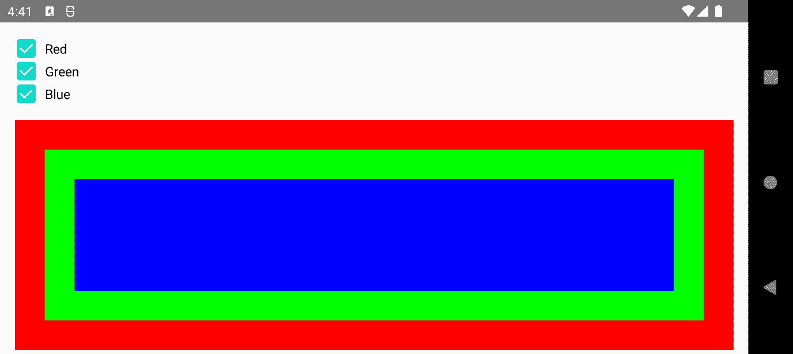
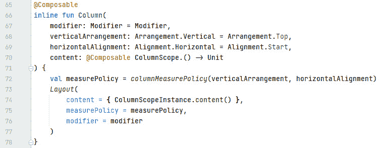
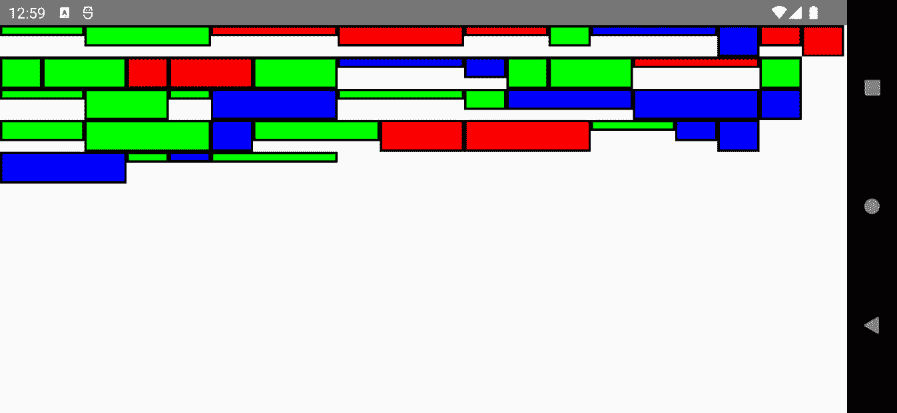

# 第四章：布局 UI 元素

在前面的章节中，你学习了如何构建简单的 UI。尽管它们只包含几个 UI 元素，但它们需要按照特定的顺序、方向或层次结构排列它们的按钮、文本字段和滑块。本章将更详细地探讨布局。

在本章中，我们将涵盖以下主题：

+   使用预定义布局

+   理解单测量传递

+   创建自定义布局

我们将首先探索`Row()`、`Column()`和`Box()`的预定义布局。你将学习如何将它们组合起来创建美观的 UI。接下来，我将向你介绍`ConstraintLayout`。它将相对于屏幕上的其他可组合项放置可组合项，并使用属性来简化 UI 元素层次结构。这是嵌套`Row()`、`Column()`和`Box()`的替代方案。

第二个主要部分将解释为什么 Jetpack Compose 中的布局系统比传统的基于 View 的方法更高效。我们还将深入 Compose 运行时的内部结构。这将为你准备本章的最后一个主要部分，*创建自定义布局*。

在本节的最后，你将学习如何创建自定义布局，从而对子元素的渲染有精确的控制。如果预定义的布局对于特定的用例不够灵活，这很有帮助。

现在，让我们开始吧！

# 技术要求

本章展示了三个示例应用程序：

+   `PredefinedLayoutsDemo`

+   `ConstraintLayoutDemo`

+   `CustomLayoutDemo`

请参阅*第一章*的*技术要求*部分，*构建您的第一个 Compose 应用*，了解如何安装和设置 Android Studio，以及如何获取它。如果你想尝试*组合基本构建块*部分的`CheckboxWithLabel()`可组合项，你可以使用本书 GitHub 仓库顶级目录中的*Sandbox*应用程序项目[`github.com/PacktPublishing/Android-UI-Development-with-Jetpack-Compose`](https://github.com/PacktPublishing/Android-UI-Development-with-Jetpack-Compose)。打开其`SandboxActivity`，并从位于`/chapter_04`文件夹中的`code_snippets.txt`文件中复制可组合函数。

# 使用预定义布局

当你创建一个 UI 时，你必须定义其元素出现的位置以及它们的大小。Jetpack Compose 提供了一些基本的布局，它们沿着一个主要轴排列其内容。有三种轴需要考虑：

+   水平

+   竖直

+   堆叠

每个轴都由一个布局表示。`Row()`水平排列其内容，而`Column()`垂直排列。`Box()`和`BoxWithConstraints()`将它们的内容堆叠在一起。通过组合这些轴定向的构建块，你可以轻松地创建外观精美的 UI。

## 组合基本构建块

下面的`PredefinedLayoutsDemo`示例应用显示了三个复选框，分别切换红色、绿色和蓝色矩形。只有当相应的复选框被选中时，这些盒子才会出现：




图 4.1 – 示例 PredefinedLayoutsDemo 应用

让我们看看这是如何完成的。首先，我将向你展示如何创建一个带有伴随标签的复选框：

```java
@Composable
fun CheckboxWithLabel(label: String, state: MutableState<Boolean>) {
  Row(
    modifier = Modifier.clickable {
      state.value = !state.value
    }, verticalAlignment = Alignment.CenterVertically
  ) {
    Checkbox(
      checked = state.value,
      onCheckedChange = {
        state.value = it
      }
    )
    Text(
      text = label,
      modifier = Modifier.padding(start = 8.dp)
    )
  }
}
```

Jetpack Compose 内置了一个`Checkbox()`。它接收当前状态（`checked`）和一个 lambda 表达式（`onCheckedChange`），当复选框被点击时，该表达式会被调用。在撰写本文时，你不能传递一个标签。然而，我们可以通过在`Row()`中放置`Checkbox()`和`Text()`来实现类似的效果。我们需要使行可点击，因为我们希望当文本被点击时也改变复选框的状态。为了使带有标签的复选框更具视觉吸引力，我们可以通过将`verticalAlignment`设置为`Alignment.CenterVertically`来在行内垂直居中`Checkbox()`和`Text()`。

`CheckboxWithLabel()`接收一个`MutableState<Boolean>`，因为当`onCheckedChange`内部值改变时，其他可组合元素需要重新组合。

接下来，让我们看看状态是如何创建的：

```java
@Composable
fun PredefinedLayoutsDemo() {
  val red = remember { mutableStateOf(true) }
  val green = remember { mutableStateOf(true) }
  val blue = remember { mutableStateOf(true) }
  Column(
    modifier = Modifier
      .fillMaxSize()
      .padding(16.dp)
  ) {
    …
```

`PredefinedLayoutsDemo()`通过将其内容放入`Column()`中来垂直排列其内容。该列填充所有可用空间（`fillMaxSize()`），并在所有四边都有 16 密度无关像素的填充（`padding(16.dp)`）。三个状态（`red`、`green`和`blue`）被传递给`CheckboxWithLabel()`。下面是这些调用看起来像什么：

```java
CheckboxWithLabel(
  label = stringResource(id = R.string.red),
  state = red
)
CheckboxWithLabel(
  label = stringResource(id = R.string.green),
  state = green
)
CheckboxWithLabel(
  label = stringResource(id = R.string.blue),
  state = blue
)
```

它们几乎相同，只是在状态（`red`、`green`、`blue`）和标签字符串（`R.string.red`、`R.string.green`或`R.string.blue`）上有所不同。

现在，让我们来看看如何创建堆叠的彩色盒子：

```java
Box(
  modifier = Modifier
    .fillMaxSize()
    .padding(top = 16.dp)
) {
  if (red.value) {
    Box(
      modifier = Modifier
        .fillMaxSize()
        .background(Color.Red)
    )
  }
  if (green.value) {
    Box(
      modifier = Modifier
        .fillMaxSize()
        .padding(32.dp)
        .background(Color.Green)
    )
  }
  if (blue.value) {
    Box(
      modifier = Modifier
        .fillMaxSize()
        .padding(64.dp)
        .background(Color.Blue)
    )
  }
}
```

三个彩色盒子被放入另一个`Box()`中，该盒子填充所有可用空间。为了在它和最后一个复选框之间创建一个间隙，我指定了 16 密度无关像素的顶部填充。

只有当相应的状态为`true`时，才会添加彩色盒子（例如，`if (red.value) { …)`）。所有彩色盒子都填充可用空间。由于它们将堆叠在一起，只有最后一个（顶部的）一个是可见的。为了解决这个问题，绿色和蓝色盒子接收不同大小的填充：蓝色盒子（最后一个）的填充为 64 密度无关像素，因此在填充区域，绿色盒子变得可见。绿色盒子有一个 32 密度无关像素的填充，因此在这一区域，第一个盒子（红色）可以被看到。

正如你所见，通过组合基本的布局如`Box()`和`Row()`，你可以轻松地创建出看起来很棒的 UI。在下一节中，我将向你介绍一种替代方法，我们将基于约束来定义 UI。

## 基于约束创建布局

基于约束定义 UIs 是 Android 传统`View`世界中最新的首选方法，因为像`RelativeLayout`或`LinearLayout`这样的旧布局在用于大型、多层嵌套布局时可能会影响性能。`ConstraintLayout`通过简化`View`层次结构来避免这个问题。正如您将在*理解单测量传递*部分看到的那样，这对 Jetpack Compose 来说不是问题。

然而，对于 Compose 应用程序中更复杂的布局，您可能仍然想要限制`Box()`、`Row()`和`Column()`的嵌套，以使您的代码更简单、更清晰。这就是`ConstraintLayout()`可以提供帮助的地方。

`ConstraintLayoutDemo`示例应用程序是基于`ConstraintLayout()`的`PredefinedLayoutsDemo`的重实现。通过比较这两个版本，您可以全面了解这个可组合函数是如何工作的。要在您的应用程序中使用`ConstraintLayout()`，您需要在模块级别的`build.gradle`文件中添加一个依赖项。请注意，这里显示的版本号只是一个示例。您可以在[`developer.android.com/jetpack/androidx/versions/all-channel`](https://developer.android.com/jetpack/androidx/versions/all-channel)找到最新版本：

```java
implementation "androidx.constraintlayout:constraintlayout-compose:1.0.0-rc02"
```

那么，我们如何定义基于约束的布局呢？让我们通过检查`CheckboxWithLabel()`的重实现来找出答案。它将文本放置在复选框旁边：

```java
@Composable
fun CheckboxWithLabel(
  label: String,
  state: MutableState<Boolean>,
  modifier: Modifier = Modifier
) {
  ConstraintLayout(modifier = modifier.clickable {
    state.value = !state.value
  }) {
    val (checkbox, text) = createRefs()
    Checkbox(
      checked = state.value,
      onCheckedChange = {
        state.value = it
      },
      modifier = Modifier.constrainAs(checkbox) {
      }
    )
    Text(
      text = label,
      modifier = Modifier.constrainAs(text) {
        start.linkTo(checkbox.end, margin = 8.dp)
        top.linkTo(checkbox.top)
        bottom.linkTo(checkbox.bottom)
      }
    )
  }
}
```

`ConstraintLayout()`使用`ConstraintLayout()`必须与一个引用相关联，该引用是通过`createRefs()`创建的。约束是通过`constrainAs()`修饰符提供的。它的 lambda 表达式接收一个`ConstrainScope`。它包括`start`、`top`和`bottom`等属性。这些被称为`linkTo()`将它们链接到另一个可组合的位置。

让我们看看`Text()`。它的`constrainAs()`包含`bottom.linkTo(checkbox.bottom)`。这意味着文本的底部被约束到复选框的底部。由于文本的顶部与复选框的顶部相关联，因此文本的高度等于复选框的高度。下一行意味着文本的起始端被复选框的末端约束，并额外增加了 8 个密度无关像素的边距：

```java
start.linkTo(checkbox.end, margin = 8.dp)
```

因此，在阅读方向上，文本位于复选框之后。接下来，让我们看看`ConstraintLayoutDemo()`：

```java
@Composable
fun ConstraintLayoutDemo() {
  val red = remember { mutableStateOf(true) }
  val green = remember { mutableStateOf(true) }
  val blue = remember { mutableStateOf(true) }
  ConstraintLayout(
    modifier = Modifier
      .fillMaxSize()
      .padding(16.dp)
  ) {
    val (cbRed, cbGreen, cbBlue, boxRed, boxGreen, boxBlue) =
            createRefs()
    CheckboxWithLabel(
      label = stringResource(id = R.string.red),
      state = red,
      modifier = Modifier.constrainAs(cbRed) {
        top.linkTo(parent.top)
      }
    )
    ...
```

一旦我们使用`createRefs()`创建了定义约束所需的引用，我们就添加我们的第一个`CheckboxWithLabel()`。它的`top`与`parent`的`top`（即`ConstraintLayout()`）相关联。因此，带标签的第一个复选框是最上面的一个。下面是如何调用第二个复选框（它切换绿色框）的示例：

```java
CheckboxWithLabel(
  label = stringResource(id = R.string.green),
  state = green,
  modifier = Modifier.constrainAs(cbGreen) {
    top.linkTo(cbRed.bottom)
  }
)
```

它的`top`被第一个带标签的复选框的`bottom`约束。最后，这是我们需要约束第三个`CheckboxWithLabel()`的方式：

```java
modifier = Modifier.constrainAs(cbBlue) {
  top.linkTo(cbGreen.bottom)
}
```

为了总结本节，让我向您展示如何定义彩色框。这是红色框的示例：

```java
if (red.value) {
  Box(
    modifier = Modifier
      .background(Color.Red)
      .constrainAs(boxRed) {
        start.linkTo(parent.start)
        end.linkTo(parent.end)
        top.linkTo(cbBlue.bottom, margin = 16.dp)
        bottom.linkTo(parent.bottom)
        width = Dimension.fillToConstraints
        height = Dimension.fillToConstraints
      }
  )
}
```

`start`和`end`都与`parent`（即`ConstraintLayout()`）的相应锚点相关联。`top`由最后一个复选框的`bottom`约束，所以红色框出现在其下方。红色框的`bottom`由`parent`的`bottom`约束。请注意，目前，我们必须将`width`和`height`设置为从`Dimension.fillToConstraints`获得的值。否则，框将不会有正确的大小。

接下来，让我们看看绿色框的约束条件：

```java
constrainAs(boxGreen) {
  start.linkTo(parent.start, margin = 32.dp)
  end.linkTo(parent.end, margin = 32.dp)
  top.linkTo(cbBlue.bottom, margin = (16 + 32).dp)
  bottom.linkTo(parent.bottom, margin = 32.dp)
  width = Dimension.fillToConstraints
  height = Dimension.fillToConstraints
}
```

这段代码实际上是一样的。一个区别是所有边都接收一个 32 密度无关像素的`margin`。这是必要的，因为我们希望红色框（位于绿色框下方）在边框的位置可见。由于红色框已经有一个 16 的`top`边距，我们必须将这个值加到`top`边距上。你可能想知道为什么我没有链接到`boxRed`。那是因为如果对应的复选框没有被勾选，红色框将不会出现。在这种情况下，锚点将不会存在。

这里是蓝色框的约束条件将呈现的样子：

```java
constrainAs(boxBlue) {
  start.linkTo(parent.start, margin = 64.dp)
  end.linkTo(parent.end, margin = 64.dp)
  top.linkTo(cbBlue.bottom, margin = (16 + 64).dp)
  bottom.linkTo(parent.bottom, margin = 64.dp)
  width = Dimension.fillToConstraints
  height = Dimension.fillToConstraints
}
```

我需要改变的是所有四边的边距，否则下面的框（绿色框）将不可见。

简而言之，这就是`ConstrainLayout()`的工作方式：

+   你通过将可组合元素的锚点链接到其他元素来约束它

+   链接基于引用。为了设置这些引用，你必须调用`createRefs()`。

结合`Box()`、`Row()`和`Column()`的主要优势是你可以简化你的 UI 元素层次结构。可以这样想：在`PredefinedLayoutsDemo`中，我需要在父`Box()`中堆叠彩色框。在`ConstrainLayoutDemo`中，框和三个`CheckboxWithLabel()`共享同一个父元素（一个`ConstrainLayout()`）。这减少了可组合元素的数量，并使代码更简洁。

在下一节中，我们将再次深入了解 Jetpack Compose 的内部结构。我们将学习布局过程是如何工作的，以及为什么它比传统的基于 View 的方法更高效。

# 理解单测量过程

布局 UI 元素层次结构意味着确定所有元素的大小，并根据其父元素的布局策略在屏幕上定位它们。起初，获取例如一些文本的大小听起来并不太复杂。毕竟，它不是由字体和要输出的文本决定的吗？以下是一个例子，其中两行文本在一个`Column()`中布局：

```java
@Composable
@Preview
fun ColumnWithTexts() {
  Column {
    Text(
      text = "Android UI development with Jetpack Compose",
      style = MaterialTheme.typography.h3
    )
    Text(
      text = "Hello Compose",
      style = MaterialTheme
          .typography.h5.merge(TextStyle(color = Color.Red))
    )
  }
}
```

如果你部署了预览，你会注意到，在纵向模式下，第一行文本在垂直方向上所需的空格比在横向模式下多。第二行文本总是适应一行。一个可组合元素在屏幕上占据的大小部分取决于从*外部*强加的条件。在这里，列的最大宽度（父元素）影响了第一行文本的高度。这样的条件被称为`ConstraintLayout()`。

一旦布局获取并测量了其内容的尺寸，布局将定位其子元素（内容）。让我们通过查看 `Column()` 的源代码来了解这是如何工作的：




图 4.2 – `Column()` 的源代码

可组合项非常短。除了为 `measurePolicy` 分配值外，它还只调用了 `Layout()`，传递了 `content`、`measurePolicy` 和 `modifier`。我们在 *第三章* 的 *“发射 UI 元素”* 部分简要地查看过 `Layout()` 的源代码，以了解发射 UI 元素的含义。现在，我们将专注于布局过程。`measurePolicy` 变量引用了 `MeasurePolicy` 接口的一个实现。在这种情况下，它是 `columnMeasurePolicy()` 调用的结果。

## 定义测量策略

根据 `verticalArrangement` 和 `horizontalAlignment` 的值，对 `columnMeasurePolicy()` 的调用将返回 `DefaultColumnMeasurePolicy`（一个变量）或 `rowColumnMeasurePolicy()` 的结果。`DefaultColumnMeasurePolicy` 调用 `rowColumnMeasurePolicy`。因此，此函数定义了任何 `Column()` 的测量策略。它返回一个 `MeasurePolicy`。

小贴士

请记住，您可以通过按 *Ctrl* 键并单击名称，例如 `columnMeasurePolicy`，来查看策略的源代码。

`MeasurePolicy` 属于 `androidx.compose.ui.layout` 包。它定义了布局如何进行测量和布局，因此它是预定义布局（例如，`Box()`、`Row()` 和 `Column()`）和自定义布局的主要构建块。它的最重要的功能是 `measure()`，这是一个 `MeasureScope` 的扩展函数。此函数接收两个参数，`List<Measurable>` 和 `Constraints`。列表中的元素代表布局的子元素。它们可以使用 `Measurable.measure()` 进行测量。此函数返回一个 `Placeable` 实例，表示子元素想要占据的大小。

`MeasureScope.measure()` 返回一个 `MeasureResult` 实例。此接口定义了以下组件：

+   布局的尺寸（`width`、`height`）

+   对齐线（`alignmentLines`）

+   定位子元素的逻辑（`placeChildren()`）

您可以在 *“创建自定义布局”* 部分找到 `MeasureResult` 的实现。

对齐线定义了一个偏移线，父布局可以使用它来对齐和定位其子元素。例如，文本基线是对齐线。

根据 UI 的复杂性，布局可能会发现其子元素无法很好地适应其边界。布局可能想要重新测量子元素，传递不同的测量配置。在 Android `View` 系统中，重新测量子元素是可能的，但这可能会导致性能下降。因此，在 Jetpack Compose 中，布局可能只测量其内容一次。如果它再次尝试，将抛出异常。

然而，布局可以查询 `MeasurePolicy` 定义了 `IntrinsicMeasureScope` 的四个扩展函数。`minIntrinsicWidth()` 和 `maxIntrinsicWidth()` 返回给定特定高度的布局的最小或最大宽度，以便完全绘制布局的内容。`minIntrinsicHeight()` 和 `maxIntrinsicHeight()` 返回给定特定宽度的布局的最小或最大高度，以便完全绘制布局的内容。为了了解它们是如何工作的，让我们简要地看看其中一个：


图 4.3 – `minIntrinsicWidth()` 的源代码

`IntrinsicMeasureScope.minIntrinsicWidth()` 接收两个参数：`height` 和子视图列表（`measurables`）。`IntrinsicMeasurable` 接口定义了四个函数，用于获取特定元素的最小或最大值（`minIntrinsicWidth()`、`maxIntrinsicWidth()`、`minIntrinsicHeight()` 和 `maxIntrinsicHeight()`）。`measurables` 的每个元素都被转换成 `DefaultIntrinsicMeasurable` 的实例。由于该类实现了 `Measurable` 接口，它提供了一个 `measure()` 的实现。它返回 `FixedSizeIntrinsicsPlaceable`，为给定的 `height` 提供可能的最小宽度。转换后的子视图由 `IntrinsicsMeasureScope` 的一个实例进行测量。

我们将通过转向 `Constraints` 来完成对 Compose 布局过程内部结构的查看。例如，它们会被传递给 `MeasureScope.measure()`。该类属于 `androidx.compose.ui.unit` 包。它存储四个值：`minWidth`、`minHeight`、`maxWidth` 和 `maxHeight`。它们定义了布局子视图在测量自身时必须遵守的最小和最大值。因此，它们的宽度必须不小于 `minWidth` 且不大于 `maxWidth`。它们的高度必须在 `minHeight` 和 `maxHeight` 之间。

伴随对象定义了 `Infinity` 常量。它用于表示约束应该被视为无限。要创建 `Constraints` 实例，你可以调用顶层 `Constraints()` 函数。

这有很多信息。在继续之前，让我们回顾一下我们已经学到的内容。

+   `Layout()` 组合函数接收三个参数：内容、度量策略和一个修饰符。

+   度量策略定义了布局如何被测量和布局。

+   布局的固有大小决定了对应输入的最小或最大维度。

在传统的视图系统中，父视图可能会对其子视图多次调用 `measure()` 方法（请参阅[`developer.android.com/guide/topics/ui/how-android-draws`](https://developer.android.com/guide/topics/ui/how-android-draws) 获取详细信息）。另一方面，Jetpack Compose 要求在子视图定位之前必须精确测量一次。这导致测量性能更优。

在下一节中，我们将利用这些知识来实现一个简单的自定义布局。它将从左到右和从上到下定位其子项。当一行填满时，下一行将在其下方开始。

# 创建自定义布局

有时，您可能希望在一行中依次排列子项，并在当前行填满后开始新的一行。下面的截图显示了 `CustomLayoutDemo` 示例应用程序，它展示了如何做到这一点。它创建了 43 个随机着色的框，宽度和高度各不相同：



图 4.4 – 示例 CustomLayoutDemo 应用程序

让我们从查看创建彩色框的组成函数开始：

```java
@Composable
fun ColoredBox() {
  Box(
    modifier = Modifier
      .border(
        width = 2.dp,
        color = Color.Black
      )
      .background(randomColor())
      .width((40 * randomInt123()).dp)
      .height((10 * randomInt123()).dp)
  )
}
```

一个彩色框由一个带有黑色、宽度为两个密度无关像素的 `Box()` 组成。`width()` 和 `height()` 修饰符设置框的首选大小。这意味着布局可以覆盖它。为了简单起见，我的示例没有这样做。`randomInt123()` 随机返回 `1`、`2` 或 `3`：

```java
private fun randomInt123() = Random.nextInt(1, 4)
```

`randomColor()` 随机返回红色、绿色或蓝色：

```java
private fun randomColor() = when (randomInt123()) {
    1 -> Color.Red
    2 -> Color.Green
    else -> Color.Blue
}
```

接下来，我将向您展示如何创建并设置彩色框作为我自定义布局的内容：

```java
@Composable
@Preview
fun CustomLayoutDemo() {
    SimpleFlexBox {
        for (i in 0..42) {
            ColoredBox()
        }
    }
}
```

`SimpleFlexBox()` 是我们的自定义布局。它就像任何预定义布局一样使用。您甚至可以提供一个修饰符（这里为了简单起见没有这样做）。那么，自定义布局是如何工作的呢？让我们来看看：

```java
@Composable
fun SimpleFlexBox(
  modifier: Modifier = Modifier,
  content: @Composable () -> Unit
) {
  Layout(
    modifier = modifier,
    content = content,
    measurePolicy = simpleFlexboxMeasurePolicy()
  )
}
```

自定义布局应至少接收两个参数 – `content` 和一个默认值为 `Modifier` 的 `modifier`。其他参数可能会影响自定义布局的行为。例如，您可能希望使子项的对齐方式可配置。为了简单起见，示例没有这样做。

如您从上一节所知，测量和定位是通过测量策略定义的。我将在下一节中向您展示如何实现它。

## 实现自定义测量策略

到目前为止，我已经向您展示了几乎所有的自定义布局代码。唯一缺少的是测量策略。让我们看看它是如何工作的：

```java
private fun simpleFlexboxMeasurePolicy(): MeasurePolicy =
  MeasurePolicy { measurables, constraints ->
    val placeables = measurables.map { measurable ->
      measurable.measure(constraints)
    }
    layout(
      constraints.maxWidth,
      constraints.maxHeight
    ) {
      var yPos = 0
      var xPos = 0
      var maxY = 0
      placeables.forEach { placeable ->
        if (xPos + placeable.width >
          constraints.maxWidth
        ) {
          xPos = 0
          yPos += maxY
          maxY = 0
        }
        placeable.placeRelative(
          x = xPos,
          y = yPos
        )
        xPos += placeable.width
        if (maxY < placeable.height) {
          maxY = placeable.height
        }
      }
    }
  }
```

`MeasurePolicy` 实现必须提供 `MeasureScope.measure()` 方法的实现。此方法返回 `MeasureResult` 接口的一个实例。您不需要自己实现它。相反，您必须调用 `layout()`。此函数属于 `MeasureScope`。

我们传递布局的测量大小和一个 `placementBlock`，它是 `Placeable.PlacementScope` 的扩展函数。这意味着您可以调用 `placeRelative()` 等函数来在父坐标系统中定位子项。

测量策略接收内容或子项作为 `List<Measurable>`。正如你在 *理解单次测量传递* 部分所知，在定位之前，子项必须精确测量一次。我们可以通过创建一个 `placeables` 映射，对每个 `measurable` 调用 `measure()` 来实现这一点。我的示例没有进一步约束子视图，而是使用给定的约束来测量它们。

`placementBlock` 遍历 `placeables` 映射，通过增加 `xPos` 和 `yPos` 来计算可放置项的位置。在调用 `placeRelative()` 之前，算法会检查可放置项是否完全适合当前行。如果不是这种情况，`yPos` 将会增加，而 `xPos` 将重置为 `0`。`yPos` 增加的量取决于当前行中所有可放置项的最大高度。这个值存储在 `maxY` 中。

正如你所见，实现简单的自定义布局很简单。关于对齐线（有助于/需要用于 X...）等高级主题超出了本书的范围。你可以在 [`developer.android.com/jetpack/compose/layouts/alignment-lines`](https://developer.android.com/jetpack/compose/layouts/alignment-lines) 找到更多关于它们的信息。

# 摘要

本章探讨了预定义的布局 `Row()`、`Column()` 和 `Box()`。你学习了如何将它们组合起来创建美观的用户界面。你还介绍了 `ConstraintLayout`，它将相对于屏幕上的其他可组合项放置可组合项并简化 UI 元素层次结构。

第二个主要部分探讨了为什么 Jetpack Compose 中的布局系统比传统的基于 View 的方法更高效。我们查看了一些 Compose 运行时的内部机制，这为我们学习本章的最后一部分，*创建自定义布局*，打下了基础，在那里你学习了如何创建自定义布局并因此对子元素的渲染获得精确控制。

下一章，*管理 Composable 函数的状态*，将深化你对状态的理解。我们将研究无状态和有状态的可组合函数之间的区别。此外，我们还将探讨诸如配置更改后存活等高级用例。
