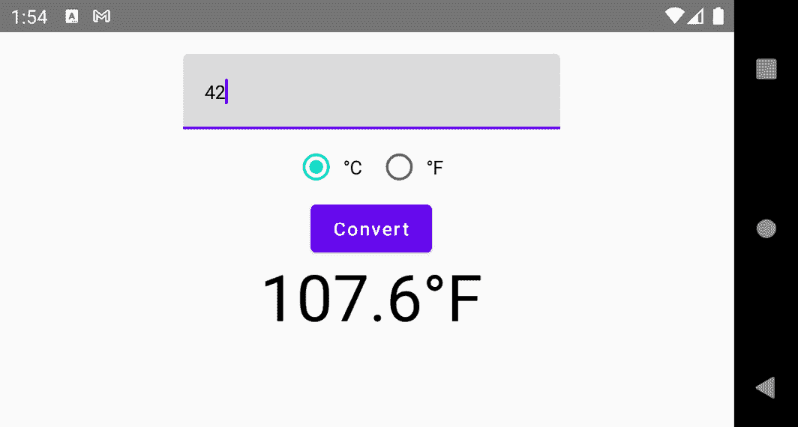
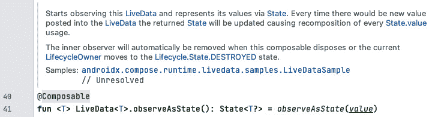

# 第五章：管理你的可组合函数的状态

在 *第四章*，*布局 UI 元素* 中，我向你展示了如何通过拖动滑块来设置颜色的红色、绿色和蓝色部分。我们使用 **状态** 在可组合函数之间共享这些值。前几章的许多其他示例应用也处理了状态。事实上，对状态变化的反应是现代移动应用工作方式的关键。

到目前为止，我已经描述了状态为随时间变化的数据。你了解了一些重要的函数，例如，`remember { }` 和 `mutableStateOf()`。我还简要提到了一个称为 **状态提升** 的概念。

本章建立在这些基础之上。例如，你将了解无状态和有状态的可组合组件之间的区别，以及何时选择哪一个。此外，我将向你展示在表现良好的 Compose 应用中事件应该如何流动。

本章的主要部分如下：

+   理解有状态和无状态的可组合函数

+   提升状态和传递事件

+   应对配置更改

我们将首先探讨有状态和无状态的可组合函数之间的区别。你将了解它们的典型用例，并理解为什么你应该尽量保持你的可组合函数无状态。提升状态是一个实现这一目标的工具；我们将在第二主要部分中介绍这个重要主题。此外，我将向你展示你可以通过传递逻辑作为参数来使你的可组合函数可重用，而不是在可组合函数内部实现它。

最后，*应对配置更改* 部分将探讨在活动中集成 Compose UI 层次结构，关注如何保留用户输入。如果用户从纵向模式切换到横向模式（或反之），活动将被销毁并重新创建。当然，输入信息不应该丢失。我们将探讨 Compose 应用实现这一点的几种方法。

# 技术要求

本章包含三个示例应用。请参考 *第一章*，*构建你的第一个 Compose 应用*，了解如何安装和设置 Android Studio，以及如何获取它们。`StateDemo` 包含了 *理解有状态和无状态的可组合函数* 部分的所有示例。*提升状态和传递事件* 部分讨论了 `FlowOfEventsDemo` 示例。最后，`ViewModelDemo` 属于 *应对配置更改* 部分。

本章的所有代码文件都可以在 GitHub 上找到，链接为 [`github.com/PacktPublishing/Android-UI-Development-with-Jetpack-Compose/tree/main/chapter_05`](https://github.com/PacktPublishing/Android-UI-Development-with-Jetpack-Compose/tree/main/chapter_05)。

# 理解有状态和无状态的可组合函数

在本节中，我将向您展示有状态和无状态的可组合函数之间的区别。为了理解为什么这很重要，让我们首先关注一下 **状态** 这个词。在之前的章节中，我将状态描述为 *随时间变化的数据*。数据存储的位置（一个 SQLite 数据库、一个文件或一个对象内的值）并不重要。重要的是 UI 必须始终显示当前数据。因此，如果值发生变化，UI 必须得到通知。为了实现这一点，我们使用 **可观察** 类型。这不仅仅局限于 Jetpack Compose，而是许多框架、编程语言和平台中的常见模式。例如，Kotlin 通过属性委托支持可观察性：

```java
var counter by observable(-1) { _, oldValue, newValue ->
  println("$oldValue -> $newValue")
}
for (i in 0..3) counter = i
```

`observable()` 返回一个可以读取和写入的属性的委托。在上一个代码片段中，初始值被设置为 `-1`。当属性值改变时（`counter = i`），该属性会调用一个指定的函数。我的示例会打印出旧值和新值。在一个命令式 UI 框架中，状态变化需要修改组件树。这样的代码可以放在回调函数中。幸运的是，Jetpack Compose 不需要这样做，因为状态变化会自动触发相关 UI 元素的重新组合。让我们看看这是如何工作的。

`androidx.compose.runtime.State` 基础接口定义了一个值持有者，一个对象，它在名为 `value` 的属性中存储特定类型的值。如果在可组合函数的执行过程中读取该属性，当 `value` 发生变化时，可组合函数将重新组合，因为内部当前的 `RecomposeScope` 接口将订阅该值的更改。请注意，为了能够更改值，状态必须是 `MutableState` 的实现；与它的直接前身（`State`）不同，该接口使用 `var` 而不是 `val` 来定义 `value`。

创建 `State` 实例的最简单方法是调用 `mutableStateOf()`。此函数返回一个新的 `MutableState` 实例，并使用传入的值进行初始化。下一节将解释如何使用 `mutableStateOf()` 创建有状态的可组合函数。

## 在可组合函数中使用状态

被称为 `remember {}` 的可组合函数。让我们看一下：

```java
@Composable
@Preview
fun SimpleStateDemo1() {
  val num = remember { mutableStateOf(Random.nextInt(0,
    10)) }
  Text(text = num.value.toString())
}
```

`SimpleStateDemo1()` 创建了一个包含随机整数的可变状态。通过调用 `remember {}`，我们保存了状态，并在使用 `=` 时将其分配给 `num`。我们通过 `num.value` 获取随机数。请注意，尽管我们使用 `val` 关键字定义了 `num`，但我们仍然可以通过 `num.value = …` 来更改其值，因为 `num` 持有可变值持有者的引用（其 `value` 属性是可写的）。把它想象成修改列表中的一个项目，而不是改变到另一个列表。我们可以稍微修改一下代码，如下面的代码片段所示。你能发现其中的区别吗？

```java
@Composable
@Preview
fun SimpleStateDemo2() {
  val num by remember { mutableStateOf(Random.nextInt(0,
   10)) }
  Text(text = num.toString())
}
```

`SimpleStateDemo2()` 创建了一个包含随机整数的可变状态。使用 `by`，我们不是将状态本身赋值给 `num`，而是它存储的值（随机数）。这样我们就可以避免使用 `.value`，这使得代码更短，也许更容易理解。然而，如果我们想改变 `num`，我们必须将 `val` 改为 `var`。否则，我们会看到一个 `Val cannot be reassigned` 错误信息。

你可能想知道 `remember {}` 在底层做了什么。让我们看看它的代码，并找出答案：

![Figure 5.1 – remember {} 的源代码]

![img/B17505_05_1.jpg]

![Figure 5.1 – remember {} 的源代码]

只读的顶级 `currentComposer` 属性属于 `androidx.compose.runtime` 包。它引用了一个 `Composer` 实例。这个接口被 Compose Kotlin 编译器插件所针对，并由代码生成助手使用。你不应该直接调用它，因为运行时假设调用是由编译器生成的，因此不包含太多的验证逻辑。"Cache()" 是 `Composer` 的一个扩展函数。它在组合的数据中存储一个值。因此，`remember {}` 创建了内部状态。因此，包含 `remember {}` 的组合函数是有状态的。

`calculation` 代表一个 lambda 表达式，它创建要记住的值。它只在组合期间评估一次。随后的 `remember {}` 调用（在重新组合期间）总是返回这个值。表达式不会被再次评估。但如果我们需要重新评估计算，即记住一个新的值呢？毕竟，状态数据是可以随时间变化的。下面是如何做到这一点的方法：

```java
@Composable
@Preview
fun RememberWithKeyDemo() {
  var key by remember { mutableStateOf(false) }
  val date by remember(key) { mutableStateOf(Date()) }
  Column(horizontalAlignment =
         Alignment.CenterHorizontally) {
    Text(date.toString())
    Button(onClick = { key = !key }) {
      Text(text = stringResource(id = R.string.click))
    }
  }
}
```

`RememberWithKeyDemo()` 的预览显示在 *图 5.2* 中：

![Figure 5.2 – RememberWithKeyDemo() 的预览]

![img/B17505_05_2.jpg]

图 5.2 – RememberWithKeyDemo() 的预览

`RememberWithKeyDemo()` 发射带有两个水平居中子项的 `Column()`。

+   `Text()` 显示一个被记住的 `Date` 实例的字符串表示。

+   `Button()` 切换一个布尔值（`key`）。

你有没有注意到我把 `key` 传递给了 `remember { mutableStateOf(Date()) }`？下面是发生的事情——当 `remember {}` 首次被调用时，计算的结果（`mutableStateOf(Date())`）被记住并返回。在重新组合过程中，除非 `key` 与前一次组合不相等，否则不会重新评估计算。在这种情况下，会计算一个新的值，记住并返回。

提示

你可以向 `remember {}` 传递任意数量的键。如果其中之一自上次组合以来已更改，则计算将被重新评估，新的值将被记住并返回。

将键传递给 `remember {}` 允许你更改记住的值。但请记住，这会使组合函数的可预测性降低。因此，你应该考虑是否需要将这种逻辑组合起来，或者是否可以将所有状态传递给它。

在下一节中，我们将转向无状态组合。

## 编写无状态组合函数

`remember {}`使组合函数有状态。另一方面，无状态组合组件不持有任何状态。以下是一个例子：

```java
@Composable
@Preview
fun SimpleStatelessComposable1() {
  Text(text = "Hello Compose")
}
```

`SimpleStatelessComposable1()`不接收参数，并且总是以相同的参数调用`Text()`。显然，它不持有任何状态。但以下一个如何？

```java
@Composable
fun SimpleStatelessComposable2(text: State<String>) {
  Text(text = text.value)
}
```

虽然它通过`text`参数接收状态，但它不存储它，也不记住其他状态。因此，`SimpleStatelessComposable2()`也是无状态的。当多次用相同的参数调用时，它的行为也是一样的。这样的函数被称为`SimpleStatelessComposable2()`是你自己的组合函数的好蓝图。它们应该如下所示：

+   **快速**：你的组合组件不得进行重（即耗时）的计算。永远不要调用网络服务或执行任何其他 I/O 操作。组合组件使用的任何数据都应该传递给它。

+   **无副作用**：不要修改全局属性或产生意外的可观察效果（修改传递给组合组件的状态当然是故意的）。

+   `remember {}`，不要访问全局属性，也不要调用不可预测的代码。例如，`SimpleStateDemo1()`和`SimpleStateDemo2()`使用`Random.nextInt()`，根据定义，它是（实际上）不可预测的。

这样的组合函数既容易重用又容易测试，因为它们不依赖于作为参数传递之外的东西。

当开发可重用的组合组件时，你可能希望公开有状态和无状态的版本。让我们看看这看起来是什么样子：

```java
@Composable
fun TextFieldDemo(state: MutableState<TextFieldValue>) {
  TextField(
    value = state.value,
    onValueChange = {
      state.value = it
    },
    placeholder = { Text("Hello") },
    modifier = Modifier.fillMaxWidth()
  )
}
```

这个版本是无状态的，因为它接收状态但不记住任何东西。无状态版本对于需要控制状态或自己提升状态的调用者来说是必要的：

```java
@Composable
@Preview
fun TextFieldDemo() {
  val state = remember { mutableStateOf(TextFieldValue("")) }
  TextFieldDemo(state)
}
```

这个版本是有状态的，因为它记得它创建的状态。有状态版本对于不关心状态的调用者来说很方便。

总结一下，尽量通过不依赖`remember {}`或其他记住状态的功能（例如，`rememberLazyListState()`或`rememberSaveable()`）来使你的组合组件无状态。相反，将状态传递给组合组件。你将在下一节中看到更多用例。

# 提升状态和传递事件

因此，状态是任何随时间变化的价值。由于 Jetpack Compose 是一个声明式 UI 框架，更新组合组件的唯一方法是使用新的参数调用它。当组合组件使用的状态发生变化时，这会自动发生。状态提升是一种将状态向上移动以使组合组件无状态的模式。

除了使组合组件更容易重用和测试外，将状态向上移动对于在多个组合函数中使用它是必要的。你已经在我的许多示例应用中看到了这一点。例如，在*第三章*的“组合和重新组合 UI”部分，我们使用三个滑块创建和显示一个颜色。

当状态控制组合函数的视觉表示（即它在屏幕上的外观）时，`FlowOfEventsDemo` 应用是一个简单的温度转换器。用户输入一个值，指定它代表摄氏度还是华氏度，然后点击 **转换** 按钮：



图 5.3 – 示例 FlowOfEventsDemo 应用

UI 由 `Column()` 组成，包含四个子元素：一个文本输入字段、一组带文本的单选按钮、一个按钮和一些结果文本。让我们首先看看文本输入字段：

```java
@Composable
fun TemperatureTextField(
  temperature: MutableState<String>,
  modifier: Modifier = Modifier,
  callback: () -> Unit
) {
  TextField(
    value = temperature.value,
    onValueChange = {
      temperature.value = it
    },
    …
    modifier = modifier,
    keyboardActions = KeyboardActions(onAny = {
      callback()
    }),
    keyboardOptions = KeyboardOptions(
      keyboardType = KeyboardType.Number,
      imeAction = ImeAction.Done
    ),
    singleLine = true
  )
}
```

它接收 `MutableState<String>`，在 `onValueChange {}` 中向其中推送文本更改。虚拟键盘配置为显示 *完成* 按钮。如果它被调用，通过 `callback` 传递给组合函数的代码将被执行。您稍后将会看到，如果用户点击 *转换* 按钮，相同的代码也会运行。

在下一节中，我将向您展示如何创建单选按钮并将它们分组，以便每次只能选择一个按钮。本节还涵盖了按钮和结果文本，您可以在 *图 5.3* 中看到。

## 创建单选按钮组

该应用在摄氏度和华氏度之间进行转换。因此，用户必须选择目标刻度。此类选择可以很容易地在 Jetpack Compose 中使用 `androidx.compose.material.RadioButton()` 实现。这个组合函数不显示一些描述性文本，但很容易添加。下面是如何做的：

```java
@Composable
fun TemperatureRadioButton(
  selected: Boolean,
  resId: Int,
  onClick: (Int) -> Unit,
  modifier: Modifier = Modifier
) {
  Row(
    verticalAlignment = Alignment.CenterVertically,
    modifier = modifier
  ) {
    RadioButton(
      selected = selected,
      onClick = {
        onClick(resId)
      }
    )
    Text(
      text = stringResource(resId),
      modifier = Modifier
        .padding(start = 8.dp)
    )
  }
}
```

`RadioButton()` 和 `Text()` 简单地添加到 `Row()` 中并垂直居中。`TemperatureRadioButton()` 接收一个带有 `onClick` 参数的 lambda 表达式。当单选按钮被点击时，将执行该代码。我的实现将 `resId` 参数传递给 lambda 表达式，该表达式将用于确定组中的按钮。下面是如何做的：

```java
@Composable
fun TemperatureScaleButtonGroup(
  selected: MutableState<Int>,
  modifier: Modifier = Modifier
) {
  val sel = selected.value
  val onClick = { resId: Int -> selected.value = resId }
  Row(modifier = modifier) {
    TemperatureRadioButton(
      selected = sel == R.string.celsius,
      resId = R.string.celsius,
      onClick = onClick
    )
    TemperatureRadioButton(
      selected = sel == R.string.fahrenheit,
      resId = R.string.fahrenheit,
      onClick = onClick,
      modifier = Modifier.padding(start = 16.dp)
    )
  }
}
```

两个 `TemperatureRadioButton()` 被放入一个 `Row()` 中。第一个配置为表示摄氏度，第二个表示华氏度。两者都接收相同的 `onClick` lambda。它将 `TemperatureRadioButton()` 接收到的 `resId` 参数设置为 `selected` 参数的新值，这是一个可变状态。那么这里发生了什么？单选按钮的点击不是在 `TemperatureRadioButton()` 内部处理，而是传递给父元素 `TemperatureScaleButtonGroup()`。事件，即按钮点击，被称为 **冒泡**。这样，父元素可以协调其子元素并通知其父元素。在我的例子中，这意味着改变一些状态。

接下来，让我们看看当用户点击 `FlowOfEventsDemo()` 时会发生什么。以下是这个组合函数的整体结构：

```java
@Composable
@Preview
fun FlowOfEventsDemo() {
  ...
  val calc = {
    val temp = temperature.value.toFloat()
    convertedTemperature = if (scale.value ==
                               R.string.celsius)
      (temp * 1.8F) + 32F
    else
      (temp - 32F) / 1.8F
  }
  val result = remember(convertedTemperature) {
    if (convertedTemperature.isNaN())
      ""
    else
      "${convertedTemperature}${
        if (scale.value == R.string.celsius)
          strFahrenheit
        else strCelsius
      }"
  }
  val enabled = temperature.value.isNotBlank()
  Column( ... ) {
    TemperatureTextField(
      temperature = temperature,
      modifier = Modifier.padding(bottom = 16.dp),
      callback = calc
    )
    TemperatureScaleButtonGroup(
      selected = scale,
      modifier = Modifier.padding(bottom = 16.dp)
    )
    Button(
      onClick = calc,
      enabled = enabled
    ) {
      Text( ... )
    }
    if (result.isNotEmpty()) {
      Text(text = result, …
      )
    }
  }
}
```

转换逻辑被分配给一个名为 `calc` 的只读变量。它被传递给 `TemperatureTextField()` 和 `Button()`。将响应事件的代码传递给组合函数而不是在内部硬编码，使得组合函数更容易重用和测试。

转换后显示的文本会被记住并分配给 `result`。当 `convertedTemperature` 发生变化时，它会重新评估。这发生在 `calc` lambda 表达式内部。请注意，我需要向 `remember {}` 传递一个键；否则，如果用户选择了另一个刻度，结果也会改变。

在下一节中，我们将探讨如何持久化状态。更准确地说，我们将转向配置更改。如果用户旋转设备，UI 不应该被重置。不幸的是，到目前为止我所展示的所有示例应用都是这样做的。是时候解决这个问题了。

# 适应配置更改

请记住，我们关于状态的定义——即可能随时间变化的数据——相当广泛。例如，我们没有指定数据存储的位置。如果它位于数据库、文件或云中的某个后端，则应用应包含一个专门的持久化层。然而，直到 2017 年 Google 引入了 Android 架构组件，开发者实际上没有关于如何构建应用的指导。因此，持久化代码、UI 逻辑和领域逻辑通常被挤在一个活动中。这样的代码难以维护，并且往往容易出错。更复杂的是，当活动被销毁并在不久后重新创建时，会出现这种情况。例如，当用户旋转设备时就会发生这种情况。当然，数据应该被记住。

`Activity` 类有几个方法来处理这种情况。例如，当活动（暂时）被销毁时，会调用 `onSaveInstanceState()` 方法。它的对应方法 `onRestoreInstanceState()` 只在之前已经保存了实例状态时被调用。这两个方法都接收一个 `Bundle` 实例，它为各种数据类型提供了获取器和设置器。然而，实例状态的概念是为传统的视图系统设计的。大多数活动持有 UI 元素的引用，因此可以在 `onSaveInstanceState()` 和 `onRestoreInstanceState()` 中轻松访问。

相反，可组合项通常被实现为顶级函数。那么，如何在活动中设置或查询它们的状态呢？为了在 Compose 应用中临时保存状态，你可以使用 `rememberSaveable {}`。这个可组合函数会记住由工厂函数产生的值。它的行为类似于 `remember {}`。存储的值将存活于活动或进程的重创。内部，使用了 `savedInstanceState` 机制。示例 `ViewModelDemo` 应用展示了如何使用 `rememberSaveable {}`。以下是主活动的外观：

```java
class ViewModelDemoActivity : ComponentActivity() {
  override fun onCreate(savedInstanceState: Bundle?) {
    super.onCreate(savedInstanceState)
    setContent {
      ViewModelDemo()
    }
  }
}
```

我们不需要重写 `onSaveInstanceState()` 来临时保存与可组合项一起使用的状态：

```java
@Composable
@Preview
fun ViewModelDemo() {
  ...
  val state1 = remember {
    mutableStateOf("Hello #1")
  }
  val state2 = rememberSaveable {
    mutableStateOf("Hello #2")
  }
  ...
  state3.value?.let {
    Column(modifier = Modifier.fillMaxWidth()) {
      MyTextField(state1) { state1.value = it }
      MyTextField(state2) { state2.value = it }
      ...
    }
  }
}
```

应用程序显示了三个文本输入字段，它们从分配给 `state1`、`state2` 和 `state3` 的状态接收值。现在，我们将专注于前两个。`state3` 将是 *使用 ViewModel* 部分的主题。`state1` 调用 `remember {}`，而 `state2` 使用 `rememberSaveable {}`。如果您运行了 `ViewModelDemo`，更改了文本输入字段的内容，并旋转了设备，第一个将重置为原始文本，而第二个将保留您的更改。

`MyTextField` 是一个非常简单的可组合组件。它看起来像这样：

```java
@Composable
fun MyTextField(
  value: State<String?>,
  onValueChange: (String) -> Unit
) {
  value.value?.let {
    TextField(
      value = it,
      onValueChange = onValueChange,
      modifier = Modifier.fillMaxWidth()
    )
  }
}
```

您注意到 `value` 是 `State<String?>` 类型吗？为什么我需要一个其值可以是 `null` 的值持有者，因此需要使用 `value.value?.let {}` 来检查它不是 `null`？我们将在下一节中重用这个可组合组件，您将在那里找到这个问题的答案。请注意，尽管如此，对于 `state1` 和 `state2`，这并不是必要的。

## 使用 ViewModel

虽然 `rememberSaveable {}` 在临时存储状态时效果很好，但应用程序仍然必须获取持久化时间较长的数据（例如，在数据库或文件中），并将其作为可以在可组合组件中使用的状态提供。Android 架构组件包括 `ViewModel` 和 `LiveData`。两者都可以与 Jetpack Compose 无缝使用。

首先，您需要将一些实现依赖项添加到模块级别的 `build.gradle` 文件中：

```java
implementation "androidx.compose.runtime:runtime-
  livedata:$compose_version"
implementation 'androidx.lifecycle:lifecycle-runtime-
  ktx:2.4.0'
implementation 'androidx.lifecycle:lifecycle-viewmodel-
  compose:2.4.0'
```

下一步是定义一个 `ViewModel` 类。它扩展了 `androidx.lifecycle.ViewModel`。`ViewModel` 类以生命周期感知的方式存储和管理与 UI 相关的数据。这意味着数据将生存配置更改，例如屏幕旋转。`MyViewModel` 公开一个名为 `text` 的属性和一个名为 `setText()` 的方法来设置它：

```java
class MyViewModel : ViewModel() {
    private val _text: MutableLiveData<String> =
        MutableLiveData<String>("Hello #3")
    val text: LiveData<String>
        get() = _text
    fun setText(value: String) {
        _text.value = value
    }
}
```

我的示例显示了一个使用 `LiveData` 的 `ViewModel` 类。根据应用程序的架构，您可以使用其他机制来处理可观察数据。然而，更详细的介绍超出了本书的范围。您可以在 *应用程序架构指南* 中找到更多信息，网址为 [`developer.android.com/jetpack/guide`](https://developer.android.com/jetpack/guide#fetching_data)。

要从可组合函数内部访问 `ViewModel` 类，我们调用 `viewModel()` 可组合函数。它属于 `androidx.lifecycle.viewmodel.compose` 包：

```java
val viewModel: MyViewModel = viewModel()
```

`LiveData` 以如下状态提供：

```java
val state3 = viewModel.text.observeAsState()
```

让我们快速看一下它的源代码：



图 5.4 – observeAsState() 扩展函数的源代码

`observeAsState()` 是 `LiveData` 的一个扩展函数。它将 `LiveData` 实例的 `value` 属性传递给一个接受参数的 `observeAsState()` 变体。你注意到返回类型是 `State<T?>` 吗？这就是为什么我在上一节中定义了 `MyTextField()` 来接收 `State<String?>` 的原因。为了能够像使用 `remember {}` 和 `rememberSaveable {}` 一样使用 `State<String>`，我们需要像这样定义 `state3`：

```java
val state3 =
   viewModel.text.observeAsState(viewModel.text.value) as
   State<String>
```

在我看来，这不如使用 `State<String?>` 有利，因为我们使用了一个未经检查的类型转换。

要在 `ViewModel` 类中反映状态的变化，我们需要像这样的代码：

```java
MyTextField(state3) {
  viewModel.setText(it)
}
```

与使用 `MutableState` 不同，我们必须显式调用 `MyViewModel` 的 `setText()` 方法并传递更改后的文本。

总结来说，`rememberSaveable {}` 简单易用。对于比本章所展示的更复杂的场景，你可以提供 `androidx.compose.runtime.saveable.Saver` 实现，这将使你的数据对象更简单，并将它们转换为可保存的内容。较大的应用程序应使用 Google 建议已久的 `ViewModel` 类。`ViewModel` 和 `LiveData` 类的组合可以很好地集成到使用 `observerAsState()` 的可组合应用程序中。

# 摘要

本章旨在更详细地探讨 Compose 应用程序中的状态。我们首先探讨了有状态和无状态的可组合函数之间的区别。你学习了它们的典型用例以及为什么你应该尽量保持你的可组合函数无状态。提升状态是一个实现这一目标的工具。我们在第二个主要部分中涵盖了这一重要主题。我还向你展示了你可以通过传递参数而不是在可组合函数内部实现逻辑来使你的可组合函数更具可重用性。上一节探讨了将 Compose UI 层次集成到活动中的整合，关注了如何保留用户输入。我们研究了 `remember {}` 和 `rememberSaveable {}` 之间的区别，并给你展示了较大的 Compose 应用程序如何从 `ViewModel` 类中受益。

第一章到第五章介绍了 Jetpack Compose 的各个方面，如可组合函数、状态和布局。*第六章*，*整合组件*，专注于一个应用程序，为你提供了一个更全面的视角，了解这些组件如何协同工作以形成一个真实世界的应用程序。我们将实现一个简单的单位转换应用程序，重点关注应用程序架构和 UI，包括主题和导航。
