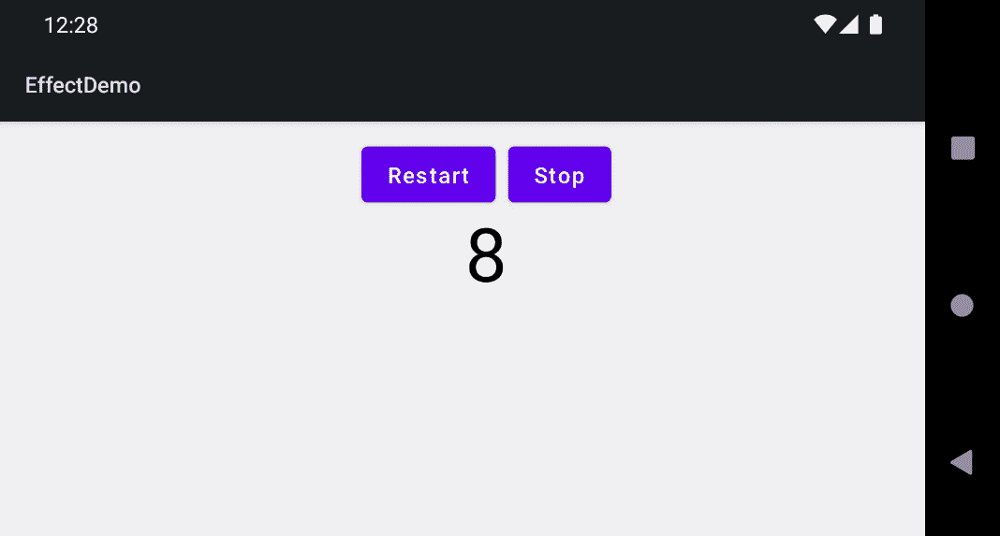

# 第七章：技巧、窍门和最佳实践

在*第六章*，*整合组件*中，我们在一个实际示例中结合了 Jetpack Compose 的几个关键技术，如状态提升、应用主题和导航。`ComposeUnitConverter`将状态存储在`ViewModel`中，并最终使用*Repository*模式持久化它。在本章中，我将向您展示如何在实例化时将对象传递给`ViewModel`，并使用这些对象来加载和保存数据。在*第三章*，*探索 Compose 的关键原则*中，我们检查了表现良好的可组合函数的特性。可组合函数应该是无副作用的，以便它们可重用且易于测试。然而，在某些情况下，你可能需要对外部作用域之外发生的状态变化做出反应或启动。我们将在本章末尾讨论这个问题。

本章的主要部分包括：

+   持久化和检索状态

+   保持你的可组合响应性

+   理解副作用

我们首先继续探索在*第五章*，*使用 ViewModel*部分中开始的`ViewModel`模式。这次，我们将向`ViewModel`添加业务逻辑并注入一个可以持久化和检索数据的对象。

*保持你的可组合响应性*部分回顾了可组合函数的一个关键要求。由于重组可能非常频繁，因此可组合函数必须尽可能快。这极大地影响了代码可以和不可以做的事情。长时间运行的任务——例如，复杂的计算或网络调用——不应同步调用。

*理解副作用*部分涵盖了需要对外部作用域之外发生的状态变化做出反应或启动的情况。例如，我们将使用`LaunchedEffect`来启动和停止复杂的计算。

# 技术要求

“*持久化和检索状态*”和“*保持你的可组合响应性*”部分进一步讨论了示例`ComposeUnitConverter`应用。*理解副作用*部分基于`EffectDemo`示例。请参考*第一章*，*构建你的第一个 Compose 应用*，了解如何安装和设置 Android Studio 以及如何获取本书的配套仓库。

本章所有代码文件都可以在 GitHub 上找到，地址为[`github.com/PacktPublishing/Android-UI-Development-with-Jetpack-Compose/tree/main/chapter_07`](https://github.com/PacktPublishing/Android-UI-Development-with-Jetpack-Compose/tree/main/chapter_07)。

# 持久化和检索状态

状态是可能随时间变化的应用程序数据。在 Compose 应用中，状态通常表示为 `State` 或 `MutableState` 的实例。如果这些对象在可组合函数内部使用，则在状态变化时将触发重新组合。如果状态传递给多个可组合函数，它们都可能被重新组合。这导致了 *状态提升* 原则：状态传递给可组合函数，而不是在它们内部记住。通常，此类状态在作为使用该状态的组件的父组件的可组合函数中记住。另一种方法是实现一个名为 `ViewModel` 的架构模式。它在各种平台的许多 **用户界面** (**UI**) 框架中都有使用。在 Android 上，它自 2017 年以来作为 **Android 架构组件** 的一部分可用。

`ViewModel` 的一般思想是将特定于应用程序某个部分的数据和访问逻辑结合起来。根据平台的不同，这可能是屏幕、窗口、对话框或其他类似顶级容器。在 Android 上，它通常是活动。数据是可观察的，因此 UI 元素可以注册并在变化时收到通知。可观察模式是如何实现的取决于平台。Android 架构组件引入了 `LiveData` 和 `MutableLiveData`。在 *第五章* 的 *Surviving configuration changes* 部分，*Managing the State of Your Composable Functions*，我向您展示了如何在 `ViewModel` 内部使用它们来存储在设备旋转后仍然存在的数据，以及如何将 `LiveData` 实例连接到可组合函数。

这里简要回顾一下：要将 `LiveData` 对象连接到 Compose 世界，我们首先使用 `androidx.lifecycle.viewmodel.compose.viewModel()` 获取一个 `ViewModel` 实例，然后在一个 `ViewModel` 的属性上调用 `observeAsState()` 扩展函数。返回的状态是只读的，因此如果可组合想要更新属性，它必须调用一个需要由 `ViewModel` 提供的设置器。

到目前为止，我还没有解释如何持久化状态并在以后恢复它。换句话说：`ViewModel` 实例从哪里获取其数据的初始值，它们在变化时做什么？让我们在下一节中找出答案。

## 将对象注入到 ViewModel 中

如果一个 `ViewModel` 想要加载和保存数据，它可能需要访问数据库、本地文件系统或某些远程网络服务。然而，对于 `ViewModel` 来说，后台如何读取和写入数据应该是无关紧要的。Android 架构组件建议实现 *Repository* 模式。仓库抽象了加载和保存数据的机制，并通过类似集合的接口使其可用。您可以在 [`martinfowler.com/eaaCatalog/repository.html`](https://martinfowler.com/eaaCatalog/repository.html) 了解更多关于仓库模式的信息。

你很快就会看到简单仓库的实现可能是什么样子，但首先，我需要向你展示如何在实例化时将对象传递给 `ViewModel`。`viewModel()` 接收一个类型为 `ViewModelProvider.Factory` 的 `factory` 参数。它用于创建 `ViewModel` 实例。如果你传递 `null`（默认值），则使用内置的默认工厂。`ComposeUnitConverter` 有两个屏幕，因此其工厂必须能够为每个屏幕创建 `ViewModel` 实例。

下面是 `ViewModelFactory` 的样子：

```java
class ViewModelFactory(private val repository: Repository)
 :ViewModelProvider.NewInstanceFactory() {
  override fun <T : ViewModel?> create(modelClass:
 Class<T>): T =
    if (modelClass.isAssignableFrom
     (TemperatureViewModel::class.java))
      TemperatureViewModel(repository) as T
    else
      DistancesViewModel(repository) as T
}
```

`ViewModelFactory` 扩展了 `ViewModelProvider.NewInstanceFactory` 静态类，并重写了 `create()` 方法（该方法属于父 `Factory` 接口）。`modelClass` 代表要创建的 `ViewModel`。因此，如果以下代码为 `true`，则我们实例化 `TemperatureViewModel` 并传递 `repository`：

```java
modelClass.isAssignableFrom
 (TemperatureViewModel::class.java)
```

此参数传递给了 `ViewModelFactory` 的构造函数。否则，将创建一个 `DistancesViewModel` 实例。其构造函数也接收 `repository`。如果你的工厂需要区分更多的 `ViewModel` 实例，你可能使用 `when`。

接下来，让我们看看我的 `Repository` 类，以了解 `ComposeUnitConverter` 如何加载和保存数据。你可以在下面的代码片段中看到这一点：

```java
class Repository(context: Context) {
    private val prefs =
        PreferenceManager.getDefaultSharedPreferences(context)
    fun getInt(key: String, default: Int) = 
        prefs.getInt(key, default)
    fun putInt(key: String, value: Int) {
        prefs.edit().putInt(key, value).apply()
    }
    fun getString(key: String, 
        default: String) = prefs.getString(key, default)
    fun putString(key: String, value: String) {
        prefs.edit().putString(key, value).apply()
    }
}
```

`Repository` 使用 Jetpack Preference。这个库是 `android.preference` 包内平台类和接口的替代品，该包在 API 级别 29 时已被弃用。

重要提示

平台类和库都是为用户设置设计的。你不应该使用它们来访问更复杂的数据、更大的文本或图像。记录型数据最好保存在 SQLite 数据库中，而文件则非常适合大文本或图像。

要使用 Jetpack Preference，我们需要在模块级别的 `build.gradle` 文件中添加对 `androidx.preference:preference-ktx` 的实现依赖。`getDefaultSharedPreferences()` 需要一个 `android.content.Context` 实例，该实例传递给 `Repository` 构造函数。

在我们继续之前，让我们回顾一下我之前展示的内容，如下所示：

+   `TemperatureViewModel` 和 `DistancesViewModel` 在它们的构造函数中接收一个 `Repository` 实例。

+   `Repository` 接收一个 `Context` 对象。

+   `ViewModel` 实例与活动解耦。它们在配置更改中存活。

最后一个要点关于我们可以传递给仓库的上下文有一个重要的后果。让我们在下一节中了解更多。

## 使用工厂

下面是创建仓库和工厂的方式：

```java
class ComposeUnitConverterActivity : ComponentActivity() {
  override fun onCreate(savedInstanceState: Bundle?) {
    super.onCreate(savedInstanceState)
    val factory =
      ViewModelFactory(Repository(applicationContext))
    setContent {
      ComposeUnitConverter(factory)
    }
  }
}
```

`Repository` 和 `ViewModelFactory` 都是普通对象，因此它们只是简单地实例化，并将所需的参数传递给它们。

重要提示

可能会诱使你传递`this`（调用活动）作为上下文。然而，由于`ViewModel`实例在配置更改（即活动的重新创建）中存活，上下文可能会改变。如果它改变了，仓库将访问一个不再可用的活动。通过使用`applicationContext`，我们确保这个问题不会发生。

`ComposeUnitConverter()`是组合函数层次结构的根。它将工厂传递给`ComposeUnitConverterNavHost()`，然后它反过来在`composable {}`内部作为屏幕的参数使用，如以下代码片段所示：

```java
composable(ComposeUnitConverterScreen.route_temperature) {
  TemperatureConverter(
    viewModel = viewModel(factory = factory)
  )
}
```

在本节中，我向您展示了如何使用简单的构造函数调用将仓库对象注入到`ViewModel`中。如果你的应用依赖于使用仓库的`ViewModel`。

# 保持你的组合函数响应

在实现组合函数时，你应该始终牢记它们的主要目的是声明 UI 和处理用户交互。理想情况下，任何需要实现这一目标的内容都应该传递给组合函数，包括状态和逻辑（例如点击处理程序），使其无状态。如果状态仅在组合函数内部需要，函数可以使用`remember {}`临时保持状态。这样的组合函数被称为`ViewModel`，组合函数必须与之交互。因此，`ViewModel`的代码也必须快速。

## 与`ViewModel`实例通信

`ViewModel`内的数据应该是可观察的。`ComposeUnitConverter`使用 Android Architecture Components 中的`LiveData`和`MutableLiveData`来实现这一点。你可以选择其他实现*观察者模式*的方案，只要有一种方法可以获得在`ViewModel`更改时更新的`State`或`MutableState`实例。这超出了本书的范围。`TemperatureViewModel`是`TemperatureConverter()`组合函数的`ViewModel`。

让我们看看它的实现。在以下代码片段中，为了简洁起见，我省略了与`scale`属性相关的代码。你可以在 GitHub 仓库中找到完整的实现：

```java
class TemperatureViewModel(private val repository:
 Repository): ViewModel() {
  ...
  private val _temperature: MutableLiveData<String>
             = MutableLiveData(
                repository.getString("temperature", "")
  )
  val temperature: LiveData<String>
    get() = _temperature
  fun getTemperatureAsFloat(): Float
          = (_temperature.value ?: "").let {
    return try {
      it.toFloat()
    } catch (e: NumberFormatException) {
      Float.NaN
    }
  }
  fun setTemperature(value: String) {
    _temperature.value = value
    repository.putString("temperature", value)
  }
  fun convert() = getTemperatureAsFloat().let {
    if (!it.isNaN())
      if (_scale.value == R.string.celsius)
        (it * 1.8F) + 32F
      else
        (it - 32F) / 1.8F
    else
      Float.NaN
  }
}
```

`ViewModel`实例通过一对变量来展示其数据，如下所示：

+   一个公共只读属性（`temperature`）

+   一个私有的可写后置变量（`_temperature`）

属性不是通过分配新值来更改，而是通过调用一些设置函数（`setTemperature()`）。你可以在*第五章*的*使用 ViewModel*部分找到为什么这样做的原因，*管理你的组合函数的状态*。可能还有其他组合函数可以调用的函数——例如，将温度从°C 转换为°F 的逻辑（`convert()`）不应是组合函数代码的一部分。同样适用于格式转换（从`String`到`Float`）。这些最好保留在`ViewModel`中。

如此是`ViewModel`在组合函数中使用的样子：

```java
@Composable
fun TemperatureConverter(viewModel: TemperatureViewModel) {
  …
  val currentValue = viewModel.temperature.observeAsState(
                        viewModel.temperature.value ?: "")
  val scale = viewModel.scale.observeAsState(
                 viewModel.scale.value ?: R.string.celsius)
  var result by remember { mutableStateOf("") }
  val calc = {
    val temp = viewModel.convert()
    result = if (temp.isNaN())
      ""
    else
      "$temp${
        if (scale.value == R.string.celsius)
          strFahrenheit
        else strCelsius
      }"
  }
  …
  Column(
    …
  ) {
    TemperatureTextField(
      temperature = currentValue,
      modifier = Modifier.padding(bottom = 16.dp),
      callback = calc,
      viewModel = viewModel
    )
    …
    Button(
      onClick = calc,
      …
    if (result.isNotEmpty()) {
      Text(
        text = result,
        style = MaterialTheme.typography.h3
      )
    }
    …
```

你是否注意到`TemperatureConverter()`接收其`ViewModel`作为参数？

小贴士

如果可能，您应该为预览和可测试性提供默认值（`viewModel()`）。然而，如果`ViewModel`需要存储库（如我的例子所示）或其他构造函数值，则这可能不起作用。

通过调用`ViewModel`属性的`observeAsState()`（例如`temperature`和`scale`），获取`State`实例，这些属性是`LiveData`实例。分配给`calc`的代码在`result`或用于`Text()`可组合函数中的状态发生变化时执行。请注意，`calc` lambda 表达式调用`ViewModel`函数的`convert()`函数以获取转换后的温度。你应该始终尝试将业务逻辑从可组合函数中移除，并将其放入`ViewModel`中。

到目前为止，我向您展示了如何观察`ViewModel`中的变化以及如何调用其内部的逻辑。还有一个部分：更改属性。在前面的代码片段中，`TemperatureTextField()`接收`ViewModel`。让我们看看它如何处理它：

```java
@Composable
fun TemperatureTextField(
  temperature: State<String>,
  modifier: Modifier = Modifier,
  callback: () -> Unit,
  viewModel: TemperatureViewModel
) {
  TextField(
    value = temperature.value,
    onValueChange = {
      viewModel.setTemperature(it)
    },
    …
```

每当文本发生变化时，都会使用新值调用`setTemperature()`。请记住，设置器执行以下操作：

```java
_temperature.value = value
```

`ViewModel`更新了后端变量`_temperature`（`MutableLiveData`）的值。由于`temperature`公共属性引用`_temperature`，其观察者（在我的例子中，是`TemperatureConverter()`中`observeAsState()`返回的状态）被通知。这触发了重组。

在本节中，我们关注了可组合函数与`ViewModel`实例之间通信的流程。接下来，我们将探讨如果`ViewModel`违反了与可组合函数的合约会发生什么，以及你可以采取哪些措施来防止这种情况。

## 处理长时间运行的任务

可组合函数通过设置属性的新值（`setTemperature()`）和调用实现业务逻辑的函数（`convert()`）来积极地与`ViewModel`进行交互。由于重组可能频繁发生，这些函数可能被非常频繁地调用。因此，它们必须非常快地返回。对于简单的算术，例如在°C 和°F 之间转换，这肯定是对的。

另一方面，某些算法对于某些输入可能变得越来越耗时。以下是一个例子。斐波那契数可以通过递归和迭代来计算。虽然递归算法更容易实现，但对于大数来说，它需要更长的时间。如果同步函数调用没有及时返回，可能会影响用户对您的应用的感知。您可以通过在`convert()`内部将`while (true) ;`作为第一行代码来测试这一点。如果您运行`ComposeUnitConverter`，输入一些数字，然后按**转换**，应用将不再响应。

重要提示

必须异步实现可能长时间运行的任务。

为了避免出现应用因计算耗时过长而无法响应的情况，你必须将计算与结果交付解耦。这只需几个步骤即可完成，如下所示：

1.  将结果作为可观察属性提供。

1.  使用协程或 Kotlin flow 计算结果。

1.  计算完成后，更新 `result` 属性。

这里是一个从 `DistancesViewModel` 中摘取的示例实现：

```java
private val _convertedDistance: MutableLiveData<Float>
                = MutableLiveData(Float.NaN)
val convertedDistance: LiveData<Float>
  get() = _convertedDistance
fun convert() {
  getDistanceAsFloat().let {
    viewModelScope.launch {
      _convertedDistance.value = if (!it.isNaN())
        if (_unit.value == R.string.meter)
          it * 0.00062137F
        else
          it / 0.00062137F
      else
        Float.NaN
    }
  }
}
```

`viewModelScope` 通过模块级别的 `build.gradle` 文件中的 `androidx.lifecycle:lifecycle-viewmodel-ktx` 实现依赖项可用。`convert()` 启动一个协程，一旦计算完成，就会更新 `_convertedDistance` 的值。可组合函数可以通过在 `convertedDistance` 公共属性上调用 `observeAsState()` 来观察变化。但如何访问 `convertedDistance` 和 `convert()`？下面是 `DistancesConverter.kt` 中的一个代码片段：

```java
val convertedValue by
        viewModel.convertedDistance.observeAsState()
val result by remember(convertedValue) {
  mutableStateOf(
    if (convertedValue?.isNaN() != false)
      ""
    else
      "$convertedValue ${
        if (unit.value == R.string.meter)
          strMile
        else strMeter
      }"
  )
}
val calc = {
  viewModel.convert()
}
```

`result` 在距离转换完成后接收要输出的文本，因此它应该在 `convertedValue` 发生变化时更新自己。因此，我将 `convertedValue` 作为键传递给 `remember {}`。每当键发生变化时，`mutableStateOf()` lambda 表达式会被重新计算，所以 `result` 会更新。当 `convertedValue` 发生变化时，会调用 `calc`。

在本节中，我经常使用术语 *计算*。计算不仅意味着算术。访问数据库、文件或网络服务也可能消耗大量资源并且耗时。这些操作必须异步执行。请记住，长时间运行的任务可能不是 `ViewModel` 本身的一部分，而是从它（例如，一个仓库）中调用的。因此，这样的代码也必须快速。我的 `Repository` 实现为了简单起见，同步访问 `Preferences` API。严格来说，即使是这样的基本操作也应该异步执行。

小贴士

Jetpack DataStore 允许你使用协议缓冲区存储键值对或类型对象。它使用 Kotlin 协程和 Flow 异步存储数据。你可以在 [`developer.android.com/topic/libraries/architecture/datastore`](https://developer.android.com/topic/libraries/architecture/datastore) 找到有关 Jetpack DataStore 的更多信息。

这就结束了我们对可组合函数和 `ViewModel` 实例之间通信的探讨。在下一节中，我将向你介绍那些在组合完成时不会发出 UI 元素但会导致副作用运行的组合器。

# 理解副作用

在 *第六章* 的 *使用 Scaffold() 结构化屏幕* 部分，*组装组件*，我向你展示了如何使用 `rememberCoroutineScope {}` 和 `scaffoldState.snackbarHostState.showSnackbar()` 显示一个 snack bar。由于 `showSnackbar()` 是一个挂起函数，它必须在一个协程或另一个挂起函数中被调用。因此，我们使用 `rememberCoroutineScope()` 创建并记住 `CoroutineScope`，然后调用它的 `launch {}` 函数。

## 调用挂起函数

`LaunchedEffect()` 组合器是一个用于生成挂起函数的替代方法。要了解它是如何工作的，让我们看看 `LaunchedEffectDemo()` 组合器。它属于 `EffectDemo` 示例，如下面的屏幕截图所示：



图 7.1 – 展示 `LaunchedEffectDemo()` 的 EffectDemo 示例

`LaunchedEffectDemo()` 实现了一个计数器。一旦点击了**开始**按钮，计数器每秒增加一次。点击**重启**将计数器重置。**停止**将终止它。实现此功能的代码在下面的代码片段中展示：

```java
@Composable
fun LaunchedEffectDemo() {
   var clickCount by rememberSaveable { mutableStateOf(0) }
   var counter by rememberSaveable { mutableStateOf(0) }
    Column(
        modifier = Modifier
            .fillMaxSize()
            .padding(16.dp),
        horizontalAlignment = Alignment.CenterHorizontally
    ) {
        Row {
            Button(onClick = {
                clickCount += 1
            }) {
                Text(
                    text = if (clickCount == 0)
                      stringResource(id = R.string.start)
                    else
                      stringResource(id = R.string.restart)
                )
            }
            Spacer(modifier = Modifier.width(8.dp))
            Button(enabled = clickCount > 0,
                onClick = {
                    clickCount = 0
                }) {
                Text(text = stringResource(id =
                              R.string.stop))
            }
            if (clickCount > 0) {
                LaunchedEffect(clickCount) {
                    counter = 0
                    while (isActive) {
                        counter += 1
                        delay(1000)
                    }
                }
            }
        }
        Text(
            text = "$counter",
            style = MaterialTheme.typography.h3
        )
    }
}
```

`clickCount` 计算了多少次 `0`。大于 `0` 的值表示应该每秒增加另一个记忆变量（`counter`）。这是通过传递给 `LaunchedEffect()` 的挂起函数来完成的。这个组合器用于在组合器内部安全地调用挂起函数。让我们看看它是如何工作的。

当 `LaunchedEffect()` 进入组合（`if (clickCount > 0) …`）时，它将使用作为参数传递的代码块启动一个协程。如果 `LaunchedEffect()` 离开组合（`clickCount <= 0`），则协程将被取消。你注意到它接收一个参数吗？如果 `LaunchedEffect()` 使用不同的键重新组合（我的示例只使用了一个，但如果你需要可以传递更多），现有的协程将被取消，并启动一个新的协程。

正如你所看到的，`LaunchedEffect()` 使启动和重启异步任务变得容易。相应的协程将自动清理。但是，如果你需要在键更改或组合器离开组合时执行一些额外的清理工作（例如注销监听器），该怎么办？让我们在下一节中找出答案。

## 使用 `DisposableEffect()` 清理

`DisposableEffect()` 组合器函数在其键更改时运行代码。此外，你可以传递一个 lambda 表达式用于清理目的。它将在 `DisposableEffect()` 函数离开组合时执行。代码在下面的代码片段中展示：

```java
DisposableEffect(clickCount) {
  println("init: clickCount is $clickCount")
  onDispose {
    println("dispose: clickCount is $clickCount")
  }
}
```

每当 `clickCount` 发生变化时（即当 `dispose:` 出现时或当 `DisposableEffect()` 离开组合时），都会打印以 `init:` 开头的消息。

重要提示

`DisposableEffect()` *必须* 在其代码块的最后包含一个 `onDispose {}` 子句。

我已经给了你两个使用 Compose 应用中副作用的手动示例。`Effect` API 包含了其他几个有用的组合器——例如，你可以使用 `SideEffect()` 将 Compose 状态发布到应用的非 Compose 部分中，而 `produceState()` 允许你将非 Compose 状态转换为 `State` 实例。

你可以在 [`developer.android.com/jetpack/compose/side-effects`](https://developer.android.com/jetpack/compose/side-effects) 找到有关 `Effect` API 的更多信息。

# 概述

本章涵盖了`ComposeUnitConverter`示例的更多方面。我们继续探索在*第五章*的*使用 ViewModel*部分开始探讨的`ViewModel`模式，即*管理可组合函数的状态*。这次，我们在`ViewModel`中添加了业务逻辑，并注入了一个可以持久化和检索数据的对象。

*保持你的可组合函数响应性*部分回顾了可组合函数的一个关键要求。重组可能非常频繁发生，因此可组合函数必须尽可能快，这决定了它们内部可能和不可能执行哪些代码。我向你展示了简单的循环如何导致 Compose 应用程序停止响应，以及协程如何对抗这种情况。

在最后的主体部分，*理解副作用*，我们探讨了所谓的副作用，并使用`LaunchedEffect`实现了一个简单的计数器。

在*第八章*的*与动画一起工作*中，你将学习如何使用动画显示和隐藏 UI 元素。我们将通过视觉效果来丰富过渡效果，并使用动画来可视化状态变化。
