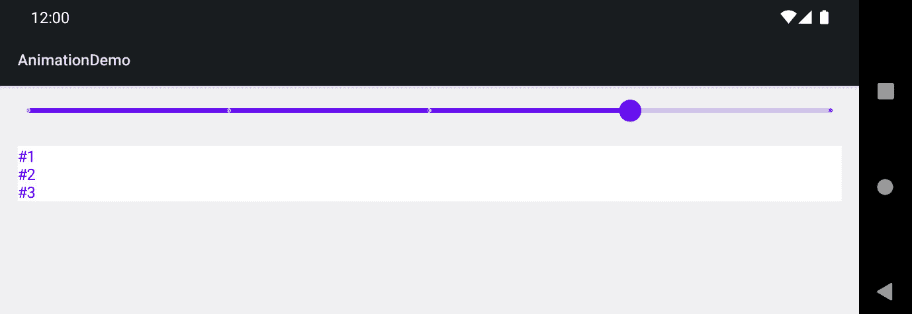
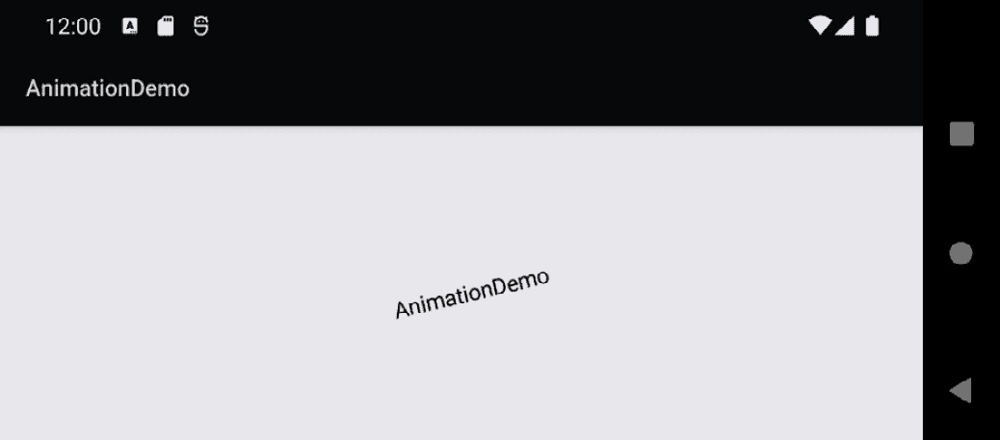

# 第八章：使用动画

在前面的章节中，我向您介绍了 Jetpack Compose 的许多技术方面，并展示了如何编写表现良好且外观美观的应用。现在，添加动画和过渡将使您的应用真正闪耀！Compose 在添加动画效果方面极大地简化了旧视图方法的过程。

在本章中，你将学习重要的动画相关应用程序编程接口，看到单多个属性的动画，以及组合件之间的过渡动作，并掌握状态变化和视觉交互之间的关系。

本章的主要部分如下：

+   使用动画来可视化状态变化

+   使用动画显示和隐藏 UI 元素

+   通过视觉效果增强过渡

我们首先使用动画来可视化状态变化。考虑一个简单的用例：点击按钮可能会改变 UI 对象的颜色。但是，只是颜色之间的切换感觉有些突然，而渐变变化则更加视觉上令人愉悦。此外，如果您想在动画期间更改多个值，Jetpack Compose 也可以轻松做到。我将向您介绍`updateTransition()`组合函数，它用于此类场景。

*使用动画显示和隐藏 UI 元素*这一节介绍了`AnimatedVisibility()`组合函数。它允许你应用进入和退出过渡，这些过渡将在内容出现或消失时播放。我们还将动画化尺寸变化，并了解相应的`animateContentSize()`修饰符。

在*通过视觉效果增强过渡*这一节中，我们将使用`Crossfade()`组合函数通过交叉淡入淡出动画在两个布局之间切换。此外，你还将了解`AnimationSpec`。此接口表示动画的规范。无限动画的探讨结束了这一节。

# 技术要求

本章基于`AnimationDemo`示例。请参考*第一章*，*构建您的第一个 Compose 应用*，了解如何安装和设置 Android Studio，以及如何获取本书的配套仓库。

本章的所有代码文件都可以在 GitHub 上找到，网址为[`github.com/PacktPublishing/Android-UI-Development-with-Jetpack-Compose/tree/main/chapter_08`](https://github.com/PacktPublishing/Android-UI-Development-with-Jetpack-Compose/tree/main/chapter_08)。

# 使用动画来可视化状态变化

状态是可能随时间变化的应用数据。在 Compose 应用中，状态（例如，颜色）通过`State`或`MutableState`实例表示。状态变化会触发重新组合。以下示例显示了一个按钮和一个盒子。点击按钮会通过改变状态在盒子的红色和白色之间切换颜色：

```java
@Composable
fun StateChangeDemo() {
  var toggled by remember {
    mutableStateOf(false)
  }
  val color = if (toggled)
    Color.White
  else
    Color.Red
  Column(
    modifier = Modifier
      .fillMaxSize()
      .padding(16.dp),
    horizontalAlignment = Alignment.CenterHorizontally
  ) {
    Button(onClick = {
      toggled = !toggled
    }) {
      Text(
        stringResource(R.string.toggle)
      )
    }
    Box(
      modifier = Modifier
        .padding(top = 32.dp)
        .background(color = color)
        .size(128.dp)
    )
  }
}
```

在这个例子中，`color` 是一个简单的不可变变量。每次 `toggled`（一个可变的 `Boolean` 状态）改变时（这发生在 `onClick` 内部），它都会被设置。由于 `color` 与应用于 `Box()` 的修饰符一起使用（`background(color = color)`），点击按钮会改变盒子的颜色。

如果您尝试这段代码，开关的感觉非常突然和生硬。这是因为白色和红色并不非常相似。使用动画会使变化更加愉快。让我们看看它是如何工作的。

## 动画化单个值的变化

要动画化颜色，您可以使用内置的 `animateColorAsState()` 可组合函数。将 `StateDemo()` 内部的 `val color = if (toggled) …` 赋值替换为以下代码块。如果您想尝试它，您可以在 `AnimationDemoActivity.kt` 中找到一个名为 `SingleValueAnimationDemo()` 的可组合函数，它属于 `AnimationDemo` 示例：

```java
val color by animateColorAsState(
  targetValue = if (toggled)
    Color.White
  else
    Color.Red
)
```

`animateColorAsState()` 返回一个 `State<Color>` 实例。每当 `targetValue` 发生变化时，动画将自动运行。如果变化发生在动画进行中，正在进行的动画将调整以匹配新的目标值。

小贴士

使用 `by` 关键字，您可以像访问普通变量一样访问颜色状态。

您可以提供一个可选的监听器，以便在动画完成后收到通知。以下代码行打印出与新状态匹配的颜色：

```java
finishedListener = { color -> println(color)}
```

要自定义您的动画，您可以将 `AnimationSpec<Color>` 的实例传递给 `animateColorAsState()`。默认值是 `colorDefaultSpring`，它是 `SingleValueAnimation.kt` 中的一个私有值：

```java
private val colorDefaultSpring = spring<Color>()
```

`spring()` 是 `AnimationSpec.kt` 中的一个顶级函数。它接收阻尼比、刚度和可见性阈值。以下代码行使颜色动画非常柔和：

```java
animationSpec = spring(stiffness = Spring.StiffnessVeryLow)
```

`spring()` 返回 `SpringSpec`。这个类实现了 `FiniteAnimationSpec` 接口，该接口反过来又扩展了 `AnimationSpec`。这个接口定义了动画的规范，包括要动画化的数据类型和动画配置，在这种情况下，是一个弹簧隐喻。还有其他一些。我们将在 *通过视觉效果增强过渡* 部分回到这个接口。接下来，我们将查看如何动画化多个值的变化。

## 动画化多个值的变化

在本节中，我将向您展示如何在状态改变时同时动画化几个值。设置类似于 `StateDemo()` 和 `SingleValueAnimationDemo()`：一个 `Column()` 实例包含一个 `Button()` 实例和一个 `Box()` 实例。但这次，盒子中的内容是 `Text()`。按钮切换状态，从而启动动画。

以下版本的 `MultipleValuesAnimationDemo()` 还不包含动画。它将被插入到读取为 **FIXME: animation setup missing** 的注释下方：

```java
@Composable
fun MultipleValuesAnimationDemo() {
  var toggled by remember {
    mutableStateOf(false)
  }
  // FIXME: animation setup missing
  Column(
    modifier = Modifier
      .fillMaxSize()
      .padding(16.dp),
    horizontalAlignment = Alignment.CenterHorizontally
  ) {
    Button(onClick = {
      toggled = !toggled
    }) {
      Text(
        stringResource(R.string.toggle)
      )
    }
    Box(
      contentAlignment = Alignment.Center,
      modifier = Modifier
        .padding(top = 32.dp)
        .border(
          width = borderWidth,
          color = Color.Black
        )
        .size(128.dp)
    ) {
      Text(
        text = stringResource(id = R.string.app_name),
        modifier = Modifier.rotate(degrees = degrees)
      )
    }
  }
}
```

`Box()` 显示一个黑色边框，其宽度由 `borderWidth` 控制。要为你的可组合函数应用边框，只需添加 `border()` 修饰符。`Text()` 被旋转。你可以使用 `rotate()` 修饰符实现这一点。`degrees` 变量持有角度。`degrees` 和 `borderWidth` 将在动画过程中发生变化。以下是实现方式：

```java
val transition = updateTransition(targetState = toggled)
val borderWidth by transition.animateDp() { state ->
  if (state)
    10.dp
  else
    1.dp
}
val degrees by transition.animateFloat() { state ->
  if (state) -90F
  else
    0F
}
```

`updateTransition()` 可组合函数配置并返回一个 `Transition`。当 `targetState` 发生变化时，转换将运行其所有子动画以达到目标值。子动画通过 `animate…()` 函数添加。它们不是 `Transition` 实例的一部分，而是扩展函数。`animateDp()` 基于密度无关像素添加动画。

在我的示例中，它控制边框宽度。`animateFloat()` 创建一个 `Float` 动画。这个函数非常适合改变 `Text()` 的旋转，因为 `Text()` 是一个 `Float` 值。还有更多的 `animate…()` 函数，它们作用于其他数据类型。例如，`animateInt()` 与 `Int` 值一起工作。`animateOffset()` 动画化一个 `Offset` 实例。你可以在 `Transition.kt` 文件中找到它们，该文件属于 `androidx.compose.animation.core` 包。

`Transition` 实例提供了一些反映转换状态的属性。例如，`isRunning` 指示转换中的任何动画是否正在运行。`segment` 包含当前正在进行的转换的初始状态和目标状态。转换的当前状态可通过 `currentState` 获取。这将是在转换完成之前的初始状态。然后，`currentState` 被设置为目标状态。

正如你所见，使用状态变化来触发动画非常简单。到目前为止，这些动画已经修改了一个或多个可组合函数的视觉外观。在下一节中，我将向你展示如何在显示或隐藏 UI 元素时应用动画。

# 使用动画显示和隐藏 UI 元素

通常，你的 UI 将包含不需要始终可见的信息。例如，在地址簿中，你可能只想显示联系人的关键属性，并在请求时提供详细信息，通常是在按钮点击后。然而，仅仅显示和隐藏附加数据会感觉突然且生硬。使用动画可以使体验更加愉快，所以让我们更深入地了解一下。

## 理解 `AnimatedVisibility()`

在本节中，我们将查看我的示例可组合函数 `AnimatedVisibilityDemo()`。它属于 `AnimationDemo` 项目。与 `StateDemo()`、`SingleValueAnimationDemo()` 和 `MultipleValuesAnimationDemo()` 类似，它使用一个 `Column()` 实例，该实例包含一个 `Button()` 实例和一个 `Box()` 实例。这部分代码简单直接，因此无需在打印中重复。按钮切换状态，从而启动动画。让我们看看它是如何工作的：

```java
AnimatedVisibility(
  visible = visible,
  enter = slideInHorizontally(),
  exit = slideOutVertically()
) {
  Box(
    modifier = Modifier
      .padding(top = 32.dp)
      .background(color = Color.Red)
      .size(128.dp)
  )
}
```

框架被包裹在 `AnimatedVisibility()` 中。这个内置的可组合函数在 `visible` 参数变化时动画其内容的出现和消失。你可以指定不同的 `EnterTransition` 和 `ExitTransition` 实例。在我的例子中，框架通过水平滑动进入，通过垂直滑动退出。

目前，有三种过渡类型：

+   淡入

+   扩展和缩小

+   滑动

它们可以通过 `+` 组合使用：

```java
enter = slideInHorizontally() + fadeIn(),
```

组合顺序并不重要，因为动画是同时开始的。

如果你没有为 `enter` 传递值，内容将默认在垂直扩展的同时淡入。省略 `exit` 将导致内容在垂直缩小的同时淡出。

请注意

在撰写本文时，`AnimatedVisibility()` 是实验性的。要在你的应用中使用它，你必须添加 `@ExperimentalAnimationApi` 注解。这将在 Jetpack Compose 1.1 中改变。

在本节中，我向你展示了如何动画内容的出现和消失。这个主题的一个变体是可视化大小变化（如果 `width`、`height` 或两者都是 `0`，则 UI 元素不再可见）。让我们在下一节中找出如何做到这一点。

## 动画大小变化

有时你可能想改变 UI 元素在屏幕上所需的空间量。想想文本字段。在紧凑模式下，你的应用可能只显示三行，而在详细模式下可能显示 10 行或更多。我的 `SizeChangeAnimationDemo()` 示例可组合函数（*图 8.1*）使用滑块来控制 `Text()` 的 `maxLines` 值：




图 8.1 – 显示 SizeChangeAnimationDemo() 的 AnimationDemo 示例

通用设置遵循上一节中的示例：一个 `Column()` 实例作为一些可组合函数的容器，在本例中是一个 `Slider()` 实例和一个 `Text()` 实例。然后状态变化触发动画。以下是代码：

```java
@Composable
fun SizeChangeAnimationDemo() {
  var size by remember { mutableStateOf(1F) }
  Column(
    modifier = Modifier
      .fillMaxSize()
      .padding(16.dp)
  ) {
    Slider(
      value = size,
      valueRange = (1F..4F),
      steps = 3,
      onValueChange = {
        size = it
      },
      modifier = Modifier.padding(bottom = 8.dp)
    )
    Text(
      text = stringResource(id = R.string.lines),
      modifier = Modifier
        .fillMaxWidth()
        .background(Color.White)
        .animateContentSize(),
      maxLines = size.toInt(),
      color = Color.Blue
    )
  }
}
```

`size` 是一个可变的 `Float` 状态。它被传递给 `Slider()` 作为其默认值。当滑块被移动时，`onValueChange {}` 被调用。lambda 表达式接收新值，并将其分配给 `size`。`Text()` 可组合函数使用状态作为 `maxLines` 的值。

动画由 `animateContentSize()` 修饰符处理。它属于 `androidx.compose.animation` 包。该修饰符期望两个参数，`animationSpec` 和 `finishedListener`。我在 *动画单个值变化* 部分简要介绍了这两个。`animationSpec` 默认为 `spring()`。如果你想在延迟后一次性显示所有线条，可以添加以下内容：

```java
animationSpec = snap(1000)
```

快照动画立即将动画值切换到最终值。您需要传递动画运行前等待的毫秒数。默认值为`0`。现在，`snap()`返回一个`SnapSpec`实例，它是`AnimationSpec`的实现。我们将在*通过视觉效果增强过渡效果*部分转向此接口。

`finishedListener`的默认值是`null`。如果您希望当大小变化动画完成时收到通知，您可以提供实现。初始值和最终大小都会传递给监听器。如果动画被中断，初始值将是中断点的大小。这有助于确定大小变化的方向。

这就结束了我们关于使用动画显示和隐藏 UI 元素的探讨。在下一节中，我们将专注于交换 UI 的某些部分。例如，我们将使用`Crossfade()`通过交叉淡入淡出动画在两个可组合函数之间切换。

# 通过视觉效果增强过渡效果

到目前为止，我向您展示了修改 UI 元素某些方面的动画，例如其颜色、大小或可见性。但有时您可能想要*交换*UI 的某些部分。这时，`Crossfade()`就派上用场了。它允许您通过交叉淡入淡出动画在两个可组合函数之间切换。让我们看看我的`CrossfadeAnimationDemo()`示例（*图 8.2*），它是`AnimationDemo`项目的一部分，看看它是如何工作的：

![图 8.2 – 显示 CrossfadeAnimationDemo()的 AnimationDemo 示例]

![img/B17505_08_2.jpg]

图 8.2 – 显示 CrossfadeAnimationDemo()的 AnimationDemo 示例

开关在两个屏幕之间切换。由于我们专注于动画，我保持了`Screen()`可组合的简单性，只是一个可自定义背景颜色的盒子，以及一个居中的大文本。您可以在`AnimationDemoActivity.kt`中找到其源代码。

## 混叠可组合函数

与本章中的大多数示例一样，`CrossfadeAnimationDemo()`使用`Column()`作为根元素。该列包含一个开关和要显示的屏幕。显示哪个取决于一个可变的`Boolean`状态：

```java
@Composable
fun CrossfadeAnimationDemo() {
  var isFirstScreen by remember { mutableStateOf(true) }
  Column(
    modifier = Modifier
      .fillMaxSize(),
    horizontalAlignment = Alignment.CenterHorizontally
  ) {
    Switch(
      checked = isFirstScreen,
      onCheckedChange = {
        isFirstScreen = !isFirstScreen
      },
      modifier = Modifier.padding(top = 16.dp,
                                  bottom = 16.dp)
    )
    Crossfade(targetState = isFirstScreen) { it ->
      if (it) {
        Screen(
          text = stringResource(id = R.string.letter_w),
          backgroundColor = Color.Gray
        )
      } else {
        Screen(
          text = stringResource(id = R.string.letter_i),
          backgroundColor = Color.LightGray
        )
      }
    }
  }
}
```

`Switch()`的`onCheckedChange` lambda 表达式切换`isFirstScreen`。这个状态作为`targetState`参数传递给`Crossfade()`。像之前我向您展示的其他动画一样，每次值改变时都会触发动画。具体来说，调用旧值的内联内容将淡出，而调用新值的内联内容将淡入。

`Crossfade()`接收一个类型为`FiniteAnimationSpec<Float>`的`animationSpec`。默认为`tween()`。此函数返回一个配置了给定持续时间、延迟和缓动曲线的`TweenSpec`实例。参数默认为`DefaultDurationMillis`（300 毫秒）、`0`和`FastOutSlowInEasing`。缓动曲线由`CubicBezierEasing`类的实例表示。此类模拟三阶贝塞尔曲线。其构造函数接收四个参数：

+   第一个控制点的*x*和*y*坐标

+   第二个控制点的*x*和*y*坐标

文档解释说，通过点(0, 0)和第一个控制点的线在点(0, 0)处与缓动函数相切，而通过点(1, 1)和第二个控制点的线在点(1, 1)处与缓动函数相切。`CubicBezierEasing`是`Easing`接口的实现（位于`androidx.compose.animation.core`包中）。除了`FastOutSlowInEasing`之外，你还可以从其他三个预定义曲线中选择：`LinearOutSlowInEasing`、`FastOutLinearInEasing`和`LinearEasing`来自定义你的动画。

由于`Crossfade()`接收一个类型为`FiniteAnimationSpec<Float>`的`animationSpec`，例如，你可以传递以下代码来使用具有非常低刚度的弹簧动画：

```java
animationSpec = spring(stiffness = Spring.StiffnessVeryLow)
```

在下一节中，我们将探讨动画的不同规范之间的关系。

## 理解动画规范

`AnimationSpec`是定义动画规范的基接口。它存储要动画化的数据类型和动画配置。它的唯一功能`vectorize()`，创建一个带有给定`TwoWayConverter`（将给定类型转换为`AnimationVector`并从`AnimationVector`转换回）的`VectorizedAnimationSpec`实例。

动画系统在`AnimationVector`实例上操作。`VectorizedAnimationSpec`描述了这些向量应该如何被动画化，例如，简单地插值于起始值和结束值之间（正如你在`TweenSpec`中看到的），完全不显示动画（`SnapSpec`），或者应用弹簧物理来产生运动（`SpringSpec`）。

`FiniteAnimationSpec`接口扩展了`AnimationSpec`。它直接由`RepeatableSpec`和`SpringSpec`类实现。它重写了`vectorize()`方法以返回`VectorizedFiniteAnimationSpec`。现在，`FiniteAnimationSpec`是接口`DurationBasedAnimationSpec`的父接口，该接口重写了`vectorize()`方法以返回`VectorizedDurationBasedAnimationSpec`。然后，`DurationBasedAnimationSpec`由`TweenSpec`、`SnapSpec`和`KeyframesSpec`类实现。

要创建一个`KeyframesSpec`实例，你可以调用`keyframes()`函数并传递一个用于动画的初始化函数。在动画的持续时间之后，你传递在给定毫秒数的时间点上的动画值的映射：

```java
animationSpec = keyframes {
      durationMillis = 8000
      0f at 0
      1f at 2000
      0f at 4000
      1f at 6000
    }
```

在这个示例中，动画持续了 8 秒，这比实际使用中你可能会用到的任何时间都要长，但它允许你观察这些变化。如果你将代码片段应用到`CrossfadeAnimationDemo()`中，你会注意到在动画过程中每个字母都可见两次。

到目前为止，我们已经探讨了有限动画。如果你想要一个动画永远继续下去怎么办？Jetpack Compose 在`CircularProgressIndicator()`和`LinearProgressIndicator()`可组合组件中这样做。`InfiniteRepeatableSpec`会重复提供的动画，直到手动取消。

当与过渡或其他动画组合组件一起使用时，当组合组件从 Compose 树中移除时，动画将停止。`InfiniteRepeatableSpec`实现了`AnimationSpec`接口。构造函数期望两个参数，`animation`和`repeatMode`。`RepeatMode`枚举类定义了两个值，`Restart`和`Reverse`。`repeatMode`的默认值是`RepeatMode.Restart`，意味着每次重复都从开始处重新开始。

你可以使用`infiniteRepeatable()`来创建一个`InfiniteRepeatableSpec`实例。我的`InfiniteRepeatableDemo()`示例组合组件（*图 8.3*）展示了如何做到这一点：



](img/B17505_08_3.jpg)

图 8.3 – 显示 InfiniteRepeatableDemo()的 AnimationDemo 示例

可组合的组件将文本顺时针旋转 0 到 359 度。然后，动画重新开始。`Text()`组件在`Box()`组件内居中：

```java
@Composable
fun InfiniteRepeatableDemo() {
  val infiniteTransition = rememberInfiniteTransition()
  val degrees by infiniteTransition.animateFloat(
    initialValue = 0F,
    targetValue = 359F,
    animationSpec = infiniteRepeatable(animation =
                        keyframes {
      durationMillis = 1500
      0F at 0
      359F at 1500
    })
  )
  Box(
    modifier = Modifier.fillMaxSize(),
    contentAlignment = Alignment.Center
  ) {
    Text(text = stringResource(id = R.string.app_name),
    modifier = Modifier.rotate(degrees = degrees))
  }
}
```

要创建一个可能无限循环的动画，你首先需要使用`rememberInfiniteTransition()`记住一个无限过渡。然后你可以在过渡实例上调用`animateFloat()`。这返回`State<Float>`，它与`rotate()`修饰符一起使用。`infiniteRepeatable()`作为其`animationSpec`参数传递给`animateFloat()`。动画本身基于关键帧。我们只需要定义两个帧，第一个代表起始角度，第二个代表结束角度。

如果你想让文本返回到其初始角度而不是持续旋转，你可以将`repeatMode`参数更改为以下内容：

```java
repeatMode = RepeatMode.Reverse
```

然后你应该在开始和结束处添加短暂的延迟。`keyframes {}`应该看起来像这样：

```java
keyframes {
      durationMillis = 2000
      0F at 500
      359F at 1500
}
```

这就结束了我们对动画规格的探讨。为了完成本章，让我简要总结一下你所学到的内容，以及你可以在下一章中期待的内容。

# 摘要

本章向你展示了如何轻松使用 Jetpack Compose 通过动画和过渡来丰富你的应用。我们首先使用简单的动画来可视化状态变化。例如，我向你介绍了`animateColorAsState()`。然后我们使用`updateTransition()`来获取`Transition`实例，并调用扩展函数如`animateDp()`和`animateFloat()`，以根据状态变化同时动画化多个值。

在*使用动画显示和隐藏 UI 元素*部分，你了解了`AnimatedVisibility()`组合函数，它允许你应用进入和退出过渡。它们在内容出现或消失时播放。你还学习了如何使用`animateContentSize()`修饰符来动画化大小变化。

在最终的主部分，*通过视觉效果增强过渡*，我们使用了`Crossfade()`组合函数在两个布局之间切换，并使用交叉淡入淡出动画。此外，你还了解了`AnimationSpec`和相关类和接口。我在本节结束时对无限动画进行了总结。

在*第九章*，*探索互操作性 API*，你将学习如何混合传统的视图和可组合函数。我们还将再次回到 ViewModels，作为在两个世界之间共享数据的一种手段。并且我会向你展示如何将第三方库集成到你的 Compose 应用中。
