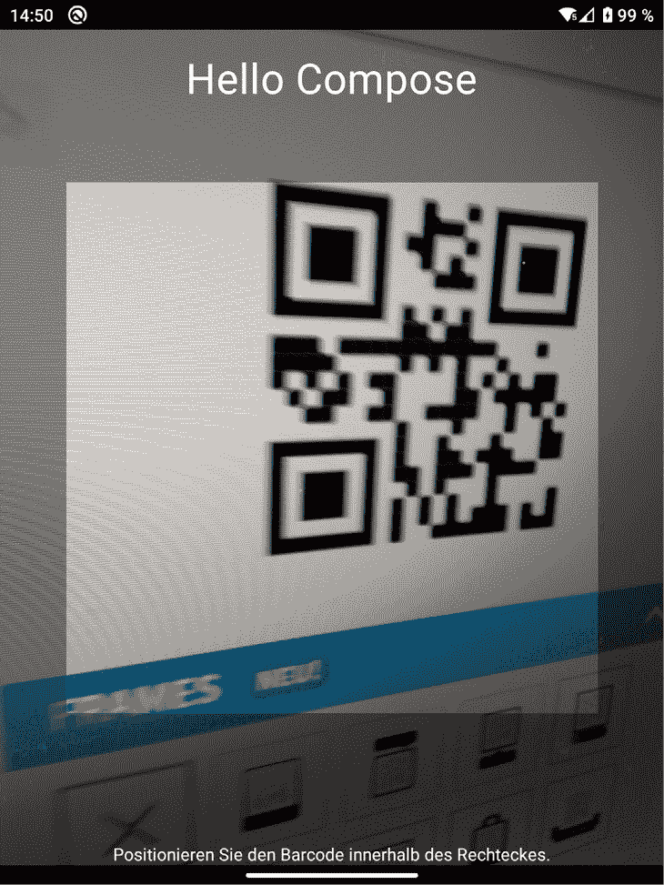
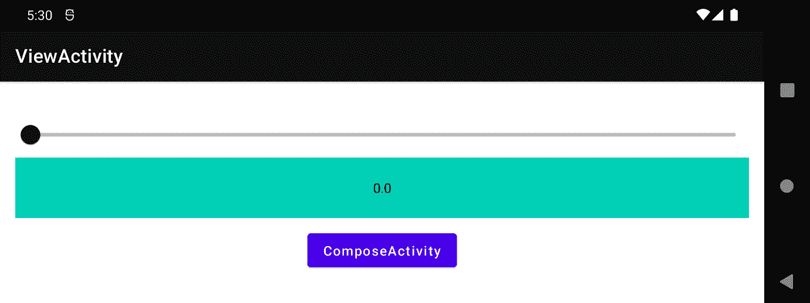

# 第九章：探索互操作性 API

本书的目标是向你展示如何开发美观、快速且易于维护的 Jetpack Compose 应用。前几章帮助你熟悉核心技术和原则，以及重要的接口、类、包，当然还有可组合函数。接下来的章节将涵盖 Android 新声明式用户界面工具包的成功采用之外的主题。

在本章中，我们将探讨 `AndroidView()`、`AndroidViewBinding()` 和 `ComposeView` 作为 Jetpack Compose 的互操作性 **应用程序编程接口** (**API**)。主要部分如下：

+   在 Compose 应用中显示视图

+   在视图和可组合函数之间共享数据

+   在视图层次结构中嵌入可组合函数

我们首先看看如何在 Compose 应用中显示传统的视图层次结构。想象一下，你编写了一个自定义组件（在底层由几个 UI 元素组成），例如图片选择器、颜色选择器或相机预览器。你不必用 Jetpack Compose 重新编写你的组件，只需简单地重用它即可节省你的投资。许多第三方库仍然是用视图编写的，所以我将向你展示如何在 Compose 应用中使用它们。

一旦你在 Compose 应用中嵌入了一个视图，你需要在视图和你的可组合函数之间共享数据。*在视图和可组合函数之间共享数据* 部分解释了如何使用 ViewModels 来实现这一点。

通常，你可能不想从头开始重写一个应用，而是逐步将其迁移到 Jetpack Compose，逐步用可组合函数替换视图层次结构。最后一部分主要部分，*在视图层次结构中嵌入可组合函数*，讨论了如何在现有的基于视图的应用中包含一个 Compose 层次结构。

# 技术要求

本章基于 `ZxingDemo` 和 `InteropDemo` 示例。请参考 *第一章* 的 *技术要求* 部分，*构建你的第一个 Compose 应用*，了解如何安装和设置 Android Studio，以及如何获取本书的配套仓库。

本章的所有代码文件都可以在 GitHub 上找到，地址为 [`github.com/PacktPublishing/Android-UI-Development-with-Jetpack-Compose/tree/main/chapter_09`](https://github.com/PacktPublishing/Android-UI-Development-with-Jetpack-Compose/tree/main/chapter_09)。

# 在 Compose 应用中显示视图

想象一下，你为之前的一个应用编写了一个基于视图的自定义组件——例如，一个图片选择器、颜色选择器或相机预览器——或者你想要包含一个第三方库，如 *Zebra Crossing* (*ZXing*) 来扫描 **快速响应** (**QR**) 码和条形码。要将它们集成到 Compose 应用中，你需要将视图（或视图层次结构的根）添加到你的可组合函数中。

让我们看看这是如何工作的。

## 将自定义组件添加到 Compose 应用中

下面的屏幕截图显示了`ZxingDemo`示例，它使用基于 ZXing 解码器的 Android *ZXing Android Embedded* 条形码扫描库。它根据 Apache License 2.0 条款发布，并托管在 GitHub 上（[`github.com/journeyapps/zxing-android-embedded`](https://github.com/journeyapps/zxing-android-embedded)）：



图 9.1 – ZxingDemo 示例

我的示例持续扫描条形码和二维码。装饰过的条形码视图由库提供。如果扫描引擎提供了结果，相应的文本将使用`Text()`作为叠加显示。要使用*ZXing Android Embedded*，您需要将实现依赖项添加到您的模块级`build.gradle`文件中，如下所示：

```kt
implementation 'com.journeyapps:zxing-android-embedded:4.3.0'
```

扫描器访问相机和（可选）设备振动器。应用必须在清单中请求至少`android.permission.WAKE_LOCK`和`android.permission.CAMERA`权限，并在运行时请求`android.permission.CAMERA`权限。我的实现基于`ActivityResultContracts.RequestPermission`，它取代了传统的覆盖`onRequestPermissionsResult()`的方法。此外，根据活动的生命周期，扫描器必须暂停和恢复。为了简化，我使用了一个名为`barcodeView`的`lateinit`变量，并在需要时调用`barcodeView.pause()`和`barcodeView.resume()`。请参阅项目的源代码以获取详细信息。接下来，我将向您展示如何初始化扫描库。这涉及到填充一个布局文件（命名为`layout.xml`），如下所示：

```kt
<?xml version="1.0" encoding="utf-8"?>
<com.journeyapps.barcodescanner.DecoratedBarcodeView

  android:id="@+id/barcode_scanner"
  android:layout_width="match_parent"
  android:layout_height="match_parent"
  android:layout_alignParentTop="true" />
```

布局仅包含一个元素，`DecoratedBarcodeView`。它被配置为填充所有可用空间。以下代码片段是`onCreate()`方法的一部分。请记住，`barcodeView`在`onPause()`等生命周期函数中被访问，因此是一个`lateinit`属性：

```kt
val root = layoutInflater.inflate(R.layout.layout, null)
barcodeView = root.findViewById(R.id.barcode_scanner)
val formats = listOf(BarcodeFormat.QR_CODE,
    BarcodeFormat.CODE_39)
barcodeView.barcodeView.decoderFactory =
    DefaultDecoderFactory(formats)
barcodeView.initializeFromIntent(intent)
val callback = object : BarcodeCallback {
  override fun barcodeResult(result: BarcodeResult) {
    if (result.text == null || result.text == text.value) {
      return
    }
    text.value = result.text
  }
}
barcodeView.decodeContinuous(callback)
```

首先，`layout.xml`被填充并分配给`root`。然后，`barcodeView`被初始化（`initializeFromIntent()`）并配置（通过设置解码器工厂）。最后，使用`decodeContinuous()`启动连续扫描过程。每当有新的扫描结果可用时，都会调用`callback` lambda 表达式。`text`变量定义如下：

```kt
private val text = MutableLiveData("")
```

我使用`MutableLiveData`，因为它可以很容易地作为状态被观察。在我向您展示如何在组合函数内部访问它之前，让我们简要回顾如下：

+   我们已设置并激活了扫描库。

+   当它检测到条形码或二维码时，它会更新一个`MutableLiveData`实例的值。

+   我们定义并初始化了两个`View`实例——`root`和`barcodeView`。

接下来，我将向您展示如何在组合函数内部访问从 ViewModel 获取的状态，如下所示：

```kt
setContent {
  val state = text.observeAsState()
  state.value?.let {
    ZxingDemo(root, it)
  }
}
```

状态和`root`的值传递给`ZxingDemo()`可组合函数。我们使用`Text()`显示`value`。`root`参数用于在 Compose UI 中包含视图层次结构。代码在以下代码片段中说明：

```kt
@Composable
fun ZxingDemo(root: View, value: String) {
  Box(
    modifier = Modifier.fillMaxSize(),
    contentAlignment = Alignment.TopCenter
  ) {
    AndroidView(modifier = Modifier.fillMaxSize(),
      factory = {
        root
      })
    if (value.isNotBlank()) {
      Text(
        modifier = Modifier.padding(16.dp),
        text = value,
        color = Color.White,
        style = MaterialTheme.typography.h4
      )
    }
  }
}
```

UI 由一个`Box()`可组合组件组成，包含两个子组件，`AndroidView()`和`Text()`。`AndroidView()`接收一个`factory`块，该块仅返回`root`（包含扫描视图的视图层次结构）。`Text()`可组合组件显示最后扫描的结果。

`factory`块恰好调用一次，以获取要组合的视图。它总是在 UI 线程上调用，因此您可以按需设置视图属性。在我的示例中，这并不需要，因为所有初始化已经在`onCreate()`中完成。配置条形码扫描器不应在可组合组件中完成，因为准备相机和预览可能需要消耗时间。此外，组件树的部分在活动级别被访问，因此需要子组件（`barcodeView`）的引用。

在本节中，我向您展示了如何使用`AndroidView()`将视图层次结构包含在您的 Compose 应用中。这个可组合函数是 Jetpack Compose 互操作性 API 的重要部分之一。我们使用了`layoutInflater.inflate()`来膨胀组件树，并使用`findViewById()`来访问其子组件之一。现代基于视图的应用尝试避免使用`findViewById()`，而是使用*视图绑定*。在下一节中，您将学习如何结合视图绑定和可组合函数。

## 使用 AndroidViewBinding()膨胀视图层次结构

传统上，活动在`lateinit`属性中持有对视图的引用，如果需要在不同的函数中修改相应的组件。*第二章*的*膨胀布局文件*部分，*理解声明性范式*讨论了这种方法的某些问题，并介绍了视图绑定作为解决方案。它被许多应用采用。因此，如果您想将现有应用迁移到 Jetpack Compose，您可能需要结合视图绑定和可组合函数。本节解释了如何实现这一点。

以下截图显示了`InteropDemo`示例：


图 9.2 – InteropDemo 示例

`InteropDemo`示例包含两个活动。一个（`ViewActivity`）在视图层次结构中集成一个可组合函数。我们将在*在视图层次结构中嵌入可组合函数*部分转向这一点。第二个，`ComposeActivity`做相反的事情：使用视图绑定膨胀一个视图层次结构，并在`Column()`可组合组件内显示组件树。让我们看看这里：

```kt
class ComposeActivity : ComponentActivity() {
  override fun onCreate(savedInstanceState: Bundle?) {
    super.onCreate(savedInstanceState)
    val viewModel: MyViewModel by viewModels()
    …
    setContent {
      ViewIntegrationDemo(viewModel) {
        val i = Intent(
          this,
          ViewActivity::class.java
        )
        i.putExtra(KEY, viewModel.sliderValue.value)
        startActivity(i)
      }
    }
  }
}
```

根组合器被称作 `ViewIntegrationDemo()`。它接收一个 ViewModel 和一个 lambda 表达式。ViewModel 用于在 Compose 和 `View` 层次结构之间共享数据，这将在 *在视图和组合函数之间共享数据* 部分进行讨论。lambda 表达式启动 `ViewActivity` 并传递从 ViewModel（`sliderValue`）中获取的值。代码在下面的代码片段中展示：

```kt
@Composable
fun ViewIntegrationDemo(viewModel: MyViewModel,
                        onClick: () -> Unit) {
  val sliderValueState =
    viewModel.sliderValue.observeAsState()
  Scaffold( ... ) {
    Column( ... ) {
      Slider( … )
      AndroidViewBinding(
        modifier = Modifier.fillMaxWidth(),
        factory = CustomBinding::inflate
      ) {
        // Here Views will be updated
      }
    }
  }
}
```

`Scaffold()` 是一个重要的集成组合器函数。它结构化了一个 Compose 屏幕。除了顶部和底部栏之外，它还包含一些内容——在这个例子中，是一个有两个子项的 `Column()` 组合器，分别是 `Slider()` 和 `AndroidViewBinding()`。滑块从 ViewModel 获取其当前值并将更改传播回它。你将在 *重新审视 ViewModels* 部分了解更多关于这一点。

`AndroidViewBinding()` 与 `AndroidView()` 类似。一个 `factory` 块创建一个要组合的 View 层次结构。`CustomBinding::inflate` 从 `custom.xml` 文件中填充布局，并返回该类型的实例。该类在构建过程中创建和更新。它提供了反映名为 `custom.xml` 的布局文件内容的常量。以下是简化的版本：

```kt
<?xml version="1.0" encoding="utf-8"?>
<androidx.constraintlayout.widget.ConstraintLayout

  android:layout_width="match_parent"
  android:layout_height="match_parent">
  <com.google.android.material.textview.MaterialTextView
    android:id="@+id/textView"
    ... />
  <com.google.android.material.button.MaterialButton
    android:id="@+id/button"
    …
    android:text="@string/view_activity"
    …
    app:layout_constraintTop_toBottomOf="@id/textView" />
</androidx.constraintlayout.widget.ConstraintLayout>
```

这个 `ConstraintLayout` 有两个子项，一个 `MaterialTextView` 和一个 `MaterialButton`。按钮点击会调用传递给 `ViewIntegrationDemo()` 的 lambda 表达式。文本字段接收当前的滑块值。这是在 `update` 块中完成的。以下代码属于 `ViewIntegrationDemo()` 中 `// Here Views will be updated` 之下：

```kt
textView.text = sliderValueState.value.toString()
button.setOnClickListener {
    onClick()
}
```

你可能想知道 `textView` 和 `button` 是在哪里定义的，以及为什么它们可以立即访问。`update` 块在布局被填充之后立即被调用。它是一个扩展函数，其实例由 `inflate` 返回——在我的例子中，是 `CustomBinding`。因为 `custom.xml` 中有 `button` 和 `textView`，所以在 `CustomBinding` 中有相应的变量。

当它所使用的值（`sliderValueState.value`）发生变化时，也会调用 `update` 块。在下一节中，我们将探讨这种变化何时以及在哪里被触发。

# 在视图和组合函数之间共享数据

状态是可能随时间变化的应用数据。当被组合使用的状态发生变化时，就会发生重组。为了在传统的视图世界中实现类似的功能，我们需要以某种方式存储数据，以便可以观察到对其的更改。存在许多*可观察*模式的实现。Android 架构组件（以及随后的 Jetpack 版本）包括 `LiveData` 和 `MutableLiveData`。这两个都在 ViewModels 中被频繁使用，用于在活动之外存储状态。

## 重新审视 ViewModels

在 *第五章* 的 *Surviving configuration changes* 部分、*第七章*](B17505_07_ePub.xhtml#_idTextAnchor119) 的 *Persisting and retrieving state* 部分以及 *Tips, Tricks, and Best Practices* 部分中，我向您介绍了 ViewModels。在我们查看如何使用 ViewModels 在视图和 composable 函数之间同步数据之前，让我们简要回顾以下关键技术：

+   要创建或获取 ViewModel 的实例，使用属于 `androidx.activity` 包的顶级 `viewModels()` 函数。

+   要将 `LiveData` 实例作为 composable 状态观察，请在 composable 函数内部对 ViewModel 属性调用 `observeAsState()` 扩展函数。

+   要在 composable 函数外部观察 `LiveData` 实例，调用 `observe()`。此函数属于 `androidx.lifecycle.LiveData`。

+   要更改 ViewModel 属性，调用相应的设置器。

    重要提示

    请确保在模块级别的 `build.gradle` 文件中根据需要添加 `androidx.compose.runtime:runtime-livedata`、`androidx.lifecycle:lifecycle-runtime-ktx` 和 `androidx.lifecycle:lifecycle-viewmodel-compose` 的实现依赖项。

现在，我们已经熟悉了与 ViewModels 相关的关键技术，让我们看看视图和 composable 函数之间的同步是如何工作的。*同步* 意味着 composable 函数和与视图相关的代码观察相同的 ViewModel 属性，并且可能触发该属性的变化。触发变化通常是通过调用设置器来完成的。对于一个 `Slider()` composable，它可能看起来像这样：

```kt
Slider(
  modifier = Modifier.fillMaxWidth(),
  onValueChange = {
    viewModel.setSliderValue(it)
  },
  value = sliderValueState.value ?: 0F
)
```

此示例还展示了 composable 内部的读数（`sliderValueState.value`）。以下是 `sliderValueState` 的定义方式：

```kt
val sliderValueState = viewModel.sliderValue.observeAsState()
```

接下来，让我们看看使用 View Binding 的传统（非 Compose）代码。以下示例是 `ViewActivity` 的一部分，它也属于 `InteropDemo` 示例。

## 结合 View Binding 和 ViewModels

利用 View Binding 的 Activity 通常有一个名为 `binding` 的 `lateinit` 属性，如下代码片段所示：

```kt
binding = LayoutBinding.inflate(layoutInflater)
```

`LayoutBinding.inflate()` 返回一个 `LayoutBinding` 实例。`Binding.root` 代表组件树的根。它被传递给 `setContentView()`。以下是相应的布局文件（`layout.xml`）的简略版本：

```kt
<?xml version="1.0" encoding="utf-8"?>
<androidx.constraintlayout.widget.ConstraintLayout

  …
  android:layout_width="match_parent"
  android:layout_height="match_parent">
  <com.google.android.material.slider.Slider
    android:id="@+id/slider"
    ... />
  <androidx.compose.ui.platform.ComposeView
    android:id="@+id/compose_view"
    ...
    app:layout_constraintTop_toBottomOf="@id/slider" />
</androidx.constraintlayout.widget.ConstraintLayout>
```

`ConstraintLayout` 包含一个 `com.google.android.material.slider.Slider` 和一个 `ComposeView`（将在下一节中详细讨论）。滑动条的 ID 是 `slider`，因此 `LayoutBinding` 包含一个同名的变量。因此，我们可以将滑动条链接到 ViewModel，如下所示：

```kt
viewModel.sliderValue.observe(this) {
  binding.slider.value = it
}
```

当 `sliderValue` 中存储的值发生变化时，传递给 `observe()` 的块会被调用。通过更新 `binding.slider.value`，我们改变滑动条手柄的位置，这意味着我们更新了滑动条。代码如下所示：

```kt
binding.slider.addOnChangeListener { _, value, _ ->
  viewModel.setSliderValue(value) }
```

当用户拖动滑块手柄时，传递给`addOnChangeListener()`的块会被调用。通过调用`setSliderValue()`，我们更新 ViewModel，这反过来又触发了观察者的更新——例如，我们的可组合函数。

在本节中，我向您介绍了将可组合函数和传统视图绑定到 ViewModel 属性所需的步骤。当属性发生变化时，所有观察者都会被调用，这会导致可组合和视图的更新。在下一节中，我们将继续探讨`InteropDemo`示例。这次，我将向您展示如何在视图层次结构中嵌入可组合函数。如果要将现有应用程序逐步迁移到 Jetpack Compose，这一点非常重要。

# 在视图层次结构中嵌入可组合函数

正如您所看到的，使用`AndroidView()`和`AndroidViewBinding()`，在可组合函数中集成视图非常简单直接。但反过来呢？通常，您可能不想从头开始重写现有的（基于视图的）应用程序，而是逐步将其迁移到 Jetpack Compose，逐步用可组合函数替换视图层次结构。根据活动的复杂性，从反映 UI 部分的小型可组合函数开始，并将它们整合到剩余布局中，可能是有意义的。

`Androidx.compose.ui.platform.ComposeView`使可组合函数在经典布局中可用。该类扩展了`AbstractComposeView`，其父类为`ViewGroup`。一旦包含 ComposeView 的布局被填充，以下是您如何配置它的方法：

```kt
binding.composeView.run {
  setViewCompositionStrategy(
      ViewCompositionStrategy.DisposeOnDetachedFromWindow)
  setContent {
    val sliderValue =
            viewModel.sliderValue.observeAsState()
    sliderValue.value?.let {
      ComposeDemo(it) {
        val I = Intent(
          context,
          ComposeActivity::class.java
        )
        i.putExtra(KEY, it)
        startActivity(i)
      }
    }
  }
}
```

`setContent()`设置此视图的内容。当视图附加到窗口或调用`createComposition()`时，将发生初始组合。虽然`setContent()`在`ComposeView`中定义，但`createComposition()`属于`AbstractComposeView`。它为此视图执行初始组合。通常，您不需要直接调用此函数。

`setViewCompositionStrategy()`配置如何管理视图内部组合的释放。`ViewCompositionStrategy.DisposeOnDetachedFromWindow`（默认值）表示每当视图从窗口分离时，组合就会被释放。在像我示例中的简单场景中，这是首选的。如果您的视图在片段或具有已知`LifecycleOwner`的组件中显示，您应使用`DisposeOnViewTreeLifecycleDestroyed`或`DisposeOnLifecycleDestroyed`。然而，这些内容超出了本书的范围。以下行基于 ViewModel 的`sliderValue`属性创建状态，并将值传递给`ComposeDemo()`：

```kt
val sliderValue = viewModel.sliderValue.observeAsState()
```

此可组合函数还接收一个启动`ComposeActivity`并传递当前滑块值的块，如下面的代码片段所示：

```kt
@Composable
fun ComposeDemo(value: Float, onClick: () -> Unit) {
  Column(
    modifier = Modifier
      .fillMaxSize(),
    horizontalAlignment = Alignment.CenterHorizontally
  ) {
    Box(
      modifier = Modifier
        .fillMaxWidth()
        .background(MaterialTheme.colors.secondary)
        .height(64.dp),
      contentAlignment = Alignment.Center
    ) {
      Text(
        text = value.toString()
      )
    }
    Button(
      onClick = onClick,
      modifier = Modifier.padding(top = 16.dp)
    ) {
      Text(text = stringResource(id =
            R.string.compose_activity))
    }
  }
}
```

`ComposeDemo()`，如图下截图所示，在`Column()`中放置一个`Box()`（其中包含一个`Text()`）和一个`Button()`，以模仿`ViewActivity`。将`Text()`包裹在`Box()`中是为了在具有特定高度的区域内垂直居中文本。点击按钮将调用`onClick` lambda 表达式。`Text()`仅显示`value`参数：



图 9.3 – InteropDemo 示例展示了 ViewActivity

在结束本章之前，让我回顾一下您需要采取的重要步骤，以便在布局中包含 Compose 层次结构，如下所示：

+   将`androidx.compose.ui.platform.ComposeView`添加到布局中。

+   根据布局显示的位置（活动、片段等），决定一个`ViewCompositionStrategy`。

+   使用`setContent {}`设置内容。

+   通过调用`viewModels()`获取`ViewModel`的引用。

+   将监听器注册到相关视图，并在更改时更新`ViewModel`。

+   在可组合函数内部，根据需要通过在 ViewModel 属性上调用`observeAsState()`来创建状态。

+   在可组合函数内部，通过调用相应的 setter 来更新 ViewModel。

Jetpack Compose 互操作 API 允许无缝双向集成可组合函数和`View`层次结构。它们帮助您使用依赖于视图的库，并通过实现逐步、细粒度的迁移来简化向 Composable 的过渡。

# 概述

在本章中，我们探讨了 Jetpack Compose 的互操作 API，这些 API 允许您混合可组合函数和传统视图。我们首先通过使用`AndroidView()`在 Compose 应用程序中集成第三方库的传统视图层次结构，然后展示了如何使用 View Binding 和`AndroidViewBinding()`将布局嵌入到可组合函数中。一旦您在 Compose UI 中嵌入了一个`View`，您就需要在这两个世界之间共享数据。*视图和可组合函数之间的数据共享*部分解释了如何使用 ViewModel 实现这一点。最后一章主要讨论了如何在现有应用程序中使用`ComposeView`将 Compose UI 嵌入。

*第十章*，*测试和调试 Compose 应用程序*，专注于测试您的 Compose 应用程序。您将学习如何使用`ComposeTestRule`和`AndroidComposeTestRule`。此外，我将向您介绍*语义树*。
