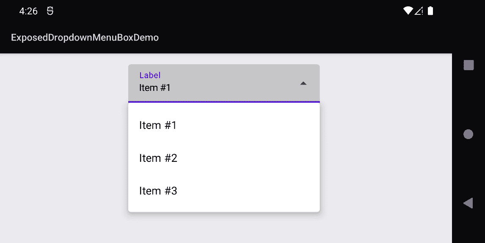
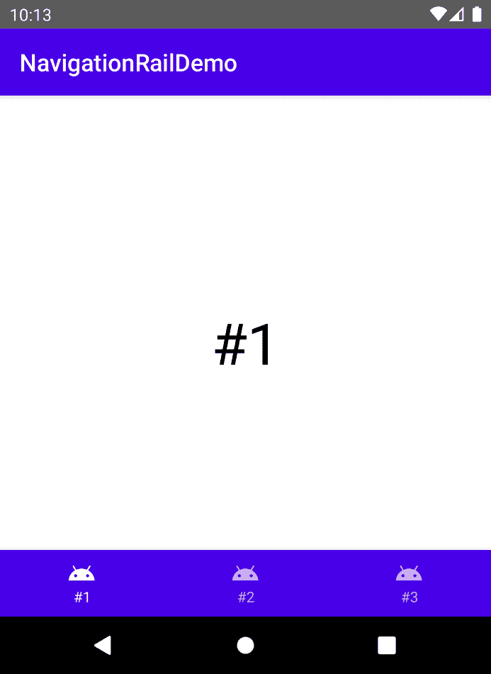
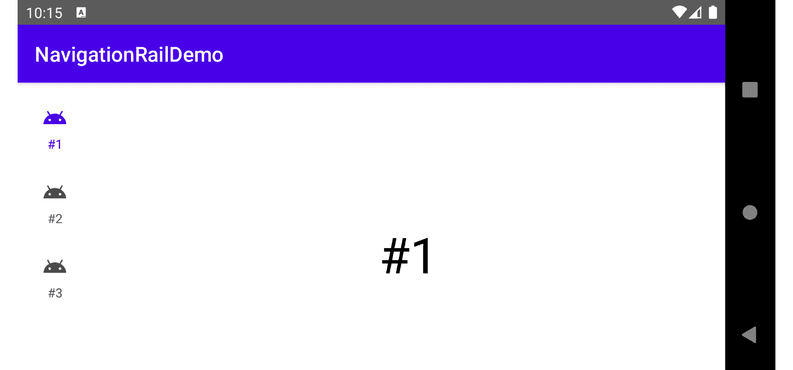
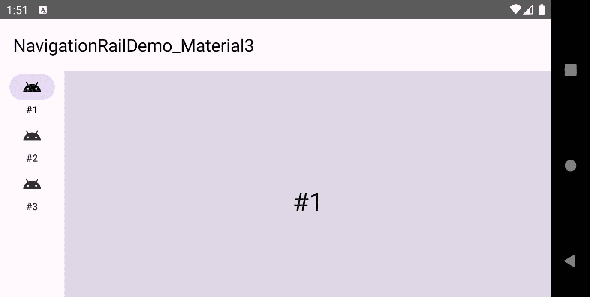
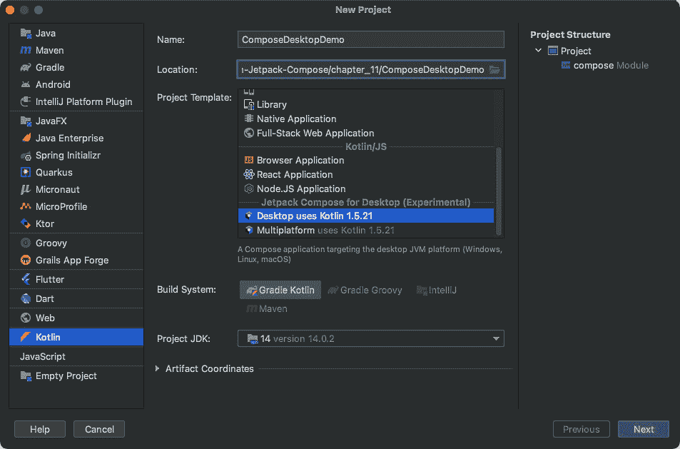
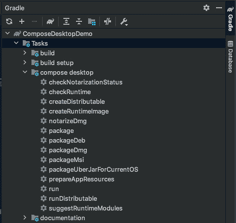
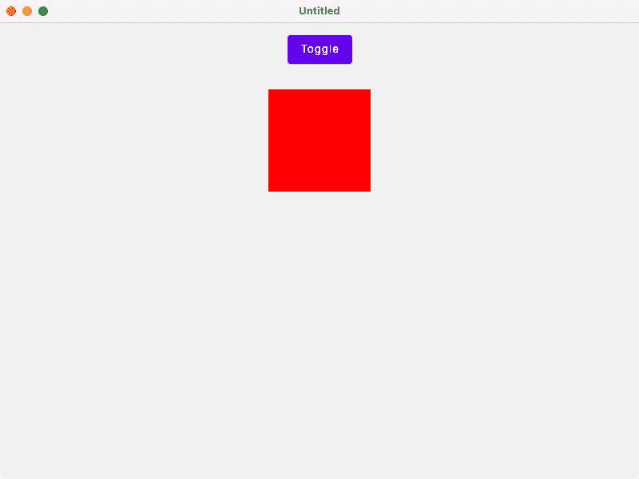

# 第十一章：结论和下一步行动

本书向您展示了如何编写美观、快速且易于维护的 Jetpack Compose 应用程序。在第一章到第三章中，我向您介绍了 Jetpack Compose 的基础知识，解释了核心技术和原则，以及重要的接口、类、包，当然还有可组合函数。第四章到第七章专注于构建 Compose UI。您学习了如何管理状态并导航到不同的屏幕。我们还探讨了 ViewModel 和 Repository 模式。第八章到第十章涵盖了高级主题，例如动画、互操作性、测试和调试。

这最后一章完全关于您接下来可以做什么。我们将探讨 Jetpack Compose 的近期未来，并探索邻近的平台，因为您也可以在那里应用您的 Compose 知识。本章的主要部分如下：

+   探索未来

+   迁移到 Material You

+   超越 Android

我们将首先看看 Jetpack Compose 的下一个版本 1.1，当本书进入生产阶段时，这个版本还不稳定。这次迭代将带来错误修复、性能改进和新功能，例如`ExposedDropdownMenuBox()`，一个暴露的下拉菜单，以及`NavigationRail()`。这个垂直导航栏旨在用于可折叠设备和大型屏幕设备。

第二个主要部分，*迁移到 Material You*，向您介绍了为 Compose 设计的 Material 3。这个包包含了*Material You*，这是谷歌美丽设计语言的最新迭代，用于 Jetpack Compose 应用程序。我们将看看 Material 2 和 Material 3 之间的某些差异，例如简化的字体和配色方案。

*超越 Android*部分向您展示了如何将您的 Jetpack Compose 知识应用于其他平台，例如桌面和网页。我将简要解释如何将我的一个示例可组合函数带到桌面。

# 技术要求

本章基于`ExposedDropdownMenuBoxDemo`和`NavigationRailDemo`示例。请参考*第一章*，*构建您的第一个 Compose 应用程序*，了解有关如何安装和设置 Android Studio 以及如何获取本书附带的存储库的信息。

本章所有代码文件都可以在 GitHub 上找到，地址为[`github.com/PacktPublishing/Android-UI-Development-with-Jetpack-Compose/tree/main/chapter_11`](https://github.com/PacktPublishing/Android-UI-Development-with-Jetpack-Compose/tree/main/chapter_11)。

# 探索未来

本书基于 Jetpack Compose 1.0，这是库的第一个稳定版本，于 2021 年 7 月发布。就像所有其他 Jetpack 组件一样，谷歌不断改进和更新 Compose。在完成手稿时，1.1 版本处于测试阶段。当它变得稳定时，我将更新本书附带的存储库以反映这些变化。您可以在[`github.com/PacktPublishing/Android-UI-Development-with-Jetpack-Compose`](https://github.com/PacktPublishing/Android-UI-Development-with-Jetpack-Compose)找到本书的样本的最新版本。

Jetpack Compose 1.1 将提供错误修复、新功能和性能改进。新功能包括以下内容：

+   Compose 编译器将支持较旧的 Compose 运行时版本。这允许您使用最新的工具，同时仍然针对较旧的 Compose 版本。

+   触摸目标尺寸（UI 元素可能获得额外的间距以使其更易于访问）。

+   `ImageVector`缓存。

+   支持 Android 12 扩展滚动。

几个之前实验性的 API（例如，`AnimatedVisibility`、`EnterTransition`和`ExitTransition`）将变为稳定。此外，Jetpack Compose 1.1 将支持 Kotlin 的新版本。不幸的是，您还将面临一些破坏性变化。例如，`EnterTransition`和`ExitTransition`工厂中的 lambda 表达式可能被移动到参数列表的最后一个位置。

## 显示暴露的下拉菜单

此外，还有新的 Material UI 元素。例如，`ExposedDropdownMenuBox()`显示一个暴露的下拉菜单，它将当前选中的菜单项显示在选项列表上方。`ExposedDropdownMenuBoxDemo`样本说明了 composable 函数（*图 11.1*）的用法。



图 11.1 – ExposedDropdownMenuBoxDemo 样本

目前，`ExposedDropdownMenuBox()`被标记为实验性。因此，您必须添加`@ExperimentalMaterialApi`注解：

```kt
@ExperimentalMaterialApi
@Composable
fun ExposedDropdownMenuBoxDemo() {
  val titles = List(3) { i ->
    stringResource(id = R.string.item, i + 1)
  }
  var expanded by remember { mutableStateOf(false) }
  var selectedTxt by remember { mutableStateOf(titles[0]) }
  Box(
    modifier = Modifier
      .fillMaxSize()
      .padding(16.dp),
    contentAlignment = Alignment.TopCenter
  ) {
    ...
  }
}
```

`ExposedDropdownMenuBoxDemo()`将`ExposedDropdownMenuBox()`放入`Box()`中，并将菜单水平居中于顶部。菜单项存储在列表（`titles`）中。`expanded`状态反映了菜单项的可见性。`selectedTxt`代表当前选中的文本。以下是它们的用法：

```kt
ExposedDropdownMenuBox(expanded = expanded,
  onExpandedChange = {
    expanded = !expanded
  }) {
  TextField(value = selectedTxt,
    onValueChange = { },
    readOnly = true,
    label = {
      Text(text = stringResource(id = R.string.label))
    },
    trailingIcon = {
      ExposedDropdownMenuDefaults.TrailingIcon(
        expanded = expanded
      )
    }
  )
  ExposedDropdownMenu(expanded = expanded,
    onDismissRequest = {
      expanded = false
    }) {
    for (title in titles) {
      DropdownMenuItem(onClick = {
        expanded = false
        selectedTxt = title
      }) {
        Text(text = title)
      }
    }
  }
}
```

`ExposedDropdownMenuBox()`有两个子元素，只读的`TextField()`和`ExposedDropdownMenu()`。文本字段显示`selectedTxt`。由于`readOnly`设置为`true`，`onValueChange`块可以是空的。`expanded`控制尾随图标，它反映了菜单项的可见性。传递给`ExposedDropdownMenuBox()`的`onExpandedChange` lambda 表达式在用户点击暴露的下拉菜单时执行。通常，您会否定`expanded`。

`ExposedDropdownMenu()` 至少包含一个 `DropdownMenuItem()` 作为其内容。通常，您会希望隐藏菜单（`expanded = false`）并更新文本字段（`selectedTxt = title`）。传递给 `ExposedDropdownMenu()` 的 `onDismissRequest` 块也应该关闭菜单，但不要更新文本字段。

因此，`ExposedDropdownMenuBox()` 是显示一系列项目并允许用户选择其中之一的一种非常紧凑的方式。在下一节中，我将向您展示 Compose 1.1 中首次亮相的另一个 Material UI 元素。`NavigationRail()` 以垂直方式呈现顶级导航目的地。

## 使用 NavigationRail()

Compose 提供了多种方式在您的应用中导航到顶级目的地。例如，您可以使用 `BottomNavigation()` 在屏幕底部放置一个导航栏。我在 *第六章* 的 *添加导航* 部分向您展示了如何使用它，*将部件组合在一起*。Jetpack Compose 1.1 包含另一个用于顶级导航的 UI 元素。`NavigationRail()` 实现了 **导航栏** 交互模式，这是一个专门为平板电脑和可折叠大屏设计的垂直导航栏。

如果屏幕不够大，或者可折叠设备关闭，则应显示标准底部导航栏。`NavigationRailDemo` 示例展示了如何实现这一点。在 *图 11.2* 中，您可以看到应用在竖屏模式下的样子。



图 11.2 – NavigationRailDemo 示例在竖屏模式下的截图

要继续，一个详细的方法是使用 Jetpack `WindowManager` 库，但这超出了本书的范围。相反，我们将使用 `NavigationRailDemo()` 以简化起见，它通过比较当前屏幕宽度与最小尺寸（600 密度无关像素）来确定是否应使用导航栏：

```kt
@Composable
fun NavigationRailDemo() {
  val showNavigationRail =
          LocalConfiguration.current.screenWidthDp >= 600
  val index = rememberSaveable { mutableStateOf(0) }
  Scaffold(topBar = {
    TopAppBar(title = {
      Text(text = stringResource(id = R.string.app_name))
    })
  },
    bottomBar = {
      if (!showNavigationRail)
        BottomBar(index)
    }) {
    Content(showNavigationRail, index)
  }
}
```

`Scaffold()` 通过 `bottomBar` 独占表达式接收底部栏。如果不应显示导航栏（`showNavigationRail` 为 `false`），则调用我的 `BottomBar()` 可组合组件。否则，不添加底部栏。当前活动屏幕存储在一个可变的 `Int` 状态（`index`）中。它传递给 `BottomBar()` 和 `Content()`。接下来，让我们简要回顾一下 `BottomNavigation()` 的工作原理，通过查看我的 `BottomBar()` 可组合组件：

```kt
@Composable
fun BottomBar(index: MutableState<Int>) {
  BottomNavigation {
    for (i in 0..2)
      BottomNavigationItem(selected = i == index.value,
        onClick = { index.value = i },
        icon = {
          Icon(
            painter = painterResource(id =
                R.drawable.ic_baseline_android_24),
            contentDescription = null
          )
        },
        label = {
          MyText(index = i)
        }
      )
  }
}
```

`BottomNavigation()` 的内容由几个带有图标、标签和 `onClick` 块的 `BottomNavigationItem()` 元素组成。我的实现只是更新了 `index` 状态，该状态也在 `Content()` 中使用。这个可组合组件在需要时显示导航栏，以及主要内容（屏幕），它只是一个内部文本居中的盒子：

```kt
@Composable
fun Content(showNavigationRail: Boolean, index:
   MutableState<Int>) {
  Row(
    modifier = Modifier.fillMaxSize()
  ) {
    if (showNavigationRail) {
      NavigationRail {
        for (i in 0..2)
          NavigationRailItem(selected = i == index.value,
            onClick = {
              index.value = i
            },
            icon = {
              Icon(
                painter = painterResource(id =
                    R.drawable.ic_baseline_android_24),
                contentDescription = null
              )
            },
            label = {
              MyText(index = i)
            })
      }
    }
    Box(
      modifier = Modifier
        .fillMaxSize()
        .background(color = MaterialTheme.colors.surface),
      contentAlignment = Alignment.Center
    ) {
      MyText(
        index = index.value,
        style = MaterialTheme.typography.h3
      )
    }
  }
}
```

导航栏和屏幕在 `Row()` 中水平排列。与 `BottomNavigation()` 类似，`NavigationRail()` 获取一个或多个子元素，这些子元素代表导航目的地。子元素（`NavigationRailItem()`）有一个标签、一个图标和一个 `onClick` 块。*图 11.3* 展示了横屏模式下的 `NavigationRailDemo` 示例。




图 11.3 – 横屏模式下的 NavigationRailDemo 示例

虽然 Jetpack Compose 1.1 将添加一些 Material UI 元素并润色现有的元素，但它仍然实现了与之前 Android 版本（包括 11，有时称为 Material 2）中存在的 *Material Design*。随着 Android 12 的推出，*Material You* 也将对 Compose 可用。然而，它不是现有包的就地更新，而是一个新的库。在接下来的章节中，我们将探讨 Jetpack Compose 的 Material 3，当时这个章节正在编写时，它还处于早期 alpha 版本。

注意

您可能想知道 Material You 和 Material 3 之间的区别。我指的是 Material 3 作为 Material Design 规范的最新版本，而 Material You 是 Android 12 上的实现。

# 迁移到 Material You

**Material You** 是谷歌设计语言 Material Design 的最新迭代。它是在 2021 年的 Google I/O 上宣布的，并首次在运行 Android 12 的 Pixel 智能手机上可用。最终，它将扩展到其他设备、形态和框架。像其前辈一样，Material You 基于排版、动画和层级。但它强调个性化：根据平台，*Material You* 的实现可能使用来自系统壁纸的颜色调色板。

## 比较 Material 2 和 Material 3 的差异

要在您的 Compose 应用中使用 *Material You*，您必须在模块级别的 `build.gradle` 文件中添加对 `androidx.compose.material3:material3` 的实现依赖。可组合对象、类和接口的基本包更改为 `androidx.compose.material3`。如果您想将现有的 Compose 应用迁移到这个新版本，至少需要更改导入。不幸的是，相当多的可组合函数的名称也将改变。为了了解差异，我已经为 *Material You* 重新实现了 `NavigationRailDemo`。该项目命名为 `NavigationRailDemo_Material3`。这样，您可以通过比较重要文件轻松地检查更改。




图 11.4 – 横屏模式下的 NavigationRailDemo_Material3 示例

具体来说，需要将 `TopAppBar()` 替换为 `SmallTopAppBar()` 或其更大的兄弟之一，`MediumTopAppBar()` 和 `LargeTopAppBar()`。其他更改包括以下内容：

+   `BottomNavigation()` 将被泛化为 `NavigationBar()`。

+   `BottomNavigationItem()` 现在被称为 `NavigationBarItem()`。

+   `NavigationRailItem()` 保持不变。

最后一个要点很有趣：由于 `NavigationRailItem()` 元素与 `NavigationBarItem()` 非常相似，我想知道这两个是否可能在将来被泛化。

几个控制 UI 元素视觉表示的属性将发生显著变化。例如，Material 颜色属于 `MaterialTheme.colorScheme` 而不是之前的 `MaterialTheme.colors`。有关 Material 3 中颜色的更多信息，请参阅官方文档[`m3.material.io/styles/color/dynamic-color/overview`](https://m3.material.io/styles/color/dynamic-color/overview)。

样式化文本可能也需要一些调整，因为`Typography`类的成员将被简化。例如，你将不再使用`h1`、`h2`、`h3`等，而是使用`headlineLarge`、`headlineMedium`或`headlineSmall`。

这就结束了我们对 Material 3 和 Jetpack Compose 近期未来的简要探讨。你知道你还可以为网页和桌面编写 Compose 应用吗？在接下来的部分，我们将尝试一下。

# 超越 Android

虽然 Jetpack Compose 是 Android 上的新 UI 工具包，但其底层思想和原则也使其对其他平台具有吸引力。让我们看看这是为什么：

1.  声明式方法最初是在网页上实现的。

1.  SwiftUI，苹果对声明式 UI 框架的实现，在 iPhone、iPad、手表和 macOS 设备上运行良好。

1.  Jetpack Compose UI 元素使用 Material Design，它为不同的平台、设备类别和形态设计。

最重要的是，核心概念如状态和可组合函数并非 Android 特有的。因此，如果有人提供了工具链（例如，Kotlin 编译器和 Compose 编译器），任何能够显示图形的平台 *可能* 能够执行 Compose 应用。当然，还有大量的工作要做。

例如，Compose UI 必须托管在 *某处*。在 Android 上，使用活动（activities）。在网页上，这将是一个浏览器窗口。在桌面上，它将是某个 UI 工具包提供的窗口。任何其他功能（例如，网络和文件 I/O、连接性、内存管理、线程）必须由其他库或框架处理。

JetBrains，Kotlin 和 IntelliJ 的发明者，决定解决这个问题。近年来，该公司在针对多个平台和在这些平台间共享代码方面积累了大量经验。例如，使用 *Kotlin Multiplatform Mobile*，你可以为 iOS 和 Android 应用使用单个代码库进行业务逻辑。*Compose Multiplatform* 的目标是简化并加快桌面和网页 UI 的开发，并在它们之间共享 UI 代码以及 Android。

在接下来的部分，我将简要展示如何使用 IntelliJ IDE 创建一个简单的 Compose 桌面应用程序。

## 设置示例项目

创建 Compose for Desktop 项目的最简单方法是使用 IntelliJ IDEA 的项目向导。这需要 IntelliJ IDEA Community Edition 或 Ultimate Edition 2020.3 或更高版本。设置 IntelliJ 超出了本书的范围，这里没有详细说明。*图 11.5* 展示了如何填写项目向导对话框。



图 11.5 – IntelliJ 项目向导

JetBrains 在 GitHub 上维护了一个 *使用 Compose Multiplatform 入门* 教程，网址为 [`github.com/JetBrains/compose-jb/blob/master/tutorials/Getting_Started/README.md`](https://github.com/JetBrains/compose-jb/blob/master/tutorials/Getting_Started/README.md)。请参阅此链接获取更多信息。

项目向导在 `src/main/kotlin` 内部添加了一个简单的 `Main.kt` 文件。您可以通过双击 **Gradle** 工具窗口中的 **Tasks** | **compose desktop** | **run** 来运行它 (*图 11.6*)。



图 11.6 – IntelliJ Gradle 工具窗口

源代码包含一个名为 `App()` 的可组合组件。它从 `main()` 函数中被调用。让我们用我的一个示例来替换 `App()` 的主体，例如，从 *第八章*，*与动画一起工作* 中的 `StateChangeDemo()`：

```kt
@Composable
@Preview
fun App() {
  var toggled by remember {
    mutableStateOf(false)
  }
  val color = if (toggled)
    Color.White
  else
    Color.Red
  Column(
    modifier = Modifier
      .fillMaxSize()
      .padding(16.dp),
    horizontalAlignment = Alignment.CenterHorizontally
  ) {
    Button(onClick = {
      toggled = !toggled
    }) {
      Text(text = "Toggle")
    }
    Box(
      modifier = Modifier
        .padding(top = 32.dp)
        .background(color = color)
        .size(128.dp)
    )
  }
}
```

你有没有注意到我改变了一行？原始版本使用 `stringResource()` 可组合组件。然而，桌面上的 Android 资源不可用，因此您必须用不同的东西替换调用。一个简单的解决方案是将文本硬编码。现实世界的应用程序可能希望选择支持多种语言的机制。Compose for Desktop 依赖于 Java 虚拟机，因此您可以使用 Java 的国际化支持。

在 macOS 上运行的应用程序显示在 *图 11.7* 中。



图 11.7 – 一个简单的桌面 Compose 应用

这就结束了我们对 Compose for Desktop 和 Compose Multiplatform 的简要探讨。要了解更多信息，请访问产品页面 [`www.jetbrains.com/de-de/lp/compose-mpp/`](https://www.jetbrains.com/de-de/lp/compose-mpp/)。

# 摘要

在本章的最后，我们探讨了 Jetpack Compose 的近期未来，并瞥见了邻近的平台。Jetpack Compose 1.1 将带来错误修复、性能改进和新功能，例如，`ExposedDropdownMenuBox()` 和 `NavigationRail()`。两个示例 (`ExposedDropdownMenuBoxDemo` 和 `NavigationRailDemo`) 展示了如何使用它们。

第二个主要部分，*迁移到 Material You*，向您介绍了 Compose 的 Material 3。这个包将 Google 美丽设计语言的最新迭代 *Material You* 带到 Jetpack Compose 应用中。我们查看了一些 Material 2 和 Material 3 之间的差异，例如，简化的字体和配色方案。

*超越 Android* 向您展示了如何将您的 Jetpack Compose 知识应用于其他平台。我解释了如何将我的一个示例可组合函数带到桌面。

我真诚地希望您喜欢阅读这本书。您现在对 Jetpack Compose 的核心原则有了全面的理解，以及相对于传统 Android 视图系统的重大优势。使用声明式方法使得编写外观出色的应用程序比以往任何时候都更容易。我迫不及待地想看看您将哪些美好的想法转化为代码。
