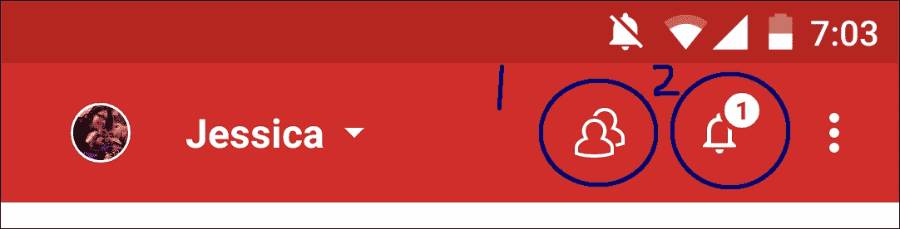

# 第一章。介绍安卓 UI

如果你拿起这本书，那是因为你想要开发人们喜欢使用的用户界面。

为安卓平台开发是一个充满激动人心的机会和头痛的挑战的混合体；设计和构建你应用程序的 UI 也是如此。

当你构建自己的 UI 时，你将面临的一些挑战非常精确且技术性强（例如创建一个能够在安卓 5.0 和安卓 5.1 上正确显示的 UI），而其他挑战则更加个人化，比如抵制使用 UI 进行疯狂和不寻常的事情的诱惑，仅仅因为你能够这样做。

这就是这本书的作用所在。

在 10 章的篇幅中，你将获得一些设计技能和所需的技术知识，以抓住所有开发安卓平台 UI 的机会并克服所有挑战。

我们将涵盖从使用计划、草图和线框到将最初的灵感转化为构建完美用户界面的逐步蓝图的设计和开发全过程，最后通过构建、测试和改进你的 UI 来实施这个计划。在这个过程中，我们将涵盖所有最新的最佳实践，包括材料设计原则以及安卓 N 中即将推出的某些新 UI 功能。

由于创建一个用户喜欢的 UI 还不够好，我们将更进一步，使用一系列工具和技术来分析和优化我们用户界面的每一个部分。到这本书结束时，你将知道如何开发一个用户会*喜爱*的 UI。

让我们从基础知识开始。

# 无论如何，什么是用户界面呢？

这可能看起来像是一个显而易见的问题。毕竟，我们每天都在与 UI 交互，无论是在我们的电脑、手机、平板电脑或其他电子设备上。但有时，最简单的问题最难回答。

用户界面的技术定义是用户与应用程序或计算机程序之间的接口。用户界面是用户可以看到并与之交互的一切，除非你正在开发一种非常特殊（或非常不寻常）的安卓应用程序，否则你开发的每个应用程序都将以某种形式拥有用户界面。

当涉及到创建你应用程序的 UI 时，安卓平台给你带来了将你的愿景变为现实的空间。只需翻阅一下你安卓设备上安装的应用程序，你可能会遇到看起来彼此非常不同的 UI。

尽管这些 UI 在表面上看起来可能不同，但它们确实有很多共同的元素，无论是那些在幕后默默工作的布局，还是可见的元素，如按钮、菜单和操作栏。

这里有一些来自不同安卓应用的 UI 示例。尽管它们各自都有独特的风格和感觉，但它们也有很多共同的 UI 元素：

Google Photos 不仅仅是一个相册，它还通过根据位置、日期和主题等因素组织照片和视频，为喜欢快拍的 Android 用户提供了享受媒体的新方式。由于照片应用希望鼓励你花时间探索和享受其照片和视频内容，因此最突出的 UI 元素是位于右下角的浮动**搜索**按钮，它允许用户根据位置和主题等因素搜索他们的媒体。

在 2014 年的 Google I/O 大会上宣布，后来出现在 Android 5.0 中，Material Design 是一种新的设计语言，它为 Google 产品（包括 Android）提供了一致的用户体验。借鉴纸张和墨水的灵感，Material Design 使用阴影、边缘、尺寸和**材料层**的概念来创造引人注目且简约的体验。

许多应用现在实现了 Material Design。这有助于提供更流畅的 UI 体验，即使在用户在由完全不同的开发者创建的应用之间切换时也是如此。上一屏显示了 Dashlane 密码管理器应用，它采用了 Material Design 主题。

在地图应用中你会发现的设计元素被精心设计，以避免干扰，这样主要内容（即地图的部分）就可以清晰地显示且不受干扰。这是一个 UI 在保持不显眼的同时，确保所有可能的 UI 元素始终容易触及的好例子。这种类型的 UI 的另一个例子是 YouTube 应用。

# 开发 Android UI 真的与其他平台有很大不同吗？

如果你有过在除 Android 以外的平台上开发的经验，那么你可能自信地认为自己可以制作出相当不错的用户界面（UI），无论是 iPhone 应用的 UI 还是注定要在最新版本的 Windows 上运行的软件。

有两个因素使得开发 Android UI 与其他你可能习惯的平台有所不同：

+   这是一个开放的平台。正如之前提到的，Android 赋予你表达自己的自由，创建你想要的任何 UI。即使是最新的 Material Design 原则也仅仅是建议，而不是你必须遵循的严格规则，如果谷歌要允许你的应用进入 Play Store（尽管强烈建议你遵循这些设计原则！）。

    这意味着你可以自由地做出一些用户会**喜爱**的创新 UI 决策，但也意味着你可以自由地做出一些用户会**讨厌**的创新设计决策（有时，你从未见过某些事情的原因可能是因为它是一个**糟糕**的想法）。自我约束是设计和发展 Android 平台有效 UI 的一个重要部分。

+   这是一个多样化的平台。当你发布 Android 应用时，你无法预测它最终会出现在哪里！你的应用可能会出现在各种不同的设备上，包括不同的硬件、软件和屏幕，包括 Android 操作系统的不同版本。

设计一个能够处理所有这些变量的 UI，你的应用就有可能给广泛的受众留下深刻印象。设计一个无法应对挑战的 UI，你的用户将会有不一致的体验，你的 UI 在某些设备上看起来很棒，功能完美，在其他设备上运行则不太完美。一个设计糟糕的 UI 甚至可能使你的应用在某些设备上看起来完全崩溃。

# 一个有效的 UI 有哪些特点？

在这本书的整个过程中，你将学习如何创建一个有效的 UI，但在我们深入探讨这个话题之前，有一个明确的目标是有帮助的。

一个成功的 Android UI 应该如下所示：

+   清晰...

+   你的 UI 是你应用与用户沟通的方式。确保你的应用想要表达的内容是清晰的！

+   如果用户不能迅速浏览你应用中的每一个屏幕并立即知道屏幕要求他们做什么，那么你的 UI 就不够清晰。

+   ....但不要太清晰！

+   用户界面怎么可能会太清晰呢？

+   想象一个需要解释每个 UI 元素的屏幕。当然，这样的 UI 会清晰，但你愿意坚持使用这样的应用吗？或者你会寻找一个替代应用，一个不是充满了不必要的、很可能还令人烦恼的文字的应用，比如**点击提交结果按钮提交你的结果**？？

+   一个有效的 UI 需要在清晰和简洁之间取得平衡。如果你设计得好的 UI，用户会立即知道你音乐播放应用中的**+**图标意味着*添加新曲目到播放列表*，而无需你在 UI 中添加额外的文字。

+   响应式

+   无论你的应用内容多么出色，如果 UI 卡顿且容易冻结，没有人会想使用它。

+   一个有效的 UI 是响应式的、流畅的，就像用户与应用之间的对话。例如，想象你刚刚下载了一个新应用，你的第一个任务是创建一个新账户。你填写表格并点击**提交**。然后，突然你被带到了应用的一个全新的部分，没有任何解释发生了什么。你刚刚创建了一个账户吗？你已经登录到你的新账户了吗？发生了什么？

+   在这种情况下，一个有效的 UI 会在你点击**提交**按钮时做出响应，即使它只是一个简单的**感谢您注册详细信息 - 您现在已登录到您的账户**弹出窗口。

+   眼睛容易接受

+   在理想的世界里，你的 UI 是否吸引人（或不吸引人）并不重要。毕竟，如果你的内容很好，按钮是否完美对齐又有什么关系？或者如果你的图片没有达到尽可能高的清晰度呢？

+   简单的事实是，这确实很重要。非常重要。

+   你的 UI 不仅要清晰、一致和响应，还要看起来很漂亮。

值得注意的是，创建一个吸引人、专业-looking 的 UI 可能意味着放弃你自己的品味，坚持安全选项。也许你非常喜欢霓虹色，一直认为橙色和绿色是一组被低估的颜色搭配，但请记住，你正在尝试吸引尽可能广泛的受众；这种美学*真的*会吸引大众吗？

# 为什么 UI 对你的应用成功至关重要？

为了完全理解掌握有效 UI 艺术的技巧为什么如此重要，让我们看看如果你的应用 UI 做得正确，它可以帮助你实现的一些事情。

## 立即熟悉感

如果你遵循最佳实践和 Material Design 指南，你的应用将反映出用户在其他 Android 应用中多次遇到过的 UI 原则。你的用户会立刻感到宾至如归，并且也会理解如何与你的应用中的许多元素进行交互，即使他们这是第一次启动应用。例如，一旦用户在一个应用中遇到了一个浮动操作按钮，他们就会知道点击这个按钮将使他们能够访问重要操作（也称为**推荐操作**）。

## 易于使用且令人愉悦

你的应用 UI 决定了用户多容易就能让应用做他们想要的事情。创建一个帮助用户快速且以最少的努力从你的应用中获得价值的 UI，你就朝着获得那些 5 星 Google Play 评论迈出了重要的一步。

虽然提供有价值的内容仍然是开发有效应用的关键部分，但请记住，你的应用 UI 同样重要。如果你的应用的有用功能和优秀内容被隐藏在一个笨拙且通常令人不快的 UI 后面，那么没有人会待足够长的时间来发现你的应用实际上能提供多少价值。

确保你在设计和开发你的 UI 上投入的努力，与你在制作应用的内容和功能上投入的努力一样多。

## 一致性

一个好的 UI 在早期就确立了应用规则，并始终如一。一旦用户感到舒适地与你的应用中的一个屏幕进行交互，他们应该能够找到他们在整个应用中的路径。

## 防止用户沮丧

你的 UI 应该确保用户永远不会因为你的应用而感到困惑或沮丧，通过温和地引导他们完成下一个任务，以便从你的应用中获得价值。

不论你的 UI 是采用微妙的方法（例如，使用大小和颜色使某些 UI 元素突出）还是更明显的方法（例如，突出用户需要完成的下一个文本字段），你应该确保用户永远不会坐下来问，“*我接下来该做什么呢？*”

## 帮助用户纠正错误

好的 UI 就像一个有帮助的、不评判的朋友，轻轻指出你做错了什么，并给你提供如何修复的建议。

想象一下，你的应用中有一个用户需要填写并在点击**提交**之前完成的表单。用户完成这个表单并点击了**提交**按钮，但什么都没有发生。在这种情况下，你的应用可以让他们挠头并怀疑是否**提交**按钮坏了，或者你的 UI 可以介入并显示他们忘记填写的一个文本字段，以告知他们出了什么问题。

## 提供更好的整体 Android 体验

因为这**并不完全是**关于你的应用。

如果你精心设计你的 UI 并遵循 Material Design 原则，你的应用将感觉像是 Android 平台的无缝扩展，也是用户在其设备上安装的其他应用的扩展。

通过在 UI 设计上投入精力，你实际上可以改善用户的整体 Android 体验。别担心，然后！

# UI 案例研究 – Google+

在为 Android 开发应用时，你永远不必从头开始，因为 Android 平台做得很好，提供了一系列预构建的 UI 组件，你可以直接将其添加到你的 UI 中。

这意味着相同的 UI 元素在所有 sorts of Android 应用中反复出现。因此，花些时间看看我们能从其他 Android 应用中学到什么是非常值得的——尤其是那些做得好的 UI 应用。

在本节中，我们将分析预装在许多 Android 设备上的 Google+应用，并且可以从 Google Play 免费下载。我们将逐步分析 Google+应用中 Google 使用的所有核心 UI 组件，并看看是什么使它们如此有效。

## 操作栏

操作栏沿着屏幕顶部运行，通常包含操作和导航元素：

Google+的操作栏包含三个重要的 UI 元素，你通常希望在自己的 Android UI 中包含这些元素。

### 导航控件

操作栏通常在整个应用中保持不变，这使得它们非常适合为用户提供一种一致且易于访问的方式来导航 UI。

导航控件可以是直接的，例如标准的**返回**按钮，也可以是更复杂的，例如视图切换控件。

主要的 Google+操作栏包含一个导航控件，使用户能够在其 Google+账户之间切换，这对于拥有多个账户的人来说很有用，例如工作 Google+账户和个人账户。

### 操作按钮

操作栏还非常适合根据用户的当前上下文提供对应用最重要的操作的便捷访问。出现在操作栏中的操作被称为**操作按钮**。

在下面的屏幕截图中，Google+操作栏包含两个操作按钮：

你通常会使用图标和/或文本来表示操作按钮。Android 提供了一系列现成的操作按钮，你应该尽可能使用它们，因为它们确保普通用户至少会熟悉你 UI 中使用的某些操作按钮。

### 操作溢出

根据应用和可用屏幕空间的不同，可能所有操作按钮都不会总是适合在操作栏中。如果情况如此，Android 系统会自动将一些操作按钮移动到操作溢出中，这是在 Google+ 应用程序整个右上角出现的点状图标：

动作按钮最终隐藏在操作溢出中的数量取决于用户的屏幕。在刻度的一端，横向模式下的平板电脑将比纵向模式下的智能手机有更多的空间用于操作栏。

当设计你的操作栏时，确保将最重要的操作按钮放置在屏幕的左侧，这样它们就不太可能出现在操作溢出中。用户不太可能需要的操作可以放置在操作栏的末尾，这样它们有更大的风险出现在操作溢出中。

虽然操作溢出确实有助于减少操作栏的杂乱，但在某些情况下，你可能希望显示大量操作，而不会让任何操作在较小屏幕上出现在操作溢出中。如果是这种情况，你可能想使用分割操作栏：

在前面的屏幕截图中，Google+ 应用程序使用分割操作栏来减少操作栏的杂乱，同时不会将任何操作降级到操作溢出。分割操作栏也有助于防止操作溢出失控并变得难以管理。

## 浮动操作按钮

Google+ 的主屏幕是主页，它恰好包含了一种作为 Google 材料设计改造一部分引入的特殊类型的操作按钮。

这被称为**浮动操作按钮**（**FAB**），它突出显示在 Google+ 主页的右下角：

如其名所示，FABs 是漂浮在主用户界面之上的圆形按钮。这些浮动按钮为你提供了一个方便的方式来突出显示当前上下文中的主要操作。

Google+ 使用其突出的浮动操作按钮来鼓励用户通过撰写状态更新加入对话。

## 菜单

菜单是导航应用程序的主要方式之一，并且是大多数 Android UI 的基本组成部分。

菜单向用户展示一系列选项，这些选项通常由一个单词或最多一行文本表示：

Google+ 有很多不同的菜单，但值得特别一提的是上下文菜单。

上下文菜单是特殊的，因为它们会动态更新，只包含与所选内容相关的操作。当您长按屏幕上的元素时，上下文菜单会出现。您可能最常遇到的上下文菜单是当您长按一些文本时出现的全选/剪切/复制/粘贴菜单：

## 设置

设置是许多 Android 应用程序的基石，因为它为用户提供了一种调整应用程序行为以更好地适应他们的方式。如果用户可以以任何方式修改您的应用程序，您将需要为他们提供某种形式的设置屏幕。

创建设置屏幕时的主要挑战是确保您的用户能够一目了然地理解所有可用选项及其当前值。这意味着以这种方式设计您的设置，即每个屏幕只包含可管理的选项数量（通常少于`10`）。

如果您想在应用程序的设置中包含大量选项，请抵制将它们显示为长列表的诱惑。相反，将它们分成相关选项的组。然后您可以将设置显示为单个屏幕，格式化为多个相关项目的列表，或者您可以借鉴 Google+的做法，将每个相关选项组移动到其自己的页面。

如果您选择后者，您的主要设置屏幕可以充当索引，将用户链接到每个子页面，这正是 Google+对其主要**设置**屏幕采取的方法：

为了便于使用，您应该优先考虑您的设置，这样用户最可能需要的选项始终位于设置屏幕的顶部易于访问。

这也可以在 Google+的设置中看到，其中一些晦涩的选项，例如**删除 Google+个人资料**，被限制在设置屏幕的底部。

## 对话框

有时，您可能需要**真正**抓住用户的注意力，而可以帮助您做到这一点的 UI 元素是对话框。

对话框是一个可以包含文本和按钮的小窗口，通常用于以下目的之一：

+   向用户提供一些重要信息，例如条款和条件，或者在他们可以进入下一个任务之前需要阅读的免责声明

+   请求额外信息，例如，提示用户输入密码的对话框

+   要求用户做出决定；例如，如果您草拟了一个 Google+更新，然后尝试在不发布该更新的情况下导航，Google+会使用对话框来检查您是否**真正**想要丢弃您的帖子

## 吐司

吐司是一个小型的弹出窗口，为用户提供简单的反馈。

与对话框不同，在吐司（toast）可见的整个时间内，位于其下的应用程序保持活跃。当您想向用户传达简短且简单的信息时，选择吐司而不是对话框，并且至关重要，您不需要任何用户输入——吐司不支持任何类型的用户输入。

在 Google+ 中，您偶尔会看到当主屏幕上有可查看的新帖子时出现的提示。此提示将提示您滑动屏幕查看更新。

## 搜索

Android 用户通常期望能够搜索应用程序中包含的所有数据，因此大多数 UI 都包含某种形式的搜索功能。

好消息是，Android 平台有一个现成的搜索框架，您可以在您的 UI 中实现。使用这个标准搜索框架不仅对您来说更容易，而且对您的用户来说也更简单，因为大多数 Android 用户都会立即知道如何与 Android 的标准搜索功能交互，因为他们之前已经多次遇到过这个底层框架（即使他们没有意识到这一点）：

您可以使用 Android 的标准搜索框架以以下方式之一实现搜索：

+   **搜索对话框**：此对话框默认隐藏。当用户激活时，它将作为当前活动顶部的浮动搜索框出现。搜索对话框组件由 Android 系统控制。

+   **搜索小部件**：这是一个可以放置在应用程序 UI 中的 `SearchView` 实例。如果您决定使用搜索小部件，您需要做一些额外的工作，以便 Android 系统处理通过此小部件发生的搜索事件。

## 输入控制

输入控制是 Android 平台提供的各种组件，用户可以与之交互。启动您设备上的任何 Android 应用程序，很可能会包含某种形式的输入控制——无论是按钮、复选框、文本字段还是其他什么。

由于您的平均 Android 用户之前已经多次遇到过这些标准输入控制，因此在您的 UI 中包含它们可以保证大多数用户会立即知道如何与至少 *一些* 您应用程序的核心 UI 元素交互。

### 注意

输入控制几乎是任何 Android UI 的关键部分，因此我们将在下一章中更详细地介绍它们。

## 样式和主题

我们已经查看了很多可以在 Google+ 应用程序中找到的不同 UI 元素，但是什么将它们联系在一起并确保您的 UI 感觉一致？

答案是样式和主题。

虽然 Android 确实赋予了您自定义 UI 中每个屏幕每个部分的视觉和感觉的能力，但您必须权衡这一点，以提供对用户来说一致的 UI 体验。主题和样式是强大的工具，可以帮助您提供整个应用程序的一致性。

样式和主题允许您定义一组属性一次，然后在您的应用程序中重复使用它们。因此，您可以创建一个样式，指定文本应为蓝色并具有等宽字体，然后您可以在整个应用程序中应用此样式。立即，所有文本都将具有相同的格式。

样式和主题可以是简单的，例如我们的文本示例，或者你可以创建一系列属性，这些属性决定了你的 UI 中每个元素的外观和感觉，从操作栏的色调到布局中使用的填充量。

虽然它们经常一起讨论，但样式和主题之间有一个关键的区别：

+   **样式**：这是一组你可以应用于整个活动或应用，或者应用于单个视图的属性

+   **主题**：这是一种你可以应用于整个活动或应用，但不能应用于单个视图的样式

Android 平台提供了大量的预定义主题和样式，你可以在你的 Android 应用中使用它们（包括一些关键的 Material 主题），或者你可以创建自己的。

虽然你可以从头开始创建主题和样式，但你通常会希望以 Android 的现成主题和样式作为起点，然后定义你想要添加、更改或删除的任何属性。这被称为**继承**，这是创建感觉熟悉且专业设计的 UI，但仍然微妙地独特于你的应用的最快和最简单的方法之一。

# 摘要

在本节中，我们探讨了为什么用户界面的质量对于创建一个能够轻松赢得广泛受众的应用至关重要，然后更详细地查看了一个有效且设计良好的 Android UI 的实际例子。

在下一章中，我们将更详细地研究每个 Android UI 的构建块：视图、ViewGroups 和布局。虽然我们在本章中提到了输入控件，但在下一章中我们将更详细地探讨它们，包括如何在你的用户界面中实现一些最常用的输入控件。
