# 第二章：有效的 UI 包含哪些内容？

在本章中，我们将查看每个 Android 用户界面的核心组件：布局和视图。您将学习如何将这些元素添加到您的 Android 项目中，以及您可以根据自己的设计需求自定义这些 UI 构建块的所有不同方式。我们还将探讨如何使用字符串、颜色资源和状态列表来增强我们的 UI，并开始探讨如何创建一个无论在哪个屏幕上显示都清晰明亮的用户界面。

虽然我们将在本章中更详细地探讨布局和视图，但这两者是内在联系的。在您向您的应用添加视图之前，您需要一个布局，而没有视图的布局不太可能赢得您的应用粉丝。

因此，在我们深入 UI 设计的细节之前，让我们先概述一下视图和布局是如何结合在一起创建有效的 Android UI 的。

# 什么是视图？

如您所知，Android 应用由 Activity 组成。通常，一次只显示一个**Activity**，并且这个 Activity 占据整个屏幕。

每个 Activity 都由视图组成，视图是用户界面的最基本组件。视图总是占据一个矩形区域，尽管视图可以显示任何形状的内容：

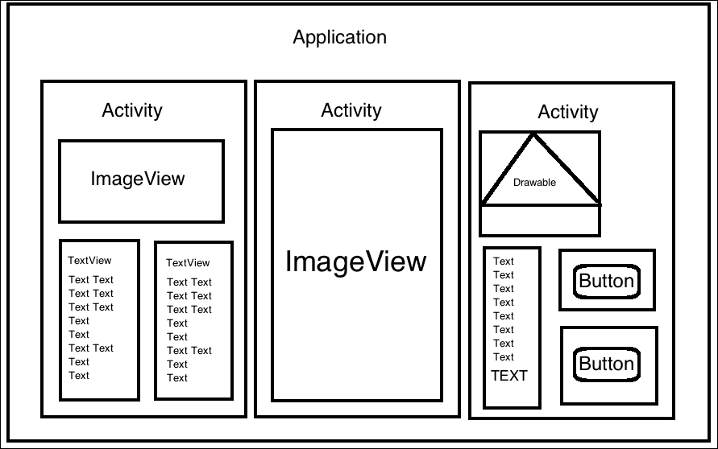

最常用的视图示例包括`TextView`、`EditText`、`ImageView`、`Button`和`ImageButton`。

# 什么是布局？

**ViewGroup**是一个容器，它将其他子视图和 ViewGroup 对象组合在一起。

ViewGroup 最常见的一个例子是布局，这是一个负责在屏幕上定位子元素的不可见容器。例如，**LinearLayout**是一个 ViewGroup（有时也称为**布局管理器**），它将子元素（视图或 ViewGroup）排列成垂直或水平行：

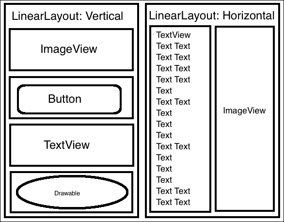

在本章中，我将主要关注布局管理器，因为这些是您通常最常使用的 ViewGroup；但请注意，也存在其他类型的 ViewGroup。

# 构建你的 UI——XML 还是 Java？

定义用户界面（以及它包含的视图、ViewGroup 和布局元素）的最简单方法是通过您项目的 XML 文件。

## 使用 XML 声明你的 UI

Android 提供了一种直接的 XML 词汇表，为您的用户界面提供了一个可读的结构，并在定义 UI 的代码和控制应用行为的代码之间创建了一个分离。您在专门的布局资源文件中定义布局。这有助于保持两组代码的整洁，并让您能够在不触及应用底层代码的情况下调整和优化您的 UI。例如，您可以在不触及先前测试的代码的情况下更新布局以支持额外的语言。

在 XML 中声明 UI 也使得提供备用布局变得更容易；例如，在某个时候，您可能希望创建一个针对横屏模式优化的布局的替代版本。如果您在 XML 中声明原始布局，提供横屏优化的布局就像创建一个`res/layout-land`目录，然后在这个文件夹中填充定义您的应用横屏优化布局的 XML 文件一样简单。

当您在 Eclipse 或 Android Studio 中创建 Android 项目时，IDE 的项目创建向导会自动为应用程序的主活动生成一个布局资源文件：

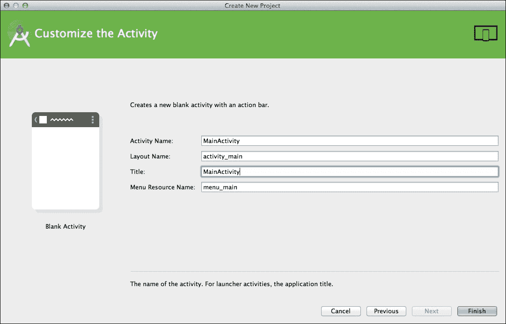

您可以在项目的`res/layout`文件夹中找到此布局资源文件：

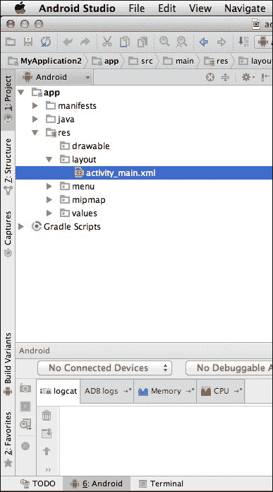

每个布局资源文件必须恰好包含一个根元素，它可以是视图或`ViewGroup`。例如，您可以使用垂直的`LinearLayout`元素作为布局的根元素：

```java
<?xml version="1.0" encoding="utf-8"?> 

<LinearLayout        android:orientation="vertical"   android:layout_width="fill_parent"   android:layout_height="fill_parent"> 

</LinearLayout> 

```

### 注意

您还可以使用`<merge>`元素作为根元素。我们将在第九章优化您的 UI 中介绍合并。

一旦您定义了布局资源文件的根元素，您就可以通过添加`TextViews`、`Buttons`和`ImageViews`等对象来构建视图层次结构。

要加载布局资源文件，您需要从应用程序的`onCreate()`回调实现中引用它。例如，打开您的项目`MainActivity.java`文件，您将看到如下内容：

```java
public void onCreate(Bundle savedInstanceState) { 
  super.onCreate(savedInstanceState); 
  setContentView(R.layout.main_layout); 
} 

```

在这里，您的项目调用`setContentView()`并将项目自动生成的资源文件的引用传递给它；在这个例子中，它是`R.layout.main_layout`。当用户加载您的应用程序时，`MainActivity`将读取这个引用的布局资源文件并向用户显示其内容。

## 以编程方式声明 UI

第二种选择是在运行时以编程方式创建 UI。这种方法通常不推荐，因为它意味着您的应用程序的底层代码和 UI 代码被混合在一起。因此，调整应用程序 UI 的元素变得比必要的要困难得多。

然而，有时您可能需要以编程方式定义用户界面的某些方面，有时甚至可能需要用 Java 定义整个界面。

正如我们已经看到的，当您在 XML 中定义布局时，您从应用程序代码中加载它：

```java
setContentView(R.layout.activity_main); 

```

这里，您正在告诉您的 Activity 加载`main_activity.xml`布局资源文件，但如果您以编程方式创建布局，则需要删除此段代码，这样您的 Activity 就不会寻找布局资源文件。

例如，看一下以下内容：

```java
@Override 
protected void onCreate(Bundle savedInstanceState) { 
super.onCreate(savedInstanceState); 

  // Create a LinearLayout object that will contain all the views in this Activity// 

    LinearLayout linearLayout = new LinearLayout(this); 

//Set the LinearLayout's orientation. In this instance, it's set to horizontal// 

  linearLayout.setOrientation(LinearLayout.HORIZONTAL); 

  // Create a LayoutParams object to be used by the LinearLayout// 

    LayoutParams linearLayoutParam = new      LayoutParams(LayoutParams.MATCH_PARENT,      LayoutParams.MATCH_PARENT); 

    // Set LinearLayout as the screen's root element// 
    setContentView(linearLayout, linearLayoutParam); 
  } 

```

## 使用编程和 XML 布局

有时候，最好的解决方案可能是同时使用编程和 XML 布局。这种方法通过在 XML 中定义大部分 UI 来帮助你保持 UI 和应用程序代码之间的分离，同时允许你在运行时通过修改一些屏幕元素的状态来创建一个更动态的用户界面。

例如，你的应用可能包含一个由单个按钮控制的幻灯片。当用户点击按钮时，会出现一张新图片。为了创建这种效果，你可以在 XML 中定义按钮，然后每当用户点击按钮时，以编程方式添加一张新图片。

由于 XML 是定义 UI 最简单和最有效的方式，因此本章主要关注在 XML 中创建和自定义视图、ViewGroups 和布局。然而，偶尔你可能需要以编程方式定义 UI 的一部分，所以在这个过程中我也会包括一些 Java 代码片段。

# 深入了解 - 探索布局

现在你已经了解了视图、ViewGroups 和布局如何结合在一起创建用户界面，以及如何以编程方式和在 XML 中创建用户界面，是时候更详细地查看 Android 最常用的 UI 组件了。我们将从基本上为任何用户界面奠定基础的那个组件开始：布局容器。

Android 平台支持一系列布局，因此你的第一个任务是决定哪种布局最能满足你的设计需求。如果你在做出这个决定时遇到困难，请记住，你可以在布局之间嵌套以创建你完美的布局容器。

### 注意

不要过度嵌套，因为这可能会对你的应用程序性能产生负面影响。如果你发现自己嵌套了多个布局，那么这可能是一个迹象，表明你正在使用错误的布局类型！

在你创建任何类型的布局之前，这里有一些规则、规定和属性，你需要掌握。

## 定义布局的大小

每当你创建一个布局时，你需要告诉 Android 系统这个布局应该有多大。

你用来定义布局大小的 XML 属性是`android:layout_height`和`android:layout_width`。正如它们的名称所暗示的，这些属性分别设置布局的高度和宽度。

两者都接受以下值：

### 一个支持的关键字

Android 屏幕有各种不同的尺寸。确保你的用户界面足够灵活，能够应对所有这些不同尺寸的屏幕的最简单方法之一是将布局的宽度和高度设置为以下支持的其中一个关键字：

+   `match_parent`：这使得高度或宽度扩展以完全填充可用的屏幕空间

+   `wrap_content`：这设置高度或宽度为适应元素内容所需的最小尺寸，且不更大

### 注意

你还可以使用`match_parent`和`wrap_content`来设置其他屏幕元素的大小，包括视图和 ViewGroups。

### 尺寸值

或者，你可以使用 Android 系统支持的测量单位之一来设置你的布局大小：

+   **密度无关像素 (dp)**：这是一个基于屏幕物理密度的抽象单位。dp 单位相对于 160 点每英寸屏幕上的 1 个物理像素。在运行时，Android 会根据当前屏幕的 dp 自动调整绘制 1 dp 所使用的像素数。使用密度无关的测量是创建能够自动适应不同屏幕大小的 UI 的简单解决方案。

+   **绝对单位**：Android 支持多种绝对测量单位（特别是像素、毫米和英寸），但你应避免使用绝对大小来定义你的布局，因为这会使你的 UI 非常僵硬，并可能阻止它根据不同屏幕大小进行缩放。除非你有 *非常好的理由* 不这样做，否则请坚持使用相对测量，如 dp、`match_parent` 和 `wrap_content`。

### 程序化设置布局大小

你也可以通过创建 `LayoutParams` 对象来程序化地设置布局的大小：

```java
LayoutParams linearLayoutParam = new LayoutParams 

```

你可以按照以下方式设置其宽度和高度：

```java
LayoutParams linearLayoutParam = new LayoutParams (LayoutParams.MATCH_PARENT, LayoutParams.MATCH_PARENT); 

```

# 探索不同的布局

现在你已经知道了如何在 XML 和 Java 中创建布局，以及如何设置它们的高度和宽度，你可以更深入地了解两种最常用的布局：简单易用的 `LinearLayout` 布局和极其灵活的 `RelativeLayout` 布局。

## 关于 LinearLayout 你需要知道的一切

`LinearLayout` 将其所有子元素对齐在单个水平或垂直行中，一个接一个地堆叠。

你可以使用以下任一方式设置你的 `LinearLayout` 布局的朝向：

+   `android:orientation="horizontal."`: 视图被放置在彼此旁边的 *行* 中。水平 `LinearLayout` 布局始终只有一行高。

+   `android:orientation="vertical."`: 视图被放置在彼此下面的 *列* 中。垂直 `LinearLayout` 布局始终每行只有一个子元素。

下面是一个具有水平方向的简单 `LinearLayout` 布局：

```java
<LinearLayout  

  android:orientation="horizontal" 
  android:layout_width="match_parent" 
  android:layout_height="match_parent"> 
  <Button 
      android:id="@+id/okButton" 
      android:text="Ok" 
      android:layout_width="wrap_content" 
      android:layout_height="wrap_content" /> 
  <Button 
      android:id="@+id/cancelButton" 
      android:text="Cancel" 
      android:layout_width="wrap_content" 
      android:layout_height="wrap_content" /> 

</LinearLayout> 

```

这就是这种水平 `LinearLayout` 布局在 Android 设备上的显示方式：

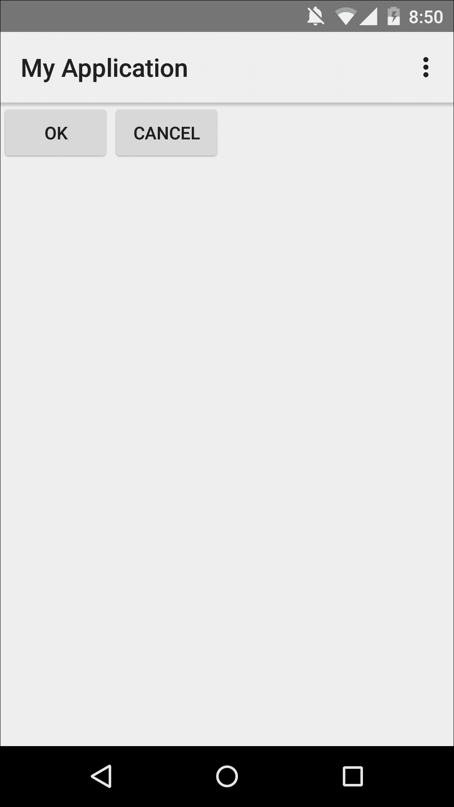

下面是具有 `android:orientation="vertical"` 朝向的相同 `LinearLayout` 基础 UI：

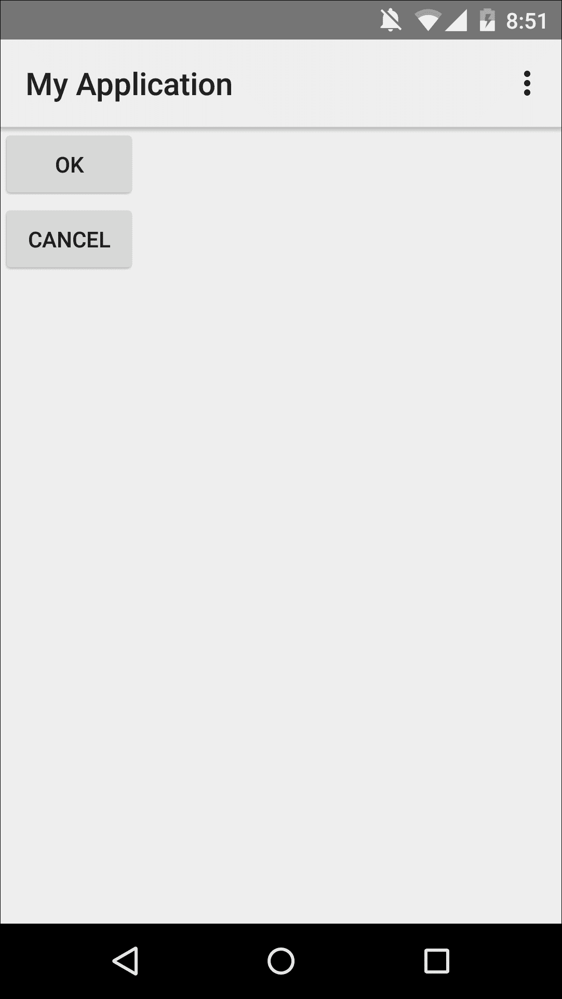

## 关于 RelativeLayout 你需要知道的一切

`RelativeLayout` 是你可用布局中最灵活的一种，它让你可以根据每个子元素与其任何其他子元素的关系，以及与其父容器的关系来定位每个子元素。

例如，你可以灵活地定位 `TextView` 以使其与 `RelativeLayout` 容器的边缘对齐，然后你可以将一个 `Button` 放置在 `TextView` 上方 100 密度无关像素的位置。

### 小贴士

**使用 RelativeLayout 优化你的 UI**

除了让您控制每个元素在屏幕上的位置外，`RelativeLayout`还可以通过减少嵌套来提高您应用程序的整体性能。如果您发现自己正在使用多个嵌套的`LinearLayout`，您可能可以通过用单个`RelativeLayout`替换它们来简化布局层次结构。

由于`RelativeLayout`主要是关于给您提供灵活性，以便将 UI 元素定位到您想要的位置，因此它支持一系列属性，这些属性允许您将 UI 元素相对于其父容器和彼此进行定位，这并不令人惊讶。 

### 相对于父容器

所有以下属性都接受`true`值；例如，`android:layout_alignParentTop="true"`和`android:layout_alignParentStart="true."`:

+   `android:layout_alignParentTop`: 这会将视图的顶部与其父视图的顶部对齐

+   `android:layout_alignParentBottom`: 这会将视图的底部与其父视图的底部对齐

+   `android:layout_centerInParent`: 这将在父视图内水平和垂直居中视图

+   `android:layout_alignParentRight`: 这会将视图的右侧与其父视图的右侧对齐

+   `android:layout_alignParentLeft`: 这会将视图的左侧与其父视图的左侧对齐

+   `android:layout_centerHorizontal`: 这将在父视图内水平居中视图

+   `android:layout_centerVertical`: 这将在父视图内垂直居中视图

+   `android:layout_alignParentStart`: 这会将视图的起始边缘与其父视图的起始边缘对齐

+   `android:layout_alignParentEnd`: 这会将视图的末端与其父视图的末端对齐

+   `android:layout_alignWithParentIfMissing`: 如果视图引用了一个缺失的元素，则此属性将使视图与父视图对齐

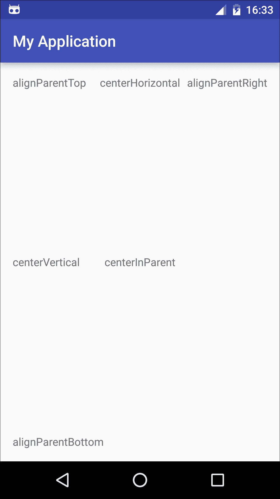

### 相对于其他元素

您还可以将 UI 元素相对于屏幕上的其他元素进行定位；例如，您可能希望将`back_button`视图放置在`forward_button`的左侧，并将`titleTextBox`放置在`subheadingTextBox`上方。

所有以下属性都应该引用您用作参考点的元素的 ID（我们将在稍后更详细地介绍 ID，但基本上，视图的 ID 是您布局资源文件中`android:id`元素的值，例如，`android:id="@+id/viewName"`的 ID 是`viewName`）:

+   `android:layout_above`: 这会将视图放置在指定的元素上方；例如，`android:layout_above="@+id/subheadingTextBox"`将 UI 元素放置在`subheadingTextBox`上方

+   `android:layout_below`: 这会将视图放置在指定的元素下方

+   `android:layout_toLeftOf`: 这会将视图放置在指定元素的左侧

+   `android:layout_toRightOf`: 这会将视图放置在指定的元素右侧

+   `android:layout_toStartOf`: 这会将视图的末端与指定元素的起始边缘对齐

+   `android:layout_toEndOf`: 这会将视图的起始边缘与指定元素的结束边缘对齐

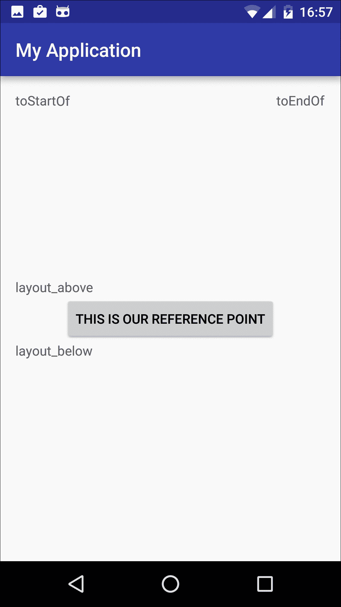

### 与其他元素对齐

您还可以通过指定 UI 元素如何与其他屏幕元素对齐来定位 UI 元素。同样，以下所有属性的值都是您用作参考点的元素的 ID：

+   `android:layout_alignBottom`: 这会将视图元素的底部与指定屏幕元素的底部对齐。例如，`android:layout_alignBottom="@+id/back_button"`会将 UI 元素的底部与`back_button`的底部对齐。

+   `android:layout_alignLeft`: 这会将视图的左侧边缘与指定元素的左侧边缘对齐。

+   `android:layout_alignRight`: 这会将视图的右侧边缘与指定元素的右侧边缘对齐。

+   `android:layout_alignTop`: 这会将视图的顶部边缘与指定元素的顶部边缘对齐。

+   `android:layout_alignStart`: 这会将视图的起始边缘与指定元素的起始边缘对齐。

+   `android:layout_alignBaseline`: 此属性略有不同。**基线**是排版术语，指的是文本所在的无形线。因此，此属性将视图的基线与指定元素的基线对齐。例如，如果您有两个`TextView`，您可能想使用`alignBaseline`来产生这样的印象，即两个视图中的文本都写在同一无形线上。

# 创建视图

视图是用户界面的基本构建块。

大多数情况下，您将通过将它们添加到您的 Activity 对应的布局资源文件中来创建视图对象。您可以直接编辑 XML 代码，或者您可能想从您的 IDE 调色板中拖动 UI 元素并将它们拖放到 UI 预览中：

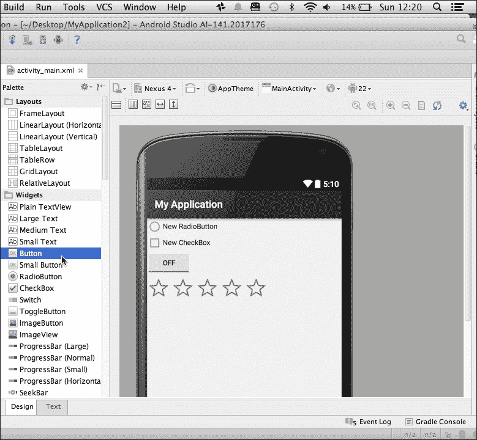

您还可以通过编程方式创建视图。例如，如果您想通过编程方式实例化一个`TextView`，您可以将`TextView`添加到您的 Activity 的`onCreate()`方法中：

```java
   @Override    protected void onCreate(Bundle savedInstanceState) {        super.onCreate(savedInstanceState);        setContentView(R.layout.activity_main);  
       LinearLayout linearlayoutLayout =            (LinearLayout) findViewById(R.id.rootlayout);  
//Create a new TextView and assign it the ID txview// 
       TextView txView = new TextView(this); 

//Set the text programmatically// 

       txView.setText("Hello World"); 

//Add the txView TextView object to your layout// 

       linearLayout.addView(txView); 
   } 
} 

```

## 分配 ID 属性

ID 为您在布局中识别单个视图提供了一种方式。例如，如果您创建了两个按钮，您可以通过分配它们 ID `yesButton`和`noButton`来区分它们。

您可以使用`android:id`属性为视图分配一个 ID：

```java
<Button android:id="@+id/backButton" 

```

然后，您可以使用 ID 来引用这个特定的视图：

```java
android:layout_below="@id/backButton" 

```

您还可以使用 ID 通过`findViewById(id)`编程方式定位视图：

```java
findViewById(R.id.myButton) 

```

一旦此方法返回所需的视图，您就可以通过编程方式与视图交互。

## 设置视图的大小

与您需要设置布局容器的大小一样，您还需要设置添加到布局资源文件中的所有视图的大小。

好消息是，您可以使用完全相同的属性和值，这意味着您可以将`android:layout_width`和`android:layout_height`添加到您的布局资源文件中，然后从以下值中选择：

+   **wrap_content**: 这将视图的高度或宽度设置为容纳视图内容所需的最小尺寸。例如，如果您将 `wrap_content` 应用到包含文本标签的按钮上，系统将调整按钮的大小，使其**刚好**足够容纳按钮的文本标签。

+   **match_parent**: 这将视图的高度或宽度扩展以填充所有可用空间。

+   **密度无关像素（dp）:** 当您分配一个 dp 测量值时，Android 系统会根据用户屏幕的具体密度来放大或缩小视图。

+   **绝对单位**：尽管不推荐这样做，但您也可以使用绝对单位进行测量：像素、毫米或英寸。

## Android 重力布局和布局重力

重力属性指定对象在其封装对象内沿 *X* 和 *Y* 轴应该如何定位。这听起来可能很简单，但有一个问题：您将在 Android 中遇到两个不同的重力属性。尽管它们看起来很相似，但它们实际上可以产生非常不同的结果：

+   `android:gravity`: 这将定位视图内的内容，例如，`TextView` 内的文本。

+   `android:layout_gravity`: 这将子视图定位在其父容器内，例如，一个 `TextView` 在 `LinearLayout` 内。

两者都接受广泛的值，包括几个不会改变应用重力属性的物体大小的值：

+   `top`: 这会将对象定位在其父容器的顶部。例如，`android:gravity="top"` 将将文本定位在 `TextView` 的顶部，而 `android:layout_gravity="top"` 将将 `TextView` 定位在 `LinearLayout` 的顶部。

+   `Left`: 这将对象定位在其父容器的左侧。

+   `center_vertical`: 这会将对象定位在其父容器垂直中心。

+   `Start`: 这将对象定位在其父容器的开始处。

两个 `gravity` 属性也支持几个会改变对象大小的值，包括以下内容：

+   `fill_vertical`: 这将对象垂直扩展，使其完全填充其父容器。例如，`android:gravity="fill_vertical"` 将将图像垂直扩展以填充其 `ImageView` 容器，而 `android:layout_gravity="fill_vertical"` 将将 `ImageView` 垂直扩展以填充其 `RelativeLayout` 容器。

+   `fill_horizontal`: 这将对象水平和垂直扩展，使其完全填充其父容器。

对于支持的完整值列表，请参阅 [`developer.android.com/reference/android/widget/LinearLayout.html#attr_android:gravity`](http://developer.android.com/reference/android/widget/LinearLayout.html#attr_android:gravity)。

您可以使用 `setGravity` 属性编程式地分配重力，例如，`Gravity.CENTER_HORIZONTAL`。您还可以使用 `setHorizontalGravity` 和 `setVerticalGravity`。

## 设置背景 – 与颜色一起工作

当涉及到背景时，一些视图具有完全透明的背景，例如`TextViews`，而其他视图则具有标准的背景颜色，例如按钮，默认为灰色。

如果您不喜欢视图的默认背景，您总是可以更改它。Android 为您提供了多种选项，以在您的 UI 中添加一抹色彩。

首先，Android 系统确实支持一些开箱即用的颜色，所以如果您想使用以下任何一种色调，那么您很幸运，因为 Android 系统已经为您做了所有艰苦的工作：

+   `black`

+   `white`

+   `holo_blue_bright`

+   `holo_blue_dark`

+   `holo_blue_light`

+   `holo_green_dark`

+   `holo_green_light`

+   `holo_orange_light`

+   `holo_orange_dark`

+   `holo_purple`

+   `holo_red_dark`

+   `holo_red_light`

+   `darker_gray`

要将任何这些现成的颜色资源应用到视图中，请添加`android:background`属性，但将其值设置为`"@android:/color"`后跟您选择的颜色：

```java
android:background="@android:color/holo_red_light"  

```

### 注意

Android 还支持`primary_text_dark`和`widget_edittext_dark`等特定 UI 元素的值。您可以在官方 Android 文档中找到预定义颜色的完整列表，网址为[`developer.android.com/reference/android/R.color.html`](http://developer.android.com/reference/android/R.color.html)。

然而，这个列表相当有限！迟早 Android 的预定义颜色将不再适用，您将需要创建自己的颜色资源，这意味着使用十六进制代码。

如果您有一个特定的色调在心中，您通常可以通过快速谷歌搜索找到它的十六进制代码，例如，通过搜索`青色十六进制代码`或`浅粉色十六进制代码`。或者，您可以通过浏览 Android 风格指南来进行“橱窗购物”，该指南包含广泛的颜色及其相应的十六进制代码。这可在[`www.google.com/design/spec/style/color.html#color-color-palette`](https://www.google.com/design/spec/style/color.html#color-color-palette)找到。

一旦您有了十六进制代码，您可以直接将代码输入到您的布局资源文件中：

```java
android:background="#0000ff" 

```

这可能*看起来*很快，但长期来看，这可能会让您花费更多的时间。由于一致性是提供良好用户体验的重要组成部分，您可能会在应用程序的多个地方多次使用相同的颜色，每次使用该颜色时都输入整个十六进制代码可能会真正增加工作量。

虽然这可能需要一些初始的努力，但大多数时候，在项目的`res/values/colors.xml`文件中定义颜色资源是有意义的。然后您可以多次引用这些颜色资源，而无需输入整个十六进制代码。

如果您的项目不包含`colors.xml`文件，您可以通过在项目的`values`文件夹上右键单击，选择**新建**，然后选择**值资源文件**来创建一个。将您的文件命名为`colors.xml`：

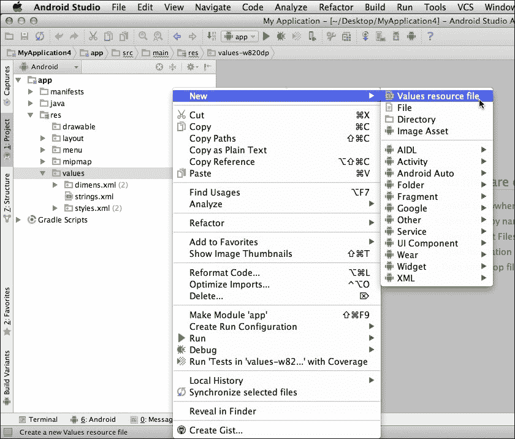

打开`colors.xml`文件，并使用以下格式定义你想要在应用中使用的所有颜色：

```java
<?xml version="1.0" encoding="utf-8"?> 
<resources> 
  <color name="cyan">#00FFFF</color> 
</resources> 

```

然后，你可以在你的应用中的任何地方使用这个颜色资源，包括在你的视图的背景中：

```java
android:background="@color/cyan" 

```

你还可以通过在你的布局容器中添加`android:background`属性来更改你整个 UI 的背景，如下所示：

```java
<LinearLayout  
  android:orientation="vertical" 
  android:layout_width="match_parent" 
  android:layout_height="match_parent" 
  android:background="@color/cyan" /> 

```

或者，你也可以使用图像作为视图的背景，无论是简单的纹理背景图像还是高清晰度的照片。当我们在查看`ImageViews`时，我们将更详细地介绍图像，但作为一个快速概述，你只需要将图像添加到你的项目`res/drawable`文件夹中，然后在你的布局文件中引用该图像：

```java
android:background="@drawable/imagename" 

```

如果你想要以编程方式设置你应用的背景，请使用`setBackgroundResource`方法。

## 分配权重值

当你在`LinearLayout`内部定位视图时，你可以通过为其分配一个权重值来控制每个视图在屏幕上占据的空间大小。

当你为你的视图分配权重值时，布局中剩余的空间将按其声明的权重比例分配给你的视图。例如，假设你的布局包含三个具有不同权重值的按钮：

```java
<LinearLayout  
      android:layout_width="match_parent" 
  android:layout_height="match_parent" 
  tools:context=".MainActivity"> 

  <Button 
      android:layout_width="wrap_content" 
      android:layout_height="wrap_content" 
      android:text="A" 
      android:id="@+id/button1" 
      android:layout_weight="1"/> 

  <Button 
      android:layout_width="wrap_content" 
      android:layout_height="wrap_content" 
      android:text="B" 
      android:id="@+id/button2" 
      android:layout_weight="1"/> 

  <Button 
      android:layout_width="wrap_content" 
      android:layout_height="wrap_content" 
      android:text="C" 
      android:id="@+id/button3" 
      android:layout_weight="2"/> 

</LinearLayout> 

```

`Button3`声明它比`Button1`和`Button2`更重要，因此它将被分配剩余空间的一半，而`Button1`和`Button2`必须平均分配剩余的可供空间：

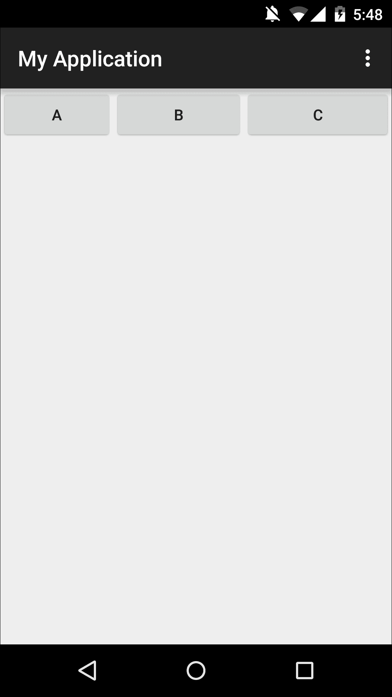

只要注意，其他属性可能与你的`layout_weight`值交互。例如，假设你的布局包含三个`TextViews`，并且它们都被设置为`android:layout_width="wrap content"`。在这种情况下，Android 系统会计算每个`TextView`需要多宽才能容纳它们的文本，然后才会分配剩余的空间。所以，如果一个`TextView`需要容纳比其他两个`TextView`更多的文本，这将影响你的权重结果。

### 注意

所有视图都有一个默认的权重值为 0，除非你指定了其他值。

# 添加和自定义视图对象

向你的布局添加视图对象的最简单方法是使用项目`res/layout`文件夹中的布局资源文件，尽管你也可以根据需要以编程方式添加视图。

在接下来的几节中，我将向你展示如何创建 Android 中最常用的视图之一，特别是`TextViews`、`EditText`、`ImageViews`、`Buttons`和`ImageButtons`。一旦创建了每个视图，我将向你展示如何配置该视图，使其看起来和功能与你期望的完全一致。

## TextView

这可能不是你用户界面中最令人兴奋的部分，但绝大多数 Android 应用都包含某种文本。你通过`TextView`向用户显示文本。

要创建`TextView`，将`<TextView>`标签添加到您项目的布局资源文件中，然后告诉`TextView`它应该显示什么文本，可以通过以下方式：

+   **直接将文本添加到布局中**：这很简单。只需将`android:text`属性和您的文本添加到`TextView` XML 代码中，例如，`android:text="Hello world!"`。

+   **引用字符串资源**：大多数情况下，如果您的应用程序需要显示文本，那么这些文本属于您的项目资源，而不是您的实际应用程序代码。这种分离有助于保持您的应用程序代码干净和可读，并且这也意味着您可以在任何时间点调整和更改应用程序的文本，而无需触及应用程序的底层代码。要创建字符串资源，打开您的项目`res/values/strings.xml`文件，并按以下格式添加您的文本：

```java
<resources> 
    <string name="helloWorld">Hello world!</string> 
</resources> 

```

然后，您可以从您的布局文件中引用这个字符串资源：

```java
<TextView 
  android:layout_width="wrap_content" 
  android:layout_height="wrap_content" 
  android:text="@string/helloWorld" 
  android:id="@+id/textView" /> 

```

这就是您需要知道的所有内容，以便显示基本文本，有时这也许就足够了。然而，文本确实有可能显得有点枯燥和无聊！如果您想创建更具视觉吸引力的文本，您有几种选择。

### 使文本更加明亮

您可以使用`android:textColor`属性来更改`TextView`内文本的颜色。要引用 Android 系统支持的默认颜色之一，请使用以下格式：

```java
android:textColor="@android:color/"holo_green_dark" 

```

如果您正在引用您在项目`res/values/colors.xml`文件中定义的颜色，其值布局略有不同：

```java
android:textColor="@color/mycustomcolor" 

```

如果您想以编程方式设置`TextView`的颜色，请使用`setTextColor()`方法。

### 设置文本大小

您可以使用`android:textSize`来增大或减小文本。

再次提醒您，Android 屏幕有各种不同的尺寸，并且无论在哪个屏幕上显示，您的文本都需要易于阅读。

要进一步复杂化问题，Android 用户实际上可以通过打开他们的设备**设置**，点击**显示**，并选择**字体大小**来更改显示在他们的设备上的字体大小。这对于有视力问题的人来说是一个非常实用的功能。

确保您的文本足够灵活，能够适应用户的字体偏好和屏幕大小，最简单的方法是使用无缩放像素（`sp`）单位：

```java
android:textSize="30sp" 

```

Android 还支持三种相对字体大小样式，您可能想在您的应用程序中使用：

+   `TextAppearance.Small`，例如`style="@android:style/TextAppearance.Small."`

+   `TextAppearance.Medium`

+   `TextAppearance.Large`

### 强调您的文本

您可以使用`android:textStyle`属性为您的文本添加粗体或斜体强调。可能的值是正常、粗体、斜体，或者您可以通过管道字符（`android:textStyle="bold|italic"`）将两个值分开来组合粗体和斜体：

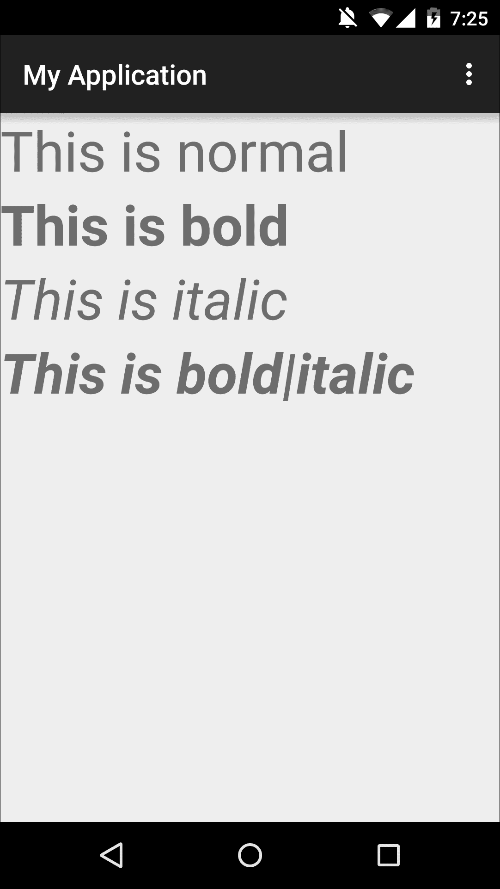

### 设置字体样式

默认情况下，Android 应用正常字体到您的文本，但系统也支持 `sans`、`monospace` 和 `serif` 字体，您可以使用 `android:typeface` 设置这些字体：

```java
android:typeface="monospace" 

```

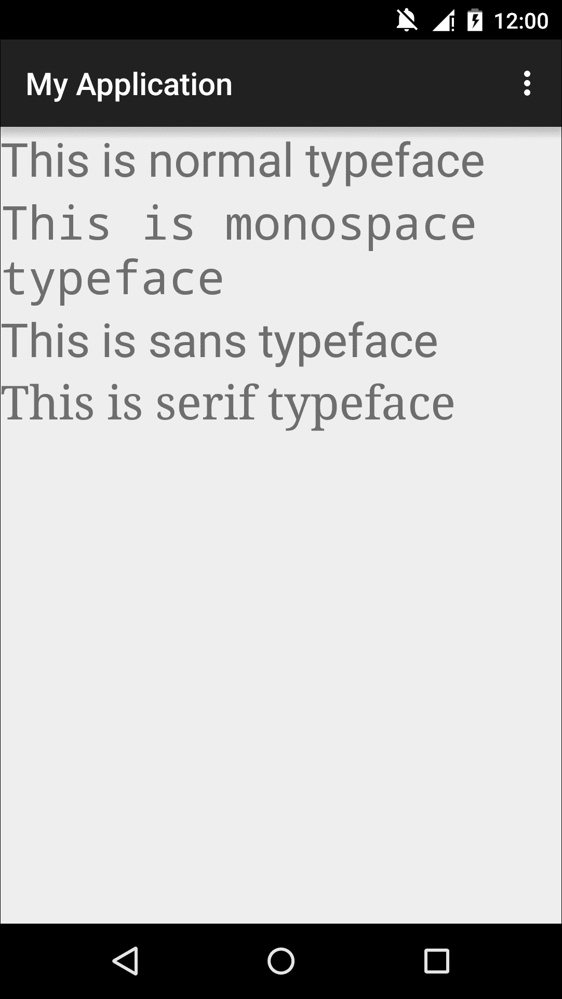

要程序化设置字体，您需要使用 `setTypeFace` 方法。

### 有多少行？

默认情况下，您的 `TextView` 的内容将根据需要显示的文本量自动换行。如果您想对 `TextView` 的显示范围有更多控制，您有以下几种选择：

+   `android:lines`：这使得 `TextView` 精确为 *X* 行高，例如，`android:lines="2"`

+   `android:minLines`：至少，`TextView` 将有这么多行高

+   `android:maxLines`：这限制 `TextView` 的高度为这么多行

# EditText

虽然 `TextViews` 在显示文本方面很出色，但如果您希望用户能够输入文本，您应该使用 `EditText`。

`EditText` 在实际应用中最常见的例子之一是请求用户数据的表单。在这个例子中，每个输入字段都是一个单独的 `EditText`：

```java
<LinearLayout  

  android:layout_width="match_parent" 
  android:layout_height="match_parent" 
  android:orientation="vertical" 
tools:context=".MainActivity"> 

  <TextView 
      android:layout_width="match_parent" 
      android:layout_height="wrap_content" 
      android:text="Please complete this form:" 
      android:textSize="20sp" 
      android:id="@+id/TextView" /> 

  <EditText 
      android:layout_width="match_parent" 
      android:layout_height="wrap_content" 
      android:inputType="textPersonName" 
      android:hint="Name" 
      android:id="@+id/editText" /> 

  <EditText 
      android:layout_width="match_parent" 
      android:layout_height="wrap_content" 
      android:inputType="textEmailAddress" 
      android:hint="Email address" 
      android:id="@+id/editText2" /> 

  <EditText 
      android:layout_width="match_parent" 
      android:layout_height="wrap_content" 
      android:inputType="textPostalAddress" 
      android:hint="Postal address" 
      android:id="@+id/editText3" /> 

  <EditText 
      android:layout_width="match_parent" 
      android:layout_height="wrap_content" 
      android:inputType="textPassword" 
      android:hint="Password" 
      android:id="@+id/editText4" 
      android:layout_gravity="center_horizontal" /> 

  <Button 
      android:layout_width="wrap_content" 
      android:layout_height="wrap_content" 
      android:text="Sign up" 
      android:id="@+id/button" /> 
</LinearLayout> 

```

下面是这种简单表单在用户设备上的样子：

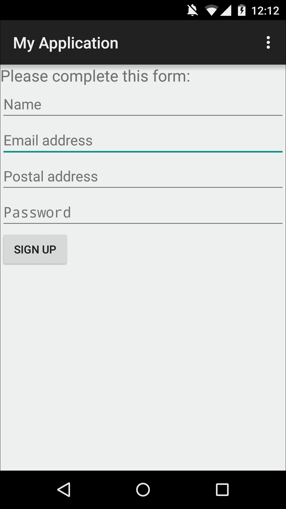

由于 `EditText` 类是从 `TextView` 类派生出来的，因此许多 `TextView` 属性也适用于 `EditText`，包括 `textColor`、`textSize`、`textStyle` 和 `typeface`。但是，`EditText` 也支持一系列特定于 `EditText` 类的 XML 属性。

## 控制键盘行为 - 设置输入类型

默认情况下，当用户点击 `EditText` 字段时，将出现标准键盘，他们可以输入他们喜欢的任何字符。但是，您可能希望使用 `android:inputType` 属性限制用户可以输入到您的 `EditText` 字段中的数据类型。

这种限制可以防止用户输入无效数据，但某些 `inputType` 值也会提示 Android 系统针对特定类型的内容优化虚拟键盘。例如，如果您指定 `EditText` 的 `inputType` 值为电话号码 (`android:inputType="phone"`)，Android 系统将显示数字键盘，这使得用户输入所需数据变得更容易。

一些 `inputType` 值也会触发键盘的其他有用行为；例如，如果您将 `inputType` 设置为 `textCapWords`，键盘将自动将每个新单词的首字母大写。当您要求用户输入应始终大写的数据时，这很有用，例如他们的名字或地址。

下面是您可以使用的不同 `inputType` 值：

+   `text`：这显示标准文本键盘

+   `textEmailAddress`：这显示带有 `@` 字符的标准文本键盘

+   `textUri`：这显示带有 `/` 字符的标准文本键盘

+   `number`：这显示基本的数字键盘

+   `phone`：这显示电话风格的键盘

所有以下值都显示标准文本键盘，但修改其他键盘行为：

+   `textCapSentences`: 这会自动将每个新句子的第一个字母大写。

+   `textCapWords`: 这会自动将每个单词的首字母大写。

+   `textAutoCorrect`: 这会自动纠正常见的拼写错误。

+   `textPassword`: 这通过将每个输入的字符转换为点来隐藏用户的密码。这是你在 Android 设备上输入密码时通常遇到的行为。创建此隐藏效果的另一种方法是使用 XML 属性`android:password="true."`。

+   `textMultiLine`: 默认情况下，`EditText`字段被限制为单行。此属性允许用户输入多行文本。

你也可以使用管道字符组合多个值。例如，如果你要求用户创建一个密码，你可以自动将每个新单词的首字母大写，同时隐藏他们的输入：

```java
android:inputType="textCapWords| textPassword" 

```

要以编程方式指定键盘行为，请使用`setRawInputType`方法。

### 注意

当我们谈论控制用户输入时，你可以使用`android:digits` (`android:digits="12345."`)来限制用户可以输入到`EditText`中的数字。

## android:imeOptions

一旦用户在`EditText`字段中输入了信息，他们通常会通过点击键盘上通常的回车键替代的操作键来确认他们的输入。

如果你没有指定系统应显示哪个操作键，Android 系统默认为以下：

+   `actionNext`: 如果至少有一个可聚焦字段可以移动到，系统将显示**下一步**操作键。

+   `actionDone`: 如果没有后续的可聚焦字段，系统将显示**完成**键。在我们的`form`示例中，**完成**键会在用户完成最后的`EditText`字段后出现。

有时，你可能想覆盖此默认行为并指定键盘应显示哪个操作键。你可以使用`android:imeOptions`属性和以下值之一来完成此操作：

+   `actionGo`: 这将显示**前往**键(`android:imeOptions="actionGo")`)

+   `actionNext`: 这将显示**下一个**键

+   `actionDone`: 这将显示**完成**键

+   `actionSearch`: 这将显示**搜索**键

+   `actionSend`: 这将显示**发送**键

## 提供用户提示

尽管`EditTexts`旨在收集用户输入，但你可能希望通过在`EditText`字段中显示临时、灰色文本来提示用户进行特定输入。这些提示在用户不清楚应输入什么信息时非常有用。

你可以使用`android:hint`属性来显示提示信息：

+   直接将提示信息输入到你的布局资源文件中(`android:hint="请输入您的密码"`)

+   创建并引用一个字符串资源(`android:hint="@string/messageHint."`)

# ImageView

图片是向用户传达信息的一种便捷方式，无需强迫他们阅读大量屏幕上的文本。尽管您可以在应用中的许多不同区域添加图片（例如布局的背景和屏幕元素如按钮的背景），但 Android SDK 提供了一个专门的视图来显示图片，称为`ImageView`。

我们已经讨论了如何使用密度无关和其他相对单位来创建可以在不同屏幕上正确显示的用户界面。然而，确保您的图片在不同屏幕尺寸上看起来清晰并不那么简单。

这使得`ImageView`成为更复杂的视图之一，但由于图片是大多数 Android UI 的核心部分，因此花时间正确掌握 Android 的`ImageView`是非常值得的。

在本节中，我将向您展示如何将**可绘制物**添加到您的 UI 中，以及您应采取的步骤以确保这些图片在所有可能的屏幕尺寸范围内正确显示。

### 注意

可绘制物仅意味着“可以在屏幕上绘制的东西”，通常用来描述您应用的图形内容。

## 支持多屏幕

让我们先解决一些棘手的问题：如何创建可以在广泛不同屏幕上正确显示的图片。

虽然 Android 系统会自动缩放您的内文以适应当前的屏幕配置，但您不应依赖系统为您完成所有繁重的工作，*尤其是*当涉及到`ImageView`时，因为这可能导致模糊或像素化的图片。

为了提供最佳的用户体验，您需要为应用中使用的所有图片提供备用版本。这些版本应针对不同的屏幕密度进行优化。

好消息是，您不必为所有可想象的屏幕密度提供图片，因为 Android 系统将所有可能的屏幕密度分组到通用的密度范围内。只要您为每个密度范围提供版本，Android 系统就会选择最适合当前屏幕配置的版本。

Android 支持五种主要的通用屏幕密度：

+   **低分辨率**: `ldpi 120dpi`

+   **中等分辨率**: `mdpi 60dpi`

+   **高分辨率**: `hdpi 240dpi`

+   **超高分辨率**: `xhdpi 320dpi`

+   **超超高分辨率**: `xxhdpi 480dpi`

### 注意

Android 实际上支持第六种屏幕密度：超超超高分辨率，也称为`xxxhdpi`。这个`640dpi`的密度范围与其他的不同，因为它*仅*适用于您应用程序的启动器图标。一些设备，如平板电脑，可能在启动器中显示超大型应用图标。为了确保您的应用图标在具有`xxxhdpi`显示的大屏幕上不会看起来模糊，您应该提供您应用图标的超超超高密度版本。您不需要为任何其他 UI 元素提供`xxxhdi`版本。

### 支持不同的屏幕密度

那么，你是如何让 Android 知道哪个图像是针对`hdpi`显示屏优化的，哪个图像是针对`xhdpi`显示屏优化的呢？答案是创建带有`ldpi`、`mdpi`、`hdpi`、`xhdpi`、`xxhdpi`和`xxxhdpi`限定符的目录。Android 会识别这些目录包含针对特定屏幕密度的资源，然后根据当前的屏幕配置从适当的目录中选择图像。

当你在 Eclipse 或 Android Studio 中创建 Android 项目时，项目通常只包含默认的`res/drawable`目录，因此你需要手动创建以下目录：

+   `drawable-ldpi`

+   `drawable-mdpi`

+   `drawable-hdpi`

+   `drawable-xhdpi`

+   `drawable- xxhdp`

+   `drawable-xxxhdpi`

记住，这个目录应该只包含应用启动器的额外额外额外高密度版本。

要创建这些密度特定的目录，执行以下步骤：

1.  右键点击你的项目`res`文件夹，选择**新建**，然后选择**Android 资源目录**。

1.  在出现的窗口中，打开**资源类型**下拉菜单，选择**Drawable**。

1.  在**可用限定符**部分，将**密度**添加为**选择的限定符**。

1.  打开**密度**下拉菜单，从列表中选择所需的密度，例如，如果你正在创建`drawable-ldpi`目录，则选择**低密度**；如果你正在创建`drawable-xxxhdpi`目录，则选择**XXX-高密度**。你会注意到，当你选择密度时，**目录名称**会自动更新：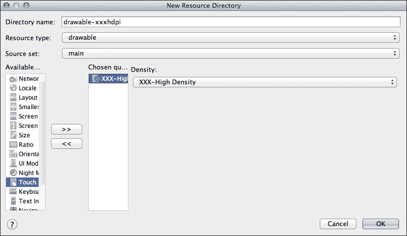

1.  当你对输入的信息满意时，点击**确定**。然后你的 IDE 将创建新的目录。

1.  重复！你通常希望为每个通用的屏幕密度创建一个目录。

如果你正在使用 Android Studio 中的项目，有时你可能创建了所有密度特定的目录，然后意识到它们在 Android Studio 的**项目**视图中都没有出现。如果发生这种情况，问题可能在于你选择了**Android**视图而不是**项目**视图。要切换视图，请点击 Android Studio 的**项目**视图中的**Android**标签，然后从下拉菜单中选择**项目**：

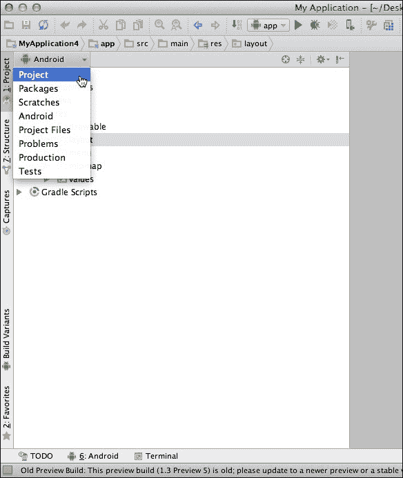

你会注意到你的项目结构已经改变。打开`app/src/main/res`文件夹，你会看到你之前创建的所有密度特定的目录。

#### 创建密度特定图像

现在你已经更新了项目结构，是时候实际创建那些优化图像并将它们添加到你的项目中。

Android 支持多种不同的图像类型，但通常你会使用以下之一：

+   **位图**：Android 支持三种格式的位图文件：`.png`（首选），`.jpg`（可接受），或者如果你真的**必须**，`.gif`（不推荐）。

+   **Nine-patch 文件**：这是一个`.png`文件，但有所不同！Nine-patch 文件允许你定义可拉伸的区域，这有助于你的图像更平滑地调整大小。我们将在后面的章节中更详细地探讨 nine-patch 图像。

创建替代位图和 nine-patch 文件的关键是遵守 3:4:6:8:12:16 的缩放比例。例如，如果你有一个 68 x 68 像素的图像，目标是中等密度的屏幕，你需要创建以下替代版本：

+   **LDPI**: 51 x 51 像素（原始大小的 0.75%）

+   **MDPI**: 68 x 68 像素（原始大小）

+   **HDPI**: 102 x 102 像素（原始大小的 150%）

+   **XHDPI**: 136 x 136 (原始大小的 200%)

+   **XXHDPI**: 204 x 204 (原始大小的 300%)

+   **XXXHDPI**: 272 x 272 (原始大小的 400%)

当你创建替代图像时，*必须*为每个图像版本使用相同的文件名。如果 Android 系统要识别这些文件为同一图像的替代版本，这是必不可少的。

最后一步是将每个文件放入适当的目录中。

## 添加 ImageView

创建正确的`drawable`目录结构和提供相同图像的多个版本可能感觉像是一项大量工作，但一旦你完成了所有这些基础工作，在`ImageView`中显示`drawable`内容就相对简单直接。

大多数情况下，你将通过向 Activity 的布局资源文件添加`<ImageView>`元素来创建你的`ImageView`：

```java
<ImageView 
     android:id="@+id/imageView1"        android:layout_width="wrap_content"        android:layout_height="wrap_content" 
     android:src="img/myImage" 
/ > 

```

注意`android:src`属性。这是你告诉`ImageView`显示哪个`drawable`的方式。假设你已经提供了几个版本的`myImage`文件，Android 系统会检查每个`drawable`目录以找到最合适的版本，然后显示此图像。

如果你更喜欢以编程方式设置`ImageView`内容，可以使用`setImageResource()`方法代替。

# 按钮和 ImageButtons

`Buttons`（以及由此扩展的`ImageButtons`）是响应用户触摸屏幕的 UI 组件。每次你在 UI 中添加按钮时，用户应该立即清楚这个按钮在被触摸时将执行什么操作。

虽然你*可以*通过伴随的`TextView`（例如*点击下面的按钮进入下一屏幕*）来告知用户按钮的目的，但这很啰嗦且效率低下。大多数情况下，你将通过向此按钮添加标签来传达按钮的目的。

Android 为你提供了几个标签选项：

+   文本标签，例如**下一步**、**提交**或**取消**。

+   图像图标，例如勾选标记或交叉图标。

+   两者都要！如果按钮代表不寻常、意外或复杂的操作，你可能希望通过在按钮上添加文本和图像来消除任何潜在的混淆：

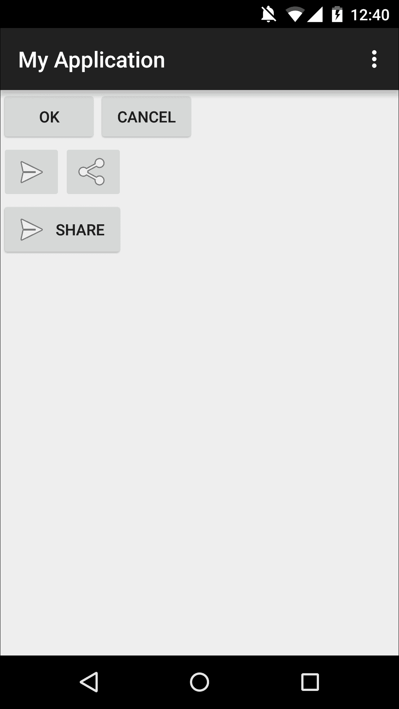

根据你希望按钮显示文本、图标还是两者，你可以通过以下三种方式之一将按钮添加到布局资源文件中。

## 创建带有文本标签的按钮

要创建一个带有文本标签的基本按钮，请将`<Button>`元素插入到您的布局资源文件中：

```java
<Button 
android:layout_width="wrap_content" 
android:layout_height="wrap_content" 
android:text="@string/button_text" /> 

```

您可以使用`android:text`属性设置按钮的文本标签。与`TextViews`一样，您可以直接将文本插入到布局中（`android:text="Submit"`）或您可以在项目的`res/values/strings.xml`文件中创建一个字符串资源，然后引用该字符串资源（`android:text="@string/submitText"`）。

要以编程方式设置按钮的文本，请使用`setText`：

```java
      button.setText("Submit!"); 

```

## 创建带有图像标签的按钮

如其名所示，`ImageButton`是一个带有图像标签的按钮。

要将`ImageButton`插入到您的 UI 中，您需要在布局资源文件中添加`<ImageButton>`标签：

```java
<ImageButton 
  android:layout_width="wrap_content" 
  android:layout_height="wrap_content" 
  android:id="@+id/imageButton" 
  android:src="img/send" /> 

```

认识到`android:src`属性吗？它引用了一个`drawable`资源，与`ImageView`引用`drawable`资源的方式完全相同。

## 创建带有文本和图像标签的按钮

如果您想确保用户在触摸按钮时完全清楚会发生什么，您可以使用文本和图像标签该按钮。这涉及到使用带有`android:drawableLeft`的`Button`类：

```java
<Button 
  android:layout_width="wrap_content" 
  android:layout_height="wrap_content" 
  android:id="@+id/imageButton3" 
  android:text="Send" 
  android:drawableLeft="@android:drawable/send" /> 

```

### 小贴士

**更改按钮的背景**

如果您觉得这三个选项还不够，您还可以使用`android:background`更改按钮的背景，然后引用一个颜色值或一个图像。

# 状态列表资源

您典型的按钮有三个状态：

+   `Default`：此按钮既未被按下也未被聚焦

+   `Pressed`：此按钮处于按下状态

+   `Focused`：此按钮当前处于焦点状态

我们之前讨论的所有按钮属性（文本标签、图像标签和背景）都适用于按钮元素，无论其当前状态如何。但有时您可能希望按钮向用户提供关于其当前状态的视觉提示。例如，当用户轻触按钮时，您可能希望它在按下状态下短暂显示较深的颜色，这样用户就知道他们的设备已成功注册了触摸事件。

如果您希望按钮对其当前状态做出反应，您需要创建一个状态列表资源，这是一个定义每个按钮状态使用不同图像或颜色的 XML 文件。

要创建此状态列表资源，请执行以下操作：

1.  创建三个可绘制对象作为按钮的背景。这些可绘制对象代表按钮的每个状态。

1.  给每个`drawable`一个反映其状态的名称，例如`button_pressed`或`button_default`。

1.  将这些可绘制对象添加到适当的`res/drawable`目录中。

1.  在您的项目`res/drawable`目录中创建一个新的 XML 文件，通过在`drawable`目录上右键单击并选择**新建**，然后选择**可绘制资源文件**。给 XML 文件一个描述性的名称，例如`button_states`，然后点击**确定**。

打开你的新 `drawable` 资源文件，通过在单个 `<selector>` 元素内添加单独的 `<list>` 元素来定义你想要为每个状态使用的所有 `drawable`：

```java
<?xml version="1.0" encoding="utf-8"?> 
<selector > 
<item android:drawable="@drawable/button_pressed" 
        android:state_pressed="true" /> 
   <item android:drawable="@drawable/button_focused" 
        android:state_focused="true" /> 
   <item android:drawable="@drawable/button_default" /> 
</selector> 

```

在前面的代码中，我们定义了按钮在每种状态下应该使用哪个 `drawable`：

+   当 `pressed = true` 时，按钮应该使用 `button_pressed` `drawable`。

+   当 `focused = true` 时，按钮应该使用 `button_focused` `drawable`。

+   如果按钮没有被按下或聚焦，它应该使用 `button_default` `drawable`。

在你的状态列表资源中 `<item>` 元素的顺序很重要，因为当你引用这个状态列表时，系统会按顺序遍历 `<item>` 元素，并使用第一个适用于按钮当前状态的 `<item>` 元素。由于默认状态总是适用的，你必须始终将默认 `drawable` 放在列表的末尾，以确保它只有在系统首先检查并丢弃 `android:state_pressed` 和 `android:state_focused` 后才会被使用。

要将状态列表资源应用到按钮上，你需要在 Activity 的布局资源文件中将其引用为一个单独的 `drawable`：

```java
<Button 
   android:id="@+id/button_send" 
   android:layout_width="wrap_content" 
   android:layout_height="wrap_content" 
   android:text="@string/button_send" 
   android:background="@drawable/button_custom" /> 

```

你还可以创建使用颜色而不是图像的状态列表资源。这类状态列表被称为 **颜色状态列表资源**。你使用相同的 `<selector>` 和 `<item>` 元素；唯一的不同是每个 `<item>` 元素引用的是颜色而不是 `drawable`：

```java
<item android:drawable="@android:color/holo_red_light"  
        android:state_pressed="true" /> 

```

或者

```java
<item android:drawable=""#0000ff"  
        android:state_pressed="true" /> 

```

# 摘要

在本章中，我们介绍了最常用的视图和布局，并探讨了所有不同的自定义方式，以满足我们的特定设计需求。

尽管我们还没有介绍过一些视图和布局，但本章中我们探讨的许多属性都适用于我们在后续章节中遇到的视图和布局，例如 `layout_width`、`android:src`、`android:id` 以及相对度量单位。

在下一章中，我们将扩展使用资源，如字符串、九宫格图像、颜色和状态列表，并查看一些新的资源，包括数组和维度。

最后，你将学习到 UI 设计的一个重要方面，这是我们之前还没有涉及到的：*片段*。
