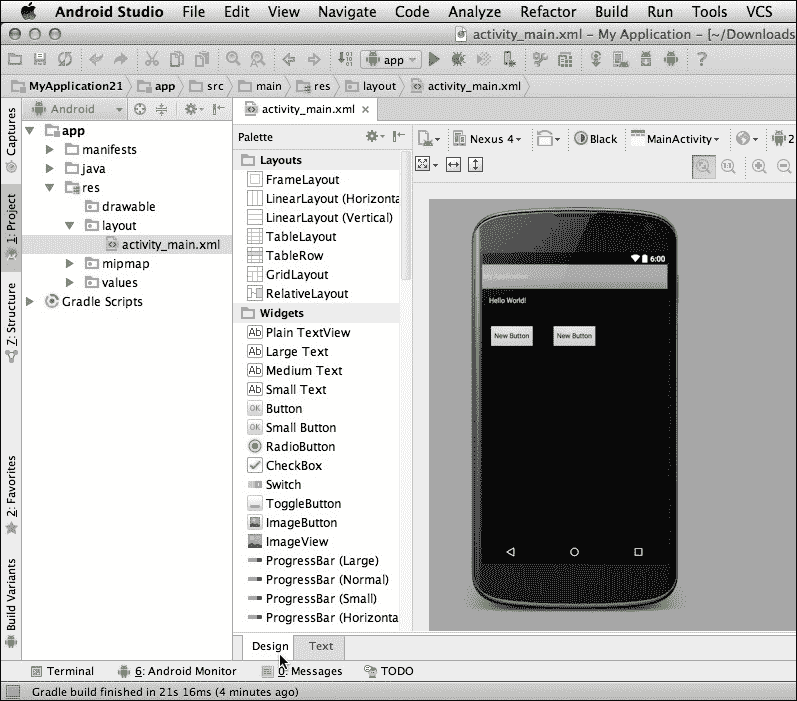
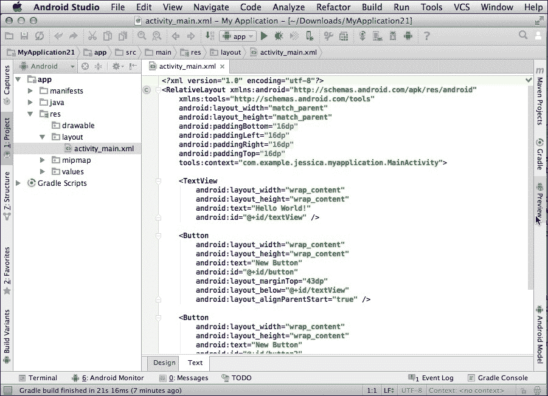
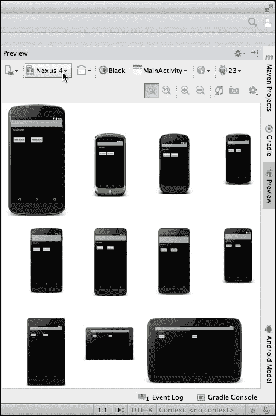
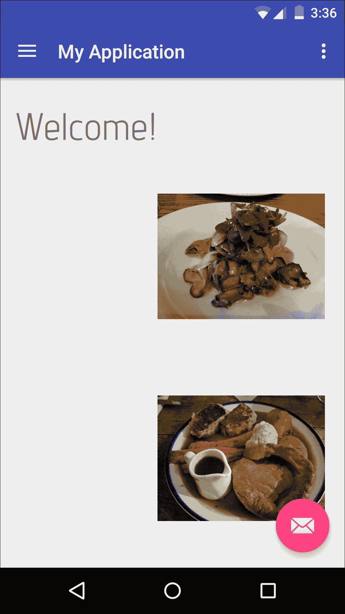
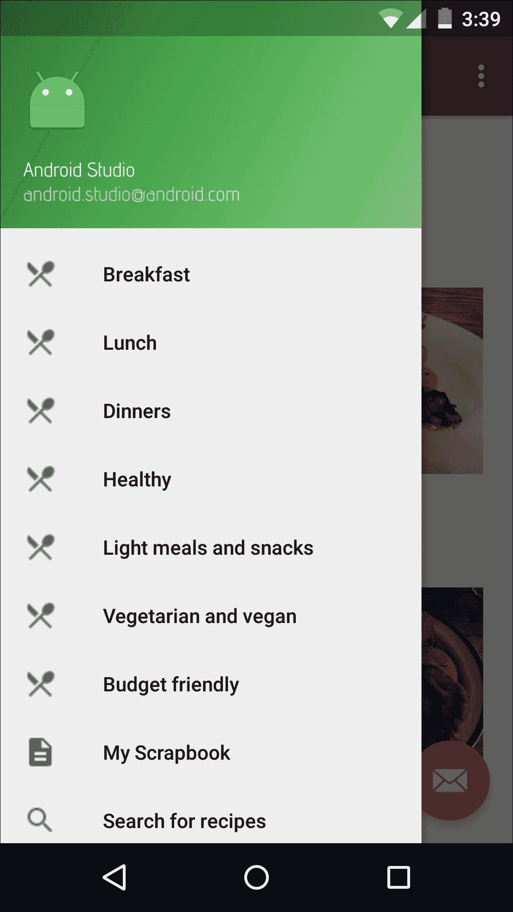
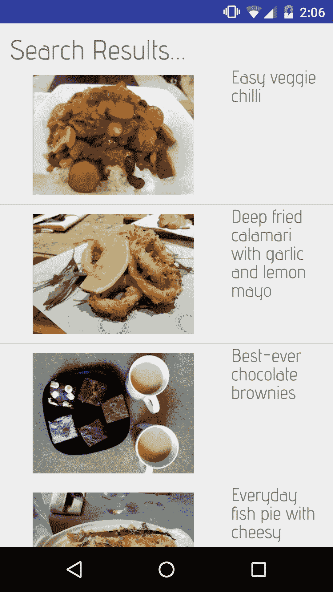

# 第七章。构建原型

在前几章中进行了大量的初始设计工作之后，现在是时候从设计阶段过渡到开发的早期阶段。第一个开发任务是创建一个数字原型。

在创建了多个线框图和纸制原型之后，你可能迫不及待地想要开始一些真正的开发工作，但数字原型是设计过程中的一个至关重要的步骤。

尽管你已经投入了大量的时间和精力在你的设计上，但在这个阶段，它仍然只是一个计划。数字原型是测试这个计划是否在现实世界中可行的地方。此外，数字原型本身也是一种纯粹的乐趣，因为它允许你在极短的时间内从无代码版本快速过渡到工作的应用版本。

到本章结束时，你将开发出一个工作的数字原型。你还将通过规划应用更详细的细节来最终确定你的设计，这意味着开始考虑图形设计。

### 注意

由于它是 Android 推荐的开发环境，本章重点介绍使用 Android Studio 创建数字原型。如果你还没有安装 Android Studio，你可以从 [`developer.android.com/sdk`](http://developer.android.com/sdk) 获取它。

如果你更喜欢使用不同的集成开发环境（IDE），例如 Eclipse，那么创建数字原型的步骤将会相似，因此你仍然可以在你选择的 IDE 中继续操作。

# 在 Android Studio 中创建原型

便利的是，创建 Android 原型最好的工具之一你可能已经安装了——Android Studio。

这个 IDE 具有先进的布局编辑器，非常适合快速创建数字原型。这个布局编辑器会在你打开 Android Studio 中的任何 XML 布局资源文件时自动打开。



创建数字原型的最快方式是选择编辑器的 **设计** 选项卡（如前一张截图中的光标位置）。将打开一个新区域，显示你的应用布局的 **画布** 预览，以及一个包含许多现成 UI 元素（称为 **小部件**）的 **调色板**。你可以通过从 **调色板** 拖动小部件并将它们拖放到画布上来快速创建原型。

### 注意

在创建原型（以及一般而言的 Android 应用）时，你应该使用默认的小部件，除非你有非常充分的理由不这样做。这些现成的小部件不仅使开发者的生活更加轻松，而且大多数 Android 用户已经熟悉它们。因此，他们可以立即知道如何与你的应用 UI 的至少一些元素进行交互。

如果您需要更具体地更改应用布局，可以通过选择 **文本** 选项卡访问其底层的 XML，在代码级别进行修改，然后返回到 **设计** 选项卡以查看这些更改在画布上的渲染效果。使用这种方法，您将很快拥有一个可工作的原型，您可以在自己的 Android 设备或模拟器上对其进行测试。

在 Android Studio 中创建原型也是测试您的设计在不同屏幕配置下看起来和功能如何的绝佳方式。如果您恰好有多台 Android 设备，您可以将原型安装到所有设备上，但大多数 Android 开发者通过创建多个 **Android 虚拟设备**（**AVD**）来在不同设备上测试他们的项目。

### 注意

我们将在下一章更详细地探讨部署和测试您的数字原型。

您还可以使用 Android Studio 内置的 **预览** 窗格快速预览您的原型在不同设备上的效果。要访问此窗格，请确保已选择 **文本** 选项卡，然后点击屏幕左侧的 **预览** 选项卡（如下面的截图所示，光标所在位置）：



在此选项卡打开时，您将看到您的应用在单个 Android 设备上的预览。要检查您的布局在不同 Android 设备上的外观，请点击当前选中设备的名称（如下面的截图所示，光标所在位置），然后从下拉菜单中选择新设备。您甚至可以通过从下拉菜单中选择 **预览所有屏幕尺寸** 来一次性预览您的 UI 在多个设备上的效果：



## 创建您的第一个原型

您可以从原型化您应用中的任何屏幕开始，但我发现从用户启动应用时看到的第一个屏幕开始更有意义。在我们的食谱应用示例中，这是主页，因此这是我将要原型化的第一个屏幕。

回到我的线框图，我可以看到主页应该包括欢迎信息和来自应用中一些特色食谱的照片。我还想包括一个菜单，以便用户可以轻松导航到应用最重要的屏幕。具体来说，我希望这个菜单包括搜索屏幕、用户的食谱剪贴簿以及所有不同的食谱类别。

由于此菜单需要包含相当多的选项，我将使用导航抽屉。在这里，导航抽屉是一个有效的解决方案，因为它可以滚动，并且在不再需要时可以整齐地收起来。

### 注意

如果你不太熟悉导航抽屉的概念，那么你可能想查看 Android 的 Material Design 指南，其中有一个专门介绍导航抽屉的部分 [`www.google.com/design/spec/patterns/navigation-drawer.html`](https://www.google.com/design/spec/patterns/navigation-drawer.html) 。

启动 Android Studio 并创建一个新的项目。选择对你特定项目最有意义的设置，但如果你正在跟随这个示例，那么请选择**导航抽屉**模板。正如你可能已经从名称中猜到的，这个模板内置了导航抽屉，这将使创建你的主屏幕数字原型变得更加容易。

点击**完成**以继续创建你的项目。默认情况下，该项目已经包含相当多的代码和资源。我的任务是修改所有这些自动生成的代码，以匹配我的主屏幕线框图。让我们从最直接的任务开始：创建屏幕的欢迎信息和添加我们的图片。

打开项目的`content_main.xml`文件，确保它使用`RelativeLayout`作为父容器。然后，选择**设计**选项卡，从**画板**拖动一个`TextView`和两个`ImageView`小部件，并将它们拖放到你的画布上。

接下来，用文本和图像填充这些小部件。创建一个包含你选择的欢迎文本的字符串资源。找到你想要使用的两张图片并将它们添加到你的项目`drawable`文件夹中（在我的项目中，我使用的是`mushroomtoast.jpeg`和`sundayroast.jpeg`）。更新`TextView`以显示字符串资源，并更新`ImageViews`以显示你选择的图片。

### 小贴士

**数字原型设计：不要浪费时间！**

到目前为止，你可能想投入大量时间定位你的`ImageView`和`TextView`对象，以便它们在最终的应用中看起来**完全**正确。然而，要小心不要花太多时间完善你的原型。

需要记住的关键点是，数字原型设计的目的是测试你项目设计的**理论**，而不是创建项目的早期版本。如果你花太多时间使你的数字原型完美，那么你不妨直接开始创建你的应用的第一版！

你的数字原型可能会突出你设计中的一些潜在问题，这意味着你需要返回并修改你的线框图，甚至完全重新制作它们。如果发生这种情况，那么至少你可以安慰自己，知道在真正开始构建你的应用之前发现设计中的问题更好。数字原型是早期检测工具箱中强大且节省时间的工具——但**仅此而已**，如果你不投入大量时间来完善你的原型。

不要陷入担心细节的陷阱；相反，尽量快速地创建你的原型。这通常意味着创建的屏幕只是最终屏幕外观的粗略表示，并且通常功能很少或没有。

这里是我的主屏幕原型的 XML 代码。由于这只是一个原型，我没有在对齐每个 UI 元素上投入太多时间：

```java
<?xml version="1.0" encoding="utf-8"?> 
<RelativeLayout  

  android:layout_width="match_parent" 
  android:layout_height="match_parent" 
  android:paddingBottom="@dimen/activity_vertical_margin" 
  android:paddingLeft="@dimen/activity_horizontal_margin" 
  android:paddingRight="@dimen/activity_horizontal_margin" 
  android:paddingTop="@dimen/activity_vertical_margin" 
  app:layout_behavior="@string/appbar_scrolling_view_behavior" 
  tools:context="com.example.jessica.myapplication.MainActivity" 
  tools:showIn="@layout/app_bar_main"> 

  <ImageView 
      android:layout_width="175dp" 
      android:layout_height="225dp" 
      android:id="@+id/imageView2" 
      android:src="img/mushroomtoast" 
      android:layout_below="@+id/textView2" 
      android:layout_toEndOf="@+id/textView2" /> 

  <ImageView 
      android:layout_width="175dp" 
      android:layout_height="225dp" 
      android:id="@+id/imageView3" 
      android:src="img/sundayroast" 
      android:layout_below="@+id/imageView2" 
      android:layout_alignStart="@+id/imageView2" /> 

  <TextView 
      android:paddingTop="10dp" 
      android:layout_width="wrap_content" 
      android:layout_height="wrap_content" 
      android:textSize="40sp" 
      android:text="@string/welcome!" 
      android:id="@+id/textView2" 
      android:layout_alignParentTop="true" 
      android:layout_alignParentStart="true" /> 

</RelativeLayout> 

```

检查一下在你的模拟器或 Android 设备上的显示效果：



下一个任务更复杂：向导航抽屉添加我们自己的菜单项。

你可以在项目的`res/menu/activity_main_drawer.xml`文件中找到所有的导航抽屉代码。`activity_main_drawer.xml`中已经有相当多的代码了，但这段代码很好地说明了如何向导航抽屉添加项，所以我们不妨将其用作模板。

目前，`activity_main_drawer.xml`文件看起来是这样的：

```java
<?xml version="1.0" encoding="utf-8"?> 
<menu > 

  <group  

//This is an optional, invisible container that groups related <items> together in the navigation drawer// 

android:checkableBehavior="single"> 

//This is another optional element that defines the checkable behavior for either individual menu items (via the android:checkable attribute in an <item> element) or for an entire group, via android:checkableBehavior in a <group> element. In this example, we're marking all <items> in this <group> as checkable. The "single" value means that the user can only select one item at a time, within this group. The other potential values are "none" (the user can't check any items in the group) or "all" (the user can select multiple items in this group at any one time)// 

    <item 

//Creates a new menu item// 

          android:id="@+id/nav_camera" 

//Assigns the menu item a unique resource ID so the app recognizes when the user selects this item in the menu// 

          android:icon="@drawable/ic_menu_camera" 

//Defines what drawable to use as this item's icon// 

          android: /> 

//The text you want to display in the navigation drawer// 

      <item 
     ............ 
     ............ 
     ............ 

  </group> 

//This is the end of this particular group//  

  <item android:> 
      <menu> 

//This is the start of a new group// 

     ............ 
     ............ 
     ............ 

      </menu> 
  </item> 

</menu> 

```

正如之前提到的，我想添加的菜单项是剪贴簿、搜索屏幕和不同的食谱类别。第一个任务是决定为这些菜单项使用哪些图标。

在可能的情况下，你应该使用系统图标，因为大多数用户已经熟悉它们，因此会知道它们的意思。你可以在[`design.google.com/icons/`](https://design.google.com/icons/)找到所有 Material Design 系统图标的完整列表。

从这个长长的图标列表中，我将使用标准的搜索图标，所以请下载这张图片并将其放入你的项目的`drawable`文件夹。为其他所有项目找到图标并不那么直接，但既然这只是一个原型，我将暂时使用一些占位符图标。我决定使用描述图标，因为它有点像笔记本（或剪贴簿），我还将使用刀叉本地餐饮图标为每个食谱类别。

一旦所有这些图像都安全地存放在`drawable`文件夹中，就是时候向导航抽屉代码中添加一些新的条目了：

```java
<?xml version="1.0" encoding="utf-8"?> 
<menu > 

  <group android:checkableBehavior="single"> 
      <item 
          android:id="@+id/breakfast" 
          android:icon="@drawable/ic_local_dining" 
          android: /> 
      <item 
          android:id="@+id/lunch" 
          android:icon="@drawable/ic_local_dining" 
          android: /> 
      <item 
          android:id="@+id/dinners" 
          android:icon="@drawable/ic_local_dining" 
          android: /> 
      <item 
          android:id="@+id/healthy" 
          android:icon="@drawable/ic_local_dining" 
          android: /> 
      <item 
          android:id="@+id/lightmeals" 
          android:icon="@drawable/ic_local_dining" 
          android: /> 
      <item 
          android:id="@+id/vegan" 
          android:icon="@drawable/ic_local_dining" 
          android: /> 
      <item 
          android:id="@+id/budget" 
          android:icon="@drawable/ic_local_dining" 
          android: /> 

  </group> 

  <item 
      android:id="@+id/scrapbook" 
      android:icon="@drawable/ic_scrapbook" 
      android: /> 
  <item 
      android:id="@+id/search" 
      android:icon="@drawable/ic_search" 
      android: /> 
     ............ 
     ............ 
     ............ 

</menu> 

```

就这样！在你的 Android 设备或模拟器上运行完成的原型，但这次，请确保通过在屏幕上拖动来打开导航抽屉。你将看到这个抽屉中的一些新添加项：



## 创建你的第二个原型

线框图可以给你一个更清晰的 UI 视图，但有时即使是线框图也无法有效地说明某个屏幕的每个版本将如何显示。我们的应用程序的搜索结果屏幕就是这样，因为这个屏幕将根据用户搜索的内容而变化。那么，我们如何创建一个能够有效地代表我们的搜索结果屏幕的单个原型呢？

答案是创建一个灵活的原型布局，并给它一些假数据。这些假数据应该准确地代表这个屏幕最终需要显示的完整范围的真实内容。您应该尽力找到您应用内容中最尴尬的例子，这样您才能真正测试您的设计。在我们的菜谱应用示例中，这意味着使用标题异常长或短的菜谱。

要创建一个复杂搜索结果屏幕的原型，我将创建`ListView`，然后我将创建样本菜谱标题和图像的数组，我将它们提供给`ListView`。然后`ListView`将在我布局中显示这些数组，就像它们是真实的搜索结果一样。

一旦您创建了第一个原型，您可以选择为这个项目添加更多屏幕，或者将每个后续的原型作为一个单独的项目来创建。我个人觉得后者是最直接的选择，所以我会将我的搜索结果原型作为一个新的项目来创建——这次使用空白模板。

如果您也决定将每个屏幕作为一个单独的项目来原型设计，那么请确保每个项目都有一个不同的包名，这样您就可以在同一台 Android 设备上安装和测试它们。

回顾我的线框图，我可以看到搜索结果屏幕需要包括一个菜谱标题列表和相应的图像，以及一个标题。让我们从最直接的任务开始：创建标题。打开您的项目`strings.xml`文件并创建一个字符串，它将提供搜索屏幕的标题文本：

```java
<string name="sResults">Search Results...</string>) 

```

打开`activity_main.xml`文件，并确保其父容器是一个垂直的`LinearLayout`。创建一个`TextView`并将其设置为显示`sResults`字符串。

接下来是处理线框图中的这部分，它使得这个屏幕更难进行原型设计：搜索结果。如前所述，我将创建一个`ListView`并给它一些假数据，所以第一步是将`ListView`添加到我们的布局资源文件中：

```java
<?xml version="1.0" encoding="utf-8"?> 
<LinearLayout  
  android:layout_width="match_parent" 
  android:layout_height="match_parent" 
  android:orientation="vertical" > 

  <TextView 
      android:id="@+id/textview" 
      android:text="@string/sResults" 
      android:textSize="30dp" 
      android:layout_width="match_parent" 
      android:layout_height="wrap_content" 
      android:paddingTop="10dp" 
      android:paddingLeft="10dp"/> 

  <ListView 
      android:id="@+id/listview" 
      android:layout_width="match_parent" 
      android:layout_height="match_parent" 
      /> 

</LinearLayout> 

```

### 小贴士

**ListView、适配器和列表项**

`ListView`是一个视图组，它以垂直、可滚动的列表形式显示项目。用户可以通过点击列表中的任何一项来选择，这使得`ListView`非常适合显示我们的搜索结果，因为我们最终希望用户能够通过点击标题来打开菜谱。

要查看`ListView`的实际应用示例，请拿起您的 Android 设备并查看内置的**联系人**应用。它包含了一个可滚动的联系人列表；您可以在列表中点击任何一项以查看该联系人的更多信息。听起来熟悉吗？

一旦您识别出一个`ListView`，您就会开始注意到它们无处不在。翻阅一下您设备上安装的一些应用，您可能会惊讶地发现`ListView`出现的频率有多高。

`ListView`由*列表项*组成。每个列表项在`ListView`中显示为行，这些项有自己的布局，你在单独的 XML 文件中定义。你可以为列表项创建一个简单的布局，或者你也可以创建更复杂的列表项，这些列表项包含多段文本和多个图像，这些图像在`RelativeLayout`中排列。

这个拼图的最后一块是一个适配器，它充当`ListView`及其底层数据之间的桥梁。适配器从指定的源（如数组）中提取内容，并将这些内容适配到视图中。然后，适配器将每个视图放置在`ListView`中作为一个单独的行。

在本章中，我将使用`SimpleAdapter`，这是一种将静态数据映射到 XML 文件中定义的视图的适配器类型。这是一个相当直接的适配器，但它有一个缺点：`SimpleAdapter`需要一个`Maps`的`ArrayList`来定义`ListView`中的每一行。

如果你想了解更多关于`ListView`和不同类型的适配器的信息，最好的地方是官方的 Android 文档：[`developer.android.com/guide/topics/ui/layout/listview.html`](http://developer.android.com/guide/topics/ui/layout/listview.html)。

让我们定义将在我们的`ListView`中出现的单个项目/行布局。创建一个新的布局资源文件，命名为`simple_list_layout.xml`，然后创建`TextView`和`ImageView`，它们最终将包含食谱标题和相应的图片：

```java
<?xml version="1.0" encoding="utf-8"?> 
<LinearLayout  
  android:layout_width="match_parent" 
  android:layout_height="match_parent" 
  android:orientation="horizontal"  > 

  <ImageView 
      android:id="@+id/images" 
      android:layout_width="250dp" 
      android:layout_height="150dp" 
      android:paddingTop="10dp" 
      android:paddingRight="5dp" 
      android:paddingBottom="10dp"  /> 

      <TextView 
          android:id="@+id/recipe" 
          android:layout_width="wrap_content" 
          android:layout_height="wrap_content" 
          android:textSize="20dp" 
          android:paddingRight="10dp"/> 

  </LinearLayout> 

```

接下来，添加你假搜索结果的所有图片。我将以下内容添加到我的项目的`drawable`文件夹中：

+   `blueberrypancake.jpg`

+   `brownies.jpg`

+   `calamari.jpg`

+   `chilli.jpg`

+   `fryup.jpg`

+   `kashmiricurry.jpeg`

+   `pie.jpeg`

+   `redberrypancake.jpeg`

+   `scallops.jpeg`

+   `surfandturf.jpg`

+   `sweetandsourprawns.jpeg`

+   `tuna.jpeg`

我将把这些图片以及相应的食谱标题添加到单独的数组中。然后，我将通过适配器将这些数组传递给`ListView`。

### 注意

这比第一个原型复杂得多，所以为了加快速度，我将尽可能快地编写这段代码，在这个过程中牺牲了一些效率和优化。

打开你的项目的`MainActivity.java`文件，并添加以下内容：

```java
package com.example.jessica.myapplication; 

import java.util.ArrayList; 
import java.util.HashMap; 
import java.util.List; 

import android.app.Activity; 
import android.widget.ListView; 
import android.os.Bundle; 
import android.widget.SimpleAdapter; 

public class MainActivity extends Activity { 

    String[] recipes = new String[] { 

//Create a recipes array// 

          "Easy veggie chilli", 
          "Deep fried calamari with garlic and lemon mayo", 
          "Best-ever chocolate brownies", 
          "Everyday fish pie with cheesy sauce", 
          "Seared tuna with stir-fried veggies", 
          "American style blueberry pancakes with strawberry and banana", 
          "Full English fry up", 
          "Kashmiri curry", 
          "Red berry pancakes with cream", 
          "Sticky sweet and sour prawns", 
          "Surf and turf for two" 
  }; 

//Add all the preceding titles to the recipes array//  

  int[] images = new int[]{ 

//Create an images array//  

          R.drawable.chilli, 
          R.drawable.calamari, 
          R.drawable.brownies, 
          R.drawable.pie, 
          R.drawable.tuna, 
          R.drawable.blueberrypancake, 
          R.drawable.fryup, 
          R.drawable.kashmiricurry, 
          R.drawable.redberrypancake, 
          R.drawable.sweetandsourprawns, 
          R.drawable.surfandturf 
  }; 

//Add all the preceding image files to the images array//  

  @Override 
  public void onCreate(Bundle savedInstanceState) { 
      super.onCreate(savedInstanceState); 
      setContentView(R.layout.activity_main); 

      List<HashMap<String,String>> aList = new
      ArrayList<HashMap<String,String>>(); 

//Create an array list, called aList//  

      for(int i=0;i<10;i++){ 
          HashMap<String, String> myMap = new
          HashMap<String,String>(); 
          myMap.put("recipe", recipes[i]); 
          myMap.put("images", Integer.toString(images[i]) ); 
          aList.add(myMap); 
      } 

//Add recipes and images to aList//  

      String[] from = { "images","recipe", }; 

      int[] to = { R.id.images,R.id.recipe}; 

//Use the ImageView and TextView from simple_list_layout.xm// 

      SimpleAdapter adapter = new
      SimpleAdapter(getBaseContext(), aList,
      R.layout.simple_list_layout, from, to); 

//Create a new SimpleAdapter and feed it three parameters. The first parameter is the context reference (getBaseContext); the second is the collection of data we want to display (aList), and the third is the layout we want to use for each row (simple_layout_list.xml)// 

      ListView listView = ( ListView )
      findViewById(R.id.listview); 

//Get the ListView object// 

       listView.setAdapter(adapter); 

//Assign the adapter to the ListView object// 

  } 
} 

```

将你的 Android 设备连接到计算机或启动模拟器，查看结果：



花些时间与你的原型互动，并在不同的屏幕配置下测试它，无论是通过 Android Studio 的预览功能还是通过创建多个 AVD。

现在你已经有了两个工作原型；问问自己是否有任何方法可以改进这些原型。特别是，要留意任何将你的 UI 拆分成可以组合成适应不同屏幕配置的多窗格布局的片段的机会。

如果你的数字原型激发出任何新的想法，那么拿一张纸并尝试绘制这些想法的线框图。如果这些新的纸笔线框图有潜力，那么理想情况下你应该将它们通过我们在上一章中提到的同样的严格的数字线框图、纸原型和可用性测试阶段。至少，你应该创建你新设计的数字原型，并花时间尽可能在多种不同的屏幕配置上测试这些原型。

这可能感觉像是退步，但这对确保你的设计真的是尽可能最好的至关重要；如果它改善了你的应用，那么这是值得的时间。如果你在怀疑你本可以改进基本设计的情况下发布了你应用的第一版，你不会过得愉快——你的用户也不会。

此外，那个老套话是正确的——你不会得到第二次机会来留下第一印象。你的普通用户将会对一款看似从天而降的惊人应用感到更加兴奋，而不是他们很久以前尝试过但不太感兴趣的某个应用的 2.0 版本。

即使你探索了你的想法然后放弃了它们，转而支持你的原始设计，至少你将确信你真的发布了你应用可能最好的版本。基本上，如果你的数字原型激发出了任何新的想法，那么现在是探索这些想法的时候了。

### 注意

如果你创建了新的线框图和原型，总是好的得到第二意见，所以你可能想要考虑进行另一轮用户测试——特别是如果你发现自己对你的应用的不同设计方向犹豫不决。

一旦你有一套你 100%满意的数字原型，就是时候完善这些设计了。

## 完善你的设计

在这个阶段，你应该已经牢固掌握了你应用设计的根本，包括每个屏幕上应该出现哪些 UI 元素，它们将在屏幕上的位置，以及你想要使用的导航模式。然而，我们还没有太多地思考我们应用的外观和感觉的细节。你打算为标题使用哪种字体？按钮应该是什么颜色？会有背景音乐或音效吗？以及你的应用将如何使用如高度和阴影这样的 Material Design 属性？

在完善你的设计时，以下是一些你需要考虑的事项。

### 视觉效果

这是你的 UI 元素外观的细节之处。尽管你应该尽可能使用 Android 的标准小部件，但仍然有很多空间来对标准元素，如按钮和菜单，进行自己的调整，特别是在你使用的颜色调色板以及如高度和阴影这样的 Material Design 元素方面。

你的视觉内容的比例也很重要；你的屏幕应该有很多图像和动画，还是应该更注重文本？像往常一样，确保你设计的是能够吸引你特定目标受众的东西。一个包含大量图像和明亮的鲜艳色调的应用可能适合一个针对年轻受众的有趣应用，但对于一个帮助忙碌的专业人士平衡财务的应用来说，可能就不太合适了。

### 背景音乐和音效

声音是一种设置氛围、唤起情感反应并立即让用户感受到他们可以从你的应用中期待什么的强大方式。

然而，你不必觉得一定要在你的应用中包含声音；沉默并没有什么不好，而且在某些情况下，一个完全静音的应用可能更受欢迎，尤其是如果人们可能会在噪音可能令人烦恼或不合适的情况下使用你的应用。

如果你包含某种形式的声音，始终考虑声音对于用户能够成功与你的应用交互有多重要。一般来说，无论用户音量调得很大、很小，或者他们处于一个无法清楚地听到你的应用的地方，如繁忙的酒吧或餐厅，你的应用都应该可用。

唯一的例外是那些基本依赖于声音的应用，例如音乐流媒体应用、为用户提供驾驶方向的应用或一些游戏应用。在这些情况下，你可以确信没有人会期望在没有提高设备音量的情况下使用你的应用。

### 您的文本

文本是您与用户直接沟通的最直接方法。在制作文本时，您需要考虑其内容及其视觉外观。

你的文本的外观对用户阅读和理解文本的难易程度有巨大影响，但外观也可以向用户传达关于文本的微妙信息。例如，你可以使用`textSize`来传达每段文本的重要性以及它属于哪个类别，例如它是否是标题、字幕或代码块。

要创建真正与用户产生共鸣的文本样式，你可以使用以下属性：

+   **文本大小**：你应该在设计的早期阶段决定你应用中所有主要文本类型的尺寸，而不是逐屏决定。通过将自己限制在预定义尺寸的选择中并一致地使用它们，你的用户将很快学会每个`textSize`的含义。然后他们可以使用这些信息来解读他们在你的应用中遇到的每个新屏幕，因为他们会立即知道哪个文本是副标题，正文文本，等等。例如，你使用`android:textSize`属性指定字体大小，例如`android:textSize="10sp."`。在提前设置`textSize`的最常见方法是通过主题和样式，我们将在本章后面讨论。

+   **文本样式**：Android 支持粗体、斜体和下划线效果，但请确保你使用得体，不要过度使用。如果你经常使用这些效果，你会添加很多视觉杂乱，这可能会使你的文本难以阅读，而且你最终会削弱效果的影响力。你可以使用 `android:textStyle` 属性应用粗体、斜体、下划线和 `bold|italic` 效果，例如，`android:textStyle="bold."`。下划线文本稍微复杂一些，因为你需要创建一个字符串资源，并将下划线应用于该资源内的文本，例如，`<string name="main_title"><u>This text is underlined</u>This text isn't</string>`。然后，从你的项目布局资源文件中引用这个资源（`android:text="@string/main_title"`），文本就会在你的用户界面中显示为下划线。

+   **大写**：和粗体、斜体和下划线效果一样，你应该谨慎使用大写，以免降低其影响力。你也应该避免使用全大写，因为全大写的文本通常会被理解为喊叫，而且对用户来说阅读起来也更困难。

你接下来需要关心的是你精心设计的文本实际上在说什么。

将文本视为你应用的“声音”。这个声音应该与你的应用整体设计相一致。如果你的设计色彩丰富、节奏欢快，配有愉快的音乐，那么你的文本也应该同样友好。如果你的设计更加前卫，那么你可能希望给你的文本赋予更多的态度。

千万不要过分热情！大多数情况下，极端地使用文本并不会使你的文本更有意义，相反，你应该选择一种简洁和中性的语气。记住，你的文本的语气和内容应该反映你应用的整体设计。所以，如果你的用户界面简洁，专注于完成任务，那么你很可能希望你的文本也同样直截了当。

如果不确定，就用中性的语气来确保安全。

### 你的应用个性

我把这一点放在最后，因为它是一个有点模糊的概念，它结合了我们之前讨论的方方面面。

你的应用个性是一个结合了众多不同设计元素的综合体，从视觉元素到背景音乐和文本的语气。

如果你的应用想要给你的用户留下清晰而鲜明的印象，那么所有这些不同的方面都需要保持一致。如果这些设计元素不一致，那么你可能会让你的用户感到不安，觉得你的应用有点儿*不对劲*。

想象一下，你创建了一个使用中性、漂亮的粉彩色调的应用，里面充满了可爱的图形，并且每行愉快的、乐观的文本都以至少三个感叹号结束——但是背景音乐却是垃圾金属乐！

仔细审视你刚刚做出的所有设计决策。它们是否都汇聚在一起形成一个统一的整体？或者是否有一个（或多个）元素像俗语所说的那样“突出”？

### 小贴士

**规则是为了被打破的！**

虽然大多数时候你都会希望所有设计方面保持一致，但偶尔你可能会决定给用户一个意外，比如一个故意与你的应用其他部分冲突的元素。这种技术可以创造出一些非常强大的效果；例如，你可能会将明亮的颜色和热情的文字与令人不安的音乐结合起来，创造出一种令人毛骨悚然和不安的经历，或者你可能想将可爱的图形与干巴巴和讽刺的文字结合起来，让用户发笑。

如果你决定打破规则，请确保你清楚地知道你想要达到的目标以及你打算如何实现它，因为这很容易出错！

如果你难以决定你的应用的整体个性应该是什么，那么考虑一下什么最能吸引你的目标受众。

总是如此，如果你在寻找灵感，就去谷歌应用商店搜索一些与你的项目类似或针对相同受众的应用。

由于我们希望我们的食谱应用能够吸引学生，我将访问应用商店并搜索包含单词`student`的应用。立刻，我看到了一大堆时间表和日程安排应用，专门针对大学生的论坛，以及家庭作业规划器。在这种情况下，我会下载一些评分最高的应用，然后花些时间浏览它们，以了解它们的个性。我可能还会下载一些五星级的食谱应用，并给予它们同样的待遇，然后再将所有发现结合起来，用以影响我自己的食谱应用的视觉效果和感觉。

# 创建主题和样式

现在你已经对 UI 的细节做出了一些决策，是时候考虑如何实现它们了。这就是主题和样式发挥作用的地方，因为它们是跨视图、活动甚至整个应用实现设计决策最快、最简单的方式。

一旦你做出了这些设计决策，创建样式甚至是一个主题来帮助你轻松且一致地实现设计是个好主意。

样式和主题本质上是一样的：一组属性。这些属性可以是文本的颜色、`ImageView`的大小，甚至是`"wrap_content"`属性。区别不在于你如何创建这组属性，而在于你如何将它们应用到你的项目中：

+   样式是一组控制视图外观的属性；例如，你可能会将一个样式应用到`TextView`上，以指定其中所有文本的大小和颜色。

+   主题是一组属性，你可以将其应用到活动或整个应用中。当你将主题应用到活动时，活动内的每个视图都将使用适用于它的任何属性。如果你将主题应用到应用中，那么应用中的每个视图都将使用此主题的所有适用属性。你通常会扩展另一个主题而不是从头创建一个。

样式和主题确实需要一些准备工作，所以为什么你要费心创建主题和样式，而不是直接将属性应用到视图中呢？有几个原因：

+   **它很高效**：如果你打算在应用中多次使用同一组属性，那么提前定义这些属性会使应用它们变得容易得多——实际上就像输入`style="@style/captionFont"`一样简单。

+   **它是一致的**：将一组属性定义为样式或主题有助于在整个应用中创建一致的视觉和感觉。而且，正如我们之前讨论的，用户喜欢一致性。

+   **它很灵活**：设计变更几乎是生活的常态，因此你应该在整个开发过程中预期会不断调整你的应用视觉。主题和样式提供了一个中心位置，你可以在这里一次性做出更改，然后它们会立即出现在你的应用中。决定你的标题应该比 10dp 大？简单，只需增加你的`style="@style/heading"`中的`android:textSize`属性。

### 注意

记得我们之前在谈论`textSize`属性以及如何仅使用少量文本大小可以帮助用户解码你的 UI 吗？这条规则也适用于样式。如果你使用有限数量的样式，你的用户会很快了解这些样式的含义，然后利用这些信息来帮助他们解码新的屏幕。为了最大限度地利用样式（以及，在一定程度上，主题），请注意那个老套话：少即是多。

## 定义样式

要创建样式（或一系列样式），你需要在你项目的`res/values`文件夹中创建一个`styles.xml`文件，如果它还没有这个文件的话。

你可以使用以下格式创建样式：

```java
<?xml version="1.0" encoding="utf-8"?> 
<resources> 

//<Resources> must always be the root node of your styles.xml file // 

   <style name="FooterFont" parent="@android:style/FooterText"> 

//Create a new style and assign it a name. In this example, I'm using FooterFont// 

       <item name="android:layout_width">match_parent</item> 

//Add each property to your style using the <item> element//  

       <item name="android:layout_height">wrap_content</item> 

//The value of each <item> can be a string, a color, a reference to another resource, or another valid value. You'll find a few examples of possible <item> elements below// 

      <item name="android:layout_width">wrap_content</item> 
       <item name="android:textColor">#ffff0000</item> 
      <item name="android:textSize">12sp</item> 
       <item name="android:typeface">sans_serif</item> 

   </style> 

//End of the FooterFont style// 

<style name="CodeFont" parent="@android:style/TextAppearance.Medium"> 

//Start of a new CodeFont style// 

     ............ 
     ............ 
     ............ 

//This is where you'd define the CodeFont attributes// 

   </style> 

//End of the CodeFont style// 

</resources> 

```

好吧，这看起来可能像是一项大量工作，但请记住，你不会创建一个只使用一次的样式。通常，你会在项目前期定义一个样式，然后在项目中的多个地方使用它。此外，一旦定义了样式，你就可以使用继承来创建此样式的变体（我们将在本章后面更详细地探讨）。

### 小贴士

**名字里有什么？**

在为每个样式命名时，要考虑一下你叫什么，因为样式的名称可以传达有关其目的和其他样式之间关系的有价值信息。

为了获得最佳效果，始终根据其目的而不是外观来命名你的样式，因为随着你精炼 UI，外观可能会改变。

例如，`CaptionStyle`是一个好的名称，但`ItalicsLightCaption`就不太合适，因为你的 UI 可能会发展到轻量级斜体文本不再适合你的 UI。在这种情况下，你有两个选择。你可以继续使用这个不一致的样式名称，这可能会造成混淆，尤其是如果你与其他人合作进行这个项目的话。

或者，你需要打开`styles.xml`文件，给你的样式赋予一个新的名称，但这样你还需要手动更改项目中所有对这个样式的引用。正如你所看到的，这两种方法都不是理想的解决方案！

一旦你创建了样式，将其应用到视图上就很简单了；只需打开一个 XML 布局资源文件，并使用`@style`属性，后跟你想应用的样式的名称：

```java
<TextView 
   style="@style/CodeFont" 
   android:text="@string/helloworld" /> 

```

并非所有视图都接受相同的样式属性；例如，`ImageView`不接受`android:textAlignment`。官方 Android 文档是检查特定视图支持哪些属性的最佳地方，特别是视图对应的类参考，在那里你可以找到一个支持 XML 属性的表格。例如，如果你正在创建一个文本样式，那么你可能想查看`TextView`类参考([`developer.android.com/reference/android/widget/TextView.html`](http://developer.android.com/reference/android/widget/TextView.html))。此外，请记住，一些视图扩展了其他视图，所以如果你正在创建应用于`EditText`的样式，那么查看`TextView`类参考也是值得的，因为`EditText`扩展了`TextView`类。

有时候，你可能会无意中将不兼容的属性应用到视图上，尤其是在你将样式应用到整个活动或应用主题时。那么会发生什么呢？答案是*不多*。视图只会接受它支持的属性，并忽略其余的。

### 注意

当你将一种样式应用到视图上时，这种样式只会应用到该视图。如果你将样式应用到`ViewGroup`上，子视图元素不会继承样式的属性。如果你想一次性将样式应用到多个视图上，那么你应该将样式作为一个主题来应用。

一些样式属性不被任何视图支持，你只能将它们作为主题应用到活动或整个应用中。例如，隐藏应用标题的属性在应用到单个视图时不会有任何影响。这些属性很容易识别，因为它们都以`window`开头，例如`windowNotTitle`、`windowTitleSize`和`windowNoDisplay`。你可以在官方 Android 文档的`R.attr`参考中找到完整的列表，该参考作为官方 Android 文档的一部分在[`developer.android.com/reference/android/R.attr.html`](http://developer.android.com/reference/android/R.attr.html)提供。

### 继承

你可以通过将它们用作**父样式**并继承它们的属性来快速轻松地创建现有样式的变体。

使用 `<parent>` 属性来指定你想要继承的样式。然后你可以添加属性，通过用新值覆盖它们来更改现有属性。你可以从你自己创建的样式继承，或者从 Android 平台内置的样式继承，如下所示：

```java
<style name="MyAppTheme" parent="Theme.AppCompat.Light.DarkActionBar"> 

//Creates a new style/theme called MyAppTheme that inherits from the Theme.AppCompat.Light.DarkActionBar platform theme. MyAppTheme will inherit all the characteristics of its parent//  

  <item name="colorPrimary">@color/colorPrimary</item> 

  <item name="colorPrimaryDark">@color/colorPrimaryDark</item> 
  <item name="colorAccent">@color/colorAccent</item> 

//Define whatever properties you want to add or change. Here, I'm overriding the parent theme's colorPrimary, colorPrimaryDark and colorAccent values with values I've defined in my project's colors.xml file//  

</style> 

```

如果你想要继承你定义的样式，你不需要使用 `<parent>` 属性。然而，通常认为将父样式的名称作为你的新样式的名称前缀，并用句点分隔是最佳实践。

假设我想创建一个新的样式，它继承了我之前创建的自定义 `FooterText` 样式，但将 `textsize` 从 12sp 增加到 20sp。我会用以下代码来做这件事：

```java
   <style name="FooterText.Large"> 

//Notice there's no parent attribute in the <style> tag. Instead, I'm using the name of the original style (FooterText), and affixing the name of the new style (Large)//  

           <item name="android:textSize">20sp</item> 
   </style> 

```

你将以与任何其他样式完全相同的方式引用这个继承的样式；在这个例子中是 `style="@style/FooterText.Large"`。

你可以继续这样继承，次数不限；只需将这些样式名称用句点连接起来。没有任何阻止你创建 `FooterText.Large.Blue`、`FooterText.Large.Italic`、`FooterText.Large.Blue.Bold` 等等的。

然而，为了更容易记住所有样式名称并帮助区分样式，最好不要过于沉迷！毕竟，`FooterText.Large.Blue.Bold.Underlined.Monospace` 并不是最容易记住的。

### 注意

通过将样式名称链接起来继承属性仅适用于你自己创建的样式。如果你想从 Android 的内置样式继承，你需要使用父属性。

## 与主题一起工作

到目前为止，你可能想知道为什么我们花了这么多时间关注样式，而没有真正讨论主题。这是因为你定义主题的方式与定义样式的方式完全相同。你可以将上面定义的任何样式作为主题应用。

要应用主题，打开你的项目 `Manifest.xml` 文件，并将 `android:theme` 属性添加到以下任何一个：

+   **<application> 标签**：如果你想在整个应用中应用主题，找到 `<application>` 标签，并添加 `android:theme` 属性以及你的样式名称，例如，`<application android:theme="@style/FooterFont">`

+   **<activity> 标签**：要将你的主题应用到特定的活动，向相关的 `<activity>` 标签添加 `android:theme`。

当你应用一个主题时，活动或应用中的每个视图都将使用它所能支持的所有的主题属性。如果你将`FooterFont`应用到活动上，该活动中的所有`TextView`（以及扩展`TextView`的视图）都将使用这些属性集合。如果你在整个应用中应用`FooterFont`，所有`TextView`和扩展`TextView`的视图都将假定这些属性，但任何不支持`FooterFont`属性的视图将简单地忽略它们。如果一个视图支持一些`FooterFont`属性但不支持其他属性，它将应用支持的属性并忽略其余的。

为了节省你的时间和精力，Android 平台包括许多预定义的主题，你可以使用，包括一系列的 Material 主题。你可以在官方 Android 文档的**R.style**部分找到所有可用的样式列表([`developer.android.com/reference/android/R.style.html`](http://developer.android.com/reference/android/R.style.html))。要使用平台样式和主题，将样式名称中的所有下划线替换为点，例如`Theme_Dialog`变为`"@android:style/Theme.Dialog"`。

如果你想要自定义内置主题，你应该将主题用作你自己的自定义主题的`<parent>`标签，然后添加你自己的属性或覆盖现有属性，如下所示：

```java
<style name="MyTheme" parent="android:Theme.Light"> 

//Create a new style called MyTheme, that inherits from the android:Theme.Light platform theme// 

   <item
 name="android:windowBackground">@color/custom_theme_color</item> 

//This is where you add your own attributes, or override existing attributes//  

   <item name="android:colorBackground">@color/custom_theme_color</item> 

</style> 

```

最后一步是更新你的项目的`Manifest`以使用你的新主题。所以，如果你想在一个特定的活动中使用`MyTheme`，你会编写以下内容：

```java
<activity android:theme="@style/CustomTheme"> 

```

要在整个应用中使用`MyTheme`，你会编写以下内容：

```java
<application android:theme="@style/CustomTheme"> 

```

# 准备好错误吧！

在一个完美的世界里，用户只会在你应用的最佳条件下与之互动。如果你的应用从互联网获取内容，人们只有在拥有闪电般的网络连接时才会打开你的应用。你的应用永远不会遇到诸如讨厌的来电或短信消息这样的中断，而且用户当然*永远不会*输入错误的用户名或密码。

可惜，现实世界并不是这样。你的用户会犯错误，耗尽存储空间，失去互联网连接，在你 RPG 应用的最终 Boss 战中途接到电话。你的应用必须能够处理所有这些不理想的情况和错误。

为错误做准备可能看起来很奇怪，但不幸的是，即使是最好的我们也会出错。不仅你的应用应该能够在出错时处理它们，而且它应该能够优雅地处理它们。

在本章的最后部分，我们将探讨如何设计你的应用，使其能够处理现实世界抛给它的任何东西。

## 用户输入错误

用户输入错误是指用户输入错误信息或留空字段。用户错误最常见的地方是登录屏幕或支付屏幕等表单。

假设你已经清楚地传达了用户需要输入的信息，从技术上讲，这些错误不是你的责任，但你仍然应该设计你的应用程序能够处理这类错误。

当用户错误发生时，你的应用程序应该清楚地传达发生了什么，并给用户足够的信息以便他们能够解决问题。仅仅显示一个写着“错误”的弹窗是远远不够的。

理想情况下，你的错误消息应包括帮助用户修复错误的操作。在我们的弹窗示例中，一旦用户关闭了弹窗，我们的应用程序可以自动选择用户输入错误信息的`EditText`字段，以便他们开始输入。

你应该只提供你可以实际支持的操作，所以如果错误是由于用户存储空间不足造成的，那么提供一个“重试”按钮是无法解决问题的。如果你无法帮助用户解决错误，那么向他们解释错误是什么、是什么原因造成的以及他们如何修复它，要比提供一个可能让他们感到更加沮丧的空洞手势要好得多。

当你的应用程序遇到用户错误时，它应该尽可能保留用户输入的信息。因此，如果一个用户填写了表单但输入了错误的密码，你的应用程序应该保留他们的用户名、地址以及他们正确填写的任何其他字段，同时突出显示他们输入了错误的密码。

然而，在处理用户输入错误的同时，不要忽视良好设计的重要性。如果你的应用程序将要失败，那么它至少应该以一种风格化的方式失败！一个设计良好的错误消息应该感觉像是你应用程序的自然延伸。在我们的弹窗示例中，我们可以编辑弹窗，使其颜色更好地与我们的应用程序整体配色方案相匹配，或者我们可以更改字体或包含反映我们应用程序个性的自定义音效。

尽管我以弹窗消息为例，但你应该始终寻找使你的错误消息尽可能不显眼的方法，而弹窗并不特别微妙。更不显眼的方法包括下划线、突出显示、自动选择用户输入错误信息的字段、在屏幕上添加一些解释已发生错误的文本后重新加载屏幕，或者将用户带回到他们输入错误信息的屏幕。

虽然用户输入是导致错误最常见的原因之一，但还有其他错误和不太理想的情况，你的应用程序需要能够处理。以下是一些例子：

+   **连接问题**：如果用户离线并尝试访问需要互联网或网络访问的功能，你应该显示一个不显眼的提示信息，说明他们需要互联网连接才能完成此操作。

+   **不兼容状态**：当用户尝试执行冲突的操作时，例如在离线状态下尝试通过在线消息应用发送消息时，会发生这些错误。当这些错误发生时，您的应用应显示一条解释错误的消息，并最好为用户提供一种简单的方法来更改他们的当前状态。

+   **缺少权限**：如果用户选择了一个需要特定权限的操作，您的应用应通知用户，并给他们提供授予该权限的选择。如果用户拒绝此权限请求，您应禁用所有相关功能，这样用户就不会继续尝试访问应用目前无法支持的功能。您还应为用户提供一种简单的方法来授予之前拒绝的权限，以防他们改变主意。如果某些权限对您的应用至关重要，您应提前请求它们。我们将在第十章“最佳实践和应用程序安全”中更详细地讨论权限，*最佳实践和应用程序安全*。

+   **空状态**：当您的应用无法显示常规内容时会发生这种情况；例如，一个没有任何搜索结果的`ListView`。您应该设计您的应用能够处理缺失的内容，尽管处理这种情况的最佳方法将取决于上下文和缺失的内容类型。在我们的搜索结果示例中，您可以创建一个**“无结果找到”**屏幕，或者应用可以自动扩展搜索查询并显示最佳匹配的内容。例如，如果用户搜索`burito`，您的应用可以显示所有包含单词`burrito`的食谱，而不是显示无内容。

    +   如果你决定采取最佳匹配的方法，那么你应该表明此内容并非完全匹配。在我们的搜索结果示例中，我们可能会显示一条类似的消息，例如**“我们找不到任何关于 burito 的结果，您是指 burrito 吗？”**

+   **内容不可用**：这与空状态微妙不同，因为它涉及到应该出现在您的应用中的内容，但由于某种原因不可用。例如，也许您的 UI 包括需要从互联网下载的图片或视频，但用户目前处于离线状态。如果您的应用包含此类内容，您应该在内容不可用时创建占位符，这些占位符将出现在您的布局中。如果您不这样做，那么当缺失的内容变得可用并被插入到布局中时，您的布局可能会突然跳动，这可能是您在移动设备上浏览加载缓慢的网页时遇到过的。创建占位符还可以确保即使某些内容缺失，您的布局也能保持其预期的结构。

# 摘要

在本章中，你学习了如何快速创建基于你的线框的数字原型。虽然你之前创建了纸质原型，但数字原型对于测试你的屏幕设计在真实 Android 设备上以及在不同屏幕配置下的外观和功能尤其有用。

从本章中你应吸取的最重要的一点是，线框是规划你的屏幕在*理论上*将如何看起来和工作的方式，但数字原型是你将这种理论付诸实践的方式。有时，你可能会发现理论在实际中并不适用，你可能需要对你的线框进行一些修改，甚至完全重新设计，但这没关系——发现你设计中的问题是你创建最佳应用版本过程中的一个重要部分。

现在你已经完成了你的设计，在下一章中，我们将更深入地探讨如何确保这个新完成的设计尽可能正确地转换到尽可能多的不同 Android 设备上。
