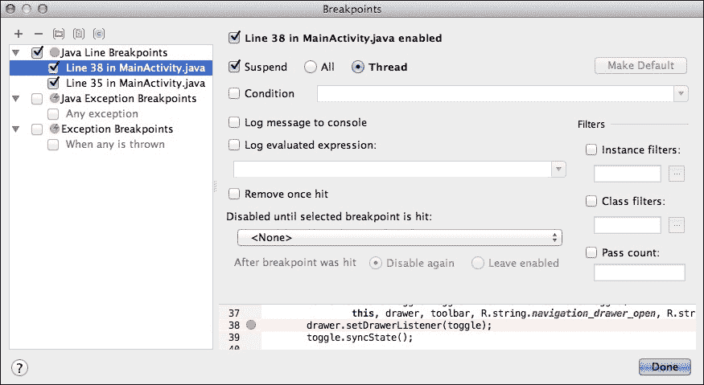

# 第九章。优化您的 UI

您的应用程序的用户界面是您与用户最直接的联系，因此您需要确保它**完美**。

到目前为止，我们一直专注于创建一个设计精美、功能丰富的用户界面——但这只是战斗的一半。如果您的应用要获得那些 5 星 Google Play 评论，您需要创建一个快速渲染、响应迅速，并且总体上提供卓越用户体验的 UI。

性能对于创建成功的用户界面以及一般意义上的成功应用至关重要。如果您的应用运行缓慢、容易崩溃、消耗大量数据和内存，或者耗尽用户的电池，那么无论您的 UI 看起来多么好，没有人会想使用它！

在本章中，我将向您展示如何找出可能影响您应用的所有最常见性能问题。由于您会想修复您遇到的任何问题，因此在这个过程中，我还会涉及到这些问题最初发生的原因，以及您可以采取的解决这些问题的步骤。

在完成本章后，您将知道如何创建一个流畅且响应迅速的 UI，人们会**喜爱**使用。

# 代码计时

不要等到您的应用开始抛出错误后再去寻找性能相关的问题。您的应用可能会缓慢泄漏内存、分配过多的对象，或者在一个复杂的视图层次结构下苦苦挣扎。这些都不一定会抛出错误，但它们肯定会对您应用的性能产生负面影响。

如果您要创建一个高性能的应用，您需要去**寻找**问题。

代码计时是一种强大的方式，可以确切地了解您的应用中正在发生什么，包括任何运行速度或持续时间比其他部分更慢或更长的代码段。我们将要查看的第一个 Android SDK 工具让您可以做到这一点。

**TraceView**是一个图形查看器，可以分析您设备上运行的任何 Android 应用。

TraceView，就像本章中我们将要介绍的大多数工具一样，只能测量运行中的应用程序。因此，第一步是安装您想要在 Android 设备上测试的应用程序，然后将该设备连接到您的计算机。或者，您可以使用模拟器和合适的 AVD。确保您的应用正在运行，并且其 UI 是可见的。

### 小贴士

**前后对比——衡量您应用的性能**

当您发现您的应用存在问题，显然您会想修复这个问题。但您在做出一些更改后，如何知道问题真正得到了解决？

如果您在更改前后使用 TraceView 来衡量您应用的性能，您将拥有所有必要的数据来查看您的优化是否对您应用的性能产生了任何显著的影响。所以即使您没有识别出需要优化的代码，TraceView 的输出也是您在优化应用时应该保留并参考的宝贵数据。

要启动 TraceView，请从 Android Studio 工具栏中选择 **工具**，然后选择 **Android** 和 **Android 设备监控器**。**Android 设备监控器**将在新窗口中打开。

### 备注

**Android 设备监控器** 是一个独立的工具，它是 Android SDK 的一部分。在本章中，我将使用包含在 **Android 设备监控器** 中的几个工具。尽管在本章中我将通过 Android Studio 用户界面访问 **Android 设备监控器**，但您也可以单独启动 **Android 设备监控器**。如果您想绕过 Android Studio，或者如果您正在使用 Eclipse，您可以通过在您的 Android SDK 下载中找到 `monitor` 文件并双击它来启动 **Android 设备监控器**。然后，**Android 设备监控器** 将在新窗口中打开。

在 **Android 设备监控器** 窗口中，选择 **DDMS** 选项卡。屏幕左侧您将找到一个 **设备** 选项卡，其中列出了所有当前检测到的设备和模拟器。选择包含您的应用程序的设备或 AVD，您将看到在此设备上运行的所有进程的列表。选择您想要分析的进程。

如果您在列表中看不到您的应用程序，请检查它是否正在运行并且其 UI 是否可见。

通过点击开始方法分析图标（如下截图中的光标位置）来开始方法分析：


在这一点上，您将面临两种分析选项：

+   **基于跟踪的分析**：跟踪每个方法的进入和退出，无论大小如何。这种分析类型具有巨大的开销，因此您只有在绝对不知道要分析什么时才应该跟踪一切。然后，您可以使用这些数据来缩小后续基于样本分析的范围。

+   **基于样本的分析**：以您指定的频率收集调用栈。这种分析类型的开销与采样频率成比例，因此开销通常更容易管理。

进行选择后，TraceView 将开始记录。花些时间与您的应用程序交互，确保与您想要分析的所有部分和方法进行交互。然后，点击停止方法分析图标，DDMS 将从您的设备中提取跟踪文件并将其加载到查看器中。

### 备注

根据您记录的内容量，这些数据可能需要几秒钟才能启动，因此您可能需要耐心等待。

您最终会得到一个看起来像这样的跟踪文件：

跟踪文件由以下内容组成：

+   时间线面板：

    此面板显示每个线程和方法开始和结束的位置，因此您可以跟踪代码随时间执行的情况。

    时间线面板以不同的颜色显示每个线程的执行情况，每行一个。你会在每个方法开始（左侧条形图）和停止（右侧条形图）的地方看到峰值。这两点之间的线条表示方法执行所需的时间。

    如果你发现任何相同颜色的长线条，这表明这种方法正在消耗处理时间，你应该收集更多关于这个方法的信息。点击任何你想要了解更多信息的方法，其统计数据将出现在配置面板中。

+   配置面板：

    此面板提供了关于当前所选方法内部发生情况的大量信息，包括该方法被调用的次数、递归调用的次数以及该方法使用的总 CPU 时间百分比（包括和排除所有子方法执行时间）。这些数据有助于你识别任何需要优化的方法。

# 识别过度绘制

当 Android 绘制屏幕时，它从最高级别的容器开始，然后在这个父视图中绘制所有子视图和孙视图。这意味着单个像素可能在一个循环中被绘制多次，这个过程被称为**过度绘制**。

为那些最终会被后续视图覆盖的像素着色是浪费处理能力，而且你绘制屏幕的次数越多，你添加的过度绘制就越多。

对于内存带宽有限且可能难以处理 GPU 密集型绘图任务的移动设备，如 Android，过度绘制是一个特别的问题。通过识别和纠正不必要的或过度的过度绘制，你可以提高应用的渲染速度。

### 注意

大量的过度绘制也可能表明你的用户界面存在更严重的问题，因此检查应用中的过度绘制量也可以帮助你找到需要进一步调查的区域。

尝试消除**所有**过度绘制的实例是不现实的，因为一些过度绘制区域是正常且不可避免的。如果你的应用背景是蓝色，那么你放置在背景之上的每一个元素都会导致一些过度绘制，但这不可避免——你能想象发布一个只有单一蓝色屏幕，什么都没有的应用吗？

你只需要担心过度绘制过多的情况，比如多个全屏层，或者对用户最终在屏幕上看到的最终图像没有任何贡献的过度绘制，比如完全隐藏在其他视图后面的内容。

运行 4.2 及更高版本的 Android 设备具有一个内置功能，允许你查看安装在 Android 设备上的任何应用（如果你对此类事物感兴趣，甚至可以查看整个 Android 系统中存在的过度绘制量）。

要查看应用中发生的过度绘制量，请将你要测试的应用安装在运行 4.2 或更高版本的物理 Android 设备上。然后打开你的设备的**设置**，然后是**开发者选项**。点击**调试 GPU 过度绘制**，并从出现的弹出窗口中选择**显示过度绘制区域**：


### 注意

**调试 GPU 过度绘制**弹出窗口包含一个**显示色盲异常区域**选项，它具有与标准**调试 GPU 过度绘制**相同的功能，但具有颜色校正，以补偿色盲（对绿光敏感度降低）的人。

选择此选项后，Android 系统根据每个像素被绘制和重绘的次数，以不同的颜色为屏幕的每个区域着色。


这些颜色是指导你识别过度绘制特定问题的区域：

+   **无颜色 = 无过度绘制**：这些像素只被绘制了一次。

+   **蓝色**：1 倍过度绘制，这意味着这些像素被绘制了两次。换句话说，屏幕被绘制了一次，然后再次在上面绘制。尽管你可以承受的过度绘制量因设备而异，但大多数设备应该能够处理单层过度绘制。大面积的蓝色是可以接受的，但如果整个窗口都是蓝色，那么你可能需要进一步调查，看看是否可以消除一些这种过度绘制。

+   **绿色**：2 倍过度绘制。中等大小的绿色区域是可以接受的，但如果屏幕超过一半是绿色，你应该调查是否可以优化一些绿色。

+   **浅红色**：3 倍过度绘制。一些浅红色的小区域可能是不可避免的，但任何中等或大面积的红色都应引起关注。

+   **深红色**：4 倍过度绘制，这意味着这个像素至少被绘制了五次——甚至可能更多！你应该**始终**调查任何深红色区域。

当你在调查过度绘制区域时，你的第一步应该是检查布局对应的 XML 文件，看看是否有明显的重叠区域。特别是要注意：

+   任何对用户不可见的可绘制元素。

+   任何重叠绘制的背景，尤其是全屏背景。如果你的 UI 在应用开始绘制内容之前就有几层背景，那么你不可避免地会遇到一些严重的过度绘制。

+   任何在另一个白色背景上绘制白色背景的区域。

+   `ViewGroups`嵌套在`ViewGroups`内部。考虑是否可以用`RelativeLayout`替换这些多个`ViewGroups`。

另一个用于识别不必要的视图和嵌套布局的有用工具是 Android SDK 中包含的**层次结构视图**工具，通过**Android 设备监控器**访问。

与本章中我将使用的许多诊断工具一样，**层次结构视图**只能与在 AVD 或物理 Android 设备上运行的应用程序通信。然而，与其它诊断工具不同，**层次结构视图**只能连接到运行 Android 操作系统开发者版本的手机。如果您**没有**开发者手机，可以通过将`ViewServer`类（[`github.com/romainguy/ViewServer`](https://github.com/romainguy/ViewServer)）添加到您的项目中来绕过这个限制。

如果您使用的是物理 Android 设备，您还需要确保已启用调试。打开您的设备**设置**，然后选择**开发者选项**，并将**Android 调试**滑块拖到**开启**位置。

打开 Android 设备监控器（通过选择**工具** | **Android** | **Android 设备监控器**）并点击**层次结构视图**按钮（如下截图中的光标位置）：


从**窗口**选项卡中选择您的设备，您将看到在所选设备上运行的所有 Activity 对象的列表，按组件名称列出。

要填充各种**层次结构视图**面板，请点击蓝色**将视图层次结构加载到树视图**图标。根据您的应用视图层次结构的复杂程度，树可能需要一些时间来加载。

一旦您的项目的**层次结构视图**加载完成，您可能想花些时间在各个窗口中探索这个层次结构（我将在下一节中更详细地讨论这些内容），但快速且简单识别大面积过度绘制的一种方法是将 Activity 的层次结构导出为 Photoshop 文档。

当您从**层次结构视图**输出创建 PSD 文档时，每个`View`都显示为单独的层。这意味着您可以使用 PSD 文档来剥离您应用的每一层，并确切地看到每一层对 UI 的贡献。检查每一层可以帮助您识别过度绘制的原因，或者如果您已经怀疑您的应用中某些区域存在过度绘制，那么您可以通过隐藏不同的层来测试您的理论，看看这如何影响用户在屏幕上看到的最终渲染图像。

要将您的层次结构导出为 Photoshop 文档，请点击**捕获窗口层为 Photoshop 文档**图标（如下截图中的光标位置）：


此按钮生成一个 PSD 文件，您可以在 Adobe Photoshop 或任何支持 PSD 文件（如免费开源的 Gimp 程序[`www.gimp.org`](https://www.gimp.org)）中检查。


在 GIMP 中检查应用层

花些时间探索构成您 UI 的不同层。

这个 PSD 文档特别有助于识别过度绘制的主要原因之一：多个白色背景。多个白色背景可能难以发现，所以一个技巧是将你的 PSD 文件中的白色背景替换为不同的图像。然后，你可以检查当你通过 UI 的不同层移动时，这些图像的哪些部分是可见的。

# 简化你的层次结构视图

另一个常见的性能问题来源是应用程序的**层次结构视图**。

当 Android 系统渲染每个视图时，它会经过三个阶段：测量、布局和绘制。系统完成每个阶段所需的时间受你层次结构中视图数量的影响，以及这些视图的排列方式。

将你的视图安排在更深、更复杂的层次结构中将对你的应用程序的渲染速度产生明显影响。你应该寻找任何简化视图层次结构和移除嵌套布局的机会。

除了突出显示过度绘制区域外，**层次结构视图**还帮助你可视化应用程序的视图层次结构，并提供有关每个视图渲染所需时间的非常有用的性能信息。

**层次结构视图**工具由三个不同的窗口组成。

## 树视图

此窗口提供了当前所选 Activity 视图层次结构的鸟瞰图：


树视图中的每个节点代表一个单独的`View`。当你选择一个节点时，关于该`View`的附加信息会出现在节点上方的小窗口中：

+   **视图类**：对象的类

+   **视图对象地址**：指向`View`对象的指针

+   **视图对象 ID**：对象的`android:id`属性值

你还将看到这个`View`在 Android 设备上的预览。通过确切地了解每个`View`对最终 UI 的贡献，你可以决定这个`View`是否添加了任何有价值的内容。如果没有，那么你应该从你的应用程序中移除它。

## 树概览

此窗口包含 Activity 整个视图层次结构的地图表示：


这种对层次结构结构的宏观视图特别有助于了解你的视图层次结构实际上有多复杂，同时也有助于你识别嵌套布局和其他简化布局的机会。

## 布局视图

此窗口显示你的 Activity UI 的骨架。

当你在**树视图**或**树概览**窗口中选择一个节点时，**布局视图**会突出显示这个`View`所绘制的区域。再次强调，这有助于你剔除冗余的`Views`：


虽然**层次结构视图**对于发现嵌套布局和冗余视图非常有用，但仅通过查看这三个窗口，你仍然可能无法发现一些视图层次结构的问题。

为了帮助您识别可能隐藏在表面之下的任何问题，您可以使用**层次视图**工具来测量每个`视图`在渲染过程的每个阶段（测量、布局和绘制）中移动所需的时间。有了这些信息，您将确切知道哪些`视图`需要优化。

默认情况下，层次视图的**树概览**不显示渲染时间。要将此信息添加到**树概览**中，您需要选择您想要分析的部分树的根节点。然后点击绿色、红色和紫色维恩图图标（当您悬停在图标上时，您将看到**获取以所选节点为根的树的布局时间**工具提示）。

几分钟后，每个视图层次结构部分的节点上都会出现三个彩色点。这些点表示此`视图`相对于其他已分析`视图`的渲染速度。

从左到右，这些点表示完成以下操作所需的时间：

+   测量视图

+   布局视图

+   绘制视图

每个点的颜色表示`视图`在渲染过程的每个阶段（测量、布局和绘制）中移动所需的时间：

+   **绿色**：此视图比至少一半的其他已分析节点更快。在测量位置出现的绿色点表示此视图的布局时间比至少 50%的其他已分析节点更快。

+   **黄色**：此视图位于所有已分析节点中最慢的 50%。

+   **红色**：此视图是所有已分析节点中最慢的。

您可以使用这些信息来识别哪些`视图`在测量、布局和绘制方面最慢，这样您不仅知道哪些`视图`需要优化，而且也知道您应该关注渲染过程的哪个部分。

当您点击一个已分析的节点时，您还会看到该`视图`的测量、布局和绘制时间，以毫秒为单位显示。


只需记住，这些性能指标是相互比较的，所以您的视图层次结构总是包含一些红色和黄色节点。

在您开始寻找使用黄色和红色点优化`视图`的方法之前，问问自己这些`视图`是否有渲染更慢的合理原因，例如拥有更多子视图的视图总是会比拥有较少子视图的节点落后。

# 查找内存泄漏

虽然 Android 可能是一个内存管理的环境，但您仍然需要仔细检查您的应用是如何处理内存的。

**垃圾回收**（**GC**）只能移除它识别为不可达的对象。如果您的应用分配了 Android 系统不识别为不可达的对象，那么这些对象将永远不会被垃圾回收。它们将悬挂在那里，污染您的堆，并占用宝贵的空间。

随着您的应用继续泄漏系统无法垃圾回收的对象，可用的空间将越来越少。Android 系统将通过运行更长和更频繁的 GC 事件来尝试补偿这种内存减少。

虽然您典型的 GC 事件不会对您的应用性能产生明显影响，但随着更多更长的 GC 事件在短时间内发生，您的用户可能会注意到性能下降，甚至可能遇到`OutOfMemoryError`。

内存泄漏可能难以检测，但 Android SDK 附带了一些工具，您可以使用这些工具扫描您的应用，寻找那些有时微妙的内存管理问题迹象。

## 内存监控器

内存监控器会跟踪您应用随时间变化的内存使用情况。这是另一个只能与运行中的应用程序通信的工具，因此在继续之前，请确保在物理设备或模拟器上安装了您的应用。

您可以通过从主 Android Studio 屏幕中选择屏幕底部的**Android 监控器**选项卡，然后选择**内存**选项卡来访问内存监控器。

确保您想要测试的应用程序在屏幕上是可见的。一旦内存监控器检测到您的运行中的应用程序，它就会开始记录内存使用情况，以深蓝色显示您的应用正在使用的内存，以浅蓝色显示未分配的内存。


### 小贴士

**故障排除**

如果内存监控器显示“**没有可调试的应用程序**”的消息，请打开 Android Studio 的**工具**菜单，选择**Android**，并确保**启用 adb 集成**被选中。这个功能可能会有些不可靠，所以如果一开始不起作用，请尝试几次**启用 adb 集成**的**开启和关闭**。如果您使用的是物理 Android 设备，断开设备并重新连接到不同的 USB 端口也可能有所帮助。

在监控内存的同时，花些时间与您的应用互动。最终，您的应用内存使用量会增加，直到没有未分配的内存。在这种情况下，系统将通过触发 GC 事件来释放一些内存，导致已分配的内存减少。

大多数垃圾回收（GC）事件都是完全正常的，但如果您发现 GC 事件变得越来越长且越来越频繁，那么这表明您的应用可能正在发生内存泄漏。

如果您在一段时间内跟踪一个疑似内存泄漏，您最终可能会看到 Android 系统试图通过授予更高的内存上限来满足您应用对内存的无尽渴望。如果在内存监控器中看到这种情况发生，那么这是您的应用中存在严重内存泄漏的迹象，您应该更详细地调查它。

## 堆选项卡

如果您在内存监控器中看到异常的内存使用情况，您可以使用 Android 设备监控器的堆选项卡来收集有关您的应用如何使用内存的更多信息。

正如其名所示，此选项卡提供了有关您的应用堆内存使用情况的数据，包括您的应用正在分配的对象类型、分配的对象数量以及这些对象占用的空间量。

安卓智能手机和平板电脑的堆空间是有限的，只能容纳一定数量的对象。随着堆的增长，安卓系统将通过触发 GC 事件来尝试释放内存——这是我们已知对性能不利的。

要访问堆标签，启动**Android 设备监控器**，选择**DDMS**标签，然后从**设备**面板中选择您的设备或 AVD，接着选择您想要检查的进程。点击**更新堆**按钮（如下面的截图所示）：


选择**堆**标签，并花些时间与您的应用程序进行交互。

堆输出仅在垃圾回收（GC）事件发生后才会显示，因此您可能需要耐心等待一个有机的 GC 事件，或者可以通过点击**触发 GC**按钮强制执行 GC 事件。一旦发生 GC，堆标签将显示关于您的应用程序堆使用的详细信息。


在执行不同操作之前和之后与您的应用程序进行一些交互，触发 GC 事件，这样您就可以比较这些操作对堆的影响。通过这种方式，您可以隔离导致内存泄漏的操作，以及您的应用程序可能遇到的任何其他内存相关的问题。

当您在应用程序的堆中追踪问题时，生成一个 HPROF 文件可能会有所帮助，这是一个包含您应用程序堆中所有对象的快照，以及有关相关类和实例的详细信息。

生成 HPROF 文件后，您可以在 Android Studio 或单独的剖析工具中查看它，例如 Eclipse 内存分析器([`www.eclipse.org/mat`](http://www.eclipse.org/mat))。

要检索 HPROF 文件，点击**转储 HPROF**图标（位于**更新堆**图标旁边）。为您的文件命名并保存。

要在 Android Studio 中分析堆转储，将您的 HPROF 文件作为一个新的 Android 项目打开。Android Studio 将自动在 Android 内存 HPROF 查看器中打开该文件，以便您进行更详细的分析。


## 对象分配 – 理解内存碎片

您还应该检查的另一个常见内存问题是内存碎片。

当您的应用程序在短时间内分配大量临时对象时，就会发生内存碎片，这可能会迅速消耗设备的可用内存，触发那些性能消耗的 GC 事件。

您可以使用 Android SDK 的**分配跟踪器**来检查内存碎片，该跟踪器列出了您在执行不同操作时应用程序分配到内存的所有对象。如果您发现任何可疑的分配，您可以使用**分配跟踪器**来检查负责分配这些对象的类和线程。

在 Android 设备监控器中，选择**DDMS**标签，然后打开**分配跟踪器**标签。从**设备**标签中选择您的设备或 AVD，接着选择您想要检查的进程。

在 **Allocation Tracker** 选项卡中，点击 **Start Tracking** 按钮，并花一些时间与你的应用交互。要查看自开始跟踪以来已分配的所有对象的列表，请点击 **Get Allocations** 按钮。Android Studio 将打开一个选项卡，显示在此采样期间发生的所有分配。

点击任何已分配的对象，以查看该对象更多信息：


当你准备好停止收集数据时，点击 **Stop Tracking** 按钮。

**Allocation Tracking** 选项卡中的每一行代表一个特定的分配，并为该分配提供以下信息：

+   分配顺序

+   分配大小

+   分配的类

+   线程 ID。这是进行分配的线程

+   分配位置。这是你的代码中负责此分配的函数

# 调试你的项目

在发布应用之前，彻底测试你的应用以查找错误至关重要。Android Studio 提供了一系列工具，你可以使用这些工具在模拟器或物理 Android 设备上调试应用，尽管这些工具只能测试你的可调试版本的应用，这意味着你需要以调试模式运行你的应用。

要以调试模式运行你的应用，打开你的项目模块级别的 `build.gradle` 文件，并添加以下内容：

```java
apply plugin: 'com.android.application' 

......... 

......... 
  } 
   buildTypes {  
          debug {  
                  debuggable true 
            }  
    }  
} 

```

在编辑你的 Gradle 构建文件后，确保同步你的项目。接下来，点击 **Debug** 图标或从 Android Studio 工具栏中选择 **Run**，然后选择 **Debug**。

选择你想要安装和测试可调试版本应用的 AVD 或物理 Android 设备。一旦你的应用加载完毕，Android Studio 的 **Debug** 视角应该会自动打开。

### 注意

如果调试视角没有自动打开，请从 Android Studio 工具栏中选择 **View**，然后选择 **Tool window** 和 **Debug**。

调试视角包括：

+   **调试器**：显示线程和变量

+   **控制台**：显示设备状态

要调试已运行的应用，点击 **Attach debugger to Android process**。在 **Choose Process** 窗口中，选择你想要附加调试器的设备和应用，然后点击 **OK**。

一旦你的应用调试版本运行起来，你就可以查看与应用程序相关的日志消息。要查看这些消息，请选择位于 Android Studio 屏幕底部的 **Android Monitor** 选项卡，然后选择 **logcat** 选项卡：


Logcat 有时可能会出现信息过载的情况，因此 Android Studio 提供了多种过滤 logcat 输出的方式。一种方法是使用 **Log Level** 下拉菜单。默认情况下，此菜单设置为 **Verbose**，显示所有日志消息，但你还可以选择其他几个更具体的选项：

+   **调试**：显示在开发期间有用的日志消息，以及列表中较低的消息级别

+   **信息**：显示常规使用中的预期日志消息，以及列表中更低的消息级别

+   **警告**：显示尚未成为错误的问题，以及列表中更低的消息级别

+   **错误**：显示导致错误的问题，以及列表中更低的消息级别

+   **断言**：显示永远不会发生的问题

如果这些过滤器中没有任何一个满足你的调试需求，你可以创建自定义过滤器。打开**仅显示所选应用程序**下拉菜单（位于**日志输出**面板的右侧），然后选择**编辑过滤器配置**。

这将打开一个**创建新 LogCat 过滤器**窗口，你可以通过提供以下信息来创建一个新的过滤器：

+   **过滤器名称**：如果你正在创建一个新的过滤器，你应该给这个过滤器一个独特的名称。如果你正在修改现有的过滤器，请从左侧窗格中选择它，其名称将出现在此字段中。

+   **日志标签**：每个日志消息都与一个标签相关联，该标签指示消息源自哪个系统组件。如果你只想看到来自特定系统组件的消息，你可以在此处输入该组件的标签。

+   **日志消息**：如果你只想看到包含某些元素或字符字符串的消息，请在**日志消息**字段中指定它们。

+   **包名**：如果你想让你的过滤器仅显示与特定包相关的消息，请在此处输入此包名。

+   **进程 ID**：如果你只想看到引用特定进程的消息，请在此处输入该进程 ID。

+   **日志级别**：要基于日志级别进行筛选，请打开此下拉菜单并选择除默认**详细**选项之外的内容。

## 与断点一起工作

难以确定错误来源？你可以使用断点在特定的代码行暂停你的应用程序的执行。通过创建多个断点并在每次停止时仔细检查你的应用程序，你可以逐步隔离出导致错误的代码部分。

要设置断点：

1.  打开你想要创建断点的文件。

1.  定位到你想要设置断点的行，并点击该行。

1.  点击左侧侧边栏中出现的黄色部分。会出现一个红色点，表示你已经成功创建了一个断点。


创建断点后，点击重运行应用程序图标（位于左侧工具栏上的绿色**播放**图标）。

每当 Android Studio 达到断点时，它将暂停你的应用程序的执行，并在你的代码中突出显示触发的断点。然后你可以打开**调试**窗口（通过在底部工具栏中选择**调试**选项卡），并使用调试器和控制台收集有关你的应用程序在代码执行此特定点的更多信息。你可能还想查看**日志输出**。重复此过程，直到你隔离出导致问题的代码。

### 配置您的断点

如果您心中有一个非常具体的断点类型，您可以对断点设置进行一些修改。首先，点击**查看断点**图标（如下截图中的光标位置）：


断点窗口出现，并列出当前项目中创建的所有断点。要查看您可以对断点进行哪些更改，请从左侧列表中选择该断点。



此窗口为您提供了配置所选断点的许多不同选项：

+   **挂起**：选择此复选框以为此断点启用挂起策略，然后从**所有**（当断点被触发时，所有线程都会挂起）或**线程**（当断点被触发时，只有断点所在的线程会挂起）中选择。

+   **条件**：选择此复选框，然后在相应的文本框中指定达到此断点的条件。该条件必须是一个具有`true/false`值的 Java 布尔表达式。每次达到断点时都会评估此条件，如果结果为 true，则执行指定的操作。

+   **将日志消息记录到控制台**：选择此复选框以在达到此断点时在控制台中显示日志消息。

+   **记录评估表达式**：选择此复选框以在达到此断点时评估一个表达式，并在 Android Studio 的控制台中显示结果。

+   **一旦触发即删除**：当启用时，此断点将触发一次然后被删除。

+   **禁用直到所选断点被触发**：此断点依赖于另一个断点，并且只有在指定的断点被触发后才会启用。

+   **实例过滤器**：为了将断点命中限制为特定对象的实例，选择此复选框，然后提供您想要使用的实例的 ID 值。

+   **类过滤器**：选择此复选框以使此断点对不同的类有不同的行为。然后，在相应的文本框中指定将触发断点的类。要定义不应触发断点的类，将这些类添加到文本框中，但要在前面加上减号符号。

+   **通过计数**：通过选择此复选框并指定断点应跳过的次数来定义断点应达到但忽略的次数。在指定的次数通过之后，断点将正常触发。

# 使用 Lint 检查您的代码

检查您的代码的结构质量是否存在问题非常重要，因为这些可能会引起错误并对您的应用程序性能产生负面影响。方便的是，Android SDK 附带了一个名为 Lint 的静态代码扫描工具，它非常适合识别和纠正您代码中的结构问题。

在 Android Studio 中，配置的 Lint 表达式会在每次构建应用时运行，并将输出打印到 Android Studio 的 **事件日志** 中，您可以通过选择 **事件日志** 选项卡来访问它。

然而，您也可以在任何时候通过右键单击特定模块的文件或文件夹，然后选择 **分析** **|** **检查代码**，接着选择您想要检查的区域（**整个项目**、**模块**或**自定义范围**）来运行 Lint。做出选择后，Android Studio 会自动打开一个新的 **检查** 选项卡，您可以在其中查看 Lint 输出。

为了帮助您聚焦于关键问题，Lint 为它报告的每个问题都提供了描述和严重程度级别。


在发布应用之前，请确保您已纠正 Lint 检测到的 **所有** 错误。

如果您需要修改默认的 Lint 设置，请从工具栏中选择 **Android Studio**，然后选择 **首选项**。在出现的窗口中，双击 **编辑器** 并选择 **检查**。

这将打开 **检查配置** 页面，其中列出了所有支持的 Lint 配置文件和检查。


在这里，您可以探索不同的检查，并进行诸如更改它们的严重程度级别和范围等编辑。

您还可以通过将 `lintOptions` 属性添加到项目的模块级 `build.gradle` 文件中，为特定的构建变体或所有构建变体运行 Lint 检查。例如，如果您想将 Lint 的 `abortOnError` 选项设置为 `false`，您需要将以下内容添加到您的 `build.gradle` 文件中：

```java

apply plugin: 'com.android.application' 

android { 

........... 
............. 
.............. 

  lintOptions { 

//Lint shouldn't exit the process when it discovers errors// 

         abortOnError false 
    } 

```

您可以在 Google 的 GitHub 上找到所有 Lint 配置选项的完整列表（[`google.github.io/android-gradle-dsl/current/com.android.build.gradle.internal.dsl.LintOptions.html#com.android.build.gradle.internal.dsl.LintOptions`](http://google.github.io/android-gradle-dsl/current/com.android.build.gradle.internal.dsl.LintOptions.html#com.android.build.gradle.internal.dsl.LintOptions))。

# 使用 ProGuard 优化您的代码

ProGuard 工具通过删除未使用的代码和将类、字段和方法重命名为语义上模糊的名称来缩小和优化您的代码。最终结果是更小的 `APK` 文件，更难进行逆向工程，这对于您的应用可以访问敏感信息尤其重要。

ProGuard 在您以发布模式构建应用时会自动运行。要构建应用的发布版本，您需要在项目的模块级 `build.gradle` 文件中启用 `minifyEnabled` 属性，并确保 `buildTypes` 设置为 `release`。例如：

```java
android {   ...  buildTypes { 

 //The buildTypes element controls whether your app is built in debug or release mode// 
        release { 

//In this example, we're building a release version of our app so we can run ProGuard. If your build.gradle file contains the debug attribute, then make sure you remove it so it doesn't prevent ProGuard from running//  

           minifyEnabled true 

//To enable ProGuard, add the minifyEnabled property and set it to true// 

            proguardFiles getDefaultProguardFile('proguard-android.txt'), 
           'proguard-rules.pro'
        }
    }
  }
```

`getDefaultProguardFile`属性获取在下载的 Android SDK 中指定的默认 ProGuard 设置，该设置位于`Android/sdk/tools/proguard/proguard-android.txt`文件中。或者，你可以使用`proguard-android-optimize.txt`文件，它包含相同的规则，但启用了优化。

如果你想向默认 ProGuard 设置中添加一些项目特定的选项，请打开你的项目的`Gradle Scripts/proguard-rules.pro`文件并添加你的新规则。

有关可以添加到此文件的不同 ProGuard 设置的更多信息，请参阅 ProGuard 手册（[`stuff.mit.edu/afs/sipb/project/android/sdk/android-sdk-linux/tools/proguard/docs/index.html#manual/retrace/examples.html`](https://stuff.mit.edu/afs/sipb/project/android/sdk/android-sdk-linux/tools/proguard/docs/index.html#manual/retrace/examples.html)）。

# 仔细检查每个像素

你可能还想探索另一个工具，即**像素完美**。

**像素完美**窗口显示连接的 Android 设备或模拟器上当前可见的屏幕的放大版本，并允许你检查构成你的 UI 的各个像素。你还可以用它来在你的 UI 上叠加图像，这对于检查你的 UI 与你的数字线框图相比如何非常有用。

**像素完美**集成到**Android 设备监控器**中。要启动**像素完美**，从**Android 设备监控器**工具栏中选择**窗口**，然后选择**打开视角**、**像素完美**，最后选择**确定**。


**像素完美**窗口包含以下区域。

## 像素完美面板

此窗口显示连接的 Android 设备或 AVD 上当前可见的 UI 的放大版本。

默认情况下，像素完美不会自动更新以反映屏幕上的变化，因此你需要不断点击此面板的**刷新截图**图标。或者，如果你想使像素完美自动更新，请选择**自动刷新截图**图标。

像素完美最有用的功能之一是能够将`jpg`、`jpeg`、`png`、`gif`或`bmp`图像作为叠加层加载。如果你想要比较当前屏幕与你的原始设计，这特别有用，因为你可以加载一个数字线框图（或你手头上的任何其他数字设计文档）作为叠加层。

要将图像作为叠加层加载，导航到你要工作的屏幕，并确保它在像素完美窗口中显示。选择**加载图像以叠加截图**图标，然后选择你想要用作叠加层的图像。

## 像素完美树

这是一个当前可见的所有`View`对象的分层列表。只需注意，系统对象也会出现在此列表中。

## 像素完美放大镜面板

此面板包含放大的屏幕图像，上面覆盖了一个网格，其中每个方格代表一个像素。要查看特定像素的更多信息，请选择它，放大镜面板将显示以下内容：

+   **像素色块**：填充与所选像素相同颜色的矩形

+   **HTML 颜色代码**：像素对应的十六进制 RGB 代码

+   **RGB 颜色值**：像素的 R、G 和 B 颜色值

+   **X 和 Y 坐标**：像素的坐标，以 px 值表示

# 进程和线程

您的应用如何处理线程和进程对您的应用性能有重大影响。默认情况下，当用户启动一个应用时，Android 系统为该应用创建一个执行线程。所有组件都在这个单线程上运行，这个线程被称为**主线程**或**UI 线程**。

除非您另有指定，否则您在应用中执行的大多数操作都在主线程上以前台运行。大多数情况下，这种单线程模型运行良好，但如果您的应用需要执行特别密集的工作或长时间运行的操作，那么主线程可能会变得阻塞。这可能导致您的应用冻结、显示系统错误，甚至可能崩溃。

如果您想要提供良好的用户体验，那么您绝对不要使用密集或长时间运行的操作来阻塞 UI 线程。如果您确实需要运行要求高的进程，那么您应该创建额外的线程。

这涉及到在项目的`Manifest`文件中指定某个组件属于哪个进程。每种类型的组件（活动、服务、接收器或提供者）的`Manifest`条目都包含一个`android:process`属性，该属性指定了此组件应运行的进程。如果您希望系统为此组件创建一个新的进程，请在`android:process`值前加冒号，例如`android:process=":myprocess"`。

如果您需要处理更复杂的交互，您可能希望考虑使用`Handler`来处理从主线程传递的消息，或者您可以使用`AsyncTask`类来简化需要与您的 UI 交互的工作线程任务的执行。

### 提示

**使用 AsyncTask**

`AsyncTask`为您提供了一个在用户界面中执行同步工作而不阻塞主线程的简单方法。使用`AsyncTask`，您可以分离任务为主线程上应执行的工作和应在单独的工作线程上执行的操作。这样，`AsyncTask`是一种在后台线程中执行一些工作然后将结果发布回主线程的方法。

要使用`AsyncTask`，您需要继承`AsyncTask`并实现`doInBackground()`回调方法，该方法在工作线程上自动执行并执行后台操作。`doInBackground()`返回的值随后发送到`onPostExecute()`，从这里您可以通过在主线程上调用`execute()`来运行任务。

理想情况下，你应该只为短操作使用`AsyncTasks`。如果你需要保持线程运行超过几秒钟，建议使用`Executor`、`ThreadPoolExecutor`和`FutureTask`等 API，这些 API 作为`java.util.concurrent`包的一部分提供。

## 终止进程

在决定你的应用程序应该如何处理进程时，值得记住的是，尽管 Android 系统会尽可能长时间地维护所有进程，但如果内存开始变低，它将终止进程。

在决定保留哪些进程和终止哪些进程时，系统通过将这些进程放入一个**重要性层次结构**中来决定每个进程对用户的重要性。重要性最低的进程首先被终止，而重要性层次结构顶部的进程很少被终止。

### 注意

如果另一个更重要进程依赖于它，Android 系统将提高进程的排名。支持另一个进程的进程*永远*不能排名低于它所支持的最重要进程。

从最重要的到最不重要的，Android 的重要性层次结构的不同级别在以下章节中详细说明。

### 前台进程

这是一个对用户当前执行的操作至关重要的进程。如果进程托管以下任一内容，Android 系统将分配此排名：

+   用户正在与之交互的活动`Activity`

+   正在前台运行的服务`Service`

+   绑定到用户当前交互活动的服务`Service`

+   执行其生命周期回调（`onCreate`、`onStart`或`onDestroy`）的服务`Service`

+   正在执行其`onReceive()`方法广播接收器`BroadcastReceiver`

如果这些条件中的任何一个成立，该进程被视为前台进程。Android 系统只有在万不得已的情况下才会终止前台进程。

### 可见进程

这是一个没有前台组件但可能仍然影响用户在屏幕上看到的进程。如果进程托管一个绑定到可见活动`Activity`的服务，或者一个不在前台但仍然对用户可见的活动（例如，在`onPause()`方法已被调用的活动），Android 系统将分配此排名。

如果没有足够的内存来支持所有前台进程，Android 系统将只终止可见进程。

### 服务进程

这是一个运行服务`Service`的进程，但不属于上述两个更高类别。

虽然服务进程与用户看到的任何内容没有直接关系，但它们通常执行用户关心的操作。除非这样做是保持所有前台和可见进程运行的唯一方法，否则系统将避免终止服务进程。

### 后台进程

后台进程持有当前对用户不可见的 Activity。由于后台进程不会直接影响用户体验，如果系统需要为前台、可见或服务进程回收内存，它可以在任何时候终止后台进程。

### 空进程

这是一个不包含任何活动组件的过程。系统可能会为了缓存目的保留空进程，但请记住，如果系统需要释放内存，它们将是第一个被终止的。

# 使用>和<merge/>重用布局

Android 平台提供了一系列简单、可重用的 UI 组件，称为小部件，但有时可能需要跨多个屏幕重用更大或更复杂的 UI 组件，例如包含进度条和**取消**按钮的面板，或者由用户名和头像组成的用户资料。

如果您的项目包含您想要多次使用的元素，您可以通过将这些元素实现为可重用布局来节省时间和精力。然后，您可以使用 Android 的`>`和`<merge/>`标签将这些可重用元素导入到您想要的任何布局文件中。

为了将常用元素提取到可重用的布局中，创建一个新的 XML 布局资源文件，然后定义您想要重用的 UI 元素。请注意文件的根视图，因为每次您将此组件嵌入其他布局时，它也将被包含在内。

要将您的可重用组件导入到布局资源文件中，只需添加`include`标签并引用您想要导入的布局文件。例如，如果您创建了一个名为`contactslist`的可重用布局，并希望将其组件导入到另一个布局中，您将使用以下方法：

```java
   <include layout="@layout/contactslist"/> 

```

然而，请注意，使用`include`标签可能会将冗余的`ViewGroups`引入到您的视图层次结构中。

假设您有一个名为`main_layout.xml`的布局，它使用一个垂直的`LinearLayout`作为其根视图。您有一个可重用的`contactslist_layout.xml`组件，您希望将其包含在`main_layout`文件中，但`contactslist_layout`也使用一个垂直的`LinearLayout`作为其根视图。

如果您在主布局中包含`contactslist_layout.xml`，您最终会在一个垂直的`LinearLayout`内部得到一个垂直的`LinearLayout`。这个重复的垂直布局对 UI 没有任何贡献，但它确实使您的视图层次结构更加复杂，并可能减慢您的应用程序。那么我们如何去除这个重复的`LinearLayout`呢？答案是使用`merge`标签。

`merge`元素有助于消除在包含可重用布局时可能进入您的视图层次结构的冗余`ViewGroups`。

当你将 `merge` 元素用作可复用布局的根视图时，`LayoutInflator` 会跳过 `merge` 标签，并将可复用视图插入到 `main_layout` 中，就像它们一直是该布局的一部分一样。因此，你的视图层次结构更简单——这对你的应用性能来说是个好消息！

## 只在需要时加载视图

根据你的应用，你可能会发现自己有一个包含大量复杂视图的用户界面，这些视图你很少使用，例如弹出窗口和进度指示器。

解决这个问题的可能方法之一是通过 `ViewStub` 添加一些这些复杂的 `Views`，它是 `include` 标签的一种变体。`ViewStub` 是一个轻量级视图，它不会直接包含在你的布局中，因此它在视图层次结构中保持成本低廉。

当你通过 `ViewStub` 添加一个 `View` 时，`ViewStub` 只在需要时加载 `View`。这允许你创建由许多小视图组成的复杂布局，而且你的 UI 仍然可以快速、平滑地渲染，因为你没有立即用大量的复杂 `Views` 填充你的用户界面。

要使用 `ViewStub`，你需要使用 `android:id` 属性指定要膨胀的布局，例如：

```java
<ViewStub 
   android:id="@+id/popup" 
   android:inflatedId="@+id/popup_import" 
   android:layout="@layout/basic_popup" 
   android:layout_height="wrap_content"  
   android:layout_width="match_parent" /> 

```

当需要加载 `ViewStub` 的布局时，你只需将 `ViewStub` 设置为可见。为此，可以通过调用 `setVisibility(View.VISIBLE)` 来更改 stub 的可见性：

```java
((ViewStub) findViewById(R.id.popup)).setVisibility(View.VISIBLE); 

```

或者调用 `inflate()` 方法：

```java
View importPopup = ((ViewStub) findViewById(R.id.popup)).inflate(); 

```

膨胀的布局替换了 `ViewStub`，此时 `ViewStub` 元素就不再是你的视图层次结构的一部分了。

### 注意

`ViewStub` 目前不支持在要膨胀的布局中使用 `merge` 标签。

# 摘要

在本章中，我介绍了一些在开发 Android 应用时需要了解的常见性能问题，包括过度绘制、内存泄漏和复杂的视图层次结构。

我们深入探讨了你可以用来检查一些最常见性能问题是否影响你的 Android 项目的众多工具。我们还探讨了如何收集有关任何诊断出的问题的更多信息，这样你就能更好地解决问题。

剩下最后一章了！在最后一章中，我将涵盖所有那些没有很好地融入前几章的最佳实践和指南。鉴于安全问题是当前移动用户和开发者的一大关注点，我还会向你展示如何锁定你的 UI（以及你的应用总体上）以确保你的应用不会让用户暴露在安全漏洞之下。
