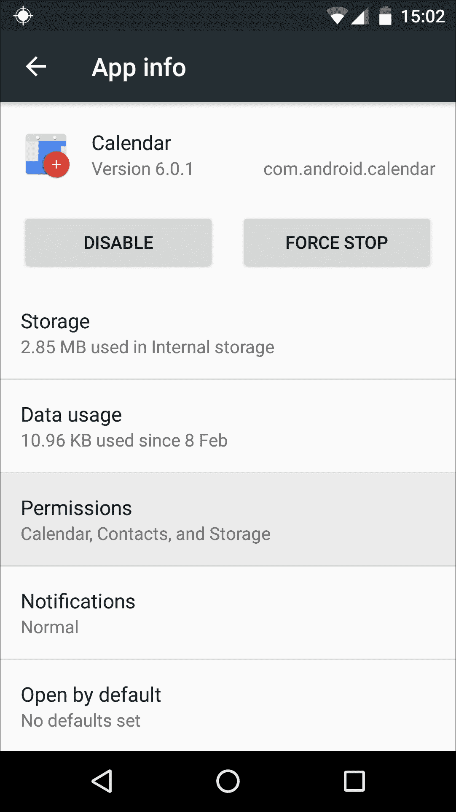
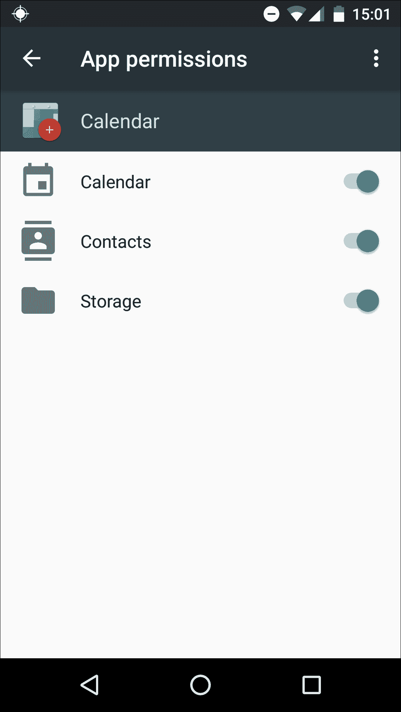

# 第十章。最佳实践和确保您的应用安全

Android 操作系统是在预期黑客尝试执行常见攻击的情况下设计的，例如试图欺骗用户交出个人信息或安装恶意软件的社会工程学攻击。

Android 内置的安全功能可以显著降低安全漏洞成功的可能性，并限制任何成功攻击的影响。

这些内置的安全控制默认为您的应用、您的用户和您的用户提供了一定程度的安全保护。尽管如此，遵循安全最佳实践对于进一步减少您的应用使用户容易受到漏洞、数据泄露和其他安全相关问题的攻击的风险至关重要。

在本章中，我们将探讨如何充分利用 Android 内置的安全功能。在本章的末尾，我还会讨论一些在之前的章节中没有详细介绍的最佳实践，包括如何设计更有效的通知，以及确保您的应用对所有用户都易于访问。

# 保护用户数据安全

对于典型的 Android 用户来说，最常见的安全问题是他们选择的安装的应用程序是否可以访问他们设备上存储的敏感数据。

如果您的应用可以访问用户的数据，那么您有责任确保这些数据保持安全。保护用户数据的一种最快、最简单的方法是仔细考虑您的应用是否真的需要访问这些数据。如果您首先就最小化应用可以访问的数据，那么您就最小化了应用意外泄露个人信息的风险。您还减少了攻击者试图利用您的应用程序以获取其有权访问的敏感数据的诱惑。您应该始终寻找在不要求应用直接访问敏感数据的情况下实现相同效果的方法。

在可能的情况下，不要在用户的设备上存储用户名或密码。相反，您的应用应使用用户提供的用户名和密码进行初始身份验证，然后切换到短期有效的、特定于服务的授权令牌。

为了帮助保护您的用户免受钓鱼攻击，您还应该尽量减少您的应用请求用户凭据的次数。这样，钓鱼攻击更有可能被用户视为可疑，因为您的应用请求敏感信息的行为与其常规行为不符。

### 注意

如果您的应用确实需要访问密码和用户名，请记住，您可能依法需要提供隐私政策，说明您的应用如何使用和存储这些数据。

## 连接到网络

网络事务固有的安全风险，尤其是移动用户更有可能连接到未加密的无线网络，如公共 Wi-Fi 热点。

每当您的应用程序连接到网络时，实施以下最佳实践至关重要，以帮助保护您的用户安全：

+   在可能的情况下使用`HTTPS`而不是`HTTP`。此外，永远不要自动信任从不受信任的协议（如`HTTP`）下载的任何数据。

+   使用`SSLSocket`类实现经过身份验证、加密的套接字级别通信。

+   当您处理敏感的 IPC 时，请使用 Android IPC 机制来验证连接到您的 IPC 的应用程序的标识，例如`Binder`、`Intent`、`BroadcastReceiver`或带有服务的`Messenger`。这比使用 localhost 网络端口更安全。

+   不要使用未经身份验证的短信数据执行敏感命令。短信默认既未加密也未进行强认证，因此容易在网络上被拦截。

+   当从网络服务器向您的应用程序发送数据消息时，您应该尽可能使用**Google Cloud Messaging API**和 IP 网络。

安卓 N 还引入了**网络安全配置文件**的概念，您可以使用它为您的应用程序创建自定义的网络安全设置，而无需修改实际的应用程序代码。您可以使用这个新的网络安全配置文件来：

+   指定哪些证书颁发机构被信任用于您的应用程序的安全连接

+   限制应用程序的安全连接到特定的、命名的证书

+   在您的应用程序中调试安全连接，而不会对已安装的基础设施造成额外风险

+   保护应用程序免受意外使用明文流量，这尤其是一个安全风险，因为它以人类可读的格式传输可能敏感的数据。

要创建一个网络安全配置文件，创建一个新的 XML 值资源文件，路径如下：

```java
res/xml/network_security_config.xml:
```

然后在您的项目清单中引用此文件：

```java
<?xml version="1.0" encoding="utf-8"?> 

... 

<app ...> 

   <meta-data android:name="android.security.net.config" 
              android:resource="@xml/network_security_config" /> 

... 

</app> 

```

简单网络配置文件的结构如下：

```java
<?xml version="1.0" encoding="utf-8"?> 
<network-security-config> 
   <base-config> 

//This is the default configuration used by all connections that are not covered by a specific domain-config// 

       <trust-anchors> 

<certificates src="img/trusted_cas"/> 

        //This is a reference to an XML file where you'd name any trusted Certificate Authorities//  

       </trust-anchors> 

   </base-config> 

   <domain-config> 

       <domain>mydomain.com</domain> 

... 
... 

 //This is where you'd create a configuration to use for connections to a specific destination, in this example that's www.mydomain.com//   

        </domain-config> 
</network-security-config>

```

# 请求权限

安卓设备功能强大——从拍照和录制视频，到提供导航、发布到社交媒体和发送短信。这意味着您的典型安卓设备可以访问大量的敏感信息。

好消息是，安卓做了很多工作来帮助保护这些信息的安全。该平台基于一个权限分离的系统，其中应用程序相互独立运行，并且与系统独立，在一个受限的沙箱中。这限制了每个应用程序可以访问的数据和功能。默认情况下，没有任何安卓应用程序有权限执行可能对操作系统、用户或其他应用程序产生不利影响的操作，这有助于防止恶意应用程序损坏数据或访问敏感信息。这些权限还限制了每个应用程序对基本沙箱之外提供的设备功能的访问，保护用户免受应用程序未经授权使用硬件（如访问设备的摄像头）或外部通信通道（如连接到互联网）的影响。

然而，你的应用可能需要访问用户的信息或设备功能，这是有合法理由的，例如需要访问联系人列表的短信应用或需要访问设备摄像头的视频录制应用。如果你的应用确实需要访问受保护的信息或功能，那么你需要提示用户进行访问。用户随后可以选择接受或拒绝这个权限请求。

最初，Android 应用在用户甚至可以从 Google Play 下载应用之前就请求所有可能需要的权限。如果用户不想授予应用一个或多个请求的权限，他们唯一的选项就是完全放弃安装，并寻找替代应用。

Android 6.0 完全重构了这一权限模型，用新的 **运行时权限** 取代了它。

从 Android 6.0 开始，应用在运行时逐个请求权限，当应用需要访问受保护的服务、数据或设备功能时，就会进行请求。

例如，假设你开发了一个支持传统文本笔记的应用，同时也为用户提供记录语音备忘录的选项。在 Android 6.0 之前，用户必须在安装时授予此应用访问麦克风的权限。然而，在新权限模型下，用户可以启动你的笔记应用并写下他们想要的任何文本备忘录，可能根本不需要应用请求访问麦克风。你的应用只有在用户第一次尝试记录语音备忘录时才会请求麦克风访问权限，因为这项权限是完成当前任务所必需的。

在 Android 6.0 及更高版本中，用户可以通过打开设备的 **设置** 并选择 **应用** 来手动更改应用的权限。此时，他们将看到设备上安装的所有应用的列表。他们可以从列表中选择任何应用，然后点击 **权限** 来查看该特定应用可以访问的所有权限类别。



用户可以通过将权限的滑块拖到 **关闭** 位置来撤销任何权限。



这种新的权限模型对用户和开发者都有许多好处：

+   用户不再需要在安装应用之前阅读权限列表，这使得安装过程更加流畅。

+   如果你发布的更新需要新的权限，之前用户必须接受这些权限才能安装更新。在 Android 6.0 及更高版本中，应用会自动更新，并且将在需要时（以及如果需要）提出任何与更新相关的新权限请求。

+   用户对每个应用可以访问的信息和功能有更多的控制权。新的权限模型给用户提供了拒绝单个权限请求的选项，这在之前的 Android 版本中是不可能的。例如，一个下载了图片编辑应用的用户可能会乐意授予该应用访问其图库的权限，但可能会更犹豫是否要授予该应用访问其设备相机的权限。在 Android 6.0 及更高版本之前，如果用户对某个特定的权限请求感到不舒服，他们可以自由地拒绝该应用访问其相机。

+   由于请求现在发生在用户尝试首次访问相关功能时，用户更有可能理解您的应用请求每个权限的原因。当用户理解了您的应用请求访问敏感信息或设备功能的原因时，他们更有可能批准这些请求。

## 新的权限模型 – 向后兼容性

在新的权限模型下，用户可以在任何时间撤销之前授予任何应用的任何权限，即使该应用针对 API 级别 22 或更低。这意味着您需要测试，如果用户拒绝了一个或多个权限请求，您的应用是否仍然可以正常工作——*无论*您的应用的 `targetSdkVersion` 值是多少。

初始时，如果您的应用运行在 Android 5.1（API 级别 22）或更低版本的设备上，或者您的应用的 `targetSdkVersion` 是 22 或更低，系统默认使用旧的权限模型，并在安装时提前请求所有权限。如果用户拒绝这些权限请求，则系统不会安装该应用。同样，如果您在应用更新的版本中添加了新的权限，系统将要求用户在安装更新之前授予这些新权限。

然而，用户仍然可以通过选择设备的**设置**，然后选择**应用**，并从列表中选择您的应用来手动撤销之前授予的权限。

如果您的应用针对 Android 平台的早期版本，并且您*尚未*考虑到新的权限模型，如果用户手动撤销了您应用的一个或多个权限，您的应用可能不再正常工作（或根本无法工作）。系统将警告用户，撤销针对早期版本 Android 的应用权限可能会导致相关应用停止工作，但用户仍然可以选择继续撤销这些权限，如果他们真的想这么做。

即使您的应用仅针对 Android 平台 6.0 之前的版本，您也不应仅仅假设可以忽略新的权限模型。您仍然应该旨在创建一个提供良好用户体验的应用，即使用户选择撤销其之前授予的一些（或全部）权限。

## 权限组

Android 的权限分为两类：

+   正常权限：

    这些权限使您的应用能够访问其沙盒之外的数据或资源，但几乎不会对用户的隐私、设备的操作或其他应用构成直接风险。

    如果您在`Manifest`中声明您的应用需要正常权限，系统将自动授予该权限。

+   危险权限：

    这些权限使您的应用能够访问可能对用户隐私构成风险的数据或资源，或者可能影响用户存储的数据、其他应用或设备的正常操作。例如，能够读取用户的联系人列表被视为危险权限。

    如果用户的设备运行 Android 6.0（API 级别 23）或更高版本，并且您的应用的`targetSdkVersion`为 23 或更高，那么危险权限仅在用户尝试执行需要此权限的操作时才会触发权限请求。例如，如果您的应用需要`READ_CONTACTS`权限，系统可能会在用户第一次尝试创建短信消息时请求该权限。

    如果您的应用运行在 Android 5.1 或更低版本的设备上，或者其`targetSdkVersion`为 22 或更低，Android 系统将在安装时要求用户授予所有危险权限。

除了*正常*和*危险*评级之外，Android 还将相关的权限分组。当您的应用请求访问一个权限时，用户将看到一个对话框，请求访问整个权限组。

如果您的应用请求一个危险权限，并且用户已经授予了该应用来自同一组的另一个危险权限，系统将自动授予该权限，无需用户提供任何额外输入。

这种方法帮助移动用户更明智地决定他们的设备哪些部分以及每个应用应该有权访问哪些信息，而不会因为技术信息过多或权限请求过多而使他们感到不知所措。

权限分为九组：

+   日历

+   摄像头

+   联系人

+   位置

+   麦克风

+   电话

+   人体传感器

+   短信

+   存储

## 声明权限

在您开发应用的过程中，每次您的应用需要访问它自己不创建的资源或信息，或者每次它尝试执行可能影响用户隐私、其他应用行为或设备整体的行为时，都要做笔记。大多数情况下，这些操作将需要您的应用请求权限。

要声明一个权限，打开您的项目`Manifest`，并将`<uses-permission>`元素作为顶级`<manifest>`元素的子元素添加：

```java
<manifest     

 package="com.me.app.myapp" > 

<uses-permission android:name="android.permission.ACCESS_FINE_LOCATION"/> 
       android:label="@string/permlab_fineLocation" 

//Provide a label for each permission your app requests, using android:label. This label is displayed to the user when they're viewing a list of permissions. Try to keep this label short - a few words will usually be sufficient//   

       android:description="@string/permdesc_fineLocation" 

//Describe what granting this permission request will allow your app to do, using the android:description attribute. Ideally, your descriptions will be two sentences long - the first should describe the permission that's being requested, and the second should warn the user about the dangers of granting this particular permission//   

       android:protectionLevel="dangerous" /> 

//Indicates the potential risk associated with this permission. The possible values are normal, dangerous, signature, and SignatureOrSystem//   
   ... 
</manifest> 

```

下面是这个权限的标签和描述字符串资源的可能样子：

```java
 <string name="permlab_fineLocation">Precise location (GPS and network-based)</string> 

   <string name="permdesc_fineLocation"> 
This app will be able to retrieve your precise location using the GPS or network location sources. Apps may consume additional battery power while using location services</string> 

```

### 验证权限

您的应用并不总是需要请求权限来访问受保护的信息或功能——如果您的应用当前可以访问麦克风，那么它就不需要请求此权限，例如。然而，由于运行 Android 6.0 及更高版本的用户的权限可以在任何时候被撤销，因此您的应用需要在每次需要根据相关权限采取行动时检查它是否当前有权访问受保护的信息或功能。即使用户之前已经授予了此权限，在 Android 6.0 及更高版本中，也无法保证用户在某个时间点没有手动撤销该权限。

要确定您的应用当前是否有权访问信息或功能，您需要调用`ContextCompat.checkSelfPermission()`方法。例如，以下代码片段展示了如何检查您的应用是否有权访问互联网：

```java
int permissionCheck = ContextCompat.checkSelfPermission(this,                Manifest.permission.INTERNET); 

```

### 注意

`ContextCompat.checkSelfPermission()`作为`support-v4 library`第 23 次修订的一部分提供，以实现向后兼容（[`developer.android.com/tools/support-library/features.html?utm_campaign=runtime-permissions-827&utm_source=dac&utm_medium=blog#v4`](http://developer.android.com/tools/support-library/features.html?utm_campaign=runtime-permissions-827&utm_source=dac&utm_medium=blog#v4)）。

如果您的应用当前有权访问请求的权限，`ContextCompat.checkSelfPermission`将返回`PackageManager.PERMISSION_GRANTED`，您的应用可以继续执行操作。如果用户没有授予您的应用此权限，或者他们授予了权限但在某个时间点撤销了它，此方法将返回`PackageManager.PERMISSION_DENIED`，您需要通过调用`requestPermission`方法之一来请求该权限：

```java
if (ContextCompat.checkSelfPermission(myActivity, 
               Manifest.permission.INTERNET) 

//Does this app have permission to access the Internet?//  

       != PackageManager.PERMISSION_GRANTED) { 
      if (ActivityCompat.shouldShowRequestPermissionRationale(myActivity, 
           Manifest.permission.INTERNET)) { 

//If shouldShowRequestPermissionRationale returns true, the app doesn't currently have this permission, and you'll need to request access//  
           .......... 
      .......... 

   } else { 

         ActivityCompat.requestPermissions(myActivity, 

//Request the permission. Note, when your app calls requestPermissions(),the system displays a standard dialogue that you cannot customize. If you want to provide some additional information, such as an explanation about why your app needs this permission, you must do so before calling requestPermissions()// 

               new String[]{Manifest.permission.INTERNET}, 
               MY_PERMISSIONS_REQUEST_INTERNET); 

   } 
} 

```

### 处理权限请求响应

当您的应用发起权限请求时，系统会向用户显示一个对话框。当用户做出回应时，系统会调用您的应用的`onRequestPermissionsResult()`方法，并将用户的响应传递给它。为了确定用户是否授予或拒绝权限请求，您的应用需要重写该方法：

```java
@Override 
public void onRequestPermissionsResult(int requestCode, 
       String permissions[], int[] grantResults) { 
//The Activity's onRequestPermissionsResult method is called and passes the user's response//  
   switch (requestCode) { 
       case MY_PERMISSIONS_REQUEST_INTERNET: { 
                    if (grantResults[0] == PackageManager.PERMISSION_GRANTED) { 
........ 
......... 
// If the user has granted the permission, this is where you'd perform your app's Internet-related tasks//  

           } else { 
.......   
....... 
// The user has denied the permission request. This is where you'd disable the functionality that depends on Internet access. Since denying a permission may prevent parts of your app from working correctly, you may also want to provide some feedback explaining what impact denying this permission will have on your app's functionality//   

           } 
           return; 
       } 

   } 
} 

```

## 权限和`<uses-feature>`

您的应用可能依赖于用户设备上存在某些硬件或软件功能，例如，您典型的相机应用几乎肯定需要带有相机硬件的设备。

为了防止用户在硬件或软件不支持的情况下安装您的应用，您需要在项目的`Manifest`文件中添加`<uses-feature>`声明：

```java
<uses-feature android:name="android.hardware.camera" /> 

```

然后，您指定您的应用是否需要此功能才能运行（`true`）或者是否更喜欢有此功能，但在必要时可以不使用它（`false`）：

```java
<uses-feature android:name="android.hardware.camera" 
             android:required="true"/> 

```

虽然 Android 系统不会检查您的`Manifest`中的`<uses-feature>`元素，但 Google Play 确实使用您的应用`<uses-feature>`元素来决定您的应用是否与用户的设备兼容。Google Play 不会允许安装任何它认为与用户设备硬件或软件不兼容的应用。

### 注意

如果您在`Manifest`中添加了`<uses-feature>`元素，但没有包含`android:required`属性，Google Play 将假设您的应用需要此功能（`android:required="true"`）。

理想情况下，您应该声明您项目中的所有硬件和软件要求，但为了以防万一您忘记提及一个或多个`<uses-feature>`元素，已经设置了一些安全措施。

Google Play 会检查您的应用中是否有任何隐式的硬件相关权限。如果发现，它将相应的硬件或软件功能添加到您的应用元数据中，并在决定每个潜在用户是否可以安装您的应用时考虑这些因素。

这确实有助于防止用户下载不兼容的应用，但也可能有些麻烦。想象一下，您的应用请求`android.permission.CAMERA`，但您没有在`Manifest`中包含`<uses-feature android:name="android.hardware.camera">`。在这种情况下，Google Play 将假设您的应用需要摄像头硬件才能运行，因此不会允许在没有任何摄像头的设备上安装您的应用。如果您的应用实际上不需要摄像头，这种误解可能会阻止具有完全兼容设备的用户安装您的应用。

为了防止这种误解，您需要打开您项目的`Manifest`并指定摄像头是首选的，但不是必需的：

```java
<uses-feature android:name="android.hardware.camera" android:required="false" /> 

```

要查看所有暗示功能要求的权限的完整列表，请查看官方 Android 文档（[`developer.android.com/guide/topics/manifest/uses-feature-element.html#permissions`](http://developer.android.com/guide/topics/manifest/uses-feature-element.html#permissions)）。

### 注意

声明`<uses-feature>`不会自动授予您的应用访问相关功能或信息的权限。您仍然需要像往常一样请求您的应用所需的每个权限。

## 应用权限的最佳实践

尽管这个新的运行时权限模型提供了许多功能，但它确实给开发者带来了一些新的挑战。首先，由于您的应用可以在任何时间请求权限，因此现在在准确的时间发出权限请求已成为用户体验的重要组成部分。

其次，由于用户现在可以拒绝单个权限，您需要确保无论用户是否选择拒绝您的应用的一个或多个权限请求，您的应用都能继续提供良好的体验。

### 注意

这并不意味着如果用户持续拒绝其请求，您的应用就必须运行。有可能拒绝某个权限会使您的应用完全无法执行其核心功能。然而，即使如此，您仍然可以通过让用户知道为什么您的应用突然停止工作来提供良好的用户体验。例如，每当用户尝试启动您的应用时，您可能显示一个对话框，列出应用为了运行所需的所有缺失权限，并给用户一个简单的方式来授予这些权限。

在本节中，我们将探讨所有关于权限的最佳实践，以便您能够更明智地决定您的应用请求哪些权限，以及它在何时何地发出这些请求。

### 尽可能少地请求权限

这是权限请求的金科玉律。

权限旨在保护用户和设备，因此您的应用应该*仅*请求它运行所需的权限。研究([`repository.cmu.edu/hcii/268`](http://repository.cmu.edu/hcii/268))表明，应用请求的权限数量和类型直接影响到用户行为。当面对具有相似功能的两款应用时，用户更有可能选择需要较少权限的那款。

如果您想触及尽可能广泛的受众，您需要限制您的应用所需的权限数量。在新的权限模型下，这一点尤为重要，因为请求是在用户与您的应用交互时提出的。想象一下，您在去一个重要会议的路上迷路了——您打开昨晚下载的地图应用，却发现每次尝试与应用交互时都会遇到权限请求。这可不是您在匆忙时想要的情况！很容易让忙碌的多任务处理型移动用户被过多的信息淹没。

如果您不确定，请记住，通过更新向应用添加权限比删除它们要容易得多——因此，采取少即是多的方法更安全。

### 小贴士

**自动权限调整**

Android 平台的新版本可能会带来新的限制，这可能导致您的应用需要请求之前不需要的权限。为了确保您的应用能够继续为运行最新 Android 版本的用户提供服务，系统可能会介入并自动将这些新的权限请求添加到您的项目的 `Manifest` 中。

当决定是否自动向您的应用添加权限时，Android 会查看您的应用的 `targetSdkVersion`。如果该值低于添加新权限的版本，系统可能会自动添加这些权限。这可能导致您的应用请求它并不一定需要的权限——这绝对不是好事！

为了避免这种情况，请将测试你的项目与 Android 平台的新版本对照作为优先事项，并在你确信你的应用与最新版本兼容后，立即更新你的`targetSdkVersion`。

### 提前请求关键权限

如果你的应用的核心功能依赖于访问某些权限，你应该提前请求这些关键权限。这是因为用户更有可能花时间阅读并因此**授予**在第一次启动你的应用时出现的权限对话框，而不是在应用中执行重要任务中途被中断时授予权限请求。

对于非关键权限，你应该等到用户尝试访问相关功能时，再在上下文中请求该权限。

### 在必要时提供额外信息

理想情况下，你的权限请求应该是自我解释的，**尤其是**在运行 Android 6.0 或更高版本的设备上，因为应用在上下文中请求权限。例如，如果用户点击你的应用的**为您的个人资料图片拍照**按钮，那么当你的应用请求访问他们的相机时，他们不太可能感到困惑。

然而，如果你怀疑为什么你的应用请求某个权限可能并不立即明显，那么你将希望向用户提供更多一些的信息。当用户理解为什么一个应用请求访问信息或功能时，他们通常会感到更加舒适。如果你**不**提供这些信息，那么你的用户可能会怀疑你故意让他们处于黑暗之中。

只要注意不要解释**一切**。你不需要为应用请求的每个权限都提供解释。如果你用过多的信息让用户感到困扰，他们可能会因为不断的打扰而感到沮丧，最终可能只是快速浏览你的解释（不好）或者完全跳过它们（更糟）。

如果你发现自己每次应用请求权限时都要提供解释，这可能表明你的应用在处理敏感数据或使用设备功能方面存在更深层次的问题。也许你的应用请求了过多的权限？或者它请求了一些与核心功能无关的杂项权限？

记住，权限请求对话框并不是与用户沟通的唯一方式。你可能需要考虑其他方式来向用户提供他们需要的信息，以更好地理解应用权限请求的上下文。例如，你可以：

+   将此信息添加到你的应用 Google Play 描述中。

+   制定一份隐私政策，概述你的应用需要访问的信息以及如何使用这些信息。

+   创建支持文档，以便用户在需要更多信息时可以查阅，例如在线用户手册或应用内的**帮助**部分。

+   更新你的用户界面，使权限请求更加直观。如果用户点击一个默认头像，你的应用突然请求访问他们的摄像头，他们可能会感到困惑，但如果默认照片上有“**点击这里拍摄个人照片**”的标签，那么你的用户就*不太可能*感到困惑。

+   为你的用户提供专门的客服渠道，例如论坛、社交媒体页面或一个电子邮箱地址，他们可以通过这些渠道向你提出任何疑问。

### 注意库所需的权限

当你在项目中包含一个库时，你的项目会继承该库请求的任何权限。在你使用*任何*库之前，始终检查该库需要的权限以及它使用这些权限的目的。

在不检查权限的情况下将多个库添加到你的项目中，可能会迅速让你陷入与用户的纠纷，因为从用户的角度来看，是你的应用在发起这些请求，而不是外部库。这些库甚至可能请求与你的应用看似完全不相关的权限，这可能会让用户更加怀疑。

如果你需要在项目中包含一个库，但又担心它需要太多的权限，那么你总是可以寻找提供类似功能但权限请求较少的替代库。

### 透明地访问摄像头和麦克风

有时你的应用可能需要访问特别敏感的功能，例如设备的摄像头或麦克风。大多数时候，你的应用不需要*持续*访问这些功能，但一旦用户已经授权你的应用访问，他们如何知道它不是在不断地从他们的麦克风和摄像头中提取信息？

没有人喜欢觉得自己被监视，所以你应该明确告知用户你的应用何时会访问设备的摄像头或麦克风。例如，你可以显示一个带有倒计时的弹出窗口，表明你的应用将在 3、2、1 后打开设备的摄像头，或者你可以在应用正在*监听*用户时，在屏幕角落显示一个闪烁的麦克风图标。

### 考虑替代方案

即使你的应用确实需要访问受保护的信息或功能，你可能能够设计你的应用，使其不需要自己发起这些请求。

应用只需要请求它直接执行的操作的权限 - *不是*当它请求其他应用代表它执行任务或提供信息时。例如，你不需要请求访问设备的摄像头，你可以使用`MediaStore.ACTION_IMAGE_CAPTURE`来启动用户已经在设备上安装的相机应用。你还可以使用系统意图从其他应用请求信息，例如从用户的联系人应用请求联系人信息，而不是发出`READ_CONTACTS`权限。

这种方法的缺点主要是每次您的应用需要访问受保护的信息或功能时都会向用户显示一个对话框，因此请考虑这些请求的频率或时间是否可能激怒您的用户。

# 通知

在 Android Lollipop 中，通知经历了大规模的改进，不仅获得了材料设计的外观，还引入了帮助 Android 更智能地排序通知的新方法。

在 Android 5.0 及更高版本中，您可以使用 `setPriority()` 方法注释您的通知。低优先级通知可能会从用户那里隐藏，而高优先级通知更有可能打断用户当前正在做的事情。

不同的优先级级别是：

+   `Notification.PRIORITY_MAX`: 用于关键和紧急通知，提醒用户注意时间敏感的情况，或者在他们继续当前任务之前可能需要解决的问题。

+   `Notification.PRIORITY_HIGH`: 通常用于重要的通讯，如聊天消息。高优先级通知会出现在包含操作按钮的浮动 *heads-up* 窗口中。操作按钮允许用户在无需离开当前屏幕的情况下对或忽略浮动的通知。

+   `Notification.PRIORITY_LOW`: 用于不那么紧急的通知。

+   `Notification.PRIORITY_MIN`: 用于上下文或背景信息。最低优先级的通知通常不会显示给用户，除非在特殊情况下，例如详细的通知日志。

+   `Notification.PRIORITY_DEFAULT`: 您可以使用此优先级标志为所有不属于更具体优先级类别的通知。

许多 Android 设备都配备了通知 LED，您可以使用它来通知用户应用内部正在发生的事件，即使屏幕处于关闭状态。将您应用的通知优先级设置为 `MAX`、`HIGH` 或 `DEFAULT` 应该会导致 LED 发光。

在 Android 5.0 及更高版本中，通知也会出现在设备的锁屏上，这意味着您需要考虑您的通知是否包含用户可能不希望在全世界的注视下出现在锁屏上的信息。

您可以使用 `setVisibility()` 来告诉 Android 应在锁屏上显示多少信息，并分配以下值之一：

+   `VISIBILITY_SECRET`: 通知的任何部分都不会出现在锁屏上。如果您应用的通知包含个人信息或可能令人尴尬的信息，则建议使用此选项。

+   `VISIBILITY_PRIVATE`: 通知在锁屏上显示一些基本信息，但大部分信息被隐藏。

+   `VISIBILITY_PUBLIC`: 通知完整地出现在锁屏上。

## 通知最佳实践

设计良好的通知，它们将为用户提供真正的价值——此外，它们还将作为吸引用户回到你应用的便捷方式，通过向他们展示关于应用程序内发生的事件的有趣和及时更新。

要充分利用 Android 的通知系统，你应该牢记以下最佳实践。

### 提供正确的内容

至少，你的通知应该包含：

+   一个标题（`setContentTitle`）和次要文本（`setContentText`）

+   一个时间戳；请注意，这表示事件发生的时间，而不是通知发布的时间

+   通知类型（可选）

为了确保用户可以在系统栏中识别出你的应用挂起的推送通知，你应该包含一个独特的应用图标（`setSmallIcon`）。

你的通知图标应该简单，避免任何过多的细节，但同时也必须引人注目，并且与其他用户可能遇到的推送通知图标明显不同。你应该使用 Material Light 操作栏图标样式，并避免不透明的背景——基本上，你的通知图标应该是一个白色透明背景的图片。

如果你感到缺乏灵感，试着启动你的 Android 设备，看看其他应用程序使用的推送通知图标类型。

### 谨慎使用通知

每次你发布一个通知时，你都在打断用户当时正在做的事情，因此你谨慎地使用通知非常重要。

你绝对不应该使用通知来提醒用户关于不需要他们输入或不是时间敏感的背景操作。你也不应该使用通知来提醒用户关于屏幕上已经发生的事件。相反，你应该通过你应用的 UI 在上下文中通知用户这些事件。例如，如果用户在你的游戏应用中解锁了新关卡，并且该应用当前在屏幕上，你应该通过屏幕上的消息提醒他们，而不是发送推送通知。

尽管通知可以用来提醒用户你的应用程序，但你绝对不应该使用不必要的通知来诱使用户打开你的应用。从长远来看，不重要或不想要的推送通知只会让用户认为你的应用是寻求注意，甚至可能导致他们卸载你的应用，并在 Google Play 上给你留下负面评价。

### 给用户选择权

理想情况下，你应该给用户选择更改你应用的通知设置，例如在声音警报和振动警报之间切换，甚至允许用户完全禁用通知。

### 对通知进行分类

在对通知进行排名和筛选时，Android 系统可能会考虑应用类别，因此你应该为每个应用的通知分配一个合适的类别。为此，使用`setCategory()`选项并从以下支持的类别中选择：

+   `CATEGORY_ALARM`：闹钟或定时器

+   `CATEGORY_CALL`： incoming voice or video call

+   `CATEGORY_EMAIL`：异步批量消息

+   `CATEGORY_ERROR`：后台操作中的错误

+   `CATEGORY_EVENT`：日历事件

+   `CATEGORY_MESSAGE`：传入的直接消息，例如短信

+   `CATEGORY_PROGRESS`：后台运行操作的进度

+   `CATEGORY_PROMO`：促销或广告

+   `CATEGORY_RECOMMENDATION`：一个具体、及时的推荐

+   `CATEGORY_SERVICE`：表示在后台运行的服务

+   `CATEGORY_SOCIAL`：社交网络或分享更新

+   `CATEGORY_STATUS`：关于设备或上下文状态的持续信息

+   `CATEGORY_SYSTEM`：此类别保留用于系统或设备状态更新

+   `CATEGORY_TRANSPORT`：媒体传输控制以进行播放

### 利用操作

你也可以向你的通知添加操作按钮。操作按钮允许用户从通知 UI 执行常见任务，而无需打开原始应用。

你可以使用以下语法向通知添加按钮：

```java
NotificationCompat.Builder nBuilder = new NotificationCompat.Builder(context) 
       .setContentTitle("This is a notification title")  

//Sets the notification's title// 

      .setContentText("This is the notification's body text.")  

//Sets the second line of the notification's text// 

            .addAction(R.drawable.accept, "Download", pIntent) 

//Adds a 'Download' action to this notification, complete with icon// 

      .addAction(R.drawable.cancel, "Cancel", pIntent); 

//Adds a 'Cancel' button, complete with icon - this time the R.drawable.cancel icon//  

```

### 小贴士

每个操作都应该有自己的图标和名称。

虽然是可选的，但通常给每个应用的通知至少添加一个操作是个好主意。只是不要过分——每个通知限制最多三个操作。

### 使用展开布局

对于运行 Android 4.1 及更高版本的用户，你可以为每个应用的通知提供两种不同的视觉风格：

+   **正常视图**：这是默认的紧凑布局。

+   **大视图风格**：当用户通过捏合或拖动打开通知时出现的单独布局。

你可以选择三种不同的大视图风格。

#### 大文本风格

此布局提供了在展开通知的详细区域显示的附加文本，代替通知的常规`setContentText`：

```java
.setStyle(new NotificationCompat.BigTextStyle() 
               .bigText("This text replaces the context text in the big view")) 

```

#### 大图风格

此布局包括一个大型图像附件：

```java
.setStyle(new Notification.BigPictureStyle() 
        .bigPicture(aBigImage)) 

```

#### 收件箱风格

此布局包括最多五个项目的列表：

```java
.setStyle(new Notification.InboxStyle() 
        .addLine(string1) 
        .addLine(string2) 
        .addLine(string3) 
        .setSummaryText("+2 more")) 

```

## 直接回复通知

Google 在即将发布的 Android *N* 版本中为通知添加了一些新功能，包括一个允许用户从通知 UI 直接回复的**内联回复**操作按钮。

直接回复通知对于消息应用来说尤其是个大新闻，因为它们使用户能够在甚至不需要启动消息应用的情况下进行回复。你可能已经在 Google Hangouts 中遇到了直接回复通知。

要创建一个支持直接回复的通知操作，你需要创建一个`RemoteInput.Builder`实例，并将其添加到你的通知操作中。

以下代码将一个`RemoteInput`添加到`Notification.Action`中，并创建了一个**快速回复**键。当用户触发操作时，通知会提示用户输入他们的回复：

```java
private static final String KEY_QUICK_REPLY = "key_quick_reply"; 
String replyLabel = getResources().getString(R.string.reply_label); 
RemoteInput remoteInput = new RemoteInput.Builder(KEY_QUICK_REPLY) 
       .setLabel(replyLabel) 
       .build(); 

```

要从通知界面检索用户的输入，你需要调用`getResultsFromIntent(Intent)`并将通知操作的 intent 作为输入参数传递：

```java
   Bundle remoteInput =
 RemoteInput.getResultsFromIntent(intent); 

//This method returns a Bundle that contains the text response// 

   if (remoteInput != null) { 
           return remoteInput.getCharSequence(KEY_QUICK_REPLY); 

//Query the bundle using the result key, which is provided to the RemoteInput.Builder constructor// 

```

## 组合通知

你早上第一件事就是连接到互联网，然后你的 Gmail 应用立刻用**4 条新消息**通知你，但不会给你关于这些个别电子邮件的任何更多信息，这不是特别有帮助！

当您收到一个由多个项目组成的通知时，您唯一能真正做的事情就是打开应用并查看构成这个分组通知的个别事件。

然而，即将发布的 Android N 版本承诺通过引入**捆绑通知**来解决这个问题。这种新的通知样式允许您将来自同一应用的多条通知组合成一个单一、捆绑的通知。捆绑通知由一个父通知组成，显示该组的摘要信息，以及个别通知项。

如果用户想了解更多关于这些个别项目的信息，他们可以通过用两根手指向下滑动来展开捆绑通知卡片，将其展开成单独的、更小的通知。当用户展开捆绑通知时，系统会显示每个子通知的更多信息。然后用户可以单独对每个这些迷你通知采取行动，例如他们可能会选择删除关于垃圾邮件的前三条通知，但打开第四封电子邮件。这与您可能在 Android Wear 中遇到的 Notification Stacks 功能类似。

### 注意

当您的应用有可能生成多个通知，并且每个子通知都是可操作的时候，捆绑通知特别有用。

要分组通知，为每个想要添加到同一通知堆栈的通知调用`setGroup()`，然后为这些通知分配相同的键：

```java
final static String GROUP_KEY_MESSAGES = "group_key_messages"; 
Notification notif = new NotificationCompat.Builder(mContext) 
        .setContentTitle("New SMS from " + sender1) 
        .setContentText(subject1) 
        .setSmallIcon(R.drawable.new_message) 
        .setGroup(GROUP_KEY_MESSAGES) 
        .build(); 

```

当您创建属于此堆栈的另一个通知时，只需为其分配相同的组键：

```java
Notification notif2 = new NotificationCompat.Builder(mContext) 
   .setContentTitle("New SMS from " + sender1) 
    .setContentText(subject2) 
     .setGroup(GROUP_KEY_MESSAGES) 
  .build(); 

```

# 应用小部件

小部件为用户提供应用最重要的数据的小型、便捷样本，通常从他们舒适的首页开始。

要创建一个基本的应用小部件，您需要完成以下章节中描述的过程。

## 在您的项目 Manifest 中声明 AppWidgetProvider 类

`AppWidgetProvider`类定义了允许您根据广播事件以编程方式与您的应用小部件交互的方法。

这里是一个基本的`AppWidgetProvider`实现的例子：

```java
<receiver android:name="MyAppWidgetProvider" > 

//Specifies the AppWidgetProvider that's used by this widget// 

   <intent-filter> 

       <action android:name="android.appwidget.action.APPWIDGET_UPDATE" /> 

//The <action> element specifies that this AppWidgetProvider accepts the ACTION_APPWIDGET_UPDATE. This is the only broadcast event you need to declare explicitly, as the AppWidgetManager class forwards all other app widget broadcasts to the AppWidgetProvider automatically// 

   </intent-filter> 

   <meta-data android:name="android.appwidget.provider" 

//Specifies the AppWidgetProviderInfo resource, which in this example is   
android.appwidget.provider// 

              android:resource="@xml/my_appwidget_info" /> 

//The <meta-data> element also requires an android:resource attribute, which specifies the location of the AppWidgetProviderInfo resource// 

</receiver> 

```

## 创建 AppWidgetProviderInfo 文件

下一步是定义您小部件的基本特性，例如其最小宽度和高度，以及更新的频率。如果您的项目还没有包含一个`res/xml`目录，请创建一个，然后创建一个新的 XML 布局文件。在这个例子中，我们使用`my_appwidget_info.xml`：

```java
<appwidget-provider  

   android:minWidth="50dp" 

   android:minHeight="50dp" 

//Specifies the minimum height and width the widget consumes by default// 

   android:updatePeriodMillis="80000000" 

//This is how often the app widget framework requests an update from the AppWidgetProvider. By default, if the device is asleep when the widget requests an update, the device will wake up in order to perform this operation. For the sake of the user's battery, don't set this value too low//  

   android:initialLayout="@layout/my_appwidget" 

//The layout resource where you'll define the widget's layout// 

   android:resizeMode="horizontal" 

//Specifies how the widget can be resized. The possible values are horizontal, vertical, and none. You can also combine these values, for example android:resizeMode="horizontal|vertical"// 

   android:widgetCategory="home_screen"> 

//Declares whether your widget can be displayed on the home screen (home_screen), the lockscreen (keyguard) or both. Only devices running lower than Android 5.0 support lockscreen widgets//  

</appwidget-provider> 

```

## 创建小部件的布局

您以创建常规布局资源文件相同的方式在 XML 中定义您的小部件布局。唯一的重大区别是，应用小部件布局基于`RemoteViews`，它不支持每个布局和视图。

因此，应用程序小部件仅支持以下布局类：

+   `FrameLayout`

+   `GridLayout`

+   `LinearLayout`

+   `RelativeLayout`

它们也仅支持以下小部件类：

+   `AdapterViewFlipper`

+   `AnalogClock`

+   `Button`

+   `Chronometer`

+   `GridView`

+   `ImageButton`

+   `ImageView`

+   `ListView`

+   `ProgressBar`

+   `StackView`

+   `TextView`

+   `ViewFlipper`

### 注意

`RemoteViews`也支持`ViewStubs`。

### 应用程序小部件最佳实践

设计良好的应用程序小部件，显示有用的信息，可以作为您应用程序出色的持续提醒，诱使用户启动您的应用程序——至少，这会使他们不太可能卸载您的应用程序。

为了确保您的小部件以最佳方式展示您的应用程序，请确保您遵守以下最佳实践。

#### 包括早期版本的 Android 的边距

您的小部件不应延伸到屏幕边缘或与其他小部件相撞，因为这会使用户的首页看起来杂乱无章。解决方案是在您的小部件的每个边缘添加边距，Android 4.0 及以上版本在用户将小部件放置在首页时自动执行此操作。要利用此行为，您只需将应用程序的`targetSdkVersion`设置为`14`或更高版本。

由于 Android 4.0 及以上版本会自动为您的应用程序应用边距，因此当您的应用程序安装在运行 Android 4.0 及以上版本的设备上时，您不应为小部件添加任何额外的边距。然而，当您的应用程序安装在运行 Android 早期版本的设备上时，您仍然需要添加边距。

解决方案是创建两个`dimens.xml`文件，分别指定不同版本的 Android 的不同边距：

+   `res/values-v14/dimens.xml`：此文件定义了运行 Android 4.0 及以上版本的设备的 0dp 边距：

```java
        <dimen name="widget_margins">0dp</dimen>
```

+   `res/values/dimens.xml`：此文件定义了运行 Android 4.0 以下版本的设备的边距：

```java
        <dimen name="widget_margins">10dp</dimen> 

```

然后，您可以在小部件的布局资源文件中引用这些`dimens.xml`值，Android 系统将在运行时选择适当的`widget_margins`值：

```java
android:padding="@dimen/widget_margins" 

```

#### 提供灵活的图形和布局

Android 首页分为一个网格。用户可以将应用程序小部件放置在空白单元格中，然后水平或垂直拉伸以占用不同数量的单元格。

为了确保您的小部件布局足够灵活，能够适应不同的网格大小，您应该使用可拉伸的九宫格图像定义您的小部件背景，然后使用灵活的布局，如`LinearLayout`、`RelativeLayout`或`FrameLayout`。

#### 不要更新得太频繁

如果当应用程序小部件框架请求从`AppWidgetProvider`更新时设备处于睡眠状态，设备将唤醒以执行此操作。请求过多的更新是耗尽用户电池的可靠方法，可能会导致他们卸载您的应用程序，或者至少将您的应用程序小部件从他们的首页上移除。

考虑你的小部件真正需要多久接收一次新信息是很重要的，例如，你通常需要比提醒用户关于即将到来的电子邮件的小部件更频繁地更新天气或新闻小部件。

如果你正在构建一个需要频繁更新的小部件，那么基于一个不会唤醒设备的警报来执行这些更新通常是一个好主意。如果这个警报在设备处于睡眠状态时响起，那么更新将不会在设备下一次唤醒时执行，因此对设备电池的影响较小。

要创建此类警报，请使用`AlarmManager`设置一个带有你的`AppWidgetProvider`接收的`Intent`的警报，然后将警报类型设置为`ELAPSED_REALTIME`或`RTC`，例如：

```java
alarmManager.setRepeating(AlarmManager.RTC... 

```

最后，将小部件的`updatePeriodMillis`设置为零，这样它就不会覆盖你的警报并唤醒设备。

# 可访问性最佳实践

只有当每个人都能导航、理解并成功使用你的应用时，你的应用才是真正可访问的，包括可能存在视觉、身体或年龄相关限制的人。

Android 有几个内置的可访问性功能，可以帮助你优化你的应用以适应有视觉或身体障碍的用户，所以好消息是，在大多数情况下，创建一个可访问的应用不需要对代码进行任何重大更改。

在本节中，我将向你展示如何使用这些内置平台功能确保每个人都能享受使用你的应用。

### 注意

如果你的应用是团队工作的一部分，那么确保你的团队中的每个人都考虑到可访问性是很重要的。如果你与设计师或测试团队一起工作，那么确保他们也熟悉以下可访问性指南是一个好主意。

## 向你的 UI 控件添加描述性文本

如果你已经很好地设计了你的 UI，那么你不需要为每个屏幕元素添加显式的标签，例如，一个电话图标在**联系人**应用中的按钮具有相当明显的用途。然而，有视觉障碍的用户可能无法捕捉到这些视觉线索，因此你需要为他们提供一些额外的信息。

你应该为每个没有可见文本的 UI 组件提供内容描述。同时考虑这些描述是否足以提供足够的上下文，让用户完全理解相关的视觉元素——在没有视觉上下文的情况下，**删除**或**呼叫所选联系人**的内容描述可能并不特别有帮助。

描述属性中的文本不会显示在屏幕上，但如果用户启用了基于语音的可访问性服务，如 TalkBack，当用户导航到该项目时，此描述会被读出来。

你可以使用`android:contentDescription` XML 布局属性来添加描述：

```java
<ImageButton 
   android:id="@+id/newSMS" 
   android:src="img/newSMS" 
   android:contentDescription="@string/newSMS"/> 

```

假设`@string/newSMS`的值为`Create a new SMS message`。当用户在有辅助服务启用的状态下悬停在图标上时，此描述将被读出，用户将了解这个 UI 元素的功能。

### 注意

对于`EditText`，您的首要任务是帮助用户理解他们需要输入到这个空白字段中的内容，因此您应该提供一个`android:hint`属性*而不是*内容描述。一旦用户在`EditText`中输入了一些文本，辅助服务将朗读此文本，而不是`android:hint`的值。

在某些情况下，您可能希望将项目的内容描述基于动态元素，例如滑块的状态或列表中当前选中的文本。如果是这种情况，那么您需要使用`setContentDescription()`方法在运行时编辑内容描述。

对于`ImageButton`、`ImageView`和`Checkbox`组件，提供描述尤为重要，但您应该在您怀疑不同能力的用户可能从一些额外信息中受益的地方添加内容描述。只是不要过分，不要添加不必要的描述，因为这只会增加用户在尝试解析您的 UI 时遇到的噪音，使他们在辅助服务中提取有用信息变得更加困难。

在可能的情况下，使用 Android 的标准控件，因为它们默认内置了`ContentDescriptions`，因此可以自动与 TalkBack 等辅助服务一起工作。

## 设计焦点导航

焦点导航是指用户使用方向控制器来导航构成应用 UI 的各个元素，类似于电视上的四向遥控器导航。视力受限或手动灵活性有限的用户通常使用这种导航模式而不是触摸屏导航。

方向控制器可以是基于软件的或基于硬件的，例如轨迹球、D-pad 或外部键盘。用户还可以选择启用在运行 Android 4.1 及以上版本的设备中可用的手势导航模式。

为了确保用户能够使用方向控制器成功导航您的应用，您需要验证所有 UI 输入控件是否可以在不使用触摸屏的情况下访问和激活。您还应该验证点击方向控制器的中心或**OK**按钮与触摸已获得焦点的控件具有相同的效果。

为了支持焦点导航，您应该确保所有应用导航元素都是可聚焦的。您可以通过添加`android:focusable="true"`属性到 UI 元素中来实现这一点，或者在每个 UI 控件上使用`View.setFocusable()`方法在运行时进行此修改。

Android 框架提供的 UI 控件默认是可聚焦的，系统通过改变控件的外观来视觉上指示焦点。

当用户使用方向控制向任何方向导航时，焦点会从一个 UI 元素传递到另一个 UI 元素，这是由焦点顺序决定的。系统根据在给定方向上找到最近邻的算法自动确定焦点顺序。

然而，有时结果可能并不完全符合您的预期，或者它们可能无法为用户提供最佳体验。如果是这种情况，Android 提供了四个可选的 XML 属性，您可以使用这些属性来覆盖此自动焦点顺序，并确切指定当用户向该方向导航时哪个视图将接收焦点：

+   `android:nextFocusUp`：定义当用户向上导航时将接收焦点的下一个视图

+   `android:nextFocusDown`：定义当用户向下导航时将接收焦点的下一个视图

+   `android:nextFocusLeft`：定义当用户向左导航时将接收焦点的下一个视图

+   `android:nextFocusRight`：定义当用户向右导航时将接收焦点的下一个视图

以下示例 XML 展示了两个可聚焦的 UI 元素，其中已显式设置了 `android:nextFocusDown` 和 `android:nextFocusUp` 属性。`Button` 元素位于 `TextView` 的右侧，然而，多亏了 `nextFocus` 属性的魔力，当焦点在 `TextView` 上时，用户可以通过按向下箭头键来访问 `Button` 元素：

```java
   <TextView android:id="@+id/text" 
      android:text="Hello, world" 
        android:focusable="true" 
       android:nextFocusDown="@+id/Button" 
       ... /> 
   <Button android:id="@+id/button" 
       android:focusable="true" 

       android:nextFocusUp="@id/text" 
       ... /> 

```

测试您导航的最简单方法是在模拟器中运行您的应用，并使用模拟器的箭头键和 **OK** 按钮仅进行导航。检查导航是否在所有方向上按预期工作，包括在反向导航时。

### 注意

您还可以在运行时修改 UI 组件的焦点顺序，使用例如 `setNextFocusDownId()` 和 `setNextFocusRightId()` 等方法。

## 自定义视图控件

如果您构建自定义界面控件，请确保您为这些自定义视图实现了可访问性接口，并提供了内容描述。

### 注意

如果您希望您的自定义控件与所有版本的 Android（回溯到 1.6）兼容，您需要使用 Support Library 来实现最新的可访问性功能。

在创建自定义视图时，您需要确保这些视图在用户选择项目或更改焦点时成功创建 `AccessibilityEvents`，因为可访问性事件是提供如文本到语音等可访问性功能的重要部分。

要生成 `AccessibilityEvents`，请调用 `sendAccessibilityEvent(int)` 并使用表示已发生事件类型的参数。您可以在 `AccessibilityEvent` 参考文档中找到 Android 当前支持的事件类型的完整列表（[`developer.android.com/reference/android/view/accessibility/AccessibilityEvent.html`](http://developer.android.com/reference/android/view/accessibility/AccessibilityEvent.html)）。

### 提供音频提示的替代方案

为了帮助听力受损的用户，您应该避免在您的应用中包含任何仅音频的反馈。您应该始终使用辅助反馈机制，例如字幕、文本记录、屏幕通知或另一种视觉替代方案来伴随您应用中的音频反馈。

## 测试各种字体大小

安卓用户可以手动更改其设备上显示的字体大小，从设备的**设置 | 可访问性**屏幕中进行。为了确保这些大小更改也会影响您应用内的文本，请使用缩放像素（`sp`）定义您应用中的文本和相关容器。

此外，请记住，当用户启用大字体时，您应用中的文本可能比您最初分配的空间要大，因此您需要检查在用户启用大文本时，您的文本和 UI 看起来良好且功能正常。特别是，请确保您的 UI 元素不会重叠，并且所有可触摸元素在各个文本大小下都保持可触及。

## 使用推荐的触摸目标大小

确保您应用的所有触摸目标至少为 48 x 48dp，并确保屏幕元素之间的空间始终至少为 8dp。这有助于确保您的 UI 对有手动灵活性挑战的人以及正在发展运动技能的儿童来说更容易导航。

## 提供对超时辅助功能的替代方案

一些应用具有在一段时间后消失的图标或控件，例如，视频播放控件在用户观看视频几秒钟后通常会淡出。

这对使用如 TalkBack 等可访问性功能的人构成了问题，因为 TalkBack 会在读取控件描述之前等待用户将焦点放在控件上。如果您的 UI 有快速淡出的控件，这些控件实际上可能在用户有机会聚焦之前就消失了——这意味着它们永远不会被读出，因此用户不会意识到它们的存在。

因此，您不应依赖于超时控件来完成高优先级任务或重要功能。如果您的 UI 确实具有超时控件，您可能希望在可访问性服务启用时禁用此功能，这样这些超时控件就不会消失。

为了确保有视觉障碍的用户可以更容易地阅读您的文本，建议您在应用背景和文本之间使用 4.5:1 的对比度比。一般来说，文本越小，您需要使用的对比度就越大。

此外，请记住，您的某些用户可能患有色盲，因此您不应仅使用颜色信号作为传达重要信息的唯一手段。除了颜色之外，您还可以使用图案、形状、大小、纹理或文本等元素。

# 测试您应用的可访问性功能

测试是创建可访问应用的关键部分，因为它可以揭示您可能没有注意到的用户交互问题。

测试您的应用的可访问性功能通常涉及：

+   使用启用了声音反馈的应用：

    可听可访问性服务提供音频提示，将屏幕内容读给用户听，当他们移动到您的 UI 上时。测试您为视障用户提供体验的最有效方式是在您的 Android 设备上启用可听可访问性服务，然后仅使用声音与您的应用进行交互。

    对于 Android 用户，反馈通常通过 TalkBack 可访问性服务提供。TalkBack 预安装在许多 Android 设备上（打开您的设备的**设置**并选择**辅助功能**，然后选择**TalkBack**），但您也可以从 Google Play 免费下载 TalkBack。

    一旦您启用了可听可访问性服务，花些时间仅使用语音反馈在您的应用中导航。寻找任何可以改善可能在没有视觉辅助的情况下与您的应用交互的用户体验的机会。

    您还应该检查您的应用是否提供了足够的信息，以便用户可以使用 TalkBack 等服务理解并采取行动，而不会因信息过多而感到负担。这可能会是一个棘手的平衡行为——过多或过少的信息都会使用户难以理解您的 UI。

+   仅使用方向控制导航您的应用，而不是触摸屏

作为可访问性测试的一部分，您应该验证您的应用仅使用方向控制即可轻松导航，这意味着不使用触摸屏，并确保用户可以在您的应用 UI 元素之间以有意义的方式移动焦点。

如果可用，您可以使用带有 D-pad 或轨迹球的物理设备，但如果您的设备没有这些硬件功能，您可以使用基于软件的方向控制器，或者使用 Android 模拟器和其模拟键盘控制。您甚至可能想使用 TalkBack 手势（[`support.google.com/accessibility/android/answer/6151827`](https://support.google.com/accessibility/android/answer/6151827)），这允许用户使用非常具体的手势来导航应用（以及他们的设备）。

# 摘要

在本章的最后，我们介绍了一些在前面章节中没有详细探讨的最佳实践，包括应用安全和可访问性最佳实践。您还学习了如何创建更有用的通知，并开始探索 Android N 中即将推出的新通知选项。

如果你想要了解更多关于开发有效的 Android 应用的信息，你可以在 Android 文档中找到大量额外的信息（[`developer.android.com/training/index.html`](http://developer.android.com/training/index.html)），在 Android 博客上（[`android-developers.blogspot.co.uk/`](http://android-developers.blogspot.co.uk/)），或者通过查看一些 Google 的代码示例（[`developer.android.com/samples/index.html`](http://developer.android.com/samples/index.html)）。
